# 第一章 环境配置与介绍

## 1.1课程简介 

欢迎来到 Hugging Face 课程！本小节将指导你搭建工作环境。如果你刚开始学习本课程，我们建议你先阅读第一章，然后返回此处搭建环境，以便你亲自尝试和实现代码。

本书涉及的所有库均以 Python 包形式提供，因此在这里我们将展示如何搭建 Python 环境并安装所需要的库。

我们将介绍两种设置工作环境的方法，使用 Colab Notebook 或 Python 虚拟环境。选择任意一种趁手的方式即可。对于初学者，我们强烈建议你从使用 Colab Notebook 开始（国内无法访问，可以跳过，直接查阅本章 **安装依赖** 那一节即可在本地的环境下运行）。

请注意，Python 虚拟环境的一些命令不支持 Windows 系统。如果你使用的操作系统是 Windows，我们建议你继续使用 Colab Notebook 如果你使用的操作系统是 Linux 发行版或 macOS，则可以使用此处的任一方法。

大多数课程和服务都依赖于你拥有 Hugging Face 帐户。我们建议现在创建一个： [创建一个账号](https://huggingface.co/join)(https://huggingface.co/join) 。

### 使用 Google Colab Notebook

使用 Colab Notebook 是最简单的搭建方式；可以在浏览器中启动 Notebook 并直接开始编写自己的代码！

如果你不熟悉 Colab，建议你先查看 [Colab 使用入门](https://colab.research.google.com/notebooks/intro.ipynb)(https://colab.research.google.com/notebooks/intro.ipynb) 。Colab 提供一些加速硬件，例如 GPU 或 TPU，并且当我们使用的算力比较少的时候是免费的。

当打开 Colab 后，创建一个新的 Notebook 


下一步是安装我们将在本课程中使用的库。我们将使用 **pip** 进行安装，它是 Python 的包管理器。在 Notebook 中，你可以通过加上！字符表示执行系统命令，所以安装Transformers 的命令如下：

```python
!pip install transformers
```

你可以通过在运行 Python 时导入包来判断是否正确安装了该包：

```python
import transformers
```


这将安装一个没有安装机器学习框架（如 PyTorch 或 TensorFlow）非常轻量级的 Transformers。由于之后我们将使用该库的许多不同功能，我们建议安装开发版本，它带有几乎所有所需的依赖项：

```python
!pip install transformers[sentencepiece]
```

这将需要一些时间，但当完成之后你就做好学习剩下的课程环境的全部准备了！

### 使用 Python 虚拟环境 

如果你更喜欢使用 Python 虚拟环境，那么第一步是在你的系统上安装 Python。我们建议你按照 [该指南](https://realpython.com/installing-python/)(https://realpython.com/installing-python/) 进行配置。

安装 Python 后，你应该能够在终端中运行 Python 命令。你可以先运行此命令： `python --version` 来检验安装是否正确，然后再继续下一步。这应该会打印出你系统上现在可用的 Python 版本。

在终端中运行 Python 命令（例如  `python --version` ）时，运行命令的这个 Python 可以视为系统上的“默认”Python。我们建议保持这个默认的 Python 安装程序没有任何包，当运行某个程序的时候就为那个程序创建一个单独的运行环境 —— 这样，每个应用程序都可以有自己的依赖项和包，你无需担心与其他应用程序潜在的兼容性问题。

在 Python 中，这是通过 [虚拟环境](https://docs.python.org/3/tutorial/venv.html)(https://docs.python.org/3/tutorial/venv.html) 实现的，虚拟环境会创建许多目录树，每个目录树都包含具有特定 Python 版本的 Python 安装以及应用程序所需的所有包。可以使用许多不同的工具来创建这样的虚拟环境，但在此我们将使用官方 Python 包： [`venv`](https://docs.python.org/3/library/venv.html#module-venv)(https://docs.python.org/3/library/venv.html#module-venv) 。

首先，创建你希望 Transformers 所在的目录 - 例如，你可能希望在主目录的根目录下创建一个名为 `Transformers-course` 的新目录：

```python
mkdir ~/transformers-course
cd ~/transformers-course
```

在这个目录中，使用 Python `venv` 模块创建一个虚拟环境：

```python
python -m venv .env
```

你现在应该在原本为空的文件夹中看到一个名为 `.env` 的目录：

```python
ls -a
```

```python
.      ..    .env
```

你可以使用 `activate` 和 `deactivate` 命令来控制进入和退出你的虚拟环境：

```python
# 激活虚拟环境
source .env/bin/activate

# 退出虚拟环境
source .env/bin/deactivate
```

你可以通过运行 `which python` 命令来检测虚拟环境是否被激活：如果它指向虚拟环境，那么你已经成功激活了它！

```python
which python
```

```python
/home/<user>/transformers-course/.env/bin/python
```

#### 安装依赖 

与前面使用 Google Colab 的部分一样，你现在需要安装继续学习所需的软件包。同样，你可以使用 `pip` 包管理器安装 Transformers 的开发版本：

```python
pip install "transformers[sentencepiece]"
```

你现在已准备就绪，可以开始了！

# 第二章 Transformer模型

## 欢迎来到Hugging Face 课程

本书将教你如何使用 Hugging Face 生态系统的库进行自然语言处理（NLP）。这些库包括 Transformers、Datasets、Tokenizers 和 Accelerate，以及 Hugging Face Hub。

### 有什么是值得期待的？

以下是对本书教程内容的简要概述：


- 第 1 章到第 4 章介绍了 Transformers 库的主要概念。在本课程的这一部分结束时，你将了解 Transformer 模型的工作原理，并将了解如何使用 [Hugging Face Hub](https://huggingface.co/models)(https://huggingface.co/models) 中的模型，在数据集上对其进行微调，并在 Hub 上分享你的结果。
- 第 5 章到第 8 章在深入研究经典 NLP 任务之前，教授 Datasets 和 Tokenizers 的基础知识。在本部分结束时，你将能够自己解决最常见的 NLP 问题。
- 第 9 章介绍了如何为你的机器学习构建**交互式演示**模型，并将其优化为你自己的可分享的模型演示生产环境。

本教程：

* 需要良好的 Python 知识 
* 在完成入门深度学习课程后效果更佳，例如 [DeepLearning.AI](https://www.deeplearning.ai/)(https://www.deeplearning.ai/) 提供的 [fast.ai实用深度学习教程](https://course.fast.ai/)(https://course.fast.ai/) 
* 不需要事先具备 [PyTorch](https://pytorch.org/)(https://pytorch.org/) 或 [TensorFlow](https://www.tensorflow.org/)(https://www.tensorflow.org/) 知识，虽然熟悉其中任何一个都会对学习有所帮助

完成本书的学习后，我们建议你查看 [DeepLearning.AI的自然语言处理系列课程](https://www.coursera.org/specializations/natural-language-processing?utm_source=deeplearning-ai&utm_medium=institutions&utm_campaign=20211011-nlp-2-hugging_face-page-nlp-refresh)(https://www.coursera.org/specializations/natural-language-processing?utm_source=deeplearning-ai&utm_medium=institutions&utm_campaign=20211011-nlp-2-hugging_face-page-nlp-refresh) ，该课程涵盖了诸如朴素贝叶斯和 LSTM 等传统 NLP 模型的广泛内容，非常值得了解！

### FAQ

这里有一些经常被提到的问题：

- **我应该在这门课程上花多少时间？**
本课程的每一章都设计为在 1 周内完成，每周大约需要 6-8 小时的学习时间。但你可以根据自己的需要随意安排学习时间。

- **我在哪里可以获得课程的代码？**
本书所有代码的 Jupyter 笔记本托管在 [`huggingface/notebooks`](https://github.com/huggingface/notebooks)(https://github.com/huggingface/notebooks) 仓库中。如果你希望在本地生成它们，请查看 GitHub 上 [`course`](https://github.com/huggingface/course#-jupyter-notebooks)(https://github.com/huggingface/course#-jupyter-notebooks) 仓库中的说明。

- **如果我有问题，我可以在哪里提问？**
如果你对本书的任何部分有疑问，可以前往 [Hugging Face 论坛](https:// discuss.huggingface.co/)(https:// discuss.huggingface.co/) ：

### 让我们开始吧！

你准备好了吗？在本章中，你将学习：

* 如何使用 `pipeline()` 函数解决文本生成、分类等 NLP 任务
* 关于 Transformer 架构
* 如何区分编码器、解码器和编码器-解码器架构和用例 

## 2.1 自然语言处理概述

在深入了解 Transformer 模型之前，让我们快速回顾一下自然语言处理是什么以及它为什么如此重要。

### 什么是自然语言处理？ 

NLP 是语言学和机器学习交叉领域，专注于理解与人类语言相关的一切。NLP 任务的目标不仅是单独理解单个单词，而且是能够理解这些单词的上下文。

以下是常见 NLP 任务的列表，每个任务都有一些示例：

- **对整个句子进行分类**：获取评论的情感，检测电子邮件是否为垃圾邮件，确定句子在语法上是否正确或两个句子在逻辑上是否相关。
- **对句子中的每个词进行分类**：识别句子的语法成分（名词、动词、形容词）或命名实体（人、地点、组织）。
- **生成文本内容**：用自动生成的文本完成提示，用掩码词填充文本中的空白。
- **从文本中提取答案**：给定问题和上下文，根据上下文中提供的信息提取问题的答案。
- **从输入文本生成新句子**：将文本翻译成另一种语言，对文本进行总结。

NLP 不仅限于书面文本。它还解决了语音识别和计算机视觉中的复杂挑战，例如生成音频样本的转录或图像的描述。

### 为什么具有挑战性？

计算机处理信息的方式与人类不同。例如，当我们读到“我饿了”这句话时，我们很容易理解它的意思。同样，给定两个句子，例如“我很饿”和“我很伤心”，我们可以轻松确定它们的相似程度。对于机器学习 （ML） 模型，此类任务更加困难。文本需要以一种使模型能够从中学习的方式进行处理。而且由于语言的复杂性，我们很难直接设计算法来处理此类问题。已经有很多关于如何表示文本的研究，我们将在下一章中介绍一些方法。

## 2.2 Transformers 可以做什么？

在本节中，我们将看看 Transformer 模型可以做什么，并使用 Transformers 库中的第一个工具： `pipeline()` 函数。

### Transformers 无处不在！

Transformer 模型用于解决各种 NLP 任务，就像上一节中提到的那样。以下是一些使用 Hugging Face 和 Transformer 模型的公司和组织，他们也通过分享他们的模型回馈社区：


 [Transformers 库](https://github.com/huggingface/transformers)(https://github.com/huggingface/transformers) 提供了创建和使用这些共享模型的功能。 [模型中心（hub）](https://huggingface.co/models)(https://huggingface.co/models)(https://huggingface.co/models)(https://huggingface.co/models) 包含数千个任何人都可以下载和使用的预训练模型。你还可以将自己的模型上传到 Hub！

<div custom-style="Tip-yellow">

⚠️ Hugging Face Hub 不限于 Transformer 模型。任何人都可以分享他们想要的任何类型的模型或数据集！创建一个 [Huggingface.co 帐户](https://huggingface.co/join)(https://huggingface.co/join) 即可使用所有可用功能！

</div>

在深入研究 Transformer 模型的底层工作原理之前，让我们先看几个示例，看看它们如何用于解决一些有趣的 NLP 问题。

### 使用 pipelines 

Transformers 库中最基本的对象是 `pipeline()` 函数。它将模型与所需的预处理和后处理步骤连接起来，使我们能够通过直接输入任何文本并获得最终的结果：

```python
from transformers import pipeline

classifier = pipeline("sentiment-analysis")
classifier("I've been waiting for a HuggingFace course my whole life.")
```

```python
[{'label': 'POSITIVE', 'score': 0.9598047137260437}]
```

我们也可以多传几句！
```python
classifier(
    ["I've been waiting for a HuggingFace course my whole life.", "I hate this so much!"]
)
```

```python
[{'label': 'POSITIVE', 'score': 0.9598047137260437},
 {'label': 'NEGATIVE', 'score': 0.9994558095932007}]
```

默认情况下，此 pipeline 选择一个特定的预训练模型，该模型已针对英语情感分析进行了微调。创建 `classifier` 对象时，模型将被下载和缓存。如果你重新运行该命令，则将使用缓存的模型，而无需再次下载模型。

将一些文本传递到 pipeline 时涉及三个主要步骤：

1. 文本被预处理为模型可以理解的格式。
2.  将预处理后的输入传递给模型。
3. 对模型的预测进行后续处理并输出最终人类可以理解的结果。

目前 [可用的一些pipeline](https://huggingface.co/transformers/main_classes/pipelines.html)(https://huggingface.co/transformers/main_classes/pipelines.html) 有：

* `eature-extraction` （获取文本的向量表示）
* `fill-mask` （完形填空）
* `ner` （命名实体识别）
* `question-answering` （问答）
* `sentiment-analysis` （情感分析）
* `summarization` （提取摘要）
* `text-generation` （文本生成）
* `translation` （翻译）
* `zero-shot-classification` （零样本分类）

让我们来看看其中的一些例子吧！

### 零样本分类 

我们将从一个具挑战性的任务开始，我们需要对没有标签的文本进行分类。这是实际项目中的常见场景，因为给文本打标签通常很耗时并且需要领域专业知识。对于这项任务 `zero-shot-classification` pipeline 非常强大：它允许你直接指定用于分类的标签，因此你不必依赖预训练模型的标签。下面的模型展示了如何使用这三个标签将句子分类为 `education（教育）` 、 `politics（政治）` 、或者 `business（商业）` ——也可以使用你喜欢的任何其他标签集对文本进行分类。

```python
from transformers import pipeline

classifier = pipeline("zero-shot-classification")
classifier(
    "This is a course about the Transformers library",
    candidate_labels=["education", "politics", "business"],
)
```

```python
{'sequence': 'This is a course about the Transformers library',
 'labels': ['education', 'business', 'politics'],
 'scores': [0.8445963859558105, 0.111976258456707, 0.043427448719739914]}
```

这个 pipeline 称为 `zero-shot` （零样本学习），因为你不需要对数据上的模型进行微调即可使用它。它可以直接返回你想要的任何标签列表的概率分数！

<div custom-style="Tip-green">


✏️**快来试试吧！**使用你自己的序列和标签，看看模型的表现如何。

</div>

### 文本生成 

让我们尝试一下另一个 pipeline，这次是用于生成文本的 `text-generation` 。这里的主要使用方法是你提供一个提示，模型将通过生成剩余的文本来自动完成整段话。这类似于许多手机上的预测文本功能。文本生成涉及随机性，因此如果你没有得到相同的如下所示的结果是正常的。

```python
from transformers import pipeline

generator = pipeline("text-generation")
generator("In this course, we will teach you how to")
```

```python
[{'generated_text': 'In this course, we will teach you how to understand and use '
                    'data flow and data interchange when handling user data. We '
                    'will be working with one or more of the most commonly used '
                    'data flows — data flows of various types, as seen by the '
                    'HTTP'}]
```

你可以使用参数 `num_return_sequences` 控制生成多少个不同的候选的句子，并使用参数 `max_length` 控制输出文本的总长度。

<div custom-style="Tip-green">


✏️**快来试试吧！**使用 `num_return_sequences` 和 `max_length` 参数生成两个句子，每个句子 15 个单词。

</div>

### 在 pipeline 中使用 Hub 中的其他模型 

前面的示例使用了默认模型，但你也可以从 Hub 中选择一个特定模型，将其用于特定任务，例如文本生成。转到 [模型中心（hub）](https://huggingface.co/models)(https://huggingface.co/models)(https://huggingface.co/models)(https://huggingface.co/models) 并单击左侧的相应标签将会只显示该任务支持的模型。你应该看到一个 [模型筛选](https://huggingface.co/models?pipeline_tag=text-generation)(https://huggingface.co/models?pipeline_tag=text-generation) 的页面。

让我们试试 [`distilgpt2`](https://huggingface.co/distilgpt2)(https://huggingface.co/distilgpt2) 模型吧！以下面是在之前的 pipeline 中加载它的方法：

```python
from transformers import pipeline

generator = pipeline("text-generation", model="distilgpt2")
generator(
    "In this course, we will teach you how to",
    max_length=30,
    num_return_sequences=2,
)
```

```python
[{'generated_text': 'In this course, we will teach you how to manipulate the world and '
                    'move your mental and physical capabilities to your advantage.'},
 {'generated_text': 'In this course, we will teach you how to become an expert and '
                    'practice realtime, and with a hands on experience on both real '
                    'time and real'}]
```

你可以通过单击语言标签来筛选搜索结果，然后选择另一种文本生成模型的模型。模型中心（hub）也包含了支持多种语言的多语言模型。

通过单击选择模型后，你会看到有一个小组件，可让你直接在线试用。通过这种方式，你可以在下载之前快速测试模型的功能。

<div custom-style="Tip-green">

✏️**快来试试吧！**使用标签筛选查找另一种语言的文本生成模型。使用小组件测试并在 pipeline 中使用它！

</div>

### 推理 API 

所有模型都可以使用 Inference API 直接通过浏览器进行测试，该 API 可在 [Hugging Face 网站](https://huggingface.co/)(https://huggingface.co/) 上找到。通过输入自定义文本并观察模型的输出，你可以直接在此页面上使用模型。

小组件形式的推理 API 也可作为付费产品使用，如果你的工作流程需要它，它会派上用场。有关更多详细信息，请参阅 [定价页面](https://huggingface.co/pricing)(https://huggingface.co/pricing) 。

### 完形填空 

你将尝试的下一个 pipeline 是 `fill-mask` 。此任务的想法是填补给定文本中的空白：

```python
from transformers import pipeline

unmasker = pipeline("fill-mask")
unmasker("This course will teach you all about <mask> models.", top_k=2)
```

```python
[{'sequence': 'This course will teach you all about mathematical models.',
  'score': 0.19619831442832947,
  'token': 30412,
  'token_str': ' mathematical'},
 {'sequence': 'This course will teach you all about computational models.',
  'score': 0.04052725434303284,
  'token': 38163,
  'token_str': ' computational'}]
```

`top_k` 参数控制要显示的结果有多少种。请注意，这里模型填补了特殊的 `<mask>` 词，它通常被称为 `mask token` 。不同的 `mask-filling` 模型可能有不同的 `mask token` ，因此在探索其他模型时要验证正确的 `mask token` 是什么。检查它的一种方法是查看小组件中使用的 `mask token` 。

<div custom-style="Tip-green">


✏️**快来试试吧！**在 Hub 上搜索 `bert-base-cased` 模型并在推理 API 小组件中找到它的 mask token。对于上面 pipeline 示例中的句子，这个模型预测了什么？

</div>

### 命名实体识别 

命名实体识别 （NER） 是一项任务，其中模型必须找到输入文本的哪些部分对应于诸如人员、位置或组织之类的实体。让我们看一个例子：

```python
from transformers import pipeline

ner = pipeline("ner", grouped_entities=True)
ner("My name is Sylvain and I work at Hugging Face in Brooklyn.")
```

```python
[{'entity_group': 'PER', 'score': 0.99816, 'word': 'Sylvain', 'start': 11, 'end': 18}, 
 {'entity_group': 'ORG', 'score': 0.97960, 'word': 'Hugging Face', 'start': 33, 'end': 45}, 
 {'entity_group': 'LOC', 'score': 0.99321, 'word': 'Brooklyn', 'start': 49, 'end': 57}
]
```

在这里，模型正确地识别出 Sylvain 是一个人 （PER），Hugging Face 是一个组织 （ORG），而布鲁克林是一个位置 （LOC）。

我们在创建 pipeline 的函数中传递的 `grouped_entities=True` 参数告诉 pipeline 将与同一实体对应的句子部分重新分组：这里模型正确地将“Hugging”和“Face”分组为一个组织，即使名称由多个词组成。事实上，正如我们即将在下一章看到的，预处理甚至会将一些单词分成更小的部分。例如， `Sylvain` 分割为了四部分： `S、##yl、##va` 和 `##in` 。在后处理步骤中，pipeline 成功地重新组合了这些部分。

<div custom-style="Tip-green">

✏️**快来试试吧！**在模型中心（hub）搜索能够用英语进行词性标注（通常缩写为 POS）的模型。对于上面示例中的句子，这个词性标注的模型预测了什么？

</div>

### 问答 

`question-answering` pipeline 使用给定上下文中的信息回答问题：

```python
from transformers import pipeline

question_answerer = pipeline("question-answering")
question_answerer(
    question="Where do I work?",
    context="My name is Sylvain and I work at Hugging Face in Brooklyn",
)
```

```python
{'score': 0.6385916471481323, 'start': 33, 'end': 45, 'answer': 'Hugging Face'}
```

请注意，这个 pipeline 通过从提供的上下文中提取信息来工作；它不会凭空生成答案。

### 提取摘要 

提取摘要是将文本缩减为较短文本的任务，同时保留文本中所有（或大部分）主要（重要）的信息。下面是一个例子：

```python
from transformers import pipeline

summarizer = pipeline("summarization")
summarizer(
    """
    America has changed dramatically during recent years. Not only has the number of 
    graduates in traditional engineering disciplines such as mechanical, civil, 
    electrical, chemical, and aeronautical engineering declined, but in most of 
    the premier American universities engineering curricula now concentrate on 
    and encourage largely the study of engineering science. As a result, there 
    are declining offerings in engineering subjects dealing with infrastructure, 
    the environment, and related issues, and greater concentration on high 
    technology subjects, largely supporting increasingly complex scientific 
    developments. While the latter is important, it should not be at the expense 
    of more traditional engineering.

    Rapidly developing economies such as China and India, as well as other 
    industrial countries in Europe and Asia, continue to encourage and advance 
    the teaching of engineering. Both China and India, respectively, graduate 
    six and eight times as many traditional engineers as does the United States. 
    Other industrial countries at minimum maintain their output, while America 
    suffers an increasingly serious decline in the number of engineering graduates 
    and a lack of well-educated engineers.
"""
)
```

```python
[{'summary_text': ' America has changed dramatically during recent years . The '
                  'number of engineering graduates in the U.S. has declined in '
                  'traditional engineering disciplines such as mechanical, civil '
                  ', electrical, chemical, and aeronautical engineering . Rapidly '
                  'developing economies such as China and India, as well as other '
                  'industrial countries in Europe and Asia, continue to encourage '
                  'and advance engineering .'}]
```

与文本生成一样，你指定结果的 `max_length` 或 `min_length` 。

### 翻译 

对于翻译，如果你在任务名称中包含语言对（例如“ `translation_en_to_fr` ”），则可以使用默认模型，但最简单的方法是在 [模型中心（hub）](https://huggingface.co/models)(https://huggingface.co/models)(https://huggingface.co/models)(https://huggingface.co/models) 选择要使用的模型。在这里，我们将尝试从法语翻译成英语：

```python
from transformers import pipeline

translator = pipeline("translation", model="Helsinki-NLP/opus-mt-fr-en")
translator("Ce cours est produit par Hugging Face.")
```

```python
[{'translation_text': 'This course is produced by Hugging Face.'}]
```


与文本生成和摘要一样，你可以指定结果的 `max_length` 或 `min_length` 。

<div custom-style="Tip-green">

✏️**快来试试吧！**搜索其他语言的翻译模型，尝试将前面的句子翻译成几种不同的语言。

</div>

到目前为止显示的 pipeline 主要用于演示目的。它们是为特定任务而编程的，不能对他们进行自定义的修改。在下一章中，你将了解 `pipeline()` 函数内部的过程以及如何进行自定义的修改。

## 2.3 Transformer模型的工作原理

在本节中，我们简要了解 Transformer 模型的架构。

### 一点 Transformers 的发展历史 

以下是 Transformer 模型（简要）历史中的一些关键节点：


[Transformer 架构](https://arxiv.org/abs/1706.03762)(https://arxiv.org/abs/1706.03762) 于 2017 年 6 月提出。原本研究的重点是翻译任务。随后推出了几个有影响力的模型，包括

- **2018 年 6 月**： [GPT](https://cdn.openai.com/research-covers/language-unsupervised/language_understanding_paper.pdf)(https://cdn.openai.com/research-covers/language-unsupervised/language_understanding_paper.pdf) ，第一个预训练的 Transformer 模型，用于各种 NLP 任务并获得极好的结果
- **2018 年 10 月**： [BERT](https://arxiv.org/abs/1810.04805)(https://arxiv.org/abs/1810.04805) ，另一个大型预训练模型，该模型旨在生成更好的句子摘要（下一章将详细介绍！）
- **2019 年 2 月**： [GPT-2](https://cdn.openai.com/better-language-models/language_models_are_unsupervised_multitask_learners.pdf)(https://cdn.openai.com/better-language-models/language_models_are_unsupervised_multitask_learners.pdf) ，GPT 的改进（并且更大）版本，由于道德问题没有立即公开发布
- **2019 年 10 月**： [DistilBERT](https://arxiv.org/abs/1910.01108)(https://arxiv.org/abs/1910.01108) ，BERT 的提炼版本，速度提高 60％，内存减轻 40％，但仍保留 BERT 97％ 的性能
- **2019 年 10 月**： [BART](https://arxiv.org/abs/1910.13461)(https://arxiv.org/abs/1910.13461) 和 [T5](https://arxiv.org/abs/1910.10683)(https://arxiv.org/abs/1910.10683) ，两个使用与原始 Transformer 模型原始架构的大型预训练模型（第一个这样做）
- **2020 年 5 月**， [GPT-3](https://arxiv.org/abs/2005.14165)(https://arxiv.org/abs/2005.14165) ，GPT-2 的更大版本，无需微调即可在各种任务上表现良好（称为零样本学习）

此列表远非详尽无遗，只是为了突出一些不同类型的 Transformer 模型。大体上，它们可以分为三类：

- GPT-like （也被称作自回归 Transformer 模型）
- BERT-like （也被称作自动编码 Transformer 模型） 
- BART/T5-like （也被称作序列到序列的 Transformer 模型）

稍后我们将更深入地探讨这些分类。

### Transformers 是语言模型 

上面提到的所有 Transformer 模型（GPT、BERT、BART、T5 等）都被训练为语言模型。这意味着他们已经以无监督学习的方式接受了大量原始文本的训练。无监督学习是一种训练类型，其中目标是根据模型的输入自动计算的。这意味着不需要人工来标记数据！

这种类型的模型可以对其训练过的语言有统计学的理解，但对于特定的实际任务的效果并不是很好。因此，一般的预训练模型会经历一个称为迁移学习（transfer learning）的过程。在此过程中，模型在给定任务上以监督方式（即使用人工注释标签）进行微调。

任务的一个例子是阅读 `n` 个单词的句子，预测下一个单词。这被称为因果语言建模（causal language modeling），因为输出取决于过去和现在的输入，而不依赖于未来的输入。


另一个例子是掩码语言建模（masked language modeling），俗称完形填空，该模型预测句子中的遮住的词。


### Transformer 是大模型 

除了一些特例（如 DistilBERT）外，实现更好性能的一般策略是增加模型的大小以及预训练的数据量。


不幸的是，训练模型，尤其是大型模型，需要大量的数据，时间和计算资源。它甚至会对环境产生影响，如下图所示。


这只是显示了一支团队领导的（非常大的）模型项目，该团队试图减少预训练对环境的影响。如果为了获得最佳超参数而进行大量试验，所造成的碳排放当量会更高。

想象一下，如果每次一个研究团队、一个学生组织或一家公司想要训练一个模型，都从头开始训练的。这将导致巨大的、不必要的浪费！

这就是为什么共享语言模型至关重要：共享经过训练的权重，当遇见新的需求时在预训练的权重之上进行微调，可以降低训练模型训练的算力和时间消耗，降低全球的总体计算成本和碳排放。

顺便说一句，你可以通过多种工具评估模型训练的碳排放。例如 [ML CO2 Impact](https://mlco2.github.io/impact/)(https://mlco2.github.io/impact/) 或集成在 Transformers 中的 [Code Carbon]( https://codecarbon.io/)( https://codecarbon.io/) 。要了解更多相关信息，你可以阅读这篇博客文章，其中将向你展示如何生成 `emissions.csv` 文件估计训练的碳排放，这里还有 Transformers 关于碳排放的 [文档](https://huggingface.co/docs/hub/model-cards-co2)(https://huggingface.co/docs/hub/model-cards-co2) 。

### 迁移学习 

预训练（Pretraining）是是指从头开始训练模型：随机初始化权重，在没有任何先验知识的情况下开始训练。


这种预训练通常是在非常大量的数据上进行的。因此，它需要大量的数据，而且训练可能需要几周的时间。

另一方面，微调（Fine-tuning）是在模型经过预训练后完成的训练。要执行微调，首先需要获取一个经过预训练的语言模型，然后使用特定于任务的数据集进行额外的训练。等等，为什么不直接为最后的任务而训练呢？有几个原因：

*  预训练模型已经在与微调数据集有一些相似之处的数据集上进行了训练。因此，微调过程能够利用模型在预训练期间获得的知识（例如，对于 NLP 问题，预训练模型将对你在任务中使用的语言有某种统计规律上的理解）。
*  由于预训练模型已经在大量数据上进行了训练，因此微调需要更少的数据来获得不错的结果。
*  出于同样的原因，获得好结果所需的时间和资源要少得多

例如，可以利用英语的预训练过的模型，然后在 arXiv 语料库上对其进行微调，从而形成一个基于科学研究的模型。微调只需要有限的数据量：预训练模型获得的知识可以“迁移”到目标任务上，因此被称为迁移学习（transfer learning）。


因此，微调模型具有较低的时间、数据、财务和环境成本。迭代不同的微调方案也更快、更容易，因为与完整的预训练相比，训练的约束更少。

这个过程也会比从头开始的训练（除非你有很多数据）取得更好的效果，这就是为什么你应该总是尝试利用一个预训练的模型——一个尽可能接近你手头的任务的模型——并对其进行微调。

### Transformer 模型的通用架构 

在本节中，我们将概述 Transformer 模型的通用架构。如果你不理解其中的一些概念，不用担心；后面的章节将详细介绍每个组件。

### 简介 

该模型主要由两个块组成：

* **Encoder （左侧）**：编码器接收输入并构建其表示（特征）。这意味着模型的使命是从输入中获取理解。
* **Decoder （右侧）**：解码器使用编码器的表示（特征）以及其他输入来生成目标序列。这意味着模型的使命是生成输出。


这些部件中的每一个都可以独立使用，具体取决于任务：

* **Encoder-only 模型**：适用于需要理解输入的任务，如句子分类和命名实体识别。
* **Decoder-only 模型**：适用于生成任务，如文本生成。
* **Encoder-decoder 模型** 或者 **sequence-to-sequence 模型**：适用于需要根据输入进行生成的任务，如翻译或摘要。

在后面的部分中，我们将单独地深入研究这些体系结构。

### 注意力层 

Transformer 模型的一个关键特性是*注意力层*。事实上，提出 Transformer 架构的文章的标题是 [“Attention Is All You Need”](https://arxiv.org/abs/1706.03762)(https://arxiv.org/abs/1706.03762) ！我们将在课程的后面更加深入地探讨注意力层的细节；现在，你需要知道的是，这一层将告诉模型在处理每个单词的表示时，对不同单词的重视（忽略）程度。

可以考虑一个例子，假如我们要将英语翻译成法语。给定输入“You like this course”时，翻译模型需要注意相邻的词“You”，才能获得“like”的正确翻译，因为在法语中，动词“like”的变形依赖于主语。然而，对于那个词的翻译，句子的其余部分并没有用。同样，当翻译“this”时，模型也需要注意词“course”，因为“this”的翻译依赖于关联名词是单数还是复数。再次，句子中的其他词对于“this”的翻译并不重要。对于更复杂的句子（和更复杂的语法规则），模型可能需要特别注意可能在句子中更远处出现的词，以正确翻译每个词。

同样的概念也适用于与自然语言相关的任何任务：一个词本身有一个含义，但这个含义受语境的影响很大，语境可以是研究该词之前或之后的任何其他词（或多个词）。

现在你对注意力层是什么有了一些了解，让我们更详细地看一下 Transformer 架构。

### Transformer 的原始结构 

Transformer 架构最初是为翻译而设计的。在训练期间，编码器接收特定语言的输入（句子），而解码器需要输出对应语言的翻译。在编码器中，注意力层可以使用一个句子中的所有单词（正如我们刚才看到的，给定单词的翻译可以取决于它在句子中的其他单词）。然而，解码器是按顺序工作的，并且只能注意它已经翻译过的句子中的单词。例如，当我们预测了翻译目标的前三个单词时，我们将它们提供给解码器，然后解码器使用编码器的所有输出来尝试预测第四个单词。

为了在训练过程中加快速度（当模型可以访问目标句子时），解码器会被输入整个目标，但不允许获取到要翻译的单词（如果它在尝试预测位置 2 的单词时可以访问位置 2 的单词，解码器就会偷懒，直接输出那个单词，从而无法学习到正确的语言关系！）。例如，当试图预测第 4 个单词时，注意力层只能获取位置 1 到 3 的单词。

最初的 Transformer 架构如下所示，编码器位于左侧，解码器位于右侧：

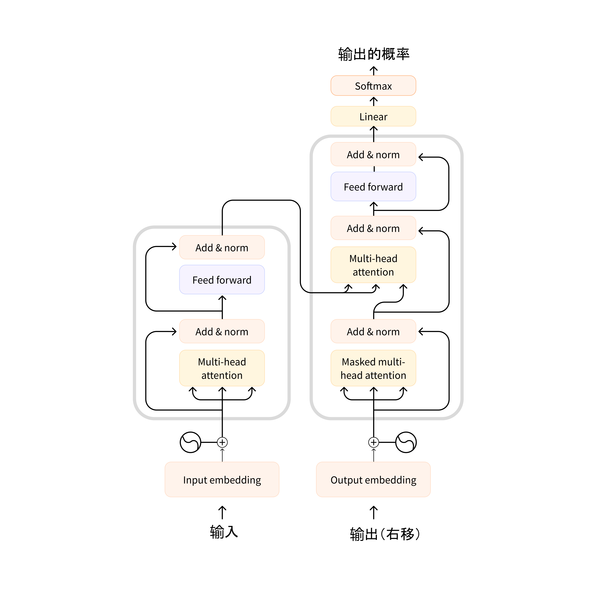

注意，解码器块中的第一个注意力层关联到解码器的所有（过去的）输入，但是第二个注意力层只使用编码器的输出。因此，它在预测当前单词时，可以使用整个句子的信息。这是非常有用的，因因为不同的语言可以有把词放在不同顺序的语法规则，或者句子后面提供的一些上下文可能有助于确定给定单词的最佳翻译。

也可以在编码器/解码器中使用*attention mask（注意力掩码层）*，以防止模型关注到某些特殊单词。例如，用于在批量处理句子时使所有输入长度一致的特殊填充词。

###  architecture（架构）与 checkpoints（权重参数又称检查点） 

在本课程中，当我们深入探讨 Transformers 模型时，你将看到架构、参数和模型。这些术语的含义略有不同：

* **architecture（架构）**：这是模型的骨架 —— 每个层的定义以及模型中发生的每个操作。
* **checkpoints（权重参数又称检查点）**：这些是将在给架构中结构中加载的权重参数，是一些具体的数值。
* **Model（模型）**：这是一个笼统的术语，没有“架构”或“参数”那么精确：它可以指两者。为了避免歧义，本课程使用将使用架构和参数。

例如，BERT 是一个架构，而 `bert-base-cased` ，这是谷歌团队为 BERT 的第一个版本训练的一组权重参数，是一个参数。我们可以说“BERT 模型”和“ `bert-base-cased` 模型。”

## 2.4 常见的三种Transform模型的结构

常见的三种Transform模型的结构包括编码器模型（Encoder Model）、解码器模型（Decoder Model）和编码器-解码器模型（Encoder-Decoder Model）。

### “编码器”模型（Encoder Model）

编码器模型仅使用 Transformer 模型的编码器部分。在每次计算过程中，注意力层都能访问整个句子的所有单词，这些模型通常具有“双向”（向前/向后）注意力，被称为自编码模型。

这些模型的预训练通常会使用某种方式破坏给定的句子（例如：通过随机遮盖其中的单词），并让模型寻找或重建给定的句子。

“编码器”模型适用于需要理解完整句子的任务，例如：句子分类、命名实体识别（以及更普遍的单词分类）和阅读理解后回答问题。

该系列模型的典型代表有：

- [ALBERT](https://huggingface.co/transformers/model_doc/albert.html)(https://huggingface.co/transformers/model_doc/albert.html) 
- [BERT](https://huggingface.co/transformers/model_doc/bert.html)(https://huggingface.co/transformers/model_doc/bert.html) 
- [DistilBERT](https://huggingface.co/transformers/model_doc/distilbert.html)(https://huggingface.co/transformers/model_doc/distilbert.html) 
- [ELECTRA](https://huggingface.co/transformers/model_doc/electra.html)(https://huggingface.co/transformers/model_doc/electra.html) 
- [RoBERTa](https://huggingface.co/transformers/model_doc/roberta.html)(https://huggingface.co/transformers/model_doc/roberta.html) 

### “解码器”模型（Decoder Model）

“解码器”模型仅使用 Transformer 模型的解码器部分。在每个阶段，对于给定的单词，注意力层只能获取到句子中位于将要预测单词前面的单词。这些模型通常被称为自回归模型。

“解码器”模型的预训练通常围绕预测句子中的下一个单词进行。

这些模型最适合处理文本生成的任务。

该系列模型的典型代表有：

- [CTRL](https://huggingface.co/transformers/model_doc/ctrl.html)(https://huggingface.co/transformers/model_doc/ctrl.html) 
- [GPT](https://huggingface.co/docs/transformers/model_doc/openai-gpt)(https://huggingface.co/docs/transformers/model_doc/openai-gpt) 
- [GPT-2](https://huggingface.co/transformers/model_doc/gpt2.html)(https://huggingface.co/transformers/model_doc/gpt2.html) 
- [Transformer XL](https://huggingface.co/transformers/model_doc/transfor-xl.html)(https://huggingface.co/transformers/model_doc/transfor-xl.html) 

### 编码器-解码器模型（Encoder-Decoder Model）

编码器-解码器模型（也称为序列到序列模型）同时使用 Transformer 架构的编码器和解码器两个部分。在每个阶段，编码器的注意力层可以访问输入句子中的所有单词，而解码器的注意力层只能访问位于输入中将要预测单词前面的单词。

这些模型的预训练可以使用训练编码器或解码器模型的方式来完成，但通常会更加复杂。例如， [T5](https://huggingface.co/t5-base)(https://huggingface.co/t5-base) 通过用单个掩码特殊词替换随机文本范围（可能包含多个词）进行预训练，然后目标是预测被遮盖单词原始的文本。

序列到序列模型最适合于围绕根据给定输入生成新句子的任务，如摘要、翻译或生成性问答。

该系列模型的典型代表有：

- [BART](https://huggingface.co/transformers/model_doc/bart.html)(https://huggingface.co/transformers/model_doc/bart.html) 
- [mBART](https://huggingface.co/transformers/model_doc/mbart.html)(https://huggingface.co/transformers/model_doc/mbart.html) 
- [Marian](https://huggingface.co/transformers/model_doc/marian.html)(https://huggingface.co/transformers/model_doc/marian.html) 
- [T5](https://huggingface.co/transformers/model_doc/t5.html)(https://huggingface.co/transformers/model_doc/t5.html) 

## 2.5 模型的偏见和局限性

如果你打算在正式的项目中使用经过预训练或经过微调的模型。请注意：虽然这些模型是很强大，但它们也有局限性。其中最大的一个问题是，为了对大量数据进行预训练，研究人员通常会搜集所有他们能找到的所有文字内容，中间可能夹带一些意识形态或者价值观的刻板印象。

为了快速解释清楚这个问题，让我们回到一个使用 BERT 模型的 pipeline 的例子：

```python
from transformers import pipeline

unmasker = pipeline("fill-mask", model="bert-base-uncased")
result = unmasker("This man works as a [MASK].")
print([r["token_str"] for r in result])

result = unmasker("This woman works as a [MASK].")
print([r["token_str"] for r in result])
```

```python
['lawyer', 'carpenter', 'doctor', 'waiter', 'mechanic']
['nurse', 'waitress', 'teacher', 'maid', 'prostitute']
```

当要求模型填写这两句话中缺少的单词时，模型给出的答案中，只有一个与性别无关（服务员/女服务员）。其他职业通常与某一特定性别相关，妓女最终进入了模型中与“女人”和“工作”相关的前五位。尽管 BERT 是少数使用经过筛选和清洗后，并且看似中立的数据集上建立的的 Transformer 模型，而不是通过从互联网上搜集数据（它使用的是 [Wikipedia 英文](https://huggingface.co/datasets/wikipedia)(https://huggingface.co/datasets/wikipedia) 和 [BookCorpus](https://huggingface.co/datasets/bookcorpus)(https://huggingface.co/datasets/bookcorpus) 数据集），但是这种情况还是发生了。

因此，当你使用这些工具时，你需要记住，使用的原始模型的时候，很容易生成性别歧视、种族主义或恐同内容。这种固有偏见不会随着微调模型而使消失。

## 2.6 章末总结及测试

在本章中，你了解了如何使用来自Transformers 的高级函数 `pipeline()` 处理不同的 NLP 任务。你还了解了如何在模型中心（hub）中搜索和使用模型，以及如何使用推理 API 直接在浏览器中测试模型。

我们从最终的效果的角度讨论了 Transformer 模型的工作方式，并讨论了迁移学习和微调的重要性。一个关键的收获是：你可以使用完整的体系结构，也可以仅使用编码器或解码器，具体取决于你要解决的任务类型。下表总结了这一点：

|  模型   | 示例  | 任务|
|  ----  | ----  |----|
| 编码器  | ALBERT，BERT，DistilBERT，ELECTRA，RoBERTa	|句子分类、命名实体识别、抽取式问答（从文本中提取答案）|
| 解码器  | CTRL，GPT，GPT－2，Transformer XL	 |文本生成|
| 编码器-解码器  | BART，T5，Marian，mBART	 |文本摘要、翻译、生成式问答（生成问题的回答类似 chatgpt）|

### 测试

这一章涵盖了很多内容！ 如果有一些不太明白的地方，请不要担心； 下一章将帮助你了解这些模块在底层是如何工作的。

让我们来测试一下你在这一章学到了什么！

#### 1. 探索 Hub 并寻找 `roberta-large-mnli` checkpoint。 它可以完成什么类型的任务？

1. 文本摘要提取
2. 文本分类
3. 文本生成

#### 2. 下面的代码将会输出什么结果？

```py
from transformers import pipeline

ner = pipeline("ner", grouped_entities=True)
ner("My name is Sylvain and I work at Hugging Face in Brooklyn.")
```
1. 它将输出带有 \"positive\" 或者 \"negative\"标签分类的分数。
2. 它将生成这句话的下一句话。
3. 它找出代表人员、组织或位置的单词。

#### 3. 在此代码示例中...的地方应该填写什么？

```py
from transformers import pipeline

filler = pipeline("fill-mask", model="bert-base-cased")
result = filler("...")
```
1. This &#60;mask> has been waiting for you.
2. This [MASK] has been waiting for you.
3. This man has been waiting for you.

#### 4. 为什么这段代码会无法运行？

```py
from transformers import pipeline

classifier = pipeline("zero-shot-classification")
result = classifier("This is a course about the Transformers library")
```
1. 这个 pipeline 要求提供用来分类此文本的标签。
2. 这个 pipeline 需要多个句子，而不仅仅是一个。
3. Transformers库又出故障了
4. 该 pipeline 需要更长的输入； 这个句子太短了。

#### 5. “迁移学习”是什么意思？

1. 通过在同一数据集上再次训练模型，将预训练模型的知识迁移到新模型。
2. 通过使用第一个模型的权重初始化第二个模型，将预训练模型的知识迁移到新模型。
3. 构建与第一个模型具有相同架构的第二个模型，将预训练模型的知识迁移到新模型。

#### 6. 语言模型在预训练时通常不需要标签，这样的说法是否正确。

1. 正确
2. 错误

#### 7. 选择最能描述“模型（model）”、“架构（architecture）”和“权重（weights）”的句子。


1. 如果模型是一座建筑物，那么它的架构就是蓝图，而权重就是住在里面的人。
2. 架构是建立模型的地图，权重是地图上表示的城市。
3. 架构是用于构建模型的一系列数学函数，其权重是这些函数参数。

#### 8. 你将使用以下哪种类型的模型来根据输入的提示生成文本？

1. “编码器”模型
2. “解码器”模型
3. “序列到序列”模型

#### 9. 你会使用哪些类型的模型来生成文本的摘要？

1. “编码器”模型
2. “解码器”模型
3. “序列到序列”模型

#### 10. 你会使用哪一种类型的模型来根据特定的标签对文本输入进行分类？

1. “编码器”模型
2. “解码器”模型
3. “序列到序列”模型

#### 11. 模型中观察到的偏见有哪些可能的来源？

1. 这个模型是一个预训练模型的微调版本，它从中继承了预训练模型的偏见。
2. 用于训练模型的数据是有偏见的。
3. 模型优化的指标是有偏见的。

### 答案

#### 1. 探索 Hub 并寻找 `roberta-large-mnli` checkpoint。 它可以完成什么类型的任务？

正确选项: 2. 文本分类

1. 文本摘要提取    
解析: 前往 [`roberta-large-mnli`](https://huggingface.co/roberta-large-mnli)(https://huggingface.co/roberta-large-mnli) 再仔细看一下。
2. 文本分类    
解析: 更准确地说，它能通过三个标签（矛盾，无关，蕴含）分类，判断两句话是否在逻辑上有关联——这项任务也称为自然语言推理（natural language inference）。
3. 文本生成    
解析: 前往 [`roberta-large-mnli`](https://huggingface.co/roberta-large-mnli)(https://huggingface.co/roberta-large-mnli) 再仔细看一下。

#### 2. 下面的代码将会输出什么结果？

```py
from transformers import pipeline

ner = pipeline("ner", grouped_entities=True)
ner("My name is Sylvain and I work at Hugging Face in Brooklyn.")
```
正确选项: 3. 它找出代表人员、组织或位置的单词。

1. 它将输出带有 \"positive\" 或者 \"negative\"标签分类的分数。    
解析: 不对 —— <code>sentiment-analysis（情感分析）</code> pipeline才会输出这些。
2. 它将生成这句话的下一句话。    
解析: 不对 —— <code>text-generation（文本生成）</code> pipeline才会输出这些。
3. 它找出代表人员、组织或位置的单词。    
解析: 正解! 此外，使用 <code>grouped_entities=True</code>，可以将属于同一实体的单词组合在一起，例如“Hugging Face”。

#### 3. 在此代码示例中...的地方应该填写什么？

```py
from transformers import pipeline

filler = pipeline("fill-mask", model="bert-base-cased")
result = filler("...")
```
正确选项: 2. This [MASK] has been waiting for you.

1. This &#60;mask> has been waiting for you.    
解析: 不对。 请查看 <code>bert-base-cased</code> 模型卡片
2. This [MASK] has been waiting for you.    
解析: 正解! 这个模型的mask token是 `[MASK]` .
3. This man has been waiting for you.    
解析: 不对。 这个pipeline的作用是填充经过mask的文字，因此它需要在输入中有一个mask token。

#### 4. 为什么这段代码会无法运行？

```py
from transformers import pipeline

classifier = pipeline("zero-shot-classification")
result = classifier("This is a course about the Transformers library")
```
正确选项: 1. 这个pipeline要求提供用来分类此文本的标签。

1. 这个pipeline要求提供用来分类此文本的标签。    
解析: 正解 —— 正确的代码需要包含：<code>candidate_labels=[...]</code>。
2. 这个pipeline需要多个句子，而不仅仅是一个。    
解析: 不对。尽管正确使用时，此pipeline可以同时处理多个句子（像所有其他pipeline一样）。
3. Transformers库又出故障了    
解析: 一般来说，这个库很少出故障。
4. 该pipeline需要更长的输入； 这个句子太短了。    
解析: 不对。 不过请注意，在这个pipeline处理太长的文本时会将其截断。

#### 5. “迁移学习”是什么意思？

正确选项: 2. 通过使用第一个模型的权重初始化第二个模型，将预训练模型的知识迁移到新模型。

1. 通过在同一数据集上再次训练模型，将预训练模型的知识迁移到新模型。    
解析: 不，那将是同一模型的两个版本。
2. 通过使用第一个模型的权重初始化第二个模型，将预训练模型的知识迁移到新模型。    
解析: 正确：当第二个模型接受新任务训练时，它迁移（transfers）第一个模型的知识。
3. 构建与第一个模型具有相同架构的第二个模型，将预训练模型的知识迁移到新模型。    
解析: 架构只是模型的构建方式； 在这种情况下，没有知识共享或迁移。

#### 6. 语言模型在预训练时通常不需要标签，这样的说法是否正确。

正确选项: 1. 正确

1. 正确    
解析: 预训练通常是 `自监督（self-supervised）`，这意味着标签是根据输入自动创建的（例如：预测下一个单词或填充一些 `[MARSK]` 单词）。
2. 错误    

#### 7. 选择最能描述“模型(model)”、“架构(architecture)”和“权重(weights)”的句子。

正确选项: 3. 架构是用于构建模型的一系列数学函数，其权重是这些函数参数。

1. 如果模型是一座建筑物，那么它的架构就是蓝图，而权重就是住在里面的人。    
解析: 按照这个比喻，更准确地来说权重应该是用于建造建筑物的砖块和其他材料。
2. 架构是建立模型的地图，权重是地图上表示的城市。    
解析: 这个比喻的问题在于，一张地图通常代表只有一个确定的事实（法国只有一个城市叫巴黎）。 对于给定的体系结构，可能有多个权重。
3. 架构是用于构建模型的一系列数学函数，其权重是这些函数参数。    
解析: 同一组数学函数（架构）可以通过使用不同的参数（权重）来构建不同的模型。

#### 8. 你将使用以下哪种类型的模型来根据输入的提示生成文本？

正确选项: 2. “解码器”模型

1. “编码器”模型    
解析: “编码器”模型生成整个句子的表示，这种表示更适合于分类之类的任务。
2. “解码器”模型    
解析: “解码器”模型非常适合根据提示生成文本。
3. “序列到序列”模型    
解析: “序列到序列”模型更适合于根据输入句子生成句子的任务而不是给定提示。

#### 9. 你会使用哪些类型的模型来生成文本的摘要？

正确选项: 3. “序列到序列”模型

1. “编码器”模型    
解析: “编码器”模型生成整个句子的表示，这种表示更适合于分类之类的任务。
2. “解码器”模型    
解析: “解码器”模型对于生成输出文本(如摘要)很好，但它们不具备利用上下文(整个文本)进行总结的能力。
3. “序列到序列”模型    
解析: “序列到序列”模型非常适合摘要任务。

#### 10. 你会使用哪一种类型的模型来根据特定的标签对文本输入进行分类？

正确选项: 1. “编码器”模型

1. “编码器”模型    
解析: “编码器”模型可以生成整个句子的表示，非常适合分类这样的任务。
2. “解码器”模型    
解析: “解码器”模型适合于生成输出文本，而不是从句子中提取标签。
3. “序列到序列”模型    
解析: “序列到序列”模型更适合于输入句子而不是标签生成文本的任务。

#### 11. 模型中观察到的偏见有哪些可能的来源？

正确选项: 1. 这个模型是一个预训练模型的微调版本，它从中继承了预训练模型的偏见。

正确选项: 2. 用于训练模型的数据是有偏见的。

正确选项: 3. 模型优化的指标是有偏见的。

1. 这个模型是一个预训练模型的微调版本，它从中继承了预训练模型的偏见。    
解析: 当应用迁移学习时，在预训练模型中产生的偏见在微调模型中不能完全去除。
2. 用于训练模型的数据是有偏见的。    
解析: 这是最明显的偏见来源，但不是唯一的来源。
3. 模型优化的指标是有偏见的。    
解析: 一个不太明显的偏见来源是模型的训练方式。 你的模型将盲目地只针对你选择的指标进行优化，而不会思考这样是否会带有偏见。

# 第三章 使用Transformers

正如你在第二章，中看到的那样，Transformers 模型通常规模庞大。包含数以百万计到数千万计数十亿的参数，训练和部署这些模型是一项复杂的任务。再者，新模型的推出几乎日新月异，而每种模型都有其独特的实现方式，尝试全部模型绝非易事。

Transformers 库应运而生，就是为了解决这个问题。它的目标是提供一个统一的 API 接口，通过它可以加载、训练和保存任何 Transformer 模型。该库的主要特点有：

- **易于使用**：仅需两行代码，就能下载、加载并使用先进的 NLP 模型进行推理。
- **灵活**：在本质上，所有的模型都是简单的 PyTorch nn.Module 或 TensorFlow tf.keras.Model 类，并可像在各自的机器学习（ML）框架中处理其他模型一样处理它们。
- **简单**：该库几乎没有进行任何抽象化。Transformers 库一个核心概念是“全在一个文件中”：模型的前向传播完全在一个文件中定义，这使得代码本身易于理解和修改。

最后一个特性使Transformers 与其他 ML 库截然不同。模型并非建立在跨越多个代码文件共享的模块上；相反，每一个模型都有自己的层次结构。除了使模型更加容易接受和更容易理解，这还允许你轻松地在一个模型上实验，而且不影响其他模型。

本章将从一个端到端（从输入端到输出端）的示例开始，在该示例中，我们一起使用模型和 tokenizer 来复刻第二章中看到的 `pipeline()` 函数。接下来，我们将讨论 `Model` API：我们将深入研究 `Model` 类和 `Config` 类，并向你展示如何加载模型，以及它如何将输入处理为输出。

然后我们来看看 `tokenizer` API，它是 `pipeline()` 函数的另一个重要组成部分。在 `pipeline()` 中 `Tokenizer` 负责第一步和最后一步的处理，将文本转换到神经网络的输入，以及在需要时将其转换回文本。最后，我们将向你展示如何处理将多个句子整理为一个 batch 发送给模型，然后我们将更深入地研究 `tokenizer()` 函数。

<div custom-style="Tip-yellow">

⚠️ 为了充分利用 Model Hub 和Transformers 提供的所有功能，我们建议你[创建一个账户](https://huggingface.co/join)(https://huggingface.co/join)。
</div>

## 3.1 Pipeline 的内部 

<div custom-style="Tip-green">

这是第一部分，根据你使用 PyTorch 或者 TensorFlow，内容略有不同。点击标题上方的平台，选择你喜欢的平台！
</div>

让我们从一个完整的示例开始，看看在第一章中执行以下代码时在幕后发生了什么

```python
from transformers import pipeline

classifier = pipeline("sentiment-analysis")
classifier(
    [
        "I've been waiting for a HuggingFace course my whole life.",
        "I hate this so much!",
    ]
)
```

获得如下输出：

```python
[{'label': 'POSITIVE', 'score': 0.9598047137260437},
 {'label': 'NEGATIVE', 'score': 0.9994558095932007}]
```

正如我们在第二章中看到的，这个管道将三个步骤组合在一起：预处理、模型计算和后处理：


让我们先简单了解一下这三个步骤。

### 使用 tokenizer（ tokenizer ）进行预处理 

与其他神经网络一样，Transformer 模型无法直接处理原始文本，因此我们管道的第一步是将文本输入转换为模型能够理解的数字。为此，我们使用 tokenizer（ tokenizer ），它将负责：

- 将输入拆分为单词、子单词或符号（如标点符号），称为 **token**（词元）
- 将每个词元（token）映射到一个数字，称为 **input ID**（inputs ID）
- 添加模型需要的其他输入，例如特殊词元（如 `[CLS]` 和 `[SEP]` ）

在使用模型时所有这些预处理都需要与模型预训练时的方式完全相同，因此我们首先需要从 [Model Hub](https://huggingface.co/models)(https://huggingface.co/models) 中下载这些信息。为此，我们使用 `AutoTokenizer` 类和它的 `from_pretrained()` 方法，并输入我们模型 checkpoint 的名称，它将自动获取与模型的 tokenizer 相关联的数据，并对其进行缓存（因此只有在你第一次运行下面的代码时才会下载）。

`sentiment-analysis` （情绪分析）管道默认的 checkpoint 是 `distilbert-base-uncased-finetuned-sst-2-english` （你可以在 [这里](https://huggingface.co/distilbert-base-uncased-finetuned-sst-2-english)(https://huggingface.co/distilbert-base-uncased-finetuned-sst-2-english) ）看到它的模型卡片，我们运行以下代码：

```python
from transformers import AutoTokenizer

checkpoint = "distilbert-base-uncased-finetuned-sst-2-english"
tokenizer = AutoTokenizer.from_pretrained(checkpoint)
```

当我们有了 tokenizer，我们就可以直接将我们的句子传递给它，我们就会得到一个 `input ID（inputs ID）` 的列表！剩下要做的唯一一件事就是将 input ID 列表转换为 tensor（张量）。

你在使用 Transformers 时，不必在意后端是哪个 ML 框架实现的；它可能是 PyTorch 或 TensorFlow，或 Flax。但是，Transformers 模型只接受 `tensor（张量）` 作为输入。如果这是你第一次听说 tensor，你可以把它们想象成 NumPy 数组。NumPy 数组可以是标量（0D）、向量（1D）、矩阵（2D）或具有更多维度。这些都可以称为 tensor；其他 ML 框架的 tensor 使用方法也类似，通常与 NumPy 数组一样易于实例化。

我们可以使用 `return_tensors` 参数指定我们想要得到的 tensor 的类型（PyTorch、TensorFlow 或纯 NumPy），

{#if fw === 'pt'}

在PyTorch（说明：本书中浅红色底纹的代码为在PyTorch中的代码）中的代码为：

```python
#####Pytorch
raw_inputs = [
    "I've been waiting for a HuggingFace course my whole life.",
    "I hate this so much!",
]
inputs = tokenizer(raw_inputs, padding=True, truncation=True, return_tensors="pt")
print(inputs)####end
```
{:else}
在TensorFlow （说明：本书中浅紫色底纹的代码为在TensorFlow中的代码）中的代码为：

```python
#####TensorFlow
raw_inputs = [
    "I've been waiting for a HuggingFace course my whole life.",
    "I hate this so much!",
]
inputs = tokenizer(raw_inputs, padding=True, truncation=True, return_tensors="tf")
print(inputs)####end
```

{/if}

现在不要担心 padding（填充）和 truncation（截断）；我们稍后会解释这些。这里要记住的是，你可以传递一个句子或一组句子，还可以指定要返回的 tensor 类型（如果没有传递类型，默认返回的是 python 中的 list 格式）。

{#if fw === 'pt'}

以下是 PyTorch 张量的结果：

```python
#####Pytorch
{
    'input_ids': tensor([
        [  101,  1045,  1005,  2310,  2042,  3403,  2005,  1037, 17662, 12172, 2607,  2026,  2878,  2166,  1012,   102],
        [  101,  1045,  5223,  2023,  2061,  2172,   999,   102,     0,     0,     0,     0,     0,     0,     0,     0]
    ]), 
    'attention_mask': tensor([
        [1, 1, 1, 1, 1, 1, 1, 1, 1, 1, 1, 1, 1, 1, 1, 1],
        [1, 1, 1, 1, 1, 1, 1, 1, 0, 0, 0, 0, 0, 0, 0, 0]
    ])
}####end
```
{:else}

以下是 TensorFlow 张量的结果：

```python
#####TensorFlow
{
    'input_ids': <tf.Tensor: shape=(2, 16), dtype=int32, numpy=
        array([
            [  101,  1045,  1005,  2310,  2042,  3403,  2005,  1037, 17662, 12172,  2607,  2026,  2878,  2166,  1012,   102],
            [  101,  1045,  5223,  2023,  2061,  2172,   999,   102,     0,     0,     0,     0,     0,     0,     0,     0]
        ], dtype=int32)>, 
    'attention_mask': <tf.Tensor: shape=(2, 16), dtype=int32, numpy=
        array([
            [1, 1, 1, 1, 1, 1, 1, 1, 1, 1, 1, 1, 1, 1, 1, 1],
            [1, 1, 1, 1, 1, 1, 1, 1, 0, 0, 0, 0, 0, 0, 0, 0]
        ], dtype=int32)>
}####end
```
{/if}

输出是一个包含两个键， `input_ids` 和 `attention_mask` 。 `input_ids` 包含两行整数（每个句子一行），它们是每个句子中 token 的 ID。我们将在本章后面解释什么是 `attention_mask` 。

### 探索模型 

{#if fw === 'pt'}

我们可以像使用 tokenizer 一样下载预训练模型。Transformers 提供了一个 `AutoModel` / `TFAutoModel` 类，它也有一个 `from_pretrained()` 方法：

```python
#####Pytorch
from transformers import AutoModel

checkpoint = "distilbert-base-uncased-finetuned-sst-2-english"
model = AutoModel.from_pretrained(checkpoint)####end
```
{:else}

```python
#####TensorFlow
from transformers import TFAutoModel

checkpoint = "distilbert-base-uncased-finetuned-sst-2-english"
model = TFAutoModel.from_pretrained(checkpoint)####end
```
{/if}

在这段代码中，我们将之前在 pipeline 中使用的 checkpoint（实际上应该已经被缓存了）下载下来，并用它实例化了一个模型。

这个模型只包含基本的 Transformer 模块：输入一些句子，它输出我们将称为 `hidden states（隐状态）` ，也被称为特征。每个输入，我们都可以获取一个高维向量，代表 Transformer 模型对该输入的上下文理解。

如果这有些难以理解，不要担心。我们以后再解释。

这些隐状态本身就很有用，它们被称为模型头（head），通常是模型另一部分的输入。在第二章中，可以使用相同的体系结构的模型执行不同的任务，这是因为每个任务都有一个对应的模型头。

#### 高维向量？

Transformers 模块的矢量输出通常较大。它通常有三个维度：

- **Batch size**（批次大小）：一次处理的序列数（在我们的示例中为 2）。
- **Sequence length**（序列长度）：表示序列（句子）的长度（在我们的示例中为 16）。
- **Hidden size**（隐藏层大小）：每个模型输入的向量维度。

正是因为最后一个维度，它被称为“高维”。隐藏层可能非常大（对于较小的模型，常见的是 768，对于较大的模型，这个数字可以达到 3072 或更多）。

如果我们将预处理的之后的值输入到模型中，我们会得到以下输入：

{#if fw === 'pt'}

```python
#####Pytorch
outputs = model(**inputs)
print(outputs.last_hidden_state.shape)####end
```

```python
#####Pytorch
torch.Size([2, 16, 768])####end
```
{:else}

```python
#####TensorFlow
outputs = model(inputs)
print(outputs.last_hidden_state.shape)####end
```

```python
#####TensorFlow
(2, 16, 768)####end
```

{/if}

注意，Transformers 模型的输出有些像 `namedtuple` 或词典。你可以通过使用“.”+属性（就像我们在上面示例中所做的那样）或键（ `outputs["last_hidden_state"]` ）访问元素，如果你确切知道要查找的内容的位置（ `outputs[0]` ），也可以通过索引访问元素。

#### 模型头：理解数字的意义 

Transformers 模型的输出会直接发送到模型头进行处理。

模型头通常由一个或几个线性层组成，它的输入是隐状态的高维向量，它会并将其投影到不同的维度。


在此图中，模型由其嵌入层和后续层表示。嵌入层将 tokenization 输入中的每个 inputs ID 转换为表示关联 token 的向量。后续层使用注意机制操纵这些向量，生成句子的最终表示。

Transformers 中有许多不同的体系结构，每种体系结构都是围绕处理特定任务而设计的。以下是一个非详尽的列表：

- `*Model` （隐状态检索）
- `*ForCausalLM` 
- `*ForMaskedLM` 
- `*ForMultipleChoice` 
- `*ForQuestionAnswering` 
- `*ForSequenceClassification` 
- `*ForTokenClassification` 
- 以及其他 

{#if fw === 'pt'}

以情感分类为例，我们需要一个带有序列分类头的模型（能够将句子分类为积极或消极）。因此，我们不选用 `AutoModel` /`TFAutoModel` 类，而是使用 `AutoModelForSequenceClassification` / `TFAutoModelForSequenceClassification` 。也就是说前面写的 `model = AutoModel.from_pretrained(checkpoint)` / `model = TFAutoModel.from_pretrained(checkpoint)` 并不能得到情感分类任务的结果，因为没有加载 Model head。

```python
#####Pytorch
from transformers import AutoModelForSequenceClassification

checkpoint = "distilbert-base-uncased-finetuned-sst-2-english"
model = AutoModelForSequenceClassification.from_pretrained(checkpoint)
outputs = model(**inputs)####end
```
{:else}

```python
#####TensorFlow
from transformers import TFAutoModelForSequenceClassification

checkpoint = "distilbert-base-uncased-finetuned-sst-2-english"
model = TFAutoModelForSequenceClassification.from_pretrained(checkpoint)
outputs = model(inputs)####end
```
{/if}

如果我们看一下现在输出的形状，其维度会降低很多：模型头接收我们之前看到的高维向量作为输入，并输出包含两个值（每种标签一个）的向量：

```python
print(outputs.logits.shape)
```

{#if fw === 'pt'}

```python
#####Pytorch
torch.Size([2, 2])####end
```

{:else}

```python
#####TensorFlow
(2, 2)####end
```

{/if}

由于我们只有两个句子和两钟标签，所以我们从模型中得到的结果的形状是 2 x 2。

### 对输出进行后序处理 

我们从模型中得到的输出值本身并不一定有意义。我们来看看，

```python
print(outputs.logits)
```

{#if fw === 'pt'}

```python
#####Pytorch
tensor([[-1.5607,  1.6123],
        [ 4.1692, -3.3464]], grad_fn=<AddmmBackward>)####end
```

{:else}

```python
#####TensorFlow
<tf.Tensor: shape=(2, 2), dtype=float32, numpy=
    array([[-1.5606991,  1.6122842],
           [ 4.169231 , -3.3464472]], dtype=float32)>####end
```

{/if}

我们的模型预测第一句为 `[-1.5607, 1.6123]` ，第二句为 `[ 4.1692, -3.3464]` 。这些不是概率，而是 `logits（对数几率）` ，是模型最后一层输出的原始的、未标准化的分数。要转换为概率，它们需要经过 [SoftMax](https://en.wikipedia.org/wiki/Softmax_function)(https://en.wikipedia.org/wiki/Softmax_function) 层（所有Transformers 模型的输出都是 logits，因为训练时的损失函数通常会将最后的激活函数（如 SoftMax）与实际的损失函数（如交叉熵）融合）：

{#if fw === 'pt'}

```python
#####Pytorch
import torch

predictions = torch.nn.functional.softmax(outputs.logits, dim=-1)
print(predictions)####end
```

{:else}

```python
#####TensorFlow
import tensorflow as tf

predictions = tf.math.softmax(outputs.logits, axis=-1)
print(predictions)####end
```

{/if}

{#if fw === 'pt'}

```python
#####Pytorch
tensor([[4.0195e-02, 9.5980e-01],
        [9.9946e-01, 5.4418e-04]], grad_fn=<SoftmaxBackward>)####end
```

{:else}

```python
#####TensorFlow
tf.Tensor(
[[4.01951671e-02 9.59804833e-01]
 [9.9945587e-01 5.4418424e-04]], shape=(2, 2), dtype=float32)####end
```

{/if}

现在我们可以看到，模型预测第一句的输出是 `[0.0402, 0.9598]` ，第二句 `[0.9995,  0.0005]` 。这些是可直接使用的概率分数。

为了获得每个分数对应的标签，我们可以查看模型配置的 `id2label` 属性（下一节将对此进行详细介绍）：

```python
model.config.id2label
```

```python
{0: 'NEGATIVE', 1: 'POSITIVE'}
```

现在我们可以得出结论，模型预测如下：

- 第一句：消极的概率：0.0402，积极的概率：0.9598
- 第二句：消极的概率：0.9995，积极的概率：0.0005

我们已经成功地复刻了管道的三个步骤：使用 tokenizer 进行预处理、通过模型传递输入以及后处理！现在，让我们花一些时间深入了解这些步骤中的每一步。

<div custom-style="Tip-green">

✏️ **试试看！** 选择两个（或更多）句子并分别在 `sentiment-analysis` 管道和自己实现的管道中运行它们。看一看是否获得的结果是不是相同的！

</div>

## 3.2 模型

在本节中，我们将更详细地了解如何创建和使用模型。我们将使用 `AutoModel` / `TFAutoModel` 类，当你希望从 checkpoint 实例化任何模型时，使用它非常方便。

`AutoModel` / `TFAutoModel` 类及其所有的相关类其实就是对库中可用的各种模型的简单包装。它是一个智能的包装，因为它可以自动猜测你的 checkpoint 适合的模型架构，然后实例化一个具有相同架构的模型。

然而，如果你知道你想要使用的模型的类型，你可以直接使用其架构相对应的模型类。让我们看看如何使用 BERT 模型。

### 创建 Transformer 模型 

初始化 BERT 模型需要做的第一件事是加载 `Config` 对象：

{#if fw === 'pt'}

```python
#####Pytorch
from transformers import BertConfig, BertModel

# 初始化配置类
config = BertConfig()

# 从配置类初始化模型
model = BertModel(config)####end
```

{:else}

```python
#####TensorFlow
from transformers import BertConfig, TFBertModel

# 初始化配置类
config = BertConfig()

# 从配置类初始化模型
model = TFBertModel(config)####end
```
{/if}

`config` 中包含许多用于构建模型的属性：

```python
print(config)
```

```python
BertConfig {
  [...]
  "hidden_size": 768,
  "intermediate_size": 3072,
  "max_position_embeddings": 512,
  "num_attention_heads": 12,
  "num_hidden_layers": 12,
  [...]
}
```

虽然可能你还不知道这些属性的含义，但其中一部分应该比较眼熟： `hidden_size` 属性定义了 `hidden_states（隐状态）` 向量的大小，而 `num_hidden_layers` 定义了 Transformer 模型的层数。

#### 使用不同的加载方式 

使用默认配置创建模型会使用随机值对其进行初始化：

{#if fw === 'pt'}

```python
#####Pytorch
from transformers import BertConfig, BertModel

config = BertConfig()
model = BertModel(config)
# 模型权重已随机初始化!####end
```

{:else}

```python
#####TensorFlow
from transformers import BertConfig, TFBertModel

config = BertConfig()
model = TFBertModel(config)
# 模型权重已随机初始化!####end
```

{/if}

这个模型是可以运行并得到结果的，但它会输出胡言乱语；它需要先进行训练才能正常使用。我们可以根据手头的任务从头开始训练模型，但正如你在第一章中看到的，这将需要很长的时间和大量的数据，并且会对环境产生不可忽视的影响。为了避免不必要的重复工作，能够共享和复用已经训练过的模型是非常重要的。

加载已经训练过的 Transformers 模型很简单——我们可以使用 `from_pretrained()` 方法：

{#if fw === 'pt'}

```python
#####Pytorch
from transformers import BertModel

model = BertModel.from_pretrained("bert-base-cased")####end
```

正如你在上一小节看到的，从现在开始，我们会将 `BertModel` / `TFAutoModel` 替换为等效的 `AutoModel` / `TFBert`类，这样可以摆脱对 checkpoint 的依赖；如果你的代码适用于一个 checkpoint 那么它就可以在另一个 checkpoint 无缝地工作。即使体系结构不同，这也适用，只要 checkpoint 是针对类似任务（例如，情绪分析任务）训练的。

{:else}

```python
#####TensorFlow
from transformers import TFBertModel

model = TFBertModel.from_pretrained("bert-base-cased")####end
```

{/if}

在上述代码示例中，我们没有使用 `BertConfig` ，而是通过 `bert-base-cased` 标签加载了一个预训练模型。这是一个由 BERT 的作者训练的模型 checkpoint 权重；你可以在其 [模型卡片](https://huggingface.co/bert-base-cased)(https://huggingface.co/bert-base-cased) 中查看更多详细信息。

现在，此模型已经用 checkpoint 的所有权重进行了初始化。它可以直接用于推理它训练过的任务，也可以在新任务上进行微调。通过使用预训练的权重进行训练，相比于从头开始训练，我们可以迅速获得比较好的结果。

权重已下载并缓存在缓存文件夹中（因此，未来调用 `from_pretrained()` 方法的调用将不会重新下载它们）默认为 `~/.cache/huggingface/transformers` 。你可以通过设置 `HF_HOME` 环境变量来自定义缓存文件夹。

加载模型的标识符可以是 Model Hub 上任何模型的标签，只要它与 BERT 架构兼容。可用的 BERT  checkpoint 的完整列表可以在 [这里](https://huggingface.co/models?filter=bert)(https://huggingface.co/models?filter=bert) 找到。

#### 保存模型 

保存模型和加载模型一样简单--我们使用 `save_pretrained()` 方法，该方法类似于 `from_pretrained()` 方法：

```python
model.save_pretrained("directory_on_my_computer")
```

这会将两个文件保存到磁盘：

{#if fw === 'pt'}

```python
#####Pytorch
ls directory_on_my_computer

config.json pytorch_model.bin####end
```

{:else}

```python
#####TensorFlow
ls directory_on_my_computer

config.json tf_model.h5####end
```

{/if}

如果你看一下 `config.json` 文件，你会认出构建模型架构所需的属性。这个文件还包含一些元数据，例如 checkpoint 的来源，以及你上次保存 checkpoint 时所使用的 Transformers 版本。

`pytorch_model.bin` / `tf_model.h5` 文件被称为 `state dictionary（状态字典）` ；它包含了你的模型的所有权重。这两个文件是相辅相成的；配置文件是构建你的模型架构所必需的，而模型权重就是你的模型参数。

#### 使用 Transformers 模型进行推理 

既然你知道了如何加载和保存模型，那么让我们尝试使用它进行一些预测。Transformer 模型只能处理数字——由 tokenizer 转化后的数字。但在我们讨论 tokenizer 之前，让我们探讨一下模型接受的输入是什么。

可以将输入转换为适当的框架张量，但为了帮助你了解发生了什么，我们将快速了解在将输入发送到模型之前必须做什么。

假设我们有几个句子：

```python
sequences = ["Hello!", "Cool.", "Nice!"]
```

tokenizer 将这些转换为词汇表索引，通常称为 `input IDs` 。每个句子现在都是一个数字列表！结果输出是：

```python
encoded_sequences = [
    [101, 7592, 999, 102],
    [101, 4658, 1012, 102],
    [101, 3835, 999, 102],
]
```

这是一个编码序列列表：一个列表列表。张量只接受矩形（形状规则的的列表：每一列元素的数量都相同）。这个数组已经是矩形了，因此将其转换为张量很容易：

{#if fw === 'pt'}

```python
#####Pytorch
import torch

model_inputs = torch.tensor(encoded_sequences)####end
```

{:else}

```python
#####TensorFlow
import tensorflow as tf

model_inputs = tf.constant(encoded_sequences)####end
```
{/if}

#### 使用张量作为模型的输入 

将张量输入给模型非常简单 —— 我们只需调用模型并输入：

```python
output = model(model_inputs)
```

虽然模型接受很多不同的参数，但只有 input IDs 是必需的。我们稍后会解释其他参数的作用以及何时需要它们，但首先我们需要仔细研究一下如何构建 Transformer 模型能理解的输入。

## 3.3 Tokenizers 

tokenizer 是 NLP 管道的核心组件之一。它们有一个非常明确的目的：将文本转换为模型可以处理的数据。模型只能处理数字，因此 tokenizer 需要将我们的文本输入转换为数字。在本节中，我们将确切地探讨 tokenization 管道中发生的事情。

在 NLP 任务中，通常处理的原始数据是文本。这里是一个例子：

```python
Jim Henson was a puppeteer
```

但是，模型只能处理数字，因此我们需要找到一种将原始文本转换为数字的方法。这就是 tokenizer 所做的，并且有很多方法可以解决这个问题。目标是找到最有意义的表达方式 —— 即对模型来说最有意义的方式 —— 如果可能，还要找到最小的表达方式。

让我们看一下 tokenization 算法的一些示例，并尝试回答一些你可能对 tokenization 有的疑问。

### 基于单词（Word-based）的 tokenization  

想到的第一种 tokenizer 是基于词（word-based）的 tokenization。它通常很容易配置和使用，只需几条规则，并且通常会产生不错的结果。例如，在下图中，目标是将原始文本拆分为单词并为每个单词找到一个数字表示：


有多种方法可以拆分文本。例如，我们可以通过使用 Python 的 `split()` 函数，使用空格将文本分割为单词：

```python
tokenized_text = "Jim Henson was a puppeteer".split()
print(tokenized_text)
```

```python
['Jim', 'Henson', 'was', 'a', 'puppeteer']
```

此外，还有一些基于单词的 tokenizer 的变体，对标点符号有额外的规则。使用这类 tokenizer，我们最终可以得到一些非常大的“词汇表（vocabulary）”，其中词汇表的大小由我们在语料库中拥有的独立 tokens 的总数确定。

每个单词都分配了一个 ID，从 0 开始一直到词汇表的大小。模型使用这些 ID 来识别每个词。

如果我们想用基于单词的 tokenizer 完全覆盖一种语言，我们需要为语言中的每个单词设置一个标识符，这将生成大量的 tokens 例如，英语中有超过 500,000 个单词，因此要构建从每个单词到 ID 的映射，我们需要跟踪这么多 ID。此外，像“dog”这样的词与“dogs”这样的词的表示方式不同，模型最初无法知道“dog”和“dogs”是相似的：它会将这两个词识别为不相关。这同样适用于其他相似的词，例如“run”和“running”，模型最初也不会看到它们的相似性。

最后，我们需要一个自定义 token 来表示不在我们词汇表中的单词。这被称为“unknown” token 通常表示为“[UNK]”或“&lt;unk&gt;”。如果你看到 tokenizer 产生了很多这样的 token 这通常是一个不好的迹象，因为它无法检索到一个词的合理表示，并且你会在这个过程中丢失信息。制作词汇表时的其中一个目标是 tokenizer 将尽可能少的单词标记为未知 tokens。

减少未知 tokens 数量的一种方法是使用更深一层的 tokenizer 即基于字符（character-based）的 tokenizer 

### 基于字符（Character-based）的 tokenization  

基于字符的 tokenizer 将文本拆分为字符，而不是单词。这有两个主要好处：

- 词汇量要小得多。
- unknown tokens （out-of-vocabulary）要少得多，因为每个单词都可以由字符构建。

但在此过程中也有一些问题，关于空格和标点符号：


这种方法也不是完美的。由于现在表示是基于字符而不是单词，因此人们可能会争辩说，从直觉上讲，它的意义不大：每个字符本身并没有多大意义，但是单词则不然。然而，这又因语言而异；例如，在中文中，每个字符比拉丁语言中的字符包含更多的信息。

另一件要考虑的因素是，这样做会导致我们的模型需要处理大量的 tokens：虽然一个单词在基于单词的 tokenizer 中只是一个 token，但当它被转换为字符时，很可能就变成了 10 个或更多的 tokens 

为了两全其美，我们可以使用结合这两种方法的第三种技术：基于子词（subword）的 tokenization。

### 基于子词（subword）的 tokenization  

基于子词（subword）的 tokenization 算法依赖于这样一个原则：常用词不应被分解为更小的子词，但罕见词应被分解为有意义的子词。

例如，“annoyingly”可能被视为一个罕见的词，可以分解为“annoying”和“ly”。这两者都可能作为独立的子词并且出现得更频繁，同时“annoyingly”的含义通过“annoying”和“ly”的复合含义得以保留。

这里有一个例子，展示了基于子词的 tokenization 算法如何将序列“Let's do tokenization!”分词：

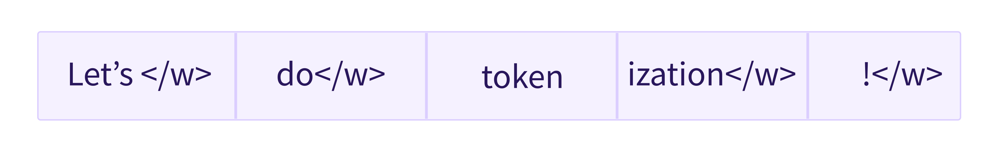

这些子词最终提供了大量的语义信息：例如，在上面的例子中，“tokenization”被分割成“token”和“ization”，这两个 tokens 在保持空间效率的同时具有语义意义（只需要两个 tokens 就能表示一个长词）。这让我们能够在词汇量小的情况下获得相对良好的覆盖率，并且几乎没有未知的 token。

这种方法在土耳其语等粘着型语言（agglutinative languages）中特别有用，你可以通过将子词串在一起来形成（几乎）任意长的复杂词。

#### 还有更多！

不出所料，还有更多的技术。仅举几例：

- Byte-level BPE，用于 GPT-2
- WordPiece，用于 BERT
- SentencePiece or Unigram，用于多个多语言模型

你现在应该对 tokenizer 的工作原理有足够的了解，可以开始使用 API 了。

### 加载和保存 

加载和保存 tokenizer 就像使用模型一样简单。实际上，它基于相同的两种方法： `from_pretrained()` 和 `save_pretrained()` 。这些方法会加载或保存分词器使用的算法（有点像模型的架构（architecture））以及其词汇表（有点像模型的权重（weights））。

加载使用与 BERT 相同的 checkpoint 训练的 BERT tokenizer 与加载模型的方式相同，只是换成了 `Bert tokenizer` 类：

```python
from transformers import BertTokenizer

tokenizer = BertTokenizer.from_pretrained("bert-base-cased")
```

如同 `AutoModel` / `TFAutoModel` ， `AutoTokenizer` 类将根据 checkpoint 名称在库中获取正确的 tokenizer 类，并且可以直接与任何 checkpoint 一起使用：

```python
from transformers import AutoTokenizer

tokenizer = AutoTokenizer.from_pretrained("bert-base-cased")
```

现在我们可以像在上一节中显示的那样使用 tokenizer：

```python
tokenizer("Using a Transformer network is simple")
```

```python
{'input_ids': [101, 7993, 170, 11303, 1200, 2443, 1110, 3014, 102],
 'token_type_ids': [0, 0, 0, 0, 0, 0, 0, 0, 0],
 'attention_mask': [1, 1, 1, 1, 1, 1, 1, 1, 1]}
```

保存 tokenizer 与保存模型完全相同：

```python
tokenizer.save_pretrained("directory_on_my_computer")
```

我们将在第四章中将更多地谈论 `token_type_ids` ，稍后我们将解释 `attention_mask` 。首先，让我们看看如何生成 `input_ids` 。为此，我们需要查看 tokenizer 的内部是如何实现的。

### 编码 

将文本翻译成数字被称为编码（encoding）。编码分两步完成：分词，然后转换为 inputs ID。

正如我们所见，第一步是将文本拆分为单词（或部分单词、标点符号等），通常称为 tokens 不同的不同的分词器使用的算法也不一样，这就是为什么我们需要使用模型名称来实例化 tokenizer，以确保我们使用模型预训练时使用的相同的算法。

第二步是将这些 tokens 转换为数字，这样我们就可以用它们构建一个张量并将它们提供给模型。为此，tokenizer 有一个词汇表（vocabulary），这是我们在使用 `from_pretrained()` 方法实例化它时下载的部分。同样，我们需要使用与预训练模型时相同的词汇表。

为了更好地理解这两个步骤，我们将分别探讨它们。请注意，我们将单独执行部分 tokenization 管道的方法来向你展示这些步骤的中间结果，但在实践中，你应该直接在你的输入上调用 tokenizer（如第 2 小节所示）。

####  tokenization  

tokenization 过程由 tokenizer 的 `tokenize()` 方法实现：

```python
from transformers import AutoTokenizer

tokenizer = AutoTokenizer.from_pretrained("bert-base-cased")

sequence = "Using a Transformer network is simple"
tokens = tokenizer.tokenize(sequence)

print(tokens)
```

这个方法的输出是一个字符串列表，或者说 tokens 

```python
['Using', 'a', 'transform', '##er', 'network', 'is', 'simple']
```

这个 tokenizer 是一个基于子词的 tokenizer：它对词进行拆分，直到获得可以用其词汇表表示的 tokens 以 `transformer` 为例，它分为两个 tokens  `transform` 和 `##er` 。

#### 从 tokens 到 inputs ID 

inputs ID 的转换由 tokenizer 的 `convert_tokens_to_ids()` 方法实现：

```python
ids = tokenizer.convert_tokens_to_ids(tokens)

print(ids)
```

```python
[7993, 170, 11303, 1200, 2443, 1110, 3014]
```

这些输出，一旦转换为适当的框架张量，就可以用作模型的输入，如本章前面所示。

<div custom-style="Tip-green">

✏️ **试试看！** 请将我们在第 2 节中使用的输入句子（“I've been waiting for a HuggingFace course my whole life.”和“I hate this so much!”）执行最后两个步骤（分词和转换为 inputs ID）。检查你获得的 inputs ID 是否与我们在第 2 节中获得的一致！

</div>

### 解码 

解码（Decoding） 正好相反：从 inputs ID 到一个字符串。这以通过 `decode()` 方法实现：

```python
decoded_string = tokenizer.decode([7993, 170, 11303, 1200, 2443, 1110, 3014])
print(decoded_string)
```

```python
'Using a Transformer network is simple'
```

请注意， `decode` 方法不仅将索引转换回 tokens 还将属于相同单词的 tokens 组合在一起以生成可读的句子。当我们使用预测新文本的模型（根据提示生成的文本，或序列到序列问题（如翻译或摘要））时，这样的功能将非常有用。

到现在为止，你应该了解 tokenizer 可以处理的原子操作：分词、转换为 ID 以及将 ID 转换回字符串。然而，我们只是刮到了冰山一角。在下一节中，我们将继续探讨它能力的极限，并看看如何克服它们。

## 3.4 处理多个序列 

在上一节中，我们探讨了最简单的案例：对一个较短的句子进行推理。然而，一些问题已经出现：

* 我们如何处理多个句子？
* 我们如何处理不同长度的多个句子？
* 词汇索引是唯一可以让模型运行的输入吗？
* 是否存在句子太长的问题？

让我们看看这些问题会带来什么样的问题，以及如何使用Transformers API 解决它们

### 模型需要一批输入 

在上一个练习中，你看到了句子如何转换为数字列表。让我们将此数字列表转换为张量，并将其发送到模型：

{#if fw === 'pt'}

```python
#####Pytorch
import torch
from transformers import AutoTokenizer, AutoModelForSequenceClassification

checkpoint = "distilbert-base-uncased-finetuned-sst-2-english"
tokenizer = AutoTokenizer.from_pretrained(checkpoint)
model = AutoModelForSequenceClassification.from_pretrained(checkpoint)

sequence = "I've been waiting for a HuggingFace course my whole life."

tokens = tokenizer.tokenize(sequence)
ids = tokenizer.convert_tokens_to_ids(tokens)
input_ids = torch.tensor(ids)
# 这一行会运行失败
model(input_ids)####end
```

```python
#####Pytorch
IndexError: Dimension out of range (expected to be in range of [-1, 0], but got 1)####end
```
{:else}
```python
#####TensorFlow
import tensorflow as tf
from transformers import AutoTokenizer, TFAutoModelForSequenceClassification

checkpoint = "distilbert-base-uncased-finetuned-sst-2-english"
tokenizer = AutoTokenizer.from_pretrained(checkpoint)
model = TFAutoModelForSequenceClassification.from_pretrained(checkpoint)

sequence = "I've been waiting for a HuggingFace course my whole life."

tokens = tokenizer.tokenize(sequence)
ids = tokenizer.convert_tokens_to_ids(tokens)
input_ids = tf.constant(ids)
# 这一行会运行失败
model(input_ids)####end
```

```python
#####TensorFlow
InvalidArgumentError: Input to reshape is a tensor with 14 values, but the requested shape has 196 [Op:Reshape]####end
```
{/if}

哦，不！为什么失败了？“我们的确是按照第 2 节中管道的步骤一步步来做的。

问题是我们向模型发送了一个单独的句子，而Transformers 模型默认情况下需要多个句子。在这里，当我们试图重现 tokenizer 在输入 `sequence` 后在其内部进行的所有操作。但如果你仔细观察，你会发现 tokenizer 不仅仅是将 inputs ID 的列表转换为张量，它还在其上添加了一个维度：

{#if fw === 'pt'}

```python
#####Pytorch
tokenized_inputs = tokenizer(sequence, return_tensors="pt")
print(tokenized_inputs["input_ids"])####end
```

```python
#####Pytorch
tensor([[  101,  1045,  1005,  2310,  2042,  3403,  2005,  1037, 17662, 12172,
          2607,  2026,  2878,  2166,  1012,   102]])####end
```

{:else}

```python
#####TensorFlow
tokenized_inputs = tokenizer(sequence, return_tensors="tf")
print(tokenized_inputs["input_ids"])####end
```

```python
#####TensorFlow
tf.Tensor: shape=(1, 16), dtype=int32, numpy=
array([[  101,  1045,  1005,  2310,  2042,  3403,  2005,  1037, 17662,
        12172,  2607,  2026,  2878,  2166,  1012,   102]], dtype=int32)>####end
```

{/if}

让我们再试一次并添加一个新的维度：

{#if fw === 'pt'}

```python
#####Pytorch
import torch
from transformers import AutoTokenizer, AutoModelForSequenceClassification

checkpoint = "distilbert-base-uncased-finetuned-sst-2-english"
tokenizer = AutoTokenizer.from_pretrained(checkpoint)
model = AutoModelForSequenceClassification.from_pretrained(checkpoint)

sequence = "I've been waiting for a HuggingFace course my whole life."

tokens = tokenizer.tokenize(sequence)
ids = tokenizer.convert_tokens_to_ids(tokens)

input_ids = torch.tensor([ids])
print("Input IDs:", input_ids)

output = model(input_ids)
print("Logits:", output.logits)####end
```

{:else}

```python
#####TensorFlow
import tensorflow as tf
from transformers import AutoTokenizer, TFAutoModelForSequenceClassification

checkpoint = "distilbert-base-uncased-finetuned-sst-2-english"
tokenizer = AutoTokenizer.from_pretrained(checkpoint)
model = TFAutoModelForSequenceClassification.from_pretrained(checkpoint)

sequence = "I've been waiting for a HuggingFace course my whole life."

tokens = tokenizer.tokenize(sequence)
ids = tokenizer.convert_tokens_to_ids(tokens)

input_ids = tf.constant([ids])
print("Input IDs:", input_ids)

output = model(input_ids)
print("Logits:", output.logits)####end
```
{/if}

让我们打印 inputs ID 以及生成的 logits 值，以下是输出：

{#if fw === 'pt'}

```python
#####Pytorch
Input IDs: [[ 1045,  1005,  2310,  2042,  3403,  2005,  1037, 17662, 12172,  2607, 2026,  2878,  2166,  1012]]
Logits: [[-2.7276,  2.8789]]####end
```

{:else}

```python
#####TensorFlow
Input IDs: tf.Tensor(
[[ 1045  1005  2310  2042  3403  2005  1037 17662 12172  2607  2026  2878
   2166  1012]], shape=(1, 14), dtype=int32)
Logits: tf.Tensor([[-2.7276208  2.8789377]], shape=(1, 2), dtype=float32)####end
```

{/if}

批处理（Batching）是一次性通过模型发送多个句子的行为。如果你只有一句话，你可以构建一个只有一个句子的 batch：

```python
batched_ids = [ids, ids]
```

这就是一个包含两个相同句子的 batch 

<div custom-style="Tip-green">

✏️   **试试看！**  将这个 `batched_ids` 列表转换为张量，并通过你的模型进行处理。检查你是否得到了与之前相同的 logits 值（但是重复了两次）！

</div>

批处理支持模型在输入多个句子时工作。使用多个句子就像使用单个句子构建批一样简单。不过，还有第二个问题。当你试图将两个（或更多）句子组合在一起时，它们的长度可能不同。如果你以前使用过张量，那么你知道它们必须是矩形，因此无法将 inputs ID 列表直接转换为张量。为了解决这个问题，我们通常填充输入（Padding）。

### 填充输入（Padding） 

以下列表不能转换为张量：

```python
batched_ids = [
    [200, 200, 200],
    [200, 200]
]
```

为了解决这个问题，我们将使用填充使张量成为标准的矩形。Padding 通过在值较少的句子中添加一个名为 `padding_id` 的特殊单词来确保我们所有的句子长度相同。例如，如果你有 10 个包含 10 个单词的句子和 1 个包含 20 个单词的句子，填充能确保所有句子都包含 20 个单词。在我们的示例中，填充后的张量如下所示：

```python
padding_id = 100

batched_ids = [
    [200, 200, 200],
    [200, 200, padding_id],
]
```

我们可以在 `tokenizer.pad_token_id` 中找到填充 token 的 ID。让我们使用它，分别用模型处理这两个句子，然后再尝试将这两个句子放在一起用模型批处理：

{#if fw === 'pt'}

```python
#####Pytorch
model = AutoModelForSequenceClassification.from_pretrained(checkpoint)

sequence1_ids = [[200, 200, 200]]
sequence2_ids = [[200, 200]]
batched_ids = [
    [200, 200, 200],
    [200, 200, tokenizer.pad_token_id],
]

print(model(torch.tensor(sequence1_ids)).logits)
print(model(torch.tensor(sequence2_ids)).logits)
print(model(torch.tensor(batched_ids)).logits)####end
```

```python
#####Pytorch
tensor([[ 1.5694, -1.3895]], grad_fn=<AddmmBackward>)
tensor([[ 0.5803, -0.4125]], grad_fn=<AddmmBackward>)
tensor([[ 1.5694, -1.3895],
        [ 1.3373, -1.2163]], grad_fn=<AddmmBackward>)####end
```

{:else}

```python
#####TensorFlow
model = TFAutoModelForSequenceClassification.from_pretrained(checkpoint)

sequence1_ids = [[200, 200, 200]]
sequence2_ids = [[200, 200]]
batched_ids = [
    [200, 200, 200],
    [200, 200, tokenizer.pad_token_id],
]

print(model(tf.constant(sequence1_ids)).logits)
print(model(tf.constant(sequence2_ids)).logits)
print(model(tf.constant(batched_ids)).logits)####end
```

```python
#####TensorFlow
tf.Tensor([[ 1.5693678 -1.3894581]], shape=(1, 2), dtype=float32)
tf.Tensor([[ 0.5803005  -0.41252428]], shape=(1, 2), dtype=float32)
tf.Tensor(
[[ 1.5693681 -1.3894582]
 [ 1.3373486 -1.2163193]], shape=(2, 2), dtype=float32)####end
```

{/if}

咦，我们批处理预测中的 logits 值有点问题：第二行应该与第二句的 logits 相同，但我们得到了完全不同的值！

这是因为 Transformer 模型的关键特性：注意力层，它考虑了每个 token 的上下文信息。这具体来说，每个 token 的含义并非单独存在的，它的含义还取决于它在句子中的位置以及周围的其他 tokens。当我们使用填充（padding）来处理长度不同的句子时，我们会添加特殊的“填充 token”来使所有句子达到相同的长度。但是，注意力层会将这些填充 token 也纳入考虑，因为它们会关注序列中的所有 tokens。这就导致了一个问题：尽管填充 token 本身并没有实际的含义，但它们的存在会影响模型对句子的理解。我们需要告诉这些注意层忽略填充 token。这是通过使用注意力掩码（attention mask）层来实现的。

### 注意力掩码（attention mask）层 

注意力掩码（attention mask）是与 inputs ID 张量形状完全相同的张量，用 0 和 1 填充：1 表示应关注相应的 tokens，0 表示应忽略相应的 tokens（即，它们应被模型的注意力层忽视）。

让我们用 attention mask 修改上一个示例：

{#if fw === 'pt'}

```python
#####Pytorch
batched_ids = [
    [200, 200, 200],
    [200, 200, tokenizer.pad_token_id],
]

attention_mask = [
    [1, 1, 1],
    [1, 1, 0],
]

outputs = model(torch.tensor(batched_ids), attention_mask=torch.tensor(attention_mask))
print(outputs.logits)####end
```

```python
#####Pytorch
tensor([[ 1.5694, -1.3895],
        [ 0.5803, -0.4125]], grad_fn=<AddmmBackward>)####end
```

{:else}

```python
#####TensorFlow
batched_ids = [
    [200, 200, 200],
    [200, 200, tokenizer.pad_token_id],
]

attention_mask = [
    [1, 1, 1],
    [1, 1, 0],
]

outputs = model(tf.constant(batched_ids), attention_mask=tf.constant(attention_mask))
print(outputs.logits)####end
```

```python
#####TensorFlow
tf.Tensor(
[[ 1.5693681  -1.3894582 ]
 [ 0.5803021  -0.41252586]], shape=(2, 2), dtype=float32)####end
```

{/if}

现在我们得到了批处理中第二句话相同的 logits 值。

注意第二序列的最后一个值是填充 ID，其在注意力掩码中的值为 0。

<div custom-style="Tip-green">

✏️ **试试看！**在第 2 节使用的两个句子（“I've been waiting for a HuggingFace course my whole life.” 和 “I hate this so much!”）上手动进行 tokenization。将它们输入模型并检查你是否得到了与第 2 节相同的 logits 值。然后使用填充 token 将它们一起进行批处理，然后创建合适的注意力掩码。检查模型计算后是否得到了相同的结果！

</div>

### 更长的句子 

对于 Transformers 模型，我们可以通过模型的序列长度是有限的。大多数模型处理多达 512 或 1024 个 的 tokens 序列，当使用模型处理更长的序列时，会崩溃。此问题有两种解决方案：

* 使用支持更长序列长度的模型。
* 截断你的序列。

不同的模型支持的序列长度各不相同，有些模型专门用于处理非常长的序列。例如 [Longformer](https://huggingface.co/transformers/model_doc/longformer.html)(https://huggingface.co/transformers/model_doc/longformer.html) 和 [LED](https://huggingface.co/transformers/model_doc/led.html)(https://huggingface.co/transformers/model_doc/led.html) 。如果你正在处理需要非常长序列的任务，我们建议你考虑使用这些模型。

另外，我们建议你通过设定 `max_sequence_length` 参数来截断序列：

```python
sequence = sequence[:max_sequence_length]
```

## 3.5 Pipeline的综合应用 

在过去的几个章节中，我们已经尝试尽可能手动完成大部分工作。我们探索了 tokenizer 的运行机制，并且了解了分词、转换为 inputs ID、填充、截断以及注意力掩码的处理方式。

然而，正如我们在第 2 节中看到的那样，Transformers API 能够通过一个高级函数为我们处理所有这些工作，接下来我们就要深入研究这个函数。当你直接在句子上调用你的 `tokenizer` 时，就可以得到转换后的可以直接放入模型的数据了：

```python
from transformers import AutoTokenizer

checkpoint = "distilbert-base-uncased-finetuned-sst-2-english"
tokenizer = AutoTokenizer.from_pretrained(checkpoint)

sequence = "I've been waiting for a HuggingFace course my whole life."

model_inputs = tokenizer(sequence)
```

这里， `model_inputs` 变量包含模型运行所需的所有数据。在 DistilBERT 中，它包括 inputs ID 和注意力掩码（attention mask）。其他接受额外输入的模型也会有对应的 tokenizer 可以将输入转化为模型所需要的输入。

正如我们将在下面的一些例子中看到的，这个函数非常强大。首先，它可以对单个句子进行处理：

```python
sequence = "I've been waiting for a HuggingFace course my whole life."

model_inputs = tokenizer(sequence)
```

它还一次处理多个多个，并且 API 的用法完全一致：

```python
sequences = ["I've been waiting for a HuggingFace course my whole life.", "So have I!"]

model_inputs = tokenizer(sequences)
```

它可以使用多种不同的方法对目标进行填充：

```python
# 将句子序列填充到最长句子的长度
model_inputs = tokenizer(sequences, padding="longest")

# 将句子序列填充到模型的最大长度
# (512 for BERT or DistilBERT)
model_inputs = tokenizer(sequences, padding="max_length")

# 将句子序列填充到指定的最大长度
model_inputs = tokenizer(sequences, padding="max_length", max_length=8)
```

它还可以对序列进行截断：

```python
sequences = ["I've been waiting for a HuggingFace course my whole life.", "So have I!"]

# 将截断比模型最大长度长的句子序列
# (512 for BERT or DistilBERT)
model_inputs = tokenizer(sequences, truncation=True)

# 将截断长于指定最大长度的句子序列
model_inputs = tokenizer(sequences, max_length=8, truncation=True)
```

`tokenizer` 对象可以处理指定框架张量的转换，然后可以直接发送到模型。例如，在下面的代码示例中，我们提示分词器返回不同框架的张量 —— `"pt"` 返回 PyTorch 张量， `"tf"` 返回 TensorFlow 张量，而 `"np"` 则返回 NumPy 数组：

```python
sequences = ["I've been waiting for a HuggingFace course my whole life.", "So have I!"]

# 返回 PyTorch tensors
model_inputs = tokenizer(sequences, padding=True, return_tensors="pt")

# 返回 TensorFlow tensors
model_inputs = tokenizer(sequences, padding=True, return_tensors="tf")

# 返回 NumPy arrays
model_inputs = tokenizer(sequences, padding=True, return_tensors="np")
```

### 特殊的 tokens 

如果我们看一下 tokenizer 返回的 inputs ID，我们会发现它们与之前的略有不同：

```python
sequence = "I've been waiting for a HuggingFace course my whole life."

model_inputs = tokenizer(sequence)
print(model_inputs["input_ids"])

tokens = tokenizer.tokenize(sequence)
ids = tokenizer.convert_tokens_to_ids(tokens)
print(ids)
```

```python
[101, 1045, 1005, 2310, 2042, 3403, 2005, 1037, 17662, 12172, 2607, 2026, 2878, 2166, 1012, 102]
[1045, 1005, 2310, 2042, 3403, 2005, 1037, 17662, 12172, 2607, 2026, 2878, 2166, 1012]
```

句子的开始和结束分别增加了一个 inputs ID。我们来解码上述的两个 ID 序列，看看是怎么回事：

```python
print(tokenizer.decode(model_inputs["input_ids"]))
print(tokenizer.decode(ids))
```

```python
"[CLS] i've been waiting for a huggingface course my whole life. [SEP]"
"i've been waiting for a huggingface course my whole life."
```

tokenizer 在开头添加了特殊单词 `[CLS]` ，在结尾添加了特殊单词 `[SEP]` 。这是因为模型在预训练时使用了这些字词，所以为了得到相同的推断结果，我们也需要添加它们。请注意，有些模型不添加特殊单词，或者添加不同的特殊单词；模型也可能只在开头或结尾添加这些特殊单词。无论如何，tokenizer 知道哪些是必需的，并会为你处理这些问题。

### 小结：从 tokenizer 到模型 

现在我们已经看到 `tokenizer` 对象在处理文本时的所有步骤，让我们最后再看一次它如何通过 tokenizer  API 处理多个序列（填充！），非常长的序列（截断！）以及多种类型的张量：

{#if fw === 'pt'}

```python
#####Pytorch
import torch
from transformers import AutoTokenizer, AutoModelForSequenceClassification

checkpoint = "distilbert-base-uncased-finetuned-sst-2-english"
tokenizer = AutoTokenizer.from_pretrained(checkpoint)
model = AutoModelForSequenceClassification.from_pretrained(checkpoint)
sequences = ["I've been waiting for a HuggingFace course my whole life.", "So have I!"]

tokens = tokenizer(sequences, padding=True, truncation=True, return_tensors="pt")
output = model(**tokens)####end
```

{:else}

```python
#####TensorFlow
import tensorflow as tf
from transformers import AutoTokenizer, TFAutoModelForSequenceClassification

checkpoint = "distilbert-base-uncased-finetuned-sst-2-english"
tokenizer = AutoTokenizer.from_pretrained(checkpoint)
model = TFAutoModelForSequenceClassification.from_pretrained(checkpoint)
sequences = ["I've been waiting for a HuggingFace course my whole life.", "So have I!"]

tokens = tokenizer(sequences, padding=True, truncation=True, return_tensors="tf")
output = model(**tokens)####end
```

{/if}

## 基本用法完成！

恭喜你跟随课程走到这里！回顾一下，在这一章中，你已经：

- 学习了 Transformers 模型的基本构造块。
- 了解了 Tokenizer 管道的组成。
- 了解了如何在实践中使用 Transformers 模型。
- 学习了如何利用 tokenizer 将文本转换为模型可以理解的张量。
- 设定了 tokenizer 和模型，可以从输入的文本获取预测的结果。
- 了解了 inputs IDs 的局限性，并学习了关于注意力掩码（attention mask）的知识。
- 试用了灵活且可配置的 Tokenizer 方法。

从现在开始，你应该能够自由浏览Transformers 文档：你会遇到许多看起来很熟悉的词汇；而且到目前为止，你已经见到了你大部分时间会使用的方法。

### 测试

让我们来测试一下你在这一章学到了什么！

#### 1. 自然语言处理流程的顺序是什么？

1. 首先是模型它处理文本并返回原始预测。然后 tokenizer 会对这些预测进行解释，并在将它们转换回文本
2. 首先 Tokenizer 处理文本并返回 id。模型根据这些 id 并输出预测，可以是一些文本。
3. Tokenizer 处理文本并返回 id。模型处理这些 id 并输出一个预测。然后可以再次使用 tokenizer 将这些预测转换回某些文本。

#### 2. Transformer 模型的输出有的张量多少个维度，每个维度分别是什么？

1. 2 个维度，分别是：序列长度（Sequence Length）和批次大小（Batch Size）
2. 2 个维度，分别是：序列长度（Sequence Length）和隐藏层大小（Hidden Size）
3. 3 个维度，分别是：序列长度（Sequence Length）、批次大小（Batch Size）和隐藏层大小（Hidden Size）

#### 3．下列哪一个是子词分词的例子（从分词的颗粒度来划分）？

1. WordPiece
2. 基于单个字符的分词
3. 基于空格和标点符号的分割
4. BPE（Byte Pair Encoding）
5. Unigram
6. 以上都不是

#### 4．什么是模型头（Haed 层）？

1. 原始 Transformer 网络的一种组件，直接将张量（Tensors）输入到到正确的层
2. 也称为自注意力（self-attention）机制，它会根据序列的其他 tokens 调整一个 token 的表示
3. 一个附加组件，通常由一个或几个层组成，用于将 Transformer 的预测转换为特定于任务的输出

#### 5．什么是 AutoModel / TFAutoModel？

1. 根据你的数据自动进行训练的模型
2. 一个根据 checkpoint（检查点）返回模型体系结构的对象
3. 一种可以自动检测输入语言来加载正确权重的模型


#### 6．当将不同长度的句子序列在一起批处理时，需要进行哪些处理？

1. 截短
2. 直接将 Tensors 返回
3. 填充
4. 注意力掩码（Attention masking）

#### 7．对使用SoftMax 激活函数对序列分类（Sequence Classification）模型的 logits 输出进行处理有什么意义？

1. 它软化了 logits 输出，使结果更可靠。
2. 它限定了上下界，使模型的输出结果可以被解释。
3. 输出的和是 1，从而产生一个可能的概率解释。

#### 8.Tokenizer API 的核心方法是哪一个？

1. <code>encode</code> 因为它可以将文本编码为 ID，将预测的 ID 解码为文本
2. 直接调用 Tokenizer 对象。
3. <code>pad</code>（填充）
4. <code>tokenize</code>

#### 9．这个代码示例中的 `result` 变量包含什么？

```python
from transformers import AutoTokenizer

tokenizer = AutoTokenizer.from_pretrained("bert-base-cased")
result = tokenizer.tokenize("Hello!")
```
1. 字符串列表，每个字符串都是一个 Token
2. 一个 ID 的列表
3. 包含所有分词后的的字符串

{#if fw === 'pt'}

#### 10．下面的代码有什么错误吗？

```python
#####Pytorch
from transformers import AutoTokenizer, AutoModel

tokenizer = AutoTokenizer.from_pretrained("bert-base-cased")
model = AutoModel.from_pretrained("gpt2")

encoded = tokenizer("Hey!", return_tensors="pt")
result = model(**encoded)####end
```

{:else}

```python
#####TensorFlow
from transformers import AutoTokenizer, TFAutoModel

tokenizer = AutoTokenizer.from_pretrained("bert-base-cased")
model = TFAutoModel.from_pretrained("gpt2")

encoded = tokenizer("Hey!", return_tensors="pt")
result = model(**encoded)####end
```
1. 不，看起来是对的。
2. Tokenizer 和模型应该来自相同的 checkpoint。
3. 由于每个输入都是一个 Batch，因此可以使用 tokenizer 对其进行平移和截断来改善这段代码。

{/if}

### 解析

#### 1. 自然语言处理流程的顺序是什么？

正确选项: 3. Tokenizer 处理文本并返回 id。模型处理这些 id 并输出一个预测。然后可以再次使用 tokenizer 将这些预测转换回某些文本。

1. 首先是模型它处理文本并返回原始预测。然后 tokenizer 会对这些预测进行解释，并在将它们转换回文本    
解析: 模型不能理解文本！必须首先使用 tokenizer 将文本转换为 id，之后才可以输入给模型。
2. 首先 Tokenizer 处理文本并返回 id。模型根据这些 id 并输出预测，可以是一些文本。    
解析: 该模型的预测结果是 id 而不是文本。必须使用 tokenizer 才可以将预测转换回文本！
3. Tokenizer 处理文本并返回 id。模型处理这些 id 并输出一个预测。然后可以再次使用 tokenizer 将这些预测转换回某些文本。    
解析: 正确！Tokenizer 可以用于 id 与文本的相互转换。

#### 2. Transformer 模型的输出有的张量多少个维度，每个维度分别是什么？

正确选项: 3. 3 个维度，分别是：序列长度（Sequence Length）、批次大小（Batch Size）和隐藏层大小（Hidden Size）

1. 2 个维度，分别是：序列长度（Sequence Length）和批次大小（Batch Size）    
解析: 错！该模型的张量输出还具有第三个维度：隐藏层大小（Hidden Size）。
2. 2 个维度，分别是：序列长度（Sequence Length）和隐藏层大小（Hidden Size）    
解析: 错！所有 Transformer 模型都批量进行计算，即使是单个序列；那么也会有批次大小（Batch Size）的维度并且值为 1！
3. 3 个维度，分别是：序列长度（Sequence Length）、批次大小（Batch Size）和隐藏层大小（Hidden Size）    

#### 3．下列哪一个是子词分词的例子（从分词的颗粒度来划分）？

正确选项: 1. WordPiece

正确选项: 4. BPE（Byte Pair Encoding）

正确选项: 5. Unigram

1. WordPiece    
解析: 是的，这是一个子词分词的例子！
2. 基于单个字符的分词    
解析: 基于单个字符的分词和子词分词的颗粒度是不同的。
3. 基于空格和标点符号的分割    
解析: 这是一种基于单词的分词而不是子词分词！
4. BPE（Byte Pair Encoding）    
解析: 是的，这是一个子词分词的的例子！
5. Unigram    
解析: 是的，这是一个子词分词的例子！


#### 4．什么是模型头（Haed 层）？

正确选项: 3. 一个附加组件，通常由一个或几个层组成，用于将 Transformer 的预测转换为特定于任务的输出

1. 原始 Transformer 网络的一种组件，直接将张量（Tensors）输入到到正确的层    
解析: 不对！没有这样的组件。
2. 也称为自注意力（self-attention）机制，它会根据序列的其他 tokens 调整一个 token 的表示    
解析: 不对！自注意力层确实包含“注意力头”，但是和模型头并不是同一个概念。
3. 一个附加组件，通常由一个或几个层组成，用于将 Transformer 的预测转换为特定于任务的输出    
解析: 没错。它的全名是 Adaptation Heads，也被简单地称为模型的头部，在不同的任务上有不同的形式：语言模型头，问题回答头，序列分类头．

#### 5．什么是 AutoModel / TFAutoModel？

正确选项: 2. 一个根据 checkpoint（检查点）返回模型体系结构的对象

1. 根据你的数据自动进行训练的模型    
解析: 错误。你可能把 AutoModel / TFAutoModel 与 Hugging Face 的 [AutoTrain](https://huggingface.co/autotrain)(https://huggingface.co/autotrain) 产品相混淆了？
2. 一个根据 checkpoint（检查点）返回模型体系结构的对象    
解析: 确切地说： AutoModel / TFAutoModel 只需要知道初始化的 checkpoint 名称就可以返回正确的体系结构。
3. 一种可以自动检测输入语言来加载正确权重的模型    
解析: 不正确；虽然有些 checkpoint 和模型能够处理多种语言，但是没有内置的工具可以根据语言自动选择 checkpoint。你应该前往 [Model Hub](https://huggingface.co/models)(https://huggingface.co/models) 寻找完成所需任务的最佳 checkpoint！

#### 6．当将不同长度的句子序列在一起批处理时，需要进行哪些处理？

正确选项: 1. 截短

正确选项: 3. 填充

正确选项: 4. 注意力掩码（Attention masking）

1. 截短    
解析: 是的，截断是一个正确的方式，截断可以将他们转化为一个固定长度的矩形序列。这是唯一的正确答案吗？
2. 直接将 Tensors 返回    
解析: 在批处理序列时不可以直接返回长度不一致的 Tensors，必须是固定长度。
3. 填充    
解析: 是的，填充是一个正确的方式，可以将他们转化为一个固定长度的矩形序列。这是唯一的正确答案吗？
4. 注意力掩码（Attention masking）    
解析: 当然！当处理不同长度的序列时，注意力掩码是最重要的。然而，仅仅使用注意力遮蔽是不够的。

#### 7．对使用SoftMax 激活函数对序列分类（Sequence Classification）模型的 logits 输出进行处理有什么意义？

正确选项: 2. 它限定了上下界，使模型的输出结果可以被解释。

正确选项: 3. 输出的和是 1，从而产生一个可能的概率解释。

1. 它软化了 logits 输出，使结果更可靠。    
解析: 不，SoftMax 激活函数不会影响结果的可靠性。
2. 它限定了上下界，使模型的输出结果可以被解释。    
解析: 正确！结果值被压缩到了 0 和 1 之间。不过，这并不是我们使用 SoftMax 激活函数的唯一原因。
3. 输出的和是 1，从而产生一个可能的概率解释。    
解析: 没错，但这并不是我们使用 SoftMax 激活函数的唯一原因。

#### 8.Tokenizer API 的核心方法是哪一个？

正确选项: 2. 直接调用 Tokenizer 对象。

1. <code>encode</code> 因为它可以将文本编码为 ID，将预测的 ID 解码为文本    
解析: 错！虽然 <code>encode</code> 方法确实是 Tokenizer 中的方法之一，但是它并不是核心的方法，此外将预测 ID 解码为文本的是 decode。
2. 直接调用 Tokenizer 对象。    
解析: 完全正确！ tokenizer 的 <code>__call__</code>方法是一个非常强大的方法，可以处理几乎任何事情。它同时也可以从模型中获取预测。
3. <code>pad</code>（填充）    
解析: 错！<code>pad</code>（填充）非常有用，但它只是 Tokenizer API 的一部分。
4. <code>tokenize</code>
解析: 可以说，<code>tokenize</code>法是最有用的方法之一，但它不是 Tokenizer API 的核心方法。

#### 9．这个代码示例中的 `result` 变量包含什么？

```python
from transformers import AutoTokenizer

tokenizer = AutoTokenizer.from_pretrained("bert-base-cased")
result = tokenizer.tokenize("Hello!")
```
正确选项: 1. 字符串列表，每个字符串都是一个 token

1. 字符串列表，每个字符串都是一个 token
解析: 正确！把 tokens 转换成 id 后，就可以传输给模型了！
2. 一个 ID 的列表    
解析: 不正确；这是 <code>__call__</code> 或 <code>convert_tokens_to_ids</code>方法的作用！
3. 包含所有分词后的的字符串    
解析: 这将是次优的答案，因为 tokenize 方法会将字符串拆分为多个 tokens 的列表。

{#if fw === 'pt'}

#### 10．下面的代码有什么错误吗？

```python
#####Pytorch
from transformers import AutoTokenizer, AutoModel

tokenizer = AutoTokenizer.from_pretrained("bert-base-cased")
model = AutoModel.from_pretrained("gpt2")

encoded = tokenizer("Hey!", return_tensors="pt")
result = model(**encoded)####end
```

{:else}

```python
#####TensorFlow
from transformers import AutoTokenizer, TFAutoModel

tokenizer = AutoTokenizer.from_pretrained("bert-base-cased")
model = TFAutoModel.from_pretrained("gpt2")

encoded = tokenizer("Hey!", return_tensors="pt")
result = model(**encoded)####end
```
正确选项: 2. Tokenizer 和模型应该来自相同的 checkpoint。

1. 不，看起来是对的。    
解析: 不幸的是，将一个模型与一个不同 checkpoint 训练的 tokenizer 耦合在并不是一个好主意。模型没有在这个这个 tokenizer 上训练来理解 tokenizer 的输出，因此模型的输出（如果它可以运行的话）会是错乱的。
2. Tokenizer 和模型应该来自相同的 checkpoint。    
解析: 对！
3. 由于每个输入都是一个 Batch，因此可以使用 tokenizer 对其进行平移和截断来改善这段代码。    
解析: 的确，每个模型都需要 Batch 类型的输入。然而，截断或填充这个序列并不一定有意义，这里只有一句话，而这些技术是用来批处理一个句子列表的。

{/if}

# 第四章 微调一个预训练模型

在第三章我们探索了如何使用 Tokenizer 和预训练模型进行预测。那么如何使用自己的数据集微调预训练模型呢？本章将解决这个问题！你将学到：

在 PyTorch 中：

* 如何从模型中心（hub）准备大型数据集
* 如何使用高级的 `Trainer` API 微调一个模型
* 如何使用自定义训练过程
* 如何利用Accelerate 库在所有分布式设备上轻松运行自定义训练过程

在 Tensorflow 中：

* 如何从模型中心（hub）准备大型数据集
* 如何使用 Keras 微调模型
* 如何使用 Keras 进行预测
* 如何使用自定义指标

为了将经过训练的参数上传到 Hugging Face Hub，你需要一个 huggingface.co 帐户： [创建一个账户](https://huggingface.co/join)(https://huggingface.co/join) 


## 4.1 处理数据 

{#if fw === 'pt'}

在这一小节你将学习第一小节中提到的“如何使用模型中心（hub）大型数据集”，下面是用模型中心的数据在 PyTorch 上训练句子分类器的一个例子：

```python
#####Pytorch
import torch
from transformers import AdamW, AutoTokenizer, AutoModelForSequenceClassification

# 和之前一样
checkpoint = "bert-base-uncased"
tokenizer = AutoTokenizer.from_pretrained(checkpoint)
model = AutoModelForSequenceClassification.from_pretrained(checkpoint)
sequences = [
    "I've been waiting for a HuggingFace course my whole life.",
    "This course is amazing!",
]
batch = tokenizer(sequences, padding=True, truncation=True, return_tensors="pt")

# 新增的部分
batch["labels"] = torch.tensor([1, 1])

optimizer = AdamW(model.parameters())
loss = model(**batch).loss
loss.backward()
optimizer.step()####end
```

{:else}

在这一小节你将学习第一小节中提到的“如何使用模型中心（hub）大型数据集”，下面是用模型中心的数据在 TensorFlow 上训练句子分类器的一个例子：

```python
#####TensorFlow
import tensorflow as tf
import numpy as np
from transformers import AutoTokenizer, TFAutoModelForSequenceClassification

# 和之前一样
checkpoint = "bert-base-uncased"
tokenizer = AutoTokenizer.from_pretrained(checkpoint)
model = TFAutoModelForSequenceClassification.from_pretrained(checkpoint)
sequences = [
    "I've been waiting for a HuggingFace course my whole life.",
    "This course is amazing!",
]
batch = dict(tokenizer(sequences, padding=True, truncation=True, return_tensors="tf"))

# 新增部分
model.compile(optimizer="adam", loss="sparse_categorical_crossentropy")
labels = tf.convert_to_tensor([1, 1])
model.train_on_batch(batch, labels)####end
```

{/if}

然而仅用两句话训练模型不会产生很好的效果，你需要准备一个更大的数据集才能得到更好的训练结果。

在本节中，我们以 MRPC（微软研究院释义语料库）数据集为例，该数据集由威廉·多兰和克里斯·布罗克特在这篇文章发布，由 5801 对句子组成，每个句子对带有一个标签来指示它们是否为同义（即两个句子的意思相同）。在本章选择该数据集的原因是它的数据体量小，容易对其进行训练。

### 从模型中心（Hub）加载数据集 

模型中心（hub）不仅仅包含模型，还有许多别的语言的数据集。访问 [Datasets](https://huggingface.co/datasets)(https://huggingface.co/datasets) 的链接即可进行浏览。我们建议你在完成本节的学习后阅读一下 [加载和处理新的数据集](https://huggingface.co/docs/datasets/loading_datasets.html#from-the-huggingface-hub)(https://huggingface.co/docs/datasets/loading_datasets.html#from-the-huggingface-hub) 这篇文章，这会让你对 huggingface 的数据集理解更加清晰。现在让我们使用 MRPC 数据集中的 [GLUE 基准测试数据集](https://gluebenchmark.com)(https://gluebenchmark.com) ，它是构成 MRPC 数据集的 10 个数据集之一，作为一个用于衡量机器学习模型在 10 个不同文本分类任务中性能的学术基准。

Datasets 库提供了一条非常便捷的命令，可以在模型中心（hub）上下载和缓存数据集。你可以以下代码下载 MRPC 数据集：

```python
from datasets import load_dataset

raw_datasets = load_dataset("glue", "mrpc")
raw_datasets
```

```python
DatasetDict({
    train: Dataset({
        features: ['sentence1', 'sentence2', 'label', 'idx'],
        num_rows: 3668
    })
    validation: Dataset({
        features: ['sentence1', 'sentence2', 'label', 'idx'],
        num_rows: 408
    })
    test: Dataset({
        features: ['sentence1', 'sentence2', 'label', 'idx'],
        num_rows: 1725
    })
})
```

现在我们获得了一个 `DatasetDict` 对象，这个对象包含训练集、验证集和测试集。每一个集合都包含 4 个列（ `sentence1` ， `sentence2` ， `label` 和 `idx` ）以及一个代表行数的变量（每个集合中的行的个数）。运行结果显示该训练集中有 3668 对句子，验证集中有 408 对，测试集中有 1725 对。

默认情况下，该命令会下载数据集并缓存到 `~/.cache/huggingface/datasets` 。回想在第 2 章中学到的我们可以通过设置 `HF_HOME` 环境变量来自定义缓存的文件夹。

我们可以访问该数据集中的每一个 `raw_train_dataset` 对象，例如使用字典：

```python
raw_train_dataset = raw_datasets["train"]
raw_train_dataset[0]
```

```python
{'idx': 0,
 'label': 1,
 'sentence1': 'Amrozi accused his brother , whom he called " the witness " , of deliberately distorting his evidence .',
 'sentence2': 'Referring to him as only " the witness " , Amrozi accused his brother of deliberately distorting his evidence .'}
```

现在可以看到标签已经是整数了，因此不需要对标签做任何预处理。如果想要知道哪个数字对应于哪个标签，我们可以查看 `raw_train_dataset` 的 `features` 。这告诉我们每列的类型：

```python
raw_train_dataset.features
```

```python
{'sentence1': Value(dtype='string', id=None),
 'sentence2': Value(dtype='string', id=None),
 'label': ClassLabel(num_classes=2, names=['not_equivalent', 'equivalent'], names_file=None, id=None),
 'idx': Value(dtype='int32', id=None)}
```

在上面的例子之中， `Label（标签）` 是一种 `ClassLabel（分类标签）` ，也就是使用整数建立起类别标签的映射关系。 `0` 对应于 `not_equivalent（非同义）` ， `1` 对应于 `equivalent（同义）` 。

<div custom-style="Tip-green">

✏️ **试试看！** 查看训练集的第 15 行元素和验证集的 87 行元素。他们的标签是什么？

</div>

### 预处理数据集 

为了预处理数据集，我们需要将文本转换为模型能够理解的数字。在第三章我们已经学习过。这是通过一个 Tokenizer 完成的，我们可以向 Tokenizer 输入一个句子或一个句子列表。以下代码表示对每对句子中的所有第一句和所有第二句进行 tokenize：

```python
from transformers import AutoTokenizer

checkpoint = "bert-base-uncased"
tokenizer = AutoTokenizer.from_pretrained(checkpoint)
tokenized_sentences_1 = tokenizer(raw_datasets["train"]["sentence1"])
tokenized_sentences_2 = tokenizer(raw_datasets["train"]["sentence2"])
```

不过在将两句话传递给模型，预测这两句话是否是同义之前，我们需要给这两句话依次进行适当的预处理。Tokenizer 不仅仅可以输入单个句子，还可以输入一组句子，并按照 BERT 模型所需要的输入进行处理：

```python
inputs = tokenizer("This is the first sentence.", "This is the second one.")
inputs
```

```python
{ 
  'input_ids': [101, 2023, 2003, 1996, 2034, 6251, 1012, 102, 2023, 2003, 1996, 2117, 2028, 1012, 102],
  'token_type_ids': [0, 0, 0, 0, 0, 0, 0, 0, 1, 1, 1, 1, 1, 1, 1],
  'attention_mask': [1, 1, 1, 1, 1, 1, 1, 1, 1, 1, 1, 1, 1, 1, 1]
}
```

我们在第三章讨论了 `输入词id(input_ids)` 和 `注意力遮罩(attention_mask)` ，但尚未讨论 `类型标记ID(token_type_ids)` 。在本例中， `类型标记ID(token_type_ids)` 的作用就是告诉模型输入的哪一部分是第一句，哪一部分是第二句。

<div custom-style="Tip-green">

✏️ ** 试试看！** 选取训练集中的第 15 个元素，将两句话分别标记为一对。结果和上方的例子有什么不同？

</div>

如果将 `input_ids` 中的 id 转换回文字：

```python
tokenizer.convert_ids_to_tokens(inputs["input_ids"])
```

将得到：

```python
['[CLS]', 'this', 'is', 'the', 'first', 'sentence', '.', '[SEP]', 'this', 'is', 'the', 'second', 'one', '.', '[SEP]']
```

所以我们看到模型需要输入的形式是 `[CLS] sentence1 [SEP] sentence2 [SEP]` 。所以当有两句话的时候， `类型标记ID(token_type_ids)` 的值是：

```python
['[CLS]', 'this', 'is', 'the', 'first', 'sentence', '.', '[SEP]', 'this', 'is', 'the', 'second', 'one', '.', '[SEP]']
[      0,      0,    0,     0,       0,          0,   0,       0,      1,    1,     1,        1,     1,   1,       1]
```

现在输入中 `[CLS] sentence1 [SEP]` 它们的 `token_type_ids` 均为 `0` ，而其他部分对应 `sentence2 [SEP]` ，所有的 `token_type_ids` 均为 `1` 。

请注意，如果选择其他的 checkpoint，不一定具有 `token_type_ids` ，比如，DistilBERT 模型就不会返回。只有当 tokenizer 在预训练期间使用过这一层，也就是模型在构建时依赖它们时，才会返回 `token_type_ids` 类型。

在这里，BERT 使用了带有 `token_type_ids` 的预训练 tokenizer，除了我们在第二章中讨论的掩码语言建模，还有一个额外的应用类型称为“下一句预测”。这个任务的目标是对句子对之间的关系进行建模。

在下一句预测任务中，会给模型输入成对的句子（带有随机遮罩的 token），并要求预测第二个句子是否紧跟第一个句子。为了使任务具有挑战性，提高模型的泛化能力，数据集中一有一半句子对中的句子在原始文档中顺序排列，另一半句子对中的两个句子来自两个不同的文档。

一般来说无需要担心在你的输入中是否需要有 `token_type_ids` 。只要你使用相同的 checkpoint 的 Tokenizer 和模型，Tokenizer 就会知道向模型提供什么，一切都会顺利进行。

现在我们已经了解了 Tokenizer 如何处理一对句子，我们可以用它来处理整个数据集：就像在第三章中一样，我们可以给 Tokenizer 提供一对句子，第一个参数是它第一个句子的列表，第二个参数是第二个句子的列表。这也与我们在第三章中看到的填充和截断选项兼容。因此预处理训练数据集的一种方法是：

```python
tokenized_dataset = tokenizer(
    raw_datasets["train"]["sentence1"],
    raw_datasets["train"]["sentence2"],
    padding=True,
    truncation=True,
)
```

这种方法虽然有效，但有一个缺点是它返回的是一个字典（字典的键是 `输入词id(input_ids)` ， `注意力遮罩(attention_mask)` 和 `类型标记ID(token_type_ids)` ，字典的值是键所对应值的列表）。这意味着在转换过程中要有足够的内存来存储整个数据集才不会出错。不过来自Datasets 库中的数据集是以 [Apache Arrow](https://arrow.apache.org)(https://arrow.apache.org) 格式存储在磁盘上的，因此你只需将接下来要用的数据加载在内存中，这对内存容量的需求比较友好。

我们将使用 [Dataset.map()](https://huggingface.co/docs/datasets/package_reference/main_classes.html#datasets.Dataset.map)(https://huggingface.co/docs/datasets/package_reference/main_classes.html#datasets.Dataset.map) 方法将数据保存为 dataset 格式，如果我们需要做更多的预处理而不仅仅是 tokenization 它还支持了一些额外的自定义的方法。 `map()` 方法的工作原理是使用一个函数处理数据集的每个元素。让我们定义一个对输入进行 tokenize 的函数：

```python
def tokenize_function(example):
    return tokenizer(example["sentence1"], example["sentence2"], truncation=True)
```

该函数接收一个字典（与 dataset 的项类似）并返回一个包含 `输入词id(input_ids)` ， `注意力遮罩(attention_mask)` 和 `token_type_ids` 键的新字典。请注意，如果 `example` 字典所对应的值包含多个句子（每个键作为一个句子列表），那么它依然可以运行，就像前面的例子一样， `tokenizer` 可以处理成对的句子列表，这样的话我们可以在调用 `map()` 时使用该选项 `batched=True` ，这将显著加快处理的速度。 `tokenizer` 来自 [Tokenizers](https://github.com/huggingface/tokenizers)(https://github.com/huggingface/tokenizers) 库，由 Rust 编写而成。当一次给它很多输入时，这个 `tokenizer` 可以处理地非常快。

请注意，我们暂时在 `tokenize_function` 中省略了 padding 参数。这是因为将所有的样本填充到最大长度并不高效。一个更好的做法是：在构建 batch 的时候。这样我们只需要填充到每个 batch 中的最大长度，而不是整个数据集的最大长度。当输入长度不稳定时，这可以节省大量时间和处理能力！

下面是我们如何使用一次性 `tokenize_function` 处理整个数据集。我们在调用 `map` 时使用了 `batch =True` ，这样函数就可以同时处理数据集的多个元素，而不是分别处理每个元素，这样可以更快进行预处理。

以下是如何使用 tokenization 函数处理我们的整个数据集的方法。我们在调用 map 时使用了 `batched=True` ，因此该函数会一次性处理数据集的多个元素，而不是单独处理每个元素。这样可以实现更快的预处理。

```python
tokenized_datasets = raw_datasets.map(tokenize_function, batched=True)
tokenized_datasets
```

Datasets 库进行这种处理的方式是向数据集添加新的字段，每个字段对应预处理函数返回的字典中的每个键：

```python
DatasetDict({
    train: Dataset({
        features: ['attention_mask', 'idx', 'input_ids', 'label', 'sentence1', 'sentence2', 'token_type_ids'],
        num_rows: 3668
    })
    validation: Dataset({
        features: ['attention_mask', 'idx', 'input_ids', 'label', 'sentence1', 'sentence2', 'token_type_ids'],
        num_rows: 408
    })
    test: Dataset({
        features: ['attention_mask', 'idx', 'input_ids', 'label', 'sentence1', 'sentence2', 'token_type_ids'],
        num_rows: 1725
    })
})
```

在使用预处理函数 `map()` 时，甚至可以通过传递 `num_proc` 参数并行处理。我们在这里没有这样做，因为在这个例子中Tokenizers 库已经使用多线程来更快地对样本 tokenize，但是如果没有使用该库支持的快速 tokenizer，使用 `num_proc` 可能会加快预处理。

我们的 `tokenize_function` 返回包含 `输入词id(input_ids)` ， `注意力遮罩(attention_mask)` 和 `token_type_ids` 键的字典，这三个字段被添加到数据集的三个集合里（训练集、验证集和测试集）。请注意，如果预处理函数 `map()` 为现有键返回一个新值，我们可以通过使用 `map()` 函数返回的新值修改现有的字段。

我们最后需要做的是将所有示例填充到该 batch 中最长元素的长度，这种技术被称为动态填充。

### 动态填充 

负责将样本组合成一个 batch 的函数叫做 `collate 函数`。当你构建一个 DataLoader 时，你可以传递这个函数作为一个参数，它的默认值是一个函数，它会将你的样本转换成 PyTorch 或 tf.Tensor 的张量，并将它们（如果你的元素是列表、元组或字典的话，会递归地进行拼接）连接起来。但在我们的情况下，默认的设置是不行的，因为我们的输入不会都是相同的大小。我们故意推迟了填充，只在每个 batch 上进行必要的填充，避免了有很多填充的过长输入。这会大大加快训练速度，但请注意，如果你在 TPU 上训练，可能会出现问题—— TPU 更喜欢大小固定的形状，即使这需要额外填充很多无用的 token。

为了解决句子长度不统一的问题，我们必须定义一个 collate 函数，该函数会将每个 batch 句子填充到正确的长度。幸运的是，transformer 库通过 `DataCollatorWithPadding` 为我们提供了这样一个函数。当你实例化它时，它需要一个 tokenizer （用来知道使用哪种填充 token 以及模型期望在输入的左边填充还是右边填充），然后它会自动完成所有需要的操作：

{#if fw === 'pt'}

```python
#####Pytorch
from transformers import DataCollatorWithPadding

data_collator = DataCollatorWithPadding(tokenizer=tokenizer)####end
```

{:else}

```python
#####TensorFlow
from transformers import DataCollatorWithPadding

data_collator = DataCollatorWithPadding(tokenizer=tokenizer, return_tensors="tf")####end
```

{/if}

为了测试这个新玩具，让我们从我们的训练集中抽取几个样本，在这里，我们删除列 `idx` ， `sentence1` 和 `sentence2` ，因为不需要它们，而且删除包含字符串的列（我们不能用字符串创建张量），然后查看一个 batch 中每个条目的长度：

```python
samples = tokenized_datasets["train"][:8]
samples = {k: v for k, v in samples.items() if k not in ["idx", "sentence1", "sentence2"]}
[len(x) for x in samples["input_ids"]]
```

```python
[50, 59, 47, 67, 59, 50, 62, 32]
```

不出所料，我们得到了不同长度的样本，从 32 到 67。动态填充意味着这个 batch 都应该填充到长度为 67，这是这个 batch 中的最大长度。如果没有动态填充，所有的样本都必须填充到整个数据集中的最大长度，或者模型可以接受的最大长度。让我们再次检查 `data_collator` 是否正确地动态填充了这批样本：

```python
batch = data_collator(samples)
{k: v.shape for k, v in batch.items()}
```
{#if fw === 'tf'}

```python
#####TensorFlow
{'attention_mask': TensorShape([8, 67]),
 'input_ids': TensorShape([8, 67]),
 'token_type_ids': TensorShape([8, 67]),
 'labels': TensorShape([8])}####end
```

{:else}

```python
#####Pytorch
{'attention_mask': torch.Size([8, 67]),
 'input_ids': torch.Size([8, 67]),
 'token_type_ids': torch.Size([8, 67]),
 'labels': torch.Size([8])}####end
```

看起来不错！现在，我们已经从原始文本转化为了模型可以处理的数据，我们准备好对其进行微调。

{/if}

<div custom-style="Tip-green">

✏️ ** 试试看！** 在 GLUE SST-2 数据集上复刻上述预处理。它有点不同，因为它是由单句而不是成对的句子组成的，但是我们所做的其他事情看起来应该是一样的。另一个进阶的挑战是尝试编写一个可用于任何 GLUE 任务的预处理函数。

</div>

{#if fw === 'tf'}

现在我们有了 dataset 和 data collator，我们需要使用 data collator 批量地处理 dataset。我们可以手动加载批次并进行整合，但这需要大量工作，性能也有可能不好。相反，有一个简单的方法为这个问题提供高效的解决方案： `to_tf_dataset()` 。它将把你的数据集包装一个 `tf.data.Dataset` 类中，这个方法带有一个可选的 data collator 功能。 `tf.data.Dataset` 是 TensorFlow 的本地格式，Keras 可以直接用它来进行 `model.fit()` ，因此这种方法会立即将Dataset 转换为可用于训练的格式。让我们用我们的数据集演示一下这个方法！

```python
#####TensorFlow
tf_train_dataset = tokenized_datasets["train"].to_tf_dataset(
    columns=["attention_mask", "input_ids", "token_type_ids"],
    label_cols=["labels"],
    shuffle=True,
    collate_fn=data_collator,
    batch_size=8,
)

tf_validation_dataset = tokenized_datasets["validation"].to_tf_dataset(
    columns=["attention_mask", "input_ids", "token_type_ids"],
    label_cols=["labels"],
    shuffle=False,
    collate_fn=data_collator,
    batch_size=8,
)####end
```

就是这样！我们可以把这些数据集带入下一节，在经过所有艰苦的数据预处理工作之后，训练将变得非常简单和愉快。

{/if}

{#if fw === 'pt'}

## 4.2 使用 Trainer API 微调模型 

Transformers 提供了一个 `Trainer` 类，以帮助你在自己的数据集上微调它提供的任何预训练模型。完成上一节中的所有数据预处理工作后，你只需要执行几个步骤来创建 `Trainer` 最难的部分可能是准备运行 `Trainer.train()` 配置环境，因为它在 CPU 上运行速度会非常慢。如果你没有设置 GPU，可以访问免费的 GPU 或 TPU 

Transformers 提供了一个 `Trainer` 类，可以帮助你在数据集上微调任何预训练模型。在上一节中完成所有数据预处理工作后，你只需完成几个步骤来定义 `Trainer` 。最困难的部分可能是准备运行 `Trainer.train()` 所需的环境，因为在 CPU 上运行速度非常慢。如果你没有设置 GPU，可以使用 [Google Colab](https://colab.research.google.com/)(https://colab.research.google.com/) （国内网络无法使用） 上获得免费的 GPU 或 TPU。

下面的示例假设你已经执行了上一节中的示例。下面是在开始学习这一节之前你需要运行的代码：

```python
#####Pytorch
from datasets import load_dataset
from transformers import AutoTokenizer, DataCollatorWithPadding

raw_datasets = load_dataset("glue", "mrpc")
checkpoint = "bert-base-uncased"
tokenizer = AutoTokenizer.from_pretrained(checkpoint)

def tokenize_function(example):
    return tokenizer(example["sentence1"], example["sentence2"], truncation=True)

tokenized_datasets = raw_datasets.map(tokenize_function, batched=True)
data_collator = DataCollatorWithPadding(tokenizer=tokenizer)####end
```

#### Training 

在我们定义 `Trainer` 之前第一步要定义一个 `TrainingArguments` 类，它包含 `Trainer` 在训练和评估中使用的所有超参数。你只需要提供的参数是一个用于保存训练后的模型以及训练过程中的 checkpoint 的目录。对于其余的参数你可以保留默认值，这对于简单的微调应该效果就很好了。

```python
#####Pytorch
from transformers import TrainingArguments

training_args = TrainingArguments("test-trainer")####end
```

<div custom-style="Tip-green">

💡 如果你想在训练期间自动将模型上传到 Hub，请将 `push_to_hub=True` 添加到 TrainingArguments 之中。我们将在第五章中详细介绍这部分。

</div>

第二步是定义我们的模型。与前一章一样，我们将使用 `AutoModelForSequenceClassification` 类，它有两个参数：

```python
#####Pytorch
from transformers import AutoModelForSequenceClassification

model = AutoModelForSequenceClassification.from_pretrained(checkpoint, num_labels=2)####end
```

你会注意到，和第三章不同的是，在实例化此预训练模型后会收到警告。这是因为 BERT 没有在句子对分类方面进行过预训练，所以预训练模型的 head 已经被丢弃，而是添加了一个适合句子序列分类的新头部。这些警告表明一些权重没有使用（对应于被放弃的预训练头的权重），而有些权重被随机初始化（对应于新 head 的权重）。

一旦有了我们的模型，我们就可以定义一个 `Trainer` 把到目前为止构建的所有对象—— `model`  `training_args` 训练和验证数据集， `data_collator` 和 `tokenizer` 传递给 `Trainer` ：

```python
#####Pytorch
from transformers import Trainer

trainer = Trainer(
    model,
    training_args,
    train_dataset=tokenized_datasets["train"],
    eval_dataset=tokenized_datasets["validation"],
    data_collator=data_collator,
    tokenizer=tokenizer,
)####end
```

请注意，当你在这里传递 `tokenizer` 时， `Trainer` 默认使用的 `data_collator` 是之前预定义的 `DataCollatorWithPadding` 所以你可以在本例中可以跳过 `data_collator=data_collator` 一行。在第 2 节中向你展示这部分处理过程仍然很重要！

要在我们的数据集上微调模型，我们只需调用 `Trainer` 的 `train()` 方法：

```python
#####Pytorch
trainer.train()####end
```

开始微调（在 GPU 上应该需要几分钟），每 500 步报告一次训练损失。然而它不会告诉你模型的性能（或质量）如何。这是因为：

1. 我们没有告诉 Trainer 在训练过程中进行评估，比如将 `evaluation_strategy` 设置为“ `step` ”（在每个 `eval_steps` 步骤评估一次）或“ `epoch` ”（在每个 epoch 结束时评估）。
2. 我们没有为 `Trainer` 提供一个 `compute_metrics()` 函数来计算上述评估过程的指标（否则评估将只输出 loss，但这不是一个非常直观的数字）。

#### 评估 

让我们看看如何构建一个有用的 `compute_metrics()` 函数，并在下次训练时使用它。该函数必须接收一个 `EvalPrediction` 对象（它是一个带有 `predictions` 和 `label_ids` 字段的参数元组），并将返回一个字符串映射到浮点数的字典（字符串是返回的指标名称，而浮点数是其值）。为了从我们的模型中获得预测结果，可以使用 `Trainer.predict()` 命令：

```python
#####Pytorch
predictions = trainer.predict(tokenized_datasets["validation"])
print(predictions.predictions.shape, predictions.label_ids.shape)####end
```

```python
#####Pytorch
(408, 2) (408,)####end
```

`predict()` 方法的输出另一个带有三个字段的命名元组: `predictions`  `label_ids` 和 `metrics`  `metrics` 字段将只包含所传递的数据集的损失,以及一些时间指标(总共花费的时间和平均预测时间)。当我们定义了自己的 `compute_metrics()` 函数并将其传递给 `Trainer` 该字段还将包含 `compute_metrics()` 返回的结果。`predict()` 是一个二维数组,形状为 408 × 2(408 是我们使用的数据集中的元素数量),这是我们传递给 `pprdict()` 的数据集中每个元素的 logits(正如在前一章中看到的,所有 Transformer 模型都返回 logits)。为了将它们转化为可以与我们的标签进行比较的预测值,我们需要在第二轴上取值最大的索引:

```python
#####Pytorch
import numpy as np

preds = np.argmax(predictions.predictions, axis=-1)####end
```

我们现在可以将这些 `preds` 与标签进行比较。为了构建我们的 `compute_metric()` 函数，我们将使用 [Evaluate](https://github.com/huggingface/evaluate/)(https://github.com/huggingface/evaluate/) 库中的指标。我们可以像加载数据集一样轻松地加载与 MRPC 数据集关联的指标，这次是使用 `evaluate.load()` 函数。返回的对象有一个 `compute()` 方法，我们可以用它来进行指标的计算：

```python
#####Pytorch
import evaluate

metric = evaluate.load("glue", "mrpc")
metric.compute(predictions=preds, references=predictions.label_ids)####end
```

```python
#####Pytorch
{'accuracy': 0.8578431372549019, 'f1': 0.8996539792387542}####end
```

你得到的确切结果可能会有所不同，因为模型头部的随机初始化可能会改变其指标。在这里，我们可以看到我们的模型在验证集上的准确率为 85.78％，F1 分数为 89.97。这是用于评估 MRPC 数据集在 GLUE 基准测试中的结果的两个指标。在 BERT 论文中的表格中，基础模型的 F1 分数为 88.9。那是 uncased 模型，而我们现在正在使用 cased 模型，这解释了为什么我们得到了更好的结果。

最后把所有东西打包在一起，我们就得到了 `compute_metrics()` 函数：

```python
#####Pytorch
def compute_metrics(eval_preds):
    metric = evaluate.load("glue", "mrpc")
    logits, labels = eval_preds
    predictions = np.argmax(logits, axis=-1)
    return metric.compute(predictions=predictions, references=labels)####end
```

为了查看模型在每个训练周期结束时的好坏，下面是我们如何使用 `compute_metrics()` 函数定义一个新的 `Trainer` 

```python
#####Pytorch
training_args = TrainingArguments("test-trainer", evaluation_strategy="epoch")
model = AutoModelForSequenceClassification.from_pretrained(checkpoint, num_labels=2)

trainer = Trainer(
    model,
    training_args,
    train_dataset=tokenized_datasets["train"],
    eval_dataset=tokenized_datasets["validation"],
    data_collator=data_collator,
    tokenizer=tokenizer,
    compute_metrics=compute_metrics,
)####end
```

请注意，我们设置了一个新的 `TrainingArguments` ，其 `evaluation_strategy` 设置为 `epoch` 并且创建了一个新模型。如果不创建新的模型就直接训练，就只会继续训练我们已经训练过的模型。为了启动新的训练，我们执行：

```python
#####Pytorch
trainer.train()####end
```

这一次，它将在每个 epoch 结束时在训练损失的基础上报告验证损失和指标。同样，由于模型的随机头部初始化，达到的准确率/F1 分数可能与我们发现的略有不同，这是由于模型头部的随机初始化造成的，但应该相差不多。 `Trainer` 可以在多个 GPU 或 TPU 上运行，并提供许多选项，例如混合精度训练（在训练的参数中使用 `fp16 = True` ）。

使用 `Trainer` API 微调的介绍到此结束。在第八章中会给出一个对大多数常见的 NLP 任务进行训练的例子，但现在让我们看看如何在 PyTorch 中做相同的操作。

<div custom-style="Tip-green">

✏️ **试试看！** 使用你在第 2 节中进行的数据处理，在 GLUE SST-2 数据集上对模型进行微调。

</div>


### 一个完整的训练 


现在，我们将了解如何在不使用 `Trainer` 类的情况下实现与上一节相同的结果。同样，我们假设你已经完成了第 2 节中的数据处理。下面是一个简短的总结，涵盖了你需要在本节之前运行的所有内容：

```python
#####Pytorch
from datasets import load_dataset
from transformers import AutoTokenizer, DataCollatorWithPadding

raw_datasets = load_dataset("glue", "mrpc")
checkpoint = "bert-base-uncased"
tokenizer = AutoTokenizer.from_pretrained(checkpoint)

def tokenize_function(example):
    return tokenizer(example["sentence1"], example["sentence2"], truncation=True)

tokenized_datasets = raw_datasets.map(tokenize_function, batched=True)
data_collator = DataCollatorWithPadding(tokenizer=tokenizer)####end
```

#### 训练前的准备 

在实际编写我们的训练循环之前，我们需要定义一些对象。首先是我们将用于迭代批次的数据加载器。但在定义这些数据加载器之前，我们需要对我们的 `tokenized_datasets` 进行一些后处理，以处理一些 Trainer 自动为我们处理的内容。具体来说，我们需要：

- 删除与模型不需要的列（如 `sentence1` 和 `sentence2` 列）。
- 将列名 `label` 重命名为 `labels` （因为模型默认的参数是 `labels` ）。
- 设置数据集的格式，使其返回 PyTorch 张量而不是列表。

针对上面的每个步骤，我们的 `tokenized_datasets` 都有一个方法：

```python
#####Pytorch
tokenized_datasets = tokenized_datasets.remove_columns(["sentence1", "sentence2", "idx"])
tokenized_datasets = tokenized_datasets.rename_column("label", "labels")
tokenized_datasets.set_format("torch")
tokenized_datasets["train"].column_names####end
```

然后，我们可以检查结果中是否只有模型能够接受的列：

```python
#####Pytorch
["attention_mask", "input_ids", "labels", "token_type_ids"]####end
```

至此，我们可以轻松定义数据加载器：

```python
#####Pytorch
from torch.utils.data import DataLoader

train_dataloader = DataLoader(
    tokenized_datasets["train"], shuffle=True, batch_size=8, collate_fn=data_collator
)
eval_dataloader = DataLoader(
    tokenized_datasets["validation"], batch_size=8, collate_fn=data_collator
)####end
```

为了快速检验数据处理中没有错误，我们可以这样检验其中的一个 batch：

```python
#####Pytorch
for batch in train_dataloader:
    break
{k: v.shape for k, v in batch.items()}####end
```

```python
#####Pytorch
{'attention_mask': torch.Size([8, 65]),
 'input_ids': torch.Size([8, 65]),
 'labels': torch.Size([8]),
 'token_type_ids': torch.Size([8, 65])}####end
```

请注意，实际的形状可能与你略有不同，因为我们为训练数据加载器设置了 `shuffle=True` ，并且模型会将句子填充到 `batch` 中的最大长度。

现在我们已经完全完成了数据预处理（对于任何 ML 从业者来说都是一个令人满意但难以实现的目标），让我们将注意力转向模型。我们会像在上一节中所做的那样实例化它：

```python
#####Pytorch
from transformers import AutoModelForSequenceClassification

model = AutoModelForSequenceClassification.from_pretrained(checkpoint, num_labels=2)####end
```

为了确保训练过程中一切顺利，我们将 `batch` 传递给这个模型：

```python
#####Pytorch
outputs = model(**batch)
print(outputs.loss, outputs.logits.shape)####end
```

```python
#####Pytorch
tensor(0.5441, grad_fn=<NllLossBackward>) torch.Size([8, 2])####end
```

当我们提供 `labels` 时，Transformers 模型都将返回这个 `batch` 的 `loss` ，我们还得到了 `logits` （ `batch` 中的每个输入有两个，所以张量大小为 8 x 2）。

我们几乎准备好编写我们的训练循环了！我们只是缺少两件事：优化器和学习率调度器。由于我们试图手动实现 `Trainer` 的功能，我们将使用相同的优化器和学习率调度器。 `Trainer` 使用的优化器是 `AdamW` ，它与 `Adam` 相同，但加入了权重衰减正则化的一点变化（参见 Ilya Loshchilov 和 Frank Hutter 的 [“Decoupled Weight Decay Regularization”](https://arxiv.org/abs/1711.05101)(https://arxiv.org/abs/1711.05101) ）：

```python
#####Pytorch
from transformers import AdamW

optimizer = AdamW(model.parameters(), lr=5e-5)####end
```

最后，默认使用的学习率调度器只是从最大值 （5e-5） 到 0 的线性衰减。为了定义它，我们需要知道我们训练的次数，即所有数据训练的次数（epochs）乘以的 batch 的数量（即我们训练数据加载器的长度）。 `Trainer` 默认情况下使用三个 `epochs` ，因此我们定义训练过程如下：

```python
#####Pytorch
from transformers import get_scheduler

num_epochs = 3
num_training_steps = num_epochs * len(train_dataloader)
lr_scheduler = get_scheduler(
    "linear",
    optimizer=optimizer,
    num_warmup_steps=0,
    num_training_steps=num_training_steps,
)
print(num_training_steps)####end
```

```python
#####Pytorch
1377####end
```

#### 训练循环 

最后一件事：如果我们可以访问 GPU，我们将希望使用 GPU（在 CPU 上，训练可能需要几个小时而不是几分钟）。为此，我们定义了一个 `device` ，它在 GPU 可用的情况下指向 GPU 我们将把我们的模型和 `batch` 放在 `device` 上：

```python
#####Pytorch
import torch

device = torch.device("cuda") if torch.cuda.is_available() else torch.device("cpu")
model.to(device)
device####end
```

```python
#####Pytorch
device(type='cuda')####end
```

我们现在准备好训练了！为了知道训练何时结束，我们使用 `tqdm` 库，在训练步骤数上添加了一个进度条：

```python
#####Pytorch
from tqdm.auto import tqdm

progress_bar = tqdm(range(num_training_steps))

model.train()
for epoch in range(num_epochs):
    for batch in train_dataloader:
        batch = {k: v.to(device) for k, v in batch.items()}
        outputs = model(**batch)
        loss = outputs.loss
        loss.backward()

        optimizer.step()
        lr_scheduler.step()
        optimizer.zero_grad()
        progress_bar.update(1)####end
```

你可以看到训练循环的核心与介绍中的非常相似。我们没有要求任何检验，所以这个训练循环不会告诉我们任何关于模型目前的状态。我们需要为此添加一个评估循环。

#### 评估循环 

正如我们之前所做的那样，我们将使用 Evaluate 库提供的指标。我们已经了解了 `metric.compute()` 方法，当我们使用 `add_batch()` 方法进行预测循环时，实际上该指标可以为我们累积所有 `batch` 的结果。一旦我们累积了所有 `batch` ，我们就可以使用 `metric.compute()` 得到最终结果。以下是如何在评估循环中实现所有这些的方法：

```python
#####Pytorch
import evaluate

metric = evaluate.load("glue", "mrpc")
model.eval()
for batch in eval_dataloader:
    batch = {k: v.to(device) for k, v in batch.items()}
    with torch.no_grad():
        outputs = model(**batch)

    logits = outputs.logits
    predictions = torch.argmax(logits, dim=-1)
    metric.add_batch(predictions=predictions, references=batch["labels"])

metric.compute()####end
```

```python
#####Pytorch
{'accuracy': 0.8431372549019608, 'f1': 0.8907849829351535}####end
```

同样，由于模型头部初始化和数据打乱的随机性，你的结果会略有不同，但应该相差不多。

<div custom-style="Tip-green">

✏️ **试试看！** 修改之前的训练循环以在 SST-2 数据集上微调你的模型。

</div>

#### 使用 Accelerate 加速你的训练循环 

我们之前定义的训练循环在单个 CPU 或 GPU 上运行良好。但是使用 [Accelerate](https://github.com/huggingface/accelerate)(https://github.com/huggingface/accelerate) 库，只需进行一些调整，我们就可以在多个 GPU 或 TPU 上启用分布式训练。从创建训练和验证数据加载器开始，我们的手动训练循环如下所示：

```python
#####Pytorch
from transformers import AdamW, AutoModelForSequenceClassification, get_scheduler

model = AutoModelForSequenceClassification.from_pretrained(checkpoint, num_labels=2)
optimizer = AdamW(model.parameters(), lr=3e-5)

device = torch.device("cuda") if torch.cuda.is_available() else torch.device("cpu")
model.to(device)

num_epochs = 3
num_training_steps = num_epochs * len(train_dataloader)
lr_scheduler = get_scheduler(
    "linear",
    optimizer=optimizer,
    num_warmup_steps=0,
    num_training_steps=num_training_steps,
)

progress_bar = tqdm(range(num_training_steps))

model.train()
for epoch in range(num_epochs):
    for batch in train_dataloader:
        batch = {k: v.to(device) for k, v in batch.items()}
        outputs = model(**batch)
        loss = outputs.loss
        loss.backward()

        optimizer.step()
        lr_scheduler.step()
        optimizer.zero_grad()
        progress_bar.update(1)####end
```

以下是更改的部分：

```python
#####Pytorch
+ from accelerate import Accelerator
  from transformers import AdamW, AutoModelForSequenceClassification, get_scheduler

+ accelerator = Accelerator()

  model = AutoModelForSequenceClassification.from_pretrained(checkpoint, num_labels=2)
  optimizer = AdamW(model.parameters(), lr=3e-5)

- device = torch.device("cuda") if torch.cuda.is_available() else torch.device("cpu")
- model.to(device)

+ train_dataloader, eval_dataloader, model, optimizer = accelerator.prepare(
+     train_dataloader, eval_dataloader, model, optimizer
+ )

  num_epochs = 3
  num_training_steps = num_epochs * len(train_dataloader)
  lr_scheduler = get_scheduler(
      "linear",
      optimizer=optimizer,
      num_warmup_steps=0,
      num_training_steps=num_training_steps
  )

  progress_bar = tqdm(range(num_training_steps))

  model.train()
  for epoch in range(num_epochs):
      for batch in train_dataloader:
-         batch = {k: v.to(device) for k, v in batch.items()}
          outputs = model(**batch)
          loss = outputs.loss
-         loss.backward()
+         accelerator.backward(loss)

          optimizer.step()
          lr_scheduler.step()
          optimizer.zero_grad()
          progress_bar.update(1)####end
```

要添加的第一行是导入 `Accelerator` 。第二行实例化一个 `Accelerator` 对象 它将查看环境并初始化适当的分布式设置。Accelerate 为你处理数据在设备间的传递，因此你可以删除将模型放在设备上的那行代码（或者，如果你愿意，可使用 `accelerator.device` 代替 `device` ）。

然后大部分工作会在将数据加载器、模型和优化器发送到的 `accelerator.prepare()` 中完成。这将会把这些对象包装在适当的容器中，以确保你的分布式训练按预期工作。要进行的其余更改是删除将 `batch` 放在 `device` 的那行代码（同样，如果你想保留它，你可以将其更改为使用 `accelerator.device` ） 并将 `loss.backward()` 替换为 `accelerator.backward(loss)` 。

<div custom-style="Tip-yellow">

⚠️ 为了使云端 TPU 提供的加速中发挥最大的效益，我们建议使用 tokenizer 的 `padding=max_length` 和 `max_length` 参数将你的样本填充到固定长度。

</div>

如果你想复制并粘贴来直接运行，以下是 Accelerate 的完整训练循环：

```python
#####Pytorch
from accelerate import Accelerator
from transformers import AdamW, AutoModelForSequenceClassification, get_scheduler

accelerator = Accelerator()

model = AutoModelForSequenceClassification.from_pretrained(checkpoint, num_labels=2)
optimizer = AdamW(model.parameters(), lr=3e-5)

train_dl, eval_dl, model, optimizer = accelerator.prepare(
    train_dataloader, eval_dataloader, model, optimizer
)

num_epochs = 3
num_training_steps = num_epochs * len(train_dl)
lr_scheduler = get_scheduler(
    "linear",
    optimizer=optimizer,
    num_warmup_steps=0,
    num_training_steps=num_training_steps,
)

progress_bar = tqdm(range(num_training_steps))

model.train()
for epoch in range(num_epochs):
    for batch in train_dl:
        outputs = model(**batch)
        loss = outputs.loss
        accelerator.backward(loss)

        optimizer.step()
        lr_scheduler.step()
        optimizer.zero_grad()
        progress_bar.update(1)####end
```

把这个放在 `train.py` 文件中，可以让它在任何类型的分布式设置上运行。要在分布式设置中试用它，请运行以下命令：

```python
#####Pytorch
accelerate config####end
```

这将询问你几个配置的问题并将你的回答保存到此命令使用的配置文件中：

```python
#####Pytorch
accelerate launch train.py####end
```

这将启动分布式训练

这将启动分布式训练。如果你想在 Notebook 中尝试此操作（例如，在 Colab 上使用 TPU 进行测试），只需将代码粘贴到一个 `training_function()` 函数中，并在最后一个单元格中运行：

```python
#####Pytorch
from accelerate import notebook_launcher

notebook_launcher(training_function)####end
```

你可以在 [Accelerate repo](https://github.com/huggingface/accelerate/tree/main/examples)(https://github.com/huggingface/accelerate/tree/main/examples) 找到更多的示例。

{/if}

{#if fw === 'tf'}

## 4.3 使用 Keras 微调模型 

一旦完成上一节中的所有数据预处理工作后，你只剩下最后的几个步骤来训练模型。 但是请注意，`model.fit()` 命令在 CPU 上运行会非常缓慢。 如果你没有GPU，你可以在 [Google Colab](https://colab.research.google.com)(https://colab.research.google.com)（国内网络无法使用） 上使用免费的 GPU 或 TPU。

下面的代码示例假设你已经运行了上一节中的代码示例。 下面是在开始学习这一节之前你需要运行的代码：

```python
#####TensorFlow
from datasets import load_dataset
from transformers import AutoTokenizer, DataCollatorWithPadding
import numpy as np

raw_datasets = load_dataset("glue", "mrpc")
checkpoint = "bert-base-uncased"
tokenizer = AutoTokenizer.from_pretrained(checkpoint)

def tokenize_function(example):
    return tokenizer(example["sentence1"], example["sentence2"], truncation=True)

tokenized_datasets = raw_datasets.map(tokenize_function, batched=True)

data_collator = DataCollatorWithPadding(tokenizer=tokenizer, return_tensors="tf")

tf_train_dataset = tokenized_datasets["train"].to_tf_dataset(
    columns=["attention_mask", "input_ids", "token_type_ids"],
    label_cols=["labels"],
    shuffle=True,
    collate_fn=data_collator,
    batch_size=8,
)

tf_validation_dataset = tokenized_datasets["validation"].to_tf_dataset(
    columns=["attention_mask", "input_ids", "token_type_ids"],
    label_cols=["labels"],
    shuffle=False,
    collate_fn=data_collator,
    batch_size=8,
)####end
```

### 训练模型 

从Transformers 导入的 TensorFlow 模型已经是 Keras 模型。

这意味着一旦我们有了数据，只需要很少的工作就可以开始对其进行训练。

和第三章使用的方法一样, 我们将使用二分类的 `TFAutoModelForSequenceClassification`类，我们将有两个标签: 

```python
#####TensorFlow
from transformers import TFAutoModelForSequenceClassification

model = TFAutoModelForSequenceClassification.from_pretrained(checkpoint, num_labels=2)####end
```

你会注意到，与第三章不同的是，在实例化这个预训练的模型后会收到警告。 这是因为 BERT 没有对句子对的分类进行预训练，所以预训练模型的 head 已经被丢弃，并且插入了一个适合序列分类的新 head。 警告表明，这些权重没有使用（对应于丢弃的预训练 head 权重），而其他一些权重是随机初始化的（对应于新 head 的权重）。 最后它建议你训练模型，这正是我们现在要做的。

为了在我们的数据集上微调模型，我们只需要在我们的模型上调用 `compile()` 方法，然后将我们的数据传递给 `fit()` 方法。 这将启动微调过程（在 GPU 上应该需要几分钟）并输出训练损失，以及每个 epoch 结束时的验证损失。

<div custom-style="Tip-green">

请注意Transformers 模型具有大多数 Keras 模型所没有的特殊能力——它们可以自动使用内部计算的损失。 如果你没有在 `compile()` 中设置损失参数，它们可以自动使用适当的损失函数，并在内部计算。 请注意，要使用内部损失，你需要将标签作为输入的一部分传入模型，而不是作为单独的标签（这是在 Keras 模型中使用标签的常规方式）。 你将在课程的第 2 部分中看到这方面的示例，正确定义损失函数可能会有些棘手。 然而对于序列分类来说，标准的 Keras 损失函数效果很好，因此我们将在这里使用它。

</div>

```python
#####TensorFlow
from tensorflow.keras.losses import SparseCategoricalCrossentropy

model.compile(
    optimizer="adam",
    loss=SparseCategoricalCrossentropy(from_logits=True),
    metrics=["accuracy"],
)
model.fit(
    tf_train_dataset,
    validation_data=tf_validation_dataset,
)####end
```

<div custom-style="Tip-green">

请注意这里有一个非常常见的陷阱——你可以把损失的名称作为一个字符串传递给 Keras，但默认情况下，Keras 会假设你已经对输出进行了 softmax。 然而，许多模型在经过 softmax 函数之前输出的是被称为 `logits` 的值。 我们需要告诉损失函数，我们的模型是否已经使用 softmax 函数进行了处理，唯一的方法是传递一个损失函数并且在参数的部分告诉模型，而不是只传递一个字符串。

</div>

### 改善训练的效果 

如果你尝试上述代码，它的确可以运行，但你会发现损失下降得很慢或者不规律。 主要原因是`学习率`。 与损失一样，当我们把优化器的名称作为字符串传递给 Keras 时，Keras 会初始化该优化器具有所有参数的默认值，包括学习率。 不过根据长期经验，我们知道Transformer 模型的通常的最佳学习率比 Adam 的默认值（即1e-3，也写成为 10 的 -3 次方，或 0.001）低得多。 5e-5（0.00005），是一个更好的起始点。

除了降低学习率之外，我们还有第二个技巧：我们可以在训练过程中慢慢降低学习率。在文献中，你有时会看到这被称为 学习率的`衰减（decaying）` 或 `退火（annealing）`。 在 Keras 中，最好的方法是使用 `学习率调度器（learning rate scheduler）`。 一个好用的调度器是`PolynomialDecay`——尽管它的名字叫`PolynomialDecay（多项式衰减）`，但在默认设置下，它只是简单将学习率从初始值线性衰减到最终值，这正是我们想要的。不过为了正确使用调度程序，我们需要告诉它训练的次数。我们可以通过下面的`num_train_steps`计算得到。

```python
#####TensorFlow
from tensorflow.keras.optimizers.schedules import PolynomialDecay

batch_size = 8
num_epochs = 3

# 训练步数是数据集中的样本数量,除以 batch 大小,然后乘以总的 epoch 数。
# 注意这里的 tf_train_dataset 是 batch 形式的 tf.data.Dataset,
# 而不是原始的 Hugging Face Dataset ,所以使用 len() 计算它的长度已经是 num_samples // batch_size。
num_train_steps = len(tf_train_dataset) * num_epochs
lr_scheduler = PolynomialDecay(
    initial_learning_rate=5e-5, end_learning_rate=0.0, decay_steps=num_train_steps
)
from tensorflow.keras.optimizers import Adam

opt = Adam(learning_rate=lr_scheduler)####end
```

<div custom-style="Tip-green">

Transformers 库还有一个 `create_optimizer()` 函数，它将创建一个具有学习率衰减的 `AdamW` 优化器。 这是一个快捷的方式，你将在本课程的后续部分中详细了解。

</div>

现在我们有了全新的优化器，我们可以尝试使用它进行训练。 首先，让我们重新加载模型，重新设置刚刚训练时的权重，然后我们可以使用新的优化器对其进行编译：

```python
#####TensorFlow
import tensorflow as tf

model = TFAutoModelForSequenceClassification.from_pretrained(checkpoint, num_labels=2)
loss = tf.keras.losses.SparseCategoricalCrossentropy(from_logits=True)
model.compile(optimizer=opt, loss=loss, metrics=["accuracy"])####end
```

现在，我们再次进行fit：

```python
#####TensorFlow
model.fit(tf_train_dataset, validation_data=tf_validation_dataset, epochs=3)####end
```

<div custom-style="Tip-green">

💡 如果你想在训练期间自动将模型上传到 Hub，你可以在 `model.fit()` 方法中传递一个 `PushToHubCallback`。 我们将在第五章中进一步了解这个问题。

</div>

### 模型预测 


训练和观察损失的下降都是非常好，但如果我们想从训练后的模型中得到输出，或者计算一些指标，或者在生产中使用模型，该怎么办呢？为此，我们可以使用`predict()` 方法。 这将返回模型的输出头的`logits`数值，每个类一个。

```python
#####TensorFlow
preds = model.predict(tf_validation_dataset)["logits"]####end
```

我们可以通过使用 argmax 将这些 logits 转换为模型的类别预测，最高的 logits，对应于最有可能的类别

```python
#####TensorFlow
class_preds = np.argmax(preds, axis=1)
print(preds.shape, class_preds.shape)####end
```

```python
#####TensorFlow
(408, 2) (408,)####end
```

现在，让我们使用这些 `preds` 来计算一些指标！ 我们可以像加载数据集一样轻松地加载与 MRPC 数据集相关的指标，这次使用的是 `evaluate.load()` 函数。 返回的对象有一个 `compute()` 方法，我们可以使用它来进行指标的计算：

```python
#####TensorFlow
import evaluate

metric = evaluate.load("glue", "mrpc")
metric.compute(predictions=class_preds, references=raw_datasets["validation"]["label"])####end
```

```python
#####TensorFlow
{'accuracy': 0.8578431372549019, 'f1': 0.8996539792387542}####end
```

由于模型头的随机初始化可能会改变模型达到的指标，因此你得到的最终结果可能会有所不同。在这里，我们可以看到我们的模型在验证集上的准确率为85.78%，F1分数为89.97。 这就是用于评估 GLUE 基准的 MRPC 数据集上的结果两个指标。 [BERT 论文](https://arxiv.org/pdf/1810.04805.pdf)(https://arxiv.org/pdf/1810.04805.pdf) 中的表格报告了基本模型的 F1 分数为 88.9。 那是 `uncased` 模型，而我们目前使用的是 `cased` 模型，这解释了为什么我们会得到了更好的结果。

关于使用 Keras API 进行微调的介绍到此结束。 在第八章将给出对大多数常见 NLP 任务微调或训练的示例。如果你想在 Keras API 上磨练自己的技能，请尝试使第2节所学的的数据处理技巧在 GLUE SST-2 数据集上微调模型。

{/if}

## 4.4 章末总结及章末测试

这是非常令人高兴的！在前两章中，你了解了模型和 Tokenizer，现在你知道如何针对你自己的数据对它们进行微调。回顾一下，在本章中，你：

在 Pytorch 中：

* 了解了 [Hub](https://huggingface.co/datasets)(https://huggingface.co/datasets)(https://huggingface.co/datasets) 中的数据集
* 学习了如何加载和预处理数据集，包括使用动态填充和数据整理器
* 实现你自己的模型微调和评估
* 实现了一个较为底层的训练循环
* 使用 Accelerate 轻松调整你的训练循环，使其适用于多个 GPU 或 TPU

在 TensorFlow 中：

* 了解了 [Hub](https://huggingface.co/datasets)(https://huggingface.co/datasets)(https://huggingface.co/datasets) 中的数据集
* 学习了如何加载和预处理数据集
* 学习了如何使用 Keras 微调和评估模型
* 实现了自定义指标


### 章末测试 

####  1. “emotion”数据集包含带有情绪标记的 Twitter 消息。请在 [ Hub ]( https://huggingface.co/datasets)( https://huggingface.co/datasets)( https://huggingface.co/datasets) 中进行搜索并读取数据集的数据卡片。判断哪一个基本情感不在这个数据集中？

1. Joy
2. Love
3. Confusion
4. Surprise

####  2. 在 [ Hub ]( https://huggingface.co/datasets)( https://huggingface.co/datasets)( https://huggingface.co/datasets) 中搜索`ar_sarcasm`数据集，该数据集支持哪个任务？

1. 情绪分类
2. 机器翻译
3. 命名实体识别
4. 回答问题

####  3. 当输入一对句子时 BERT 模型会需要进行怎么样的预处理？

1. Tokens_of_sentence_1 [ SEP ] Tokens_of_sentence_2
2. [CLS] Tokens_of_sentence_1 Tokens_of_sentence_2
3. [CLS] Tokens_of_sentence_1 [SEP] Tokens_of_sentence_2 [SEP]
4. [CLS] Tokens_of_sentence_1 [SEP] Tokens_of_sentence_2

在 Pytorch 中：

####  4. `Dataset.map ()`方法的好处是什么？

1. 该函数执行后的结果被缓存，重新执行代码时不会花费多余时间。
2. 它可以进行并行化处理，比在数据集的每个元素上依次使用函数进行处理更快。
3. 它不会将整个数据集加载到内存中，而是在处理一个元素后立即保存结果。

####  5. 什么是动态填充？

1. 就是将每个批处理的输入填充到整个数据集中的最大长度。
2. 这是当你在创建 batch 时将输入填充到该 batch 内句子的最大长度。
3. 当你将每个句子填充到与数据集中的前一个句子相同数量的 token 时。

####  6. collate 函数的用途是什么？

1. 它确保数据集中的所有序列具有相同的长度。
2. 它把所有的样本地放在一个 batch 里。
3. 它预处理整个数据集。
4. 它截断数据集中的序列。

####  7. 当你用一个预先训练过的语言模型（例如 `bert-base-uncased`）实例化一个`AutoModelForXxx`类，这个类与它所被训练的任务不匹配时会发生什么？

1. 什么都没有，但会出现一个警告。
2. 丢弃预训练模型的头部，取而代之的是一个适合该任务的新头部。
3. 丢弃预先训练好的模型头部。
4. 没有，因为模型仍然可以针对不同的任务进行微调。

####  8．`TrainingArguments`的用途是什么？

1. 它包含了所有用于训练和评估的超参数。
2. 它指定模型的大小。
3. 它只包含用于评估的超参数。

####  9．为什么要使用Accelerate 库？

1. 它可以对更快地访问的模型。
2. 它提供了一个高级 API，因此我不必实现自己的训练循环。
3. 它使我们的训练循环运行在分布式架构上
4. 它提供了更多的优化功能。

在 TensorFlow 中：

####  4．当模型与预训练的任务不匹配时，例如使用预训练的语言模型（例如“`bert-base-uncased`”）实例化“`TFAutoModelForXxx`”类时会发生什么？

1. 什么都不会发生，但是你会得到一个警告。
2. 丢弃预训练模型的头部，并插入一个新的头部以适应新的任务。
3. 丢弃预先训练好的模型头部。
4. 没有，因为模型仍然可以针对不同的任务进行微调。

####  5．来自 `transformers` 的 TensorFlow 模型已经是 Keras 模型，这有什么好处？

1. 这些模型可在开箱即用的 TPU 上运行。
2. 你可以利用现有方法，例如 <code>compile()</code>、<code>fit()</code> 和 <code>predict()</code>。
3. 你可以学习 Keras 以及 Transformer。
4. 你可以轻松计算与数据集相关的指标。

####  6．如何定义自己的自定义指标？

1. 使用子类化 tf.keras.metrics.Metric。
2. 使用 Keras 函数 API。
3. 使用使用带有签名的 <code>metric_fn(y_true, y_pred)</code> 函数。
4. 使用谷歌搜索。

### 解析

####  1. “emotion”数据集包含带有情绪标记的 Twitter 消息。请在 [ Hub ]( https://huggingface.co/datasets)( https://huggingface.co/datasets)( https://huggingface.co/datasets) 中进行搜索并读取数据集的数据卡片。判断哪一个基本情感不在这个数据集中？

正确选项: 3. Confusion

1. Joy    
解析: 再试一次——这种情绪在这个数据集中！
2. Love    
解析: 再试一次——这种情绪在这个数据集中！
3. Confusion    
解析: 正确! Confusion 不是六种基本情绪之一。
4. Surprise    
解析: Surprise! 再试一次！

####  2. 在 [ Hub ](https://huggingface.co/datasets)(https://huggingface.co/datasets)( https://huggingface.co/datasets) 中搜索`ar_sarcasm`数据集，该数据集支持哪个任务？

正确选项: 1. 情绪分类

1. 情绪分类    
解析: 没错! 多亏这些标签。
2. 机器翻译    
解析: 不对，请再看看[数据卡片](https://huggingface.co/datasets/ar_sarcasm)(https://huggingface.co/datasets/ar_sarcasm)(https://huggingface.co/datasets/ar_sarcasm)！
3. 命名实体识别    
解析: 不对，请再看看[数据卡片](https://huggingface.co/datasets/ar_sarcasm)(https://huggingface.co/datasets/ar_sarcasm)(https://huggingface.co/datasets/ar_sarcasm) ！
4. 回答问题    
解析: 不对， 再试一次！

####  3. 当输入一对句子时 BERT 模型会需要进行怎么样的预处理？

正确选项: 3. [CLS] Tokens_of_sentence_1 [SEP] Tokens_of_sentence_2 [SEP]

1. Tokens_of_sentence_1 [ SEP ] Tokens_of_sentence_2    
解析: 需要使用一个特殊的 `[SEP]` token 来分隔两个句子，但是只有这一个还不够。
2. [CLS] Tokens_of_sentence_1 Tokens_of_sentence_2    
解析: 需要一个特殊的 `[CLS]` token 来指示句子的开头，但是只有这一个还不够。
3. [CLS] Tokens_of_sentence_1 [SEP] Tokens_of_sentence_2 [SEP]    
解析: 正确！
4. [CLS] Tokens_of_sentence_1 [SEP] Tokens_of_sentence_2    
解析: 需要一个特殊的 `[CLS]` token 来指示句子的开头，还需要一个特殊的 `[SEP]` token 来分隔两个句子，但这还不是需要全部的预处理。

在 Pytorch 中：

####  4. `Dataset.map ()`方法的好处是什么？

正确选项: 1. 该函数执行后的结果被缓存，重新执行代码时不会花费多余时间。

正确选项: 2. 它可以进行并行化处理，比在数据集的每个元素上依次使用函数进行处理更快。

正确选项: 3. 它不会将整个数据集加载到内存中，而是在处理一个元素后立即保存结果。

1. 该函数执行后的结果被缓存，重新执行代码时不会花费多余时间。    
解析: 这确实是这种方法的优点之一! 不过还有别的优点...
2. 它可以进行并行化处理，比在数据集的每个元素上依次使用函数进行处理更快。    
解析: 这是该方法一个比较优雅的特点！ 不过还有别的优点...
3. 它不会将整个数据集加载到内存中，而是在处理一个元素后立即保存结果。    
解析: 这是这种方法的一个优点！ 不过还有别的优点...

####  5. 什么是动态填充？

正确选项: 2. 这是当你在创建 batch 时将输入填充到该 batch 内句子的最大长度。

1. 就是将每个批处理的输入填充到整个数据集中的最大长度。    
解析: 它确实意味着创建 batch 时进行填充，但不是整个数据集中的最大长度。
2. 这是当你在创建 batch 时将输入填充到该 batch 内句子的最大长度。    
解析: 没错！“动态”部分即每个 batch 的大小是在创建时确定的，因此不同的 batch 可能具有不同的形状。
3. 当你将每个句子填充到与数据集中的前一个句子相同数量的 token 时。    
解析: 错误，而且由于我们在训练过程中对数据集进行了随机的打乱，因此数据集中的顺序是没有意义的。

####  6. collate 函数的用途是什么？

1. 它确保数据集中的所有序列具有相同的长度。    
解析: collate 函数用于处理单个 batch 处理，而不是整个数据集。此外，我们讨论的是所有 collate 函数通常的用途，而不是特定的  <code>DataCollatorWithPadding</code> 
2. 它把所有的样本地放在一个 batch 里。    
解析: 正确！你可将 collate 函数作为 <code>DataLoader</code>函数的一个参数。 我们使用了 <code>DataCollatorWithPadding</code> 函数
3. 它预处理整个数据集。    
解析: 预处理函数（preprocessing）用于预处理整个数据集，而不是 collate 函数。
4. 它截断数据集中的序列。    
解析: collate 函数用于处理单个 batch 的处理，而不是整个数据集。如果你对截断感兴趣，可以使用 <code> tokenizer </code> 的<code> truncate </code> 参数。

####  7. 当你用一个预先训练过的语言模型（例如 `bert-base-uncased`）实例化一个`AutoModelForXxx`类，这个类与它所被训练的任务不匹配时会发生什么？

正确选项: 2. 丢弃预训练模型的头部，取而代之的是一个适合该任务的新头部。

1. 什么都没有，但会出现一个警告。    
解析: 确实出现警告，但这还不是全部！
2. 丢弃预训练模型的头部，取而代之的是一个适合该任务的新头部。    
解析: 正确的。 例如，当我们将 AutoModelForSequenceClassification 与 bert-base-uncased 结合使用时，我们在实例化模型时将收到警告。 预训练的头不用于序列分类任务，因此它被丢弃，并使用随机初始化权重的用于序列分类任务的头。
3. 丢弃预先训练好的模型头部。    
解析: 还需要做其他事情，再试一次！
4. 没有，因为模型仍然可以针对不同的任务进行微调。    
解析: 这个经过训练的模特的头没有经过训练来解决这个问题，所以我们应该丢弃该头部！

####  8．`TrainingArguments`的用途是什么？

正确选项: 1. 它包含了所有用于训练和评估的超参数。

1. 它包含了所有用于训练和评估的超参数。    
解析: 正确！
2. 它指定模型的大小。    
解析: 模型大小是由模型配置定义的，而不是由 `TrainingArguments` 类 。
3. 它只包含用于评估的超参数。    
解析: 在示例中，我们还指定了模型的超参数及其检查点的保存位置。 再试一次！

####  9．为什么要使用Accelerate 库？

正确选项: 3. 它使我们的训练循环运行在分布式架构上

1. 它可以对更快地访问的模型。    
解析: 不，Accelerate 库不提供任何模型。
2. 它提供了一个高级 API，因此我不必实现自己的训练循环。    
解析: 这是我们使用 <code>Trainer</code> 所做的事情，而不是 Accelerate 库。 再试一次
3. 它使我们的训练循环运行在分布式架构上    
解析: 正确! 使用Accelerate 库，你的训练循环可以在多个 GPU 和 TPUs 上运行。
4. 它提供了更多的优化功能。    
解析: 不，Accelerate 库不提供任何优化功能。

在 Tensorflow 中：

####  4．当模型与预训练的任务不匹配时，例如使用预训练的语言模型（例如“`bert-base-uncased`”）实例化“`TFAutoModelForXxx`”类时会发生什么？

正确选项: 2. 丢弃预训练模型的头部，并插入一个新的头部以适应新的任务。

1. 什么都不会发生，但是你会得到一个警告。    
解析: 你确实得到了警告，但这还不是全部！
2. 丢弃预训练模型的头部，并插入一个新的头部以适应新的任务。    
解析: 正确的。 例如，当我们将 `TFAutoModelForSequenceClassification `与 `bert-base-uncased` 结合使用时，我们在实例化模型时收到警告。 预训练的头不用于序列分类任务，因此它被丢弃，使用新的头并且随机初始化权重。
3. 丢弃预先训练好的模型头部。    
解析: 除此之外还有一些事情会发生， 再试一次！
4. 没有，因为模型仍然可以针对不同的任务进行微调。    
解析: 这个经过训练的模特的头没有经过训练来解决这个问题，所以我们应该丢掉这个头！

####  5．来自 `transformers` 的 TensorFlow 模型已经是 Keras 模型，这有什么好处？

正确选项: 2. 你可以利用现有方法，例如 <code>compile()</code>、<code>fit()</code> 和 <code>predict()</code>。

正确选项: 3. 你可以学习 Keras 以及 Transformer。

1. 这些模型可在开箱即用的 TPU 上运行。    
解析: 差不多！但是还需要进行一些小的额外修改。例如，你需要在 <code>TPUStrategy</code> 范围内运行所有内容，包括模型的初始化。
2. 你可以利用现有方法，例如 <code>compile()</code>、<code>fit()</code> 和 <code>predict()</code>。    
解析: 正确! 一旦你有了数据，只需要很少的工作就可以在这些数据上进行训练。
3. 你可以学习 Keras 以及 Transformer。    
解析: 没错，但我们要找的是别的东西:)
4. 你可以轻松计算与数据集相关的指标。    
解析: Keras 帮助我们训练和评估模型，而不是计算与数据集相关的指标。

####  6．如何定义自己的自定义指标？

正确选项: 1. 使用子类化 tf.keras.metrics.Metric。

正确选项: 3. 使用使用带有签名的 <code>metric_fn(y_true, y_pred)</code> 函数。

正确选项: 4. 使用谷歌搜索。

# 第五章 使用 Hugging Face Hub

[Hugging Face中心](https://huggingface.co/)(https://huggingface.co/) 是一个集发现、使用及贡献最新先进模型与数据集为一体的中心平台。这里汇聚了超过 10,000 个公开可用的各种领域的模型。我们将在本章节专注探讨这些模型，并在第六章深入讨论数据集。

Hub 中的模型不仅限于Transformers 或者是自然语言处理。这里有许多模型，比如用于自然语言处理的 [Flair](https://github.com/flairNLP/flair)(https://github.com/flairNLP/flair) 和 [AllenNLP](https://github.com/allenai/allennlp)(https://github.com/allenai/allennlp) 模型，用于音频检测的 [Asteroid](https://github.com/asteroid-team/asteroid)(https://github.com/asteroid-team/asteroid) 和 [pyannote](https://github.com/pyannote/pyannote-audio)(https://github.com/pyannote/pyannote-audio) 模型，以及用于视觉的 [timm](https://github.com/rwightman/pytorch-image-models)(https://github.com/rwightman/pytorch-image-models) 模型等，这些例子只是 Hub 中模型的冰山一角，更多的模型可以由你去探索。

这些模型中的每一个都以 Git 仓库的形式托管，方便进行版本控制和复现。在 Hub 上共享模型意味着向社区开放，让任何希望使用模型的人都可以轻松访问，从而使他们免于训练模型之苦，并且简化了模型分享和使用。

此外，在 Hub 上分享一个模型会自动为该模型部署一个推理 API。社区中的任何人都可以直接在模型页面上使用各自的输入和相应的小工具来进行测试。

最妙的是，在 Hub 上分享和使用任何公共模型都是完全免费的！如果你希望只把模型分享给特定的人，也有 [付费计划](https://huggingface.co/pricing)(https://huggingface.co/pricing) 。


如果你想跟进实现这一部分内容，你需要有一个 Huggingface.co 帐户，因为这一节我们将在 Hugging Face Hub 上创建和管理存储库： [创建一个账户](https://huggingface.co/join)(https://huggingface.co/join) 

## 5.1 使用预训练模型 

模型中心使选择合适的模型变得简单，只需几行代码即可在任何下游库中使用它。让我们来看看如何使用这些模型，以及如何将模型贡献到社区。

假设我们正在寻找一种可以执行掩码填充（mask filling 又称完形填空）的 French-based（法语）模型。

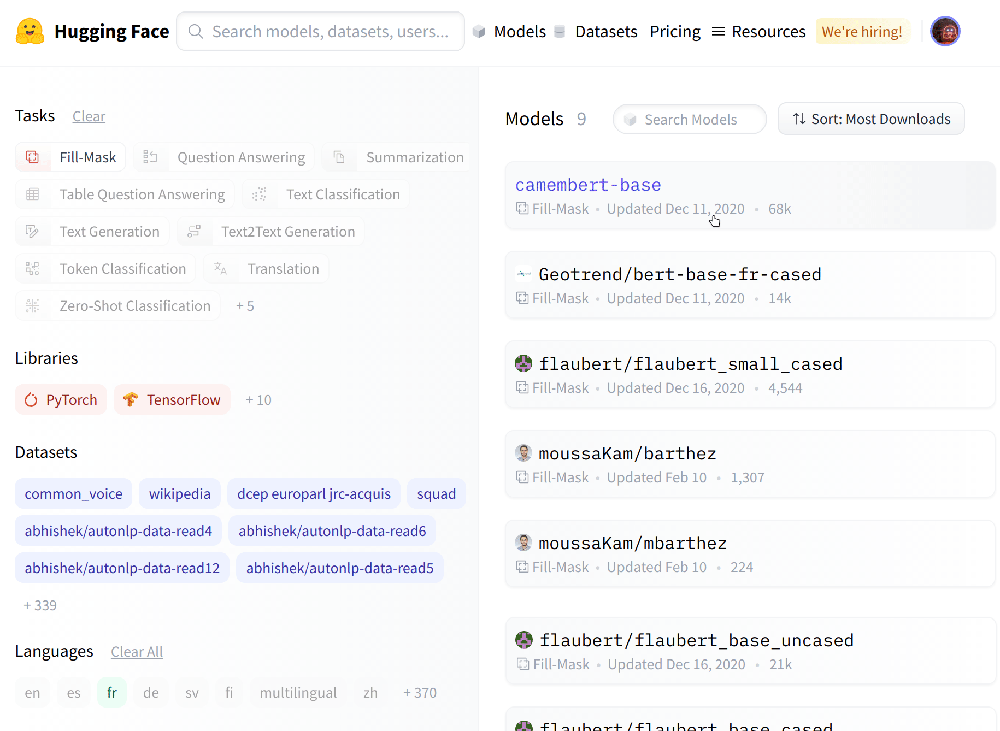

我们选择 `camembert-base` checkpoint 来尝试一下。我们需要做的仅仅是输入 `camembert-base` 标签！正如你在前几章中学习的，我们可以使用 `pipeline()` 功能：

```python
from transformers import pipeline

camembert_fill_mask = pipeline("fill-mask", model="camembert-base")
results = camembert_fill_mask("Le camembert est <mask> :)")
```

```python
[
  {'sequence': 'Le camembert est délicieux :)', 'score': 0.49091005325317383, 'token': 7200, 'token_str': 'délicieux'}, 
  {'sequence': 'Le camembert est excellent :)', 'score': 0.1055697426199913, 'token': 2183, 'token_str': 'excellent'}, 
  {'sequence': 'Le camembert est succulent :)', 'score': 0.03453313186764717, 'token': 26202, 'token_str': 'succulent'}, 
  {'sequence': 'Le camembert est meilleur :)', 'score': 0.0330314114689827, 'token': 528, 'token_str': 'meilleur'}, 
  {'sequence': 'Le camembert est parfait :)', 'score': 0.03007650189101696, 'token': 1654, 'token_str': 'parfait'}
]
```

如你所见，在管道中加载模型非常简单。你唯一需要注意的是所选 checkpoint 是否适合它将用于的任务。例如，这里我们正在将 `camembert-base` checkpoint 加载在 `fill-mask` 管道，这完全没问题。但是如果我们在 `text-classification` 管道中加载该 checkpoint 结果没有任何意义，因为 `camembert-base` 不适合这个任务！我们建议使用 Hugging Face Hub 中的任务选择器来选择合适的 checkpoint 


你还可以直接使用模型架构实例化 checkpoint 

{#if fw === 'pt'}

```python
#####Pytorch
from transformers import CamembertTokenizer, CamembertForMaskedLM

tokenizer = CamembertTokenizer.from_pretrained("camembert-base")
model = CamembertForMaskedLM.from_pretrained("camembert-base")####end
```

然而，我们建议使用 [`Auto*` 类](https://huggingface.co/transformers/model_doc/auto.html?highlight=auto#auto-classes)(https://huggingface.co/transformers/model_doc/auto.html?highlight=auto#auto-classes) ，因为 `Auto*` 类在设计时不依赖模型架构。前面的代码示例将只能在 CamemBERT 架构中加载可用的 checkpoint 但使用 `Auto*` 类使切换不同的 checkpoint 变得简单：

```python
#####Pytorch
from transformers import AutoTokenizer, AutoModelForMaskedLM

tokenizer = AutoTokenizer.from_pretrained("camembert-base")
model = AutoModelForMaskedLM.from_pretrained("camembert-base")####end
```

{:else}

```python
#####TensorFlow
from transformers import CamembertTokenizer, TFCamembertForMaskedLM

tokenizer = CamembertTokenizer.from_pretrained("camembert-base")
model = TFCamembertForMaskedLM.from_pretrained("camembert-base")####end
```

然而，我们建议使用 [`TFAuto*` 类](https://huggingface.co/transformers/model_doc/auto.html?highlight=auto#auto-classes)(https://huggingface.co/transformers/model_doc/auto.html?highlight=auto#auto-classes) ，因为 `TFAuto*` 类在设计时不依赖模型架构。前面的代码示例将只能在 CamemBERT 架构中加载可用的 checkpoint 但使用 `TFAuto*` 类使切换不同的 checkpoint 变得简单：

```python
#####TensorFlow
from transformers import AutoTokenizer, TFAutoModelForMaskedLM

tokenizer = AutoTokenizer.from_pretrained("camembert-base")
model = TFAutoModelForMaskedLM.from_pretrained("camembert-base")####end
```

{/if}

<div custom-style="Tip-green">

使用预训练模型时，一定要检查它是如何训练的、在哪些数据集上训练的、它的局限性和偏见。所有这些信息都应在其模型卡片上有所展示。
</div>

## 5.2 共享预训练模型 

接下来，我们将探索把预训练模型分享到 Hub 最便捷的方法。我们将一同研究一些工具和功能，它们可以简化直接在中心上分享和更新模型的流程。

我们鼓励所有训练模型的用户通过与社区共享来做出贡献——即使是在特定数据集上训练的模型的分享，也能帮助他人，节省他们的时间和计算资源，并提供有用的训练成果的访问。反过来，你可以从其他人所做的工作中受益！

创建模型存储仓库的方法有以下三种：

- 使用 `push_to_hub` API 接口
- 使用 `huggingface_hub` Python 库
- 使用网页界面

创建仓库后，你可以通过 git 和 git-lfs 将文件上传到其中。我们将在以下部分带领你创建模型仓库并向其中上传文件。

### 使用 `push_to_hub` API 

将文件上传到 hub 的最简单方法是利用 `push_to_hub` API 接口。

在进行下一步操作之前，你需要生成一个身份验证令牌，这样 `huggingface_hub` API 才会知道你是谁以及你对哪些空间具有写入权限。

在一个安装了 `transformers` 环境中（参见第零章）。如果你在 notebook 中，可以运行以下代码登录：

```python
from huggingface_hub import notebook_login

notebook_login()
```

在终端中，你可以运行：

```python
huggingface-cli login
```

在这两种情况下，系统都会提示你输入用户名和密码，这与你用于登录 Hub 的用户名和密码相同。如果你还没有 Huggingface 账户，则应该 [在这里](https://huggingface.co/join)(https://huggingface.co/join) 创建一个。

好极了！现在已将你的身份验证令牌存储在了缓存文件夹中。让我们创建一些仓库！

{#if fw === 'pt'}

在 PyTorch 中：

如果你已经尝试使用过 `Trainer` API 训练模型，将其上传到 Hub 的最简单方法是在定义 `TrainingArguments` 时设置 `push_to_hub=True` ：

```python
#####Pytorch
from transformers import TrainingArguments

training_args = TrainingArguments(
    "bert-finetuned-mrpc", save_strategy="epoch", push_to_hub=True
)####end
```

这样，调用 `trainer.train()` 的时候， `Trainer` 会在每次保存模型时（这里是每个训练周期）将其上传到 Hub 中你的账户下的一个仓库。该仓库的名称与你选择的输出目录名称相同（这里是 `bert-finetuned-mrpc` ），但你可以通过 `hub_model_id = "a_different_name"` 指定一个不同的名称。

若要将你的模型上传到你所属的组织，只需设置 `hub_model_id = my_organization/my_repo_name` 。

最后，需要在训练循环结束后运行 `trainer.push_to_hub()` 上传模型的最新版本。它还会生成一份包含所有相关元数据的模型卡片，包含使用的超参数和评估结果！以下是一个模型卡片的示例：


{:else}

在 TensorFlow 中：

如果你使用 Keras 来训练你的模型，则将其上传到 Hub 的最简单方法是在调用 `model.fit()` 添加 `PushToHubCallback` ：

```python
#####TensorFlow
from transformers import PushToHubCallback

callback = PushToHubCallback(
    "bert-finetuned-mrpc", save_strategy="epoch", tokenizer=tokenizer
)####end
```

然后，你应该在调用 `model.fit()` 时添加 `callbacks=[callback]` 。回调函数将在每次保存模型时（这里是每个训练周期）将你的模型上传到 Hub 的你的账户下的一个仓库。该仓库的名称你选择的输出目录名称相同（此处为 `bert-finetuned-mrpc` ），但你可以通过 `hub_model_id = "a_different_name"` 选择一个不同的名称。

要将你的模型上传到你所属的组织，只需设置如下 `hub_model_id = my_organization/my_repo_name` 。

{/if}

在更底层，你可以通过直接在模型、tokenizer 和配置对象上调用 `push_to_hub()` 方法来访问模型中心。该方法能够同时创建仓库并直接将模型和 tokenizer 文件推送至仓库，无需手动操作，这与我们在下面要看到的 API 有些许不同。

为了了解它是如何工作的，让我们首先创建一个模型和一个 tokenizer 

{#if fw === 'pt'}

```python
#####Pytorch
from transformers import AutoModelForMaskedLM, AutoTokenizer

checkpoint = "camembert-base"

model = AutoModelForMaskedLM.from_pretrained(checkpoint)
tokenizer = AutoTokenizer.from_pretrained(checkpoint)####end
```

{:else}

```python
#####TensorFlow
from transformers import TFAutoModelForMaskedLM, AutoTokenizer

checkpoint = "camembert-base"

model = TFAutoModelForMaskedLM.from_pretrained(checkpoint)
tokenizer = AutoTokenizer.from_pretrained(checkpoint)####end
```

{/if}

你可以随意进行一些操作——给 tokenizer 添加 tokens 训练模型，微调模型。直到你对最终的模型、权重和 tokenizer 满意。当你对的模最终的模型、权重和 tokenizer 感到满意，你就可以直接在 `model` 对象上调用 `push_to_hub()` 方法：

```python
model.push_to_hub("dummy-model")
```

这将在你的账户中创建新的 `dummy-model` 仓库，并将这个模型文件上传上去。

对 tokenizer 也需要进行相同的操作：

```python
tokenizer.push_to_hub("dummy-model")
```

如果你属于一个组织，只需指定 `organization` 参数即可将模型上传到该组织的账户下：

```python
tokenizer.push_to_hub("dummy-model", organization="huggingface")
```

如果你希望使用特定的 Hugging Face 令牌，你也可以很方便地将其传递给 `push_to_hub()` 方法：

```python
tokenizer.push_to_hub("dummy-model", organization="huggingface", use_auth_token="<TOKEN>")
```

现在你就可以前往 [模型中心](https://huggingface.co/user-or-organization/dummy-model)(https://huggingface.co/user-or-organization/dummy-model) 查看你新上传的模型。

单击“文件和版本（Files and versions）”选项卡，你应该能看到以下的文件：

{#if fw === 'pt'}


{:else}


{/if}

<div custom-style="Tip-green">

✏️ **试试看** 获取与 `bert-base-cased` checkpoint 相关的模型和 tokenizer 并使用 `push_to_hub()` 方法将它们上传到你账户中的一个仓库。并请仔细检查该仓库在你的页面上显示是否正常。

</div>

如你所见， `push_to_hub()` 方法接受多个参数，从而可以上传到特定的仓库或账户，除此之外还可以使用不同的 API 令牌验证身份。我们建议你直接查看 [Transformers 文档](https://huggingface.co/transformers/model_sharing.html)(https://huggingface.co/transformers/model_sharing.html) 了解更多的用法。

位于 [huggingface_hub](https://github.com/huggingface/huggingface_hub)(https://github.com/huggingface/huggingface_hub) 库里的 `push_to_hub()` 方提供了直接面向 Hugging Face Hub 的 API。它集成在 Transformers 和其他几个机器学习库中，例如 [allenlp](https://github.com/allenai/allennlp)(https://github.com/allenai/allennlp) 。虽然我们在本章中专注于 Transformers 但将其集成到你自己的代码或库中很简单。

到了最后一部分，让我们看看如何将文件上传到你新创建的仓库！

### 使用 `huggingface_hub` python 库 
`huggingface_hub` Python 库是一个包，为模型和数据集中心提供了一系列工具。它提供了简单的方法和类，可以便捷地获取 hub 中仓库的信息以及管理仓库等常见任务。它在 git 的基础上提供了简单的 API，可以在你你的项目中管理这些仓库的内容，以及 hub 的一些功能。

与使用 `push_to_hub` API 类似，这需要你将 API 令牌保存在缓存中。为此，你需要在操作系统的命令行使用 CLI 中的 `login` 命令，（如果在 Notebook 中运行，请在这些命令前添加 `!` 字符）：

```python
huggingface-cli login
```

`huggingface_hub` 包提供了几个非常便捷方法和类可以帮助我们完成 hub 的管理。首先，有一些方法可以管理仓库的创建、删除等：

```python
from huggingface_hub import (
    # 用户管理
    login,
    logout,
    whoami,

    # 仓库创建和管理
    create_repo,
    delete_repo,
    update_repo_visibility,

    # 以及一些检索/更改文件的方法
    list_models,
    list_datasets,
    list_metrics,
    list_repo_files,
    upload_file,
    delete_file,
)
```

此外，它还提供了非常强大的 `Repository` 类来管理本地仓库。我们将在接下来的几节中探讨这些方法和类，以理解如何利用它们。

可以使用 `create_repo` 方法在 Hub 上创建新的仓库：

```python
from huggingface_hub import create_repo

create_repo("dummy-model")
```

这将在你的账户中创建 `dummy-model` 仓库。除此之外你还可以使用 `organization` 参数指定仓库应属于哪个组织：

```python
from huggingface_hub import create_repo

create_repo("dummy-model", organization="huggingface")
```

这将在 `huggingface` 组织的账户中创建 `dummy-model` 仓库，如果你属于该组织并且有创建仓库的权限。

其他可能有用的一些参数有：

- `private` ，用于指定仓库是否应对其他人可见。
- `token` ，如果你希望使用特定的身份令牌，而不是缓存中的身份令牌。
- `repo_type` ，如果你希望创建一个 `dataset` 或 `space` 而不是模型。需要将 `repo_type` 设置为 `"dataset"` 和 `"space"` 。

创建仓库后，我们应该向其中添加文件！让我们到下一节，看看三种添加文件的方式。

### 使用网络界面 

Web 界面提供了直接在 Hub 中管理仓库的工具。使用该界面，你可以轻松创建仓库、添加文件（甚至是大文件！）、探索模型、可视化差异等等。

要创建新的仓库，请访问 [huggingface.co/new](https://huggingface.co/new)(https://huggingface.co/new) ：


首先，指定仓库的所有者：这可以是你或你所属的组织。如果你选择一个组织，模型将在会显示在组织的页面上，组织的每个成员可以操作仓库。

接下来，输入你的模型名称。同时也是仓库的名称。最后，你可以指定你的模型是公开的还是私有的。私有的模型将被隐藏，对其他的用户不可见。

创建模型仓库后，你应该会看到如下页面：


这就是你的模型仓库会显示的页面。你可以直接从网页界面添加 README 文件来填写它。


README 文件采用 Markdown 格式 - 你可以根据你的需要自由编写！

这一章的下一部分将帮助你建立模型卡片。这些模型卡片对于提升模型的价值非常重要，因为它们可以告诉其他人你的模型能做什么。

如果你希望添加更多文件，点击页面顶部的 “Files and versions（文件和版本）” 标签页。在这里，你可以看到仓库的所有文件以及它们的版本。


接下来我们将看看如何添加一些新文件。

### 上传模型文件 

Hugging Face Hub 的文件管理系统基于 git 用于处理常规文件，对于较大的文件则使用 git-lfs（详情请参阅 [Git 大文件存储](https://git-lfs.github.com/)(https://git-lfs.github.com/) ） 

在下一节中，我们会讲述三种不同的方式将文件上传到 Hub： `upload_file` 方法、 `Repository` 类  以及通过 git 命令。

#### `upload_file` 方法 

使用 `upload_file` 不需要在你的系统上安装 git 和 git-lfs。它使用 HTTP POST 请求将文件直接发送到 Hub。这种方法的一个限制是它不能上传大于 5GB 的文件。如果你的文件大于 5GB，请按照另外两种方法进行操作。 `upload_file` 的使用方法如下：
```python
from huggingface_hub import upload_file

upload_file(
    "<path_to_file>/config.json",
    path_in_repo="config.json",
    repo_id="<namespace>/dummy-model",
)
```

以上的代码会把 `<path_to_file>` 位置的 `config.json` 文件上传到 `dummy-model` 仓库的根目录作为模型的 `config.json` 。其他可能有用的参数包括：

- `token` ，如果你希望在这里使用特定的身份令牌，而不是缓存中的身份令牌。
- `repo_type` ，如果你希望创建一个 `dataset` 或 `space` 而不是模型。需要将 `repo_type` 设置为 `"dataset"` 和 `"space"` 。

#### `Repository` 类  `Repository` 类可以使用类似 git 的方式管理一个本地仓库。它解决了使用 git 可能遇到的大部分痛点，提供我们所需的所有功能。

使用这个类需要安装 git 和 git-lfs，所以请确保你已经安装了 git-lfs（如果没有安装，可以查看 [git-lfs 官网](https://git-lfs.github.com/)(https://git-lfs.github.com/)(https://git-lfs.github.com/) 的安装指南）并已经在操作系统里配置好了相关功能。

为了开始使用我们刚刚创建的仓库，我们可以把远程仓库克隆到一个本地文件夹：

```python
from huggingface_hub import Repository

repo = Repository("<path_to_dummy_folder>", clone_from="<namespace>/dummy-model")
```

以上代码会在我们当前的工作目录中创建 `<path_to_dummy_folder>` 文件夹。此文件夹里只有 `.gitattributes` 文件，这是使用 `create_repo` 创建仓库时生成的文件。

从现在开始，我们可以利用许多传统的 git 方法：

```python
repo.git_pull()
repo.git_add()
repo.git_commit()
repo.git_push()
repo.git_tag()
```

此外！我们建议你查看 [huggingface](https://github.com/huggingface/huggingface_hub/tree/main/src/huggingface_hub#advanced-programmatic-repository-management)(https://github.com/huggingface/huggingface_hub/tree/main/src/huggingface_hub#advanced-programmatic-repository-management) 的 `Repository` 文档，了解一下所有可用方法。

现在，我们有了一个模型和一个 tokenizer 我们希望将其推送到 hub。我们已经成功克隆了仓库，因此我们可以将文件保存到在该仓库的文件夹中。

首先，我们通过拉取最新的更改，确保我们的本地克隆是最新的：

```python
repo.git_pull()
```

完成后，我们保存模型和 tokenizer 文件：

```python
model.save_pretrained("<path_to_dummy_folder>")
tokenizer.save_pretrained("<path_to_dummy_folder>")
```

`<path_to_dummy_folder>` 现在已经存储了模型和 tokenizer 文件。我们遵循常规的 git 工作流程，将文件添加到暂存区，提交它们并推送它们到 hub：

```python
repo.git_add()
repo.git_commit("Add model and tokenizer files")
repo.git_push()
```

恭喜你！你刚刚在 hub 上推送了你的第一个文件。

#### 基于 git 的方法 

这是上传文件的最基本方法：我们将直接使用 git 和 git-lfs 进行操作。在前面的方法大部分的难点都已经被封装好的库解决，但是接下来的方法有一些注意事项，所以我们会遵循一个更复杂的使用案例。

使用这个方法需要安装 git 和 git-lfs，所以请确保你已经安装了 git-lfs（如果没有安装，可以参见 [git-lfs 官网](https://git-lfs.github.com/)(https://git-lfs.github.com/)(https://git-lfs.github.com/) 的安装指南）并已经在操作系统里配置好了相关功能。

首先，初始化 git-lfs：

```python
git lfs install
```

```python
Updated git hooks.
Git LFS initialized.
```

完成后，接下来需要克隆你的模型仓库：

```python
git clone https://huggingface.co/<namespace>/<your-model-id>
```

我的用户名是 `lysandre` 我使用的模型的名称是 `dummy` ，所以对我来说，命令最终如下所示：

```python
git clone https://huggingface.co/lysandre/dummy
```

我现在在工作目录中多了一个名为 dummy 的文件夹。我可以 cd 到这个文件夹，看看其中的内容：

```python
cd dummy && ls
```

```python
README.md
```

如果你刚刚用的是 Hugging Face Hub 的 `create_repo` 方法创建的仓库，这个文件夹应该只包含一个隐藏的 .gitattributes 文件。如果你使用的是网页界面创建了一个仓库，那么文件夹应该只包含一个 README.md 文件和一个隐藏的 .gitattributes 文件。

较小的文件，如配置文件、词汇表文件，或者基本上任何几 MB 以下的文件，就像我们平时使用 git 一样。然而，更大的文件必须通过 git-lfs 注册才能推送到 huggingface.co。

让我们回到 Python，生成一些我们希望提交到 dummy 仓库的模型和 tokenizer 

{#if fw === 'pt'}

```python
#####Pytorch
from transformers import AutoModelForMaskedLM, AutoTokenizer

checkpoint = "camembert-base"

model = AutoModelForMaskedLM.from_pretrained(checkpoint)
tokenizer = AutoTokenizer.from_pretrained(checkpoint)

# 对模型进行一些操作,训练、微调...

model.save_pretrained("<path_to_dummy_folder>")
tokenizer.save_pretrained("<path_to_dummy_folder>")####end
```

{:else}

```python
#####TensorFlow
from transformers import TFAutoModelForMaskedLM, AutoTokenizer

checkpoint = "camembert-base"

model = TFAutoModelForMaskedLM.from_pretrained(checkpoint)
tokenizer = AutoTokenizer.from_pretrained(checkpoint)

# 对模型进行一些操作,训练、微调...

model.save_pretrained("<path_to_dummy_folder>")
tokenizer.save_pretrained("<path_to_dummy_folder>")####end
```

{/if}

现在我们已经保存了模型和 tokenizer 让我们再看一下 dummy 文件夹：

```python
ls
```

{#if fw === 'pt'}

```python
#####Pytorch
config.json  pytorch_model.bin  README.md  sentencepiece.bpe.model  special_tokens_map.json tokenizer_config.json  tokenizer.json####end
```

如果你尝试查看文件大小（例如，使用 `ls -lh` 命令），你应该看到模型状态字典文件（`pytorch_model.bin` / `t5_model.h5`）是唯一的异常的文件，超过了 400 MB。

{:else}

```python
#####TensorFlow
config.json  README.md  sentencepiece.bpe.model  special_tokens_map.json  tf_model.h5  tokenizer_config.json  tokenizer.json####end
```

{/if}

<div custom-style="Tip-green">

✏️ 当通过网页界面创建仓库时， `.gitattributes` 文件会自动将某些扩展名（如 `.bin` 和 `.h5` ）的文件视为大文件，你无需对 git-lfs 进行任何设置即可跟踪它们。
</div> 

我们现在可以继续进行，就像我们使用传统 Git 仓库一样。我们可以使用以下命令将所有文件添加到 Git 的暂存环境中 `git add` 命令：

```python
git add .
```

然后我们可以查看当前暂存的文件：

```python
git status
```

{#if fw === 'pt'}

```python
#####Pytorch
On branch main
Your branch is up to date with 'origin/main'.

Changes to be committed:
  (use "git restore --staged <file>..." to unstage)
  modified:   .gitattributes
	new file:   config.json
	new file:   pytorch_model.bin
	new file:   sentencepiece.bpe.model
	new file:   special_tokens_map.json
	new file:   tokenizer.json
	new file:   tokenizer_config.json####end
```

{:else}

```python
#####TensorFlow
On branch main
Your branch is up to date with 'origin/main'.

Changes to be committed:
  (use "git restore --staged <file>..." to unstage)
  modified:   .gitattributes
  	new file:   config.json
	new file:   sentencepiece.bpe.model
	new file:   special_tokens_map.json
	new file:   tf_model.h5
	new file:   tokenizer.json
	new file:   tokenizer_config.json####end
```

{/if}

同样，我们可以使用 `status` 命令查看 git-lfs 正在跟踪的文件：

```python
git lfs status
```

{#if fw === 'pt'}

```python
#####Pytorch
On branch main
Objects to be pushed to origin/main:

Objects to be committed:

	config.json (Git: bc20ff2)
	pytorch_model.bin (LFS: 35686c2)
	sentencepiece.bpe.model (LFS: 988bc5a)
	special_tokens_map.json (Git: cb23931)
	tokenizer.json (Git: 851ff3e)
	tokenizer_config.json (Git: f0f7783)

Objects not staged for commit:
####end
```

我们可以看到所有文件都使用 `Git` 作为处理程序，除了 `pytorch_model.bin` 和 `sentencepiece.bpe.model` / `t5_model.h5`它们的处理程序是 `LFS` 。

{:else}

```python
#####TensorFlow
On branch main
Objects to be pushed to origin/main:

Objects to be committed:

	config.json (Git: bc20ff2)
	sentencepiece.bpe.model (LFS: 988bc5a)
	special_tokens_map.json (Git: cb23931)
	tf_model.h5 (LFS: 86fce29)
	tokenizer.json (Git: 851ff3e)
	tokenizer_config.json (Git: f0f7783)

Objects not staged for commit:
####end
```

{/if}

让我们继续进行最后的步骤，提交并推送到 huggingface.co 远程仓库：

```python
git commit -m "First model version"
```

{#if fw === 'pt'}

```python
#####Pytorch
[main b08aab1] First model version
 7 files changed, 29027 insertions(+)
  6 files changed, 36 insertions(+)
 create mode 100644 config.json
 create mode 100644 pytorch_model.bin
 create mode 100644 sentencepiece.bpe.model
 create mode 100644 special_tokens_map.json
 create mode 100644 tokenizer.json
 create mode 100644 tokenizer_config.json####end
```

{:else}

```python
#####TensorFlow
[main b08aab1] First model version
 6 files changed, 36 insertions(+)
 create mode 100644 config.json
 create mode 100644 sentencepiece.bpe.model
 create mode 100644 special_tokens_map.json
 create mode 100644 tf_model.h5
 create mode 100644 tokenizer.json
 create mode 100644 tokenizer_config.json####end
```
{/if}

推送可能需要一些时间，具体取决于你的网络速度以及你的文件大小：

```python
git push
```

```python
Uploading LFS objects: 100% (1/1), 433 MB | 1.3 MB/s, done.
Enumerating objects: 11, done.
Counting objects: 100% (11/11), done.
Delta compression using up to 12 threads
Compressing objects: 100% (9/9), done.
Writing objects: 100% (9/9), 288.27 KiB | 6.27 MiB/s, done.
Total 9 (delta 1), reused 0 (delta 0), pack-reused 0
To https://huggingface.co/lysandre/dummy
   891b41d..b08aab1  main -> main
```

在 Pytorch 中：

当这些都完成时，如果我们查看模型仓库，我们可以看到所有最近添加的文件：


在Huggingface 的网页上你可以查看模型文件和提交，并查看每次提交引入的差异：


在 TensorFlow 中：

当这些都完成时，如果我们查看模型仓库，我们可以看到所有最近添加的文件：


在Huggingface 的网页上你可以查看模型文件和提交，并查看每次提交引入的差异：

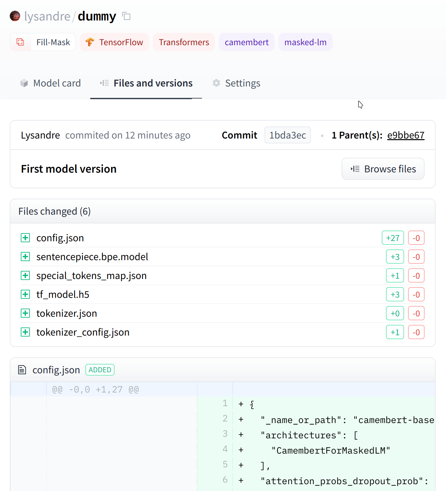

## 5.3 构建模型卡片 

模型卡片是一个配置文件，可以说与模型存储库中的模型和 tokenizer 文件一样重要。它包含了模型的核心定义，确保了社区成员可以复现模型的结果，并提供一个其他成员可以在这个模型基础上构建他们的组件的平台。

记录训练和评估过程并提供有关使用的数据以及已完成的预处理和后续处理的足够信息，有助于其他人了解对模型的能力——模型存的局限性、偏见以及模型有效或无效的使用场景。

因此，创建一个清晰定义你的模型的模型卡片是非常重要的一步。在这里，我们提供了一些可以帮助你创建模型卡片的建议。创建模型卡片是通过你之前看到的 README.md 文件完成的，这是一个 Markdown 文件。

“模型卡片”的概念源于谷歌的一个研究方向，Margaret Mitchell 等人在论文 [“模型卡片用于模型报告”](https://arxiv.org/abs/1810.03993)(https://arxiv.org/abs/1810.03993) 中首次提出，这里许多内容均基于该论文，我们建议你查看这篇论文以了解为什么模型卡片在实现可复现性、可重用性和公平性的中如此重要。

模型卡通常以非常简短的概述开始，说明模型的用途，然后是模型卡片需要的其他信息：

- 模型描述
- 预期用途和限制
- 如何使用
- 局限性和偏见
- 训练数据
- 训练程序
- 评价结果

让我们来看看每个部分应该包含什么。

#### 模型描述：

提供了有关模型的基本详细信息。这包括架构、版本、如果它是在论文中介绍的，是否有原始的实现可用？作者以及有关模型的一般信息、任何版权都应归于此处。这一部分还可以提及有关训练程序、参数和重要免责声明的一般信息。

#### 预期用途和限制：

在此描述模型可以适用的例子，包括它可以适用的语言、领域。模型卡的这一部分还可以记录已知超出模型范围的区域，或者可能表现不佳的区域。

#### 使用方法：

此部分应包括一些有关如何使用模型的示例。这可以展示使用 `pipeline()` 函数、模型和 tokenizer 的使用以及其他任何你认为可能有帮助的代码。

#### 训练数据：

这部分应该指出模型是在哪个数据集上训练的。也欢迎对数据集进行简要描述。

#### 训练过程：

此部分中，你应该描述从再现性角度来看有用的训练的所有相关方面。这包括对数据进行的任何预处理和后处理，以及模型训练的批量数、批量大小、学习率等细节。

#### 变量和指标：

在这里，你应该描述你用于评估的指标，以及你测量的不同因素。提及使用了哪些指标、在哪个数据集上以及哪个数据集部分，可以轻松地将你的模型的性能与其他模型的性能进行比较。

#### 评估结果：

这些应该提前在前面的部分告知，例如预期的使用效果和示例。最后，提供模型在评估数据集上的表现的指示。如果模型使用决策阈值，要么提供评估中使用的决策阈值，要么提供在不同阈值下针对预期用途进行评估的详细信息。

### 示例 

请查看以下几个精心制作的模型卡的示例：

* [bert-base-cased](https://huggingface.co/bert-base-cased)(https://huggingface.co/bert-base-cased) 
* [gpt2](https://huggingface.co/gpt2)(https://huggingface.co/gpt2) 
* [distilbert](https://huggingface.co/distilbert-base-uncased)(https://huggingface.co/distilbert-base-uncased) 

更多来自于不同组织和公司的示例可以在 [模型卡片示例](https://github.com/huggingface/model_card/blob/master/examples.md)(https://github.com/huggingface/model_card/blob/master/examples.md) 中查阅．

### 注意事项 

发布模型时，并非必须有模型卡片，制作一个模型时不需要包含上述所有部分。但是，模型的文档会使未来的用户受益，因此我们建议你尽你所知和能力所及地尽可能填写尽可能多的部分。

### 模型卡片元数据 

如果你对 Hugging Face Hub 进行了一些探索，你应该已经看到某些模型属于某些类别：你可以按任务、语言、库等对其进行筛选。模型所属的类别来自于你在模型卡片头部中添加的元数据。

例如，如果你看一下 [`camembert-base` 模型卡片](https://huggingface.co/camembert-base/blob/main/README.md)(https://huggingface.co/camembert-base/blob/main/README.md) ，你应该在模型卡头部中看到以下几行：

```python
---
language: fr
license: mit
datasets:
- oscar
---
```

该元数据由 Hugging Face Hub 解析，然后将这个模型识别为法语模型，拥有 MIT 许可证，在 Oscar 数据集上训练。

可以在 [全部模型卡片的规格](https://raw.githubusercontent.com/huggingface/huggingface_hub/main/modelcard.md)(https://raw.githubusercontent.com/huggingface/huggingface_hub/main/modelcard.md) 查阅支持的语言、许可证、标签、数据集、指标以及模型在训练时获得的评估结果。

## 5.4 章末总结及测试

你现在应该能够针对文本分类问题（单个或成对句子）对预训练模型进行微调，并将结果上传到模型中心。为确保你掌握了第一部分的内容，你应该针对你感兴趣的想法进行尝试（不一定是英语）！一旦你完成，你可以在 [Hugging Face 社区](https://discuss.huggingface.co/)(https://discuss.huggingface.co/) 的 [这个话题](https://discuss.huggingface.co/t/share-your-projects/6803)(https://discuss.huggingface.co/t/share-your-projects/6803) 分享你的项目。

我们迫不及待地想看到你会用这些内容做出什么！

### 章末小测试

让我们测试一下你在本章所学的知识！

####  1.往Hub 上传模型有什么限制？

1. 模型需要来自Transformers 库。
2. 所有与Transformers 库接口类似的模型。
3. 没有限制。
4. 在某种程度上与 NLP 相关的模型。

####  2．如何管理 Hub 上的模型？

1. 通过 GCP 帐户。
2. 通过点对点分发。
3. 通过 git 和 git-lfs。

####  3．你能使用 Hugging Face Hub 网页接口做什么？

1. Fork 现有的存储库。
2. 创建一个新的模型库。
3. 管理和编辑文件。
4. 上传文件。
5. 看看不同版本的差异。

####  4．什么是模型卡片？

1. 模型的粗略描述，因此不如模型和 tokenizer 文件重要。
2. 一种确保可复现性、可重用性和公平性的方法。
3. 一个 Python 文件，可以运行它来检索有关模型的信息。

####  5．哪些Transformers 库的对象可以直接通过 `push_to_hub()` 分享到 Hub？

1. tokenizer 
2. 模型的 Config 对象
3. Model 类
4. Trainer(只在pytorch中的类，tensorflow中没有)

####  6．当使用 `push_to_hub()` 方法或 CLI 工具时，第一步是什么？

1. 在浏览器中登录网站。
2. 在终端中运行'huggingface-cli login'。
3. 在 Notebook 中运行'notebook_login ()'。

####  7．你正在使用一个模型和一个 tokenizer ——如何将它们上传到 Hub？

1. 通过直接在模型和 tokenizer 上调用 push_to_hub 方法。
2. 在 Python 运行时中，使用 `huggingface_hub` 中的方法进行封装。
3. 将它们保存到磁盘并调用 `transformers-cli upload-model` 

####  8．你可以使用'Repository'类执行哪些 git 操作？

1. 提交（commit）
2. 拉取（pull）
3. 推送（push）
4. 合并（merge）

### 解析

####  1.往Hub 上传模型有什么限制？

正确选项: 3. 没有限制。

1. 模型需要来自Transformers 库。    
解析: 虽然 Hugging Face Hub 支持 Transformers 库中的模型，但是其他的库的模型也可以上传到 Hub！
2. 所有与Transformers 库接口类似的模型。    
解析: 将模型上传到 Hugging Face Hub 时，没有对接口有限制。
3. 没有限制。    
解析: 对！在将模型上传到 Hub 时没有限制。
4. 在某种程度上与 NLP 相关的模型。    
解析: 对模型适用的领域没有要求！

####  2．如何管理 Hub 上的模型？

正确选项: 3. 通过 git 和 git-lfs。

3. 通过 git 和 git-lfs。    
解析: 正确！Hub 上的模型就是简单的 Git 仓库，并使用 `git-lfs` 处理大型文件。

####  3．你能使用 Hugging Face Hub 网页接口做什么？

正确选项: 2. 创建一个新的模型库。

正确选项: 3. 管理和编辑文件。

正确选项: 4. 上传文件。

正确选项: 5. 看看不同版本的差异。

1. Fork 现有的存储库。    
解析: 在 Hugging Face Hub 上无法 Fork 存储库。
2. 创建一个新的模型库。    
解析: 没错！不过，但你能做的不止这些。
3. 管理和编辑文件。    
解析: 正确！不过，但这不是唯一正确的答案。
4. 上传文件。    
解析: 对！但还有更多可以做的。
5. 看看不同版本的差异。    
解析: 没错！不过，这并不是你能做的全部。

####  4．什么是模型卡片？

正确选项: 2. 一种确保可复现性、可重用性和公平性的方法。

1. 模型的粗略描述，因此不如模型和 tokenizer 文件重要。    
解析: 这确实是对模型的描述，但它是一个重要的部分：如果它不完整或缺失，模型的实用性将大幅降低。
2. 一种确保可复现性、可重用性和公平性的方法。    
解析: 正确！在模型卡片中共享正确的信息将帮助用户利用你的模型，并了解其局限性和偏见。
3. 一个 Python 文件，可以运行它来检索有关模型的信息。    
解析: 模型卡片是简单的 Markdown 文件。

####  5．哪些Transformers 库的对象可以直接通过 `push_to_hub()` 分享到 Hub？

正确选项: 1. tokenizer 

正确选项: 2. 模型的 Config 对象

正确选项: 3. Model 类

正确选项: 4. Trainer(只在pytorch中的类，tensorflow中没有)

1.  tokenizer     
解析: 正确！所有 tokenizer 都有 `push_to_hub` 方法，使用该方法将把 tokenizer 的全部文件（词汇表、 tokenizer 的架构等）推送到给定的存储库。不过，这不是唯一正确的答案！
2. 模型的 Config 对象    
解析: 对！所有模型的 Config 对象都有 push_to_hub 方法，使用这个方法可以将它们推送到给定的存储库。你还有其他的答案吗？
3. Model 类    
解析: 正确！所有的 Model 类都有 `push_to_hub` 方法，使用它会将它们及其配置文件推送到给定的存储库。不过，还有其他的正确答案
4. Trainer(只在pytorch中的类，tensorflow中没有)    
解析: 没错 —— Trainer 也实现了 push_to_hub 方法，并且使用它可以将模型、配置、 tokenizer 和模型卡片上传到指定的仓库。试试其他答案！

####  6．当使用 `push_to_hub()` 方法或 CLI 工具时，第一步是什么？

正确选项: 2. 在终端中运行'huggingface-cli login'。

正确选项: 3. 在 Notebook 中运行'notebook_login ()'。

1. 在浏览器中登录网站。    
解析: 在浏览器中登录网站这对你的本地上使用 `push_to_hub()` 方法或 CLI 工具没有帮助。
2. 在终端中运行'huggingface-cli login'。    
解析: 正确——这将下载并缓存你的个人令牌。
3. 在 Notebook 中运行'notebook_login ()'。    
解析: 正确——这将显示一个小部件，让你进行身份验证。

####  7．你正在使用一个模型和一个 tokenizer ——如何将它们上传到 Hub？

正确选项: 1. 通过直接在模型和 tokenizer 上调用 push_to_hub 方法。

1. 通过直接在模型和 tokenizer 上调用 push_to_hub 方法。    
解析: 正确！
2. 在 Python 运行时中，使用 `huggingface_hub` 中的方法进行封装。    
解析: 模型和 tokenizer 已经使用 `huggingface_hub` 封装过了：不需要额外的封装！
3. 将它们保存到磁盘并调用 `transformers-cli upload-model`     
解析: 命令 `upload-model` 不存在。

####  8．你可以使用'Repository'类执行哪些 git 操作？

正确选项: 1. 提交（commit）

正确选项: 2. 拉取（pull）

正确选项: 3. 推送（push）

1. 提交（commit）    
解析: 正确， `git_commit()` 方法就是为此而存在的。
2. 拉取（pull）    
解析: 这就是 `git_pull()` 方法的功能。
3. 推送（push）    
解析: 方法 `git_push()` 可以做到这一点。
4. 合并（merge）    
解析: 不，这个操作在这个 API 中是无法实现的。

# 第六章 Datasets库

我们在第四章第一次体验了Datasets 库，了解到微调模型主要有三个步骤：

1. 从 Hugging Face Hub 加载数据集。
2. 使用 `Dataset.map()` 预处理数据。
3. 加载和计算指标（特征）。

但这仅仅触及了Datasets 库能做的事情的冰山一角！在本章，我们将深入探索这个库。一路上，我们会找到以下问题的答案：

* 当你的数据集不在 Hub 上时，你应该怎么做？
* 你如何切分和操作数据集？（如果你非常需要使用 Pandas，该如何处理？）
* 当你的数据集非常大，会撑爆你笔记本电脑的 RAM 时，你应该怎么办？
* 什么是“内存映射”和 “Apache Arrow”？
* 如何创建自己的数据集并将其推送到中心？

你在这里学到的技术将为你在第七章和第八章中的高级 tokenization 和微调任务做好准备——所以，来杯咖啡，让我们开始吧！

## 6.1 如果我的数据集不在 Hub 上怎么办？

你以及知道如何使用 [Hugging Face Hub](https://huggingface.co/datasets)(https://huggingface.co/datasets) 中的数据集，但你往往会发现自己需要处理在自己的笔记本电脑或者网络上的数据集。在本节中，我们将展示如何使用Datasets 加载不在 Hugging Face Hub 中的数据集。

### 使用本地和远程数据集 

Datasets 提供了加载本地和远程数据集的方法。它支持几种常见的数据格式，例如：

|       数据格式      |    类型参数    |                         加载的指令                            |
| :----------------: | :------------: | :-----------------------------------------------------: |
|     CSV & TSV      | `csv` | `load_dataset("csv", data_files="my_file.csv")` |
|     Text files     | `text` | `load_dataset("text", data_files="my_file.txt")` |
| JSON & JSON Lines  | `json` | `load_dataset("json", data_files="my_file.jsonl")` |
| Pickled DataFrames | `pandas` | `load_dataset("pandas", data_files="my_dataframe.pkl")` |

如表所示，对于每种数据格式，我们只需要在 `load_dataset()` 函数中指定数据的类型，并使用 `data_files` 指定一个或多个文件的路径的参数。首先，我们从加载本地文件的数据集开始；稍后，我们将看到如何使用远程文件做同样的事情。

### 加载本地数据集 

在这个例子中，我们将使用 [SQuAD-it 数据集](https://github.com/crux82/squad-it/)(https://github.com/crux82/squad-it/) ，这是一个用于意大利语问答的大规模数据集。

训练集和测试集都托管在 GitHub 上，因此我们可以通过 `wget` 命令非常简单地下载它们：

```python
!wget https://github.com/crux82/squad-it/raw/master/SQuAD_it-train.json.gz
!wget https://github.com/crux82/squad-it/raw/master/SQuAD_it-test.json.gz
```

这将下载两个名为 `SQuAD_it-train.json.gz` 和 `SQuAD_it-test.json.gz` 的压缩文件，我们可以用 Linux 的 `gzip` 命令解压他们：

```python
!gzip -dkv SQuAD_it-*.json.gz
```

```python
SQuAD_it-test.json.gz:	   87.4% -- replaced with SQuAD_it-test.json
SQuAD_it-train.json.gz:	   82.2% -- replaced with SQuAD_it-train.json
```

我们可以看到压缩文件已经被替换为 `SQuAD_it-train.json` 和 `SQuAD_it-test.json` ，并且数据以 JSON 格式存储。

<div custom-style="Tip-green">

✏️ 如果你想知道为什么上面的 shell 命令中有一个 `!` ，那是因为我们是在 Jupyter notebook 中运行它们。如果你想在命令行中下载和解压缩数据集，只需删除前缀 `!` 即可。

</div>

当我们使用 `load_dataset()` 函数来加载 JSON 文件时，我们需要知道我们是在处理普通的 JSON（类似于嵌套字典）还是 JSON Lines（每一行都是一个 JSON）。像许多问答数据集一样，SQuAD-it 使用的是嵌套格式，所有文本都存储在 `data` 字段中。这意味着我们可以通过使用参数 `field` 来加载数据集，如下所示：

```python
from datasets import load_dataset

squad_it_dataset = load_dataset("json", data_files="SQuAD_it-train.json", field="data")
```

默认情况下，加载本地文件会创建一个带有 `train` 标签的 `DatasetDict` 对象。我们可以在这里查看一下 `squad_it_dataset` 对象：

```python
squad_it_dataset
```

```python
DatasetDict({
    train: Dataset({
        features: ['title', 'paragraphs'],
        num_rows: 442
    })
})
```

输出了与训练集的行数和列名。我们可以使用 `train` 标签来查看一个示例，如下所示：

```python
squad_it_dataset["train"][0]
```

```python
{
    "title": "Terremoto del Sichuan del 2008",
    "paragraphs": [
        {
            "context": "Il terremoto del Sichuan del 2008 o il terremoto...",
            "qas": [
                {
                    "answers": [{"answer_start": 29, "text": "2008"}],
                    "id": "56cdca7862d2951400fa6826",
                    "question": "In quale anno si è verificato il terremoto nel Sichuan?",
                },
                ...
            ],
        },
        ...
    ],
}
```

很好，我们已经加载了我们的第一个本地数据集！但是，也仅仅加载了训练集，我们真正想要的是包含 `train` 和 `test` 的 `DatasetDict` 对象。这样的话就可以使用 `Dataset.map()` 函数同时处理训练集和测试集。为此，我们向 `data_files` 参数输入一个字典，将数据集的标签名映射到相关联的文件：

```python
data_files = {"train": "SQuAD_it-train.json", "test": "SQuAD_it-test.json"}
squad_it_dataset = load_dataset("json", data_files=data_files, field="data")
squad_it_dataset
```

```python
DatasetDict({
    train: Dataset({
        features: ['title', 'paragraphs'],
        num_rows: 442
    })
    test: Dataset({
        features: ['title', 'paragraphs'],
        num_rows: 48
    })
})
```

这正是我们想要的。现在，我们可以采用各种预处理技术来清洗数据、tokenize 评论等等。

<div custom-style="Tip-green">`load_dataset()` 函数的 `data_files` 参数非常灵活：可以是单个文件路径、文件路径列表或者是标签映射到文件路径的字典。你还可以根据 Unix shell 的规则，对符合指定模式的文件进行通配（例如，你可以通过设置 `data_files="*.JSON"` 匹配目录中所有的 JSON 文件）。有关更多详细信息，请参阅 [Datasets 文档](https://huggingface.co/docs/datasets/v2.12.0/en/loading#local-and-remote-files)(https://huggingface.co/docs/datasets/v2.12.0/en/loading#local-and-remote-files) 。

</div>

Datasets 实际上支持自动解压输入文件，所以我们可以跳过使用 `gzip` ，直接将 `data_files` 参数设置为压缩文件：

```python
data_files = {"train": "SQuAD_it-train.json.gz", "test": "SQuAD_it-test.json.gz"}
squad_it_dataset = load_dataset("json", data_files=data_files, field="data")
```

如果你不想手动解压缩许多 GZIP 文件，这会很有用。自动解压也支持于其他常见格式，如 ZIP 和 TAR，因此你只需将 `data_files` 设置为压缩文件所在的路径，接下来就交给Datasets 吧！

现在你知道如何在笔记本电脑或台式机上加载本地文件，让我们来看看加载远程文件。

### 加载远程数据集 

如果你在公司担任数据研究员或编码员，那么你要分析的数据集很有可能存储在某个远程服务器上。幸运的是，加载远程文件就像加载本地文件一样简单！我们只需要将 `load_dataset()` 的 `data_files` 参数指向存储远程文件的一个或多个 URL。例如，对于托管在 GitHub 上的 SQuAD-it 数据集，我们可以将 `data_files` 设置为指向 `SQuAD_it-*.json.gz` 的网址，如下所示：

```python
url = "https://github.com/crux82/squad-it/raw/master/"
data_files = {
    "train": url + "SQuAD_it-train.json.gz",
    "test": url + "SQuAD_it-test.json.gz",
}
squad_it_dataset = load_dataset("json", data_files=data_files, field="data")
```

这将返回和上面的本地例子相同的 `DatasetDict` 对象，但省去了我们手动下载和解压 `SQuAD_it-*.json.gz` 文件的步骤。这是我们对加载未托管在 Hugging Face Hub 的数据集的各种方法的总结。既然我们已经有了一个可以使用的数据集，让我们开始大展身手吧！

<div custom-style="Tip-green">

✏️ **试试看！** 选择托管在 GitHub 或 [UCI 机器学习仓库](https://archive.ics.uci.edu/ml/index.php)(https://archive.ics.uci.edu/ml/index.php) 上的另一个数据集并尝试使用上述技术在本地和远程加载它。另外，可以尝试加载 CSV 或者文本格式存储的数据集（有关这些格式的更多信息，请参阅 [文档](https://huggingface.co/docs/datasets/loading.html#local-and-remote-files)(https://huggingface.co/docs/datasets/loading.html#local-and-remote-files) ）。

</div>


## 6.2 分割和整理数据 

大多数情况下，你处理的数据并不能直接用于训练模型。在本节中，我们将探索Datasets 提供的各种功能，用于清洗你的数据集。

### 分割和整理我们的数据 

与 Pandas 类似，Datasets 提供了多个函数来操作 `Dataset` 和 `DatasetDict` 对象。我们在第四章已经遇到了 `Dataset.map()` 方法，在本节中，我们将探索一些其他可用的函数。

在本例中，我们将使用托管在 [加州大学欧文分校机器学习存储库](https://archive.ics.uci.edu/ml/index.php)(https://archive.ics.uci.edu/ml/index.php) 的 [药物审查数据集](https://archive.ics.uci.edu/ml/datasets/Drug+Review+Dataset+%28Drugs.com%29)(https://archive.ics.uci.edu/ml/datasets/Drug+Review+Dataset+%28Drugs.com%29) ，其中包含患者对各种药物的评论，以及正在治疗的病情和患者满意度的 10 星评价。

首先我们需要下载并解压数据，可以通过 `wget` 和 `unzip` 命令：

```python
!wget "https://archive.ics.uci.edu/ml/machine-learning-databases/00462/drugsCom_raw.zip"
!unzip drugsCom_raw.zip
```

由于 TSV 仅仅是 CSV 的一个变体，它使用制表符而不是逗号作为分隔符，我们可以使用加载 `csv` 文件的 `load_dataset()` 函数并指定分隔符，来加载这些文件：

```python
from datasets import load_dataset

data_files = {"train": "drugsComTrain_raw.tsv", "test": "drugsComTest_raw.tsv"}
# \t 在python中是制表符的意思
drug_dataset = load_dataset("csv", data_files=data_files, delimiter="\t")
```

在进行数据分析时，获取一个小的随机样本以快速了解你正在处理的数据特点是一种好的实践。在数据集中，我们可以通过链接 `Dataset.shuffle()` 和 `Dataset.select()` 函数创建一个随机的样本：

```python
drug_sample = drug_dataset["train"].shuffle(seed=42).select(range(1000))
# 细看前几个例子
drug_sample[:3]
```

```python
{'Unnamed: 0': [87571, 178045, 80482],
 'drugName': ['Naproxen', 'Duloxetine', 'Mobic'],
 'condition': ['Gout, Acute', 'ibromyalgia', 'Inflammatory Conditions'],
 'review': ['"like the previous person mention, I&#039;m a strong believer of aleve, it works faster for my gout than the prescription meds I take. No more going to the doctor for refills.....Aleve works!"',
  '"I have taken Cymbalta for about a year and a half for fibromyalgia pain. It is great\r\nas a pain reducer and an anti-depressant, however, the side effects outweighed \r\nany benefit I got from it. I had trouble with restlessness, being tired constantly,\r\ndizziness, dry mouth, numbness and tingling in my feet, and horrible sweating. I am\r\nbeing weaned off of it now. Went from 60 mg to 30mg and now to 15 mg. I will be\r\noff completely in about a week. The fibro pain is coming back, but I would rather deal with it than the side effects."',
  '"I have been taking Mobic for over a year with no side effects other than an elevated blood pressure.  I had severe knee and ankle pain which completely went away after taking Mobic.  I attempted to stop the medication however pain returned after a few days."'],
 'rating': [9.0, 3.0, 10.0],
 'date': ['September 2, 2015', 'November 7, 2011', 'June 5, 2013'],
 'usefulCount': [36, 13, 128]}
```

请注意，出于可以复现的目的，我们已将在 `Dataset.shuffle()` 设定了固定的随机数种子。 `Dataset.select()` 需要一个可迭代的索引，所以我们传递了 `range(1000)` 从随机打乱的数据集中抽取前 1,000 个示例。从抽取的数据中，我们已经可以看到我们数据集中有一些特殊的地方：

* `Unnamed: 0` 这列看起来很像每个患者的匿名 ID。
* `condition` 列包含了大小写混合的标签。
* 评论长短不一，混合有 Python 行分隔符 （ `\r\n` ） 以及 HTML 字符代码，如 `&\#039;` 。
  

让我们看看我们如何使用 Datasets 来处理这些问题。为了验证 `Unnamed: 0` 列存储的是患者 ID 的猜想，我们可以使用 `Dataset.unique()` 函数来验证匿名 ID 的数量是否与分割后每个分组中的行数匹配：

```python
for split in drug_dataset.keys():
    assert len(drug_dataset[split]) == len(drug_dataset[split].unique("Unnamed: 0"))
```

这似乎证实了我们的假设，所以让我们把 `Unnamed: 0` 列重命名为患者的 id。我们可以使用 `DatasetDict.rename_column()` 函数来一次性重命名两个分组：

```python
drug_dataset = drug_dataset.rename_column(
    original_column_name="Unnamed: 0", new_column_name="patient_id"
)
drug_dataset
```

```python
DatasetDict({
    train: Dataset({
        features: ['patient_id', 'drugName', 'condition', 'review', 'rating', 'date', 'usefulCount'],
        num_rows: 161297
    })
    test: Dataset({
        features: ['patient_id', 'drugName', 'condition', 'review', 'rating', 'date', 'usefulCount'],
        num_rows: 53766
    })
})
```

<div custom-style="Tip-green">

✏️  **试试看！** 使用 `Dataset.unique()` 函数查找训练和测试集中的特定药物和病症的数量。

</div>

接下来，让我们使用 `Dataset.map()` 来规范所有的 `condition` 标签。正如我们在第四章中处理 tokenizer 一样，我们可以定义一个简单的函数，可以使用该函数处理 `drug_dataset` 每个分组的所有行：

```python
def lowercase_condition(example):
    return {"condition": example["condition"].lower()}

drug_dataset.map(lowercase_condition)
```

```python
AttributeError: 'NoneType' object has no attribute 'lower'
```

哦不，我们的 map 功能遇到了问题！从错误中我们可以推断出 `condition` 列存在 `None` ，不能转换为小写，因为它们不是字符串。让我们使用 `Dataset.filter()` 删除这些行 其工作方式类似于 `Dataset.map()` 。例如：

```python
def filter_nones(x):
    return x["condition"] is not None
```

然后运行 `drug_dataset.filter(filter_nones)` ，我们可以用 lambda 函数在一行代码完成这个任务。在 Pyhton 中，lambda 函数是你无需明确命名即可使用的微函数（匿名函数）。它们一般采用如下形式：

```python
lambda <arguments> : <expression>
```

其中 `lambda` 是 Python 的特殊 [关键字](https://docs.python.org/3/reference/lexical_analysis.html#keywords)(https://docs.python.org/3/reference/lexical_analysis.html#keywords) 之一， `arguments` 是以逗号进行分隔的函数参数的列表/集合， `expression` 代表你希望执行的操作。例如，我们可以定义一个简单的 lambda 函数来对一个数字进行平方，如下所示：

```python
lambda x : x * x
```

我们需要将要输入放在括号中：

```python
(lambda x: x * x)(3)
```

```python
9
```

同样，我们可以通过使用逗号分隔来定义带有多个参数的 lambda 函数。例如，我们可以按如下方式计算三角形的面积：

```python
(lambda base, height: 0.5 * base * height)(4, 8)
```

```python
16.0
```

当你想定义小型、一次性使用的函数时，lambda 函数非常方便（有关它们的更多信息，我们建议阅读 Andre Burgaud 写的 [真正的Python教程](https://realpython.com/python-lambda/)(https://realpython.com/python-lambda/) ）。在Datasets 中，我们可以使用 lambda 函数来定义简单的映射和过滤操作，所以让我们使用这个技巧来删除我们数据集中的 `None` 条目：

```python
drug_dataset = drug_dataset.filter(lambda x: x["condition"] is not None)
```

`None` 条目删除之后,我们可以规范我们的 `condition` 列:

```python
drug_dataset = drug_dataset.map(lowercase_condition)
# 检查一下转换后的结果
drug_dataset["train"]["condition"][:3]
```

```python
['left ventricular dysfunction', 'adhd', 'birth control']
```

有用！现在我们已经清理了标签，让我们来看看清洗后的评论文本。

### 创建新的列 

每当我们处理客户评论时，一个好的习惯是检查每一条评论的字数。评论可能只是一个词，比如“太棒了！”或包含数千字的完整文章。在不同的使用场景，你需要以不同的方式处理这些极端情况。为了计算每条评论中的单词数，我们将使用空格分割每个文本进行粗略统计。

让我们定义一个简单的函数来计算，计算每条评论的字数：

```python
def compute_review_length(example):
    return {"review_length": len(example["review"].split())}
```

不同于我们的 `lowercase_condition()` 函数， `compute_review_length()` 返回一个字典，其键并不对应数据集中的某一列名称。在这种情况下，当 `compute_review_length()` 传递给 `Dataset.map()` 时，它将应用于数据集中的所有行，最后会创建新的 `review_length` 列：

```python
drug_dataset = drug_dataset.map(compute_review_length)
# 检查第一个训练样例
drug_dataset["train"][0]
```

```python
{'patient_id': 206461,
 'drugName': 'Valsartan',
 'condition': 'left ventricular dysfunction',
 'review': '"It has no side effect, I take it in combination of Bystolic 5 Mg and Fish Oil"',
 'rating': 9.0,
 'date': 'May 20, 2012',
 'usefulCount': 27,
 'review_length': 17}
```

正如预期的那样，我们可以看到一个 `review_length` 列已添加到我们的训练集中。我们可以使用 `Dataset.sort()` 对这个新列进行排序，然后查看一下极端长度的评论是什么样的：

```python
drug_dataset["train"].sort("review_length")[:3]
```

```python
{'patient_id': [103488, 23627, 20558],
 'drugName': ['Loestrin 21 1 / 20', 'Chlorzoxazone', 'Nucynta'],
 'condition': ['birth control', 'muscle spasm', 'pain'],
 'review': ['"Excellent."', '"useless"', '"ok"'],
 'rating': [10.0, 1.0, 6.0],
 'date': ['November 4, 2008', 'March 24, 2017', 'August 20, 2016'],
 'usefulCount': [5, 2, 10],
 'review_length': [1, 1, 1]}
```

正如我们所猜想的那样，有些评论只包含一个词，虽然这对于情感分析来说还可以接受，但如果我们想要预测病情，那么它所提供的信息就不够丰富了。

<div custom-style="Tip-green">

🙋向数据集添加新列的另一种方法是使用函数 `Dataset.add_column()` ，在使用它时你可以通过 Python 列表或 NumPy 数组的方式提供数据，在不适合使用 `Dataset.map()` 情况下可以很方便。

</div>

让我们使用 `Dataset.filter()` 功能来删除包含少于 30 个单词的评论。这与我们过滤 `condition` 列的处理方式相似，我们可以通过设定评论长度的最小阈值，筛选出过短的评论：

```python
drug_dataset = drug_dataset.filter(lambda x: x["review_length"] > 30)
print(drug_dataset.num_rows)
```

```python
{'train': 138514, 'test': 46108}
```

如你所见，这已经从我们的原始训练和测试集中删除了大约 15％ 的评论。

<div custom-style="Tip-green">

✏️ **试试看！**使用 `Dataset.sort()` 函数查看单词数最多的评论。你可以参阅 [文档](https://huggingface.co/docs/datasets/package_reference/main_classes.html#datasets.Dataset.sort)(https://huggingface.co/docs/datasets/package_reference/main_classes.html#datasets.Dataset.sort) 了解如何按照评论的长度降序排序。

</div>

我们需要处理的最后一件事是处理评论中的 HTML 字符。我们可以使用 Python 的 `html` 模块来解码这些字符，如下所示：

```python
import html

text = "I&#039;m a transformer called BERT"
html.unescape(text)
```

```python
"I'm a transformer called BERT"
```

我们将使用 `Dataset.map()` 对我们语料库中的所有 HTML 字符进行解码：

```python
drug_dataset = drug_dataset.map(lambda x: {"review": html.unescape(x["review"])})
```

如你所见， `Dataset.map()` 方法对于处理数据非常有用，即使我们还没有完全了解它的所有功能！

### `map()` 方法的超级加速 

`Dataset.map()` 方法有一个 `batched` 参数，如果设置为 `True` ，map 函数将会分批执行所需要进行的操作（批量大小是可配置的，但默认为 1,000）。例如，之前对所有 HTML 进行解码的 map 函数运行需要一些时间（你可以从进度条中看到所需的时间）。我们可以通过使用列表推导同时处理多个元素来加速。

当你在使用 `Dataset.map()` 函数时设定 `batched=True` 。该函数需要接收一个包含数据集字段的字典，字典的值是一个列表。例如，这是使用 `batched=True` 对所有 HTML 字符进行解码的方法 

```python
new_drug_dataset = drug_dataset.map(
    lambda x: {"review": [html.unescape(o) for o in x["review"]]}, batched=True
)
```

如果你在笔记本中运行此代码，你会看到此命令的执行速度比前一个命令快得多。这不是因为我们的评论已经是处理过的——如果你重新执行上一节的指令（没有 `batched=True` ），它将花费与之前相同的时间。这是因为列表推导式通常比在同一代码中用 `for` 循环执行相同的代码更快，并且我们还通过同时访问多个元素而不是一个一个来处理来提高处理的速度。

在第七章我们将遇到的“快速” tokenizer 它可以快速对长文本列表进行 tokenization。使用 `Dataset.map()` 搭配 `batched=True` 参数是加速的关键。例如，要使用快速 tokenizer 对所有药物评论 tokenization，我们可以使用如下的函数：

```python
from transformers import AutoTokenizer
tokenizer = AutoTokenizer.from_pretrained("bert-base-cased")

def tokenize_function(examples):
    return tokenizer(examples["review"], truncation=True)
```

正如我们在第四章所看到的，我们原本就可以将一个或多个示例传递给 tokenizer 因此在 `batched=True` 是一个非必须的选项。让我们借此机会比较不同选项的性能。在 notebook 中，你可以在你要测量的代码行之前添加 `%time` 来记录该行运行所消耗的时间：

```python
%time tokenized_dataset = drug_dataset.map(tokenize_function, batched=True)
```

你也可以将 `%%time` 放置在单元格开头来统计整个单元格的执行时间。在我们的硬件上，该指令显示 10.8 秒（这就是真正（Wall time）的执行时间）。

<div custom-style="Tip-green">

✏️ **试试看！** 在有和无 `batched=True` 的情况下执行相同的指令，然后试试慢速 tokenizer （在 `AutoTokenizer.from_pretrained()` 方法中添加 `use_fast=False` ），这样你就可以看看在你的电脑上它需要多长的时间。

</div>

以下是我们在使用和不使用批处理时使用快速和慢速 tokenizer 获得的结果：

选项         | 快速 tokenizer | 慢速 tokenizer
:--------------:|:--------------:|:-------------:
`batched=True` | 10.8s          | 4min41s 
`batched=False` | 59.2s          | 5min3s

这意味着使用快速 tokenizer 配合 `batched=True` 选项比没有批处理的慢速版本快 30 倍——这真的太 Amazing 了！这就是为什么在使用 `AutoTokenizer` 时，将会默认使用 `use_fast=True` 的主要原因 （以及为什么它们被称为“快速”的原因）。他们能够实现这样的加速，因为在底层的 tokenization 代码是在 Rust 中执行的，Rust 是一种可以易于并行化执行的语言。

并行化也是快速 tokenizer 通过批处理实现近 6 倍加速的原因：单个 tokenization 操作是不能并行的，但是当你想同时对大量文本进行 tokenization 时，你可以将执行过程拆分为多个进程，每个进程负责处理自己的文本。 `Dataset.map()` 也有一些自己的并行化能力。尽管它们没有 Rust 提供支持，但它们仍然可以帮助慢速 tokenizer 加速（尤其是当你使用的 tokenizer 没有快速版本时）。要启用多进程处理，请在调用 `Dataset.map()` 时使用 `num_proc` 参数并指定要在调用中使用的进程数 

```python
slow_tokenizer = AutoTokenizer.from_pretrained("bert-base-cased", use_fast=False)

def slow_tokenize_function(examples):
    return slow_tokenizer(examples["review"], truncation=True)

tokenized_dataset = drug_dataset.map(slow_tokenize_function, batched=True, num_proc=8)
```

你可以对处理进行一些计时的试验，以确定最佳进程数；在我们的例子中，8 似乎产生了最好的速度增益。以下是我们在有无多进程处理的情况下，得到的结果：

选项         | 快速 tokenizer  | 慢速 tokenizer 
:--------------:|:--------------:|:-------------: 
`batched=True` | 10.8s          | 4min41s
`batched=False` | 59.2s          | 5min3s 
`batched=True` , `num_proc=8` | 6.52s          | 41.3s
`batched=False` , `num_proc=8` | 9.49s          | 45.2s

这个结果对于慢速分词器来说是更加友好了，但快速分词器的性能也得到了显著提升。但是请注意，情况并非总是如此—对于 `num_proc` 的其他值，在我们的测试中，使用 `batched=True` 而不带有 `num_proc` 参数的选项处理起来更快。总的来说，我们并不推荐在快速 tokenizer 和 `batched=True` 的情况下使用 Python 的多进程处理。

<div custom-style="Tip-green">

通常来说，使用 `num_proc` 以加快处理速度通常是一个好主意，只要你使用的函数本身没有进行某种类型的多进程处理。

</div>

将所有这些功能浓缩到一个方法中已经非常了不起，但是还有更多！使用 `Dataset.map()` 和 `batched=True` 你可以更改数据集中的元素数量。当你想从一个样本中创建几个训练特征时，这是非常有用的。我们将在第八章中几个 NLP 任务的预处理中使用到这个功能，它非常便捷。

<div custom-style="Tip-green">

💡在机器学习中，一个样本通常可以为我们的模型提供一组特征。在某些情况下，这组特征会储存在数据集的几个列，但在某些情况下（例如此处的例子和用于问答的数据），可以从单个样本的那一列中提取多个特征

</div>

让我们来看看它是如何实现的！在这里，我们将对我们的样本进行 tokenization 并将最大截断长度设置为 128，但我们将要求 tokenizer 返回全部文本块，而不仅仅是第一个。这可以通过设置 `return_overflowing_tokens=True` 来实现：

```python
def tokenize_and_split(examples):
    return tokenizer(
        examples["review"],
        truncation=True,
        max_length=128,
        return_overflowing_tokens=True,
    )
```

在使用 `Dataset.map()` 正式开始处理整个数据集之前，让我们先在一个样本上测试一下：

```python
result = tokenize_and_split(drug_dataset["train"][0])
[len(inp) for inp in result["input_ids"]]
```

```python
[128, 49]
```

瞧！我们在训练集中的第一个样本变成了两个特征，因为它超过了我们指定的最大截断长度，因此结果被截成了两段：第一段长度为 128 第二段长度为 49 现在让我们对数据集的所有样本执行此操作！

```python
tokenized_dataset = drug_dataset.map(tokenize_and_split, batched=True)
```

```python
ArrowInvalid: Column 1 named condition expected length 1463 but got length 1000
```

不好了！这并没有成功！为什么呢？查看错误消息会给我们一个线索：列的长度不匹配，一列长度为 1,463，另一列长度为 1,000。1,000 行的“review”生成了 1,463 行的新特征，导致和原本的 1000 行的长度不匹配。

问题出在我们试图混合两个长度不同的数据集： `drug_dataset` 列将有 1000 个样本，但是我们正在构建 `tokenized_dataset` 列将有 1,463 个样本（因为我们使用 `return_overflowing_tokens=True` 将长评论分词成了多个样本）。这对 `Dataset` 来说不可行，所以我们需要要么删除旧数据集的列，要么使它们与新数据集中的尺寸相同。我们可以使用 `remove_columns` 参数来实现前者：

```python
tokenized_dataset = drug_dataset.map(
    tokenize_and_split, batched=True, remove_columns=drug_dataset["train"].column_names
)
```

现在这个过程没有错误。我们可以通过比较长度来检查我们的新数据集是否比原始数据集有更多的元素：

```python
len(tokenized_dataset["train"]), len(drug_dataset["train"])
```

```python
(206772, 138514)
```

我们也可以通过使旧列与新列保持相同大小来处理不匹配长度的问题。为此，当我们设置 `return_overflowing_tokens=True` 时，可以使用 `overflow_to_sample_mapping` 字段。它给出了新特征索引到它源自的样本索引的映射。使用这个，我们可以将原始数据集中的每个键关联到一个合适大小的值列表中，通过遍历所有的数据来生成新特性：

```python
def tokenize_and_split(examples):
    result = tokenizer(
        examples["review"],
        truncation=True,
        max_length=128,
        return_overflowing_tokens=True,
    )
    # 提取新旧索引之间的映射
    sample_map = result.pop("overflow_to_sample_mapping")
    for key, values in examples.items():
        result[key] = [values[i] for i in sample_map]
    return result
```

可以看到它可以与 `Dataset.map()` 一起工作，无需我们删除旧列：

```python
tokenized_dataset = drug_dataset.map(tokenize_and_split, batched=True)
tokenized_dataset
```

```python
DatasetDict({
    train: Dataset({
        features: ['attention_mask', 'condition', 'date', 'drugName', 'input_ids', 'patient_id', 'rating', 'review', 'review_length', 'token_type_ids', 'usefulCount'],
        num_rows: 206772
    })
    test: Dataset({
        features: ['attention_mask', 'condition', 'date', 'drugName', 'input_ids', 'patient_id', 'rating', 'review', 'review_length', 'token_type_ids', 'usefulCount'],
        num_rows: 68876
    })
})
```

我们获得了与之前数量相同的训练特征，但在这里我们保留了所有旧字段。如果你在使用模型计算之后需要它们进行一些后续处理，你可能需要使用这种方法。

你现在已经了解了如何使用 Datasets 以各种方式用于预处理数据集。虽然Datasets 的处理功能会覆盖你大部分的模型训练需求，有时你可能需要切换到 Pandas 以使用更强大的功能，例如 `DataFrame.groupby()` 或用于可视化的高级 API。幸运的是，Datasets 设计宗旨就是与 Pandas、NumPy、PyTorch、TensorFlow 和 JAX 等库可以相互转换。让我们来看看这是如何实现的。

### Datasets 和 DataFrames 的相互转换

为了实现各种第三方库之间的转换，Datasets 提供了一个 `Dataset.set_format()` 函数。此函数可以通过仅更改输出格式的，轻松切换到另一种格式，而不会影响底层数据格式（以 Apache Arrow 方式进行存储）。为了演示，让我们把数据集转换为 Pandas：

```python
drug_dataset.set_format("pandas")
```

现在，当我们访问数据集的元素时，我们会得到一个 `pandas.DataFrame` 而不是字典：

```python
drug_dataset["train"][:3]
```

|      | patient_id | drugName    | condition      | review                                                       | rating | date      | usefulCount | review_length |
| ---- | ---------- | ----------- | -------------- | ------------------------------------------------------------ | ------ | --------- | ----------- | ------------- |
| 0    | 95260      | Guanfacine  | adhd           | "My  son is halfway through his fourth week of Intuniv."     | 8      | 27-Apr-10 | 192         | 141           |
| 1    | 92703      | Lybrel      | birth  control | "I  used to take another oral contraceptive, which had 21 pill cycle, and was  very happy- very light periods, max 5 days, no other side effects." | 5      | 14-Dec-09 | 17          | 134           |
| 2    | 138000     | Ortho  Evra | birth  control | "This  is my first time using any form of birth control."    | 8      | 3-Nov-15  | 10          | 89            |


接下来我们从数据集中选择 `drug_dataset[train]` 的所有数据来得到训练集数据：

```python
train_df = drug_dataset["train"][:]
```

<div custom-style="Tip-red">

🚨 实际上， `Dataset.set_format()` 改变了数据集的 `__getitem__()` 方法的返回格式。这意味着当我们想从 `"pandas"` 格式的 `Dataset` 中创建像 `train_df` 这样的新对象时，我们需要对整个数据集进行切片（[:]）以获得 `pandas.DataFrame` 。无论输出格式如何，你都可以自己验证 `drug_dataset["train"]` 的类型依然还是 `Dataset` 。

</div>

有了这个基础，我们可以使用我们想要的所有 Pandas 功能。例如，我们可以巧妙地链式操作，来计算 `condition` 列中不同类别的分布 

```python
frequencies = (
    train_df["condition"]
    .value_counts()
    .to_frame()
    .reset_index()
    .rename(columns={"index": "condition", "condition": "frequency"})
)
frequencies.head()
```

|      | condition      | frequency |
| ---- | -------------- | --------- |
| 0    | birth  control | 27655     |
| 1    | depression     | 8023      |
| 2    | acne           | 5209      |
| 3    | anxiety        | 4991      |
| 4    | pain           | 4744      |

当我们完成了 Pandas 分析之后，我们可以使用对象 `Dataset.from_pandas()` 方法可以创建一个新的 `Dataset` 对象，如下所示：

```python
from datasets import Dataset

freq_dataset = Dataset.from_pandas(frequencies)
freq_dataset
```

```python
Dataset({
    features: ['condition', 'frequency'],
    num_rows: 819
})
```

<div custom-style="Tip-green">

✏️**试试看！**计算每种药物的平均评分并将结果存储在一个新的 Dataset 中。

</div>

到此为止，我们对Datasets 中可用的各种预处理技术的介绍就结束了。在本节的最后一部分，让我们为训练分类器创建一个验证集。在此之前，让我们将输出格式 `drug_dataset` 从 `pandas` 重置到 `arrow` ：

```python
drug_dataset.reset_format()
```

### 创建验证集 

尽管我们有一个可以用于评估的测试集，但在开发过程中保持测试集不变并创建一个单独的验证集是一个很好的做法。一旦你对模型在测试集上的表现感到满意，你就可以使用验证集进行最终的检查。此过程有助于降低你过拟合测试集和部署在现实世界数据上失败的模型的风险。

Datasets 提供了一个基于 `scikit-learn` 的经典方法： `Dataset.train_test_split()` 。让我们用它把我们的训练集分成 `train` 和 `validation` （为了可以复现，我们将设置 `seed` 的值为一个常量）：

```python
drug_dataset_clean = drug_dataset["train"].train_test_split(train_size=0.8, seed=42)
# 将默认的 "test" 部分重命名为"validation"
drug_dataset_clean["validation"] = drug_dataset_clean.pop("test")
# 将 "test" 集添加到我们的`DatasetDict`中
drug_dataset_clean["test"] = drug_dataset["test"]
drug_dataset_clean
```

```python
DatasetDict({
    train: Dataset({
        features: ['patient_id', 'drugName', 'condition', 'review', 'rating', 'date', 'usefulCount', 'review_length', 'review_clean'],
        num_rows: 110811
    })
    validation: Dataset({
        features: ['patient_id', 'drugName', 'condition', 'review', 'rating', 'date', 'usefulCount', 'review_length', 'review_clean'],
        num_rows: 27703
    })
    test: Dataset({
        features: ['patient_id', 'drugName', 'condition', 'review', 'rating', 'date', 'usefulCount', 'review_length', 'review_clean'],
        num_rows: 46108
    })
})
```

太好了，我们现在已经准备好了一个适合训练模型的数据集了！在第五节我们将向你展示如何将数据集上传到 Hugging Face Hub，现在让我们先结束我们的分析，看一看在本地计算机上保存数据集的几种方法。

### 保存数据集 

虽然 Datasets 会缓存每个下载的数据集和对它执行的操作，但有时你会想要将数据集保存到磁盘（比如，以防缓存被删除）。如下表所示，Datasets 提供了三个主要函数来以不同的格式保存你的数据集：

| 数据格式    |        对应的方法        |
| :---------: | :--------------------: |
|    Arrow    | `Dataset.save_to_disk()` |
|     CSV     | `Dataset.to_csv()` |
|    JSON     | `Dataset.to_json()` |

例如，让我们以 Arrow 格式保存我们清洗过的数据集：

```python
drug_dataset_clean.save_to_disk("drug-reviews")
```

这将创建一个具有以下结构的目录：

```python
drug-reviews/
├── dataset_dict.json
├── test
│   ├── dataset.arrow
│   ├── dataset_info.json
│   └── state.json
├── train
│   ├── dataset.arrow
│   ├── dataset_info.json
│   ├── indices.arrow
│   └── state.json
└── validation
    ├── dataset.arrow
    ├── dataset_info.json
    ├── indices.arrow
    └── state.json
```

其中，我们可以看到，每个部分都有 `dataset.arrow` 表，以及保存元数据的 `dataset_info.json` 和 `state.json` 。你可以将 Arrow 格式视为一个优化的列和行的精美表格，它针对构建处理和传输大型数据集的高性能应用程序进行了优化。

保存数据集后，我们可以使用 `load_from_disk()` 功能从磁盘读取数据：

```python
from datasets import load_from_disk

drug_dataset_reloaded = load_from_disk("drug-reviews")
drug_dataset_reloaded
```

```python
DatasetDict({
    train: Dataset({
        features: ['patient_id', 'drugName', 'condition', 'review', 'rating', 'date', 'usefulCount', 'review_length'],
        num_rows: 110811
    })
    validation: Dataset({
        features: ['patient_id', 'drugName', 'condition', 'review', 'rating', 'date', 'usefulCount', 'review_length'],
        num_rows: 27703
    })
    test: Dataset({
        features: ['patient_id', 'drugName', 'condition', 'review', 'rating', 'date', 'usefulCount', 'review_length'],
        num_rows: 46108
    })
})
```

对于 CSV 和 JSON 格式，我们必须将每个部分存储为单独的文件。一种方法是遍历 `DatasetDict` 中的键和值 

```python
for split, dataset in drug_dataset_clean.items():
    dataset.to_json(f"drug-reviews-{split}.jsonl")
```

这将把每个部分保存为 [JSON Lines格式](https://jsonlines.org)(https://jsonlines.org) ，其中数据集中的每一行都存储为一行 JSON。下面是第一个例子的样子：

```python
!head -n 1 drug-reviews-train.jsonl
```

```python
{"patient_id":141780,"drugName":"Escitalopram","condition":"depression","review":"\"I seemed to experience the regular side effects of LEXAPRO, insomnia, low sex drive, sleepiness during the day. I am taking it at night because my doctor said if it made me tired to take it at night. I assumed it would and started out taking it at night. Strange dreams, some pleasant. I was diagnosed with fibromyalgia. Seems to be helping with the pain. Have had anxiety and depression in my family, and have tried quite a few other medications that haven't worked. Only have been on it for two weeks but feel more positive in my mind, want to accomplish more in my life. Hopefully the side effects will dwindle away, worth it to stick with it from hearing others responses. Great medication.\"","rating":9.0,"date":"May 29, 2011","usefulCount":10,"review_length":125}
```

然后我们可以使用第二节中的技巧，按如下所示加载 JSON 文件

```python
data_files = {
    "train": "drug-reviews-train.jsonl",
    "validation": "drug-reviews-validation.jsonl",
    "test": "drug-reviews-test.jsonl",
}
drug_dataset_reloaded = load_dataset("json", data_files=data_files)
```

至此，我们对使用Datasets 进行数据整理的探索就此结束！现在我们有了一个清洗过的数据集，以下是你可以尝试的一些想法：

1. 使用第四章的技术来训练一个分类器，它能够基于药品评价预测患者的病情。
2. 使用第二章中的 `summarization` 管道生成评论的摘要。

接下来，我们将看看 Datasets 如何使你能够在不撑爆笔记本电脑内存的情况下处理庞大的数据集！

## 6.3 大数据？Datasets 应对有方！


如今，处理 GB 级别的数据集已不再罕见，特别是如果你打算从头开始预训练像 BERT 或者 GPT-2 这样的 Transormer 模型。在这种情况下，甚至 `加载(load)` 数据集都可能成为挑战。例如，用于预训练 GPT-2 的 WebText 语料库包含超过 800 万个文档和 40 GB 的文本 —— 将其加载到笔记本电脑的 RAM 中都可能会让人抓狂！

幸运的是，Datasets 的设计旨在克服这些限制。它通过将数据集作为 `内存映射(memory-mapped)` 文件来处理，解放内存管理问题；并通过 `流式处理(streaming)` 来摆脱硬盘限制。

在本节中，我们将使用一个庞大的 825 GB 语料库——被称为 [the Pile](https://pile.eleuther.ai)(https://pile.eleuther.ai) 的数据集，来探索Datasets 的这些功能。让我们开始吧！

### 什么是 the Pile？

The Pile 是由 [EleutherAI](https://www.eleuther.ai)(https://www.eleuther.ai) 创建的一个用于训练大规模语言模型的英语文本语料库。它包含各种各样的数据集，涵盖科学文章，GitHub 代码库以及过滤后的 Web 文本。训练语料库以 [14 GB 的文件块](https://the-eye.eu/public/AI/pile/)(https://the-eye.eu/public/AI/pile/) 提供，并且你也可以下载几个 [单独的组件](https://the-eye.eu/public/AI/pile_preliminary_components/)(https://the-eye.eu/public/AI/pile_preliminary_components/) 。让我们先来看看 PubMed Abstracts 部分，它是 [PubMed](https://pubmed.ncbi.nlm.nih.gov/)(https://pubmed.ncbi.nlm.nih.gov/) 上的 1500 万篇生物医学出版物的摘要的语料库。数据集采用 [JSON Lines格式](https://jsonlines.org)(https://jsonlines.org) 并使用 `zstandard` 库进行压缩，所以我们首先需要先安装 `zstandard` 库：

```python
!pip install zstandard
```

接下来，我们可以使用第二节中所学的加载远程数据集的方法加载数据集：

```python
from datasets import load_dataset

# 这需要几分钟才能运行,所以在你等待的时候去喝杯茶或咖啡 :)
data_files = "https://the-eye.eu/public/AI/pile_preliminary_components/PUBMED_title_abstracts_2019_baseline.jsonl.zst"
pubmed_dataset = load_dataset("json", data_files=data_files, split="train")
pubmed_dataset
```

```python
Dataset({
    features: ['meta', 'text'],
    num_rows: 15518009
})
```

我们可以看到我们的数据集中有 15,518,009 行和 2 列 —— 如此庞大！

<div custom-style="Tip-green">

✏️ 默认情况下，Datasets 会自动解压加载数据集所需的文件。如果你想保留硬盘空间，你可以把 `DownloadConfig(delete_extracted=True)` 传递给 `load_dataset()` 的 `download_config` 参数。更多详细信息，请参阅 [文档](https://huggingface.co/docs/datasets/package_reference/builder_classes.html?#datasets.utils.DownloadConfig)(https://huggingface.co/docs/datasets/package_reference/builder_classes.html?#datasets.utils.DownloadConfig) 。

</div>

让我们看看数据集的第一个元素的内容：

```python
pubmed_dataset[0]
```

```python
{'meta': {'pmid': 11409574, 'language': 'eng'},
 'text': 'Epidemiology of hypoxaemia in children with acute lower respiratory infection.\nTo determine the prevalence of hypoxaemia in children aged under 5 years suffering acute lower respiratory infections (ALRI), the risk factors for hypoxaemia in children under 5 years of age with ALRI, and the association of hypoxaemia with an increased risk of dying in children of the same age ...'}
```

可以看到，这看起来像是医学文章的摘要。现在，让我们看看加载数据集所使用的 RAM！

### 内存映射的魔力 

测量 Python 内存使用的简单方式是使用 [`psutil`](https://psutil.readthedocs.io/en/latest/)(https://psutil.readthedocs.io/en/latest/) 库，可以通过如下方式安装：

```python
!pip install psutil
```

它提供了一个 `Process` 类，让我们可以检查当前进程的内存使用情况，如下所示：

```python
import psutil

# Process.memory_info是以字节为单位的,所以转换为兆字节
print(f"使用的RAM:{psutil.Process().memory_info().rss / (1024 * 1024):.2f} MB")
```

```python
RAM used: 5678.33 MB
```

这里的 `rss` 属性是指 `常驻集（resident set size）` 的大小，它是进程在 RAM 中占用的内存的部分。这个测量结果也包括了 Python 解释器和我们加载的库所使用的内存，所以实际上用于加载数据集的内存会更小一些。作为比较，让我们使用 `dataset_size` 属性看看数据集在磁盘上上的大小。由于结果像之前一样以字节为单位，我们需要手动将其转换为 GB：

```python
print(f"数据集中文件的数量 : {pubmed_dataset.dataset_size}")
size_gb = pubmed_dataset.dataset_size / (1024**3)
print(f"数据集大小 (缓存文件) : {size_gb:.2f} GB")
```

```python
数据集中文件的数量 : 20979437051
数据集大小 (缓存文件) : 19.54 GB
```

令人欣喜的是——尽管它将近 20GB 之大，我们却能用远小于此的 RAM 加载和访问数据集！

<div custom-style="Tip-green">

✏️ **试试看！** 从 Pile 选择一个比你的笔记本电脑或台式机的 RAM 更大的 [子集](https://the-eye.eu/public/AI/pile_preliminary_components/)(https://the-eye.eu/public/AI/pile_preliminary_components/) ，用 Datasets 加载这个数据集，并且测量 RAM 的使用量。请注意，为了获得准确的测量结果，你需要新开一个进程执行这个操作。你可以在 [the Pile paper](https://arxiv.org/abs/2101.00027)(https://arxiv.org/abs/2101.00027) 的表 1 中找到每个子集解压后的大小。

</div>

如果你熟悉 Pandas，这个结果可能会让人感到很惊奇。因为根据 Wes Kinney 的著名的 [经验法则](https://wesmckinney.com/blog/apache-arrow-pandas-internals/)(https://wesmckinney.com/blog/apache-arrow-pandas-internals/) ，你通常需要 5 到 10 倍于你数据集大小的 RAM。那么 Datasets 是如何解决这个内存管理问题的呢？Datasets 将每一个数据集看作一个 [内存映射文件](https://en.wikipedia.org/wiki/Memory-mapped_file)(https://en.wikipedia.org/wiki/Memory-mapped_file) ，它提供了 RAM 和文件系统存储之间的映射，该映射允许 Datasets 库无需将其完全加载到内存中即可访问和操作数据集的元素。

内存映射文件也一个在多个进程之间共享，这使得像 `Dataset.map()` 之类的方法可以在无需移动或者复制数据集的情况下实现并行化。在底层，这些功能都是由 [Apache Arrow](https://arrow.apache.org)(https://arrow.apache.org) 内存格式和 [`pyarrow`](https://arrow.apache.org/docs/python/index.html)(https://arrow.apache.org/docs/python/index.html) 库实现的，这使得数据加载和处理速度快如闪电。（更多有关 Apache Arrow 的详细信息以及与 Pandas 的比较，请查看Dejan Simic的博客文章。） 为了更清晰地看到这个过程，让我们通过遍历 PubMed 摘要数据集中的所有元素，运行一个小速度测试：

```python
import timeit

code_snippet = """batch_size = 1000

for idx in range(0, len(pubmed_dataset), batch_size):
    _ = pubmed_dataset[idx:idx + batch_size]
"""

time = timeit.timeit(stmt=code_snippet, number=1, globals=globals())
print(
    f"在 {time:.1f}s 内遍历了 {len(pubmed_dataset)}个示例(约 {size_gb:.1f} GB),即 {size_gb/time:.3f} GB/s"
)
```

```python
'在64.2s内遍历了15518009个示例(约19.5 GB),即0.304 GB/s'
```

这里我们使用了 Python 的 `timeit` 模块来测量执行 `code_snippet` 所耗的时间。你通常能以十分之几 GB/s 到几 GB/s 的速度遍历一个数据集。通过上述的方法就已经能够解决大多数大数据集加载的限制，但是有时候你不得不使用一个很大的数据集，它甚至都不能存储在笔记本电脑的硬盘上。例如，如果我们尝试下载整个 Pile，我们需要 825GB 的可用磁盘空间！为了处理这种情况，Datasets 提供了一个流式功能，这个功能允许我们动态下载和访问元素，并且不需要下载整个数据集。让我们来看看这个功能是如何工作的。

<div custom-style="Tip-green">

💡在 Jupyter 笔记中你还可以使用 [`%%timeit` 魔术函数](https://ipython.readthedocs.io/en/stable/interactive/magics.html#magic-timeit)(https://ipython.readthedocs.io/en/stable/interactive/magics.html#magic-timeit) 为整个单元格计时。

</div>

### 流式数据集 

要使用数据集流，你只需要将 `streaming=True` 参数传递给 `load_dataset()` 函数。接下来，让我们以流模式加载 PubMed 摘要数据集：

```python
pubmed_dataset_streamed = load_dataset(
    "json", data_files=data_files, split="train", streaming=True
)
```

不同于我们在这一章其它地方遇到的熟悉的 `Dataset` ， `streaming=True` 返回的对象是一个 `IterableDataset` 。顾名思义，要访问 `IterableDataset` ，我们需要迭代它。我们可以按照如下方式访问流式数据集的第一个元素：

```python
next(iter(pubmed_dataset_streamed))
```

```python
{'meta': {'pmid': 11409574, 'language': 'eng'},
 'text': 'Epidemiology of hypoxaemia in children with acute lower respiratory infection.\nTo determine the prevalence of hypoxaemia in children aged under 5 years suffering acute lower respiratory infections (ALRI), the risk factors for hypoxaemia in children under 5 years of age with ALRI, and the association of hypoxaemia with an increased risk of dying in children of the same age ...'}
```

如果你需要在训练期间对流式数据集中的元素 tokenize，可以使用 `IterableDataset.map()` 进行在线处理，而不需要等待数据集全部加载完毕。该过程与我们在第四章中对数据集 tokenize 的过程完全相同，唯一的区别是输出是逐个返回的：

```python
from transformers import AutoTokenizer

tokenizer = AutoTokenizer.from_pretrained("distilbert-base-uncased")
tokenized_dataset = pubmed_dataset_streamed.map(lambda x: tokenizer(x["text"]))
next(iter(tokenized_dataset))
```

```python
{'input_ids': [101, 4958, 5178, 4328, 6779, ...], 'attention_mask': [1, 1, 1, 1, 1, ...]}
```

<div custom-style="Tip-green">

💡 为了加速流式的 tokenize，你可以传递 `batched=True` ，就像我们在上一节看到的那样。它会批量处理示例；默认的批大小是 1000，可以通过 `batch_size` 参数指定批量大小。

</div>

你还可以使用 `IterableDataset.shuffle()` 打乱流式数据集，但与 `Dataset.shuffle()` 不同的是这只会打乱预定义 `buffer_size` 中的元素：

```python
shuffled_dataset = pubmed_dataset_streamed.shuffle(buffer_size=10_000, seed=42)
next(iter(shuffled_dataset))
```

```python
{'meta': {'pmid': 11410799, 'language': 'eng'},
 'text': 'Randomized study of dose or schedule modification of granulocyte colony-stimulating factor in platinum-based chemotherapy for elderly patients with lung cancer ...'}
```

在这个例子中，我们从缓冲区的前 10,000 个示例中随机选择了一个示例。一旦访问了一个示例，它在缓冲区中的位置就会被语料库中的下一个示例填充 （即，上述案例中的第 10,001 个示例）。你还可以使用 `IterableDataset.take()` 和 `IterableDataset.skip()` 函数从流式数据集中选择元素，它的作用类似于 `Dataset.select()` 。例如，要选择 PubMed Abstracts 数据集的前 5 个示例，我们可以执行以下代码：

```python
dataset_head = pubmed_dataset_streamed.take(5)
list(dataset_head)
```

```python
[{'meta': {'pmid': 11409574, 'language': 'eng'},
  'text': 'Epidemiology of hypoxaemia in children with acute lower respiratory infection ...'},
 {'meta': {'pmid': 11409575, 'language': 'eng'},
  'text': 'Clinical signs of hypoxaemia in children with acute lower respiratory infection: indicators of oxygen therapy ...'},
 {'meta': {'pmid': 11409576, 'language': 'eng'},
  'text': "Hypoxaemia in children with severe pneumonia in Papua New Guinea ..."},
 {'meta': {'pmid': 11409577, 'language': 'eng'},
  'text': 'Oxygen concentrators and cylinders ...'},
 {'meta': {'pmid': 11409578, 'language': 'eng'},
  'text': 'Oxygen supply in rural africa: a personal experience ...'}]
```

同样，你可以使用 `IterableDataset.skip()` 函数从打乱的数据集中创建训练集和验证集，如下所示：

```python
# 跳过前1,000个示例,将其余部分创建为训练集
train_dataset = shuffled_dataset.skip(1000)
# 将前1,000个示例用于验证集
validation_dataset = shuffled_dataset.take(1000)
```

让我们用一个常见的任务来进行我们对数据集流的最后探索：将多个数据集组合在一起创建一个新的语料库。Datasets 提供了一个 `interleave_datasets()` 函数，它将一个 `IterableDataset` 对象列表组合为单个的 `IterableDataset` ，其中新数据集的元素是交替抽取列表中的数据集获得的。当你试图组合大型数据集时，这个函数特别有用，让我们通过下面这个例子来试着组合 Pile 的 FreeLaw 数据集，这是一个包含美国法院法律意见的 51 GB 数据集：

```python
law_dataset_streamed = load_dataset(
    "json",
    data_files="https://the-eye.eu/public/AI/pile_preliminary_components/FreeLaw_Opinions.jsonl.zst",
    split="train",
    streaming=True,
)
next(iter(law_dataset_streamed))
```

```python
{'meta': {'case_ID': '110921.json',
  'case_jurisdiction': 'scotus.tar.gz',
  'date_created': '2010-04-28T17:12:49Z'},
 'text': '\n461 U.S. 238 (1983)\nOLIM ET AL.\nv.\nWAKINEKONA\nNo. 81-1581.\nSupreme Court of United States.\nArgued January 19, 1983.\nDecided April 26, 1983.\nCERTIORARI TO THE UNITED STATES COURT OF APPEALS FOR THE NINTH CIRCUIT\n*239 Michael A. Lilly, First Deputy Attorney General of Hawaii, argued the cause for petitioners. With him on the brief was James H. Dannenberg, Deputy Attorney General...'}
```

这个数据集足够大，可以对大多数笔记本电脑的 RAM 有足够的压力，但是我们已经能够毫不费力地加载和访问它！现在我们使用 `interleave_datasets()` 函数将 FreeLaw 和 PubMed Abstracts 数据集的样本整合在一起：

```python
from itertools import islice
from datasets import interleave_datasets

combined_dataset = interleave_datasets([pubmed_dataset_streamed, law_dataset_streamed])
list(islice(combined_dataset, 2))
```

```python
[{'meta': {'pmid': 11409574, 'language': 'eng'},
  'text': 'Epidemiology of hypoxaemia in children with acute lower respiratory infection ...'},
 {'meta': {'case_ID': '110921.json',
   'case_jurisdiction': 'scotus.tar.gz',
   'date_created': '2010-04-28T17:12:49Z'},
  'text': '\n461 U.S. 238 (1983)\nOLIM ET AL.\nv.\nWAKINEKONA\nNo. 81-1581.\nSupreme Court of United States.\nArgued January 19, 1983.\nDecided April 26, 1983.\nCERTIORARI TO THE UNITED STATES COURT OF APPEALS FOR THE NINTH CIRCUIT\n*239 Michael A. Lilly, First Deputy Attorney General of Hawaii, argued the cause for petitioners. With him on the brief was James H. Dannenberg, Deputy Attorney General...'}]
```

这里我们使用了来自 Python 的 `itertools` 模块的 `islice()` 函数从合并的数据集中选择前两个示例，并且我们可以看到它们实际上就是两个源数据集中的前两个示例拼在一起形成的：

最后，如果你想流式传输整个 825GB 的 Pile，你可以按照如下方式获取所有的预处理文件：

```python
base_url = "https://the-eye.eu/public/AI/pile/"
data_files = {
    "train": [base_url + "train/" + f"{idx:02d}.jsonl.zst" for idx in range(30)],
    "validation": base_url + "val.jsonl.zst",
    "test": base_url + "test.jsonl.zst",
}
pile_dataset = load_dataset("json", data_files=data_files, streaming=True)
next(iter(pile_dataset["train"]))
```

```python
{'meta': {'pile_set_name': 'Pile-CC'},
 'text': 'It is done, and submitted. You can play “Survival of the Tastiest” on Android, and on the web...'}
```

<div custom-style="Tip-green">

✏️ **试试看！** 使用像 [`mc4`](https://huggingface.co/datasets/mc4)(https://huggingface.co/datasets/mc4) 或者 [`oscar`](https://huggingface.co/datasets/oscar)(https://huggingface.co/datasets/oscar) 这样的大型 Common Crawl 语料库来创建一个流式多语言数据集，该数据集代表你选择的国家/地区语言的口语比例。例如，瑞士的四种民族语言分别是德语、法语、意大利语和罗曼什语，因此你可以尝试根据根据口语比例对 Oscar 子集进行抽样来创建一个瑞士语料库。

</div>

你现在拥有加载和处理各种类型和大小的数据集的所需的所有工具 —— 但是除非你非常幸运，否则在你的 NLP 之旅中会有一个难题，你将不得不亲自创建一个数据集来解决手头的问题。这就是我们接下来要讨论的主题！

## 6.4 创建自己的数据集 

有时，不存在现有的合适的数据集适用于你构建 NLP 应用，因此你需要自己创建。在本节中，我们将向你展示如何创建一个由 [GitHub issues](https://github.com/features/issues/)(https://github.com/features/issues/) 组成的的语料库，这些 issues 通常用于跟踪 GitHub 仓库中的错误或功能。该语料库可用于各种目的，包括：

* 探索关闭未解决的 issue 或 pull 请求需要多长时间
* 训练一个 `多标签分类器（multilabel classifier）` 可以根据 issue 的描述为 issue 标上元数据标签（例如，“bug”、“enhancement（增强功能）”或“question”）
* 创建语义搜索引擎以查找与用户查询匹配的 issue

在这里，我们将关注如何创建语料库，在下一节中，我们将探索语义搜索。原汤化原食，我们将使用与一个流行的开源项目关联的 GitHub issue：Datasets！接下来让我们看看如何获取数据并探索这些 issue 中包含的信息。

### 获取数据 

你可以点击 [Issues 选项卡](https://github.com/huggingface/datasets/issues)(https://github.com/huggingface/datasets/issues)(https://github.com/huggingface/datasets/issues) 浏览 Datasets 中的所有 issus。如以下屏幕截图所示，在撰写本文时，有 331 个未解决的 issue 和 668 个已关闭的 issue。


如果你单击其中一个 issue，你会发现它包含一个标题、一个描述和一组标签，这些标签是对 issue 的描述。下面的屏幕截图显示了一个示例：


我们可以使用 [GitHub REST API](https://docs.github.com/en/rest)(https://docs.github.com/en/rest) 遍历Issues 节点(endpoint)下载所有仓库的 issue。节点（endpoint）将返回一个 JSON 对象列表，每个对象包含大量字段，其中包括标题和描述以及有关 issue 状态的元数据等。

我们将使用 `requests` 库来下载，这是用 Python 中发出 HTTP 请求的标准方式。你可以通过运行以下的代码来安装库：

```python
!pip install requests
```

安装库后，你通过调用 `requests.get()` 功能来获取 `Issues` 节点（endpoint）。例如，你可以运行以下命令来获取第一页上的第一个 Issues：

```python
import requests

url = "https://api.github.com/repos/huggingface/datasets/issues?page=1&per_page=1"
response = requests.get(url)
```

`response` 对象包含很多关于请求的有用信息,包括 HTTP 状态码:

```python
response.status_code
```

```python
200
```

其中， `200` 状态表示请求成功（你可以在 [这里](https://en.wikipedia.org/wiki/List_of_HTTP_status_codes)(https://en.wikipedia.org/wiki/List_of_HTTP_status_codes) 找到所有可能的 HTTP 状态代码列表）。不过，我们真正感兴趣的是消息体中的有效信息，由于我们知道我们的 issues 是 JSON 格式，让我们按如下方式查看消息体的信息：

```python
response.json()
```

```python
[{'url': 'https://api.github.com/repos/huggingface/datasets/issues/2792',
  'repository_url': 'https://api.github.com/repos/huggingface/datasets',
  'labels_url': 'https://api.github.com/repos/huggingface/datasets/issues/2792/labels{/name}',
  'comments_url': 'https://api.github.com/repos/huggingface/datasets/issues/2792/comments',
  'events_url': 'https://api.github.com/repos/huggingface/datasets/issues/2792/events',
  'html_url': 'https://github.com/huggingface/datasets/pull/2792',
  'id': 968650274,
  'node_id': 'MDExOlB1bGxSZXF1ZXN0NzEwNzUyMjc0',
  'number': 2792,
  'title': 'Update GooAQ',
  'user': {'login': 'bhavitvyamalik',
   'id': 19718818,
   'node_id': 'MDQ6VXNlcjE5NzE4ODE4',
   'avatar_url': 'https://avatars.githubusercontent.com/u/19718818?v=4',
   'gravatar_id': '',
   'url': 'https://api.github.com/users/bhavitvyamalik',
   'html_url': 'https://github.com/bhavitvyamalik',
   'followers_url': 'https://api.github.com/users/bhavitvyamalik/followers',
   'following_url': 'https://api.github.com/users/bhavitvyamalik/following{/other_user}',
   'gists_url': 'https://api.github.com/users/bhavitvyamalik/gists{/gist_id}',
   'starred_url': 'https://api.github.com/users/bhavitvyamalik/starred{/owner}{/repo}',
   'subscriptions_url': 'https://api.github.com/users/bhavitvyamalik/subscriptions',
   'organizations_url': 'https://api.github.com/users/bhavitvyamalik/orgs',
   'repos_url': 'https://api.github.com/users/bhavitvyamalik/repos',
   'events_url': 'https://api.github.com/users/bhavitvyamalik/events{/privacy}',
   'received_events_url': 'https://api.github.com/users/bhavitvyamalik/received_events',
   'type': 'User',
   'site_admin': False},
  'labels': [],
  'state': 'open',
  'locked': False,
  'assignee': None,
  'assignees': [],
  'milestone': None,
  'comments': 1,
  'created_at': '2021-08-12T11:40:18Z',
  'updated_at': '2021-08-12T12:31:17Z',
  'closed_at': None,
  'author_association': 'CONTRIBUTOR',
  'active_lock_reason': None,
  'pull_request': {'url': 'https://api.github.com/repos/huggingface/datasets/pulls/2792',
   'html_url': 'https://github.com/huggingface/datasets/pull/2792',
   'diff_url': 'https://github.com/huggingface/datasets/pull/2792.diff',
   'patch_url': 'https://github.com/huggingface/datasets/pull/2792.patch'},
  'body': '[GooAQ](https://github.com/allenai/gooaq)(https://github.com/allenai/gooaq) dataset was recently updated after splits were added for the same. This PR contains new updated GooAQ with train/val/test splits and updated README as well.',
  'performed_via_github_app': None}]
```

哇，好大量的信息！我们可以看到有用的字段，我们可以看到诸如 `title` 、 `body` 和 `number` 等描述 issue 的有用字段，以及关于创建 issue 的 GitHub 用户的信息。

<div custom-style="Tip-green">

✏️ **试试看！**打开上面 JSON 中的一些 URL，以了解每个 GitHub issue 中 url 所链接的信息类型。
</div>

如 GitHub [文档](https://docs.github.com/en/rest/overview/resources-in-the-rest-api#rate-limiting)(https://docs.github.com/en/rest/overview/resources-in-the-rest-api#rate-limiting) 中所述，未经身份验证的请求限制为每小时 60 个请求。虽然你可以增加 `per_page` 查询参数以减少你发出的请求次数，但你仍会在任何有几千个以上 issue 的仓库上触发速率限制。因此，你应该按照 GitHub 的 [说明](https://docs.github.com/en/github/authenticating-to-github/creating-a-personal-access-token)(https://docs.github.com/en/github/authenticating-to-github/creating-a-personal-access-token) ，创建一个 `个人访问令牌（personal access token）` 这样你就可以将速率限制提高到每小时 5,000 个请求。获得令牌后，你可以将其放在请求标头中：

```python
GITHUB_TOKEN = xxx  #  将你的GitHub令牌复制到此处
headers = {"Authorization": f"token {GITHUB_TOKEN}"}
```

<div custom-style="Tip-yellow">

⚠️ 不要与陌生人共享存在 `GITHUB令牌` 的笔记本。我们建议你在使用完后将 `GITHUB令牌` 删除，以避免意外泄漏。一个更好的做法是，将令牌存储在．env 文件中，并使用 [`python-dotenv`库](https://github.com/theskumar/python-dotenv)(https://github.com/theskumar/python-dotenv) 自动加载环境变量。

</div>

现在我们有了访问令牌，让我们创建一个可以从 GitHub 仓库下载所有 issue 的函数：

```python
import time
import math
from pathlib import Path
import pandas as pd
from tqdm.notebook import tqdm

def fetch_issues(
    owner="huggingface",
    repo="datasets",
    num_issues=10_000,
    rate_limit=5_000,
    issues_path=Path("."),
):
    if not issues_path.is_dir():
        issues_path.mkdir(exist_ok=True)

    batch = []
    all_issues = []
    per_page = 100  ## 每页返回的 issue 的数量
    num_pages = math.ceil(num_issues / per_page)
    base_url = "https://api.github.com/repos"

    for page in tqdm(range(num_pages)):
        # 使用 state=all 进行查询来获取 open 和 closed 的issue
        query = f"issues?page={page}&per_page={per_page}&state=all"
        issues = requests.get(f"{base_url}/{owner}/{repo}/{query}", headers=headers)
        batch.extend(issues.json())

        if len(batch) > rate_limit and len(all_issues) < num_issues:
            all_issues.extend(batch)
            batch = []  # 重置batch
            print(f"Reached GitHub rate limit. Sleeping for one hour ...")
            time.sleep(60 * 60 + 1)

    all_issues.extend(batch)
    df = pd.DataFrame.from_records(all_issues)
    df.to_json(f"{issues_path}/{repo}-issues.jsonl", orient="records", lines=True)
    print(
        f"Downloaded all the issues for {repo}! Dataset stored at {issues_path}/{repo}-issues.jsonl"
    )
```

现在我们可以调用 `fetch_issues()` 它将按批次下载所有 issue，以避免超过 GitHub 每小时请求次数的限制；结果将存储在 `repository_name-issues.jsonl` 文件，其中每一行都是一个 JSON 对象，代表一个 issue。让我们使用这个函数从 Datasets 中抓取所有 issue：

```python
# 取决于你的网络连接,这可能需要几分钟的时间来运行...
fetch_issues()
```

下载 issue 后，我们可以使用我们在第二节新学会的方法在本地加载它们：

```python
issues_dataset = load_dataset("json", data_files="datasets-issues.jsonl", split="train")
issues_dataset
```

```python
Dataset({
    features: ['url', 'repository_url', 'labels_url', 'comments_url', 'events_url', 'html_url', 'id', 'node_id', 'number', 'title', 'user', 'labels', 'state', 'locked', 'assignee', 'assignees', 'milestone', 'comments', 'created_at', 'updated_at', 'closed_at', 'author_association', 'active_lock_reason', 'pull_request', 'body', 'timeline_url', 'performed_via_github_app'],
    num_rows: 3019
})
```

太好了，我们已经从头开始创建了我们的第一个数据集！但是为什么会有几千个 issue，而Datasets 仓库中的 [Issues 选项卡](https://github.com/huggingface/datasets/issues)(https://github.com/huggingface/datasets/issues)(https://github.com/huggingface/datasets/issues) 总共却只显示了大约 1,000 个 issue🤔？如 GitHub [文档](https://docs.github.com/en/rest/reference/issues#list-issues-assigned-to-the-authenticated-user)(https://docs.github.com/en/rest/reference/issues#list-issues-assigned-to-the-authenticated-user) 中所述，那是因为我们下载了所有的 pull 请求：

>Git Hub 的 REST API v3 认为每个 pull 请求都是一个 issue，但并不是每个 issue 都是一个 pull 请求。因此，“Issues”节点可能同时返回了 issue 和 pull 请求。你可以通过 `pull_request` 的 key 来辨别 pull 请求。请注意，从“Issues”节点返回的 pull 请求的 id 将是一个 issue id。

由于 issue 和 pull request 的内容有很大的不同，我们先做一些小的预处理，让我们能够区分它们。

### 清洗数据 

上面的 GitHub 文档告诉我们， `pull_request` 列可用于区分 issue 和 pull 请求。让我们随机挑选一些样本，看看有什么不同。我们将使用在第三节，学习的方法，使用 `Dataset.shuffle()` 和 `Dataset.select()` 抽取一个随机样本，然后将 `html_url` 和 `pull_request` 列使用 zip 函数组合起来，以便我们可以比较各种 URL：

```python
sample = issues_dataset.shuffle(seed=666).select(range(3))

## 打印出 URL 和 pull 请求
for url, pr in zip(sample["html_url"], sample["pull_request"]):
    print(f">> URL: {url}")
    print(f">> Pull request: {pr}\n")
```

```python
>> URL: https://github.com/huggingface/datasets/pull/850
>> Pull request: {'url': 'https://api.github.com/repos/huggingface/datasets/pulls/850', 'html_url': 'https://github.com/huggingface/datasets/pull/850', 'diff_url': 'https://github.com/huggingface/datasets/pull/850.diff', 'patch_url': 'https://github.com/huggingface/datasets/pull/850.patch'}

>> URL: https://github.com/huggingface/datasets/issues/2773
>> Pull request: None

>> URL: https://github.com/huggingface/datasets/pull/783
>> Pull request: {'url': 'https://api.github.com/repos/huggingface/datasets/pulls/783', 'html_url': 'https://github.com/huggingface/datasets/pull/783', 'diff_url': 'https://github.com/huggingface/datasets/pull/783.diff', 'patch_url': 'https://github.com/huggingface/datasets/pull/783.patch'}
```

这里我们可以看到，每个 pull 请求都与各种 url 相关联，而普通 issue 只有一个 `None` 条目。我们可以使用这一点不同来创建一个新的 `is_pull_request` 列，通过检查 `pull_request` 字段是否为 `None` 来区分它们：

```python
issues_dataset = issues_dataset.map(
    lambda x: {"is_pull_request": False if x["pull_request"] is None else True}
)
```

<div custom-style="Tip-green">

✏️ **试试看！**计算在 Datasets 中解决 issue 所需的平均时间。你可能会发现 `Dataset.filter()` 函数对于过滤 pull 请求和未解决的 issue 很有用，并且你可以使用 `Dataset.set_format()` 函数将数据集转换为 `DataFrame` ，以便你可以轻松地按照需求修改 `创建(created_at)` 和 `关闭(closed_at)` 的时间的格式（以时间戳格式）。

</div>

尽管我们可以通过删除或重命名某些列来进一步清理数据集，但在此阶段尽可能保持数据集“原始”状态通常是一个很好的做法，以便它可以在多个不同的项目中轻松使用。在我们将数据集推送到 Hugging Face Hub 之前，让我们再添加一些缺少的数据：与每个 issue 和 pull 请求相关的评论。我们接下来将添加它们——你猜对了——我们将依然使用 GitHub REST API！

### 扩充数据集 

如以下截图所示，issue 或 pull 请求相关的评论提供了丰富的信息，特别是如果我们有兴趣构建搜索引擎来回答用户对这个仓库的疑问时。


GitHub REST API 提供了一个`Comments(评论)`节点返回与 issue 编号相关的所有评论。让我们测试一下该节点返回的内容：

```python
issue_number = 2792
url = f"https://api.github.com/repos/huggingface/datasets/issues/{issue_number}/comments"
response = requests.get(url, headers=headers)
response.json()
```

```python
[{'url': 'https://api.github.com/repos/huggingface/datasets/issues/comments/897594128',
  'html_url': 'https://github.com/huggingface/datasets/pull/2792#issuecomment-897594128',
  'issue_url': 'https://api.github.com/repos/huggingface/datasets/issues/2792',
  'id': 897594128,
  'node_id': 'IC_kwDODunzps41gDMQ',
  'user': {'login': 'bhavitvyamalik',
   'id': 19718818,
   'node_id': 'MDQ6VXNlcjE5NzE4ODE4',
   'avatar_url': 'https://avatars.githubusercontent.com/u/19718818?v=4',
   'gravatar_id': '',
   'url': 'https://api.github.com/users/bhavitvyamalik',
   'html_url': 'https://github.com/bhavitvyamalik',
   'followers_url': 'https://api.github.com/users/bhavitvyamalik/followers',
   'following_url': 'https://api.github.com/users/bhavitvyamalik/following{/other_user}',
   'gists_url': 'https://api.github.com/users/bhavitvyamalik/gists{/gist_id}',
   'starred_url': 'https://api.github.com/users/bhavitvyamalik/starred{/owner}{/repo}',
   'subscriptions_url': 'https://api.github.com/users/bhavitvyamalik/subscriptions',
   'organizations_url': 'https://api.github.com/users/bhavitvyamalik/orgs',
   'repos_url': 'https://api.github.com/users/bhavitvyamalik/repos',
   'events_url': 'https://api.github.com/users/bhavitvyamalik/events{/privacy}',
   'received_events_url': 'https://api.github.com/users/bhavitvyamalik/received_events',
   'type': 'User',
   'site_admin': False},
  'created_at': '2021-08-12T12:21:52Z',
  'updated_at': '2021-08-12T12:31:17Z',
  'author_association': 'CONTRIBUTOR',
  'body': "@albertvillanova my tests are failing here:\r\n```\r\ndataset_name = 'gooaq'\r\n\r\n    def test_load_dataset(self, dataset_name):r\n        configs = self.dataset_tester.load_all_configs(dataset_name, is_local=True)[:1]\r\n>       self.dataset_tester.check_load_dataset(dataset_name, configs, is_local=True, use_local_dummy_data=True)\r\n\r\ntests/test_dataset_common.py:234: \r\n_ _ _ _ _ _ _ _ _ _ _ _ _ _ _ _ _ _ _ _ _ _ _ _ _ _ _ _ _ _ _ _ _ _ _ _ _ _ _ _ \r\ntests/test_dataset_common.py:187: in check_load_dataset\r\n    self.parent.assertTrue(len(dataset[split]) > 0)\r\nE   AssertionError: False is not true\r\n```python
  'performed_via_github_app': None}]
```

我们可以看到评论存储在 `body` 字段中，因此让我们编写一个简单的函数，通过挑选出 `response.json()` 中每个元素的 `body` 内容，返回与某个 issue 相关的所有评论：

```python
def get_comments(issue_number):
    url = f"https://api.github.com/repos/huggingface/datasets/issues/{issue_number}/comments"
    response = requests.get(url, headers=headers)
    return [r["body"] for r in response.json()]

# 测试我们的函数是否按预期工作
get_comments(2792)
```

```python
["@albertvillanova my tests are failing here:\r\n```\r\ndataset_name = 'gooaq'\r\n\r\n    def test_load_dataset(self, dataset_name):r\n        configs = self.dataset_tester.load_all_configs(dataset_name, is_local=True)[:1]\r\n>       self.dataset_tester.check_load_dataset(dataset_name, configs, is_local=True, use_local_dummy_data=True)\r\n\r\ntests/test_dataset_common.py:234: \r\n_ _ _ _ _ _ _ _ _ _ _ _ _ _ _ _ _ _ _ _ _ _ _ _ _ _ _ _ _ _ _ _ _ _ _ _ _ _ _ _ \r\ntests/test_dataset_common.py:187: in check_load_dataset\r\n    self.parent.assertTrue(len(dataset[split]) > 0)\r\nE   AssertionError: False is not true\r\n```python
```

这看起来不错，所以让我们使用 `Dataset.map()` 方法，为我们数据集中每个 issue 的添加一个 `comments` 列：

```python
# 取决于你的网络连接,这可能需要几分钟时间...
issues_with_comments_dataset = issues_dataset.map(
    lambda x: {"comments": get_comments(x["number"])}
)
```

最后一步是将我们的数据集推送到 Hub，让我们一起看看该怎么推送：

### 将数据集上传到 Hugging Face Hub 

现在我们有了扩充后的数据集，是时候将它推送到 Hub 并与社区共享了！上传数据集非常简单：就像 Transformers 中的模型和 tokenizer 一样，我们可以使用 `push_to_hub()` 方法来推送数据集。为此，我们需要一个身份验证令牌，它可以通过首先使用 `notebook_login()` 函数登录到 Hugging Face Hub 来获得：

```python
from huggingface_hub import notebook_login

notebook_login()
```
这将创建一个小部件，你可以在其中输入你的用户名和密码，API 令牌将保存在 `~/.huggingface/token` 中。如果你在终端中运行代码，则可以改为使用命令行登录：

```python
huggingface-cli login
```

完成此操作后，我们可以通过运行下面的代码上传我们的数据集：

```python
issues_with_comments_dataset.push_to_hub("github-issues")
```

之后，任何人都可以通过便捷地使用附带仓库 ID 作为 `path` 参数的 `load_dataset()` 函数 来下载数据集：

```python
remote_dataset = load_dataset("lewtun/github-issues", split="train")
remote_dataset
```

```python
Dataset({
    features: ['url', 'repository_url', 'labels_url', 'comments_url', 'events_url', 'html_url', 'id', 'node_id', 'number', 'title', 'user', 'labels', 'state', 'locked', 'assignee', 'assignees', 'milestone', 'comments', 'created_at', 'updated_at', 'closed_at', 'author_association', 'active_lock_reason', 'pull_request', 'body', 'performed_via_github_app', 'is_pull_request'],
    num_rows: 2855
})
```

很酷，我们已经将我们的数据集推送到 Hub，其他人可以使用它！只剩下一件重要的事情要做：添加一个数据卡片，解释语料库是如何创建的，并为使用数据集的其他提供一些其他有用的信息。

<div custom-style="Tip-green">

💡 你还可以使用一些 Git 技巧和 `huggingface-cli` 直接从终端将数据集上传到 Hugging Face Hub。有关如何执行此操作的详细信息，请参阅 [Datasets 指南](https://huggingface.co/docs/datasets/share.html#add-a-community-dataset)(https://huggingface.co/docs/datasets/share.html#add-a-community-dataset) 指南。

</div>

### 创建数据集卡片 

有据可查的数据集更有可能对其他人（包括你未来的自己！）有用，因为它们提供了数据集相关的信息，使用户能够决定数据集是否与他们的任务相关，并评估任何潜在的偏见或与使用相关的风险。

在 Hugging Face Hub 上，此信息存储在每个数据集仓库的自述文件文件。在创建此文件之前，你应该采取两个主要步骤：

1. 使用 [`datasets-tagging`应用程序](https://huggingface.co/datasets/tagging/)(https://huggingface.co/datasets/tagging/) 创建 YAML 格式的元数据标签。这些标签用于 Hugging Face Hub 上的各种搜索功能，并确保你的数据集可以很容易地被社区成员找到。由于我们已经在这里创建了一个自定义数据集，所以你需要克隆数据集标签 `datasets-tagging` 仓库并在本地运行应用程序。它的界面是这样的：


2．阅读 [Datasets 指南](https://github.com/huggingface/datasets/blob/master/templates/README_guide.md)(https://github.com/huggingface/datasets/blob/master/templates/README_guide.md)(https://github.com/huggingface/datasets/blob/master/templates/README_guide.md) 中关于创建完善的数据集卡片的指南，并将其作为模板使用。

你可以直接在 Hub 上创建 README.md 文件，你可以在 `lewtun/github-issues` 数据集仓库中找到一个模板数据集卡片。下面显示了填写好的数据集卡片的截图。


<div custom-style="Tip-green">

✏️**试试看！**使用 `dataset-tagging` 应用程序和 [Datasets 指南](https://github.com/huggingface/datasets/blob/master/templates/README_guide.md)(https://github.com/huggingface/datasets/blob/master/templates/README_guide.md)(https://github.com/huggingface/datasets/blob/master/templates/README_guide.md) 指南来完成 GitHub issue 数据集的 README.md 文件。

</div>

很好！我们在本节中可以看到，创建一个好的数据集可能涉及相当多的工作，但幸运的是，将其上传并与社区共享会很容易实现。在下一节中，我们将使用我们的新数据集创建一个 Datasets 的语义搜索引擎，该引擎可以将输入匹配到最相关的 issue 和评论。

<div custom-style="Tip-green">

✏️ **试试看！**按照我们在本节中采取的步骤为你最喜欢的开源库创建一个 GitHub issue 数据集（当然是除了 Datasets）。进阶的挑战：微调多标签分类器以预测在 `labels` 字段中出现的标签。
</div>


## 6.5 使用 FAISS 进行语义搜索 

在第5小节，们创建了一个来自 Datasets 仓库的 GitHub issues 和评论的数据集。在本节，我们将使用这些信息构建一个搜索引擎，帮助我们找到关于该库的最紧迫的 issue 的答案！

### 使用文本嵌入进行语义搜索 

正如我们在第二章，学习的，基于 Transformer 的语言模型会将文本中的每个 token 转换为嵌入向量。事实证明，我们可以 “池化（pool）” 嵌入向量以创建整个句子、段落或（在某些情况下）文档的向量表示。然后，通过计算每个嵌入之间的点积相似度（或其他一些相似度度量）并返回相似度最大的文档，这些嵌入可用于在语料库中找到相似的文档。

在本节中，我们将使用文本嵌入向量来开发语义搜索引擎。与基于将查询中的关键字的传统方法相比，这些搜索引擎具有多种优势。


### 加载和准备数据集 

首先，我们需要下载我们的 GitHub issues 数据集，所以让我们像往常那样使用 `load_dataset()` 函数：

```python
from datasets import load_dataset

issues_dataset = load_dataset("lewtun/github-issues", split="train")

issues_dataset
```

```python
Dataset({
    features: ['url', 'repository_url', 'labels_url', 'comments_url', 'events_url', 'html_url', 'id', 'node_id', 'number', 'title', 'user', 'labels', 'state', 'locked', 'assignee', 'assignees', 'milestone', 'comments', 'created_at', 'updated_at', 'closed_at', 'author_association', 'active_lock_reason', 'pull_request', 'body', 'performed_via_github_app', 'is_pull_request'],
    num_rows: 2855
})
```

在此，我们在 `load_dataset()` 中指定了默认的 `train（训练集）` 部分，因此它返回一个 `Dataset` 而不是 `DatasetDict` 。首要任务是排除掉拉取请求，因为这些请求往往很少用于回答提出的 issue，会为我们的搜索引擎引入噪音。正如我们现在熟悉的那样，我们可以使用 `Dataset.filter()` 函数来排除数据集中的这些行。当我们这样做的时候，让我们也筛选掉没有评论的行，因为这些行没有为用户提问提供回答：

```python
issues_dataset = issues_dataset.filter(
    lambda x: (x["is_pull_request"] == False and len(x["comments"]) > 0)
)
issues_dataset
```

```python
Dataset({
    features: ['url', 'repository_url', 'labels_url', 'comments_url', 'events_url', 'html_url', 'id', 'node_id', 'number', 'title', 'user', 'labels', 'state', 'locked', 'assignee', 'assignees', 'milestone', 'comments', 'created_at', 'updated_at', 'closed_at', 'author_association', 'active_lock_reason', 'pull_request', 'body', 'performed_via_github_app', 'is_pull_request'],
    num_rows: 771
})
```

我们可以看到，我们的数据集中有很多列，其中大部分在构建我们的搜索引擎都不会使用。从搜索的角度来看，信息量最大的列是 `title` ， `body` ，和 `comments` ，而 `html_url` 为我们提供了一个回到原 issue 的链接。让我们使用 `Dataset.remove_columns()` 删除其余的列：

```python
columns = issues_dataset.column_names
columns_to_keep = ["title", "body", "html_url", "comments"]
columns_to_remove = set(columns_to_keep).symmetric_difference(columns)
issues_dataset = issues_dataset.remove_columns(columns_to_remove)
issues_dataset
```

```python
Dataset({
    features: ['html_url', 'title', 'comments', 'body'],
    num_rows: 771
})
```

为了创建我们的文本嵌入数据集，我们将用 issue 的标题和正文来扩充每条评论，因为这些字段通常包含有用的上下文信息。因为我们的 `comments` 列当前是每个 issue 的评论列表，我们需要“重新组合”列，使得每一行都是由一个 `(html_url, title, body, comment)` 元组组成。在 Pandas 中，我们可以使用 [DataFrame.explode() 函数](https://pandas.pydata.org/pandas-docs/stable/reference/api/pandas.DataFrame.explode.html)(https://pandas.pydata.org/pandas-docs/stable/reference/api/pandas.DataFrame.explode.html) 完成这个操作 它为类似列表的列中的每个元素创建一个新行，同时复制所有其他列值。让我们首先切换到 Pandas 的 `DataFrame` 格式：

```python
issues_dataset.set_format("pandas")
df = issues_dataset[:]
```

如果我们检查这个 `DataFrame` 的第一行，我们可以看到这个 issue 有四个相关评论：

```python
df["comments"][0].tolist()
```

```python
['the bug code locate in :\r\n    if data_args.task_name is not None:\r\n        # Downloading and loading a dataset from the hub.\r\n        datasets = load_dataset("glue", data_args.task_name, cache_dir=model_args.cache_dir)',
 'Hi @jinec,\r\n\r\nFrom time to time we get this kind of `ConnectionError` coming from the github.com website: https://raw.githubusercontent.com\r\n\r\nNormally, it should work if you wait a little and then retry.\r\n\r\nCould you please confirm if the problem persists?',
 'cannot connect,even by Web browser,please check that  there is some  problems。',
 'I can access https://raw.githubusercontent.com/huggingface/datasets/1.7.0/datasets/glue/glue.py without problem...']
```

我们希望使用 `explode()` 将这些评论中的每一条都展开成为一行。让我们看看是否可以做到：

```python
comments_df = df.explode("comments", ignore_index=True)
comments_df.head(4)
```

|      | html_url                                            | title                                                        | comments                                                     | body                                                         |
| ---- | --------------------------------------------------- | ------------------------------------------------------------ | ------------------------------------------------------------ | ------------------------------------------------------------ |
| 0    | https://github.com/huggingface/datasets/issues/2787 | ConnectionError:  Couldn't reach https://raw.githubusercontent.com | the  bug code locate in ：\r\n if data_args.task_name is not None... | Hello,\r\nI  am trying to run run_glue.py and it gives me this error... |
| 1    | https://github.com/huggingface/datasets/issues/2787 | ConnectionError:  Couldn't reach https://raw.githubusercontent.com | Hi  @jinec,\r\n\r\nFrom time to time we get this kind of `ConnectionError` coming  from the github.com website: https://raw.githubusercontent.com... | Hello,\r\nI  am trying to run run_glue.py and it gives me this error... |
| 2    | https://github.com/huggingface/datasets/issues/2787 | ConnectionError:  Couldn't reach https://raw.githubusercontent.com | cannot  connect，even by Web browser，please check that there is some problems。 | Hello,\r\nI  am trying to run run_glue.py and it gives me this error... |
| 3    | https://github.com/huggingface/datasets/issues/2787 | ConnectionError:  Couldn't reach https://raw.githubusercontent.com | I  can access  https://raw.githubusercontent.com/huggingface/datasets/1.7.0/datasets/glue/glue.py  without problem... | Hello,\r\nI  am trying to run run_glue.py and it gives me this error... |

非常好，我们可以看到其他三列已经被复制了， `comments` 列里存放着单独的评论！现在我们已经完成了 Pandas 要完成的部分功能，我们可以通过加载内存中的 `DataFrame` 快速切换回 `Dataset` ：

```python
from datasets import Dataset

comments_dataset = Dataset.from_pandas(comments_df)
comments_dataset
```

```python
Dataset({
    features: ['html_url', 'title', 'comments', 'body'],
    num_rows: 2842
})
```

太好了，我们获取到了几千条的评论！

<div custom-style="Tip-green">

✏️ **试一试！** 看看你是否可以使用 `Dataset.map()` 展开 `issues_dataset` 的 `comments` 列，这有点棘手；你可能会发现 Datasets 文档的 ["批处理映射(Batch mapping)"](https://huggingface.co/docs/datasets/v1.12.1/about_map_batch.html?batch-mapping#batch-mapping)(https://huggingface.co/docs/datasets/v1.12.1/about_map_batch.html?batch-mapping#batch-mapping) 对这个任务很有用。

</div>

既然我们每行有一个评论，让我们创建一个新的 `comments_length` 列来存放每条评论的字数：

```python
comments_dataset = comments_dataset.map(
    lambda x: {"comment_length": len(x["comments"].split())}
)
```

我们可以使用这个新列来过滤掉简短的评论，其中通常包括“cc @lewtun”或“谢谢！”之类与我们的搜索引擎无关的内容。筛选的精确数字没有硬性规定，但大约大于 15 个单词似乎是一个不错的选择：

```python
comments_dataset = comments_dataset.filter(lambda x: x["comment_length"] > 15)
comments_dataset
```

```python
Dataset({
    features: ['html_url', 'title', 'comments', 'body', 'comment_length'],
    num_rows: 2098
})
```

稍微清理了我们的数据集后，让我们将 issue 标题、描述和评论连接到一个新的 `text` 列。像往常一样，我们可以编写一个简单的函数，并将其传递给 `Dataset.map()` 来完成这些操作 

```python
def concatenate_text(examples):
    return {
        "text": examples["title"]
        + " \n "
        + examples["body"]
        + " \n "
        + examples["comments"]
    }

comments_dataset = comments_dataset.map(concatenate_text)
```

我们终于准备好创建一些文本嵌入了！让我们继续。

### 创建文本嵌入 

我们在第三章学过，我们可以通过使用 `AutoModel` 类来完成文本嵌入。我们需要做的就是选择一个合适的 checkpoint 来加载模型。幸运的是，有一个名为 `sentence-transformers` 的库专门用于创建文本嵌入。如库中的 [文档](https://www.sbert.net/examples/applications/semantic-search/README.html#symmetric-vs-asymmetric-semantic-search)(https://www.sbert.net/examples/applications/semantic-search/README.html#symmetric-vs-asymmetric-semantic-search) 所述的，我们这次要实现的是非对称语义搜索（asymmetric semantic search），因为我们有一个简短的查询，我们希望在比如 issue 评论等更长的文档中找到其答案。通过查看 [模型概览表](https://www.sbert.net/docs/pretrained_models.html#model-overview)(https://www.sbert.net/docs/pretrained_models.html#model-overview) 我们可以发现 `multi-qa-mpnet-base-dot-v1` checkpoint 在语义搜索方面具有最佳性能，因此我们将在我们的应用程序中使用它。我们还将使用相同的 checkpoint 加载了对应的 tokenizer ：

{#if fw === 'pt'}

```python
#####Pytorch
from transformers import AutoTokenizer, AutoModel

model_ckpt = "sentence-transformers/multi-qa-mpnet-base-dot-v1"
tokenizer = AutoTokenizer.from_pretrained(model_ckpt)
model = AutoModel.from_pretrained(model_ckpt)####end
```

将模型和输入放在一个 GPU 设备上会加速嵌入过程，所以让我们现在就这么做：

```python
#####Pytorch
import torch

device = torch.device("cuda")
model.to(device)####end
```

{:else}

```python
#####TensorFlow
from transformers import AutoTokenizer, TFAutoModel

model_ckpt = "sentence-transformers/multi-qa-mpnet-base-dot-v1"
tokenizer = AutoTokenizer.from_pretrained(model_ckpt)
model = TFAutoModel.from_pretrained(model_ckpt, from_pt=True)####end
```

请注意，我们在调用 `from_pretrained()` 方法的时候添加了 `from_pt=True` 参数。这是因为 `multi-qa-mpnet-base-dot-v1` checkpoint 只有 PyTorch 权重，因此设置 `from_pt=True` 会自动将它们转换为 TensorFlow 格式。如你所见，在Transformers 中切换框架非常简单！

{/if}

根据我们之前的想法，我们希望将我们的 GitHub 问题库中的每一条记录转化为一个单一的向量，所以我们需要以某种方式“池化（pool）”或平均我们的词嵌入向量。一种流行的方法是在我们模型的输出上执行 `CLS 池化` ，我们只需要收集 `[CLS]` token 的的最后一个隐藏状态。以下函数实现了这个功能：

```python
def cls_pooling(model_output):
    return model_output.last_hidden_state[:, 0]
```

接下来，我们将创建一个辅助函数，它将对一组文档进行 tokenize，将张量放在 GPU 上，将它们喂给模型，最后对输出进行 CLS 池化：

{#if fw === 'pt'}

在 PyTorch 中：

```python
#####Pytorch
def get_embeddings(text_list):
    encoded_input = tokenizer(
        text_list, padding=True, truncation=True, return_tensors="pt"
    )
    encoded_input = {k: v.to(device) for k, v in encoded_input.items()}
    model_output = model(**encoded_input)
    return cls_pooling(model_output)####end
```

我们可以将第一个文本条目喂给它并检查输出的形状来测试这个函数是否正常工作：

```python
#####Pytorch
embedding = get_embeddings(comments_dataset["text"][0])
embedding.shape####end
```

```python
#####Pytorch
torch.Size([1, 768])####end
```

太好了，我们已经将语料库中的第一个条目转换为了一个 768 维向量！我们可以用 `Dataset.map()` 将我们的 `get_embeddings()` 函数应用到我们语料库中的每一行，然后创建一个新的 `embeddings` 列：

```python
#####Pytorch
embeddings_dataset = comments_dataset.map(
    lambda x: {"embeddings": get_embeddings(x["text"]).detach().cpu().numpy()[0]}
)####end
```

{:else}

在 TensorFlow 中：

```python
#####TensorFlow
def get_embeddings(text_list):
    encoded_input = tokenizer(
        text_list, padding=True, truncation=True, return_tensors="tf"
    )
    encoded_input = {k: v for k, v in encoded_input.items()}
    model_output = model(**encoded_input)
    return cls_pooling(model_output)####end
```

我们可以将第一个文本条目喂给它并检查输出的形状来测试这个函数是否正常工作：

```python
#####TensorFlow
embedding = get_embeddings(comments_dataset["text"][0])
embedding.shape####end
```

```python
#####TensorFlow
TensorShape([1, 768])####end
```

太好了，我们已经将语料库中的第一个条目转换为了一个 768 维向量！我们可以用 `Dataset.map()` 将我们的 `get_embeddings()` 函数应用到我们语料库中的每一行，然后创建一个新的 `embeddings` 列：

```python
#####TensorFlow
embeddings_dataset = comments_dataset.map(
    lambda x: {"embeddings": get_embeddings(x["text"]).numpy()[0]}
)####end
```

{/if}

请注意，我们已经将文本嵌入转换为 NumPy 数组——这是因为当我们尝试使用 FAISS 搜索它们时，Datasets 需要这种格式，让我们继续吧。

### 使用 FAISS 进行高效的相似性搜索 

现在我们有了一个文本嵌入数据集，我们需要一些方法来搜索它们。为此，我们将使用Datasets 中一种特殊的数据结构，称为 FAISS 指数。 [FAISS](https://faiss.ai/)(https://faiss.ai/) （Facebook AI Similarity Search 的缩写）是一个库，提供了用于快速搜索和聚类嵌入向量的高效算法。

FAISS 背后的基本思想是创建一个特殊的数据结构，称为 `index（索引）` 它可以找到哪些嵌入与输入嵌入相似。在 Datasets 中创建一个 FAISS index（索引）很简单——我们使用 `Dataset.add_faiss_index()` 函数并指定我们要索引的数据集的哪一列：

```python
embeddings_dataset.add_faiss_index(column="embeddings")
```

现在，我们可以使用 `Dataset.get_nearest_examples()` 函数进行最近邻居查找。让我们通过首先嵌入一个 issue 来测试这一点，如下所示：

{#if fw === 'pt'}

```python
#####Pytorch
question = "How can I load a dataset offline?"
question_embedding = get_embeddings([question]).cpu().detach().numpy()
question_embedding.shape####end
```

```python
#####Pytorch
torch.Size([1, 768])####end
```

{:else}

```python
#####TensorFlow
question = "How can I load a dataset offline?"
question_embedding = get_embeddings([question]).numpy()
question_embedding.shape####end
```

```python
#####TensorFlow
(1, 768)####end
```

{/if}

就像文档一样，我们现在有一个表示查询的 768 维向量，我们可以将其与整个语料库进行比较以找到最相似的嵌入：

```python
scores, samples = embeddings_dataset.get_nearest_examples(
    "embeddings", question_embedding, k=2
)
```

`Dataset.get_nearest_examples()` 函数返回一个元组，包括评分（评价查询和文档之间的相似程度）和对应的样本（这里是 2 个最佳匹配）。让我们把这些收集到一个 `pandas.DataFrame` ，这样我们就可以轻松地对它们进行排序：

```python
import pandas as pd

samples_df = pd.DataFrame.from_dict(samples)
samples_df["scores"] = scores
samples_df.sort_values("scores", ascending=False, inplace=True)
```

现在我们可以遍历前几行来查看我们的查询与评论的匹配程度如何：

```python
for _, row in samples_df.iterrows():
    print(f"COMMENT: {row.comments}")
    print(f"SCORE: {row.scores}")
    print(f"TITLE: {row.title}")
    print(f"URL: {row.html_url}")
    print("=" * 50)
    print()
```

```python
"""
COMMENT: Requiring online connection is a deal breaker in some cases unfortunately so it'd be great if offline mode is added similar to how `transformers` loads models offline fine.

@mandubian's second bullet point suggests that there's a workaround allowing you to use your offline (custom?) dataset with `datasets`. Could you please elaborate on how that should look like?
SCORE: 25.505046844482422
TITLE: Discussion using datasets in offline mode
URL: https://github.com/huggingface/datasets/issues/824
==================================================

COMMENT: The local dataset builders (csv, text , json and pandas) are now part of the `datasets` package since #1726 :)
You can now use them offline
\`\`\`python
datasets = load_dataset("text", data_files=data_files)
\`\`\`

We'll do a new release soon
SCORE: 24.555509567260742
TITLE: Discussion using datasets in offline mode
URL: https://github.com/huggingface/datasets/issues/824
==================================================
"""
```

不错！我们的输出的第 2 个结果似乎与查询匹配。

<div custom-style="Tip-green">

✏️  试试看！创建你自己的查询并查看你是否可以在检索到的文档中找到答案。你可能需要在 `Dataset.get_nearest_examples()` 增加参数 `k` 以扩大搜索范围。

</div>

## 6.6 章末总结及测试

这是对 Datasets 库的一次完整的探索——祝贺你走到这一步！凭借从本章中获得的知识，你应该能够：

- 从任何地方加载数据集，无论是 Hugging Face Hub、你的笔记本电脑还是你公司的远程服务器。
- 混合使用 `Dataset.map()` 和 `Dataset.filter()` 函数来整理数据。
- 使用 `Dataset.set_format()` 在 Pandas 和 NumPy 等数据格式之间快速切换。
- 创建你自己的数据集并将其推送到 Hugging Face Hub。
- 使用 Transformer 模型为你的文档创建文本嵌入，并使用 FAISS 构建语义搜索引擎。

在第八章，我们将把所有这些用于深入研究 Transformer 模型擅长的核心 NLP 任务。不过，在跳到下一步之前，先用一次快速的小测验来检验你对 Datasets 的了解！

### 章末测试 

####  1. Datasets 中的 `load_dataset ()` 函数允许你从下列哪个位置加载数据集？

1. 在本地，例如在你的笔记本电脑上
2. Hugging Face Hub
3. 远程服务器

####  2．假设你按照以下方式加载了一个 GLUE 任务：

```python
from datasets import load_dataset

dataset = load_dataset("glue", "mrpc", split="train")
```

以下哪个命令可以从 `dataset` 中生成 50 个元素的随机样本？
1.  `dataset.sample (50)` 
2.  `dataset.shuffle().select(range(50))` 
3.  `dataset.select(range(50)).shuffle()` 

####  3．假设你有一个关于家庭宠物的数据集 `pets_dataset` ，它有一个 `name` 列表示每个宠物的名字。以下哪种方法可以筛选出所有名字以 "L" 开头的宠物数据？

1.  `pets_dataset.filter(lambda x: x ['name'].startswith ('L'))` 
2.  `pets_dataset.filter(lambda x ['name'].startswith ('L'))` 
3. 创建一个类似于 `def filter_names (x) : return x['name'].startswith ('L')` 的函数，然后运行 `pets_dataset.filter(filter_names)` 。

####  4．什么是内存映射？

1. CPU 与 GPU RAM 之间的映射
2. RAM 和文件系统存储之间的映射
3. Datasets 缓存中两个文件之间的映射

####  5．下列哪一项是内存映射的主要好处？

1. 访问内存映射文件比从磁盘读取或写入磁盘更快。
2. 应用程序可以访问一个非常大的文件中的数据段，而不必首先将整个文件读入 RAM。
3. 它消耗更少的能量，所以你的电池持续时间更长。

####  6．为什么下面的代码是错误的？

```python
from datasets import load_dataset

dataset = load_dataset("allocine", streaming=True, split="train")
dataset[0]
```
1. 它试图对一个太大而无法放入 RAM 的数据集进行流式处理。
2. 它尝试访问 `IterableDataset` 。
3. 数据集 `allocine` 没有 `train` 部分。

####  7．创建数据集卡片的主要好处是什么？

1. 它提供了关于数据集的预期用途和支持的任务的信息，以便社区中的其他人可以对使用它做出明智的决定。
2. 它有助于引起人们对语料库中存在的偏见的关注。
3. 它提高了社区中其他人使用我的数据集的可能性。

####  8．什么是语义搜索？

1. 一种在查询中的单词和语料库中的文档之间精确匹配的方法
2. 一种通过理解查询的上下文含义来搜索匹配文档的方法
3. 一种提高搜索准确性的方法

####  9．对于非对称语义搜索，通常有：

1. 一个简短的查询和一个较长的段落回答查询
2. 相同长度的查询和段落
3. 一个较长的查询和一个较短的段落来回答查询

####  10．我可以使用 Datasets 来加载用于其他领域（如语音处理）的数据吗？

1. 不能
2. 能

### 解析

####  1.Datasets 中的 `load_dataset ()` 函数允许你从下列哪个位置加载数据集？

正确选项: 1. 在本地，例如在你的笔记本电脑上

正确选项: 2. Hugging Face Hub

正确选项: 3. 远程服务器

1. 在本地，例如在你的笔记本电脑上    
解析: 正确！你可以将本地文件的路径传递给 `load_dataset()` 函数的 `data_files` 参数来加载本地数据集。
2. Hugging Face Hub    
解析: 正确！你可以通过提供数据集 ID 来加载 Hub 上的数据集，例如 `load_dataset('emotion')` 。
3. 远程服务器    
解析: 正确！你可以将 URL 传递给 `load_dataset()` 函数的 `data_files` 参数来加载远程文件。

####  2．假设你按照以下方式加载了一个 GLUE 任务：

```python
from datasets import load_dataset

dataset = load_dataset("glue", "mrpc", split="train")
```

以下哪个命令可以从 `dataset` 中生成 50 个元素的随机样本？
正确选项: 2.  `dataset.shuffle().select(range(50))` 

1.  `dataset.sample (50)`     
解析: 不正确 —— 没有 `Dataset.sample()` 方法。
2.  `dataset.shuffle().select(range(50))`     
解析: 正确！正如你在这一章中所学到的，你首先打乱了数据集，然后从中选择样本。
3.  `dataset.select(range(50)).shuffle()`     
解析: 这是不正确的——尽管代码会运行，但它只会选取数据集的前 50 个元素然后打乱它们。

####  3．假设你有一个关于家庭宠物的数据集 `pets_dataset` ，它有一个 `name` 列表示每个宠物的名字。以下哪种方法可以筛选出所有名字以 "L" 开头的宠物数据？

正确选项: 1.  `pets_dataset.filter(lambda x: x ['name'].startswith ('L'))` 

正确选项: 3. 创建一个类似于 `def filter_names (x) : return x['name'].startswith ('L')` 的函数，然后运行 `pets_dataset.filter(filter_names)` 。

1.  `pets_dataset.filter(lambda x: x ['name'].startswith ('L'))`     
解析: 正确！使用 Python 的 lambda 函数来快速过滤是一个好主意。你能想出另一种解决方案吗？
2.  `pets_dataset.filter(lambda x ['name'].startswith ('L'))`     
解析: 这是不正确的——lambda 函数通常的格式为： `lambda *arguments*:*expression*`
3. 创建一个类似于 `def filter_names (x) : return x['name'].startswith ('L')` 的函数，然后运行 `pets_dataset.filter(filter_names)` 。    
解析: 正确！就像使用 `Dataset.map ()` 一样，你可以将函数传递给 `Dataset.filter ()` 。当你有一些不适合 lambda 函数的复杂逻辑时，这很有用。其他解决方案中还有哪一个可行？

####  4．什么是内存映射？

正确选项: 2. RAM 和文件系统存储之间的映射

1. CPU 与 GPU RAM 之间的映射    
解析: 不是这样的——请再试一次！
2. RAM 和文件系统存储之间的映射    
解析: 正确！Datasets 将每个数据集视为一个内存映射文件。这使得 Datasets 库访问和操作数据集的元素时，无需将其完全加载到内存中。
3. Datasets 缓存中两个文件之间的映射    
解析: 这是不正确的——请再试一次！

####  5．下列哪一项是内存映射的主要好处？

正确选项: 1. 访问内存映射文件比从磁盘读取或写入磁盘更快。

正确选项: 2. 应用程序可以访问一个非常大的文件中的数据段，而不必首先将整个文件读入 RAM。

1. 访问内存映射文件比从磁盘读取或写入磁盘更快。    
解析: 正确！这使得 Datasets 非常快。但这并不是唯一的好处。
2. 应用程序可以访问一个非常大的文件中的数据段，而不必首先将整个文件读入 RAM。    
解析: 正确！——这允许 Datasets 在你的笔记本电脑上加载数 GB 的数据集，而不会让你的 CPU 崩溃。内存映射还提供了什么其他优势？
3. 它消耗更少的能量，所以你的电池持续时间更长。    
解析: 这是不正确的——请再试一次！

####  6．为什么下面的代码是错误的？

```python
from datasets import load_dataset

dataset = load_dataset("allocine", streaming=True, split="train")
dataset[0]
```
正确选项: 2. 它尝试访问 `IterableDataset` 。

1. 它试图对一个太大而无法放入 RAM 的数据集进行流式处理。    
解析: 这是不正确的—— 流式数据集是动态解压的，你可以用非常小的 RAM 处理 TB 量级的数据集！
2. 它尝试访问 `IterableDataset` 。    
解析: 正确！ `IterableDataset` 是一个生成器，而不是一个容器，因此你应该使用 `next(iter(dataset))` 来访问它的元素。
3. 数据集 `allocine` 没有 `train` 部分。    
解析: 这是不正确的—— 查看 Hub 上的 [`allocine`数据卡片](https://huggingface.co/datasets/allocine)(https://huggingface.co/datasets/allocine)

####  7．创建数据集卡片的主要好处是什么？

正确选项: 1. 它提供了关于数据集的预期用途和支持的任务的信息，以便社区中的其他人可以对使用它做出明智的决定。

正确选项: 2. 它有助于引起人们对语料库中存在的偏见的关注。

正确选项: 3. 它提高了社区中其他人使用我的数据集的可能性。

1. 它提供了关于数据集的预期用途和支持的任务的信息，以便社区中的其他人可以对使用它做出明智的决定。    
解析: 正确！未记录的数据集可用于训练可能无法反映数据集创建者意图的模型，或者如果对违反隐私或许可限制的数据进行训练，则可能会产生法律状态模糊的模型。不过，这并不是唯一的好处！
2. 它有助于引起人们对语料库中存在的偏见的关注。    
解析: 正确！几乎所有数据集都存在某种形式的偏见，这可能会产生负面的后果。了解它们有助于模型构建者了解如何解决固有的偏见。数据集卡还有什么帮助？
3. 它提高了社区中其他人使用我的数据集的可能性。    
解析: 正确！一个写得好的数据集卡通常会促使你的数据集的使用率更高。它还有什么好处呢？

####  8．什么是语义搜索？

正确选项: 2. 一种通过理解查询的上下文含义来搜索匹配文档的方法

正确选项: 3. 一种提高搜索准确性的方法

1. 一种在查询中的单词和语料库中的文档之间精确匹配的方法    
解析: 这是不正确的——这种类型的搜索被称为“词汇搜索（lexical search）”，这是你在传统搜索引擎中通常看到的。
2. 一种通过理解查询的上下文含义来搜索匹配文档的方法    
解析: 正确！语义搜索使用嵌入向量来表示查询和文档，并使用相似度度量来衡量它们之间的相似程度。你还会怎么描述它呢？
3. 一种提高搜索准确性的方法    
解析: 正确！语义搜索引擎能够比关键字匹配更好地捕获查询意图，并且通常能够以更高的精度检索文档。但这不是唯一正确的答案——语义搜索还提供了哪些功能？

####  9．对于非对称语义搜索，通常有：

正确选项: 1. 一个简短的查询和一个较长的段落回答查询

1. 一个简短的查询和一个较长的段落回答查询    
解析: 正确！
2. 相同长度的查询和段落    
解析: 这实际上是一个对称语义搜索的例子——请再试一次！
3. 一个较长的查询和一个较短的段落来回答查询    
解析: 这是错误的—— 再试一次！

####  10．我可以使用Datasets 来加载用于其他领域（如语音处理）的数据吗？

正确选项: 2. 能

1. 不能    
解析: 这是不正确的 —— Datasets 目前支持表格数据、音频和计算机视觉。你可以在 Hub 上查看计算机视觉的 [MNIST](https://huggingface.co/datasets/allocine)(https://huggingface.co/datasets/allocine) 例子。
2. 能    
解析: 正确！你可以查看Transformers 库中关于语音和视觉的发展，看看 Datasets 是如何应用于这些领域中的。


# 第七章 Tokenizers库

在第四章中，我们研究了如何在特定任务上微调模型。当我们需要微调模型时，我们需要使用与模型预训练相同的 tokenizer ——但是当我们想从头开始训练模型时该怎么办？使用在来自其他领域或语言的语料库上预训练的 tokenizer 通常不是最理想的。例如，在英语语料库上训练的 tokenizer 在日语文本语料库上效果会大打折扣，因为两种语言在空格和标点的使用上有着显著的差异。

在本章中，你将学习如何在一份文本语料库上训练一个全新的 tokenizer，然后将其用于预训练语言模型。这一切都将在 [Tokenizers](https://github.com/huggingface/tokenizers)(https://github.com/huggingface/tokenizers) 库的帮助下完成，该库提供了 [Transformers](https://github.com/huggingface/transformers)(https://github.com/huggingface/transformers) 库中的“快速” tokenizer 我们将深入探讨这个库所提供的功能，并研究“快速” tokenizer 与“慢速”版本的区别。

本章将涵盖以下主题：

* 如何在新的文本语料库上训练一个类似于给定 checkpoint 所使用的新 tokenizer
* 快速 tokenizer 的特殊功能
* 目前 NLP 中使用的三种主要子词 tokenization 算法之间的差异
* 如何使用Tokenizers 库从头开始构建 tokenizer 并在一些数据上进行训练

本章介绍的技术将使你为第八章中的部分做好准备，在那部分中，我们着眼于为 Python 源代码创建语言模型。让我们首先看一下什么是“训练” tokenizer 

## 7.1 基于已有的 tokenizer 训练新的 tokenizer 

如果你感兴趣的语言中没有可用的语言模型，或者你的语料库与语言模型训练时所使用的语料库差异很大，你可能需要从零开始重新训练一个适应你的数据的 tokenizer 模型。训练一个新的 tokenizer 是什么意思呢？当我们在第三章中第一次看到 tokenizer 时，我们看到大多数 Transformer 模型使用 `子词分词算法` 。为了找到语料库中的常见子词，tokenizer 需要深入统计语料库中的所有文本——这个过程我们称之为 `训练 （training）` 。具体的训练规则取决于使用的 tokenizer 类型，我们将在本章后面的部分详细介绍三种主要算法。

<div custom-style="Tip-yellow">

⚠️ 训练 tokenizer 与训练模型不同！模型训练使用随机梯度下降使每个 batch 的 loss 小一点。它本质上是随机的（这意味着在进行两次相同的训练时，你必须设置一些随机数种子才能获得相同的结果）。训练 tokenizer 是一个统计过程，它试图确定哪些子词最适合为给定的语料库选择，确定的过程取决于分词算法。它是确定性的，这意味着在相同的语料库上使用相同的算法进行训练时，你总是会得到相同的结果。

</div>

### 准备语料库 

在Transformers 中，有一个非常简单的 API 可以让你训练一个新的 tokenizer 且新的 tokenizer 具有和旧 tokenizer 相同的特性，它就是： `AutoTokenizer.train_new_from_iterator()` 。为了演示这个功能，假设我们想从零开始训练 GPT-2 模型，但是在非英语的语言上。我们首先需要做的就是在训练语料库中收集大量的目标语言数据。为了让每个人都能理解，我们不会使用俄语或汉语这样的语言，而是使用一种特定的英语语言：Python 代码。

 [Datasets](https://github.com/huggingface/datasets)(https://github.com/huggingface/datasets) 库可以帮助我们下载一个 Python 源代码语料库。我们将使用 `load_dataset()` 功能下载和缓存 [CodeSearchNet](https://huggingface.co/datasets/code_search_net)(https://huggingface.co/datasets/code_search_net) 数据集。该数据集是为 [CodeSearchNet 挑战](https://wandb.ai/github/CodeSearchNet/benchmark)(https://wandb.ai/github/CodeSearchNet/benchmark) 而创建的，其中包含了 GitHub 上开源库中的数百万个函数，涵盖了多种编程语言。在这里，我们将加载这个数据集的 Python 部分：
```python
from datasets import load_dataset

# 加载这个可能需要几分钟的时间,你可以趁此喝杯咖啡或茶!
raw_datasets = load_dataset("code_search_net", "python")
```

我们可以查看训练集部分来看我们可以使用哪些列：

```python
raw_datasets["train"]
```

```python
Dataset({
    features: ['repository_name', 'func_path_in_repository', 'func_name', 'whole_func_string', 'language', 
      'func_code_string', 'func_code_tokens', 'func_documentation_string', 'func_documentation_tokens', 'split_name', 
      'func_code_url'
    ],
    num_rows: 412178
})
```

我们可以看到数据集将函数的文档说明（func_documentation_string）与代码（func_code_string）分开，并为二者提供了一个分词建议（func_code_tokens）。在这里，我们仅使用 `whole_func_string` 列来训练我们的 tokenizer 我们可以通过索引来查看其中一个函数的示例：

```python
print(raw_datasets["train"][123456]["whole_func_string"])
```

应该输出以下内容：

```python
def handle_simple_responses(
      self, timeout_ms=None, info_cb=DEFAULT_MESSAGE_CALLBACK):
    """Accepts normal responses from the device.

    Args:
      timeout_ms: Timeout in milliseconds to wait for each response.
      info_cb: Optional callback for text sent from the bootloader.

    Returns:
      OKAY packet's message.
    """
    return self._accept_responses('OKAY', info_cb, timeout_ms=timeout_ms)
```

我们首先需要做的是将数据集转换为一个文本列表的 `迭代器` 例如，文本列表的列表。使用文本列表会使我们的 tokenizer 运行得更快（以文本批次为单位进行训练，而不是一次处理一个文本），并且使用迭代器可以不把所有内容都加载到内存中。如果你的语料库很大，你可能会想利用Datasets 不将所有内容加载到 RAM，而是将数据集的元素存储在磁盘上分批加载的特性。

下面的操作会创建一个由每个列包含 1000 个文本组成的文本列表，但会将所有内容加载到内存中：

```python
# 除非你的数据集很小,否则不要直接运行下面的代码!
# training_corpus = [
#     raw_datasets["train"][i: i + 1000]["whole_func_string"] 
#     for i in range(0, len(raw_datasets["train"]), 1000)
# ]
```

通过使用 Python 生成器，我们可以使 Python 只将正在使用的数据加载到内存中。要创建这样一个生成器，你只需要将方括号替换为圆括号：

```python
training_corpus = (
    raw_datasets["train"][i : i + 1000]["whole_func_string"]
    for i in range(0, len(raw_datasets["train"]), 1000)
)
```

这行代码不会加载数据集的任何元素；它只创建了一个你可以在 Python for 循环中使用的对象。只有当你使用它们（即，当你在 `for` 循环尝试访问他们）时，文本才会被加载，而且一次只会加载 1000 个文本。这样，即使你在处理大型数据集，也不会耗尽所有内存。

生成器对象的问题是它只能使用一次。让我们尝试获取 2 次前 10 个数字的列表：

```python
gen = (i for i in range(10))
print(list(gen))
print(list(gen))
```

我们第一次得到了这个列表，第二次我们得到了一个空列表：

```python
[0, 1, 2, 3, 4, 5, 6, 7, 8, 9]
[]
```

这就是为什么我们需要定义一个返回生成器的函数。通过每次调用函数生成一个新的生成器对象，我们可以多次使用生成器而不会遇到只能使用一次的限制。

```python
def get_training_corpus():
    return (
        raw_datasets["train"][i : i + 1000]["whole_func_string"]
        for i in range(0, len(raw_datasets["train"]), 1000)
    )

training_corpus = get_training_corpus()
```

你还可以在一个 `for` 循环内部使用 `yield` 关键字定义你的生成器：

```python
def get_training_corpus():
    dataset = raw_datasets["train"]
    for start_idx in range(0, len(dataset), 1000):
        samples = dataset[start_idx : start_idx + 1000]
        yield samples["whole_func_string"]
```

这将得到与以前完全相同的生成器，但允许你使用比列表生成式中更复杂的逻辑。

### 训练一个新的 tokenizer  

现在我们已经将文本转化为迭代器形式准备好了我们的语料库，我们就可以开始训练新的 tokenizer 了。首先，我们需要加载我们想要与我们的模型匹配的 tokenizer （这里是 GPT-2）：

```python
from transformers import AutoTokenizer

old_tokenizer = AutoTokenizer.from_pretrained("gpt2")
```

尽管我们要训练一个新的 tokenizer 但从旧的 tokenizer 开始依然是个不错的主意，这样我们就可以避免从零开始。这样，我们就不必指定任何 tokenization 算法或我们想要使用的特殊 tokens；我们新的 tokenizer 将与 GPT-2 完全相同，唯一的区别是词汇表，这将由我们的语料库通过训练来确定。

首先让我们看看旧的 tokenizer 将如何处理示例的数据：

```python
example = '''def add_numbers(a, b):
    """Add the two numbers `a` and `b`."""
    return a + b'''

tokens = old_tokenizer.tokenize(example)
tokens
```

```python
['def', 'Ġadd', '_', 'n', 'umbers', '(', 'a', ',', 'Ġb', '):', 'Ċ', 'Ġ', 'Ġ', 'Ġ', 'Ġ"""', 'Add', 'Ġthe', 'Ġtwo',
 'Ġnumbers', 'Ġ`', 'a', '`', 'Ġand', 'Ġ`', 'b', '`', '."', '""', 'Ċ', 'Ġ', 'Ġ', 'Ġ', 'Ġreturn', 'Ġa', 'Ġ+', 'Ġb']
```

这个 tokenizer 有一些特殊的符号，比如 `Ċ` 和 `Ġ` ，分别表示空格和换行符。正如我们所看到的，这并不是非常高效：tokenizer 为每个空格返回了单独的 token，其实它可以将缩进级别组合在一起时（因为在代码中具有四个或八个空格的集合将非常普遍）。它也有点奇怪地拆分了函数名称，对使用 `_` 的函数命名的方法并不友好。

让我们训练一个新的 tokenizer 看看它是否能解决这些问题。为此，我们将使用 `train_new_from_iterator()` 方法：

```python
tokenizer = old_tokenizer.train_new_from_iterator(training_corpus, 52000)
```

如果你的语料库非常大，此命令可能需要一些时间，但对于这个 1.6 GB 文本数据集，它的速度非常快（在具有 12 个内核的 AMD Ryzen 9 3900X CPU 上仅需 1 分 16 秒）。

注意 `AutoTokenizer.train_new_from_iterator()` 只有你使用的 tokenizer 是“快速（fast）” tokenizer 时才有效。下一节中，你将在看到，Transformers 库包含两种类型的 tokenizer 一些（慢速的）完全用 Python 编写，而另一些（快速的）由 Tokenizers 库支持，该库用 [Rust](https://www.rust-lang.org)(https://www.rust-lang.org) 编程语言编写。Python 是最常用于数据科学和深度学习的编程语言，但是当需要并行化以提高速度时，就需要用另一种语言来编写。例如，模型计算核心的矩阵乘法是用 CUDA 编写的，这是一个针对 GPU 优化的 C 语言库。

用纯 Python 训练一个全新的 tokenizer 会非常缓慢，这就是我们开发 Tokenizers 库的原因。正如你无需学习 CUDA 语言即可在 GPU 上训练你的模型一样，你也无需学习 Rust 即可使用快速 tokenizer Tokenizers 库为许多内部调用 Rust 代码的方法提供 Python 语言绑定；例如，并行化训练新的 tokenizer 或者像我们在第三章中看到的那样，对一批输入进行 tokenization。

大多数 Transformer 模型都有可用的快速 tokenizer （你可以 [在这里](https://huggingface.co/transformers/#supported-frameworks)(https://huggingface.co/transformers/#supported-frameworks) 检查一些例外情况），如果 `AutoTokenizer` 可用，API 总是为你选择快速 tokenizer 在下一节中，我们将看看快速 tokenizer 具有的其他一些特殊功能，这些功能对于词元分类和问答等任务非常有用。然而，在深入研究之前，让我们尝试在之前的例子上使用我们的全新 tokenizer 

```python
tokens = tokenizer.tokenize(example)
tokens
```

```python
['def', 'Ġadd', '_', 'numbers', '(', 'a', ',', 'Ġb', '):', 'ĊĠĠĠ', 'Ġ"""', 'Add', 'Ġthe', 'Ġtwo', 'Ġnumbers', 'Ġ`',
 'a', '`', 'Ġand', 'Ġ`', 'b', '`."""', 'ĊĠĠĠ', 'Ġreturn', 'Ġa', 'Ġ+', 'Ġb']
```

在这里我们再次看到了表示空格和换行符的特殊符号 `Ċ` 和 `Ġ` ，但我们也可以看到我们的 tokenizer 学习了一些专属于 Python 函数语料库的词元：例如，有一个 `ĊĠĠĠ` 词元表示缩的，以及 `Ġ` 词元表示开始文档字符串的三个引号。tokenizer 也正确地在 `_` 上拆分了函数名称。这是一个非常紧凑的表示；相比之下，使用简单的英语 tokenizer 会得到一个更长的句子：

```python
print(len(tokens))
print(len(old_tokenizer.tokenize(example)))
```

```python
27
36
```

让我们再看一个例子：

```python
example = """class LinearLayer():
    def __init__(self, input_size, output_size):
        self.weight = torch.randn(input_size, output_size)
        self.bias = torch.zeros(output_size)

    def __call__(self, x):
        return x @ self.weights + self.bias
    """
tokenizer.tokenize(example)
```

```python
['class', 'ĠLinear', 'Layer', '():', 'ĊĠĠĠ', 'Ġdef', 'Ġ__', 'init', '__(', 'self', ',', 'Ġinput', '_', 'size', ',',
 'Ġoutput', '_', 'size', '):', 'ĊĠĠĠĠĠĠĠ', 'Ġself', '.', 'weight', 'Ġ=', 'Ġtorch', '.', 'randn', '(', 'input', '_',
 'size', ',', 'Ġoutput', '_', 'size', ')', 'ĊĠĠĠĠĠĠĠ', 'Ġself', '.', 'bias', 'Ġ=', 'Ġtorch', '.', 'zeros', '(',
 'output', '_', 'size', ')', 'ĊĊĠĠĠ', 'Ġdef', 'Ġ__', 'call', '__(', 'self', ',', 'Ġx', '):', 'ĊĠĠĠĠĠĠĠ',
 'Ġreturn', 'Ġx', 'Ġ@', 'Ġself', '.', 'weights', 'Ġ+', 'Ġself', '.', 'bias', 'ĊĠĠĠĠ']
```

除了对应于缩进的词元外，这里我们还可以看到一个对应于双缩进的词元： `ĊĠĠĠĠĠĠĠ` 。特殊的 Python 关键词如 `class` ， `init` ， `call` ， `self` ，和 `return` 每个都被分词为一个词元，我们还可以看到，除了可以在 `_` 和 `.` 上正确拆分，tokenizer 甚至可以正确拆分驼峰法命名的名称： `LinearLayer` 被分词为 `[ĠLinear, Layer]` 。

### 保存 tokenizer  

为了确保我们以后可以使用它，我们需要保存我们的新 tokenizer 像模型一样，是通过 `save_pretrained()` 方法：

```python
tokenizer.save_pretrained("code-search-net-tokenizer")
```

这将创建一个名为的 `code-search-net-tokenizer` 的新文件夹，它将包含重新加载 tokenizer 所需要的所有文件。如果你想与你的同事和朋友分享这个 tokenizer 你可以通过登录你的帐户将其上传到 Hub。如果你在 notebook 上工作，有一个便捷的功能可以帮助你：

```python
from huggingface_hub import notebook_login

notebook_login()
```

这将显示一个小部件，你可以在其中输入你的 Hugging Face 登录凭据。如果你不是在 notebook 上工作，只需在终端中输入以下行：

```python
huggingface-cli login
```

登录后，你可以通过执行以下命令来推送你的 tokenizer 

```python
tokenizer.push_to_hub("code-search-net-tokenizer")
```

这将在你的账户中创建一个名为 `code-search-net-tokenizer` 的新仓库，其中将包含 tokenizer 文件。然后，你可以使用 tokenizer 的 `from_pretrained()` 方法从任何地方加载 tokenizer 

```python
# 将下面的 "huggingface-course" 替换为你的用户名来加载你的 tokenizer 
tokenizer = AutoTokenizer.from_pretrained("huggingface-course/code-search-net-tokenizer")
```

你现在已准备好从头开始训练语言模型并根据你手头的任务对其进行微调！我们将在第八章进行这部分。在本章的剩余部分，我们将仔细研究快速 tokenizer 并详细探讨调用 `train_new_from_iterator()` 方法时到底在幕后发生了什么。

## 7.2 快速 tokenizer 的特殊能力

在本节中，我们将仔细研究 Transformers 中 tokenizer 的功能。到目前为止，我们只使用它们来对文本进行 tokenization 或将 ID 解码回文本，但是 tokenizer ——特别是由Tokenizers 库支持的 tokenizer ——能够做的事情还有很多。为了说明这些附加功能，我们将探讨如何复现在第二章中首次遇到的 `token-classification` （我们称之为 `ner` ） 和 `question-answering` 管道的结果。

在接下来的讨论中，我们会经常区分“慢速”和“快速” tokenizer 慢速 tokenizer 是在 Transformers 库中用 Python 编写的，而快速版本是由 Tokenizers 提供的，它们是用 Rust 编写的。如果你还记得在第六章中对比了快速和慢速 tokenizer 对药物审查数据集进行 tokenization 所需的时间的这张表，你应该理解为什么我们称它们为“快速”和“慢速”：

|               | 快速 tokenizer      | 慢速 tokenizer 
:--------------:|:--------------:|:-------------: 
`batched=True` | 10.8s          | 4min41s 
`batched=False` | 59.2s          | 5min3s

<div custom-style="Tip-yellow">

⚠️ 对单个句子进行 tokenization 时，你不总是能看到同一个 tokenizer 的慢速和快速版本之间的速度差异。事实上，快速版本可能实际上更慢！只有同时对大量文本进行 tokenization 时，你才能清楚地看到差异。

</div>

### 批量编码 

tokenizer 的输出不是简单的 Python 字典；我们得到的实际上是一个特殊的 `BatchEncoding` 对象。它是字典的子类（这就是为什么我们之前能够直接使用索引获取结果的原因），但是它还提供了一些主要由快速 tokenizer 提供的附加方法。

除了它们的并行化能力之外，快速 tokenizer 的关键功能是它们始终跟踪最终 token 相对于的原始文本范围——我们称之为 `偏移映射（offset mapping）` 。这反过来又解锁了如将每个词映射到它生成的 token，或者将原始文本的每个字符映射到它所在的 token 等功能。

让我们看一个例子：

```python
from transformers import AutoTokenizer

tokenizer = AutoTokenizer.from_pretrained("bert-base-cased")
example = "My name is Sylvain and I work at Hugging Face in Brooklyn."
encoding = tokenizer(example)
print(type(encoding))
```

如前所述，我们从 tokenizer 得到了一个 `BatchEncoding` 对象：

```python
<class 'transformers.tokenization_utils_base.BatchEncoding'>
```

由于 `AutoTokenizer` 类默认选择快速 tokenizer 因此我们可以使用 `BatchEncoding` 对象提供的附加方法。我们有两种方法来检查我们的 tokenizer 是快速的还是慢速的。我们可以检查 `tokenizer` 的 `is_fast` 属性：

```python
tokenizer.is_fast
```

```python
True
```

或检查我们 `encoding` 的同一个属性：

```python
encoding.is_fast
```

```python
True
```

让我们看看快速 tokenizer 能让为我们提供什么功能。首先，我们可以访问单词而无需将 ID 转换回单词：

```python
encoding.tokens()
```

```python
['[CLS]', 'My', 'name', 'is', 'S', '##yl', '##va', '##in', 'and', 'I', 'work', 'at', 'Hu', '##gging', 'Face', 'in',
 'Brooklyn', '.', '[SEP]']
```

在这种情况下，索引 5 处的 token 是 `##yl` ，它是原始句子中“Sylvain”一词的一部分。我们也可以使用 `word_ids()` 方法来获取每个 token 原始单词的索引：

```python
encoding.word_ids()
```

```python
[None, 0, 1, 2, 3, 3, 3, 3, 4, 5, 6, 7, 8, 8, 9, 10, 11, 12, None]
```

我们可以看到 tokenizer 的特殊 token `[CLS]` 和 `[SEP]` 被映射到 `None` ，然后每个 token 都映射到它来源的单词。这对于确定一个 token 是否在单词的开头或两个 token 是否在同一个单词中特别有用。对于 BERT 类型（BERT-like）的的 tokenizer 我们也可以依靠 `##` 前缀来实现这个功能；不过只要是快速 tokenizer 它所提供的 `word_ids()` 方法适用于任何类型的 tokenizer 在下一章，我们将看到如何利用这种能力，将我们为每个词正确地对应到词汇任务中的标签，如命名实体识别（NER）和词性标注（POS）。我们也可以使用它在掩码语言建模（masked language modeling）中来遮盖来自同一词的所有 token（一种称为 `全词掩码（whole word masking）` 的技术）。

<div custom-style="Tip-green">

词的概念是复杂的。例如，“I'll”（“I will”的缩写）算作一个词还是两个词？这实际上取决于 tokenizer 和它采用的预分词操作。有些 tokenizer 只在空格处分割，所以它们会把这个看作是一个词。其他 tokenizer 在空格的基础之上还使用标点，所以会认为它是两个词。

✏️ **试试看！**从 bert base cased 和 roberta base  checkpoint 创建一个 tokenizer 并用它们对“81s”进行分词。你观察到了什么？这些词的 ID 是什么？

</div>

同样，我们还有一个 `sentence_ids()` 方法，可以用它来映射一个 token 到它原始的句子（尽管在这种情况下，tokenizer 返回的 `token_type_ids` 也可以为我们提供相同的信息）。

最后，我们可以通过 `word_to_chars()` 或 `token_to_chars()` 和 `char_to_word()` 或 `char_to_token()` 方法，将任何词或 token 映射到原始文本中的字符，反之亦然。例如， `word_ids()` 方法告诉我们 `##yl` 是索引 3 处单词的一部分，但它是句子中的哪个单词？我们可以这样找出来：

```python
start, end = encoding.word_to_chars(3)
example[start:end]
```

```python
Sylvain
```

如前所述，这一切都是由于快速分词器跟踪每个 token 来自的文本范围的一组*偏移*。为了说明它们的使用，接下来我们将展示如何手动复现 `token-classification` 管道的结果。

<div custom-style="Tip-green">

✏️ **试试看！**创建你自己的示例文本，看看你是否能理解哪些 token 与单词 ID 相关联，以及如何提取单个单词的字符跨度。附加题：请尝试使用两个句子作为输入，看看句子 ID 是否对你有意义。

</div>

### `token-classification` 管道内部流程 

在第二章我们初次尝试实现命名实体识别（NER）——该任务是确定文本的哪些部分对应于人名、地名或组织名等实体——当时是使用Transformers 的 `pipeline()` 函数实现的。然后，在第三章，我们看到一个管道如何将获取原始文本到预测结果的三个阶段整合在一起：tokenization、通过模型处理输入和后处理。 `token-classification` 管道中的前两步与其他任何管道中的步骤相同，但后处理稍有复杂——让我们看看具体情况！

#### 使用管道获得基本结果 

首先，让我们获取一个 token 分类管道，以便我们可以手动比较一些结果。这次我们选用的模型是 [`dbmdz/bert-large-cased-finetuned-conll03-english`](https://huggingface.co/dbmdz/bert-large-cased-finetuned-conll03-english)(https://huggingface.co/dbmdz/bert-large-cased-finetuned-conll03-english) ；我们使用它对句子进行 NER：

```python
from transformers import pipeline

token_classifier = pipeline("token-classification")
token_classifier("My name is Sylvain and I work at Hugging Face in Brooklyn.")
```

```python
[{'entity': 'I-PER', 'score': 0.9993828, 'index': 4, 'word': 'S', 'start': 11, 'end': 12},
 {'entity': 'I-PER', 'score': 0.99815476, 'index': 5, 'word': '##yl', 'start': 12, 'end': 14},
 {'entity': 'I-PER', 'score': 0.99590725, 'index': 6, 'word': '##va', 'start': 14, 'end': 16},
 {'entity': 'I-PER', 'score': 0.9992327, 'index': 7, 'word': '##in', 'start': 16, 'end': 18},
 {'entity': 'I-ORG', 'score': 0.97389334, 'index': 12, 'word': 'Hu', 'start': 33, 'end': 35},
 {'entity': 'I-ORG', 'score': 0.976115, 'index': 13, 'word': '##gging', 'start': 35, 'end': 40},
 {'entity': 'I-ORG', 'score': 0.98879766, 'index': 14, 'word': 'Face', 'start': 41, 'end': 45},
 {'entity': 'I-LOC', 'score': 0.99321055, 'index': 16, 'word': 'Brooklyn', 'start': 49, 'end': 57}]
```

模型正确地识别出：“Sylvain”是一个人，“Hugging Face”是一个组织，以及“Brooklyn”是一个地点。我们也可以让管道将同一实体的 token 组合在一起：

```python
from transformers import pipeline

token_classifier = pipeline("token-classification", aggregation_strategy="simple")
token_classifier("My name is Sylvain and I work at Hugging Face in Brooklyn.")
```

```python
[{'entity_group': 'PER', 'score': 0.9981694, 'word': 'Sylvain', 'start': 11, 'end': 18},
 {'entity_group': 'ORG', 'score': 0.97960204, 'word': 'Hugging Face', 'start': 33, 'end': 45},
 {'entity_group': 'LOC', 'score': 0.99321055, 'word': 'Brooklyn', 'start': 49, 'end': 57}]
```

选择不同的 `aggregation_strategy` 可以更改每个分组实体计算的策略。对于 `simple` 策略，最终的分数就是给定实体中每个 token 的分数的平均值：例如，“Sylvain”的分数是我们在前一个例子中看到的 token `S` ， `##yl` ， `##va` ，和 `##in` 的分数的平均值。其他可用的策略包括：

- “first”，其中每个实体的分数是该实体的第一个 token 的分数（因此对于“Sylvain”，它将是 0.993828，这是“S”的分数）
- “max”，其中每个实体的分数是该实体中 token 的最大分数（因此对于“Hugging Face”，它将是 0.98879766，即“Face”的分数）
- “average”，其中每个实体的分数是组成该实体的单词分数的平均值（因此对于“Sylvain”，与“simple”策略相同，但“Hugging Face”的得分将是 0.9819，这是“Hugging”的分数 0.975 和“Face”的分数 0.98879 的平均值）

现在让我们看看如何在不使用 `pipeline()` 函数的情况下获得这些结果！

#### 从输入到预测 

{#if fw === 'pt'}

首先，我们需要 token 我们的输入并将其传递给模型。这个过程与第三章中的方法完全相同；我们使用 `AutoXxx` / `TFAutoXxx` 类实例化 tokenizer 和模型，然后将我们的示例传递给它们：

```python
#####Pytorch
from transformers import AutoTokenizer, AutoModelForTokenClassification

model_checkpoint = "dbmdz/bert-large-cased-finetuned-conll03-english"
tokenizer = AutoTokenizer.from_pretrained(model_checkpoint)
model = AutoModelForTokenClassification.from_pretrained(model_checkpoint)

example = "My name is Sylvain and I work at Hugging Face in Brooklyn."
inputs = tokenizer(example, return_tensors="pt")
outputs = model(**inputs)####end
```

{:else}

```python
#####TensorFlow
from transformers import AutoTokenizer, TFAutoModelForTokenClassification

model_checkpoint = "dbmdz/bert-large-cased-finetuned-conll03-english"
tokenizer = AutoTokenizer.from_pretrained(model_checkpoint)
model = TFAutoModelForTokenClassification.from_pretrained(model_checkpoint)

example = "My name is Sylvain and I work at Hugging Face in Brooklyn."
inputs = tokenizer(example, return_tensors="tf")
outputs = model(**inputs)####end
```

{/if}

{#if fw === 'pt'}

由于我们在此使用了 `AutoModelForTokenClassification` / `TFAutoModelForTokenClassification` ，所以我们得到了输入序列中每个 token 的一组 logits：

```python
#####Pytorch
print(inputs["input_ids"].shape)
print(outputs.logits.shape)####end
```

```python
#####Pytorch
torch.Size([1, 19])
torch.Size([1, 19, 9])####end
```

{:else}

```python
#####TensorFlow
print(inputs["input_ids"].shape)
print(outputs.logits.shape)####end
```

```python
#####TensorFlow
(1, 19)
(1, 19, 9)####end
```

{/if}

我们有一个包含 19 个 token 序列的 batch 和有 9 个不同的标签类型，所以模型的输出形状为 1 x 19 x 9。像文本分类管道一样，我们使用 softmax 函数将这些 logits 转化为概率，并取 argmax 来得到预测（请注意，我们可以在 logits 上直接算取 argmax，因为 softmax 不会改变顺序）：

{#if fw === 'pt'}

```python
#####Pytorch
import torch

probabilities = torch.nn.functional.softmax(outputs.logits, dim=-1)[0].tolist()
predictions = outputs.logits.argmax(dim=-1)[0].tolist()
print(predictions)####end
```

{:else}

```python
#####TensorFlow
import tensorflow as tf

probabilities = tf.math.softmax(outputs.logits, axis=-1)[0]
probabilities = probabilities.numpy().tolist()
predictions = tf.math.argmax(outputs.logits, axis=-1)[0]
predictions = predictions.numpy().tolist()
print(predictions)####end
```

{/if}

```python
[0, 0, 0, 0, 4, 4, 4, 4, 0, 0, 0, 0, 6, 6, 6, 0, 8, 0, 0]
````model.config.id2label` 属性包含索引到标签的映射，我们可以用它来将预测转化为标签：

```python
model.config.id2label
```

```python
{0: 'O',
 1: 'B-MISC',
 2: 'I-MISC',
 3: 'B-PER',
 4: 'I-PER',
 5: 'B-ORG',
 6: 'I-ORG',
 7: 'B-LOC',
 8: 'I-LOC'}
```

如前所述，这里有 9 个标签： `O` 是不在任何实体中的 token 的标签（它代表“outside”），然后我们为每种类型的实体（杂项、人员、组织和位置）提供两个标签：标签 `B-XXX` 表示 token 在实体 `XXX` 的开头，标签 `I-XXX` 表示 token 在实体 `XXX` 内部。例如，在当前的例子，我们期望我们的模型将 token `S` 分类为 `B-PER` （人物实体的开始），和将 token `##yl` ， `##va` 和 `##in` 分类为 `I-PER` （人物实体的内部）

你可能会觉得上面模型的输出是错误的，因为它给所有这四个 token 都标上了 `I-PER` 标签，但这样理解并不完全正确。对于 `B-` 和 `I-` 标签，实际上有两种格式：IOB1 和 IOB2。我们介绍的是 IOB2 格式（如下图所示的粉色），而在 IOB1 格式（蓝色）中，以 `B-` 开头的标签只用于分隔同一类型的两个相邻实体。我们正在使用的模型在使用该格式的数据集上进行了微调，这就是为什么它将 `S` token 标上了 `I-PER` 标签的原因。


有了这个映射字典，我们就可以几乎完全复现管道的结果 —— 我们只需要获取每个没有被分类为 O 的 token 的得分和标签：

```python
results = []
tokens = inputs.tokens()

for idx, pred in enumerate(predictions):
    label = model.config.id2label[pred]
    if label != "O":
        results.append(
            {"entity": label, "score": probabilities[idx][pred], "word": tokens[idx]}
        )

print(results)
```

```python
[{'entity': 'I-PER', 'score': 0.9993828, 'index': 4, 'word': 'S'},
 {'entity': 'I-PER', 'score': 0.99815476, 'index': 5, 'word': '##yl'},
 {'entity': 'I-PER', 'score': 0.99590725, 'index': 6, 'word': '##va'},
 {'entity': 'I-PER', 'score': 0.9992327, 'index': 7, 'word': '##in'},
 {'entity': 'I-ORG', 'score': 0.97389334, 'index': 12, 'word': 'Hu'},
 {'entity': 'I-ORG', 'score': 0.976115, 'index': 13, 'word': '##gging'},
 {'entity': 'I-ORG', 'score': 0.98879766, 'index': 14, 'word': 'Face'},
 {'entity': 'I-LOC', 'score': 0.99321055, 'index': 16, 'word': 'Brooklyn'}]
```

这与我们之前的结果非常相似，但有一点不同：管道还给我们提供了每个实体在原始句子中的 `start` 和 `end` 的信息。这就是我们的偏移映射要发挥作用的地方。要获得偏移量，我们只需要在使用 tokenizer 器时设置 `return_offsets_mapping=True` ：

```python
inputs_with_offsets = tokenizer(example, return_offsets_mapping=True)
inputs_with_offsets["offset_mapping"]
```

```python
[(0, 0), (0, 2), (3, 7), (8, 10), (11, 12), (12, 14), (14, 16), (16, 18), (19, 22), (23, 24), (25, 29), (30, 32),
 (33, 35), (35, 40), (41, 45), (46, 48), (49, 57), (57, 58), (0, 0)]
```

每个元组都是每个 token 对应的文本范围，其中 `(0, 0)` 是为特殊 token 保留的。我们之前看到索引 5 的 token 是 `##yl` ，它所对应的偏移量是 `(12, 14)` 。如果我们截取我们例子中的对应片段：

```python
example[12:14]
```

我们会得到没有 `##` 的文本：

```python
yl
```

使用这个，我们现在可以完成之前的想法：

```python
results = []
inputs_with_offsets = tokenizer(example, return_offsets_mapping=True)
tokens = inputs_with_offsets.tokens()
offsets = inputs_with_offsets["offset_mapping"]

for idx, pred in enumerate(predictions):
    label = model.config.id2label[pred]
    if label != "O":
        start, end = offsets[idx]
        results.append(
            {
                "entity": label,
                "score": probabilities[idx][pred],
                "word": tokens[idx],
                "start": start,
                "end": end,
            }
        )

print(results)
```

```python
[{'entity': 'I-PER', 'score': 0.9993828, 'index': 4, 'word': 'S', 'start': 11, 'end': 12},
 {'entity': 'I-PER', 'score': 0.99815476, 'index': 5, 'word': '##yl', 'start': 12, 'end': 14},
 {'entity': 'I-PER', 'score': 0.99590725, 'index': 6, 'word': '##va', 'start': 14, 'end': 16},
 {'entity': 'I-PER', 'score': 0.9992327, 'index': 7, 'word': '##in', 'start': 16, 'end': 18},
 {'entity': 'I-ORG', 'score': 0.97389334, 'index': 12, 'word': 'Hu', 'start': 33, 'end': 35},
 {'entity': 'I-ORG', 'score': 0.976115, 'index': 13, 'word': '##gging', 'start': 35, 'end': 40},
 {'entity': 'I-ORG', 'score': 0.98879766, 'index': 14, 'word': 'Face', 'start': 41, 'end': 45},
 {'entity': 'I-LOC', 'score': 0.99321055, 'index': 16, 'word': 'Brooklyn', 'start': 49, 'end': 57}]
```

我们得到了与第一条 pipeline 相同的结果！

#### 实体分组 

使用偏移来确定每个实体的开始和结束键很方便，但这并不是它唯一的用法。当我们希望将实体分组在一起时，偏移将为我们省去很多复杂的代码。例如，如果我们想将 `Hu` 、 `##gging` 和 `Face` token 分组在一起，我们可以制定特殊规则，比如说前两个应该在去除 `##` 的同时连在一起， `Face` 应该在不以 `##` 开头的情况下增加空格 —— 但这只适用于这种特定类型的分词器。当我们使用 SentencePiece 或 Byte-Pair-Encoding 分词器（在本章后面讨论）时就要重新写另外一套规则。

有了偏移量，就可以免去为特定分词器定制分组规则：我们只需要取原始文本中以第一个 token 开始和最后一个 token 结束的范围。因此，假如说我们有 `Hu` 、 `##gging` 和 `Face` token，我们只需要从字符 33（ `Hu` 的开始）截取到字符 45（ `Face` 的结束）：

```python
example[33:45]
```

```python
Hugging Face
```

为了编写处理预测结果并分组实体的代码，我们将对连续标记为 `I-XXX` 的实体进行分组，因为只有实体的第一个 token 可以被标记为 `B-XXX` 或 `I-XXX` ，因此，当我们遇到实体 `O` 、新类型的实体或 `B-XXX` 时，我们就可以停止聚合同一类型实体。

```python
import numpy as np

results = []
inputs_with_offsets = tokenizer(example, return_offsets_mapping=True)
tokens = inputs_with_offsets.tokens()
offsets = inputs_with_offsets["offset_mapping"]

idx = 0
while idx < len(predictions):
    pred = predictions[idx]
    label = model.config.id2label[pred]
    if label != "O":
        # 删除 B- 或者 I-
        label = label[2:]
        start, _ = offsets[idx]

        # 获取所有标有 I 标签的token
        all_scores = []
        while (
            idx < len(predictions)
            and model.config.id2label[predictions[idx]] == f"I-{label}"
        ):
            all_scores.append(probabilities[idx][pred])
            _, end = offsets[idx]
            idx += 1

        # 分数是该分组实体中所有token分数的平均值
        score = np.mean(all_scores).item()
        word = example[start:end]
        results.append(
            {
                "entity_group": label,
                "score": score,
                "word": word,
                "start": start,
                "end": end,
            }
        )
    idx += 1

print(results)
```

我们得到了与第二条 pipeline 相同的结果！

```python
[{'entity_group': 'PER', 'score': 0.9981694, 'word': 'Sylvain', 'start': 11, 'end': 18},
 {'entity_group': 'ORG', 'score': 0.97960204, 'word': 'Hugging Face', 'start': 33, 'end': 45},
 {'entity_group': 'LOC', 'score': 0.99321055, 'word': 'Brooklyn', 'start': 49, 'end': 57}]
```

另一个非常需要偏移量的任务领域是问答。我们将在下一部分深入探索这个 pipeline。同时我们也会看到Transformers 库中 tokenizer 的最后一个特性：在我们将输入超过给定长度时，处理溢出的 tokens。


## 7.3 在 QA 管道中使用快速 tokenizer  

我们现在将深入研究 `question-answering` 管道，看看如何利用偏移量从上下文（context）中获取当前问题的答案，这与我们在上一节中处理分组实体的方式有些相似。我们会看到如何处理那些因为过长而最终被截断的上下文（context）。如果你对问答任务不感兴趣，可以跳过这一节。

### 使用 `question-answering` 管道 

正如我们在第二章，我们可以使用 `question-answering` 像这样的管道以获得问题的答案：

```python
from transformers import pipeline

question_answerer = pipeline("question-answering")
context = """
Transformers is backed by the three most popular deep learning libraries — Jax, PyTorch, and TensorFlow — with a seamless integration
between them. It's straightforward to train your models with one before loading them for inference with the other.
"""
question = "Which deep learning libraries back Transformers?"
question_answerer(question=question, context=context)
```

```python
{'score': 0.97773,
 'start': 78,
 'end': 105,
 'answer': 'Jax, PyTorch and TensorFlow'}
```

与其他不能处理超过模型接受的最大长度的文本的管道不同，这个管道可以处理非常长的上下文（context），并且即使答案在末尾也能返回问题的答案：

```python
long_context = """
Transformers: State of the Art NLP

Transformers provides thousands of pretrained models to perform tasks on texts such as classification, information extraction,
question answering, summarization, translation, text generation and more in over 100 languages.
Its aim is to make cutting-edge NLP easier to use for everyone.

Transformers provides APIs to quickly download and use those pretrained models on a given text, fine-tune them on your own datasets and
then share them with the community on our model hub. At the same time, each python module defining an architecture is fully standalone and
can be modified to enable quick research experiments.

Why should I use transformers?

1. Easy-to-use state-of-the-art models:
  - High performance on NLU and NLG tasks.
  - Low barrier to entry for educators and practitioners.
  - Few user-facing abstractions with just three classes to learn.
  - A unified API for using all our pretrained models.
  - Lower compute costs, smaller carbon footprint:

2. Researchers can share trained models instead of always retraining.
  - Practitioners can reduce compute time and production costs.
  - Dozens of architectures with over 10,000 pretrained models, some in more than 100 languages.

3. Choose the right framework for every part of a model's lifetime:
  - Train state-of-the-art models in 3 lines of code.
  - Move a single model between TF2.0/PyTorch frameworks at will.
  - Seamlessly pick the right framework for training, evaluation and production.

4. Easily customize a model or an example to your needs:
  - We provide examples for each architecture to reproduce the results published by its original authors.
  - Model internals are exposed as consistently as possible.
  - Model files can be used independently of the library for quick experiments.

Transformers is backed by the three most popular deep learning libraries — Jax, PyTorch and TensorFlow — with a seamless integration
between them. It's straightforward to train your models with one before loading them for inference with the other.
"""
question_answerer(question=question, context=long_context)
```

```python
{'score': 0.97149,
 'start': 1892,
 'end': 1919,
 'answer': 'Jax, PyTorch and TensorFlow'}
```

让我们看看它是如何做到这一切的！

### 使用模型进行问答 

与任何其他管道一样，我们首先对输入进行tokenization，然后将其传入模型。 `question-answering` 管道默认情况下用于的 checkpoint 是 [distilbert-base-cased-distilled-squad](https://huggingface.co/distilbert-base-cased-distilled-squad)(https://huggingface.co/distilbert-base-cased-distilled-squad) （名字中的"squad"源自模型微调所用的数据集；我们将在第八章详细讨论 SQuAD 数据集）:

{#if fw === 'pt'}

```python
#####Pytorch
from transformers import AutoTokenizer, AutoModelForQuestionAnswering

model_checkpoint = "distilbert-base-cased-distilled-squad"
tokenizer = AutoTokenizer.from_pretrained(model_checkpoint)
model = AutoModelForQuestionAnswering.from_pretrained(model_checkpoint)

inputs = tokenizer(question, context, return_tensors="pt")
outputs = model(**inputs)####end
```

{:else}

```python
#####TensorFlow
from transformers import AutoTokenizer, TFAutoModelForQuestionAnswering

model_checkpoint = "distilbert-base-cased-distilled-squad"
tokenizer = AutoTokenizer.from_pretrained(model_checkpoint)
model = TFAutoModelForQuestionAnswering.from_pretrained(model_checkpoint)

inputs = tokenizer(question, context, return_tensors="tf")
outputs = model(**inputs)####end
```

{/if}

请注意在这里，我们将问题放在前面和上下文放后面，一起作为一对进行tokenization。

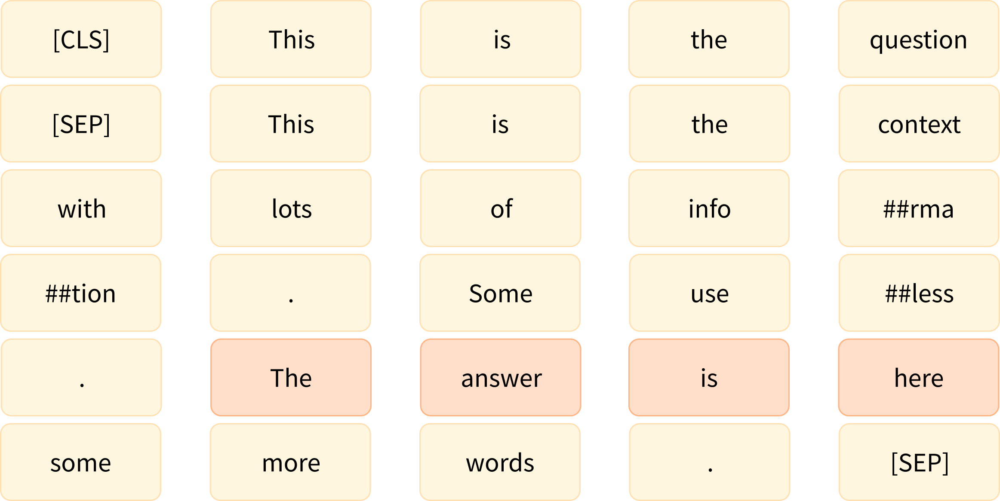

问答模型的工作方式与我们迄今为止看到的模型略有不同。以上图为例，模型已经被训练来预测答案开始的 token 的索引（这里是 21）和答案结束的 token 的索引（这里是 24）。这就是为什么这些模型不返回一个 logits 的张量，而是返回两个：一个对应于答案的开始 token 的 logits，另一个对应于答案的结束 token 的 logits。在这个例子中，我们的输入包含了 66 个 token ，因此我们得到：

```python
start_logits = outputs.start_logits
end_logits = outputs.end_logits
print(start_logits.shape, end_logits.shape)
```

{#if fw === 'pt'}

```python
#####Pytorch
torch.Size([1, 66]) torch.Size([1, 66])####end
```

{:else}

```python
#####TensorFlow
(1, 66) (1, 66)####end
```

{/if}

为了将这些 logits 转换为概率，我们将使用一个 softmax 函数——但在此之前，我们需要确保我们屏蔽了不属于上下文的索引。我们的输入是 `[CLS] question [SEP] context [SEP]` ，所以我们需要屏蔽 question 的 tokens 以及 `[SEP]`  token 。不过，我们将保留 `[CLS]` ，因为某些模型使用它来表示答案不在上下文中。

由于我们将在之后使用 softmax，我们只需要将我们想要屏蔽的 logits 替换为一个大的负数。在这里，我们使用 `-10000` ：

{#if fw === 'pt'}

```python
#####Pytorch
import torch

sequence_ids = inputs.sequence_ids()
# 屏蔽除 context 之外的所有内容
mask = [i != 1 for i in sequence_ids]
# 不屏蔽 [CLS] token 
mask[0] = False
mask = torch.tensor(mask)[None]

start_logits[mask] = -10000
end_logits[mask] = -10000####end
```

{:else}

```python
#####TensorFlow
import tensorflow as tf

sequence_ids = inputs.sequence_ids()
# 屏蔽除 context 之外的所有内容
mask = [i != 1 for i in sequence_ids]
# 不屏蔽 [CLS] token 
mask[0] = False
mask = tf.constant(mask)[None]

start_logits = tf.where(mask, -10000, start_logits)
end_logits = tf.where(mask, -10000, end_logits)####end
```

{/if}

现在我们已经屏蔽了与我们不想预测的位置相对应的 logits，接下来我们可以使用 softmax：

{#if fw === 'pt'}

```python
#####Pytorch
start_probabilities = torch.nn.functional.softmax(start_logits, dim=-1)[0]
end_probabilities = torch.nn.functional.softmax(end_logits, dim=-1)[0]####end
```

{:else}

```python
#####TensorFlow
start_probabilities = tf.math.softmax(start_logits, axis=-1)[0].numpy()
end_probabilities = tf.math.softmax(end_logits, axis=-1)[0].numpy()####end
```

{/if}

在这个阶段，我们可以取开始和结束概率的 argmax —— 但是我们可能会得到一个比结束索引大的开始索引，所以我们需要采取一些更多的措施来处理这些特殊情况。我们将在满足 `start_index <= end_index` 的前提下计算每个可能的 `start_index` 和 `end_index` 的概率，然后取概率最高的 `(start_index, end_index)` 元组。

假设事件"答案开始于 `start_index` "和"答案结束于 `end_index` "是独立的，答案在 `start_index` 开始并在 `end_index` 结束的概率是：

$$\mathrm{start\_probabilities}[\mathrm{start\_index}] \times\mathrm{end\_probabilities}[\mathrm{end\_index}]$$ 

所以，要计算所有的分数，我们只需要计算所有的 `start_index <= end_index` 的 \($$\mathrm{start\_probabilities}[\mathrm{start\_index}] \times\mathrm{end\_probabilities}[\mathrm{end\_index}]$$\)  的乘积。

首先让我们计算所有可能的乘积：

```python
scores = start_probabilities[:, None] * end_probabilities[None, :]
```

{#if fw === 'pt'}

然后我们将 `start_index > end_index` 的值设置为 `0` 来屏蔽他们（其他概率都是正数）。 `torch.triu()` / `np.triu()` 函数返回传入的 2D 张量的上三角部分，所以我们可以使用它来完成屏蔽：

```python
#####Pytorch
import numpy as np

scores = torch.triu(scores)####end
```

{:else}


```python
#####TensorFlow
scores = np.triu(scores)####end
```

{/if}

现在我们只需要得到最大值的索引。由于 PyTorch 将返回展平（flattened）后张量中的索引，因此我们需要使用向下取整的除法 `//` 和取模 `%` 操作来获得 `start_index` 和 `end_index` ：

```python
max_index = scores.argmax().item()
start_index = max_index // scores.shape[1]
end_index = max_index % scores.shape[1]
print(scores[start_index, end_index])
```

我们还没有完全完成，但至少我们已经有了正确的答案分数（你可以通过将其与上一节中的第一个结果进行比较来检查这一点）：

```python
0.97773
```

<div custom-style="Tip-green">

✏️ **试试看！** 计算五个最可能的答案的开始和结束索引。

</div>

我们有了答案的 `start_index` 和 `end_index` ，所以现在我们只需要转换为上下文中的字符索引。这就是偏移量将会非常有用的地方。我们可以像我们在 token 分类任务中那样获取偏移量并使用它们：

```python
inputs_with_offsets = tokenizer(question, context, return_offsets_mapping=True)
offsets = inputs_with_offsets["offset_mapping"]

start_char, _ = offsets[start_index] 
_, end_char = offsets[end_index]
answer = context[start_char:end_char]
```

现在我们只需要格式化所有内容，获取我们的结果：

```python
result = {
    "answer": answer,
    "start": start_char,
    "end": end_char,
    "score": scores[start_index, end_index],
}
print(result)
```

```python
{'answer': 'Jax, PyTorch and TensorFlow',
 'start': 78,
 'end': 105,
 'score': 0.97773}
```

太棒了！这和我们的第一个例子的结果一样！

<div custom-style="Tip-green">

✏️ **试试看！** 使用你之前计算的最佳分数来显示五个最可能的答案。你可以回到之前的 QA pipeline，并在调用时传入 `top_k=5` 来检查你的结果。

</div>

### 处理长文本 

如果我们尝试将我们之前使用的长问题和长上下文进行tokenization，我们将得到一个比 `question-answering` pipeline 中使用的最大长度（384）更大的 tokens 数量：

```python
inputs = tokenizer(question, long_context)
print(len(inputs["input_ids"]))
```

```python
461
```

所以，我们需要将我们的输入截断到模型允许输入的最大长度。我们可以用几种方式做到这一点，但我们不想截断问题部分，只想截断上下文部分，并且由于上下文部分是第二项，因此我们将使用 `"only_second"` 截断策略。然后又出现了新的问题：问题的答案可能在截断后被丢弃了，并没有在截断后保留下来的上下文文本中。例如，我们选了一个问题，其中的答案在上下文的末尾，当我们截断它时，答案就不在里面了：

```python
inputs = tokenizer(question, long_context, max_length=384, truncation="only_second")
print(tokenizer.decode(inputs["input_ids"]))
```

```python
"""
[CLS] Which deep learning libraries back [UNK] Transformers? [SEP] [UNK] Transformers : State of the Art NLP

[UNK] Transformers provides thousands of pretrained models to perform tasks on texts such as classification, information extraction,
question answering, summarization, translation, text generation and more in over 100 languages.
Its aim is to make cutting-edge NLP easier to use for everyone.

[UNK] Transformers provides APIs to quickly download and use those pretrained models on a given text, fine-tune them on your own datasets and
then share them with the community on our model hub. At the same time, each python module defining an architecture is fully standalone and
can be modified to enable quick research experiments.

Why should I use transformers?

1. Easy-to-use state-of-the-art models:
  - High performance on NLU and NLG tasks.
  - Low barrier to entry for educators and practitioners.
  - Few user-facing abstractions with just three classes to learn.
  - A unified API for using all our pretrained models.
  - Lower compute costs, smaller carbon footprint:

2. Researchers can share trained models instead of always retraining.
  - Practitioners can reduce compute time and production costs.
  - Dozens of architectures with over 10,000 pretrained models, some in more than 100 languages.

3. Choose the right framework for every part of a model's lifetime:
  - Train state-of-the-art models in 3 lines of code.
  - Move a single model between TF2.0/PyTorch frameworks at will.
  - Seamlessly pick the right framework for training, evaluation and production.

4. Easily customize a model or an example to your needs:
  - We provide examples for each architecture to reproduce the results published by its original authors.
  - Model internal [SEP]
"""
```

这意味着模型将很难找到正确的答案。为了解决这个问题， `question-answering` 管道允许我们将上下文分成更小的块，指定最大长度。为了确保我们不在刚好可能找到答案的地方将上下文分割，它还在各块之间包含了一些重叠。

我们可以通过添加 `return_overflowing_tokens=True` 参数，并可以用 `stride` 参数指定我们想要的重叠长度来让 tokenizer （快速或慢速）为我们做这个工作。下面是一个使用一个较短的句子的例子：

```python
sentence = "This sentence is not too long but we are going to split it anyway."
inputs = tokenizer(
    sentence, truncation=True, return_overflowing_tokens=True, max_length=6, stride=2
)

for ids in inputs["input_ids"]:
    print(tokenizer.decode(ids))
```

```python
'[CLS] This sentence is not [SEP]'
'[CLS] is not too long [SEP]'
'[CLS] too long but we [SEP]'
'[CLS] but we are going [SEP]'
'[CLS] are going to split [SEP]'
'[CLS] to split it anyway [SEP]'
'[CLS] it anyway. [SEP]'
```

正如我们所看到的，句子已被分成多个块，使得每个条目 `inputs["input_ids"]` 最多有 6 个 token （我们需要添加填充以使最后一个条目与其他条目的大小相同）并且每个条目之间有 2 个 token 的重叠。

让我们仔细看看tokenization的结果：

```python
print(inputs.keys())
```

```python
dict_keys(['input_ids', 'attention_mask', 'overflow_to_sample_mapping'])
```

正如我们所预期的，我们得到了inputs ID 和注意力掩码。最后一个键，overflow_to_sample_mapping，是一个映射，告诉我们每个结果对应哪个句子——在这里，我们有 7 个结果，它们都来自我们传递给 tokenizer 的（唯一的）句子：

```python
print(inputs["overflow_to_sample_mapping"])
```

```python
[0, 0, 0, 0, 0, 0, 0]
```

当我们一起对多个句子tokenization时，这会更有用。例如，这个：

```python
sentences = [
    "This sentence is not too long but we are going to split it anyway.",
    "This sentence is shorter but will still get split.",
]
inputs = tokenizer(
    sentences, truncation=True, return_overflowing_tokens=True, max_length=6, stride=2
)

print(inputs["overflow_to_sample_mapping"])
```

当我们访问数据集的元素时，我们会得到一个输出的结果是：

```python
[0, 0, 0, 0, 0, 0, 0, 1, 1, 1, 1]
```

这意味着第一句话被分割成 7 个块，就像上面的例子一样，后面的 4 个块来自第二句话。

现在让我们回到我们的长上下文。默认情况下， `question-answering pipeline` 使用我们之前提到的 384 作为最大长度，步长为 128，这与模型的微调方式相对应（你可以通过在调用 pipeline 时传递 `max_seq_len` 和 `stride` 参数来调整这些参数）。因此，我们在tokenization时将使用这些参数。我们还会添加填充（使样本具有相同的长度，这样我们就可以构建张量），并获取偏移量：

```python
inputs = tokenizer(
    question,
    long_context,
    stride=128,
    max_length=384,
    padding="longest",
    truncation="only_second",
    return_overflowing_tokens=True,
    return_offsets_mapping=True,
)
```

这些 `inputs` 将包含模型期望的inputs ID 和注意力掩码，以及我们刚刚谈到的偏移量和 `overflow_to_sample_mapping` 。由于模型不需要这两个参数，我们将它们从 `inputs` 中删除（我们不会存储映射的字典，因为这在这里没有用）然后将 `inputs` 转换为张量：

{#if fw === 'pt'}

```python
#####Pytorch
_ = inputs.pop("overflow_to_sample_mapping")
offsets = inputs.pop("offset_mapping")

inputs = inputs.convert_to_tensors("pt")
print(inputs["input_ids"].shape)####end
```

```python
#####Pytorch
torch.Size([2, 384])####end
```

{:else}

```python
#####TensorFlow
_ = inputs.pop("overflow_to_sample_mapping")
offsets = inputs.pop("offset_mapping")

inputs = inputs.convert_to_tensors("tf")
print(inputs["input_ids"].shape)####end
```

```python
#####TensorFlow
(2, 384)####end
```

{/if}

我们的长上下文被分成两部分，这意味着在经过我们的模型后，我们将得到两组开始和结束的 logits：

```python
outputs = model(**inputs)

start_logits = outputs.start_logits
end_logits = outputs.end_logits
print(start_logits.shape, end_logits.shape)
```

{#if fw === 'pt'}

结果如下

```python
#####Pytorch
torch.Size([2, 384]) torch.Size([2, 384])####end
```

{:else}

```python
#####TensorFlow
(2, 384) (2, 384)####end
```

{/if}

和以前一样，我们在计算 softmax 之前屏蔽不属于上下文的 token 。我们还屏蔽了所有填充 token （如注意力掩码）：

{#if fw === 'pt'}

```python
#####Pytorch
sequence_ids = inputs.sequence_ids()
# 屏蔽除上下文 tokens 之外的所有内容
mask = [i != 1 for i in sequence_ids]
# 取消对[CLS] token 的屏蔽
mask[0] = False
# 屏蔽所有的 [PAD] tokens
mask = torch.logical_or(torch.tensor(mask)[None], (inputs["attention_mask"] == 0))

start_logits[mask] = -10000
end_logits[mask] = -10000####end
```

{:else}

```python
#####TensorFlow
sequence_ids = inputs.sequence_ids()
# 屏蔽除上下文 tokens 之外的所有内容
mask = [i != 1 for i in sequence_ids]
# 取消对[CLS] token 的屏蔽
mask[0] = False
# 屏蔽所有的 [PAD] tokens
mask = tf.math.logical_or(tf.constant(mask)[None], inputs["attention_mask"] == 0)

start_logits = tf.where(mask, -10000, start_logits)
end_logits = tf.where(mask, -10000, end_logits)####end
```

{/if}

然后我们可以使用 softmax 将我们的 logits 转换为概率：

{#if fw === 'pt'}

```python
#####Pytorch
start_probabilities = torch.nn.functional.softmax(start_logits, dim=-1)
end_probabilities = torch.nn.functional.softmax(end_logits, dim=-1)####end
```

{:else}

```python
#####TensorFlow
start_probabilities = tf.math.softmax(start_logits, axis=-1).numpy()
end_probabilities = tf.math.softmax(end_logits, axis=-1).numpy()####end
```

{/if}

下一步与我们对短的上下文所做的类似，但在这里我们将对两个块分别进行处理。我们为所有可能的回答范围赋予一个得分，然后选择得分最高的范围：

{#if fw === 'pt'}

```python
#####Pytorch
candidates = []
for start_probs, end_probs in zip(start_probabilities, end_probabilities):
    scores = start_probs[:, None] * end_probs[None, :]
    idx = torch.triu(scores).argmax().item()

    start_idx = idx // scores.shape[1]
    end_idx = idx % scores.shape[1]
    score = scores[start_idx, end_idx].item()
    candidates.append((start_idx, end_idx, score))

print(candidates)####end
```

{:else}

```python
#####TensorFlow
candidates = []
for start_probs, end_probs in zip(start_probabilities, end_probabilities):
    scores = start_probs[:, None] * end_probs[None, :]
    idx = np.triu(scores).argmax().item()

    start_idx = idx // scores.shape[1]
    end_idx = idx % scores.shape[1]
    score = scores[start_idx, end_idx].item()
    candidates.append((start_idx, end_idx, score))

print(candidates)####end
```

{/if}

```python
[(0, 18, 0.33867), (173, 184, 0.97149)]
```

这两个候选范围对应的是模型在每个块中能够找到的最好的答案。模型对于正确的答案在第二部分更有信心（这是个好兆头！）。现在我们只需要将这两个 token 范围映射到上下文中的字符范围（我们只需要映射第二个就能得到我们的答案，但是看看模型在第一块中选取了什么作为答案还是很有意思的）。

<div custom-style="Tip-green">

✏️ **试试看！**  调整上面的代码，以返回五个最可能的答案的得分和范围（对于整个上下文，而不是单个块）。

</div>

我们之前抓取 `offsets` 的实际上是一个偏移量列表，每个文本块都有一个列表：

```python
for candidate, offset in zip(candidates, offsets):
    start_token, end_token, score = candidate
    start_char, _ = offset[start_token]
    _, end_char = offset[end_token]
    answer = long_context[start_char:end_char]
    result = {"answer": answer, "start": start_char, "end": end_char, "score": score}
    print(result)
```

```python
{'answer': '\nTransformers: State of the Art NLP', 'start': 0, 'end': 37, 'score': 0.33867}
{'answer': 'Jax, PyTorch and TensorFlow', 'start': 1892, 'end': 1919, 'score': 0.97149}
```

如果我们选择分数最高的第二个结果，我们会得到与 QA 管道相同结果——耶！

<div custom-style="Tip-green">

✏️ **试试看！** 使用你之前计算的最佳分数来显示五个最可能的答案（对于整个上下文，而不是单个块）。要检查你的结果的话，返回之前的 QA 管道，并在调用时传入 `top_k=5` 。

</div>

我们已经结束了我们对 tokenizer 能力的深入探究。在下一章，我们将展示如何在一系列常见的 NLP 任务上微调模型，我们将对这些内容再次付诸实践。

## 7.4 标准化和预分词 

在深入探讨 Transformer 模型常用的三种分词算法（字节对编码【BPE】、WordPiece 和 Unigram）之前，我们首先来看看 tokenizer 对文本进行的预处理。以下是 tokenization 过程的高度概括：


在分词（根据其模型）之前，tokenizer 需要进行两个步骤： `标准化（normalization）` 和 `预分词（pre-tokenization）` 。

### `标准化（normalization）` 

标准化步骤涉及一些常规清理，例如删除不必要的空格、小写和“/”或删除重音符号。如果你熟悉 [Unicode 标准化](http://www.unicode.org/reports/tr15/)(http://www.unicode.org/reports/tr15/) （例如 NFC 或 NFKC），那么这也是 tokenizer 可能会使用的东西。

Transformers 的 `tokenizer` 具有一个名为 `backend_tokenizer` 的属性，该属性可以访问来自Tokenizers 库的底层 tokenizer 

```python
from transformers import AutoTokenizer

tokenizer = AutoTokenizer.from_pretrained("bert-base-uncased")
print(type(tokenizer.backend_tokenizer))
```

```python
<class 'tokenizers.Tokenizer'>
```
`tokenizer` 对象的 `normalizer` 属性具有一个 `normalize_str()` 方法，我们可以使用该方法查看如何进行标准化：

```python
print(tokenizer.backend_tokenizer.normalizer.normalize_str("Héllò hôw are ü?"))
```

```python
'hello how are u?'
```

在这个例子中，由于我们选择了 `bert-base-uncased` checkpoint，所以会在标准化的过程中转换为小写并删除重音。

<div custom-style="Tip-green">

✏️ **试试看！** 从 `bert-base-cased` checkpoint 加载 tokenizer 并处理相同的示例。看一看 tokenizer 的 `cased` 和 `uncased` 版本之间的主要区别是什么？

</div>

### 预分词 

正如我们将在下一节中看到的，tokenizer 一般不会在原始文本上进行训练。因此，我们首先需要将文本拆分为更小的实体，例如单词。这就是预分词步骤的作用。正如我们在第三章中看到的，基于单词的 tokenizer 可以简单地根据空格和标点符号将原始文本拆分为单词。这些词将是 tokenizer 在训练期间可以学习的子词的边界。

要查看快速 tokenizer 如何执行预分词，我们可以使用 `tokenizer` 对象的 `pre_tokenizer` 属性的 `pre_tokenize_str()` 方法：

```python
tokenizer.backend_tokenizer.pre_tokenizer.pre_tokenize_str("Hello, how are  you?")
```

```python
[('Hello', (0, 5)), (',', (5, 6)), ('how', (7, 10)), ('are', (11, 14)), ('you', (16, 19)), ('?', (19, 20))]
```

请注意 tokenizer 记录了偏移量，这是就是我们在前一节中使用的偏移映射。在这里 tokenizer 将两个空格并将它们替换为一个，从 `are` 和 `you` 之间的偏移量跳跃可以看出来这一点。

由于我们使用的是 BERT  tokenizer 所以预分词会涉及到在空白和标点上进行分割。其他的 tokenizer 可能会对这一步有不同的规则。例如，如果我们使用 GPT-2 的 tokenizer 

```python
tokenizer = AutoTokenizer.from_pretrained("gpt2")
tokenizer.backend_tokenizer.pre_tokenizer.pre_tokenize_str("Hello, how are  you?")
```

它也会在空格和标点符号上拆分，但它会保留空格并将它们替换为 `Ġ` 符号，如果我们对 tokens 进行解码，则使其能够恢复原始空格：

```python
[('Hello', (0, 5)), (',', (5, 6)), ('Ġhow', (6, 10)), ('Ġare', (10, 14)), ('Ġ', (14, 15)), ('Ġyou', (15, 19)),
 ('?', (19, 20))]
```

也请注意，与 BERT  tokenizer 不同的是，这个 tokenizer 不会忽略双空格。

最后一个例子，让我们看一下基于 SentencePiece 算法的 T5  tokenizer 

```python
tokenizer = AutoTokenizer.from_pretrained("t5-small")
tokenizer.backend_tokenizer.pre_tokenizer.pre_tokenize_str("Hello, how are  you?")
```

```python
[('▁Hello,', (0, 6)), ('▁how', (7, 10)), ('▁are', (11, 14)), ('▁you?', (16, 20))]
```

与 GPT-2 的 tokenizer 类似，这个 tokenizer 保留空格并用特定 token 替换它们（ `_` ），但 T5  tokenizer 只在空格上拆分，不考虑标点符号。另外，它会在句子开头（在 `Hello` 之前）默认添加一个空格，并忽略 `are` 和 `you` 之间的双空格。

现在我们对一些不同的 tokenizer 如何处理文本有了一些了解，接下来我们就可以开始探索底层算法本身。我们将先简要了解一下广泛适用的 SentencePiece；然后，在接下来的三节中，我们将研究用于子词分词的三种主要算法的工作原理。

### SentencePiece 

 [SentencePiece](https://github.com/google/sentencepiece)(https://github.com/google/sentencepiece) 是一种用于文本预处理的 tokenization 算法，你可以将其与我们将在接下来的三个部分中看到的任何模型一起使用。它将文本视为 Unicode 字符序列，并用特殊字符 `▁` 替换空格。与 Unigram 算法结合使用（参见第七节）时，它甚至不需要预分词步骤，这对于不使用空格字符的语言（如中文或日语）非常有用。

SentencePiece 的另一个主要特点是可逆 tokenization：由于没有对空格进行特殊处理，解码 tokens 的时候只需将它们连接起来，然后将 `_` 替换为空格，就可以还原原始的文本。如我们之前所见，BERT  tokenizer 会删除重复的空格，所以它的分词不是可逆的。

### 算法概述 

在下面的部分中，我们将深入研究三种主要的子词 tokenization 算法：BPE（由 GPT-2 等使用）、WordPiece（由 BERT 使用）和 Unigram（由 T5 等使用）。在我们开始之前，先来快速了解它们各自的工作方式。如果你还不能理解，不妨在阅读接下来的每一节之后返回此表格进行查看。

模型 | BPE | WordPiece | Unigram
:----:|:---:|:---------:|:------:
训练 | 从小型词汇表开始，学习合并 token 的规则 | 从小型词汇表开始，学习合并 token 的规则 | 从大型词汇表开始，学习删除 token 的规则
训练步骤 | 合并对应最常见的 token 对 | 合并对应得分最高的 token 对，优先考虑每个独立 token 出现频率较低的对 | 删除会在整个语料库上最小化损失的词汇表中的所有 token
学习 | 合并规则和词汇表 | 仅词汇表 | 含有每个 token 分数的词汇表
编码 | 将一个单词分割成字符然后使用在训练过程中学到的合并规则进行合并 | 从开始处找到词汇表中的最长子词，然后对其余部分做同样的事 | 使用在训练中学到找到最可能的 token 分割方式

现在让我们深入了解 BPE！

## 7.5 BPE tokenization 算法 

字节对编码（BPE）最初被开发为一种压缩文本的算法，然后在预训练 GPT 模型时被 OpenAI 用于 tokenization。许多 Transformer 模型都使用它，包括 GPT、GPT-2、RoBERTa、BART 和 DeBERTa。

<div custom-style="Tip-green">

💡 本节深入介绍了 BPE，甚至展示了一个完整的实现。如果你只想大致了解 tokenization 算法，可以跳到最后。

</div>

### BPE 训练 

BPE 训练首先计算语料库中使用的唯一单词集（在完成标准化和预分词步骤之后），然后取出用来编写这些词的所有符号来构建词汇表。举一个非常简单的例子，假设我们的语料库使用了这五个词：

```python
"hug", "pug", "pun", "bun", "hugs"
```

基础词汇将是 `["b", "g", "h", "n", "p", "s", "u"]` 。对于实际情况，基本词汇表将至少包含所有 ASCII 字符，可能还包含一些 Unicode 字符。如果你正在 tokenization 不在训练语料库中的字符，则该字符将转换为未知 tokens 这就是为什么许多 NLP 模型在分析带有表情符号的内容方面非常糟糕的原因之一。

<div custom-style="Tip-green">

GPT-2 和 RoBERTa （这两者非常相似）的 tokenizer 有一个巧妙的方法来处理这个问题：他们不把单词看成是用 Unicode 字符编写的，而是用字节编写的。这样，基本词汇表的大小很小（256），但是能包含几乎所有你能想象的字符，而不会最终转换为未知 tokens 这个技巧被称为 `字节级（byte-level） BPE` 。

</div>

获得这个基本词汇表后，我们通过学习 `合并（merges）` 来添加新的 tokens 直到达到期望的词汇表大小。合并是将现有词汇表中的两个元素合并为一个新元素的规则。所以，一开始会创建出含有两个字符的 tokens 然后，随着训练的进展，会产生更长的子词。

在分词器训练期间的任何一步，BPE 算法都会搜索最常见的现有 tokens 对 （在这里，“对”是指一个词中的两个连续 tokens ）。最常见的这一对会被合并，然后我们重复这个过程。

回到我们之前的例子，让我们假设单词具有以下频率：

```python
("hug", 10), ("pug", 5), ("pun", 12), ("bun", 4), ("hugs", 5)
```

意思是 `"hug"` 在语料库中出现了 10 次， `"pug"` 出现了 5 次， `"pun"` 出现了 12 次， `"bun"` 出现了 4 次， `"hugs"` 出现了 5 次。我们通过将每个单词拆分为字符（形成我们初始词汇表的字符）来开始训练，这样我们就可以将每个单词视为一个 tokens 列表：

```python
("h" "u" "g", 10), ("p" "u" "g", 5), ("p" "u" "n", 12), ("b" "u" "n", 4), ("h" "u" "g" "s", 5)
```

然后我们看看相邻的字符对。 `("h", "u")` 在词 `"hug"` 和 `"hugs"` 中出现，所以在语料库中总共出现了 15 次。然而，最常见的对属于 `("u", "g")` ，它在 `"hug"` 、 `"pug"` 和 `"hugs"` 中出现，总共在词汇表中出现了 20 次。

因此，tokenizer 学习的第一个合并规则是 `("u", "g") -> "ug"` ，意思就是 `"ug"` 将被添加到词汇表中，且应在语料库的所有词中合并这一对。在这个阶段结束时，词汇表和语料库看起来像这样：

```python
词汇表: ["b", "g", "h", "n", "p", "s", "u", "ug"]
语料库: ("h" "ug", 10), ("p" "ug", 5), ("p" "u" "n", 12), ("b" "u" "n", 4), ("h" "ug" "s", 5)
```

现在我们有一些对，它们会产生一个比两个字符长的 tokens 例如 `("h", "ug")` ，在语料库中出现 15 次。然而，这个阶段出现频率最高的对是 `("u", "n")` ，在语料库中出现 16 次，所以学到的第二个合并规则是 `("u", "n") -> "un"` 。将其添加到词汇表并合并所有现有的这个对，将出现：

```python
词汇表: ["b", "g", "h", "n", "p", "s", "u", "ug", "un"]
语料库: ("h" "ug", 10), ("p" "ug", 5), ("p" "un", 12), ("b" "un", 4), ("h" "ug" "s", 5)
```

现在最频繁的一对是 `("h", "ug")` ，所以我们学习了合并规则 `("h", "ug") -> "hug"` ，这给了我们第一个三个字母的 tokens 合并后，语料库如下所示：

```python
词汇表: ["b", "g", "h", "n", "p", "s", "u", "ug", "un", "hug"]
语料库: ("hug", 10), ("p" "ug", 5), ("p" "un", 12), ("b" "un", 4), ("hug" "s", 5)
```

我们继续这样合并，直到达到我们所需的词汇量。

<div custom-style="Tip-green">

✏️ **现在轮到你了！** 你认为下一个合并规则是什么？

</div>

### tokenization 

完成训练之后就可以对新的输入 tokenization 了，从某种意义上说，新的输入会依照以下步骤对新输入进行 tokenization：

1. 标准化
2. 预分词
3. 将单词拆分为单个字符
4. 根据学习的合并规则，按顺序合并拆分的字符

让我们以我们在训练期间使用的示例为例，学习三个合并规则：

```python
("u", "g") -> "ug"
("u", "n") -> "un"
("h", "ug") -> "hug"
```

这个单词 `"bug"` 将被转化为 `["b", "ug"]` 。然而 `"mug"` ，将被转换为 `["[UNK]", "ug"]` ，因为字母 `"m"` 不再基本词汇表中。同样，单词 `"thug"` 会被转换为 `["[UNK]", "hug"]` ：字母 `"t"` 不在基本词汇表中，使用合并规则首先会将 `"u"` 和 `"g"` 合并，然后将 `"hu"` 和 `"g"` 合并。

<div custom-style="Tip-green">

✏️ **现在轮到你了！** 你认为这个词 `"unhug"` 将如何被 tokenization？

</div>

### 实现 BPE 算法

现在，让我们看一下 BPE 算法的实现。这并不是在大型语料库上实际使用的经过优化的版本；我们只是想向你展示代码，以便你可以更好地理解算法

首先，我们需要一个语料库，让我们创建一个含有几句话的简单语料库：

```python
corpus = [
    "This is the Hugging Face Course.",
    "This chapter is about tokenization.",
    "This section shows several tokenizer algorithms.",
    "Hopefully, you will be able to understand how they are trained and generate tokens.",
]
```

接下来，我们需要将该语料库预分词为单词。由于我们正在复现一个 BPE  tokenizer （例如 GPT-2），我们将使用 `gpt2` 分词器进行预分词：

```python
from transformers import AutoTokenizer

tokenizer = AutoTokenizer.from_pretrained("gpt2")
```

然后，我们在进行预分词的同时计算语料库中每个单词的频率：

```python
from collections import defaultdict

word_freqs = defaultdict(int)

for text in corpus:
    words_with_offsets = tokenizer.backend_tokenizer.pre_tokenizer.pre_tokenize_str(text)
    new_words = [word for word, offset in words_with_offsets]
    for word in new_words:
        word_freqs[word] += 1

print(word_freqs)
```

```python
defaultdict(int, {'This': 3, 'Ġis': 2, 'Ġthe': 1, 'ĠHugging': 1, 'ĠFace': 1, 'ĠCourse': 1, '.': 4, 'Ġchapter': 1,
    'Ġabout': 1, 'Ġtokenization': 1, 'Ġsection': 1, 'Ġshows': 1, 'Ġseveral': 1, 'Ġtokenizer': 1, 'Ġalgorithms': 1,
    'Hopefully': 1, ',': 1, 'Ġyou': 1, 'Ġwill': 1, 'Ġbe': 1, 'Ġable': 1, 'Ġto': 1, 'Ġunderstand': 1, 'Ġhow': 1,
    'Ġthey': 1, 'Ġare': 1, 'Ġtrained': 1, 'Ġand': 1, 'Ġgenerate': 1, 'Ġtokens': 1})
```

下一步是计算基础词汇表，这由语料库中使用的所有字符组成：

```python
alphabet = []

for word in word_freqs.keys():
    for letter in word:
        if letter not in alphabet:
            alphabet.append(letter)
alphabet.sort()

print(alphabet)
```

```python
[ ',', '.', 'C', 'F', 'H', 'T', 'a', 'b', 'c', 'd', 'e', 'f', 'g', 'h', 'i', 'k', 'l', 'm', 'n', 'o', 'p', 'r', 's',
  't', 'u', 'v', 'w', 'y', 'z', 'Ġ']
```

我们还在该词汇表的开头添加了模型使用的特殊 tokens 对于 GPT-2，唯一的特殊 tokens 是 `"<|endoftext|>"` ：

```python
vocab = ["<|endoftext|>"] + alphabet.copy()
```

我们现在需要将每个单词拆分为单独的字符，以便能够开始训练：

```python
splits = {word: [c for c in word] for word in word_freqs.keys()}
```

现在我们已准备好进行训练，让我们编写一个函数来计算每对字符的频率。我们需要在训练的每个步骤中使用它：

```python
def compute_pair_freqs(splits):
    pair_freqs = defaultdict(int)
    for word, freq in word_freqs.items():
        split = splits[word]
        if len(split) == 1:
            continue
        for i in range(len(split) - 1):
            pair = (split[i], split[i + 1])
            pair_freqs[pair] += freq
    return pair_freqs
```

让我们来看看这个字典在初始合并后的一些结果：

```python
pair_freqs = compute_pair_freqs(splits)

for i, key in enumerate(pair_freqs.keys()):
    print(f"{key}: {pair_freqs[key]}")
    if i >= 5:
        break
```

```python
('T', 'h'): 3
('h', 'i'): 3
('i', 's'): 5
('Ġ', 'i'): 2
('Ġ', 't'): 7
('t', 'h'): 3
```

现在，只需要一个简单的循环就可以找到出现频率最高的对：

```python
best_pair = ""
max_freq = None

for pair, freq in pair_freqs.items():
    if max_freq is None or max_freq < freq:
        best_pair = pair
        max_freq = freq

print(best_pair, max_freq)
```

```python
('Ġ', 't') 7
```

所以第一个要学习的合并规则是 `('Ġ', 't') -> 'Ġt'` ，我们将 `'Ġt'` 添加到词汇表：

```python
merges = {("Ġ", "t"): "Ġt"}
vocab.append("Ġt")
```

接下来，我们需要在我们的 `splits` 字典中进行这个合并。让我们为此编写另一个函数：

```python
def merge_pair(a, b, splits):
    for word in word_freqs:
        split = splits[word]
        if len(split) == 1:
            continue

        i = 0
        while i < len(split) - 1:
            if split[i] == a and split[i + 1] == b:
                split = split[:i] + [a + b] + split[i + 2 :]
            else:
                i += 1
        splits[word] = split
    return splits
```

我们可以观察一下第一次合并的结果：

```python
splits = merge_pair("Ġ", "t", splits)
print(splits["Ġtrained"])
```

```python
['Ġt', 'r', 'a', 'i', 'n', 'e', 'd']
```

现在我们有了我们需要的所有代码，可以循环直到我们学习到我们想要的所有合并。让我们把目标词汇表的大小设定为 50：

```python
vocab_size = 50

while len(vocab) < vocab_size:
    pair_freqs = compute_pair_freqs(splits)
    best_pair = ""
    max_freq = None
    for pair, freq in pair_freqs.items():
        if max_freq is None or max_freq < freq:
            best_pair = pair
            max_freq = freq
    splits = merge_pair(*best_pair, splits)
    merges[best_pair] = best_pair[0] + best_pair[1]
    vocab.append(best_pair[0] + best_pair[1])
```

最终，我们学习了 19 条合并规则（初始词汇量为 31 —— 字母表中的 30 个字符，加上特殊 token ）：

```python
print(merges)
```

```python
{('Ġ', 't'): 'Ġt', ('i', 's'): 'is', ('e', 'r'): 'er', ('Ġ', 'a'): 'Ġa', ('Ġt', 'o'): 'Ġto', ('e', 'n'): 'en',
 ('T', 'h'): 'Th', ('Th', 'is'): 'This', ('o', 'u'): 'ou', ('s', 'e'): 'se', ('Ġto', 'k'): 'Ġtok',
 ('Ġtok', 'en'): 'Ġtoken', ('n', 'd'): 'nd', ('Ġ', 'is'): 'Ġis', ('Ġt', 'h'): 'Ġth', ('Ġth', 'e'): 'Ġthe',
 ('i', 'n'): 'in', ('Ġa', 'b'): 'Ġab', ('Ġtoken', 'i'): 'Ġtokeni'}
```

词汇表由特殊 token 初始字母和所有合并结果组成：

```python
print(vocab)
```

```python
['<|endoftext|>', ',', '.', 'C', 'F', 'H', 'T', 'a', 'b', 'c', 'd', 'e', 'f', 'g', 'h', 'i', 'k', 'l', 'm', 'n', 'o',
 'p', 'r', 's', 't', 'u', 'v', 'w', 'y', 'z', 'Ġ', 'Ġt', 'is', 'er', 'Ġa', 'Ġto', 'en', 'Th', 'This', 'ou', 'se',
 'Ġtok', 'Ġtoken', 'nd', 'Ġis', 'Ġth', 'Ġthe', 'in', 'Ġab', 'Ġtokeni']
```

<div custom-style="Tip-green">

💡 在同一语料库上使用 `train_new_from_iterator()` 可能不会产生完全相同的词汇表。这是因为当有多个出现频率最高的对时，我们选择遇到的第一个，而 Tokenizers 库根据内部 ID 选择第一个。

</div>

为了对新文本进行分词，我们对其进行预分词、拆分，然后使用学到的所有合并规则进行合并：

```python
def tokenize(text):
    pre_tokenize_result = tokenizer._tokenizer.pre_tokenizer.pre_tokenize_str(text)
    pre_tokenized_text = [word for word, offset in pre_tokenize_result]
    splits = [[l for l in word] for word in pre_tokenized_text]
    for pair, merge in merges.items():
        for idx, split in enumerate(splits):
            i = 0
            while i < len(split) - 1:
                if split[i] == pair[0] and split[i + 1] == pair[1]:
                    split = split[:i] + [merge] + split[i + 2 :]
                else:
                    i += 1
            splits[idx] = split

    return sum(splits, [])
```

我们可以尝试在任何由字母表中的字符组成的文本上进行此操作：

```python
tokenize("This is not a token.")
```

```python
['This', 'Ġis', 'Ġ', 'n', 'o', 't', 'Ġa', 'Ġtoken', '.']
```

<div custom-style="Tip-yellow">

⚠️ 如果存在未知字符，我们的实现将抛出错误，因为我们没有做任何处理它们。GPT-2 实际上没有未知 tokens （使用字节级 BPE 时不可能得到未知字符），但在这里可能会出现，因为我们并未在初始词汇中包含所有可能的字节。BPE 的这一部分已超出了本节的范围，因此我们省略了一些细节。

</div>

至此，BPE 算法的介绍就到此结束！接下来，我们将研究 WordPiece 算法。

## 7.6 WordPiece tokenization 算法   

WordPiece 是 Google 开发的用于 BERT 预训练的分词算法。自此之后，很多基于 BERT 的 Transformer 模型都复用了这种方法，比如 DistilBERT，MobileBERT，Funnel Transformers 和 MPNET。它在训练方面与 BPE 非常类似，但实际的分词方法有所不同。

<div custom-style="Tip-green">

💡 本节详细讲述了 WordPiece，甚至展示了一个完整的实现。如果你只想对这个分词算法有个大概的理解，可以直接跳到最后。

</div>

### WordPiece 训练 

<div custom-style="Tip-yellow">

⚠️ Google 从未开源 WordPiece 训练算法的实现，因此以下是我们基于已发表文献的最佳猜测。它可能并非 100％ 准确的。

</div>

与BPE 一样，WordPiece 也是从包含模型使用的特殊 tokens 和初始字母表的小词汇表开始的。由于它是通过添加前缀（如 BERT 中的 `##` ）来识别子词的，每个词最初都会通过在词内部所有字符前添加该前缀进行分割。因此，例如 `"word"` 将被这样分割：

```python
w ##o ##r ##d
```

因此，初始字母表包含所有出现在单词开始位置的字符，以及出现在单词内部并带有 WordPiece 前缀的字符。

然后，同样像 BPE 一样，WordPiece 会学习合并规则。主要的不同之处在于合并对的选择方式。WordPiece 不是选择频率最高的对，而是对每对计算一个得分，使用以下公式：

$$\mathrm{score} = (\mathrm{freq\_of\_pair}) / (\mathrm{freq\_of\_first\_element} \times\mathrm{freq\_of\_second\_element})$$

通过将对的频率除以对中各部分的频率的乘积，该算法优先合并那些在词汇表中单独出现出现的对。例如，即使 `("un", "##able")` 这对在词汇表中出现的频率很高，它也不一定会被合并，因为 `"un"` 和 `"##able"` 这两对可能会在很多其他词中出现，频率很高。相比之下，像 `("hu", "##gging")` 这样的对可能会更快地被合并（假设单词“hugging”在词汇表中出现的频率很高），因为 `"hu"` 和 `"##gging"` 可能分别出现的频率较低。

我们使用与 BPE 示例相同的词汇表：

```python
("hug", 10), ("pug", 5), ("pun", 12), ("bun", 4), ("hugs", 5)
```

经过分割之后将会是：

```python
("h" "##u" "##g", 10), ("p" "##u" "##g", 5), ("p" "##u" "##n", 12), ("b" "##u" "##n", 4), ("h" "##u" "##g" "##s", 5)
```

所以最初的词汇表将会是 `["b", "h", "p", "##g", "##n", "##s", "##u"]` （如果我们暂时忽略特殊 tokens ）。出现频率最高的一对是 `("##u", "##g")` （目前 20 次），但 `"##u"` 和其他单词一起出现的频率非常高，所以它的分数不是最高的（它是 1 / 36）。所有带有 `"##u"` 的对实际上都有相同的分数（1 / 36），所以分数最高的对是 `("##g", "##s")` —— 唯一没有 `"##u"` 的对——分数是 1 / 20，所以学习的第一个合并是 `("##g", "##s") -> ("##gs")` 。

请注意，当我们合并时，我们会删除两个 tokens 之间的 `##` ，所以我们添加 `"##gs"` 到词汇表中，并在语料库的单词中进行该合并：

```python
词汇表: ["b", "h", "p", "##g", "##n", "##s", "##u", "##gs"]
语料库: ("h" "##u" "##g", 10), ("p" "##u" "##g", 5), ("p" "##u" "##n", 12), ("b" "##u" "##n", 4), ("h" "##u" "##gs", 5)
```

此时， `"##u"` 出现在所有可能的对中，因此它们最终都具有相同的分数。在这种情况下，第一个对会被合并，于是我们得到了 `("h", "##u") -> "hu"` 规则：

```python
词汇表: ["b", "h", "p", "##g", "##n", "##s", "##u", "##gs", "hu"]
语料库: ("hu" "##g", 10), ("p" "##u" "##g", 5), ("p" "##u" "##n", 12), ("b" "##u" "##n", 4), ("hu" "##gs", 5)
```

然后，下一个最佳得分的对是 `("hu", "##g")` 和 `("hu", "##gs")` （得分为 1/15，而所有其他配对的得分为 1/21），因此得分最高的第一对合并：

```python
词汇表: ["b", "h", "p", "##g", "##n", "##s", "##u", "##gs", "hu", "hug"]
语料库: ("hug", 10), ("p" "##u" "##g", 5), ("p" "##u" "##n", 12), ("b" "##u" "##n", 4), ("hu" "##gs", 5)
```

然后我们就按此方式继续，直到我们达到所需的词汇表大小。

<div custom-style="Tip-green">

✏️ **现在轮到你了！** 下一个合并规则是什么？

</div>

### tokenization 算法 

WordPiece 和 BPE 的分词方式有所不同，WordPiece 只保存最终词汇表，而不保存学习到的合并规则。WordPiece 从待分词的词开始，找到词汇表中最长的子词，然后在其处分割。例如，如果我们使用上述示例中学习到的词汇表，对于词 `"hugs"` ，从开始处的最长子词在词汇表中是 `"hug"` ，所以我们在那里分割，得到 `["hug", "##s"]` 。然后我们继续处理 `"##s"` ，它在词汇表中，所以 `"hugs"` 的分词结果是 `["hug", "##s"]` 。

如果使用 BPE，我们会按照学习到的顺序使用合并规则进行合并，并将其分词为 `["hu", "##gs"]` ，所以最终得到的编码是不同的。

再举一个例子，让我们看看 `"bugs"` 将如何分词的。 `"b"` 是从词汇表中单词开头开始的最长子词，所以我们在那里分割并得到 `["b", "##ugs"]` 。然后 `"##u"` 是词汇表中从 `"##ugs"` 开始的最长的子词，所以我们在那里拆分并得到 `["b", "##u, "##gs"]` 。最后， `"##gs"` 在词汇表中，因此 `"bugs"` 的分词结果是： `["b", "##u, "##gs"]` 。

当分词过程中无法在词汇库中找到该子词时，整个词会被标记为 unknown（未知）—— 例如， `"mug"` 将被标记为 `["[UNK]"]` ， `"bum"` 也是如此（即使我们可以以 `"b"` 和 `"##u"` 开始，但是 `"##m"` 不在词汇表中，因此最终的分词结果只会是 `["[UNK]"]` ，而不是 `["b", "##u", "[UNK]"]` ）。这是与 BPE 的另一个区别，BPE 只会将不在词汇库中的单个字符标记为 unknown。

<div custom-style="Tip-green">

✏️ **现在轮到你了！** `"pugs"` 将被如何分词？

</div>

### 实现 WordPiece 

现在让我们看一下 WordPiece 算法的实现。与 BPE 一样，这只是教学示例，你不能在大型语料库上使用。

我们将使用与 BPE 示例中相同的语料库：

```python
corpus = [
    "This is the Hugging Face Course.",
    "This chapter is about tokenization.",
    "This section shows several tokenizer algorithms.",
    "Hopefully, you will be able to understand how they are trained and generate tokens.",
]
```

首先，我们需要将语料库预分词为单词。由于我们正在复刻 WordPiece  tokenizer  （如 BERT），因此我们将使用 `bert-base-cased` tokenizer 进行预分词：

```python
from transformers import AutoTokenizer

tokenizer = AutoTokenizer.from_pretrained("bert-base-cased")
```

然后我们在进行预分词的同时，计算语料库中每个单词的频率：

```python
from collections import defaultdict

word_freqs = defaultdict(int)
for text in corpus:
    words_with_offsets = tokenizer.backend_tokenizer.pre_tokenizer.pre_tokenize_str(text)
    new_words = [word for word, offset in words_with_offsets]
    for word in new_words:
        word_freqs[word] += 1

word_freqs
```

```python
defaultdict(
    int, {'This': 3, 'is': 2, 'the': 1, 'Hugging': 1, 'Face': 1, 'Course': 1, '.': 4, 'chapter': 1, 'about': 1,
    'tokenization': 1, 'section': 1, 'shows': 1, 'several': 1, 'tokenizer': 1, 'algorithms': 1, 'Hopefully': 1,
    ',': 1, 'you': 1, 'will': 1, 'be': 1, 'able': 1, 'to': 1, 'understand': 1, 'how': 1, 'they': 1, 'are': 1,
    'trained': 1, 'and': 1, 'generate': 1, 'tokens': 1})
```

如我们之前看到的，字母表是一个独特的集合，由所有单词的第一个字母以及所有以 `##` 为前缀和在单词中的其他字母组成：

```python
alphabet = []
for word in word_freqs.keys():
    if word[0] not in alphabet:
        alphabet.append(word[0])
    for letter in word[1:]:
        if f"##{letter}" not in alphabet:
            alphabet.append(f"##{letter}")

alphabet.sort()
alphabet

print(alphabet)
```

```python
['##a', '##b', '##c', '##d', '##e', '##f', '##g', '##h', '##i', '##k', '##l', '##m', '##n', '##o', '##p', '##r', '##s',
 '##t', '##u', '##v', '##w', '##y', '##z', ',', '.', 'C', 'F', 'H', 'T', 'a', 'b', 'c', 'g', 'h', 'i', 's', 't', 'u',
 'w', 'y']
```

我们还在该词汇表的开头添加了模型使用的特殊 tokens 在使用 BERT 的情况下，特殊 tokens 是 `["[PAD]", "[UNK]", "[CLS]", "[SEP]", "[MASK]"]` ：

```python
vocab = ["[PAD]", "[UNK]", "[CLS]", "[SEP]", "[MASK]"] + alphabet.copy()
```

接下来我们需要将每个单词进行分割，除了第一个字母外，其他字母都需要以 `##` 为前缀：

```python
splits = {
    word: [c if i == 0 else f"##{c}" for i, c in enumerate(word)]
    for word in word_freqs.keys()
}
```

现在我们已经准备好训练了，让我们编写一个函数来计算每对的分数。我们需要在训练的每个步骤中使用它：

```python
def compute_pair_scores(splits):
    letter_freqs = defaultdict(int)
    pair_freqs = defaultdict(int)
    for word, freq in word_freqs.items():
        split = splits[word]
        if len(split) == 1:
            letter_freqs[split[0]] += freq
            continue
        for i in range(len(split) - 1):
            pair = (split[i], split[i + 1])
            letter_freqs[split[i]] += freq
            pair_freqs[pair] += freq
        letter_freqs[split[-1]] += freq

    scores = {
        pair: freq / (letter_freqs[pair[0]] * letter_freqs[pair[1]])
        for pair, freq in pair_freqs.items()
    }
    return scores
```

让我们来看看在初始分割后的部分字典：

```python
pair_scores = compute_pair_scores(splits)
for i, key in enumerate(pair_scores.keys()):
    print(f"{key}: {pair_scores[key]}")
    if i >= 5:
        break
```

```python
('T', '##h'): 0.125
('##h', '##i'): 0.03409090909090909
('##i', '##s'): 0.02727272727272727
('i', '##s'): 0.1
('t', '##h'): 0.03571428571428571
('##h', '##e'): 0.011904761904761904
```

现在，只需要一个快速循环就可以找到得分最高的对：

```python
best_pair = ""
max_score = None
for pair, score in pair_scores.items():
    if max_score is None or max_score < score:
        best_pair = pair
        max_score = score

print(best_pair, max_score)
```

```python
('a', '##b') 0.2
```

所以第一个要学习的合并是 `('a', '##b') -> 'ab'` ，并且我们添加 `'ab'` 到词汇表中：

```python
vocab.append("ab")
```

接下来，我们需要在 `splits` 字典中进行这种合并。让我们为此写另一个函数：

```python
def merge_pair(a, b, splits):
    for word in word_freqs:
        split = splits[word]
        if len(split) == 1:
            continue
        i = 0
        while i < len(split) - 1:
            if split[i] == a and split[i + 1] == b:
                merge = a + b[2:] if b.startswith("##") else a + b
                split = split[:i] + [merge] + split[i + 2 :]
            else:
                i += 1
        splits[word] = split
    return splits
```

我们可以看看第一次合并的结果：

```python
splits = merge_pair("a", "##b", splits)
splits["about"]
```

```python
['ab', '##o', '##u', '##t']
```

现在我们有了直到我们学会了我们想要的所有合并循环所需的所有代码。让我们设定词汇表的大小为 70：

```python
vocab_size = 70
while len(vocab) < vocab_size:
    scores = compute_pair_scores(splits)
    best_pair, max_score = "", None
    for pair, score in scores.items():
        if max_score is None or max_score < score:
            best_pair = pair
            max_score = score
    splits = merge_pair(*best_pair, splits)
    new_token = (
        best_pair[0] + best_pair[1][2:]
        if best_pair[1].startswith("##")
        else best_pair[0] + best_pair[1]
    )
    vocab.append(new_token)
```

然后我们可以查看生成的词汇表：

```python
print(vocab)
```

```python
['[PAD]', '[UNK]', '[CLS]', '[SEP]', '[MASK]', '##a', '##b', '##c', '##d', '##e', '##f', '##g', '##h', '##i', '##k',
 '##l', '##m', '##n', '##o', '##p', '##r', '##s', '##t', '##u', '##v', '##w', '##y', '##z', ',', '.', 'C', 'F', 'H',
 'T', 'a', 'b', 'c', 'g', 'h', 'i', 's', 't', 'u', 'w', 'y', 'ab','##fu', 'Fa', 'Fac', '##ct', '##ful', '##full', '##fully',
 'Th', 'ch', '##hm', 'cha', 'chap', 'chapt', '##thm', 'Hu', 'Hug', 'Hugg', 'sh', 'th', 'is', '##thms', '##za', '##zat',
 '##ut']
```

如我们所见，相较于 BPE（字节对编码），此分词器在学习单词部分作为 tokens 时稍快一些。

<div custom-style="Tip-green">

💡 在同一语料库上使用 `train_new_from_iterator()` 不会产生完全相同的词汇表。这是因为 Tokenizers 库没有为训练实现 WordPiece（因为我们不完全确定它的内部结构），而是使用了 BPE。

</div>

要对新文本进行分词，我们先预分词，再进行分割，然后使用分词算法分割每个词。也就是说，我们寻找从第一个词开始的最大子词并将其分割，然后我们对第二部分重复此过程，以此类推，对该词以及文本中的后续词进行分割：

```python
def encode_word(word):
    tokens = []
    while len(word) > 0:
        i = len(word)
        while i > 0 and word[:i] not in vocab:
            i -= 1
        if i == 0:
            return ["[UNK]"]
        tokens.append(word[:i])
        word = word[i:]
        if len(word) > 0:
            word = f"##{word}"
    return tokens
```

让我们在词汇表中的一个词和一个不在词汇表中的词上测试一下：

```python
print(encode_word("Hugging"))
print(encode_word("HOgging"))
```

```python
['Hugg', '##i', '##n', '##g']
['[UNK]']
```

现在，让我们编写一个对文本分词的函数：

```python
def tokenize(text):
    pre_tokenize_result = tokenizer._tokenizer.pre_tokenizer.pre_tokenize_str(text)
    pre_tokenized_text = [word for word, offset in pre_tokenize_result]
    encoded_words = [encode_word(word) for word in pre_tokenized_text]
    return sum(encoded_words, [])
```

我们可以在任何文本上尝试：

```python
tokenize("This is the Hugging Face course!")
```

```python
['Th', '##i', '##s', 'is', 'th', '##e', 'Hugg', '##i', '##n', '##g', 'Fac', '##e', 'c', '##o', '##u', '##r', '##s',
 '##e', '[UNK]']
```

这就是 WordPiece 算法的全部内容！现在让我们来看看 Unigram。

## 7.7 Unigram tokenization 算法 

Unigram 算法常用于 SentencePiece 中，该切分算法被 AlBERT，T5，mBART，Big Bird 和 XLNet 等模型广泛采用。

<div custom-style="Tip-green">

💡 本节将深入探讨 Unigram，甚至展示完整的实现过程。如果你只想大致了解 tokenization 算法，可以直接跳到章节末尾。

</div>

### Unigram 训练 

与BPE 和 WordPiece 相比，Unigram 的工作方式正好相反：它从一个大词汇库开始，然后逐步删除词汇，直到达到目标词汇库大小。构建基础词汇表有多种方法：例如，我们可以选取预切分词汇中最常见的子串，或者在具有大词汇量的初始语料库上使用 BPE 算法得到一个初始的词汇表。

在训练的每一步，Unigram 算法都会在给定当前词汇的情况下计算语料库的损失。然后，对于词汇表中的每个符号，算法计算如果删除该符号，整体损失会增加多少，并寻找增加最少的符号。这些符号对语料库的整体损失影响较小，因此从某种意义上说，它们“相对不必要”并且是移除的最佳候选者。

这个过程非常消耗计算资源，因此我们不只是删除与最低损失增长相关的单个符号，而是删除与最低损失增长相关的百分之/p （p 是一个可以控制的超参数，通常是 10 或 20）的符号。然后重复此过程，直到词汇库达到所需大小。

注意，我们永远不会删除基础字符，以确保任何词都能被切分。

然而，这仍然有些模糊：算法的主要部分是在词汇库中计算语料库的损失并观察当我们从词汇库中移除一些符号时损失如何变化，但我们尚未解释如何做到这一点。这一步依赖于 Unigram 模型的切分算法，接下来我们将深入研究。

我们将复用前面例子中的语料库：

```python
("hug", 10), ("pug", 5), ("pun", 12), ("bun", 4), ("hugs", 5)
```

而在这个例子中，我们将取所有的子串作为初始词汇库：

```python
["h", "u", "g", "hu", "ug", "p", "pu", "n", "un", "b", "bu", "s", "hug", "gs", "ugs"]
```

### tokenization 算法 

Unigram 模型是一种语言模型，它认为每个符号都与其之前的符号独立。这是最简单的语言模型，因为给定之前的上下文情况下，符号 X 的概率就是符号 X 的概率。所以，如果我们使用 Unigram 语言模型来生成文本，我们的预测总会是最常见的符号。

给定符号的概率是其在原始语料库中的频率（我们计算它出现的次数），除以词汇库中所有符号的频率总和（以确保概率总和为 1）。例如， `"ug"` 出现在 `"hug"` ， `"pug"` 和 `"hugs"` 中，所以它在我们的语料库中的频率是 20。

以下是词汇库中所有可能出现子词的频率：

```python
("h", 15) ("u", 36) ("g", 20) ("hu", 15) ("ug", 20) ("p", 17) ("pu", 17) ("n", 16)
("un", 16) ("b", 4) ("bu", 4) ("s", 5) ("hug", 15) ("gs", 5) ("ugs", 5)
```

所以，所有频率之和为 210，子词 `"ug"` 出现的概率是 20/210。

<div custom-style="Tip-green">

✏️ **现在轮到你了！** 编写代码计算上述频率，然后验证结果的准确性，以及总和是否正确。

</div>

现在，为了对一个给定的单词进行分词，我们会查看所有可能的分词组合，并根据 Unigram 模型计算出每种可能的概率。由于所有的分词都被视为独立的，这个概率就是每个子词概率的乘积。例如，将 `"pug"` 分词为 `["p", "u", "g"]` 的概率为：

$$P(['p', 'u', 'g']) = P('p') \times P('u') \times P('g') = \frac{5}{210} \times\frac{36}{210} \times\frac{20}{210} = 0.000389$$

相比之下，将 “pug” 分词为 `["pu", "g"]` 的概率为：

$$P(['pu', 'g']) = P('pu') \times P('g') = \frac{5}{210} \times\frac{20}{210} = 0.0022676$$

因此，后者的可能性更大。一般来说，分词数最少的分词方式将具有最高的概率（因为每个分词都要除以 210），这正符合我们的直觉：将一个词分割为尽可能少的子词。

利用 Unigram 模型对一个词进行分词，就是找出概率最高的分词。以 `"pug"` 为例，我们得到的各种可能分词的概率如下：

```python
["p", "u", "g"] : 0.000389
["p", "ug"] : 0.0022676
["pu", "g"] : 0.0022676
```

因此， `"pug"` 将被分词为 `["p", "ug"]` 或 `["pu", "g"]` ，取决于哪种分词方式排在前面（注意，在更大的语料库中，像这样的相等情况将很少见）。

在这个例子中，找出所有可能的分词方式并计算其概率是容易的，但在语料库比较大的情况下有些困难。有一个经典的算法可以用来计算这个概率，叫做 `Viterbi 算法` 。基本上，我们可以通过创建一个图来检测一个给定单词的所有可能分词，如果从字符 `a` 到字符 `b` 的子词在词汇表中，那么就存在一个从 `a` 到 `b` 的分支，分支的边就是进行这个切分的概率。

为了在图中找到得分最高的路径，Viterbi 算法会确定出每个位置上结束的最佳得分分割。我们从头到尾进行处理，可以通过遍历所有在当前位置结束的子词，然后使用这个子词开始位置的最佳得分，找到最高得分。然后，我们只需要回溯走过的路径，就能找到最终的最优路径。

让我们看一个使用我们的词汇表和单词 `"unhug"` 的例子。对于每个位置，最佳切分子词的分数如下：

```python
Character 0 (u): "u" (score 0.171429)
Character 1 (n): "un" (score 0.076191)
Character 2 (h): "un" "h" (score 0.005442)
Character 3 (u): "un" "hu" (score 0.005442)
Character 4 (g): "un" "hug" (score 0.005442)
```

因此 “unhug” 将被分词为 `["un", "hug"]` 。

<div custom-style="Tip-green">

✏️ **现在轮到你了！**  确定单词 “huggun” 的分词方式以及其得分。

</div>

### 回到训练 

我们已经了解了如何进行分词处理，接下来我们可以更详细地了解一下在训练过程中如何计算损失值。在训练的每个阶段，我们都会将语料库中的每个词进行分词，分词所使用的词表和 Unigram 模型是基于目前的情况（即根据每个词在语料库中出现的频率）来确定的。然后，基于这种分词结果，我们就可以计算出损失值（loss）。

语料库中的每个词都有一个分数，损失（loss）值是这些分数的负对数似然 —— 即所有词的语料库中所有词的 `-log(P(word))` 总和 

让我们回到我们的例子，以下是我们的语料库：

```python
("hug", 10), ("pug", 5), ("pun", 12), ("bun", 4), ("hugs", 5)
```

每个单词的分词及其相应的得分如下：

```python
"hug": ["hug"] (score 0.071428)
"pug": ["pu", "g"] (score 0.007710)
"pun": ["pu", "n"] (score 0.006168)
"bun": ["bu", "n"] (score 0.001451)
"hugs": ["hug", "s"] (score 0.001701)
```

因此，损失值（loss）是：

```python
10 * (-log(0.071428)) + 5 * (-log(0.007710)) + 12 * (-log(0.006168)) + 4 * (-log(0.001451)) + 5 * (-log(0.001701)) = 169.8
```

现在，我们需要计算移除每个 token 对损失值的影响。这个过程颇为繁琐，所以我们这里仅对两个单词进行演示，在我们编写代码来协助处理这个过程时，再对全部的词进行 tokenization 的处理。在这个（非常）特殊的例子中，我们对单词的两种等效的分词方式：例如，“pug”可以被分词为 `["pu", "g"]` ，也可以被分词为 `["p", "ug"]` ，获得的分数是相同的。因此，去除词汇表中的 `"pu"` 损失值还会是一样的。

但是，去除 `"hug"` 损失会变得更糟，因为 `"hug"` 和 `"hugs"` 的 tokenization 会变成：

```python
"hug": ["hu", "g"] (score 0.006802)
"hugs": ["hu", "gs"] (score 0.001701)
```

这些变化将导致损失增加：

```python
- 10 * (-log(0.071428)) + 10 * (-log(0.006802)) = 23.5
```

因此， `"pu"` tokens 可能会从词汇表中移除，但 `"hug"` 则不会。

### 实现 Unigram 

现在让我们在代码中实现我们迄今为止看到的所有内容。与 BPE 和 WordPiece 一样，这不是 Unigram 算法的高效实现（恰恰相反，这套代码的效率并不高），但它应该可以帮助你更好地理解它。

我们将使用与之前相同的语料库作为示例：

```python
corpus = [
    "This is the Hugging Face Course.",
    "This chapter is about tokenization.",
    "This section shows several tokenizer algorithms.",
    "Hopefully, you will be able to understand how they are trained and generate tokens.",
]
```

这次，我们将使用 `xlnet-base-cased` 作为我们的模型：

```python
from transformers import AutoTokenizer

tokenizer = AutoTokenizer.from_pretrained("xlnet-base-cased")
```

与 BPE 和 WordPiece 一样，我们首先计算语料库中每个单词的出现次数：

```python
from collections import defaultdict

word_freqs = defaultdict(int)
for text in corpus:
    words_with_offsets = tokenizer.backend_tokenizer.pre_tokenizer.pre_tokenize_str(text)
    new_words = [word for word, offset in words_with_offsets]
    for word in new_words:
        word_freqs[word] += 1

word_freqs
```

然后，我们需要将我们的词汇表初始化为大于我们最终想要的词汇量。我们必须包含所有基本字符（否则我们将无法对每个单词赋予一个 token ），但对于较大的子字符串，我们将只保留最常见的字符，因此我们按出现频率对它们进行排序：

```python
char_freqs = defaultdict(int)
subwords_freqs = defaultdict(int)
for word, freq in word_freqs.items():
    for i in range(len(word)):
        char_freqs[word[i]] += freq
        # 循环遍历长度至少为2的子字
        for j in range(i + 2, len(word) + 1):
            subwords_freqs[word[i:j]] += freq

# 按频率对子词排序
sorted_subwords = sorted(subwords_freqs.items(), key=lambda x: x[1], reverse=True)
sorted_subwords[:10]
```

```python
[('▁t', 7), ('is', 5), ('er', 5), ('▁a', 5), ('▁to', 4), ('to', 4), ('en', 4), ('▁T', 3), ('▁Th', 3), ('▁Thi', 3)]
```

我们用最优的子词对字符进行分组，以获得大小为 300 的初始词汇表：

```python
token_freqs = list(char_freqs.items()) + sorted_subwords[: 300 - len(char_freqs)]
token_freqs = {token: freq for token, freq in token_freqs}
```

<div custom-style="Tip-green">

💡 SentencePiece 使用一种名为增强后缀数组（ESA）的更高效的算法来创建初始词汇表。

</div>

接下来，我们需要计算所有频率的总和，将频率转化为概率。在我们的模型中，我们将存储概率的对数，因为相较于小数相乘，对数相加在数值上更稳定，而且这将简化模型损失的计算：

```python
from math import log

total_sum = sum([freq for token, freq in token_freqs.items()])
model = {token: -log(freq / total_sum) for token, freq in token_freqs.items()}
```

现在，主函数是使用 Viterbi 算法对单词进行分词。像我们之前看到的那样，这个算法会计算出每个词的最好的分割方式，我们把这个结果保存在一个叫做 `best_segmentations` 的变量里。我们会为词的每一个位置（从 0 开始，一直到词的总长度）都保存一个字典，字典里有两个键：最好的分割中最后一个词的起始位置，以及最好的分割的得分。有了最后一个词的起始位置，当我们把整个列表都填满后，我们就能找到完整的分割方式。

我们只需要两个循环就可以填充这个列表：一个主循环用来遍历每个可能的开始位置，第二个循环则试着找出所有以这个开始位置开始的子串。如果这个子串在我们的词表里，那么我们就找到了一个新的分词方式，这个分词方式会在当前位置结束。然后，我们会把这个新的分词方式和 `best_segmentations` 里的内容进行比较。

当主循环结束后，我们就从词的最后一个位置开始，然后一步步往前跳，跳过的每一步，我们都会记录下来，直到我们回到词的开头。

```python
def encode_word(word, model):
    best_segmentations = [{"start": 0, "score": 1}] + [
        {"start": None, "score": None} for _ in range(len(word))
    ]
    for start_idx in range(len(word)):
        # best_score_at_start应该由循环的前面的步骤计算和填充
        best_score_at_start = best_segmentations[start_idx]["score"]
        for end_idx in range(start_idx + 1, len(word) + 1):
            token = word[start_idx:end_idx]
            if token in model and best_score_at_start is not None:
                score = model[token] + best_score_at_start
                # 如果我们发现以 end_idx 结尾的更好分段,我们会更新
                if (
                    best_segmentations[end_idx]["score"] is None
                    or best_segmentations[end_idx]["score"] > score
                ):
                    best_segmentations[end_idx] = {"start": start_idx, "score": score}

    segmentation = best_segmentations[-1]
    if segmentation["score"] is None:
        # 我们没有找到单词的 tokens  -> unknown
        return ["<unk>"], None

    score = segmentation["score"]
    start = segmentation["start"]
    end = len(word)
    tokens = []
    while start != 0:
        tokens.insert(0, word[start:end])
        next_start = best_segmentations[start]["start"]
        end = start
        start = next_start
    tokens.insert(0, word[start:end])
    return tokens, score
```

我们已经可以在一些词上尝试我们的初始模型：

```python
print(encode_word("Hopefully", model))
print(encode_word("This", model))
```

```python
(['H', 'o', 'p', 'e', 'f', 'u', 'll', 'y'], 41.5157494601402)
(['This'], 6.288267030694535)
```

现在，计算语料库上的分词损失就很简单了！

```python
def compute_loss(model):
    loss = 0
    for word, freq in word_freqs.items():
        _, word_loss = encode_word(word, model)
        loss += freq * word_loss
    return loss
```

我们可以检查一下我们的模型是否有效：

```python
compute_loss(model)
```

```python
413.10377642940875
```

计算每个词的分数也并非难事；我们只需要计算通过删除每个词得到的模型的损失：

```python
import copy

def compute_scores(model):
    scores = {}
    model_loss = compute_loss(model)
    for token, score in model.items():
        # 我们将保留长度为 1 的 tokens 
        if len(token) == 1:
            continue
        model_without_token = copy.deepcopy(model)
        _ = model_without_token.pop(token)
        scores[token] = compute_loss(model_without_token) - model_loss
    return scores
```

我们可以试试看对于给定的词是否有效：

```python
scores = compute_scores(model)
print(scores["ll"])
print(scores["his"])
```

因为 `"ll"` 这个词在 `"Hopefully"` 这个词的分词中被使用了，如果我们把它删掉，我们可能会需要用两个 `"l"` 来代替，所以我们预计它会导致损失值增加。而 `"his"` 这个词只在 `"This"` 这个词里面被使用，而且 `"This"` 是作为一个完整的词被分割的，所以我们预计它的损失值会是零。下面就是实验结果：

```python
6.376412403623874
0.0
```

<div custom-style="Tip-green">

💡 这种方式效率非常低，所以 SentencePiece 使用了一种估算方法来计算如果没有 X token，模型的损失会是多少：它不是重新开始，而是只是用剩下的词表里 X token 的分词方式来替代它。这样，所有的得分都能在和模型损失一起的同时计算出来。

</div>

至此，我们需要做的最后一件事就是将模型使用的特殊 tokens 添加到词汇表中，然后循环直到我们从词汇表中剪除足够多的 tokens 以达到我们期望的规模：

```python
percent_to_remove = 0.1
while len(model) > 100:
    scores = compute_scores(model)
    sorted_scores = sorted(scores.items(), key=lambda x: x[1])
    # 删除分数最低的percent_to_remov tokens 。
    for i in range(int(len(model) * percent_to_remove)):
        _ = token_freqs.pop(sorted_scores[i][0])

    total_sum = sum([freq for token, freq in token_freqs.items()])
    model = {token: -log(freq / total_sum) for token, freq in token_freqs.items()}
```

然后，要对某些文本进行 tokenization，我们只需进行预分词然后使用我们的 `encode_word()` 函数进行编码：

```python
def tokenize(text, model):
    words_with_offsets = tokenizer.backend_tokenizer.pre_tokenizer.pre_tokenize_str(text)
    pre_tokenized_text = [word for word, offset in words_with_offsets]
    encoded_words = [encode_word(word, model)[0] for word in pre_tokenized_text]
    return sum(encoded_words, [])

tokenize("This is the Hugging Face course.", model)
```

```python
['▁This', '▁is', '▁the', '▁Hugging', '▁Face', '▁', 'c', 'ou', 'r', 's', 'e', '.']
```

至此 Unigram 的介绍完毕！期望此刻你已感觉自身如同领域的专家一般。在下一节中，我们将深入探讨Tokenizers 库的基本构造模块，并展示如何使用它们构建自己的 tokenizer 

## 7.8 模块化构建 tokenizer  

正如我们在前几节中看到的，tokenization 包括几个步骤：

- 标准化（任何认为必要的文本清理，例如删除空格或重音符号、Unicode 规范化等） 
- 预分词（将输入拆分为单词） 
- 通过模型处理输入（使用预先拆分的词来生成一系列  tokens ） 
- 后处理（添加 tokenizer 的特殊 tokens 生成注意力掩码和 token 类型 ID） 

作为提醒，这里再看一遍整个过程：


Tokenizers 库旨在为每个步骤提供多个选项，你可以任意搭配这些选项。在这一节中，我们将看到如何从零开始构建 tokenizer 而不是像我们在第二节中那样从旧的 tokenizer 训练新的 tokenizer 然后，你将能够构建任何你能想到的类型的 tokenizer 

更精确地说，这个库围绕一个中心的 `Tokenizer` 类构建，包含了各个子模块的构建模块：

- `normalizers` 包含所有可能使用的 `Normalizer（标准化）` 类型（完整列表 [在这里](https://huggingface.co/docs/tokenizers/python/latest/api/reference.html#module-tokenizers.normalizers)(https://huggingface.co/docs/tokenizers/python/latest/api/reference.html#module-tokenizers.normalizers) ）。
- `pre_tokenizesr` 包含所有可能使用的 `PreTokenizer（预处理）` 类型（完整列表 [在这里](https://huggingface.co/docs/tokenizers/python/latest/api/reference.html#module-tokenizers.pre_tokenizers)(https://huggingface.co/docs/tokenizers/python/latest/api/reference.html#module-tokenizers.pre_tokenizers) ）。
- `models` 包含了你可以使用的各种 `Model（子词分词算法模型）` 类型，如 `BPE` 、 `WordPiece` 和 `Unigram` （完整列表 [在这里](https://huggingface.co/docs/tokenizers/python/latest/api/reference.html#module-tokenizers.models)(https://huggingface.co/docs/tokenizers/python/latest/api/reference.html#module-tokenizers.models) ）。
- `trainers` 包含所有不同类型的 `trainer` ，你可以使用它们在语料库上训练你的模型（每种模型一个；完整列表 [在这里](https://huggingface.co/docs/tokenizers/python/latest/api/reference.html#module-tokenizers.trainers)(https://huggingface.co/docs/tokenizers/python/latest/api/reference.html#module-tokenizers.trainers) ）。
- `post_processors` 包含你可以使用的各种类型的 `PostProcessor（后处理）` （完整列表 [在这里](https://huggingface.co/docs/tokenizers/python/latest/api/reference.html#module-tokenizers.processors)(https://huggingface.co/docs/tokenizers/python/latest/api/reference.html#module-tokenizers.processors) ）。
- `decoders` 包含各种类型的 `Decoder` ，可以用来解码 tokenization 后的输出（完整列表 [在这里](https://huggingface.co/docs/tokenizers/python/latest/components.html#decoders)(https://huggingface.co/docs/tokenizers/python/latest/components.html#decoders) ）。

你可以 [在这里](https://huggingface.co/docs/tokenizers/python/latest/components.html)(https://huggingface.co/docs/tokenizers/python/latest/components.html) 找到完整的模块列表。

### 获取语​​料库 

为了训练新的 tokenizer 我们将使用一小部分文本语料库（这样示例运行得更快）。获取语​​料库的步骤与我们在在这章的开头采取的步骤类似，但这次我们将使用 [WikiText-2](https://huggingface.co/datasets/wikitext)(https://huggingface.co/datasets/wikitext) 数据集：

```python
from datasets import load_dataset

dataset = load_dataset("wikitext", name="wikitext-2-raw-v1", split="train")

def get_training_corpus():
    for i in range(0, len(dataset), 1000):
        yield dataset[i : i + 1000]["text"]
```

`get_training_corpus()` 函数是一个生成器，每次调用的时候将产生 1,000 个文本，我们将用它来训练 tokenizer 

Tokenizers 也可以直接在文本文件上进行训练。以下是我们生成一个包含 WikiText-2 所有文本的代码，这样我们就可以在本地离线使用：

```python
with open("wikitext-2.txt", "w", encoding="utf-8") as f:
    for i in range(len(dataset)):
        f.write(dataset[i]["text"] + "\n")
```

接下来，我们将展示如何模块化地构建你自己的 BERT、GPT-2 和 XLNet  tokenizer 这将包含主要的分词算法：WordPiece、BPE 和 Unigram 的例子。让我们从 BERT 开始吧！

### 从头开始构建 WordPiece  tokenizer  

要用Tokenizers 库构建一个 tokenizer 我们首先实例化一个带有 `model` 的 `Tokenizer` 对象，然后将其 `normalizer` ， `pre_tokenizer` ， `post_processor` 和 `decoder` 属性设置为我们想要的值。

以这个例子来说，我们将创建一个使用 WordPiece 模型的 `Tokenizer` ：

```python
from tokenizers import (
    decoders,
    models,
    normalizers,
    pre_tokenizers,
    processors,
    trainers,
    Tokenizer,
)

tokenizer = Tokenizer(models.WordPiece(unk_token="[UNK]"))
```

我们必须指定 `unk_token` ，这样当模型遇到它从未见过的字符时，它知道应该返回什么。我们在这里可以设置的其他参数包括我们模型的 `vocab（词汇表）` （我们要训练模型，所以我们不需要设置这个）和 `max_input_chars_per_word` ，它指定了每个词的最大长度（比 `max_input_chars_per_word` 长的词将被拆分）。

tokenization 的第一步是标准化，所以我们从这里开始。由于 BERT 被广泛使用，所以有一个 `BertNormalizer` ，我们可以为 BERT 设置经典参数： `lowercase（小写）` 和 `strip_accents（去除重音的字符）` ， `clean_text` 用于删除所有控制字符并将重复的空格替换为一个；以及 `handle_chinese_chars` ，它将在中文字符周围添加空格。要复现 `bert-base-uncased` tokenizer 我们可以这样设置 `normalizer` ：

```python
tokenizer.normalizer = normalizers.BertNormalizer(lowercase=True)
```

然而，通常来说，当你构建一个新的 tokenizer 时，也需要同步构建一个新的 `normalizer` —— 所以我们来看看如何手动创建 `BERT normalizer` 。Tokenizers 库提供了一个 `Lowercase normalizer` 和一个 `StripAccents normalizer` ，并且你可以使用 Sequence 来组合多个 normalizer 

```python
tokenizer.normalizer = normalizers.Sequence(
    [normalizers.NFD(), normalizers.Lowercase(), normalizers.StripAccents()]
)
```

我们还使用了一个 `NFD Unicode normalizer` ，否则，否则 `StripAccents normalizer` 将因为无法正确识别带有重音的字符，从而没办法去除它们。

正如我们之前看到的，我们可以使用 `normalizer` 的 `normalize_str()` 方法来对它进行测试：

```python
print(tokenizer.normalizer.normalize_str("Héllò hôw are ü?"))
```

```python
hello how are u?
```

<div custom-style="Tip-green">

**更进一步**如果你在包含 unicode 字符的字符串上测试先前 normalizers 的两个版本，你肯定会注意到这两个 normalizers 并不完全等效。

为了避免 `normalizers.Sequence` 过于复杂，我们的实现没有包含当 `clean_text` 参数设置为 `True` 时 `BertNormalizer` 需要的正则表达式替换 —— 而这是 `BertNormalizer` 默认会实现的。但不要担心：通过在 normalizer 序列中添加两个 `normalizers.Replace` 可以在不使用方便的 `BertNormalizer` 的情况下获得完全相同的标准化。

</div>

下一步是预分词。同样，我们可以使用预构建的 `BertPreTokenizer` ：

```python
tokenizer.pre_tokenizer = pre_tokenizers.BertPreTokenizer()
```

或者我们可以从头开始构建它：

```python
tokenizer.pre_tokenizer = pre_tokenizers.Whitespace()
```

注意， `Whitespace` 会根据空格和所有不是字母、数字或下划线的字符进行分割，因此在本次的例子中上会根据空格和标点符号进行分割：

```python
tokenizer.pre_tokenizer.pre_tokenize_str("Let's test my pre-tokenizer.")
```

```python
[('Let', (0, 3)), ("'", (3, 4)), ('s', (4, 5)), ('test', (6, 10)), ('my', (11, 13)), ('pre', (14, 17)),
 ('-', (17, 18)), ('tokenizer', (18, 27)), ('.', (27, 28))]
```

如果你只想在空格上分割，则应该使用 `WhitespaceSplit` ：

```python
pre_tokenizer = pre_tokenizers.WhitespaceSplit()
pre_tokenizer.pre_tokenize_str("Let's test my pre-tokenizer.")
```

```python
[("Let's", (0, 5)), ('test', (6, 10)), ('my', (11, 13)), ('pre-tokenizer.', (14, 28))]
```

就像 normalizer 一样，你可以使用 `Sequence` 来组合几个预分词的步骤：

```python
pre_tokenizer = pre_tokenizers.Sequence(
    [pre_tokenizers.WhitespaceSplit(), pre_tokenizers.Punctuation()]
)
pre_tokenizer.pre_tokenize_str("Let's test my pre-tokenizer.")
```

```python
[('Let', (0, 3)), ("'", (3, 4)), ('s', (4, 5)), ('test', (6, 10)), ('my', (11, 13)), ('pre', (14, 17)),
 ('-', (17, 18)), ('tokenizer', (18, 27)), ('.', (27, 28))]
```

tokenization 流程的下一步是将输入数据传递给模型。我们已经在初始化时指定了我们的模型，但是我们还需要对其进行训练，这就需要一个 `WordPieceTrainer` 。在实例化一个Tokenizers 中的训练器时，一件很重要的事情是，你需要将你打算使用的所有特殊 tokens 都传递给它——否则，由于它们不在训练语料库中，训练器就不会将它们添加到词汇表中：

```python
special_tokens = ["[UNK]", "[PAD]", "[CLS]", "[SEP]", "[MASK]"]
trainer = trainers.WordPieceTrainer(vocab_size=25000, special_tokens=special_tokens)
```

除了指定 `vocab_size` 和 `special_tokens` ，我们还可以设置 `min_frequency` （一个 tokens 必须达到的最小的出现的次数才能被包含在词汇表中）或更改 `continuing_subword_prefix` （如果我们想使用其他的字符来替代 `##` ）。

我们只需要执行以下命令就可以使用我们之前定义的迭代器训练我们的模型：

```python
tokenizer.train_from_iterator(get_training_corpus(), trainer=trainer)
```

我们还可以使用文本文件来训练我们的 tokenizer 它看起来像这样（我们需要先使用 `WordPiece` 初始化一个空的模型）：

```python
tokenizer.model = models.WordPiece(unk_token="[UNK]")
tokenizer.train(["wikitext-2.txt"], trainer=trainer)
```

在这两种情况下，我们都可以通过调用 `encode()` 方法来测试 tokenizer  

```python
encoding = tokenizer.encode("Let's test this tokenizer.")
print(encoding.tokens)
```

```python
['let', "'", 's', 'test', 'this', 'tok', '##eni', '##zer', '.']
```

所得到的 `encoding` 是一个 `Encoding` 对象，它包含 tokenizer 的所有必要属性： `ids` 、 `type_ids` 、 `tokens` 、 `offsets` 、 `attention_mask` 、 `special_tokens_mask` 和 `overflowing` 。

 tokenizer 管道的最后一步是后处理。我们需要在开头添加 `[CLS]` token 然后在结束时（或在每句话后，如果我们有一对句子）添加 `[SEP]` token。我们将使用 `TemplateProcessor` 来完成这个任务，但首先我们需要知道词汇表中 `[CLS]` 和 `[SEP]` tokens 的 ID：

```python
cls_token_id = tokenizer.token_to_id("[CLS]")
sep_token_id = tokenizer.token_to_id("[SEP]")
print(cls_token_id, sep_token_id)
```

```python
(2, 3)
```

编写 `TemplateProcessor` 的模板时，我们必须指定如何处理单个句子和一对句子。对于这两者，我们写下我们想使用的特殊 tokens 第一句（或单句）用 `$A` 表示，而第二句（如果编码一对句子）用 `$B` 表示。对于这些（特殊 tokens 和句子），我们还需要在冒号后指定相应的 token 类型 ID。

因此，经典的 BERT 模板定义如下：

```python
tokenizer.post_processor = processors.TemplateProcessing(
    single=f"[CLS]:0 $A:0 [SEP]:0",
    pair=f"[CLS]:0 $A:0 [SEP]:0 $B:1 [SEP]:1",
    special_tokens=[("[CLS]", cls_token_id), ("[SEP]", sep_token_id)],
)
```

请注意，我们需要传递特殊 tokens 的 ID，这样 tokenizer 才能正确地将它们转换为它们的 ID。

添加之后，我们再次对之前的例子进行 tokenization：

```python
encoding = tokenizer.encode("Let's test this tokenizer.")
print(encoding.tokens)
```

```python
['[CLS]', 'let', "'", 's', 'test', 'this', 'tok', '##eni', '##zer', '.', '[SEP]']
```

在一对句子中，我们也得到了正确的结果：

```python
encoding = tokenizer.encode("Let's test this tokenizer...", "on a pair of sentences.")
print(encoding.tokens)
print(encoding.type_ids)
```

```python
['[CLS]', 'let', "'", 's', 'test', 'this', 'tok', '##eni', '##zer', '...', '[SEP]', 'on', 'a', 'pair', 'of', 'sentences', '.', '[SEP]']
[0, 0, 0, 0, 0, 0, 0, 0, 0, 0, 0, 1, 1, 1, 1, 1, 1, 1]
```

我们几乎从头开始构建了这个 tokenizer ——但是还有最后一步：指定一个解码器：

```python
tokenizer.decoder = decoders.WordPiece(prefix="##")
```

让我们在之前的 `encoding` 上测试一下它：

```python
tokenizer.decode(encoding.ids)
```

```python
"let's test this tokenizer... on a pair of sentences."
```

很好！我们可以将 tokenizer 保存在一个 JSON 文件中，如下所示：

```python
tokenizer.save("tokenizer.json")
```

然后，我们可以在一个 `Tokenizer` 对象中使用 `from_file()` 方法重新加载该文件：

```python
new_tokenizer = Tokenizer.from_file("tokenizer.json")
```

要在Transformers 中使用这个 tokenizer 我们需要将它封装在一个 `PreTrainedTokenizerFast` 类中。我们可以使用通用类（PreTrainedTokenizerFast），或者，如果我们的 tokenizer 对应于一个现有的模型，则可以使用该类（例如这里的 `BertTokenizerFast` ）。如果你使用这个课程来构建一个全新的 tokenizer 并且没有一个现有的模型可以使用，就必须需要使用通类。

要将构建的 tokenizer 封装在 `PreTrainedTokenizerFast` 类中，我们可以将我们构建的 tokenizer 作为 `tokenizer_object` 传入，或者将我们保存的 tokenizer 文件作为 `tokenizer_file` 传入。要记住的关键一点是，我们需要手动设置所有的特殊 tokens 因为这个类不能从 `tokenizer` 对象推断出哪个符号是掩码符号， `[CLS]` 符号等：

```python
from transformers import PreTrainedTokenizerFast

wrapped_tokenizer = PreTrainedTokenizerFast(
    tokenizer_object=tokenizer,
    # tokenizer_file="tokenizer.json", # 也可以从tokenizer文件中加载
    unk_token="[UNK]",
    pad_token="[PAD]",
    cls_token="[CLS]",
    sep_token="[SEP]",
    mask_token="[MASK]",
)
```

如果你使用的是其他的 tokenizer 类（如 `BertTokenizerFast` ），你只需要指定那些与默认值不同的特殊符号（这里没有）：

```python
from transformers import BertTokenizerFast

wrapped_tokenizer = BertTokenizerFast(tokenizer_object=tokenizer)
```

然后，你就可以像使用其他的Transformers  tokenizer 一样使用这个 tokenizer 了。你可以使用 `save_pretrained()` 方法来保存它，或者使用 `push_to_hub()` 方法将它上传到 Hub。

既然我们已经看到了如何构建一个 WordPiece  tokenizer 那么让我们对 BPE  tokenizer 做同样的事情。这次我们会快一些，因为你已经知道所有的步骤，我们主要强调其中的区别。

### 从头开始构建 BPE  tokenizer  

现在让我们构建一个 GPT-2  tokenizer 与 BERT  tokenizer 一样，我们首先通过 BPE model 初始化一个 `Tokenizer` ：

```python
tokenizer = Tokenizer(models.BPE())
```

同样，对于 BERT，如果我们有一个词汇表，我们也可以使用这个词汇表来初始化模型（在这种情况下，我们需要传入 `vocab` 和 `merges` ），但是因为我们将从头开始训练，所以我们不需要做这个。我们也不需要指定 `unk_token` ，因为 GPT-2 使用字节级 BPE，这不需要它。

GPT-2 不使用 `normalizer` ，因此我们跳过该步骤并直接进入预分词：

```python
tokenizer.pre_tokenizer = pre_tokenizers.ByteLevel(add_prefix_space=False)
```
我们在这里给 `ByteLevel` 添加的选项是不在句子的开始添加空格（默认为 ture）。我们可以看一下之前的示例文本的预分词：

```python
tokenizer.pre_tokenizer.pre_tokenize_str("Let's test pre-tokenization!")
```

```python
[('Let', (0, 3)), ("'s", (3, 5)), ('Ġtest', (5, 10)), ('Ġpre', (10, 14)), ('-', (14, 15)),
 ('tokenization', (15, 27)), ('!', (27, 28))]
```

接下来是需要训练的模型。对于 GPT-2，唯一的特殊符号是文本结束符：

```python
trainer = trainers.BpeTrainer(vocab_size=25000, special_tokens=["<|endoftext|>"])
tokenizer.train_from_iterator(get_training_corpus(), trainer=trainer)
```

就像 `WordPieceTrainer` 一样，除了 `vocab_size` 和 `special_tokens` ，我们也可以指定 `min_frequency` ，或者如果我们需要添加一个词尾后缀（如 `</w>` ），我们可以用 `end_of_word_suffix` 设置它。

这个 tokenizer 也可以在文本文件上训练：

```python
tokenizer.model = models.BPE()
tokenizer.train(["wikitext-2.txt"], trainer=trainer)
```

让我们看一下示例文本的 tokenization 后的结果：

```python
encoding = tokenizer.encode("Let's test this tokenizer.")
print(encoding.tokens)
```

```python
['L', 'et', "'", 's', 'Ġtest', 'Ġthis', 'Ġto', 'ken', 'izer', '.']
```

我们对 GPT-2  tokenizer 添加字节级后处理，如下所示：

```python
tokenizer.post_processor = processors.ByteLevel(trim_offsets=False)
````trim_offsets = False` 这个选项告诉 post-processor，我们应该让那些以‘Ġ’开始的 tokens 的偏移量保持不变：这样，偏移量的开始将指向单词前的空格，而不是单词的第一个字符（因为空格在技术上是 token 的一部分）。让我们看一下我们刚刚编码的文本的结果，其中 `'Ġtest'` 是索引 4 的 token 

```python
sentence = "Let's test this tokenizer."
encoding = tokenizer.encode(sentence)
start, end = encoding.offsets[4]
sentence[start:end]
```

```python
' test'
```

最后，我们添加一个字节级解码器：

```python
tokenizer.decoder = decoders.ByteLevel()
```

我们可以再次检查它是否工作正常：

```python
tokenizer.decode(encoding.ids)
```

```python
"Let's test this tokenizer."
```

太好了！现在我们完成了，我们可以像之前一样保存 tokenizer 并且如果我们想在Transformers 中使用它，可以将它封装在 `PreTrainedTokenizerFast` 类或者 `GPT2TokenizerFast` 类中：

```python
from transformers import PreTrainedTokenizerFast

wrapped_tokenizer = PreTrainedTokenizerFast(
    tokenizer_object=tokenizer,
    bos_token="<|endoftext|>",
    eos_token="<|endoftext|>",
)
```

或者：

```python
from transformers import GPT2TokenizerFast

wrapped_tokenizer = GPT2TokenizerFast(tokenizer_object=tokenizer)
```

作为最后一个示例，我们将向你展示如何从零开始构建 Unigram  tokenizer 

### 从零开始构建 Unigram  tokenizer  

现在让我们构建一个 XLNet  tokenizer 与之前的 tokenizer 一样，我们首先使用 Unigram model 初始化一个 `Tokenizer` ：

```python
tokenizer = Tokenizer(models.Unigram())
```

同样，如果我们有词汇表，我们可以用词汇表初始化这个模型。

在标准化步骤，XLNet 进行了一些替换（来自 SentencePiece）：

```python
from tokenizers import Regex

tokenizer.normalizer = normalizers.Sequence(
    [
        normalizers.Replace("``", '"'),
        normalizers.Replace("''", '"'),
        normalizers.NFKD(),
        normalizers.StripAccents(),
        normalizers.Replace(Regex(" {2,}"), " "),
    ]
)
```

这会将<code>``</code>和<code>''</code>替换为<code>"</code>，将任何连续两个或更多的空格替换为一个空格，同时还将去掉待分词文本中的重音。

任何 SentencePiece  tokenizer 使用的预 tokenizer 是 `Metaspace` ：

```python
tokenizer.pre_tokenizer = pre_tokenizers.Metaspace()
```

我们可以像以前一样查看示例文本的预分词：

```python
tokenizer.pre_tokenizer.pre_tokenize_str("Let's test the pre-tokenizer!")
```

```python
[("▁Let's", (0, 5)), ('▁test', (5, 10)), ('▁the', (10, 14)), ('▁pre-tokenizer!', (14, 29))]
```

接下来是需要训练的模型。XLNet 有不少特殊的 tokens 

```python
special_tokens = ["<cls>", "<sep>", "<unk>", "<pad>", "<mask>", "<s>", "</s>"]
trainer = trainers.UnigramTrainer(
    vocab_size=25000, special_tokens=special_tokens, unk_token="<unk>"
)
tokenizer.train_from_iterator(get_training_corpus(), trainer=trainer)
```

对于 `UnigramTrainer` 来说，一个非常重要的参数是 `unk_token` 。我们也可以传递一些 Unigram 算法独有的其他参数，例如我们在每个删除 token 时的 `shrinking_factor` （默认为 0.75），或者指定 token 最大长度的 `max_piece_length` （默认为 16）。

这个 tokenizer 也可以在文本文件上训练：

```python
tokenizer.model = models.Unigram()
tokenizer.train(["wikitext-2.txt"], trainer=trainer)
```

让我们看一下示例文本的 tokenization 后的结果：

```python
encoding = tokenizer.encode("Let's test this tokenizer.")
print(encoding.tokens)
```

```python
['▁Let', "'", 's', '▁test', '▁this', '▁to', 'ken', 'izer', '.']
```

XLNet 的一个特点是它将 `<cls>` token 放在句子的末尾，token 类型 ID 为 2（以区别于其他 tokens ）。因此，它在左边填充。我们可以像对待 BERT 一样，用模板处理所有特殊 tokens 和 tokens 类型 ID，但首先我们需要获取 `<cls>` 和 `<sep>` tokens 的 ID：

```python
cls_token_id = tokenizer.token_to_id("<cls>")
sep_token_id = tokenizer.token_to_id("<sep>")
print(cls_token_id, sep_token_id)
```

```python
0 1
```

模板如下所示：

```python
tokenizer.post_processor = processors.TemplateProcessing(
    single="$A:0 <sep>:0 <cls>:2",
    pair="$A:0 <sep>:0 $B:1 <sep>:1 <cls>:2",
    special_tokens=[("<sep>", sep_token_id), ("<cls>", cls_token_id)],
)
```

我们可以通过编码一对句子来测试它是否有效：

```python
encoding = tokenizer.encode("Let's test this tokenizer...", "on a pair of sentences!")
print(encoding.tokens)
print(encoding.type_ids)
```

```python
['▁Let', "'", 's', '▁test', '▁this', '▁to', 'ken', 'izer', '.', '.', '.', '<sep>', '▁', 'on', '▁', 'a', '▁pair', 
  '▁of', '▁sentence', 's', '!', '<sep>', '<cls>']
[0, 0, 0, 0, 0, 0, 0, 0, 0, 0, 0, 0, 1, 1, 1, 1, 1, 1, 1, 1, 1, 1, 2]
```

最后，我们添加一个 `Metaspace` 解码器：

```python
tokenizer.decoder = decoders.Metaspace()
```

我们完成了这个 tokenizer 我们可以像保存其他 tokenizer 一样保存 tokenizer 如果我们想在 Transformers 中使用它，可以将它封装在 `PreTrainedTokenizerFast` 类或 `XLNetTokenizerFast` 类中。使用 `PreTrainedTokenizerFast` 类时需要注意的一点是，除了特殊 tokens 之外，我们还需要告诉Transformers 库在左边填充：
```python
from transformers import PreTrainedTokenizerFast

wrapped_tokenizer = PreTrainedTokenizerFast(
    tokenizer_object=tokenizer,
    bos_token="<s>",
    eos_token="</s>",
    unk_token="<unk>",
    pad_token="<pad>",
    cls_token="<cls>",
    sep_token="<sep>",
    mask_token="<mask>",
    padding_side="left",
)
```

或者：

```python
from transformers import XLNetTokenizerFast

wrapped_tokenizer = XLNetTokenizerFast(tokenizer_object=tokenizer)
```

现在你已经了解了如何使用各种模块来构建现有的 tokenizer 你应该能够使用 tokenizer 库编写你想要的任何 tokenizer 并能够在 Transformers 中使用它。

##  7.9 章末总结及测试

恭喜你完成了这一章！

在深入研究 tokenizer 之后，你应该：

- 能够使用旧的 tokenizer 作为模板来训练新的 tokenizer 
- 了解如何使用偏移量将 tokens 的位置映射到其原始文本范围
- 了解 BPE、WordPiece 和 Unigram 之间的区别
- 能够混合使用 Tokenizers 库提供的块来构建你自己的 tokenizer 
- 能够在 Transformers 库中使用该 tokenizer 

### 章末测试 

####  1．你应该什么时候训练一个新的 tokenizer 

1. 当你的数据集与现有预训练模型使用的数据集相似，且你想预训练一个新模型时
2. 当你的数据集与现有预训练模型使用的数据集相似，且你想对此预训练模型进行微调时
3. 当你的数据集与现有预训练模型使用的数据集不同，且你想预训练一个新模型时
4. 当你的数据集与现有预训练模型所使用的数据集不同时，但是你对此预训练模型对新模型进行微调

####  2．当使用 `train_new_from_iterator()` 时，使用文本列表生成器与文本列表相比有什么优点？

1. 文本列表生成器是`train_new_from_iterator()`方法唯一接受的输入类型。
2. 你可以避免一次性将整个数据集加载到内存中。
3. 这将允许Tokenizers 库使用多进程。
4. 你训练的 Tokenizer 将生成效果更好的输出。

####  3．使用“快速” tokenizer 有什么优势？

1. 当你批处理大量的输入时，它可以比慢速的 tokenizer 更快地处理输入。
2. 快速的 tokenizer 总是比慢速的 tokenizer 快。
3. 它可以填充和截断文本。
4. 它有一些额外的功能，允许你将 tokens 映射到生成它们的文本范围。

####  4. `token-classification` 管道如何处理跨越多个 tokens 的实体？

1. 具有相同标签的实体被合并为一个实体。
2. 使用一个标签代表实体的开始，另一个标签代表实体的继续。
3. 在给定的单词中，只要第一个 tokens 具有实体的标签，整个单词都被认为带有该实体的标签。
4. 当一个 tokens 具有特定实体的标签时，任何其他后续的带有相同标签的 tokens 都被视为同一实体的一部分，除非它被预测为新实体的开始。

####  5. `question-answering` 管道如何处理长上下文？

1. 它其实并未处理，因为它会将超过模型接受的最大长度的长上下文截断。
2. 它将上下文分成若干部分，并对所得结果进行平均。
3. 它将上下文拆分为若干部分(有重叠部分) 并在每个部分中查找一个答案的最大分数。
4. 它将上下文分成若干部分(不重叠，以提高效率) 并在每个部分中找到一个答案的最大得分。

####  6．什么是标准化？

1. 这是 tokenizer 在初始阶段对文本进行的清洗。
2. 这是一种数据增强技术，包括通过删除稀有单词使文本更加标准。
3. 在最后的后处理步骤中，tokenizer 添加特殊 tokens 。
4. 这是通过减去平均值并除以标准差，使嵌入具有 0 的均值和 1 的标准差的过程。

####  7．什么是 tokenizer 的预分词？

1. 这是 tokenization 之前的步骤，对数据进行增强(如随机掩码)。
2. 这是 tokenization 之前的步骤，在这个步骤中，对文本进行清洗。
3. 这是进行 tokenize 之前的步骤，将输入拆分为单词。
4. 这是进行 tokenize 之前的步骤，将输入切分为 tokens 。

####  8．选择描述 BPE 算法最准确的句子。

1. BPE 是一个 tokenization 算法，从小词汇表开始，学习合并规则。
2. BPE 是一种 tokenization 算法，从大词汇表开始，逐步从中删除 tokens 。
3. BPE tokenizer 通过合并最常见的一对 token 来学习合并规则。
4. BPE（字节对编码） tokenizer 通过合并一对 tokens 来学习合并规则，该规则会优先选择经常一起出现以及不经常独立出现的 tokens 对。
5. BPE 通过将单词分割成字符，然后使用合并规则将单词分解成子单词。
6. BPE 通过从词汇表的开头找到最长的子词，然后在文本的其余部分重复这个过程，将单词转化为子词。

####  9．选择描述 WordPiece 算法最准确的句子。

1. WordPiece 是一个 tokenization 算法，它从一个小词汇表开始，学习合并规则。
2. WordPiece 是一种 tokenization 算法，从大词汇表开始，逐步从中删除 tokens。
3. WordPiece tokenizer 通过合并最常见的两个 tokens 来学习合并规则。
4. WordPiece tokenizer 通过合并一对 tokens 来学习合并规则，该规则会优先选择经常一起出现以及不经常独立出现的 tokens 对。
5. WordPiece 通过模型找到最可能的分割方式，将单词分词为子词。
6. WordPiece 通过从词汇表的开头找到最长的子词，然后在文本的其余部分重复这个过程，将单词转化为子词。

####  10．选择描述 Unigram 算法最准确的句子。

1. Unigram 是一个 tokenization 算法，它从一个很小的词汇表开始学习合并规则。
2. Unigram 是一种 tokenization 算法，它从大词汇表开始，逐步从中删除 tokens。
3. Unigram 通过最小化在整个语料库中的损失来调整词汇量。
4. Unigram 通过保留出现最频繁的子词来调整它的词汇量。
5. Unigram 通过模型找到最可能的分割位置来将词转化为子词。
6. Unigram 通过将单词分割成字符，然后使用合并规则将单词分解成子词。

### 解析

####  1．你应该什么时候训练一个新的 tokenizer 

正确选项: 3. 当你的数据集与现有预训练模型使用的数据集不同，且你想预训练一个新模型时

1. 当你的数据集与现有预训练模型使用的数据集相似，且你想预训练一个新模型时    
解析: 在这种情况下，为了节省时间和计算资源，一个更好的选择是使用与预训练模型相同的 tokenizer ，并对该 tokenizer 进行微调。
2. 当你的数据集与现有预训练模型使用的数据集相似，且你想对此预训练模型进行微调时    
解析: 从预训练模型进行微调，你应该使用与预训练模型相同的 tokenizer 。
3. 当你的数据集与现有预训练模型使用的数据集不同，且你想预训练一个新模型时    
解析: 正确！在这种情况下，使用现有预训练模型 tokenizer 将没有任何优势。
4. 当你的数据集与现有预训练模型所使用的数据集不同时，但是你对此预训练模型对新模型进行微调    
解析: 从预训练模型进行微调，你应该使用与预训练模型相同的 tokenizer 。

####  2．当使用 `train_new_from_iterator()` 时，使用文本列表生成器与文本列表相比有什么优点？

正确选项: 2. 你可以避免一次性将整个数据集加载到内存中。

1. 文本列表生成器是`train_new_from_iterator()`方法唯一接受的输入类型。    
解析: 文本列表是一种特殊的文本列表生成器，因此该方法也会接受这种方法。再试一次！
2. 你可以避免一次性将整个数据集加载到内存中。    
解析: 正确！每个 batch 的文本在迭代时都将从内存中释放，如果你使用Datasets 存储你的文本，你会看到特别明显的收益。
3. 这将允许Tokenizers 库使用多进程。    
解析: 不，无论如何它都会使用多进程。
4. 你训练的 Tokenizer 将生成效果更好的输出。    
解析: Tokenizer 不生成文本——你是否将其与语言模型混淆了？

####  3．使用“快速” tokenizer 有什么优势？

正确选项: 1. 当你批处理大量的输入时，它可以比慢速的 tokenizer 更快地处理输入。

正确选项: 4. 它有一些额外的功能，允许你将 tokens 映射到生成它们的文本范围。

1. 当你批处理大量的输入时，它可以比慢速的 tokenizer 更快地处理输入。    
解析: 正确！由于 Rust 中实现的并行性，它将在批量处理输入上更快。你还能想到其他什么好处吗？
2. 快速的 tokenizer 总是比慢速的 tokenizer 快。    
解析: 当你只给它一个或很少的文本时，快速 tokenizer 实际上可能更慢，因为它不能并行。
3. 它可以填充和截断文本。    
解析: 是的，但是慢速的 tokenizer 也可以做到这一点。
4. 它有一些额外的功能，允许你将 tokens 映射到生成它们的文本范围。    
解析: 确实——这些被称为偏移映射。但这不是唯一的优势。

####  4. `token-classification` 管道如何处理跨越多个 tokens 的实体？

正确选项: 2. 使用一个标签代表实体的开始，另一个标签代表实体的继续。

正确选项: 3. 在给定的单词中，只要第一个 tokens 具有实体的标签，整个单词都被认为带有该实体的标签。

正确选项: 4. 当一个 tokens 具有特定实体的标签时，任何其他后续的带有相同标签的 tokens 都被视为同一实体的一部分，除非它被预测为新实体的开始。

1. 具有相同标签的实体被合并为一个实体。    
解析: 这样处理有点过于简单了，再试一次！
2. 使用一个标签代表实体的开始，另一个标签代表实体的继续。    
解析: 正确！
3. 在给定的单词中，只要第一个 tokens 具有实体的标签，整个单词都被认为带有该实体的标签。    
解析: 这是处理实体的其中一种策略。这里还有什么其他的答案？
4. 当一个 tokens 具有特定实体的标签时，任何其他后续的带有相同标签的 tokens 都被视为同一实体的一部分，除非它被预测为新实体的开始。    
解析: 这是最常见的将实体组合在一起的方法——但这并不是唯一的正确答案。

####  5. `question-answering` 管道如何处理长上下文？

正确选项: 3. 它将上下文拆分为若干部分（有重叠部分） 并在每个部分中查找一个答案的最大分数。

1. 它其实并未处理，因为它会将超过模型接受的最大长度的长上下文截断。    
解析: 有一个技巧你可以用来处理很长的上下文，你还记得是什么吗？
2. 它将上下文分成若干部分，并对所得结果进行平均。    
解析: 不，对所有的部分进行平均是没有意义的，因为上下文的某些部分不包括答案。
3. 它将上下文拆分为若干部分（有重叠部分） 并在每个部分中查找一个答案的最大分数。    
解析: 这就是正确答案！
4. 它将上下文分成若干部分（不重叠，以提高效率） 并在每个部分中找到一个答案的最大得分。    
解析: 不，它包括部分之间的一些重叠，以避免出现答案将分成两部分的情况。

####  6．什么是标准化？

正确选项: 1. 这是 tokenizer 在初始阶段对文本进行的清洗。

1. 这是 tokenizer 在初始阶段对文本进行的清洗。    
解析: 这是正确的——例如，它可能涉及删除重音符号或空格，或输入转化为小写。
3. 在最后的后处理步骤中，tokenizer 添加特殊 tokens 。    
解析: 这个阶段简单地称为后期处理。
4. 这是通过减去平均值并除以标准差，使嵌入具有 0 的均值和 1 的标准差的过程。    
解析: 在计算机视觉中，对像素值进行这种处理通常被称为标准化，但在自然语言处理中，标准化的含义并非如此。

####  7．什么是 tokenizer 的预分词？

正确选项: 3. 这是进行 tokenize 之前的步骤，将输入拆分为单词。

1. 这是 tokenization 之前的步骤，对数据进行增强(如随机掩码)。    
解析: 不，这一步是预处理的一部分，但是不是预分词。
2. 这是 tokenization 之前的步骤，在这个步骤中，对文本进行清洗。    
解析: 不，这是标准化步骤。
3. 这是进行 tokenize 之前的步骤，将输入拆分为单词。    
解析: 这就是正确答案！
4. 这是进行 tokenize 之前的步骤，将输入切分为 tokens 。    
解析: 不，切分为 tokens 是 tokenizer 子词分词算法模型的工作。

####  8．选择描述 BPE 算法最准确的句子。

正确选项: 1. BPE 是一个 tokenization 算法，从小词汇表开始，学习合并规则。

正确选项: 3. BPE tokenizer 通过合并最常见的一对 token 来学习合并规则。

正确选项: 5. BPE 通过将单词分割成字符，然后使用合并规则将单词分解成子单词。

####  9．选择描述 WordPiece 算法最准确的句子。

正确选项: 1. WordPiece 是一个 tokenization 算法，它从一个小词汇表开始，学习合并规则。

正确选项: 4. WordPiece tokenizer 通过合并一对 tokens 来学习合并规则，该规则会优先选择经常一起出现以及不经常独立出现的 tokens 对。

正确选项: 6. WordPiece 通过从词汇表的开头找到最长的子词，然后在文本的其余部分重复这个过程，将单词转化为子词。

####  10．选择描述 Unigram 算法最准确的句子。

正确选项: 2. Unigram 是一种 tokenization 算法，它从大词汇表开始，逐步从中删除 tokens。

正确选项: 3. Unigram 通过最小化在整个语料库中的损失来调整词汇量。

正确选项: 5. Unigram 通过模型找到最可能的分割位置来将词转化为子词。

# 第八章 掌握主要的 NLP 任务 

在第四章，你了解了如何微调文本分类模型。在本章中，我们将处理以下常见的 NLP 任务：

- Token 分类
- 掩码语言建模（如 BERT）
- 文本摘要
- 翻译
- 因果语言建模预训练（如 GPT-2）
- 问答

{#if fw === 'pt'}

为此，你需要充分利用在第四章中学到的有关 `Trainer` API 和 Accelerate 库的知识，以及在第六章中学到的 Datasets 库和第七章中学到的 Tokenizers 库的知识。我们还会像在第五章中那样将结果上传到 Model Hub，所以这真的是所有所学内容融会贯通的一章！

本章的每个部分都可以独立阅读，它们将向你展示如何使用 `Trainer` API 或自己的训练循环来训练模型，同时使用 Accelerate 加速。你可以随意跳过其中任意部分，重点关注你最感兴趣的部分： `Trainer` API 非常适合微调（fine-tuning）或训练模型，而无需担心背后的细节，而使用 `Accelerate` 的训练循环将使你更容易自定义所需的任何结构。

{:else}

为此，你需要充分利用在第四章中学到的有关 `Keras` API、第六章中的 Datasets 库以及第七章中的 Tokenizers 库的所有知识。我们还会像在第五章中那样将结果上传到 Model Hub，所以这真的是所有所学内容融会贯通的一章！

本章每个部分都可以独立阅读。

{/if}

<div custom-style="Tip-green">

如果你按顺序阅读这些部分，你会注意到它们在代码和描述上有许多相似之处。这种重复是有意为之的，让你可以随时钻研（或稍后再回看）任何你感兴趣的任务并找到一个完整的可运行示例。

</div>


## 8.1 Token 分类 

我们将首先探讨的应用是 Token 分类。这个通用任务涵盖了所有可以表述为“给句子中的词或字贴上标签”的问题，例如：

- **实体命名识别 （NER）**：找出句子中的实体（如人物、地点或组织）。这可以通过为每个实体或“无实体”指定一个类别的标签。
- **词性标注 （POS）**：将句子中的每个单词标记为对应于特定的词性（如名词、动词、形容词等）。
- **分块（chunking）**：找出属于同一实体的 tokens 这个任务（可以与词性标注或命名实体识别结合）可以被描述为将位于块开头的 token 赋予一个标签（通常是 “ `B-` ” （Begin）），将位于块内的 tokens 赋予另一个标签（通常是 “ `I-` ”（inner）），将不属于任何块的 tokens 赋予第三个标签（通常是 “ `O` ” （outer））。

当然，还有很多其他类型的 token 分类问题；这些只是几个有代表性的例子。在本节中，我们将在 NER 任务上微调模型 （BERT），然后该模型将能够计算如下预测：


你可以 [在这里](https://huggingface.co/huggingface-course/bert-finetuned-ner?text=My+name+is+Sylvain+and+I+work+at+Hugging+Face+in+Brooklyn)(https://huggingface.co/huggingface-course/bert-finetuned-ner?text=My+name+is+Sylvain+and+I+work+at+Hugging+Face+in+Brooklyn) 。找到我们将训练并上传到 Hub 的模型，可以尝试输入一些句子看看模型的预测结果。

### 准备数据

首先，我们需要一个适合 token 分类的数据集。在本节中，我们将使用 [CoNLL-2003 数据集](https://huggingface.co/datasets/conll2003)(https://huggingface.co/datasets/conll2003) ，该数据集包含了来自路透社的新闻故事。

<div custom-style="Tip-green">

💡 只要你的数据集由带有相应标签的分词文本组成，你就能够将这里描述的数据处理过程应用到你自己的数据集。如果需要复习如何在 `Dataset` 中加载自定义数据集，请复习第六章。

</div>

#### CoNLL-2003 数据集 

要加载 CoNLL-2003 数据集，我们可以使用Datasets 库的 `load_dataset()` 方法：

```python
from datasets import load_dataset

raw_datasets = load_dataset("conll2003")
```

这将下载并缓存数据集，就像和我们在第四章加载 GLUE MRPC 数据集一样。查看这个对象可以让我们看到存在哪些列，以及训练集、验证集和测试集之间是如何分割的：

```python
raw_datasets
```

```python
DatasetDict({
    train: Dataset({
        features: ['chunk_tags', 'id', 'ner_tags', 'pos_tags', 'tokens'],
        num_rows: 14041
    })
    validation: Dataset({
        features: ['chunk_tags', 'id', 'ner_tags', 'pos_tags', 'tokens'],
        num_rows: 3250
    })
    test: Dataset({
        features: ['chunk_tags', 'id', 'ner_tags', 'pos_tags', 'tokens'],
        num_rows: 3453
    })
})
```

看到数据集包含了我们之前提到的三项任务的标签：命名实体识别（NER）、词性标注（POS）以及分块（chunking）。这个数据集与其他数据集的一个显著区别在于，输入文本并非以句子或文档的形式呈现，而是以单词列表的形式（最后一列被称为 `tokens` ，不过 `tokens` 列保存的还是单词，也就是说，这些预先分词的输入仍需要经过 tokenizer 进行子词分词处理）。

我们来看看训练集的第一个元素：

```python
raw_datasets["train"][0]["tokens"]
```

```python
['EU', 'rejects', 'German', 'call', 'to', 'boycott', 'British', 'lamb', '.']
```

由于我们要进行命名实体识别，让我们查看一下 NER 标签：

```python
raw_datasets["train"][0]["ner_tags"]
```

```python
[3, 0, 7, 0, 0, 0, 7, 0, 0]
```

这些是为训练准备的整数类别标签，但当我们想要检查数据时，它们不是很直观。就像在文本分类中，我们可以通过查看数据集的 `features` 属性来访问这些整数和标签名称之间的对应关系：

```python
ner_feature = raw_datasets["train"].features["ner_tags"]
ner_feature
```

```python
Sequence(feature=ClassLabel(num_classes=9, names=['O', 'B-PER', 'I-PER', 'B-ORG', 'I-ORG', 'B-LOC', 'I-LOC', 'B-MISC', 'I-MISC'], names_file=None, id=None), length=-1, id=None)
```

因此，这一列包含的元素是 `ClassLabels` 的序列。序列元素的类型在 `ner_feature` 的 `feature` 中，我们可以通过查看该 `feature` 的 `names` 属性来访问标签名称的列表：

```python
label_names = ner_feature.feature.names
label_names
```

```python
['O', 'B-PER', 'I-PER', 'B-ORG', 'I-ORG', 'B-LOC', 'I-LOC', 'B-MISC', 'I-MISC']
```

我们在第七章，深入研究 `token-classification` 管道时已经看到了这些标签 我们在这里进行一个快速的回顾：

- `O` 表示这个词不对应任何实体。
- `B-PER` / `I-PER` 意味着这个词对应于人名实体的开头/内部。
- `B-ORG` / `I-ORG` 的意思是这个词对应于组织名称实体的开头/内部。
- `B-LOC` / `I-LOC` 指的是是这个词对应于地名实体的开头/内部。
- `B-MISC` / `I-MISC` 表示该词对应于一个杂项实体的开头/内部。

现在解码我们之前看到的标签，我们得到以下的输出：

```python
words = raw_datasets["train"][0]["tokens"]
labels = raw_datasets["train"][0]["ner_tags"]
line1 = ""
line2 = ""
for word, label in zip(words, labels):
    full_label = label_names[label]
    max_length = max(len(word), len(full_label))
    line1 += word + " " * (max_length - len(word) + 1)
    line2 += full_label + " " * (max_length - len(full_label) + 1)

print(line1)
print(line2)
```

```python
'EU    rejects German call to boycott British lamb .'
'B-ORG O       B-MISC O    O  O       B-MISC  O    O'
```

我们还可以查看训练集中索引为 4 的元素，它是一个同时包含 `B-` 和 `I-` 标签的例子：

```python
'Germany \'s representative to the European Union \'s veterinary committee Werner Zwingmann said on Wednesday consumers should buy sheepmeat from countries other than Britain until the scientific advice was clearer .'
'B-LOC   O  O              O  O   B-ORG    I-ORG O  O          O         B-PER  I-PER     O    O  O         O         O      O   O         O    O         O     O    B-LOC   O     O   O          O      O   O       O'
```

正如我们在上面的输出中所看到的，跨越两个单词的实体，如“European Union”和“Werner Zwingmann”，模型把第一个单词标注为了 B- 标签，为第二个单词标记为了 I- 标签。

<div custom-style="Tip-green">

✏️ **轮到你了！** 使用词性标注 （POS）或分块（chunking）识别同一个句子，查看输出的结果。

</div>

#### 处理数据 

像往常一样，我们的文本需要转换为 Token ID，然后模型才能理解它们。正如我们在第七章所学的那样。不过在 tokens 分类任务中，一个很大的区别是我们有 pre-tokenized 的输入。幸运的是，tokenizer API 可以很容易地处理这个问题；我们只需要通过一个特殊的标志告诉 tokenizer。

首先，让我们创建 `tokenizer` 对象。如前所述，我们将使用 BERT 预训练模型，因此我们将从下载并缓存关联的 tokenizer 开始：

```python
from transformers import AutoTokenizer

model_checkpoint = "bert-base-cased"
tokenizer = AutoTokenizer.from_pretrained(model_checkpoint)
```

你可以更换把 `model_checkpoint` 更换为 [Hub](https://huggingface.co/models)(https://huggingface.co/models) 上任何你喜欢的其他型号，或使用你本地保存的预训练模型和 tokenizer。唯一的限制是 tokenizer 需要由 Tokenizers 库支持，并且有一个“快速”版本可用。你可以在 [这张大表](https://huggingface.co/transformers/#supported-frameworks)(https://huggingface.co/transformers/#supported-frameworks) 上看到所有带有快速版本的架构，或者检查你可以通过查看它 `is_fast` 属性来检测正在使用的 `tokenizer` 对象是否由 Tokenizers 支持：

```python
tokenizer.is_fast
```

```python
True
```

我们可以像往常一样使用我们的 `tokenizer` 对预先分词的输入进行子词分词，只需额外添加 `is_split_into_words=True` ：

```python
inputs = tokenizer(raw_datasets["train"][0]["tokens"], is_split_into_words=True)
inputs.tokens()
```

```python
['[CLS]', 'EU', 'rejects', 'German', 'call', 'to', 'boycott', 'British', 'la', '##mb', '.', '[SEP]']
```

如我们所见，tokenizer 添加了模型使用的特殊 tokens（在开始的 `[CLS]` ，在结束的 `[SEP]` ），并且大部分单词保持不变。然而，单词 `lamb` 被分词为两个子词， `la` 和 `##mb` 。这导致了输入和标签之间的不匹配：标签列表只有 9 个元素，而我们的输入现在有 12 个 tokens。解决特殊 tokens 的问题很容易（我们知道它们在开始和结束的位置），但我们还需要确保我们将所有的标签与正确的词对齐。

幸运的是，由于我们使用的是快速 tokens 因此我们可以使用Tokenizers 超能力，这意味着我们可以轻松地将每个 token 映射到其相应的单词（如第七章中所学）：

```python
inputs.word_ids()
```

```python
[None, 0, 1, 2, 3, 4, 5, 6, 7, 7, 8, None]
```

只需要一点点工作，我们就可以扩展我们的标签列表来匹配 tokens。我们将添加的第一条规则是，特殊 tokens 的标签是 `-100` 。这是因为默认情况下， `-100` 会被我们的损失函数（交叉熵）忽略。然后，每个 token 得到的标签与其所在的词的开始的 token 相同，因为它们是同一实体的一部分。因此对于词内部但不在开始位置的 tokens，我们将 `B-` 替换为 `I-` （因为该 token 不是实体的开始）：

```python
def align_labels_with_tokens(labels, word_ids):
    new_labels = []
    current_word = None
    for word_id in word_ids:
        if word_id != current_word:
            # 新单词的开始!
            current_word = word_id
            label = -100 if word_id is None else labels[word_id]
            new_labels.append(label)
        elif word_id is None:
            # 特殊的token
            new_labels.append(-100)
        else:
            # 与前一个 tokens 类型相同的单词
            label = labels[word_id]
            # 如果标签是 B-XXX 我们将其更改为 I-XXX
            if label % 2 == 1:
                label += 1
            new_labels.append(label)

    return new_labels
```

让我们在我们的第一句话上试一试：

```python
labels = raw_datasets["train"][0]["ner_tags"]
word_ids = inputs.word_ids()
print(labels)
print(align_labels_with_tokens(labels, word_ids))
```

```python
[3, 0, 7, 0, 0, 0, 7, 0, 0]
[-100, 3, 0, 7, 0, 0, 0, 7, 0, 0, 0, -100]
```

正如我们所看到的，我们的函数为开头和结尾的两个特殊 tokens 添加了 `-100` ，并为切分成两个 tokens 的单词添加了一个新的 `0` 。

<div custom-style="Tip-green">

✏️ **轮到你了！** 有些研究人员更喜欢每个单词只分配一个标签，对该单词其他部分分配 `-100` 。这是为了避免那些分解成许多子子词的长单词对损失作出过重的贡献。请按照这个规则，改变之前的函数，使标签与 inputs ID 对齐。

</div>

为了预处理我们的整个数据集，我们需要对所有输入进行 tokenize，并使用 `align_labels_with_tokens()` 函数处理所有标签。为了充分利用我们快速 tokenizer 的速度，最好是同时对大量文本 tokenize，所以我们将编写一个处理一组示例的函数，并使用带有 `batched=True` 选项的 `Dataset.map()` 方法。与我们之前的示例唯一不同的是，当 tokenizer 的输入是文本列表（或示例中单词的列表的列表）时， `word_ids()` 函数需要获取我们示例中单词 ID 的索引，所以我们也添加了这个功能：

```python
def tokenize_and_align_labels(examples):
    tokenized_inputs = tokenizer(
        examples["tokens"], truncation=True, is_split_into_words=True
    )
    all_labels = examples["ner_tags"]
    new_labels = []
    for i, labels in enumerate(all_labels):
        word_ids = tokenized_inputs.word_ids(i)
        new_labels.append(align_labels_with_tokens(labels, word_ids))

    tokenized_inputs["labels"] = new_labels
    return tokenized_inputs
```

注意，我们还没有填充我们的输入，我们将在稍后进行，即在使用数据整理器创建 batch 时。

我们现在可以一次性使用所有预处理处理数据集的其他部分：

```python
tokenized_datasets = raw_datasets.map(
    tokenize_and_align_labels,
    batched=True,
    remove_columns=raw_datasets["train"].column_names,
)
```

我们已经完成了最困难的部分！现在数据已经经过了预处理，实际的训练过程将会与我们在第四章所做的很相似。

### 使用 Trainer API 微调模型 

使用 `Trainer` / `Keras` 的实际代码会和以前非常相似，唯一的变化是如何将数据整理成 batch 以及评估计算函数的变化。

#### 整理数据 

我们不能像第四章那样只使用一个 `DataCollatorWithPadding` ，因为那样只会填充输入（inputs ID、注意掩码和 tokens 类型 ID）。在这里我们应该对标签也使用与输入完全相同的方式填充，以保证它们的大小相同。我们将使用 `-100` 进行填充，以便在损失计算中忽略相应的预测。

这些可以由 [`DataCollatorForTokenClassification`](https://huggingface.co/transformers/main_classes/data_collator.html#datacollatorfortokenclassification)(https://huggingface.co/transformers/main_classes/data_collator.html#datacollatorfortokenclassification) 实现。它是一个带有填充功能的数据整理器，使用时只需要传入用于预处理输入的 `tokenizer` ：

{#if fw === 'pt'}

```python
#####Pytorch
from transformers import DataCollatorForTokenClassification

data_collator = DataCollatorForTokenClassification(tokenizer=tokenizer)####end
```

{:else}

```python
#####TensorFlow
from transformers import DataCollatorForTokenClassification

data_collator = DataCollatorForTokenClassification(
    tokenizer=tokenizer, return_tensors="tf"
)####end
```

{/if}

为了在几个样本上测试这一点，我们可以在训练集中的几个示例上调用它：

```python
batch = data_collator([tokenized_datasets["train"][i] for i in range(2)])
batch["labels"]
```

```python
tensor([[-100,    3,    0,    7,    0,    0,    0,    7,    0,    0,    0, -100],
        [-100,    1,    2, -100, -100, -100, -100, -100, -100, -100, -100, -100]])
```

让我们将其与数据集中第一个和第二个元素的标签进行比较：

```python
for i in range(2):
    print(tokenized_datasets["train"][i]["labels"])
```

```python
[-100, 3, 0, 7, 0, 0, 0, 7, 0, 0, 0, -100]
[-100, 1, 2, -100]
```

{#if fw === 'pt'}

正如我们所看到的，第二组标签的长度已经使用 `-100` 填充到与第一组标签相同。

{:else}

我们的数据整理器已准备就绪！现在让我们使用 `to_tf_dataset()` 方法创建一个 `tf.data.Dataset` 。你还可以使用 `model.prepare_tf_dataset()` 来使用更少的模板代码来完成此操作——你将在本章的其他小节中看到这一点。
```python
#####TensorFlow
tf_train_dataset = tokenized_datasets["train"].to_tf_dataset(
    columns=["attention_mask", "input_ids", "labels", "token_type_ids"],
    collate_fn=data_collator,
    shuffle=True,
    batch_size=16,
)

tf_eval_dataset = tokenized_datasets["validation"].to_tf_dataset(
    columns=["attention_mask", "input_ids", "labels", "token_type_ids"],
    collate_fn=data_collator,
    shuffle=False,
    batch_size=16,
)####end
```

下一站：模型本身。

{/if}

{#if fw === 'tf'}

#### 定义模型

由于我们正在研究 Token 分类问题，因此我们将使用 `TFAutoModelForTokenClassification` 类。定义此模型时要记得传递我们标签的数量，最简单方法是将该数字传递给 `num_labels` 参数，但是如果我们想要一个就像我们在本节开头看到的那样的推理小部件，最好设置正确的标签对应关系。

应该由两个字典 `id2label` 和 `label2id` 来设置它们，这两个字典包含从 ID 到标签的映射以及反向的映射：

```python
#####TensorFlow
id2label = {str(i): label for i, label in enumerate(label_names)}
label2id = {v: k for k, v in id2label.items()}####end
```

现在我们只需将它们传递给 `TFAutoModelForTokenClassification.from_pretrained()` 方法，它们就会被保存在模型的配置中，然后被正确地保存和上传到 Hub：

```python
#####TensorFlow
from transformers import TFAutoModelForTokenClassification

model = TFAutoModelForTokenClassification.from_pretrained(
    model_checkpoint,
    id2label=id2label,
    label2id=label2id,
)####end
```

就像我们在第四章中定义 `TFAutoModelForTokenClassification` 类一样 创建模型会发出一个警告，提示一些权重未被使用（来自预训练头的权重）和一些其他权重被随机初始化（来自新 Token 分类头的权重），我们将要训练这些权重。我们将在一会儿进行训练，但首先让我们确认一下我们的模型是否具有正确的标签数量：

```python
#####TensorFlow
model.config.num_labels####end
```

```python
#####TensorFlow
9####end
```

<div custom-style="Tip-yellow">

⚠️ 如果你的模型的标签数量错误，那么在后面调用 `model.fit()` 时，你会得到一个晦涩的错误。这可能会令人烦恼，所以确保你做了这个检查，确认确认你的标签数量是正确。

</div>

#### 微调模型

现在，我们已准备好训练模型了！不过，我们首先要做两件事：应该登录到 Hugging Face 并定义我们的训练超参数。如果你在 notebook 上工作，有一个便捷函数可以帮助你做到这一点：

```python
#####TensorFlow
from huggingface_hub import notebook_login

notebook_login()####end
```

这将显示一个小部件，你可以在其中输入你的 Hugging Face 账号和密码。

如果你不是在 notebook 上工作，只需在终端中输入以下行：

```python
#####TensorFlow
huggingface-cli login####end
```

登录后，我们可以准备编译我们模型所需要的所有配置。Transformers 提供了一个便捷的 `create_optimizer()` 函数，它将给你一个带有适当的权重衰减和学习率衰减设置的 `AdamW` 优化器，与内置的 `Adam` 优化器相似，不过这两个优化技巧都将提高模型的性能：

```python
#####TensorFlow
from transformers import create_optimizer
import tensorflow as tf

# 在混合精度 float16 中进行训练
tf.keras.mixed_precision.set_global_policy("mixed_float16")

# 训练步数是数据集中的样本数量,除以 batch 大小,然后乘以总的 epoch 数。
# 注意这里的 tf_train_dataset 是 batch 形式的 tf.data.Dataset,
# 而不是原始的 Hugging Face Dataset ,所以使用 len() 计算它的长度已经是 num_samples // batch_size。
num_epochs = 3
num_train_steps = len(tf_train_dataset) * num_epochs

optimizer, schedule = create_optimizer(
    init_lr=2e-5,
    num_warmup_steps=0,
    num_train_steps=num_train_steps,
    weight_decay_rate=0.01,
)
model.compile(optimizer=optimizer)####end
```

请注意，我们没有给 `compile()` 提供 `loss` 参数。这是因为模型实际上可以内部计算损失 —— 如果你编译时没有提供损失的计算方法并在输入字典中提供标签（就像我们在数据集中所做的那样），那么模型将使用内部默认的 `loss` 计算方法进行训练，这取决于你选择的任务和模型类型。

接下来，我们定义一个 `PushToHubCallback` 回调函数，以便在训练期间将模型上传到 Hub，并使用该回调来拟合模型：

```python
#####TensorFlow
from transformers.keras_callbacks import PushToHubCallback

callback = PushToHubCallback(output_dir="bert-finetuned-ner", tokenizer=tokenizer)

model.fit(
    tf_train_dataset,
    validation_data=tf_eval_dataset,
    callbacks=[callback],
    epochs=num_epochs,
)####end
```

你可以使用 `hub_model_id` 参数指定你想要推送的仓库的全名（特别是，如果你需要推送给某个组织，就必须使用这个参数）。例如，当我们将模型推送到 [`huggingface-course` 组织](https://huggingface.co/huggingface-course)(https://huggingface.co/huggingface-course)(https://huggingface.co/huggingface-course) 时，我们添加了 `hub_model_id="huggingface-course/bert-finetuned-ner"` 。默认情况下，使用的仓库将保存在你的账户之内，并以你设置的输出目录命名，例如 `"cool_huggingface_user/bert-finetuned-ner"` 。

<div custom-style="Tip-green">

💡 如果你使用的输出目录已经存在，那么它需要是你想推送到 hub 的仓库的本地克隆。如果不是，你在调用 `model.fit()` 时将收到一个错误，并需要设置一个新的名字。

</div>

请注意，在训练过程中每次保存模型时（这里是每个 epooch），它都会在后台上传到 Hub。这样，如有必要，你将能够在另一台机器上继续你的训练。

到此阶段，你可以在模型 Hub 上使用推理小部件来测试你的模型并与你的朋友分享。你已经成功地在一个 tokens 分类任务上微调了一个模型——恭喜你！但我们的模型真的好吗？我们应该找出一些指标来对模型进评估。

{/if}

#### 评估指标 

{#if fw === 'pt'}

在 PyTorch 中：

要让 `Trainer` 在每个周期计算一个指标，我们需要定义一个 `compute_metrics()` 函数，该函数的输入是预测值和标签的数组，并返回带有指标名称和值的字典。

用于评估 Token 分类预测的传统框架是 [*seqeval*](https://github.com/chakki-works/seqeval)(https://github.com/chakki-works/seqeval)(https://github.com/chakki-works/seqeval) 。要使用此指标，我们首先需要安装 seqeval 库：

```python
#####Pytorch
!pip install seqeval####end
```

然后我们可以通过 `evaluate.load()` 函数加载它，就像我们在第四章中所做的那样：

{:else}

在 TensorFlow 中：

用于评估 Token 分类预测的传统框架是 [*seqeval*](https://github.com/chakki-works/seqeval)(https://github.com/chakki-works/seqeval)(https://github.com/chakki-works/seqeval) 。要使用此指标，我们首先需要安装 seqeval 库：

```python
#####TensorFlow
!pip install seqeval####end
```

然后我们可以通过 `evaluate.load()` 函数加载它，就像我们在第四章中所做的那样：

{/if}

```python
import evaluate

metric = evaluate.load("seqeval")
```

这个指标并不像标准的精度那样：它需要字符串形式的标签列表而不是整数，所以我们需要在将它们传递给指标之前解码预测值和标签。让我们看看它是如何工作的。首先，我们将获取我们第一个训练样本的标签：

```python
labels = raw_datasets["train"][0]["ner_tags"]
labels = [label_names[i] for i in labels]
labels
```

```python
['B-ORG', 'O', 'B-MISC', 'O', 'O', 'O', 'B-MISC', 'O', 'O']
```

然后我们可以通过更改索引 2 处的值来为这些标签创建假的预测值：

```python
predictions = labels.copy()
predictions[2] = "O"
metric.compute(predictions=[predictions], references=[labels])
```

请注意，该指标的输入是预测列表（不仅仅是一个）和标签列表。这是输出：

```python
{'MISC': {'precision': 1.0, 'recall': 0.5, 'f1': 0.67, 'number': 2},
 'ORG': {'precision': 1.0, 'recall': 1.0, 'f1': 1.0, 'number': 1},
 'overall_precision': 1.0,
 'overall_recall': 0.67,
 'overall_f1': 0.8,
 'overall_accuracy': 0.89}
```

{#if fw === 'pt'}

它返回很多信息！我们获得每个单独实体以及整体的准确率、召回率和 F1 分数。

在 PyTorch 中：

对于我们的度量计算，我们将只保留总分，但是你可以自由地调整 `compute_metrics()` 函数返回你想要查看的所有指标。 `compute_metrics()` 函数首先取 logits 的 argmax，将它们转换为预测值（通常情况下，logits 和概率的顺序是相同，所以我们不需要使用 softmax）。然后我们需要将标签和预测值都从整数转换为字符串。我们删除所有标签为 `-100` 的值，然后将结果传递给 `metric.compute()` 方法：

```python
#####Pytorch
import numpy as np

def compute_metrics(eval_preds):
    logits, labels = eval_preds
    predictions = np.argmax(logits, axis=-1)

    # 删除忽略的索引(特殊 tokens )并转换为标签
    true_labels = [[label_names[l] for l in label if l != -100] for label in labels]
    true_predictions = [
        [label_names[p] for (p, l) in zip(prediction, label) if l != -100]
        for prediction, label in zip(predictions, labels)
    ]
    all_metrics = metric.compute(predictions=true_predictions, references=true_labels)
    return {
        "precision": all_metrics["overall_precision"],
        "recall": all_metrics["overall_recall"],
        "f1": all_metrics["overall_f1"],
        "accuracy": all_metrics["overall_accuracy"],
    }####end
```

现在已经完成了，我们几乎可以开始定义我们的 `Trainer` 了。我们只需要一个 `model` 微调！

{:else}

在 TensorFlow 中：

现在，让我们看看如果我们尝试使用我们实际的模型预测来计算一些真实的分数会发生什么。

TensorFlow 不喜欢把我们的预测拼接在一起，因为这样会导致序列长度不统一。这意味着我们不能仅仅直接使用 `model.predict()` —— 但这并不能阻止我们。我们将逐批获取一些预测并在进行的过程中将它们拼接成一个大的列表，删除表示 masking/padding 的 `-100` tokens 然后在最后的列表上计算度量值：

```python
#####TensorFlow
import numpy as np

all_predictions = []
all_labels = []
for batch in tf_eval_dataset:
    logits = model.predict_on_batch(batch)["logits"]
    labels = batch["labels"]
    predictions = np.argmax(logits, axis=-1)
    for prediction, label in zip(predictions, labels):
        for predicted_idx, label_idx in zip(prediction, label):
            if label_idx == -100:
                continue
            all_predictions.append(label_names[predicted_idx])
            all_labels.append(label_names[label_idx])
metric.compute(predictions=[all_predictions], references=[all_labels])####end
```

```python
#####TensorFlow
{'LOC': {'precision': 0.91, 'recall': 0.92, 'f1': 0.91, 'number': 1668},
 'MISC': {'precision': 0.70, 'recall': 0.79, 'f1': 0.74, 'number': 702},
 'ORG': {'precision': 0.85, 'recall': 0.90, 'f1': 0.88, 'number': 1661},
 'PER': {'precision': 0.95, 'recall': 0.95, 'f1': 0.95, 'number': 1617},
 'overall_precision': 0.87,
 'overall_recall': 0.91,
 'overall_f1': 0.89,
 'overall_accuracy': 0.97}####end
```

与我们的模型相比，你的模型的表现如何？如果你获得类似的数字，那么你的训练就成功了！

{/if}

{#if fw === 'pt'}

#### 定义模型

由于我们正在研究 Token 分类问题，因此我们将使用 `AutoModelForTokenClassification` 类。定义此模型时要记得传递我们标签的数量，最简单方法是将该数字传递给 `num_labels` 参数，但是如果我们想要一个就像我们在本节开头看到的那样的推理小部件，最好设置正确的标签对应关系。

应该由两个字典 `id2label` 和 `label2id` 来设置它们，这两个字典包含从 ID 到标签的映射以及反向的映射：

```python
#####Pytorch
id2label = {str(i): label for i, label in enumerate(label_names)}
label2id = {v: k for k, v in id2label.items()}####end
```

现在我们只需将它们传递给 `AutoModelForTokenClassification.from_pretrained()` 方法，它们就会被保存在模型的配置中，然后被正确地保存和上传到 Hub：

```python
#####Pytorch
from transformers import AutoModelForTokenClassification

model = AutoModelForTokenClassification.from_pretrained(
    model_checkpoint,
    id2label=id2label,
    label2id=label2id,
)####end
```

就像我们在第四章中定义 `AutoModelForSequenceClassification` 类一样 创建模型会发出一个警告，提示一些权重未被使用（来自预训练头的权重）和一些其他权重被随机初始化（来自新 Token 分类头的权重），我们将要训练这些权重。我们将在一会儿进行训练，但首先让我们确认一下我们的模型是否具有正确的标签数量：

```python
#####Pytorch
model.config.num_labels####end
```

```python
#####Pytorch
9####end
```

<div custom-style="Tip-yellow">

⚠️ 如果你的模型的标签数量错误，那么在后面调用 `Trainer.train()` 时，你会得到一个晦涩的错误（类似于“CUDA error：device-side assert triggered”）。这可能会令人烦恼，所以确保你做了这个检查，确认你的标签数量是正确。

</div>

#### 微调模型

我们现在准备好训练我们的模型了！在定义我们的 `Trainer` 之前，我们只需要做最后两件事：登录 Hugging Face 并定义我们的训练参数。如果你在 notebook 上工作，有一个方便的功能可以帮助你：

```python
#####Pytorch
from huggingface_hub import notebook_login

notebook_login()####end
```
现在，我们已准备好训练模型了！不过，我们首先要做两件事：应该登录到 Hugging Face 并定义我们的训练超参数。如果你在 notebook 上工作，有一个便利函数可以帮助你做到这一点：

```python
#####Pytorch
huggingface-cli login####end
```

登录后，我们就可以定义我们的 `TrainingArguments` ：

```python
#####Pytorch
from transformers import TrainingArguments

args = TrainingArguments(
    "bert-finetuned-ner",
    evaluation_strategy="epoch",
    save_strategy="epoch",
    learning_rate=2e-5,
    num_train_epochs=3,
    weight_decay=0.01,
    push_to_hub=True,
)####end
```

你已经对大多数内容有所了解了：我们设置了一些超参数（如学习率、训练的轮数和权重衰减），并指定 `push_to_hub=True` ，以表示我们希望在每个训练轮次结束时保存并评估模型，并希望将结果上传到模型中心。注意，你可以通过 `hub_model_id` 参数指定你想推送的仓库的名称（特别是，如果你需要推送给某个组织，就必须使用这个参数）。例如，当我们将模型推送到 [`huggingface-course` 组织](https://huggingface.co/huggingface-course)(https://huggingface.co/huggingface-course)(https://huggingface.co/huggingface-course) 时，我们在 `TrainingArguments` 中添加了 `hub_model_id="huggingface-course/bert-finetuned-ner"` 。默认情况下，使用的仓库将保存在你的账户之内，并以你设置的输出目录命名，所以在我们的例子中，仓库的地址是 `"sgugger/bert-finetuned-ner"` 。

<div custom-style="Tip-green">

💡 如果你使用的输出目录已经存在，那么它需要是你想推送到 hub 的仓库的本地克隆。如果不是，你将在声明 `Trainer` 时遇到错误，并需要设置一个新的名字。

</div>

最后，我们将所有内容传递给 `Trainer` 并启动训练：

```python
#####Pytorch
from transformers import Trainer

trainer = Trainer(
    model=model,
    args=args,
    train_dataset=tokenized_datasets["train"],
    eval_dataset=tokenized_datasets["validation"],
    data_collator=data_collator,
    compute_metrics=compute_metrics,
    tokenizer=tokenizer,
)
trainer.train()####end
```

请注意，在训练过程中每次保存模型时（这里是每个 epooch），它都会在后台上传到 Hub。这样，如有必要，你将能够在另一台机器上继续你的训练。

训练完成后，我们使用 `push_to_hub()` 上传模型的最新版本

```python
#####Pytorch
trainer.push_to_hub(commit_message="Training complete")####end
```

如果你想检查一下是否上传成功，这个命令会返回刚刚执行的提交的 URL：

```python
#####Pytorch
'https://huggingface.co/sgugger/bert-finetuned-ner/commit/26ab21e5b1568f9afeccdaed2d8715f571d786ed'####end
```

同时 `Trainer` 还创建并上传了一张包含所有评估结果的模型卡。到此阶段，你可以在模型 Hub 上使用推理小部件来测试你的模型并与你的朋友分享。你已经成功地在一个 tokens 分类任务上微调了一个模型——恭喜你！

如果你想更深入地了解训练循环，我们现在将向你展示如何使用 Accelerate 做同样的事情。

### 自定义训练循环 

现在我们来看看完整的训练循环，这样你就可以轻松地定制你需要的部分。它与我们在第四章中所做的内容很相似，但对评估部分有一些改动。

#### 做好训练前的准备 

首先我们需要为我们的数据集构建 `DataLoader` 。我们将 `data_collator` 输入 `collate_fn` 参数并打乱训练集，但不打乱验证集：

```python
#####Pytorch
from torch.utils.data import DataLoader

train_dataloader = DataLoader(
    tokenized_datasets["train"],
    shuffle=True,
    collate_fn=data_collator,
    batch_size=8,
)
eval_dataloader = DataLoader(
    tokenized_datasets["validation"], collate_fn=data_collator, batch_size=8
)####end
```

接下来我们重新实例化我们的模型，以确保我们不是继续之前的微调，而是重新开始从 BERT 预训练模型：

```python
#####Pytorch
model = AutoModelForTokenClassification.from_pretrained(
    model_checkpoint,
    id2label=id2label,
    label2id=label2id,
)####end
```

然后我们需要一个优化器。我们将使用经典 `AdamW` ，它类似于 `Adam` ，但在权重衰减的方式上进行了改进：

```python
#####Pytorch
from torch.optim import AdamW

optimizer = AdamW(model.parameters(), lr=2e-5)####end
```

当我们拥有了所有这些对象，我们就可以将它们发送到 `accelerator.prepare()` 方法：

```python
#####Pytorch
from accelerate import Accelerator

accelerator = Accelerator()
model, optimizer, train_dataloader, eval_dataloader = accelerator.prepare(
    model, optimizer, train_dataloader, eval_dataloader
)####end
```

<div custom-style="Tip-red">

🚨 如果你正在 TPU 上训练，你需要将上面单元格开始的所有代码移动到一个专门的训练函数中。更多详情请见第四章。

</div>

现在我们已经将我们的 `train_dataloader` 传递给了 `accelerator.prepare()` ，我们可以使用 `len()` 来计算训练步骤的数量。请记住，我们应该在准备好 `dataloader` 后再使用 `len()` ，因为改动 `dataloader` 会改变其长度。我们使用一个从学习率衰减到 0 的经典线性学习率调度：

```python
#####Pytorch
from transformers import get_scheduler

num_train_epochs = 3
num_update_steps_per_epoch = len(train_dataloader)
num_training_steps = num_train_epochs * num_update_steps_per_epoch

lr_scheduler = get_scheduler(
    "linear",
    optimizer=optimizer,
    num_warmup_steps=0,
    num_training_steps=num_training_steps,
)####end
```

最后，为了将我们的模型推送到 Hub，我们需要在一个工作文件夹中创建一个 `Repository` 对象。如果你还没有登录的话，首先需要登录到 Hugging Face，我们将根据我们想给我们的模型的模型 ID 来确定仓库名称（你可以使用你喜欢的名字替换 `repo_name` ；它只需要包含你的用户名，可以使用 `get_full_repo_name()` 函数的查看目前的 `repo_name` ）：

```python
#####Pytorch
from huggingface_hub import Repository, get_full_repo_name

model_name = "bert-finetuned-ner-accelerate"
repo_name = get_full_repo_name(model_name)
repo_name####end
```

```python
#####Pytorch
'sgugger/bert-finetuned-ner-accelerate'####end
```

然后我们可以将该仓库克隆到本地文件夹中。如果它已经存在，这个本地文件夹应该是我们正在使用的仓库的现有克隆：

```python
#####Pytorch
output_dir = "bert-finetuned-ner-accelerate"
repo = Repository(output_dir, clone_from=repo_name)####end
```

我们现在可以通过调用 `repo.push_to_hub()` 方法上传保存在 `output_dir` 中的所有内容。这将帮助我们在每个训练周期结束时上传中间模型。

#### 训练循环 

我们现在准备编写完整的训练循环。为了简化其评估部分，我们定义了一个 `postprocess()` 函数，该函数接收模型的预测和标签，并将它们转换为字符串列表，也就是我们的 `metric` （评估函数）对象需要的输入格式。

```python
#####Pytorch
def postprocess(predictions, labels):
    predictions = predictions.detach().cpu().clone().numpy()
    labels = labels.detach().cpu().clone().numpy()

    # 删除忽略的索引(特殊 tokens )并转换为标签
    true_labels = [[label_names[l] for l in label if l != -100] for label in labels]
    true_predictions = [
        [label_names[p] for (p, l) in zip(prediction, label) if l != -100]
        for prediction, label in zip(predictions, labels)
    ]
    return true_labels, true_predictions####end
```

然后我们可以编写训练循环。在定义一个进度条来跟踪训练的进行后，循环分为三个部分：

- 训练本身，这是经典的迭代过程，即在 `train_dataloader` 上进行迭代，在模型上前向传播，然后反向传递和优化参数
- 评估，在获取模型在一个 batch 上的输出之后，这里有一个需要注意的地方：由于两个进程可能已将输入和标签填充到不同的形状，我们需要使用 `accelerator.pad_across_processes()` 使预测和标签在调用 `gather()` 方法之前具有相同的形状。如果我们不这样做，评估循环将会出错或无限期挂起。然后我们将结果发送到 `metric.add_batch()` ，并在评估循环结束时调用 `metric.compute()` 。
- 保存和上传，首先保存模型和 tokenizer 然后调用 `repo.push_to_hub()` 。注意，我们使用参数 `blocking=False` 来告诉 Hub 库在一个异步进程中推送。这样，在训练时，这个指令在后台将模型和 tokenizer 推送到 hub。

完整的训练循环代码详见随书代码文档。

果这是你第一次看到用 Accelerate 保存的模型，让我们花点时间来了解一下这个过程中的三行代码：

```python
#####Pytorch
accelerator.wait_for_everyone()
unwrapped_model = accelerator.unwrap_model(model)
unwrapped_model.save_pretrained(output_dir, save_function=accelerator.save)####end
```

第一行是不言自明的：它告诉所有的进程等待，直到所有的进程都处于那个阶段再继续（阻塞）。这是为了确保在保存之前，我们在每个进程中都有相同的模型。然后获取 `unwrapped_model` ，它就是我们定义的基本模型。 `accelerator.prepare()` 方法会为了在分布式训练中工作而对模型进行了一些修改，所以它不再有 `save_pretraining()` 方法；使用 `accelerator.unwrap_model()` 方法可以撤销对模型的更改。最后，我们调用 `save_pretraining()` ，并指定 `accelerator.save()` 作为 `save_function` 而不是 `torch.save()` 。

完成这些操作后，你应该拥有一个与 `Trainer` 训练出的模型结果相当类似的模型。你可以在 [huggingface-course/bert-finetuned-ner-accelerate](https://huggingface.co/huggingface-course/bert-finetuned-ner-accelerate)(https://huggingface.co/huggingface-course/bert-finetuned-ner-accelerate) 查看我们使用这些代码训练的模型。如果你想在训练循环中测试任何调整，你可以直接通过编辑上面显示的代码来实现它们！

{/if}

### 使用微调模型 

我们已经向你展示了如何使用我们在模型中心微调的模型和推理小部件。在本地使用 `pipeline` 来使用它，你只需要指定正确的模型标签：

```python
from transformers import pipeline

# 将此替换为你自己的 checkpoint
model_checkpoint = "huggingface-course/bert-finetuned-ner"
token_classifier = pipeline(
    "token-classification", model=model_checkpoint, aggregation_strategy="simple"
)
token_classifier("My name is Sylvain and I work at Hugging Face in Brooklyn.")
```

```python
[{'entity_group': 'PER', 'score': 0.9988506, 'word': 'Sylvain', 'start': 11, 'end': 18},
 {'entity_group': 'ORG', 'score': 0.9647625, 'word': 'Hugging Face', 'start': 33, 'end': 45},
 {'entity_group': 'LOC', 'score': 0.9986118, 'word': 'Brooklyn', 'start': 49, 'end': 57}]
```

太棒了！我们的模型与此管道的默认模型一样有效！


## 8.2 微调掩码语言模型（masked language model） 

对于许多涉及 Transformer 模型的 NLP 程序，你可以简单地从 Hugging Face Hub 中获取一个预训练的模型，然后直接在你的数据上对其进行微调，以完成手头的任务。只要用于预训练的语料库与用于微调的语料库没有太大区别，迁移学习通常会产生很好的结果。

但是，在某些情况下，你需要先微调数据上的语言模型，然后再训练特定于任务的 head。例如，如果你的数据集包含法律合同或科学文章，像 BERT 这样的普通 Transformer 模型通常会将你语料库中的特定领域词视为稀有 tokens 结果性能可能不尽如人意。通过在特定领域内数据上微调语言模型，你可以提高许多下游任务的性能，这意味着你通常只需执行一次此步骤！

这种在特定领域内数据上微调预训练语言模型的过程通常称为 `领域适应（domain adaptation）` 。它于 2018 年由 [ULMFiT](https://arxiv.org/abs/1801.06146)(https://arxiv.org/abs/1801.06146) 推广，这是使迁移学习真正适用于 NLP 的首批神经架构之一 （基于 LSTM）。下图显示了使用 ULMFiT 进行领域自适应的示例；在本节中，我们将做类似的事情，但使用的是 Transformer 而不是 LSTM！

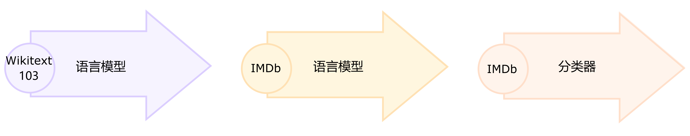

在本节结束时，你将在 Hub 上拥有一个 [掩码语言模型(masked language model)](https://huggingface.co/huggingface-course/distilbert-base-uncased-finetuned-imdb?text=This+is+a+great+%5BMASK%5D)(https://huggingface.co/huggingface-course/distilbert-base-uncased-finetuned-imdb?text=This+is+a+great+%5BMASK%5D) ，该模型可以自动完成句子，如下所示：


让我们开始吧！

<div custom-style="Tip-green">

🙋 如果你对“掩码语言建模”和“预训练模型”这两个术语感到陌生，请查看第二章，我们在其中解释了所有这些核心概念！

</div>

### 选择用于掩码语言建模的预训练模型 

首先，让我们为掩码语言建模选择一个合适的预训练模型。如以下屏幕截图所示，你可以通过在 [Hugging Face Hub](https://huggingface.co/models?pipeline_tag=fill-mask&sort=downloads)(https://huggingface.co/models?pipeline_tag=fill-mask&sort=downloads) 上选择“Fill-Mask”过滤器：


尽管 BERT 和 RoBERTa 系列模型的下载量最大，但我们将使用名为 [DistilBERT](https://huggingface.co/distilbert-base-uncased)(https://huggingface.co/distilbert-base-uncased) 的模型。它可以更快地训练，而且对下游性能几乎没有损失。这个模型使用一种称为 [`知识蒸馏（knowledge distillation）`](https://en.wikipedia.org/wiki/Knowledge_distillation)(https://en.wikipedia.org/wiki/Knowledge_distillation) 的特殊技术进行训练，其中使用像 BERT 这样的大型“教师模型”来指导参数少得多的“学生模型”的训练。在本节中对知识蒸馏细节的解释会使我们离题太远，但如果你有兴趣，可以阅读 [`使用 Transformers 进行自然语言处理（Natural Language Processing with Transformers）`](https://www.oreilly.com/library/view/natural-language-processing/9781098136789/)(https://www.oreilly.com/library/view/natural-language-processing/9781098136789/) （俗称 Transformers 教科书）相关内容。

{#if fw === 'pt'}

让我们继续，我们可以使用 `AutoModelForMaskedLM` / `TFAutoModelForMaskedLM` 类下载 DistilBERT：

```python
#####Pytorch
from transformers import AutoModelForMaskedLM

model_checkpoint = "distilbert-base-uncased"
model = AutoModelForMaskedLM.from_pretrained(model_checkpoint)####end
```

{:else}


```python
#####TensorFlow
from transformers import TFAutoModelForMaskedLM

model_checkpoint = "distilbert-base-uncased"
model = TFAutoModelForMaskedLM.from_pretrained(model_checkpoint)####end
```

{/if}


我们可以通过调用 `num_parameters()` / `summary()` 方法查看模型有多少参数：

{#if fw === 'pt'}

```python
#####Pytorch
distilbert_num_parameters = model.num_parameters() / 1_000_000
print(f"'>>> DistilBERT number of parameters: {round(distilbert_num_parameters)}M'")
print(f"'>>> BERT number of parameters: 110M'")####end
```

```python
#####Pytorch
'>>> DistilBERT number of parameters: 67M'
'>>> BERT number of parameters: 110M'####end
```

{:else}

```python
#####TensorFlow
model(model.dummy_inputs)  # 构建模型
model.summary()####end
```

```python
#####TensorFlow
Model: "tf_distil_bert_for_masked_lm"
_________________________________________________________________
 Layer (type)                Output Shape              Param #   
=================================================================
 distilbert (TFDistilBertMai  multiple                 66362880  
 nLayer)                                                         
                                                                 
 vocab_transform (Dense)     multiple                  590592    
                                                                 
 vocab_layer_norm (LayerNorm  multiple                 1536      
 alization)                                                      
                                                                 
 vocab_projector (TFDistilBe  multiple                 23866170  
 rtLMHead)                                                       
                                                                 
=================================================================
Total params: 66,985,530
Trainable params: 66,985,530
Non-trainable params: 0
_________________________________________________________________####end
```

{/if}

DistilBERT 大约有 6700 万个参数，大约是 BERT base 模型的二分之一，这大致意味着训练的速度提高了两倍 —— 非常棒！现在让我们看看对于下面的一小部分文本，这个模型最有可能预测什么：

```python
text = "This is a great [MASK]."
```

作为人类，我们可以想象 `[MASK]` token 有很多可能性，例如 “day”、“ride” 或者 “painting”。对于预训练模型，预测取决于模型所训练的语料库，因为它会学习获取数据中存在的统计模式。与 BERT 一样，DistilBERT 在 [English Wikipedia](https://huggingface.co/datasets/wikipedia)(https://huggingface.co/datasets/wikipedia) 和 [BookCorpus](https://huggingface.co/datasets/bookcorpus)(https://huggingface.co/datasets/bookcorpus) 数据集上进行预训练，所以我们期望对 `[MASK]` 的预测能够反映这些领域。为了预测 `[MASK]` ，我们需要 DistilBERT 的 tokenizer 来处理模型的输入，所以让我们也从 Hub 下载它：

```python
from transformers import AutoTokenizer

tokenizer = AutoTokenizer.from_pretrained(model_checkpoint)
```

有了 tokenizer 和模型，我们现在可以将我们的示例文本传递给模型，提取 logits，并打印出前 5 个候选词：

{#if fw === 'pt'}

```python
#####Pytorch
import torch

inputs = tokenizer(text, return_tensors="pt")
token_logits = model(**inputs).logits
# 找到 [MASK] 的位置并提取其 logits
mask_token_index = torch.where(inputs["input_ids"] == tokenizer.mask_token_id)[1]
mask_token_logits = token_logits[0, mask_token_index, :]
# 选择具有最高 logits 的 [MASK] 候选词
top_5_tokens = torch.topk(mask_token_logits, 5, dim=1).indices[0].tolist()

for token in top_5_tokens:
    print(f"'>>> {text.replace(tokenizer.mask_token, tokenizer.decode([token]))}'")####end
```

{:else}

```python
#####TensorFlow
import numpy as np
import tensorflow as tf

inputs = tokenizer(text, return_tensors="np")
token_logits = model(**inputs).logits
# 找到 [MASK] 的位置并提取其 logits
mask_token_index = np.argwhere(inputs["input_ids"] == tokenizer.mask_token_id)[0, 1]
mask_token_logits = token_logits[0, mask_token_index, :]
# 选择具有最高 logits 的 [MASK] 候选词
# 通过在 argsort 前对数组取负,来得到最大的 logits
top_5_tokens = np.argsort(-mask_token_logits)[:5].tolist()

for token in top_5_tokens:
    print(f">>> {text.replace(tokenizer.mask_token, tokenizer.decode([token]))}")####end
```

{/if}

```python
'>>> This is a great deal.'
'>>> This is a great success.'
'>>> This is a great adventure.'
'>>> This is a great idea.'
'>>> This is a great feat.'
```

我们可以从输出中看到，模型的预测的是日常术语，这可能并不奇怪，考虑到英语维基百科的数据集基础。现在让我们看看如何将这个领域改变成稍微更加独特——高度两极分化的电影评论！

### 数据集 

为了展示领域适应性，我们将使用著名的 [大型电影评论数据集(Large Movie Review Dataset)](https://huggingface.co/datasets/imdb)(https://huggingface.co/datasets/imdb) （或者简称为 IMDb），这是一个电影评论语料库，通常用于对情感分析模型进行基准测试。通过在这个语料库上对 DistilBERT 进行微调，我们期望语言模型会从其预训练的维基百科的事实性数据，适应到更主观的电影评论的领域。我们可以使用Datasets 中的 `load_dataset()` 函数从 Hugging Face 中获取数据：

```python
from datasets import load_dataset

imdb_dataset = load_dataset("imdb")
imdb_dataset
```

```python
DatasetDict({
    train: Dataset({
        features: ['text', 'label'],
        num_rows: 25000
    })
    test: Dataset({
        features: ['text', 'label'],
        num_rows: 25000
    })
    unsupervised: Dataset({
        features: ['text', 'label'],
        num_rows: 50000
    })
})
```

我们可以看到 `train` 和 `test` 分别包含了 25,000 条评论，还有一个没有的标签的 `unsupervised（无监督）` 部分包含 50,000 条评论。接下来让我们看一些示例，来了解一下我们正在处理的文本类型。正如我们在本课程的前几章中所做的那样，我们将把 `Dataset.shuffle()` 函数链接到 `Dataset.select()` 函数创建随机样本：

```python
sample = imdb_dataset["train"].shuffle(seed=42).select(range(2))

for row in sample:
    print(f"\n'>>> Review: {row['text']}'")
    print(f"'>>> Label: {row['label']}'")
```

```python

'>>> Review: This is your typical Priyadarshan movie--a bunch of loony characters out on some silly mission. His signature climax has the entire cast of the film coming together and fighting each other in some crazy moshpit over hidden money. Whether it is a winning lottery ticket in Malamaal Weekly, black money in Hera Pheri, "kodokoo" in Phir Hera Pheri, etc., etc., the director is becoming ridiculously predictable. Don\'t get me wrong; as clichéd and preposterous his movies may be, I usually end up enjoying the comedy. However, in most his previous movies there has actually been some good humor, (Hungama and Hera Pheri being noteworthy ones). Now, the hilarity of his films is fading as he is using the same formula over and over again.<br /><br />Songs are good. Tanushree Datta looks awesome. Rajpal Yadav is irritating, and Tusshar is not a whole lot better. Kunal Khemu is OK, and Sharman Joshi is the best.'
'>>> Label: 0'

'>>> Review: I saw this movie at the theaters when I was about 6 or 7 years old. I loved it then, and have recently come to own a VHS version. <br /><br />My 4 and 6 year old children love this movie and have been asking again and again to watch it. <br /><br />I have enjoyed watching it again too. Though I have to admit it is not as good on a little TV.<br /><br />I do not have older children so I do not know what they would think of it. <br /><br />The songs are very cute. My daughter keeps singing them over and over.<br /><br />Hope this helps.'
'>>> Label: 1'
```

是的，这些肯定是电影评论，如果你年龄足够大，你甚至可能会理解上次评论中关于拥有 VHS 版本的评论😜！虽然语言模型不需要预先标注好的标签，但我们已经可以看到数据集其实包含了标签， `0` 代表负面评论， `1` 代表正面评论。

<div custom-style="Tip-green">

✏️ **试一试！** 创建一个 `unsupervised` 部分的随机样本，并验证其标签既不是 `0` 也不是 `1` 。当你这样做时，你也可以检查 `train` 和 `test` 部分的标签确实是 `0` 或 `1` —— 这是每个 NLP 实践者在开始新项目时应该进行的有用的合理的检查！

</div>

现在我们已经快速浏览了一下数据，接下来我们要深入准备这些数据以供进行掩码语言建模。如我们所见，与我们在第四章看到的序列分类任务相比，这里需要采取一些额外的步骤。让我们开始吧！

### 预处理数据 

对于自回归和掩码语言建模，常见的预处理步骤是将所有的示例连接起来，然后将整个语料库切割为等大小的块。这与我们通常的做法有很大的不同，我们通常只是对单个的示例进行 tokenize。为什么要将所有的示例连接在一起呢？原因是如果单个示例太长，可能会被截断，这会导致我们失去可能对语言建模任务有用的信息！

因此，我们首先像往常一样对语料库进行 tokenize 处理，但是不在 tokenizer 中设置 `truncation=True` 选项。如果我们有可以使用快速 tokenizer（如第七章中所述），我们还将获取单词的 ID，因为后面我们需要用到它们来进行整词掩码。我们将把这个过程封装在一个简单的函数中，并删除 text 和 label 列，因为我们不再需要它们。

```python
def tokenize_function(examples):
    result = tokenizer(examples["text"])
    if tokenizer.is_fast:
        result["word_ids"] = [result.word_ids(i) for i in range(len(result["input_ids"]))]
    return result

# 使用 batched=True 来激活快速多线程!
tokenized_datasets = imdb_dataset.map(
    tokenize_function, batched=True, remove_columns=["text", "label"]
)
tokenized_datasets
```

```python
DatasetDict({
    train: Dataset({
        features: ['attention_mask', 'input_ids', 'word_ids'],
        num_rows: 25000
    })
    test: Dataset({
        features: ['attention_mask', 'input_ids', 'word_ids'],
        num_rows: 25000
    })
    unsupervised: Dataset({
        features: ['attention_mask', 'input_ids', 'word_ids'],
        num_rows: 50000
    })
})
```

由于 DistilBERT 是一个类似 BERT 的模型，我们可以看到编码后的文本包含了我们在之前章节中看到的 `input_ids` 和 `attention_mask` ，以及我们添加的 `word_ids` 。

现在我们已经对电影评论进行了 tokenize，下一步是将它们全部组合在一起并将结果分割成块。但是，这些块应该有多大呢？这最终将取决于你可以使用的 GPU 内存大小，但一个好的起点是查看模型的最大上下文大小。这可以通过查看 tokenizer 的 `model_max_length` 属性来推断：

```python
tokenizer.model_max_length
```

```python
512
```

该值来自于与 checkpoint 相关联的 `tokenizer_config.json` 文件；在我们的例子中，我们可以看到上下文大小是 512 个 tokens 就像 BERT 一样。

<div custom-style="Tip-green">

✏️ **试试看！** 一些 Transformer 模型，例如 [BigBird](https://huggingface.co/google/bigbird-roberta-base)(https://huggingface.co/google/bigbird-roberta-base) 和 [Longformer](hf.co/allenai/longformer-base-4096)(hf.co/allenai/longformer-base-4096) ，它们具有比 BERT 和其他早期 Transformer 模型更长的上下文长度。选择一个 checkpoint 实例化 tokenizer 并验证 `model_max_length` 是否与模型卡上引用的内容一致。

</div>

因此，以便在像 Google Colab 那样的 GPU 上运行我们的实验，我们会选择一个稍小一点、可以放入内存中的分块尺寸：

```python
chunk_size = 128
```

<div custom-style="Tip-green">

注意，在实际应用场景中，使用小的块尺寸可能会有不利的影响，所以你应该选择一个与你将要使用模型的用例相匹配的大小。

</div>

现在来到了有趣的部分。为了展示如何把这些示例连接在一，我们从分词后的训练集中取出几个评论，并打印出每个评论的 token 数量：

```python
# 切片会为每个特征生成一个列表的列表
tokenized_samples = tokenized_datasets["train"][:3]

for idx, sample in enumerate(tokenized_samples["input_ids"]):
    print(f"'>>> Review {idx} length: {len(sample)}'")
```

```python
'>>> Review 0 length: 200'
'>>> Review 1 length: 559'
'>>> Review 2 length: 192'
```

然后，我们可以用一个简单的字典推导式将所有这些示例连接在一起，如下所示：

```python
concatenated_examples = {
    k: sum(tokenized_samples[k], []) for k in tokenized_samples.keys()
}
total_length = len(concatenated_examples["input_ids"])
print(f"'>>> Concatenated reviews length: {total_length}'")
```

```python
'>>> Concatenated reviews length: 951'
```

很棒，总长度计算出来了 —— 现在，让我们将连接的评论拆分为大小为 `block_size` 的块。为此，我们迭代了 `concatenated_examples` 中的特征，并使用列表推导式创建每个特征的切片。结果是一个字典，包含每个特征对应的块：

```python
chunks = {
    k: [t[i : i + chunk_size] for i in range(0, total_length, chunk_size)]
    for k, t in concatenated_examples.items()
}

for chunk in chunks["input_ids"]:
    print(f"'>>> Chunk length: {len(chunk)}'")
```

```python
'>>> Chunk length: 128'
'>>> Chunk length: 128'
'>>> Chunk length: 128'
'>>> Chunk length: 128'
'>>> Chunk length: 128'
'>>> Chunk length: 128'
'>>> Chunk length: 128'
'>>> Chunk length: 55'
```

正如你在这个例子中看到的，最后一个块通常会小于最大块大小。有两种主要的策略来处理这个问题：

* 如果最后一个块小于 `chunk_size` ，就丢弃。
* 填充最后一个块，直到其长度等于 `chunk_size` 。

我们将在这里采用第一种方法，因此让我们将上述所有逻辑包装在一个函数中，以便我们可以将其应用于我们的已分词数据集上：

```python
def group_texts(examples):
    # 拼接所有的文本
    concatenated_examples = {k: sum(examples[k], []) for k in examples.keys()}
    # 计算拼接文本的长度
    total_length = len(concatenated_examples[list(examples.keys())[0]])
    # 如果最后一个块小于 chunk_size,我们将其丢弃
    total_length = (total_length // chunk_size) * chunk_size
    # 按最大长度分块
    result = {
        k: [t[i : i + chunk_size] for i in range(0, total_length, chunk_size)]
        for k, t in concatenated_examples.items()
    }
    # 创建一个新的 labels 列
    result["labels"] = result["input_ids"].copy()
    return result
```

注意，在 `group_texts()` 的最后一步，我们创建了一个新的 `labels` 列，它是通过复制 `input_ids` 列形成的。这是因为在掩码语言模型中，目标是预测输入批中随机掩码的 token 通过创建 `labels` 列，我们保存了让我们的语言模型从中学习 `[Mask]` 的答案。

现在，让我们使用我们强大的 `Dataset.map()` 函数将 `group_texts()` 应用到我们的已分词数据集上：

```python
lm_datasets = tokenized_datasets.map(group_texts, batched=True)
lm_datasets
```

```python
DatasetDict({
    train: Dataset({
        features: ['attention_mask', 'input_ids', 'labels', 'word_ids'],
        num_rows: 61289
    })
    test: Dataset({
        features: ['attention_mask', 'input_ids', 'labels', 'word_ids'],
        num_rows: 59905
    })
    unsupervised: Dataset({
        features: ['attention_mask', 'input_ids', 'labels', 'word_ids'],
        num_rows: 122963
    })
})
```

通过对文本进行分组和块分析，我们得到的例子比原来的训练集和测试集的 25000 个例子要多得多。这是因为我们现在有了涉及跨越原始语料库中多个例子的连续标记的例子。你可以通过在其中一个块中查找特殊的 `[SEP]` 和 `[CLS]` tokens 来清晰地看到这一点：

```python
tokenizer.decode(lm_datasets["train"][1]["input_ids"])
```

```python
".... at.......... high. a classic line : inspector : i'm here to sack one of your teachers. student : welcome to bromwell high. i expect that many adults of my age think that bromwell high is far fetched. what a pity that it isn't! [SEP] [CLS] homelessness ( or houselessness as george carlin stated ) has been an issue for years but never a plan to help those on the street that were once considered human who did everything from going to school, work, or vote for the matter. most people think of the homeless"
```

在这个例子中，你可以看到两个重叠的电影评论，一个关于高中电影，另一个关于无家可归的问题。让我们也检查一下掩码语言模型的标签是什么样的：

```python
tokenizer.decode(lm_datasets["train"][1]["labels"])
```

```python
".... at.......... high. a classic line : inspector : i'm here to sack one of your teachers. student : welcome to bromwell high. i expect that many adults of my age think that bromwell high is far fetched. what a pity that it isn't! [SEP] [CLS] homelessness ( or houselessness as george carlin stated ) has been an issue for years but never a plan to help those on the street that were once considered human who did everything from going to school, work, or vote for the matter. most people think of the homeless"
```

正如我们上面的 `group_texts()` 函数所预期的那样，这看起来与解码的 `input_ids` 完全相同 —— 但是要怎么样才能让我们的的模型可以学习到一些东西呢？我们缺少一个关键的步骤：在输入中随机插入 `[MASK]` token！让我们看看如何在微调期间使用特殊的数据收集器来实时完成这个步骤。

### 使用 `Trainer` API 微调 DistilBERT 

微调掩码语言模型几乎与微调序列分类模型相同，就像我们在第四章所做的那样。唯一的区别是我们需要一个特殊的数据整理器，它可以随机屏蔽每批文本中的一些 tokens 幸运的是，Transformers 为这项任务准备了专用的 `DataCollatorForLanguageModeling` 。我们只需要将 tokenizer 和一个 `mlm_probability` 参数（指定掩盖 tokens 的比例）传递给它。我们将选择 15％，这是 BERT 所使用的数量，也是文献中常见的选择：

```python
from transformers import DataCollatorForLanguageModeling

data_collator = DataCollatorForLanguageModeling(tokenizer=tokenizer, mlm_probability=0.15)
```

为了了解随机掩码的工作原理，让我们把一些例子输入到数据整理器。由于数据整理器期望接收一个字典列表，其中每个字典表示一段连续文本的块，所以我们首先遍历数据集，然后将批量的数据输入到整理器。在这个数据整理器中，我们删除了 `word_ids` 这个键，因为它不需要这个键。

```python
samples = [lm_datasets["train"][i] for i in range(2)]
for sample in samples:
    _ = sample.pop("word_ids")

for chunk in data_collator(samples)["input_ids"]:
    print(f"\n'>>> {tokenizer.decode(chunk)}'")
```

```python
'>>> [CLS] bromwell [MASK] is a cartoon comedy. it ran at the same [MASK] as some other [MASK] about school life, [MASK] as " teachers ". [MASK] [MASK] [MASK] in the teaching [MASK] lead [MASK] to believe that bromwell high\'[MASK] satire is much closer to reality than is " teachers ". the scramble [MASK] [MASK] financially, the [MASK]ful students whogn [MASK] right through [MASK] pathetic teachers\'pomp, the pettiness of the whole situation, distinction remind me of the schools i knew and their students. when i saw [MASK] episode in [MASK] a student repeatedly tried to burn down the school, [MASK] immediately recalled. [MASK]...'

'>>> .... at.. [MASK]... [MASK]... high. a classic line plucked inspector : i\'[MASK] here to [MASK] one of your [MASK]. student : welcome to bromwell [MASK]. i expect that many adults of my age think that [MASK]mwell [MASK] is [MASK] fetched. what a pity that it isn\'t! [SEP] [CLS] [MASK]ness ( or [MASK]lessness as george 宇in stated )公 been an issue for years but never [MASK] plan to help those on the street that were once considered human [MASK] did everything from going to school, [MASK], [MASK] vote for the matter. most people think [MASK] the homeless'
```

很棒，成功了！我们可以看到， `[MASK]` tokens 已随机插入我们文本中的不同位置。这些将是我们的模型在训练期间必须预测的 tokens  —— 数据整理器的美妙之处在于，它会在每个 batch 中随机插入 `[MASK]` ！

<div custom-style="Tip-green">

✏️ **试一试！** 运行上面的代码片段几次，亲眼看看随机遮蔽的过程！也可以用 `tokenizer.convert_ids_to_tokens()` 替换 `tokenizer.decode()` 方法，看看只把一个给定单词的单个 token 遮蔽，而保持这个单词其他 tokens 不变的效果。

</div>

{#if fw === 'pt'}

随机掩码的一个副作用是，当使用 `Trainer` 时，我们的评估指标将不是确定性的，因为我们会对训练集和测试集使用相同的数据整理器。稍后我们将看到，当我们使用 Accelerate 进行微调时，我们将如何利用自定义评估循环的灵活性来冻结随机性。

{/if}

在为掩码语言建模训练模型时，可以使用的一种技术是一次遮蔽整个单词，而不仅仅是单个的 tokens 这种方法称为 `全词屏蔽（whole word masking）` 。如果我们想使用全词屏蔽（whole word masking），我们需要自己构建一个数据整理器。数据整理器只是一个函数，它接受一个样本列表并将它们转换为一个 batch，所以现在让我们这样做吧！我们将使用先前计算的单词 ID，构建一个单词索引和相应 token 之间的映射，然后随机决定遮蔽哪些单词，并使用这种方法对输入进行遮蔽。请注意，除了与掩码对应的标签外，所有其他的标签均为 `-100` 。

{#if fw === 'pt'}

```python
#####Pytorch
import collections
import numpy as np

from transformers import default_data_collator

wwm_probability = 0.2

def whole_word_masking_data_collator(features):
    for feature in features:
        word_ids = feature.pop("word_ids")

        # 创建一个单词与对应 token 索引之间的映射
        mapping = collections.defaultdict(list)
        current_word_index = -1
        current_word = None
        for idx, word_id in enumerate(word_ids):
            if word_id is not None:
                if word_id != current_word:
                    current_word = word_id
                    current_word_index += 1
                mapping[current_word_index].append(idx)

        # 随机遮蔽单词
        mask = np.random.binomial(1, wwm_probability, (len(mapping),))
        input_ids = feature["input_ids"]
        labels = feature["labels"]
        new_labels = [-100] * len(labels)
        for word_id in np.where(mask)[0]:
            word_id = word_id.item()
            for idx in mapping[word_id]:
                new_labels[idx] = labels[idx]
                input_ids[idx] = tokenizer.mask_token_id
        feature["labels"] = new_labels

    return default_data_collator(features)####end
```

{:else}

```python
#####TensorFlow
import collections
import numpy as np

from transformers.data.data_collator import tf_default_data_collator

wwm_probability = 0.2

def whole_word_masking_data_collator(features):
    for feature in features:
        word_ids = feature.pop("word_ids")

        # 创建一个单词与对应 token 索引之间的映射
        mapping = collections.defaultdict(list)
        current_word_index = -1
        current_word = None
        for idx, word_id in enumerate(word_ids):
            if word_id is not None:
                if word_id != current_word:
                    current_word = word_id
                    current_word_index += 1
                mapping[current_word_index].append(idx)

        # 随机遮蔽单词
        mask = np.random.binomial(1, wwm_probability, (len(mapping),))
        input_ids = feature["input_ids"]
        labels = feature["labels"]
        new_labels = [-100] * len(labels)
        for word_id in np.where(mask)[0]:
            word_id = word_id.item()
            for idx in mapping[word_id]:
                new_labels[idx] = labels[idx]
                input_ids[idx] = tokenizer.mask_token_id
        feature["labels"] = new_labels

    return tf_default_data_collator(features)####end
```

{/if}

接下来，我们可以在和之前相同的样本上试试它：

```python
samples = [lm_datasets["train"][i] for i in range(2)]
batch = whole_word_masking_data_collator(samples)

for chunk in batch["input_ids"]:
    print(f"\n'>>> {tokenizer.decode(chunk)}'")
```

```python
'>>> [CLS] bromwell high is a cartoon comedy [MASK] it ran at the same time as some other programs about school life, such as " teachers ". my 35 years in the teaching profession lead me to believe that bromwell high\'s satire is much closer to reality than is " teachers ". the scramble to survive financially, the insightful students who can see right through their pathetic teachers\'pomp, the pettiness of the whole situation, all remind me of the schools i knew and their students. when i saw the episode in which a student repeatedly tried to burn down the school, i immediately recalled.....'

'>>> .... [MASK] [MASK] [MASK] [MASK]....... high. a classic line : inspector : i\'m here to sack one of your teachers. student : welcome to bromwell high. i expect that many adults of my age think that bromwell high is far fetched. what a pity that it isn\'t! [SEP] [CLS] homelessness ( or houselessness as george carlin stated ) has been an issue for years but never a plan to help those on the street that were once considered human who did everything from going to school, work, or vote for the matter. most people think of the homeless'
```

<div custom-style="Tip-green">

✏️ **试试看！** 多次运行上面的代码片段，亲眼看看随机遮蔽的效果！也可以将 `tokenizer.decode()` 方法替换为 `tokenizer.convert_ids_to_tokens()` ，可以观察到给定单词的 tokens 总是被一起遮蔽。

</div>

现在我们有了两个数据整理器，剩下的微调步骤都是标准的。如果你在 Google Colab 上运行并且没有幸运地得到神秘的 P100 GPU😭，那么训练可能会需要一些时间，所以我们首先将训练集的大小降低到几千个例子。不用担心，我们仍然可以得到一个相当不错的语言模型！在 Datasets 中快速下采样数据集的方法是使用我们在第六章中看到的 `Dataset.train_test_split()` 函数：

```python
train_size = 10_000
test_size = int(0.1 * train_size)

downsampled_dataset = lm_datasets["train"].train_test_split(
    train_size=train_size, test_size=test_size, seed=42
)
downsampled_dataset
```

```python
DatasetDict({
    train: Dataset({
        features: ['attention_mask', 'input_ids', 'labels', 'word_ids'],
        num_rows: 10000
    })
    test: Dataset({
        features: ['attention_mask', 'input_ids', 'labels', 'word_ids'],
        num_rows: 1000
    })
})
```

这会自动创建新的 `train` 和 `test` 数据集，训练集大小设置为 10,000 个示例，验证设置为其中的 10％ —— 如果你有一个强大的 GPU，可以自由增加这个比例！我们接下来要做的事情是登录 Hugging Face Hub。如果你在 Notebook 中运行这段代码，你可以通过以下的工具函数进行登录：

```python
from huggingface_hub import notebook_login

notebook_login()
```

它将显示一个小部件，在其中你可以输入你的凭据。或者，你也可以在你最喜欢的终端中输入指令：

```python
huggingface-cli login
```

然后在那里登录。

{#if fw === 'tf'}

登录后，我们可以创建我们的 `tf.data` 数据集。为此，我们将使用 `prepare_tf_dataset()` 方法，该方法会使用我们的模型自动推断哪些列应进入数据集。如果你想准确控制要使用的列，可以改用 `Dataset.to_tf_dataset()` 方法。为了简单起见，我们在这里只使用标准数据整理器，但你也可以尝试全词屏蔽（whole word masking）整理器，并作为一个练习比较结果：

```python
#####TensorFlow
tf_train_dataset = model.prepare_tf_dataset(
    downsampled_dataset["train"],
    collate_fn=data_collator,
    shuffle=True,
    batch_size=32,
)

tf_eval_dataset = model.prepare_tf_dataset(
    downsampled_dataset["test"],
    collate_fn=data_collator,
    shuffle=False,
    batch_size=32,
)####end
```

接下来，我们设置我们的训练超参数并编译我们的模型。我们使用Transformers 库的 `create_optimizer()` 函数，它提供了一个带有线性学习率衰减的 `AdamW` 优化器。我们还使用模型内置的损失，这是在 `compile()` 的参数中没有指定损失时的默认设置，并将训练精度设为 `"mixed_float16"` 。注意，如果你使用的是 Colab GPU 或者其他不支持加速的 float16 的 GPU，你可能应该注释掉这一行。

另外，我们设置了一个 `PushToHubCallback` ，它将在每个 epoch 后将模型保存到 Hub。你可以使用 `hub_model_id` 参数指定你想推送到的仓库的名称（如果你想把它推送到一个组织，你必须使用这个参数）。例如，要将模型推送到 [`huggingface-course` 组织](https://huggingface.co/huggingface-course)(https://huggingface.co/huggingface-course)(https://huggingface.co/huggingface-course) ，我们添加了 `hub_model_id="huggingface-course/distilbert-finetuned-imdb"` 。在默认的情况下，模型的仓库将保存在你的账户中，并以你设置的输出目录命名，所以在我们的示例中，它将是 `"lewtun/distilbert-finetuned-imdb"` 。

```python
#####TensorFlow
from transformers import create_optimizer
from transformers.keras_callbacks import PushToHubCallback
import tensorflow as tf

num_train_steps = len(tf_train_dataset)
optimizer, schedule = create_optimizer(
    init_lr=2e-5,
    num_warmup_steps=1_000,
    num_train_steps=num_train_steps,
    weight_decay_rate=0.01,
)
model.compile(optimizer=optimizer)

# 使用 float16 精度进行混合精度训练
tf.keras.mixed_precision.set_global_policy("mixed_float16")

model_name = model_checkpoint.split("/")[-1]
callback = PushToHubCallback(
    output_dir=f"{model_name}-finetuned-imdb", tokenizer=tokenizer
)####end
```

我们现在已经准备好运行 `model.fit()` 了 —— 但在此之前，让我们先简单地看看 `困惑度（perplexity）` ，它是一种常用的评估语言模型性能的指标。

{:else}

登陆后，我们可以指定 `Trainer` 的参数：

```python
#####Pytorch
from transformers import TrainingArguments

batch_size = 64
##在每个 epoch 输出训练的 loss
logging_steps = len(downsampled_dataset["train"]) // batch_size
model_name = model_checkpoint.split("/")[-1]

training_args = TrainingArguments(
    output_dir=f"{model_name}-finetuned-imdb",
    overwrite_output_dir=True,
    evaluation_strategy="epoch",
    learning_rate=2e-5,
    weight_decay=0.01,
    per_device_train_batch_size=batch_size,
    per_device_eval_batch_size=batch_size,
    push_to_hub=True,
    fp16=True,
    logging_steps=logging_steps,
)####end
```

在这里，我们调整了一些默认选项，包括 `logging_steps` ，以确保我们可以跟踪每个 epoch 的训练损失。我们还使用了 `fp16=True` 来实现混合精度训练，从而进一步提高训练速度。默认情况下， `Trainer` 将删除模型的 `forward()` 方法中未使用的列。这意味着，如果你使用全词屏蔽（whole word masking）数据整理器，你还需要设置 `remove_unused_columns=False` ，以确保我们不会在训练期间丢失 `word_ids` 列。

请注意，你可以使用 `hub_model_id` 参数指定你想推送到的仓库的名称（如果你想把它推送到一个组织，就必须使用这个参数）。例如，当我们将模型推送到 [`huggingface-course` 组织](https://huggingface.co/huggingface-course)(https://huggingface.co/huggingface-course)(https://huggingface.co/huggingface-course) 时，我们在 `TrainingArguments` 中添加了 `hub_model_id="huggingface-course/distilbert-finetuned-imdb"` 。默认情况下，使用的仓库将保存在你的账户中并以你设置的输出目录命名，因此在我们的示例中，它将是 `"lewtun/distilbert-finetuned-imdb"` 。

现在，我们拥有了初始化 `Trainer` 所需的所有要素。这里我们只使用了标准的 `data_collator` ，但你可以尝试使用全词屏蔽作为数据整理器的一个练习，并将结果进行比较：

```python
#####Pytorch
from transformers import Trainer

trainer = Trainer(
    model=model,
    args=training_args,
    train_dataset=downsampled_dataset["train"],
    eval_dataset=downsampled_dataset["test"],
    data_collator=data_collator,
    tokenizer=tokenizer,
)####end
```

我们现在准备运行 `trainer.train()` —— 但在此之前让我们简要地看一下 `困惑度（perplexity）` ，这是评估语言模型性能的常用指标。

{/if}

#### 语言模型的困惑度（perplexity） 

与文本分类或问答等其他任务不同，在这些任务中，我们会得到一个带标签的语料库进行训练，而语言建模则没有任何明确的标签。那么我们如何确定什么是好的语言模型呢？就像手机中的自动更正功能一样，一个好的语言模型是为语法正确的句子分配高概率，为无意义的句子分配低概率。为了给你一个更直观感受，你可以在网上找到一整套“自动更正失败”的例子。其中，人们的手机中的模型产生了一些相当有趣（并且常常不妥当）的自动生成的结果！

{#if fw === 'pt'}

如果我们的测试集主要由语法正确的句子组成，那么衡量我们语言模型质量的一种方式就是计算它给测试集中所有句子的下一个词分配的概率。高概率表示模型对未见过的例子不感到“惊讶”或“困惑”，这表明它已经学习了语言的基本语法模式。困惑度有很多种数学定义，我们将使用的定义是交叉熵损失的指数。因此，我们可以使用 `Trainer.evaluate()` 函数计算测试集上的交叉熵损失，然后取结果的指数，来计算我们预训练模型的困惑度：

```python
#####Pytorch
import math

eval_results = trainer.evaluate()
print(f">>> Perplexity: {math.exp(eval_results['eval_loss']):.2f}")####end
```

{:else}

如果我们的测试集主要由语法正确的句子组成，那么衡量我们语言模型质量的一种方式就是计算它给测试集中所有句子的下一个词分配的概率。高概率表示模型对未见过的例子不感到“惊讶”或“困惑”，这表明它已经学习了语言的基本语法模式。困惑度有很多种数学定义，我们将使用的定义是交叉熵损失的指数。因此，我们可以使用 `model.evaluate()` 函数计算测试集上的交叉熵损失，然后取结果的指数，来计算我们预训练模型的困惑度：

```python
#####TensorFlow
import math

eval_loss = model.evaluate(tf_eval_dataset)
print(f"Perplexity: {math.exp(eval_loss):.2f}")####end
```

{/if}

```python
>>> Perplexity: 21.75
```

较低的困惑度分数意味着更好的语言模型，我们可以看到，我们的初始模型的值相当大。让我们看看我们是否可以通过微调来降低它！为此，我们首先运行训练循环：

{#if fw === 'pt'}

```python
#####Pytorch
trainer.train()####end
```

{:else}

```python
#####TensorFlow
model.fit(tf_train_dataset, validation_data=tf_eval_dataset, callbacks=[callback])####end
```

{/if}

然后像之前那样计算测试集上的结果困惑度：

{#if fw === 'pt'}

```python
#####Pytorch
eval_results = trainer.evaluate()
print(f">>> Perplexity: {math.exp(eval_results['eval_loss']):.2f}")####end
```

{:else}

```python
#####TensorFlow
eval_loss = model.evaluate(tf_eval_dataset)
print(f"Perplexity: {math.exp(eval_loss):.2f}")####end
```

{/if}

```python
>>> Perplexity: 11.32
```

太棒了——困惑度显著降低，这告诉我们模型已经学习到了电影评论领域的一些知识！

{#if fw === 'pt'}

一旦训练完成，我们可以将带有训练信息的模型卡片推送到 Hub（checkpoint 在训练过程中就已经保存了）：

```python
#####Pytorch
trainer.push_to_hub()####end
```

{/if}

<div custom-style="Tip-green">

✏️ **轮到你了！** 将数据整理器改为全词屏蔽的数据整理器后运行上面的训练。你能得到更好的结果吗？

</div>

{#if fw === 'pt'} 

在我们的使用案例中，我们不需要对训练循环做任何特殊的处理，但在某些情况下，你可能需要实现一些自定义逻辑。对于这些应用，你可以使用 Accelerate —— 让我们看一看！

### 使用 Accelerate 微调 DistilBERT 

正如我们在 `Trainer` 中所看到的，微调一个被掩蔽的语言模型与第四章中的文本分类示例非常相似。事实上，唯一的不同之处是使用了一个特殊的数据整理器，我们已经在本节的前面讨论过这个问题了！
然而，我们注意到 `DataCollatorForLanguageModeling` 在每次评估时也会进行随机遮罩，因此我们在每次训练运行中都会看到困惑度得分有些波动。消除这种随机性的一种方法是在整个测试集上 `仅进行一次` 遮罩，然后在评估过程中使用Transformers 中的默认数据整理器来收集 batch。为了了解其工作原理，让我们实现一个简单的函数，类似于我们第一次使用 `DataCollatorForLanguageModeling` 时进行遮罩的方式：

```python
#####Pytorch
def insert_random_mask(batch):
    features = [dict(zip(batch, t)) for t in zip(*batch.values())]
    masked_inputs = data_collator(features)
    # 为数据集中的每一列创建一个新的"masked"列
    return {"masked_" + k: v.numpy() for k, v in masked_inputs.items()}####end
```

接下来，我们将上述函数应用到测试集，并去除未进行遮罩的列，这样就可以用遮罩过的列来替换它们。你可以通过将上述 `data_collator` 替换为适当的数据整理器来实现全词遮罩。如果你这样做了，那么你应该去除以下代码中的第一行：

```python
#####Pytorch
downsampled_dataset = downsampled_dataset.remove_columns(["word_ids"])
eval_dataset = downsampled_dataset["test"].map(
    insert_random_mask,
    batched=True,
    remove_columns=downsampled_dataset["test"].column_names,
)
eval_dataset = eval_dataset.rename_columns(
    {
        "masked_input_ids": "input_ids",
        "masked_attention_mask": "attention_mask",
        "masked_labels": "labels",
    }
)####end
```

然后我们可以像往常一样设置 DataLoader，但我们将使用Transformers 中的 `default_data_collator` ：

```python
#####Pytorch
from torch.utils.data import DataLoader
from transformers import default_data_collator

batch_size = 64
train_dataloader = DataLoader(
    downsampled_dataset["train"],
    shuffle=True,
    batch_size=batch_size,
    collate_fn=data_collator,
)
eval_dataloader = DataLoader(
    eval_dataset, batch_size=batch_size, collate_fn=default_data_collator
)####end
```

从这里开始，我们将遵循Accelerate 的标准步骤。第一个任务是重新加载预训练模型：

```python
#####Pytorch
model = AutoModelForMaskedLM.from_pretrained(model_checkpoint)####end
```

然后我们需要指定优化器；我们将使用标准的 `AdamW` ：

```python
#####Pytorch
from torch.optim import AdamW

optimizer = AdamW(model.parameters(), lr=5e-5)####end
```

有了这些对象，我们现在可以用 `Accelerator` 对象准备好一切，以进行训练：

```python
#####Pytorch
from accelerate import Accelerator

accelerator = Accelerator()
model, optimizer, train_dataloader, eval_dataloader = accelerator.prepare(
    model, optimizer, train_dataloader, eval_dataloader
)####end
```

现在我们的模型、优化器和 DataLoader 都配置好了，我们可以按照以下方式设置学习率调度器：

```python
#####Pytorch
from transformers import get_scheduler

num_train_epochs = 3
num_update_steps_per_epoch = len(train_dataloader)
num_training_steps = num_train_epochs * num_update_steps_per_epoch

lr_scheduler = get_scheduler(
    "linear",
    optimizer=optimizer,
    num_warmup_steps=0,
    num_training_steps=num_training_steps,
)####end
```

在开始训练之前，我们还需要做的最后一件事就是在 Hugging Face Hub 上创建一个模型仓库！我们可以使用Hub 库，生成我们仓库的全名：

```python
#####Pytorch
from huggingface_hub import get_full_repo_name

model_name = "distilbert-base-uncased-finetuned-imdb-accelerate"
repo_name = get_full_repo_name(model_name)
repo_name####end
```

```python
#####Pytorch
'lewtun/distilbert-base-uncased-finetuned-imdb-accelerate'####end
```

然后，我们可以使用Hub 的 `Repository` 类创建并克隆仓库：

```python
#####Pytorch
from huggingface_hub import Repository

output_dir = model_name
repo = Repository(output_dir, clone_from=repo_name)####end
```

完整的训练循环代码详见随书代码文档。

```python
#####Pytorch
>>> Epoch 0: Perplexity: 11.397545307900472
>>> Epoch 1: Perplexity: 10.904909330983092
>>> Epoch 2: Perplexity: 10.729503505340409####end
```

很棒，我们已经能够评估每个 epoch 的困惑度，并确保多次运行可以复现！

{/if}

### 使用我们微调的模型 

你可以使用 Hub 上的模型部件或者在本地使用Transformers 的 `pipeline` 与微调模型进行交互。让我们使用后者通过 `fill-mask` pipeline 下载我们的模型：

```python
from transformers import pipeline

mask_filler = pipeline(
    "fill-mask", model="huggingface-course/distilbert-base-uncased-finetuned-imdb"
)
```

然后我们可以将文本“This is a great [MASK]”提供给 pipeline，看看前 5 个预测是什么：

```python
preds = mask_filler(text)

for pred in preds:
    print(f">>> {pred['sequence']}")
```

```python
'>>> this is a great movie.'
'>>> this is a great film.'
'>>> this is a great story.'
'>>> this is a great movies.'
'>>> this is a great character.'
```

Nice！—— 我们的模型显然已经调整了它的权重来预测与电影更密切相关的词！

这标志着我们第一次训练语言模型的实验的结束。在第 6 节中，你将学习如何从头开始训练一个自动回归模型，比如 GPT-2；如果你想看看如何预训练你自己的 Transformer 模型，就赶快去那里看看吧！

<div custom-style="Tip-green">

✏️ **试试看！** 为了量化领域适应的好处，分别使用预训练和微调的 DistilBERT checkpoint 和 IMDb 标签来微调一个分类器，并对比一下这个两个 checkpoint 的差异。如果你需要复习文本分类的知识，请查看第四章。
</div>


## 8.3 翻译 

现在让我们深入研究翻译。这是另一个 [sequence-to-sequence 任务](/course/chapter1/7)(/course/chapter1/7) ，这意味着这是一个可以表述为从一个序列到另一个序列的问题。从这个意义上说，这个问题非常类似 [文本摘要](/course/chapter7/6)(/course/chapter7/6) ，并且你可以将我们将在此处学习到的一些内容迁移到其他的序列到序列问题，例如：

- **风格迁移** 创建一个模型将某种风格迁移到一段文本（例如，正式的风格迁移到休闲的风格，或莎士比亚英语到现代英语）。
- **生成问题的回答** 创建一个模型，在给定上下文的情况下生成问题的答案。

如果你有足够大的两种（或更多）语言的文本语料库，你可以从头开始训练一个新的翻译模型，就像我们在 [因果语言建模](/course/chapter7/6)(/course/chapter7/6) 部分中所做的那样。然而，微调现有的翻译模型会更快，无论是从像 mT5 或 mBART 这样的多语言模型微调到特定的语言对，还是你想微调到特定语料库的一种语言到另一种语言的专用翻译模型。

在这一节中，我们将微调一个预训练的 Marian 模型，该模型是用来从英语翻译成法语的（因为很多 Hugging Face 的员工都会说这两种语言），并在 [KDE4 数据集](https://huggingface.co/datasets/kde4)(https://huggingface.co/datasets/kde4)(https://huggingface.co/datasets/kde4) 上进行训练，这是一个用于 [KDE 应用](https://apps.kde.org/)(https://apps.kde.org/) 的本地化文件数据集。我们将使用的模型已经在从 [Opus 数据集](https://opus.nlpl.eu/)(https://opus.nlpl.eu/) （实际上包含 KDE4 数据集）中提取的法语和英语文本的大型语料库上进行了预先训练。但是，即使我们使用的预训练模型在其预训练期间使用了这部分数据集，我们也会看到，经过微调后，我们可以得到一个更好的版本。

完成后，我们将拥有一个模型，可以进行这样的翻译：


与前面的部分一样，你可以使用以下代码找到我们将训练并上传到 Hub 的模型示例，并 [在这里](https://huggingface.co/huggingface-course/marian-finetuned-kde4-en-to-fr?text=This+plugin+allows+you+to+automatically+translate+web+pages+between+several+languages.)(https://huggingface.co/huggingface-course/marian-finetuned-kde4-en-to-fr?text=This+plugin+allows+you+to+automatically+translate+web+pages+between+several+languages.) 查看模型输出的结果。

### 准备数据 

为了从头开始微调或训练翻译模型，我们需要一个适合该任务的数据集。如前所述，我们将使用 [KDE4 数据集](https://huggingface.co/datasets/kde4)(https://huggingface.co/datasets/kde4)(https://huggingface.co/datasets/kde4) 。在本节中，但你可以很容易地调整代码以使用你自己的数据，只要你有要互译的两种语言的句子对。如果你需要复习如何将自定义数据加载到 `Dataset` ，可以复习一下第六章。

#### KDE4 数据集 

像往常一样，我们使用 `load_dataset()` 函数下载我们的数据集：

```python
from datasets import load_dataset

raw_datasets = load_dataset("kde4", lang1="en", lang2="fr")
```

如果你想使用不同的语言对，你可以使用语言代码来指定它们。该数据集共有 92 种语言可用；你可以通过展开 [数据集卡片](https://huggingface.co/datasets/kde4)(https://huggingface.co/datasets/kde4) 上的语言标签来查看它们。


我们来看看数据集：

```python
raw_datasets
```

```python
DatasetDict({
    train: Dataset({
        features: ['id', 'translation'],
        num_rows: 210173
    })
})
```

我们有 210,173 对句子，但在一次训练过程中，我们也需要创建自己的验证集。正如我们在第六章学的的那样， `Dataset` 有一个 `train_test_split()` 方法可以帮助我们。我们将设置一个随机数种子以保证结果的可复现性：

```python
split_datasets = raw_datasets["train"].train_test_split(train_size=0.9, seed=20)
split_datasets
```

```python
DatasetDict({
    train: Dataset({
        features: ['id', 'translation'],
        num_rows: 189155
    })
    test: Dataset({
        features: ['id', 'translation'],
        num_rows: 21018
    })
})
```

我们可以像下面这样将 “test” 键重命名为 “validation”：

```python
split_datasets["validation"] = split_datasets.pop("test")
```

现在让我们看一下数据集的一个元素：

```python
split_datasets["train"][1]["translation"]
```

```python
{'en': 'Default to expanded threads',
 'fr': 'Par défaut, développer les fils de discussion'}
```

我们得到一个包含我们选择的两种语言的两个句子的字典。这个充满技术计算机科学术语的数据集的一个特殊之处在于它们都完全用法语翻译。然而，法国工程师通常很懒惰，在交谈时，大多数计算机科学专用词汇都用英语表述。例如，“threads”这个词很可能出现在法语句子中，尤其是在技术对话中；但在这个数据集中，它被翻译成更准确的“fils de Discussion”。我们使用的预训练模型已经在一个更大的法语和英语句子语料库上进行了预训练，选择了更为简单的保留原词的方式：

```python
from transformers import pipeline

model_checkpoint = "Helsinki-NLP/opus-mt-en-fr"
translator = pipeline("translation", model=model_checkpoint)
translator("Default to expanded threads")
```

```python
[{'translation_text': 'Par défaut pour les threads élargis'}]
```

这种情况的另一个例子可以在“plugin”这个词上看到，它并非正式的法语词汇，但大多数母语是法语的人都会理解并且不会去翻译它。在 KDE4 数据集中，这个词被翻译成了更正式的法语词汇“module d'extension”：

```python
split_datasets["train"][172]["translation"]
```

```python
{'en': 'Unable to import %1 using the OFX importer plugin. This file is not the correct format.',
 'fr': "Impossible d'importer %1 en utilisant le module d'extension d'importation OFX. Ce fichier n'a pas un format correct."}
```

然而，我们的预训练模型坚持使用简练而熟悉的英文单词：

```python
translator(
    "Unable to import %1 using the OFX importer plugin. This file is not the correct format."
)
```

```python
[{'translation_text': "Impossible d'importer %1 en utilisant le plugin d'importateur OFX. Ce fichier n'est pas le bon format."}]
```

看看我们的微调模型是否能识别数据集的这些特殊性。（剧透警告：它会的）。

<div custom-style="Tip-green">

✏️ **轮到你了！** 另一个在法语中经常使用的英语单词是“email”。在训练数据集中找到使用这个词的第一个样本。它是如何翻译的？预训练模型如何翻译同一个英文句子？

</div>

#### 处理数据 

你现在应该知道我们的下一步该做些什么了：所有文本都需要转换为 token IDs 的集合，以便模型能够理解它们。对于这个任务，我们需要同时对输入和目标 tokenize。我们的首要任务是创建我们的 `tokenizer` 对象。如前所述，我们将使用 Marian 英语到法语的预训练模型。如果你使用另一对语言尝试此代码，请确保调整模型的 checkpoint。 [Helsinki-NLP](https://huggingface.co/Helsinki-NLP)(https://huggingface.co/Helsinki-NLP) 组织提供了超过一千个多语言模型。

```python
from transformers import AutoTokenizer

model_checkpoint = "Helsinki-NLP/opus-mt-en-fr"
tokenizer = AutoTokenizer.from_pretrained(model_checkpoint, return_tensors="pt")
```

你也可以将 `model_checkpoint` 替换为你从 [Hub](https://huggingface.co/models)(https://huggingface.co/models) 中选择的其他模型，或者一个你保存了预训练模型和 tokenizer 的本地文件夹。

<div custom-style="Tip-green">

💡 如果你在使用一个多语言的 tokenizer，比如 mBART，mBART-50，或者 M2M100，你需要通过设置 `tokenizer.src_lang` 和 `tokenizer.tgt_lang` 来在 tokenizer 中指定你的输入和目标的语言代码。

</div>

我们的数据准备相当简单。只有一点要记住；你需要确保 tokenizer 处理的目标是输出语言（在这里是法语）。你可以通过将目标语言传递给 tokenizer 的 `__call__` 方法的 `text_targets` 参数来完成此操作。

为了看看这是如何工作的，让我们处理训练集中每种语言的一个样本：

```python
en_sentence = split_datasets["train"][1]["translation"]["en"]
fr_sentence = split_datasets["train"][1]["translation"]["fr"]

inputs = tokenizer(en_sentence, text_target=fr_sentence)
inputs
```

```python
{'input_ids': [47591, 12, 9842, 19634, 9, 0], 'attention_mask': [1, 1, 1, 1, 1, 1], 'labels': [577, 5891, 2, 3184, 16, 2542, 5, 1710, 0]}
```

我们可以看到，输出包含了与英语句子相关联的 inputs IDs，而与法语句子相关联的 IDs 存储在 `labels` 字段中。如果你忘记指示你正在对 labels 进行 tokenize，它们将由输入 tokenizer（语言类型不一样） 进行 tokenize，而对于 Marian 模型来说，效果不会很好。

```python
wrong_targets = tokenizer(fr_sentence)
print(tokenizer.convert_ids_to_tokens(wrong_targets["input_ids"]))
print(tokenizer.convert_ids_to_tokens(inputs["labels"]))
```

```python
['▁Par', '▁dé', 'f', 'aut', ',', '▁dé', 've', 'lop', 'per', '▁les', '▁fil', 's', '▁de', '▁discussion', '</s>']
['▁Par', '▁défaut', ',', '▁développer', '▁les', '▁fils', '▁de', '▁discussion', '</s>']
```

如你所见，如果用英语的 tokenizer 来预处理法语句子，会产生更多的 tokens，因为这个 tokenizer 不认识任何法语单词（除了那些在英语里也出现的，比如“discussion”）。

由于“inputs”是一个包含我们常用键（inputs ID、注意掩码等）的字典，最后一步是定义我们数据集的预处理函数：

```python
max_length = 128

def preprocess_function(examples):
    inputs = [ex["en"] for ex in examples["translation"]]
    targets = [ex["fr"] for ex in examples["translation"]]
    model_inputs = tokenizer(
        inputs, text_target=targets, max_length=max_length, truncation=True
    )
```

请注意，我们为输入和输出设置了相同的最大长度。由于我们处理的文本看起来很短，我们使用 128。

<div custom-style="Tip-green">

💡 如果你正在使用 T5 模型（更具体地说，一个 `t5-xxx` checkpoint ），模型会期望文本输入有一个前缀指示着手头的任务，比如 `translate: English to French:` 。

</div>

<div custom-style="Tip-yellow">

⚠️ 我们不关注目标的注意力掩码，因为模型不会需要它。相反，我们应该将填充（padding） token 对应的标签设置为 `-100` ，以便在 loss 计算中忽略它们。由于我们正在使用动态填充，这将在稍后由我们的数据整理器完成，但是如果你在此处使用填充，你应该调整预处理函数，将所有与填充（padding） token 对应的标签设置为 `-100` 。

</div>

我们现在可以对数据集的所有数据一次性进行该预处理：

```python
tokenized_datasets = split_datasets.map(
    preprocess_function,
    batched=True,
    remove_columns=split_datasets["train"].column_names,
)
```

现在数据已经过预处理，我们准备好微调我们的预训练模型了！

{#if fw === 'pt'}

### 使用 `Trainer` API 微调模型 

使用 `Trainer` 的代码将与以前相同，只是稍作改动：我们在这里将使用 [`Seq2SeqTrainer`](https://huggingface.co/transformers/main_classes/trainer.html#seq2seqtrainer)(https://huggingface.co/transformers/main_classes/trainer.html#seq2seqtrainer) ，它是 `Trainer` 的子类，它使用 `generate()` 方法来预测输入的输出，并且可以正确处理这种序列到序列的评估。当我们讨论评估指标时，我们将更详细地探讨这一点。

首先，我们需要一个模型来进行微调。我们将使用常用的 `AutoModel` API：

```python
#####Pytorch
from transformers import AutoModelForSeq2SeqLM

model = AutoModelForSeq2SeqLM.from_pretrained(model_checkpoint)####end
```

{:else}

### 使用 Keras 微调模型 

首先，我们需要一个模型来进行微调。我们将使用常用的 `AutoModel` API：

```python
#####TensorFlow
from transformers import TFAutoModelForSeq2SeqLM

model = TFAutoModelForSeq2SeqLM.from_pretrained(model_checkpoint, from_pt=True)####end
```

<div custom-style="Tip-green">

💡 `Helsinki-NLP/opus-mt-en-fr` checkpoint 只有 PyTorch 的权重，所以如果你尝试加载模型而没有使用 `from_pt=True` 参数在 `from_pretrained()` 方法中，你会得到一个错误。当你指定 `from_pt=True` ，库会自动下载并为你转换 PyTorch 权重。如你所见，使用transormer 在两种框架之间切换非常简单。

</div>

{/if}

注意，这次我们使用的是一个已经在翻译任务上进行过训练的模型，实际上已经可以使用了，所以没有关于缺少权重或新初始化的权重的警告。

#### 数据整理 

我们需要一个数据整理器来处理动态批处理的填充。在本例中，我们不能像第四章那样只使用 `DataCollatorWithPadding` ，因为它只填充输入（inputs ID、注意掩码和 token 类型 ID）。我们的标签也应该被填充到所有标签中的最大长度。而且，如前所述，用于填充标签的填充值应为 `-100` ，而不是 tokenizer 的填充 token，以确保在损失计算中忽略这些填充值。

这一切都可以由 [`DataCollatorForSeq2Seq`](https://huggingface.co/transformers/main_classes/data_collator.html#datacollatorforseq2seq)(https://huggingface.co/transformers/main_classes/data_collator.html#datacollatorforseq2seq) 完成。与 `DataCollatorWithPadding` 一样，它接收用于预处理输入的 `tokenizer` ，但它也接收 `model` 。这是因为数据整理器还将负责准备解码器 inputs ID，它们是标签偏移之后形成的，开头带有特殊 token 由于对于不同的架构有稍微不同的偏移方式， `DataCollatorForSeq2Seq` 需要接收 `model` 对象：

{#if fw === 'pt'}

```python
#####Pytorch
from transformers import DataCollatorForSeq2Seq

data_collator = DataCollatorForSeq2Seq(tokenizer, model=model)####end
```

{:else}

```python
#####TensorFlow
from transformers import DataCollatorForSeq2Seq

data_collator = DataCollatorForSeq2Seq(tokenizer, model=model, return_tensors="tf")####end
```

{/if}

为了在几个样本上进行测试，我们在已经完成 tokenize 的训练集中的部分数据上调用它：

```python
batch = data_collator([tokenized_datasets["train"][i] for i in range(1, 3)])
batch.keys()
```

```python
dict_keys(['attention_mask', 'input_ids', 'labels', 'decoder_input_ids'])
```

我们可以检查我们的标签是否已经用 `-100` 填充到 batch 的最大长度：

```python
batch["labels"]
```

```python
tensor([[  577,  5891,     2,  3184,    16,  2542,     5,  1710,     0,  -100,
          -100,  -100,  -100,  -100,  -100,  -100],
        [ 1211,     3,    49,  9409,  1211,     3, 29140,   817,  3124,   817,
           550,  7032,  5821,  7907, 12649,     0]])
```

我们还可以查看解码器的 inputs ID，可以看到它们是标签经过偏移形成的版本：

```python
batch["decoder_input_ids"]
```

```python
tensor([[59513,   577,  5891,     2,  3184,    16,  2542,     5,  1710,     0,
         59513, 59513, 59513, 59513, 59513, 59513],
        [59513,  1211,     3,    49,  9409,  1211,     3, 29140,   817,  3124,
           817,   550,  7032,  5821,  7907, 12649]])
```

以下是我们数据集中第一个和第二个元素的标签：

```python
for i in range(1, 3):
    print(tokenized_datasets["train"][i]["labels"])
```

```python
[577, 5891, 2, 3184, 16, 2542, 5, 1710, 0]
[1211, 3, 49, 9409, 1211, 3, 29140, 817, 3124, 817, 550, 7032, 5821, 7907, 12649, 0]
```

{#if fw === 'pt'}

我们将把这个 `data_collator` 传递给 `Seq2SeqTrainer` 。接下来，让我们看一下评估指标。

{:else}

我们现在可以使用 `data_collator` 将我们的每个数据集转换为 `tf.data.Dataset` ，准备好进行训练：

```python
#####TensorFlow
tf_train_dataset = model.prepare_tf_dataset(
    tokenized_datasets["train"],
    collate_fn=data_collator,
    shuffle=True,
    batch_size=32,
)
tf_eval_dataset = model.prepare_tf_dataset(
    tokenized_datasets["validation"],
    collate_fn=data_collator,
    shuffle=False,
    batch_size=16,
)####end
```

{/if}

#### 评估指标 

{#if fw === 'pt'}

`Seq2SeqTrainer` 对其超类 `Trainer` 的增强功能是在评估或预测时使用 `generate()` 方法。在训练过程中，模型会使用 `decoder_input_ids` ，并通过一个注意力掩码确保它不使用在预测的 token 之后的 token，以加速训练。在推理过程中，我们无法使用这些标签。因此，使用同样的设置评估我们的模型是一个好主意。

正如我们在第二章看到的，解码器通过一个一个地预测 token 来执行推理——这是Transformers 在幕后通过 `generate()` 方法实现的。 `Seq2SeqTrainer` 将允许我们在设置 `predict_with_generate=True` 时，使用该方法进行评估。

{/if}

用于翻译的传统指标是 [BLEU 分数](https://en.wikipedia.org/wiki/BLEU)(https://en.wikipedia.org/wiki/BLEU) ，它最初在 2002 年由 Kishore Papineni 等人的一篇文章中被引入。BLEU 分数评估翻译与其标签的接近程度。它不衡量模型生成输出的可理解性或语法正确性，而是使用统计规则来确保生成输出中的所有单词也出现在输出的目标中。此外，还有一些规则对重复的词进行惩罚，如果这些词在输出的目标中没有重复（避免模型输出像“the the the the the”这样的句子）；以及对输出的句子长度比目标中的短（避免模型输出像“the”这样的句子）进行惩罚。

BLEU 的一个缺点是它需要文本已经被分词，这使得比较使用不同分词器的模型之间的分数变得困难。因此，当今用于基准翻译模型的最常用指标是 [SacreBLEU](https://github.com/mjpost/sacrebleu)(https://github.com/mjpost/sacrebleu) ，它通过对分词步骤标准化解决了这个缺点（和其他的一些缺点）。要使用此指标，我们首先需要安装 SacreBLEU 库：

```python
!pip install sacrebleu
```

然后我们可以就像我们在第四章那样通过 `evaluate.load()` 加载它 

```python
import evaluate

metric = evaluate.load("sacrebleu")
```

这个指标将文本作为输入和目标。它的设计是为了接受多个可接受的目标，因为同一句话通常有多种可接受的翻译——我们使用的数据集只提供一个，但在 NLP 中找到将多个句子作为标签的数据集是很常见的。因此，预测结果应该是一个句子列表，而参考应该是一个句子列表的列表。

让我们尝试一个例子：

```python
predictions = [
    "This plugin lets you translate web pages between several languages automatically."
]
references = [
    [
        "This plugin allows you to automatically translate web pages between several languages."
    ]
]
metric.compute(predictions=predictions, references=references)
```

```python
{'score': 46.750469682990165,
 'counts': [11, 6, 4, 3],
 'totals': [12, 11, 10, 9],
 'precisions': [91.67, 54.54, 40.0, 33.33],
 'bp': 0.9200444146293233,
 'sys_len': 12,
 'ref_len': 13}
```

这得到了 46.75 的 BLEU 分数，这是相当不错的——作为参考，原始 Transformer 模型在 [“Attention Is All You Need” 论文](https://arxiv.org/pdf/1706.03762.pdf)(https://arxiv.org/pdf/1706.03762.pdf) 类似的英语和法语翻译任务中获得了 41.8 的 BLEU 分数！（关于其他指标，如 `counts` 和 `bp` ，可以参见 [SacreBLEU仓库](https://github.com/mjpost/sacrebleu/blob/078c440168c6adc89ba75fe6d63f0d922d42bcfe/sacrebleu/metrics/bleu.py#L74)(https://github.com/mjpost/sacrebleu/blob/078c440168c6adc89ba75fe6d63f0d922d42bcfe/sacrebleu/metrics/bleu.py#L74) ）另一方面，如果我们尝试使用翻译模型中经常出现的两种糟糕的预测类型（大量重复或太短），我们将得到相当糟糕的 BLEU 分数：

```python
predictions = ["This This This This"]
references = [
    [
        "This plugin allows you to automatically translate web pages between several languages."
    ]
]
metric.compute(predictions=predictions, references=references)
```

```python
{'score': 1.683602693167689,
 'counts': [1, 0, 0, 0],
 'totals': [4, 3, 2, 1],
 'precisions': [25.0, 16.67, 12.5, 12.5],
 'bp': 0.10539922456186433,
 'sys_len': 4,
 'ref_len': 13}
```

```python
predictions = ["This plugin"]
references = [
    [
        "This plugin allows you to automatically translate web pages between several languages."
    ]
]
metric.compute(predictions=predictions, references=references)
```

```python
{'score': 0.0,
 'counts': [2, 1, 0, 0],
 'totals': [2, 1, 0, 0],
 'precisions': [100.0, 100.0, 0.0, 0.0],
 'bp': 0.004086771438464067,
 'sys_len': 2,
 'ref_len': 13}
```

分数可以从 0 到 100，越高越好。

{#if fw === 'tf'}

为了将模型的输出转化为评估指标可以使用的文本，我们将利用 `tokenizer.batch_decode()` 方法。因为 tokenizer 会自动处理填充 tokens，所以我们只需要清理所有标签中的 `-100` 。让我们定义一个函数，这个函数会接收我们的模型和一个数据集，并在其上计算指标。

我们还将使用一个显著提升性能的技巧 - 使用 [XLA](https://www.tensorflow.org/xla)(https://www.tensorflow.org/xla) ，TensorFlow 的加速线性代数编译器，编译我们的生成代码。XLA 对模型的计算图进行了各种优化，从而显著提升了速度和内存使用率。如 Hugging Face 的 [博客](https://huggingface.co/blog/tf-xla-generate)(https://huggingface.co/blog/tf-xla-generate) 所述，当我们的输入形状不会变化太大时，XLA 工作得最好。因此，我们将把输入补齐到 128 的倍数，然后用填充整理器制作一个新的数据集，然后我们使用 `@tf.function(jit_compile=True)` 装饰器装饰我们的生成函数，这将标记整个函数用 XLA 编译。

```python
#####TensorFlow
import numpy as np
import tensorflow as tf
from tqdm import tqdm

generation_data_collator = DataCollatorForSeq2Seq(
    tokenizer, model=model, return_tensors="tf", pad_to_multiple_of=128
)

tf_generate_dataset = model.prepare_tf_dataset(
    tokenized_datasets["validation"],
    collate_fn=generation_data_collator,
    shuffle=False,
    batch_size=8,
)

@tf.function(jit_compile=True)
def generate_with_xla(batch):
    return model.generate(
        input_ids=batch["input_ids"],
        attention_mask=batch["attention_mask"],
        max_new_tokens=128,
    )

def compute_metrics():
    all_preds = []
    all_labels = []
    sampled_dataset = tokenized_datasets["validation"].shuffle().select(range(200))
    tf_generate_dataset = sampled_dataset.to_tf_dataset(
        columns=["input_ids", "attention_mask", "labels"],
        collate_fn=data_collator,
        shuffle=False,
        batch_size=4,
    )
    for batch, labels in tqdm(tf_generate_dataset):
        predictions = generate_with_xla(batch)
        decoded_preds = tokenizer.batch_decode(predictions, skip_special_tokens=True)
        labels = labels.numpy()
        labels = np.where(labels != -100, labels, tokenizer.pad_token_id)
        decoded_labels = tokenizer.batch_decode(labels, skip_special_tokens=True)
        decoded_preds = [pred.strip() for pred in decoded_preds]
        decoded_labels = [[label.strip()] for label in decoded_labels]
        all_preds.extend(decoded_preds)
        all_labels.extend(decoded_labels)

    result = metric.compute(predictions=all_preds, references=all_labels)
    return {"bleu": result["score"]}####end
```

{:else}

为了将模型的输出转化为评估指标可以使用的文本，我们将使用 `tokenizer.batch_decode()` 方法。因为 tokenizer 会自动处理填充 tokens，所以我们只需要清理标签中的所有 `-100` ：

```python
#####Pytorch
import numpy as np

def compute_metrics(eval_preds):
    preds, labels = eval_preds
    # 如果模型返回的内容超过了预测的logits
    if isinstance(preds, tuple):
        preds = preds[0]

    decoded_preds = tokenizer.batch_decode(preds, skip_special_tokens=True)

    # 由于我们无法解码 -100,因此将标签中的 -100 替换掉
    labels = np.where(labels != -100, labels, tokenizer.pad_token_id)
    decoded_labels = tokenizer.batch_decode(labels, skip_special_tokens=True)

    # 一些简单的后处理
    decoded_preds = [pred.strip() for pred in decoded_preds]
    decoded_labels = [[label.strip()] for label in decoded_labels]

    result = metric.compute(predictions=decoded_preds, references=decoded_labels)
    return {"bleu": result["score"]}####end
```

{/if}

现在这已经完成了，我们已经准备好微调我们的模型了！

#### 微调模型 

第一步是登录 Hugging Face，这样你就可以将结果上传到模型中心。有一个方便的功能可以帮助你在 notebook 中完成此操作：

```python
from huggingface_hub import notebook_login

notebook_login()
```

这将显示一个小部件，你可以在其中输入你的 Hugging Face 登录凭据。

如果你不是在 notebook 上运行代码，只需在终端中输入以下行：

```python
huggingface-cli login
```

{#if fw === 'tf'}

在我们开始之前，让我们看看我们在没有任何训练的情况下从我们的模型中得到了什么样的结果：

```python
#####TensorFlow
print(compute_metrics())####end
```

```python
#####TensorFlow
{'bleu': 33.26983701454733}####end
```

一旦完成，我们就可以准备编译和训练模型所需的一切。请注意当使用 `tf.keras.mixed_precision.set_global_policy("mixed_float16")` 时——这将告诉 Keras 使用 float16 进行训练，这可以显着提高支持它的 GPU（Nvidia 20xx/V100 或更高版本）的速度。

```python
#####TensorFlow
from transformers import create_optimizer
from transformers.keras_callbacks import PushToHubCallback
import tensorflow as tf

# 训练步数是数据集中的样本数量,除以 batch 大小,然后乘以总的 epoch 数。
# 注意这里的 tf_train_dataset 是 batch 形式的 tf.data.Dataset,
# 而不是原始的 Hugging Face Dataset ,所以使用 len() 计算它的长度已经是 num_samples // batch_size。

num_epochs = 3
num_train_steps = len(tf_train_dataset) * num_epochs

optimizer, schedule = create_optimizer(
    init_lr=5e-5,
    num_warmup_steps=0,
    num_train_steps=num_train_steps,
    weight_decay_rate=0.01,
)
model.compile(optimizer=optimizer)

# 使用 float16 混合精度进行训练
tf.keras.mixed_precision.set_global_policy("mixed_float16")####end
```

接下来，我们定义一个 `PushToHubCallback` 以便在训练期间将我们的模型上传到 Hub，正如我们在第 2 节中看到的，然后我们只需使用该回调来拟合模型：

```python
#####TensorFlow
from transformers.keras_callbacks import PushToHubCallback

callback = PushToHubCallback(
    output_dir="marian-finetuned-kde4-en-to-fr", tokenizer=tokenizer
)

model.fit(
    tf_train_dataset,
    validation_data=tf_eval_dataset,
    callbacks=[callback],
    epochs=num_epochs,
)####end
```

请注意，你可以使用 `hub_model_id` 参数指定要推送到的存储库的名称（当你想把模型推送到指定的组织的时候，就必须使用此参数）。例如，当我们将模型推送到 [`huggingface-course` 组织](https://huggingface.co/huggingface-course)(https://huggingface.co/huggingface-course)(https://huggingface.co/huggingface-course) 时，我们添加了 `hub_model_id="huggingface-course/marian-finetuned-kde4-en- to-fr"` 到 `Seq2SeqTrainingArguments` 。默认情况下，该仓库将保存在你的账户里，并以你设置的输出目录命名，因此这里将是 `"sgugger/marian-finetuned-kde4-en-to-fr"` 。

<div custom-style="Tip-green">

💡 如果你正在使用的输出目录已经存在，它需要是你想要推送到的仓库的本地克隆。如果不是，当调用 `model.fit()` 时会收到错误，并需要设置一个新名称。

</div>

最后，让我们看看训练结束后我们的指标是什么样的：

```python
#####TensorFlow
print(compute_metrics())####end
```

```python
#####TensorFlow
{'bleu': 57.334066271545865}####end
```

在这个阶段，你可以使用模型中心上的推理小部件来测试你的模型并与你的朋友分享。你已经成功地在翻译任务上微调了一个模型——恭喜！

{:else}

一旦完成这些步骤，我们就可以定义我们的 `Seq2SeqTrainingArguments` 。与 `Trainer` 一样，我们使用 `TrainingArguments` 的子类，其中包含更多可以设置的字段：

```python
#####Pytorch
from transformers import Seq2SeqTrainingArguments

args = Seq2SeqTrainingArguments(
    f"marian-finetuned-kde4-en-to-fr",
    evaluation_strategy="no",
    save_strategy="epoch",
    learning_rate=2e-5,
    per_device_train_batch_size=32,
    per_device_eval_batch_size=64,
    weight_decay=0.01,
    save_total_limit=3,
    num_train_epochs=3,
    predict_with_generate=True,
    fp16=True,
    push_to_hub=True,
)####end
```

除了通常的超参数（如学习率、训练轮数、批次大小和一些权重衰减）之外，这里与我们在前面章节看到的有一些不同：

- 我们没有设置定期进行评估，因为评估需要耗费一定的时间；我们只会在训练开始之前和结束之后评估我们的模型一次。
- 我们设置 `fp16=True` ，这可以加快支持 fp16 的 GPU 上的训练速度。
- 和上面我们讨论的那样，我们设置 `predict_with_generate=True` 。
- 我们用 `push_to_hub=True` 在每个 epoch 结束时将模型上传到 Hub。

请注意，你可以使用 `hub_model_id` 参数指定要推送到的存储库的名称（当你想把模型推送到指定的组织的时候，就必须使用此参数）。例如，当我们将模型推送到 [`huggingface-course` 组织](https://huggingface.co/huggingface-course)(https://huggingface.co/huggingface-course)(https://huggingface.co/huggingface-course) 时，我们添加了 `hub_model_id="huggingface-course/marian-finetuned-kde4-en- to-fr"` 到 `Seq2SeqTrainingArguments` 。默认情况下，该仓库将保存在你的账户中，并以你设置的输出目录命名，因此这里将是 `"sgugger/marian-finetuned-kde4-en-to-fr"` 。

<div custom-style="Tip-green">

💡如果你使用的输出目录已经存在，则它需要是你要推送到的存储库的本地克隆。如果不是，你将在定义你的 `Seq2SeqTrainer` 名称时会遇到错误，并且需要设置一个新名称。

</div>

最后，我们将所有内容传递给 `Seq2SeqTrainer` ：

```python
#####Pytorch
from transformers import Seq2SeqTrainer

trainer = Seq2SeqTrainer(
    model,
    args,
    train_dataset=tokenized_datasets["train"],
    eval_dataset=tokenized_datasets["validation"],
    data_collator=data_collator,
    tokenizer=tokenizer,
    compute_metrics=compute_metrics,
)####end
```

在开始训练之前，我们先看一下我们的模型得到的分数，以确保我们的微调并未使情况变得更糟。这个命令需要一些时间，所以你可以在执行期间去喝杯咖啡：

```python
#####Pytorch
trainer.evaluate(max_length=max_length)####end
```

```python
#####Pytorch
{'eval_loss': 1.6964408159255981,
 'eval_bleu': 39.26865061007616,
 'eval_runtime': 965.8884,
 'eval_samples_per_second': 21.76,
 'eval_steps_per_second': 0.341}####end
```

BLEU 得分为 39 并不算太差，这反映了我们的模型已经擅长将英语句子翻译成法语句子。

接下来是训练，这也需要一些时间：

```python
#####Pytorch
trainer.train()####end
```

请注意，当训练发生时，每次保存模型时（这里是每个 epoch），它都会在后台上传到 Hub。这样，如有必要，你将能够在另一台机器上继续你的训练。

训练完成后，我们再次评估我们的模型——希望我们会看到 BLEU 分数有所提高！

```python
#####Pytorch
trainer.evaluate(max_length=max_length)####end
```

```python
#####Pytorch
{'eval_loss': 0.8558505773544312,
 'eval_bleu': 52.94161337775576,
 'eval_runtime': 714.2576,
 'eval_samples_per_second': 29.426,
 'eval_steps_per_second': 0.461,
 'epoch': 3.0}####end
```

这是近 14 点的改进，这很棒。

最后，我们使用 `push_to_hub()` 方法来确保我们上传模型的最新版本。 `Trainer` 还创建了一张包含所有评估结果的模型卡并上传。此模型卡包含可帮助模型中心为推理演示选择小部件的元数据。通常不需要做额外的更改，因为它可以从模型类中推断出正确的小部件，但在这个例子中，它仅能通过模型类推断这个是一个序列到序列问题，所以我们指定它是一个翻译模型：

```python
#####Pytorch
trainer.push_to_hub(tags="translation", commit_message="Training complete")####end
```

如果你想检查命令执行的结果，此命令将返回它刚刚执行的提交的 URL，你可以打开 url 进行检查：

```python
#####Pytorch
'https://huggingface.co/sgugger/marian-finetuned-kde4-en-to-fr/commit/3601d621e3baae2bc63d3311452535f8f58f6ef3'####end
```

在此阶段，你可以在 Model Hub 上使用推理小部件来测试你的模型，并与你的朋友分享。你已经成功地在翻译任务上进行了模型的微调，恭喜你！

如果你想更深入地了解训练循环，我们现在将向你展示如何使用 Accelerate 做同样的事情。

{/if}

{#if fw === 'pt'}

### 自定义训练循环 

我们现在来看一下完整的训练循环，这样你就可以轻松定制你需要的部分。它将与我们在第 2 节和第 3 节中做的非常相似。

#### 准备训练所需的一切 

你已经多次看到所有这些，因此这一块会简略进行。首先，我们将数据集设置为“torch”格式，这样我们就可以得到 PyTorch 张量，然后我们用数据集构建 `DataLoader` ：

```python
#####Pytorch
from torch.utils.data import DataLoader

tokenized_datasets.set_format("torch")
train_dataloader = DataLoader(
    tokenized_datasets["train"],
    shuffle=True,
    collate_fn=data_collator,
    batch_size=8,
)
eval_dataloader = DataLoader(
    tokenized_datasets["validation"], collate_fn=data_collator, batch_size=8
)####end
```

接下来我们重新实例化我们的模型，以确保我们不会继续上一节的微调，而是再次从预训练模型开始重新训练：

```python
#####Pytorch
model = AutoModelForSeq2SeqLM.from_pretrained(model_checkpoint)####end
```

然后我们需要一个优化器：

```python
#####Pytorch
from transformers import AdamW

optimizer = AdamW(model.parameters(), lr=2e-5)####end
```

一旦我们拥有所有这些对象，我们就可以将它们发送到 `accelerator.prepare()` 方法中。请记住，如果你想在 Colab Notebook 上使用 TPU 进行训练，你需要将所有这些代码移动到一个训练函数中，并且该函数不应任何实例化 `Accelerator` 的单元格。

```python
#####Pytorch
from accelerate import Accelerator

accelerator = Accelerator()
model, optimizer, train_dataloader, eval_dataloader = accelerator.prepare(
    model, optimizer, train_dataloader, eval_dataloader
)####end
```

现在我们已经将我们的 `train_dataloader` 发送到 `accelerator.prepare()` ，我们可以使用它的长度来计算训练步骤的数量。请记住，我们应该始终在准备好数据加载器后执行此操作，因为该方法会改变 `DataLoader` 的长度。然后，我们使用学习率衰减到 0 的经典线性学习率调度：

```python
#####Pytorch
from transformers import get_scheduler

num_train_epochs = 3
num_update_steps_per_epoch = len(train_dataloader)
num_training_steps = num_train_epochs * num_update_steps_per_epoch

lr_scheduler = get_scheduler(
    "linear",
    optimizer=optimizer,
    num_warmup_steps=0,
    num_training_steps=num_training_steps,
)####end
```

最后，要将我们的模型推送到 Hub，我们需要在一个工作文件夹中创建一个 `Repository` 对象。如果你尚未登录，请先登录 Hugging Face。我们将从我们想要为模型提供的模型 ID 中确定仓库名称（你可以用你自己的选择替换 `repo_name` ，只需要包含你的用户名，用函数 `get_full_repo_name()` 函数可以查看当前的用户名）：

```python
#####Pytorch
from huggingface_hub import Repository, get_full_repo_name

model_name = "marian-finetuned-kde4-en-to-fr-accelerate"
repo_name = get_full_repo_name(model_name)
repo_name####end
```

```python
#####Pytorch
'sgugger/marian-finetuned-kde4-en-to-fr-accelerate'####end
```

然后我们可以在本地文件夹中克隆该存储库。如果它已经存在，这个本地文件夹应该是我们正在使用的存储库的克隆：

```python
#####Pytorch
output_dir = "marian-finetuned-kde4-en-to-fr-accelerate"
repo = Repository(output_dir, clone_from=repo_name)####end
```

现在，我们可以通过调用 `repo.push_to_hub()` 方法上传我们在 `output_dir` 中保存的所有文件。这将帮助我们在每个 epoch 结束时上传中间模型。

#### 训练循环 

我们现在准备编写完整的训练循环。为了简化其评估部分，我们定义了这个 `postprocess()` 函数，它接受预测和标签，并将它们转换为我们的 `metric` 对象所期望的字符串列表：

```python
#####Pytorch
def postprocess(predictions, labels):
    predictions = predictions.cpu().numpy()
    labels = labels.cpu().numpy()

    decoded_preds = tokenizer.batch_decode(predictions, skip_special_tokens=True)

    # 替换标签中的 -100,因为我们无法解码它们。
    labels = np.where(labels != -100, labels, tokenizer.pad_token_id)
    decoded_labels = tokenizer.batch_decode(labels, skip_special_tokens=True)

    # 一些简单的后处理
    decoded_preds = [pred.strip() for pred in decoded_preds]
    decoded_labels = [[label.strip()] for label in decoded_labels]
    return decoded_preds, decoded_labels####end
```

训练循环看起来和本章第 2 节与第四章很像，只是在评估部分有一些不同 —— 所以让我们重点关注一下这一点！

首先要注意的是，我们使用 `generate()` 方法来计算预测，但这是我们基础模型上的一个方法，而不是Accelerate 在 `prepare()` 方法中创建的封装模型。这就是为什么我们首先 `unwrap_model` ，然后调用此方法。

第二个要注意的是，就像 [token 分类](https://chat.openai.com/course/chapter7/2)(https://chat.openai.com/course/chapter7/2) 一样，两个过程可能以不同的形状对输入和标签进行了填充，所以我们使用 `accelerator.pad_across_processes()` 来在调用 `gather()` 方法之前使预测和标签具有相同的形状。如果我们不这么做，评估将出错或永远挂起。

完整的训练循环代码详见随书代码文档。

```python
#####Pytorch
epoch 0, BLEU score: 53.47
epoch 1, BLEU score: 54.24
epoch 2, BLEU score: 54.44####end
```

一旦完成，你应该有一个模型，其结果与 `Seq2SeqTrainer` 训练的模型非常相似。你可以在 [huggingface-course/marian-finetuned-kde4-en-to-fr-accelerate](https://huggingface.co/huggingface-course/marian-finetuned-kde4-en-to-fr-accelerate)(https://huggingface.co/huggingface-course/marian-finetuned-kde4-en-to-fr-accelerate) 上查看我们使用此代码训练的模型。如果你想测试对训练循环的任何调整，你可以直接通过编辑上面显示的代码来实现！

{/if}

### 使用微调后的模型 

我们已经向你展示了如何在模型 Hub 上使用我们微调的模型。要在本地的 `pipeline` 中使用它，我们只需要指定正确的模型标识符：

```python
from transformers import pipeline

# 将其替换成你自己的 checkpoint
model_checkpoint = "huggingface-course/marian-finetuned-kde4-en-to-fr"
translator = pipeline("translation", model=model_checkpoint)
translator("Default to expanded threads")
```

```python
[{'translation_text': 'Par défaut, développer les fils de discussion'}]
```

如预期，我们的预训练模型适应了我们微调它的语料库，而不是保留英语单词“threads”，而是将它翻译成法语的官方版本。对于“plugin”也是如此：

```python
translator(
    "Unable to import %1 using the OFX importer plugin. This file is not the correct format."
)
```

```python
[{'translation_text': "Impossible d'importer %1 en utilisant le module externe d'importation OFX. Ce fichier n'est pas le bon format."}]
```

另一个领域适应的好例子！

<div custom-style="Tip-green">

✏️ **轮到你了！** 模型对你之前找到的包含单词“email”的样本返回什么结果？

</div>


## 8.4 提取文本摘要 

在本节中，我们将看看如何使用 Transformer 模型将长篇文档压缩为摘要，这项任务称为文本摘要。这是最具挑战性的自然语言处理（NLP）任务之一，因为它需要一系列能力，例如理解长篇文章和生成能够捕捉文档中主要主题的连贯文本。但是，如果做得好，文本摘要是一种强大的工具，可以减轻领域专家详细阅读长文档的负担，从而加快各种业务流程。

尽管在 [Hugging Face Hub](https://huggingface.co/models?pipeline_tag=summarization=downloads)(https://huggingface.co/models?pipeline_tag=summarization=downloads) 上已经存在各种微调模型用于文本摘要，几乎所有这些都只适用于英文文档。因此，为了在本节中添加一些变化，我们将为英语和西班牙语训练一个双语模型。在本节结束时，你将有一个可以总结客户评论的 [模型](https://huggingface.co/huggingface-course/mt5-small-finetuned-amazon-en-es)(https://huggingface.co/huggingface-course/mt5-small-finetuned-amazon-en-es) 。


正如我们将看到的，这些摘要很简洁，因为它们是从客户在产品评论中提供的标题中学到的。让我们首先为这项任务准备一个合适的双语语料库。

### 准备多语言语料库 

我们将使用 [多语言亚马逊评论语料库](https://huggingface.co/datasets/amazon_reviews_multi)(https://huggingface.co/datasets/amazon_reviews_multi) 创建我们的双语摘要器。该语料库由六种语言的亚马逊产品评论组成，通常用于多语言分类器的基准测试。然而，由于每条评论都附有一个简短的标题，我们可以使用标题作为我们模型学习的参考摘要！首先，让我们从 Hugging Face Hub 下载英语和西班牙语子集：

```python
from datasets import load_dataset

spanish_dataset = load_dataset("amazon_reviews_multi", "es")
english_dataset = load_dataset("amazon_reviews_multi", "en")
english_dataset
```

```python
DatasetDict({
    train: Dataset({
        features: ['review_id', 'product_id', 'reviewer_id', 'stars', 'review_body', 'review_title', 'language', 'product_category'],
        num_rows: 200000
    })
    validation: Dataset({
        features: ['review_id', 'product_id', 'reviewer_id', 'stars', 'review_body', 'review_title', 'language', 'product_category'],
        num_rows: 5000
    })
    test: Dataset({
        features: ['review_id', 'product_id', 'reviewer_id', 'stars', 'review_body', 'review_title', 'language', 'product_category'],
        num_rows: 5000
    })
})
```

如你所见，对于每种语言，都有 200,000 条评论 `train` 的数据集，以及 5,000 条评论用于 `validation` 和 `test` 的数据集。我们感兴趣的评论信息包含在 `review_body` 和 `review_title` 列中。让我们通过创建一个简单的函数来从训练集中随机抽取一些样本，该函数使用我们在第六章学到过：

```python
def show_samples(dataset, num_samples=2, seed=42):
    sample = dataset["train"].shuffle(seed=seed).select(range(num_samples))
    for example in sample:
        print(f"\n'>> Title: {example['review_title']}'")
        print(f"'>> Review: {example['review_body']}'")

show_samples(english_dataset)
```

```python
'>> Title: Worked in front position, not rear'
'>> Review: 3 stars because these are not rear brakes as stated in the item description. At least the mount adapter only worked on the front fork of the bike that I got it for.'

'>> Title: Can\'t beat these for the money'
'>> Review: Bought this for handling miscellaneous aircraft parts and hanger "stuff" that I needed to organize; it really fit the bill. The unit arrived quickly, was well packaged and arrived intact (always a good sign). There are five wall mounts-- three on the top and two on the bottom. I wanted to mount it on the wall, so all I had to do was to remove the top two layers of plastic drawers, as well as the bottom corner drawers, place it when I wanted and mark it; I then used some of the new plastic screw in wall anchors (the 50 pound variety) and it easily mounted to the wall. Some have remarked that they wanted dividers for the drawers, and that they made those. Good idea. My application was that I needed something that I can see the contents at about eye level, so I wanted the fuller-sized drawers. I also like that these are the new plastic that doesn\'t get brittle and split like my older plastic drawers did. I like the all-plastic construction. It\'s heavy duty enough to hold metal parts, but being made of plastic it\'s not as heavy as a metal frame, so you can easily mount it to the wall and still load it up with heavy stuff, or light stuff. No problem there. For the money, you can\'t beat it. Best one of these I\'ve bought to date-- and I\'ve been using some version of these for over forty years.'
```

<div custom-style="Tip-green">

✏️ **试试看！** 更改 `Dataset.shuffle()` 命令中的随机种子以探索语料库中的其他评论。如果你是说西班牙语的人，请查看 `spanish_dataset` 中的一些评论，看看标题是否也像合理的摘要。

</div>

此示例显示了人们通常在网上找到的评论的多样性，从积极的到消极的（以及介于两者之间的所有内容！）。尽管带有“meh”标题的示例的信息量不大，但其他标题看起来像是对评论本身的不错的总结。在单个 GPU 上训练所有 400,000 条评论的摘要模型将花费太长时间，因此我们将专注于为单个产品领域生成摘要。为了了解我们可以选择哪些领域，让我们将 `english_dataset` 转换为 `pandas.DataFrame` ，并计算每个产品类别的评论数量：

```python
english_dataset.set_format("pandas")
english_df = english_dataset["train"][:]
# 显示前 20 个产品的数量
english_df["product_category"].value_counts()[:20]
```

```python
home                      17679
apparel                   15951
wireless                  15717
other                     13418
beauty                    12091
drugstore                 11730
kitchen                   10382
toy                        8745
sports                     8277
automotive                 7506
lawn_and_garden            7327
home_improvement           7136
pet_products               7082
digital_ebook_purchase     6749
pc                         6401
electronics                6186
office_product             5521
shoes                      5197
grocery                    4730
book                       3756
Name: product_category, dtype: int64
```

在英语数据集中，最受欢迎的产品是家居用品、服装和无线电子产品。不过，为了带有亚马逊的特色，让我们专注于总结书籍的评论——毕竟，这是亚马逊这家公司成立的基础！我们可以看到两个符合要求的产品类别（ `book` 和 `digital_ebook_purchase` ），所以让我们用这两个产品类别过滤两种语言的数据集。正如我们在第六章学到的， `Dataset.filter()` 函数可以让我们非常有效地对数据集进行切片，所以我们可以定义一个简单的函数来进行此操作：

```python
def filter_books(example):
    return (
        example["product_category"] == "book"
        or example["product_category"] == "digital_ebook_purchase"
    )
```

当我们使用这个函数对 `english_dataset` 和 `spanish_dataset` 过滤后，结果将只包含涉及书籍类别的那些行。在使用过滤器之前，让我们将 `english_dataset` 的格式从 `"pandas"` 切换回 `"arrow"` ：

```python
english_dataset.reset_format()
```

然后我们可以使用过滤器功能，作为一个基本的检查，让我们检查一些评论的样本，看看它们是否确实与书籍有关：

```python
spanish_books = spanish_dataset.filter(filter_books)
english_books = english_dataset.filter(filter_books)
show_samples(english_books)
```

```python
'>> Title: I\'m dissapointed.'
'>> Review: I guess I had higher expectations for this book from the reviews. I really thought I\'d at least like it. The plot idea was great. I loved Ash but, it just didnt go anywhere. Most of the book was about their radio show and talking to callers. I wanted the author to dig deeper so we could really get to know the characters. All we know about Grace is that she is attractive looking, Latino and is kind of a brat. I\'m dissapointed.'

'>> Title: Good art, good price, poor design'
'>> Review: I had gotten the DC Vintage calendar the past two years, but it was on backorder forever this year and I saw they had shrunk the dimensions for no good reason. This one has good art choices but the design has the fold going through the picture, so it\'s less aesthetically pleasing, especially if you want to keep a picture to hang. For the price, a good calendar'

'>> Title: Helpful'
'>> Review: Nearly all the tips useful and. I consider myself an intermediate to advanced user of OneNote. I would highly recommend.'
```

好的，我们可以看到评论并不是严格意义上的书籍，可能是指日历和 OneNote 等电子应用程序等内容。尽管如此，该领域似乎适合训练摘要模型。在我们查看适合此任务的各种模型之前，我们还有最后一点数据准备要做：将英文和西班牙文评论作为单个 `DatasetDict` 对象组合起来。Datasets 提供了一个方便的 `concatenate_datasets()` 函数，它（名如其实）将把两个 `Dataset` 对象堆叠在一起。因此，为了创建我们的双语数据集，我们将遍历数据集的每个部分，并打乱结果以确保我们的模型不会过度拟合单一语言：

```python
from datasets import concatenate_datasets, DatasetDict

books_dataset = DatasetDict()

for split in english_books.keys():
    books_dataset[split] = concatenate_datasets(
        [english_books[split], spanish_books[split]]
    )
    books_dataset[split] = books_dataset[split].shuffle(seed=42)

# 挑选一些样例
show_samples(books_dataset)
```

```python
'>> Title: Easy to follow!!!!'
'>> Review: I loved The dash diet weight loss Solution. Never hungry. I would recommend this diet. Also the menus are well rounded. Try it. Has lots of the information need thanks.'

'>> Title: PARCIALMENTE DAÑADO'
'>> Review: Me llegó el día que tocaba, junto a otros libros que pedí, pero la caja llegó en mal estado lo cual dañó las esquinas de los libros porque venían sin protección (forro).'

'>> Title: no lo he podido descargar'
'>> Review: igual que el anterior'
```

这的确看起来像是混合了英语和西班牙语的评论！现在我们有了一个训练语料库，最后要检查的一件事是评论及其标题中单词的分布。这对于摘要任务尤其重要，其中数据中的简短参考摘要会使模型偏向于生成的摘要中仅输出一两个单词。下面的图显示了单词分布，我们可以看到有些标题严重偏向于 1-2 个单词：


为了解决这个问题，我们将过滤掉标题非常短的示例，以便我们的模型可以生成更有效的摘要。由于我们正在处理英文和西班牙文文本，因此我们可以使用粗略的启发式方法在空白处拆分标题，然后用我们强大的 `Dataset.filter()` 方法如下：

```python
books_dataset = books_dataset.filter(lambda x: len(x["review_title"].split()) > 2)
```

现在我们已经准备好了我们的语料库，让我们来看看一些可以对其进行微调的可选的 Transformer 模型！

### 文本摘要模型 

如果你仔细想想，文本摘要是一种类似于机器翻译的任务：我们有一个像评论这样的文本正文，我们希望将其“翻译”成一个较短的版本，同时捕捉到输入的主要特征。因此，大多数用于文本摘要的 Transformer 模型采用了我们在第二章遇到的编码器-解码器架构。尽管有一些例外，例如 GPT 系列模型，它们在 few-shot（少量微调）之后也可以提取摘要。下表列出了一些可以进行摘要微调的流行预训练模型。

| Transformer 模型 | 描述                                                                                                                                                                                                    | 多种言？|
| :---------: | -------------------------------------------------------------------------------------------------------------------------------------------------------------------------------------------------------------- | :-----------: |
| [GPT-2](https://huggingface.co/gpt2-xl)(https://huggingface.co/gpt2-xl) | 虽然训练为自回归语言模型，但你可以通过在输入文本末尾附加“TL;DR”来使 GPT-2 生成摘要。|      ❌       |
| [PEGASUS](https://huggingface.co/google/pegasus-large)(https://huggingface.co/google/pegasus-large) | 在预训练时的目标是来预测多句子文本中的屏蔽句子。这个预训练目标比普通语言建模更接近文本摘要，并且在流行的基准测试中得分很高。|      ❌       |
| [T5](https://huggingface.co/t5-base)(https://huggingface.co/t5-base) | 通用的 Transformer 架构，所有任务都以文本到文本的框架进行描述；例如，模型文本摘要的输入格式是 `summarize: ARTICLE` 。|      ❌       |
| [mT5](https://huggingface.co/google/mt5-base)(https://huggingface.co/google/mt5-base) | T5 的多语言版本，在多语言 Common Crawl 语料库 （mC4） 上进行预训练，涵盖了 101 种语言。|      ✅       |
| [BART](https://huggingface.co/facebook/bart-base)(https://huggingface.co/facebook/bart-base) | 一种新颖的 Transformer 架构，其中包含经过训练的编码器和解码器堆栈，以重建被破坏的输入，结合了 BERT 和 GPT-2 的预训练方案。|      ❌       |
| [mBART-50](https://huggingface.co/facebook/mbart-large-50)(https://huggingface.co/facebook/mbart-large-50) | BART 的多语言版本，预训练了 50 种语言。|      ✅       |

从此表中可以看出，大多数用于摘要的 Transformer 模型（以及大多数 NLP 任务）都是单语的。如果你的任务所使用的语言是“有大量语料库”（如英语或德语）的语言，这很好。但对于世界各地正在使用的数千种其他语言，则不然。幸运的是，有一类多语言 Transformer 模型，如 mT5 和 mBART，可以解决问题。这些模型是使用语言建模进行预训练的，但有一点不同：它们不是在一种语言的语料库上训练，而是同时在 50 多种语言的文本上进行联合训练！

我们将使用 mT5，这是一种基于 T5 的有趣架构，在文本到文本框架中进行了预训练。在 T5 中，每个 NLP 任务都是以提示前缀（如 `summarize:` ）的形式定义的，这使模型使生成的文本适应提示。如下图所示，这让 T5 变得非常通用，因为你可以用一个模型解决很多任务！


mT5 不使用前缀，但具有 T5 的大部分功能，并且具有多语言的优势。现在我们已经选择了一个模型，接下来让我们来看看如何准备我们的训练数据。

<div custom-style="Tip-green">

✏️ **试试看！** 完成本节后，可以尝试比较一下 mT5 和用相同技术微调过的 mBART 的性能。附加的挑战：只在英文评论上微调 T5。因为 T5 有一个特殊的前缀提示，你需要在下面的预处理步骤中将 `summarize:` 添加到输入例子前。

</div>

### 预处理数据 

我们接下来的任务是对我们的评论及其标题进行 tokenize 和 encode 通常，我们首先加载与预训练模型 checkpoint 相关的 tokenizer 我们将使用 `mt5-small` 作为我们的 checkpoint 这样我们就可以在合理的时间消耗内对模型进行微调：

```python
from transformers import AutoTokenizer

model_checkpoint = "google/mt5-small"
tokenizer = AutoTokenizer.from_pretrained(model_checkpoint)
```

<div custom-style="Tip-green">

💡在 NLP 项目的早期阶段，一个好的做法是在小样本数据上训练一类“小”模型。这使你可以更快地调试和迭代端到端工作流。一旦你对结果充满信心，你始终可以通过简单地更改模型 checkpoint 来在大规模数据上训练模型！

</div>

让我们在一个小例子上测试 mT5  tokenizer 

```python
inputs = tokenizer("I loved reading the Hunger Games!")
inputs
```

```python
{'input_ids': [336, 259, 28387, 11807, 287, 62893, 295, 12507, 1], 'attention_mask': [1, 1, 1, 1, 1, 1, 1, 1, 1]}
```

在这里我们可以看到熟悉的 `input_ids` 和 `attention_mask` ，我们在第四章的第一次微调实验中遇到过。让我们使用 tokenizer 的 `convert_ids_to_tokens()` 函数解码这些输入 ID，看看我们正在处理的是什么类型的 tokenizer 

```python
tokenizer.convert_ids_to_tokens(inputs.input_ids)
```

```python
['▁I', '▁', 'loved', '▁reading', '▁the', '▁Hung', 'er', '▁Games', '</s>']
```

特殊的 Unicode 字符 `▁` 和序列结束 token `</s>` 表明我们正在使用基于第七章中讨论的 Unigram 子词分词算法的 SentencePiece tokenizer Unigram 对于多语言语料库特别有用，因为它让 SentencePiece 不必关注口音、标点符号以及很多语言（如日语）没有空白字符的事实，只专注于找出最优的分词方式。

为了对我们的语料库 tokenize 我们需要处理与摘要相关的一个细微问题：因为我们的目标文本也是文本，所以它们可能超过模型的最大上下文大小。这意味着我们需要对评论及其标题进行截断，以确保我们不会将过长的输入传递给我们的模型。Transformers 中的 tokenizer 提供了一个绝妙的 `text_target` 参数，允许你将目标文本与输入并行 tokenize 以下是如何为 mT5 处理输入和目标文本的示例：

```python
max_input_length = 512
max_target_length = 30

def preprocess_function(examples):
    model_inputs = tokenizer(
        examples["review_body"],
        max_length=max_input_length,
        truncation=True,
    )
    labels = tokenizer(
        examples["review_title"], max_length=max_target_length, truncation=True
    )
    model_inputs["labels"] = labels["input_ids"]
    return model_inputs
```

让我们逐步解析这段代码，理解发生了什么。我们首先定义了 `max_input_length` 和 `max_target_length` 的值，这些值设定了我们的评论和标题的最大长度。由于评论主体通常比标题大得多，我们相应地调整了这些值。

使用 `preprocess_function()` ，我们可以使用我们在这门课程中广泛使用的方便的 `Dataset.map()` 函数，轻松地对整个语料库 tokenize 

```python
tokenized_datasets = books_dataset.map(preprocess_function, batched=True)
```

既然语料库已经预处理完毕，我们来看看一些常用的摘要指标。正如我们在下面即将看到的，在衡量机器生成的文本的质量方面没有灵丹妙药。

<div custom-style="Tip-green">

💡 你可能已经注意到我们在上面的 `Dataset.map()` 函数中使用了 `batched=True` 。这将以 1000（默认值）的批次编码例子，并让你可以利用 Transformers 中快速 tokenizer 的多线程功能。在可能的情况下，尝试使用 `batched=True` 来加速你的预处理！

</div>

### 文本摘要的评估指标 

与我们在本课程中涵盖的大多数其他任务相比，衡量文本生成任务（如摘要或翻译）的性能并不那么简单。例如，对于“我喜欢阅读饥饿游戏”这样的评论，有多个有效摘要，例如“我喜欢饥饿游戏”或“饥饿游戏是一本好书”。显然，在生成的摘要和标签之间进行某种精确匹配并不是一个好的解决方案——即使是人类在这样的评估指标下也会表现不佳，因为我们都有自己的写作风格。

总而言之，最常用的指标之一是[ROUGE 分数](https://en.wikipedia.org/wiki/ROUGE_(metric)(https://en.wikipedia.org/wiki/ROUGE_(metric))（Recall-Oriented Understudy for Gisting Evaluation 的缩写）。该指标背后的基本思想是将生成的摘要与一组通常由人类创建的参考摘要进行比较。更具体地说，假设我们要比较以下两个摘要：

```python
generated_summary = "I absolutely loved reading the Hunger Games"
reference_summary = "I loved reading the Hunger Games"
```
比较它们的一种方法是计算重叠单词的数量，在这种情况下为 6。然而，这种方法有些粗糙，因此 ROUGE 是基于计算计算重叠部分的 `精确度(Precision)` 和 `召回率(Recall)` 分数。

<div custom-style="Tip-green">

🙋 如果这是你第一次听说精确度（Precision）和召回率（Recall），请不要担心——我们将一起通过一些清晰的示例来理解它们。这些指标通常在分类任务中遇到，所以如果你想了解在分类任务中精确度（Precision）和召回率（Recall）是如何定义的，我们建议你查看 `scikit-learn` 的 [指南](https://scikit-learn.org/stable/auto_examples/model_selection/plot_precision_recall.html)(https://scikit-learn.org/stable/auto_examples/model_selection/plot_precision_recall.html) 。

</div>

对于 ROUGE，召回率衡量的是参考摘要中被生成摘要捕获的内容量。如果我们只是比较单词，召回率可以按照以下公式计算：

$$ \mathrm{召回率} = \frac{\mathrm{重叠词的数量}}{\mathrm{参考摘要中的总词数}} $$

对于我们上面的简单例子，这个公式给出了 6/6 = 1 的完美召回率；即，参考摘要中的所有单词都已由模型生成。这听起来可能很棒，但想象一下，如果我们生成的摘要是“我真的很喜欢整晚阅读饥饿游戏”。这也将有完美的 recall，但可以说是一个更糟糕的总结，因为它很冗长。为了适应于这些场景，我们还计算了精确度，它在 ROUGE 上下文中衡量生成的摘要中有多少是相关的：

$$ \mathrm{精确度} = \frac{\mathrm{重叠词的数量}}{\mathrm{生成摘要中的总词数}} $$

我们的详细摘要使用这种计算方法会得到 6/10 = 0.6 的精确度，这比我们较短的摘要获得的 6/7 = 0.86 的精确度要差得多。在实践中，通常计算精度和召回率，然后得到 F1 得分（精确度和召回率的调和平均数）。我们可以很容易地在Datasets 中通过安装 `rouge_score` 包来实现这一点：

```python
!pip install rouge_score
```

然后按如下方式加载 ROUGE 指标：

```python
import evaluate

rouge_score = evaluate.load("rouge")
```

接着我们可以使用 `rouge_score.compute()` 函数来一次性计算所有的指标：

```python
scores = rouge_score.compute(
    predictions=[generated_summary], references=[reference_summary]
)
scores
```

```python
{'rouge1': AggregateScore(low=Score(precision=0.86, recall=1.0, fmeasure=0.92), mid=Score(precision=0.86, recall=1.0, fmeasure=0.92), high=Score(precision=0.86, recall=1.0, fmeasure=0.92)),
 'rouge2': AggregateScore(low=Score(precision=0.67, recall=0.8, fmeasure=0.73), mid=Score(precision=0.67, recall=0.8, fmeasure=0.73), high=Score(precision=0.67, recall=0.8, fmeasure=0.73)),
 'rougeL': AggregateScore(low=Score(precision=0.86, recall=1.0, fmeasure=0.92), mid=Score(precision=0.86, recall=1.0, fmeasure=0.92), high=Score(precision=0.86, recall=1.0, fmeasure=0.92)),
 'rougeLsum': AggregateScore(low=Score(precision=0.86, recall=1.0, fmeasure=0.92), mid=Score(precision=0.86, recall=1.0, fmeasure=0.92), high=Score(precision=0.86, recall=1.0, fmeasure=0.92))}
```

哇，这个输出中包含了很多信息——它们都代表什么意思呢？首先，Datasets 实际上计算了精度、召回率和 F1 分数的置信区间；也些就是你在这里看到的 `low` 、 `mid` 和 `high` 属性。此外，Datasets 还计算了基于在比较生成摘要和参考摘要时的采用不同文本粒度的各种 ROUGE 得分。 `rouge1` 测量的是生成摘要和参考摘要中单个单词的重叠程度。
为了验证这一点，让我们提取出我们得分的 `mid` 值：

```python
scores["rouge1"].mid
```

```python
Score(precision=0.86, recall=1.0, fmeasure=0.92)
```
太好了，精确度和召回率的数字都对上了！那么其他的 ROUGE 得分是怎么回事呢？ `rouge2` 度量了二元词组（考虑单词对的重叠）之间的重叠，而 `rougeL` 和 `rougeLsum` 通过寻找生成的摘要和参考摘要中最长的公共子串来度量单词的最长匹配序列。 `rougeLsum` 中的“sum”指的是该指标是在整个摘要上计算的，而 `rougeL` 是指在各个句子上计算的平均值。

<div custom-style="Tip-green">

✏️ **试试看！** 创建你自己的生成摘要和参考摘要的例子，看看得出的 ROUGE 分数是否与基于精确度和召回率公式的手动计算一致。附加的挑战：将文本切分为二元词组，并与 `rouge2` 指标的精确度和召回率进行对比。

</div>

我们将使用这些 ROUGE 分数来跟踪我们模型的性能，但在此之前，让我们做每个优秀的 NLP 从业者都应该做的事情：创建一个强大而简单的 baseline！

#### 创建强大的 baseline 

对于文本摘要，一个常见的基线是简单地取文章的前三句话，通常称为 `lead-3` 基线。我们可以使用句号（英文使用．）来跟踪句子边界，但这在“U.S.” or “U.N.”之类的首字母缩略词上会失败。所以我们将使用 `nltk` 库，它包含一个更好的算法来处理这些情况。你可以使用以下方式安装该包：

```python
!pip install nltk
```

然后下载标点规则：

```python
import nltk

nltk.download("punkt")
```

接下来，我们从 `nltk` 导入句子的 tokenizer 并创建一个提取评论中的前三个句子简单的函数。文本摘要的约定是用换行符分隔每个摘要，因此我们也这样处理，并在训练集的示例上对其进行测试：

```python
from nltk.tokenize import sent_tokenize

def three_sentence_summary(text):
    return "\n".join(sent_tokenize(text)[:3])

print(three_sentence_summary(books_dataset["train"][1]["review_body"]))
```

```python
'I grew up reading Koontz, and years ago, I stopped,convinced i had "outgrown" him.'
'Still,when a friend was looking for something suspenseful too read, I suggested Koontz.'
'She found Strangers.'
```

这似乎有效，所以让我们现在实现一个函数，从数据集中提取这些“摘要”并计算 baseline 的 ROUGE 分数：

```python
def evaluate_baseline(dataset, metric):
    summaries = [three_sentence_summary(text) for text in dataset["review_body"]]
    return metric.compute(predictions=summaries, references=dataset["review_title"])
```

然后我们可以使用这个函数来计算验证集上的 ROUGE 分数，并使用 Pandas 对它们进行一些美化：

```python
import pandas as pd

score = evaluate_baseline(books_dataset["validation"], rouge_score)
rouge_names = ["rouge1", "rouge2", "rougeL", "rougeLsum"]
rouge_dict = dict((rn, round(score[rn].mid.fmeasure * 100, 2)) for rn in rouge_names)
rouge_dict
```

```python
{'rouge1': 16.74, 'rouge2': 8.83, 'rougeL': 15.6, 'rougeLsum': 15.96}
```

我们可以看到 `rouge2` 的分数明显低于其他；这可能反映了这样一个事实，即评论标题通常很简洁，因此 `lead-3` baseline 过于冗长。现在我们有了一个很好的基准，让我们将注意力转向微调 mT5！

{#if fw === 'pt'}

### 使用 `Trainer` API 微调 mT5  

微调模型以进行提取摘要与我们在本章中介绍的其他任务非常相似。我们需要做的第一件事是从 `mt5-small` checkpoint 加载预训练模型。由于摘要提取是一个序列到序列的任务，我们可以使用 AutoModelForSeq2SeqLM 类加载模型，该类会自动下载并缓存模型权重：

```python
#####Pytorch
from transformers import AutoModelForSeq2SeqLM

model = AutoModelForSeq2SeqLM.from_pretrained(model_checkpoint)####end
```

{:else}

### 使用 `Keras` API 微调 mT5  

微调模型以进行提取摘要与我们在本章中介绍的其他任务非常相似。我们需要做的第一件事是从 `mt5-small` checkpoint 加载预训练模型。由于摘要提取是一个序列到序列的任务，我们可以使用 `TFAutoModelForSeq2SeqLM` 类加载模型，该类会自动下载并缓存模型权重：

```python
#####TensorFlow
from transformers import TFAutoModelForSeq2SeqLM

model = TFAutoModelForSeq2SeqLM.from_pretrained(model_checkpoint)####end
```

{/if}

<div custom-style="Tip-green">

💡 如果你想知道为什么在下游任务中没有看到任何关于微调模型的警告，那是因为对于序列到序列的任务，我们保留了网络的所有权重。与此相比，在第四章中的文本分类模型中，我们用一个随机初始化的网络替换了预训练模型的头部。

</div>

我们需要做的下一件事是登录 Hugging Face Hub。如果你在 notebook 中运行此代码，则可以使用以下实用程序函数进行此操作：

```python
from huggingface_hub import notebook_login

notebook_login()
```

这将显示一个小工具，你可以在其中输入你的凭据。或者，你可以在你的终端运行这条命令来登陆：

```python
huggingface-cli login
```

{#if fw === 'pt'}

我们需要生成摘要以便在训练期间计算 ROUGE 分数。幸运的是，Transformers 提供了专用的 `Seq2SeqTrainingArguments` 和 `Seq2SeqTrainer` 类，可以自动为我们完成这项工作！为了了解它是如何工作的，让我们首先为我们的实验定义超参数和其他参数：

```python
#####Pytorch
from transformers import Seq2SeqTrainingArguments

batch_size = 8
num_train_epochs = 8
# 每个训练周期都输出训练损失
logging_steps = len(tokenized_datasets["train"]) // batch_size
model_name = model_checkpoint.split("/")[-1]

args = Seq2SeqTrainingArguments(
    output_dir=f"{model_name}-finetuned-amazon-en-es",
    evaluation_strategy="epoch",
    learning_rate=5.6e-5,
    per_device_train_batch_size=batch_size,
    per_device_eval_batch_size=batch_size,
    weight_decay=0.01,
    save_total_limit=3,
    num_train_epochs=num_train_epochs,
    predict_with_generate=True,
    logging_steps=logging_steps,
    push_to_hub=True,
)####end
```

在这里， `predict_with_generate` 参数已经被设置为 True 表示我们应该在评估期间生成摘要，以便我们可以计算每个时期的 ROUGE 分数。正如在第二章种所讨论的那样，解码器通过逐个预测单词来执行推理，这是由模型的 `generate()` 方法实现的。设置 `predict_with_generate=True` 告诉 `Seq2SeqTrainer` 在评估时需要使用该方法。我们还调整了一些默认的超参数，例如学习率、epochs 数和权重衰减，并且我们设置了 `save_total_limit` 选项，训练期间最多只保存 3 个 checkpoint 的选项——这是因为即使是 mT5 的“small”版本也使用大约 1 GB 的硬盘空间，我们可以通过限制我们保存的副本数量来节省一点空间。
`push_to_hub=True` 参数将允许我们在训练后将模型推送到 Hub；你可以在由 `output_dir` 定义的位置下的用户配置文件中找到对应的仓库。请注意，你可以使用 `hub_model_id` 参数指定要推送到的仓库的名称（特别是当你想要推送到组织时，就必须使用此参数）。例如，当我们将模型推送到 [`huggingface-course` 组织](https://huggingface.co/huggingface-course)(https://huggingface.co/huggingface-course) 时，我们在 `Seq2SeqTrainingArguments` 中添加了 `hub_model_id="huggingface-course/mt5-finetuned-amazon-en-es"` 。

我们需要做的下一件事是为 Trainer 提供一个 `compute_metrics()` 函数，以便我们可以在训练期间评估我们的模型。对于摘要模型来说，这比简单地在模型的预测上调用 `rouge_score.compute()` 更复杂一些，因为我们需要将输出和标签解码为文本，然后才能计算 ROUGE 分数。下面的函数正是这样做的，除此之外还使用了 `nltk` 中的 `sent_tokenize()` 函数将摘要句子用换行符分隔开：

```python
#####Pytorch
import numpy as np

def compute_metrics(eval_pred):
    predictions, labels = eval_pred
    # 将生成的摘要解码为文本
    decoded_preds = tokenizer.batch_decode(predictions, skip_special_tokens=True)
    # 替换标签中的-100,因为我们无法解码它们
    labels = np.where(labels != -100, labels, tokenizer.pad_token_id)
    # 将参考摘要解码为文本
    decoded_labels = tokenizer.batch_decode(labels, skip_special_tokens=True)
    # ROUGE期望每个句子后都有一个换行符
    decoded_preds = ["\n".join(sent_tokenize(pred.strip())) for pred in decoded_preds]
    decoded_labels = ["\n".join(sent_tokenize(label.strip())) for label in decoded_labels]
    # 计算ROUGE分数
    result = rouge_score.compute(
        predictions=decoded_preds, references=decoded_labels, use_stemmer=True
    )
    # 计算ROUGE分数
    result = {key: value.mid.fmeasure * 100 for key, value in result.items()}
    return {k: round(v, 4) for k, v in result.items()}####end
```

{/if}

接下来，我们需要为我们的序列到序列任务定义一个数据整理器（data collator）。由于 mT5 是一个编码器-解码器的 Transformer 模型，准备我们成批次的数据时有一点需要注意，那就是在解码期间，我们需要将标签向右移动一个单位。这是为了确保解码器只看到之前的真实的标签，而不是当前或未来的标签，这样模型就能避免容易记住标签。这与在像 [因果语言模型](https://chat.openai.com/course/chapter7/6)(https://chat.openai.com/course/chapter7/6) 这样的任务中如何使用掩码自注意力机制类似。

幸运的是，Transformers 提供了一个 `DataCollatorForSeq2Seq` 整理器，它会动态地填充我们的输入和标签。要实例化这个整理器，我们只需要提供 `tokenizer` 和 `model` 即可：

{#if fw === 'pt'}

```python
#####Pytorch
from transformers import DataCollatorForSeq2Seq

data_collator = DataCollatorForSeq2Seq(tokenizer, model=model)####end
```

{:else}

```python
#####TensorFlow
from transformers import DataCollatorForSeq2Seq

data_collator = DataCollatorForSeq2Seq(tokenizer, model=model, return_tensors="tf")####end
```

{/if}

让我们看看当给这个整理器提供一个小批次的样本时，它会产生什么。首先，我们需要删除带有字符串的列，因为整理器不知道如何对这些元素进行填充（padding）：

```python
tokenized_datasets = tokenized_datasets.remove_columns(
    books_dataset["train"].column_names
)
```

由于 collator 需要一个 `dict` 的列表，其中每个 `dict` 代表数据集中的一个样本，所以我们也需要在将数据传给数据整理器之前，将数据整理成预期的格式：

```python
features = [tokenized_datasets["train"][i] for i in range(2)]
data_collator(features)
```

```python
{'attention_mask': tensor([[1, 1, 1, 1, 1, 1, 1, 1, 1, 1, 1, 1, 1, 1, 1, 1, 1, 1, 1, 1, 1, 1, 1, 1,
         1, 1, 1, 1, 1, 0, 0, 0, 0, 0, 0],
        [1, 1, 1, 1, 1, 1, 1, 1, 1, 1, 1, 1, 1, 1, 1, 1, 1, 1, 1, 1, 1, 1, 1, 1,
         1, 1, 1, 1, 1, 1, 1, 1, 1, 1, 1]]), 'input_ids': tensor([[  1494,    259,   8622,    390,    259,    262,   2316,   3435,    955,
            772,    281,    772,   1617,    263,    305,  14701,    260,   1385,
           3031,    259,  24146,    332,   1037,    259,  43906,    305,    336,
            260,      1,      0,      0,      0,      0,      0,      0],
        [   259,  27531,  13483,    259,   7505,    260, 112240,  15192,    305,
          53198,    276,    259,  74060,    263,    260,    459,  25640,    776,
           2119,    336,    259,   2220,    259,  18896,    288,   4906,    288,
           1037,   3931,    260,   7083, 101476,   1143,    260,      1]]), 'labels': tensor([[ 7483,   259,  2364, 15695,     1,  -100],
        [  259, 27531, 13483,   259,  7505,     1]]), 'decoder_input_ids': tensor([[    0,  7483,   259,  2364, 15695,     1],
        [    0,   259, 27531, 13483,   259,  7505]])}
```

首先要注意的是，第二个例子比第一个例子要长，所以第个一例子的 `input_ids` 和 `attention_mask` 在右边用 `[PAD]` token （ID 为 `0` ）进行了填充。同样，我们可以看到标签被填充了 `-100` ，以确保填充 tokens 被损失函数忽略。最后，我们可以看到一个新的 `decoder_input_ids` ，它通过在第一个条目中插入 `[PAD]` tokens 来将标签向右移动。

{#if fw === 'pt'}

我们终于拥有了训练所需的所有的前期准备！我们现在只需要使用标准参数实例化 Trainer 

```python
#####Pytorch
from transformers import Seq2SeqTrainer

trainer = Seq2SeqTrainer(
    model,
    args,
    train_dataset=tokenized_datasets["train"],
    eval_dataset=tokenized_datasets["validation"],
    data_collator=data_collator,
    tokenizer=tokenizer,
    compute_metrics=compute_metrics,
)####end
```

然后启动我们的训练：

```python
#####Pytorch
trainer.train()####end
```

在训练期间，你应该看到训练损失逐渐减小，而 ROUGE 分数随着每个阶段的增加而增加。一旦训练完成，你可以通过运行 `Trainer.evaluate()` 来查看最后的 ROUGE 分数：

```python
#####Pytorch
trainer.evaluate()####end
```

```python
#####Pytorch
{'eval_loss': 3.028524398803711,
 'eval_rouge1': 16.9728,
 'eval_rouge2': 8.2969,
 'eval_rougeL': 16.8366,
 'eval_rougeLsum': 16.851,
 'eval_gen_len': 10.1597,
 'eval_runtime': 6.1054,
 'eval_samples_per_second': 38.982,
 'eval_steps_per_second': 4.914}####end
```

从分数中我们可以看到，我们的模型轻松超过了我们的 `lead-3` baseline——很好！最后要做的是将模型权重推送到 Hub，如下所示：

```python
#####Pytorch
trainer.push_to_hub(commit_message="Training complete", tags="summarization")####end
```

```python
#####Pytorch
'https://huggingface.co/huggingface-course/mt5-finetuned-amazon-en-es/commit/aa0536b829b28e73e1e4b94b8a5aacec420d40e0'####end
```

这将把 checkpoint 和配置文件保存到 `output_dir` ，然后将所有文件上传到 Hub。通过指定 `tags` 参数，我们还确保在 Hub 上的小工具会是一个摘要生成的小工具，而不是与 mT5 架构相关联的默认文本生成小工具（关于模型标签的更多信息，请参见 [Hub文档](https://huggingface.co/docs/hub/main#how-is-a-models-type-of-inference-api-and-widget-determined)(https://huggingface.co/docs/hub/main#how-is-a-models-type-of-inference-api-and-widget-determined) ）。 `trainer.push_to_hub()` 的输出是 Git 提交哈希的 URL，所以你可以轻松查看对模型库进行的修改！

在结束本节之前，让我们看一下如何使用 Accelerate 提供的底层 API 对 mT5 进行微调。

{:else}

我们几乎准备好训练了！我们只需要使用我们上面定义的数据整理器将我们的数据集转换为 `tf.data.Dataset` ，然后 `compile()` 和 `fit()` 模型。首先，转换数据集：
```python
#####TensorFlow
tf_train_dataset = model.prepare_tf_dataset(
    tokenized_datasets["train"],
    collate_fn=data_collator,
    shuffle=True,
    batch_size=8,
)
tf_eval_dataset = model.prepare_tf_dataset(
    tokenized_datasets["validation"],
    collate_fn=data_collator,
    shuffle=False,
    batch_size=8,
)####end
```

现在，我们定义训练超参数并编译：

```python
#####TensorFlow
from transformers import create_optimizer
import tensorflow as tf

# 训练步数是数据集中的样本数量,除以 batch 大小,然后乘以总的 epoch 数。
# 注意这里的 tf_train_dataset 是 batch 形式的 tf.data.Dataset,
# 而不是原始的 Hugging Face Dataset ,所以使用 len() 计算它的长度已经是 num_samples // batch_size。

num_train_epochs = 8
num_train_steps = len(tf_train_dataset) * num_train_epochs
model_name = model_checkpoint.split("/")[-1]

optimizer, schedule = create_optimizer(
    init_lr=5.6e-5,
    num_warmup_steps=0,
    num_train_steps=num_train_steps,
    weight_decay_rate=0.01,
)

model.compile(optimizer=optimizer)

# 使用 float16 混合精度进行训练
tf.keras.mixed_precision.set_global_policy("mixed_float16")####end
```

最后，我们训练模型。我们使用 `PushToHubCallback` 在每个 epoch 后将模型保存到 Hub，这样我们就可以在后面用它来进行推理：

```python
#####TensorFlow
from transformers.keras_callbacks import PushToHubCallback

callback = PushToHubCallback(
    output_dir=f"{model_name}-finetuned-amazon-en-es", tokenizer=tokenizer
)

model.fit(
    tf_train_dataset, validation_data=tf_eval_dataset, callbacks=[callback], epochs=8
)####end
```

我们在训练期间得到了一些 loss，但实际上我们想看到我们之前计算的 ROUGE 指标。要获得这些指标，我们需要获取模型生成输出并将它们转换为字符串。让我们构建一些参考摘要和预测的列表，以便 ROUGE 指标进行比较（请注意，如果你在这一部分遇到导入错误，你可能需要执行 `!pip install tqdm` ）。

我们还将使用一种可以显着提高性能的技巧 —— 使用 TensorFlow 的加速线性代数编译器 [XLA](https://www.tensorflow.org/xla)(https://www.tensorflow.org/xla) 编译我们的生成代码。XLA 对模型的计算图应用了各种优化，并显着提高了速度和内存使用率。正如 Hugging Face [博客](https://huggingface.co/blog/tf-xla-generate)(https://huggingface.co/blog/tf-xla-generate) 中所述，当我们的输入形状变化不大时，XLA 效果最佳。为了处理这个问题，我们将输入填充到 128 的倍数，并使用填充整理器创建一个新数据集，然后我们使用 `@tf.function(jit_compile=True)` 装饰器装饰我们的生成函数，这将把整个函数标记为用 XLA 编译。

```python
#####TensorFlow
from tqdm import tqdm
import numpy as np

generation_data_collator = DataCollatorForSeq2Seq(
    tokenizer, model=model, return_tensors="tf", pad_to_multiple_of=320
)

tf_generate_dataset = model.prepare_tf_dataset(
    tokenized_datasets["validation"],
    collate_fn=generation_data_collator,
    shuffle=False,
    batch_size=8,
    drop_remainder=True,
)

@tf.function(jit_compile=True)
def generate_with_xla(batch):
    return model.generate(
        input_ids=batch["input_ids"],
        attention_mask=batch["attention_mask"],
        max_new_tokens=32,
    )

all_preds = []
all_labels = []
for batch, labels in tqdm(tf_generate_dataset):
    predictions = generate_with_xla(batch)
    decoded_preds = tokenizer.batch_decode(predictions, skip_special_tokens=True)
    labels = labels.numpy()
    labels = np.where(labels != -100, labels, tokenizer.pad_token_id)
    decoded_labels = tokenizer.batch_decode(labels, skip_special_tokens=True)
    decoded_preds = ["\n".join(sent_tokenize(pred.strip())) for pred in decoded_preds]
    decoded_labels = ["\n".join(sent_tokenize(label.strip())) for label in decoded_labels]
    all_preds.extend(decoded_preds)
    all_labels.extend(decoded_labels)####end
```

一旦我们有了参考摘要和模型输出预测的字符串的列表，计算 ROUGE 分数就很容易了：

```python
#####TensorFlow
result = rouge_score.compute(
    predictions=decoded_preds, references=decoded_labels, use_stemmer=True
)
result = {key: value.mid.fmeasure * 100 for key, value in result.items()}
{k: round(v, 4) for k, v in result.items()}####end
```

```python
#####TensorFlow
{'rouge1': 31.4815, 'rouge2': 25.4386, 'rougeL': 31.4815, 'rougeLsum': 31.4815}####end
```

{/if}

{#if fw === 'pt'}

### 使用 Accelerate 微调 mT5 

使用 Accelerate 微调我们的模型与我们在第四章中遇到的文本分类示例非常相似。主要区别在于需要在训练期间显式生成摘要并定义我们如何计算 ROUGE 分数（请记住， `Seq2SeqTrainer` 已经为我们处理了生成摘要的部分）。让我们看看我们如何在 Accelerate 中实现这两个要求！

#### 为训练做好一切准备 

首先，我们需要为每个数据分组创建一个 `DataLoader` 。由于 PyTorch 的 dataloaders 期望得到的是张量组成的 batch，所以我们需要将数据集的格式设定为 `"torch"` ：

```python
#####Pytorch
tokenized_datasets.set_format("torch")####end
```

现在我们已经有了仅由张量组成的数据集，接下来要做的是再次实例化 `DataCollatorForSeq2Seq` 。为此，我们需要提供模型微调前的版本，所以让我们从缓存中再次加载它：

```python
#####Pytorch
model = AutoModelForSeq2SeqLM.from_pretrained(model_checkpoint)####end
```

然后我们可以实例化数据整理器，并使用它来定义我们的 DataLoader：

```python
#####Pytorch
from torch.utils.data import DataLoader

batch_size = 8
train_dataloader = DataLoader(
    tokenized_datasets["train"],
    shuffle=True,
    collate_fn=data_collator,
    batch_size=batch_size,
)
eval_dataloader = DataLoader(
    tokenized_datasets["validation"], collate_fn=data_collator, batch_size=batch_size
)####end
```

接下来，我们需要定义我们要使用的优化器。与我们的其他例子一样，我们将使用 `AdamW` ，这个优化器对大多数问题都很有效：

```python
#####Pytorch
from torch.optim import AdamW

optimizer = AdamW(model.parameters(), lr=2e-5)####end
```

最后，我们将模型、优化器和 dataloaders 输入到 `accelerator.prepare()` 方法中：

```python
#####Pytorch
from accelerate import Accelerator

accelerator = Accelerator()
model, optimizer, train_dataloader, eval_dataloader = accelerator.prepare(
    model, optimizer, train_dataloader, eval_dataloader
)####end
```

<div custom-style="Tip-red">

🚨如果你在 TPU 上进行训练，则需要将上述所有代码移动到专门的训练函数中。有关详细信息，请参阅第四章。

</div>

现在我们已经准备好了我们的对象，还有三个事情需要做

* 定义学习率调度计划。
* 实现一个功能来对模型输出的摘要进行后续处理以进行评估。
* 在 Hub 上创建一个模型仓库，我们可以将模型推送到该仓库。

对于学习率调度，我们将使用前几节中的标准线性衰减：

```python
#####Pytorch
from transformers import get_scheduler

num_train_epochs = 10
num_update_steps_per_epoch = len(train_dataloader)
num_training_steps = num_train_epochs * num_update_steps_per_epoch

lr_scheduler = get_scheduler(
    "linear",
    optimizer=optimizer,
    num_warmup_steps=0,
    num_training_steps=num_training_steps,
)####end
```

对于后续处理，我们需要一个函数，将生成的摘要拆分为由换行符分隔的句子。这是 ROUGE 指标所期望的格式，我们可以使用以下代码片段来实现：

```python
#####Pytorch
def postprocess_text(preds, labels):
    preds = [pred.strip() for pred in preds]
    labels = [label.strip() for label in labels]

    # ROUGE 需要每个句子后有一个换行符
    preds = ["\n".join(nltk.sent_tokenize(pred)) for pred in preds]
    labels = ["\n".join(nltk.sent_tokenize(label)) for label in labels]

    return preds, labels####end
```

如果你还记得我们是如何定义 `Seq2SeqTrainer` 的 `compute_metrics()` 函数，这对你来说应该很熟悉。

最后，我们需要在 Hugging Face Hub 上创建一个模型仓库。为此，我们可以使用名为Hub 的库。我们只需要为我们的仓库取一个 ID，库中有一个实用的函数可以将仓库 ID 与用户 ID 组合起来：

```python
#####Pytorch
from huggingface_hub import get_full_repo_name

model_name = "test-bert-finetuned-squad-accelerate"
repo_name = get_full_repo_name(model_name)
repo_name####end
```

```python
#####Pytorch
'lewtun/mt5-finetuned-amazon-en-es-accelerate'####end
```

现在我们可以使用这个仓库名称将本地版本克隆到我们的结果目录中，该目录将存储训练生成的文件：

```python
#####Pytorch
from huggingface_hub import Repository

output_dir = "results-mt5-finetuned-squad-accelerate"
repo = Repository(output_dir, clone_from=repo_name)####end
```

这将允许我们在训练期间通过调用 `repo.push_to_hub()` 方法将模型推送到 Hub！现在让我们通过写出完整的训练循环来结束我们的分析。

#### 训练循环 

文本摘要的训练循环与我们遇到的其他 Accelerate 示例非常相似，大致分为四个主要步骤：

1. 通过在每个 epoch 迭代 `train_dataloader` 中的所有示例来训练模型。
2. 在每个 epoch 结束时生成摘要，首先生成 tokens 然后将它们（和参考摘要）解码为文本。
3. 使用我们之前看到的技术计算 ROUGE 分数。
4. 保存 checkpoint 并将所有内容推送到 Hub。在这里，我们依赖 `Repository` 对象的巧妙的 `blocking=False` 参数，以便我们可以在每个 epoch 异步地上传 checkpoint 这使我们能够继续训练，而不必等待与 GB 大小的模型慢呼呼的上传！

这些步骤可以在以下代码块中看到：

完整的训练循环代码详见随书代码文档。

```python
#####Pytorch
Epoch 0: {'rouge1': 5.6351, 'rouge2': 1.1625, 'rougeL': 5.4866, 'rougeLsum': 5.5005}
Epoch 1: {'rouge1': 9.8646, 'rouge2': 3.4106, 'rougeL': 9.9439, 'rougeLsum': 9.9306}
Epoch 2: {'rouge1': 11.0872, 'rouge2': 3.3273, 'rougeL': 11.0508, 'rougeLsum': 10.9468}
Epoch 3: {'rouge1': 11.8587, 'rouge2': 4.8167, 'rougeL': 11.7986, 'rougeLsum': 11.7518}
Epoch 4: {'rouge1': 12.9842, 'rouge2': 5.5887, 'rougeL': 12.7546, 'rougeLsum': 12.7029}
Epoch 5: {'rouge1': 13.4628, 'rouge2': 6.4598, 'rougeL': 13.312, 'rougeLsum': 13.2913}
Epoch 6: {'rouge1': 12.9131, 'rouge2': 5.8914, 'rougeL': 12.6896, 'rougeLsum': 12.5701}
Epoch 7: {'rouge1': 13.3079, 'rouge2': 6.2994, 'rougeL': 13.1536, 'rougeLsum': 13.1194}
Epoch 8: {'rouge1': 13.96, 'rouge2': 6.5998, 'rougeL': 13.9123, 'rougeLsum': 13.7744}
Epoch 9: {'rouge1': 14.1192, 'rouge2': 7.0059, 'rougeL': 14.1172, 'rougeLsum': 13.9509}####end
```

就是这样！运行此程序后，你将获得与我们使用“Trainer”获得的模型和结果非常相似的模型和结果。

{/if}

### 使用你微调的模型 

将模型推送到 Hub 后，你可以通过推理小部件或 `pipeline` 对象来使用它，如下所示：

```python
from transformers import pipeline

hub_model_id = "huggingface-course/mt5-small-finetuned-amazon-en-es"
summarizer = pipeline("summarization", model=hub_model_id)
```

我们可以将测试集（模型还没有看到）中取一些样本提供给我们的管道，来感受一下生成的摘要的质量。首先让我们实现一个简单的函数来一起显示评论、标题和生成的摘要：

```python
def print_summary(idx):
    review = books_dataset["test"][idx]["review_body"]
    title = books_dataset["test"][idx]["review_title"]
    summary = summarizer(books_dataset["test"][idx]["review_body"])[0]["summary_text"]
    print(f"'>>> Review: {review}'")
    print(f"\n'>>> Title: {title}'")
    print(f"\n'>>> Summary: {summary}'")
```

让我们看一下我们得到的其中一个英文例子：

```python
print_summary(100)
```

```python
'>>> Review: Nothing special at all about this product... the book is too small and stiff and hard to write in. The huge sticker on the back doesn’t come off and looks super tacky. I would not purchase this again. I could have just bought a journal from the dollar store and it would be basically the same thing. It’s also really expensive for what it is.'

'>>> Title: Not impressed at all... buy something else'

'>>> Summary: Nothing special at all about this product'
```

这还不错！我们可以看到，我们的模型实际上已经能够通过增加部分新词来抽象摘要总结。我们模型最酷的方面是它是双语的，所以我们还可以生成西班牙语评论的摘要：

```python
print_summary(0)
```

```python
'>>> Review: Es una trilogia que se hace muy facil de leer. Me ha gustado, no me esperaba el final para nada'

'>>> Title: Buena literatura para adolescentes'

'>>> Summary: Muy facil de leer'
```

我们可以看到在这个例子中，生成的摘要翻译成英文是“非常容易阅读”，我们可以看到它是直接从评论中提取的。尽管如此，这显示了 mT5 模型的多功能性，并让你体验了处理多语言语料库的感觉！

接下来，我们将转向一个稍微复杂一点的任务：从头开始训练一个语言模型。


## 8.5 从头开始训练因果语言模型 

到目前为止，我们主要使用预训练模型，并通过重用预训练的权重来针对新用例对它们进行微调，以适应新的应用场景。正如我们在第二章中看到的，这通常称为 `迁移学习（transfer learning）` ，对于大多数标注数据稀缺的真实世界，它是一种将 Transformer 模型应用到大部分真实的应用场景中的一个非常成功的策略。在本章中，我们将采用不同的方法并从头开始训练一个全新的模型。如果你有大量数据而且这些数据与可用模型的预训练数据差异很大，那么这是一个很好的方法。然而，相比仅微调现有模型，预训练语言模型需要更多的计算资源。训练一个新模型可能是有意义的示例包括由音乐符号、DNA 等分子序列或编程语言组成的数据集。编程语言组成的数据集最近广泛地受到关注，这要归功于 TabNine 和 GitHub 的 Copilot 等工具，它们由 OpenAI 的 Codex 模型提供支持，可以生成长代码序列。这种文本生成任务最适合使用自回归或因果语言模型（例如 GPT-2）。

在这一节，我们将构建一个精简版的代码生成模型：我们将只关注一行代码的补全，而不是完整的函数或类，使用的是 Python 代码的一个子集。当你使用 Python 处理数据时，你经常会接触到 Python 数据科学栈，包括 `matplotlib` ， `seaborn` ， `pandas` ，和 `scikit-learn` 这些库。当使用这些框架时，经常需要查找特定的命令，如果我们能用模型来帮助我们完成这些调用就太好了。

在第七章中，我们创建了一个高效的 tokenizer 来处理 Python 源代码，但我们还需要一个大规模的数据集来预训练模型。在这里，我们使用 tokenizer 处理一个来自 GitHub 仓库的 Python 代码语料库。然后，我们将使用 Trainer API 和 Accelerate 来训练模型。让我们开始吧！


上图展示的是一个已经训练并上传到 Hub 的模型，它使用的是本节中显示的代码。你可以在 [这里](https://huggingface.co/huggingface-course/codeparrot-ds?text=plt.imshow%28)(https://huggingface.co/huggingface-course/codeparrot-ds?text=plt.imshow%28) 找到它。注意，由于文本生成过程中有一些随机性，你可能会得到稍微不同的结果。

### 收集数据 

我们可以从诸如 GitHub 这样的代码仓库中获取丰富的 Python 代码，通过对每个 Python 仓库进行抓取，我们就可以创建一个数据集。这是在 [Transformers textbook](https://learning.oreilly.com/library/view/natural-language-processing/9781098136789/)(https://learning.oreilly.com/library/view/natural-language-processing/9781098136789/) 中预训练一个大型 GPT-2 模型的方法。作者们使用了一个大约 180GB 的 GitHub 数据集，其中包含大约 2000 万个名为 `codeparrot` 的 Python 文件，他们构建了一个数据集，并在 [Hugging Face Hub](https://huggingface.co/datasets/transformersbook/codeparrot)(https://huggingface.co/datasets/transformersbook/codeparrot) 上分享了这个数据集。

然而，使用完整语料库的训练既耗时又费力，我们只需要找到 Python 数据科学堆栈相关的数据集子集。所以，让我们从 `codeparrot` 数据集中筛选出包含这个栈中所有相关库的所有文件。由于数据集的太大，我们希望避免下载它；因此，我们将使用流功能来动态过滤它。为了使用之前提到的库来筛选代码样本，我们将使用以下函数：

```python
def any_keyword_in_string(string, keywords):
    for keyword in keywords:
        if keyword in string:
            return True
    return False
```

让我们用两个例子来测试一下：

```python
filters = ["pandas", "sklearn", "matplotlib", "seaborn"]
example_1 = "import numpy as np"
example_2 = "import pandas as pd"

print(
    any_keyword_in_string(example_1, filters), any_keyword_in_string(example_2, filters)
)
```

```python
False True
```

我们可以使用它来创建一个函数，该函数将流式传输数据集并过滤我们想要的元素：

```python
from collections import defaultdict
from tqdm import tqdm
from datasets import Dataset

def filter_streaming_dataset(dataset, filters):
    filtered_dict = defaultdict(list)
    total = 0
    for sample in tqdm(iter(dataset)):
        total += 1
        if any_keyword_in_string(sample["content"], filters):
            for k, v in sample.items():
                filtered_dict[k].append(v)
    print(f"{len(filtered_dict['content'])/total:.2%} of data after filtering.")
    return Dataset.from_dict(filtered_dict)
```

然后我们可以直接使用此函数处理流数据集：

```python
# 执行这个代码块需要非常长的时间,因此你可以跳过它,继续执行下一个!
from datasets import load_dataset

split = "train"  # "valid"
filters = ["pandas", "sklearn", "matplotlib", "seaborn"]

data = load_dataset(f"transformersbook/codeparrot-{split}", split=split, streaming=True)
filtered_data = filter_streaming_dataset(data, filters)
```

```python
3.26% of data after filtering.
```

这将我们的数据集压缩到了原始数据集的大约 3％，但这仍然是相当可观的大小——最终的数据集是 6GB，由 600,000 个 Python 脚本组成！

过滤完整的数据集可能需要 2-3 小时，这取决于你的机器性能和带宽。如果你不想亲自经历这个漫长的过程，我们在 Hub 上提供了过滤后的数据集供你下载：

```python
from datasets import load_dataset, DatasetDict

ds_train = load_dataset("huggingface-course/codeparrot-ds-train", split="train")
ds_valid = load_dataset("huggingface-course/codeparrot-ds-valid", split="validation")

raw_datasets = DatasetDict(
    {
        "train": ds_train,  # .shuffle().select(range(50000)),
        "valid": ds_valid,  # .shuffle().select(range(500))
    }
)

raw_datasets
```

```python
DatasetDict({
    train: Dataset({
        features: ['repo_name', 'path', 'copies', 'size', 'content', 'license'],
        num_rows: 606720
    })
    valid: Dataset({
        features: ['repo_name', 'path', 'copies', 'size', 'content', 'license'],
        num_rows: 3322
    })
})
```

让我们看一个来自数据集的例子。我们将只显示每个字段的前 200 个字符：

```python
for key in raw_datasets["train"][0]:
    print(f"{key.upper()}: {raw_datasets['train'][0][key][:200]}")
```

```python
'REPO_NAME: kmike/scikit-learn'
'PATH: sklearn/utils/__init__.py'
'COPIES: 3'
'SIZE: 10094'
'''CONTENT: """
The :mod:`sklearn.utils` module includes various utilites.
"""

from collections import Sequence

import numpy as np
from scipy.sparse import issparse
import warnings

from .murmurhash import murm
LICENSE: bsd-3-clause'''
```

我们可以看到， `content` 字段包含了我们希望模型训练的代码。现在我们有了数据集，我们需要对文本进行一些处理，以便它们适合于预训练。

### 准备数据集 

首先，我们需要将数据进行分词处理，这样才能进行训练。由于我们的主要目标是自动补全短的函数调用，因此我们可以将上下文大小设置得相对较小。这样做的好处是我们可以更快地训练模型，而且需要的内存也大大减少。如果你的应用需要更多的上下文（比如，你希望模型根据包含函数定义的文件编写单元测试），那么应该增大该数字，但是也要记住这会增加 GPU 内存的占用。现在，我们将上下文大小固定为 128 个 tokens 而不是在 GPT-2 或 GPT-3 中使用的 1,024 或 2,048 个 tokens 

大多数文档都包含超过 128 个 tokens 因此简单地将输入截断到最大长度会删除我们数据集的很一大部分。因此，我们将使用 `return_overflowing_tokens` 选项将整个输入进行分词处理，并将其分割为几个块，正如我们在第七章中所做的那样。我们还将使用 `return_length` 选项自动返回每个创建的块的长度。通常，最后一个块的大小会小于上下文大小，我们将去掉最后一块以避免填充问题；因为我们已经有足够的数据，所以不需要它们。


让我们通过查看前两个示例来具体了解这是如何实现的：

```python
from transformers import AutoTokenizer

context_length = 128
tokenizer = AutoTokenizer.from_pretrained("huggingface-course/code-search-net-tokenizer")

outputs = tokenizer(
    raw_datasets["train"][:2]["content"],
    truncation=True,
    max_length=context_length,
    return_overflowing_tokens=True,
    return_length=True,
)

print(f"Input IDs length: {len(outputs['input_ids'])}")
print(f"Input chunk lengths: {(outputs['length'])}")
print(f"Chunk mapping: {outputs['overflow_to_sample_mapping']}")
```

```python
Input IDs length: 34
Input chunk lengths: [128, 128, 128, 128, 128, 128, 128, 128, 128, 128, 128, 128, 128, 128, 128, 128, 128, 128, 128, 117, 128, 128, 128, 128, 128, 128, 128, 128, 128, 128, 128, 128, 128, 41]
Chunk mapping: [0, 0, 0, 0, 0, 0, 0, 0, 0, 0, 0, 0, 0, 0, 0, 0, 0, 0, 0, 0, 1, 1, 1, 1, 1, 1, 1, 1, 1, 1, 1, 1, 1, 1]
```

我们可以看到，这两个例子总共得到了 34 个块。查看块长度，我们可以看到两个文档末端的块少于 128 个 tokens （分别为 117 和 41）。这些只占我们所拥有的总块数的一小部分，因此我们可以放心地丢掉它们。通过 `overflow_to_sample_mapping` 字段，我们还可以重新构建哪些块属于哪个输入样本。

在这个操作中，我们使用了Datasets 中的 `Dataset.map()` 函数的一个便捷的特性，即它并不需要一对一的映射；正如我们在第三节中看到的，我们可以创建比输入 `batch_size` 更多或更少元素的 batch。当进行像数据增强或数据过滤这样改变元素数量的操作时非常有用。在我们的情况下，当将每个元素分词成指定上下文大小的块时，我们从每个文档中创建了许多样本。我们需保删除原有的列，因为它们的大小有冲突。如果我们想保留它们，我们可以复制并填充它们，并在 `Dataset.map()` 调用中返回它们。

```python
def tokenize(element):
    outputs = tokenizer(
        element["content"],
        truncation=True,
        max_length=context_length,
        return_overflowing_tokens=True,
        return_length=True,
    )
    input_batch = []
    for length, input_ids in zip(outputs["length"], outputs["input_ids"]):
        if length == context_length:
            input_batch.append(input_ids)
    return {"input_ids": input_batch}

tokenized_datasets = raw_datasets.map(
    tokenize, batched=True, remove_columns=raw_datasets["train"].column_names
)
tokenized_datasets
```

```python
DatasetDict({
    train: Dataset({
        features: ['input_ids'],
        num_rows: 16702061
    })
    valid: Dataset({
        features: ['input_ids'],
        num_rows: 93164
    })
})
```

我们现在有 1670 万个示例，每个示例有 128 个 tokens 总共相当于大约 21 亿个 tokens。作为参考，OpenAI 的 GPT-3 和 Codex 模型分别在 300 和 1000 亿个 tokens 上训练，其中 Codex 模型从 GPT-3 checkpoint 初始化。本节的目标不是与这些能生成长且连贯文本的模型竞争，而是创建一个能为数据科学家提供快速自动代码完成功能的精简版本。

既然我们已经准备好了数据集，那就来设置模型吧！

<div custom-style="Tip-green">

✏️ **试一试！**这里我们删除了所有小于上下文大小的块，并不会造成大问题，因为我们使用的是小的上下文窗口。随着增大上下文大小（或者语料库中的文档长度都很短），被抛弃的块的比例也会增加。准备数据的更有效方法是将所有 tokenize 后的样本加入一个 batch 中，每个语料之间有一个 `eos_token_id` token 然后对连接后的序列进行切块处理。作为练习，修改 `tokenize()` 函数以利用这种方法。请注意，为了获取完整的 token  ID 序列你需要设置 `truncation=False` ，并从 tokenizer 中删除其他参数。

</div>

### 初始化一个新模型 

我们的第一步是初始化一个全新地 GPT-2 模型。我们将通过加载预训练配置来使用 GPT-2 small 模型相同的配置，并确保 tokenizer 大小与模型词汇表大小匹配，以及设置 `bos` 和 `eos` （序列的开始和结束） token IDs：

{#if fw === 'pt'}

```python
#####Pytorch
from transformers import AutoTokenizer, GPT2LMHeadModel, AutoConfig

config = AutoConfig.from_pretrained(
    "gpt2",
    vocab_size=len(tokenizer),
    n_ctx=context_length,
    bos_token_id=tokenizer.bos_token_id,
    eos_token_id=tokenizer.eos_token_id,
)####end
```

有了这个配置，我们可以加载一个新模型。注意，这是我们第一次不使用 `from_pretrained()` 函数，因为我们实际上是自己初始化一个全新的模型：

```python
#####Pytorch
model = GPT2LMHeadModel(config)
model_size = sum(t.numel() for t in model.parameters())
print(f"GPT-2 size: {model_size/1000**2:.1f}M parameters")####end
```

```python
#####Pytorch
GPT-2 size: 124.2M parameters####end
```

{:else}

```python
#####TensorFlow
from transformers import AutoTokenizer, TFGPT2LMHeadModel, AutoConfig

config = AutoConfig.from_pretrained(
    "gpt2",
    vocab_size=len(tokenizer),
    n_ctx=context_length,
    bos_token_id=tokenizer.bos_token_id,
    eos_token_id=tokenizer.eos_token_id,
)####end
```

有了这个配置，我们可以加载一个新模型。注意，这是我们第一次不使用 `from_pretrained()` 函数，因为我们实际上是自己初始化一个全新的模型：

```python
#####TensorFlow
model = TFGPT2LMHeadModel(config)
model(model.dummy_inputs)  # 构建模型
model.summary()####end
```

```python
#####TensorFlow
_________________________________________________________________
Layer (type)                 Output Shape              Param #   
=================================================================
transformer (TFGPT2MainLayer multiple)                  124242432 
=================================================================
Total params: 124,242,432
Trainable params: 124,242,432
Non-trainable params: 0
_________________________________________________________________####end
```

{/if}

我们的模型有 124M 个参数需要训练。在开始训练之前，我们需要设置一个数据整理器（DataCollator），它将负责创建 Batch。我们可以使用 `DataCollatorForLanguageModeling` ，它专门用于语言建模（正如其名字所暗示）。除了堆叠和填充创建 Batch 之外，它还负责创建语言模型的标签 —— 在因果语言建模中，输入就是标签（只是偏移一个元素），而这个数据整理器（DataCollator）在训练过程中实时创建它们，因此我们不需要复制 `input_ids` 。

注意， `DataCollatorForLanguageModeling` 同时支持掩码语言建模 （MLM） 和因果语言建模 （CLM）。默认情况下它会为 MLM 准备数据，但我们可以通过设置 `mlm=False` 参数切换到 CLM。

{#if fw === 'pt'}

```python
#####Pytorch
from transformers import DataCollatorForLanguageModeling

tokenizer.pad_token = tokenizer.eos_token
data_collator = DataCollatorForLanguageModeling(tokenizer, mlm=False)####end
```

{:else}

```python
#####TensorFlow
from transformers import DataCollatorForLanguageModeling

tokenizer.pad_token = tokenizer.eos_token
data_collator = DataCollatorForLanguageModeling(tokenizer, mlm=False, return_tensors="tf")####end
```

{/if}

让我们看一个例子：

```python
out = data_collator([tokenized_dataset["train"][i] for i in range(5)])
for key in out:
    print(f"{key} shape: {out[key].shape}")
```

{#if fw === 'pt'}

```python
#####Pytorch
input_ids shape: torch.Size([5, 128])
attention_mask shape: torch.Size([5, 128])
labels shape: torch.Size([5, 128])####end
```

{:else}

```python
#####TensorFlow
input_ids shape: (5, 128)
attention_mask shape: (5, 128)
labels shape: (5, 128)####end
```

{/if}

我们可以看到示例已经堆叠在一起，并且所有 tensor 都具有相同的形状。

{#if fw === 'tf'}

现在，我们可以使用 `prepare_tf_dataset()` 方法，将上面创建的数据整理器（DataCollator）将数据集转换为 TensorFlow 数据集：

```python
#####TensorFlow
tf_train_dataset = model.prepare_tf_dataset(
    tokenized_dataset["train"],
    collate_fn=data_collator,
    shuffle=True,
    batch_size=32,
)
tf_eval_dataset = model.prepare_tf_dataset(
    tokenized_dataset["valid"],
    collate_fn=data_collator,
    shuffle=False,
    batch_size=32,
)####end
```

{/if}

<div custom-style="Tip-yellow">

⚠️ 调整输入和标签以对齐它们的操作将在模型内部进行，所以数据整理器（DataCollator）只需复制输入来创建标签。

</div>

现在我们已经准备好了所有东西，可以开始训练我们的模型了——好像也不是那么困难！在我们开始训练之前，我们应该登录到 Hugging Face。如果你正在使用 Notebook 进行工作，你可以使用下面的实用函数进行登录：

```python
from huggingface_hub import notebook_login

notebook_login()
```

这将显示一个小部件，你可以在其中输入你的 Hugging Face 登录凭据。

如果你不是在 Notebook 上工作，只需在终端中输入以下行：

```python
huggingface-cli login
```

{#if fw === 'pt'}

在 PyTorch 中：

剩下要做的就是配置训练参数并启动 `Trainer` ．我们将使用余弦学习率调度，并进行一些 Warmup 有效 batch size 是 256 （ `per_device_train_batch_size` * `gradient_accumulation_steps` ）。当当单个 batch 无法放入内存时，会使用梯度累积，并通过多次向前/向后传递逐步建立梯度。当我们使用 Accelerate 创建训练循环时，我们将看到这一点。

```python
#####Pytorch
from transformers import Trainer, TrainingArguments

args = TrainingArguments(
    output_dir="codeparrot-ds",
    per_device_train_batch_size=32,
    per_device_eval_batch_size=32,
    evaluation_strategy="steps",
    eval_steps=5_000,
    logging_steps=5_000,
    gradient_accumulation_steps=8,
    num_train_epochs=1,
    weight_decay=0.1,
    warmup_steps=1_000,
    lr_scheduler_type="cosine",
    learning_rate=5e-4,
    save_steps=5_000,
    fp16=True,
    push_to_hub=True,
)

trainer = Trainer(
    model=model,
    tokenizer=tokenizer,
    args=args,
    data_collator=data_collator,
    train_dataset=tokenized_datasets["train"],
    eval_dataset=tokenized_datasets["valid"],
)####end
```

现在我们只需启动 `Trainer` 并等待训练完成。根据你是在整个训练集还是在训练集的一个子集上运行它，这将分别需要 20 或 2 个小时，因此请喝杯咖啡或者找一本好书来阅读！

```python
#####Pytorch
trainer.train()####end
```

训练完成后，我们可以将模型和 tokenizer 推送到 Hub：

```python
#####Pytorch
trainer.push_to_hub()####end
```

{:else}

在 TensorFlow 中：

我们需要做的就是配置训练超参数并调用 `compile()` 和 `fit()` 。我们将使用带有一些预热的学习率调整策略来提高训练的稳定性：

```python
#####TensorFlow
from transformers import create_optimizer
import tensorflow as tf

num_train_steps = len(tf_train_dataset)
optimizer, schedule = create_optimizer(
    init_lr=5e-5,
    num_warmup_steps=1_000,
    num_train_steps=num_train_steps,
    weight_decay_rate=0.01,
)
model.compile(optimizer=optimizer)

# 使用 float16 混合精度进行训练
tf.keras.mixed_precision.set_global_policy("mixed_float16")####end
```

现在我们只需调用 `model.fit()` ，并等待训练完成。根据你是否在完整的训练集或者训练集的子集上运行，这将分别需要 20 小时或者 2 小时，所以拿一些咖啡和一本好书来阅读！训练完成后，我们可以将模型和 tokenizer 推送到 Hub：

```python
#####TensorFlow
from transformers.keras_callbacks import PushToHubCallback

callback = PushToHubCallback(output_dir="codeparrot-ds", tokenizer=tokenizer)

model.fit(tf_train_dataset, validation_data=tf_eval_dataset, callbacks=[callback])####end
```

{/if}

<div custom-style="Tip-green">

✏️ **试试看！** 除了 `TrainingArguments` 之外，我们只需要大约 30 行代码就可以从原始文本到训练 GPT-2。用你自己的数据集试试看，看看你能不能得到好的结果！

</div>

<div custom-style="Tip-green">

{#if fw === 'pt'}

在 PyTorch 中：

💡 如果你能使用多 GPU 的机器，尝试在那里运行代码。 `Trainer` 自动管理多台机器，这能极大地加快训练速度。

{:else}

在 TensorFlow 中：

💡 如果你正在使用具有多个 GPU 的计算机，则可以尝试使用 `MirroredStrategy` 上下文来大幅加快训练速度。你需要创建一个 `tf.distribute.MirroredStrategy` 对象，并确保所有的 `to_tf_dataset` 或 `prepare_tf_dataset()` 方法以及模型创建和对 `fit()` 的调用都在其 `scope()` 上下文中运行。你可以在 [这里](https://www.tensorflow.org/guide/distributed_training#use_tfdistributestrategy_with_keras_modelfit)(https://www.tensorflow.org/guide/distributed_training#use_tfdistributestrategy_with_keras_modelfit) 查看有关此内容的文档。

{/if}

</div>

### 使用 pipeline 进行代码生成 

现在是见证奇迹的时刻：我们来看看训练好的模型到底表现如何！我们可以在日志中看到损失持续下降，但要测试模型的效果，我们就看看它对一些提示的反应如何。为此，我们将模型包装在一个文本生成的 `pipeline` 中，并如果有 GPU 可用，我们将把它放在 GPU 上进行快速生成：

{#if fw === 'pt'}

```python
#####Pytorch
import torch
from transformers import pipeline

device = torch.device("cuda") if torch.cuda.is_available() else torch.device("cpu")
pipe = pipeline(
    "text-generation", model="huggingface-course/codeparrot-ds", device=device
)####end
```

{:else}

```python
#####TensorFlow
from transformers import pipeline

course_model = TFGPT2LMHeadModel.from_pretrained("huggingface-course/codeparrot-ds")
course_tokenizer = AutoTokenizer.from_pretrained("huggingface-course/codeparrot-ds")
pipe = pipeline(
    "text-generation", model=course_model, tokenizer=course_tokenizer, device=0
)####end
```

{/if}

让我们从创建散点图的简单任务开始：

```python
txt = """\
# 创建一些数据
x = np.random.randn(100)
y = np.random.randn(100)

# 使用 x,y 创建散点图
"""
print(pipe(txt, num_return_sequences=1)[0]["generated_text"])
```

```python
# 创建一些数据
x = np.random.randn(100)
y = np.random.randn(100)

# 使用 x,y 创建散点图
plt.scatter(x, y)

# 创建散点
```

结果看起来是正确的。那么对于 `pandas` 操作也可以吗？让我们看看是否能从两个数组创建一个 `DataFrame` ：

```python
txt = """\
# 创建一些数据
x = np.random.randn(100)
y = np.random.randn(100)

# 从 x 和 y 创建 dataframe
"""
print(pipe(txt, num_return_sequences=1)[0]["generated_text"])
```

```python
# 创建一些数据
x = np.random.randn(100)
y = np.random.randn(100)

# 从 x 和 y 创建 dataframe
df = pd.DataFrame({'x': x, 'y': y})
df.insert(0,'x', x)
for
```

很好，这是正确的答案——尽管它又把 `x` 插入了一次。由于生成的 token 数量有限，所以下面的 `for` 循环被切断了。让我们看看我们是否能做些更复杂的事情，让模型帮助我们使用 `groupby` 操作：

```python
txt = """\
# 有职业,收入和名字的 dataframe
df = pd.DataFrame({'profession': x, 'income':y, 'name': z})

# 计算每个职业的平均收入
"""
print(pipe(txt, num_return_sequences=1)[0]["generated_text"])
```

```python
# 有职业,收入和名字的 dataframe
df = pd.DataFrame({'profession': x, 'income':y, 'name': z})

# 计算每个职业的平均收入
profession = df.groupby(['profession']).mean()

# 计算
```

不错；这是正确的做法。最后，让我们看看我们是否也可以将其用于 `scikit-learn` 并建立一个随机森林模型：

```python
txt = """
# 从 scikit-learn 导入随机森林回归器
from sklearn.ensemble import RandomForestRegressor

# 用 X, y 拟合带有 300 个估算器的随机森林模型:
"""
print(pipe(txt, num_return_sequences=1)[0]["generated_text"])
```

```python
# 从 scikit-learn 导入随机森林回归器
from sklearn.ensemble import RandomForestRegressor

# 用 X, y 拟合带有 300 个估算器的随机森林模型:
rf = RandomForestRegressor(n_estimators=300, random_state=random_state, max_depth=3)
rf.fit(X, y)
rf
```

{#if fw === 'tf'}

看看这几个例子，似乎模型已经学习了 Python 数据科学堆栈的一些语法。当然，在将模型部署到现实世界之前，我们需要更彻底地评估模型，但这仍然是一个令人印象深刻的原型。

{:else}

从这几个例子来看，模型似乎已经学习了 Python 数据科学堆栈的一些语法（当然，在将模型部署到现实世界之前，我们需要对其进行更全面的评估）。然而，有时候它需要更多的模型训练定制来达到特定情境所需的性能。例如，如果我们想动态更新 `batch_size` 或添加一个条件训练循环来跳过坏示例怎么办？一种选择是修改 `Trainer` 添加新的功能，但有时从头开始编写训练循环会更简单。这就是Accelerate 的用武之地。

{/if}

{#if fw === 'pt'}

### 使用Accelerate 进行训练 

我们已经看到了如何使用 `Trainer` 训练模型，这可以对训练过程进行一些定制。然而，有时我们想要完全控制训练循环，或者我们想要进行一些奇特的更改。在这种情况下 Accelerate 是一个不错的选择，本节我们将介绍如何使用它来训练我们的模型。为了让事情变得更有趣，我们还将在训练循环中添加一些修改。

由于我们主要关注的是为数据科学库提供合理的代码自动补充功能，因此对于更多使用这些库的训练样本赋予更高的权重是有意义的。我们可以通过使用 `plt` 、 `pd` 、 `sk` 、 `fit` 和 `predict` 等关键词来轻松地识别出这些例子，这些关键词是 `matplotlib.pyplot` 、 `pandas` 和 `sklearn` 的最常用重命名后的导入名称，以及 sklearn 的 fit/predict 方法。如果这些都表示为一个单一的 token，我们可以轻松地检查它们是否出现在输入序列中。Tokens 有可能有空格前缀，所以我们也会在 tokenizer 词汇表中检查这些版本。为了验证其有效性，我们会添加一个应该被分割为多个 tokens 的测试 token：

```python
#####Pytorch
keytoken_ids = []
for keyword in [
    "plt",
    "pd",
    "sk",
    "fit",
    "predict",
    " plt",
    " pd",
    " sk",
    " fit",
    " predict",
    "testtest",
]:
    ids = tokenizer([keyword]).input_ids[0]
    if len(ids) == 1:
        keytoken_ids.append(ids[0])
    else:
        print(f"Keyword has not single token: {keyword}")####end
```

```python
#####Pytorch
'Keyword has not single token: testtest'####end
```

太好了，这个方法似乎很有效！我们现在可以编写一个自定义的损失函数，它将输入序列、logits 和我们刚刚选择的关键作为输入。首先我们需要对齐 logits 和 inputs：右移一个单位的输入序列形成了标签，因为下一个 token 就是当前 token 的标签。我们可以通过从输入序列的第二个 token 开始设置标签，因为模型不会预测第一个 token。然后我们截断最后一个 logit，因为我们没有完整输入序列后面的标签。有了这些，我们就可以计算每个样本的损失，并计算每个样本中所有关键词的出现次数。最后，我们使用出现次数作为权重，计算所有样本的加权平均值。由于我们不想抛弃所有没有关键词的样本，我们将所有的权重都加 1：

```python
#####Pytorch
from torch.nn import CrossEntropyLoss
import torch

def keytoken_weighted_loss(inputs, logits, keytoken_ids, alpha=1.0):
    # 左移 tokens < n 预测 n
    shift_labels = inputs[..., 1:].contiguous()
    shift_logits = logits[..., :-1, :].contiguous()
    # 计算每一个token的loss
    loss_fct = CrossEntropyLoss(reduce=False)
    loss = loss_fct(shift_logits.view(-1, shift_logits.size(-1)), shift_labels.view(-1))
    # 对于每个样本重新调整大小并平均
    loss_per_sample = loss.view(shift_logits.size(0), shift_logits.size(1)).mean(axis=1)
    # 计算并缩放权重
    weights = torch.stack([(inputs == kt).float() for kt in keytoken_ids]).sum(
        axis=[0, 2]
    )
    weights = alpha * (1.0 + weights)
    # 计算评价权重
    weighted_loss = (loss_per_sample * weights).mean()
    return weighted_loss####end
```

在我们开始使用这个精妙的新损失函数进行训练之前，我们需要准备一些事情：

- 我们需要数据加载器来批量加载数据。
- 我们需要设置权重衰减参数。
- 有时我们希望进行评估，所以将评估代码包装在一个函数中是有意义的。

让我们从数据加载器开始。我们只需要将数据集的格式设置为 `"torch"` ，然后我们就可以将它传递给一个具有适当 batch size 的 PyTorch 的 `DataLoader` ：

```python
#####Pytorch
from torch.utils.data.dataloader import DataLoader

tokenized_dataset.set_format("torch")
train_dataloader = DataLoader(tokenized_dataset["train"], batch_size=32, shuffle=True)
eval_dataloader = DataLoader(tokenized_dataset["valid"], batch_size=32)####end
```

接下来，我们将参数分组，以便优化器知道哪些参数需要进行额外的权重衰减。通常，所有的偏置和 LayerNorm 权重项都不需要；因此我们可以这样做：

```python
#####Pytorch
weight_decay = 0.1

def get_grouped_params(model, no_decay=["bias", "LayerNorm.weight"]):
    params_with_wd, params_without_wd = [], []
    for n, p in model.named_parameters():
        if any(nd in n for nd in no_decay):
            params_without_wd.append(p)
        else:
            params_with_wd.append(p)
    return [
        {"params": params_with_wd, "weight_decay": weight_decay},
        {"params": params_without_wd, "weight_decay": 0.0},
    ]####end
```

我们希望在训练过程中定期在验证集上评估模型，让我们为此编写一个函数。它只需遍历评估数据加载器，并收集所有进程中的损失值：

```python
#####Pytorch
def evaluate():
    model.eval()
    losses = []
    for step, batch in enumerate(eval_dataloader):
        with torch.no_grad():
            outputs = model(batch["input_ids"], labels=batch["input_ids"])

        losses.append(accelerator.gather(outputs.loss))
    loss = torch.mean(torch.cat(losses))
    try:
        perplexity = torch.exp(loss)
    except OverflowError:
        perplexity = float("inf")
    return loss.item(), perplexity.item()####end
```

通过 `evaluate()` 函数我们定期可以获取损失值和 [困惑度（perplexity）](/course/chapter7/3)(/course/chapter7/3) 。接下来，我们重新加载我们的模型以确保我们再次从头开始训练：

```python
#####Pytorch
model = GPT2LMHeadModel(config)####end
```

然后我们可以定义我们的优化器，使用之前的函数来分割权重衰减的参数：

```python
#####Pytorch
from torch.optim import AdamW

optimizer = AdamW(get_grouped_params(model), lr=5e-4)####end
```

现在让我们准备模型、优化器和数据加载器，然后我们可以开始训练：

```python
#####Pytorch
from accelerate import Accelerator

accelerator = Accelerator(fp16=True)

model, optimizer, train_dataloader, eval_dataloader = accelerator.prepare(
    model, optimizer, train_dataloader, eval_dataloader
)####end
```

<div custom-style="Tip-red">

🚨 如果你在 TPU 上训练，你需要将上述单元格开始的所有代码移到一个专门的训练函数中。更多详情请参阅第四章。

</div>

现在我们已经将我们的 `train_dataloader` 传递给了 `accelerator.prepare()` ，我们可以使用 `len()` 来计算训练步骤的数量。请记住，我们应该在准备好 `dataloader` 后再使用 `len()` ，因为改动 `dataloader` 会改变其长度。我们使用一个从学习率到 0 的经典线性学习率调度：

```python
#####Pytorch
num_train_epochs = 1
num_update_steps_per_epoch = len(train_dataloader)
num_training_steps = num_train_epochs * num_update_steps_per_epoch

lr_scheduler = get_scheduler(
    name="linear",
    optimizer=optimizer,
    num_warmup_steps=1_000,
    num_training_steps=num_training_steps,
)####end
```

最后，为了将我们的模型推送到 Hub，我们需要在一个工作文件夹中创建一个 `Repository` 对象。如果你还没有登录的话，首先需要登录到 Hugging Face，我们将根据模型 ID 来确定仓库名称（你可以使用你喜欢的名字替换 `repo_name` ；它只需要包含你的用户名，可以使用 `get_full_repo_name()` 函数的查看目前的 `repo_name`）：

```python
#####Pytorch
from huggingface_hub import Repository, get_full_repo_name

model_name = "codeparrot-ds-accelerate"
repo_name = get_full_repo_name(model_name)
repo_name####end
```

```python
#####Pytorch
'sgugger/codeparrot-ds-accelerate'####end
```

然后我们可以将该仓库克隆到本地文件夹中。如果它已经存在，这个本地文件夹应该是我们正在使用的仓库的现有克隆：
```python
#####Pytorch
output_dir = "codeparrot-ds-accelerate"
repo = Repository(output_dir, clone_from=repo_name)####end
```

我们现在可以通过调用 `repo.push_to_hub()` 方法上传保存在 `output_dir` 中的所有内容。这将帮助我们在每个训练周期结束时上传中间模型。

```python
#####Pytorch
evaluate()####end
```

```python
#####Pytorch
(10.934126853942871, 56057.14453125)####end
```

目前的损失和困惑度都是非常高的值，但这并不奇怪，因为我们还没有训练模型。有了这些，我们已经为编写训练脚本的核心部分：训练循环做好了准备。在训练循环中，我们迭代遍历数据加载器并将成批量的数据传递给模型。有了 logits，我们就可以评估我们的自定义损失函数。我们通过梯度累积步骤的数量来缩放损失，以避免在聚合更多步骤时产生更大的损失。在我们优化之前，我们也会剪裁梯度来更好的收敛。最后，每隔一段步数，我们用我们新的 `evaluate()` 函数在评估集上评估模型。

完整的训练循环代码详见随书代码文档。

就是这样 - 你现在拥有自己的因果语言模型（例如 GPT-2）的自定义训练循环，你可以根据自己的需要进一步定制。

<div custom-style="Tip-green">

✏️ **试试看！** 创建适合你的用例的自定义损失函数，或在训练循环中添加另一个自定义步骤。

</div>

<div custom-style="Tip-green">

✏️ **试试看！**  当运行长时间的训练实验时，使用 TensorBoard 或 Weights & Biases 等工具记录重要指标是个好主意。向训练循环中添加适当的日志记录，这样你可以随时检查训练进度。

</div>

{/if}


## 8.6 抽取式问答 

现在我们来看看问答这个任务！这个任务有很多种类型，但我们在本节将要关注的是称为 `抽取式（extractive）` 问题回答的形式。针对一些文档会有一些问题，其中答案就在文档段落之内。

我们将使用 [SQuAD 数据集](https://rajpurkar.github.io/SQuAD-explorer/)(https://rajpurkar.github.io/SQuAD-explorer/) 微调一个 BERT 模型，其中包括群众工作者对一组维基百科文章提出的问题。以下是一个小的测试样例：

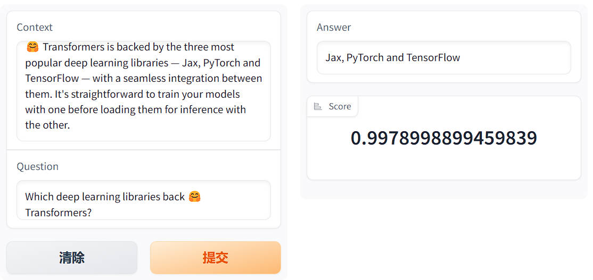

本节使用的代码已经上传到了 Hub。你可以在 [这里](https://huggingface.co/huggingface-course/bert-finetuned-squad?context=%F0%9F%A4%97+Transformers+is+backed+by+the+three+most+popular+deep+learning+libraries+%E2%80%94+Jax%2C+PyTorch+and+TensorFlow+%E2%80%94+with+a+seamless+integration+between+them.+It%27s+straightforward+to+train+your+models+with+one+before+loading+them+for+inference+with+the+other.&question=Which+deep+learning+libraries+back+%F0%9F%A4%97+Transformers%3F)(https://huggingface.co/huggingface-course/bert-finetuned-squad?context=%F0%9F%A4%97+Transformers+is+backed+by+the+three+most+popular+deep+learning+libraries+%E2%80%94+Jax%2C+PyTorch+and+TensorFlow+%E2%80%94+with+a+seamless+integration+between+them.+It%27s+straightforward+to+train+your+models+with+one+before+loading+them+for+inference+with+the+other.&question=Which+deep+learning+libraries+back+%F0%9F%A4%97+Transformers%3F) 找到它并尝试用它进行预测。

<div custom-style="Tip-green">

💡 像 BERT 这样的纯编码器模型往往很擅长提取诸如 “谁发明了 Transformer 架构？”之类的事实性问题的答案。但在给出诸如 “为什么天空是蓝色的？” 之类的开放式问题时表现不佳。在这些更具挑战性的情况下，通常使用编码器-解码器模型如 T5 和 BART 来以类似于 [文本摘要](https://chat.openai.com/course/chapter7/5)(https://chat.openai.com/course/chapter7/5) 的方式整合信息。如果你对这种 `生成式（generative）` 问题回答感兴趣，我们推荐你查看我们基于 [ELI5 数据集](https://huggingface.co/datasets/eli5)(https://huggingface.co/datasets/eli5) 的 [演示demo](https://yjernite.github.io/lfqa.html)(https://yjernite.github.io/lfqa.html) 。

</div>

### 准备数据

作为抽取式问题回答的学术基准最常用的数据集是 [SQuAD](https://rajpurkar.github.io/SQuAD-explorer/)(https://rajpurkar.github.io/SQuAD-explorer/) ，所以我们在这里将使用它。还有一个更难的 [SQuAD v2](https://huggingface.co/datasets/squad_v2)(https://huggingface.co/datasets/squad_v2) 基准，其中包含一些没有答案的问题。只要你自己的数据集包含了 Context 列、问题列和答案列，你应该能够适用下面的步骤。

#### SQuAD 数据集 

像往常一样，我们可以使用 `load_dataset()` 在一步中下载和缓存数据集：

```python
from datasets import load_dataset

raw_datasets = load_dataset("squad")
```

我们可以查看这个 `raw_datasets` 对象来了解更多关于 SQuAD 数据集的信息：

```python
raw_datasets
```

```python
DatasetDict({
    train: Dataset({
        features: ['id', 'title', 'context', 'question', 'answers'],
        num_rows: 87599
    })
    validation: Dataset({
        features: ['id', 'title', 'context', 'question', 'answers'],
        num_rows: 10570
    })
})
```

看起来我们拥有所需的 `context` 、 `question` 和 `answers` 字段，所以让我们打印训练集的第一个元素：

```python
print("Context: ", raw_datasets["train"][0]["context"])
print("Question: ", raw_datasets["train"][0]["question"])
print("Answer: ", raw_datasets["train"][0]["answers"])
```

```python
Context: 'Architecturally, the school has a Catholic character. Atop the Main Building\'s gold dome is a golden statue of the Virgin Mary. Immediately in front of the Main Building and facing it, is a copper statue of Christ with arms upraised with the legend "Venite Ad Me Omnes". Next to the Main Building is the Basilica of the Sacred Heart. Immediately behind the basilica is the Grotto, a Marian place of prayer and reflection. It is a replica of the grotto at Lourdes, France where the Virgin Mary reputedly appeared to Saint Bernadette Soubirous in 1858. At the end of the main drive (and in a direct line that connects through 3 statues and the Gold Dome), is a simple, modern stone statue of Mary.'
Question: 'To whom did the Virgin Mary allegedly appear in 1858 in Lourdes France?'
Answer: {'text': ['Saint Bernadette Soubirous'], 'answer_start': [515]}
```
`context` 和 `question` 字段的使用非常直观。 `answers` 字段相对复杂一些，因为它包含一个字典，其中有两个都是列表的字段。这是在评估时 `squad` 指标所期望的格式；如果你使用的是你自己的数据，你不必一定将答案放在同样的格式中。 `text` 字段是非常明显的答案文本，而 `answer_start` 字段包含了 Context 中每个答案的起始索引。

在训练过程中，只有一个可能的答案。我们可以使用 `Dataset.filter()` 方法来进行检查：

```python
raw_datasets["train"].filter(lambda x: len(x["answers"]["text"]) != 1)
```

```python
Dataset({
    features: ['id', 'title', 'context', 'question', 'answers'],
    num_rows: 0
})
```

然而，在评估过程中，每个样本可能有多个答案，这些答案可能相同或不同：

```python
print(raw_datasets["validation"][0]["answers"])
print(raw_datasets["validation"][2]["answers"])
```

```python
{'text': ['Denver Broncos', 'Denver Broncos', 'Denver Broncos'], 'answer_start': [177, 177, 177]}
{'text': ['Santa Clara, California', "Levi's Stadium", "Levi's Stadium in the San Francisco Bay Area at Santa Clara, California."], 'answer_start': [403, 355, 355]}
```

我们不会深入探究评估的代码，因为所有的东西都将由Datasets metric 帮我们完成，但简单来说，一些问题可能有多个可能的答案，而该评估代码将把预测的答案与所有可接受的答案进行比较，并选择最佳分数。例如，如果我们看一下索引为 2 的样本：

```python
print(raw_datasets["validation"][2]["context"])
print(raw_datasets["validation"][2]["question"])
```

```python
'Super Bowl 50 was an American football game to determine the champion of the National Football League (NFL) for the 2015 season. The American Football Conference (AFC) champion Denver Broncos defeated the National Football Conference (NFC) champion Carolina Panthers 24–10 to earn their third Super Bowl title. The game was played on February 7, 2016, at Levi\'s Stadium in the San Francisco Bay Area at Santa Clara, California. As this was the 50th Super Bowl, the league emphasized the "golden anniversary" with various gold-themed initiatives, as well as temporarily suspending the tradition of naming each Super Bowl game with Roman numerals (under which the game would have been known as "Super Bowl L"), so that the logo could prominently feature the Arabic numerals 50.'
'Where did Super Bowl 50 take place?'
```

我们可以看到，答案的确可能是我们之前看到的三个可能选择 `['Denver Broncos', 'Denver Broncos', 'Denver Broncos']` 的之一。

#### 处理训练数据 

我们从预处理训练数据开始。最困难的部分将是生成问题答案的标签，即找到 Context 中对应答案 token 的起始和结束位置。

但我们不要急于求成。首先，我们需要使用 tokenizer 将输入中的文本转换为模型可以理解的 ID：

```python
from transformers import AutoTokenizer

model_checkpoint = "bert-base-cased"
tokenizer = AutoTokenizer.from_pretrained(model_checkpoint)
```

如前所述，我们将对 BERT 模型进行微调，但你可以使用任何其他模型类型，只要它实现了快速 tokenizer 即可。你可以在 [支持快速 tokenizer 的框架](https://huggingface.co/transformers/#supported-frameworks)(https://huggingface.co/transformers/#supported-frameworks) 表中看到所有带有快速版本的架构，要检查你正在使用的 `tokenizer` 对象是否真的是由Tokenizers 支持的，你可以查看它的 `is_fast` 属性：

```python
tokenizer.is_fast
```

```python
True
```

我们可以将 question 和 context 一起传递给我们的 tokenizer 它会正确插入特殊 tokens 形成如下句子：

```python
[CLS] question [SEP] context [SEP]
```

让我们仔细检查一下：

```python
context = raw_datasets["train"][0]["context"]
question = raw_datasets["train"][0]["question"]

inputs = tokenizer(question, context)
tokenizer.decode(inputs["input_ids"])
```

```python
'[CLS] To whom did the Virgin Mary allegedly appear in 1858 in Lourdes France? [SEP] Architecturally, '
'the school has a Catholic character. Atop the Main Building\'s gold dome is a golden statue of the Virgin '
'Mary. Immediately in front of the Main Building and facing it, is a copper statue of Christ with arms '
'upraised with the legend " Venite Ad Me Omnes ". Next to the Main Building is the Basilica of the Sacred '
'Heart. Immediately behind the basilica is the Grotto, a Marian place of prayer and reflection. It is a '
'replica of the grotto at Lourdes, France where the Virgin Mary reputedly appeared to Saint Bernadette '
'Soubirous in 1858. At the end of the main drive ( and in a direct line that connects through 3 statues '
'and the Gold Dome ), is a simple, modern stone statue of Mary. [SEP]'
```

标签将是指示答案起始和结束 token 的索引，模型的任务是为输入中的每个标记预测一个起始和结束的 logit 值，理论上的标签如下所示：

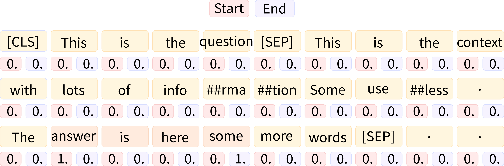

在做个例子中，Context 没有很长，但是数据集中的一些示例的 Context 会很长，会超过我们设置的最大长度（本例中为 384）。正如我们在第七章中所看到的，当我们探索 `question-answering` 管道的内部结构时，我们会通过将一个样本的较长的 Context 划分成多个训练特征，并在这些特征之间使用滑动窗口，来处理较长的 Context。

要了解在这个过程中对当前示例进行了哪些处理，我们可以将长度限制为 100，并使用长度为 50 的 token 窗口。我们设置：

- `max_length` 来设置最大长度 （这里为 100）
- `truncation="only_second"` 在问题和 Context 过长时截断 Context（Context 位于第二个位置）
- `stride` 设置两个连续块之间的重叠 tokens 数 （这里为 50）
- `return_overflowing_tokens=True` 告诉 tokenizer 我们想要保留超过长度的 tokens 

```python
inputs = tokenizer(
    question,
    context,
    max_length=100,
    truncation="only_second",
    stride=50,
    return_overflowing_tokens=True,
)

for ids in inputs["input_ids"]:
    print(tokenizer.decode(ids))
```

```python
'[CLS] To whom did the Virgin Mary allegedly appear in 1858 in Lourdes France? [SEP] Architecturally, the school has a Catholic character. Atop the Main Building\'s gold dome is a golden statue of the Virgin Mary. Immediately in front of the Main Building and facing it, is a copper statue of Christ with arms upraised with the legend " Venite Ad Me Omnes ". Next to the Main Building is the Basilica of the Sacred Heart. Immediately behind the basi [SEP]'
'[CLS] To whom did the Virgin Mary allegedly appear in 1858 in Lourdes France? [SEP] the Main Building and facing it, is a copper statue of Christ with arms upraised with the legend " Venite Ad Me Omnes ". Next to the Main Building is the Basilica of the Sacred Heart. Immediately behind the basilica is the Grotto, a Marian place of prayer and reflection. It is a replica of the grotto at Lourdes, France where the Virgin [SEP]'
'[CLS] To whom did the Virgin Mary allegedly appear in 1858 in Lourdes France? [SEP] Next to the Main Building is the Basilica of the Sacred Heart. Immediately behind the basilica is the Grotto, a Marian place of prayer and reflection. It is a replica of the grotto at Lourdes, France where the Virgin Mary reputedly appeared to Saint Bernadette Soubirous in 1858. At the end of the main drive ( and in a direct line that connects through 3 [SEP]'
'[CLS] To whom did the Virgin Mary allegedly appear in 1858 in Lourdes France? [SEP]. It is a replica of the grotto at Lourdes, France where the Virgin Mary reputedly appeared to Saint Bernadette Soubirous in 1858. At the end of the main drive ( and in a direct line that connects through 3 statues and the Gold Dome ), is a simple, modern stone statue of Mary. [SEP]'
```

如我们所见，我们的示例被分成四个输入，每个输入都包含问题和 Context 的一部分。请注意，问题的答案 （“Bernadette Soubirous”） 仅出现在第三个也是最后一个输入中，因此通过以这种方式处理较长的 Context 时，我们可能创建一些 Context 中不包含答案的训练示例。我们把这些示例的标签设置为 `start_position = end_position = 0` （事实上我们在预测 `[CLS]` tokens）。如果不幸答案被截断，我们只有答案的开头（或结束），我们也这样设置这些标签。对于答案完全在 Context 中的示例，标签将是答案起始的 token 的索引和答案结束的 token 的索引。

数据集为我们提供了 Context 中答案的起始字符，加上答案的长度，我们可以找到 Context 中的结束字符。要将它们映射到 tokens 索引，我们将需要使用我们在第七章中研究的偏移映射。我们可以通过使用 `return_offsets_mapping=True` 让我们的 tokenizer 返回这些内容：

```python
inputs = tokenizer(
    question,
    context,
    max_length=100,
    truncation="only_second",
    stride=50,
    return_overflowing_tokens=True,
    return_offsets_mapping=True,
)
inputs.keys()
```

```python
dict_keys(['input_ids', 'token_type_ids', 'attention_mask', 'offset_mapping', 'overflow_to_sample_mapping'])
```

如我们所见，我们得到了 inputs ID、tokens 类型 ID 和注意力掩码，以及我们所需的偏移映射和一个额外的键 `overflow_to_sample_mapping` 。当我们同时对多个文本进行 tokenize 时，为了从支持 Rust 中受益，这个键的值对我们很有用。由于一个样本可以产生多个特征，它将每个特征映射到它来源的示例。因为这里我们只对一个示例进行了 tokenize，所以我们得到一个由 `0` 组成的列表：

```python
inputs["overflow_to_sample_mapping"]
```

```python
[0, 0, 0, 0]
```

但是，如果我们对更多的示例进行 tokenize 这将变得更加有用：

```python
inputs = tokenizer(
    raw_datasets["train"][2:6]["question"],
    raw_datasets["train"][2:6]["context"],
    max_length=100,
    truncation="only_second",
    stride=50,
    return_overflowing_tokens=True,
    return_offsets_mapping=True,
)

print(f"The 4 examples gave {len(inputs['input_ids'])} features.")
print(f"Here is where each comes from: {inputs['overflow_to_sample_mapping']}.")
```

```python
'The 4 examples gave 19 features.'
'Here is where each comes from: [0, 0, 0, 0, 1, 1, 1, 1, 2, 2, 2, 2, 3, 3, 3, 3, 3, 3, 3].'
```

在我们的这个例子中，前三个示例 （在训练集中的索引 2、3 和 4 处） 每个示例都给出了四个特征，最后一个示例（在训练集中的索引 5 处） 给出了 7 个特征。

这些信息将有助于将我们获得的每个特征映射到其相应的标签。如前所述，这些标签的规则是：

- 如果答案不在相应上下文的范围内，则为 `(0, 0)` 
- 如果答案在相应上下文的范围内，则为 `(start_position, end_position)` ，其中 `start_position` 是答案起始处的 token 索引（在 inputs ID 中）， `end_position` 是答案结束处的 token 索引（在 inputs ID 中）

为了确定这两种情况中的哪一种，并且如果是第二种，则需要确定 token 的位置，我们首先找到在输入 ID 中起始和结束上下文的索引。我们可以使用 token 类型 ID 来完成此操作，但由于并非所有模型都需要它们（例如 DistilBERT 不需要它们），我们将使用 tokenizer 的 `sequence_ids()` 方法返回的 `BatchEncoding` 。

一旦我们有了这些 tokens 的索引，我们就会查看相应的偏移量，它们是两个整数的元组，表示原始 Context 中的字符范围。因此，我们可以检测此特征中的 Context 块是在答案之后起始还是在答案起始之前结束（在这种情况下，标签是 `(0, 0)` ）。如果不是这样，我们循环查找答案的第一个和最后一个 token：

```python
answers = raw_datasets["train"][2:6]["answers"]
start_positions = []
end_positions = []

for i, offset in enumerate(inputs["offset_mapping"]):
    sample_idx = inputs["overflow_to_sample_mapping"][i]
    answer = answers[sample_idx]
    start_char = answer["answer_start"][0]
    end_char = answer["answer_start"][0] + len(answer["text"][0])
    sequence_ids = inputs.sequence_ids(i)

    # 找到上下文的起始和结束
    idx = 0
    while sequence_ids[idx] != 1:
        idx += 1
    context_start = idx
    while sequence_ids[idx] == 1:
        idx += 1
    context_end = idx - 1

    # 如果答案不完全在上下文内,标签为(0, 0)
    if offset[context_start][0] > start_char or offset[context_end][1] < end_char:
        start_positions.append(0)
        end_positions.append(0)
    else:
        # 否则,它就是起始和结束 token 的位置
        idx = context_start
        while idx <= context_end and offset[idx][0] <= start_char:
            idx += 1
        start_positions.append(idx - 1)

        idx = context_end
        while idx >= context_start and offset[idx][1] >= end_char:
            idx -= 1
        end_positions.append(idx + 1)

start_positions, end_positions
```

```python
([83, 51, 19, 0, 0, 64, 27, 0, 34, 0, 0, 0, 67, 34, 0, 0, 0, 0, 0],
 [85, 53, 21, 0, 0, 70, 33, 0, 40, 0, 0, 0, 68, 35, 0, 0, 0, 0, 0])
```

让我们查看一些结果以验证我们的方法是否正确。对于第一个特征，我们找到了 `(83, 85)` 作为标签，因此让我们将理论答案与从 83 到 85（包括 85）的 tokens 解码的结果进行比较：

```python
idx = 0
sample_idx = inputs["overflow_to_sample_mapping"][idx]
answer = answers[sample_idx]["text"][0]

start = start_positions[idx]
end = end_positions[idx]
labeled_answer = tokenizer.decode(inputs["input_ids"][idx][start : end + 1])

print(f"Theoretical answer: {answer}, labels give: {labeled_answer}")
```

```python
'Theoretical answer: the Main Building, labels give: the Main Building'
```

很好！寻找的答案是正确的！现在让我们来看一下索引为 4 的位置，我们我们得到的标签是 `(0, 0)` ，这意味着答案不在该特征的上下文块中：

```python
idx = 4
sample_idx = inputs["overflow_to_sample_mapping"][idx]
answer = answers[sample_idx]["text"][0]

decoded_example = tokenizer.decode(inputs["input_ids"][idx])
print(f"Theoretical answer: {answer}, decoded example: {decoded_example}")
```

```python
'Theoretical answer: a Marian place of prayer and reflection, decoded example: [CLS] What is the Grotto at Notre Dame? [SEP] Architecturally, the school has a Catholic character. Atop the Main Building\'s gold dome is a golden statue of the Virgin Mary. Immediately in front of the Main Building and facing it, is a copper statue of Christ with arms upraised with the legend " Venite Ad Me Omnes ". Next to the Main Building is the Basilica of the Sacred Heart. Immediately behind the basilica is the Grot [SEP]'
```

确实，我们在 Context 中没有看到答案。

<div custom-style="Tip-green">

✏️ **轮你来了！** 在使用 XLNet 架构时，需要在左侧进行填充，并且问题和 Context 应该互换。将我们刚刚看到的所有代码调整为 XLNet 架构（并添加 `padding=True` ）。请注意，填充后的 `[CLS]` tokens 可能不在索引为 0 的位置。

</div>

现在，我们已经逐步了解了如何预处理我们的训练数据，我们可以将其组合到一个函数中，并使用该函数处理整个训练数据集。我们将每个特征都填充到我们设置的最大长度，因为大多数上下文都很长（相应的样本将被分成几个特征），所以在这里进行动态填充没有带来真正有效的成效：

```python
max_length = 384
stride = 128

def preprocess_training_examples(examples):
    questions = [q.strip() for q in examples["question"]]
    inputs = tokenizer(
        questions,
        examples["context"],
        max_length=max_length,
        truncation="only_second",
        stride=stride,
        return_overflowing_tokens=True,
        return_offsets_mapping=True,
        padding="max_length",
    )

    offset_mapping = inputs.pop("offset_mapping")
    sample_map = inputs.pop("overflow_to_sample_mapping")
    answers = examples["answers"]
    start_positions = []
    end_positions = []

    for i, offset in enumerate(offset_mapping):
        sample_idx = sample_map[i]
        answer = answers[sample_idx]
        start_char = answer["answer_start"][0]
        end_char = answer["answer_start"][0] + len(answer["text"][0])
        sequence_ids = inputs.sequence_ids(i)

        # 找到上下文的起始和结束
        idx = 0
        while sequence_ids[idx] != 1:
            idx += 1
        context_start = idx
        while sequence_ids[idx] == 1:
            idx += 1
        context_end = idx - 1

        # 如果答案不完全在上下文内,标签为(0, 0)
        if offset[context_start][0] > start_char or offset[context_end][1] < end_char:
            start_positions.append(0)
            end_positions.append(0)
        else:
            # 否则,它就是起始和结束 tokens 的位置
            idx = context_start
            while idx <= context_end and offset[idx][0] <= start_char:
                idx += 1
            start_positions.append(idx - 1)

            idx = context_end
            while idx >= context_start and offset[idx][1] >= end_char:
                idx -= 1
            end_positions.append(idx + 1)

    inputs["start_positions"] = start_positions
    inputs["end_positions"] = end_positions
    return inputs
```

请注意，我们定义了两个常量来确定所使用的最大长度以及滑动窗口的长度，并且在之前 tokenize 之前对数据进行了一些清洗：SQuAD 数据集中的一些问题在开头和结尾有额外的空格，这些空格没有任何意义（如果你使用像 RoBERTa 这样的模型，它们会占用 tokenize 时的空间），因此我们去掉了这些额外的空格。

要使用该函数处理整个训练集，我们可以使用 `Dataset.map()` 方法并传递 `batched=True` 参数。这是必要的，因为我们正在更改数据集的长度（因为一个示例可能会产生多个训练特征）：

```python
train_dataset = raw_datasets["train"].map(
    preprocess_training_examples,
    batched=True,
    remove_columns=raw_datasets["train"].column_names,
)
len(raw_datasets["train"]), len(train_dataset)
```

```python
(87599, 88729)
```

如我们所见，预处理添加了大约 1000 个特征。我们的训练集现在已经准备好使用了——让我们深入研究一下验证集的预处理！

#### 处理验证数据 

处理验证数据的预处理会更加容易，因为我们不需要生成标签（除非我们想计算验证损失，但那个数字并不能真正帮助我们了解模型的好坏）。真正的挑战在于将模型的预测转化为为原始 Context 的片段。为此，我们只需要存储偏移映射并且找到一种方法来将每个创建的特征与其来自的原始示例匹配起来。由于原始数据集中有一个 ID 列，我们将使用该列。

我们唯一要添加的是对偏移映射的微小修改。偏移映射包含问题和 Context 的偏移量，但一旦我们进入后处理阶段，我们将无法知道 inputs ID 的哪个部分对应于 Context，哪个部分是问题（我们使用的 `sequence_ids()` 方法仅可用于 tokenizer 的输出）。因此，我们将将与问题对应的偏移设置为 `None` Context 对应的偏移量保持不变：

```python
def preprocess_validation_examples(examples):
    questions = [q.strip() for q in examples["question"]]
    inputs = tokenizer(
        questions,
        examples["context"],
        max_length=max_length,
        truncation="only_second",
        stride=stride,
        return_overflowing_tokens=True,
        return_offsets_mapping=True,
        padding="max_length",
    )

    sample_map = inputs.pop("overflow_to_sample_mapping")
    example_ids = []

    for i in range(len(inputs["input_ids"])):
        sample_idx = sample_map[i]
        example_ids.append(examples["id"][sample_idx])

        sequence_ids = inputs.sequence_ids(i)
        offset = inputs["offset_mapping"][i]
        inputs["offset_mapping"][i] = [
            o if sequence_ids[k] == 1 else None for k, o in enumerate(offset)
        ]

    inputs["example_id"] = example_ids
    return inputs
```

我们可以像以前一样使用此函数处理整个验证数据集：

```python
validation_dataset = raw_datasets["validation"].map(
    preprocess_validation_examples,
    batched=True,
    remove_columns=raw_datasets["validation"].column_names,
)
len(raw_datasets["validation"]), len(validation_dataset)
```

```python
(10570, 10822)
```

在这种情况下，我们只添加了几百个样本，因此验证数据集中的 Context 似乎要短一些。

现在我们已经对所有数据进行了预处理，我们可以开始训练了。

{#if fw === 'pt'}

### 使用 `Trainer` API /  Keras 微调模型 

这个例子的训练代码与前面的部分非常相似，最困难的部分是编写计算评估指标函数。由于我们将所有样本填充到了我们设置的最大长度，所以没有需要定义的数据整理器，因此我们唯一需要担心的事情是计算评估指标。比较困难的部分将是将模型预测的结果还原到原始示例中的文本片段；一旦我们完成了这一步骤，Datasets 库中的 metric 就可以为我们做大部分工作。

#### 后处理 

模型将输出答案在 inputs ID 中起始和结束位置的 logit，正如我们在探索 [`question-answering` pipeline](/course/chapter6/3b)(/course/chapter6/3b) 时看到的那样。后处理步骤将类似于我们在那里所做的，所以这里简单回顾一下我们所采取的操作：

- 我们屏蔽了除了 Context 之外的 tokens 对应的起始和结束 logit。
- 然后，我们使用 softmax 将起始和结束 logits 转换为概率。
- 我们通过将两个概率对应的乘积来为每个 `(start_token, end_token)` 对分配一个分数。
- 我们寻找具有最大分数且产生有效答案（例如， `start_token` 小于 `end_token` ）的对。

这次我们将稍微改变这个流程，因为我们不需要计算实际分数（只需要预测的答案）。这意味着我们可以跳过 softmax 步骤（因为 softmax 并不会改变分数的顺序）。为了加快计算速度，我们也不会为所有可能的 `(start_token, end_token)` 对计算分数，而只会计算与最高的 `n_best` 对应的 logit 分数（其中 `n_best=20` ）。由于我们将跳过 softmax，这些分数将是 logit 分数，而且是起始和结束对数几率的和（而不是乘积，因为规则 \($\log(ab) = \log(a) + \log(b))$。

为了证明这一切，我们需要一些预测。由于我们还没有训练我们的模型，我们将使用 QA 管道的默认模型对一小部分验证集生成一些预测。我们可以使用和之前一样的处理函数；因为它依赖于全局常量 `tokenizer` ，我们只需将该对象更改为我们要临时使用的模型的 tokenizer 

为了测试这些代码，我们需要一些预测结果。由于我们还没有训练模型，我们将使用 QA pipeline 的默认模型在验证集的一小部分上生成一些预测结果。我们可以使用与之前相同的处理函数；因为它依赖于全局常量 `tokenizer` ，所以我们只需要暂时将该对象更改为我们想要使用的模型的 tokenizer：

```python
#####Pytorch
small_eval_set = raw_datasets["validation"].select(range(100))
trained_checkpoint = "distilbert-base-cased-distilled-squad"

tokenizer = AutoTokenizer.from_pretrained(trained_checkpoint)
eval_set = small_eval_set.map(
    preprocess_validation_examples,
    batched=True,
    remove_columns=raw_datasets["validation"].column_names,
)####end
```

现在预处理已经完成，我们将 tokenizer 改回我们最初选择的那个：

```python
#####Pytorch
tokenizer = AutoTokenizer.from_pretrained(model_checkpoint)####end
```

然后我们移除 `eval_set` 中模型不需要的列，构建一个包含所有小型验证集数据的 batch，并将其传递给模型。如果有可用的 GPU，我们将使用它以加快速度：

{#if fw === 'pt'}

在 PyTorch 中：

```python
#####Pytorch
import torch
from transformers import AutoModelForQuestionAnswering

eval_set_for_model = eval_set.remove_columns(["example_id", "offset_mapping"])
eval_set_for_model.set_format("torch")

device = torch.device("cuda") if torch.cuda.is_available() else torch.device("cpu")
batch = {k: eval_set_for_model[k].to(device) for k in eval_set_for_model.column_names}
trained_model = AutoModelForQuestionAnswering.from_pretrained(trained_checkpoint).to(
    device
)

with torch.no_grad():
    outputs = trained_model(**batch)####end
```

为了便于实验，让我们将这些输出转换为 NumPy 数组：

```python
#####Pytorch
start_logits = outputs.start_logits.cpu().numpy()
end_logits = outputs.end_logits.cpu().numpy()####end
```

{:else}

在 TensorFlow 中：

```python
#####TensorFlow
import tensorflow as tf
from transformers import TFAutoModelForQuestionAnswering

eval_set_for_model = eval_set.remove_columns(["example_id", "offset_mapping"])
eval_set_for_model.set_format("numpy")

batch = {k: eval_set_for_model[k] for k in eval_set_for_model.column_names}
trained_model = TFAutoModelForQuestionAnswering.from_pretrained(trained_checkpoint)

outputs = trained_model(**batch)####end
```

为了便于实验，让我们将这些输出转换为 NumPy 数组：

```python
#####TensorFlow
start_logits = outputs.start_logits.numpy()
end_logits = outputs.end_logits.numpy()####end
```

{/if}

现在，我们需要找到 `small_eval_set` 中每个示例的预测答案。一个示例可能会被拆分成 `eval_set` 中的多个特征，所以第一步是将 `small_eval_set` 中的每个示例映射到 `eval_set` 中对应的特征：

```python
import collections

example_to_features = collections.defaultdict(list)
for idx, feature in enumerate(eval_set):
    example_to_features[feature["example_id"]].append(idx)
```

有了这个映射，我们可以通过循环遍历所有示例，并针对每个示例遍历所有相关的特征。正如之前所说，我们将查看 `n_best` 个起始 logit 和结束 logit 的得分，排除以下情况：

- 答案不在上下文中
- 答案长度为负数
- 答案过长（我们将可能性限制在 `max_answer_length=30` ）

当我们得到一个示例的所有得分可能答案，我们只需选择具有最佳 logit 得分的答案：

```python
import numpy as np

n_best = 20
max_answer_length = 30
predicted_answers = []

for example in small_eval_set:
    example_id = example["id"]
    context = example["context"]
    answers = []

    for feature_index in example_to_features[example_id]:
        start_logit = start_logits[feature_index]
        end_logit = end_logits[feature_index]
        offsets = eval_set["offset_mapping"][feature_index]

        start_indexes = np.argsort(start_logit)[-1 : -n_best - 1 : -1].tolist()
        end_indexes = np.argsort(end_logit)[-1 : -n_best - 1 : -1].tolist()
        for start_index in start_indexes:
            for end_index in end_indexes:
                # 跳过不完全在上下文中的答案
                if offsets[start_index] is None or offsets[end_index] is None:
                    continue
                # 跳过长度为负数或大于 max_answer_length 的答案。
                if (
                    end_index < start_index
                    or end_index - start_index + 1 > max_answer_length
                ):
                    continue

                answers.append(
                    {
                        "text": context[offsets[start_index][0] : offsets[end_index][1]],
                        "logit_score": start_logit[start_index] + end_logit[end_index],
                    }
                )

    best_answer = max(answers, key=lambda x: x["logit_score"])
    predicted_answers.append({"id": example_id, "prediction_text": best_answer["text"]})
```

预测答案的最终格式已经是我们将使用的评估指标所期望的格式。在这种情况下，我们可以借助Evaluate 库来加载它：

```python
import evaluate

metric = evaluate.load("squad")
```

这个评估指标一个如上所示格式（一个包含示例 ID 和预测文本的字典列表）的预测答案，同时也需要一个如下格式（一个包含示例 ID 和可能答案的字典列表）的参考答案：

```python
theoretical_answers = [
    {"id": ex["id"], "answers": ex["answers"]} for ex in small_eval_set
]
```

现在，我们可以通过查看两个列表中的第一个元素来检查是否获得了合理的结果：

```python
print(predicted_answers[0])
print(theoretical_answers[0])
```

```python
{'id': '56be4db0acb8001400a502ec', 'prediction_text': 'Denver Broncos'}
{'id': '56be4db0acb8001400a502ec', 'answers': {'text': ['Denver Broncos', 'Denver Broncos', 'Denver Broncos'], 'answer_start': [177, 177, 177]}}
```

还不错！现在让我们看一下评估指标给出的分数：

```python
metric.compute(predictions=predicted_answers, references=theoretical_answers)
```

```python
{'exact_match': 83.0, 'f1': 88.25}
```

根据 [DistilBERT 的论文](https://arxiv.org/abs/1910.01108v2)(https://arxiv.org/abs/1910.01108v2) 所述，DistilBERT 在 SQuAD 上微调后整体数据集的得分为 79.1 和 86.9，这个结果相当不错。

在 PyTorch 中：

现在，让我们将刚才所做的放入 `compute_metrics()` 函数中，我们将在 `Trainer` 中使用它。通常， `compute_metrics()` 函数只接收一个包含 logits 和标签的 `eval_preds` 元组。但是在这里，我们需要更多的信息，因为我们需要在特征数据集中查找偏移量，并在示例数据集中查找原始 Context，因此我们无法在训练过程中使用此函数来获取常规的评估结果。我们只会在训练结束时使用它来检查结果。
`compute_metrics()` 函数与之前的步骤相同；我们只是添加了一个小的检查，以防我们找不到任何有效的答案（在这种情况下，我们的预测会输出一个空字符串）。

在 TensorFlow 中：

现在，让我们将刚才所做的放入 `compute_metrics()` 函数中，我们将在训练模型时使用该函数。我们需要传递的不仅仅是输出的 logits，因为我们必须在特征数据集中查找偏移量，并在示例数据集中查找原始上下文：

```python
from tqdm.auto import tqdm

def compute_metrics(start_logits, end_logits, features, examples):
    example_to_features = collections.defaultdict(list)
    for idx, feature in enumerate(features):
        example_to_features[feature["example_id"]].append(idx)

    predicted_answers = []
    for example in tqdm(examples):
        example_id = example["id"]
        context = example["context"]
        answers = []

        # 循环遍历与该示例相关联的所有特征
        for feature_index in example_to_features[example_id]:
            start_logit = start_logits[feature_index]
            end_logit = end_logits[feature_index]
            offsets = features[feature_index]["offset_mapping"]

            start_indexes = np.argsort(start_logit)[-1 : -n_best - 1 : -1].tolist()
            end_indexes = np.argsort(end_logit)[-1 : -n_best - 1 : -1].tolist()
            for start_index in start_indexes:
                for end_index in end_indexes:
                    # 跳过不完全位于上下文中的答案
                    if offsets[start_index] is None or offsets[end_index] is None:
                        continue
                    # 跳过长度小于 0 或大于 max_answer_length 的答案
                    if (
                        end_index < start_index
                        or end_index - start_index + 1 > max_answer_length
                    ):
                        continue

                    answer = {
                        "text": context[offsets[start_index][0] : offsets[end_index][1]],
                        "logit_score": start_logit[start_index] + end_logit[end_index],
                    }
                    answers.append(answer)

        # 选择得分最高的答案
        if len(answers) > 0:
            best_answer = max(answers, key=lambda x: x["logit_score"])
            predicted_answers.append(
                {"id": example_id, "prediction_text": best_answer["text"]}
            )
        else:
            predicted_answers.append({"id": example_id, "prediction_text": ""})

    theoretical_answers = [{"id": ex["id"], "answers": ex["answers"]} for ex in examples]
    return metric.compute(predictions=predicted_answers, references=theoretical_answers)
```

我们可以检查它在我们的预测结果上的计算的结果：

```python
compute_metrics(start_logits, end_logits, eval_set, small_eval_set)
```

```python
{'exact_match': 83.0, 'f1': 88.25}
```

看起来不错！现在让我们使用它来微调我们的模型。

#### 微调模型 

{#if fw === 'pt'}

现在我们准备好训练我们的模型了。首先，让我们像之前一样使用 `AutoModelForQuestionAnswering` / `TFAutoModelForQuestionAnswering` 类创建模型：

```python
#####Pytorch
model = AutoModelForQuestionAnswering.from_pretrained(model_checkpoint)####end
```

{:else}

现在我们准备好训练我们的模型了。首先，让我们像之前一样使用  类创建模型：

```python
#####TensorFlow
model = TFAutoModelForQuestionAnswering.from_pretrained(model_checkpoint)####end
```

{/if}

和往常一样，我们会收到一个警告，提示有些权重没有被使用（来自预训练头部的权重），而其他一些权重是随机初始化的（用于问答头部的权重）。你现在应该已经习惯了这种情况，但这意味着这个模型还没有准备好使用，需要进行微调——好在我们正在做这一点！

为了能够将我们的模型推送到 Hub，我们需要登录 Hugging Face。如果你在 Notebook 中运行此代码，则可以使用以下的函数执行此操作，该函数会显示一个小部件，你可以在其中输入登录凭据：

```python
from huggingface_hub import notebook_login

notebook_login()
```

如果你不在 Notebook 中工作，只需在终端中输入以下行：

```python
huggingface-cli login
```

{#if fw === 'pt'}

在 PyTorch 中：

完成后，我们就可以定义我们的 `TrainingArguments` 。正如我们在定义计算评估函数时所说的，由于 `compute_metrics()` 函数的输入参数限制，我们无法使用常规的方法来编写评估循环。不过，我们可以编写自己的 `Trainer` 子类来实现这一点（你可以在 [问答示例脚本](https://github.com/huggingface/transformers/blob/master/examples/pytorch/question-answering/trainer_qa.py)(https://github.com/huggingface/transformers/blob/master/examples/pytorch/question-answering/trainer_qa.py) 中找到该方法），但放在本节中会有些冗长。因此，我们在这里将仅在训练结束时评估模型，并在下面的“自定义训练循环”中向你展示如何使用常规的方法进行评估。

这确实是 `Trainer` API 局限性的地方，而Accelerate 库则表现出色：定制化特定用例的类可能会很繁琐，但定制化调整训练循环却很简单。

让我们来看看我们的 `TrainingArguments` ：

```python
#####Pytorch
from transformers import TrainingArguments

args = TrainingArguments(
    "bert-finetuned-squad",
    evaluation_strategy="no",
    save_strategy="epoch",
    learning_rate=2e-5,
    num_train_epochs=3,
    weight_decay=0.01,
    fp16=True,
    push_to_hub=True,
)####end
```

我们之前已经见过其中大部分内容：我们设置了一些超参数（如学习率、训练的周期数和一些权重衰减），并设定我们想在每个周期结束时保存模型、跳过评估，并将结果上传到模型中心。我们还启用了 `fp16=True` 的混合精度训练，因为它可以在最新的 GPU 上加快训练速度。

{:else}

在 TensorFlow 中：

现在完成了这一步骤，我们可以创建我们的 TF 数据集。这次我们可以使用简单的默认数据整理器：

```python
#####TensorFlow
from transformers import DefaultDataCollator

data_collator = DefaultDataCollator(return_tensors="tf")####end
```

然后像往常一样创建数据集。

```python
#####TensorFlow
tf_train_dataset = model.prepare_tf_dataset(
    train_dataset,
    collate_fn=data_collator,
    shuffle=True,
    batch_size=16,
)
tf_eval_dataset = model.prepare_tf_dataset(
    validation_dataset,
    collate_fn=data_collator,
    shuffle=False,
    batch_size=16,
)####end
```

接下来，我们设置训练超参数并编译我们的模型

```python
#####TensorFlow
from transformers import create_optimizer
from transformers.keras_callbacks import PushToHubCallback
import tensorflow as tf

# 训练步骤的数量是数据集中的样本数量除以 batch 大小,然后乘以总的训练周期数。
# 注意,这里的 tf_train_dataset 是一个batch的 tf.data.Dataset,
# 而不是原始的 Hugging Face 数据集,所以使用 len() 计算其长度已经是 num_samples // batch_size。
num_train_epochs = 3
num_train_steps = len(tf_train_dataset) * num_train_epochs
optimizer, schedule = create_optimizer(
    init_lr=2e-5,
    num_warmup_steps=0,
    num_train_steps=num_train_steps,
    weight_decay_rate=0.01,
)
model.compile(optimizer=optimizer)

# 使用 float16 混合精度进行训练
tf.keras.mixed_precision.set_global_policy("mixed_float16")####end
```

最后，我们准备使用 `model.fit()` 进行训练，使用 `PushToHubCallback` 在每个周期结束后将模型上传到模型中心。

{/if}

默认情况下，使用的仓库将保存在你的账户中，并以你设置的输出目录命名，所以在我们的例子中它将位于 `"sgugger/bert-finetuned-squad"` 中。我们可以通过传递一个 `hub_model_id` 来覆盖这个设置；例如，要将模型推送到我们使用的 `huggingface_course` 组织中，我们使用了 `hub_model_id="huggingface_course/bert-finetuned-squad"` （这是我们在本节开始时演示的模型）。

{#if fw === 'pt'}

在 PyTorch 中：

<div custom-style="Tip-green">

💡 如果你正在使用的输出目录已经存在，则它需要是你要推送到的存储库的本地克隆（因此，如果在定义你的 `Trainer` 时出现错误，请设置一个新的名称）。

</div>

最后，我们只需将所有内容传递给 `Trainer` 类并启动训练：

```python
#####Pytorch
from transformers import Trainer

trainer = Trainer(
    model=model,
    args=args,
    train_dataset=train_dataset,
    eval_dataset=validation_dataset,
    tokenizer=tokenizer,
)
trainer.train()####end
```

{:else}

在 TensorFlow 中：

```python
#####TensorFlow
from transformers.keras_callbacks import PushToHubCallback

callback = PushToHubCallback(output_dir="bert-finetuned-squad", tokenizer=tokenizer)

# 我们将在之后进行验证,因此训练过程中不会进行验证
model.fit(tf_train_dataset, callbacks=[callback], epochs=num_train_epochs)####end
```

{/if}

请注意，在训练过程中，每次模型保存（例如，每个 epoch 结束时），模型都会在后台上传到 Hub。这样，如果需要的话，你就可以在另一台机器上恢复训练。整个训练过程需要一些时间（在 Titan RTX 上略超过一个小时），所以你可以喝杯咖啡或者重新阅读一些你觉得更具挑战性的课程部分来消磨时间。还要注意，一旦第一个 epoch 完成，你将看到一些权重上传到 Hub，并且你可以在其页面上开始使用你的模型进行测试。

训练完成后，我们可以最终评估我们的模型（并祈祷我们可以一次成功）。

{#if fw === 'pt'}

在 PyTorch 中：

`Trainer` 的 `predict()` 方法将返回一个元组，其中第一个元素将是模型的预测结果（在这里是一个包含起始和结束 logits 的对）。我们将这个结果传递给我们的 `compute_metrics()` 函数：

```python
#####Pytorch
predictions, _, _ = trainer.predict(validation_dataset)
start_logits, end_logits = predictions
compute_metrics(start_logits, end_logits, validation_dataset, raw_datasets["validation"])####end
```

{:else}

在 TensorFlow 中：

我们的 `model` 的 `predict()` 方法将负责获取预测结果，并且由于我们之前已经定义了一个 `compute_metrics()` 函数，所以我们可以用一行代码得到我们的结果：

```python
#####TensorFlow
predictions = model.predict(tf_eval_dataset)
compute_metrics(
    predictions["start_logits"],
    predictions["end_logits"],
    validation_dataset,
    raw_datasets["validation"],
)####end
```

{/if}

```python
{'exact_match': 81.18259224219489, 'f1': 88.67381321905516}
```

很棒！作为对比，BERT 文章中报告的该模型的基准分数分别为 80.8 和 88.5，所以我们的结果正好达到了预期分数。

{#if fw === 'pt'}

在 PyTorch 中：

最后，我们使用 `push_to_hub()` 方法确保上传模型的最新版本：

```python
#####Pytorch
trainer.push_to_hub(commit_message="Training complete")####end
```

如果你想检查它，上面的代码返回它刚刚执行的提交的 URL：

```python
#####Pytorch
'https://huggingface.co/sgugger/bert-finetuned-squad/commit/9dcee1fbc25946a6ed4bb32efb1bd71d5fa90b68'####end
```

`Trainer` 还会创建一个包含所有评估结果的模型卡片，并将其上传。

{/if}

在这个阶段，你可以使用模型库中的推理小部件来测试模型，并与你的朋友、家人和同伴分享。恭喜你成功地在问答任务上对模型进行了微调！

<div custom-style="Tip-green">

✏️ **轮到你了！** 尝试使用另一个模型架构，看看它在这个任务上表现得是否更好！

</div>

{#if fw === 'pt'}

在 PyTorch 中：

如果你想更深入地了解训练循环，我们现在将向你展示如何使用 Accelerate 来做同样的事情。

### 自定义训练循环 

现在，让我们来看一下完整的训练循环，这样你就可以轻松地自定义所需的部分。它看起来很像第四章中的训练循环，只是评估循环有所不同。由于我们不再受 `Trainer` 类的限制，因此我们可以在模型训练的过程中定期评估模型。

#### 为训练做准备 

首先，我们需要使用数据集构建 `DataLoader` 。我们将这些数据集的格式设置为 `"torch"` ，并删除模型不使用的验证集列。然后，我们可以使用 Transformers 提供的 `default_data_collator` 作为 `collate_fn` ，并打乱训练集，但不打乱验证集：

```python
#####Pytorch
from torch.utils.data import DataLoader
from transformers import default_data_collator

train_dataset.set_format("torch")
validation_set = validation_dataset.remove_columns(["example_id", "offset_mapping"])
validation_set.set_format("torch")

train_dataloader = DataLoader(
    train_dataset,
    shuffle=True,
    collate_fn=default_data_collator,
    batch_size=8,
)
eval_dataloader = DataLoader(
    validation_set, collate_fn=default_data_collator, batch_size=8
)####end
```

接下来，我们重新实例化我们的模型，以确保我们不是从之前的微调继续训练，而是从 BERT 预训练模型重新开始：

```python
#####Pytorch
model = AutoModelForQuestionAnswering.from_pretrained(model_checkpoint)####end
```

然后，我们需要一个优化器。通常我们使用经典的 `AdamW` 优化器，它与 Adam 类似，不过在权重衰减的方式上有些不同：

```python
#####Pytorch
from torch.optim import AdamW

optimizer = AdamW(model.parameters(), lr=2e-5)####end
```

当我们拥有了所有这些对象，我们可以将它们发送到 `accelerator.prepare()` 方法。请记住，如果你想在 Colab Notebook 上使用 TPU 进行训练，你需要将所有这些代码移到一个训练函数中，并且不应该对 `Accelerator` 的单元格执行任何实例化。我们可以通过向 `Accelerator` 传递 `fp16=True` 来强制使用混合精度训练（或者，如果你想要将代码作为脚本执行，只需确保填写适当的Accelerate `config` ）。

```python
#####Pytorch
from accelerate import Accelerator

accelerator = Accelerator(fp16=True)
model, optimizer, train_dataloader, eval_dataloader = accelerator.prepare(
    model, optimizer, train_dataloader, eval_dataloader
)####end
```

从前面几节中你应该知道，我们只有在 `train_dataloader` 通过 `accelerator.prepare()` 方法后才能使用其长度来计算训练步骤的数量。我们使用与之前章节相同的线性学习率调度：

```python
#####Pytorch
from transformers import get_scheduler

num_train_epochs = 3
num_update_steps_per_epoch = len(train_dataloader)
num_training_steps = num_train_epochs * num_update_steps_per_epoch

lr_scheduler = get_scheduler(
    "linear",
    optimizer=optimizer,
    num_warmup_steps=0,
    num_training_steps=num_training_steps,
)####end
```

要将模型推送到 Hub，我们需要在工作文件夹中创建一个 `Repository` 对象。如果你尚未登录 Hugging Face Hub，请先登录。我们将根据我们给模型指定的模型 ID 确定仓库名称（可以根据自己的选择替换 `repo_name` ；它只需要包含你的用户名，使用 `get_full_repo_name()` 函数可以获取）：

```python
#####Pytorch
from huggingface_hub import Repository, get_full_repo_name

model_name = "bert-finetuned-squad-accelerate"
repo_name = get_full_repo_name(model_name)
repo_name####end
```

```python
#####Pytorch
'sgugger/bert-finetuned-squad-accelerate'####end
```

然后，我们可以将该存储库克隆到本地文件夹中。如果它已经存在，那么这个本地文件夹应该是我们正在使用的存储库的克隆版本：

```python
#####Pytorch
output_dir = "bert-finetuned-squad-accelerate"
repo = Repository(output_dir, clone_from=repo_name)####end
```

现在，我们可以通过调用 `repo.push_to_hub()` 方法上传保存在 `output_dir` 中的所有内容。这将帮助我们在每个时期结束时上传中间模型。

### 训练循环 

现在，我们准备编写完整的训练循环。在定义一个进度条以跟踪训练进度之后，循环分为三个部分：

- 训练本身，即对 `train_dataloader` 进行迭代，模型前向传播、反向传播和优化器更新。
- 评估，其中我们在将 `start_logits` 和 `end_logits` 的所有值收集起来之前，遍历整个评估数据集。完成评估循环后，我们将所有结果收集起来。请注意，由于 `Accelerator` 可能在最后添加了一些样本以确保每个进程中的示例数相同，因此我们需要进行截断。
- 保存和上传，首先保存模型和分词器，然后调用 `repo.push_to_hub()` 。与之前一样，我们使用 `blocking=False` 参数告诉Hub 库在异步过程中推送。这样，训练将继续进行，而这个（需要很长时间的）指令将在后台异步执行。

这是训练循环的完整代码：

完整的训练循环代码详见随书代码文档。

如果这是你第一次看到使用Accelerate 保存的模型，请花点时间了解一下与之相关的三行代码

```python
#####Pytorch
accelerator.wait_for_everyone()
unwrapped_model = accelerator.unwrap_model(model)
unwrapped_model.save_pretrained(output_dir, save_function=accelerator.save)####end
```

第一行很好理解：它告诉所有进程在继续之前等待所有进程都到达该阶段。这是为了确保我们在保存之前，在每个进程中都有相同的模型。然后，我们获取 `unwrapped_model` ，它是我们定义的基本模型。 `accelerator.prepare()` 方法会更改模型来适应分布式训练，因此它不再具有 `save_pretrained()` 方法；使用 `accelerator.unwrap_model()` 方法可以撤消这个更改。最后，我们调用 `save_pretrained()` ，但告诉该方法使用 `accelerator.save()` 而不是 `torch.save()` 。

完成后，你应该拥有一个产生与使用 `Trainer` 训练的模型非常相似的结果的模型。你可以在 [`huggingface-course/bert-finetuned-squad-accelerate`](https://huggingface.co/huggingface-course/bert-finetuned-squad-accelerate)(https://huggingface.co/huggingface-course/bert-finetuned-squad-accelerate) 查看我们使用此代码训练的模型。如果你想测试对训练循环进行的任何调整，可以直接通过编辑上面显示的代码来实现！

{/if}

### 使用微调模型 

我们已经向你展示了如何使用在模型中心上进行微调的模型，并使用推理小部件进行测试。要在本地使用 `pipeline` 来使用微调的模型，你只需指定模型标识符：

```python
from transformers import pipeline

# 将其替换为你自己的 checkpoint 
model_checkpoint = "huggingface-course/bert-finetuned-squad"
question_answerer = pipeline("question-answering", model=model_checkpoint)

context = """
Transformers is backed by the three most popular deep learning libraries — Jax, PyTorch and TensorFlow — with a seamless integration
between them. It's straightforward to train your models with one before loading them for inference with the other.
"""
question = "Which deep learning libraries back Transformers?"
question_answerer(question=question, context=context)
```

```python
{'score': 0.9979003071784973,
 'start': 78,
 'end': 105,
 'answer': 'Jax, PyTorch and TensorFlow'}
```

很棒！我们的模型与 pipeline 的默认模型一样有效！

## 8.7 精通自然语言处理 

如果你在课程中做到了这一步，恭喜你——你现在拥有了用 Transformers 和 Hugging Face 生态系统解决（几乎）任何 NLP 任务所需的所有知识和工具！

在完成核心 NLP 任务的快速入门后，你应该：

* 了解哪种架构（编码器、解码器或编码器-解码器）最适合哪种任务
* 了解预训练和微调语言模型之间的区别
* 了解如何使用 `Trainer` API 和 Accelerate 或 TensorFlow 和 Keras 的分布式训练功能来训练 Transformer 模型，具体选择那一种方法取决于你所需要完成的任务。
* 了解 ROUGE 和 BLEU 等指标在文本生成任务中的意义和局限性
* 知道如何在 Hub 上和使用 Transformers 中的“管道”与你的微调模型进行交互

尽管掌握了所有这些知识，但总有一天你会遇到代码中的困难错误，或者对如何解决特定的 NLP 问题有疑问。幸运的是，Hugging Face 社区将随时为你提供帮助！在这部分课程的最后一章中，我们将探讨如何调试 Transformer 模型并有效地寻求帮助。

### 章末测试 

让我们测试一下你在这章学到了什么！

####  1．以下哪些任务可以看作为 token 分类问题？

1. 找出句子中的语法成分。
2. 判断一个句子的语法是否正确。
3. 找出句子中提到的人或物。
4. 找出句子中回答问题的段落。

####  2． token 分类的预处理部分与其他预处理流程有什么不同？

1. 不需要进行预处理；文本已经被分词了。
2. 输入的文本就是单词序列，所以我们只需要进行子词分词。
3. 我们使用 <code>-100</code> 来标记特殊 token 。
4. 在进行截断/填充时，我们需要确保将标签截断或填充到与输入相同的大小

####  3．在 token 分类问题中，当我们分词并想要子词分词时，会出现什么问题？

1. 分词器添加了特殊的 token ，我们没有这些 token 的标签。
2. 每个词可能产生多个 token ，因此我们最终会得到比我们拥有的标签更多的 token 。
3. 添加的 token 没有标签，所以没有问题。

####  4. “领域适应”是什么意思？

1. 我们在一个数据集上运行模型，并获取该数据集中每个样本的预测结果。
2. 当我们在数据集上训练模型时。
3. 我们在一个新的数据集上微调一个预训练的模型，并在测试集上有一定的适应性。
4. 当我们将被模型分类错误的样本添加到数据集中，使得我们的模型更加健壮。

####  5．掩码语言建模问题中的标签是什么？

1. 输入句子中的一些标记是随机屏蔽的，标签就是原始输入 token 。
2. 输入句子中的一些 token 是随机屏蔽的，标签是原始的输入 token 向左移动形成的。
3. 输入句子中的一些 token 是随机屏蔽的，标签是这个句子是肯定的还是否定的。
4. 两个句子中的一些 token 是随机屏蔽的，标签是两个句子是否相似。

####  6．哪些任务可以被看作是序列到序列的问题？

1. 撰写长文档的简短评论
2. 回答关于一个文档的问题。
3. 将一段中文文本翻译成英文。
4. 修正我侄子/朋友发来的信息，纠正他们的语法错误

####  7．对于序列到序列的问题，预处理数据的正确方法是什么？

1. 输入和目标必须一起发送到 tokenizer ，使用 `input = ...` 和 `target = ...` 。
2. 输入和目标都必须在 tokenizer 的两次独立调用中进行预处理。
3. 像往常一样，我们只需要对输入进行 tokenize
4. 输入序列和目标序列都需要通过特殊的上下文管理器分别发送给 tokenizer 进行预处理。

{#if fw === 'pt'}

在 PyTorch 中：

####  8．为什么需要有一个特定的 `Trainer `子类来解决序列到序列问题？

1. 因为序列到序列问题使用自定义的损失计算方法，忽略 <code>-100</code> 的标签
2. 因为序列到序列问题需要特殊的评估循环
3. 因为该问题中的预测目标是序列到序列中问题部分的文本
4. 因为我们在序列到序列问题中使用了两个模型

{:else}

在 TensorFlow 中：

####  9．为什么在 Transformer 模型上调用 `compile()` 时通常不需要指定损失的计算方法？

1. 因为 Transformer 模型是以非监督式学习进行训练
2. 因为默认使用模型的内部损失计算方法
3. 因为我们在训练后计算评估指标
4. 因为损失是在`model.fit()`中指定的

{/if}

####  10．你应该在什么时候预先训练一个新的模型？

1. 当你的特定语言没有预训练模型可用时
2. 当你有大量可用的数据时，即使有一个经过训练的模型可以处理这些数据
3. 当你担心你所使用的预先训练过的模型的偏差时
4. 当可用的预先训练好的模型还不够好的时候

####  11．为什么在大量的文本上预先训练一个语言模型是很容易的呢？

1. 当你担心你所使用的预先训练的模型的偏差时
2. 因为预训练不需要人工标记数据
3. 因为Transformers 库只需要几行代码就可以开始训练

####  12．问答任务预处理数据时，主要的挑战是什么？

1. 你需要对输入进行 tokenize。
2. 你需要处理非常长的上下文，这些上下文提供了一些训练特性，这些特性可能有也可能没有答案。
3. 你需要将问题的答案以及输入进行 tokenize。
4. 你需要从文本中找到答案部分在 tokenize 后的输入中对应的起始和结束位置。。

####  13．问答任务中的后处理通常是怎样进行的？

1. 模型给出了答案的开始位置和结束位置，你只需要解码相对应答案跨度的 tokens。
2. 该模型为每个示例创建的每个特征提供了答案的起始和结束位置，你只需在得分最高的那个特征中解码相应的 tokens。
3. 模型会为每个样本创建的每个特征给出了答案的起始和结束位置，你只需要将它们与上下文中的片段匹配，找到得分最高的那个。
4. 模型生成一个答案，你只需要解码它。

### 解析

####  1．以下哪些任务可以看作为 token 分类问题？

正确选项: 1. 找出句子中的语法成分。

正确选项: 3. 找出句子中提到的人或物。

1. 找出句子中的语法成分。    
解析: 正确！我们可以为每个词打上名词、动词等标签。
2. 判断一个句子的语法是否正确。    
解析: 不，这是一个序列分类问题。
3. 找出句子中提到的人或物。    
解析: 正确！我们可以将每个词标注为人名或非人名。
4. 找出句子中回答问题的段落。    
解析: 不对，那应该是一个问题回答（QA）问题。

####  2． token 分类的预处理部分与其他预处理流程有什么不同？

正确选项: 2. 输入的文本就是单词序列，所以我们只需要进行子词分词。

正确选项: 4. 在进行截断/填充时，我们需要确保将标签截断或填充到与输入相同的大小

1. 不需要进行预处理；文本已经被分词了。    
解析: 虽然文本确实已经被分词，但我们仍然需要进行子词分词。
2. 输入的文本就是单词序列，所以我们只需要进行子词分词。    
解析: 正确！这与通常需要完整的分词流程预处理不同。你能想到另一个差异吗？
3. 我们使用 <code>-100</code> 来标记特殊 token 。    
解析: 这不是 token 分类特有的 —— 我们总是用 <code>-100</code> 作为我们想在损失中忽略的 token 的标签。
4. 在进行截断/填充时，我们需要确保将标签截断或填充到与输入相同的大小    
解析: 的确如此！但这并不是唯一的区别。

####  3．在 token 分类问题中，当我们分词并想要子词分词时，会出现什么问题？

正确选项: 2. 每个词可能产生多个 token ，因此我们最终会得到比我们拥有的标签更多的 token 。

1. 分词器添加了特殊的 token ，我们没有这些 token 的标签。    
解析: 我们把这些 token ID设置为 <code>-100</code>，所以在计算损失时它们会被忽略。
2. 每个词可能产生多个 token ，因此我们最终会得到比我们拥有的标签更多的 token 。    
解析: 这是主要的问题，我们需要将原始标签与 token 对齐。
3. 添加的 token 没有标签，所以没有问题。    
解析: 这是不正确的；我们需要和 token 数量相同的标签，否则我们的模型会报错。

####  4. “领域适应”是什么意思？

正确选项: 3. 我们在一个新的数据集上微调一个预训练的模型，并在测试集上有一定的适应性。

1. 我们在一个数据集上运行模型，并获取该数据集中每个样本的预测结果。    
解析: 不，这只是模型推理的过程。
2. 当我们在数据集上训练模型时。    
解析: 不对，这只是训练模型的过程；这里没有适应。
3. 我们在一个新的数据集上微调一个预训练的模型，并在测试集上有一定的适应性。    
解析: 正确！模型将其知识适应到了新的数据集上。
4. 当我们将被模型分类错误的样本添加到数据集中，使得我们的模型更加健壮。    
解析: 如果你定期重新训练模型，的确应该这样做，但这不是领域适应。

####  5．掩码语言建模问题中的标签是什么？

正确选项: 1. 输入句子中的一些标记是随机屏蔽的，标签就是原始输入 token 。

1. 输入句子中的一些标记是随机屏蔽的，标签就是原始输入 token 。    
解析: 就是这样！
2. 输入句子中的一些 token 是随机屏蔽的，标签是原始的输入 token 向左移动形成的。    
解析: 不，将标签向左移动相当于预测下一个单词，这就是因果语言模型。
3. 输入句子中的一些 token 是随机屏蔽的，标签是这个句子是肯定的还是否定的。    
解析: 这是一个数据增强的序列分类问题，而不是掩码语言建模。
4. 两个句子中的一些 token 是随机屏蔽的，标签是两个句子是否相似。    
解析: 这是一个数据增强的序列分类问题，而不是掩码语言建模。

####  6．哪些任务可以被看作是序列到序列的问题？

正确选项: 1. 撰写长文档的简短评论

正确选项: 2. 回答关于一个文档的问题。

正确选项: 3. 将一段中文文本翻译成英文。

正确选项: 4. 修正我侄子/朋友发来的信息，纠正他们的语法错误

1. 撰写长文档的简短评论    
解析: 是的，这是一个文档摘要任务。试试另一个答案！
2. 回答关于一个文档的问题。    
解析: 这可以被构建为一个序列到序列的问题。这不是唯一的正确答案。
3. 将一段中文文本翻译成英文。    
解析: 这绝对是一个从序列到序列的问题。你能发现另一个吗？
4. 修正我侄子/朋友发来的信息，纠正他们的语法错误    
解析: 这是一种翻译问题，所以绝对是一个序列到序列的任务。这不是唯一的正确答案。

####  7．对于序列到序列的问题，预处理数据的正确方法是什么？

正确选项: 4. 输入序列和目标序列都需要通过特殊的上下文管理器分别发送给 tokenizer 进行预处理。

1. 输入和目标必须一起发送到 tokenizer ，使用 `input = ...` 和 `target = ...` 。    
解析: 这可能是我们未来要添加的一个 API，但现在还不行。
2. 输入和目标都必须在 tokenizer 的两次独立调用中进行预处理。    
解析: 这是正确的，但是不完整。你还需要做一些事情来确保 tokenizer 正确处理两者。
3. 像往常一样，我们只需要对输入进行 tokenize    
解析: 在一个序列到序列问题中，并不仅仅是输入文本需要进行 tokenize，目标文本也需要进行同样的转换！
4. 输入序列和目标序列都需要通过特殊的上下文管理器分别发送给 tokenizer 进行预处理。    
解析: 这是正确的， tokenizer 需要通过该上下文管理器找到目标序列的范围并进行处理。

{#if fw === 'pt'}

在 PyTorch 中：

####  8．为什么需要有一个特定的 `Trainer `子类来解决序列到序列问题？

正确选项: 2. 因为序列到序列问题需要特殊的评估循环

1. 因为序列到序列问题使用自定义的损失计算方法，忽略 <code>-100</code> 的标签    
解析: 这根本不是自定义的损失计算方法，而是自然语言处理中一种常规的忽略特定 token 计算方式。
2. 因为序列到序列问题需要特殊的评估循环    
解析: 没错。序列到序列模型的预测通常需要使用 <code>generate()</code> 方法
3. 因为该问题中的预测目标是序列到序列中问题部分的文本    
解析: <code>Trainer</code> 并不关心这些，因为这些文本在进入`Tranier`之前已经被预处理过。
4. 因为我们在序列到序列问题中使用了两个模型    
解析: 我们确实以某种方式使用两种模型，编码器和解码器，但它们被组合在一个模型中

{:else}

在 TensorFlw 中：

####  9．为什么在 Transformer 模型上调用 `compile()` 时通常不需要指定损失的计算方法？

正确选项: 2. 因为默认使用模型的内部损失计算方法

1. 因为 Transformer 模型是以非监督式学习进行训练    
解析: 并非如此——即使是无监督学习也需要损失函数！
2. 因为默认使用模型的内部损失计算方法    
解析: 没错！
3. 因为我们在训练后计算评估指标    
解析: 我们确实经常这样做，但这并不能解释我们在训练中优化的损失值是从哪里得到的。
4. 因为损失是在`model.fit()`中指定的    
解析: 不，一旦运行`model.compile()`，损失函数就总是固定的，并且不能在`model.fit()`中更改。

{/if}

####  10．你应该在什么时候预先训练一个新的模型？

正确选项: 1. 当你的特定语言没有预训练模型可用时

正确选项: 3. 当你担心你所使用的预先训练过的模型的偏差时

1. 当你的特定语言没有预训练模型可用时    
解析: 没错。
2. 当你有大量可用的数据时，即使有一个经过训练的模型可以处理这些数据    
解析: 在这种情况下，你可能应该使用预训练的模型并对数据进行微调，以避免巨大的计算成本。
3. 当你担心你所使用的预先训练过的模型的偏差时    
解析: 这是正确的，但是你需要确保你用于训练的数据真的更好。
4. 当可用的预先训练好的模型还不够好的时候    
解析: 那么，你确定你已经正确地调试了你的训练吗？

####  11．为什么在大量的文本上预先训练一个语言模型是很容易的呢？

正确选项: 2. 因为预训练不需要人工标记数据

1. 当你担心你所使用的预先训练的模型的偏差时    
解析: 虽然这是真的，和这个问题没什么关系。再试一次！
2. 因为预训练不需要人工标记数据    
解析: 没错，语言建模是一个自监督的问题。
3. 因为Transformers 库只需要几行代码就可以开始训练    
解析: 虽然这是真的，但是并足以回答这个问题。再试一次！

####  12．问答任务预处理数据时，主要的挑战是什么？

正确选项: 2. 你需要处理非常长的上下文，这些上下文提供了一些训练特性，这些特性可能有也可能没有答案。

正确选项: 4. 你需要从文本中找到答案部分在 tokenize 后的输入中对应的起始和结束位置。。

1. 你需要对输入进行 tokenize。    
解析: 的确是需要的，但这真的是一个专属于问答任务的主要的挑战吗？
2. 你需要处理非常长的上下文，这些上下文提供了一些训练特性，这些特性可能有也可能没有答案。    
解析: 这绝对是挑战之一。
3. 你需要将问题的答案以及输入进行 tokenize。    
解析: 虽然的确需要这样做，但这并不能构成主要的挑战，试试另一个答案吧！
4. 你需要从文本中找到答案部分在 tokenize 后的输入中对应的起始和结束位置。。    
解析: 这是最难的部分之一，是的！

####  13．问答任务中的后处理通常是怎样进行的？

正确选项: 3. 模型会为每个样本创建的每个特征给出了答案的起始和结束位置，你只需要将它们与上下文中的片段匹配，找到得分最高的那个。

1. 模型给出了答案的开始位置和结束位置，你只需要解码相对应答案跨度的 tokens。    
解析: 这可能是一种方法，但是有点太粗略了，还有些细节没考虑到。
2. 该模型为每个示例创建的每个特征提供了答案的起始和结束位置，你只需在得分最高的那个特征中解码相应的 tokens。    
解析: 这与我们研究的后处理过程很接近，但并不完全正确。
3. 模型会为每个样本创建的每个特征给出了答案的起始和结束位置，你只需要将它们与上下文中的片段匹配，找到得分最高的那个。    
解析: 简而言之就是这样！
4. 模型生成一个答案，你只需要解码它。    
解析: 虽然的确需要这个过程，但是有点太粗略了。试试另一个答案吧！

# 第九章 如何寻求帮助

现在，你已经知道如何使用Transformers 处理最常见的 NLP 任务，可以开始自己的项目了！在本章中我们将探讨遇到的问题以及解决方法。你将学习如何成功调试代码或训练，以及在无法自行解决问题时如何向社区寻求帮助。如果你发现了 Hugging Face 库中的一个 bug，我们会告诉你报告 bug 的最佳方法，以便尽快解决问题。

更准确地说，在本章中，你将学习：

- 出现错误时要做的第一件事
- 如何在 [论坛](https://discuss.huggingface.co)(https://discuss.huggingface.co) 寻求帮助 
- 如何调试你的训练管道
- 如何写一个好问题

当然，所有这些都与 Transformers 或 Hugging Face 生态无关；本章的经验教训适用于大多数开源项目！

## 9.1 出现错误时该怎么办 

在本节中，我们将研究当你尝试从新调整的 Transformer 模型生成预测时可能发生的一些常见错误。本节为第四节做准备，探索如何调试训练阶段本身。

我们为这一节准备了一个 [模板仓库](https://huggingface.co/lewtun/distilbert-base-uncased-finetuned-squad-d5716d28)(https://huggingface.co/lewtun/distilbert-base-uncased-finetuned-squad-d5716d28) ，如果你想运行本章中的代码，首先需要将模型复制到自己的 [Hugging Face Hub](https://huggingface.co)(https://huggingface.co) 账号。这需要你在 Jupyter Notebook 中运行以下任一命令来登录：

```python
from huggingface_hub import notebook_login

notebook_login()
```

或在你最喜欢的终端中执行以下操作：

```python
huggingface-cli login
```

这里将会提示你输入用户名和密码，并在 `~/.cache/huggingface/` 保存一个令牌 完成登录后，可以使用以下功能复制模板仓库：

```python
from distutils.dir_util import copy_tree
from huggingface_hub import Repository, snapshot_download, create_repo, get_full_repo_name

def copy_repository_template():
    # 克隆仓库并提取本地路径
    template_repo_id = "lewtun/distilbert-base-uncased-finetuned-squad-d5716d28"
    commit_hash = "be3eaffc28669d7932492681cd5f3e8905e358b4"
    template_repo_dir = snapshot_download(template_repo_id, revision=commit_hash)
    # 在 Hub 上创建一个新仓库
    model_name = template_repo_id.split("/")[1]
    create_repo(model_name, exist_ok=True)
    # 克隆空仓库
    new_repo_id = get_full_repo_name(model_name)
    new_repo_dir = model_name
    repo = Repository(local_dir=new_repo_dir, clone_from=new_repo_id)
    # 复制文件
    copy_tree(template_repo_dir, new_repo_dir)
    # 上传到 Hub 上
    repo.push_to_hub()
```

现在当你调用 `copy_repository_template()` 时，它将在你的帐户下创建模板仓库的副本。

### 从 Transformers 调试 `pipeline` 

接下来要开始我们调试 Transformer 模型的奇妙世界之旅，请考虑以下情景：你正在与一位同事合作进行一个提问-回答的项目，这个项目用来帮助电子商务网站的客户找到有关消费品的答案。你的同事给你发了一条消息，举个例子：

> 嗨！我刚刚使用了 Hugging Face 课程的第八章中的技术进行了一个实验，并在 SQuAD 上获得了一些很棒的结果！我觉得我们可以用这个模型作为项目的起点。Hub 上的模型 ID 是 `lewtun/distillbert-base-uncased-finetuned-squad-d5716d28`。你来测试一下 ）

你首先想到的是使用 Transformers 中的 `pipeline` ：

```python
from transformers import pipeline

model_checkpoint = get_full_repo_name("distillbert-base-uncased-finetuned-squad-d5716d28")
reader = pipeline("question-answering", model=model_checkpoint)
```

```python
"""
OSError: Can't load config for 'lewtun/distillbert-base-uncased-finetuned-squad-d5716d28'. Make sure that:

- 'lewtun/distillbert-base-uncased-finetuned-squad-d5716d28' is a correct model identifier listed on 'https://huggingface.co/models'

- or 'lewtun/distillbert-base-uncased-finetuned-squad-d5716d28' is the correct path to a directory containing a config.json file
"""
```

啊哦，好像出了什么问题！如果你是编程新手，这类错误一开始看起来有点神秘 （ `OSError` 到底是什么？）。其实这里显示的错误只是一个更大的错误报告中最后一部分，称为 `Python traceback` （又名堆栈跟踪）。例如，如果你在 Google Colab 上运行此代码，你应该会看到类似于以下屏幕截图的内容：


这些报告中包含很多信息，让我们一起来看看关键部分。读取这样的报告时的顺序比较特殊，应该按照从底部到顶部的顺序阅读，如果你习惯于从上到下阅读英文文本，这可能听起来很奇怪，但它反映了一个事实：traceback 显示了在下载模型和 tokenizer 时 `pipeline` 调用的函数序列。（查看第三章了解有关 `pipeline` 如何在后台运行的更多详细信息。）

<div custom-style="Tip-red">

🚨 看到 Google Colab 中 traceback 周围 “6 frames” 周围的蓝色框了吗？这是 Colab 的一个特殊功能，它将 traceback 压缩为“frames”。如果你无法找到错误的来源，可以通过单击这两个小箭头来展开完整的 traceback。

</div>

这意味着 traceback 的最后一行指示最后一条错误消息并给出引发的异常名称。在这里，异常类型是 `OSError` ，表示与系统相关的错误。如果我们阅读随之附着的错误消息，我们可以看到模型的 `config.json` 文件似乎有问题，这里给出了两个修复的建议：

```python
"""
Make sure that:

- 'lewtun/distillbert-base-uncased-finetuned-squad-d5716d28' is a correct model identifier listed on 'https://huggingface.co/models'

- or 'lewtun/distillbert-base-uncased-finetuned-squad-d5716d28' is the correct path to a directory containing a config.json file
"""
```

<div custom-style="Tip-green">

💡 如果你遇到难以理解的错误消息，只需将该消息复制并粘贴到 Google 或 [Stack Overflow](https://stackoverflow.com)(https://stackoverflow.com) 搜索栏中。你很有可能不是第一个遇到错误的人，这可以在社区中找到其他人发布的解决方案。例如，在 Stack Overflow 上搜索 `OSError: Can't load config for` 给出了几个 [结果](https://stackoverflow.com/search?q=OSError%3A+Can%27t+load+config+for+)(https://stackoverflow.com/search?q=OSError%3A+Can%27t+load+config+for+) ，可以作为你解决问题的起点。

</div>

第一个建议是检查模型 ID 是否真的正确，所以首先要做的就是复制标签并将其粘贴到 Hub 的搜索栏中：


嗯，看起来你同事的模型确实不在 Hub 上。但是仔细看模型名称中有一个错字！DistilBERT 的名称中只有一个 “l”，所以让我们修正后寻找 `lewtun/distilbert-base-uncased-finetuned-squad-d5716d28`：


好的，这次有结果了。现在让我们使用正确的模型 ID 再次尝试下载模型：

```python
model_checkpoint = get_full_repo_name("distilbert-base-uncased-finetuned-squad-d5716d28")
reader = pipeline("question-answering", model=model_checkpoint)
```

```python
"""
OSError: Can't load config for 'lewtun/distilbert-base-uncased-finetuned-squad-d5716d28'. Make sure that:

- 'lewtun/distilbert-base-uncased-finetuned-squad-d5716d28' is a correct model identifier listed on 'https://huggingface.co/models'

- or 'lewtun/distilbert-base-uncased-finetuned-squad-d5716d28' is the correct path to a directory containing a config.json file
"""
```

啊，再次失败。不要气馁，欢迎来到机器学习工程师的日常生活！前面我们已经修正了模型 ID，所以问题一定出在仓库本身。这里提供一种快速访问 Hub 上仓库内容的方法——通过 `huggingface_hub` 库的 `list_repo_files()` 函数：

```python
from huggingface_hub import list_repo_files

list_repo_files(repo_id=model_checkpoint)
```

```python
['.gitattributes', 'README.md', 'pytorch_model.bin', 'special_tokens_map.json', 'tokenizer_config.json', 'training_args.bin', 'vocab.txt']
```

 有趣的是——仓库中似乎没有配置 `config.json` 文件！难怪我们的 `pipeline` 无法加载模型；你的同事一定是在微调后忘记将这个文件上传到 Hub。在这种情况下问题似乎很容易解决：要求他添加文件，或者由于我们从模型 ID 中可以看出预训练模型使用的是 [`distilbert-base-uncased`](https://huggingface.co/distilbert-base-uncased)(https://huggingface.co/distilbert-base-uncased) ，我们可以下载此模型的配置并将其上传到你们的仓库后查看是否可以解决问题。在这里涉及到第三章中学习的技巧，使用 `AutoConfig` 类下载模型的配置：

```python
from transformers import AutoConfig

pretrained_checkpoint = "distilbert-base-uncased"
config = AutoConfig.from_pretrained(pretrained_checkpoint)
```

<div custom-style="Tip-red">

🚨 在这里采用的方法并不是百分之百可靠的，因为你的同事可能在微调模型之前已经调整了 `distilbert-base-uncased` 配置。在实际情况下，我们应该先与他们核实，但在本节中，我们将假设他们使用了默认配置。

</div>

上一步成功后可以使用配置的 `push_to_hub()` 方法将其上传到模型仓库：

```python
config.push_to_hub(model_checkpoint, commit_message="Add config.json")
```

现在可以通过从最新提交的 `main` 分支中加载模型来测试是否有效：

```python
reader = pipeline("question-answering", model=model_checkpoint, revision="main")

context = r"""
Extractive Question Answering is the task of extracting an answer from a text
given a question. An example of a question answering dataset is the SQuAD
dataset, which is entirely based on that task. If you would like to fine-tune a
model on a SQuAD task, you may leverage the
examples/pytorch/question-answering/run_squad.py script.

Transformers is interoperable with the PyTorch, TensorFlow, and JAX
frameworks, so you can use your favourite tools for a wide variety of tasks!
"""

question = "What is extractive question answering?"
reader(question=question, context=context)
```

```python
{'score': 0.38669535517692566,
 'start': 34,
 'end': 95,
 'answer': 'the task of extracting an answer from a text given a question'}
```

成功了！让我们回顾一下你刚刚学到的东西：

- Python 中的错误消息称为 `tracebacks` ，注意需要从下到上阅读。错误消息的最后一行通常包含定位问题根源所需的信息。
- 如果最后一行没有包含足够的信息，请进行 `tracebacks` ，看看是否可以确定源代码中发生错误的位置。
- 如果没有任何错误消息可以帮助你调试问题，请尝试在线搜索类似问题的解决方案。
- `huggingface_hub` 库提供了一套工具，你可以使用这些工具与 Hub 上的仓库进行交互和调试。

现在你知道如何调试 `pipeline` ，让我们来看一个更棘手的例子，即模型本身的前向传播。

### 调试模型的前向传播 

尽管 `pipeline` 对于大多数需要快速生成预测的应用程序来说非常有用，但是有时你需要访问模型的 logits （比如你想要实现一些的自定义后处理）。为了看看在这种情况下会出现什么问题，让我们首先从 `pipeline` 中获取模型和 Tokenizers 

```python
tokenizer = reader.tokenizer
model = reader.model
```

接下来我们需要提出一个问题，看看我们最喜欢的框架是否受支持：

```python
question = "Which frameworks can I use?"
```

正如我们在第八章中学习的，我们需要采取的步骤是对输入进行 tokenize，提取起始和结束 token 的 logits，然后解码答案范围：

```python
import torch

inputs = tokenizer(question, context, add_special_tokens=True)
input_ids = inputs["input_ids"][0]
outputs = model(**inputs)
answer_start_scores = outputs.start_logits
answer_end_scores = outputs.end_logits
# 计算分数的 argmax 获取最有可能的答案开头
answer_start = torch.argmax(answer_start_scores)
# 计算分数的 argmax 获取最有可能的答案结尾
answer_end = torch.argmax(answer_end_scores) + 1
answer = tokenizer.convert_tokens_to_string(
    tokenizer.convert_ids_to_tokens(input_ids[answer_start:answer_end])
)
print(f"Question: {question}")
print(f"Answer: {answer}")
```

```python
"""
---------------------------------------------------------------------------
AttributeError                            Traceback (most recent call last)
/var/folders/28/k4cy5q7s2hs92xq7_h89_vgm0000gn/T/ipykernel_75743/2725838073.py in <module>
      1 inputs = tokenizer(question, text, add_special_tokens=True)
      2 input_ids = inputs["input_ids"]
----> 3 outputs = model(**inputs)
      4 answer_start_scores = outputs.start_logits
      5 answer_end_scores = outputs.end_logits

~/miniconda3/envs/huggingface/lib/python3.8/site-packages/transformers/models/distilbert/modeling_distilbert.py in forward(self, input_ids, attention_mask, head_mask, inputs_embeds, output_attentions, output_hidden_states, return_dict)
    471             raise ValueError("You cannot specify both input_ids and inputs_embeds at the same time")
    472         elif input_ids is not None:
--> 473             input_shape = input_ids.size()
    474         elif inputs_embeds is not None:
    475             input_shape = inputs_embeds.size()[:-1]

AttributeError: 'list' object has no attribute 'size'
"""
```

看起来我们的代码中有一个错误！不用紧张，你可以在 Notebook 中使用 Python 调试器：

或在终端中：

在这里，错误消息告诉我们 `'list' object has no attribute 'size'` ，我们可以看到一个 `-->` 箭头指向 `model(**inputs)` 中引发问题的行。你可以使用 Python 调试器用交互方式来调试它，但现在我们只需打印出一部分 `inputs` ，看看我们有什么：

```python
inputs["input_ids"][:5]
```

```python
[101, 2029, 7705, 2015, 2064]
```

这当然看起来像一个普通的 Python `list` ，但让我们仔细检查一下类型：

```python
type(inputs["input_ids"])
```

```python
list
```

是的，那肯定是一个 Python `list` 。那么出了什么问题呢？回想一下第三章Transformers 中的 `AutoModelForXxx` 类在 `tensors` （PyTorch 或者 TensorFlow） 进行操作，例如在 PyTorch 中，一个常见的操作是使用 `Tensor.size()` 方法提取张量的维度。让我们再回到 traceback 中，看看哪一行触发了异常：

```python
~/miniconda3/envs/huggingface/lib/python3.8/site-packages/transformers/models/distilbert/modeling_distilbert.py in forward(self, input_ids, attention_mask, head_mask, inputs_embeds, output_attentions, output_hidden_states, return_dict)
    471             raise ValueError("You cannot specify both input_ids and inputs_embeds at the same time")
    472         elif input_ids is not None:
--> 473             input_shape = input_ids.size()
    474         elif inputs_embeds is not None:
    475             input_shape = inputs_embeds.size()[:-1]

AttributeError: 'list' object has no attribute 'size'
```

看起来我们的代码试图调用 `input_ids.size()` ，但这显然不适用于 Python `list` ，这只是一个容器。我们如何解决这个问题呢？在 Stack Overflow 上搜索错误消息找到了很多相关的 [结果](https://stackoverflow.com/search?q=AttributeError%3A+%27list%27+object+has+no+attribute+%27size%27&s=c15ec54c-63cb-481d-a749-408920073e8f)(https://stackoverflow.com/search?q=AttributeError%3A+%27list%27+object+has+no+attribute+%27size%27&s=c15ec54c-63cb-481d-a749-408920073e8f) 。单击第一个会显示与我们类似的问题，答案如下面的屏幕截图所示：


这里建议我们添加 `return_tensors='pt'` 到 Tokenizer，让我们测试一下是否适合：

```python
inputs = tokenizer(question, context, add_special_tokens=True, return_tensors="pt")
input_ids = inputs["input_ids"][0]
outputs = model(**inputs)
answer_start_scores = outputs.start_logits
answer_end_scores = outputs.end_logits
# 计算分数的 argmax 获取最有可能的答案开头
answer_start = torch.argmax(answer_start_scores)
# 计算分数的 argmax 获取最有可能的答案结尾
answer_end = torch.argmax(answer_end_scores) + 1
answer = tokenizer.convert_tokens_to_string(
    tokenizer.convert_ids_to_tokens(input_ids[answer_start:answer_end])
)
print(f"Question: {question}")
print(f"Answer: {answer}")
```

```python
"""
Question: Which frameworks can I use?
Answer: pytorch, tensorflow, and jax
"""
```

成功了！这是一个很好的例子，展示了 Stack Overflow 的实用性，搜索类似的问题，我们能够从社区中其他人的经验中受益。然而，像这样的搜索不总会产生相关的答案，那么在这种情况下你该怎么办呢？幸运的是，在 [Hugging Face 论坛](https://discuss.huggingface.co/)(https://discuss.huggingface.co/) 上有一个友好的开发者社区可以帮助你！在下一节中，我们将看看在该平台中如何最大可能得到问题的回答。

## 9.2 在论坛上寻求帮助 

[Hugging Face 论坛](https://discuss.huggingface.co)(https://discuss.huggingface.co) 是从开源团队和更广泛的 Hugging Face 社区获得帮助的好地方。以下是论坛某一天的主页面：


在左侧，你可以看到各种主题分组的所有类别，而右侧显示了最新的主题。一个主题包含标题、类别和描述；它与我们在第六章中创建自己的数据集时看到的 GitHub issue 格式非常相似 顾名思义， [Beginners（初学者）](https://discuss.huggingface.co/c/beginners/5)(https://discuss.huggingface.co/c/beginners/5) 类别主要面向刚开始使用 Hugging Face 库和生态系统的人。欢迎你对任何库提出任何问题，无论是调试一些代码还是寻求有关如何做某事的帮助。（话虽如此，如果你的问题特属于某个库，你可能应该前往论坛上对应的库类别。）

同样， [Intermediate（中级）](https://discuss.huggingface.co/c/intermediate/6)(https://discuss.huggingface.co/c/intermediate/6) 和 [Research（研究）](https://discuss.huggingface.co/c/research/7)(https://discuss.huggingface.co/c/research/7) 类别用于更高级的问题，例如关于库或一些有趣的新自然语言处理研究的讨论。

当然，我们也应该提到 [Course](https://discuss.huggingface.co/c/course/20)(https://discuss.huggingface.co/c/course/20) 类别，你可以在里面提出与 Hugging Face Course 相关的任何问题！

选择类别后，就可以编写第一个主题了。你可以找一些 [指南](https://discuss.huggingface.co/t/how-to-request-support/3128)(https://discuss.huggingface.co/t/how-to-request-support/3128) ，教你如何撰写主题。在本节中，我们将一起学习一些用来构成一个好主题的特点。

### 写一篇高质量的论坛帖子 

举个例子，我们要从 Wikipedia 文章生成嵌入表示用来创建自定义搜索引擎。通常情况下，我们加载 Tokenizer 和模型的方式如下：

```python
from transformers import AutoTokenizer, AutoModel

model_checkpoint = "distilbert-base-uncased"
tokenizer = AutoTokenizer.from_pretrained(model_checkpoint)
model = AutoModel.from_pretrained(model_checkpoint)
```

现在假设我们尝试嵌入维基百科文章中关于 [变形金刚](https://en.wikipedia.org/wiki/Transformers)(https://en.wikipedia.org/wiki/Transformers) （指的是变形金刚系列作品，而不是 Transformers 库！热知识：Transformers 作为一个 Python 库被越来越多人熟知）的整个部分：

```python
text = """
Generation One is a retroactive term for the Transformers characters that
appeared between 1984 and 1993. The Transformers began with the 1980s Japanese
toy lines Micro Change and Diaclone. They presented robots able to transform
into everyday vehicles, electronic items or weapons. Hasbro bought the Micro
Change and Diaclone toys, and partnered with Takara. Marvel Comics was hired by
Hasbro to create the backstory; editor-in-chief Jim Shooter wrote an overall
story, and gave the task of creating the characthers to writer Dennis O'Neil.
Unhappy with O'Neil's work (although O'Neil created the name "Optimus Prime"),
Shooter chose Bob Budiansky to create the characters.

The Transformers mecha were largely designed by Shōji Kawamori, the creator of
the Japanese mecha anime franchise Macross (which was adapted into the Robotech
franchise in North America). Kawamori came up with the idea of transforming
mechs while working on the Diaclone and Macross franchises in the early 1980s
(such as the VF-1 Valkyrie in Macross and Robotech), with his Diaclone mechs
later providing the basis for Transformers.

The primary concept of Generation One is that the heroic Optimus Prime, the
villainous Megatron, and their finest soldiers crash land on pre-historic Earth
in the Ark and the Nemesis before awakening in 1985, Cybertron hurtling through
the Neutral zone as an effect of the war. The Marvel comic was originally part
of the main Marvel Universe, with appearances from Spider-Man and Nick Fury,
plus some cameos, as well as a visit to the Savage Land.

The Transformers TV series began around the same time. Produced by Sunbow
Productions and Marvel Productions, later Hasbro Productions, from the start it
contradicted Budiansky's backstories. The TV series shows the Autobots looking
for new energy sources, and crash landing as the Decepticons attack. Marvel
interpreted the Autobots as destroying a rogue asteroid approaching Cybertron.
Shockwave is loyal to Megatron in the TV series, keeping Cybertron in a
stalemate during his absence, but in the comic book he attempts to take command
of the Decepticons. The TV series would also differ wildly from the origins
Budiansky had created for the Dinobots, the Decepticon turned Autobot Jetfire
(known as Skyfire on TV), the Constructicons (who combine to form
Devastator),[19][20] and Omega Supreme. The Marvel comic establishes early on
that Prime wields the Creation Matrix, which gives life to machines. In the
second season, the two-part episode The Key to Vector Sigma introduced the
ancient Vector Sigma computer, which served the same original purpose as the
Creation Matrix (giving life to Transformers), and its guardian Alpha Trion.
"""

inputs = tokenizer(text, return_tensors="pt")
logits = model(**inputs).logits
```

```python
IndexError: index out of range in self
```

糟糕，我们遇到了一个问题——而且错误消息比我们在第2节中看到的要难懂得多！我们无法理解完整的 traceback 信息，因此我们决定向 Hugging Face 论坛寻求帮助。我们该如何撰写主题呢？

首先，我们需要点击右上角的“New Topic”按钮（请注意，要创建主题，我们需要先登录）：


这里会出现一个写作界面，我们可以在其中输入我们的主题标题，选择一个类别，并起草内容：

!创建论坛 topic 的界面](./assets/forum-topic01.png "The interface for creating a forum topic.")

由于错误似乎仅与 Transformers 有关，因此我们将为错误选择该类别。第一次尝试解释这个问题可能看起来像这样：

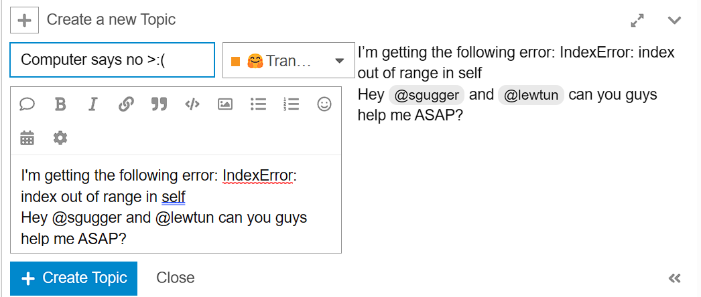

尽这个主题包含这个错误消息，但撰写方式存在一些问题：

1. 标题描述性不是很强，这会导致浏览论坛的人在没有阅读正文的情况下无法知道主题是关于什么的。

2. 正文没有提供足够的信息说明错误的来源以及如何重现错误。

3. 主题以某种要求的语气直接 ＠ 了几个人。

像这样的主题不太可能很快得到答案（如果有答复的话），需要对其进行改进。我们将从解决第一个问题，选择一个好的标题开始。

#### 选择描述性标题 

如果你想就代码中的错误寻求帮助，一个好的经验法则是在标题中包含足够的信息，以便其他人可以快速确定他们是否可以回答你的问题。在我们的运行示例中，我们知道正在引发的异常名称，并有一些提示表示它是在模型的前向传递中触发的，即我们调用 `model(**inputs)` 的位置。为了传达这一信息，一个可能的标题可能是：

> AutoModel 前向传递中的 IndexError 来源？

这个标题告诉读者在哪里你认为错误来自，如果他们遇到了 `IndexError` 他们很可能知道如何回答你。当然，标题可以是任何你想要的，其他变体如：

> 为什么我的模型会产生 IndexError？

这种标题也是可以的。现在我们有了一个描述性的标题，让我们来看看改善正文。

#### 设置代码段的格式 

现在我们有了一个描述性的标题，让我们来看看如何改善代码段的格式。在 IDE 中阅读源代码已经够难的了，但是当将代码复制粘贴为纯文本时就更难了！不过 Hugging Face 论坛支持使用 Markdown，标准格式是用三个反引号 （```） 将代码块括起来。这可以让正文比我们的原始版本看起来更加美观：


正如你在屏幕截图中看到的，将代码块括在反引号中会将原始文本转换为带有颜色样式的格式化代码！另外，单个反引号可用于格式化内联变量，比如 `distilbert-base-uncased` 这样。这个主题看起来好多了，有了一点运气，我们可能会在社区中找到一些人猜测错误的原因。然而，与其依靠运气，不如通过包括完整而详细的回溯信息使事情更容易！

#### 包括完整的回溯信息 

由于回溯的最后一行通常足以调试你自己的代码，但是只提供这一行以“节省空间”可能会使他人调试问题变得更加困难，因为 traceback 中更上面的信息也可能非常有用。因此，一个好的做法是复制并粘贴整个的 traceback，同时确保它的格式不被破坏。但是这些 traceback 可能会很长，所以可以在对源代码进行解释之后再展示它们。就这个思路现在来对我们的问题帖子进行修改，我们的帖子如下所示：

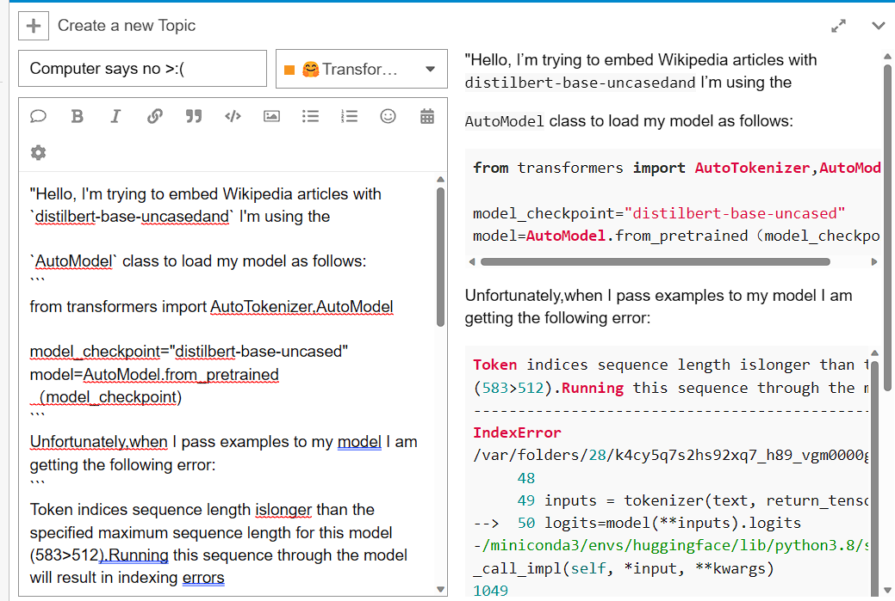

这提供了更多信息，细心的读者可能会指出问题似乎是由于 traceback 中的这行代码导致输入过长：

> 令牌索引序列长度长于为此模型指定的最大序列长度 （583 > 512）。

然而，我们可以通过提供触发错误的实际代码进一步简化事情。现在，我们就来做这件事。

#### 提供可重复的示例 

如果你曾经尝试过调试其他人的代码，那么你可能首先尝试重现他们报告的问题，以便你可以开始逐步查找错误。在论坛上获取（或提供）帮助也不例外，如果你能提供一个重现错误的小例子真的很有帮助。这里有个示例帖子：


该帖子目前包含相当多的信息，并且它的撰写格式更可能吸引社区的注意，获得有用的答案。有了这些基本指南，你现在可以创建很棒的帖子来找到遇到的 Transformers 问题的答案！

{#if fw === 'pt'}

在 PyTorch 中：

## 9.3 调试 Trainer 训练管道

你已经尽可能地遵循第八章中的建议，编写了一段漂亮的代码来训练或微调给定任务的模型。但是当你启动命令 `trainer.train()` 时，可怕的事情发生了：你得到一个错误😱！或者更糟糕的是，虽然一切似乎都很好，训练运行没有错误，但生成的模型很糟糕。在本节中，我们将向你展示如何调试此类问题。

### 调试训练管道 

当你在 `trainer.train()` 中遇到错误时，它可能来自多个来源，因为 `Trainer` 会将很多模块放在一起组合运行。它会将 datasets 转换为 dataloaders 因此问题可能出在 datasets 中，或者在尝试将 datasets 的元素一起批处理时出现问题。接着它会准备一批数据并将其提供给模型，因此问题可能出在模型代码中。之后，它会计算梯度并执行优化器，因此问题也可能出在你的优化器中。即使训练一切顺利，如果你的评估指标有问题，评估期间仍然可能出现问题。

调试 `trainer.train()` 中出现的错误的最佳方法是手动检查整个管道，看看哪里出了问题。通常情况下，错误很容易解决。

为了解释这一点，我们将尝试使用以下脚本在 [MNLI 数据集](https://huggingface.co/datasets/glue)(https://huggingface.co/datasets/glue) 上微调 DistilBERT 模型：

```python
#####Pytorch
from datasets import load_dataset
from transformers import (
    AutoTokenizer,
    AutoModelForSequenceClassification,
    TrainingArguments,
    Trainer,
)

raw_datasets = evaluate.load("glue", "mnli")

model_checkpoint = "distilbert-base-uncased"
tokenizer = AutoTokenizer.from_pretrained(model_checkpoint)

def preprocess_function(examples):
    return tokenizer(examples["premise"], examples["hypothesis"], truncation=True)

tokenized_datasets = raw_datasets.map(preprocess_function, batched=True)
model = AutoModelForSequenceClassification.from_pretrained(model_checkpoint)

args = TrainingArguments(
    f"distilbert-finetuned-mnli",
    evaluation_strategy="epoch",
    save_strategy="epoch",
    learning_rate=2e-5,
    num_train_epochs=3,
    weight_decay=0.01,
)

metric = evaluate.load("glue", "mnli")

def compute_metrics(eval_pred):
    predictions, labels = eval_pred
    return metric.compute(predictions=predictions, references=labels)

trainer = Trainer(
    model,
    args,
    train_dataset=raw_datasets["train"],
    eval_dataset=raw_datasets["validation_matched"],
    compute_metrics=compute_metrics,
)
trainer.train()####end
```

如果你尝试执行它，你会遇到一个相当晦涩的错误：

```python
#####Pytorch
'ValueError: You have to specify either input_ids or inputs_embeds'####end
```

#### 检查数据 

这是显而易见的，如果你的数据损坏了， `Trainer` 将无法将数据整理成 batch，更不用说训练你的模型了。因此，你需要先检查一下你的训练集的内容。

为了避免花费无数小时试图修复不是错误来源的问题，我们建议你只使用 `trainer.train_dataset` 进行检查。所以让我们在这里这样尝试一下：

```python
#####Pytorch
trainer.train_dataset[0]####end
```

```python
#####Pytorch
{'hypothesis': 'Product and geography are what make cream skimming work. ',
 'idx': 0,
 'label': 1,
 'premise': 'Conceptually cream skimming has two basic dimensions - product and geography.'}####end
```

你注意到有什么不对吗？与缺少 `input_ids` 的错误消息相结合，应该让你意识到数据集里是文本，而不是模型可以理解的数字。在这个例子，输出的原始错误信息非常具有误导性，因为 `Trainer` 会自动删除与模型签名不匹配的列 （即模型预期的输入参数）。这意味着在这里，除了标签之外的所有东西都被丢弃了。因此，创建 batch 然后将它们发送到模型时没有问题，但是模型会抱怨它没有收到正确的输入。

为什么数据没有被处理？我们确实在数据集上使用了 `Dataset.map()` 方法来使用 tokenizer 处理每个样本。但是如果你仔细看代码，你会发现我们在将训练和评估集传递给 `Trainer` 时犯了一个错误。我们在这里没有使用 `tokenized_datasets` ，而是使用了 `raw_datasets` 🤦。所以让我们解决这个问题！

```python
#####Pytorch
from datasets import load_dataset
from transformers import (
    AutoTokenizer,
    AutoModelForSequenceClassification,
    TrainingArguments,
    Trainer,
)

raw_datasets = evaluate.load("glue", "mnli")

model_checkpoint = "distilbert-base-uncased"
tokenizer = AutoTokenizer.from_pretrained(model_checkpoint)

def preprocess_function(examples):
    return tokenizer(examples["premise"], examples["hypothesis"], truncation=True)

tokenized_datasets = raw_datasets.map(preprocess_function, batched=True)
model = AutoModelForSequenceClassification.from_pretrained(model_checkpoint)

args = TrainingArguments(
    f"distilbert-finetuned-mnli",
    evaluation_strategy="epoch",
    save_strategy="epoch",
    learning_rate=2e-5,
    num_train_epochs=3,
    weight_decay=0.01,
)

metric = evaluate.load("glue", "mnli")

def compute_metrics(eval_pred):
    predictions, labels = eval_pred
    return metric.compute(predictions=predictions, references=labels)

trainer = Trainer(
    model,
    args,
    train_dataset=tokenized_datasets["train"],
    eval_dataset=tokenized_datasets["validation_matched"],
    compute_metrics=compute_metrics,
)
trainer.train()####end
```

这个新代码现在会给出一个新的错误😥：

```python
#####Pytorch
'ValueError: expected sequence of length 43 at dim 1 (got 37)'####end
```

查看 traceback，我们可以看到错误发生在数据整理步骤中：

```python
#####Pytorch
~/git/transformers/src/transformers/data/data_collator.py in torch_default_data_collator(features)
    105                 batch[k] = torch.stack([f[k] for f in features])
    106             else:
--> 107                 batch[k] = torch.tensor([f[k] for f in features])
    108 
    109     return batch####end
```

所以，我们应该去研究一下那个。然而，在我们这样做之前，让我们完成检查我们的数据，先确定它 100％是正确的。

在调试训练过程时，你应该始终做的一件事是查看模型的解码输入。我们无法理解直接提供给它的数字，所以我们应该看看这些数字代表什么。例如，在计算机视觉中，这意味着查看你传递解码后的像素图片，在语音中意味着解码后的音频样本，对于我们的 NLP 示例，这意味着使用我们的 tokenizer 解码后的输入：

```python
#####Pytorch
tokenizer.decode(trainer.train_dataset[0]["input_ids"])####end
```

```python
#####Pytorch
'[CLS] conceptually cream skimming has two basic dimensions - product and geography. [SEP] product and geography are what make cream skimming work. [SEP]'####end
```

所以这似乎是正确的。你应该对输入中的所有键都这样做：

```python
#####Pytorch
trainer.train_dataset[0].keys()####end
```

```python
#####Pytorch
dict_keys(['attention_mask', 'hypothesis', 'idx', 'input_ids', 'label', 'premise'])####end
```

请注意，与模型接受的输入不对应的键将被自动丢弃，因此这里我们将仅保留 `input_ids` 、 `attention_mask` 和 `label` （它将被重命名为 `labels` ）。为了双重保险，你可以打印模型的类，然后查看其文档：

```python
#####Pytorch
type(trainer.model)####end
```

```python
#####Pytorch
transformers.models.distilbert.modeling_distilbert.DistilBertForSequenceClassification####end
```

所以在我们的例子中，我们可以在 [这个页面](https://huggingface.co/transformers/model_doc/distilbert.html#distilbertforsequenceclassification)(https://huggingface.co/transformers/model_doc/distilbert.html#distilbertforsequenceclassification) 查看模型接受的参数。 `Trainer` 也会记录它丢弃的列。

我们通过解码检查了 inputs ID 是否正确。接下来是检查 `attention_mask` ：

```python
#####Pytorch
trainer.train_dataset[0]["attention_mask"]####end
```

```python
#####Pytorch
[1, 1, 1, 1, 1, 1, 1, 1, 1, 1, 1, 1, 1, 1, 1, 1, 1, 1, 1, 1, 1, 1, 1, 1, 1, 1, 1, 1]####end
```

由于我们没有在预处理中使用填充，这看起来没什么问题。为确保该注意掩码没有问题，让我们检查它与 inputs ID 的长度是否相同：

```python
#####Pytorch
len(trainer.train_dataset[0]["attention_mask"]) == len(
    trainer.train_dataset[0]["input_ids"]
)####end
```

```python
#####Pytorch
True####end
```

那挺好的！最后，让我们检查一下我们的标签：

```python
#####Pytorch
trainer.train_dataset[0]["label"]####end
```

```python
#####Pytorch
1####end
```

与inputs ID 一样，这是一个本身并没有真正意义的数字。正如我们之前学到的，标签 ID 和标签名之间的映射存储在数据集 `features` 里的 `names` 属性中：

```python
#####Pytorch
trainer.train_dataset.features["label"].names####end
```

```python
#####Pytorch
['entailment', 'neutral', 'contradiction']####end
```

所以 `1` 表示 `neutral` ，表示我们上面看到的两句话并不矛盾，也没有包含关系。这似乎是正确的！

我们这里没有 token 类型 ID，因为 DistilBERT 不需要它们；如果你的模型中有一些，你还应该确保它们正确匹配输入中第一句和第二句的位置。

<div custom-style="Tip-green">

✏️ **轮到你了！** 检查训练数据集的第二个条数据是否正确。

</div>

我们在这里只对训练集进行检查，但你当然应该以同样的方式仔细检查验证集和测试集。

现在我们知道我们的数据集看起来不错，是时候检查训练管道的下一步了。

#### 从 datasets 到 dataloaders 

训练管道中可能出错的下一件事是当 `Trainer` 尝试从训练或验证集形成 batch 时。当你确定 `Trainer` 的数据集是正确的后，你可以尝试通过执行以下操作手动形成一个 batch（当要测试验证集的 dataloaders 时，可以将 `train` 替换为 `eval` ）：

```python
#####Pytorch
for batch in trainer.get_train_dataloader():
    break####end
```

此代码将会创建训练数据加载器，然后对其进行迭代一次。如果代码执行没有错误，那么你就有了可以检查的第一个 batch，如果代码出错，你可以确定问题出在数据加载器中，如下所示：

```python
#####Pytorch
~/git/transformers/src/transformers/data/data_collator.py in torch_default_data_collator(features)
    105                 batch[k] = torch.stack([f[k] for f in features])
    106             else:
--> 107                 batch[k] = torch.tensor([f[k] for f in features])
    108 
    109     return batch

ValueError: expected sequence of length 45 at dim 1 (got 76)####end
```

Trackback 的最后一个堆栈的输出应该足够给你一些线索，但让我们再深入挖掘一下。批处理创建过程中的大多数问题是在将示例整理到单个 batch 中而出现的，因此在有疑问时首先要检查的是你的 DataLoader 正在使用的 `collate_fn` ：

```python
#####Pytorch
data_collator = trainer.get_train_dataloader().collate_fn
data_collator####end
```

```python
#####Pytorch
<function transformers.data.data_collator.default_data_collator(features: List[InputDataClass], return_tensors='pt') -> Dict[str, Any]>####end
```

所以，目前使用的是 `default_data_collator` ，但这不是我们在这个例子中想要的。我们希望将示例填充到批处理中最长的句子，这项功能是由 `DataCollatorWithPadding` 整理器实现的。而这个数据整理器应该是默认被 `Trainer` 使用的，为什么这里没有使用呢？

答案是因为我们没有将 `tokenizer` 传递给 `Trainer` ，所以它无法创建我们想要的 `DataCollatorWithPadding` 。在实践中，你应该明确地传递你想要使用的数据整理器，以确保避免这些类型的错误。让我们修改代码以实现这一点：

```python
#####Pytorch
from datasets import load_dataset
import evaluate
from transformers import (
    AutoTokenizer,
    AutoModelForSequenceClassification,
    DataCollatorWithPadding,
    TrainingArguments,
    Trainer,
)

raw_datasets = evaluate.load("glue", "mnli")

model_checkpoint = "distilbert-base-uncased"
tokenizer = AutoTokenizer.from_pretrained(model_checkpoint)

def preprocess_function(examples):
    return tokenizer(examples["premise"], examples["hypothesis"], truncation=True)

tokenized_datasets = raw_datasets.map(preprocess_function, batched=True)
model = AutoModelForSequenceClassification.from_pretrained(model_checkpoint)

args = TrainingArguments(
    f"distilbert-finetuned-mnli",
    evaluation_strategy="epoch",
    save_strategy="epoch",
    learning_rate=2e-5,
    num_train_epochs=3,
    weight_decay=0.01,
)

metric = evaluate.load("glue", "mnli")

def compute_metrics(eval_pred):
    predictions, labels = eval_pred
    return metric.compute(predictions=predictions, references=labels)

data_collator = DataCollatorWithPadding(tokenizer=tokenizer)

trainer = Trainer(
    model,
    args,
    train_dataset=tokenized_datasets["train"],
    eval_dataset=tokenized_datasets["validation_matched"],
    compute_metrics=compute_metrics,
    data_collator=data_collator,
    tokenizer=tokenizer,
)
trainer.train()####end
```

好消息？我们没有得到与以前相同的错误，这绝对是进步。坏消息？我们得到了一个臭名昭著的 CUDA 错误：

```python
#####Pytorch
RuntimeError: CUDA error: CUBLAS_STATUS_ALLOC_FAILED when calling `cublasCreate(handle)`####end
```

这很糟糕，因为 CUDA 错误通常很难调试。我们稍后会看到如何解决这个问题，但首先让我们完成对创建批处理的分析。

如果你确定你的数据整理器是正确的，则应尝试用它来处理数据集的几个样本：

```python
#####Pytorch
data_collator = trainer.get_train_dataloader().collate_fn
batch = data_collator([trainer.train_dataset[i] for i in range(4)])####end
```

此代码将运行失败，因为 `train_dataset` 包含字符串列， `Trainer` 通常会删除这些列。你可以手动删除它们，或者如果你使用 `Trainer` 在幕后所做的事情，你可以调用私有的 `Trainer._remove_unused_columns()` 方法来执行此操作：

```python
#####Pytorch
data_collator = trainer.get_train_dataloader().collate_fn
actual_train_set = trainer._remove_unused_columns(trainer.train_dataset)
batch = data_collator([actual_train_set[i] for i in range(4)])####end
```

如果错误仍然存在，你应该能够手动调试数据整理器内部以确定具体的问题。

现在我们已经调试了批处理创建过程，是时候将数据传递给模型了！

#### 检查模型 

你应该能够通过执行以下命令来获得一个批次的数据：

```python
#####Pytorch
for batch in trainer.get_train_dataloader():
    break####end
```

如果你在 notebook 中运行此代码，你可能会收到与我们之前看到的类似的 CUDA 错误，在这种情况下，你需要重新启动 notebook 并重新执行最后一段代码，但是不运行 `trainer.train()` 行．这是关于 CUDA 错误的第二个最烦人的事情：它们会破坏你的 Cuda 内核，而且无法恢复。它们最烦人的事情是它们很难调试。

这是为什么？它与 GPU 的工作方式有关。它们在并行执行大量操作方面非常有效，但缺点是当其中一条指令导致错误时，你不会立即知道。只有当程序在 GPU 上调用多个进程的同步处理时，它才会意识到出现问题，因此错误实际上是在与创建它的原因无关的地方引发的。例如，如果我们查看之前的 Trackback，错误是在反向传播期间引发的，但我们会在一分钟后看到它实际上源于前向传播的某些东西。

那么我们如何调试这些错误呢？答案很简单：不调试。除非你的 CUDA 错误是内存不足错误（这意味着你的 GPU 中没有足够的内存），除此之外你应该始终返回到 CPU 进行调试。

为此，我们只需将模型放回 CPU 上并在我们的 batch 数据中调用它—— `DataLoader` 返回的那批数据尚未移动到 GPU：

```python
#####Pytorch
outputs = trainer.model.cpu()(**batch)####end
```

```python
#####Pytorch
~/.pyenv/versions/3.7.9/envs/base/lib/python3.7/site-packages/torch/nn/functional.py in nll_loss(input, target, weight, size_average, ignore_index, reduce, reduction)
   2386         )
   2387     if dim == 2:
-> 2388         ret = torch._C._nn.nll_loss(input, target, weight, _Reduction.get_enum(reduction), ignore_index)
   2389     elif dim == 4:
   2390         ret = torch._C._nn.nll_loss2d(input, target, weight, _Reduction.get_enum(reduction), ignore_index)

IndexError: Target 2 is out of bounds.####end
```

现在，情况越来越明朗了。我们现在在损失计算中没有出现 CUDA 错误，而是有一个 `IndexError` （因此与我们之前所说的反向传播无关）。更准确地说，我们可以看到是 Target 2 造成了错误，所以这是检查模型标签数量的好时机：

```python
#####Pytorch
trainer.model.config.num_labels####end
```

```python
#####Pytorch
2####end
```

有两个标签，只有 0 和 1 作为目标，但是根据错误信息我们得到一个 2。得到一个 2 实际上是正常的：如果我们记得我们之前提取的标签名称，有三个，所以在我们的数据集中我们有索引 0、1 和 2 问题是我们没有告诉我们的模型，它应该创建三个标签。让我们解决这个问题！

```python
#####Pytorch
from datasets import load_dataset
import evaluate
from transformers import (
    AutoTokenizer,
    AutoModelForSequenceClassification,
    DataCollatorWithPadding,
    TrainingArguments,
    Trainer,
)

raw_datasets = evaluate.load("glue", "mnli")

model_checkpoint = "distilbert-base-uncased"
tokenizer = AutoTokenizer.from_pretrained(model_checkpoint)

def preprocess_function(examples):
    return tokenizer(examples["premise"], examples["hypothesis"], truncation=True)

tokenized_datasets = raw_datasets.map(preprocess_function, batched=True)
model = AutoModelForSequenceClassification.from_pretrained(model_checkpoint, num_labels=3)

args = TrainingArguments(
    f"distilbert-finetuned-mnli",
    evaluation_strategy="epoch",
    save_strategy="epoch",
    learning_rate=2e-5,
    num_train_epochs=3,
    weight_decay=0.01,
)

metric = evaluate.load("glue", "mnli")

def compute_metrics(eval_pred):
    predictions, labels = eval_pred
    return metric.compute(predictions=predictions, references=labels)

data_collator = DataCollatorWithPadding(tokenizer=tokenizer)

trainer = Trainer(
    model,
    args,
    train_dataset=tokenized_datasets["train"],
    eval_dataset=tokenized_datasets["validation_matched"],
    compute_metrics=compute_metrics,
    data_collator=data_collator,
    tokenizer=tokenizer,
)####end
```

为了方便检查一切是否正常，我们还没有把 `trainer.train()` 加进去。如果我们请求一个 batch 的数据并将其传递给我们的模型，假如它现在可以正常工作了！

```python
#####Pytorch
for batch in trainer.get_train_dataloader():
    break

outputs = trainer.model.cpu()(**batch)####end
```

下一步就可以回到 GPU 并检查一切是否仍然有效：

```python
#####Pytorch
import torch

device = torch.device("cuda") if torch.cuda.is_available() else torch.device("cpu")
batch = {k: v.to(device) for k, v in batch.items()}

outputs = trainer.model.to(device)(**batch)####end
```

如果仍然出现错误，请确保重新启动 notebook 并仅执行最后一版的代码。

#### 执行一个优化器步骤 

现在我们已经可以构建通过模型检查的成批次的数据，我们已经为训练管道的下一步做好准备：计算梯度并执行优化器步骤。

第一部分只是在 loss 上调用 `backward()` 方法：

```python
#####Pytorch
loss = outputs.loss
loss.backward()####end
```

在这个阶段很少出现错误，但如果确实出现错误，请返回 CPU 来获取有用的错误消息。

要执行优化步骤，我们只需要创建 `optimizer` 并调用它的 `step()` 方法：

```python
#####Pytorch
trainer.create_optimizer()
trainer.optimizer.step()####end
```

同样，如果你在 `Trainer` 中使用默认优化器，则在此阶段你不应该收到错误，但如果你有自定义优化器，则可能会出现一些问题需要在这里调试。如果你在此阶段遇到奇怪的 CUDA 错误，请不要忘记返回 CPU。说到 CUDA 错误，前面我们提到了一个特殊情况。现在让我们来看看。

#### 处理 CUDA out-of-memory 错误 

每当你收到以 `RuntimeError: CUDA out of memory` 开头的错误消息时，这表明你的 GPU 内存不足。这与你的代码没有直接关联，并且它可能发生在运行良好的代码中。此错误意味着你试图在 GPU 的内部存储器中放入太多东西，这导致了错误。与其他 CUDA 错误一样，你需要重新启动内核才能再次运行训练。

要解决这个问题，你只需要使用更少的 GPU 空间——这往往说起来容易做起来难。首先，确保你没有同时在 GPU 上运行两个模型（当然，除非你的问题需要这样做）。然后，你可能应该减少 batch 的大小，因为它直接影响模型的所有中间输出的大小及其梯度。如果问题仍然存在，请考虑使用较小版本的模型。

#### 评估模型 

现在我们已经解决了代码的所有问题，一切都很完美，训练应该可以顺利进行，对吧？没那么快！如果你运行 `trainer.train()` 命令，一开始一切看起来都不错，但过一会儿你会得到以下信息：

```python
#####Pytorch
# 这将花费很长时间并且会出错,所以不要直接运行这个单元
trainer.train()####end
```

```python
#####Pytorch
TypeError: only size-1 arrays can be converted to Python scalars####end
```

你将意识到此错误出现在评估阶段，因此这是我们需要调试的最后一件事。

你可以独立于训练运行 Trainer 的评估循环，如下所示：

```python
#####Pytorch
trainer.evaluate()####end
```

```python
#####Pytorch
TypeError: only size-1 arrays can be converted to Python scalars####end
```

<div custom-style="Tip-green">

💡 你应该始终确保在启动 `trainer.train()` 之前 `trainer.evaluate()` 是可以运行的，以避免在遇到错误之前浪费大量计算资源。

</div>

在尝试调试评估循环中的问题之前，你应该首先确保你已经查看了数据，能够正确地形成了 batch 并且可以在其上运行你的模型。我们已经完成了所有这些步骤，因此可以执行以下代码而不会出错：

```python
#####Pytorch
for batch in trainer.get_eval_dataloader():
    break

batch = {k: v.to(device) for k, v in batch.items()}

with torch.no_grad():
    outputs = trainer.model(**batch)####end
```

稍等一会儿，错误出现，在评估阶段结束时，如果我们查看 Trackback，我们会看到：

```python
#####Pytorch
~/git/datasets/src/datasets/metric.py in add_batch(self, predictions, references)
    431         
    432         batch = {"predictions": predictions, "references": references}
--> 433         batch = self.info.features.encode_batch(batch)
    434         if self.writer is None:
    435             self._init_writer()####end
```

这告诉我们错误源自 `datasets/metric.py` 模块——所以这是我们的 `compute_metrics()` 函数的问题。它需要一个带有 logits 和标签的元组作为 NumPy 数组，所以让我们尝试将其提供给它：

```python
#####Pytorch
predictions = outputs.logits.cpu().numpy()
labels = batch["labels"].cpu().numpy()

compute_metrics((predictions, labels))####end
```

```python
#####Pytorch
TypeError: only size-1 arrays can be converted to Python scalars####end
```

我们得到同样的错误，所以问题肯定出在那个函数上。如果我们回顾它的代码，我们会发现它只是将 `predictions` 和 `labels` 转发到 `metric.compute()` 。那么这种方法有问题吗？不一定。让我们快速浏览一下形状：

```python
#####Pytorch
predictions.shape, labels.shape####end
```

```python
#####Pytorch
((8, 3), (8,))####end
```

我们的预测输出是 logits 值，而不是需要的 3 个标签的概率，这就是 metrics 返回这个（有点模糊）错误的原因。修复很简单；我们只需要在 `compute_metrics()` 函数中添加一个 argmax：

```python
#####Pytorch
import numpy as np

def compute_metrics(eval_pred):
    predictions, labels = eval_pred
    predictions = np.argmax(predictions, axis=1)
    return metric.compute(predictions=predictions, references=labels)

compute_metrics((predictions, labels))####end
```

```python
#####Pytorch
{'accuracy': 0.625}####end
```

现在我们的错误已修复！这是最后一个错误，所以我们的脚本现在将可以正确地训练一个模型。

作为参考，这里是完全修正好的脚本：

```python
#####Pytorch
import numpy as np
from datasets import load_dataset
import evaluate
from transformers import (
    AutoTokenizer,
    AutoModelForSequenceClassification,
    DataCollatorWithPadding,
    TrainingArguments,
    Trainer,
)

raw_datasets = evaluate.load("glue", "mnli")

model_checkpoint = "distilbert-base-uncased"
tokenizer = AutoTokenizer.from_pretrained(model_checkpoint)

def preprocess_function(examples):
    return tokenizer(examples["premise"], examples["hypothesis"], truncation=True)

tokenized_datasets = raw_datasets.map(preprocess_function, batched=True)
model = AutoModelForSequenceClassification.from_pretrained(model_checkpoint, num_labels=3)

args = TrainingArguments(
    f"distilbert-finetuned-mnli",
    evaluation_strategy="epoch",
    save_strategy="epoch",
    learning_rate=2e-5,
    num_train_epochs=3,
    weight_decay=0.01,
)

metric = evaluate.load("glue", "mnli")

def compute_metrics(eval_pred):
    predictions, labels = eval_pred
    predictions = np.argmax(predictions, axis=1)
    return metric.compute(predictions=predictions, references=labels)

data_collator = DataCollatorWithPadding(tokenizer=tokenizer)

trainer = Trainer(
    model,
    args,
    train_dataset=tokenized_datasets["train"],
    eval_dataset=tokenized_datasets["validation_matched"],
    compute_metrics=compute_metrics,
    data_collator=data_collator,
    tokenizer=tokenizer,
)
trainer.train()####end
```

在这种情况下，如果没有更多错误，我们的脚本将微调一个应该给出合理结果的模型。但是，如果训练没有任何错误，而训练出来的模型根本表现不佳，我们该怎么办？这是机器学习中最难的部分，我们将向你展示一些可以帮助解决这类问题的技巧。
<div custom-style="Tip-green">

💡 如果你使用的是手动训练循环，调试训练流程时也需要遵循相同的步骤，而且更容易将训练中的各个步骤分开调试。但是，请确保你没有忘记在合适的位置使用 `model.eval()` 或 `model.train()` ，也不要忘记在每个步骤中使用 `zero_grad()` ！

</div>

### 在训练期间调试静默（没有任何错误提示）错误 

我们可以做些什么来调试一个没有错误地完成但没有得到好的结果的训练？我们会在这里给你一些提示，但请注意，这种调试是机器学习中最难的部分，并且没有灵丹妙药。

#### 检查你的数据（再次！） 

只有你的数据确实可以学到东西，你的模型才会学到一些东西。如果存在损坏数据的错误或标签是随机属性的，那么你很可能不会在数据集上获得任何知识。因此，始终首先仔细检查你的解码后的输入和标签，然后问自己以下问题：

- 解码后的数据是否可以理解？
- 你认同这些标签吗？
- 有没有一个标签比其他标签更常见？
- 如果模型预测随机的答案/总是相同的答案，那么 loss/评估指标应该是多少？

<div custom-style="Tip-yellow">

⚠️ 如果你正在进行分布式训练，请在每个进程中打印数据集的样本并仔细核对，确保你得到的是相同的内容。一个常见的错误是在数据创建过程中有一些随机性，导致每个进程具有不同版本的数据集。

</div>

查看你的数据后，查看模型的一些预测并对其进行解码。如果模型总是预测同样的类别，那可能是因为你的数据集偏向一个类别（针对分类问题）；过采样稀有类等技术可能会有所帮助。

如果你在初始模型上获得的 loss/评估指标与你期望的随机预测的 loss/评估指标非常不同，请仔细检查你的 loss 或评估指标的计算方式，因为那里可能存在错误。如果你使用最后添加的多个 loss，并在最后将它们相加，请确保它们具有相同的比例。

当你确定你的数据是完美的时，你可以通过一个简单的测试来查看模型是否能够对其进行训练。

#### 在一批上过度拟合你的模型 

过度拟合通常是我们在训练时尽量避免的事情，因为这意味着模型没有学习识别我们想要的一般特征，而只是记住了训练样本。在这种情况下，一遍又一遍地尝试在一个批次上训练你的模型是一个很好的测试，这样可以检查你的问题是否可以通过你尝试训练的模型来解决。它还将帮助你查看你的初始学习率是否太高。

一旦你定义了你的 `Trainer` 之后，这样做真的很容易；只需获取一批训练数据，然后仅使用该批次运行一个小型手动训练循环，大约 20 步：

```python
#####Pytorch
for batch in trainer.get_train_dataloader():
    break

batch = {k: v.to(device) for k, v in batch.items()}
trainer.create_optimizer()

for _ in range(20):
    outputs = trainer.model(**batch)
    loss = outputs.loss
    loss.backward()
    trainer.optimizer.step()
    trainer.optimizer.zero_grad()####end
```

<div custom-style="Tip-green">

💡 如果你的训练数据不平衡，请确保构建一批包含所有标签的训练数据。

</div>

生成的模型在一个 `batch` 上应该有接近完美的结果。让我们计算结果预测的指标：

```python
#####Pytorch
with torch.no_grad():
    outputs = trainer.model(**batch)
preds = outputs.logits
labels = batch["labels"]

compute_metrics((preds.cpu().numpy(), labels.cpu().numpy()))####end
```

```python
#####Pytorch
{'accuracy': 1.0}####end
```

100％ 准确率，现在这是一个很好的过拟合示例（这意味着如果你在任何其他句子上尝试你的模型，它很可能会给你一个错误的答案）！

如果你没有设法让你的模型获得这样的完美结果，这意味着你构建问题或数据的方式有问题，所以你应该修复它。只有当你可以通过过拟合测试时，你才能确定你的模型实际上可以学到一些东西。

<div custom-style="Tip-yellow">

⚠️ 在此测试之后，你需要创建模型和 `Trainer` ，因为获得的模型可能无法在你的完整数据集上恢复和学习有用的东西。

</div>

#### 在你有第一个 baseline 模型之前不要调整任何东西 

超参数调优总是被强调为机器学习中最难的部分，但这只是帮助你在指标上有所收获的最后一步。大多数情况下， `Trainer` 的默认超参数可以很好地为你提供良好的结果，因此在你拥有数据集上的 baseline 模型之前，不要急于进行耗时和昂贵的超参数搜索。

一旦你有一个足够好的模型，你就可以开始稍微调整一下。不要尝试使用不同的超参数启动一千次运行，而是比较一个超参数的不同值的几次运行，以了解哪个超参数对指标影响最大。

如果你正在调整模型本身，请保持简单，不要尝试任何你无法合理证明的事情。始终确保你返回过拟合测试以验证你的更改没有产生任何意外后果。

#### 请求帮忙 

希望你会在本节中找到一些可以帮助你解决问题的建议，但如果不是这样，请记住你可以随时在 [论坛](https://discuss.huggingface.co/)(https://discuss.huggingface.co/) 上向社区提问。

以下是一些可能有用的外部资源：

- Joel Grus 的 [“作为工程最佳实践工具的再现性”](https://docs.google.com/presentation/d/1yHLPvPhUs2KGI5ZWo0sU-PKU3GimAk3iTsI38Z-B5Gw/edit#slide=id.p)(https://docs.google.com/presentation/d/1yHLPvPhUs2KGI5ZWo0sU-PKU3GimAk3iTsI38Z-B5Gw/edit#slide=id.p) 
- Cecelia Shao 的 [“神经网络调试清单”](https://towardsdatascience.com/checklist-for-debugging-neural-networks-d8b2a9434f21)(https://towardsdatascience.com/checklist-for-debugging-neural-networks-d8b2a9434f21) 
- Chase Roberts 的 [“如何对机器学习代码进行单元测试”](https://medium.com/@keeper6928/how-to-unit-test-machine-learning-code-57cf6fd81765)(https://medium.com/@keeper6928/how-to-unit-test-machine-learning-code-57cf6fd81765) 
- Andrej Karpathy 的 [“训练神经网络的秘诀”](http://karpathy.github.io/2019/04/25/recipe)(http://karpathy.github.io/2019/04/25/recipe) 

当然，并不是你在训练神经网络时遇到的每个问题都是你自己的错！如果你在Transformers 或Datasets 库中遇到了似乎不正确的东西，你可能遇到了一个错误。你应该告诉我们所有这些问题，在下一节中，我们将详细解释如何做到这一点。

{/if}

{#if fw === 'tf'}

## 9.4 调试Keras训练管道 

你已经遵循第八章中的建议，编写了一个漂亮的脚本来训练或微调给定任务的模型。 但是当你启动命令 `model.fit()` 时，你得到一个错误😱！ 或者更糟的是一切看似都很正常，训练运行没有错误，但生成的模型很糟糕。 在本节中，我们将向你展示如何调试此类问题。

### 调试训练管道 

当你在 `model.fit()` 中遇到错误时，问题在于它可能来自多个不同的来源，因为训练通常将之前的许多工作汇集到一起。比如有可能是你的数据集有问题，或者可能是在尝试将数据集的元素批处理时出现问题，又或者模型代码、损失函数或优化器中存在问题，另外即使训练过程一切顺利，如果指标选取有问题，评估过程中仍然可能出现错误。

所以调试 `model.fit()` 中出现的错误的最佳方法是手动检查整个管道，看看哪里出了问题。

这里我们将使用以下脚本在 [MNLI 数据集](https://huggingface.co/datasets/glue)(https://huggingface.co/datasets/glue)上微调 DistilBERT 模型：

```python
#####TensorFlow
from datasets import load_dataset
from transformers import (
    AutoTokenizer,
    TFAutoModelForSequenceClassification,
)

raw_datasets = evaluate.load("glue", "mnli")

model_checkpoint = "distilbert-base-uncased"
tokenizer = AutoTokenizer.from_pretrained(model_checkpoint)

def preprocess_function(examples):
    return tokenizer(examples["premise"], examples["hypothesis"], truncation=True)

tokenized_datasets = raw_datasets.map(preprocess_function, batched=True)

train_dataset = tokenized_datasets["train"].to_tf_dataset(
    columns=["input_ids", "labels"], batch_size=16, shuffle=True
)

validation_dataset = tokenized_datasets["validation_matched"].to_tf_dataset(
    columns=["input_ids", "labels"], batch_size=16, shuffle=True
)

model = TFAutoModelForSequenceClassification.from_pretrained(model_checkpoint)

model.compile(loss="sparse_categorical_crossentropy", optimizer="adam")

model.fit(train_dataset)####end
```

如果执行这段代码，在进行数据集转换时可能会收到一些`VisibleDeprecationWarning`——这是已知的 UX 问题，可以忽略。 如果你在 2021 年 11 月之后学习本书时还有这个问题，可以在推特上 @carrigmat 上发表推文敦促作者进行修复。

然而更严重的问题是会得到了一个段很长的报错：

```python
#####TensorFlow
ValueError: No gradients provided for any variable: ['tf_distil_bert_for_sequence_classification/distilbert/embeddings/word_embeddings/weight:0', '...']####end
```

这是什么意思？我们在数据上训练模型，但却没有梯度？ 你甚至可能不知道该如何进行调试。当你得到的错误并不能立即表明问题出在哪里时，最好的解决方法通常是按顺序检查所有内容，确保在每个阶段一切看起来都正常。

#### 检查你的数据 

这是不言而喻的，如果你的数据已损坏，Keras 是无法进行修复数据的。 排查数据错误需要靠自己，首先要做的事情是查看训练集中的内容。

尽管查看 `raw_datasets` 和 `tokenized_datasets` 比较容易，但强烈建议你在数据将要进入模型的地方直接查看数据。 这意味着你应该试着读取使用 `to_tf_dataset()` 函数创建的 `tf.data.Dataset` 的输出！ 那应该怎么做呢？ `tf.data.Dataset` 对象一次给我们整个 batch 的数据，并且不支持索引，所以我们不能只请求 `train_dataset[0]`。 但是我们可以先向它请求一个 batch：

```python
#####TensorFlow
for batch in train_dataset:
    break####end
```

`break` 在一次迭代后结束循环，会抓取来自`train_dataset` 的第一批数据并将其保存为`batch`。 现在，让我们看看里面有什么：

```python
#####TensorFlow
{'attention_mask': <tf.Tensor: shape=(16, 76), dtype=int64, numpy=
 array([[1, 1, 1, ..., 0, 0, 0],
        [1, 1, 1, ..., 0, 0, 0],
        [1, 1, 1, ..., 0, 0, 0],
        ...,
        [1, 1, 1, ..., 1, 1, 1],
        [1, 1, 1, ..., 0, 0, 0],
        [1, 1, 1, ..., 0, 0, 0]])>,
 'label': <tf.Tensor: shape=(16,), dtype=int64, numpy=array([0, 2, 1, 2, 1, 1, 2, 0, 0, 0, 1, 0, 1, 2, 2, 1])>,
 'input_ids': <tf.Tensor: shape=(16, 76), dtype=int64, numpy=
 array([[ 101, 2174, 1010, ...,    0,    0,    0],
        [ 101, 3174, 2420, ...,    0,    0,    0],
        [ 101, 2044, 2048, ...,    0,    0,    0],
        ...,
        [ 101, 3398, 3398, ..., 2051, 2894,  102],
        [ 101, 1996, 4124, ...,    0,    0,    0],
        [ 101, 1999, 2070, ...,    0,    0,    0]])>}####end
```

看起来没问题，对吧？我们将 `labels` 、`attention_mask` 和 `input_ids` 传递给模型，这应该是计算输出和计算损失所需的。那么为什么没有梯度呢？仔细看：我们将单个字典作为输入传递，但训练批次通常是输入张量或字典加上标签张量。我们的标签只是我们输入字典中的一个键值。

这是一个问题吗？实际上并不总是！但是这是你在使用 TensorFlow 训练 Transformer 模型时会遇到的最常见问题之一。我们的模型都可以在内部计算损失，但要做到这一点需要在输入字典中传递标签。这是当我们没有为 `compile()` 指定损失值时使用的损失。另一方面，Keras 通常希望标签与输入字典分开传递，如果不这样做损失计算通常会失败。

问题现在变得清晰：我们传递了一个`loss`参数，意味着我们要求 Keras 为我们计算损失，但我们将标签作为输入传递给了模型，而没有放在 Keras 期望的地方！我们需要二选一：要么使用模型的内部损失并将标签保留在原处，要么继续使用 Keras 损失但将标签移动到 Keras 期望的位置。为了简单起见，可以采用第一种方法。将对 `compile()` 的调用更改为：

```python
#####TensorFlow
model.compile(optimizer="adam")####end
```

现在我们可以使用模型的内部损失，这个问题解决了！

<div custom-style="Tip-green">

✏️ **轮到你了！** 作为解决其他问题后的可选挑战，你可以尝试回到这一步，让模型使用原始 Keras 计算的损失而不是内部损失。 你需要将 `"labels"` 添加到 `to_tf_dataset()` 的 `label_cols` 参数，确保正确输出标签来提供梯度，但是我们指定的损失还有一个问题。即使在这个问题上进行训练，学习速度仍然会非常慢，并且 loss 会达到一个较高的值。你能找出问题在哪里吗？

如果你卡住了，这是一个 ROT13 编码的提示（如果你不熟悉 ROT13，可以在[这里](https://rot13.com/)(https://rot13.com/)解码。）：A ROT13-encoded hint, if you're stuck: Vs lbh ybbx ng gur bhgchgf bs FrdhraprPynffvsvpngvba zbqryf va Genafsbezref, gurve svefg bhgchg vf `ybtvgf`. Jung ner ybtvgf?（如果你查看 Transformers 中`SequenceClassification`模型的输出，它们的第一个输出是“logits”。 什么是logits？）

还有一个提示：

Jura lbh fcrpvsl bcgvzvmref, npgvingvbaf be ybffrf jvgu fgevatf, Xrenf frgf nyy gur nethzrag inyhrf gb gurve qrsnhygf. Jung nethzragf qbrf FcnefrPngrtbevpnyPebffragebcl unir, naq jung ner gurve qrsnhygf?（当你使用字符串指定优化器、激活或损失时，Keras 会将所有参数值设置为其默认值。 SparseCategoricalCrossentropy 损失有哪些参数，它们的默认值是什么？）

</div>

现在让我们尝试进行训练。 如今已经得到梯度，所以希望（此处播放令人不安的音乐）只需调用`model.fit()`，一切都会正常工作！

```python
#####TensorFlow
  246/24543 [..............................] - ETA: 15:52 - loss: nan####end
```
哦不。

`nan` 不是一个正常的损失值。我们已经检查了我们的数据，看起来一切正常。如果这不是问题所在，我们可以接下来检查哪里呢？明显的下一步是...

#### 检查模型 

`model.fit()` 是 Keras 中一个很方便的函数，但这个函数一次性做了很多事情，这使准确定位问题发生的位置变得更加棘手。 如果你正在调试模型，一个明智的策略是考虑只将一个批次传递给模型，并查看该批次的详细输出。 如果模型抛出错误，另一个非常有用的提示是可以将`run_eagerly=True`参数传递给 `compile()`。 这会使它训练过程变慢很多，但可以使错误消息更容易理解，因为它们会准确地指出问题发生在模型代码的哪个位置。

不过目前我们还不需要 `run_eagerly`。让我们将之前得到的 `batch` 输入模型，并查看输出的结果：

```python
#####TensorFlow
model(batch)####end
```

```python
#####TensorFlow
TFSequenceClassifierOutput(loss=<tf.Tensor: shape=(16,), dtype=float32, numpy=
array([nan, nan, nan, nan, nan, nan, nan, nan, nan, nan, nan, nan, nan,
       nan, nan, nan], dtype=float32)>, logits=<tf.Tensor: shape=(16, 2), dtype=float32, numpy=
array([[nan, nan],
       [nan, nan],
       [nan, nan],
       [nan, nan],
       [nan, nan],
       [nan, nan],
       [nan, nan],
       [nan, nan],
       [nan, nan],
       [nan, nan],
       [nan, nan],
       [nan, nan],
       [nan, nan],
       [nan, nan],
       [nan, nan],
       [nan, nan]], dtype=float32)>, hidden_states=None, attentions=None)####end
```

嗯，这很棘手。所有的值都是`nan`！但是这很奇怪，对吧？为什么所有的 logits 都变成了`nan`？`nan`表示“不是一个数字”。经常出现在执行非法操作时，例如除以零。但在机器学习中有关于 `nan` 有一个重要的经验——这个值往往会传播。如果将一个数字乘 `nan`，则输出也是 `nan`。如果在输出、损失或梯度的任何地方得到一个“nan”，那么它会迅速传播到整个模型中。因为当那个“nan”值通过你的网络传播回来时，会得到 `nan`梯度，当使用这些梯度计算权重更新时，将获得 `nan`权重，这些权重将计算更多的  `nan`输出！很快整个网络就会变成一个大块`nan`。一旦发生这种情况，就很难看出问题是从哪里开始的。我们如何确定`nan`最先出现的位置呢？

答案是“重新初始化”我们的模型。一旦我们开始训练，我们就会在某个地方得到一个 `nan`，并很快就会传播到整个模型中。所以可以从检查点加载模型而不做任何权重更新，进而排查出从哪里得到一个 `nan` 值：

```python
#####TensorFlow
model = TFAutoModelForSequenceClassification.from_pretrained(model_checkpoint)
model(batch)####end
```

当我们运行它时，可以得到：

```python
#####TensorFlow
TFSequenceClassifierOutput(loss=<tf.Tensor: shape=(16,), dtype=float32, numpy=
array([0.6844486 ,        nan,        nan, 0.67127866, 0.7068601 ,
              nan, 0.69309855,        nan, 0.65531296,        nan,
              nan,        nan, 0.675402  ,        nan,        nan,
       0.69831556], dtype=float32)>, logits=<tf.Tensor: shape=(16, 2), dtype=float32, numpy=
array([[-0.04761693, -0.06509043],
       [-0.0481936 , -0.04556257],
       [-0.0040929 , -0.05848458],
       [-0.02417453, -0.0684005 ],
       [-0.02517801, -0.05241832],
       [-0.04514256, -0.0757378 ],
       [-0.02656011, -0.02646275],
       [ 0.00766164, -0.04350497],
       [ 0.02060014, -0.05655622],
       [-0.02615328, -0.0447021 ],
       [-0.05119278, -0.06928903],
       [-0.02859691, -0.04879177],
       [-0.02210129, -0.05791225],
       [-0.02363213, -0.05962167],
       [-0.05352269, -0.0481673 ],
       [-0.08141848, -0.07110836]], dtype=float32)>, hidden_states=None, attentions=None)####end
```

现在我们到了 logits 中没有 `nan` 值的地方，这令人放心。但是我们确实在损失中看到了一些“nan”值，这些样本有什么特别之处可以导致这个问题吗？（请注意，你运行此代码时可能会得到不同的索引，因为数据集已被随机打乱）：

```python
#####TensorFlow
import numpy as np

loss = model(batch).loss.numpy()
indices = np.flatnonzero(np.isnan(loss))
indices####end
```

```python
#####TensorFlow
array([ 1,  2,  5,  7,  9, 10, 11, 13, 14])####end
```

让我们看看这些来自样本的输入id：

```python
#####TensorFlow
input_ids = batch["input_ids"].numpy()
input_ids[indices]####end
```

```python
#####TensorFlow
array([[  101,  2007,  2032,  2001,  1037, 16480,  3917,  2594,  4135,
        23212,  3070,  2214, 10170,  1010,  2012,  4356,  1997,  3183,
         6838, 12953,  2039,  2000,  1996,  6147,  1997,  2010,  2606,
         1012,   102,  6838,  2001,  3294,  6625,  3773,  1996,  2214,
         2158,  1012,   102,     0,     0,     0,     0,     0,     0,
            0,     0,     0,     0,     0,     0,     0,     0,     0,
            0,     0,     0,     0,     0,     0,     0,     0,     0,
            0,     0,     0,     0,     0,     0,     0,     0,     0,
            0,     0,     0,     0,     0,     0,     0,     0,     0,
            0,     0,     0,     0],
       [  101,  1998,  6814,  2016,  2234,  2461,  2153,  1998, 13322,
         2009,  1012,   102,  2045,  1005,  1055,  2053,  3382,  2008,
         2016,  1005,  2222,  3046,  8103,  2075,  2009,  2153,  1012,
          102,     0,     0,     0,     0,     0,     0,     0,     0,
            0,     0,     0,     0,     0,     0,     0,     0,     0,
            0,     0,     0,     0,     0,     0,     0,     0,     0,
            0,     0,     0,     0,     0,     0,     0,     0,     0,
            0,     0,     0,     0,     0,     0,     0,     0,     0,
            0,     0,     0,     0,     0,     0,     0,     0,     0,
            0,     0,     0,     0]])
    #省略后续的样本####end
```

目前没有什么不寻常之处。 让我们检查一下标签：

```python
#####TensorFlow
labels = batch['labels'].numpy()
labels[indices]####end
```

```python
#####TensorFlow
array([2, 2, 2, 2, 2, 2, 2, 2, 2])####end
```

啊！所有的`nan` 样本都具有相同的标签，即标签 `2` 。这是一个非常明显的提示， 当我们的标签为 `2`时，我们会得到loss为 `nan`，这是检查模型中标签数量的好时机：

```python
#####TensorFlow
model.config.num_labels####end
```

```python
#####TensorFlow
2####end
```

这表明模型认为只有两个类，但是标签的取值范围是从 0 到 2，这意味着实际上有三个类别（因为 0 也是一个类）。这就是我们得到`nan`的原因——尝试计算不存在的类的损失。让我们改变它并再次拟合模型：

```python
#####TensorFlow
model = TFAutoModelForSequenceClassification.from_pretrained(model_checkpoint, num_labels=3)
model.compile(optimizer='adam')
model.fit(train_dataset)####end
```

```python
#####TensorFlow
  869/24543 [>.............................] - ETA: 15:29 - loss: 1.1032####end
```

我们正在训练！没有了`nan`，损失也在下降……有点。如果你观察一段时间，你可能会变得有点不耐烦，虽然我们的损失正在一点点减少，但总体还是一直居高不下。先停止训练并尝试考虑可能导致此问题的原因。在这一点上，我们很确定数据和模型都没有问题，但是我们的模型的学习效果并不是特别好。还剩下什么？是时候...

#### 检查超参数 

如果你回头看上面的代码，可能根本看不到别的超参数，除了`batch_size`，而那似乎不太可能是问题的原因。不过，不要被误导；超参数始终存在，如果你看不到它们，那只意味着你不知道它们设置为什么。这里强调一个关于 Keras 的关键点：如果使用字符串设置损失函数、优化器或激活函数，“它的所有参数都将设置为默认值”。这意味着即使使用字符串非常方便，但在这样做时应该非常小心，因为它很容易隐藏一些关键的问题。（尝试上面的可选挑战的任何人都应该特别注意这一点。）

在这个例子中，我们在哪里使用了字符串参数？最初我们使用字符串设置了损失，但现在我们已经去掉了。不过，我们还使用字符串设置了优化器。这是否可能对我们隐藏了什么呢？让我们查看一下它的[参数](https://www.tensorflow.org/api_docs/python/tf/keras/optimizers/Adam)(https://www.tensorflow.org/api_docs/python/tf/keras/optimizers/Adam)：

这里需要注意学习率。当我们只使用字符串“adam”时，将使用默认的学习率 0.001（即 1e-3）。这对于transormer模型来说太高了，一般来说，我们建议尝试学习率在 1e-5 到 1e-4 之间的值；这比实际使用的值小 10倍 到 100倍 之间。这听起来可能是一个主要问题，所以让我们尝试减小它。为此我们需要导入`optimizer`对象。让我们从`checkpoint`重新初始化模型，以防高学习率的训练损坏了权重：

```python
#####TensorFlow
from tensorflow.keras.optimizers import Adam

model = TFAutoModelForSequenceClassification.from_pretrained(model_checkpoint)
model.compile(optimizer=Adam(5e-5))####end
```

<div custom-style="Tip-green">

💡你还可以从Transformers 中导入 `create_optimizer()` 函数，这将提供具有正确的权重衰减和学习率预热和衰减的 AdamW 优化器。 此优化器通常会比使用默认 Adam 优化器获得的结果稍好一些。

</div>

现在，我们可以使用改进后的学习率来拟合模型：

```python
#####TensorFlow
model.fit(train_dataset)####end
```

```python
#####TensorFlow
319/24543 [..............................] - ETA: 16:07 - loss: 0.9718####end
```

现在训练终于看起来奏效了。当你的模型正在运行但损失没有下降，同时确定数据没问题时，可以检查学习率和权重衰减等超参数，其中任何一个设置得太高很可能导致训练在高损失值下“停滞”。

### 其他潜在问题 

我们已经涵盖了上面脚本中所有的问题，但是还有其他一些常见错误可能会遇到。让我们来看一个（非常不完整的）列表。

#### 处理内存不足错误 

内存不足的迹象是`OOM when allocating tensor`之类的错误——OOM 是`out of memory`的缩写。 在处理大型语言模型时，这是一个非常常见的错误。 如遇此种情况，可以将 batch size 减半并重试。 但有些尺寸非常大，比如全尺寸 GPT-2 的参数为 1.5B，这意味着你将需要 6 GB 的内存来存储模型，另外需要 6 GB 的内存用于梯度下降！ 无论你使用什么 batch size ，训练完整的 GPT-2 模型通常需要超过 20 GB 的 VRAM，然而这只有少数 GPU 才可以做到。 像`distilbert-base-cased`这样更轻量级的模型更容易运行，训练也更快。

#### TensorFlow 🦛饿饿 

TensorFlow 一个与众不同的点在于它会在你加载模型或进行任何训练后立即为自己分配所有的GPU 内存，根据需要分配该内存。这与其他框架的行为不同，例如 PyTorch根据 CUDA 的需要分配内存，而不是在内部进行。 TensorFlow 方法的一个优点是当你耗尽内存时，它通常会给出有用的错误，并且可以从该状态恢复而不会导致整个 CUDA 内核崩溃。同时也代表：如果同时运行两个 TensorFlow 进程，那么势必会遇到麻烦。

如果你在 Colab 上运行则无需担心这一点，但如果在本地运行，这绝对是应该小心的事情。特别要注意，关闭Notebook选项卡并不一定会关闭该Notebook ！需要选择正在运行的 Notebook （带有绿色图标的 Notebook ）并在目录列表中手动关闭它们。任何使用 TensorFlow 的正在运行的 Notebook 仍可能占用大量 GPU 内存，这意味着你启动的任何新 Notebook 都可能会遇到一些非常奇怪的问题。

如果你开始运行之前正确的代码却收到有关 CUDA、BLAS 或 cuBLAS 的错误，罪魁祸首通常是类似的。你可以使用类似 `nvidia-smi` 的命令来检查 —— 当你关闭或重新启动当前 Notebook 时，大部分内存是否空闲或者是否仍在使用中？如果它仍在使用中代表有其他东西在占用。

#### 检查你的数据（再次！） 

在理论上，如果数据中存在可以挖掘到知识时，你的模型才会学到一些东西。 如果存在损坏数据的错误或标签是随机属性的，那么很可能不会在数据集上获得任何知识。这里一个有用的工具是`tokenizer.decode()`， 将 `input_ids` 转换回字符串，可以通过这个函数来查看数据和训练数据是否正在教授你希望它教授的内容。 例如，像我们上面所做的那样从 `tf.data.Dataset` 中获取 `batch` 后，可以像这样解码第一个元素：

```python
#####TensorFlow
input_ids = batch["input_ids"].numpy()
tokenizer.decode(input_ids[0])####end
```

接着可以用第一个标签进行比较，就像这样：

```python
#####TensorFlow
labels = batch["labels"].numpy()
label = labels[0]####end
```
一旦可以像这样查看数据，可以按照以下问题进行检查：

- 解码后的数据是否可以理解？
- 你认同这些标签吗？
- 有没有一个标签比其他标签更常见？
- 如果模型预测随机的答案/总是相同的答案，那么损失/评估指标应该是多少？

检查数据后，可以检查模型的一些预测并对其进行解码。 如果模型总是预测同样的类别，那可能是因为你的数据集偏向一个类别（针对分类问题）； 过采样稀有类等技术可能会对解决这种问题有帮助。或者，这也可能是由于训练问题（如错误的超参数设置）引起的。

如果在初始模型上获得的损失/评估指标与期望的随机预测的损失/评估指标非常不同，请仔细检查损失或评估指标的计算方式是否存在错误。 如果使用最后添加的多个损失，请确保它们具有相同的尺寸。

当你确定你的数据是完美的之后，可以通过一个简单的测试来查看模型是否能够对其进行训练。

#### 在一个 batch 上过拟合模型 

过拟合通常是在训练时尽量避免的事情，因为这意味着模型没有识别并学习我们想要的一般特征，而只是记住了训练样本。 但一遍又一遍地尝试在一个 batch 上训练模型可以检查构建的问题是否可以通过训练的模型来解决。 它还将帮助查看你的初始学习率是否太高。

一旦你定义了模型，只需获取一个 batch 训练数据，然后将这个 batch 视为你的整个数据集，并在上面拟合大量epoch：

```python
#####TensorFlow
for batch in train_dataset:
    break

# 确保已经运行了 model.compile() 并设置了优化器和损失/指标

model.fit(batch, epochs=20)####end
```

<div custom-style="Tip-green">

💡 如果训练数据不平衡，请确保构建的这个 batch 包含所有标签的训练数据。

</div>

生成的模型在一个 batch 上应该有接近完美的结果，损失迅速下降到 0（或你正在使用的损失的最小值）。

如果你没有设法让你的模型获得这样的完美结果，这意味着构建问题或数据的方式有问题。只有当你通过了过度拟合测试时，才能确定你的模型实际可以学到一些东西。

<div custom-style="Tip-yellow">

⚠️ 在此测试之后，你将不得不重新创建模型并重新编译因为得到的模型可能无法恢复并在完整数据集上学到有用的东西。

</div>

#### 在你有第一个 baseline 模型之前不要调整任何东西 

超参数调整总是被强调为机器学习中最难的部分，但这只是帮助你在指标上获得一点点提升的最后一步。 例如将默认的 Adam 学习率 1e-3 与 Transformer 模型一起使用时，当然会使学习进行得非常缓慢或完全停止，但大多数时候合理的超参数，例如从 1e-5 到 5e-5 的学习率会很好地带来好的结果。所以，在你有了 baseline 模型之前，请不要试图进行耗时且昂贵的超参数搜索。

一旦你有一个足够好的模型，就可以开始微调一些内容。 尽量避免使用不同的超参数启动一千次运行，而是比较一个超参数的不同值的几次运行，从而了解哪个影响最大。

如果你正在调整模型本身，请保持简单，不要尝试任何你无法合理证明的事情，确保通过过拟合测试来验证你的更改没有产生任何意外后果。

#### 请求帮忙 

希望你会在本节中找到一些可以帮助你解决问题的建议，除此之外可以随时在 [论坛](https://discuss.huggingface.co/)(https://discuss.huggingface.co/) 上向社区提问。

以下是一些可能有用的外部资源：

- Joel Grus 的 [“作为工程最佳实践工具的再现性”](https://docs.google.com/presentation/d/1yHLPvPhUs2KGI5ZWo0sU-PKU3GimAk3iTsI38Z-B5Gw/edit#slide=id.p)(https://docs.google.com/presentation/d/1yHLPvPhUs2KGI5ZWo0sU-PKU3GimAk3iTsI38Z-B5Gw/edit#slide=id.p)
- Cecelia Shao 的 [“神经网络调试清单”](https://towardsdatascience.com/checklist-for-debugging-neural-networks-d8b2a9434f21)(https://towardsdatascience.com/checklist-for-debugging-neural-networks-d8b2a9434f21) 
- Chase Roberts 的 [“如何对机器学习代码进行单元测试”](https://medium.com/@keeper6928/how-to-unit-test-machine-learning-code-57cf6fd81765)(https://medium.com/@keeper6928/how-to-unit-test-machine-learning-code-57cf6fd81765) 
- Andrej Karpathy 的 [“训练神经网络的秘诀”](http://karpathy.github.io/2019/04/25/recipe)(http://karpathy.github.io/2019/04/25/recipe)

当然，并非你在训练神经网络时遇到的每个问题都是你自己的错！如果你在 Transformers 或 Datasets 库中遇到看起来不正确的内容而导致无法解决的问题，请及时告知我们。在下一节中，我们将准确解释如何进行这一步。

{/if}

## 9.5 如何写一个好问题 

当你在使用 Hugging Face 库时遇到了不正常的情况，你应该及时告诉我们，这样我们才能修复它（对于任何开源库都是一样）。如果你不确定 bug 是在你自己的代码中还是在我们的库中，首先可以在 [论坛](https://discuss.huggingface.co)(https://discuss.huggingface.co) 进行搜索。论坛会帮助你找出问题所在，Hugging Face 团队也会密切关注那里的讨论。

当你确定手头上有一个 bug 时，第一步是构建一个最小可复现的示例。

### 创建一个最小的可重现示例 

创建一个最小可复现的示例非常重要，因为 Hugging Face 团队中没有人是魔术师（至少目前还没有），他们不能修复他们看不到的问题。一个最小可复现的示例应该是可复现的，这意味着它不应依赖于你可能有的任何外部文件或数据。尝试用一些看起来像真实数据的虚拟值替换你正在使用的数据，并且仍然产生相同的错误。

<div custom-style="Tip-red">

🚨Transformers 仓库中有很多未解决的问题，因为无法访问复现这些问题的数据。

</div>

一旦你有了一个自包含的示例，你可以尝试将其进一步简化，构建我们所说的“最小可复现示例”。虽然这需要你多做一些工作，但如果你提供了一个简洁明了的 bug 复现，你几乎可以肯定会得到帮助和修复。

如果你感觉足够自信，可以检查一下你的 bug 发生的源代码。你可能会找到解决问题的方法（在这种情况下，你甚至可以发起一个修复它的拉取请求），但更一般地说，这可以帮助维护人员在阅读你的报告时更好地理解源代码。

### 填写问题模板 

当你提交问题时，需要填写一个模板。我们将在这里遵循 [Transformers issues](https://github.com/huggingface/transformers/issues/new/choose)(https://github.com/huggingface/transformers/issues/new/choose) 的模板，但如果你在其他仓库中报告问题，也需要提供相同类型的信息。请不要将模板留空，花时间填写模板将最大程度地增加你得到答案和解决问题的机会。

一般来说，当提交问题时，要保持礼貌。这是一个开源项目，所以你使用的是免费软件，没有人有义务帮助你。你可以在你的问题中包含你认为合理的批评，但维护者可能会对此感到不满，并且不会首先帮助你。确保你阅读了该项目的 [行为准则](https://github.com/huggingface/transformers/blob/main/CODE_OF_CONDUCT.md)(https://github.com/huggingface/transformers/blob/main/CODE_OF_CONDUCT.md) 。

#### 提供环境信息 

Transformers 提供了一个实用程序来获取有关于你环境的所有信息。只需在终端中输入以下内容：

```python
transformers-cli env
```

将得到以下输出：

```python
Copy-and-paste the text below in your GitHub issue and FILL OUT the two last points.

- `transformers` version: 4.12.0.dev0
- Platform: Linux-5.10.61-1-MANJARO-x86_64-with-arch-Manjaro-Linux
- Python version: 3.7.9
- PyTorch version (GPU?): 1.8.1+cu111 (True)
- Tensorflow version (GPU?): 2.5.0 (True)
- Flax version (CPU?/GPU?/TPU?): 0.3.4 (cpu)
- Jax version: 0.2.13
- JaxLib version: 0.1.65
- Using GPU in script?: <fill in>
- Using distributed or parallel set-up in script?: <fill in>
```

如果你在 notebook 单元执行它，你还可以在 `transformers-cli env` 命令开始前添加一个 `!` ，然后把结果复制到你问题帖子的开头。

#### 标记相关人员 

使用 `@` 后跟上 GitHub 用户名来标记他人，可以向他们发送通知，这样他们就会看到你的问题来尽可能更快地回复你。如果你标记的人与你的问题没有直接联系请谨慎使用，因为他们可能不喜欢收到通知。如果你查看了与你的错误相关的源文件，就应该标记上一次对你认为造成问题的行进行修改的人（可以在 GitHub 上查看该行，选择它然后点击 “View git blame”来找到这些信息）。

如果没有进行标记，那么我们的模板会自动提供要标记的人的建议。一般不要标记超过三个人。

#### 包含一个可重复的示例 

如果你已经创建了一个产生错误的独立示例，请键入一行包含三个反引号，后跟 `python` ，像这样：

```python
```python  
```

然后粘贴你的最小可复现示例，并在新的一行上输入三个反引号。这将确保你的代码格式正确。

如果你没有成功创建一个可复现的示例，清楚地描述你遇到问题的步骤。如果可以的话，包括一个你遇到错误的 Google Colab 笔记本的链接。你分享的信息越多，维护者就更有可能回复你。

在所有情况下，你都应该复制并粘贴你收到的整个错误消息。如果你在 Colab 中工作，请记住，堆栈跟踪中的某些帧可能会自动折叠，因此请确保在复制之前展开它们。与代码示例一样，将该错误消息放在两行之间，并带有三个反引号，这样格式就正确了。

#### 描述预期行为 

用几句话解释一下你希望得到什么，这样维护人员就能完全理解问题。这部分通常很明显，所以应该用一句话来概括，但在某些情况下，你可能需要说很多。

### 提交？

提交你的问题后，请确保快速检查一切是否正常。如果出现错误，你可以编辑问题，或者如果你发现问题与你最初的想法不同，甚至可以更改其标题。

如果你没有得到答案，就没有必要去提醒别人。如果几天内没有人帮助你，很可能没有人能理解你的问题。不要犹豫，回到可重现的例子。你能让它更简洁明了吗？如果在一周内没有得到答复，可以留言温和地寻求帮助，特别是如果你编辑了你的问题，包含了更多关于问题的信息。

## 章末总结及测试

你现在应该能够处理一系列 NLP 任务，并对它们进行微调或预训练模型。不要忘记在 [Model Hub](https://huggingface.co/models)(https://huggingface.co/models) 和社区分享你的结果。

我们迫不及待地想看到你利用所学知识创造出什么样的作品！

### 章末测试 

####  1. 应该按照什么顺序读取 Python 回溯？

1. 从上到下
2. 自下而上

####  2. 什么是最小可再生示例？

1. 来自一篇研究文章一个简单的 Transformer 体系结构的实现
2. 一种紧凑且自包含的代码块，可以在不依赖于私有文件或数据的情况下运行
3. Python traceback 的屏幕截图
4. 一个记录整个分析的 Notebook，包括与错误无关的部分

####  3. 假设你尝试运行以下代码，它抛出一个错误：

```python
from transformers import GPT3ForSequenceClassification

#Traceback (most recent call last):
#  File "<stdin>", line 1, in <module>
#ImportError: cannot import name 'GPT3ForSequenceClassification' from 'transformers' (C:\Users\13756\anaconda3\lib\site-packages\transformers\__init__.py)
```

以下哪项可能是有助于寻求帮助的论坛主题标题？

1. import错误:无法从'transformers'import 名称'GPT3GPT3ForSequenceClassification'(/Users/lewtun/miniconda3/envs/huggingface/lib/python3.8/site-packages/transformers/_ init _. py) 
2. 从 transformers import gpt3forsequeclassification 时出现问题
3. 为什么我不能导入 GPT3ForSequenceClassification ?
4. Transformers 支持 GPT-3吗?

####  4. 假设你试图运行 `trainer.train ()`，但是遇到了一个错误，这个错误不能准确地告诉你错误来自哪里。下列哪一项是你应该首先在你的训练管道中寻找错误的地方？

1. 计算梯度并执行反向传播的优化步骤
2. 计算指标的评估步骤
3. 数据集
4. Dataloader

####  5. 调试 CUDA 错误的最好方法是什么？

1. 在论坛或 GitHub 上发布错误消息。
2. 在 CPU 上执行相同的代码。
3. 请阅读 traceback 以找出错误的原因。
4. 减少 batch size。
5. 重新启动 Jupyter 内核。

####  6. 修复 GitHub 上的问题最好的方法是什么？

1. 发布这个 bug 的完整可重复的例子。
2. 每天要求更新。
3. 检查错误周围的源代码，并试图找出错误发生的原因。在 issue 上发布结果。

####  7. 为什么对一个 batch 进行过拟合通常是一种好的调试技术？

1. 不是这样的， 过拟合总是不好的， 应该避免。
2. 这使我们能够验证该模型能够将损耗降低到零。
3. 过拟合可以检测我们验证我们输入和标签的张量形状是正确的。

####  8. 为什么在 Transformers 存储库中创建新问题时，使用 transformers-cli env 包含有关计算环境的详细信息是个好主意？

1. 它可以使维护人员理解你正在使用的库的哪个版本。
2. 它让维护人员知道你是在 Windows、 macOS 还是 Linux 上运行代码。
3. 它可以使维护人员知道你是在 GPU 还是 CPU 上运行代码。

### 解析

####  1. 应该按照什么顺序读取 Python 回溯？

正确选项: 2. 自下而上

1. 从上到下    
解析: 错误！大多数编程语言在顶部打印异常，但 Python 在这方面是特殊的。
2. 自下而上    
解析: 正确！Python 在底部显示异常回溯的一个优点是，方便在终端调试。

####  2. 什么是最小可再生示例？

正确选项: 2. 一种紧凑且自包含的代码块，可以在不依赖于私有文件或数据的情况下运行

1. 来自一篇研究文章一个简单的 Transformer 体系结构的实现    
解析: 虽然从头开始实现你自己的 Transformer 模型是非常有教育意义的，但这不是我们在这里讨论的内容。
2. 一种紧凑且自包含的代码块，可以在不依赖于私有文件或数据的情况下运行    
解析: 正确的！ 最少的可重现示例可以帮助库的维护人员重现你遇到的问题，以便他们可以更快地找到解决方案。
3. Python traceback 的屏幕截图    
解析: 再试一次 —— 尽管在提交问题时
4. 一个记录整个分析的 Notebook，包括与错误无关的部分    
解析: 不完全正确 —— 尽管共享一个显示错误的 Google Colab Notebook 会很有帮助

####  3. 假设你尝试运行以下代码，它抛出一个错误：

```python
from transformers import GPT3ForSequenceClassification

# ImportError: cannot import name 'GPT3ForSequenceClassification' from 'transformers' (/Users/lewtun/miniconda3/envs/huggingface/lib/python3.8/site-packages/transformers/__init__.py)
# ---------------------------------------------------------------------------
# ImportError                               Traceback (most recent call last)
# /var/folders/28/k4cy5q7s2hs92xq7_h89_vgm0000gn/T/ipykernel_30848/333858878.py in <module>
# ----> 1 from transformers import GPT3ForSequenceClassification

# ImportError: cannot import name 'GPT3ForSequenceClassification' from 'transformers' (/Users/lewtun/miniconda3/envs/huggingface/lib/python3.8/site-packages/transformers/__init__.py)
```

以下哪项可能是有助于寻求帮助的论坛主题标题？
正确选项: 3. 为什么我不能导入 GPT3ForSequenceClassification ?

正确选项: 4. Transformers 支持 GPT-3吗?

1. import错误:无法从'transformers'import 名称'GPT3GPT3ForSequenceClassification'(/Users/lewtun/miniconda3/envs/huggingface/lib/python3.8/site-packages/transformers/_ init _. py)     
解析: 包括 traceback 的最后一行可能会更具描述性，但最好保留在主体部分。再试一次！
2. 从 transformers import gpt3forsequeclassification 时出现问题    
解析: 再试一次——尽管这提供了有用的信息，但最好还是保留在文本的主体部分。
3. 为什么我不能导入 GPT3ForSequenceClassification ?    
解析: 不错的选择！这个标题是简洁的，并给读者一个线索，什么可能是错误的(即Transformers 不支持 GPT-3)。
4. Transformers 支持 GPT-3吗?    
解析: 好主意! 用问题作为主题标题是向社区传达问题的好方法。

####  4. 假设你试图运行 `trainer.train ()`，但是遇到了一个错误，这个错误不能准确地告诉你错误来自哪里。下列哪一项是你应该首先在你的训练管道中寻找错误的地方？

正确选项: 3. 数据集

1. 计算梯度并执行反向传播的优化步骤    
解析: 尽管优化器中可能存在缺陷， 但这通常是训练管道中的几个步骤， 因此首先要检查其他事项。再试一次!
2. 计算指标的评估步骤    
解析: 评估通常是在整个训练结束后进行的， 因此你应该首先检查训练管道的某个地方。
3. 数据集    
解析: 正确的!查看数据几乎总是你应该做的第一件事， 以确保文本进行了适当的编码， 具有预期的特性， 等等。
4. Dataloader    
解析: 再试一次—— 这非常接近你应该检查的第一件事。你还记得我们交给 dataloader 的是什么东西吗？

####  5. 调试 CUDA 错误的最好方法是什么？

1. 在论坛或 GitHub 上发布错误消息。    
解析: 这不会有什么帮助
2. 在 CPU 上执行相同的代码。    
解析: 没错
3. 请阅读 traceback 以找出错误的原因。    
解析: 对于任何其他错误
4. 减少 batch size。    
解析: 减少 batch size 通常是处理 CUDA 内存不足错误的一个好策略
5. 重新启动 Jupyter 内核。    
解析: 再试一次——重新启动内核不会让错误神奇地消失！

####  6. 修复 GitHub 上的问题最好的方法是什么？

正确选项: 1. 发布这个 bug 的完整可重复的例子。

1. 发布这个 bug 的完整可重复的例子。    
解析: 是的，这是帮助维护人员找到 bug 的最好方法。你还应该做什么？
2. 每天要求更新。    
解析: 这不太可能给你任何帮助；人们更可能会忽视你。
3. 检查错误周围的源代码，并试图找出错误发生的原因。在 issue 上发布结果。    
解析: 这肯定会对维护人员有帮助！如果你确实找到了 bug 的来源和修复程序

####  7. 为什么对一个 batch 进行过拟合通常是一种好的调试技术？

正确选项: 2. 这使我们能够验证该模型能够将损耗降低到零。

1. 不是这样的， 过拟合总是不好的， 应该避免。    
解析: 当对整个数据集进行训练时， 过拟合确实可能是一个不好的信号， 表明你的模型不能很好地推广到新的示例。但是， 对于调试， 我们通常不会对整个数据集进行训练。再试一次！
2. 这使我们能够验证该模型能够将损耗降低到零。    
解析: 正确! 只需要两个样本的很小的 batch，我们就可以快速验证模型是否具有学习能力。
3. 过拟合可以检测我们验证我们输入和标签的张量形状是正确的。    
解析: 再试一次 —— 如果你的张量形状不对齐， 那么你肯定不能训练， 即使是在一个 batch 里。

####  8. 为什么在 Transformers 存储库中创建新问题时，使用 transformers-cli env 包含有关计算环境的详细信息是个好主意？

正确选项: 1. 它可以使维护人员理解你正在使用的库的哪个版本。

正确选项: 2. 它让维护人员知道你是在 Windows、 macOS 还是 Linux 上运行代码。

正确选项: 3. 它可以使维护人员知道你是在 GPU 还是 CPU 上运行代码。

1. 它可以使维护人员理解你正在使用的库的哪个版本。    
解析: 正确! 由于库的每个主要版本在API中都可能有更改， 因此了解你正在使用的特定版本有助于缩小问题范围。其他好处是什么?
2. 它让维护人员知道你是在 Windows、 macOS 还是 Linux 上运行代码。    
解析: 正确！错误有时可能是由你正在使用的特定操作系统引起的， 了解这一点有助于维护人员在本地复现这些错误。但这并不是唯一的原因。
3. 它可以使维护人员知道你是在 GPU 还是 CPU 上运行代码。    
解析: 正确的！ 正如我们在本章中所见，在 GPU 或 CPU 上运行的代码可能会产生不同的结果或错误，了解你使用的是哪种硬件有助于吸引维护人员的注意力。 但这不是唯一的好处...

# 第十章 构建与分享演示

在本章中，我们将学习如何为你的机器学习构建**交互式演示**模型。

为什么首先要为你的机器学习模型构建演示？

- **机器学习开发人员**可以轻松地向包括非技术团队或客户在内的广大受众展示他们的工作
- **研究人员**更轻松地重现机器学习模型和行为
- **质量测试人员**或**最终用户**更容易识别和调试模型的故障点
- **不同的用户**发现模型中的算法偏差

我们将使用 Gradio 库为我们的模型构建演示。通过 Gradio 你完全使用 Python 为任何机器学习模型构建、自定义和共享基于 Web 的演示。

以下是一些使用 Gradio 构建的机器学习演示示例：

* 一个**草图识别**模型，它接收草图并输出它认为正在绘制的类别：


* 一个**抽取式回答**模型，它接受上下文段落和一个任务并输出一个结果和一个概率分数（我们在第八章中讨论了这种模型）：


* 一个**背景去除**模型，它接收图像并输出去除背景的图像：


本章分为两个部分，包括 `概念` 和 `应用程序` 。在你了解每个部分的概念后，你可以使用它来构建特定类型的演示，范围从图像分类到语音识别。当你读完本章时，你将能够用几行 Python 代码构建这些演示（以及更多自定义的内容！）。

👀 浏览 [Hugging Face Spaces](https://huggingface.co/spaces)(https://huggingface.co/spaces) 以查看机器学习社区构建的许多机器学习演示的最新示例！

## 10.1 使用Graadio构建演示 

让我们从安装 Gradio 开始吧！由于它是一个 Python 包，只需运行：

```python
pip install gradio
```

你可以在任何地方运行 Gradio，无论是从你最喜欢的 Python IDE、Jupyter notebook 还是 Google Colab 🤯！

所以无论你在哪里运行 Python，都可以安装 Gradio！

让我们从一个简单的“Hello World”示例开始，熟悉 Gradio 语法：

```python
import gradio as gr

def greet(name):
    return "Hello " + name

demo = gr.Interface(fn=greet, inputs="text", outputs="text")

demo.launch()
```

让我们逐步解释上面的代码：

- 首先，我们定义一个名为 `greet()` 的函数。在这个例子中，它是一个在你的名字前添加“Hello”的简单函数，但它可以是任何的 Python 函数。例如，在机器学习的应用程序中，该函数会调用模型对输入进行预测并返回输出。
- 然后，我们创建一个带有三个参数 `fn` 、 `inputs` 和 `outputs` 的 Gradio `Interface` 。这些参数定义了预测函数，以及我们想要的输入和输出组件的类型。在我们的例子中，两个组件都是简单的文本框。
- 然后我们在我们创建的 `Interface` 上的 `launch()` 方法。

如果你运行这段代码，下面的界面会自动出现在 Jupyter/Colab notebook 中，或者在浏览器中弹出 ** [http://localhost:7860](http://localhost:7860)(http://localhost:7860) ** 如果运行 从一个脚本。


现在，试着使用你自己的名字或其他输入来使用这个 GUI！

你会注意到，在这个 GUI 中，Gradio 自动推断输入参数的名称 （ `name` ）并将其设置为文本框顶部的标签。如果你想改变它怎么办？或者，如果你想以其他方式自定义文本框？在这种情况下，你可以实例化一个表示输入组件的类对象。

看看下面的例子：

```python
import gradio as gr

def greet(name):
    return "Hello " + name

# 我们将文本框类实例化
textbox = gr.Textbox(label="Type your name here:", placeholder="John Doe", lines=2)

gr.Interface(fn=greet, inputs=textbox, outputs="text").launch()
```

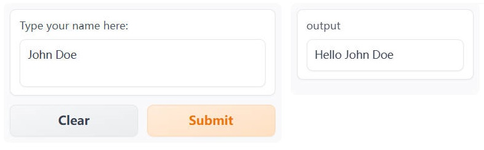

在这里，我们创建了一个带有标签、占位符和固定行数的输入文本框。你可以对输出文本框做同样的操作，但我们现在先不管它。

我们已经看到，只需几行代码，Gradio 就能让你围绕任何函数创建一个简单的界面，无论它有什么样的输入或输出。在本节中，我们从一个简单的文本框开始，但在接下来的节中，我们将介绍其他类型的输入和输出。现在让我们看一下如何在 Gradio 应用中包含一些自然语言处理（NLP）。

### 🤖 在Gradio 中使用模型进行预测 

现在让我们构建一个简单的界面，让你可以演示像 GPT-2 这样的**文本生成**模型。

我们将使用 Transformers 中的 `pipeline()` 函数加载我们的模型。
如果你需要快速复习，你可以返回到第二章。

首先，我们定义一个预测函数，它接收一个文本提示并返回文本完成的结果：

```python
from transformers import pipeline

model = pipeline("text-generation")

def predict(prompt):
    completion = model(prompt)[0]["generated_text"]
    return completion
```

此函数完成你提供的提示，你可以使用自己的输入提示运行它以查看它是如何运行的。这是一个示例（你可能会得到不同的输出）：

```python
predict("My favorite programming language is")
```

```python
>> My favorite programming language is Haskell. I really enjoyed the Haskell language, but it doesn't have all the features that can be applied to any other language. For example, all it does is compile to a byte array.
```

现在我们有了一个生成预测的函数，我们可以像之前一样创建和启动一个 `Interface` ：

```python
import gradio as gr

gr.Interface(fn=predict, inputs="text", outputs="text").launch()
```

就是这样！你现在可以使用此接口使用 GPT-2 模型生成文本，如下所示 🤯：


继续阅读以了解如何使用 Gradio 构建其他类型的演示！

## 10.2 了解 `Interface` 类

在这一节中，我们将更详细地了解 `Interface` 类，并理解创建 `Interface` 时使用的主要参数。

### 如何创建 `Interface`

你会注意到 `Interface` 类有 3 个必需参数： `Interface(fn, inputs, outputs, ...)` 

这些参数是：

- `fn` ：由 Gradio 包装的预测函数。该函数可以接受一个或多个参数并返回一个或多个值
- `inputs` ：输入组件类型。Gradio 提供了许多预构建的组件，例如 `image` 或 `mic` 。
- `outputs` ：输出组件类型。同样，Gradio 提供了许多预构建的组件，例如 `image` 或 `label` 。

有关组件的完整列表请参阅 [Gradio 文档](https://gradio.app/docs)(https://gradio.app/docs) 。每个预构建的组件都可以通过实例化该组件对应的类来定制。

例如，正如我们在前一小节中看到的，你可以将一个 `Textbox(lines=7, label="Prompt")` 组件传递给 `inputs` 参数，而不是将 `"textbox"` 传递进去，这样就可以创建一个包含 7 行和一个标签的文本框。

让我们看另一个例子，这次是一个 `Audio` 组件。

### 一个带音频的简单示例

如前所述，Gradio 提供了许多不同的输入和输出组件。因此，让我们构建一个适用于音频的 `Interface` 。

在这个例子中，我们将构建一个音频到音频的函数，它需要一个音频文件并简单地反转它。

我们将使用 `Audio` 组件作为输入。使用 `Audio` 组件时，你可以指定希望音频的 `source` 是用户上传的文件还是用户录制声音的麦克风。在个例子中，让我们将其设置为“麦克风”。只是为了好玩，我们会在我们的 `Audio` 上添加一个标签，上面写着“Speak here.”。

此外，我们希望将音频作为 numpy 数组接收，以便我们可以轻松地“反转”它。所以我们将 `"type"` 设置为 `"numpy"` ，它会传递输入 data 作为 `(sample_rate,data)` 的元组进入我们的函数。

我们还将使用 `Audio` 输出组件，它可以自动将具有采样率和音频数据的 numpy 数组渲染为可播放的音频文件。在这种情况下，我们不需要进行任何自定义，所以我们将传递一个字符串 `"audio"` 。

```python
import numpy as np
import gradio as gr

def reverse_audio(audio):
    sr, data = audio
    reversed_audio = (sr, np.flipud(data))
    return reversed_audio

mic = gr.Audio(source="microphone", type="numpy", label="Speak here...")
gr.Interface(reverse_audio, mic, "audio").launch()
```

上面的代码将生成一个如下所示的界面：


现在你可以录制你的声音并听到自己说话的倒放了 - 神奇 👻！

### 处理多个输入和输出

假设我们有一个更复杂的函数，有多个输入和输出。在下面的示例中，我我们有一个函数，它接收一个下拉框索引、一个滑块值和一个数字，并返回一个音乐音调的音频样本。

看看我们如何传递输入和输出组件列表，看看你能不能理解正在发生的事情。

关键在于当你传递：

* 输入组件列表，每个组件依次对应一个参数。
* 输出组件列表，每个组件对应一个返回值。

下面的代码片段显示了三个输入组件如何与 `generate_tone()` 函数的三个参数对齐：

```python
import numpy as np
import gradio as gr

notes = ["C", "C#", "D", "D#", "E", "F", "F#", "G", "G#", "A", "A#", "B"]

def generate_tone(note, octave, duration):
    sr = 48000
    a4_freq, tones_from_a4 = 440, 12 * (octave - 4) + (note - 9)
    frequency = a4_freq * 2 ** (tones_from_a4 / 12)
    duration = int(duration)
    audio = np.linspace(0, duration, duration * sr)
    audio = (20000 * np.sin(audio * (2 * np.pi * frequency))).astype(np.int16)
    return (sr, audio)

gr.Interface(
    generate_tone,
    [
        gr.Dropdown(notes, type="index"),
        gr.Slider(minimum=4, maximum=6, step=1),
        gr.Textbox(type="text", value=1, label="Duration in seconds"),
    ],
    "audio",
).launch()
```

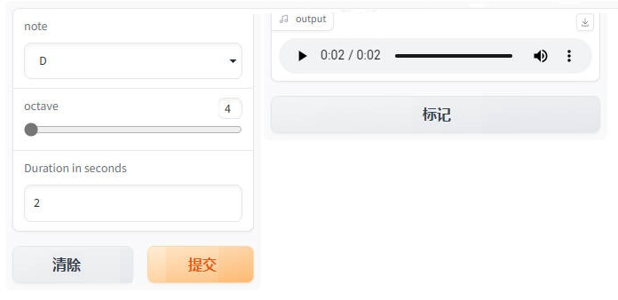

#### `launch()` 方法

到目前为止，我们已经使用了 `launch()` 方法来启动界面，但是我们
还没有真正讨论过它的作用。

默认情况下， `launch()` 方法将在本地运行一个 Web 服务器来启动演示。如果你在 Jupyter 或 Colab Notebook 中运行代码，那么 Gradio 会将演示 GUI 嵌入到 Notebook 中，以便你轻松使用它。

你可以通过不同的参数自定义 `launch()` 的行为：

  - `inline` ——  是否在 Python Notebook 中内联显示接口。
  - `inbrowser` —— 是否在默认浏览器的新标签页中自动启动接口．
  - `share` ——  是否为接口从你的计算机创建一个公开可共享的链接。有点像 Google Drive 的链接！

我们将在下一节中更详细地介绍 `share` 参数！

### ✏️ 让我们实践一下！

让我们构建一个演示语音识别模型的界面。为了让它变得有趣，我们将接受麦克风输入或上传的文件。

像往常一样，我们将使用 Transformers 中的 `pipeline()` 函数加载我们的语音识别模型。如果你需要快速复习回顾，你可以返回第二章。接下来，我们将实现一个 `transcribe_audio()` 函数来处理音频并返回转录。最后，我们将把这个函数包装在一个 `Interface` 中，其中 `Audio` 组件用于输入，只有文本用于输出。总而言之，此应用程序的代码如下：

```python
from transformers import pipeline
import gradio as gr

model = pipeline("automatic-speech-recognition")

def transcribe_audio(mic=None, file=None):
    if mic is not None:
        audio = mic
    elif file is not None:
        audio = file
    else:
        return "You must either provide a mic recording or a file"
    transcription = model(audio)["text"]
    return transcription

gr.Interface(
    fn=transcribe_audio,
    inputs=[
        gr.Audio(source="microphone", type="filepath", optional=True),
        gr.Audio(source="upload", type="filepath", optional=True),
    ],
    outputs="text",
).launch()
```

上面的代码将生成一个如下所示的界面：

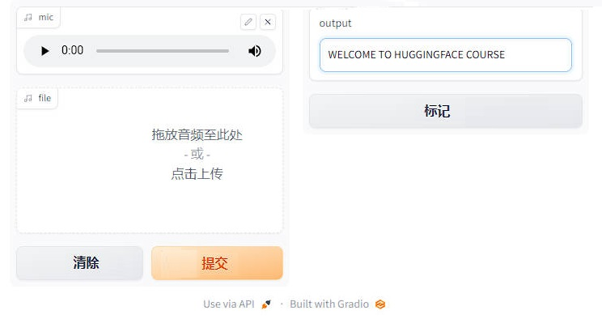

就是这样！现在你可以使用这个界面来转录音频了。请注意，通过将 `optional` 参数设置为 `True` ，用户就可以提供麦克风的实时录音或音频文件（或两者都不提供，但这将返回错误消息）。

继续阅读，了解如何与他人分享你的接口！

## 10.3 与他人分享演示 

现在你已经构建了一个演示，你可能希望与其他人分享它。Gradio 演示可以通过两种方式进行分享：使用 **临时共享链接** 或 **在 Spaces 上永久托管**。

我们将很快介绍这两种方法。但在分享演示之前，你可能需要完善它 💅。

#### 打磨你的 Gradio 演示：

为了给你的演示添加额外的内容， `Interface` 类支持一些可选参数：

- `title` ：你可以给你的演示一个标题，它出现在输入和输出组件的上方。
- `description` ：你可以为界面提供描述（以文本、Markdown 或 HTML 形式），显示在输入和输出组件的上方和标题下方。
- `article` ：你还可以编写扩展文章（以文本、Markdown 或 HTML 形式）来解释界面。如果提供，它会出现在输入和输出组件的下方。
- `theme` ：不喜欢默认颜色？主题可以设置为 `default` 、 `huggingface` 、 `grass` 、 `peach` 之一。你还可以添加 `dark-` 前缀，例如 `dark-peach` 用于深色主题（或者仅使用 `dark` 表示默认的深色主题）。
- `examples` ：为了让你的演示更易于使用，你可以为函数提供一些示例输入。它们出现在 UI 组件下方，可用于填充界面。示例应该作为多层的列表提供，外层列表包含每个示例，每个内层的列表包含与每个输入组件对应的输入。
- `live` ：如果你想使你的演示“实时”反馈，即每次输入更改时模型重新运行，你可以设置 `live=True` 。这对运行比较快的模型很有意义（我们将在本节末尾看到一个示例）

使用上述选项，我们得到了一个更完整的界面。运行以下代码，你可以与 Rick 和 Morty 进行对话：

```python
import os
import gradio as gr

title = "Ask Rick a Question"
description = """
<center>
The bot was trained to answer questions based on Rick and Morty dialogues. Ask Rick anything!

</center>
"""

article = "Check out [the original Rick and Morty Bot](https://huggingface.co/spaces/kingabzpro/Rick_and_Morty_Bot) that this demo is based off of."

from transformers import AutoModelForCausalLM, AutoTokenizer
import torch

tokenizer = AutoTokenizer.from_pretrained("ericzhou/DialoGPT-Medium-Rick_v2")
model = AutoModelForCausalLM.from_pretrained("ericzhou/DialoGPT-Medium-Rick_v2")

def predict(input):
    # 对新输入的句子 tokenize 
    new_user_input_ids = tokenizer.encode(input + tokenizer.eos_token, return_tensors='pt')

    # 生成一个回答 
    history = model.generate(new_user_input_ids, max_length=1000, pad_token_id=tokenizer.eos_token_id).tolist()

    # 将 token 转换为文本，然后将回答拆分为正确的格式
    response = tokenizer.decode(history[0]).split("<|endoftext|>")
    return response[1]

gr.Interface(fn = predict, inputs = ["textbox"], outputs = ["text"],allow_flagging = "manual",title = title, description = description, article = article, theme="dark-huggingface", examples=[["What are you doing?"], ["Where should we time travel to?"]] ).launch(debug=True) 
```

使用上面的选项，我们最终得到了一个更完整的界面。试试下面的界面：


#### 使用临时链接分享你的演示 

现在我们已经有了机器学习模型的工作演示，让我们学习如何轻松共享指向我们界面的链接。
通过在 `launch()` 方法中设置 `share=True` 可以轻松地公开共享接口：

```python
gr.Interface(classify_image, "image", "label").launch(share=True)
```

这会生成一个公开的、可共享的链接，你可以将其发送给任何人！当你发送此链接时，另一方的用户可以在浏览器中试用该模型，时间长达 72 小时。因为处理发生在你的设备上（只要你的设备保持开启！），你不必担心打包任何依赖项。如果你使用 Google Colab 笔记本工作，则始终会自动创建共享链接。它通常看起来像这样：**XXXXX.gradio.app**。虽然链接是通过 Gradio 链接提供的，但我们只是你本地服务器的代理，不会存储通过接口发送的任何数据。

但是请记住，这些链接是可公开访问的，这意味着任何人都可以使用你的模型进行预测！因此，请确保不要使用你编写的函数公开任何敏感信息，也不要允许其中的代码对你的设备进行任何重要更改。如果设置 `share=False` （默认值），则仅创建本地链接。

#### 在 Hugging Face Spaces 上托管你的演示 

可以传递给同事的共享链接很酷，但是如何永久托管你的演示并使其在互联网上具有自己的“space”呢？

Hugging Face Spaces 提供了在互联网上永久托管你的 Gradio 模型的基础设施，**完全免费**！你可以将你创建 Space 推送到（公共或私有）仓库，在其中，你的 Gradio 界面代码将存在于一个 `app.py` 文件中。 [阅读分步教程](https://huggingface.co/blog/gradio-spaces)(https://huggingface.co/blog/gradio-spaces) 以开始使用。

### ✏️ 让我们实现它！

使用到目前为止我们在各节中学到的知识，让我们创建我们在本章第一节中看到的草图识别演示。让我们为我们的界面添加一些自定义并设置 `share=True` 以创建一个我们可以传递的公共链接。

根据我们在前面章节中学到的内容，让我们创建一个在本章第一节中看到的手写草图识别演示。我们可以对界面进行一些自定义，并设置 `share=True` 以创建一个可以共享给他人的公共链接。

我们可以从 [class_names.txt](https://huggingface.co/spaces/dawood/Sketch-Recognition/blob/main/class_names.txt)(https://huggingface.co/spaces/dawood/Sketch-Recognition/blob/main/class_names.txt) 加载标签，并从 [pytorch_model.bin](https://huggingface.co/spaces/dawood/Sketch-Recognition/blob/main/pytorch_model.bin)(https://huggingface.co/spaces/dawood/Sketch-Recognition/blob/main/pytorch_model.bin) 加载预训练的 pytorch 模型。通过点击链接并单击文件预览左上角的下载来下载这些文件。让我们看看下面的代码，看看我们如何使用这些文件来加载模型并创建一个 `predict()` 函数：
```python
from pathlib import Path
import torch
import gradio as gr
from torch import nn

LABELS = Path("class_names.txt").read_text().splitlines()

model = nn.Sequential(
    nn.Conv2d(1, 32, 3, padding="same"),
    nn.ReLU(),
    nn.MaxPool2d(2),
    nn.Conv2d(32, 64, 3, padding="same"),
    nn.ReLU(),
    nn.MaxPool2d(2),
    nn.Conv2d(64, 128, 3, padding="same"),
    nn.ReLU(),
    nn.MaxPool2d(2),
    nn.Flatten(),
    nn.Linear(1152, 256),
    nn.ReLU(),
    nn.Linear(256, len(LABELS)),
)
state_dict = torch.load("pytorch_model.bin", map_location="cpu")
model.load_state_dict(state_dict, strict=False)
model.eval()

def predict(im):
    x = torch.tensor(im, dtype=torch.float32).unsqueeze(0).unsqueeze(0) / 255.0
    with torch.no_grad():
        out = model(x)
    probabilities = torch.nn.functional.softmax(out[0], dim=0)
    values, indices = torch.topk(probabilities, 5)
    return {LABELS[i]: v.item() for i, v in zip(indices, values)}
```

现在我们有了一个 `predict()` 函数。下一步是定义并启动我们的 gradio 界面：

```python
interface = gr.Interface(
    predict,
    inputs="sketchpad",
    outputs="label",
    theme="huggingface",
    title="Sketch Recognition",
    description="Who wants to play Pictionary? Draw a common object like a shovel or a laptop, and the algorithm will guess in real time!",
    article="<p style='text-align: center'>Sketch Recognition | Demo Model</p>",
    live=True,
)
interface.launch(share=True)
```

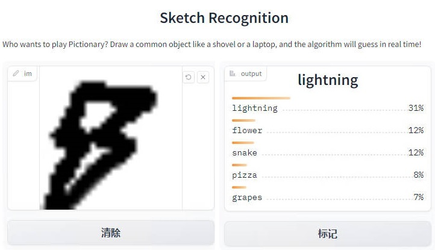

注意 `Interface` 中设置了 `live=True` 参数，这意味着每当有人在画板上绘制时，草图演示都会进行预测（无需提交按钮！）。

此外，我们还在 `launch()` 方法中设置了 `share=True` 参数。这将创建一个公共链接，你可以发送给任何人！当你发送此链接时，对方可以尝试草图识别模型。重申一下，你还可以在 Hugging Face Spaces 上托管模型，这就是我们在网页上面演示的方式。

接下来，我们将介绍 Gradio 可用于 Hugging Face 生态系统的其他方式！

## 10.4 与 Hugging Face Hub 集成 

为了让使用模型更轻松，Gradio 直接与 Hugging Face Hub 和 Hugging Face Spaces 集成。你可以仅使用一行代码从 Hub 和 Spaces 加载演示。

#### 从 Hugging Face Hub 加载模型 

首先，在第五章中所述的 Hugging Face 提供的数千个模型中选择一个。

使用特殊的 `Interface.load()` 方法，你可以传递 `"model/"` （或等效的 `"huggingface/"` ） 后跟模型名称。例如，下面的代码是使用 [GPT-J](https://huggingface.co/EleutherAI/gpt-j-6B)(https://huggingface.co/EleutherAI/gpt-j-6B) 构建的一个演示，它是一个大型语言模型，添加了一些示例输入：

```python
import gradio as gr

title = "GPT-J-6B"
description = "Gradio Demo for GPT-J 6B, a transformer model trained using Ben Wang's Mesh Transformer JAX. 'GPT-J' refers to the class of model, while '6B' represents the number of trainable parameters. To use it, simply add your text, or click one of the examples to load them. Read more at the links below."
article = "<p style='text-align: center'><a href='https://github.com/kingoflolz/mesh-transformer-jax' target='_blank'>GPT-J-6B: A 6 Billion Parameter Autoregressive Language Model</a></p>"
examples = [
    ["The tower is 324 metres (1,063 ft) tall,"],
    ["The Moon's orbit around Earth has"],
    ["The smooth Borealis basin in the Northern Hemisphere covers 40%"],
]
gr.Interface.load(
    "huggingface/EleutherAI/gpt-j-6B",
    inputs=gr.Textbox(lines=5, label="Input Text"),
    title=title,
    description=description,
    article=article,
    examples=examples,
    enable_queue=True,
).launch()
```

上述代码将生成以下界面：


以这种方式加载模型使用的是 Hugging Face 的 [Inference API](https://huggingface.co/inference-api)(https://huggingface.co/inference-api) ，而不是将模型加载到内存中。这对于像 GPT-J 或 T0pp 这样需要大量 RAM 的大型模型是最理想的方式。

#### 从 Hugging Face Spaces 空间加载 

要从 Hugging Face Hub 加载并在本地重新创建任何 Space，你可以将 `spaces/` 传递给 `Interface` ，然后跟上 Space 的名称。

还记得第 1 节中删除图像背景的演示吗？让我们从 Hugging Face Spaces 加载它：

```python
gr.Interface.load("spaces/yaoqi/bg-remove-Anime").launch()
```


从Hub 或 Spaces 加载演示的一个很酷的地方是，你可以通过覆盖任何参数来进行一些自定义的调整。在这里，我们添加一个标题并将输入改为了网络摄像头：

```python
import gradio as gr
import huggingface_hub
import onnxruntime as rt
import numpy as np
import cv2

def get_mask(img, s=1024):
    img = (img / 255).astype(np.float32)
    h, w = h0, w0 = img.shape[:-1]
    h, w = (s, int(s * w / h)) if h > w else (int(s * h / w), s)
    ph, pw = s - h, s - w
    img_input = np.zeros([s, s, 3], dtype=np.float32)
    img_input[ph // 2:ph // 2 + h, pw // 2:pw // 2 + w] = cv2.resize(img, (w, h))
    img_input = np.transpose(img_input, (2, 0, 1))
    img_input = img_input[np.newaxis, :]
    mask = rmbg_model.run(None, {'img': img_input})[0][0]
    mask = np.transpose(mask, (1, 2, 0))
    mask = mask[ph // 2:ph // 2 + h, pw // 2:pw // 2 + w]
    mask = cv2.resize(mask, (w0, h0))[:, :, np.newaxis]
    return mask

def rmbg_fn(img):
    mask = get_mask(img)
    img = (mask * img + 255 * (1 - mask)).astype(np.uint8)
    mask = (mask * 255).astype(np.uint8)
    img = np.concatenate([img, mask], axis=2, dtype=np.uint8)
    mask = mask.repeat(3, axis=2)
    return img

if __name__ == "__main__":
    providers = ['CUDAExecutionProvider', 'CPUExecutionProvider']
    model_path = huggingface_hub.hf_hub_download("skytnt/anime-seg", "isnetis.onnx")
    rmbg_model = rt.InferenceSession(model_path, providers=providers)
    app = gr.Blocks()
    with app:
        gr.Markdown("# Anime Remove Background\n\n"
                    "fork from [skytnt/anime-remove-background](https://huggingface.co/spaces/skytnt/anime-remove-background)\n")
        with gr.Row():
            with gr.Column():
                input_img = gr.Image(label="input image",source='webcam')
                run_btn = gr.Button(variant="primary")
            output_img = gr.Image(label="result", image_mode="RGBA")
        run_btn.click(rmbg_fn, [input_img], [ output_img])
    app.launch()
```


现在我们已经探索了一些将 Gradio 与 hugs Face Hub 集成的方法，让我们来看看 `Interface` 类的一些高级功能。这就是下一节的主题！

## 10.5 Interface 的高级功能 

现在我们已经能够构建和共享基本界面，让我们来探索一些更高级的功能，比如状态和解释。

#### 使用状态保存数据 

Gradio 支持会话状态，在页面加载期间跨多次提交保留数据。会话状态对于构建聊天机器人等需要在用户与模型交互时保持数据的演示非常有用。请注意，会话状态不会在不同用户之间共享数据。

要将数据存储在会话状态中，你需要做三件事：

1. 向函数中传递一个额外的参数，该参数表示接口的状态。
2. 在函数结束时，将状态的更新值作为额外的返回值返回。
3. 在创建 `Interface` 时添加 `state` 输入和 `state` 输出组件。

请参考下面的聊天机器人示例：

```python
import random

import gradio as gr

def chat(message, history):
    history = history or []
    if message.startswith("How many"):
        response = random.randint(1, 10)
    elif message.startswith("How"):
        response = random.choice(["Great", "Good", "Okay", "Bad"])
    elif message.startswith("Where"):
        response = random.choice(["Here", "There", "Somewhere"])
    else:
        response = "I don't know"
    history.append((message, response))
    return history, history

iface = gr.Interface(
    chat,
    ["text", "state"],
    ["chatbot", "state"],
    allow_screenshot=False,
    allow_flagging="never",
)
iface.launch()
```


请注意，输出组件的状态在多次提交之间保持不变。
注：你可以向状态参数传递一个默认值，该值将用作状态的初始值。

#### 通过解释来理解预测 

大多数机器学习模型都是黑盒子，函数的内部逻辑对终端用户是隐藏的。为了提高透明度，我们设计了一个功能使得为模型添加解释非常简单，只需将 Interface 类中的 interpretation 关键字设置为 `default` 即可。这样，你的用户就可以理解输入的哪些部分对输出有影响。请看下面的简单界面示例，它显示了一个带有解释功能的图像分类器：

```python
import requests
import tensorflow as tf

import gradio as gr

inception_net = tf.keras.applications.MobileNetV2()  # 加载模型

# 下载 ImageNet 的可读标签
response = requests.get("https://git.io/JJkYN")
labels = response.text.split("\n")

def classify_image(inp):
    inp = inp.reshape((-1, 224, 224, 3))
    inp = tf.keras.applications.mobilenet_v2.preprocess_input(inp)
    prediction = inception_net.predict(inp).flatten()
    return {labels[i]: float(prediction[i]) for i in range(1000)}

image = gr.Image(shape=(224, 224))
label = gr.Label(num_top_classes=3)

title = "Gradio Image Classifiction + Interpretation Example"
gr.Interface(
    fn=classify_image, inputs=image, outputs=label, interpretation="default", title=title
).launch()
```


提交一个输入，然后单击输出组件下的 Interpret 来测试解释功能。

除了 Gradio 提供的默认解释方法之外，你还可以在 `interpretation` 参数中指定 `shap` ，并设置 `num_shap` 参数。这将使用基于 Shapley 的解释方法，你可以在 [这里](https://christophm.github.io/interpretable-ml-book/shap.html)(https://christophm.github.io/interpretable-ml-book/shap.html) 阅读更多信息。最后，还可以将自己的解释函数传入 `interpretation` 参数。在 Gradio 的 [入门页面](https://gradio.app/getting_started/)(https://gradio.app/getting_started/) 中可以看到一个例子。

这就是我们对 Gradio 的 `Interface` 类的深入研究。正如我们所看到的，这个类使得用几行 Python 代码创建机器学习演示变得简单。然而，有时你会想通过改变布局或将多个预测函数链接在一起来定制你的 demo。如果我们能以某种方式将 `Interface` 拆分可定制的 “块”，那不是很好吗？幸运的是，我们可以做到！这是最后一节的主题。

## 10.6 Gradio Blocks 简介 

在之前的章节中，我们已经探索并使用 `Interface` 类创建了一些演示。在本章中，我们将介绍我们新开发的低级 API，名为 `gradio.Blocks` 。

现在， `Interface` 和 `Blocks` 之间有什么区别？

- ⚡ `Interface` ：一个高级 API，你只需提供输入和输出列表即可创建完整的机器学习演示。

- 🧱 `Blocks` ：一个低级的 API，你可以使用它来完全控制你的应用程序的数据流和布局。你可以使用 `Blocks` （类似于“构建的砖块”）构建非常复杂的多步骤应用程序。

#### 为什么要使用 Blocks 🧱？

正如我们在前几节中看到的，通过 `Interface` 类你使用几行代码轻松创建成熟的机器学习 demo。 `Interface` API 非常易于使用，但缺乏 `Blocks` API 提供的灵活性。例如，你可能想要：

- 将相关演示组合为一个 web 应用程序中的多个选项卡
- 更改 demo 的布局，例如指定输入和输出的位置
- 创建多步骤界面，其中一个模型的输出成为下一个模型的输入，或者通常具有更灵活的数据流
- 根据用户输入更改组件的属性 （例如，下拉列表中的选项） 或其可见性

我们将在下面探讨所有这些概念。

#### 使用块创建简单 demo 

安装 Gradio 后，将在 Python 脚本、Jupyter 笔记本或 Colab 笔记本运行下面的代码。

```python
import gradio as gr

def flip_text(x):
    return x[::-1]

demo = gr.Blocks()

with demo:
    gr.Markdown(
        """
    # Flip Text!
    Start typing below to see the output.
    """
    )
    input = gr.Textbox(placeholder="Flip this text")
    output = gr.Textbox()

    input.change(fn=flip_text, inputs=input, outputs=output)

demo.launch()
```


上述简单示例介绍了块的 4 个基本概念：

1. 通过在 `with gradio.Blocks` 上下文中实例化 Python 对象，Blocks 支持构建组合了 markdown、HTML、按钮和交互式组件的 Web 应用程序。
<div custom-style="Tip-green">

🙋如果你不熟悉 Python 中的 `with` 语句，我们建议你查看来自 Real Python 优秀的 [教程](https://realpython.com/python-with-statement)(https://realpython.com/python-with-statement) 后再回来查看。
</div>
实例化组件的顺序很重要，因为每个元素都按照创建的顺序渲染到 Web 应用程序中。（更复杂的布局将在下面讨论）

2. 你可以在代码中的任何位置定义常规 Python 函数，并指定 `Blocks` 在用户输入的情况下运行它们。在我们的示例中，我们使用了一个可以“翻转”输入的文本简单的函数，但你可以编写任何 Python 函数，从简单的计算到处理来自机器学习模型的预测等。

3. 你可以将事件指定给任何 `Blocks` 组件。这将在组件被单击、更改等情况下运行函数。当你分配一个事件时，你需要传入三个参数： `fn` ：应该被调用的函数， `inputs` ：输入组件（列表），以及 `outputs` ：应该被调用的输出组件（列表）。

   在上面的示例中，当名为 `input` 的 `Textbox` 中的值发生变化时，我们运行 `flip_text()` 函数。该事件读取 `input` 中的值，将其作为名称参数传递给 `flip_text()` ，然后它返回一个值，该值被分配给我们的第二个名为 `output` 的 `Textbox` 。

   要查看每个组件支持的事件列表，请参阅 Gradio [文档](https://www.gradio.app/docs)(https://www.gradio.app/docs) 。

4. Blocks 会根据你定义的事件触发器自动确定组件是否应该是交互式的 （接受用户输入）。在我们的示例中，第一个文本框是交互式的，因为它的值被 `flip_text()` 函数使用。第二个文本框不是交互式的，因为它的值从未用作输入。在某些情况下，你可能想要覆盖自动的判断，你可以通过传递一个布尔值给组件的 `interactive` 参数（例如 `gr.Textbox(placeholder="Flip this text", interactive=True)` ）。

#### 自定义演示的布局 

我们如何使用 `Blocks` 来定制我们的演示的布局？默认情况下， `Blocks` 在一列中垂直呈现创建的组件。你可以通过使用 `with gradio.Column():` 创建其他列或使用 `with gradio.Row():` 创建其他行，并且还可以在这些上下文中创建组件来更改布局。

你应该记住：在 `Column` 下创建的任何组件（这也是默认设置） 都将垂直布局。在 `Row` 下创建的任何组件都将水平布局，类似于 [Web 开发中的 flexbox 模型](https://developer.mozilla.org/en-US/docs/Web/CSS/CSS_Flexible_Box_Layout/Basic_Concepts_of_Flexbox)(https://developer.mozilla.org/en-US/docs/Web/CSS/CSS_Flexible_Box_Layout/Basic_Concepts_of_Flexbox) 。

最后，你还可以使用 `with gradio.Tabs()` 上下文管理器为你的 demo 创建选项卡。在此上下文中，你可以通过使用 `gradio.TabItem(name_of_tab):` 指定来创建多个选项卡。在 `gradio.TabItem(name_of_tab):` 中创建的任何组件都会出现在该选项卡中。

现在让我们在 demo 中添加一个 `flip_image()` 函数并添加一个翻转图像的新选项卡。下是具有 2 个选项卡并使用了一个 Row 的示例：

```python
import numpy as np
import gradio as gr

demo = gr.Blocks()

def flip_text(x):
    return x[::-1]

def flip_image(x):
    return np.fliplr(x)

with demo:
    gr.Markdown("Flip text or image files using this demo.")
    with gr.Tabs():
        with gr.TabItem("Flip Text"):
            with gr.Row():
                text_input = gr.Textbox()
                text_output = gr.Textbox()
            text_button = gr.Button("Flip")
        with gr.TabItem("Flip Image"):
            with gr.Row():
                image_input = gr.Image()
                image_output = gr.Image()
            image_button = gr.Button("Flip")

    text_button.click(flip_text, inputs=text_input, outputs=text_output)
    image_button.click(flip_image, inputs=image_input, outputs=image_output)

demo.launch()
```


你会注意到，在这个示例中，我们还在每个选项卡中创建了一个 `Button` 组件，并且我们为每个按钮分配了一个点击事件，这是实际是运行了该事件对应的函数。

#### 探索事件和状态 

正如你可以控制布局一样， `Blocks` 可以让你对触发函数调用的事件进行细粒度控制。每个组件和许多布局都有它们支持的特定事件。

例如， `Textbox` 组件有两个事件： `change()` （当文本框内的值发生变化时），和 `submit()` （当用户在文本框上输入并按下回车键时）。更复杂的组件可以有更多的事件：例如， `Audio` 组件还具有播放音频文件、清除音频文件、暂停等各种独立事件。请参阅每个组件支持的事件的文档。

你可以将事件触发器附加到这些事件中的一个、多个或全部。你可以通过在组件实例中调用事件名称作为函数来创建一个事件触发器 —— 例如 `textbox.change(...)` 或 `btn.click(...)` 。如前所述，该函数接受三个参数：

- `fn` ：要运行的函数
- `inputs` ：应作为函数的输入参数提供的组件（列表）。每个组件的值按顺序映射到相应的函数参数。如果函数不带任何参数，则此参数可以为 None。
- `outputs` ：应根据函数返回的值更新的组件（列表）。每个返回值按顺序设置相应组件的值。如果函数不返回任何内容，则此参数可以为 None。

你甚至可以使输入和输出组件成为同一个组件，就像我们在这个使用 GPT 模型进行文本补全的示例中所做的那样：

```python
import gradio as gr

api = gr.Interface.load("huggingface/EleutherAI/gpt-j-6B")

def complete_with_gpt(text):
    # 使用文本的最后 50 个字符作为上下文
    return text[:-50] + api(text[-50:])

with gr.Blocks() as demo:
    textbox = gr.Textbox(placeholder="Type here and press enter...", lines=4)
    btn = gr.Button("Generate")

    btn.click(complete_with_gpt, textbox, textbox)

demo.launch()
```

#### 创建多步骤 demo 

在某些情况下，你可能需要一个多步骤演示，其中重用一个函数的输出作为下一个函数的输入。使用 `Blocks` 很容易做到这一点，因为你可以使用一个组件作为一个事件触发器的输入，但又作为另一个事件触发器的输出。看一下下面的示例，文本组件的值是语音转文本模型的结果，但也被传递到情感分析模型中：

```python
from transformers import pipeline

import gradio as gr

asr = pipeline("automatic-speech-recognition", "facebook/wav2vec2-base-960h")
classifier = pipeline("text-classification")

def speech_to_text(speech):
    text = asr(speech)["text"]
    return text

def text_to_sentiment(text):
    return classifier(text)[0]["label"]

demo = gr.Blocks()

with demo:
    audio_file = gr.Audio(type="filepath")
    text = gr.Textbox()
    label = gr.Label()

    b1 = gr.Button("Recognize Speech")
    b2 = gr.Button("Classify Sentiment")

    b1.click(speech_to_text, inputs=audio_file, outputs=text)
    b2.click(text_to_sentiment, inputs=text, outputs=label)

demo.launch()
```

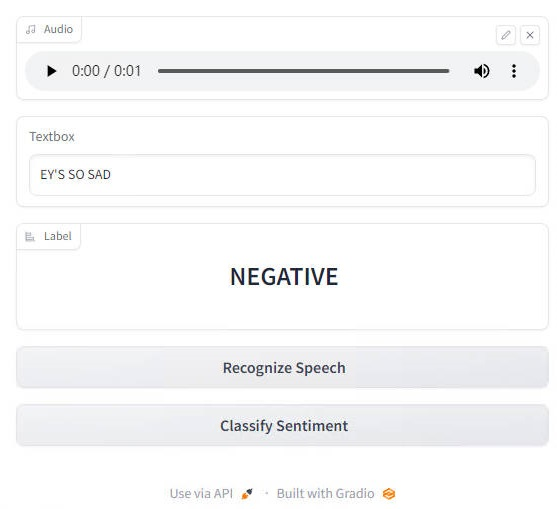

#### 更新组件属性 

到目前为止，我们已经了解了如何创建事件来更新另一个组件的值。但是，如果你想更改组件的其他属性，例如文本框的可见性或单选按钮组中的选项，又该怎么办呢？你可以通过返回组件类的 `update()` 方法而不是函数的常规返回值来做到这一点。

这很容易用一个例子来说明：

```python
import gradio as gr

def change_textbox(choice):
    if choice == "short":
        return gr.Textbox.update(lines=2, visible=True)
    elif choice == "long":
        return gr.Textbox.update(lines=8, visible=True)
    else:
        return gr.Textbox.update(visible=False)

with gr.Blocks() as block:
    radio = gr.Radio(
        ["short", "long", "none"], label="What kind of essay would you like to write?"
    )
    text = gr.Textbox(lines=2, interactive=True)

    radio.change(fn=change_textbox, inputs=radio, outputs=text)
    block.launch()
```


我们刚刚探索了 `Blocks` 的所有核心概念！就像 `Interfaces` 一样 你可以创建很酷的 demo，可以通过在 `launch()` 方法中使用 `share=True` 选项来共享，或者部署在 [Hugging Face Spaces](https://huggingface.co/spaces)(https://huggingface.co/spaces) 上。

## 10.7 Gradio，回顾！

关于使用 Gradio 构建酷炫的 ML 演示的章节到此结束 —— 希望你会喜欢！回顾一下，在本章中，我们学习了：

- 如何使用高级 `Interface` API 创建 Gradio 演示，以及如何配置不同的输入和输出模式。
- 使用临时链接或者托管在 [Hugging Face Spaces](https://huggingface.co/spaces)(https://huggingface.co/spaces) 上共享 Gradio 演示。
- 如何将 Gradio 演示与 Hugging Face Hub 上的 Model 和 Space 集成在一起。
- 高级功能，例如在演示中存储状态或提供身份验证等高级功能。
- 如何使用 Gradio Blocks 完全控制演示的数据流和布局。

如果你想测试你对本章所涵盖概念的理解，请查看下一节中的测验！

### 下一步去哪里？

如果你想了解有关 Gradio 的更多信息，你可以

- 看看仓库中的 [Demos](https://github.com/gradio-app/gradio/tree/main/demo)(https://github.com/gradio-app/gradio/tree/main/demo) ，那里有很多例子。
- 请参阅 [指南](https://gradio.app/guides)(https://gradio.app/guides) 页面，你可以在其中找到有关酷炫和高级功能的指南。
- 查看 [文档](https://gradio.app/docs)(https://gradio.app/docs) 页面了解详细信息。

### 章末测试 

####  1. 你能使用Gradio做什么？

1. 为自己的机器学习模型创建一个demo
2. 与他人分享你的机器学习模型
3. 调试模型
4. 训练你的模型

####  2. Gradio只能在 PyTorch 模型上工作

1. 正确
2. 不正确

####  3. 可以在哪里发布一个 Gradio 演示？

1. 标准的 python IDEs
2. Google Colab notebooks
3. Jupyter notebooks

####  4. Gradio 主要是为 NLP 模型设计的

1. 正确
2. 错误

####  5. 下列哪些特性是由 Gradio 支持的？

1. 多输入多输出
2. 数据持久性状态
3. 用户名和密码身份验证
4. 自动分析谁在使用你的 Gradio 演示
5. 从 HuggingFace 的模型中心或 HuggingFace Space 加载模型

####  6. 下列哪一种是从 Hub 或 Spaces 加载 Huggging Face 模型的有效方法？

1. `gr.Interface.load('huggingface/{user}/{model_name}')`
2. `gr.Interface.load('model/{user}/{model_name}')`
3. `gr.Interface.load('demos/{user}/{model_name}')`
4. `gr.Interface.load('spaces/{user}/{model_name}')`

####  7. 创建你的 Gradio 接口时，必须添加以下步骤：

1. 向预测函数中传入一个额外的参数，该参数表示接口的状态。
2. 在预测函数的末尾，将状态的更新值作为额外的返回值返回。
3. 在创建接口时添加状态输入和状态输出组件

####  8. Gradio 库包括以下哪些组件？

1. 文本框。
2. 图表。
3. 图像。
4. 音频。

####  9. 你可以使用 Gradio 做些什么？

1. 将多个演示合并到一个 Web 应用程序中
2. 将单击/更改/等事件触发器分配给`Blocks`组件
3. 自动确定哪些`Blocks`组件应该是交互的还是静态的
4. 创建多步演示; 这意味着你可以重用一个组件的输出作为下一个组件的输入

####  10. 你可以共享一个`Blocks`演示的公共链接，并在HuggingFace space创建一个`Blocks`的演示。

1. 正确
2. 不正确

### 解析

####  1. 你能使用Gradio做什么？

正确选项: 1. 为自己的机器学习模型创建一个demo

正确选项: 2. 与他人分享你的机器学习模型

正确选项: 3. 调试模型

1. 为自己的机器学习模型创建一个demo    
解析: 通过几行 Python 代码，你可以使用我们的预构建组件库为 ML 模型生成一个演示。
2. 与他人分享你的机器学习模型    
解析: 在启动方法中使用 <code> share = True </code> 参数，可以生成一个共享链接发送给任何人。
3. 调试模型    
解析: Gradio的一个优点是能够用真实数据测试模型，可以实时更改并观察模型的预测变化，从而帮助你调试模型。
4. 训练你的模型    
解析: 在你的模型被训练之后，Gradio 用来进行模型推理。

####  2. Gradio只能在 PyTorch 模型上工作

正确选项: 2. 不正确

1. 正确    
解析: Gradio 可以处理 PyTorch 模型，除此之外也可以处理任何类型的机器学习模型！
2. 不正确    
解析: Gradio 是不依赖模型的，这意味着你可以为任何类型的机器学习模型创建演示。

####  3. 可以在哪里发布一个 Gradio 演示？

正确选项: 1. 标准的 python IDEs

正确选项: 2. Google Colab notebooks

正确选项: 3. Jupyter notebooks

1. 标准的 python IDEs    
解析: Gradio可以在你最喜欢的 IDE 上运行得很好。
2. Google Colab notebooks    
解析: 你可以在你的 Google colab notebook 上创建并启动一个 demo。
3. Jupyter notebooks    
解析: 很好的选择 —— 你可以在你的 Jupyter notebook 创建并启动一个 demo。

####  4. Gradio 主要是为 NLP 模型设计的

正确选项: 2. 错误

1. 正确    
解析: Gradio 几乎可以处理包括 NLP 在内的所有的数据类型。
2. 错误    
解析: Gradio 为开发人员提供了一个库，其中包含几乎所有数据类型的预构建组件。

####  5. 下列哪些特性是由 Gradio 支持的？

正确选项: 1. 多输入多输出

正确选项: 2. 数据持久性状态

正确选项: 3. 用户名和密码身份验证

正确选项: 5. 从 HuggingFace 的模型中心或 HuggingFace Space 加载模型

1. 多输入多输出    
解析: 多输入多输出是可能的。你所需要做的就是将输入和输出的列表传递给它们相应的参数
2. 数据持久性状态    
解析: 可以在界面中添加状态。
3. 用户名和密码身份验证    
解析: 将用户名/密码元组的列表传递给 `launch()` 方法，可以添加身份验证。
4. 自动分析谁在使用你的 Gradio 演示    
解析: 再试一次 —— Gradio 不提供给开发人员关于谁使用他们的演示的分析。
5. 从 HuggingFace 的模型中心或 HuggingFace Space 加载模型    
解析: 正确 —— 使用 <code>gr.Interface.load ()</code> 方法可以加载任何 Hugging Face 模型

####  6. 下列哪一种是从 Hub 或 Spaces 加载 Huggging Face 模型的有效方法？

正确选项: 1. `gr.Interface.load('huggingface/{user}/{model_name}')`

正确选项: 2.` gr.Interface.load('model/{user}/{model_name}')`

正确选项: 4. `gr.Interface.load('spaces/{user}/{model_name}')`

1. `gr.Interface.load('huggingface/{user}/{model_name}')`
解析: 这是从 Hub 加载 Hugging Face 模型的有效方法
2. `gr.Interface.load('model/{user}/{model_name}')`
解析: 这是从 Hub 加载 Hugging Face 模型的有效方法
3. `gr.Interface.load('demos/{user}/{model_name}')`    
解析: 再试一次——你不能使用'demos'前缀来加载模型。
4. `gr.Interface.load('spaces/{user}/{model_name}')`    
解析: 这是从 Space 加载 Hugging Face 模型的有效方法

####  7. 创建你的 Gradio 接口时，必须添加以下步骤：

正确选项: 1. 向预测函数中传入一个额外的参数，该参数表示接口的状态。

正确选项: 2. 在预测函数的末尾，将状态的更新值作为额外的返回值返回。

正确选项: 3. 在创建接口时添加状态输入和状态输出组件

1. 向预测函数中传入一个额外的参数，该参数表示接口的状态。    
解析: 需要一个额外的参数来存储接口的历史记录或状态。
2. 在预测函数的末尾，将状态的更新值作为额外的返回值返回。    
解析: 此历史记录或状态值需要由函数返回。
3. 在创建接口时添加状态输入和状态输出组件    
解析: Gradio 提供了一个状态输入和输出组件来持久存储数据。

####  8. Gradio 库包括以下哪些组件？

正确选项: 1. 文本框。

正确选项: 3. 图像。

正确选项: 4. 音频。

1. 文本框。    
解析: 是的，可以使用 Textbox 组件创建文本框。
2. 图表。    
解析: 目前没有图表组件。
3. 图像。    
解析: 是的，你可以使用 Image 组件创建一个图像上传小部件。
4. 音频。    
解析: 是的，你可以使用 Audio 组件创建一个音频上传小部件。

####  9. 你可以使用 Gradio 做些什么？

正确选项: 1. 将多个演示合并到一个 Web 应用程序中

正确选项: 2. 将单击/更改/等事件触发器分配给`Blocks`组件

正确选项: 3. 自动确定哪些`Blocks`组件应该是交互的还是静态的

正确选项: 4. 创建多步演示; 这意味着你可以重用一个组件的输出作为下一个组件的输入

1. 将多个演示合并到一个 Web 应用程序中    
解析: 你可以使用`with gradio.Tabs ():`来为多个演示添加选项卡
2. 将单击/更改/等事件触发器分配给`Blocks`组件    
解析: 在分配事件时，传入三个参数: fn: 应该调用的函数、inputs: 组件的输入(list)和outputs: 应该调用组件的输出(list)。
3. 自动确定哪些`Blocks`组件应该是交互的还是静态的    
解析: 根据你定义的事件触发器，`Blocks`自动计算出组件是否应该接受用户输入。
4. 创建多步演示; 这意味着你可以重用一个组件的输出作为下一个组件的输入    
解析: 你可以使用组件作为一个事件触发器的输入，但作为另一个事件触发器的输出。

####  10. 你可以共享一个`Blocks`演示的公共链接，并在HuggingFace space创建一个`Blocks`的演示。

正确选项: 1. 正确

正确选项: 2. 不正确

1. 正确    
解析: 就像`Interface`一样，所有的共享和托管功能对于`Blocks`演示都是一样的！
2. 不正确    
解析: 就像`Interface`一样，所有的共享和托管功能对于`Blocks`演示都是一样的！
