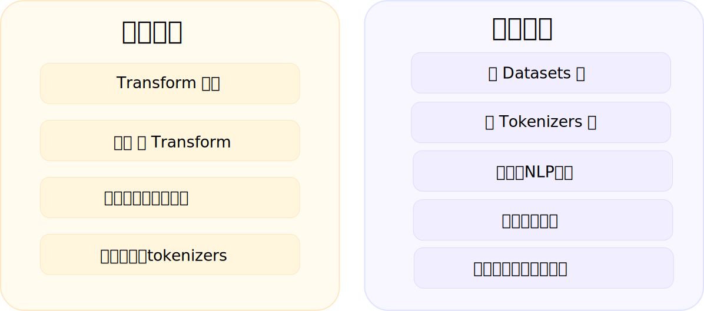

# 本章简介 [[本章简介]]

<CourseFloatingBanner
    chapter={1}
    classNames="absolute z-10 right-0 top-0"
/>

## 欢迎来到🤗课程 [[欢迎来到🤗课程]]

<Youtube id="00GKzGyWFEs" />

本书将教您如何使用 Hugging Face 生态系统的库进行自然语言处理（NLP）。这些库包括 🤗 Transformers、🤗 Datasets、🤗 Tokenizers 和 🤗 Accelerate，以及 Hugging Face Hub。

## 有什么是值得期待的？[[有什么是值得期待的？]]

以下是对本书教程内容的简要概述：



- 第 1 章到第 4 章介绍了 🤗 Transformers 库的主要概念。通过这一部分的学习，您将了解 Transformer 模型的工作原理，掌握如何使用 [Hugging Face Hub](https://huggingface.co/models) 中的模型，在数据集上对模型进行微调，同时可以在 Hub 上分享您的结果。
- 第 5 章到第 8 章介绍了 🤗 Datasets 库和 🤗 Tokenizers 库的基础知识。通过这一部分的学习，您可以独自解决最常见的 NLP 问题，为深入研究经典 NLP 任务奠定基础。
- 第 9 章介绍了如何为您的机器学习构建**交互式演示**模型，并将其优化为您自己的可分享的模型演示生产环境。

这个课程：

* 需要良好的 Python 知识 

* 在完成入门的深度学习课程后效果更佳，例如 [DeepLearning.AI](https://www.deeplearning.ai/) 提供的 [fast.ai实用深度学习教程](https://course.fast.ai/) 

* 不需要事先具备 [PyTorch](https://pytorch.org/) 或 [TensorFlow](https://www.tensorflow.org/) 知识，虽然熟悉其中任何一个都会对 huggingface 的学习有所帮助

完成本书的学习后，建议您查看 [DeepLearning.AI的自然语言处理系列课程](https://www.coursera.org/specializations/natural-language-processing?utm_source=deeplearning-ai&utm_medium=institutions&utm_campaign=20211011-nlp-2-hugging_face-page-nlp-refresh) ，该课程涵盖了诸如朴素贝叶斯和 LSTM 等传统 NLP 模型的广泛内容，非常值得了解！

## FAQ

这里有一些经常被提到的问题：

- **我应该在这门课程上花多少时间？**
本课程的每一章都设计为在 1 周内完成，每周大约需要 6-8 小时的学习时间。但您可以根据自己的需要随意安排学习时间。

- **我在哪里可以获得课程的代码？**
本书所有代码的 Jupyter 笔记本托管在 [`huggingface/notebooks`](https://github.com/huggingface/notebooks) 仓库中。如果您希望在本地生成它们，请查看 GitHub 上 [`course`](https://github.com/huggingface/course#-jupyter-notebooks) 仓库中的说明。

```
@misc{huggingfacecourse,
  author = {Hugging Face},
  title = {The Hugging Face Course, 2022},
  howpublished = "\url{https://huggingface.co/course}",
  year = {2022},
  note = "[Online; accessed <today>]"
}
```

## 让我们开始吧！[[让我们开始吧！]]

你准备好了吗？在本章中，您将学习：
* 如何使用 `pipeline()` 函数解决文本生成、分类等 NLP 任务
* 关于 Transformer 架构
* 如何区分编码器、解码器和编码器-解码器架构以及相关用例 
