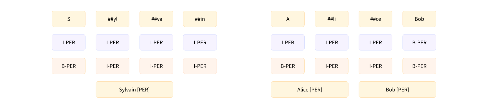
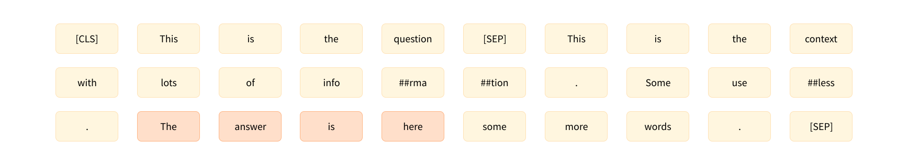

# 第七章 Tokenizers库

在第四章中，我们研究了如何在特定任务上微调模型。当我们需要微调模型时，我们需要使用与模型预训练相同的 tokenizer ——但是当我们想从头开始训练模型时该怎么办？使用在来自其他领域或语言的语料库上预训练的 tokenizer 通常不是最理想的。例如，在英语语料库上训练的 tokenizer 在日语文本语料库上效果会大打折扣，因为两种语言在空格和标点的使用上有着显著的差异。

在本章中，你将学习如何在一份文本语料库上训练一个全新的 tokenizer，然后将其用于预训练语言模型。这一切都将在 [Tokenizers](https://github.com/huggingface/tokenizers)(https://github.com/huggingface/tokenizers) 库的帮助下完成，该库提供了 [Transformers](https://github.com/huggingface/transformers)(https://github.com/huggingface/transformers) 库中的“快速” tokenizer 我们将深入探讨这个库所提供的功能，并研究“快速” tokenizer 与“慢速”版本的区别。

本章将涵盖以下主题：

* 如何在新的文本语料库上训练一个类似于给定 checkpoint 所使用的新 tokenizer
* 快速 tokenizer 的特殊功能
* 目前 NLP 中使用的三种主要子词 tokenization 算法之间的差异
* 如何使用Tokenizers 库从头开始构建 tokenizer 并在一些数据上进行训练

本章介绍的技术将使你为第八章中的部分做好准备，在那部分中，我们着眼于为 Python 源代码创建语言模型。让我们首先看一下什么是“训练” tokenizer 

## 7.1 基于已有的 tokenizer 训练新的 tokenizer 

如果你感兴趣的语言中没有可用的语言模型，或者你的语料库与语言模型训练时所使用的语料库差异很大，你可能需要从零开始重新训练一个适应你的数据的 tokenizer 模型。训练一个新的 tokenizer 是什么意思呢？当我们在第三章中第一次看到 tokenizer 时，我们看到大多数 Transformer 模型使用 `子词分词算法` 。为了找到语料库中的常见子词，tokenizer 需要深入统计语料库中的所有文本——这个过程我们称之为 `训练 （training）` 。具体的训练规则取决于使用的 tokenizer 类型，我们将在本章后面的部分详细介绍三种主要算法。

<div custom-style="Tip-yellow">

⚠️ 训练 tokenizer 与训练模型不同！模型训练使用随机梯度下降使每个 batch 的 loss 小一点。它本质上是随机的（这意味着在进行两次相同的训练时，你必须设置一些随机数种子才能获得相同的结果）。训练 tokenizer 是一个统计过程，它试图确定哪些子词最适合为给定的语料库选择，确定的过程取决于分词算法。它是确定性的，这意味着在相同的语料库上使用相同的算法进行训练时，你总是会得到相同的结果。

</div>

### 准备语料库 

在Transformers 中，有一个非常简单的 API 可以让你训练一个新的 tokenizer 且新的 tokenizer 具有和旧 tokenizer 相同的特性，它就是： `AutoTokenizer.train_new_from_iterator()` 。为了演示这个功能，假设我们想从零开始训练 GPT-2 模型，但是在非英语的语言上。我们首先需要做的就是在训练语料库中收集大量的目标语言数据。为了让每个人都能理解，我们不会使用俄语或汉语这样的语言，而是使用一种特定的英语语言：Python 代码。

 [Datasets](https://github.com/huggingface/datasets)(https://github.com/huggingface/datasets) 库可以帮助我们下载一个 Python 源代码语料库。我们将使用 `load_dataset()` 功能下载和缓存 [CodeSearchNet](https://huggingface.co/datasets/code_search_net)(https://huggingface.co/datasets/code_search_net) 数据集。该数据集是为 [CodeSearchNet 挑战](https://wandb.ai/github/CodeSearchNet/benchmark)(https://wandb.ai/github/CodeSearchNet/benchmark) 而创建的，其中包含了 GitHub 上开源库中的数百万个函数，涵盖了多种编程语言。在这里，我们将加载这个数据集的 Python 部分：
```python
from datasets import load_dataset

## 加载这个可能需要几分钟的时间,你可以趁此喝杯咖啡或茶!
raw_datasets = load_dataset("code_search_net", "python")
```

我们可以查看训练集部分来看我们可以使用哪些列：

```python
raw_datasets["train"]
```

```python
Dataset({
    features: ['repository_name', 'func_path_in_repository', 'func_name', 'whole_func_string', 'language', 
      'func_code_string', 'func_code_tokens', 'func_documentation_string', 'func_documentation_tokens', 'split_name', 
      'func_code_url'
    ],
    num_rows: 412178
})
```

我们可以看到数据集将函数的文档说明（func_documentation_string）与代码（func_code_string）分开，并为二者提供了一个分词建议（func_code_tokens）。在这里，我们仅使用 `whole_func_string` 列来训练我们的 tokenizer 我们可以通过索引来查看其中一个函数的示例：

```python
print(raw_datasets["train"][123456]["whole_func_string"])
```

应该输出以下内容：

```python
def handle_simple_responses(
      self, timeout_ms=None, info_cb=DEFAULT_MESSAGE_CALLBACK):
    """Accepts normal responses from the device.

    Args:
      timeout_ms: Timeout in milliseconds to wait for each response.
      info_cb: Optional callback for text sent from the bootloader.

    Returns:
      OKAY packet's message.
    """
    return self._accept_responses('OKAY', info_cb, timeout_ms=timeout_ms)
```

我们首先需要做的是将数据集转换为一个文本列表的 `迭代器` 例如，文本列表的列表。使用文本列表会使我们的 tokenizer 运行得更快（以文本批次为单位进行训练，而不是一次处理一个文本），并且使用迭代器可以不把所有内容都加载到内存中。如果你的语料库很大，你可能会想利用Datasets 不将所有内容加载到 RAM，而是将数据集的元素存储在磁盘上分批加载的特性。

下面的操作会创建一个由每个列包含 1000 个文本组成的文本列表，但会将所有内容加载到内存中：

```python
## 除非你的数据集很小,否则不要直接运行下面的代码!
## training_corpus = [
##     raw_datasets["train"][i: i + 1000]["whole_func_string"] 
##     for i in range(0, len(raw_datasets["train"]), 1000)
## ]
```

通过使用 Python 生成器，我们可以使 Python 只将正在使用的数据加载到内存中。要创建这样一个生成器，你只需要将方括号替换为圆括号：

```python
training_corpus = (
    raw_datasets["train"][i : i + 1000]["whole_func_string"]
    for i in range(0, len(raw_datasets["train"]), 1000)
)
```

这行代码不会加载数据集的任何元素；它只创建了一个你可以在 Python for 循环中使用的对象。只有当你使用它们（即，当你在 `for` 循环尝试访问他们）时，文本才会被加载，而且一次只会加载 1000 个文本。这样，即使你在处理大型数据集，也不会耗尽所有内存。

生成器对象的问题是它只能使用一次。让我们尝试获取 2 次前 10 个数字的列表：

```python
gen = (i for i in range(10))
print(list(gen))
print(list(gen))
```

我们第一次得到了这个列表，第二次我们得到了一个空列表：

```python
[0, 1, 2, 3, 4, 5, 6, 7, 8, 9]
[]
```

这就是为什么我们需要定义一个返回生成器的函数。通过每次调用函数生成一个新的生成器对象，我们可以多次使用生成器而不会遇到只能使用一次的限制。

```python
def get_training_corpus():
    return (
        raw_datasets["train"][i : i + 1000]["whole_func_string"]
        for i in range(0, len(raw_datasets["train"]), 1000)
    )

training_corpus = get_training_corpus()
```

你还可以在一个 `for` 循环内部使用 `yield` 关键字定义你的生成器：

```python
def get_training_corpus():
    dataset = raw_datasets["train"]
    for start_idx in range(0, len(dataset), 1000):
        samples = dataset[start_idx : start_idx + 1000]
        yield samples["whole_func_string"]
```

这将得到与以前完全相同的生成器，但允许你使用比列表生成式中更复杂的逻辑。

### 训练一个新的 tokenizer  

现在我们已经将文本转化为迭代器形式准备好了我们的语料库，我们就可以开始训练新的 tokenizer 了。首先，我们需要加载我们想要与我们的模型匹配的 tokenizer （这里是 GPT-2）：

```python
from transformers import AutoTokenizer

old_tokenizer = AutoTokenizer.from_pretrained("gpt2")
```

尽管我们要训练一个新的 tokenizer 但从旧的 tokenizer 开始依然是个不错的主意，这样我们就可以避免从零开始。这样，我们就不必指定任何 tokenization 算法或我们想要使用的特殊 tokens；我们新的 tokenizer 将与 GPT-2 完全相同，唯一的区别是词汇表，这将由我们的语料库通过训练来确定。

首先让我们看看旧的 tokenizer 将如何处理示例的数据：

```python
example = '''def add_numbers(a, b):
    """Add the two numbers `a` and `b`."""
    return a + b'''

tokens = old_tokenizer.tokenize(example)
tokens
```

```python
['def', 'Ġadd', '_', 'n', 'umbers', '(', 'a', ',', 'Ġb', '):', 'Ċ', 'Ġ', 'Ġ', 'Ġ', 'Ġ"""', 'Add', 'Ġthe', 'Ġtwo',
 'Ġnumbers', 'Ġ`', 'a', '`', 'Ġand', 'Ġ`', 'b', '`', '."', '""', 'Ċ', 'Ġ', 'Ġ', 'Ġ', 'Ġreturn', 'Ġa', 'Ġ+', 'Ġb']
```

这个 tokenizer 有一些特殊的符号，比如 `Ċ` 和 `Ġ` ，分别表示空格和换行符。正如我们所看到的，这并不是非常高效：tokenizer 为每个空格返回了单独的 token，其实它可以将缩进级别组合在一起时（因为在代码中具有四个或八个空格的集合将非常普遍）。它也有点奇怪地拆分了函数名称，对使用 `_` 的函数命名的方法并不友好。

让我们训练一个新的 tokenizer 看看它是否能解决这些问题。为此，我们将使用 `train_new_from_iterator()` 方法：

```python
tokenizer = old_tokenizer.train_new_from_iterator(training_corpus, 52000)
```

如果你的语料库非常大，此命令可能需要一些时间，但对于这个 1.6 GB 文本数据集，它的速度非常快（在具有 12 个内核的 AMD Ryzen 9 3900X CPU 上仅需 1 分 16 秒）。

注意 `AutoTokenizer.train_new_from_iterator()` 只有你使用的 tokenizer 是“快速（fast）” tokenizer 时才有效。下一节中，你将在看到，Transformers 库包含两种类型的 tokenizer 一些（慢速的）完全用 Python 编写，而另一些（快速的）由 Tokenizers 库支持，该库用 [Rust](https://www.rust-lang.org)(https://www.rust-lang.org) 编程语言编写。Python 是最常用于数据科学和深度学习的编程语言，但是当需要并行化以提高速度时，就需要用另一种语言来编写。例如，模型计算核心的矩阵乘法是用 CUDA 编写的，这是一个针对 GPU 优化的 C 语言库。

用纯 Python 训练一个全新的 tokenizer 会非常缓慢，这就是我们开发 Tokenizers 库的原因。正如你无需学习 CUDA 语言即可在 GPU 上训练你的模型一样，你也无需学习 Rust 即可使用快速 tokenizer Tokenizers 库为许多内部调用 Rust 代码的方法提供 Python 语言绑定；例如，并行化训练新的 tokenizer 或者像我们在第三章中看到的那样，对一批输入进行 tokenization。

大多数 Transformer 模型都有可用的快速 tokenizer （你可以 [在这里](https://huggingface.co/transformers/#supported-frameworks)(https://huggingface.co/transformers/#supported-frameworks) 检查一些例外情况），如果 `AutoTokenizer` 可用，API 总是为你选择快速 tokenizer 在下一节中，我们将看看快速 tokenizer 具有的其他一些特殊功能，这些功能对于词元分类和问答等任务非常有用。然而，在深入研究之前，让我们尝试在之前的例子上使用我们的全新 tokenizer 

```python
tokens = tokenizer.tokenize(example)
tokens
```

```python
['def', 'Ġadd', '_', 'numbers', '(', 'a', ',', 'Ġb', '):', 'ĊĠĠĠ', 'Ġ"""', 'Add', 'Ġthe', 'Ġtwo', 'Ġnumbers', 'Ġ`',
 'a', '`', 'Ġand', 'Ġ`', 'b', '`."""', 'ĊĠĠĠ', 'Ġreturn', 'Ġa', 'Ġ+', 'Ġb']
```

在这里我们再次看到了表示空格和换行符的特殊符号 `Ċ` 和 `Ġ` ，但我们也可以看到我们的 tokenizer 学习了一些专属于 Python 函数语料库的词元：例如，有一个 `ĊĠĠĠ` 词元表示缩的，以及 `Ġ` 词元表示开始文档字符串的三个引号。tokenizer 也正确地在 `_` 上拆分了函数名称。这是一个非常紧凑的表示；相比之下，使用简单的英语 tokenizer 会得到一个更长的句子：

```python
print(len(tokens))
print(len(old_tokenizer.tokenize(example)))
```

```python
27
36
```

让我们再看一个例子：

```python
example = """class LinearLayer():
    def __init__(self, input_size, output_size):
        self.weight = torch.randn(input_size, output_size)
        self.bias = torch.zeros(output_size)

    def __call__(self, x):
        return x @ self.weights + self.bias
    """
tokenizer.tokenize(example)
```

```python
['class', 'ĠLinear', 'Layer', '():', 'ĊĠĠĠ', 'Ġdef', 'Ġ__', 'init', '__(', 'self', ',', 'Ġinput', '_', 'size', ',',
 'Ġoutput', '_', 'size', '):', 'ĊĠĠĠĠĠĠĠ', 'Ġself', '.', 'weight', 'Ġ=', 'Ġtorch', '.', 'randn', '(', 'input', '_',
 'size', ',', 'Ġoutput', '_', 'size', ')', 'ĊĠĠĠĠĠĠĠ', 'Ġself', '.', 'bias', 'Ġ=', 'Ġtorch', '.', 'zeros', '(',
 'output', '_', 'size', ')', 'ĊĊĠĠĠ', 'Ġdef', 'Ġ__', 'call', '__(', 'self', ',', 'Ġx', '):', 'ĊĠĠĠĠĠĠĠ',
 'Ġreturn', 'Ġx', 'Ġ@', 'Ġself', '.', 'weights', 'Ġ+', 'Ġself', '.', 'bias', 'ĊĠĠĠĠ']
```

除了对应于缩进的词元外，这里我们还可以看到一个对应于双缩进的词元： `ĊĠĠĠĠĠĠĠ` 。特殊的 Python 关键词如 `class` ， `init` ， `call` ， `self` ，和 `return` 每个都被分词为一个词元，我们还可以看到，除了可以在 `_` 和 `.` 上正确拆分，tokenizer 甚至可以正确拆分驼峰法命名的名称： `LinearLayer` 被分词为 `[ĠLinear, Layer]` 。

### 保存 tokenizer  

为了确保我们以后可以使用它，我们需要保存我们的新 tokenizer 像模型一样，是通过 `save_pretrained()` 方法：

```python
tokenizer.save_pretrained("code-search-net-tokenizer")
```

这将创建一个名为的 `code-search-net-tokenizer` 的新文件夹，它将包含重新加载 tokenizer 所需要的所有文件。如果你想与你的同事和朋友分享这个 tokenizer 你可以通过登录你的帐户将其上传到 Hub。如果你在 notebook 上工作，有一个便捷的功能可以帮助你：

```python
from huggingface_hub import notebook_login

notebook_login()
```

这将显示一个小部件，你可以在其中输入你的 Hugging Face 登录凭据。如果你不是在 notebook 上工作，只需在终端中输入以下行：

```python
huggingface-cli login
```

登录后，你可以通过执行以下命令来推送你的 tokenizer 

```python
tokenizer.push_to_hub("code-search-net-tokenizer")
```

这将在你的账户中创建一个名为 `code-search-net-tokenizer` 的新仓库，其中将包含 tokenizer 文件。然后，你可以使用 tokenizer 的 `from_pretrained()` 方法从任何地方加载 tokenizer 

```python
## 将下面的 "huggingface-course" 替换为你的用户名来加载你的 tokenizer 
tokenizer = AutoTokenizer.from_pretrained("huggingface-course/code-search-net-tokenizer")
```

你现在已准备好从头开始训练语言模型并根据你手头的任务对其进行微调！我们将在第八章进行这部分。在本章的剩余部分，我们将仔细研究快速 tokenizer 并详细探讨调用 `train_new_from_iterator()` 方法时到底在幕后发生了什么。

## 7.2 快速 tokenizer 的特殊能力

在本节中，我们将仔细研究 Transformers 中 tokenizer 的功能。到目前为止，我们只使用它们来对文本进行 tokenization 或将 ID 解码回文本，但是 tokenizer ——特别是由Tokenizers 库支持的 tokenizer ——能够做的事情还有很多。为了说明这些附加功能，我们将探讨如何复现在第二章中首次遇到的 `token-classification` （我们称之为 `ner` ） 和 `question-answering` 管道的结果。

在接下来的讨论中，我们会经常区分“慢速”和“快速” tokenizer 慢速 tokenizer 是在 Transformers 库中用 Python 编写的，而快速版本是由 Tokenizers 提供的，它们是用 Rust 编写的。如果你还记得在第六章中对比了快速和慢速 tokenizer 对药物审查数据集进行 tokenization 所需的时间的这张表，你应该理解为什么我们称它们为“快速”和“慢速”：

|               | 快速 tokenizer      | 慢速 tokenizer 
:--------------:|:--------------:|:-------------: `batched=True` | 10.8s          | 4min41s `batched=False` | 59.2s          | 5min3s

<div custom-style="Tip-yellow">

⚠️ 对单个句子进行 tokenization 时，你不总是能看到同一个 tokenizer 的慢速和快速版本之间的速度差异。事实上，快速版本可能实际上更慢！只有同时对大量文本进行 tokenization 时，你才能清楚地看到差异。

</div>

### 批量编码 

tokenizer 的输出不是简单的 Python 字典；我们得到的实际上是一个特殊的 `BatchEncoding` 对象。它是字典的子类（这就是为什么我们之前能够直接使用索引获取结果的原因），但是它还提供了一些主要由快速 tokenizer 提供的附加方法。

除了它们的并行化能力之外，快速 tokenizer 的关键功能是它们始终跟踪最终 token 相对于的原始文本范围——我们称之为 `偏移映射（offset mapping）` 。这反过来又解锁了如将每个词映射到它生成的 token，或者将原始文本的每个字符映射到它所在的 token 等功能。

让我们看一个例子：

```python
from transformers import AutoTokenizer

tokenizer = AutoTokenizer.from_pretrained("bert-base-cased")
example = "My name is Sylvain and I work at Hugging Face in Brooklyn."
encoding = tokenizer(example)
print(type(encoding))
```

如前所述，我们从 tokenizer 得到了一个 `BatchEncoding` 对象：

```python
<class 'transformers.tokenization_utils_base.BatchEncoding'>
```

由于 `AutoTokenizer` 类默认选择快速 tokenizer 因此我们可以使用 `BatchEncoding` 对象提供的附加方法。我们有两种方法来检查我们的 tokenizer 是快速的还是慢速的。我们可以检查 `tokenizer` 的 `is_fast` 属性：

```python
tokenizer.is_fast
```

```python
True
```

或检查我们 `encoding` 的同一个属性：

```python
encoding.is_fast
```

```python
True
```

让我们看看快速 tokenizer 能让为我们提供什么功能。首先，我们可以访问单词而无需将 ID 转换回单词：

```python
encoding.tokens()
```

```python
['[CLS]', 'My', 'name', 'is', 'S', '##yl', '##va', '##in', 'and', 'I', 'work', 'at', 'Hu', '##gging', 'Face', 'in',
 'Brooklyn', '.', '[SEP]']
```

在这种情况下，索引 5 处的 token 是 `##yl` ，它是原始句子中“Sylvain”一词的一部分。我们也可以使用 `word_ids()` 方法来获取每个 token 原始单词的索引：

```python
encoding.word_ids()
```

```python
[None, 0, 1, 2, 3, 3, 3, 3, 4, 5, 6, 7, 8, 8, 9, 10, 11, 12, None]
```

我们可以看到 tokenizer 的特殊 token `[CLS]` 和 `[SEP]` 被映射到 `None` ，然后每个 token 都映射到它来源的单词。这对于确定一个 token 是否在单词的开头或两个 token 是否在同一个单词中特别有用。对于 BERT 类型（BERT-like）的的 tokenizer 我们也可以依靠 `##` 前缀来实现这个功能；不过只要是快速 tokenizer 它所提供的 `word_ids()` 方法适用于任何类型的 tokenizer 在下一章，我们将看到如何利用这种能力，将我们为每个词正确地对应到词汇任务中的标签，如命名实体识别（NER）和词性标注（POS）。我们也可以使用它在掩码语言建模（masked language modeling）中来遮盖来自同一词的所有 token（一种称为 `全词掩码（whole word masking）` 的技术）。

<div custom-style="Tip-green">

词的概念是复杂的。例如，“I'll”（“I will”的缩写）算作一个词还是两个词？这实际上取决于 tokenizer 和它采用的预分词操作。有些 tokenizer 只在空格处分割，所以它们会把这个看作是一个词。其他 tokenizer 在空格的基础之上还使用标点，所以会认为它是两个词。

✏️ **试试看！**从 bert base cased 和 roberta base  checkpoint 创建一个 tokenizer 并用它们对“81s”进行分词。你观察到了什么？这些词的 ID 是什么？

</div>

同样，我们还有一个 `sentence_ids()` 方法，可以用它来映射一个 token 到它原始的句子（尽管在这种情况下，tokenizer 返回的 `token_type_ids` 也可以为我们提供相同的信息）。

最后，我们可以通过 `word_to_chars()` 或 `token_to_chars()` 和 `char_to_word()` 或 `char_to_token()` 方法，将任何词或 token 映射到原始文本中的字符，反之亦然。例如， `word_ids()` 方法告诉我们 `##yl` 是索引 3 处单词的一部分，但它是句子中的哪个单词？我们可以这样找出来：

```python
start, end = encoding.word_to_chars(3)
example[start:end]
```

```python
Sylvain
```

如前所述，这一切都是由于快速分词器跟踪每个 token 来自的文本范围的一组*偏移*。为了说明它们的使用，接下来我们将展示如何手动复现 `token-classification` 管道的结果。

<div custom-style="Tip-green">

✏️ **试试看！**创建你自己的示例文本，看看你是否能理解哪些 token 与单词 ID 相关联，以及如何提取单个单词的字符跨度。附加题：请尝试使用两个句子作为输入，看看句子 ID 是否对你有意义。

</div>

### `token-classification` 管道内部流程 

在第二章我们初次尝试实现命名实体识别（NER）——该任务是确定文本的哪些部分对应于人名、地名或组织名等实体——当时是使用Transformers 的 `pipeline()` 函数实现的。然后，在第三章，我们看到一个管道如何将获取原始文本到预测结果的三个阶段整合在一起：tokenization、通过模型处理输入和后处理。 `token-classification` 管道中的前两步与其他任何管道中的步骤相同，但后处理稍有复杂——让我们看看具体情况！

#### 使用管道获得基本结果 

首先，让我们获取一个 token 分类管道，以便我们可以手动比较一些结果。这次我们选用的模型是 [`dbmdz/bert-large-cased-finetuned-conll03-english`](https://huggingface.co/dbmdz/bert-large-cased-finetuned-conll03-english)(https://huggingface.co/dbmdz/bert-large-cased-finetuned-conll03-english) ；我们使用它对句子进行 NER：

```python
from transformers import pipeline

token_classifier = pipeline("token-classification")
token_classifier("My name is Sylvain and I work at Hugging Face in Brooklyn.")
```

```python
[{'entity': 'I-PER', 'score': 0.9993828, 'index': 4, 'word': 'S', 'start': 11, 'end': 12},
 {'entity': 'I-PER', 'score': 0.99815476, 'index': 5, 'word': '##yl', 'start': 12, 'end': 14},
 {'entity': 'I-PER', 'score': 0.99590725, 'index': 6, 'word': '##va', 'start': 14, 'end': 16},
 {'entity': 'I-PER', 'score': 0.9992327, 'index': 7, 'word': '##in', 'start': 16, 'end': 18},
 {'entity': 'I-ORG', 'score': 0.97389334, 'index': 12, 'word': 'Hu', 'start': 33, 'end': 35},
 {'entity': 'I-ORG', 'score': 0.976115, 'index': 13, 'word': '##gging', 'start': 35, 'end': 40},
 {'entity': 'I-ORG', 'score': 0.98879766, 'index': 14, 'word': 'Face', 'start': 41, 'end': 45},
 {'entity': 'I-LOC', 'score': 0.99321055, 'index': 16, 'word': 'Brooklyn', 'start': 49, 'end': 57}]
```

模型正确地识别出：“Sylvain”是一个人，“Hugging Face”是一个组织，以及“Brooklyn”是一个地点。我们也可以让管道将同一实体的 token 组合在一起：

```python
from transformers import pipeline

token_classifier = pipeline("token-classification", aggregation_strategy="simple")
token_classifier("My name is Sylvain and I work at Hugging Face in Brooklyn.")
```

```python
[{'entity_group': 'PER', 'score': 0.9981694, 'word': 'Sylvain', 'start': 11, 'end': 18},
 {'entity_group': 'ORG', 'score': 0.97960204, 'word': 'Hugging Face', 'start': 33, 'end': 45},
 {'entity_group': 'LOC', 'score': 0.99321055, 'word': 'Brooklyn', 'start': 49, 'end': 57}]
```

选择不同的 `aggregation_strategy` 可以更改每个分组实体计算的策略。对于 `simple` 策略，最终的分数就是给定实体中每个 token 的分数的平均值：例如，“Sylvain”的分数是我们在前一个例子中看到的 token `S` ， `##yl` ， `##va` ，和 `##in` 的分数的平均值。其他可用的策略包括：

- “first”，其中每个实体的分数是该实体的第一个 token 的分数（因此对于“Sylvain”，它将是 0.993828，这是“S”的分数）
- “max”，其中每个实体的分数是该实体中 token 的最大分数（因此对于“Hugging Face”，它将是 0.98879766，即“Face”的分数）
- “average”，其中每个实体的分数是组成该实体的单词分数的平均值（因此对于“Sylvain”，与“simple”策略相同，但“Hugging Face”的得分将是 0.9819，这是“Hugging”的分数 0.975 和“Face”的分数 0.98879 的平均值）

现在让我们看看如何在不使用 `pipeline()` 函数的情况下获得这些结果！

#### 从输入到预测 

{#if fw === 'pt'}

首先，我们需要 token 我们的输入并将其传递给模型。这个过程与第三章中的方法完全相同；我们使用 `AutoXxx` 类实例化 tokenizer 和模型，然后将我们的示例传递给它们：

```python
from transformers import AutoTokenizer, AutoModelForTokenClassification

model_checkpoint = "dbmdz/bert-large-cased-finetuned-conll03-english"
tokenizer = AutoTokenizer.from_pretrained(model_checkpoint)
model = AutoModelForTokenClassification.from_pretrained(model_checkpoint)

example = "My name is Sylvain and I work at Hugging Face in Brooklyn."
inputs = tokenizer(example, return_tensors="pt")
outputs = model(**inputs)
```

由于我们在此使用了 `AutoModelForTokenClassification` ，所以我们得到了输入序列中每个 token 的一组 logits：

```python
print(inputs["input_ids"].shape)
print(outputs.logits.shape)
```

```python
torch.Size([1, 19])
torch.Size([1, 19, 9])
```

{:else}

首先，我们需要 token 我们的输入并将其传递给模型。这个过程与第三章中的方法完全相同；我们使用 `TFAutoXxx` 类实例化 tokenizer 和模型，然后将我们的示例传递给它们：

```python
from transformers import AutoTokenizer, TFAutoModelForTokenClassification

model_checkpoint = "dbmdz/bert-large-cased-finetuned-conll03-english"
tokenizer = AutoTokenizer.from_pretrained(model_checkpoint)
model = TFAutoModelForTokenClassification.from_pretrained(model_checkpoint)

example = "My name is Sylvain and I work at Hugging Face in Brooklyn."
inputs = tokenizer(example, return_tensors="tf")
outputs = model(**inputs)
```

由于我们在此使用了 `TFAutoModelForTokenClassification` ，所以我们得到了输入序列中每个 token 的一组 logits：

```python
print(inputs["input_ids"].shape)
print(outputs.logits.shape)
```

```python
(1, 19)
(1, 19, 9)
```

{/if}

我们有一个包含 19 个 token 序列的 batch 和有 9 个不同的标签类型，所以模型的输出形状为 1 x 19 x 9。像文本分类管道一样，我们使用 softmax 函数将这些 logits 转化为概率，并取 argmax 来得到预测（请注意，我们可以在 logits 上直接算取 argmax，因为 softmax 不会改变顺序）：

{#if fw === 'pt'}

```python
import torch

probabilities = torch.nn.functional.softmax(outputs.logits, dim=-1)[0].tolist()
predictions = outputs.logits.argmax(dim=-1)[0].tolist()
print(predictions)
```

{:else}

```python
import tensorflow as tf

probabilities = tf.math.softmax(outputs.logits, axis=-1)[0]
probabilities = probabilities.numpy().tolist()
predictions = tf.math.argmax(outputs.logits, axis=-1)[0]
predictions = predictions.numpy().tolist()
print(predictions)
```

{/if}

```python
[0, 0, 0, 0, 4, 4, 4, 4, 0, 0, 0, 0, 6, 6, 6, 0, 8, 0, 0]
````model.config.id2label` 属性包含索引到标签的映射，我们可以用它来将预测转化为标签：

```python
model.config.id2label
```

```python
{0: 'O',
 1: 'B-MISC',
 2: 'I-MISC',
 3: 'B-PER',
 4: 'I-PER',
 5: 'B-ORG',
 6: 'I-ORG',
 7: 'B-LOC',
 8: 'I-LOC'}
```

如前所述，这里有 9 个标签： `O` 是不在任何实体中的 token 的标签（它代表“outside”），然后我们为每种类型的实体（杂项、人员、组织和位置）提供两个标签：标签 `B-XXX` 表示 token 在实体 `XXX` 的开头，标签 `I-XXX` 表示 token 在实体 `XXX` 内部。例如，在当前的例子，我们期望我们的模型将 token `S` 分类为 `B-PER` （人物实体的开始），和将 token `##yl` ， `##va` 和 `##in` 分类为 `I-PER` （人物实体的内部）

你可能会觉得上面模型的输出是错误的，因为它给所有这四个 token 都标上了 `I-PER` 标签，但这样理解并不完全正确。对于 `B-` 和 `I-` 标签，实际上有两种格式：IOB1 和 IOB2。我们介绍的是 IOB2 格式（如下图所示的粉色），而在 IOB1 格式（蓝色）中，以 `B-` 开头的标签只用于分隔同一类型的两个相邻实体。我们正在使用的模型在使用该格式的数据集上进行了微调，这就是为什么它将 `S` token 标上了 `I-PER` 标签的原因。



有了这个映射字典，我们就可以几乎完全复现管道的结果 —— 我们只需要获取每个没有被分类为 O 的 token 的得分和标签：

```python
results = []
tokens = inputs.tokens()

for idx, pred in enumerate(predictions):
    label = model.config.id2label[pred]
    if label != "O":
        results.append(
            {"entity": label, "score": probabilities[idx][pred], "word": tokens[idx]}
        )

print(results)
```

```python
[{'entity': 'I-PER', 'score': 0.9993828, 'index': 4, 'word': 'S'},
 {'entity': 'I-PER', 'score': 0.99815476, 'index': 5, 'word': '##yl'},
 {'entity': 'I-PER', 'score': 0.99590725, 'index': 6, 'word': '##va'},
 {'entity': 'I-PER', 'score': 0.9992327, 'index': 7, 'word': '##in'},
 {'entity': 'I-ORG', 'score': 0.97389334, 'index': 12, 'word': 'Hu'},
 {'entity': 'I-ORG', 'score': 0.976115, 'index': 13, 'word': '##gging'},
 {'entity': 'I-ORG', 'score': 0.98879766, 'index': 14, 'word': 'Face'},
 {'entity': 'I-LOC', 'score': 0.99321055, 'index': 16, 'word': 'Brooklyn'}]
```

这与我们之前的结果非常相似，但有一点不同：管道还给我们提供了每个实体在原始句子中的 `start` 和 `end` 的信息。这就是我们的偏移映射要发挥作用的地方。要获得偏移量，我们只需要在使用 tokenizer 器时设置 `return_offsets_mapping=True` ：

```python
inputs_with_offsets = tokenizer(example, return_offsets_mapping=True)
inputs_with_offsets["offset_mapping"]
```

```python
[(0, 0), (0, 2), (3, 7), (8, 10), (11, 12), (12, 14), (14, 16), (16, 18), (19, 22), (23, 24), (25, 29), (30, 32),
 (33, 35), (35, 40), (41, 45), (46, 48), (49, 57), (57, 58), (0, 0)]
```

每个元组都是每个 token 对应的文本范围，其中 `(0, 0)` 是为特殊 token 保留的。我们之前看到索引 5 的 token 是 `##yl` ，它所对应的偏移量是 `(12, 14)` 。如果我们截取我们例子中的对应片段：

```python
example[12:14]
```

我们会得到没有 `##` 的文本：

```python
yl
```

使用这个，我们现在可以完成之前的想法：

```python
results = []
inputs_with_offsets = tokenizer(example, return_offsets_mapping=True)
tokens = inputs_with_offsets.tokens()
offsets = inputs_with_offsets["offset_mapping"]

for idx, pred in enumerate(predictions):
    label = model.config.id2label[pred]
    if label != "O":
        start, end = offsets[idx]
        results.append(
            {
                "entity": label,
                "score": probabilities[idx][pred],
                "word": tokens[idx],
                "start": start,
                "end": end,
            }
        )

print(results)
```

```python
[{'entity': 'I-PER', 'score': 0.9993828, 'index': 4, 'word': 'S', 'start': 11, 'end': 12},
 {'entity': 'I-PER', 'score': 0.99815476, 'index': 5, 'word': '##yl', 'start': 12, 'end': 14},
 {'entity': 'I-PER', 'score': 0.99590725, 'index': 6, 'word': '##va', 'start': 14, 'end': 16},
 {'entity': 'I-PER', 'score': 0.9992327, 'index': 7, 'word': '##in', 'start': 16, 'end': 18},
 {'entity': 'I-ORG', 'score': 0.97389334, 'index': 12, 'word': 'Hu', 'start': 33, 'end': 35},
 {'entity': 'I-ORG', 'score': 0.976115, 'index': 13, 'word': '##gging', 'start': 35, 'end': 40},
 {'entity': 'I-ORG', 'score': 0.98879766, 'index': 14, 'word': 'Face', 'start': 41, 'end': 45},
 {'entity': 'I-LOC', 'score': 0.99321055, 'index': 16, 'word': 'Brooklyn', 'start': 49, 'end': 57}]
```

我们得到了与第一条 pipeline 相同的结果！

#### 实体分组 

使用偏移来确定每个实体的开始和结束键很方便，但这并不是它唯一的用法。当我们希望将实体分组在一起时，偏移将为我们省去很多复杂的代码。例如，如果我们想将 `Hu` 、 `##gging` 和 `Face` token 分组在一起，我们可以制定特殊规则，比如说前两个应该在去除 `##` 的同时连在一起， `Face` 应该在不以 `##` 开头的情况下增加空格 —— 但这只适用于这种特定类型的分词器。当我们使用 SentencePiece 或 Byte-Pair-Encoding 分词器（在本章后面讨论）时就要重新写另外一套规则。

有了偏移量，就可以免去为特定分词器定制分组规则：我们只需要取原始文本中以第一个 token 开始和最后一个 token 结束的范围。因此，假如说我们有 `Hu` 、 `##gging` 和 `Face` token，我们只需要从字符 33（ `Hu` 的开始）截取到字符 45（ `Face` 的结束）：

```python
example[33:45]
```

```python
Hugging Face
```

为了编写处理预测结果并分组实体的代码，我们将对连续标记为 `I-XXX` 的实体进行分组，因为只有实体的第一个 token 可以被标记为 `B-XXX` 或 `I-XXX` ，因此，当我们遇到实体 `O` 、新类型的实体或 `B-XXX` 时，我们就可以停止聚合同一类型实体。

```python
import numpy as np

results = []
inputs_with_offsets = tokenizer(example, return_offsets_mapping=True)
tokens = inputs_with_offsets.tokens()
offsets = inputs_with_offsets["offset_mapping"]

idx = 0
while idx < len(predictions):
    pred = predictions[idx]
    label = model.config.id2label[pred]
    if label != "O":
        # 删除 B- 或者 I-
        label = label[2:]
        start, _ = offsets[idx]

        # 获取所有标有 I 标签的token
        all_scores = []
        while (
            idx < len(predictions)
            and model.config.id2label[predictions[idx]] == f"I-{label}"
        ):
            all_scores.append(probabilities[idx][pred])
            _, end = offsets[idx]
            idx += 1

        # 分数是该分组实体中所有token分数的平均值
        score = np.mean(all_scores).item()
        word = example[start:end]
        results.append(
            {
                "entity_group": label,
                "score": score,
                "word": word,
                "start": start,
                "end": end,
            }
        )
    idx += 1

print(results)
```

我们得到了与第二条 pipeline 相同的结果！

```python
[{'entity_group': 'PER', 'score': 0.9981694, 'word': 'Sylvain', 'start': 11, 'end': 18},
 {'entity_group': 'ORG', 'score': 0.97960204, 'word': 'Hugging Face', 'start': 33, 'end': 45},
 {'entity_group': 'LOC', 'score': 0.99321055, 'word': 'Brooklyn', 'start': 49, 'end': 57}]
```

另一个非常需要偏移量的任务领域是问答。我们将在下一部分深入探索这个 pipeline。同时我们也会看到Transformers 库中 tokenizer 的最后一个特性：在我们将输入超过给定长度时，处理溢出的 tokens。


## 7.3 在 QA 管道中使用快速 tokenizer  

我们现在将深入研究 `question-answering` 管道，看看如何利用偏移量从上下文（context）中获取当前问题的答案，这与我们在上一节中处理分组实体的方式有些相似。我们会看到如何处理那些因为过长而最终被截断的上下文（context）。如果你对问答任务不感兴趣，可以跳过这一节。

### 使用 `question-answering` 管道 

正如我们在第二章，我们可以使用 `question-answering` 像这样的管道以获得问题的答案：

```python
from transformers import pipeline

question_answerer = pipeline("question-answering")
context = """
Transformers is backed by the three most popular deep learning libraries — Jax, PyTorch, and TensorFlow — with a seamless integration
between them. It's straightforward to train your models with one before loading them for inference with the other.
"""
question = "Which deep learning libraries back Transformers?"
question_answerer(question=question, context=context)
```

```python
{'score': 0.97773,
 'start': 78,
 'end': 105,
 'answer': 'Jax, PyTorch and TensorFlow'}
```

与其他不能处理超过模型接受的最大长度的文本的管道不同，这个管道可以处理非常长的上下文（context），并且即使答案在末尾也能返回问题的答案：

```python
long_context = """
Transformers: State of the Art NLP

Transformers provides thousands of pretrained models to perform tasks on texts such as classification, information extraction,
question answering, summarization, translation, text generation and more in over 100 languages.
Its aim is to make cutting-edge NLP easier to use for everyone.

Transformers provides APIs to quickly download and use those pretrained models on a given text, fine-tune them on your own datasets and
then share them with the community on our model hub. At the same time, each python module defining an architecture is fully standalone and
can be modified to enable quick research experiments.

Why should I use transformers?

1. Easy-to-use state-of-the-art models:
  - High performance on NLU and NLG tasks.
  - Low barrier to entry for educators and practitioners.
  - Few user-facing abstractions with just three classes to learn.
  - A unified API for using all our pretrained models.
  - Lower compute costs, smaller carbon footprint:

2. Researchers can share trained models instead of always retraining.
  - Practitioners can reduce compute time and production costs.
  - Dozens of architectures with over 10,000 pretrained models, some in more than 100 languages.

3. Choose the right framework for every part of a model's lifetime:
  - Train state-of-the-art models in 3 lines of code.
  - Move a single model between TF2.0/PyTorch frameworks at will.
  - Seamlessly pick the right framework for training, evaluation and production.

4. Easily customize a model or an example to your needs:
  - We provide examples for each architecture to reproduce the results published by its original authors.
  - Model internals are exposed as consistently as possible.
  - Model files can be used independently of the library for quick experiments.

Transformers is backed by the three most popular deep learning libraries — Jax, PyTorch and TensorFlow — with a seamless integration
between them. It's straightforward to train your models with one before loading them for inference with the other.
"""
question_answerer(question=question, context=long_context)
```

```python
{'score': 0.97149,
 'start': 1892,
 'end': 1919,
 'answer': 'Jax, PyTorch and TensorFlow'}
```

让我们看看它是如何做到这一切的！

### 使用模型进行问答 

与任何其他管道一样，我们首先对输入进行tokenization，然后将其传入模型。 `question-answering` 管道默认情况下用于的 checkpoint 是 [distilbert-base-cased-distilled-squad](https://huggingface.co/distilbert-base-cased-distilled-squad)(https://huggingface.co/distilbert-base-cased-distilled-squad) （名字中的"squad"源自模型微调所用的数据集；我们将在第八章详细讨论 SQuAD 数据集）:

{#if fw === 'pt'}

```python
from transformers import AutoTokenizer, AutoModelForQuestionAnswering

model_checkpoint = "distilbert-base-cased-distilled-squad"
tokenizer = AutoTokenizer.from_pretrained(model_checkpoint)
model = AutoModelForQuestionAnswering.from_pretrained(model_checkpoint)

inputs = tokenizer(question, context, return_tensors="pt")
outputs = model(**inputs)
```

{:else}

```python
from transformers import AutoTokenizer, TFAutoModelForQuestionAnswering

model_checkpoint = "distilbert-base-cased-distilled-squad"
tokenizer = AutoTokenizer.from_pretrained(model_checkpoint)
model = TFAutoModelForQuestionAnswering.from_pretrained(model_checkpoint)

inputs = tokenizer(question, context, return_tensors="tf")
outputs = model(**inputs)
```

{/if}

请注意在这里，我们将问题放在前面和上下文放后面，一起作为一对进行tokenization。



问答模型的工作方式与我们迄今为止看到的模型略有不同。以上图为例，模型已经被训练来预测答案开始的 token 的索引（这里是 21）和答案结束的 token 的索引（这里是 24）。这就是为什么这些模型不返回一个 logits 的张量，而是返回两个：一个对应于答案的开始 token 的 logits，另一个对应于答案的结束 token 的 logits。在这个例子中，我们的输入包含了 66 个 token ，因此我们得到：

```python
start_logits = outputs.start_logits
end_logits = outputs.end_logits
print(start_logits.shape, end_logits.shape)
```

{#if fw === 'pt'}

```python
torch.Size([1, 66]) torch.Size([1, 66])
```

{:else}

```python
(1, 66) (1, 66)
```

{/if}

为了将这些 logits 转换为概率，我们将使用一个 softmax 函数——但在此之前，我们需要确保我们屏蔽了不属于上下文的索引。我们的输入是 `[CLS] question [SEP] context [SEP]` ，所以我们需要屏蔽 question 的 tokens 以及 `[SEP]`  token 。不过，我们将保留 `[CLS]` ，因为某些模型使用它来表示答案不在上下文中。

由于我们将在之后使用 softmax，我们只需要将我们想要屏蔽的 logits 替换为一个大的负数。在这里，我们使用 `-10000` ：

{#if fw === 'pt'}

```python
import torch

sequence_ids = inputs.sequence_ids()
## 屏蔽除context之外的所有内容
mask = [i != 1 for i in sequence_ids]
## 不屏蔽 [CLS]  token 
mask[0] = False
mask = torch.tensor(mask)[None]

start_logits[mask] = -10000
end_logits[mask] = -10000
```

{:else}

```python
import tensorflow as tf

sequence_ids = inputs.sequence_ids()
## 屏蔽除context之外的所有内容
mask = [i != 1 for i in sequence_ids]
## 不屏蔽 [CLS]  token 
mask[0] = False
mask = tf.constant(mask)[None]

start_logits = tf.where(mask, -10000, start_logits)
end_logits = tf.where(mask, -10000, end_logits)
```

{/if}

现在我们已经屏蔽了与我们不想预测的位置相对应的 logits，接下来我们可以使用 softmax：

{#if fw === 'pt'}

```python
start_probabilities = torch.nn.functional.softmax(start_logits, dim=-1)[0]
end_probabilities = torch.nn.functional.softmax(end_logits, dim=-1)[0]
```

{:else}

```python
start_probabilities = tf.math.softmax(start_logits, axis=-1)[0].numpy()
end_probabilities = tf.math.softmax(end_logits, axis=-1)[0].numpy()
```

{/if}

在这个阶段，我们可以取开始和结束概率的 argmax —— 但是我们可能会得到一个比结束索引大的开始索引，所以我们需要采取一些更多的措施来处理这些特殊情况。我们将在满足 `start_index <= end_index` 的前提下计算每个可能的 `start_index` 和 `end_index` 的概率，然后取概率最高的 `(start_index, end_index)` 元组。

假设事件"答案开始于 `start_index` "和"答案结束于 `end_index` "是独立的，答案在 `start_index` 开始并在 `end_index` 结束的概率是：

$$\mathrm{start\_probabilities}[\mathrm{start\_index}] \times\mathrm{end\_probabilities}[\mathrm{end\_index}]$$ 

所以，要计算所有的分数，我们只需要计算所有的 `start_index <= end_index` 的 \($$\mathrm{start\_probabilities}[\mathrm{start\_index}] \times\mathrm{end\_probabilities}[\mathrm{end\_index}]$$\)  的乘积。

首先让我们计算所有可能的乘积：

```python
scores = start_probabilities[:, None] * end_probabilities[None, :]
```

{#if fw === 'pt'}

然后我们将 `start_index > end_index` 的值设置为 `0` 来屏蔽他们（其他概率都是正数）。 `torch.triu()` 函数返回传入的 2D 张量的上三角部分，所以我们可以使用它来完成屏蔽：

```python
import numpy as np

scores = torch.triu(scores)
```

{:else}

然后我们将 `start_index > end_index` 的值设置为 `0` 来屏蔽他们（其他概率都是正数）。 `np.triu()` 函数返回传入的 2D 张量的上三角部分，所以我们做可以使用它来完成屏蔽：
```python
scores = np.triu(scores)
```

{/if}

现在我们只需要得到最大值的索引。由于 PyTorch 将返回展平（flattened）后张量中的索引，因此我们需要使用向下取整的除法 `//` 和取模 `%` 操作来获得 `start_index` 和 `end_index` ：

```python
max_index = scores.argmax().item()
start_index = max_index // scores.shape[1]
end_index = max_index % scores.shape[1]
print(scores[start_index, end_index])
```

我们还没有完全完成，但至少我们已经有了正确的答案分数（你可以通过将其与上一节中的第一个结果进行比较来检查这一点）：

```python
0.97773
```

<div custom-style="Tip-green">

✏️ **试试看！** 计算五个最可能的答案的开始和结束索引。

</div>

我们有了答案的 `start_index` 和 `end_index` ，所以现在我们只需要转换为上下文中的字符索引。这就是偏移量将会非常有用的地方。我们可以像我们在 token 分类任务中那样获取偏移量并使用它们：

```python
inputs_with_offsets = tokenizer(question, context, return_offsets_mapping=True)
offsets = inputs_with_offsets["offset_mapping"]

start_char, _ = offsets[start_index]
_, end_char = offsets[end_index]
answer = context[start_char:end_char]
```

现在我们只需要格式化所有内容，获取我们的结果：

```python
result = {
    "answer": answer,
    "start": start_char,
    "end": end_char,
    "score": scores[start_index, end_index],
}
print(result)
```

```python
{'answer': 'Jax, PyTorch and TensorFlow',
 'start': 78,
 'end': 105,
 'score': 0.97773}
```

太棒了！这和我们的第一个例子的结果一样！

<div custom-style="Tip-green">

✏️ **试试看！** 使用你之前计算的最佳分数来显示五个最可能的答案。你可以回到之前的 QA pipeline，并在调用时传入 `top_k=5` 来检查你的结果。

</div>

### 处理长文本 

如果我们尝试将我们之前使用的长问题和长上下文进行tokenization，我们将得到一个比 `question-answering` pipeline 中使用的最大长度（384）更大的 tokens 数量：

```python
inputs = tokenizer(question, long_context)
print(len(inputs["input_ids"]))
```

```python
461
```

所以，我们需要将我们的输入截断到模型允许输入的最大长度。我们可以用几种方式做到这一点，但我们不想截断问题部分，只想截断上下文部分，并且由于上下文部分是第二项，因此我们将使用 `"only_second"` 截断策略。然后又出现了新的问题：问题的答案可能在截断后被丢弃了，并没有在截断后保留下来的上下文文本中。例如，我们选了一个问题，其中的答案在上下文的末尾，当我们截断它时，答案就不在里面了：

```python
inputs = tokenizer(question, long_context, max_length=384, truncation="only_second")
print(tokenizer.decode(inputs["input_ids"]))
```

```python
"""
[CLS] Which deep learning libraries back [UNK] Transformers? [SEP] [UNK] Transformers : State of the Art NLP

[UNK] Transformers provides thousands of pretrained models to perform tasks on texts such as classification, information extraction,
question answering, summarization, translation, text generation and more in over 100 languages.
Its aim is to make cutting-edge NLP easier to use for everyone.

[UNK] Transformers provides APIs to quickly download and use those pretrained models on a given text, fine-tune them on your own datasets and
then share them with the community on our model hub. At the same time, each python module defining an architecture is fully standalone and
can be modified to enable quick research experiments.

Why should I use transformers?

1. Easy-to-use state-of-the-art models:
  - High performance on NLU and NLG tasks.
  - Low barrier to entry for educators and practitioners.
  - Few user-facing abstractions with just three classes to learn.
  - A unified API for using all our pretrained models.
  - Lower compute costs, smaller carbon footprint:

2. Researchers can share trained models instead of always retraining.
  - Practitioners can reduce compute time and production costs.
  - Dozens of architectures with over 10,000 pretrained models, some in more than 100 languages.

3. Choose the right framework for every part of a model's lifetime:
  - Train state-of-the-art models in 3 lines of code.
  - Move a single model between TF2.0/PyTorch frameworks at will.
  - Seamlessly pick the right framework for training, evaluation and production.

4. Easily customize a model or an example to your needs:
  - We provide examples for each architecture to reproduce the results published by its original authors.
  - Model internal [SEP]
"""
```

这意味着模型将很难找到正确的答案。为了解决这个问题， `question-answering` 管道允许我们将上下文分成更小的块，指定最大长度。为了确保我们不在刚好可能找到答案的地方将上下文分割，它还在各块之间包含了一些重叠。

我们可以通过添加 `return_overflowing_tokens=True` 参数，并可以用 `stride` 参数指定我们想要的重叠长度来让 tokenizer （快速或慢速）为我们做这个工作。下面是一个使用一个较短的句子的例子：

```python
sentence = "This sentence is not too long but we are going to split it anyway."
inputs = tokenizer(
    sentence, truncation=True, return_overflowing_tokens=True, max_length=6, stride=2
)

for ids in inputs["input_ids"]:
    print(tokenizer.decode(ids))
```

```python
'[CLS] This sentence is not [SEP]'
'[CLS] is not too long [SEP]'
'[CLS] too long but we [SEP]'
'[CLS] but we are going [SEP]'
'[CLS] are going to split [SEP]'
'[CLS] to split it anyway [SEP]'
'[CLS] it anyway. [SEP]'
```

正如我们所看到的，句子已被分成多个块，使得每个条目 `inputs["input_ids"]` 最多有 6 个 token （我们需要添加填充以使最后一个条目与其他条目的大小相同）并且每个条目之间有 2 个 token 的重叠。

让我们仔细看看tokenization的结果：

```python
print(inputs.keys())
```

```python
dict_keys(['input_ids', 'attention_mask', 'overflow_to_sample_mapping'])
```

正如我们所预期的，我们得到了inputs ID 和注意力掩码。最后一个键，overflow_to_sample_mapping，是一个映射，告诉我们每个结果对应哪个句子——在这里，我们有 7 个结果，它们都来自我们传递给 tokenizer 的（唯一的）句子：

```python
print(inputs["overflow_to_sample_mapping"])
```

```python
[0, 0, 0, 0, 0, 0, 0]
```

当我们一起对多个句子tokenization时，这会更有用。例如，这个：

```python
sentences = [
    "This sentence is not too long but we are going to split it anyway.",
    "This sentence is shorter but will still get split.",
]
inputs = tokenizer(
    sentences, truncation=True, return_overflowing_tokens=True, max_length=6, stride=2
)

print(inputs["overflow_to_sample_mapping"])
```

输出的结果是：

```python
[0, 0, 0, 0, 0, 0, 0, 1, 1, 1, 1]
```

这意味着第一句话被分割成 7 个块，就像上面的例子一样，后面的 4 个块来自第二句话。

现在让我们回到我们的长上下文。默认情况下， `question-answering pipeline` 使用我们之前提到的 384 作为最大长度，步长为 128，这与模型的微调方式相对应（你可以通过在调用 pipeline 时传递 `max_seq_len` 和 `stride` 参数来调整这些参数）。因此，我们在tokenization时将使用这些参数。我们还会添加填充（使样本具有相同的长度，这样我们就可以构建张量），并获取偏移量：

```python
inputs = tokenizer(
    question,
    long_context,
    stride=128,
    max_length=384,
    padding="longest",
    truncation="only_second",
    return_overflowing_tokens=True,
    return_offsets_mapping=True,
)
```

这些 `inputs` 将包含模型期望的inputs ID 和注意力掩码，以及我们刚刚谈到的偏移量和 `overflow_to_sample_mapping` 。由于模型不需要这两个参数，我们将它们从 `inputs` 中删除（我们不会存储映射的字典，因为这在这里没有用）然后将 `inputs` 转换为张量：

{#if fw === 'pt'}

```python
_ = inputs.pop("overflow_to_sample_mapping")
offsets = inputs.pop("offset_mapping")

inputs = inputs.convert_to_tensors("pt")
print(inputs["input_ids"].shape)
```

```python
torch.Size([2, 384])
```

{:else}

```python
_ = inputs.pop("overflow_to_sample_mapping")
offsets = inputs.pop("offset_mapping")

inputs = inputs.convert_to_tensors("tf")
print(inputs["input_ids"].shape)
```

```python
(2, 384)
```

{/if}

我们的长上下文被分成两部分，这意味着在经过我们的模型后，我们将得到两组开始和结束的 logits：

```python
outputs = model(**inputs)

start_logits = outputs.start_logits
end_logits = outputs.end_logits
print(start_logits.shape, end_logits.shape)
```

{#if fw === 'pt'}

```python
torch.Size([2, 384]) torch.Size([2, 384])
```

{:else}

```python
(2, 384) (2, 384)
```

{/if}

和以前一样，我们在计算 softmax 之前屏蔽不属于上下文的 token 。我们还屏蔽了所有填充 token （如注意力掩码）：

{#if fw === 'pt'}

```python
sequence_ids = inputs.sequence_ids()
## 屏蔽除上下文tokens之外的所有内容
mask = [i != 1 for i in sequence_ids]
## 取消对[CLS] token的屏蔽
mask[0] = False
## 屏蔽所有的[PAD] tokens
mask = torch.logical_or(torch.tensor(mask)[None], (inputs["attention_mask"] == 0))

start_logits[mask] = -10000
end_logits[mask] = -10000
```

{:else}

```python
sequence_ids = inputs.sequence_ids()
## 屏蔽除上下文tokens之外的所有内容
mask = [i != 1 for i in sequence_ids]
## 取消对[CLS] token的屏蔽
mask[0] = False
## 屏蔽所有的[PAD] tokens
mask = tf.math.logical_or(tf.constant(mask)[None], inputs["attention_mask"] == 0)

start_logits = tf.where(mask, -10000, start_logits)
end_logits = tf.where(mask, -10000, end_logits)
```

{/if}

然后我们可以使用 softmax 将我们的 logits 转换为概率：

{#if fw === 'pt'}

```python
start_probabilities = torch.nn.functional.softmax(start_logits, dim=-1)
end_probabilities = torch.nn.functional.softmax(end_logits, dim=-1)
```

{:else}

```python
start_probabilities = tf.math.softmax(start_logits, axis=-1).numpy()
end_probabilities = tf.math.softmax(end_logits, axis=-1).numpy()
```

{/if}

下一步与我们对短的上下文所做的类似，但在这里我们将对两个块分别进行处理。我们为所有可能的回答范围赋予一个得分，然后选择得分最高的范围：

{#if fw === 'pt'}

```python
candidates = []
for start_probs, end_probs in zip(start_probabilities, end_probabilities):
    scores = start_probs[:, None] * end_probs[None, :]
    idx = torch.triu(scores).argmax().item()

    start_idx = idx // scores.shape[1]
    end_idx = idx % scores.shape[1]
    score = scores[start_idx, end_idx].item()
    candidates.append((start_idx, end_idx, score))

print(candidates)
```

{:else}

```python
candidates = []
for start_probs, end_probs in zip(start_probabilities, end_probabilities):
    scores = start_probs[:, None] * end_probs[None, :]
    idx = np.triu(scores).argmax().item()

    start_idx = idx // scores.shape[1]
    end_idx = idx % scores.shape[1]
    score = scores[start_idx, end_idx].item()
    candidates.append((start_idx, end_idx, score))

print(candidates)
```

{/if}

```python
[(0, 18, 0.33867), (173, 184, 0.97149)]
```

这两个候选范围对应的是模型在每个块中能够找到的最好的答案。模型对于正确的答案在第二部分更有信心（这是个好兆头！）。现在我们只需要将这两个 token 范围映射到上下文中的字符范围（我们只需要映射第二个就能得到我们的答案，但是看看模型在第一块中选取了什么作为答案还是很有意思的）。

<div custom-style="Tip-green">

✏️ **试试看！**  调整上面的代码，以返回五个最可能的答案的得分和范围（对于整个上下文，而不是单个块）。

</div>

我们之前抓取 `offsets` 的实际上是一个偏移量列表，每个文本块都有一个列表：

```python
for candidate, offset in zip(candidates, offsets):
    start_token, end_token, score = candidate
    start_char, _ = offset[start_token]
    _, end_char = offset[end_token]
    answer = long_context[start_char:end_char]
    result = {"answer": answer, "start": start_char, "end": end_char, "score": score}
    print(result)
```

```python
{'answer': '\nTransformers: State of the Art NLP', 'start': 0, 'end': 37, 'score': 0.33867}
{'answer': 'Jax, PyTorch and TensorFlow', 'start': 1892, 'end': 1919, 'score': 0.97149}
```

如果我们选择分数最高的第二个结果，我们会得到与 QA 管道相同结果——耶！

<div custom-style="Tip-green">

✏️ **试试看！** 使用你之前计算的最佳分数来显示五个最可能的答案（对于整个上下文，而不是单个块）。要检查你的结果的话，返回之前的 QA 管道，并在调用时传入 `top_k=5` 。

</div>

我们已经结束了我们对 tokenizer 能力的深入探究。在下一章，我们将展示如何在一系列常见的 NLP 任务上微调模型，我们将对这些内容再次付诸实践。

## 7.4 标准化和预分词 

在深入探讨 Transformer 模型常用的三种分词算法（字节对编码【BPE】、WordPiece 和 Unigram）之前，我们首先来看看 tokenizer 对文本进行的预处理。以下是 tokenization 过程的高度概括：


在分词（根据其模型）之前，tokenizer 需要进行两个步骤： `标准化（normalization）` 和 `预分词（pre-tokenization）` 。

### `标准化（normalization）` 

标准化步骤涉及一些常规清理，例如删除不必要的空格、小写和“/”或删除重音符号。如果你熟悉 [Unicode 标准化](http://www.unicode.org/reports/tr15/)(http://www.unicode.org/reports/tr15/) （例如 NFC 或 NFKC），那么这也是 tokenizer 可能会使用的东西。

Transformers 的 `tokenizer` 具有一个名为 `backend_tokenizer` 的属性，该属性可以访问来自Tokenizers 库的底层 tokenizer 

```python
from transformers import AutoTokenizer

tokenizer = AutoTokenizer.from_pretrained("bert-base-uncased")
print(type(tokenizer.backend_tokenizer))
```

```python
<class 'tokenizers.Tokenizer'>
````tokenizer` 对象的 `normalizer` 属性具有一个 `normalize_str()` 方法，我们可以使用该方法查看如何进行标准化：

```python
print(tokenizer.backend_tokenizer.normalizer.normalize_str("Héllò hôw are ü?"))
```

```python
'hello how are u?'
```

在这个例子中，由于我们选择了 `bert-base-uncased` checkpoint，所以会在标准化的过程中转换为小写并删除重音。

<div custom-style="Tip-green">

✏️ **试试看！** 从 `bert-base-cased` checkpoint 加载 tokenizer 并处理相同的示例。看一看 tokenizer 的 `cased` 和 `uncased` 版本之间的主要区别是什么？

</div>

### 预分词 

正如我们将在下一节中看到的，tokenizer 一般不会在原始文本上进行训练。因此，我们首先需要将文本拆分为更小的实体，例如单词。这就是预分词步骤的作用。正如我们在第三章中看到的，基于单词的 tokenizer 可以简单地根据空格和标点符号将原始文本拆分为单词。这些词将是 tokenizer 在训练期间可以学习的子词的边界。

要查看快速 tokenizer 如何执行预分词，我们可以使用 `tokenizer` 对象的 `pre_tokenizer` 属性的 `pre_tokenize_str()` 方法：

```python
tokenizer.backend_tokenizer.pre_tokenizer.pre_tokenize_str("Hello, how are  you?")
```

```python
[('Hello', (0, 5)), (',', (5, 6)), ('how', (7, 10)), ('are', (11, 14)), ('you', (16, 19)), ('?', (19, 20))]
```

请注意 tokenizer 记录了偏移量，这是就是我们在前一节中使用的偏移映射。在这里 tokenizer 将两个空格并将它们替换为一个，从 `are` 和 `you` 之间的偏移量跳跃可以看出来这一点。

由于我们使用的是 BERT  tokenizer 所以预分词会涉及到在空白和标点上进行分割。其他的 tokenizer 可能会对这一步有不同的规则。例如，如果我们使用 GPT-2 的 tokenizer 

```python
tokenizer = AutoTokenizer.from_pretrained("gpt2")
tokenizer.backend_tokenizer.pre_tokenizer.pre_tokenize_str("Hello, how are  you?")
```

它也会在空格和标点符号上拆分，但它会保留空格并将它们替换为 `Ġ` 符号，如果我们对 tokens 进行解码，则使其能够恢复原始空格：

```python
[('Hello', (0, 5)), (',', (5, 6)), ('Ġhow', (6, 10)), ('Ġare', (10, 14)), ('Ġ', (14, 15)), ('Ġyou', (15, 19)),
 ('?', (19, 20))]
```

也请注意，与 BERT  tokenizer 不同的是，这个 tokenizer 不会忽略双空格。

最后一个例子，让我们看一下基于 SentencePiece 算法的 T5  tokenizer 

```python
tokenizer = AutoTokenizer.from_pretrained("t5-small")
tokenizer.backend_tokenizer.pre_tokenizer.pre_tokenize_str("Hello, how are  you?")
```

```python
[('▁Hello,', (0, 6)), ('▁how', (7, 10)), ('▁are', (11, 14)), ('▁you?', (16, 20))]
```

与 GPT-2 的 tokenizer 类似，这个 tokenizer 保留空格并用特定 token 替换它们（ `_` ），但 T5  tokenizer 只在空格上拆分，不考虑标点符号。另外，它会在句子开头（在 `Hello` 之前）默认添加一个空格，并忽略 `are` 和 `you` 之间的双空格。

现在我们对一些不同的 tokenizer 如何处理文本有了一些了解，接下来我们就可以开始探索底层算法本身。我们将先简要了解一下广泛适用的 SentencePiece；然后，在接下来的三节中，我们将研究用于子词分词的三种主要算法的工作原理。

### SentencePiece 

 [SentencePiece](https://github.com/google/sentencepiece)(https://github.com/google/sentencepiece) 是一种用于文本预处理的 tokenization 算法，你可以将其与我们将在接下来的三个部分中看到的任何模型一起使用。它将文本视为 Unicode 字符序列，并用特殊字符 `▁` 替换空格。与 Unigram 算法结合使用（参见第七节）时，它甚至不需要预分词步骤，这对于不使用空格字符的语言（如中文或日语）非常有用。

SentencePiece 的另一个主要特点是可逆 tokenization：由于没有对空格进行特殊处理，解码 tokens 的时候只需将它们连接起来，然后将 `_` 替换为空格，就可以还原原始的文本。如我们之前所见，BERT  tokenizer 会删除重复的空格，所以它的分词不是可逆的。

### 算法概述 

在下面的部分中，我们将深入研究三种主要的子词 tokenization 算法：BPE（由 GPT-2 等使用）、WordPiece（由 BERT 使用）和 Unigram（由 T5 等使用）。在我们开始之前，先来快速了解它们各自的工作方式。如果你还不能理解，不妨在阅读接下来的每一节之后返回此表格进行查看。

模型 | BPE | WordPiece | Unigram
:----:|:---:|:---------:|:------:
训练 | 从小型词汇表开始，学习合并 token 的规则 | 从小型词汇表开始，学习合并 token 的规则 | 从大型词汇表开始，学习删除 token 的规则
训练步骤 | 合并对应最常见的 token 对 | 合并对应得分最高的 token 对，优先考虑每个独立 token 出现频率较低的对 | 删除会在整个语料库上最小化损失的词汇表中的所有 token
学习 | 合并规则和词汇表 | 仅词汇表 | 含有每个 token 分数的词汇表
编码 | 将一个单词分割成字符然后使用在训练过程中学到的合并规则进行合并 | 从开始处找到词汇表中的最长子词，然后对其余部分做同样的事 | 使用在训练中学到找到最可能的 token 分割方式

现在让我们深入了解 BPE！

## 7.5 BPE tokenization 算法 

字节对编码（BPE）最初被开发为一种压缩文本的算法，然后在预训练 GPT 模型时被 OpenAI 用于 tokenization。许多 Transformer 模型都使用它，包括 GPT、GPT-2、RoBERTa、BART 和 DeBERTa。

<div custom-style="Tip-green">

💡 本节深入介绍了 BPE，甚至展示了一个完整的实现。如果你只想大致了解 tokenization 算法，可以跳到最后。

</div>

### BPE 训练 

BPE 训练首先计算语料库中使用的唯一单词集（在完成标准化和预分词步骤之后），然后取出用来编写这些词的所有符号来构建词汇表。举一个非常简单的例子，假设我们的语料库使用了这五个词：

```python
"hug", "pug", "pun", "bun", "hugs"
```

基础词汇将是 `["b", "g", "h", "n", "p", "s", "u"]` 。对于实际情况，基本词汇表将至少包含所有 ASCII 字符，可能还包含一些 Unicode 字符。如果你正在 tokenization 不在训练语料库中的字符，则该字符将转换为未知 tokens 这就是为什么许多 NLP 模型在分析带有表情符号的内容方面非常糟糕的原因之一。

<div custom-style="Tip-green">

GPT-2 和 RoBERTa （这两者非常相似）的 tokenizer 有一个巧妙的方法来处理这个问题：他们不把单词看成是用 Unicode 字符编写的，而是用字节编写的。这样，基本词汇表的大小很小（256），但是能包含几乎所有你能想象的字符，而不会最终转换为未知 tokens 这个技巧被称为 `字节级（byte-level） BPE` 。

</div>

获得这个基本词汇表后，我们通过学习 `合并（merges）` 来添加新的 tokens 直到达到期望的词汇表大小。合并是将现有词汇表中的两个元素合并为一个新元素的规则。所以，一开始会创建出含有两个字符的 tokens 然后，随着训练的进展，会产生更长的子词。

在分词器训练期间的任何一步，BPE 算法都会搜索最常见的现有 tokens 对 （在这里，“对”是指一个词中的两个连续 tokens ）。最常见的这一对会被合并，然后我们重复这个过程。

回到我们之前的例子，让我们假设单词具有以下频率：

```python
("hug", 10), ("pug", 5), ("pun", 12), ("bun", 4), ("hugs", 5)
```

意思是 `"hug"` 在语料库中出现了 10 次， `"pug"` 出现了 5 次， `"pun"` 出现了 12 次， `"bun"` 出现了 4 次， `"hugs"` 出现了 5 次。我们通过将每个单词拆分为字符（形成我们初始词汇表的字符）来开始训练，这样我们就可以将每个单词视为一个 tokens 列表：

```python
("h" "u" "g", 10), ("p" "u" "g", 5), ("p" "u" "n", 12), ("b" "u" "n", 4), ("h" "u" "g" "s", 5)
```

然后我们看看相邻的字符对。 `("h", "u")` 在词 `"hug"` 和 `"hugs"` 中出现，所以在语料库中总共出现了 15 次。然而，最常见的对属于 `("u", "g")` ，它在 `"hug"` 、 `"pug"` 和 `"hugs"` 中出现，总共在词汇表中出现了 20 次。

因此，tokenizer 学习的第一个合并规则是 `("u", "g") -> "ug"` ，意思就是 `"ug"` 将被添加到词汇表中，且应在语料库的所有词中合并这一对。在这个阶段结束时，词汇表和语料库看起来像这样：

```python
词汇表: ["b", "g", "h", "n", "p", "s", "u", "ug"]
语料库: ("h" "ug", 10), ("p" "ug", 5), ("p" "u" "n", 12), ("b" "u" "n", 4), ("h" "ug" "s", 5)
```

现在我们有一些对，它们会产生一个比两个字符长的 tokens 例如 `("h", "ug")` ，在语料库中出现 15 次。然而，这个阶段出现频率最高的对是 `("u", "n")` ，在语料库中出现 16 次，所以学到的第二个合并规则是 `("u", "n") -> "un"` 。将其添加到词汇表并合并所有现有的这个对，将出现：

```python
词汇表: ["b", "g", "h", "n", "p", "s", "u", "ug", "un"]
语料库: ("h" "ug", 10), ("p" "ug", 5), ("p" "un", 12), ("b" "un", 4), ("h" "ug" "s", 5)
```

现在最频繁的一对是 `("h", "ug")` ，所以我们学习了合并规则 `("h", "ug") -> "hug"` ，这给了我们第一个三个字母的 tokens 合并后，语料库如下所示：

```python
词汇表: ["b", "g", "h", "n", "p", "s", "u", "ug", "un", "hug"]
语料库: ("hug", 10), ("p" "ug", 5), ("p" "un", 12), ("b" "un", 4), ("hug" "s", 5)
```

我们继续这样合并，直到达到我们所需的词汇量。

<div custom-style="Tip-green">

✏️ **现在轮到你了！** 你认为下一个合并规则是什么？

</div>

### tokenization 

完成训练之后就可以对新的输入 tokenization 了，从某种意义上说，新的输入会依照以下步骤对新输入进行 tokenization：

1. 标准化
2. 预分词
3. 将单词拆分为单个字符
4. 根据学习的合并规则，按顺序合并拆分的字符

让我们以我们在训练期间使用的示例为例，学习三个合并规则：

```python
("u", "g") -> "ug"
("u", "n") -> "un"
("h", "ug") -> "hug"
```

这个单词 `"bug"` 将被转化为 `["b", "ug"]` 。然而 `"mug"` ，将被转换为 `["[UNK]", "ug"]` ，因为字母 `"m"` 不再基本词汇表中。同样，单词 `"thug"` 会被转换为 `["[UNK]", "hug"]` ：字母 `"t"` 不在基本词汇表中，使用合并规则首先会将 `"u"` 和 `"g"` 合并，然后将 `"hu"` 和 `"g"` 合并。

<div custom-style="Tip-green">

✏️ **现在轮到你了！** 你认为这个词 `"unhug"` 将如何被 tokenization？

</div>

### 实现 BPE 算法

现在，让我们看一下 BPE 算法的实现。这并不是在大型语料库上实际使用的经过优化的版本；我们只是想向你展示代码，以便你可以更好地理解算法

首先，我们需要一个语料库，让我们创建一个含有几句话的简单语料库：

```python
corpus = [
    "This is the Hugging Face Course.",
    "This chapter is about tokenization.",
    "This section shows several tokenizer algorithms.",
    "Hopefully, you will be able to understand how they are trained and generate tokens.",
]
```

接下来，我们需要将该语料库预分词为单词。由于我们正在复现一个 BPE  tokenizer （例如 GPT-2），我们将使用 `gpt2` 分词器进行预分词：

```python
from transformers import AutoTokenizer

tokenizer = AutoTokenizer.from_pretrained("gpt2")
```

然后，我们在进行预分词的同时计算语料库中每个单词的频率：

```python
from collections import defaultdict

word_freqs = defaultdict(int)

for text in corpus:
    words_with_offsets = tokenizer.backend_tokenizer.pre_tokenizer.pre_tokenize_str(text)
    new_words = [word for word, offset in words_with_offsets]
    for word in new_words:
        word_freqs[word] += 1

print(word_freqs)
```

```python
defaultdict(int, {'This': 3, 'Ġis': 2, 'Ġthe': 1, 'ĠHugging': 1, 'ĠFace': 1, 'ĠCourse': 1, '.': 4, 'Ġchapter': 1,
    'Ġabout': 1, 'Ġtokenization': 1, 'Ġsection': 1, 'Ġshows': 1, 'Ġseveral': 1, 'Ġtokenizer': 1, 'Ġalgorithms': 1,
    'Hopefully': 1, ',': 1, 'Ġyou': 1, 'Ġwill': 1, 'Ġbe': 1, 'Ġable': 1, 'Ġto': 1, 'Ġunderstand': 1, 'Ġhow': 1,
    'Ġthey': 1, 'Ġare': 1, 'Ġtrained': 1, 'Ġand': 1, 'Ġgenerate': 1, 'Ġtokens': 1})
```

下一步是计算基础词汇表，这由语料库中使用的所有字符组成：

```python
alphabet = []

for word in word_freqs.keys():
    for letter in word:
        if letter not in alphabet:
            alphabet.append(letter)
alphabet.sort()

print(alphabet)
```

```python
[ ',', '.', 'C', 'F', 'H', 'T', 'a', 'b', 'c', 'd', 'e', 'f', 'g', 'h', 'i', 'k', 'l', 'm', 'n', 'o', 'p', 'r', 's',
  't', 'u', 'v', 'w', 'y', 'z', 'Ġ']
```

我们还在该词汇表的开头添加了模型使用的特殊 tokens 对于 GPT-2，唯一的特殊 tokens 是 `"<|endoftext|>"` ：

```python
vocab = ["<|endoftext|>"] + alphabet.copy()
```

我们现在需要将每个单词拆分为单独的字符，以便能够开始训练：

```python
splits = {word: [c for c in word] for word in word_freqs.keys()}
```

现在我们已准备好进行训练，让我们编写一个函数来计算每对字符的频率。我们需要在训练的每个步骤中使用它：

```python
def compute_pair_freqs(splits):
    pair_freqs = defaultdict(int)
    for word, freq in word_freqs.items():
        split = splits[word]
        if len(split) == 1:
            continue
        for i in range(len(split) - 1):
            pair = (split[i], split[i + 1])
            pair_freqs[pair] += freq
    return pair_freqs
```

让我们来看看这个字典在初始合并后的一些结果：

```python
pair_freqs = compute_pair_freqs(splits)

for i, key in enumerate(pair_freqs.keys()):
    print(f"{key}: {pair_freqs[key]}")
    if i >= 5:
        break
```

```python
('T', 'h'): 3
('h', 'i'): 3
('i', 's'): 5
('Ġ', 'i'): 2
('Ġ', 't'): 7
('t', 'h'): 3
```

现在，只需要一个简单的循环就可以找到出现频率最高的对：

```python
best_pair = ""
max_freq = None

for pair, freq in pair_freqs.items():
    if max_freq is None or max_freq < freq:
        best_pair = pair
        max_freq = freq

print(best_pair, max_freq)
```

```python
('Ġ', 't') 7
```

所以第一个要学习的合并规则是 `('Ġ', 't') -> 'Ġt'` ，我们将 `'Ġt'` 添加到词汇表：

```python
merges = {("Ġ", "t"): "Ġt"}
vocab.append("Ġt")
```

接下来，我们需要在我们的 `splits` 字典中进行这个合并。让我们为此编写另一个函数：

```python
def merge_pair(a, b, splits):
    for word in word_freqs:
        split = splits[word]
        if len(split) == 1:
            continue

        i = 0
        while i < len(split) - 1:
            if split[i] == a and split[i + 1] == b:
                split = split[:i] + [a + b] + split[i + 2 :]
            else:
                i += 1
        splits[word] = split
    return splits
```

我们可以观察一下第一次合并的结果：

```python
splits = merge_pair("Ġ", "t", splits)
print(splits["Ġtrained"])
```

```python
['Ġt', 'r', 'a', 'i', 'n', 'e', 'd']
```

现在我们有了我们需要的所有代码，可以循环直到我们学习到我们想要的所有合并。让我们把目标词汇表的大小设定为 50：

```python
vocab_size = 50

while len(vocab) < vocab_size:
    pair_freqs = compute_pair_freqs(splits)
    best_pair = ""
    max_freq = None
    for pair, freq in pair_freqs.items():
        if max_freq is None or max_freq < freq:
            best_pair = pair
            max_freq = freq
    splits = merge_pair(*best_pair, splits)
    merges[best_pair] = best_pair[0] + best_pair[1]
    vocab.append(best_pair[0] + best_pair[1])
```

最终，我们学习了 19 条合并规则（初始词汇量为 31 —— 字母表中的 30 个字符，加上特殊 token ）：

```python
print(merges)
```

```python
{('Ġ', 't'): 'Ġt', ('i', 's'): 'is', ('e', 'r'): 'er', ('Ġ', 'a'): 'Ġa', ('Ġt', 'o'): 'Ġto', ('e', 'n'): 'en',
 ('T', 'h'): 'Th', ('Th', 'is'): 'This', ('o', 'u'): 'ou', ('s', 'e'): 'se', ('Ġto', 'k'): 'Ġtok',
 ('Ġtok', 'en'): 'Ġtoken', ('n', 'd'): 'nd', ('Ġ', 'is'): 'Ġis', ('Ġt', 'h'): 'Ġth', ('Ġth', 'e'): 'Ġthe',
 ('i', 'n'): 'in', ('Ġa', 'b'): 'Ġab', ('Ġtoken', 'i'): 'Ġtokeni'}
```

词汇表由特殊 token 初始字母和所有合并结果组成：

```python
print(vocab)
```

```python
['<|endoftext|>', ',', '.', 'C', 'F', 'H', 'T', 'a', 'b', 'c', 'd', 'e', 'f', 'g', 'h', 'i', 'k', 'l', 'm', 'n', 'o',
 'p', 'r', 's', 't', 'u', 'v', 'w', 'y', 'z', 'Ġ', 'Ġt', 'is', 'er', 'Ġa', 'Ġto', 'en', 'Th', 'This', 'ou', 'se',
 'Ġtok', 'Ġtoken', 'nd', 'Ġis', 'Ġth', 'Ġthe', 'in', 'Ġab', 'Ġtokeni']
```

<div custom-style="Tip-green">

💡 在同一语料库上使用 `train_new_from_iterator()` 可能不会产生完全相同的词汇表。这是因为当有多个出现频率最高的对时，我们选择遇到的第一个，而 Tokenizers 库根据内部 ID 选择第一个。

</div>

为了对新文本进行分词，我们对其进行预分词、拆分，然后使用学到的所有合并规则进行合并：

```python
def tokenize(text):
    pre_tokenize_result = tokenizer._tokenizer.pre_tokenizer.pre_tokenize_str(text)
    pre_tokenized_text = [word for word, offset in pre_tokenize_result]
    splits = [[l for l in word] for word in pre_tokenized_text]
    for pair, merge in merges.items():
        for idx, split in enumerate(splits):
            i = 0
            while i < len(split) - 1:
                if split[i] == pair[0] and split[i + 1] == pair[1]:
                    split = split[:i] + [merge] + split[i + 2 :]
                else:
                    i += 1
            splits[idx] = split

    return sum(splits, [])
```

我们可以尝试在任何由字母表中的字符组成的文本上进行此操作：

```python
tokenize("This is not a token.")
```

```python
['This', 'Ġis', 'Ġ', 'n', 'o', 't', 'Ġa', 'Ġtoken', '.']
```

<div custom-style="Tip-yellow">

⚠️ 如果存在未知字符，我们的实现将抛出错误，因为我们没有做任何处理它们。GPT-2 实际上没有未知 tokens （使用字节级 BPE 时不可能得到未知字符），但在这里可能会出现，因为我们并未在初始词汇中包含所有可能的字节。BPE 的这一部分已超出了本节的范围，因此我们省略了一些细节。

</div>

至此，BPE 算法的介绍就到此结束！接下来，我们将研究 WordPiece 算法。

## 7.6 WordPiece tokenization 算法   

WordPiece 是 Google 开发的用于 BERT 预训练的分词算法。自此之后，很多基于 BERT 的 Transformer 模型都复用了这种方法，比如 DistilBERT，MobileBERT，Funnel Transformers 和 MPNET。它在训练方面与 BPE 非常类似，但实际的分词方法有所不同。

<div custom-style="Tip-green">

💡 本节详细讲述了 WordPiece，甚至展示了一个完整的实现。如果你只想对这个分词算法有个大概的理解，可以直接跳到最后。

</div>

### WordPiece 训练 

<div custom-style="Tip-yellow">

⚠️ Google 从未开源 WordPiece 训练算法的实现，因此以下是我们基于已发表文献的最佳猜测。它可能并非 100％ 准确的。

</div>

与BPE 一样，WordPiece 也是从包含模型使用的特殊 tokens 和初始字母表的小词汇表开始的。由于它是通过添加前缀（如 BERT 中的 `##` ）来识别子词的，每个词最初都会通过在词内部所有字符前添加该前缀进行分割。因此，例如 `"word"` 将被这样分割：

```python
w ##o ##r ##d
```

因此，初始字母表包含所有出现在单词开始位置的字符，以及出现在单词内部并带有 WordPiece 前缀的字符。

然后，同样像 BPE 一样，WordPiece 会学习合并规则。主要的不同之处在于合并对的选择方式。WordPiece 不是选择频率最高的对，而是对每对计算一个得分，使用以下公式：

$$\mathrm{score} = (\mathrm{freq\_of\_pair}) / (\mathrm{freq\_of\_first\_element} \times\mathrm{freq\_of\_second\_element})$$

通过将对的频率除以对中各部分的频率的乘积，该算法优先合并那些在词汇表中单独出现出现的对。例如，即使 `("un", "##able")` 这对在词汇表中出现的频率很高，它也不一定会被合并，因为 `"un"` 和 `"##able"` 这两对可能会在很多其他词中出现，频率很高。相比之下，像 `("hu", "##gging")` 这样的对可能会更快地被合并（假设单词“hugging”在词汇表中出现的频率很高），因为 `"hu"` 和 `"##gging"` 可能分别出现的频率较低。

我们使用与 BPE 示例相同的词汇表：

```python
("hug", 10), ("pug", 5), ("pun", 12), ("bun", 4), ("hugs", 5)
```

经过分割之后将会是：

```python
("h" "##u" "##g", 10), ("p" "##u" "##g", 5), ("p" "##u" "##n", 12), ("b" "##u" "##n", 4), ("h" "##u" "##g" "##s", 5)
```

所以最初的词汇表将会是 `["b", "h", "p", "##g", "##n", "##s", "##u"]` （如果我们暂时忽略特殊 tokens ）。出现频率最高的一对是 `("##u", "##g")` （目前 20 次），但 `"##u"` 和其他单词一起出现的频率非常高，所以它的分数不是最高的（它是 1 / 36）。所有带有 `"##u"` 的对实际上都有相同的分数（1 / 36），所以分数最高的对是 `("##g", "##s")` —— 唯一没有 `"##u"` 的对——分数是 1 / 20，所以学习的第一个合并是 `("##g", "##s") -> ("##gs")` 。

请注意，当我们合并时，我们会删除两个 tokens 之间的 `##` ，所以我们添加 `"##gs"` 到词汇表中，并在语料库的单词中进行该合并：

```python
词汇表: ["b", "h", "p", "##g", "##n", "##s", "##u", "##gs"]
语料库: ("h" "##u" "##g", 10), ("p" "##u" "##g", 5), ("p" "##u" "##n", 12), ("b" "##u" "##n", 4), ("h" "##u" "##gs", 5)
```

此时， `"##u"` 出现在所有可能的对中，因此它们最终都具有相同的分数。在这种情况下，第一个对会被合并，于是我们得到了 `("h", "##u") -> "hu"` 规则：

```python
词汇表: ["b", "h", "p", "##g", "##n", "##s", "##u", "##gs", "hu"]
语料库: ("hu" "##g", 10), ("p" "##u" "##g", 5), ("p" "##u" "##n", 12), ("b" "##u" "##n", 4), ("hu" "##gs", 5)
```

然后，下一个最佳得分的对是 `("hu", "##g")` 和 `("hu", "##gs")` （得分为 1/15，而所有其他配对的得分为 1/21），因此得分最高的第一对合并：

```python
词汇表: ["b", "h", "p", "##g", "##n", "##s", "##u", "##gs", "hu", "hug"]
语料库: ("hug", 10), ("p" "##u" "##g", 5), ("p" "##u" "##n", 12), ("b" "##u" "##n", 4), ("hu" "##gs", 5)
```

然后我们就按此方式继续，直到我们达到所需的词汇表大小。

<div custom-style="Tip-green">

✏️ **现在轮到你了！** 下一个合并规则是什么？

</div>

### tokenization 算法 

WordPiece 和 BPE 的分词方式有所不同，WordPiece 只保存最终词汇表，而不保存学习到的合并规则。WordPiece 从待分词的词开始，找到词汇表中最长的子词，然后在其处分割。例如，如果我们使用上述示例中学习到的词汇表，对于词 `"hugs"` ，从开始处的最长子词在词汇表中是 `"hug"` ，所以我们在那里分割，得到 `["hug", "##s"]` 。然后我们继续处理 `"##s"` ，它在词汇表中，所以 `"hugs"` 的分词结果是 `["hug", "##s"]` 。

如果使用 BPE，我们会按照学习到的顺序使用合并规则进行合并，并将其分词为 `["hu", "##gs"]` ，所以最终得到的编码是不同的。

再举一个例子，让我们看看 `"bugs"` 将如何分词的。 `"b"` 是从词汇表中单词开头开始的最长子词，所以我们在那里分割并得到 `["b", "##ugs"]` 。然后 `"##u"` 是词汇表中从 `"##ugs"` 开始的最长的子词，所以我们在那里拆分并得到 `["b", "##u, "##gs"]` 。最后， `"##gs"` 在词汇表中，因此 `"bugs"` 的分词结果是： `["b", "##u, "##gs"]` 。

当分词过程中无法在词汇库中找到该子词时，整个词会被标记为 unknown（未知）—— 例如， `"mug"` 将被标记为 `["[UNK]"]` ， `"bum"` 也是如此（即使我们可以以 `"b"` 和 `"##u"` 开始，但是 `"##m"` 不在词汇表中，因此最终的分词结果只会是 `["[UNK]"]` ，而不是 `["b", "##u", "[UNK]"]` ）。这是与 BPE 的另一个区别，BPE 只会将不在词汇库中的单个字符标记为 unknown。

<div custom-style="Tip-green">

✏️ **现在轮到你了！** `"pugs"` 将被如何分词？

</div>

### 实现 WordPiece 

现在让我们看一下 WordPiece 算法的实现。与 BPE 一样，这只是教学示例，你不能在大型语料库上使用。

我们将使用与 BPE 示例中相同的语料库：

```python
corpus = [
    "This is the Hugging Face Course.",
    "This chapter is about tokenization.",
    "This section shows several tokenizer algorithms.",
    "Hopefully, you will be able to understand how they are trained and generate tokens.",
]
```

首先，我们需要将语料库预分词为单词。由于我们正在复刻 WordPiece  tokenizer  （如 BERT），因此我们将使用 `bert-base-cased` tokenizer 进行预分词：

```python
from transformers import AutoTokenizer

tokenizer = AutoTokenizer.from_pretrained("bert-base-cased")
```

然后我们在进行预分词的同时，计算语料库中每个单词的频率：

```python
from collections import defaultdict

word_freqs = defaultdict(int)
for text in corpus:
    words_with_offsets = tokenizer.backend_tokenizer.pre_tokenizer.pre_tokenize_str(text)
    new_words = [word for word, offset in words_with_offsets]
    for word in new_words:
        word_freqs[word] += 1

word_freqs
```

```python
defaultdict(
    int, {'This': 3, 'is': 2, 'the': 1, 'Hugging': 1, 'Face': 1, 'Course': 1, '.': 4, 'chapter': 1, 'about': 1,
    'tokenization': 1, 'section': 1, 'shows': 1, 'several': 1, 'tokenizer': 1, 'algorithms': 1, 'Hopefully': 1,
    ',': 1, 'you': 1, 'will': 1, 'be': 1, 'able': 1, 'to': 1, 'understand': 1, 'how': 1, 'they': 1, 'are': 1,
    'trained': 1, 'and': 1, 'generate': 1, 'tokens': 1})
```

如我们之前看到的，字母表是一个独特的集合，由所有单词的第一个字母以及所有以 `##` 为前缀和在单词中的其他字母组成：

```python
alphabet = []
for word in word_freqs.keys():
    if word[0] not in alphabet:
        alphabet.append(word[0])
    for letter in word[1:]:
        if f"##{letter}" not in alphabet:
            alphabet.append(f"##{letter}")

alphabet.sort()
alphabet

print(alphabet)
```

```python
['##a', '##b', '##c', '##d', '##e', '##f', '##g', '##h', '##i', '##k', '##l', '##m', '##n', '##o', '##p', '##r', '##s',
 '##t', '##u', '##v', '##w', '##y', '##z', ',', '.', 'C', 'F', 'H', 'T', 'a', 'b', 'c', 'g', 'h', 'i', 's', 't', 'u',
 'w', 'y']
```

我们还在该词汇表的开头添加了模型使用的特殊 tokens 在使用 BERT 的情况下，特殊 tokens 是 `["[PAD]", "[UNK]", "[CLS]", "[SEP]", "[MASK]"]` ：

```python
vocab = ["[PAD]", "[UNK]", "[CLS]", "[SEP]", "[MASK]"] + alphabet.copy()
```

接下来我们需要将每个单词进行分割，除了第一个字母外，其他字母都需要以 `##` 为前缀：

```python
splits = {
    word: [c if i == 0 else f"##{c}" for i, c in enumerate(word)]
    for word in word_freqs.keys()
}
```

现在我们已经准备好训练了，让我们编写一个函数来计算每对的分数。我们需要在训练的每个步骤中使用它：

```python
def compute_pair_scores(splits):
    letter_freqs = defaultdict(int)
    pair_freqs = defaultdict(int)
    for word, freq in word_freqs.items():
        split = splits[word]
        if len(split) == 1:
            letter_freqs[split[0]] += freq
            continue
        for i in range(len(split) - 1):
            pair = (split[i], split[i + 1])
            letter_freqs[split[i]] += freq
            pair_freqs[pair] += freq
        letter_freqs[split[-1]] += freq

    scores = {
        pair: freq / (letter_freqs[pair[0]] * letter_freqs[pair[1]])
        for pair, freq in pair_freqs.items()
    }
    return scores
```

让我们来看看在初始分割后的部分字典：

```python
pair_scores = compute_pair_scores(splits)
for i, key in enumerate(pair_scores.keys()):
    print(f"{key}: {pair_scores[key]}")
    if i >= 5:
        break
```

```python
('T', '##h'): 0.125
('##h', '##i'): 0.03409090909090909
('##i', '##s'): 0.02727272727272727
('i', '##s'): 0.1
('t', '##h'): 0.03571428571428571
('##h', '##e'): 0.011904761904761904
```

现在，只需要一个快速循环就可以找到得分最高的对：

```python
best_pair = ""
max_score = None
for pair, score in pair_scores.items():
    if max_score is None or max_score < score:
        best_pair = pair
        max_score = score

print(best_pair, max_score)
```

```python
('a', '##b') 0.2
```

所以第一个要学习的合并是 `('a', '##b') -> 'ab'` ，并且我们添加 `'ab'` 到词汇表中：

```python
vocab.append("ab")
```

接下来，我们需要在 `splits` 字典中进行这种合并。让我们为此写另一个函数：

```python
def merge_pair(a, b, splits):
    for word in word_freqs:
        split = splits[word]
        if len(split) == 1:
            continue
        i = 0
        while i < len(split) - 1:
            if split[i] == a and split[i + 1] == b:
                merge = a + b[2:] if b.startswith("##") else a + b
                split = split[:i] + [merge] + split[i + 2 :]
            else:
                i += 1
        splits[word] = split
    return splits
```

我们可以看看第一次合并的结果：

```python
splits = merge_pair("a", "##b", splits)
splits["about"]
```

```python
['ab', '##o', '##u', '##t']
```

现在我们有了直到我们学会了我们想要的所有合并循环所需的所有代码。让我们设定词汇表的大小为 70：

```python
vocab_size = 70
while len(vocab) < vocab_size:
    scores = compute_pair_scores(splits)
    best_pair, max_score = "", None
    for pair, score in scores.items():
        if max_score is None or max_score < score:
            best_pair = pair
            max_score = score
    splits = merge_pair(*best_pair, splits)
    new_token = (
        best_pair[0] + best_pair[1][2:]
        if best_pair[1].startswith("##")
        else best_pair[0] + best_pair[1]
    )
    vocab.append(new_token)
```

然后我们可以查看生成的词汇表：

```python
print(vocab)
```

```python
['[PAD]', '[UNK]', '[CLS]', '[SEP]', '[MASK]', '##a', '##b', '##c', '##d', '##e', '##f', '##g', '##h', '##i', '##k',
 '##l', '##m', '##n', '##o', '##p', '##r', '##s', '##t', '##u', '##v', '##w', '##y', '##z', ',', '.', 'C', 'F', 'H',
 'T', 'a', 'b', 'c', 'g', 'h', 'i', 's', 't', 'u', 'w', 'y', 'ab','##fu', 'Fa', 'Fac', '##ct', '##ful', '##full', '##fully',
 'Th', 'ch', '##hm', 'cha', 'chap', 'chapt', '##thm', 'Hu', 'Hug', 'Hugg', 'sh', 'th', 'is', '##thms', '##za', '##zat',
 '##ut']
```

如我们所见，相较于 BPE（字节对编码），此分词器在学习单词部分作为 tokens 时稍快一些。

<div custom-style="Tip-green">

💡 在同一语料库上使用 `train_new_from_iterator()` 不会产生完全相同的词汇表。这是因为 Tokenizers 库没有为训练实现 WordPiece（因为我们不完全确定它的内部结构），而是使用了 BPE。

</div>

要对新文本进行分词，我们先预分词，再进行分割，然后使用分词算法分割每个词。也就是说，我们寻找从第一个词开始的最大子词并将其分割，然后我们对第二部分重复此过程，以此类推，对该词以及文本中的后续词进行分割：

```python
def encode_word(word):
    tokens = []
    while len(word) > 0:
        i = len(word)
        while i > 0 and word[:i] not in vocab:
            i -= 1
        if i == 0:
            return ["[UNK]"]
        tokens.append(word[:i])
        word = word[i:]
        if len(word) > 0:
            word = f"##{word}"
    return tokens
```

让我们在词汇表中的一个词和一个不在词汇表中的词上测试一下：

```python
print(encode_word("Hugging"))
print(encode_word("HOgging"))
```

```python
['Hugg', '##i', '##n', '##g']
['[UNK]']
```

现在，让我们编写一个对文本分词的函数：

```python
def tokenize(text):
    pre_tokenize_result = tokenizer._tokenizer.pre_tokenizer.pre_tokenize_str(text)
    pre_tokenized_text = [word for word, offset in pre_tokenize_result]
    encoded_words = [encode_word(word) for word in pre_tokenized_text]
    return sum(encoded_words, [])
```

我们可以在任何文本上尝试：

```python
tokenize("This is the Hugging Face course!")
```

```python
['Th', '##i', '##s', 'is', 'th', '##e', 'Hugg', '##i', '##n', '##g', 'Fac', '##e', 'c', '##o', '##u', '##r', '##s',
 '##e', '[UNK]']
```

这就是 WordPiece 算法的全部内容！现在让我们来看看 Unigram。

## 7.7 Unigram tokenization 算法 

Unigram 算法常用于 SentencePiece 中，该切分算法被 AlBERT，T5，mBART，Big Bird 和 XLNet 等模型广泛采用。

<div custom-style="Tip-green">

💡 本节将深入探讨 Unigram，甚至展示完整的实现过程。如果你只想大致了解 tokenization 算法，可以直接跳到章节末尾。

</div>

### Unigram 训练 

与BPE 和 WordPiece 相比，Unigram 的工作方式正好相反：它从一个大词汇库开始，然后逐步删除词汇，直到达到目标词汇库大小。构建基础词汇表有多种方法：例如，我们可以选取预切分词汇中最常见的子串，或者在具有大词汇量的初始语料库上使用 BPE 算法得到一个初始的词汇表。

在训练的每一步，Unigram 算法都会在给定当前词汇的情况下计算语料库的损失。然后，对于词汇表中的每个符号，算法计算如果删除该符号，整体损失会增加多少，并寻找增加最少的符号。这些符号对语料库的整体损失影响较小，因此从某种意义上说，它们“相对不必要”并且是移除的最佳候选者。

这个过程非常消耗计算资源，因此我们不只是删除与最低损失增长相关的单个符号，而是删除与最低损失增长相关的百分之/p （p 是一个可以控制的超参数，通常是 10 或 20）的符号。然后重复此过程，直到词汇库达到所需大小。

注意，我们永远不会删除基础字符，以确保任何词都能被切分。

然而，这仍然有些模糊：算法的主要部分是在词汇库中计算语料库的损失并观察当我们从词汇库中移除一些符号时损失如何变化，但我们尚未解释如何做到这一点。这一步依赖于 Unigram 模型的切分算法，接下来我们将深入研究。

我们将复用前面例子中的语料库：

```python
("hug", 10), ("pug", 5), ("pun", 12), ("bun", 4), ("hugs", 5)
```

而在这个例子中，我们将取所有的子串作为初始词汇库：

```python
["h", "u", "g", "hu", "ug", "p", "pu", "n", "un", "b", "bu", "s", "hug", "gs", "ugs"]
```

### tokenization 算法 

Unigram 模型是一种语言模型，它认为每个符号都与其之前的符号独立。这是最简单的语言模型，因为给定之前的上下文情况下，符号 X 的概率就是符号 X 的概率。所以，如果我们使用 Unigram 语言模型来生成文本，我们的预测总会是最常见的符号。

给定符号的概率是其在原始语料库中的频率（我们计算它出现的次数），除以词汇库中所有符号的频率总和（以确保概率总和为 1）。例如， `"ug"` 出现在 `"hug"` ， `"pug"` 和 `"hugs"` 中，所以它在我们的语料库中的频率是 20。

以下是词汇库中所有可能出现子词的频率：

```python
("h", 15) ("u", 36) ("g", 20) ("hu", 15) ("ug", 20) ("p", 17) ("pu", 17) ("n", 16)
("un", 16) ("b", 4) ("bu", 4) ("s", 5) ("hug", 15) ("gs", 5) ("ugs", 5)
```

所以，所有频率之和为 210，子词 `"ug"` 出现的概率是 20/210。

<div custom-style="Tip-green">

✏️ **现在轮到你了！** 编写代码计算上述频率，然后验证结果的准确性，以及总和是否正确。

</div>

现在，为了对一个给定的单词进行分词，我们会查看所有可能的分词组合，并根据 Unigram 模型计算出每种可能的概率。由于所有的分词都被视为独立的，这个概率就是每个子词概率的乘积。例如，将 `"pug"` 分词为 `["p", "u", "g"]` 的概率为：

$$P(['p', 'u', 'g']) = P('p') \times P('u') \times P('g') = \frac{5}{210} \times\frac{36}{210} \times\frac{20}{210} = 0.000389$$

相比之下，将 “pug” 分词为 `["pu", "g"]` 的概率为：

$$P(['pu', 'g']) = P('pu') \times P('g') = \frac{5}{210} \times\frac{20}{210} = 0.0022676$$

因此，后者的可能性更大。一般来说，分词数最少的分词方式将具有最高的概率（因为每个分词都要除以 210），这正符合我们的直觉：将一个词分割为尽可能少的子词。

利用 Unigram 模型对一个词进行分词，就是找出概率最高的分词。以 `"pug"` 为例，我们得到的各种可能分词的概率如下：

```python
["p", "u", "g"] : 0.000389
["p", "ug"] : 0.0022676
["pu", "g"] : 0.0022676
```

因此， `"pug"` 将被分词为 `["p", "ug"]` 或 `["pu", "g"]` ，取决于哪种分词方式排在前面（注意，在更大的语料库中，像这样的相等情况将很少见）。

在这个例子中，找出所有可能的分词方式并计算其概率是容易的，但在语料库比较大的情况下有些困难。有一个经典的算法可以用来计算这个概率，叫做 `Viterbi 算法` 。基本上，我们可以通过创建一个图来检测一个给定单词的所有可能分词，如果从字符 `a` 到字符 `b` 的子词在词汇表中，那么就存在一个从 `a` 到 `b` 的分支，分支的边就是进行这个切分的概率。

为了在图中找到得分最高的路径，Viterbi 算法会确定出每个位置上结束的最佳得分分割。我们从头到尾进行处理，可以通过遍历所有在当前位置结束的子词，然后使用这个子词开始位置的最佳得分，找到最高得分。然后，我们只需要回溯走过的路径，就能找到最终的最优路径。

让我们看一个使用我们的词汇表和单词 `"unhug"` 的例子。对于每个位置，最佳切分子词的分数如下：

```python
Character 0 (u): "u" (score 0.171429)
Character 1 (n): "un" (score 0.076191)
Character 2 (h): "un" "h" (score 0.005442)
Character 3 (u): "un" "hu" (score 0.005442)
Character 4 (g): "un" "hug" (score 0.005442)
```

因此 “unhug” 将被分词为 `["un", "hug"]` 。

<div custom-style="Tip-green">

✏️ **现在轮到你了！**  确定单词 “huggun” 的分词方式以及其得分。

</div>

### 回到训练 

我们已经了解了如何进行分词处理，接下来我们可以更详细地了解一下在训练过程中如何计算损失值。在训练的每个阶段，我们都会将语料库中的每个词进行分词，分词所使用的词表和 Unigram 模型是基于目前的情况（即根据每个词在语料库中出现的频率）来确定的。然后，基于这种分词结果，我们就可以计算出损失值（loss）。

语料库中的每个词都有一个分数，损失（loss）值是这些分数的负对数似然 —— 即所有词的语料库中所有词的 `-log(P(word))` 总和 

让我们回到我们的例子，以下是我们的语料库：

```python
("hug", 10), ("pug", 5), ("pun", 12), ("bun", 4), ("hugs", 5)
```

每个单词的分词及其相应的得分如下：

```python
"hug": ["hug"] (score 0.071428)
"pug": ["pu", "g"] (score 0.007710)
"pun": ["pu", "n"] (score 0.006168)
"bun": ["bu", "n"] (score 0.001451)
"hugs": ["hug", "s"] (score 0.001701)
```

因此，损失值（loss）是：

```python
10 * (-log(0.071428)) + 5 * (-log(0.007710)) + 12 * (-log(0.006168)) + 4 * (-log(0.001451)) + 5 * (-log(0.001701)) = 169.8
```

现在，我们需要计算移除每个 token 对损失值的影响。这个过程颇为繁琐，所以我们这里仅对两个单词进行演示，在我们编写代码来协助处理这个过程时，再对全部的词进行 tokenization 的处理。在这个（非常）特殊的例子中，我们对单词的两种等效的分词方式：例如，“pug”可以被分词为 `["pu", "g"]` ，也可以被分词为 `["p", "ug"]` ，获得的分数是相同的。因此，去除词汇表中的 `"pu"` 损失值还会是一样的。

但是，去除 `"hug"` 损失会变得更糟，因为 `"hug"` 和 `"hugs"` 的 tokenization 会变成：

```python
"hug": ["hu", "g"] (score 0.006802)
"hugs": ["hu", "gs"] (score 0.001701)
```

这些变化将导致损失增加：

```python
- 10 * (-log(0.071428)) + 10 * (-log(0.006802)) = 23.5
```

因此， `"pu"` tokens 可能会从词汇表中移除，但 `"hug"` 则不会。

### 实现 Unigram 

现在让我们在代码中实现我们迄今为止看到的所有内容。与 BPE 和 WordPiece 一样，这不是 Unigram 算法的高效实现（恰恰相反，这套代码的效率并不高），但它应该可以帮助你更好地理解它。

我们将使用与之前相同的语料库作为示例：

```python
corpus = [
    "This is the Hugging Face Course.",
    "This chapter is about tokenization.",
    "This section shows several tokenizer algorithms.",
    "Hopefully, you will be able to understand how they are trained and generate tokens.",
]
```

这次，我们将使用 `xlnet-base-cased` 作为我们的模型：

```python
from transformers import AutoTokenizer

tokenizer = AutoTokenizer.from_pretrained("xlnet-base-cased")
```

与 BPE 和 WordPiece 一样，我们首先计算语料库中每个单词的出现次数：

```python
from collections import defaultdict

word_freqs = defaultdict(int)
for text in corpus:
    words_with_offsets = tokenizer.backend_tokenizer.pre_tokenizer.pre_tokenize_str(text)
    new_words = [word for word, offset in words_with_offsets]
    for word in new_words:
        word_freqs[word] += 1

word_freqs
```

然后，我们需要将我们的词汇表初始化为大于我们最终想要的词汇量。我们必须包含所有基本字符（否则我们将无法对每个单词赋予一个 token ），但对于较大的子字符串，我们将只保留最常见的字符，因此我们按出现频率对它们进行排序：

```python
char_freqs = defaultdict(int)
subwords_freqs = defaultdict(int)
for word, freq in word_freqs.items():
    for i in range(len(word)):
        char_freqs[word[i]] += freq
        # 循环遍历长度至少为2的子字
        for j in range(i + 2, len(word) + 1):
            subwords_freqs[word[i:j]] += freq

## 按频率对子词排序
sorted_subwords = sorted(subwords_freqs.items(), key=lambda x: x[1], reverse=True)
sorted_subwords[:10]
```

```python
[('▁t', 7), ('is', 5), ('er', 5), ('▁a', 5), ('▁to', 4), ('to', 4), ('en', 4), ('▁T', 3), ('▁Th', 3), ('▁Thi', 3)]
```

我们用最优的子词对字符进行分组，以获得大小为 300 的初始词汇表：

```python
token_freqs = list(char_freqs.items()) + sorted_subwords[: 300 - len(char_freqs)]
token_freqs = {token: freq for token, freq in token_freqs}
```

<div custom-style="Tip-green">

💡 SentencePiece 使用一种名为增强后缀数组（ESA）的更高效的算法来创建初始词汇表。

</div>

接下来，我们需要计算所有频率的总和，将频率转化为概率。在我们的模型中，我们将存储概率的对数，因为相较于小数相乘，对数相加在数值上更稳定，而且这将简化模型损失的计算：

```python
from math import log

total_sum = sum([freq for token, freq in token_freqs.items()])
model = {token: -log(freq / total_sum) for token, freq in token_freqs.items()}
```

现在，主函数是使用 Viterbi 算法对单词进行分词。像我们之前看到的那样，这个算法会计算出每个词的最好的分割方式，我们把这个结果保存在一个叫做 `best_segmentations` 的变量里。我们会为词的每一个位置（从 0 开始，一直到词的总长度）都保存一个字典，字典里有两个键：最好的分割中最后一个词的起始位置，以及最好的分割的得分。有了最后一个词的起始位置，当我们把整个列表都填满后，我们就能找到完整的分割方式。

我们只需要两个循环就可以填充这个列表：一个主循环用来遍历每个可能的开始位置，第二个循环则试着找出所有以这个开始位置开始的子串。如果这个子串在我们的词表里，那么我们就找到了一个新的分词方式，这个分词方式会在当前位置结束。然后，我们会把这个新的分词方式和 `best_segmentations` 里的内容进行比较。

当主循环结束后，我们就从词的最后一个位置开始，然后一步步往前跳，跳过的每一步，我们都会记录下来，直到我们回到词的开头。

```python
def encode_word(word, model):
    best_segmentations = [{"start": 0, "score": 1}] + [
        {"start": None, "score": None} for _ in range(len(word))
    ]
    for start_idx in range(len(word)):
        # best_score_at_start应该由循环的前面的步骤计算和填充
        best_score_at_start = best_segmentations[start_idx]["score"]
        for end_idx in range(start_idx + 1, len(word) + 1):
            token = word[start_idx:end_idx]
            if token in model and best_score_at_start is not None:
                score = model[token] + best_score_at_start
                # 如果我们发现以 end_idx 结尾的更好分段,我们会更新
                if (
                    best_segmentations[end_idx]["score"] is None
                    or best_segmentations[end_idx]["score"] > score
                ):
                    best_segmentations[end_idx] = {"start": start_idx, "score": score}

    segmentation = best_segmentations[-1]
    if segmentation["score"] is None:
        # 我们没有找到单词的 tokens  -> unknown
        return ["<unk>"], None

    score = segmentation["score"]
    start = segmentation["start"]
    end = len(word)
    tokens = []
    while start != 0:
        tokens.insert(0, word[start:end])
        next_start = best_segmentations[start]["start"]
        end = start
        start = next_start
    tokens.insert(0, word[start:end])
    return tokens, score
```

我们已经可以在一些词上尝试我们的初始模型：

```python
print(encode_word("Hopefully", model))
print(encode_word("This", model))
```

```python
(['H', 'o', 'p', 'e', 'f', 'u', 'll', 'y'], 41.5157494601402)
(['This'], 6.288267030694535)
```

现在，计算语料库上的分词损失就很简单了！

```python
def compute_loss(model):
    loss = 0
    for word, freq in word_freqs.items():
        _, word_loss = encode_word(word, model)
        loss += freq * word_loss
    return loss
```

我们可以检查一下我们的模型是否有效：

```python
compute_loss(model)
```

```python
413.10377642940875
```

计算每个词的分数也并非难事；我们只需要计算通过删除每个词得到的模型的损失：

```python
import copy

def compute_scores(model):
    scores = {}
    model_loss = compute_loss(model)
    for token, score in model.items():
        # 我们将保留长度为 1 的 tokens 
        if len(token) == 1:
            continue
        model_without_token = copy.deepcopy(model)
        _ = model_without_token.pop(token)
        scores[token] = compute_loss(model_without_token) - model_loss
    return scores
```

我们可以试试看对于给定的词是否有效：

```python
scores = compute_scores(model)
print(scores["ll"])
print(scores["his"])
```

因为 `"ll"` 这个词在 `"Hopefully"` 这个词的分词中被使用了，如果我们把它删掉，我们可能会需要用两个 `"l"` 来代替，所以我们预计它会导致损失值增加。而 `"his"` 这个词只在 `"This"` 这个词里面被使用，而且 `"This"` 是作为一个完整的词被分割的，所以我们预计它的损失值会是零。下面就是实验结果：

```python
6.376412403623874
0.0
```

<div custom-style="Tip-green">

💡 这种方式效率非常低，所以 SentencePiece 使用了一种估算方法来计算如果没有 X token，模型的损失会是多少：它不是重新开始，而是只是用剩下的词表里 X token 的分词方式来替代它。这样，所有的得分都能在和模型损失一起的同时计算出来。

</div>

至此，我们需要做的最后一件事就是将模型使用的特殊 tokens 添加到词汇表中，然后循环直到我们从词汇表中剪除足够多的 tokens 以达到我们期望的规模：

```python
percent_to_remove = 0.1
while len(model) > 100:
    scores = compute_scores(model)
    sorted_scores = sorted(scores.items(), key=lambda x: x[1])
    # 删除分数最低的percent_to_remov tokens 。
    for i in range(int(len(model) * percent_to_remove)):
        _ = token_freqs.pop(sorted_scores[i][0])

    total_sum = sum([freq for token, freq in token_freqs.items()])
    model = {token: -log(freq / total_sum) for token, freq in token_freqs.items()}
```

然后，要对某些文本进行 tokenization，我们只需进行预分词然后使用我们的 `encode_word()` 函数进行编码：

```python
def tokenize(text, model):
    words_with_offsets = tokenizer.backend_tokenizer.pre_tokenizer.pre_tokenize_str(text)
    pre_tokenized_text = [word for word, offset in words_with_offsets]
    encoded_words = [encode_word(word, model)[0] for word in pre_tokenized_text]
    return sum(encoded_words, [])

tokenize("This is the Hugging Face course.", model)
```

```python
['▁This', '▁is', '▁the', '▁Hugging', '▁Face', '▁', 'c', 'ou', 'r', 's', 'e', '.']
```

至此 Unigram 的介绍完毕！期望此刻你已感觉自身如同领域的专家一般。在下一节中，我们将深入探讨Tokenizers 库的基本构造模块，并展示如何使用它们构建自己的 tokenizer 

## 7.8 模块化构建 tokenizer  

正如我们在前几节中看到的，tokenization 包括几个步骤：

- 标准化（任何认为必要的文本清理，例如删除空格或重音符号、Unicode 规范化等） 
- 预分词（将输入拆分为单词） 
- 通过模型处理输入（使用预先拆分的词来生成一系列  tokens ） 
- 后处理（添加 tokenizer 的特殊 tokens 生成注意力掩码和 token 类型 ID） 

作为提醒，这里再看一遍整个过程：


Tokenizers 库旨在为每个步骤提供多个选项，你可以任意搭配这些选项。在这一节中，我们将看到如何从零开始构建 tokenizer 而不是像我们在第二节中那样从旧的 tokenizer 训练新的 tokenizer 然后，你将能够构建任何你能想到的类型的 tokenizer 

更精确地说，这个库围绕一个中心的 `Tokenizer` 类构建，包含了各个子模块的构建模块：

- `normalizers` 包含所有可能使用的 `Normalizer（标准化）` 类型（完整列表 [在这里](https://huggingface.co/docs/tokenizers/python/latest/api/reference.html#module-tokenizers.normalizers)(https://huggingface.co/docs/tokenizers/python/latest/api/reference.html#module-tokenizers.normalizers) ）。
- `pre_tokenizesr` 包含所有可能使用的 `PreTokenizer（预处理）` 类型（完整列表 [在这里](https://huggingface.co/docs/tokenizers/python/latest/api/reference.html#module-tokenizers.pre_tokenizers)(https://huggingface.co/docs/tokenizers/python/latest/api/reference.html#module-tokenizers.pre_tokenizers) ）。
- `models` 包含了你可以使用的各种 `Model（子词分词算法模型）` 类型，如 `BPE` 、 `WordPiece` 和 `Unigram` （完整列表 [在这里](https://huggingface.co/docs/tokenizers/python/latest/api/reference.html#module-tokenizers.models)(https://huggingface.co/docs/tokenizers/python/latest/api/reference.html#module-tokenizers.models) ）。
- `trainers` 包含所有不同类型的 `trainer` ，你可以使用它们在语料库上训练你的模型（每种模型一个；完整列表 [在这里](https://huggingface.co/docs/tokenizers/python/latest/api/reference.html#module-tokenizers.trainers)(https://huggingface.co/docs/tokenizers/python/latest/api/reference.html#module-tokenizers.trainers) ）。
- `post_processors` 包含你可以使用的各种类型的 `PostProcessor（后处理）` （完整列表 [在这里](https://huggingface.co/docs/tokenizers/python/latest/api/reference.html#module-tokenizers.processors)(https://huggingface.co/docs/tokenizers/python/latest/api/reference.html#module-tokenizers.processors) ）。
- `decoders` 包含各种类型的 `Decoder` ，可以用来解码 tokenization 后的输出（完整列表 [在这里](https://huggingface.co/docs/tokenizers/python/latest/components.html#decoders)(https://huggingface.co/docs/tokenizers/python/latest/components.html#decoders) ）。

你可以 [在这里](https://huggingface.co/docs/tokenizers/python/latest/components.html)(https://huggingface.co/docs/tokenizers/python/latest/components.html) 找到完整的模块列表。

### 获取语​​料库 

为了训练新的 tokenizer 我们将使用一小部分文本语料库（这样示例运行得更快）。获取语​​料库的步骤与我们在在这章的开头采取的步骤类似，但这次我们将使用 [WikiText-2](https://huggingface.co/datasets/wikitext)(https://huggingface.co/datasets/wikitext) 数据集：

```python
from datasets import load_dataset

dataset = load_dataset("wikitext", name="wikitext-2-raw-v1", split="train")

def get_training_corpus():
    for i in range(0, len(dataset), 1000):
        yield dataset[i : i + 1000]["text"]
```

`get_training_corpus()` 函数是一个生成器，每次调用的时候将产生 1,000 个文本，我们将用它来训练 tokenizer 

Tokenizers 也可以直接在文本文件上进行训练。以下是我们生成一个包含 WikiText-2 所有文本的代码，这样我们就可以在本地离线使用：

```python
with open("wikitext-2.txt", "w", encoding="utf-8") as f:
    for i in range(len(dataset)):
        f.write(dataset[i]["text"] + "\n")
```

接下来，我们将展示如何模块化地构建你自己的 BERT、GPT-2 和 XLNet  tokenizer 这将包含主要的分词算法：WordPiece、BPE 和 Unigram 的例子。让我们从 BERT 开始吧！

### 从头开始构建 WordPiece  tokenizer  

要用Tokenizers 库构建一个 tokenizer 我们首先实例化一个带有 `model` 的 `Tokenizer` 对象，然后将其 `normalizer` ， `pre_tokenizer` ， `post_processor` 和 `decoder` 属性设置为我们想要的值。

以这个例子来说，我们将创建一个使用 WordPiece 模型的 `Tokenizer` ：

```python
from tokenizers import (
    decoders,
    models,
    normalizers,
    pre_tokenizers,
    processors,
    trainers,
    Tokenizer,
)

tokenizer = Tokenizer(models.WordPiece(unk_token="[UNK]"))
```

我们必须指定 `unk_token` ，这样当模型遇到它从未见过的字符时，它知道应该返回什么。我们在这里可以设置的其他参数包括我们模型的 `vocab（词汇表）` （我们要训练模型，所以我们不需要设置这个）和 `max_input_chars_per_word` ，它指定了每个词的最大长度（比 `max_input_chars_per_word` 长的词将被拆分）。

tokenization 的第一步是标准化，所以我们从这里开始。由于 BERT 被广泛使用，所以有一个 `BertNormalizer` ，我们可以为 BERT 设置经典参数： `lowercase（小写）` 和 `strip_accents（去除重音的字符）` ， `clean_text` 用于删除所有控制字符并将重复的空格替换为一个；以及 `handle_chinese_chars` ，它将在中文字符周围添加空格。要复现 `bert-base-uncased` tokenizer 我们可以这样设置 `normalizer` ：

```python
tokenizer.normalizer = normalizers.BertNormalizer(lowercase=True)
```

然而，通常来说，当你构建一个新的 tokenizer 时，也需要同步构建一个新的 `normalizer` —— 所以我们来看看如何手动创建 `BERT normalizer` 。Tokenizers 库提供了一个 `Lowercase normalizer` 和一个 `StripAccents normalizer` ，并且你可以使用 Sequence 来组合多个 normalizer 

```python
tokenizer.normalizer = normalizers.Sequence(
    [normalizers.NFD(), normalizers.Lowercase(), normalizers.StripAccents()]
)
```

我们还使用了一个 `NFD Unicode normalizer` ，否则，否则 `StripAccents normalizer` 将因为无法正确识别带有重音的字符，从而没办法去除它们。

正如我们之前看到的，我们可以使用 `normalizer` 的 `normalize_str()` 方法来对它进行测试：

```python
print(tokenizer.normalizer.normalize_str("Héllò hôw are ü?"))
```

```python
hello how are u?
```

<div custom-style="Tip-green">

**更进一步**如果你在包含 unicode 字符的字符串上测试先前 normalizers 的两个版本，你肯定会注意到这两个 normalizers 并不完全等效。

为了避免 `normalizers.Sequence` 过于复杂，我们的实现没有包含当 `clean_text` 参数设置为 `True` 时 `BertNormalizer` 需要的正则表达式替换 —— 而这是 `BertNormalizer` 默认会实现的。但不要担心：通过在 normalizer 序列中添加两个 `normalizers.Replace` 可以在不使用方便的 `BertNormalizer` 的情况下获得完全相同的标准化。

</div>

下一步是预分词。同样，我们可以使用预构建的 `BertPreTokenizer` ：

```python
tokenizer.pre_tokenizer = pre_tokenizers.BertPreTokenizer()
```

或者我们可以从头开始构建它：

```python
tokenizer.pre_tokenizer = pre_tokenizers.Whitespace()
```

注意， `Whitespace` 会根据空格和所有不是字母、数字或下划线的字符进行分割，因此在本次的例子中上会根据空格和标点符号进行分割：

```python
tokenizer.pre_tokenizer.pre_tokenize_str("Let's test my pre-tokenizer.")
```

```python
[('Let', (0, 3)), ("'", (3, 4)), ('s', (4, 5)), ('test', (6, 10)), ('my', (11, 13)), ('pre', (14, 17)),
 ('-', (17, 18)), ('tokenizer', (18, 27)), ('.', (27, 28))]
```

如果你只想在空格上分割，则应该使用 `WhitespaceSplit` ：

```python
pre_tokenizer = pre_tokenizers.WhitespaceSplit()
pre_tokenizer.pre_tokenize_str("Let's test my pre-tokenizer.")
```

```python
[("Let's", (0, 5)), ('test', (6, 10)), ('my', (11, 13)), ('pre-tokenizer.', (14, 28))]
```

就像 normalizer 一样，你可以使用 `Sequence` 来组合几个预分词的步骤：

```python
pre_tokenizer = pre_tokenizers.Sequence(
    [pre_tokenizers.WhitespaceSplit(), pre_tokenizers.Punctuation()]
)
pre_tokenizer.pre_tokenize_str("Let's test my pre-tokenizer.")
```

```python
[('Let', (0, 3)), ("'", (3, 4)), ('s', (4, 5)), ('test', (6, 10)), ('my', (11, 13)), ('pre', (14, 17)),
 ('-', (17, 18)), ('tokenizer', (18, 27)), ('.', (27, 28))]
```

tokenization 流程的下一步是将输入数据传递给模型。我们已经在初始化时指定了我们的模型，但是我们还需要对其进行训练，这就需要一个 `WordPieceTrainer` 。在实例化一个Tokenizers 中的训练器时，一件很重要的事情是，你需要将你打算使用的所有特殊 tokens 都传递给它——否则，由于它们不在训练语料库中，训练器就不会将它们添加到词汇表中：

```python
special_tokens = ["[UNK]", "[PAD]", "[CLS]", "[SEP]", "[MASK]"]
trainer = trainers.WordPieceTrainer(vocab_size=25000, special_tokens=special_tokens)
```

除了指定 `vocab_size` 和 `special_tokens` ，我们还可以设置 `min_frequency` （一个 tokens 必须达到的最小的出现的次数才能被包含在词汇表中）或更改 `continuing_subword_prefix` （如果我们想使用其他的字符来替代 `##` ）。

我们只需要执行以下命令就可以使用我们之前定义的迭代器训练我们的模型：

```python
tokenizer.train_from_iterator(get_training_corpus(), trainer=trainer)
```

我们还可以使用文本文件来训练我们的 tokenizer 它看起来像这样（我们需要先使用 `WordPiece` 初始化一个空的模型）：

```python
tokenizer.model = models.WordPiece(unk_token="[UNK]")
tokenizer.train(["wikitext-2.txt"], trainer=trainer)
```

在这两种情况下，我们都可以通过调用 `encode()` 方法来测试 tokenizer  

```python
encoding = tokenizer.encode("Let's test this tokenizer.")
print(encoding.tokens)
```

```python
['let', "'", 's', 'test', 'this', 'tok', '##eni', '##zer', '.']
```

所得到的 `encoding` 是一个 `Encoding` 对象，它包含 tokenizer 的所有必要属性： `ids` 、 `type_ids` 、 `tokens` 、 `offsets` 、 `attention_mask` 、 `special_tokens_mask` 和 `overflowing` 。

 tokenizer 管道的最后一步是后处理。我们需要在开头添加 `[CLS]` token 然后在结束时（或在每句话后，如果我们有一对句子）添加 `[SEP]` token。我们将使用 `TemplateProcessor` 来完成这个任务，但首先我们需要知道词汇表中 `[CLS]` 和 `[SEP]` tokens 的 ID：

```python
cls_token_id = tokenizer.token_to_id("[CLS]")
sep_token_id = tokenizer.token_to_id("[SEP]")
print(cls_token_id, sep_token_id)
```

```python
(2, 3)
```

编写 `TemplateProcessor` 的模板时，我们必须指定如何处理单个句子和一对句子。对于这两者，我们写下我们想使用的特殊 tokens 第一句（或单句）用 `$A` 表示，而第二句（如果编码一对句子）用 `$B` 表示。对于这些（特殊 tokens 和句子），我们还需要在冒号后指定相应的 token 类型 ID。

因此，经典的 BERT 模板定义如下：

```python
tokenizer.post_processor = processors.TemplateProcessing(
    single=f"[CLS]:0 $A:0 [SEP]:0",
    pair=f"[CLS]:0 $A:0 [SEP]:0 $B:1 [SEP]:1",
    special_tokens=[("[CLS]", cls_token_id), ("[SEP]", sep_token_id)],
)
```

请注意，我们需要传递特殊 tokens 的 ID，这样 tokenizer 才能正确地将它们转换为它们的 ID。

添加之后，我们再次对之前的例子进行 tokenization：

```python
encoding = tokenizer.encode("Let's test this tokenizer.")
print(encoding.tokens)
```

```python
['[CLS]', 'let', "'", 's', 'test', 'this', 'tok', '##eni', '##zer', '.', '[SEP]']
```

在一对句子中，我们也得到了正确的结果：

```python
encoding = tokenizer.encode("Let's test this tokenizer...", "on a pair of sentences.")
print(encoding.tokens)
print(encoding.type_ids)
```

```python
['[CLS]', 'let', "'", 's', 'test', 'this', 'tok', '##eni', '##zer', '...', '[SEP]', 'on', 'a', 'pair', 'of', 'sentences', '.', '[SEP]']
[0, 0, 0, 0, 0, 0, 0, 0, 0, 0, 0, 1, 1, 1, 1, 1, 1, 1]
```

我们几乎从头开始构建了这个 tokenizer ——但是还有最后一步：指定一个解码器：

```python
tokenizer.decoder = decoders.WordPiece(prefix="##")
```

让我们在之前的 `encoding` 上测试一下它：

```python
tokenizer.decode(encoding.ids)
```

```python
"let's test this tokenizer... on a pair of sentences."
```

很好！我们可以将 tokenizer 保存在一个 JSON 文件中，如下所示：

```python
tokenizer.save("tokenizer.json")
```

然后，我们可以在一个 `Tokenizer` 对象中使用 `from_file()` 方法重新加载该文件：

```python
new_tokenizer = Tokenizer.from_file("tokenizer.json")
```

要在Transformers 中使用这个 tokenizer 我们需要将它封装在一个 `PreTrainedTokenizerFast` 类中。我们可以使用通用类（PreTrainedTokenizerFast），或者，如果我们的 tokenizer 对应于一个现有的模型，则可以使用该类（例如这里的 `BertTokenizerFast` ）。如果你使用这个课程来构建一个全新的 tokenizer 并且没有一个现有的模型可以使用，就必须需要使用通类。

要将构建的 tokenizer 封装在 `PreTrainedTokenizerFast` 类中，我们可以将我们构建的 tokenizer 作为 `tokenizer_object` 传入，或者将我们保存的 tokenizer 文件作为 `tokenizer_file` 传入。要记住的关键一点是，我们需要手动设置所有的特殊 tokens 因为这个类不能从 `tokenizer` 对象推断出哪个符号是掩码符号， `[CLS]` 符号等：

```python
from transformers import PreTrainedTokenizerFast

wrapped_tokenizer = PreTrainedTokenizerFast(
    tokenizer_object=tokenizer,
    # tokenizer_file="tokenizer.json", # 也可以从tokenizer文件中加载
    unk_token="[UNK]",
    pad_token="[PAD]",
    cls_token="[CLS]",
    sep_token="[SEP]",
    mask_token="[MASK]",
)
```

如果你使用的是其他的 tokenizer 类（如 `BertTokenizerFast` ），你只需要指定那些与默认值不同的特殊符号（这里没有）：

```python
from transformers import BertTokenizerFast

wrapped_tokenizer = BertTokenizerFast(tokenizer_object=tokenizer)
```

然后，你就可以像使用其他的Transformers  tokenizer 一样使用这个 tokenizer 了。你可以使用 `save_pretrained()` 方法来保存它，或者使用 `push_to_hub()` 方法将它上传到 Hub。

既然我们已经看到了如何构建一个 WordPiece  tokenizer 那么让我们对 BPE  tokenizer 做同样的事情。这次我们会快一些，因为你已经知道所有的步骤，我们主要强调其中的区别。

### 从头开始构建 BPE  tokenizer  

现在让我们构建一个 GPT-2  tokenizer 与 BERT  tokenizer 一样，我们首先通过 BPE model 初始化一个 `Tokenizer` ：

```python
tokenizer = Tokenizer(models.BPE())
```

同样，对于 BERT，如果我们有一个词汇表，我们也可以使用这个词汇表来初始化模型（在这种情况下，我们需要传入 `vocab` 和 `merges` ），但是因为我们将从头开始训练，所以我们不需要做这个。我们也不需要指定 `unk_token` ，因为 GPT-2 使用字节级 BPE，这不需要它。

GPT-2 不使用 `normalizer` ，因此我们跳过该步骤并直接进入预分词：

```python
tokenizer.pre_tokenizer = pre_tokenizers.ByteLevel(add_prefix_space=False)
```
我们在这里给 `ByteLevel` 添加的选项是不在句子的开始添加空格（默认为 ture）。我们可以看一下之前的示例文本的预分词：

```python
tokenizer.pre_tokenizer.pre_tokenize_str("Let's test pre-tokenization!")
```

```python
[('Let', (0, 3)), ("'s", (3, 5)), ('Ġtest', (5, 10)), ('Ġpre', (10, 14)), ('-', (14, 15)),
 ('tokenization', (15, 27)), ('!', (27, 28))]
```

接下来是需要训练的模型。对于 GPT-2，唯一的特殊符号是文本结束符：

```python
trainer = trainers.BpeTrainer(vocab_size=25000, special_tokens=["<|endoftext|>"])
tokenizer.train_from_iterator(get_training_corpus(), trainer=trainer)
```

就像 `WordPieceTrainer` 一样，除了 `vocab_size` 和 `special_tokens` ，我们也可以指定 `min_frequency` ，或者如果我们需要添加一个词尾后缀（如 `</w>` ），我们可以用 `end_of_word_suffix` 设置它。

这个 tokenizer 也可以在文本文件上训练：

```python
tokenizer.model = models.BPE()
tokenizer.train(["wikitext-2.txt"], trainer=trainer)
```

让我们看一下示例文本的 tokenization 后的结果：

```python
encoding = tokenizer.encode("Let's test this tokenizer.")
print(encoding.tokens)
```

```python
['L', 'et', "'", 's', 'Ġtest', 'Ġthis', 'Ġto', 'ken', 'izer', '.']
```

我们对 GPT-2  tokenizer 添加字节级后处理，如下所示：

```python
tokenizer.post_processor = processors.ByteLevel(trim_offsets=False)
````trim_offsets = False` 这个选项告诉 post-processor，我们应该让那些以‘Ġ’开始的 tokens 的偏移量保持不变：这样，偏移量的开始将指向单词前的空格，而不是单词的第一个字符（因为空格在技术上是 token 的一部分）。让我们看一下我们刚刚编码的文本的结果，其中 `'Ġtest'` 是索引 4 的 token 

```python
sentence = "Let's test this tokenizer."
encoding = tokenizer.encode(sentence)
start, end = encoding.offsets[4]
sentence[start:end]
```

```python
' test'
```

最后，我们添加一个字节级解码器：

```python
tokenizer.decoder = decoders.ByteLevel()
```

我们可以再次检查它是否工作正常：

```python
tokenizer.decode(encoding.ids)
```

```python
"Let's test this tokenizer."
```

太好了！现在我们完成了，我们可以像之前一样保存 tokenizer 并且如果我们想在Transformers 中使用它，可以将它封装在 `PreTrainedTokenizerFast` 类或者 `GPT2TokenizerFast` 类中：

```python
from transformers import PreTrainedTokenizerFast

wrapped_tokenizer = PreTrainedTokenizerFast(
    tokenizer_object=tokenizer,
    bos_token="<|endoftext|>",
    eos_token="<|endoftext|>",
)
```

或者：

```python
from transformers import GPT2TokenizerFast

wrapped_tokenizer = GPT2TokenizerFast(tokenizer_object=tokenizer)
```

作为最后一个示例，我们将向你展示如何从零开始构建 Unigram  tokenizer 

### 从零开始构建 Unigram  tokenizer  

现在让我们构建一个 XLNet  tokenizer 与之前的 tokenizer 一样，我们首先使用 Unigram model 初始化一个 `Tokenizer` ：

```python
tokenizer = Tokenizer(models.Unigram())
```

同样，如果我们有词汇表，我们可以用词汇表初始化这个模型。

在标准化步骤，XLNet 进行了一些替换（来自 SentencePiece）：

```python
from tokenizers import Regex

tokenizer.normalizer = normalizers.Sequence(
    [
        normalizers.Replace("``", '"'),
        normalizers.Replace("''", '"'),
        normalizers.NFKD(),
        normalizers.StripAccents(),
        normalizers.Replace(Regex(" {2,}"), " "),
    ]
)
```

这会将<code>``</code>和<code>''</code>替换为<code>"</code>，将任何连续两个或更多的空格替换为一个空格，同时还将去掉待分词文本中的重音。

任何 SentencePiece  tokenizer 使用的预 tokenizer 是 `Metaspace` ：

```python
tokenizer.pre_tokenizer = pre_tokenizers.Metaspace()
```

我们可以像以前一样查看示例文本的预分词：

```python
tokenizer.pre_tokenizer.pre_tokenize_str("Let's test the pre-tokenizer!")
```

```python
[("▁Let's", (0, 5)), ('▁test', (5, 10)), ('▁the', (10, 14)), ('▁pre-tokenizer!', (14, 29))]
```

接下来是需要训练的模型。XLNet 有不少特殊的 tokens 

```python
special_tokens = ["<cls>", "<sep>", "<unk>", "<pad>", "<mask>", "<s>", "</s>"]
trainer = trainers.UnigramTrainer(
    vocab_size=25000, special_tokens=special_tokens, unk_token="<unk>"
)
tokenizer.train_from_iterator(get_training_corpus(), trainer=trainer)
```

对于 `UnigramTrainer` 来说，一个非常重要的参数是 `unk_token` 。我们也可以传递一些 Unigram 算法独有的其他参数，例如我们在每个删除 token 时的 `shrinking_factor` （默认为 0.75），或者指定 token 最大长度的 `max_piece_length` （默认为 16）。

这个 tokenizer 也可以在文本文件上训练：

```python
tokenizer.model = models.Unigram()
tokenizer.train(["wikitext-2.txt"], trainer=trainer)
```

让我们看一下示例文本的 tokenization 后的结果：

```python
encoding = tokenizer.encode("Let's test this tokenizer.")
print(encoding.tokens)
```

```python
['▁Let', "'", 's', '▁test', '▁this', '▁to', 'ken', 'izer', '.']
```

XLNet 的一个特点是它将 `<cls>` token 放在句子的末尾，token 类型 ID 为 2（以区别于其他 tokens ）。因此，它在左边填充。我们可以像对待 BERT 一样，用模板处理所有特殊 tokens 和 tokens 类型 ID，但首先我们需要获取 `<cls>` 和 `<sep>` tokens 的 ID：

```python
cls_token_id = tokenizer.token_to_id("<cls>")
sep_token_id = tokenizer.token_to_id("<sep>")
print(cls_token_id, sep_token_id)
```

```python
0 1
```

模板如下所示：

```python
tokenizer.post_processor = processors.TemplateProcessing(
    single="$A:0 <sep>:0 <cls>:2",
    pair="$A:0 <sep>:0 $B:1 <sep>:1 <cls>:2",
    special_tokens=[("<sep>", sep_token_id), ("<cls>", cls_token_id)],
)
```

我们可以通过编码一对句子来测试它是否有效：

```python
encoding = tokenizer.encode("Let's test this tokenizer...", "on a pair of sentences!")
print(encoding.tokens)
print(encoding.type_ids)
```

```python
['▁Let', "'", 's', '▁test', '▁this', '▁to', 'ken', 'izer', '.', '.', '.', '<sep>', '▁', 'on', '▁', 'a', '▁pair', 
  '▁of', '▁sentence', 's', '!', '<sep>', '<cls>']
[0, 0, 0, 0, 0, 0, 0, 0, 0, 0, 0, 0, 1, 1, 1, 1, 1, 1, 1, 1, 1, 1, 2]
```

最后，我们添加一个 `Metaspace` 解码器：

```python
tokenizer.decoder = decoders.Metaspace()
```

我们完成了这个 tokenizer 我们可以像保存其他 tokenizer 一样保存 tokenizer 如果我们想在 Transformers 中使用它，可以将它封装在 `PreTrainedTokenizerFast` 类或 `XLNetTokenizerFast` 类中。使用 `PreTrainedTokenizerFast` 类时需要注意的一点是，除了特殊 tokens 之外，我们还需要告诉Transformers 库在左边填充：
```python
from transformers import PreTrainedTokenizerFast

wrapped_tokenizer = PreTrainedTokenizerFast(
    tokenizer_object=tokenizer,
    bos_token="<s>",
    eos_token="</s>",
    unk_token="<unk>",
    pad_token="<pad>",
    cls_token="<cls>",
    sep_token="<sep>",
    mask_token="<mask>",
    padding_side="left",
)
```

或者：

```python
from transformers import XLNetTokenizerFast

wrapped_tokenizer = XLNetTokenizerFast(tokenizer_object=tokenizer)
```

现在你已经了解了如何使用各种模块来构建现有的 tokenizer 你应该能够使用 tokenizer 库编写你想要的任何 tokenizer 并能够在 Transformers 中使用它。

##  7.9 章末总结及测试

恭喜你完成了这一章！

在深入研究 tokenizer 之后，你应该：

- 能够使用旧的 tokenizer 作为模板来训练新的 tokenizer 
- 了解如何使用偏移量将 tokens 的位置映射到其原始文本范围
- 了解 BPE、WordPiece 和 Unigram 之间的区别
- 能够混合使用 Tokenizers 库提供的块来构建你自己的 tokenizer 
- 能够在 Transformers 库中使用该 tokenizer 

### 章末测试 

####  1．你应该什么时候训练一个新的 tokenizer 

1. 当你的数据集与现有预训练模型使用的数据集相似，且你想预训练一个新模型时
2. 当你的数据集与现有预训练模型使用的数据集相似，且你想对此预训练模型进行微调时
3. 当你的数据集与现有预训练模型使用的数据集不同，且你想预训练一个新模型时
4. 当你的数据集与现有预训练模型所使用的数据集不同时，但是你对此预训练模型对新模型进行微调

####  2．当使用 `train_new_from_iterator()` 时，使用文本列表生成器与文本列表相比有什么优点？

1. 文本列表生成器是`train_new_from_iterator()`方法唯一接受的输入类型。
2. 你可以避免一次性将整个数据集加载到内存中。
3. 这将允许Tokenizers 库使用多进程。
4. 你训练的 Tokenizer 将生成效果更好的输出。

####  3．使用“快速” tokenizer 有什么优势？

1. 当你批处理大量的输入时，它可以比慢速的 tokenizer 更快地处理输入。
2. 快速的 tokenizer 总是比慢速的 tokenizer 快。
3. 它可以填充和截断文本。
4. 它有一些额外的功能，允许你将 tokens 映射到生成它们的文本范围。

####  4. `token-classification` 管道如何处理跨越多个 tokens 的实体？

1. 具有相同标签的实体被合并为一个实体。
2. 使用一个标签代表实体的开始，另一个标签代表实体的继续。
3. 在给定的单词中，只要第一个 tokens 具有实体的标签，整个单词都被认为带有该实体的标签。
4. 当一个 tokens 具有特定实体的标签时，任何其他后续的带有相同标签的 tokens 都被视为同一实体的一部分，除非它被预测为新实体的开始。

####  5. `question-answering` 管道如何处理长上下文？

1. 它其实并未处理，因为它会将超过模型接受的最大长度的长上下文截断。
2. 它将上下文分成若干部分，并对所得结果进行平均。
3. 它将上下文拆分为若干部分(有重叠部分) 并在每个部分中查找一个答案的最大分数。
4. 它将上下文分成若干部分(不重叠，以提高效率) 并在每个部分中找到一个答案的最大得分。

####  6．什么是标准化？

1. 这是 tokenizer 在初始阶段对文本进行的清洗。
2. 这是一种数据增强技术，包括通过删除稀有单词使文本更加标准。
3. 在最后的后处理步骤中，tokenizer 添加特殊 tokens 。
4. 这是通过减去平均值并除以标准差，使嵌入具有 0 的均值和 1 的标准差的过程。

####  7．什么是 tokenizer 的预分词？

1. 这是 tokenization 之前的步骤，对数据进行增强(如随机掩码)。
2. 这是 tokenization 之前的步骤，在这个步骤中，对文本进行清洗。
3. 这是进行 tokenize 之前的步骤，将输入拆分为单词。
4. 这是进行 tokenize 之前的步骤，将输入切分为 tokens 。

####  8．选择描述 BPE 算法最准确的句子。

1. BPE 是一个 tokenization 算法，从小词汇表开始，学习合并规则。
2. BPE 是一种 tokenization 算法，从大词汇表开始，逐步从中删除 tokens 。
3. BPE tokenizer 通过合并最常见的一对 token 来学习合并规则。
4. BPE（字节对编码） tokenizer 通过合并一对 tokens 来学习合并规则，该规则会优先选择经常一起出现以及不经常独立出现的 tokens 对。
5. BPE 通过将单词分割成字符，然后使用合并规则将单词分解成子单词。
6. BPE 通过从词汇表的开头找到最长的子词，然后在文本的其余部分重复这个过程，将单词转化为子词。

####  9．选择描述 WordPiece 算法最准确的句子。

1. WordPiece 是一个 tokenization 算法，它从一个小词汇表开始，学习合并规则。
2. WordPiece 是一种 tokenization 算法，从大词汇表开始，逐步从中删除 tokens。
3. WordPiece tokenizer 通过合并最常见的两个 tokens 来学习合并规则。
4. WordPiece tokenizer 通过合并一对 tokens 来学习合并规则，该规则会优先选择经常一起出现以及不经常独立出现的 tokens 对。
5. WordPiece 通过模型找到最可能的分割方式，将单词分词为子词。
6. WordPiece 通过从词汇表的开头找到最长的子词，然后在文本的其余部分重复这个过程，将单词转化为子词。

####  10．选择描述 Unigram 算法最准确的句子。

1. Unigram 是一个 tokenization 算法，它从一个很小的词汇表开始学习合并规则。
2. Unigram 是一种 tokenization 算法，它从大词汇表开始，逐步从中删除 tokens。
3. Unigram 通过最小化在整个语料库中的损失来调整词汇量。
4. Unigram 通过保留出现最频繁的子词来调整它的词汇量。
5. Unigram 通过模型找到最可能的分割位置来将词转化为子词。
6. Unigram 通过将单词分割成字符，然后使用合并规则将单词分解成子词。

### 解析

####  1．你应该什么时候训练一个新的 tokenizer 

正确选项: 3. 当你的数据集与现有预训练模型使用的数据集不同，且你想预训练一个新模型时

1. 当你的数据集与现有预训练模型使用的数据集相似，且你想预训练一个新模型时    
解析: 在这种情况下，为了节省时间和计算资源，一个更好的选择是使用与预训练模型相同的 tokenizer ，并对该 tokenizer 进行微调。
2. 当你的数据集与现有预训练模型使用的数据集相似，且你想对此预训练模型进行微调时    
解析: 从预训练模型进行微调，你应该使用与预训练模型相同的 tokenizer 。
3. 当你的数据集与现有预训练模型使用的数据集不同，且你想预训练一个新模型时    
解析: 正确！在这种情况下，使用现有预训练模型 tokenizer 将没有任何优势。
4. 当你的数据集与现有预训练模型所使用的数据集不同时，但是你对此预训练模型对新模型进行微调    
解析: 从预训练模型进行微调，你应该使用与预训练模型相同的 tokenizer 。

####  2．当使用 `train_new_from_iterator()` 时，使用文本列表生成器与文本列表相比有什么优点？

正确选项: 2. 你可以避免一次性将整个数据集加载到内存中。

1. 文本列表生成器是`train_new_from_iterator()`方法唯一接受的输入类型。    
解析: 文本列表是一种特殊的文本列表生成器，因此该方法也会接受这种方法。再试一次！
2. 你可以避免一次性将整个数据集加载到内存中。    
解析: 正确！每个 batch 的文本在迭代时都将从内存中释放，如果你使用Datasets 存储你的文本，你会看到特别明显的收益。
3. 这将允许Tokenizers 库使用多进程。    
解析: 不，无论如何它都会使用多进程。
4. 你训练的 Tokenizer 将生成效果更好的输出。    
解析: Tokenizer 不生成文本——你是否将其与语言模型混淆了？

####  3．使用“快速” tokenizer 有什么优势？

正确选项: 1. 当你批处理大量的输入时，它可以比慢速的 tokenizer 更快地处理输入。

正确选项: 4. 它有一些额外的功能，允许你将 tokens 映射到生成它们的文本范围。

1. 当你批处理大量的输入时，它可以比慢速的 tokenizer 更快地处理输入。    
解析: 正确！由于 Rust 中实现的并行性，它将在批量处理输入上更快。你还能想到其他什么好处吗？
2. 快速的 tokenizer 总是比慢速的 tokenizer 快。    
解析: 当你只给它一个或很少的文本时，快速 tokenizer 实际上可能更慢，因为它不能并行。
3. 它可以填充和截断文本。    
解析: 是的，但是慢速的 tokenizer 也可以做到这一点。
4. 它有一些额外的功能，允许你将 tokens 映射到生成它们的文本范围。    
解析: 确实——这些被称为偏移映射。但这不是唯一的优势。

####  4. `token-classification` 管道如何处理跨越多个 tokens 的实体？

正确选项: 2. 使用一个标签代表实体的开始，另一个标签代表实体的继续。

正确选项: 3. 在给定的单词中，只要第一个 tokens 具有实体的标签，整个单词都被认为带有该实体的标签。

正确选项: 4. 当一个 tokens 具有特定实体的标签时，任何其他后续的带有相同标签的 tokens 都被视为同一实体的一部分，除非它被预测为新实体的开始。

1. 具有相同标签的实体被合并为一个实体。    
解析: 这样处理有点过于简单了，再试一次！
2. 使用一个标签代表实体的开始，另一个标签代表实体的继续。    
解析: 正确！
3. 在给定的单词中，只要第一个 tokens 具有实体的标签，整个单词都被认为带有该实体的标签。    
解析: 这是处理实体的其中一种策略。这里还有什么其他的答案？
4. 当一个 tokens 具有特定实体的标签时，任何其他后续的带有相同标签的 tokens 都被视为同一实体的一部分，除非它被预测为新实体的开始。    
解析: 这是最常见的将实体组合在一起的方法——但这并不是唯一的正确答案。

####  5. `question-answering` 管道如何处理长上下文？

正确选项: 3. 它将上下文拆分为若干部分（有重叠部分） 并在每个部分中查找一个答案的最大分数。

1. 它其实并未处理，因为它会将超过模型接受的最大长度的长上下文截断。    
解析: 有一个技巧你可以用来处理很长的上下文，你还记得是什么吗？
2. 它将上下文分成若干部分，并对所得结果进行平均。    
解析: 不，对所有的部分进行平均是没有意义的，因为上下文的某些部分不包括答案。
3. 它将上下文拆分为若干部分（有重叠部分） 并在每个部分中查找一个答案的最大分数。    
解析: 这就是正确答案！
4. 它将上下文分成若干部分（不重叠，以提高效率） 并在每个部分中找到一个答案的最大得分。    
解析: 不，它包括部分之间的一些重叠，以避免出现答案将分成两部分的情况。

####  6．什么是标准化？

正确选项: 1. 这是 tokenizer 在初始阶段对文本进行的清洗。

1. 这是 tokenizer 在初始阶段对文本进行的清洗。    
解析: 这是正确的——例如，它可能涉及删除重音符号或空格，或输入转化为小写。
3. 在最后的后处理步骤中，tokenizer 添加特殊 tokens 。    
解析: 这个阶段简单地称为后期处理。
4. 这是通过减去平均值并除以标准差，使嵌入具有 0 的均值和 1 的标准差的过程。    
解析: 在计算机视觉中，对像素值进行这种处理通常被称为标准化，但在自然语言处理中，标准化的含义并非如此。

####  7．什么是 tokenizer 的预分词？

正确选项: 3. 这是进行 tokenize 之前的步骤，将输入拆分为单词。

1. 这是 tokenization 之前的步骤，对数据进行增强(如随机掩码)。    
解析: 不，这一步是预处理的一部分，但是不是预分词。
2. 这是 tokenization 之前的步骤，在这个步骤中，对文本进行清洗。    
解析: 不，这是标准化步骤。
3. 这是进行 tokenize 之前的步骤，将输入拆分为单词。    
解析: 这就是正确答案！
4. 这是进行 tokenize 之前的步骤，将输入切分为 tokens 。    
解析: 不，切分为 tokens 是 tokenizer 子词分词算法模型的工作。

####  8．选择描述 BPE 算法最准确的句子。

正确选项: 1. BPE 是一个 tokenization 算法，从小词汇表开始，学习合并规则。

正确选项: 3. BPE tokenizer 通过合并最常见的一对 token 来学习合并规则。

正确选项: 5. BPE 通过将单词分割成字符，然后使用合并规则将单词分解成子单词。

####  9．选择描述 WordPiece 算法最准确的句子。

正确选项: 1. WordPiece 是一个 tokenization 算法，它从一个小词汇表开始，学习合并规则。

正确选项: 4. WordPiece tokenizer 通过合并一对 tokens 来学习合并规则，该规则会优先选择经常一起出现以及不经常独立出现的 tokens 对。

正确选项: 6. WordPiece 通过从词汇表的开头找到最长的子词，然后在文本的其余部分重复这个过程，将单词转化为子词。

####  10．选择描述 Unigram 算法最准确的句子。

正确选项: 2. Unigram 是一种 tokenization 算法，它从大词汇表开始，逐步从中删除 tokens。

正确选项: 3. Unigram 通过最小化在整个语料库中的损失来调整词汇量。

正确选项: 5. Unigram 通过模型找到最可能的分割位置来将词转化为子词。

