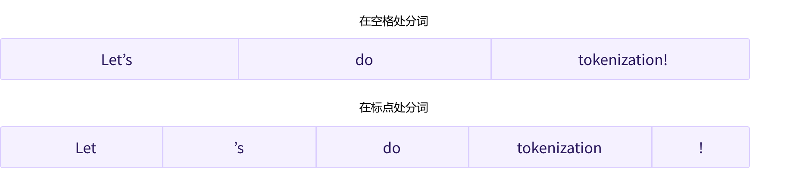
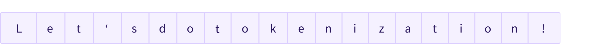

# 第三章 使用Transformers

正如你在第二章，中看到的那样，Transformers 模型通常规模庞大。包含数以百万计到数千万计数十亿的参数，训练和部署这些模型是一项复杂的任务。再者，新模型的推出几乎日新月异，而每种模型都有其独特的实现方式，尝试全部模型绝非易事。

Transformers 库应运而生，就是为了解决这个问题。它的目标是提供一个统一的 API 接口，通过它可以加载、训练和保存任何 Transformer 模型。该库的主要特点有：
- **易于使用**：仅需两行代码，就能下载、加载并使用先进的 NLP 模型进行推理。
- **灵活**：在本质上，所有的模型都是简单的 PyTorch nn.Module 或 TensorFlow tf.keras.Model 类，并可像在各自的机器学习（ML）框架中处理其他模型一样处理它们。
- **简单**：该库几乎没有进行任何抽象化。Transformers 库一个核心概念是“全在一个文件中”：模型的前向传播完全在一个文件中定义，这使得代码本身易于理解和修改。

最后一个特性使Transformers 与其他 ML 库截然不同。模型并非建立在跨越多个代码文件共享的模块上；相反，每一个模型都有自己的层次结构。除了使模型更加容易接受和更容易理解，这还允许你轻松地在一个模型上实验，而且不影响其他模型。

本章将从一个端到端（从输入端到输出端）的示例开始，在该示例中，我们一起使用模型和 tokenizer 来复刻第二章中看到的 `pipeline()` 函数。接下来，我们将讨论 `Model` API：我们将深入研究 `Model` 类和 `Config` 类，并向你展示如何加载模型，以及它如何将输入处理为输出。

然后我们来看看 `tokenizer` API，它是 `pipeline()` 函数的另一个重要组成部分。在 `pipeline()` 中 `Tokenizer` 负责第一步和最后一步的处理，将文本转换到神经网络的输入，以及在需要时将其转换回文本。最后，我们将向你展示如何处理将多个句子整理为一个 batch 发送给模型，然后我们将更深入地研究 `tokenizer()` 函数。

<div custom-style="Tip-yellow">

⚠️ 为了充分利用 Model Hub 和Transformers 提供的所有功能，我们建议你[创建一个账户](https://huggingface.co/join)(https://huggingface.co/join)。
</div>

## 3.1 Pipeline 的内部 

<div custom-style="Tip-green">

这是第一部分，根据你使用 PyTorch 或者 TensorFlow，内容略有不同。点击标题上方的平台，选择你喜欢的平台！
</div>

让我们从一个完整的示例开始，看看在第一章中执行以下代码时在幕后发生了什么

```python
from transformers import pipeline

classifier = pipeline("sentiment-analysis")
classifier(
    [
        "I've been waiting for a HuggingFace course my whole life.",
        "I hate this so much!",
    ]
)
```

获得如下输出：

```python
[{'label': 'POSITIVE', 'score': 0.9598047137260437},
 {'label': 'NEGATIVE', 'score': 0.9994558095932007}]
```

正如我们在第二章中看到的，这个管道将三个步骤组合在一起：预处理、模型计算和后处理：


让我们先简单了解一下这三个步骤。

### 使用 tokenizer（ tokenizer ）进行预处理 

与其他神经网络一样，Transformer 模型无法直接处理原始文本，因此我们管道的第一步是将文本输入转换为模型能够理解的数字。为此，我们使用 tokenizer（ tokenizer ），它将负责：

- 将输入拆分为单词、子单词或符号（如标点符号），称为 **token**（词元）
- 将每个词元（token）映射到一个数字，称为 **input ID**（inputs ID）
- 添加模型需要的其他输入，例如特殊词元（如 `[CLS]` 和 `[SEP]` ）

在使用模型时所有这些预处理都需要与模型预训练时的方式完全相同，因此我们首先需要从 [Model Hub](https://huggingface.co/models)(https://huggingface.co/models) 中下载这些信息。为此，我们使用 `AutoTokenizer` 类和它的 `from_pretrained()` 方法，并输入我们模型 checkpoint 的名称，它将自动获取与模型的 tokenizer 相关联的数据，并对其进行缓存（因此只有在你第一次运行下面的代码时才会下载）。

`sentiment-analysis` （情绪分析）管道默认的 checkpoint 是 `distilbert-base-uncased-finetuned-sst-2-english` （你可以在 [这里](https://huggingface.co/distilbert-base-uncased-finetuned-sst-2-english)(https://huggingface.co/distilbert-base-uncased-finetuned-sst-2-english) ）看到它的模型卡片，我们运行以下代码：

```python
from transformers import AutoTokenizer

checkpoint = "distilbert-base-uncased-finetuned-sst-2-english"
tokenizer = AutoTokenizer.from_pretrained(checkpoint)
```

当我们有了 tokenizer，我们就可以直接将我们的句子传递给它，我们就会得到一个 `input ID（inputs ID）` 的列表！剩下要做的唯一一件事就是将 input ID 列表转换为 tensor（张量）。

你在使用 Transformers 时，不必在意后端是哪个 ML 框架实现的；它可能是 PyTorch 或 TensorFlow，或 Flax。但是，Transformers 模型只接受 `tensor（张量）` 作为输入。如果这是你第一次听说 tensor，你可以把它们想象成 NumPy 数组。NumPy 数组可以是标量（0D）、向量（1D）、矩阵（2D）或具有更多维度。这些都可以称为 tensor；其他 ML 框架的 tensor 使用方法也类似，通常与 NumPy 数组一样易于实例化。

我们可以使用 `return_tensors` 参数指定我们想要得到的 tensor 的类型（PyTorch、TensorFlow 或纯 NumPy），

{#if fw === 'pt'}

```python
raw_inputs = [
    "I've been waiting for a HuggingFace course my whole life.",
    "I hate this so much!",
]
inputs = tokenizer(raw_inputs, padding=True, truncation=True, return_tensors="pt")
print(inputs)
```
{:else}

```python
raw_inputs = [
    "I've been waiting for a HuggingFace course my whole life.",
    "I hate this so much!",
]
inputs = tokenizer(raw_inputs, padding=True, truncation=True, return_tensors="tf")
print(inputs)
```

{/if}

现在不要担心 padding（填充）和 truncation（截断）；我们稍后会解释这些。这里要记住的是，你可以传递一个句子或一组句子，还可以指定要返回的 tensor 类型（如果没有传递类型，默认返回的是 python 中的 list 格式）。

{#if fw === 'pt'}

以下是 PyTorch 张量的结果：

```python
{
    'input_ids': tensor([
        [  101,  1045,  1005,  2310,  2042,  3403,  2005,  1037, 17662, 12172, 2607,  2026,  2878,  2166,  1012,   102],
        [  101,  1045,  5223,  2023,  2061,  2172,   999,   102,     0,     0,     0,     0,     0,     0,     0,     0]
    ]), 
    'attention_mask': tensor([
        [1, 1, 1, 1, 1, 1, 1, 1, 1, 1, 1, 1, 1, 1, 1, 1],
        [1, 1, 1, 1, 1, 1, 1, 1, 0, 0, 0, 0, 0, 0, 0, 0]
    ])
}
```
{:else}

以下是 TensorFlow 张量的结果：

```python
{
    'input_ids': <tf.Tensor: shape=(2, 16), dtype=int32, numpy=
        array([
            [  101,  1045,  1005,  2310,  2042,  3403,  2005,  1037, 17662, 12172,  2607,  2026,  2878,  2166,  1012,   102],
            [  101,  1045,  5223,  2023,  2061,  2172,   999,   102,     0,     0,     0,     0,     0,     0,     0,     0]
        ], dtype=int32)>, 
    'attention_mask': <tf.Tensor: shape=(2, 16), dtype=int32, numpy=
        array([
            [1, 1, 1, 1, 1, 1, 1, 1, 1, 1, 1, 1, 1, 1, 1, 1],
            [1, 1, 1, 1, 1, 1, 1, 1, 0, 0, 0, 0, 0, 0, 0, 0]
        ], dtype=int32)>
}
```
{/if}

输出是一个包含两个键， `input_ids` 和 `attention_mask` 。 `input_ids` 包含两行整数（每个句子一行），它们是每个句子中 token 的 ID。我们将在本章后面解释什么是 `attention_mask` 。

### 探索模型 

{#if fw === 'pt'}

我们可以像使用 tokenizer 一样下载预训练模型。Transformers 提供了一个 `AutoModel` 类，它也有一个     `from_pretrained()` 方法：

```python
from transformers import AutoModel

checkpoint = "distilbert-base-uncased-finetuned-sst-2-english"
model = AutoModel.from_pretrained(checkpoint)
```
{:else}

我们可以像使用 tokenizer 一样下载预训练模型。Transformers 提供了一个 `TFAutoModel` 类，它也有一个 `from_pretrained()` 方法：

```python
from transformers import TFAutoModel

checkpoint = "distilbert-base-uncased-finetuned-sst-2-english"
model = TFAutoModel.from_pretrained(checkpoint)
```
{/if}

在这段代码中，我们将之前在 pipeline 中使用的 checkpoint（实际上应该已经被缓存了）下载下来，并用它实例化了一个模型。

这个模型只包含基本的 Transformer 模块：输入一些句子，它输出我们将称为 `hidden states（隐状态）` ，也被称为特征。每个输入，我们都可以获取一个高维向量，代表 Transformer 模型对该输入的上下文理解。

如果这有些难以理解，不要担心。我们以后再解释。

这些隐状态本身就很有用，它们被称为模型头（head），通常是模型另一部分的输入。在第二章中，可以使用相同的体系结构的模型执行不同的任务，这是因为每个任务都有一个对应的模型头。

#### 高维向量？

Transformers 模块的矢量输出通常较大。它通常有三个维度：

- **Batch size**（批次大小）：一次处理的序列数（在我们的示例中为 2）。
- **Sequence length**（序列长度）：表示序列（句子）的长度（在我们的示例中为 16）。
- **Hidden size**（隐藏层大小）：每个模型输入的向量维度。

正是因为最后一个维度，它被称为“高维”。隐藏层可能非常大（对于较小的模型，常见的是 768，对于较大的模型，这个数字可以达到 3072 或更多）。

如果我们将预处理的之后的值输入到模型中，我们会得到以下输入：

{#if fw === 'pt'}

```python
outputs = model(**inputs)
print(outputs.last_hidden_state.shape)
```

```python
torch.Size([2, 16, 768])
```
{:else}

```python
outputs = model(inputs)
print(outputs.last_hidden_state.shape)
```

```python
(2, 16, 768)
```

{/if}

注意，Transformers 模型的输出有些像 `namedtuple` 或词典。你可以通过使用“.”+属性（就像我们在上面示例中所做的那样）或键（ `outputs["last_hidden_state"]` ）访问元素，如果你确切知道要查找的内容的位置（ `outputs[0]` ），也可以通过索引访问元素。

#### 模型头：理解数字的意义 

Transformers 模型的输出会直接发送到模型头进行处理。

模型头通常由一个或几个线性层组成，它的输入是隐状态的高维向量，它会并将其投影到不同的维度。


在此图中，模型由其嵌入层和后续层表示。嵌入层将 tokenization 输入中的每个 inputs ID 转换为表示关联 token 的向量。后续层使用注意机制操纵这些向量，生成句子的最终表示。

Transformers 中有许多不同的体系结构，每种体系结构都是围绕处理特定任务而设计的。以下是一个非详尽的列表：

- `*Model` （隐状态检索）
- `*ForCausalLM` 
- `*ForMaskedLM` 
- `*ForMultipleChoice` 
- `*ForQuestionAnswering` 
- `*ForSequenceClassification` 
- `*ForTokenClassification` 
- 以及其他 

{#if fw === 'pt'}

以情感分类为例，我们需要一个带有序列分类头的模型（能够将句子分类为积极或消极）。因此，我们不选用 `AutoModel` 类，而是使用 `AutoModelForSequenceClassification` 。也就是说前面写的 `model = AutoModel.from_pretrained(checkpoint)` 并不能得到情感分类任务的结果，因为没有加载 Model head。

```python
from transformers import AutoModelForSequenceClassification

checkpoint = "distilbert-base-uncased-finetuned-sst-2-english"
model = AutoModelForSequenceClassification.from_pretrained(checkpoint)
outputs = model(**inputs)
```
{:else}

以情感分类为例，我们需要一个带有序列分类头的模型（能够将句子分类为积极或消极）。因此，我们不选用 `TFAutoModel` 类，而是使用 `TFAutoModelForSequenceClassification` 。也就是说前面写的 model = TFAutoModel.from_pretrained(checkpoint)并不能得到情感分类任务的结果，因为没有加载 Model head。

```python
from transformers import TFAutoModelForSequenceClassification

checkpoint = "distilbert-base-uncased-finetuned-sst-2-english"
model = TFAutoModelForSequenceClassification.from_pretrained(checkpoint)
outputs = model(inputs)
```
{/if}

如果我们看一下现在输出的形状，其维度会降低很多：模型头接收我们之前看到的高维向量作为输入，并输出包含两个值（每种标签一个）的向量：

```python
print(outputs.logits.shape)
```

{#if fw === 'pt'}

```python
torch.Size([2, 2])
```

{:else}

```python
(2, 2)
```

{/if}

由于我们只有两个句子和两钟标签，所以我们从模型中得到的结果的形状是 2 x 2。

### 对输出进行后序处理 

我们从模型中得到的输出值本身并不一定有意义。我们来看看，

```python
print(outputs.logits)
```

{#if fw === 'pt'}

```python
tensor([[-1.5607,  1.6123],
        [ 4.1692, -3.3464]], grad_fn=<AddmmBackward>)
```

{:else}

```python
<tf.Tensor: shape=(2, 2), dtype=float32, numpy=
    array([[-1.5606991,  1.6122842],
           [ 4.169231 , -3.3464472]], dtype=float32)>
```

{/if}

我们的模型预测第一句为 `[-1.5607, 1.6123]` ，第二句为 `[ 4.1692, -3.3464]` 。这些不是概率，而是 `logits（对数几率）` ，是模型最后一层输出的原始的、未标准化的分数。要转换为概率，它们需要经过 [SoftMax](https://en.wikipedia.org/wiki/Softmax_function)(https://en.wikipedia.org/wiki/Softmax_function) 层（所有Transformers 模型的输出都是 logits，因为训练时的损失函数通常会将最后的激活函数（如 SoftMax）与实际的损失函数（如交叉熵）融合）：

{#if fw === 'pt'}

```python
import torch

predictions = torch.nn.functional.softmax(outputs.logits, dim=-1)
print(predictions)
```

{:else}

```python
import tensorflow as tf

predictions = tf.math.softmax(outputs.logits, axis=-1)
print(predictions)
```

{/if}

{#if fw === 'pt'}

```python
tensor([[4.0195e-02, 9.5980e-01],
        [9.9946e-01, 5.4418e-04]], grad_fn=<SoftmaxBackward>)
```

{:else}

```python
tf.Tensor(
[[4.01951671e-02 9.59804833e-01]
 [9.9945587e-01 5.4418424e-04]], shape=(2, 2), dtype=float32)
```

{/if}

现在我们可以看到，模型预测第一句的输出是 `[0.0402, 0.9598]` ，第二句 `[0.9995,  0.0005]` 。这些是可直接使用的概率分数。

为了获得每个分数对应的标签，我们可以查看模型配置的 `id2label` 属性（下一节将对此进行详细介绍）：

```python
model.config.id2label
```

```python
{0: 'NEGATIVE', 1: 'POSITIVE'}
```

现在我们可以得出结论，模型预测如下：

- 第一句：消极的概率：0.0402，积极的概率：0.9598
- 第二句：消极的概率：0.9995，积极的概率：0.0005

我们已经成功地复刻了管道的三个步骤：使用 tokenizer 进行预处理、通过模型传递输入以及后处理！现在，让我们花一些时间深入了解这些步骤中的每一步。

<div custom-style="Tip-green">

✏️ **试试看！** 选择两个（或更多）句子并分别在 `sentiment-analysis` 管道和自己实现的管道中运行它们。看一看是否获得的结果是不是相同的！

</div>

## 3.2 模型

在本节中，我们将更详细地了解如何创建和使用模型。我们将使用 `AutoModel` / `TFAutoModel` 类，当你希望从 checkpoint 实例化任何模型时，使用它非常方便。

`AutoModel` / `TFAutoModel` 类及其所有的相关类其实就是对库中可用的各种模型的简单包装。它是一个智能的包装，因为它可以自动猜测你的 checkpoint 适合的模型架构，然后实例化一个具有相同架构的模型。

然而，如果你知道你想要使用的模型的类型，你可以直接使用其架构相对应的模型类。让我们看看如何使用 BERT 模型。

### 创建 Transformer 模型 

初始化 BERT 模型需要做的第一件事是加载 `Config` 对象：

{#if fw === 'pt'}

```python
from transformers import BertConfig, BertModel

## 初始化配置类
config = BertConfig()

## 从配置类初始化模型
model = BertModel(config)
```

{:else}

```python
from transformers import BertConfig, TFBertModel

## 初始化配置类
config = BertConfig()

## 从配置类初始化模型
model = TFBertModel(config)
```
{/if}

`config` 中包含许多用于构建模型的属性：

```python
print(config)
```

```python
BertConfig {
  [...]
  "hidden_size": 768,
  "intermediate_size": 3072,
  "max_position_embeddings": 512,
  "num_attention_heads": 12,
  "num_hidden_layers": 12,
  [...]
}
```

虽然可能你还不知道这些属性的含义，但其中一部分应该比较眼熟： `hidden_size` 属性定义了 `hidden_states（隐状态）` 向量的大小，而 `num_hidden_layers` 定义了 Transformer 模型的层数。

#### 使用不同的加载方式 

使用默认配置创建模型会使用随机值对其进行初始化：

{#if fw === 'pt'}

```python
from transformers import BertConfig, BertModel

config = BertConfig()
model = BertModel(config)

## 模型已随机初始化!
```

{:else}

```python
from transformers import BertConfig, TFBertModel

config = BertConfig()
model = TFBertModel(config)

## 模型已随机初始化!
```

{/if}

这个模型是可以运行并得到结果的，但它会输出胡言乱语；它需要先进行训练才能正常使用。我们可以根据手头的任务从头开始训练模型，但正如你在第一章中看到的，这将需要很长的时间和大量的数据，并且会对环境产生不可忽视的影响。为了避免不必要的重复工作，能够共享和复用已经训练过的模型是非常重要的。

加载已经训练过的 Transformers 模型很简单——我们可以使用 `from_pretrained()` 方法：

{#if fw === 'pt'}

```python
from transformers import BertModel

model = BertModel.from_pretrained("bert-base-cased")
```

正如你在上一小节看到的，从现在开始，我们会将 `BertModel` 替换为等效的 `AutoModel` 类，这样可以摆脱对 checkpoint 的依赖；如果你的代码适用于一个 checkpoint 那么它就可以在另一个 checkpoint 无缝地工作。即使体系结构不同，这也适用，只要 checkpoint 是针对类似任务（例如，情绪分析任务）训练的。

{:else}

```python
from transformers import TFBertModel

model = TFBertModel.from_pretrained("bert-base-cased")
```

正如你在上一小节看到的，从现在开始，我们将用等效的 `TFAutoModel` 类替换 `TFBert` 模型。这样可以摆脱对 checkpoint 的依赖；如果你的代码适用于一个 checkpoint 那么它应该与另一个 checkpoint 无缝地工作。即使体系结构不同，这也适用，只要 checkpoint 是针对类似任务（例如，情绪分析任务）训练的。

{/if}

在上述代码示例中，我们没有使用 `BertConfig` ，而是通过 `bert-base-cased` 标签加载了一个预训练模型。这是一个由 BERT 的作者训练的模型 checkpoint 权重；你可以在其 [模型卡片](https://huggingface.co/bert-base-cased)(https://huggingface.co/bert-base-cased) 中查看更多详细信息。

现在，此模型已经用 checkpoint 的所有权重进行了初始化。它可以直接用于推理它训练过的任务，也可以在新任务上进行微调。通过使用预训练的权重进行训练，相比于从头开始训练，我们可以迅速获得比较好的结果。

权重已下载并缓存在缓存文件夹中（因此，未来调用 `from_pretrained()` 方法的调用将不会重新下载它们）默认为 `~/.cache/huggingface/transformers` 。你可以通过设置 `HF_HOME` 环境变量来自定义缓存文件夹。

加载模型的标识符可以是 Model Hub 上任何模型的标签，只要它与 BERT 架构兼容。可用的 BERT  checkpoint 的完整列表可以在 [这里](https://huggingface.co/models?filter=bert)(https://huggingface.co/models?filter=bert) 找到。

#### 保存模型 

保存模型和加载模型一样简单--我们使用 `save_pretrained()` 方法，该方法类似于 `from_pretrained()` 方法：

```python
model.save_pretrained("directory_on_my_computer")
```

这会将两个文件保存到磁盘：

{#if fw === 'pt'}

```python
ls directory_on_my_computer

config.json pytorch_model.bin
```

{:else}

```python
ls directory_on_my_computer

config.json tf_model.h5
```

{/if}

如果你看一下 `config.json` 文件，你会认出构建模型架构所需的属性。这个文件还包含一些元数据，例如 checkpoint 的来源，以及你上次保存 checkpoint 时所使用的 Transformers 版本。

`pytorch_model.bin` / `tf_model.h5` 文件被称为 `state dictionary（状态字典）` ；它包含了你的模型的所有权重。这两个文件是相辅相成的；配置文件是构建你的模型架构所必需的，而模型权重就是你的模型参数。

#### 使用 Transformers 模型进行推理 

既然你知道了如何加载和保存模型，那么让我们尝试使用它进行一些预测。Transformer 模型只能处理数字——由 tokenizer 转化后的数字。但在我们讨论 tokenizer 之前，让我们探讨一下模型接受的输入是什么。

可以将输入转换为适当的框架张量，但为了帮助你了解发生了什么，我们将快速了解在将输入发送到模型之前必须做什么。

假设我们有几个句子：

```python
sequences = ["Hello!", "Cool.", "Nice!"]
```

tokenizer 将这些转换为词汇表索引，通常称为 `input IDs` 。每个句子现在都是一个数字列表！结果输出是：

```python
encoded_sequences = [
    [101, 7592, 999, 102],
    [101, 4658, 1012, 102],
    [101, 3835, 999, 102],
]
```

这是一个编码序列列表：一个列表列表。张量只接受矩形（形状规则的的列表：每一列元素的数量都相同）。这个数组已经是矩形了，因此将其转换为张量很容易：

{#if fw === 'pt'}

```python
import torch

model_inputs = torch.tensor(encoded_sequences)
```

{:else}

```python
import tensorflow as tf

model_inputs = tf.constant(encoded_sequences)
```
{/if}

#### 使用张量作为模型的输入 

将张量输入给模型非常简单 —— 我们只需调用模型并输入：

```python
output = model(model_inputs)
```

虽然模型接受很多不同的参数，但只有 input IDs 是必需的。我们稍后会解释其他参数的作用以及何时需要它们，但首先我们需要仔细研究一下如何构建 Transformer 模型能理解的输入。

## 3.3 Tokenizers 

 tokenizer 是 NLP 管道的核心组件之一。它们有一个非常明确的目的：将文本转换为模型可以处理的数据。模型只能处理数字，因此 tokenizer 需要将我们的文本输入转换为数字。在本节中，我们将确切地探讨 tokenization 管道中发生的事情。

在 NLP 任务中，通常处理的原始数据是文本。这里是一个例子：

```python
Jim Henson was a puppeteer
```

但是，模型只能处理数字，因此我们需要找到一种将原始文本转换为数字的方法。这就是 tokenizer 所做的，并且有很多方法可以解决这个问题。目标是找到最有意义的表达方式 —— 即对模型来说最有意义的方式 —— 如果可能，还要找到最小的表达方式。

让我们看一下 tokenization 算法的一些示例，并尝试回答一些你可能对 tokenization 有的疑问。

### 基于单词（Word-based）的 tokenization  

想到的第一种 tokenizer 是基于词（word-based）的 tokenization。它通常很容易配置和使用，只需几条规则，并且通常会产生不错的结果。例如，在下图中，目标是将原始文本拆分为单词并为每个单词找到一个数字表示：



有多种方法可以拆分文本。例如，我们可以通过使用 Python 的 `split()` 函数，使用空格将文本分割为单词：

```python
tokenized_text = "Jim Henson was a puppeteer".split()
print(tokenized_text)
```

```python
['Jim', 'Henson', 'was', 'a', 'puppeteer']
```

此外，还有一些基于单词的 tokenizer 的变体，对标点符号有额外的规则。使用这类 tokenizer，我们最终可以得到一些非常大的“词汇表（vocabulary）”，其中词汇表的大小由我们在语料库中拥有的独立 tokens 的总数确定。

每个单词都分配了一个 ID，从 0 开始一直到词汇表的大小。模型使用这些 ID 来识别每个词。

如果我们想用基于单词的 tokenizer 完全覆盖一种语言，我们需要为语言中的每个单词设置一个标识符，这将生成大量的 tokens 例如，英语中有超过 500,000 个单词，因此要构建从每个单词到 ID 的映射，我们需要跟踪这么多 ID。此外，像“dog”这样的词与“dogs”这样的词的表示方式不同，模型最初无法知道“dog”和“dogs”是相似的：它会将这两个词识别为不相关。这同样适用于其他相似的词，例如“run”和“running”，模型最初也不会看到它们的相似性。

最后，我们需要一个自定义 token 来表示不在我们词汇表中的单词。这被称为“unknown” token 通常表示为“[UNK]”或“&lt;unk&gt;”。如果你看到 tokenizer 产生了很多这样的 token 这通常是一个不好的迹象，因为它无法检索到一个词的合理表示，并且你会在这个过程中丢失信息。制作词汇表时的其中一个目标是 tokenizer 将尽可能少的单词标记为未知 tokens。

减少未知 tokens 数量的一种方法是使用更深一层的 tokenizer 即基于字符（character-based）的 tokenizer 

### 基于字符（Character-based）的 tokenization  

基于字符的 tokenizer 将文本拆分为字符，而不是单词。这有两个主要好处：

- 词汇量要小得多。
- unknown tokens （out-of-vocabulary）要少得多，因为每个单词都可以由字符构建。

但在此过程中也有一些问题，关于空格和标点符号：



这种方法也不是完美的。由于现在表示是基于字符而不是单词，因此人们可能会争辩说，从直觉上讲，它的意义不大：每个字符本身并没有多大意义，但是单词则不然。然而，这又因语言而异；例如，在中文中，每个字符比拉丁语言中的字符包含更多的信息。

另一件要考虑的因素是，这样做会导致我们的模型需要处理大量的 tokens：虽然一个单词在基于单词的 tokenizer 中只是一个 token，但当它被转换为字符时，很可能就变成了 10 个或更多的 tokens 

为了两全其美，我们可以使用结合这两种方法的第三种技术：基于子词（subword）的 tokenization。

### 基于子词（subword）的 tokenization  

基于子词（subword）的 tokenization 算法依赖于这样一个原则：常用词不应被分解为更小的子词，但罕见词应被分解为有意义的子词。

例如，“annoyingly”可能被视为一个罕见的词，可以分解为“annoying”和“ly”。这两者都可能作为独立的子词并且出现得更频繁，同时“annoyingly”的含义通过“annoying”和“ly”的复合含义得以保留。

这里有一个例子，展示了基于子词的 tokenization 算法如何将序列“Let's do tokenization!”分词：


这些子词最终提供了大量的语义信息：例如，在上面的例子中，“tokenization”被分割成“token”和“ization”，这两个 tokens 在保持空间效率的同时具有语义意义（只需要两个 tokens 就能表示一个长词）。这让我们能够在词汇量小的情况下获得相对良好的覆盖率，并且几乎没有未知的 token。

这种方法在土耳其语等粘着型语言（agglutinative languages）中特别有用，你可以通过将子词串在一起来形成（几乎）任意长的复杂词。

#### 还有更多！

不出所料，还有更多的技术。仅举几例：

- Byte-level BPE，用于 GPT-2
- WordPiece，用于 BERT
- SentencePiece or Unigram，用于多个多语言模型

你现在应该对 tokenizer 的工作原理有足够的了解，可以开始使用 API 了。

### 加载和保存 

加载和保存 tokenizer 就像使用模型一样简单。实际上，它基于相同的两种方法： `from_pretrained()` 和 `save_pretrained()` 。这些方法会加载或保存分词器使用的算法（有点像模型的架构（architecture））以及其词汇表（有点像模型的权重（weights））。

加载使用与 BERT 相同的 checkpoint 训练的 BERT tokenizer 与加载模型的方式相同，只是换成了 `Bert tokenizer` 类：

```python
from transformers import BertTokenizer

tokenizer = BertTokenizer.from_pretrained("bert-base-cased")
```

如同 `AutoModel` / `TFAutoModel` ， `AutoTokenizer` 类将根据 checkpoint 名称在库中获取正确的 tokenizer 类，并且可以直接与任何 checkpoint 一起使用：

```python
from transformers import AutoTokenizer

tokenizer = AutoTokenizer.from_pretrained("bert-base-cased")
```

现在我们可以像在上一节中显示的那样使用 tokenizer：

```python
tokenizer("Using a Transformer network is simple")
```

```python
{'input_ids': [101, 7993, 170, 11303, 1200, 2443, 1110, 3014, 102],
 'token_type_ids': [0, 0, 0, 0, 0, 0, 0, 0, 0],
 'attention_mask': [1, 1, 1, 1, 1, 1, 1, 1, 1]}
```

保存 tokenizer 与保存模型完全相同：

```python
tokenizer.save_pretrained("directory_on_my_computer")
```

我们将在第四章中将更多地谈论 `token_type_ids` ，稍后我们将解释 `attention_mask` 。首先，让我们看看如何生成 `input_ids` 。为此，我们需要查看 tokenizer 的内部是如何实现的。

### 编码 

将文本翻译成数字被称为编码（encoding）。编码分两步完成：分词，然后转换为 inputs ID。

正如我们所见，第一步是将文本拆分为单词（或部分单词、标点符号等），通常称为 tokens 不同的不同的分词器使用的算法也不一样，这就是为什么我们需要使用模型名称来实例化 tokenizer，以确保我们使用模型预训练时使用的相同的算法。

第二步是将这些 tokens 转换为数字，这样我们就可以用它们构建一个张量并将它们提供给模型。为此，tokenizer 有一个词汇表（vocabulary），这是我们在使用 `from_pretrained()` 方法实例化它时下载的部分。同样，我们需要使用与预训练模型时相同的词汇表。

为了更好地理解这两个步骤，我们将分别探讨它们。请注意，我们将单独执行部分 tokenization 管道的方法来向你展示这些步骤的中间结果，但在实践中，你应该直接在你的输入上调用 tokenizer（如第 2 小节所示）。

####  tokenization  

 tokenization 过程由 tokenizer 的 `tokenize()` 方法实现：

```python
from transformers import AutoTokenizer

tokenizer = AutoTokenizer.from_pretrained("bert-base-cased")

sequence = "Using a Transformer network is simple"
tokens = tokenizer.tokenize(sequence)

print(tokens)
```

这个方法的输出是一个字符串列表，或者说 tokens 

```python
['Using', 'a', 'transform', '##er', 'network', 'is', 'simple']
```

这个 tokenizer 是一个基于子词的 tokenizer：它对词进行拆分，直到获得可以用其词汇表表示的 tokens 以 `transformer` 为例，它分为两个 tokens  `transform` 和 `##er` 。

#### 从 tokens 到 inputs ID 

inputs ID 的转换由 tokenizer 的 `convert_tokens_to_ids()` 方法实现：

```python
ids = tokenizer.convert_tokens_to_ids(tokens)

print(ids)
```

```python
[7993, 170, 11303, 1200, 2443, 1110, 3014]
```

这些输出，一旦转换为适当的框架张量，就可以用作模型的输入，如本章前面所示。

<div custom-style="Tip-green">

✏️ **试试看！** 请将我们在第 2 节中使用的输入句子（“I've been waiting for a HuggingFace course my whole life.”和“I hate this so much!”）执行最后两个步骤（分词和转换为 inputs ID）。检查你获得的 inputs ID 是否与我们在第 2 节中获得的一致！

</div>

### 解码 

解码（Decoding） 正好相反：从 inputs ID 到一个字符串。这以通过 `decode()` 方法实现：

```python
decoded_string = tokenizer.decode([7993, 170, 11303, 1200, 2443, 1110, 3014])
print(decoded_string)
```

```python
'Using a Transformer network is simple'
```

请注意， `decode` 方法不仅将索引转换回 tokens 还将属于相同单词的 tokens 组合在一起以生成可读的句子。当我们使用预测新文本的模型（根据提示生成的文本，或序列到序列问题（如翻译或摘要））时，这样的功能将非常有用。

到现在为止，你应该了解 tokenizer 可以处理的原子操作：分词、转换为 ID 以及将 ID 转换回字符串。然而，我们只是刮到了冰山一角。在下一节中，我们将继续探讨它能力的极限，并看看如何克服它们。

## 3.4 处理多个序列 

在上一节中，我们探讨了最简单的案例：对一个较短的句子进行推理。然而，一些问题已经出现：

* 我们如何处理多个句子？

* 我们如何处理不同长度的多个句子？

* 词汇索引是唯一可以让模型运行的输入吗？

* 是否存在句子太长的问题？

让我们看看这些问题会带来什么样的问题，以及如何使用Transformers API 解决它们

### 模型需要一批输入 

在上一个练习中，你看到了句子如何转换为数字列表。让我们将此数字列表转换为张量，并将其发送到模型：

{#if fw === 'pt'}

```python
import torch
from transformers import AutoTokenizer, AutoModelForSequenceClassification

checkpoint = "distilbert-base-uncased-finetuned-sst-2-english"
tokenizer = AutoTokenizer.from_pretrained(checkpoint)
model = AutoModelForSequenceClassification.from_pretrained(checkpoint)

sequence = "I've been waiting for a HuggingFace course my whole life."

tokens = tokenizer.tokenize(sequence)
ids = tokenizer.convert_tokens_to_ids(tokens)
input_ids = torch.tensor(ids)
## 这一行会运行失败
model(input_ids)
```

```python
IndexError: Dimension out of range (expected to be in range of [-1, 0], but got 1)
```
{:else}
```python
import tensorflow as tf
from transformers import AutoTokenizer, TFAutoModelForSequenceClassification

checkpoint = "distilbert-base-uncased-finetuned-sst-2-english"
tokenizer = AutoTokenizer.from_pretrained(checkpoint)
model = TFAutoModelForSequenceClassification.from_pretrained(checkpoint)

sequence = "I've been waiting for a HuggingFace course my whole life."

tokens = tokenizer.tokenize(sequence)
ids = tokenizer.convert_tokens_to_ids(tokens)
input_ids = tf.constant(ids)
## 这一行会运行失败
model(input_ids)
```

```python
InvalidArgumentError: Input to reshape is a tensor with 14 values, but the requested shape has 196 [Op:Reshape]
```
{/if}

哦，不！为什么失败了？“我们的确是按照第 2 节中管道的步骤一步步来做的。

问题是我们向模型发送了一个单独的句子，而Transformers 模型默认情况下需要多个句子。在这里，当我们试图重现 tokenizer 在输入 `sequence` 后在其内部进行的所有操作。但如果你仔细观察，你会发现 tokenizer 不仅仅是将 inputs ID 的列表转换为张量，它还在其上添加了一个维度：

{#if fw === 'pt'}

```python
tokenized_inputs = tokenizer(sequence, return_tensors="pt")
print(tokenized_inputs["input_ids"])
```

```python
tensor([[  101,  1045,  1005,  2310,  2042,  3403,  2005,  1037, 17662, 12172,
          2607,  2026,  2878,  2166,  1012,   102]])
```

{:else}

```python
tokenized_inputs = tokenizer(sequence, return_tensors="tf")
print(tokenized_inputs["input_ids"])
```

```python
tf.Tensor: shape=(1, 16), dtype=int32, numpy=
array([[  101,  1045,  1005,  2310,  2042,  3403,  2005,  1037, 17662,
        12172,  2607,  2026,  2878,  2166,  1012,   102]], dtype=int32)>
```

{/if}

让我们再试一次并添加一个新的维度：

{#if fw === 'pt'}

```python
import torch
from transformers import AutoTokenizer, AutoModelForSequenceClassification

checkpoint = "distilbert-base-uncased-finetuned-sst-2-english"
tokenizer = AutoTokenizer.from_pretrained(checkpoint)
model = AutoModelForSequenceClassification.from_pretrained(checkpoint)

sequence = "I've been waiting for a HuggingFace course my whole life."

tokens = tokenizer.tokenize(sequence)
ids = tokenizer.convert_tokens_to_ids(tokens)

input_ids = torch.tensor([ids])
print("Input IDs:", input_ids)

output = model(input_ids)
print("Logits:", output.logits)
```
{:else}
```python
import tensorflow as tf
from transformers import AutoTokenizer, TFAutoModelForSequenceClassification

checkpoint = "distilbert-base-uncased-finetuned-sst-2-english"
tokenizer = AutoTokenizer.from_pretrained(checkpoint)
model = TFAutoModelForSequenceClassification.from_pretrained(checkpoint)

sequence = "I've been waiting for a HuggingFace course my whole life."

tokens = tokenizer.tokenize(sequence)
ids = tokenizer.convert_tokens_to_ids(tokens)

input_ids = tf.constant([ids])
print("Input IDs:", input_ids)

output = model(input_ids)
print("Logits:", output.logits)
```
{/if}

让我们打印 inputs ID 以及生成的 logits 值，以下是输出：

{#if fw === 'pt'}

```python
Input IDs: [[ 1045,  1005,  2310,  2042,  3403,  2005,  1037, 17662, 12172,  2607, 2026,  2878,  2166,  1012]]
Logits: [[-2.7276,  2.8789]]
```
{:else}

```python
Input IDs: tf.Tensor(
[[ 1045  1005  2310  2042  3403  2005  1037 17662 12172  2607  2026  2878
   2166  1012]], shape=(1, 14), dtype=int32)
Logits: tf.Tensor([[-2.7276208  2.8789377]], shape=(1, 2), dtype=float32)
```
{/if}

批处理（Batching）是一次性通过模型发送多个句子的行为。如果你只有一句话，你可以构建一个只有一个句子的 batch：

```python
batched_ids = [ids, ids]
```

这就是一个包含两个相同句子的 batch 

<div custom-style="Tip-green">

✏️   **试试看！**  将这个 `batched_ids` 列表转换为张量，并通过你的模型进行处理。检查你是否得到了与之前相同的 logits 值（但是重复了两次）！

</div>

批处理支持模型在输入多个句子时工作。使用多个句子就像使用单个句子构建批一样简单。不过，还有第二个问题。当你试图将两个（或更多）句子组合在一起时，它们的长度可能不同。如果你以前使用过张量，那么你知道它们必须是矩形，因此无法将 inputs ID 列表直接转换为张量。为了解决这个问题，我们通常填充输入（Padding）。

### 填充输入（Padding） 

以下列表不能转换为张量：

```python
batched_ids = [
    [200, 200, 200],
    [200, 200]
]
```

为了解决这个问题，我们将使用填充使张量成为标准的矩形。Padding 通过在值较少的句子中添加一个名为 `padding_id` 的特殊单词来确保我们所有的句子长度相同。例如，如果你有 10 个包含 10 个单词的句子和 1 个包含 20 个单词的句子，填充能确保所有句子都包含 20 个单词。在我们的示例中，填充后的张量如下所示：

```python
padding_id = 100

batched_ids = [
    [200, 200, 200],
    [200, 200, padding_id],
]
```

我们可以在 `tokenizer.pad_token_id` 中找到填充 token 的 ID。让我们使用它，分别用模型处理这两个句子，然后再尝试将这两个句子放在一起用模型批处理：

{#if fw === 'pt'}

```python
model = AutoModelForSequenceClassification.from_pretrained(checkpoint)

sequence1_ids = [[200, 200, 200]]
sequence2_ids = [[200, 200]]
batched_ids = [
    [200, 200, 200],
    [200, 200, tokenizer.pad_token_id],
]

print(model(torch.tensor(sequence1_ids)).logits)
print(model(torch.tensor(sequence2_ids)).logits)
print(model(torch.tensor(batched_ids)).logits)
```

```python
tensor([[ 1.5694, -1.3895]], grad_fn=<AddmmBackward>)
tensor([[ 0.5803, -0.4125]], grad_fn=<AddmmBackward>)
tensor([[ 1.5694, -1.3895],
        [ 1.3373, -1.2163]], grad_fn=<AddmmBackward>)
```

{:else}

```python
model = TFAutoModelForSequenceClassification.from_pretrained(checkpoint)

sequence1_ids = [[200, 200, 200]]
sequence2_ids = [[200, 200]]
batched_ids = [
    [200, 200, 200],
    [200, 200, tokenizer.pad_token_id],
]

print(model(tf.constant(sequence1_ids)).logits)
print(model(tf.constant(sequence2_ids)).logits)
print(model(tf.constant(batched_ids)).logits)
```

```python
tf.Tensor([[ 1.5693678 -1.3894581]], shape=(1, 2), dtype=float32)
tf.Tensor([[ 0.5803005  -0.41252428]], shape=(1, 2), dtype=float32)
tf.Tensor(
[[ 1.5693681 -1.3894582]
 [ 1.3373486 -1.2163193]], shape=(2, 2), dtype=float32)
```

{/if}

咦，我们批处理预测中的 logits 值有点问题：第二行应该与第二句的 logits 相同，但我们得到了完全不同的值！

这是因为 Transformer 模型的关键特性：注意力层，它考虑了每个 token 的上下文信息。这具体来说，每个 token 的含义并非单独存在的，它的含义还取决于它在句子中的位置以及周围的其他 tokens。当我们使用填充（padding）来处理长度不同的句子时，我们会添加特殊的“填充 token”来使所有句子达到相同的长度。但是，注意力层会将这些填充 token 也纳入考虑，因为它们会关注序列中的所有 tokens。这就导致了一个问题：尽管填充 token 本身并没有实际的含义，但它们的存在会影响模型对句子的理解。我们需要告诉这些注意层忽略填充 token。这是通过使用注意力掩码（attention mask）层来实现的。

### 注意力掩码（attention mask）层 

注意力掩码（attention mask）是与 inputs ID 张量形状完全相同的张量，用 0 和 1 填充：1 表示应关注相应的 tokens，0 表示应忽略相应的 tokens（即，它们应被模型的注意力层忽视）。

让我们用 attention mask 修改上一个示例：

{#if fw === 'pt'}

```python
batched_ids = [
    [200, 200, 200],
    [200, 200, tokenizer.pad_token_id],
]

attention_mask = [
    [1, 1, 1],
    [1, 1, 0],
]

outputs = model(torch.tensor(batched_ids), attention_mask=torch.tensor(attention_mask))
print(outputs.logits)
```

```python
tensor([[ 1.5694, -1.3895],
        [ 0.5803, -0.4125]], grad_fn=<AddmmBackward>)
```

{:else}

```python
batched_ids = [
    [200, 200, 200],
    [200, 200, tokenizer.pad_token_id],
]

attention_mask = [
    [1, 1, 1],
    [1, 1, 0],
]

outputs = model(tf.constant(batched_ids), attention_mask=tf.constant(attention_mask))
print(outputs.logits)
```

```python
tf.Tensor(
[[ 1.5693681  -1.3894582 ]
 [ 0.5803021  -0.41252586]], shape=(2, 2), dtype=float32)
```

{/if}

现在我们得到了批处理中第二句话相同的 logits 值。

注意第二序列的最后一个值是填充 ID，其在注意力掩码中的值为 0。

<div custom-style="Tip-green">

✏️ **试试看！**在第 2 节使用的两个句子（“I've been waiting for a HuggingFace course my whole life.” 和 “I hate this so much!”）上手动进行 tokenization。将它们输入模型并检查你是否得到了与第 2 节相同的 logits 值。然后使用填充 token 将它们一起进行批处理，然后创建合适的注意力掩码。检查模型计算后是否得到了相同的结果！

</div>

### 更长的句子 

对于 Transformers 模型，我们可以通过模型的序列长度是有限的。大多数模型处理多达 512 或 1024 个 的 tokens 序列，当使用模型处理更长的序列时，会崩溃。此问题有两种解决方案：

* 使用支持更长序列长度的模型。
* 截断你的序列。

不同的模型支持的序列长度各不相同，有些模型专门用于处理非常长的序列。例如 [Longformer](https://huggingface.co/transformers/model_doc/longformer.html)(https://huggingface.co/transformers/model_doc/longformer.html) 和 [LED](https://huggingface.co/transformers/model_doc/led.html)(https://huggingface.co/transformers/model_doc/led.html) 。如果你正在处理需要非常长序列的任务，我们建议你考虑使用这些模型。

另外，我们建议你通过设定 `max_sequence_length` 参数来截断序列：

```python
sequence = sequence[:max_sequence_length]
```

## 3.5 Pipeline的综合应用 

在过去的几个章节中，我们已经尝试尽可能手动完成大部分工作。我们探索了 tokenizer 的运行机制，并且了解了分词、转换为 inputs ID、填充、截断以及注意力掩码的处理方式。

然而，正如我们在第 2 节中看到的那样，Transformers API 能够通过一个高级函数为我们处理所有这些工作，接下来我们就要深入研究这个函数。当你直接在句子上调用你的 `tokenizer` 时，就可以得到转换后的可以直接放入模型的数据了：

```python
from transformers import AutoTokenizer

checkpoint = "distilbert-base-uncased-finetuned-sst-2-english"
tokenizer = AutoTokenizer.from_pretrained(checkpoint)

sequence = "I've been waiting for a HuggingFace course my whole life."

model_inputs = tokenizer(sequence)
```

这里， `model_inputs` 变量包含模型运行所需的所有数据。在 DistilBERT 中，它包括 inputs ID 和注意力掩码（attention mask）。其他接受额外输入的模型也会有对应的 tokenizer 可以将输入转化为模型所需要的输入。

正如我们将在下面的一些例子中看到的，这个函数非常强大。首先，它可以对单个句子进行处理：

```python
sequence = "I've been waiting for a HuggingFace course my whole life."

model_inputs = tokenizer(sequence)
```

它还一次处理多个多个，并且 API 的用法完全一致：

```python
sequences = ["I've been waiting for a HuggingFace course my whole life.", "So have I!"]

model_inputs = tokenizer(sequences)
```

它可以使用多种不同的方法对目标进行填充：

```python
## 将句子序列填充到最长句子的长度
model_inputs = tokenizer(sequences, padding="longest")

## 将句子序列填充到模型的最大长度
## (512 for BERT or DistilBERT)
model_inputs = tokenizer(sequences, padding="max_length")

## 将句子序列填充到指定的最大长度
model_inputs = tokenizer(sequences, padding="max_length", max_length=8)
```

它还可以对序列进行截断：

```python
sequences = ["I've been waiting for a HuggingFace course my whole life.", "So have I!"]

## 将截断比模型最大长度长的句子序列
## (512 for BERT or DistilBERT)
model_inputs = tokenizer(sequences, truncation=True)

## 将截断长于指定最大长度的句子序列
model_inputs = tokenizer(sequences, max_length=8, truncation=True)
```

`tokenizer` 对象可以处理指定框架张量的转换，然后可以直接发送到模型。例如，在下面的代码示例中，我们提示分词器返回不同框架的张量 —— `"pt"` 返回 PyTorch 张量， `"tf"` 返回 TensorFlow 张量，而 `"np"` 则返回 NumPy 数组：

```python
sequences = ["I've been waiting for a HuggingFace course my whole life.", "So have I!"]

## 返回 PyTorch tensors
model_inputs = tokenizer(sequences, padding=True, return_tensors="pt")

## 返回 TensorFlow tensors
model_inputs = tokenizer(sequences, padding=True, return_tensors="tf")

## 返回 NumPy arrays
model_inputs = tokenizer(sequences, padding=True, return_tensors="np")
```

### 特殊的 tokens 

如果我们看一下 tokenizer 返回的 inputs ID，我们会发现它们与之前的略有不同：

```python
sequence = "I've been waiting for a HuggingFace course my whole life."

model_inputs = tokenizer(sequence)
print(model_inputs["input_ids"])

tokens = tokenizer.tokenize(sequence)
ids = tokenizer.convert_tokens_to_ids(tokens)
print(ids)
```

```python
[101, 1045, 1005, 2310, 2042, 3403, 2005, 1037, 17662, 12172, 2607, 2026, 2878, 2166, 1012, 102]
[1045, 1005, 2310, 2042, 3403, 2005, 1037, 17662, 12172, 2607, 2026, 2878, 2166, 1012]
```

句子的开始和结束分别增加了一个 inputs ID。我们来解码上述的两个 ID 序列，看看是怎么回事：

```python
print(tokenizer.decode(model_inputs["input_ids"]))
print(tokenizer.decode(ids))
```

```python
"[CLS] i've been waiting for a huggingface course my whole life. [SEP]"
"i've been waiting for a huggingface course my whole life."
```

 tokenizer 在开头添加了特殊单词 `[CLS]` ，在结尾添加了特殊单词 `[SEP]` 。这是因为模型在预训练时使用了这些字词，所以为了得到相同的推断结果，我们也需要添加它们。请注意，有些模型不添加特殊单词，或者添加不同的特殊单词；模型也可能只在开头或结尾添加这些特殊单词。无论如何，tokenizer 知道哪些是必需的，并会为你处理这些问题。

### 小结：从 tokenizer 到模型 

现在我们已经看到 `tokenizer` 对象在处理文本时的所有步骤，让我们最后再看一次它如何通过 tokenizer  API 处理多个序列（填充！），非常长的序列（截断！）以及多种类型的张量：

{#if fw === 'pt'}

```python
import torch
from transformers import AutoTokenizer, AutoModelForSequenceClassification

checkpoint = "distilbert-base-uncased-finetuned-sst-2-english"
tokenizer = AutoTokenizer.from_pretrained(checkpoint)
model = AutoModelForSequenceClassification.from_pretrained(checkpoint)
sequences = ["I've been waiting for a HuggingFace course my whole life.", "So have I!"]

tokens = tokenizer(sequences, padding=True, truncation=True, return_tensors="pt")
output = model(**tokens)
```

{:else}

```python
import tensorflow as tf
from transformers import AutoTokenizer, TFAutoModelForSequenceClassification

checkpoint = "distilbert-base-uncased-finetuned-sst-2-english"
tokenizer = AutoTokenizer.from_pretrained(checkpoint)
model = TFAutoModelForSequenceClassification.from_pretrained(checkpoint)
sequences = ["I've been waiting for a HuggingFace course my whole life.", "So have I!"]

tokens = tokenizer(sequences, padding=True, truncation=True, return_tensors="tf")
output = model(**tokens)
```

{/if}

## 基本用法完成！

恭喜你跟随课程走到这里！回顾一下，在这一章中，你已经：

- 学习了 Transformers 模型的基本构造块。

- 了解了 Tokenizer 管道的组成。

- 了解了如何在实践中使用 Transformers 模型。

- 学习了如何利用 tokenizer 将文本转换为模型可以理解的张量。

- 设定了 tokenizer 和模型，可以从输入的文本获取预测的结果。

- 了解了 inputs IDs 的局限性，并学习了关于注意力掩码（attention mask）的知识。

- 试用了灵活且可配置的 Tokenizer 方法。

从现在开始，你应该能够自由浏览Transformers 文档：你会遇到许多看起来很熟悉的词汇；而且到目前为止，你已经见到了你大部分时间会使用的方法。

### 测试

让我们来测试一下你在这一章学到了什么！

#### 1. 自然语言处理流程的顺序是什么？

1. 首先是模型它处理文本并返回原始预测。然后 tokenizer 会对这些预测进行解释，并在将它们转换回文本
2. 首先 Tokenizer 处理文本并返回 id。模型根据这些 id 并输出预测，可以是一些文本。
3. Tokenizer 处理文本并返回 id。模型处理这些 id 并输出一个预测。然后可以再次使用 tokenizer 将这些预测转换回某些文本。

#### 2. Transformer 模型的输出有的张量多少个维度，每个维度分别是什么？

1. 2 个维度，分别是：序列长度（Sequence Length）和批次大小（Batch Size）
2. 2 个维度，分别是：序列长度（Sequence Length）和隐藏层大小（Hidden Size）
3. 3 个维度，分别是：序列长度（Sequence Length）、批次大小（Batch Size）和隐藏层大小（Hidden Size）

#### 3．下列哪一个是子词分词的例子（从分词的颗粒度来划分）？

1. WordPiece
2. 基于单个字符的分词
3. 基于空格和标点符号的分割
4. BPE（Byte Pair Encoding）
5. Unigram
6. 以上都不是

#### 4．什么是模型头（Haed 层）？

1. 原始 Transformer 网络的一种组件，直接将张量（Tensors）输入到到正确的层
2. 也称为自注意力（self-attention）机制，它会根据序列的其他 tokens 调整一个 token 的表示
3. 一个附加组件，通常由一个或几个层组成，用于将 Transformer 的预测转换为特定于任务的输出

#### 5．什么是 AutoModel / TFAutoModel？

1. 根据你的数据自动进行训练的模型
2. 一个根据 checkpoint（检查点）返回模型体系结构的对象
3. 一种可以自动检测输入语言来加载正确权重的模型


#### 6．当将不同长度的句子序列在一起批处理时，需要进行哪些处理？

1. 截短
2. 直接将 Tensors 返回
3. 填充
4. 注意力掩码（Attention masking）

#### 7．对使用SoftMax 激活函数对序列分类（Sequence Classification）模型的 logits 输出进行处理有什么意义？

1. 它软化了 logits 输出，使结果更可靠。
2. 它限定了上下界，使模型的输出结果可以被解释。
3. 输出的和是 1，从而产生一个可能的概率解释。

#### 8.Tokenizer API 的核心方法是哪一个？

1. <code>encode</code> 因为它可以将文本编码为 ID，将预测的 ID 解码为文本
2. 直接调用 Tokenizer 对象。
3. <code>pad</code>（填充）
4. <code>tokenize</code>

#### 9．这个代码示例中的 `result` 变量包含什么？

```python
from transformers import AutoTokenizer

tokenizer = AutoTokenizer.from_pretrained("bert-base-cased")
result = tokenizer.tokenize("Hello!")
```
1. 字符串列表，每个字符串都是一个 Token
2. 一个 ID 的列表
3. 包含所有分词后的的字符串

#### 10．下面的代码有什么错误吗？

```python
from transformers import AutoTokenizer, AutoModel

tokenizer = AutoTokenizer.from_pretrained("bert-base-cased")
model = AutoModel.from_pretrained("gpt2")

encoded = tokenizer("Hey!", return_tensors="pt")
result = model(**encoded)
```
1. 不，看起来是对的。
2. Tokenizer 和模型应该来自相同的 checkpoint。
3. 由于模型输入需要是一个 Batch，因此可以使用 tokenizer 对其进行截断或填充来改进这段代码。

#### 10．下面的代码有什么错误吗？

```python
from transformers import AutoTokenizer, TFAutoModel

tokenizer = AutoTokenizer.from_pretrained("bert-base-cased")
model = TFAutoModel.from_pretrained("gpt2")

encoded = tokenizer("Hey!", return_tensors="pt")
result = model(**encoded)
```
1. 不，看起来是对的。
2. Tokenizer 和模型应该来自相同的 checkpoint。
3. 由于每个输入都是一个 Batch，因此可以使用 tokenizer 对其进行平移和截断来改善这段代码。

### 解析

#### 1. 自然语言处理流程的顺序是什么？

正确选项: 3. Tokenizer 处理文本并返回 id。模型处理这些 id 并输出一个预测。然后可以再次使用 tokenizer 将这些预测转换回某些文本。

1. 首先是模型它处理文本并返回原始预测。然后 tokenizer 会对这些预测进行解释，并在将它们转换回文本    
解析: 模型不能理解文本！必须首先使用 tokenizer 将文本转换为 id，之后才可以输入给模型。
2. 首先 Tokenizer 处理文本并返回 id。模型根据这些 id 并输出预测，可以是一些文本。    
解析: 该模型的预测结果是 id 而不是文本。必须使用 tokenizer 才可以将预测转换回文本！
3. Tokenizer 处理文本并返回 id。模型处理这些 id 并输出一个预测。然后可以再次使用 tokenizer 将这些预测转换回某些文本。    
解析: 正确！Tokenizer 可以用于 id 与文本的相互转换。

#### 2. Transformer 模型的输出有的张量多少个维度，每个维度分别是什么？

正确选项: 3. 3 个维度，分别是：序列长度（Sequence Length）、批次大小（Batch Size）和隐藏层大小（Hidden Size）

1. 2 个维度，分别是：序列长度（Sequence Length）和批次大小（Batch Size）    
解析: 错！该模型的张量输出还具有第三个维度：隐藏层大小（Hidden Size）。
2. 2 个维度，分别是：序列长度（Sequence Length）和隐藏层大小（Hidden Size）    
解析: 错！所有 Transformer 模型都批量进行计算，即使是单个序列；那么也会有批次大小（Batch Size）的维度并且值为 1！
3. 3 个维度，分别是：序列长度（Sequence Length）、批次大小（Batch Size）和隐藏层大小（Hidden Size）    

#### 3．下列哪一个是子词分词的例子（从分词的颗粒度来划分）？

正确选项: 1. WordPiece

正确选项: 4. BPE（Byte Pair Encoding）

正确选项: 5. Unigram

1. WordPiece    
解析: 是的，这是一个子词分词的例子！
2. 基于单个字符的分词    
解析: 基于单个字符的分词和子词分词的颗粒度是不同的。
3. 基于空格和标点符号的分割    
解析: 这是一种基于单词的分词而不是子词分词！
4. BPE（Byte Pair Encoding）    
解析: 是的，这是一个子词分词的的例子！
5. Unigram    
解析: 是的，这是一个子词分词的例子！


#### 4．什么是模型头（Haed 层）？

正确选项: 3. 一个附加组件，通常由一个或几个层组成，用于将 Transformer 的预测转换为特定于任务的输出

1. 原始 Transformer 网络的一种组件，直接将张量（Tensors）输入到到正确的层    
解析: 不对！没有这样的组件。
2. 也称为自注意力（self-attention）机制，它会根据序列的其他 tokens 调整一个 token 的表示    
解析: 不对！自注意力层确实包含“注意力头”，但是和模型头并不是同一个概念。
3. 一个附加组件，通常由一个或几个层组成，用于将 Transformer 的预测转换为特定于任务的输出    
解析: 没错。它的全名是 Adaptation Heads，也被简单地称为模型的头部，在不同的任务上有不同的形式：语言模型头，问题回答头，序列分类头．

#### 5．什么是 AutoModel / TFAutoModel？

正确选项: 2. 一个根据 checkpoint（检查点）返回模型体系结构的对象

1. 根据你的数据自动进行训练的模型    
解析: 错误。你可能把 AutoModel / TFAutoModel 与 Hugging Face 的 [AutoTrain](https://huggingface.co/autotrain)(https://huggingface.co/autotrain) 产品相混淆了？
2. 一个根据 checkpoint（检查点）返回模型体系结构的对象    
解析: 确切地说： AutoModel / TFAutoModel 只需要知道初始化的 checkpoint 名称就可以返回正确的体系结构。
3. 一种可以自动检测输入语言来加载正确权重的模型    
解析: 不正确；虽然有些 checkpoint 和模型能够处理多种语言，但是没有内置的工具可以根据语言自动选择 checkpoint。你应该前往 [Model Hub](https://huggingface.co/models)(https://huggingface.co/models) 寻找完成所需任务的最佳 checkpoint！

#### 6．当将不同长度的句子序列在一起批处理时，需要进行哪些处理？

正确选项: 1. 截短

正确选项: 3. 填充

正确选项: 4. 注意力掩码（Attention masking）

1. 截短    
解析: 是的，截断是一个正确的方式，截断可以将他们转化为一个固定长度的矩形序列。这是唯一的正确答案吗？
2. 直接将 Tensors 返回    
解析: 在批处理序列时不可以直接返回长度不一致的 Tensors，必须是固定长度。
3. 填充    
解析: 是的，填充是一个正确的方式，可以将他们转化为一个固定长度的矩形序列。这是唯一的正确答案吗？
4. 注意力掩码（Attention masking）    
解析: 当然！当处理不同长度的序列时，注意力掩码是最重要的。然而，仅仅使用注意力遮蔽是不够的。

#### 7．对使用SoftMax 激活函数对序列分类（Sequence Classification）模型的 logits 输出进行处理有什么意义？

正确选项: 2. 它限定了上下界，使模型的输出结果可以被解释。

正确选项: 3. 输出的和是 1，从而产生一个可能的概率解释。

1. 它软化了 logits 输出，使结果更可靠。    
解析: 不，SoftMax 激活函数不会影响结果的可靠性。
2. 它限定了上下界，使模型的输出结果可以被解释。    
解析: 正确！结果值被压缩到了 0 和 1 之间。不过，这并不是我们使用 SoftMax 激活函数的唯一原因。
3. 输出的和是 1，从而产生一个可能的概率解释。    
解析: 没错，但这并不是我们使用 SoftMax 激活函数的唯一原因。

#### 8.Tokenizer API 的核心方法是哪一个？

正确选项: 2. 直接调用 Tokenizer 对象。

1. <code>encode</code> 因为它可以将文本编码为 ID，将预测的 ID 解码为文本    
解析: 错！虽然 <code>encode</code> 方法确实是 Tokenizer 中的方法之一，但是它并不是核心的方法，此外将预测 ID 解码为文本的是 decode。
2. 直接调用 Tokenizer 对象。    
解析: 完全正确！ tokenizer 的 <code>__call__</code>方法是一个非常强大的方法，可以处理几乎任何事情。它同时也可以从模型中获取预测。
3. <code>pad</code>（填充）    
解析: 错！<code>pad</code>（填充）非常有用，但它只是 Tokenizer API 的一部分。
4. <code>tokenize</code>
解析: 可以说，<code>tokenize</code>法是最有用的方法之一，但它不是 Tokenizer API 的核心方法。

#### 9．这个代码示例中的 `result` 变量包含什么？

```python
from transformers import AutoTokenizer

tokenizer = AutoTokenizer.from_pretrained("bert-base-cased")
result = tokenizer.tokenize("Hello!")
```
正确选项: 1. 字符串列表，每个字符串都是一个 token

1. 字符串列表，每个字符串都是一个 token
解析: 正确！把 tokens 转换成 id 后，就可以传输给模型了！
2. 一个 ID 的列表    
解析: 不正确；这是 <code>__call__</code> 或 <code>convert_tokens_to_ids</code>方法的作用！
3. 包含所有分词后的的字符串    
解析: 这将是次优的答案，因为 tokenize 方法会将字符串拆分为多个 tokens 的列表。

#### 10．下面的代码有什么错误吗？

```python
from transformers import AutoTokenizer, AutoModel

tokenizer = AutoTokenizer.from_pretrained("bert-base-cased")
model = AutoModel.from_pretrained("gpt2")

encoded = tokenizer("Hey!", return_tensors="pt")
result = model(**encoded)
```
正确选项: 2. Tokenizer 和模型应该来自相同的 checkpoint。

1. 不，看起来是对的。    
解析: 将一个模型与一个在不同 checkpoint 训练的 tokenizer 耦合在一起并不是一个好主意。模型没有在这个这个 tokenizer 上训练来理解 tokenizer 的输出，因此模型的输出（如果它可以运行的话）会是错乱的。
2. Tokenizer 和模型应该来自相同的 checkpoint。    
解析: 对！
3. 由于模型输入需要是一个 Batch，因此可以使用 tokenizer 对其进行截断或填充来改进这段代码。    
解析: 的确，模型输入需要是一个 Batch。然而，截断或填充这个序列并不一定有意义，这里只有一句话，而截断或填充这些技术是用来批处理一个句子列表使其长度一致的。

#### 10．下面的代码有什么错误吗？

```python
from transformers import AutoTokenizer, TFAutoModel

tokenizer = AutoTokenizer.from_pretrained("bert-base-cased")
model = TFAutoModel.from_pretrained("gpt2")

encoded = tokenizer("Hey!", return_tensors="pt")
result = model(**encoded)
```
正确选项: 2. Tokenizer 和模型应该来自相同的 checkpoint。

1. 不，看起来是对的。    
解析: 不幸的是，将一个模型与一个不同 checkpoint 训练的 tokenizer 耦合在并不是一个好主意。模型没有在这个这个 tokenizer 上训练来理解 tokenizer 的输出，因此模型的输出（如果它可以运行的话）会是错乱的。
2. Tokenizer 和模型应该来自相同的 checkpoint。    
解析: 对！
3. 由于每个输入都是一个 Batch，因此可以使用 tokenizer 对其进行平移和截断来改善这段代码。    
解析: 的确，每个模型都需要 Batch 类型的输入。然而，截断或填充这个序列并不一定有意义，这里只有一句话，而这些技术是用来批处理一个句子列表的。

