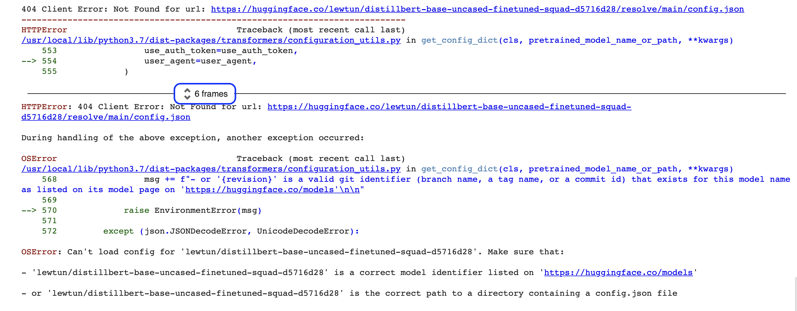
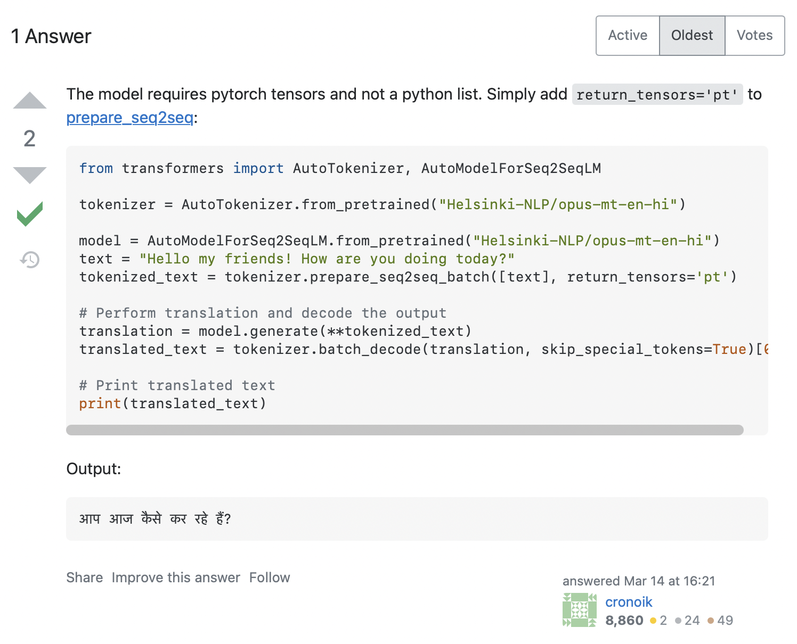
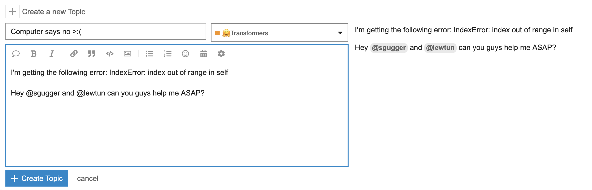
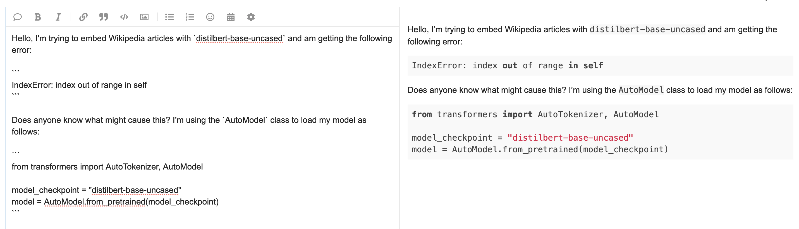
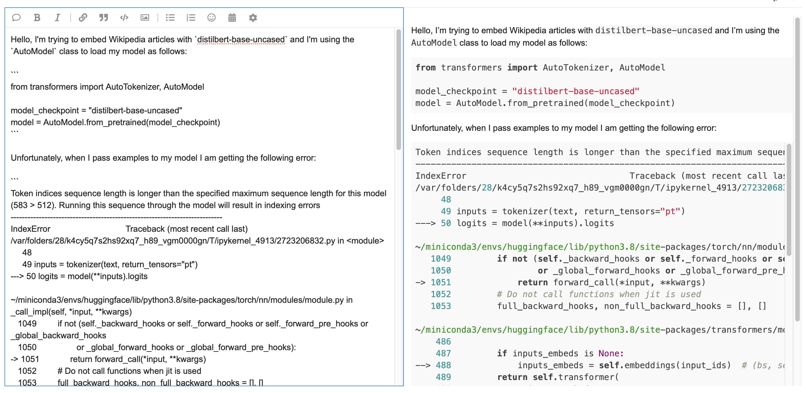
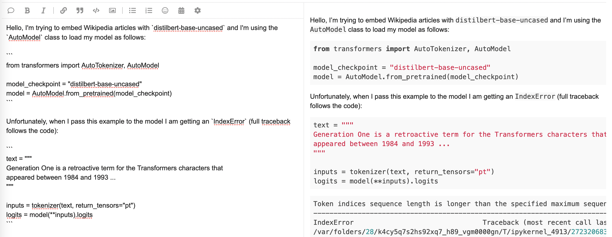

# 第九章 如何寻求帮助

现在，你已经知道如何使用Transformers 处理最常见的 NLP 任务，可以开始自己的项目了！在本章中我们将探讨遇到的问题以及解决方法。你将学习如何成功调试代码或训练，以及在无法自行解决问题时如何向社区寻求帮助。如果你发现了 Hugging Face 库中的一个 bug，我们会告诉你报告 bug 的最佳方法，以便尽快解决问题。

更准确地说，在本章中，你将学习：

- 出现错误时要做的第一件事
- 如何在 [论坛](https://discuss.huggingface.co)(https://discuss.huggingface.co) 寻求帮助 
- 如何调试你的训练管道
- 如何写一个好问题

当然，所有这些都与 Transformers 或 Hugging Face 生态无关；本章的经验教训适用于大多数开源项目！

## 9.1 出现错误时该怎么办 

在本节中，我们将研究当你尝试从新调整的 Transformer 模型生成预测时可能发生的一些常见错误。本节为第四节做准备，探索如何调试训练阶段本身。

我们为这一节准备了一个 [模板仓库](https://huggingface.co/lewtun/distilbert-base-uncased-finetuned-squad-d5716d28)(https://huggingface.co/lewtun/distilbert-base-uncased-finetuned-squad-d5716d28) ，如果你想运行本章中的代码，首先需要将模型复制到自己的 [Hugging Face Hub](https://huggingface.co)(https://huggingface.co) 账号。这需要你在 Jupyter Notebook 中运行以下任一命令来登录：

```python
from huggingface_hub import notebook_login

notebook_login()
```

或在你最喜欢的终端中执行以下操作：

```python
huggingface-cli login
```

这里将会提示你输入用户名和密码，并在 `~/.cache/huggingface/` 保存一个令牌 完成登录后，可以使用以下功能复制模板仓库：

```python
from distutils.dir_util import copy_tree
from huggingface_hub import Repository, snapshot_download, create_repo, get_full_repo_name

def copy_repository_template():
    # 克隆仓库并提取本地路径
    template_repo_id = "lewtun/distilbert-base-uncased-finetuned-squad-d5716d28"
    commit_hash = "be3eaffc28669d7932492681cd5f3e8905e358b4"
    template_repo_dir = snapshot_download(template_repo_id, revision=commit_hash)
    # 在 Hub 上创建一个新仓库
    model_name = template_repo_id.split("/")[1]
    create_repo(model_name, exist_ok=True)
    # 克隆空仓库
    new_repo_id = get_full_repo_name(model_name)
    new_repo_dir = model_name
    repo = Repository(local_dir=new_repo_dir, clone_from=new_repo_id)
    # 复制文件
    copy_tree(template_repo_dir, new_repo_dir)
    # 上传到 Hub 上
    repo.push_to_hub()
```

现在当你调用 `copy_repository_template()` 时，它将在你的帐户下创建模板仓库的副本。

### 从 Transformers 调试 `pipeline` 

接下来要开始我们调试 Transformer 模型的奇妙世界之旅，请考虑以下情景：你正在与一位同事合作进行一个提问-回答的项目，这个项目用来帮助电子商务网站的客户找到有关消费品的答案。你的同事给你发了一条消息，举个例子：

> 嗨！我刚刚使用了 Hugging Face 课程的第八章中的技术进行了一个实验，并在 SQuAD 上获得了一些很棒的结果！我觉得我们可以用这个模型作为项目的起点。Hub 上的模型 ID 是 `lewtun/distillbert-base-uncased-finetuned-squad-d5716d28`。你来测试一下 ）

你首先想到的是使用 Transformers 中的 `pipeline` ：

```python
from transformers import pipeline

model_checkpoint = get_full_repo_name("distillbert-base-uncased-finetuned-squad-d5716d28")
reader = pipeline("question-answering", model=model_checkpoint)
```

```python
"""
OSError: Can't load config for 'lewtun/distillbert-base-uncased-finetuned-squad-d5716d28'. Make sure that:

- 'lewtun/distillbert-base-uncased-finetuned-squad-d5716d28' is a correct model identifier listed on 'https://huggingface.co/models'

- or 'lewtun/distillbert-base-uncased-finetuned-squad-d5716d28' is the correct path to a directory containing a config.json file
"""
```

啊哦，好像出了什么问题！如果你是编程新手，这类错误一开始看起来有点神秘 （ `OSError` 到底是什么？）。其实这里显示的错误只是一个更大的错误报告中最后一部分，称为 `Python traceback` （又名堆栈跟踪）。例如，如果你在 Google Colab 上运行此代码，你应该会看到类似于以下屏幕截图的内容：



这些报告中包含很多信息，让我们一起来看看关键部分。读取这样的报告时的顺序比较特殊，应该按照从底部到顶部的顺序阅读，如果你习惯于从上到下阅读英文文本，这可能听起来很奇怪，但它反映了一个事实：traceback 显示了在下载模型和 tokenizer 时 `pipeline` 调用的函数序列。（查看第三章了解有关 `pipeline` 如何在后台运行的更多详细信息。）

<div custom-style="Tip-red">

🚨 看到 Google Colab 中 traceback 周围 “6 frames” 周围的蓝色框了吗？这是 Colab 的一个特殊功能，它将 traceback 压缩为“frames”。如果你无法找到错误的来源，可以通过单击这两个小箭头来展开完整的 traceback。

</div>

这意味着 traceback 的最后一行指示最后一条错误消息并给出引发的异常名称。在这里，异常类型是 `OSError` ，表示与系统相关的错误。如果我们阅读随之附着的错误消息，我们可以看到模型的 `config.json` 文件似乎有问题，这里给出了两个修复的建议：

```python
"""
Make sure that:

- 'lewtun/distillbert-base-uncased-finetuned-squad-d5716d28' is a correct model identifier listed on 'https://huggingface.co/models'

- or 'lewtun/distillbert-base-uncased-finetuned-squad-d5716d28' is the correct path to a directory containing a config.json file
"""
```

<div custom-style="Tip-green">

💡 如果你遇到难以理解的错误消息，只需将该消息复制并粘贴到 Google 或 [Stack Overflow](https://stackoverflow.com)(https://stackoverflow.com) 搜索栏中。你很有可能不是第一个遇到错误的人，这可以在社区中找到其他人发布的解决方案。例如，在 Stack Overflow 上搜索 `OSError: Can't load config for` 给出了几个 [结果](https://stackoverflow.com/search?q=OSError%3A+Can%27t+load+config+for+)(https://stackoverflow.com/search?q=OSError%3A+Can%27t+load+config+for+) ，可以作为你解决问题的起点。

</div>

第一个建议是检查模型 ID 是否真的正确，所以首先要做的就是复制标签并将其粘贴到 Hub 的搜索栏中：


嗯，看起来你同事的模型确实不在 Hub 上。但是仔细看模型名称中有一个错字！DistilBERT 的名称中只有一个 “l”，所以让我们修正后寻找 `lewtun/distilbert-base-uncased-finetuned-squad-d5716d28`：


好的，这次有结果了。现在让我们使用正确的模型 ID 再次尝试下载模型：

```python
model_checkpoint = get_full_repo_name("distilbert-base-uncased-finetuned-squad-d5716d28")
reader = pipeline("question-answering", model=model_checkpoint)
```

```python
"""
OSError: Can't load config for 'lewtun/distilbert-base-uncased-finetuned-squad-d5716d28'. Make sure that:

- 'lewtun/distilbert-base-uncased-finetuned-squad-d5716d28' is a correct model identifier listed on 'https://huggingface.co/models'

- or 'lewtun/distilbert-base-uncased-finetuned-squad-d5716d28' is the correct path to a directory containing a config.json file
"""
```

啊，再次失败。不要气馁，欢迎来到机器学习工程师的日常生活！前面我们已经修正了模型 ID，所以问题一定出在仓库本身。这里提供一种快速访问 Hub 上仓库内容的方法——通过 `huggingface_hub` 库的 `list_repo_files()` 函数：

```python
from huggingface_hub import list_repo_files

list_repo_files(repo_id=model_checkpoint)
```

```python
['.gitattributes', 'README.md', 'pytorch_model.bin', 'special_tokens_map.json', 'tokenizer_config.json', 'training_args.bin', 'vocab.txt']
```

 有趣的是——仓库中似乎没有配置 `config.json` 文件！难怪我们的 `pipeline` 无法加载模型；你的同事一定是在微调后忘记将这个文件上传到 Hub。在这种情况下问题似乎很容易解决：要求他添加文件，或者由于我们从模型 ID 中可以看出预训练模型使用的是 [`distilbert-base-uncased`](https://huggingface.co/distilbert-base-uncased)(https://huggingface.co/distilbert-base-uncased) ，我们可以下载此模型的配置并将其上传到你们的仓库后查看是否可以解决问题。在这里涉及到第三章中学习的技巧，使用 `AutoConfig` 类下载模型的配置：

```python
from transformers import AutoConfig

pretrained_checkpoint = "distilbert-base-uncased"
config = AutoConfig.from_pretrained(pretrained_checkpoint)
```

<div custom-style="Tip-red">

🚨 在这里采用的方法并不是百分之百可靠的，因为你的同事可能在微调模型之前已经调整了 `distilbert-base-uncased` 配置。在实际情况下，我们应该先与他们核实，但在本节中，我们将假设他们使用了默认配置。

</div>

上一步成功后可以使用配置的 `push_to_hub()` 方法将其上传到模型仓库：

```python
config.push_to_hub(model_checkpoint, commit_message="Add config.json")
```

现在可以通过从最新提交的 `main` 分支中加载模型来测试是否有效：

```python
reader = pipeline("question-answering", model=model_checkpoint, revision="main")

context = r"""
Extractive Question Answering is the task of extracting an answer from a text
given a question. An example of a question answering dataset is the SQuAD
dataset, which is entirely based on that task. If you would like to fine-tune a
model on a SQuAD task, you may leverage the
examples/pytorch/question-answering/run_squad.py script.

Transformers is interoperable with the PyTorch, TensorFlow, and JAX
frameworks, so you can use your favourite tools for a wide variety of tasks!
"""

question = "What is extractive question answering?"
reader(question=question, context=context)
```

```python
{'score': 0.38669535517692566,
 'start': 34,
 'end': 95,
 'answer': 'the task of extracting an answer from a text given a question'}
```

成功了！让我们回顾一下你刚刚学到的东西：

- Python 中的错误消息称为 `tracebacks` ，注意需要从下到上阅读。错误消息的最后一行通常包含定位问题根源所需的信息。
- 如果最后一行没有包含足够的信息，请进行 `tracebacks` ，看看是否可以确定源代码中发生错误的位置。
- 如果没有任何错误消息可以帮助你调试问题，请尝试在线搜索类似问题的解决方案。
- `huggingface_hub` 库提供了一套工具，你可以使用这些工具与 Hub 上的仓库进行交互和调试。

现在你知道如何调试 `pipeline` ，让我们来看一个更棘手的例子，即模型本身的前向传播。

### 调试模型的前向传播 

尽管 `pipeline` 对于大多数需要快速生成预测的应用程序来说非常有用，但是有时你需要访问模型的 logits （比如你想要实现一些的自定义后处理）。为了看看在这种情况下会出现什么问题，让我们首先从 `pipeline` 中获取模型和 Tokenizers 

```python
tokenizer = reader.tokenizer
model = reader.model
```

接下来我们需要提出一个问题，看看我们最喜欢的框架是否受支持：

```python
question = "Which frameworks can I use?"
```

正如我们在第八章中学习的，我们需要采取的步骤是对输入进行 tokenize，提取起始和结束 token 的 logits，然后解码答案范围：

```python
import torch

inputs = tokenizer(question, context, add_special_tokens=True)
input_ids = inputs["input_ids"][0]
outputs = model(**inputs)
answer_start_scores = outputs.start_logits
answer_end_scores = outputs.end_logits
# 计算分数的 argmax 获取最有可能的答案开头
answer_start = torch.argmax(answer_start_scores)
# 计算分数的 argmax 获取最有可能的答案结尾
answer_end = torch.argmax(answer_end_scores) + 1
answer = tokenizer.convert_tokens_to_string(
    tokenizer.convert_ids_to_tokens(input_ids[answer_start:answer_end])
)
print(f"Question: {question}")
print(f"Answer: {answer}")
```

```python
"""
---------------------------------------------------------------------------
AttributeError                            Traceback (most recent call last)
/var/folders/28/k4cy5q7s2hs92xq7_h89_vgm0000gn/T/ipykernel_75743/2725838073.py in <module>
      1 inputs = tokenizer(question, text, add_special_tokens=True)
      2 input_ids = inputs["input_ids"]
----> 3 outputs = model(**inputs)
      4 answer_start_scores = outputs.start_logits
      5 answer_end_scores = outputs.end_logits

~/miniconda3/envs/huggingface/lib/python3.8/site-packages/torch/nn/modules/module.py in _call_impl(self, *input, **kwargs)
   1049         if not (self._backward_hooks or self._forward_hooks or self._forward_pre_hooks or _global_backward_hooks
   1050                 or _global_forward_hooks or _global_forward_pre_hooks):
-> 1051             return forward_call(*input, **kwargs)
   1052         # Do not call functions when jit is used
   1053         full_backward_hooks, non_full_backward_hooks = [], []

~/miniconda3/envs/huggingface/lib/python3.8/site-packages/transformers/models/distilbert/modeling_distilbert.py in forward(self, input_ids, attention_mask, head_mask, inputs_embeds, start_positions, end_positions, output_attentions, output_hidden_states, return_dict)
    723         return_dict = return_dict if return_dict is not None else self.config.use_return_dict
    724
--> 725         distilbert_output = self.distilbert(
    726             input_ids=input_ids,
    727             attention_mask=attention_mask,

~/miniconda3/envs/huggingface/lib/python3.8/site-packages/torch/nn/modules/module.py in _call_impl(self, *input, **kwargs)
   1049         if not (self._backward_hooks or self._forward_hooks or self._forward_pre_hooks or _global_backward_hooks
   1050                 or _global_forward_hooks or _global_forward_pre_hooks):
-> 1051             return forward_call(*input, **kwargs)
   1052         # Do not call functions when jit is used
   1053         full_backward_hooks, non_full_backward_hooks = [], []

~/miniconda3/envs/huggingface/lib/python3.8/site-packages/transformers/models/distilbert/modeling_distilbert.py in forward(self, input_ids, attention_mask, head_mask, inputs_embeds, output_attentions, output_hidden_states, return_dict)
    471             raise ValueError("You cannot specify both input_ids and inputs_embeds at the same time")
    472         elif input_ids is not None:
--> 473             input_shape = input_ids.size()
    474         elif inputs_embeds is not None:
    475             input_shape = inputs_embeds.size()[:-1]

AttributeError: 'list' object has no attribute 'size'
"""
```

看起来我们的代码中有一个错误！不用紧张，你可以在 Notebook 中使用 Python 调试器：

或在终端中：

在这里，错误消息告诉我们 `'list' object has no attribute 'size'` ，我们可以看到一个 `-->` 箭头指向 `model(**inputs)` 中引发问题的行。你可以使用 Python 调试器用交互方式来调试它，但现在我们只需打印出一部分 `inputs` ，看看我们有什么：

```python
inputs["input_ids"][:5]
```

```python
[101, 2029, 7705, 2015, 2064]
```

这当然看起来像一个普通的 Python `list` ，但让我们仔细检查一下类型：

```python
type(inputs["input_ids"])
```

```python
list
```

是的，那肯定是一个 Python `list` 。那么出了什么问题呢？回想一下第三章Transformers 中的 `AutoModelForXxx` 类在 `tensors` （PyTorch 或者 TensorFlow） 进行操作，例如在 PyTorch 中，一个常见的操作是使用 `Tensor.size()` 方法提取张量的维度。让我们再回到 traceback 中，看看哪一行触发了异常：

```python
~/miniconda3/envs/huggingface/lib/python3.8/site-packages/transformers/models/distilbert/modeling_distilbert.py in forward(self, input_ids, attention_mask, head_mask, inputs_embeds, output_attentions, output_hidden_states, return_dict)
    471             raise ValueError("You cannot specify both input_ids and inputs_embeds at the same time")
    472         elif input_ids is not None:
--> 473             input_shape = input_ids.size()
    474         elif inputs_embeds is not None:
    475             input_shape = inputs_embeds.size()[:-1]

AttributeError: 'list' object has no attribute 'size'
```

看起来我们的代码试图调用 `input_ids.size()` ，但这显然不适用于 Python `list` ，这只是一个容器。我们如何解决这个问题呢？在 Stack Overflow 上搜索错误消息找到了很多相关的 [结果](https://stackoverflow.com/search?q=AttributeError%3A+%27list%27+object+has+no+attribute+%27size%27&s=c15ec54c-63cb-481d-a749-408920073e8f)(https://stackoverflow.com/search?q=AttributeError%3A+%27list%27+object+has+no+attribute+%27size%27&s=c15ec54c-63cb-481d-a749-408920073e8f) 。单击第一个会显示与我们类似的问题，答案如下面的屏幕截图所示：



这里建议我们添加 `return_tensors='pt'` 到 Tokenizer，让我们测试一下是否适合：

```python
inputs = tokenizer(question, context, add_special_tokens=True, return_tensors="pt")
input_ids = inputs["input_ids"][0]
outputs = model(**inputs)
answer_start_scores = outputs.start_logits
answer_end_scores = outputs.end_logits
# 计算分数的 argmax 获取最有可能的答案开头
answer_start = torch.argmax(answer_start_scores)
# 计算分数的 argmax 获取最有可能的答案结尾
answer_end = torch.argmax(answer_end_scores) + 1
answer = tokenizer.convert_tokens_to_string(
    tokenizer.convert_ids_to_tokens(input_ids[answer_start:answer_end])
)
print(f"Question: {question}")
print(f"Answer: {answer}")
```

```python
"""
Question: Which frameworks can I use?
Answer: pytorch, tensorflow, and jax
"""
```

成功了！这是一个很好的例子，展示了 Stack Overflow 的实用性，搜索类似的问题，我们能够从社区中其他人的经验中受益。然而，像这样的搜索不总会产生相关的答案，那么在这种情况下你该怎么办呢？幸运的是，在 [Hugging Face 论坛](https://discuss.huggingface.co/)(https://discuss.huggingface.co/) 上有一个友好的开发者社区可以帮助你！在下一节中，我们将看看在该平台中如何最大可能得到问题的回答。

## 9.2 在论坛上寻求帮助 

[Hugging Face 论坛](https://discuss.huggingface.co)(https://discuss.huggingface.co) 是从开源团队和更广泛的 Hugging Face 社区获得帮助的好地方。以下是论坛某一天的主页面：


在左侧，你可以看到各种主题分组的所有类别，而右侧显示了最新的主题。一个主题包含标题、类别和描述；它与我们在第六章中创建自己的数据集时看到的 GitHub issue 格式非常相似 顾名思义， [Beginners（初学者）](https://discuss.huggingface.co/c/beginners/5)(https://discuss.huggingface.co/c/beginners/5) 类别主要面向刚开始使用 Hugging Face 库和生态系统的人。欢迎你对任何库提出任何问题，无论是调试一些代码还是寻求有关如何做某事的帮助。（话虽如此，如果你的问题特属于某个库，你可能应该前往论坛上对应的库类别。）

同样， [Intermediate（中级）](https://discuss.huggingface.co/c/intermediate/6)(https://discuss.huggingface.co/c/intermediate/6) 和 [Research（研究）](https://discuss.huggingface.co/c/research/7)(https://discuss.huggingface.co/c/research/7) 类别用于更高级的问题，例如关于库或一些有趣的新自然语言处理研究的讨论。

当然，我们也应该提到 [Course](https://discuss.huggingface.co/c/course/20)(https://discuss.huggingface.co/c/course/20) 类别，你可以在里面提出与 Hugging Face Course 相关的任何问题！

选择类别后，就可以编写第一个主题了。你可以找一些 [指南](https://discuss.huggingface.co/t/how-to-request-support/3128)(https://discuss.huggingface.co/t/how-to-request-support/3128) ，教你如何撰写主题。在本节中，我们将一起学习一些用来构成一个好主题的特点。

### 写一篇高质量的论坛帖子 

举个例子，我们要从 Wikipedia 文章生成嵌入表示用来创建自定义搜索引擎。通常情况下，我们加载 Tokenizer 和模型的方式如下：

```python
from transformers import AutoTokenizer, AutoModel

model_checkpoint = "distilbert-base-uncased"
tokenizer = AutoTokenizer.from_pretrained(model_checkpoint)
model = AutoModel.from_pretrained(model_checkpoint)
```

现在假设我们尝试嵌入维基百科文章中关于 [变形金刚](https://en.wikipedia.org/wiki/Transformers)(https://en.wikipedia.org/wiki/Transformers) （指的是变形金刚系列作品，而不是 Transformers 库！热知识：Transformers 作为一个 Python 库被越来越多人熟知）的整个部分：

```python
text = """
Generation One is a retroactive term for the Transformers characters that
appeared between 1984 and 1993. The Transformers began with the 1980s Japanese
toy lines Micro Change and Diaclone. They presented robots able to transform
into everyday vehicles, electronic items or weapons. Hasbro bought the Micro
Change and Diaclone toys, and partnered with Takara. Marvel Comics was hired by
Hasbro to create the backstory; editor-in-chief Jim Shooter wrote an overall
story, and gave the task of creating the characthers to writer Dennis O'Neil.
Unhappy with O'Neil's work (although O'Neil created the name "Optimus Prime"),
Shooter chose Bob Budiansky to create the characters.

The Transformers mecha were largely designed by Shōji Kawamori, the creator of
the Japanese mecha anime franchise Macross (which was adapted into the Robotech
franchise in North America). Kawamori came up with the idea of transforming
mechs while working on the Diaclone and Macross franchises in the early 1980s
(such as the VF-1 Valkyrie in Macross and Robotech), with his Diaclone mechs
later providing the basis for Transformers.

The primary concept of Generation One is that the heroic Optimus Prime, the
villainous Megatron, and their finest soldiers crash land on pre-historic Earth
in the Ark and the Nemesis before awakening in 1985, Cybertron hurtling through
the Neutral zone as an effect of the war. The Marvel comic was originally part
of the main Marvel Universe, with appearances from Spider-Man and Nick Fury,
plus some cameos, as well as a visit to the Savage Land.

The Transformers TV series began around the same time. Produced by Sunbow
Productions and Marvel Productions, later Hasbro Productions, from the start it
contradicted Budiansky's backstories. The TV series shows the Autobots looking
for new energy sources, and crash landing as the Decepticons attack. Marvel
interpreted the Autobots as destroying a rogue asteroid approaching Cybertron.
Shockwave is loyal to Megatron in the TV series, keeping Cybertron in a
stalemate during his absence, but in the comic book he attempts to take command
of the Decepticons. The TV series would also differ wildly from the origins
Budiansky had created for the Dinobots, the Decepticon turned Autobot Jetfire
(known as Skyfire on TV), the Constructicons (who combine to form
Devastator),[19][20] and Omega Supreme. The Marvel comic establishes early on
that Prime wields the Creation Matrix, which gives life to machines. In the
second season, the two-part episode The Key to Vector Sigma introduced the
ancient Vector Sigma computer, which served the same original purpose as the
Creation Matrix (giving life to Transformers), and its guardian Alpha Trion.
"""

inputs = tokenizer(text, return_tensors="pt")
logits = model(**inputs).logits
```

```python
IndexError: index out of range in self
```

糟糕，我们遇到了一个问题——而且错误消息比我们在第2节中看到的要难懂得多！我们无法理解完整的 traceback 信息，因此我们决定向 Hugging Face 论坛寻求帮助。我们该如何撰写主题呢？

首先，我们需要点击右上角的“New Topic”按钮（请注意，要创建主题，我们需要先登录）：


这里会出现一个写作界面，我们可以在其中输入我们的主题标题，选择一个类别，并起草内容：

!创建论坛 topic 的界面](./assets/forum-topic01.png "The interface for creating a forum topic.")

由于错误似乎仅与 Transformers 有关，因此我们将为错误选择该类别。第一次尝试解释这个问题可能看起来像这样：



尽这个主题包含这个错误消息，但撰写方式存在一些问题：

1. 标题描述性不是很强，这会导致浏览论坛的人在没有阅读正文的情况下无法知道主题是关于什么的。

2. 正文没有提供足够的信息说明错误的来源以及如何重现错误。

3. 主题以某种要求的语气直接 ＠ 了几个人。

像这样的主题不太可能很快得到答案（如果有答复的话），需要对其进行改进。我们将从解决第一个问题，选择一个好的标题开始。

#### 选择描述性标题 

如果你想就代码中的错误寻求帮助，一个好的经验法则是在标题中包含足够的信息，以便其他人可以快速确定他们是否可以回答你的问题。在我们的运行示例中，我们知道正在引发的异常名称，并有一些提示表示它是在模型的前向传递中触发的，即我们调用 `model(**inputs)` 的位置。为了传达这一信息，一个可能的标题可能是：

> AutoModel 前向传递中的 IndexError 来源？

这个标题告诉读者在哪里你认为错误来自，如果他们遇到了 `IndexError` 他们很可能知道如何回答你。当然，标题可以是任何你想要的，其他变体如：

> 为什么我的模型会产生 IndexError？

这种标题也是可以的。现在我们有了一个描述性的标题，让我们来看看改善正文。

#### 设置代码段的格式 

现在我们有了一个描述性的标题，让我们来看看如何改善代码段的格式。在 IDE 中阅读源代码已经够难的了，但是当将代码复制粘贴为纯文本时就更难了！不过 Hugging Face 论坛支持使用 Markdown，标准格式是用三个反引号 （```） 将代码块括起来。这可以让正文比我们的原始版本看起来更加美观：



正如你在屏幕截图中看到的，将代码块括在反引号中会将原始文本转换为带有颜色样式的格式化代码！另外，单个反引号可用于格式化内联变量，比如 `distilbert-base-uncased` 这样。这个主题看起来好多了，有了一点运气，我们可能会在社区中找到一些人猜测错误的原因。然而，与其依靠运气，不如通过包括完整而详细的回溯信息使事情更容易！

#### 包括完整的回溯信息 

由于回溯的最后一行通常足以调试你自己的代码，但是只提供这一行以“节省空间”可能会使他人调试问题变得更加困难，因为 traceback 中更上面的信息也可能非常有用。因此，一个好的做法是复制并粘贴整个的 traceback，同时确保它的格式不被破坏。但是这些 traceback 可能会很长，所以可以在对源代码进行解释之后再展示它们。就这个思路现在来对我们的问题帖子进行修改，我们的帖子如下所示：



这提供了更多信息，细心的读者可能会指出问题似乎是由于 traceback 中的这行代码导致输入过长：

> 令牌索引序列长度长于为此模型指定的最大序列长度 （583 > 512）。

然而，我们可以通过提供触发错误的实际代码进一步简化事情。现在，我们就来做这件事。

#### 提供可重复的示例 

如果你曾经尝试过调试其他人的代码，那么你可能首先尝试重现他们报告的问题，以便你可以开始逐步查找错误。在论坛上获取（或提供）帮助也不例外，如果你能提供一个重现错误的小例子真的很有帮助。这里有个示例帖子：



该帖子目前包含相当多的信息，并且它的撰写格式更可能吸引社区的注意，获得有用的答案。有了这些基本指南，你现在可以创建很棒的帖子来找到遇到的 Transformers 问题的答案！


## 9.3 调试 Trainer 训练管道

你已经尽可能地遵循第八章中的建议，编写了一段漂亮的代码来训练或微调给定任务的模型。但是当你启动命令 `trainer.train()` 时，可怕的事情发生了：你得到一个错误😱！或者更糟糕的是，虽然一切似乎都很好，训练运行没有错误，但生成的模型很糟糕。在本节中，我们将向你展示如何调试此类问题。

### 调试训练管道 

当你在 `trainer.train()` 中遇到错误时，它可能来自多个来源，因为 `Trainer` 会将很多模块放在一起组合运行。它会将 datasets 转换为 dataloaders 因此问题可能出在 datasets 中，或者在尝试将 datasets 的元素一起批处理时出现问题。接着它会准备一批数据并将其提供给模型，因此问题可能出在模型代码中。之后，它会计算梯度并执行优化器，因此问题也可能出在你的优化器中。即使训练一切顺利，如果你的评估指标有问题，评估期间仍然可能出现问题。

调试 `trainer.train()` 中出现的错误的最佳方法是手动检查整个管道，看看哪里出了问题。通常情况下，错误很容易解决。

为了解释这一点，我们将尝试使用以下脚本在 [MNLI 数据集](https://huggingface.co/datasets/glue)(https://huggingface.co/datasets/glue) 上微调 DistilBERT 模型：

```python
from datasets import load_dataset
from transformers import (
    AutoTokenizer,
    AutoModelForSequenceClassification,
    TrainingArguments,
    Trainer,
)

raw_datasets = evaluate.load("glue", "mnli")

model_checkpoint = "distilbert-base-uncased"
tokenizer = AutoTokenizer.from_pretrained(model_checkpoint)

def preprocess_function(examples):
    return tokenizer(examples["premise"], examples["hypothesis"], truncation=True)

tokenized_datasets = raw_datasets.map(preprocess_function, batched=True)
model = AutoModelForSequenceClassification.from_pretrained(model_checkpoint)

args = TrainingArguments(
    f"distilbert-finetuned-mnli",
    evaluation_strategy="epoch",
    save_strategy="epoch",
    learning_rate=2e-5,
    num_train_epochs=3,
    weight_decay=0.01,
)

metric = evaluate.load("glue", "mnli")

def compute_metrics(eval_pred):
    predictions, labels = eval_pred
    return metric.compute(predictions=predictions, references=labels)

trainer = Trainer(
    model,
    args,
    train_dataset=raw_datasets["train"],
    eval_dataset=raw_datasets["validation_matched"],
    compute_metrics=compute_metrics,
)
trainer.train()
```

如果你尝试执行它，你会遇到一个相当晦涩的错误：

```python
'ValueError: You have to specify either input_ids or inputs_embeds'
```

#### 检查数据 

这是显而易见的，如果你的数据损坏了， `Trainer` 将无法将数据整理成 batch，更不用说训练你的模型了。因此，你需要先检查一下你的训练集的内容。

为了避免花费无数小时试图修复不是错误来源的问题，我们建议你只使用 `trainer.train_dataset` 进行检查。所以让我们在这里这样尝试一下：

```python
trainer.train_dataset[0]
```

```python
{'hypothesis': 'Product and geography are what make cream skimming work. ',
 'idx': 0,
 'label': 1,
 'premise': 'Conceptually cream skimming has two basic dimensions - product and geography.'}
```

你注意到有什么不对吗？与缺少 `input_ids` 的错误消息相结合，应该让你意识到数据集里是文本，而不是模型可以理解的数字。在这个例子，输出的原始错误信息非常具有误导性，因为 `Trainer` 会自动删除与模型签名不匹配的列 （即模型预期的输入参数）。这意味着在这里，除了标签之外的所有东西都被丢弃了。因此，创建 batch 然后将它们发送到模型时没有问题，但是模型会抱怨它没有收到正确的输入。

为什么数据没有被处理？我们确实在数据集上使用了 `Dataset.map()` 方法来使用 tokenizer 处理每个样本。但是如果你仔细看代码，你会发现我们在将训练和评估集传递给 `Trainer` 时犯了一个错误。我们在这里没有使用 `tokenized_datasets` ，而是使用了 `raw_datasets` 🤦。所以让我们解决这个问题！

```python
from datasets import load_dataset
from transformers import (
    AutoTokenizer,
    AutoModelForSequenceClassification,
    TrainingArguments,
    Trainer,
)

raw_datasets = evaluate.load("glue", "mnli")

model_checkpoint = "distilbert-base-uncased"
tokenizer = AutoTokenizer.from_pretrained(model_checkpoint)

def preprocess_function(examples):
    return tokenizer(examples["premise"], examples["hypothesis"], truncation=True)

tokenized_datasets = raw_datasets.map(preprocess_function, batched=True)
model = AutoModelForSequenceClassification.from_pretrained(model_checkpoint)

args = TrainingArguments(
    f"distilbert-finetuned-mnli",
    evaluation_strategy="epoch",
    save_strategy="epoch",
    learning_rate=2e-5,
    num_train_epochs=3,
    weight_decay=0.01,
)

metric = evaluate.load("glue", "mnli")

def compute_metrics(eval_pred):
    predictions, labels = eval_pred
    return metric.compute(predictions=predictions, references=labels)

trainer = Trainer(
    model,
    args,
    train_dataset=tokenized_datasets["train"],
    eval_dataset=tokenized_datasets["validation_matched"],
    compute_metrics=compute_metrics,
)
trainer.train()
```

这个新代码现在会给出一个新的错误😥：

```python
'ValueError: expected sequence of length 43 at dim 1 (got 37)'
```

查看 traceback，我们可以看到错误发生在数据整理步骤中：

```python
~/git/transformers/src/transformers/data/data_collator.py in torch_default_data_collator(features)
    105                 batch[k] = torch.stack([f[k] for f in features])
    106             else:
--> 107                 batch[k] = torch.tensor([f[k] for f in features])
    108 
    109     return batch
```

所以，我们应该去研究一下那个。然而，在我们这样做之前，让我们完成检查我们的数据，先确定它 100％是正确的。

在调试训练过程时，你应该始终做的一件事是查看模型的解码输入。我们无法理解直接提供给它的数字，所以我们应该看看这些数字代表什么。例如，在计算机视觉中，这意味着查看你传递解码后的像素图片，在语音中意味着解码后的音频样本，对于我们的 NLP 示例，这意味着使用我们的 tokenizer 解码后的输入：

```python
tokenizer.decode(trainer.train_dataset[0]["input_ids"])
```

```python
'[CLS] conceptually cream skimming has two basic dimensions - product and geography. [SEP] product and geography are what make cream skimming work. [SEP]'
```

所以这似乎是正确的。你应该对输入中的所有键都这样做：

```python
trainer.train_dataset[0].keys()
```

```python
dict_keys(['attention_mask', 'hypothesis', 'idx', 'input_ids', 'label', 'premise'])
```

请注意，与模型接受的输入不对应的键将被自动丢弃，因此这里我们将仅保留 `input_ids` 、 `attention_mask` 和 `label` （它将被重命名为 `labels` ）。为了双重保险，你可以打印模型的类，然后查看其文档：

```python
type(trainer.model)
```

```python
transformers.models.distilbert.modeling_distilbert.DistilBertForSequenceClassification
```

所以在我们的例子中，我们可以在 [这个页面](https://huggingface.co/transformers/model_doc/distilbert.html#distilbertforsequenceclassification)(https://huggingface.co/transformers/model_doc/distilbert.html#distilbertforsequenceclassification) 查看模型接受的参数。 `Trainer` 也会记录它丢弃的列。

我们通过解码检查了 inputs ID 是否正确。接下来是检查 `attention_mask` ：

```python
trainer.train_dataset[0]["attention_mask"]
```

```python
[1, 1, 1, 1, 1, 1, 1, 1, 1, 1, 1, 1, 1, 1, 1, 1, 1, 1, 1, 1, 1, 1, 1, 1, 1, 1, 1, 1]
```

由于我们没有在预处理中使用填充，这看起来没什么问题。为确保该注意掩码没有问题，让我们检查它与 inputs ID 的长度是否相同：

```python
len(trainer.train_dataset[0]["attention_mask"]) == len(
    trainer.train_dataset[0]["input_ids"]
)
```

```python
True
```

那挺好的！最后，让我们检查一下我们的标签：

```python
trainer.train_dataset[0]["label"]
```

```python
1
```

与inputs ID 一样，这是一个本身并没有真正意义的数字。正如我们之前学到的，标签 ID 和标签名之间的映射存储在数据集 `features` 里的 `names` 属性中：

```python
trainer.train_dataset.features["label"].names
```

```python
['entailment', 'neutral', 'contradiction']
```

所以 `1` 表示 `neutral` ，表示我们上面看到的两句话并不矛盾，也没有包含关系。这似乎是正确的！

我们这里没有 token 类型 ID，因为 DistilBERT 不需要它们；如果你的模型中有一些，你还应该确保它们正确匹配输入中第一句和第二句的位置。

<div custom-style="Tip-green">

✏️ **轮到你了！** 检查训练数据集的第二个条数据是否正确。

</div>

我们在这里只对训练集进行检查，但你当然应该以同样的方式仔细检查验证集和测试集。

现在我们知道我们的数据集看起来不错，是时候检查训练管道的下一步了。

#### 从 datasets 到 dataloaders 

训练管道中可能出错的下一件事是当 `Trainer` 尝试从训练或验证集形成 batch 时。当你确定 `Trainer` 的数据集是正确的后，你可以尝试通过执行以下操作手动形成一个 batch（当要测试验证集的 dataloaders 时，可以将 `train` 替换为 `eval` ）：

```python
for batch in trainer.get_train_dataloader():
    break
```

此代码将会创建训练数据加载器，然后对其进行迭代一次。如果代码执行没有错误，那么你就有了可以检查的第一个 batch，如果代码出错，你可以确定问题出在数据加载器中，如下所示：

```python
~/git/transformers/src/transformers/data/data_collator.py in torch_default_data_collator(features)
    105                 batch[k] = torch.stack([f[k] for f in features])
    106             else:
--> 107                 batch[k] = torch.tensor([f[k] for f in features])
    108 
    109     return batch

ValueError: expected sequence of length 45 at dim 1 (got 76)
```

Trackback 的最后一个堆栈的输出应该足够给你一些线索，但让我们再深入挖掘一下。批处理创建过程中的大多数问题是在将示例整理到单个 batch 中而出现的，因此在有疑问时首先要检查的是你的 DataLoader 正在使用的 `collate_fn` ：

```python
data_collator = trainer.get_train_dataloader().collate_fn
data_collator
```

```python
<function transformers.data.data_collator.default_data_collator(features: List[InputDataClass], return_tensors='pt') -> Dict[str, Any]>
```

所以，目前使用的是 `default_data_collator` ，但这不是我们在这个例子中想要的。我们希望将示例填充到批处理中最长的句子，这项功能是由 `DataCollatorWithPadding` 整理器实现的。而这个数据整理器应该是默认被 `Trainer` 使用的，为什么这里没有使用呢？

答案是因为我们没有将 `tokenizer` 传递给 `Trainer` ，所以它无法创建我们想要的 `DataCollatorWithPadding` 。在实践中，你应该明确地传递你想要使用的数据整理器，以确保避免这些类型的错误。让我们修改代码以实现这一点：

```python
from datasets import load_dataset
import evaluate
from transformers import (
    AutoTokenizer,
    AutoModelForSequenceClassification,
    DataCollatorWithPadding,
    TrainingArguments,
    Trainer,
)

raw_datasets = evaluate.load("glue", "mnli")

model_checkpoint = "distilbert-base-uncased"
tokenizer = AutoTokenizer.from_pretrained(model_checkpoint)

def preprocess_function(examples):
    return tokenizer(examples["premise"], examples["hypothesis"], truncation=True)

tokenized_datasets = raw_datasets.map(preprocess_function, batched=True)
model = AutoModelForSequenceClassification.from_pretrained(model_checkpoint)

args = TrainingArguments(
    f"distilbert-finetuned-mnli",
    evaluation_strategy="epoch",
    save_strategy="epoch",
    learning_rate=2e-5,
    num_train_epochs=3,
    weight_decay=0.01,
)

metric = evaluate.load("glue", "mnli")

def compute_metrics(eval_pred):
    predictions, labels = eval_pred
    return metric.compute(predictions=predictions, references=labels)

data_collator = DataCollatorWithPadding(tokenizer=tokenizer)

trainer = Trainer(
    model,
    args,
    train_dataset=tokenized_datasets["train"],
    eval_dataset=tokenized_datasets["validation_matched"],
    compute_metrics=compute_metrics,
    data_collator=data_collator,
    tokenizer=tokenizer,
)
trainer.train()
```

好消息？我们没有得到与以前相同的错误，这绝对是进步。坏消息？我们得到了一个臭名昭著的 CUDA 错误：

```python
RuntimeError: CUDA error: CUBLAS_STATUS_ALLOC_FAILED when calling `cublasCreate(handle)`
```

这很糟糕，因为 CUDA 错误通常很难调试。我们稍后会看到如何解决这个问题，但首先让我们完成对创建批处理的分析。

如果你确定你的数据整理器是正确的，则应尝试用它来处理数据集的几个样本：

```python
data_collator = trainer.get_train_dataloader().collate_fn
batch = data_collator([trainer.train_dataset[i] for i in range(4)])
```

此代码将运行失败，因为 `train_dataset` 包含字符串列， `Trainer` 通常会删除这些列。你可以手动删除它们，或者如果你使用 `Trainer` 在幕后所做的事情，你可以调用私有的 `Trainer._remove_unused_columns()` 方法来执行此操作：

```python
data_collator = trainer.get_train_dataloader().collate_fn
actual_train_set = trainer._remove_unused_columns(trainer.train_dataset)
batch = data_collator([actual_train_set[i] for i in range(4)])
```

如果错误仍然存在，你应该能够手动调试数据整理器内部以确定具体的问题。

现在我们已经调试了批处理创建过程，是时候将数据传递给模型了！

#### 检查模型 

你应该能够通过执行以下命令来获得一个批次的数据：

```python
for batch in trainer.get_train_dataloader():
    break
```

如果你在 notebook 中运行此代码，你可能会收到与我们之前看到的类似的 CUDA 错误，在这种情况下，你需要重新启动 notebook 并重新执行最后一段代码，但是不运行 `trainer.train()` 行．这是关于 CUDA 错误的第二个最烦人的事情：它们会破坏你的 Cuda 内核，而且无法恢复。它们最烦人的事情是它们很难调试。

这是为什么？它与 GPU 的工作方式有关。它们在并行执行大量操作方面非常有效，但缺点是当其中一条指令导致错误时，你不会立即知道。只有当程序在 GPU 上调用多个进程的同步处理时，它才会意识到出现问题，因此错误实际上是在与创建它的原因无关的地方引发的。例如，如果我们查看之前的 Trackback，错误是在反向传播期间引发的，但我们会在一分钟后看到它实际上源于前向传播的某些东西。

那么我们如何调试这些错误呢？答案很简单：不调试。除非你的 CUDA 错误是内存不足错误（这意味着你的 GPU 中没有足够的内存），除此之外你应该始终返回到 CPU 进行调试。

为此，我们只需将模型放回 CPU 上并在我们的 batch 数据中调用它—— `DataLoader` 返回的那批数据尚未移动到 GPU：

```python
outputs = trainer.model.cpu()(**batch)
```

```python
~/.pyenv/versions/3.7.9/envs/base/lib/python3.7/site-packages/torch/nn/functional.py in nll_loss(input, target, weight, size_average, ignore_index, reduce, reduction)
   2386         )
   2387     if dim == 2:
-> 2388         ret = torch._C._nn.nll_loss(input, target, weight, _Reduction.get_enum(reduction), ignore_index)
   2389     elif dim == 4:
   2390         ret = torch._C._nn.nll_loss2d(input, target, weight, _Reduction.get_enum(reduction), ignore_index)

IndexError: Target 2 is out of bounds.
```

现在，情况越来越明朗了。我们现在在损失计算中没有出现 CUDA 错误，而是有一个 `IndexError` （因此与我们之前所说的反向传播无关）。更准确地说，我们可以看到是 Target 2 造成了错误，所以这是检查模型标签数量的好时机：

```python
trainer.model.config.num_labels
```

```python
2
```

有两个标签，只有 0 和 1 作为目标，但是根据错误信息我们得到一个 2。得到一个 2 实际上是正常的：如果我们记得我们之前提取的标签名称，有三个，所以在我们的数据集中我们有索引 0、1 和 2 问题是我们没有告诉我们的模型，它应该创建三个标签。让我们解决这个问题！

```python
from datasets import load_dataset
import evaluate
from transformers import (
    AutoTokenizer,
    AutoModelForSequenceClassification,
    DataCollatorWithPadding,
    TrainingArguments,
    Trainer,
)

raw_datasets = evaluate.load("glue", "mnli")

model_checkpoint = "distilbert-base-uncased"
tokenizer = AutoTokenizer.from_pretrained(model_checkpoint)

def preprocess_function(examples):
    return tokenizer(examples["premise"], examples["hypothesis"], truncation=True)

tokenized_datasets = raw_datasets.map(preprocess_function, batched=True)
model = AutoModelForSequenceClassification.from_pretrained(model_checkpoint, num_labels=3)

args = TrainingArguments(
    f"distilbert-finetuned-mnli",
    evaluation_strategy="epoch",
    save_strategy="epoch",
    learning_rate=2e-5,
    num_train_epochs=3,
    weight_decay=0.01,
)

metric = evaluate.load("glue", "mnli")

def compute_metrics(eval_pred):
    predictions, labels = eval_pred
    return metric.compute(predictions=predictions, references=labels)

data_collator = DataCollatorWithPadding(tokenizer=tokenizer)

trainer = Trainer(
    model,
    args,
    train_dataset=tokenized_datasets["train"],
    eval_dataset=tokenized_datasets["validation_matched"],
    compute_metrics=compute_metrics,
    data_collator=data_collator,
    tokenizer=tokenizer,
)
```

为了方便检查一切是否正常，我们还没有把 `trainer.train()` 加进去。如果我们请求一个 batch 的数据并将其传递给我们的模型，假如它现在可以正常工作了！

```python
for batch in trainer.get_train_dataloader():
    break

outputs = trainer.model.cpu()(**batch)
```

下一步就可以回到 GPU 并检查一切是否仍然有效：

```python
import torch

device = torch.device("cuda") if torch.cuda.is_available() else torch.device("cpu")
batch = {k: v.to(device) for k, v in batch.items()}

outputs = trainer.model.to(device)(**batch)
```

如果仍然出现错误，请确保重新启动 notebook 并仅执行最后一版的代码。

#### 执行一个优化器步骤 

现在我们已经可以构建通过模型检查的成批次的数据，我们已经为训练管道的下一步做好准备：计算梯度并执行优化器步骤。

第一部分只是在 loss 上调用 `backward()` 方法：

```python
loss = outputs.loss
loss.backward()
```

在这个阶段很少出现错误，但如果确实出现错误，请返回 CPU 来获取有用的错误消息。

要执行优化步骤，我们只需要创建 `optimizer` 并调用它的 `step()` 方法：

```python
trainer.create_optimizer()
trainer.optimizer.step()
```

同样，如果你在 `Trainer` 中使用默认优化器，则在此阶段你不应该收到错误，但如果你有自定义优化器，则可能会出现一些问题需要在这里调试。如果你在此阶段遇到奇怪的 CUDA 错误，请不要忘记返回 CPU。说到 CUDA 错误，前面我们提到了一个特殊情况。现在让我们来看看。

#### 处理 CUDA out-of-memory 错误 

每当你收到以 `RuntimeError: CUDA out of memory` 开头的错误消息时，这表明你的 GPU 内存不足。这与你的代码没有直接关联，并且它可能发生在运行良好的代码中。此错误意味着你试图在 GPU 的内部存储器中放入太多东西，这导致了错误。与其他 CUDA 错误一样，你需要重新启动内核才能再次运行训练。

要解决这个问题，你只需要使用更少的 GPU 空间——这往往说起来容易做起来难。首先，确保你没有同时在 GPU 上运行两个模型（当然，除非你的问题需要这样做）。然后，你可能应该减少 batch 的大小，因为它直接影响模型的所有中间输出的大小及其梯度。如果问题仍然存在，请考虑使用较小版本的模型。

<div custom-style="Tip-green">

在课程的下一部分中，我们将介绍更先进的技术，这些技术可以帮助你减少内存占用并让你微调最大的模型。

</div>

#### 评估模型 

现在我们已经解决了代码的所有问题，一切都很完美，训练应该可以顺利进行，对吧？没那么快！如果你运行 `trainer.train()` 命令，一开始一切看起来都不错，但过一会儿你会得到以下信息：

```python
# 这将花费很长时间并且会出错,所以不要直接运行这个单元
trainer.train()
```

```python
TypeError: only size-1 arrays can be converted to Python scalars
```

你将意识到此错误出现在评估阶段，因此这是我们需要调试的最后一件事。

你可以独立于训练运行 Trainer 的评估循环，如下所示：

```python
trainer.evaluate()
```

```python
TypeError: only size-1 arrays can be converted to Python scalars
```

<div custom-style="Tip-green">

💡 你应该始终确保在启动 `trainer.train()` 之前 `trainer.evaluate()` 是可以运行的，以避免在遇到错误之前浪费大量计算资源。

</div>

在尝试调试评估循环中的问题之前，你应该首先确保你已经查看了数据，能够正确地形成了 batch 并且可以在其上运行你的模型。我们已经完成了所有这些步骤，因此可以执行以下代码而不会出错：

```python
for batch in trainer.get_eval_dataloader():
    break

batch = {k: v.to(device) for k, v in batch.items()}

with torch.no_grad():
    outputs = trainer.model(**batch)
```

稍等一会儿，错误出现，在评估阶段结束时，如果我们查看 Trackback，我们会看到：

```python
~/git/datasets/src/datasets/metric.py in add_batch(self, predictions, references)
    431         
    432         batch = {"predictions": predictions, "references": references}
--> 433         batch = self.info.features.encode_batch(batch)
    434         if self.writer is None:
    435             self._init_writer()
```

这告诉我们错误源自 `datasets/metric.py` 模块——所以这是我们的 `compute_metrics()` 函数的问题。它需要一个带有 logits 和标签的元组作为 NumPy 数组，所以让我们尝试将其提供给它：

```python
predictions = outputs.logits.cpu().numpy()
labels = batch["labels"].cpu().numpy()

compute_metrics((predictions, labels))
```

```python
TypeError: only size-1 arrays can be converted to Python scalars
```

我们得到同样的错误，所以问题肯定出在那个函数上。如果我们回顾它的代码，我们会发现它只是将 `predictions` 和 `labels` 转发到 `metric.compute()` 。那么这种方法有问题吗？不一定。让我们快速浏览一下形状：

```python
predictions.shape, labels.shape
```

```python
((8, 3), (8,))
```

我们的预测输出是 logits 值，而不是需要的 3 个标签的概率，这就是 metrics 返回这个（有点模糊）错误的原因。修复很简单；我们只需要在 `compute_metrics()` 函数中添加一个 argmax：

```python
import numpy as np

def compute_metrics(eval_pred):
    predictions, labels = eval_pred
    predictions = np.argmax(predictions, axis=1)
    return metric.compute(predictions=predictions, references=labels)

compute_metrics((predictions, labels))
```

```python
{'accuracy': 0.625}
```

现在我们的错误已修复！这是最后一个错误，所以我们的脚本现在将可以正确地训练一个模型。

作为参考，这里是完全修正好的脚本：

```python
import numpy as np
from datasets import load_dataset
import evaluate
from transformers import (
    AutoTokenizer,
    AutoModelForSequenceClassification,
    DataCollatorWithPadding,
    TrainingArguments,
    Trainer,
)

raw_datasets = evaluate.load("glue", "mnli")

model_checkpoint = "distilbert-base-uncased"
tokenizer = AutoTokenizer.from_pretrained(model_checkpoint)

def preprocess_function(examples):
    return tokenizer(examples["premise"], examples["hypothesis"], truncation=True)

tokenized_datasets = raw_datasets.map(preprocess_function, batched=True)
model = AutoModelForSequenceClassification.from_pretrained(model_checkpoint, num_labels=3)

args = TrainingArguments(
    f"distilbert-finetuned-mnli",
    evaluation_strategy="epoch",
    save_strategy="epoch",
    learning_rate=2e-5,
    num_train_epochs=3,
    weight_decay=0.01,
)

metric = evaluate.load("glue", "mnli")

def compute_metrics(eval_pred):
    predictions, labels = eval_pred
    predictions = np.argmax(predictions, axis=1)
    return metric.compute(predictions=predictions, references=labels)

data_collator = DataCollatorWithPadding(tokenizer=tokenizer)

trainer = Trainer(
    model,
    args,
    train_dataset=tokenized_datasets["train"],
    eval_dataset=tokenized_datasets["validation_matched"],
    compute_metrics=compute_metrics,
    data_collator=data_collator,
    tokenizer=tokenizer,
)
trainer.train()
```

在这种情况下，如果没有更多错误，我们的脚本将微调一个应该给出合理结果的模型。但是，如果训练没有任何错误，而训练出来的模型根本表现不佳，我们该怎么办？这是机器学习中最难的部分，我们将向你展示一些可以帮助解决这类问题的技巧。
<div custom-style="Tip-green">

💡 如果你使用的是手动训练循环，调试训练流程时也需要遵循相同的步骤，而且更容易将训练中的各个步骤分开调试。但是，请确保你没有忘记在合适的位置使用 `model.eval()` 或 `model.train()` ，也不要忘记在每个步骤中使用 `zero_grad()` ！

</div>

### 在训练期间调试静默（没有任何错误提示）错误 

我们可以做些什么来调试一个没有错误地完成但没有得到好的结果的训练？我们会在这里给你一些提示，但请注意，这种调试是机器学习中最难的部分，并且没有灵丹妙药。

#### 检查你的数据（再次！） 

只有你的数据确实可以学到东西，你的模型才会学到一些东西。如果存在损坏数据的错误或标签是随机属性的，那么你很可能不会在数据集上获得任何知识。因此，始终首先仔细检查你的解码后的输入和标签，然后问自己以下问题：

- 解码后的数据是否可以理解？
- 你认同这些标签吗？
- 有没有一个标签比其他标签更常见？
- 如果模型预测随机的答案/总是相同的答案，那么 loss/评估指标应该是多少？

<div custom-style="Tip-yellow">

⚠️ 如果你正在进行分布式训练，请在每个进程中打印数据集的样本并仔细核对，确保你得到的是相同的内容。一个常见的错误是在数据创建过程中有一些随机性，导致每个进程具有不同版本的数据集。

</div>

查看你的数据后，查看模型的一些预测并对其进行解码。如果模型总是预测同样的类别，那可能是因为你的数据集偏向一个类别（针对分类问题）；过采样稀有类等技术可能会有所帮助。

如果你在初始模型上获得的 loss/评估指标与你期望的随机预测的 loss/评估指标非常不同，请仔细检查你的 loss 或评估指标的计算方式，因为那里可能存在错误。如果你使用最后添加的多个 loss，并在最后将它们相加，请确保它们具有相同的比例。

当你确定你的数据是完美的时，你可以通过一个简单的测试来查看模型是否能够对其进行训练。

#### 在一批上过度拟合你的模型 

过度拟合通常是我们在训练时尽量避免的事情，因为这意味着模型没有学习识别我们想要的一般特征，而只是记住了训练样本。在这种情况下，一遍又一遍地尝试在一个批次上训练你的模型是一个很好的测试，这样可以检查你的问题是否可以通过你尝试训练的模型来解决。它还将帮助你查看你的初始学习率是否太高。

一旦你定义了你的 `Trainer` 之后，这样做真的很容易；只需获取一批训练数据，然后仅使用该批次运行一个小型手动训练循环，大约 20 步：

```python
for batch in trainer.get_train_dataloader():
    break

batch = {k: v.to(device) for k, v in batch.items()}
trainer.create_optimizer()

for _ in range(20):
    outputs = trainer.model(**batch)
    loss = outputs.loss
    loss.backward()
    trainer.optimizer.step()
    trainer.optimizer.zero_grad()
```

<div custom-style="Tip-green">

💡 如果你的训练数据不平衡，请确保构建一批包含所有标签的训练数据。

</div>

生成的模型在一个 `batch` 上应该有接近完美的结果。让我们计算结果预测的指标：

```python
with torch.no_grad():
    outputs = trainer.model(**batch)
preds = outputs.logits
labels = batch["labels"]

compute_metrics((preds.cpu().numpy(), labels.cpu().numpy()))
```

```python
{'accuracy': 1.0}
```

100％ 准确率，现在这是一个很好的过拟合示例（这意味着如果你在任何其他句子上尝试你的模型，它很可能会给你一个错误的答案）！

如果你没有设法让你的模型获得这样的完美结果，这意味着你构建问题或数据的方式有问题，所以你应该修复它。只有当你可以通过过拟合测试时，你才能确定你的模型实际上可以学到一些东西。

<div custom-style="Tip-yellow">

⚠️ 在此测试之后，你需要创建模型和 `Trainer` ，因为获得的模型可能无法在你的完整数据集上恢复和学习有用的东西。

</div>

#### 在你有第一个 baseline 模型之前不要调整任何东西 

超参数调优总是被强调为机器学习中最难的部分，但这只是帮助你在指标上有所收获的最后一步。大多数情况下， `Trainer` 的默认超参数可以很好地为你提供良好的结果，因此在你拥有数据集上的 baseline 模型之前，不要急于进行耗时和昂贵的超参数搜索。

一旦你有一个足够好的模型，你就可以开始稍微调整一下。不要尝试使用不同的超参数启动一千次运行，而是比较一个超参数的不同值的几次运行，以了解哪个超参数对指标影响最大。

如果你正在调整模型本身，请保持简单，不要尝试任何你无法合理证明的事情。始终确保你返回过拟合测试以验证你的更改没有产生任何意外后果。

#### 请求帮忙 

希望你会在本节中找到一些可以帮助你解决问题的建议，但如果不是这样，请记住你可以随时在 [论坛](https://discuss.huggingface.co/)(https://discuss.huggingface.co/) 上向社区提问。

以下是一些可能有用的额外资源：

-Joel Grus 的 [“作为工程最佳实践工具的再现性”](https://docs.google.com/presentation/d/1yHLPvPhUs2KGI5ZWo0sU-PKU3GimAk3iTsI38Z-B5Gw/edit#slide=id.p)(https://docs.google.com/presentation/d/1yHLPvPhUs2KGI5ZWo0sU-PKU3GimAk3iTsI38Z-B5Gw/edit#slide=id.p) 
- Cecelia Shao 的 [“神经网络调试清单”](https://towardsdatascience.com/checklist-for-debugging-neural-networks-d8b2a9434f21)(https://towardsdatascience.com/checklist-for-debugging-neural-networks-d8b2a9434f21) 
- Chase Roberts 的 [“如何对机器学习代码进行单元测试”](https://medium.com/@keeper6928/how-to-unit-test-machine-learning-code-57cf6fd81765)(https://medium.com/@keeper6928/how-to-unit-test-machine-learning-code-57cf6fd81765) 
- Andrej Karpathy 的 [“训练神经网络的秘诀”](http://karpathy.github.io/2019/04/25/recipe)(http://karpathy.github.io/2019/04/25/recipe) 

当然，并不是你在训练神经网络时遇到的每个问题都是你自己的错！如果你在Transformers 或Datasets 库中遇到了似乎不正确的东西，你可能遇到了一个错误。你应该告诉我们所有这些问题，在下一节中，我们将详细解释如何做到这一点。


## 9.4 调试Keras训练管道 

你已经遵循第八章中的建议，编写了一个漂亮的脚本来训练或微调给定任务的模型。 但是当你启动命令 `model.fit()` 时，你得到一个错误😱！ 或者更糟的是一切看似都很正常，训练运行没有错误，但生成的模型很糟糕。 在本节中，我们将向你展示如何调试此类问题。

### 调试训练管道 

当你在 `model.fit()` 中遇到错误时，问题在于它可能来自多个不同的来源，因为训练通常将之前的许多工作汇集到一起。比如有可能是你的数据集有问题，或者可能是在尝试将数据集的元素批处理时出现问题，又或者模型代码、损失函数或优化器中存在问题，另外即使训练过程一切顺利，如果指标选取有问题，评估过程中仍然可能出现错误。

所以调试 `model.fit()` 中出现的错误的最佳方法是手动检查整个管道，看看哪里出了问题。

这里我们将使用以下脚本在 [MNLI 数据集](https://huggingface.co/datasets/glue)(https://huggingface.co/datasets/glue)上微调 DistilBERT 模型：

```python
from datasets import load_dataset
from transformers import (
    AutoTokenizer,
    TFAutoModelForSequenceClassification,
)

raw_datasets = evaluate.load("glue", "mnli")

model_checkpoint = "distilbert-base-uncased"
tokenizer = AutoTokenizer.from_pretrained(model_checkpoint)

def preprocess_function(examples):
    return tokenizer(examples["premise"], examples["hypothesis"], truncation=True)

tokenized_datasets = raw_datasets.map(preprocess_function, batched=True)

train_dataset = tokenized_datasets["train"].to_tf_dataset(
    columns=["input_ids", "labels"], batch_size=16, shuffle=True
)

validation_dataset = tokenized_datasets["validation_matched"].to_tf_dataset(
    columns=["input_ids", "labels"], batch_size=16, shuffle=True
)

model = TFAutoModelForSequenceClassification.from_pretrained(model_checkpoint)

model.compile(loss="sparse_categorical_crossentropy", optimizer="adam")

model.fit(train_dataset)
```

如果执行这段代码，在进行数据集转换时可能会收到一些`VisibleDeprecationWarning`——这是已知的 UX 问题，可以忽略。 如果你在 2021 年 11 月之后学习本书时还有这个问题，可以在推特上 @carrigmat 上发表推文敦促作者进行修复。

然而更严重的问题是会得到了一个段很长的报错：

```python
ValueError: No gradients provided for any variable: ['tf_distil_bert_for_sequence_classification/distilbert/embeddings/word_embeddings/weight:0', '...']
```

这是什么意思？我们在数据上训练模型，但却没有梯度？ 你甚至可能不知道该如何进行调试。当你得到的错误并不能立即表明问题出在哪里时，最好的解决方法通常是按顺序检查所有内容，确保在每个阶段一切看起来都正常。

#### 检查你的数据 

这是不言而喻的，如果你的数据已损坏，Keras 是无法进行修复数据的。 排查数据错误需要靠自己，首先要做的事情是查看训练集中的内容。

尽管查看 `raw_datasets` 和 `tokenized_datasets` 比较容易，但强烈建议你在数据将要进入模型的地方直接查看数据。 这意味着你应该试着读取使用 `to_tf_dataset()` 函数创建的 `tf.data.Dataset` 的输出！ 那应该怎么做呢？ `tf.data.Dataset` 对象一次给我们整个 batch 的数据，并且不支持索引，所以我们不能只请求 `train_dataset[0]`。 但是我们可以先向它请求一个 batch：

```python
for batch in train_dataset:
    break
```

`break` 在一次迭代后结束循环，会抓取来自`train_dataset` 的第一批数据并将其保存为`batch`。 现在，让我们看看里面有什么：

```python
{'attention_mask': <tf.Tensor: shape=(16, 76), dtype=int64, numpy=
 array([[1, 1, 1, ..., 0, 0, 0],
        [1, 1, 1, ..., 0, 0, 0],
        [1, 1, 1, ..., 0, 0, 0],
        ...,
        [1, 1, 1, ..., 1, 1, 1],
        [1, 1, 1, ..., 0, 0, 0],
        [1, 1, 1, ..., 0, 0, 0]])>,
 'label': <tf.Tensor: shape=(16,), dtype=int64, numpy=array([0, 2, 1, 2, 1, 1, 2, 0, 0, 0, 1, 0, 1, 2, 2, 1])>,
 'input_ids': <tf.Tensor: shape=(16, 76), dtype=int64, numpy=
 array([[ 101, 2174, 1010, ...,    0,    0,    0],
        [ 101, 3174, 2420, ...,    0,    0,    0],
        [ 101, 2044, 2048, ...,    0,    0,    0],
        ...,
        [ 101, 3398, 3398, ..., 2051, 2894,  102],
        [ 101, 1996, 4124, ...,    0,    0,    0],
        [ 101, 1999, 2070, ...,    0,    0,    0]])>}
```

看起来没问题，对吧？我们将 `labels` 、`attention_mask` 和 `input_ids` 传递给模型，这应该是计算输出和计算损失所需的。那么为什么没有梯度呢？仔细看：我们将单个字典作为输入传递，但训练批次通常是输入张量或字典加上标签张量。我们的标签只是我们输入字典中的一个键值。

这是一个问题吗？实际上并不总是！但是这是你在使用 TensorFlow 训练 Transformer 模型时会遇到的最常见问题之一。我们的模型都可以在内部计算损失，但要做到这一点需要在输入字典中传递标签。这是当我们没有为 `compile()` 指定损失值时使用的损失。另一方面，Keras 通常希望标签与输入字典分开传递，如果不这样做损失计算通常会失败。

问题现在变得清晰：我们传递了一个`loss`参数，意味着我们要求 Keras 为我们计算损失，但我们将标签作为输入传递给了模型，而没有放在 Keras 期望的地方！我们需要二选一：要么使用模型的内部损失并将标签保留在原处，要么继续使用 Keras 损失但将标签移动到 Keras 期望的位置。为了简单起见，可以采用第一种方法。将对 `compile()` 的调用更改为：

```python
model.compile(optimizer="adam")
```

现在我们可以使用模型的内部损失，这个问题解决了！

<div custom-style="Tip-green">

✏️ **轮到你了！** 作为解决其他问题后的可选挑战，你可以尝试回到这一步，让模型使用原始 Keras 计算的损失而不是内部损失。 你需要将 `"labels"` 添加到 `to_tf_dataset()` 的 `label_cols` 参数，确保正确输出标签来提供梯度，但是我们指定的损失还有一个问题。即使在这个问题上进行训练，学习速度仍然会非常慢，并且 loss 会达到一个较高的值。你能找出问题在哪里吗？

如果你卡住了，这是一个 ROT13 编码的提示（如果你不熟悉 ROT13，可以在[这里](https://rot13.com/)(https://rot13.com/)解码。）：A ROT13-encoded hint, if you're stuck: Vs lbh ybbx ng gur bhgchgf bs FrdhraprPynffvsvpngvba zbqryf va Genafsbezref, gurve svefg bhgchg vf `ybtvgf`. Jung ner ybtvgf?（如果你查看 Transformers 中`SequenceClassification`模型的输出，它们的第一个输出是“logits”。 什么是logits？）

还有一个提示：

Jura lbh fcrpvsl bcgvzvmref, npgvingvbaf be ybffrf jvgu fgevatf, Xrenf frgf nyy gur nethzrag inyhrf gb gurve qrsnhygf. Jung nethzragf qbrf FcnefrPngrtbevpnyPebffragebcl unir, naq jung ner gurve qrsnhygf?（当你使用字符串指定优化器、激活或损失时，Keras 会将所有参数值设置为其默认值。 SparseCategoricalCrossentropy 损失有哪些参数，它们的默认值是什么？）

</div>

现在让我们尝试进行训练。 如今已经得到梯度，所以希望（此处播放令人不安的音乐）只需调用`model.fit()`，一切都会正常工作！

```python
  246/24543 [..............................] - ETA: 15:52 - loss: nan
``` 
哦不。

`nan` 不是一个正常的损失值。我们已经检查了我们的数据，看起来一切正常。如果这不是问题所在，我们可以接下来检查哪里呢？明显的下一步是...

#### 检查模型 

`model.fit()` 是 Keras 中一个很方便的函数，但这个函数一次性做了很多事情，这使准确定位问题发生的位置变得更加棘手。 如果你正在调试模型，一个明智的策略是考虑只将一个批次传递给模型，并查看该批次的详细输出。 如果模型抛出错误，另一个非常有用的提示是可以将`run_eagerly=True`参数传递给 `compile()`。 这会使它训练过程变慢很多，但可以使错误消息更容易理解，因为它们会准确地指出问题发生在模型代码的哪个位置。

不过目前我们还不需要 `run_eagerly`。让我们将之前得到的 `batch` 输入模型，并查看输出的结果：

```python
model(batch)
```

```python
TFSequenceClassifierOutput(loss=<tf.Tensor: shape=(16,), dtype=float32, numpy=
array([nan, nan, nan, nan, nan, nan, nan, nan, nan, nan, nan, nan, nan,
       nan, nan, nan], dtype=float32)>, logits=<tf.Tensor: shape=(16, 2), dtype=float32, numpy=
array([[nan, nan],
       [nan, nan],
       [nan, nan],
       [nan, nan],
       [nan, nan],
       [nan, nan],
       [nan, nan],
       [nan, nan],
       [nan, nan],
       [nan, nan],
       [nan, nan],
       [nan, nan],
       [nan, nan],
       [nan, nan],
       [nan, nan],
       [nan, nan]], dtype=float32)>, hidden_states=None, attentions=None)
```

嗯，这很棘手。所有的值都是`nan`！但是这很奇怪，对吧？为什么所有的 logits 都变成了`nan`？`nan`表示“不是一个数字”。经常出现在执行非法操作时，例如除以零。但在机器学习中有关于 `nan` 有一个重要的经验——这个值往往会传播。如果将一个数字乘 `nan`，则输出也是 `nan`。如果在输出、损失或梯度的任何地方得到一个“nan”，那么它会迅速传播到整个模型中。因为当那个“nan”值通过你的网络传播回来时，会得到 `nan`梯度，当使用这些梯度计算权重更新时，将获得 `nan`权重，这些权重将计算更多的  `nan`输出！很快整个网络就会变成一个大块`nan`。一旦发生这种情况，就很难看出问题是从哪里开始的。我们如何确定`nan`最先出现的位置呢？

答案是“重新初始化”我们的模型。一旦我们开始训练，我们就会在某个地方得到一个 `nan`，并很快就会传播到整个模型中。所以可以从检查点加载模型而不做任何权重更新，进而排查出从哪里得到一个 `nan` 值：

```python
model = TFAutoModelForSequenceClassification.from_pretrained(model_checkpoint)
model(batch)
```

当我们运行它时，可以得到：

```python
TFSequenceClassifierOutput(loss=<tf.Tensor: shape=(16,), dtype=float32, numpy=
array([0.6844486 ,        nan,        nan, 0.67127866, 0.7068601 ,
              nan, 0.69309855,        nan, 0.65531296,        nan,
              nan,        nan, 0.675402  ,        nan,        nan,
       0.69831556], dtype=float32)>, logits=<tf.Tensor: shape=(16, 2), dtype=float32, numpy=
array([[-0.04761693, -0.06509043],
       [-0.0481936 , -0.04556257],
       [-0.0040929 , -0.05848458],
       [-0.02417453, -0.0684005 ],
       [-0.02517801, -0.05241832],
       [-0.04514256, -0.0757378 ],
       [-0.02656011, -0.02646275],
       [ 0.00766164, -0.04350497],
       [ 0.02060014, -0.05655622],
       [-0.02615328, -0.0447021 ],
       [-0.05119278, -0.06928903],
       [-0.02859691, -0.04879177],
       [-0.02210129, -0.05791225],
       [-0.02363213, -0.05962167],
       [-0.05352269, -0.0481673 ],
       [-0.08141848, -0.07110836]], dtype=float32)>, hidden_states=None, attentions=None)
```

现在我们到了 logits 中没有 `nan` 值的地方，这令人放心。但是我们确实在损失中看到了一些“nan”值，这些样本有什么特别之处可以导致这个问题吗？（请注意，你运行此代码时可能会得到不同的索引，因为数据集已被随机打乱）：

```python
import numpy as np

loss = model(batch).loss.numpy()
indices = np.flatnonzero(np.isnan(loss))
indices
```

```python
array([ 1,  2,  5,  7,  9, 10, 11, 13, 14])
```

让我们看看这些来自样本的输入id：

```python
input_ids = batch["input_ids"].numpy()
input_ids[indices]
```

```python
array([[  101,  2007,  2032,  2001,  1037, 16480,  3917,  2594,  4135,
        23212,  3070,  2214, 10170,  1010,  2012,  4356,  1997,  3183,
         6838, 12953,  2039,  2000,  1996,  6147,  1997,  2010,  2606,
         1012,   102,  6838,  2001,  3294,  6625,  3773,  1996,  2214,
         2158,  1012,   102,     0,     0,     0,     0,     0,     0,
            0,     0,     0,     0,     0,     0,     0,     0,     0,
            0,     0,     0,     0,     0,     0,     0,     0,     0,
            0,     0,     0,     0,     0,     0,     0,     0,     0,
            0,     0,     0,     0,     0,     0,     0,     0,     0,
            0,     0,     0,     0],
       [  101,  1998,  6814,  2016,  2234,  2461,  2153,  1998, 13322,
         2009,  1012,   102,  2045,  1005,  1055,  2053,  3382,  2008,
         2016,  1005,  2222,  3046,  8103,  2075,  2009,  2153,  1012,
          102,     0,     0,     0,     0,     0,     0,     0,     0,
            0,     0,     0,     0,     0,     0,     0,     0,     0,
            0,     0,     0,     0,     0,     0,     0,     0,     0,
            0,     0,     0,     0,     0,     0,     0,     0,     0,
            0,     0,     0,     0,     0,     0,     0,     0,     0,
            0,     0,     0,     0,     0,     0,     0,     0,     0,
            0,     0,     0,     0],
       [  101,  1998,  2007,  1996,  3712,  4634,  1010,  2057,  8108,
         2025,  3404,  2028,  1012,  1996,  2616, 18449,  2125,  1999,
         1037,  9666,  1997,  4100,  8663, 11020,  6313,  2791,  1998,
         2431,  1011,  4301,  1012,   102,  2028,  1005,  1055,  5177,
         2110,  1998,  3977,  2000,  2832,  2106,  2025,  2689,  2104,
         2122,  6214,  1012,   102,     0,     0,     0,     0,     0,
            0,     0,     0,     0,     0,     0,     0,     0,     0,
            0,     0,     0,     0,     0,     0,     0,     0,     0,
            0,     0,     0,     0,     0,     0,     0,     0,     0,
            0,     0,     0,     0],
       [  101,  1045,  2001,  1999,  1037, 13090,  5948,  2007,  2048,
         2308,  2006,  2026,  5001,  2043,  2026,  2171,  2001,  2170,
         1012,   102,  1045,  2001,  3564,  1999,  2277,  1012,   102,
            0,     0,     0,     0,     0,     0,     0,     0,     0,
            0,     0,     0,     0,     0,     0,     0,     0,     0,
            0,     0,     0,     0,     0,     0,     0,     0,     0,
            0,     0,     0,     0,     0,     0,     0,     0,     0,
            0,     0,     0,     0,     0,     0,     0,     0,     0,
            0,     0,     0,     0,     0,     0,     0,     0,     0,
            0,     0,     0,     0],
       [  101,  2195,  4279,  2191,  2039,  1996,  2181,  2124,  2004,
         1996,  2225,  7363,  1012,   102,  2045,  2003,  2069,  2028,
         2451,  1999,  1996,  2225,  7363,  1012,   102,     0,     0,
            0,     0,     0,     0,     0,     0,     0,     0,     0,
            0,     0,     0,     0,     0,     0,     0,     0,     0,
            0,     0,     0,     0,     0,     0,     0,     0,     0,
            0,     0,     0,     0,     0,     0,     0,     0,     0,
            0,     0,     0,     0,     0,     0,     0,     0,     0,
            0,     0,     0,     0,     0,     0,     0,     0,     0,
            0,     0,     0,     0],
       [  101,  2061,  2008,  1045,  2123,  1005,  1056,  2113,  2065,
         2009,  2428, 10654,  7347,  2030,  2009,  7126,  2256,  2495,
         2291,   102,  2009,  2003,  5094,  2256,  2495,  2291,  2035,
         2105,  1012,   102,     0,     0,     0,     0,     0,     0,
            0,     0,     0,     0,     0,     0,     0,     0,     0,
            0,     0,     0,     0,     0,     0,     0,     0,     0,
            0,     0,     0,     0,     0,     0,     0,     0,     0,
            0,     0,     0,     0,     0,     0,     0,     0,     0,
            0,     0,     0,     0,     0,     0,     0,     0,     0,
            0,     0,     0,     0],
       [  101,  2051,  1010,  2029,  3216,  2019,  2503,  3444,  1010,
         6732,  1996,  2265,  2038, 19840,  2098,  2125,  9906,  1998,
         2003,  2770,  2041,  1997,  4784,  1012,   102,  2051,  6732,
         1996,  2265,  2003,  9525,  1998,  4569,  1012,   102,     0,
            0,     0,     0,     0,     0,     0,     0,     0,     0,
            0,     0,     0,     0,     0,     0,     0,     0,     0,
            0,     0,     0,     0,     0,     0,     0,     0,     0,
            0,     0,     0,     0,     0,     0,     0,     0,     0,
            0,     0,     0,     0,     0,     0,     0,     0,     0,
            0,     0,     0,     0],
       [  101,  1996, 10556,  2140, 11515,  2058,  1010,  2010,  2162,
         2252,  5689,  2013,  2010,  7223,  1012,   102,  2043,  1996,
        10556,  2140, 11515,  2058,  1010,  2010,  2252,  3062,  2000,
         1996,  2598,  1012,   102,     0,     0,     0,     0,     0,
            0,     0,     0,     0,     0,     0,     0,     0,     0,
            0,     0,     0,     0,     0,     0,     0,     0,     0,
            0,     0,     0,     0,     0,     0,     0,     0,     0,
            0,     0,     0,     0,     0,     0,     0,     0,     0,
            0,     0,     0,     0,     0,     0,     0,     0,     0,
            0,     0,     0,     0],
       [  101, 13543,  1999,  2049,  6143,  2933,  2443,   102,  2025,
        13543,  1999,  6143,  2933,  2003,  2443,   102,     0,     0,
            0,     0,     0,     0,     0,     0,     0,     0,     0,
            0,     0,     0,     0,     0,     0,     0,     0,     0,
            0,     0,     0,     0,     0,     0,     0,     0,     0,
            0,     0,     0,     0,     0,     0,     0,     0,     0,
            0,     0,     0,     0,     0,     0,     0,     0,     0,
            0,     0,     0,     0,     0,     0,     0,     0,     0,
            0,     0,     0,     0,     0,     0,     0,     0,     0,
            0,     0,     0,     0]])
```

目前没有什么不寻常之处。 让我们检查一下标签：

```python
labels = batch['labels'].numpy()
labels[indices]
```

```python
array([2, 2, 2, 2, 2, 2, 2, 2, 2])
```

啊！所有的`nan` 样本都具有相同的标签，即标签 `2` 。这是一个非常明显的提示， 当我们的标签为 `2`时，我们会得到loss为 `nan`，这是检查模型中标签数量的好时机：

```python
model.config.num_labels
```

```python
2
```

这表明模型认为只有两个类，但是标签的取值范围是从 0 到 2，这意味着实际上有三个类别（因为 0 也是一个类）。这就是我们得到`nan`的原因——尝试计算不存在的类的损失。让我们改变它并再次拟合模型：

```python
model = TFAutoModelForSequenceClassification.from_pretrained(model_checkpoint, num_labels=3)
model.compile(optimizer='adam')
model.fit(train_dataset)
```

```python
  869/24543 [>.............................] - ETA: 15:29 - loss: 1.1032
```

我们正在训练！没有了`nan`，损失也在下降……有点。如果你观察一段时间，你可能会变得有点不耐烦，虽然我们的损失正在一点点减少，但总体还是一直居高不下。先停止训练并尝试考虑可能导致此问题的原因。在这一点上，我们很确定数据和模型都没有问题，但是我们的模型的学习效果并不是特别好。还剩下什么？是时候...

#### 检查超参数 

如果你回头看上面的代码，可能根本看不到别的超参数，除了`batch_size`，而那似乎不太可能是问题的原因。不过，不要被误导；超参数始终存在，如果你看不到它们，那只意味着你不知道它们设置为什么。这里强调一个关于 Keras 的关键点：如果使用字符串设置损失函数、优化器或激活函数，“它的所有参数都将设置为默认值”。这意味着即使使用字符串非常方便，但在这样做时应该非常小心，因为它很容易隐藏一些关键的问题。（尝试上面的可选挑战的任何人都应该特别注意这一点。）

在这个例子中，我们在哪里使用了字符串参数？最初我们使用字符串设置了损失，但现在我们已经去掉了。不过，我们还使用字符串设置了优化器。这是否可能对我们隐藏了什么呢？让我们查看一下它的[参数](https://www.tensorflow.org/api_docs/python/tf/keras/optimizers/Adam)(https://www.tensorflow.org/api_docs/python/tf/keras/optimizers/Adam)：

这里需要注意学习率。当我们只使用字符串“adam”时，将使用默认的学习率 0.001（即 1e-3）。这对于transormer模型来说太高了，一般来说，我们建议尝试学习率在 1e-5 到 1e-4 之间的值；这比实际使用的值小 10倍 到 100倍 之间。这听起来可能是一个主要问题，所以让我们尝试减小它。为此我们需要导入`optimizer`对象。让我们从`checkpoint`重新初始化模型，以防高学习率的训练损坏了权重：

```python
from tensorflow.keras.optimizers import Adam

model = TFAutoModelForSequenceClassification.from_pretrained(model_checkpoint)
model.compile(optimizer=Adam(5e-5))
```

<div custom-style="Tip-green">

💡你还可以从Transformers 中导入 `create_optimizer()` 函数，这将提供具有正确的权重衰减和学习率预热和衰减的 AdamW 优化器。 此优化器通常会比使用默认 Adam 优化器获得的结果稍好一些。

</div>

现在，我们可以使用改进后的学习率来拟合模型：

```python
model.fit(train_dataset)
```

```python
319/24543 [..............................] - ETA: 16:07 - loss: 0.9718
```

现在训练终于看起来奏效了。当你的模型正在运行但损失没有下降，同时确定数据没问题时，可以检查学习率和权重衰减等超参数，其中任何一个设置得太高很可能导致训练在高损失值下“停滞”。

### 其他潜在问题 

我们已经涵盖了上面脚本中所有的问题，但是还有其他一些常见错误可能会遇到。让我们来看一个（非常不完整的）列表。

#### 处理内存不足错误 

内存不足的迹象是`OOM when allocating tensor`之类的错误——OOM 是`out of memory`的缩写。 在处理大型语言模型时，这是一个非常常见的错误。 如遇此种情况，可以将 batch size 减半并重试。 但有些尺寸非常大，比如全尺寸 GPT-2 的参数为 1.5B，这意味着你将需要 6 GB 的内存来存储模型，另外需要 6 GB 的内存用于梯度下降！ 无论你使用什么 batch size ，训练完整的 GPT-2 模型通常需要超过 20 GB 的 VRAM，然而这只有少数 GPU 才可以做到。 像`distilbert-base-cased`这样更轻量级的模型更容易运行，训练也更快。

<div custom-style="Tip-green">

在课程的下一部分中，我们将介绍更先进的技术，这些技术可以帮助你减少内存占用并微调最大的模型。

</div>

#### TensorFlow 🦛饿饿 

TensorFlow 一个与众不同的点在于它会在你加载模型或进行任何训练后立即为自己分配所有的GPU 内存，根据需要分配该内存。这与其他框架的行为不同，例如 PyTorch根据 CUDA 的需要分配内存，而不是在内部进行。 TensorFlow 方法的一个优点是当你耗尽内存时，它通常会给出有用的错误，并且可以从该状态恢复而不会导致整个 CUDA 内核崩溃。同时也代表：如果同时运行两个 TensorFlow 进程，那么势必会遇到麻烦。

如果你在 Colab 上运行则无需担心这一点，但如果在本地运行，这绝对是应该小心的事情。特别要注意，关闭Notebook选项卡并不一定会关闭该Notebook ！需要选择正在运行的 Notebook （带有绿色图标的 Notebook ）并在目录列表中手动关闭它们。任何使用 TensorFlow 的正在运行的 Notebook 仍可能占用大量 GPU 内存，这意味着你启动的任何新 Notebook 都可能会遇到一些非常奇怪的问题。

如果你开始运行之前正确的代码却收到有关 CUDA、BLAS 或 cuBLAS 的错误，罪魁祸首通常是类似的。你可以使用类似 `nvidia-smi` 的命令来检查 —— 当你关闭或重新启动当前 Notebook 时，大部分内存是否空闲或者是否仍在使用中？如果它仍在使用中代表有其他东西在占用。

#### 检查你的数据（再次！） 

在理论上，如果数据中存在可以挖掘到知识时，你的模型才会学到一些东西。 如果存在损坏数据的错误或标签是随机属性的，那么很可能不会在数据集上获得任何知识。这里一个有用的工具是`tokenizer.decode()`， 将 `input_ids` 转换回字符串，可以通过这个函数来查看数据和训练数据是否正在教授你希望它教授的内容。 例如，像我们上面所做的那样从 `tf.data.Dataset` 中获取 `batch` 后，可以像这样解码第一个元素：

```python
input_ids = batch["input_ids"].numpy()
tokenizer.decode(input_ids[0])
```

接着可以用第一个标签进行比较，就像这样：

```python
labels = batch["labels"].numpy()
label = labels[0]
```
一旦可以像这样查看数据，可以按照以下问题进行检查：

- 解码后的数据是否可以理解？
- 你认同这些标签吗？
- 有没有一个标签比其他标签更常见？
- 如果模型预测随机的答案/总是相同的答案，那么损失/评估指标应该是多少？

检查数据后，可以检查模型的一些预测并对其进行解码。 如果模型总是预测同样的类别，那可能是因为你的数据集偏向一个类别（针对分类问题）； 过采样稀有类等技术可能会对解决这种问题有帮助。或者，这也可能是由于训练问题（如错误的超参数设置）引起的。

如果在初始模型上获得的损失/评估指标与期望的随机预测的损失/评估指标非常不同，请仔细检查损失或评估指标的计算方式是否存在错误。 如果使用最后添加的多个损失，请确保它们具有相同的尺寸。

当你确定你的数据是完美的之后，可以通过一个简单的测试来查看模型是否能够对其进行训练。

#### 在一个 batch 上过拟合模型 

过拟合通常是在训练时尽量避免的事情，因为这意味着模型没有识别并学习我们想要的一般特征，而只是记住了训练样本。 但一遍又一遍地尝试在一个 batch 上训练模型可以检查构建的问题是否可以通过训练的模型来解决。 它还将帮助查看你的初始学习率是否太高。

一旦你定义了模型，只需获取一个 batch 训练数据，然后将这个 batch 视为你的整个数据集，并在上面拟合大量epoch：

```python
for batch in train_dataset:
    break

# 确保已经运行了 model.compile() 并设置了优化器和损失/指标

model.fit(batch, epochs=20)
```

<div custom-style="Tip-green">

💡 如果训练数据不平衡，请确保构建的这个 batch 包含所有标签的训练数据。

</div>

生成的模型在一个 batch 上应该有接近完美的结果，损失迅速下降到 0（或你正在使用的损失的最小值）。

如果你没有设法让你的模型获得这样的完美结果，这意味着构建问题或数据的方式有问题。只有当你通过了过度拟合测试时，才能确定你的模型实际可以学到一些东西。

<div custom-style="Tip-yellow">

⚠️ 在此测试之后，你将不得不重新创建模型并重新编译因为得到的模型可能无法恢复并在完整数据集上学到有用的东西。

</div>

#### 在你有第一个 baseline 模型之前不要调整任何东西 

超参数调整总是被强调为机器学习中最难的部分，但这只是帮助你在指标上获得一点点提升的最后一步。 例如将默认的 Adam 学习率 1e-3 与 Transformer 模型一起使用时，当然会使学习进行得非常缓慢或完全停止，但大多数时候合理的超参数，例如从 1e-5 到 5e-5 的学习率会很好地带来好的结果。所以，在你有了 baseline 模型之前，请不要试图进行耗时且昂贵的超参数搜索。

一旦你有一个足够好的模型，就可以开始微调一些内容。 尽量避免使用不同的超参数启动一千次运行，而是比较一个超参数的不同值的几次运行，从而了解哪个影响最大。

如果你正在调整模型本身，请保持简单，不要尝试任何你无法合理证明的事情，确保通过过拟合测试来验证你的更改没有产生任何意外后果。

#### 请求帮忙 

希望你会在本节中找到一些可以帮助你解决问题的建议，除此之外可以随时在 [论坛](https://discuss.huggingface.co/)(https://discuss.huggingface.co/) 上向社区提问。

以下是一些可能有用的额外资源：

-Joel Grus 的 [“作为工程最佳实践工具的再现性”](https://docs.google.com/presentation/d/1yHLPvPhUs2KGI5ZWo0sU-PKU3GimAk3iTsI38Z-B5Gw/edit#slide=id.p)(https://docs.google.com/presentation/d/1yHLPvPhUs2KGI5ZWo0sU-PKU3GimAk3iTsI38Z-B5Gw/edit#slide=id.p)
- Cecelia Shao 的 [“神经网络调试清单”](https://towardsdatascience.com/checklist-for-debugging-neural-networks-d8b2a9434f21)(https://towardsdatascience.com/checklist-for-debugging-neural-networks-d8b2a9434f21) 
- Chase Roberts 的 [“如何对机器学习代码进行单元测试”](https://medium.com/@keeper6928/how-to-unit-test-machine-learning-code-57cf6fd81765)(https://medium.com/@keeper6928/how-to-unit-test-machine-learning-code-57cf6fd81765) 
- Andrej Karpathy 的 [“训练神经网络的秘诀”](http://karpathy.github.io/2019/04/25/recipe)(http://karpathy.github.io/2019/04/25/recipe)

当然，并非你在训练神经网络时遇到的每个问题都是你自己的错！如果你在 Transformers 或 Datasets 库中遇到看起来不正确的内容而导致无法解决的问题，请及时告知我们。在下一节中，我们将准确解释如何进行这一步。

## 9.5 如何写一个好问题 

当你在使用 Hugging Face 库时遇到了不正常的情况，你应该及时告诉我们，这样我们才能修复它（对于任何开源库都是一样）。如果你不确定 bug 是在你自己的代码中还是在我们的库中，首先可以在 [论坛](https://discuss.huggingface.co)(https://discuss.huggingface.co) 进行搜索。论坛会帮助你找出问题所在，Hugging Face 团队也会密切关注那里的讨论。

当你确定手头上有一个 bug 时，第一步是构建一个最小可复现的示例。

### 创建一个最小的可重现示例 

创建一个最小可复现的示例非常重要，因为 Hugging Face 团队中没有人是魔术师（至少目前还没有），他们不能修复他们看不到的问题。一个最小可复现的示例应该是可复现的，这意味着它不应依赖于你可能有的任何外部文件或数据。尝试用一些看起来像真实数据的虚拟值替换你正在使用的数据，并且仍然产生相同的错误。

<div custom-style="Tip-red">

🚨Transformers 仓库中有很多未解决的问题，因为无法访问复现这些问题的数据。

</div>

一旦你有了一个自包含的示例，你可以尝试将其进一步简化，构建我们所说的“最小可复现示例”。虽然这需要你多做一些工作，但如果你提供了一个简洁明了的 bug 复现，你几乎可以肯定会得到帮助和修复。

如果你感觉足够自信，可以检查一下你的 bug 发生的源代码。你可能会找到解决问题的方法（在这种情况下，你甚至可以发起一个修复它的拉取请求），但更一般地说，这可以帮助维护人员在阅读你的报告时更好地理解源代码。

### 填写问题模板 

当你提交问题时，需要填写一个模板。我们将在这里遵循 [Transformers issues](https://github.com/huggingface/transformers/issues/new/choose)(https://github.com/huggingface/transformers/issues/new/choose) 的模板，但如果你在其他仓库中报告问题，也需要提供相同类型的信息。请不要将模板留空，花时间填写模板将最大程度地增加你得到答案和解决问题的机会。

一般来说，当提交问题时，要保持礼貌。这是一个开源项目，所以你使用的是免费软件，没有人有义务帮助你。你可以在你的问题中包含你认为合理的批评，但维护者可能会对此感到不满，并且不会首先帮助你。确保你阅读了该项目的 [行为准则](https://github.com/huggingface/transformers/blob/main/CODE_OF_CONDUCT.md)(https://github.com/huggingface/transformers/blob/main/CODE_OF_CONDUCT.md) 。

#### 提供环境信息 

Transformers 提供了一个实用程序来获取有关于你环境的所有信息。只需在终端中输入以下内容：

```python
transformers-cli env
```

将得到以下输出：

```python
Copy-and-paste the text below in your GitHub issue and FILL OUT the two last points.

- `transformers` version: 4.12.0.dev0
- Platform: Linux-5.10.61-1-MANJARO-x86_64-with-arch-Manjaro-Linux
- Python version: 3.7.9
- PyTorch version (GPU?): 1.8.1+cu111 (True)
- Tensorflow version (GPU?): 2.5.0 (True)
- Flax version (CPU?/GPU?/TPU?): 0.3.4 (cpu)
- Jax version: 0.2.13
- JaxLib version: 0.1.65
- Using GPU in script?: <fill in>
- Using distributed or parallel set-up in script?: <fill in>
```

如果你在 notebook 单元执行它，你还可以在 `transformers-cli env` 命令开始前添加一个 `!` ，然后把结果复制到你问题帖子的开头。

#### 标记相关人员 

使用 `@` 后跟上 GitHub 用户名来标记他人，可以向他们发送通知，这样他们就会看到你的问题来尽可能更快地回复你。如果你标记的人与你的问题没有直接联系请谨慎使用，因为他们可能不喜欢收到通知。如果你查看了与你的错误相关的源文件，就应该标记上一次对你认为造成问题的行进行修改的人（可以在 GitHub 上查看该行，选择它然后点击 “View git blame”来找到这些信息）。

如果没有进行标记，那么我们的模板会自动提供要标记的人的建议。一般不要标记超过三个人。

#### 包含一个可重复的示例 

如果你已经创建了一个产生错误的独立示例，请键入一行包含三个反引号，后跟 `python` ，像这样：

```python
```python  
```

然后粘贴你的最小可复现示例，并在新的一行上输入三个反引号。这将确保你的代码格式正确。

如果你没有成功创建一个可复现的示例，清楚地描述你遇到问题的步骤。如果可以的话，包括一个你遇到错误的 Google Colab 笔记本的链接。你分享的信息越多，维护者就更有可能回复你。

在所有情况下，你都应该复制并粘贴你收到的整个错误消息。如果你在 Colab 中工作，请记住，堆栈跟踪中的某些帧可能会自动折叠，因此请确保在复制之前展开它们。与代码示例一样，将该错误消息放在两行之间，并带有三个反引号，这样格式就正确了。

#### 描述预期行为 

用几句话解释一下你希望得到什么，这样维护人员就能完全理解问题。这部分通常很明显，所以应该用一句话来概括，但在某些情况下，你可能需要说很多。

### 提交？

提交你的问题后，请确保快速检查一切是否正常。如果出现错误，你可以编辑问题，或者如果你发现问题与你最初的想法不同，甚至可以更改其标题。

如果你没有得到答案，就没有必要去提醒别人。如果几天内没有人帮助你，很可能没有人能理解你的问题。不要犹豫，回到可重现的例子。你能让它更简洁明了吗？如果在一周内没有得到答复，可以留言温和地寻求帮助，特别是如果你编辑了你的问题，包含了更多关于问题的信息。

## 章末总结及测试

你现在应该能够处理一系列 NLP 任务，并对它们进行微调或预训练模型。不要忘记在 [Model Hub](https://huggingface.co/models)(https://huggingface.co/models) 和社区分享你的结果。

我们迫不及待地想看到你利用所学知识创造出什么样的作品！

### 章末测试 

####  1. 应该按照什么顺序读取 Python 回溯？

1. 从上到下
2. 自下而上

####  2. 什么是最小可再生示例？

1. 来自一篇研究文章一个简单的 Transformer 体系结构的实现
2. 一种紧凑且自包含的代码块，可以在不依赖于私有文件或数据的情况下运行
3. Python traceback 的屏幕截图
4. 一个记录整个分析的 Notebook，包括与错误无关的部分

####  3. 假设你尝试运行以下代码，它抛出一个错误：

```python
from transformers import GPT3ForSequenceClassification

# ImportError: cannot import name 'GPT3ForSequenceClassification' from 'transformers' (/Users/lewtun/miniconda3/envs/huggingface/lib/python3.8/site-packages/transformers/__init__.py)
# ---------------------------------------------------------------------------
# ImportError                               Traceback (most recent call last)
# /var/folders/28/k4cy5q7s2hs92xq7_h89_vgm0000gn/T/ipykernel_30848/333858878.py in <module>
# ----> 1 from transformers import GPT3ForSequenceClassification

# ImportError: cannot import name 'GPT3ForSequenceClassification' from 'transformers' (/Users/lewtun/miniconda3/envs/huggingface/lib/python3.8/site-packages/transformers/__init__.py)
```

以下哪项可能是有助于寻求帮助的论坛主题标题？
1. import错误:无法从'transformers'import 名称'GPT3GPT3ForSequenceClassification'(/Users/lewtun/miniconda3/envs/huggingface/lib/python3.8/site-packages/transformers/_ init _. py) 
2. 从 transformers import gpt3forsequeclassification 时出现问题
3. 为什么我不能导入 GPT3ForSequenceClassification ?
4. Transformers 支持 GPT-3吗?

####  4. 假设你试图运行 `trainer.train ()`，但是遇到了一个错误，这个错误不能准确地告诉你错误来自哪里。下列哪一项是你应该首先在你的训练管道中寻找错误的地方？

1. 计算梯度并执行反向传播的优化步骤
2. 计算指标的评估步骤
3. 数据集
4. Dataloader

####  5. 调试 CUDA 错误的最好方法是什么？

1. 在论坛或 GitHub 上发布错误消息。
2. 在 CPU 上执行相同的代码。
3. 请阅读 traceback 以找出错误的原因。
4. 减少 batch size。
5. 重新启动 Jupyter 内核。

####  6. 修复 GitHub 上的问题最好的方法是什么？

1. 发布这个 bug 的完整可重复的例子。
2. 每天要求更新。
3. 检查错误周围的源代码，并试图找出错误发生的原因。在 issue 上发布结果。

####  7. 为什么对一个 batch 进行过拟合通常是一种好的调试技术？

1. 不是这样的， 过拟合总是不好的， 应该避免。
2. 这使我们能够验证该模型能够将损耗降低到零。
3. 过拟合可以检测我们验证我们输入和标签的张量形状是正确的。

####  8. 为什么在 Transformers 存储库中创建新问题时，使用 transformers-cli env 包含有关计算环境的详细信息是个好主意？

1. 它可以使维护人员理解你正在使用的库的哪个版本。
2. 它让维护人员知道你是在 Windows、 macOS 还是 Linux 上运行代码。
3. 它可以使维护人员知道你是在 GPU 还是 CPU 上运行代码。

### 解析

####  1. 应该按照什么顺序读取 Python 回溯？

正确选项: 2. 自下而上

1. 从上到下    
解析: 错误！大多数编程语言在顶部打印异常，但 Python 在这方面是特殊的。
2. 自下而上    
解析: 正确！Python 在底部显示异常回溯的一个优点是，方便在终端调试。

####  2. 什么是最小可再生示例？

正确选项: 2. 一种紧凑且自包含的代码块，可以在不依赖于私有文件或数据的情况下运行

1. 来自一篇研究文章一个简单的 Transformer 体系结构的实现    
解析: 虽然从头开始实现你自己的 Transformer 模型是非常有教育意义的，但这不是我们在这里讨论的内容。
2. 一种紧凑且自包含的代码块，可以在不依赖于私有文件或数据的情况下运行    
解析: 正确的！ 最少的可重现示例可以帮助库的维护人员重现你遇到的问题，以便他们可以更快地找到解决方案。
3. Python traceback 的屏幕截图    
解析: 再试一次 —— 尽管在提交问题时
4. 一个记录整个分析的 Notebook，包括与错误无关的部分    
解析: 不完全正确 —— 尽管共享一个显示错误的 Google Colab Notebook 会很有帮助

####  3. 假设你尝试运行以下代码，它抛出一个错误：

```python
from transformers import GPT3ForSequenceClassification

# ImportError: cannot import name 'GPT3ForSequenceClassification' from 'transformers' (/Users/lewtun/miniconda3/envs/huggingface/lib/python3.8/site-packages/transformers/__init__.py)
# ---------------------------------------------------------------------------
# ImportError                               Traceback (most recent call last)
# /var/folders/28/k4cy5q7s2hs92xq7_h89_vgm0000gn/T/ipykernel_30848/333858878.py in <module>
# ----> 1 from transformers import GPT3ForSequenceClassification

# ImportError: cannot import name 'GPT3ForSequenceClassification' from 'transformers' (/Users/lewtun/miniconda3/envs/huggingface/lib/python3.8/site-packages/transformers/__init__.py)
```

以下哪项可能是有助于寻求帮助的论坛主题标题？
正确选项: 3. 为什么我不能导入 GPT3ForSequenceClassification ?

正确选项: 4. Transformers 支持 GPT-3吗?

1. import错误:无法从'transformers'import 名称'GPT3GPT3ForSequenceClassification'(/Users/lewtun/miniconda3/envs/huggingface/lib/python3.8/site-packages/transformers/_ init _. py)     
解析: 包括 traceback 的最后一行可能会更具描述性，但最好保留在主体部分。再试一次！
2. 从 transformers import gpt3forsequeclassification 时出现问题    
解析: 再试一次——尽管这提供了有用的信息，但最好还是保留在文本的主体部分。
3. 为什么我不能导入 GPT3ForSequenceClassification ?    
解析: 不错的选择！这个标题是简洁的，并给读者一个线索，什么可能是错误的(即Transformers 不支持 GPT-3)。
4. Transformers 支持 GPT-3吗?    
解析: 好主意! 用问题作为主题标题是向社区传达问题的好方法。

####  4. 假设你试图运行 `trainer.train ()`，但是遇到了一个错误，这个错误不能准确地告诉你错误来自哪里。下列哪一项是你应该首先在你的训练管道中寻找错误的地方？

正确选项: 3. 数据集

1. 计算梯度并执行反向传播的优化步骤    
解析: 尽管优化器中可能存在缺陷， 但这通常是训练管道中的几个步骤， 因此首先要检查其他事项。再试一次!
2. 计算指标的评估步骤    
解析: 评估通常是在整个训练结束后进行的， 因此你应该首先检查训练管道的某个地方。
3. 数据集    
解析: 正确的!查看数据几乎总是你应该做的第一件事， 以确保文本进行了适当的编码， 具有预期的特性， 等等。
4. Dataloader    
解析: 再试一次—— 这非常接近你应该检查的第一件事。你还记得我们交给 dataloader 的是什么东西吗？

####  5. 调试 CUDA 错误的最好方法是什么？

1. 在论坛或 GitHub 上发布错误消息。    
解析: 这不会有什么帮助
2. 在 CPU 上执行相同的代码。    
解析: 没错
3. 请阅读 traceback 以找出错误的原因。    
解析: 对于任何其他错误
4. 减少 batch size。    
解析: 减少 batch size 通常是处理 CUDA 内存不足错误的一个好策略
5. 重新启动 Jupyter 内核。    
解析: 再试一次——重新启动内核不会让错误神奇地消失！

####  6. 修复 GitHub 上的问题最好的方法是什么？

正确选项: 1. 发布这个 bug 的完整可重复的例子。

1. 发布这个 bug 的完整可重复的例子。    
解析: 是的，这是帮助维护人员找到 bug 的最好方法。你还应该做什么？
2. 每天要求更新。    
解析: 这不太可能给你任何帮助；人们更可能会忽视你。
3. 检查错误周围的源代码，并试图找出错误发生的原因。在 issue 上发布结果。    
解析: 这肯定会对维护人员有帮助！如果你确实找到了 bug 的来源和修复程序

####  7. 为什么对一个 batch 进行过拟合通常是一种好的调试技术？

正确选项: 2. 这使我们能够验证该模型能够将损耗降低到零。

1. 不是这样的， 过拟合总是不好的， 应该避免。    
解析: 当对整个数据集进行训练时， 过拟合确实可能是一个不好的信号， 表明你的模型不能很好地推广到新的示例。但是， 对于调试， 我们通常不会对整个数据集进行训练。再试一次！
2. 这使我们能够验证该模型能够将损耗降低到零。    
解析: 正确! 只需要两个样本的很小的 batch，我们就可以快速验证模型是否具有学习能力。
3. 过拟合可以检测我们验证我们输入和标签的张量形状是正确的。    
解析: 再试一次 —— 如果你的张量形状不对齐， 那么你肯定不能训练， 即使是在一个 batch 里。

####  8. 为什么在 Transformers 存储库中创建新问题时，使用 transformers-cli env 包含有关计算环境的详细信息是个好主意？

正确选项: 1. 它可以使维护人员理解你正在使用的库的哪个版本。

正确选项: 2. 它让维护人员知道你是在 Windows、 macOS 还是 Linux 上运行代码。

正确选项: 3. 它可以使维护人员知道你是在 GPU 还是 CPU 上运行代码。

1. 它可以使维护人员理解你正在使用的库的哪个版本。    
解析: 正确! 由于库的每个主要版本在API中都可能有更改， 因此了解你正在使用的特定版本有助于缩小问题范围。其他好处是什么?
2. 它让维护人员知道你是在 Windows、 macOS 还是 Linux 上运行代码。    
解析: 正确！错误有时可能是由你正在使用的特定操作系统引起的， 了解这一点有助于维护人员在本地复现这些错误。但这并不是唯一的原因。
3. 它可以使维护人员知道你是在 GPU 还是 CPU 上运行代码。    
解析: 正确的！ 正如我们在本章中所见，在 GPU 或 CPU 上运行的代码可能会产生不同的结果或错误，了解你使用的是哪种硬件有助于吸引维护人员的注意力。 但这不是唯一的好处...

