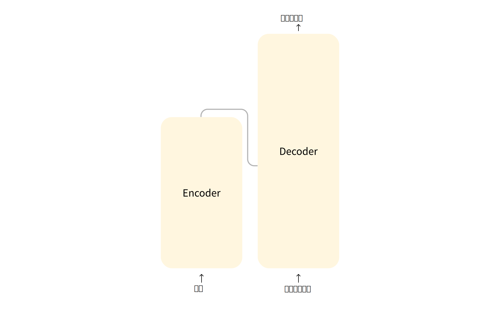
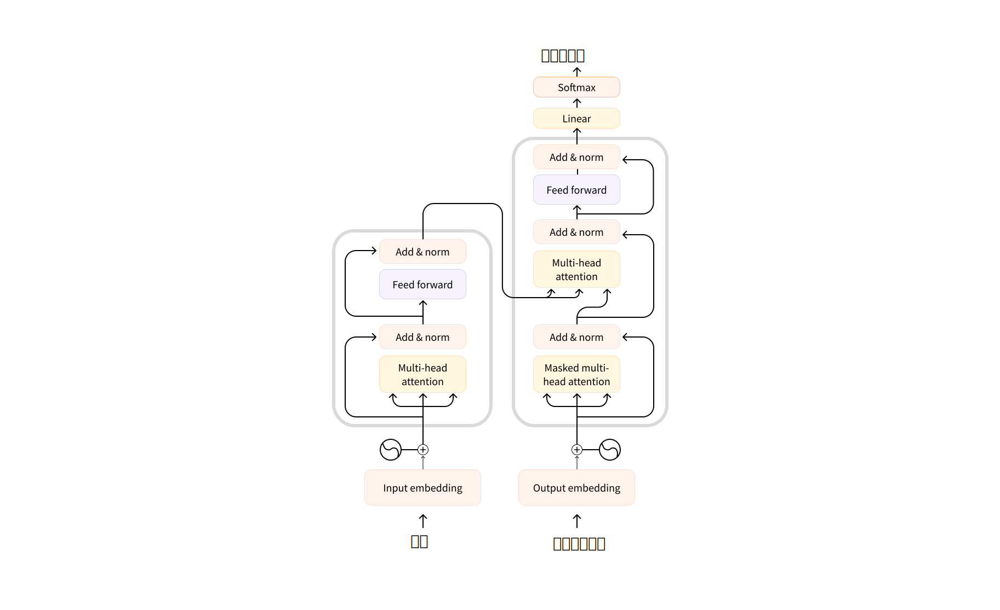

## 2.3 Transformer模型的工作原理？ 

在本节中，我们简要了解 Transformer 模型的架构。

### Transformers的发展历史 

以下是 Transformer 模型发展历史中的一些简要的关键节点：

[Transformer 架构](https://arxiv.org/abs/1706.03762)(https://arxiv.org/abs/1706.03762) 于 2017 年 6 月提出，原本研究的重点是翻译任务，随后推出了几个有影响力的模型，包括

- **2018 年 6 月**: [GPT](https://cdn.openai.com/research-covers/language-unsupervised/language_understanding_paper.pdf)(https://cdn.openai.com/research-covers/language-unsupervised/language_understanding_paper.pdf), 第一个预训练的 Transformer 模型，用于各种 NLP 任务并获得极好的结果

- **2018 年 10 月**: [BERT](https://arxiv.org/abs/1810.04805)(https://arxiv.org/abs/1810.04805), 另一个大型预训练模型，该模型旨在生成更好的句子摘要（下一章将详细介绍！）

- **2019 年 2 月**: [GPT-2](https://cdn.openai.com/better-language-models/language_models_are_unsupervised_multitask_learners.pdf)(https://cdn.openai.com/better-language-models/language_models_are_unsupervised_multitask_learners.pdf), GPT 的改进（并且更大）版本，由于道德问题没有立即公开发布

- **2019 年 10 月**: [DistilBERT](https://arxiv.org/abs/1910.01108)(https://arxiv.org/abs/1910.01108), BERT 的提炼版本，速度提高 60%，内存减轻 40%，但仍保留 BERT 97% 的性能

- **2019 年 10 月**: [BART](https://arxiv.org/abs/1910.13461)(https://arxiv.org/abs/1910.13461) 和 [T5](https://arxiv.org/abs/1910.10683)(https://arxiv.org/abs/1910.10683), 两个使用与原始 Transformer 模型原始架构的大型预训练模型（第一个这样做）

- **2020 年 5 月**, [GPT-3](https://arxiv.org/abs/2005.14165)(https://arxiv.org/abs/2005.14165), GPT-2 的更大版本，无需微调即可在各种任务上表现良好（称为零样本学习）

此列表远非详尽无遗，而是为了突出一些 Transformer 模型的不同类型，可以大致分为三类：

- GPT-like (也被称作自回归Transformer模型)

- BERT-like (也被称作自动编码Transformer模型)

- BART/T5-like (也被称作序列到序列的 Transformer模型)

后面我们将更深入地探讨这些类型。

### Transformers是语言模型 

上面提到的所有 Transformer 模型（GPT、BERT、BART、T5 等）都是被训练好的语言模型，他们已经以无监督学习的方式接受大量原始文本的训练。无监督学习是一种训练类型，需要的目标是根据模型的输入自动计算的，不需要人工来标记数据。

这种类型的模型可以对其训练过的语言进行统计学的理解，但对于实际任务的效果不是很好。因此一般的预训练模型会经历一个称为*迁移学习*的过程，使模型在给定任务上通过监督方式（使用人工注释标签）来进行微调。

举个例子：比如阅读 *n* 个单词的句子来预测下一个单词，这被称为因果语言建模，因为输出取决于过去和现在的输入，而不依赖于未来的输入。

另一个例子是*遮罩语言建模*（又被称为完形填空)，这个例子用来预测句子中被遮住的词，像做英文考试的完形填空一样。

### Transformer是大模型 

除了一些特例（如 DistilBERT）外，实现更好性能的一般策略是增加模型的大小以及预训练的数据量。

然而训练任何大模型都需要大量的数据，时间和计算资源，甚至会对环境产生影响，如下图所示。

这里只是显示了一支团队领导的大模型项目，该团队已经试图减少预训练对环境的影响，然而他们发现如果为了获得最佳超参数而进行大量试验，所造成的碳排放当量会更高。想象一下，如果每次一个学生组织、一个研究团队或一家公司想要训练一个模型，都从头开始训练的。这将导致巨大的和不必要的浪费。这就体现了共享语言模型的重要性：共享经过训练的权重，当遇见新的需求时在预训练的权重之上进行微调，可以降低模型训练时的算力和时间消耗，降低全球的总体训练成本和碳排放。

您可以通过多种工具评估模型训练的碳排放。 例如 [ML CO2 Impact](https://mlco2.github.io/impact/)(https://mlco2.github.io/impact/) 或集成在 Transformers 中的 [Code Carbon](https://codecarbon.io/)(https://codecarbon.io/)。 要了解更多相关信息，您可以阅读这篇博客文章，它将向您展示如何生成 `emissions.csv` 文件估计训练的碳排放，这里还有 Transformers 关于碳排放的[文档](https://huggingface.co/docs/hub/model-cards-co2)(https://huggingface.co/docs/hub/model-cards-co2)。

### 迁移学习 

*预训练*是指随机初始化权重，在没有任何先验知识的情况下从头开始训练模型。这种预训练通常需要海量的数据，因此甚至可能需要花费几周的时间。

*微调*是在模型经过预训练后完成的训练。要执行微调，首先需要获取一个经过预训练的语言模型，然后根据特定于任务的数据集进行额外的训练。这里您可能会有疑问：为什么不直接对实际的特定任务而训练呢？有几个原因：

* 预训练模型的数据集和微调数据集存在一些相似之处。因此，微调过程能够利用模型在预训练期间获得的知识（例如对于NLP问题，预训练模型将对您在任务中使用的语言有某种统计规律上的理解）。

* 预训练模型已经在大量数据上进行了训练，因此微调只需要较少的数据就可以获得不错的训练结果。

* 原因和上面两点相同，微调获得好的训练结果所需的时间和资源要比直接对特定任务进行预训练要少得多

例如，可以使用基于英语的预训练过的模型，然后在arXiv语料库上对其进行微调，从而形成一个基于科学或者基于研究的模型。微调只需要有限的数据量，预训练模型获得的知识可以“迁移”到目标任务上，因此被称为*迁移学习*。

因此，微调模型具有较低的时间、数据、财务和环境成本。这为迭代不同的微调方案创造了更快、更容易的条件，与完整的预训练相比约束更少。这个过程也会比从头开始的训练（除非你有很多数据）取得更好的效果，这就是为什么我们首先应该尝试利用一个预训练好的模型--一个尽可能接近手头任务的模型--并对其进行微调。

### Transformer模型的通用架构 

在本节中，我们将概述Transformer模型的通用架构。如果本节结束后不完全理解其中的一些概念也不用担心，后面的章节将详细介绍每个组件。

### 结构概述 

该模型主要由两个块组成：

* **Encoder (左侧)**: 编码器，接收输入并构建其表示（其特征），模型的任务是从输入中获取理解。

* **Decoder (右侧)**: 解码器，使用编码器的表示（特征）以及其他输入来生成目标序列，模型的任务是生成输出。

在这些部件中每一个都可以独立使用，具体取决于任务：

* **Encoder-only 模型**: 适用于需要理解输入的任务，如句子分类和命名实体识别；

* **Decoder-only 模型**: 适用于生成任务，如文本生成。

* **Encoder-decoder 模型** 或者 **sequence-to-sequence 模型**: 适用于需要根据输入进行生成输出的任务，如翻译或摘要。

在后面的章节中我们将分别深入研究这些体系结构。

### 注意力层 

Transformer模型的一个关键特性是*注意力层*。提出Transformer架构的文章的标题是[“Attention Is All You Need”](https://arxiv.org/abs/1706.03762)(https://arxiv.org/abs/1706.03762)! 我们将在后面的章节更加深入探讨注意力层的细节。现在需要知道的是注意力层将告诉模型在处理每个单词的表示时，对不同单词的重视（忽略）程度。

举个将英语翻译成法语的例子。给定输入"You like this course"时，翻译模型需要注意相邻的词"You"才能获得"like"的正确翻译，因为在法语中动词"like"的变形依赖于主语。然而对于"like"的翻译，句子的其余部分并没有用。同理当翻译"this"时模型也需要注意词"course"，因为"this"的翻译依赖关联名词是单数还是复数，而句子中的其他词对于"this"的翻译也并不重要。对于更复杂的句子和更复杂的语法规则，模型需要特别注意可能在句子中更远处出现的词来正确翻译每个词。

注意力层也适用于与自然语言相关的任何任务：一个词本身有一个含义，但这个含义受语境的影响很大，语境可以是研究该词之前或之后的其他词（或多个词）。

现在对注意力层是什么有了一些了解，接下来让我们更详细地学习一下Transformer架构。

### Transformer的原始结构 

Transformer架构最初是为翻译而设计的。在训练期间，编码器接收特定语言的输入（句子），而解码器需要输出对应语言的翻译。在编码器中，注意力层可以使用一个句子中的所有单词，正如上面的例子中，给定单词的翻译可以取决于它所在句子中的其他单词。但解码器是按顺序工作的，并且只能注意它已经翻译过的句子中的单词。例如，当我们预测了翻译目标的前三个单词时，就可以把它们提供给解码器，接着解码器使用编码器的所有输出来尝试预测第四个单词。

为了在训练过程中加快速度，同时保证模型可以访问目标句子时，解码器会被输入整个目标句子，但不允许获取到要翻译的单词。以上面的四个单词为例，如果解码器在尝试预测第四个单词时已经可以访问该位置的单词，那么它就会偷懒，直接输出该单词，从而无法学习到正确的语言关系；所以当试图预测第四个单词时，注意力层只能获取前三个单词。

原始Transformer架构如下所示，编码器位于左侧，解码器位于右侧：

这里要注意解码器中的第一个注意力层关联到解码器过去所有的输入，但第二个注意力层只使用编码器的输出，因此解码器在预测当前单词时可以使用整个句子的信息。这非常有效，因为不同的语言的语法规则把词放在不同顺序，而且句子后面提供的一些上下文可能有助于确定单词的最佳翻译。

同时，可以在编码器/解码器中使用*attention mask（注意力遮罩层）*，以此来防止模型关注到某些特殊单词，比如用于在批量处理句子时保证所有输入长度一致的特殊填充词。

### architecture（架构）与checkpoints（检查点参数）

在本书中，当我们深入探讨Transformers模型时，您将看到架构、参数和模型。这些术语的含义略有不同：

* **architecture（架构）**: 模型的骨架，即每个层的定义以及模型中发生的每个操作；

* **Checkpoints（检查点参数）**: 在模型训练到达到一定程度之后，根据模型表现（检查）的好坏保持的架构中加载的权重，即一些具体的数值；

* **Model（模型）**: 一个没有“架构”或“参数”那么精确的笼统术语，可以指前两者。为了避免歧义，本书统一使用架构和参数。

例如，BERT是一个架构，而 `bert-base-cased`是谷歌团队为BERT的第一个版本训练的一组权重参数，我们称之为参数。其实也就是所谓的“BERT模型”和"`bert-base-cased`模型"。

