# 第八章 掌握主要的 NLP 任务 

在第四章，你了解了如何微调文本分类模型。在本章中，我们将处理以下常见的 NLP 任务：

- Token 分类
- 掩码语言建模（如 BERT）
- 文本摘要
- 翻译
- 因果语言建模预训练（如 GPT-2）
- 问答

{#if fw === 'pt'}

为此，你需要充分利用在第四章中学到的有关 `Trainer` API 和 Accelerate 库的知识，以及在第六章中学到的 Datasets 库和第七章中学到的 Tokenizers 库的知识。我们还会像在第五章中那样将结果上传到 Model Hub，所以这真的是所有所学内容融会贯通的一章！

本章的每个部分都可以独立阅读，它们将向你展示如何使用 `Trainer` API 或自己的训练循环来训练模型，同时使用 Accelerate 加速。你可以随意跳过其中任意部分，重点关注你最感兴趣的部分： `Trainer` API 非常适合微调（fine-tuning）或训练模型，而无需担心背后的细节，而使用 `Accelerate` 的训练循环将使你更容易自定义所需的任何结构。

{:else}

为此，你需要充分利用在第四章中学到的有关 `Keras` API、第六章中的 Datasets 库以及第七章中的 Tokenizers 库的所有知识。我们还会像在第五章中那样将结果上传到 Model Hub，所以这真的是所有所学内容融会贯通的一章！

本章每个部分都可以独立阅读。

{/if}

<div custom-style="Tip-green">

如果你按顺序阅读这些部分，你会注意到它们在代码和描述上有许多相似之处。这种重复是有意为之的，让你可以随时钻研（或稍后再回看）任何你感兴趣的任务并找到一个完整的可运行示例。

</div>


## 8.1 Token 分类 

我们将首先探讨的应用是 Token 分类。这个通用任务涵盖了所有可以表述为“给句子中的词或字贴上标签”的问题，例如：

- **实体命名识别 （NER）**：找出句子中的实体（如人物、地点或组织）。这可以通过为每个实体或“无实体”指定一个类别的标签。
- **词性标注 （POS）**：将句子中的每个单词标记为对应于特定的词性（如名词、动词、形容词等）。
- **分块（chunking）**：找出属于同一实体的 tokens 这个任务（可以与词性标注或命名实体识别结合）可以被描述为将位于块开头的 token 赋予一个标签（通常是 “ `B-` ” （Begin）），将位于块内的 tokens 赋予另一个标签（通常是 “ `I-` ”（inner）），将不属于任何块的 tokens 赋予第三个标签（通常是 “ `O` ” （outer））。

当然，还有很多其他类型的 token 分类问题；这些只是几个有代表性的例子。在本节中，我们将在 NER 任务上微调模型 （BERT），然后该模型将能够计算如下预测：

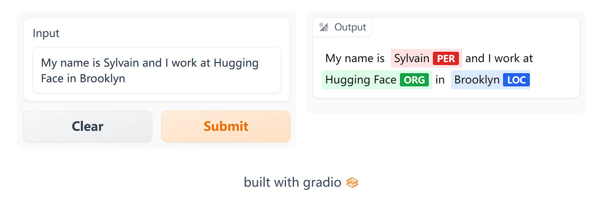

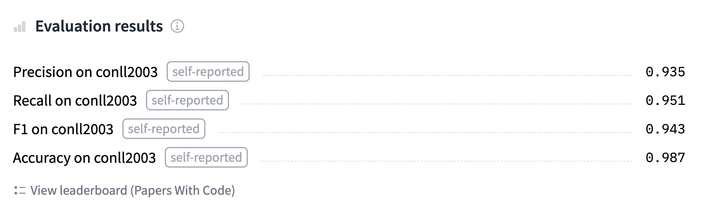

你可以 [在这里](https://huggingface.co/huggingface-course/bert-finetuned-ner?text=My+name+is+Sylvain+and+I+work+at+Hugging+Face+in+Brooklyn)(https://huggingface.co/huggingface-course/bert-finetuned-ner?text=My+name+is+Sylvain+and+I+work+at+Hugging+Face+in+Brooklyn) 。找到我们将训练并上传到 Hub 的模型，可以尝试输入一些句子看看模型的预测结果。

### 准备数据 

首先，我们需要一个适合 token 分类的数据集。在本节中，我们将使用 [CoNLL-2003 数据集](https://huggingface.co/datasets/conll2003)(https://huggingface.co/datasets/conll2003) ，该数据集包含了来自路透社的新闻故事。

<div custom-style="Tip-green">

💡 只要你的数据集由带有相应标签的分词文本组成，你就能够将这里描述的数据处理过程应用到你自己的数据集。如果需要复习如何在 `Dataset` 中加载自定义数据集，请复习第六章。

</div>

#### CoNLL-2003 数据集 

要加载 CoNLL-2003 数据集，我们可以使用Datasets 库的 `load_dataset()` 方法：

```python
from datasets import load_dataset

raw_datasets = load_dataset("conll2003")
```

这将下载并缓存数据集，就像和我们在第四章加载 GLUE MRPC 数据集一样。查看这个对象可以让我们看到存在哪些列，以及训练集、验证集和测试集之间是如何分割的：

```python
raw_datasets
```

```python
DatasetDict({
    train: Dataset({
        features: ['chunk_tags', 'id', 'ner_tags', 'pos_tags', 'tokens'],
        num_rows: 14041
    })
    validation: Dataset({
        features: ['chunk_tags', 'id', 'ner_tags', 'pos_tags', 'tokens'],
        num_rows: 3250
    })
    test: Dataset({
        features: ['chunk_tags', 'id', 'ner_tags', 'pos_tags', 'tokens'],
        num_rows: 3453
    })
})
```

看到数据集包含了我们之前提到的三项任务的标签：命名实体识别（NER）、词性标注（POS）以及分块（chunking）。这个数据集与其他数据集的一个显著区别在于，输入文本并非以句子或文档的形式呈现，而是以单词列表的形式（最后一列被称为 `tokens` ，不过 `tokens` 列保存的还是单词，也就是说，这些预先分词的输入仍需要经过 tokenizer 进行子词分词处理）。

我们来看看训练集的第一个元素：

```python
raw_datasets["train"][0]["tokens"]
```

```python
['EU', 'rejects', 'German', 'call', 'to', 'boycott', 'British', 'lamb', '.']
```

由于我们要进行命名实体识别，让我们查看一下 NER 标签：

```python
raw_datasets["train"][0]["ner_tags"]
```

```python
[3, 0, 7, 0, 0, 0, 7, 0, 0]
```

这些是为训练准备的整数类别标签，但当我们想要检查数据时，它们不是很直观。就像在文本分类中，我们可以通过查看数据集的 `features` 属性来访问这些整数和标签名称之间的对应关系：

```python
ner_feature = raw_datasets["train"].features["ner_tags"]
ner_feature
```

```python
Sequence(feature=ClassLabel(num_classes=9, names=['O', 'B-PER', 'I-PER', 'B-ORG', 'I-ORG', 'B-LOC', 'I-LOC', 'B-MISC', 'I-MISC'], names_file=None, id=None), length=-1, id=None)
```

因此，这一列包含的元素是 `ClassLabels` 的序列。序列元素的类型在 `ner_feature` 的 `feature` 中，我们可以通过查看该 `feature` 的 `names` 属性来访问标签名称的列表：

```python
label_names = ner_feature.feature.names
label_names
```

```python
['O', 'B-PER', 'I-PER', 'B-ORG', 'I-ORG', 'B-LOC', 'I-LOC', 'B-MISC', 'I-MISC']
```

我们在第七章，深入研究 `token-classification` 管道时已经看到了这些标签 我们在这里进行一个快速的回顾：

- `O` 表示这个词不对应任何实体。
- `B-PER` / `I-PER` 意味着这个词对应于人名实体的开头/内部。
- `B-ORG` / `I-ORG` 的意思是这个词对应于组织名称实体的开头/内部。
- `B-LOC` / `I-LOC` 指的是是这个词对应于地名实体的开头/内部。
- `B-MISC` / `I-MISC` 表示该词对应于一个杂项实体的开头/内部。

现在解码我们之前看到的标签，我们得到以下的输出：

```python
words = raw_datasets["train"][0]["tokens"]
labels = raw_datasets["train"][0]["ner_tags"]
line1 = ""
line2 = ""
for word, label in zip(words, labels):
    full_label = label_names[label]
    max_length = max(len(word), len(full_label))
    line1 += word + " " * (max_length - len(word) + 1)
    line2 += full_label + " " * (max_length - len(full_label) + 1)

print(line1)
print(line2)
```

```python
'EU    rejects German call to boycott British lamb .'
'B-ORG O       B-MISC O    O  O       B-MISC  O    O'
```

我们还可以查看训练集中索引为 4 的元素，它是一个同时包含 `B-` 和 `I-` 标签的例子：

```python
'Germany \'s representative to the European Union \'s veterinary committee Werner Zwingmann said on Wednesday consumers should buy sheepmeat from countries other than Britain until the scientific advice was clearer .'
'B-LOC   O  O              O  O   B-ORG    I-ORG O  O          O         B-PER  I-PER     O    O  O         O         O      O   O         O    O         O     O    B-LOC   O     O   O          O      O   O       O'
```

正如我们在上面的输出中所看到的，跨越两个单词的实体，如“European Union”和“Werner Zwingmann”，模型把第一个单词标注为了 B- 标签，为第二个单词标记为了 I- 标签。

<div custom-style="Tip-green">

✏️ **轮到你了！** 使用词性标注 （POS）或分块（chunking）识别同一个句子，查看输出的结果。

</div>

#### 处理数据 

像往常一样，我们的文本需要转换为 Token ID，然后模型才能理解它们。正如我们在第七章所学的那样。不过在 tokens 分类任务中，一个很大的区别是我们有 pre-tokenized 的输入。幸运的是，tokenizer API 可以很容易地处理这个问题；我们只需要通过一个特殊的标志告诉 tokenizer。

首先，让我们创建 `tokenizer` 对象。如前所述，我们将使用 BERT 预训练模型，因此我们将从下载并缓存关联的 tokenizer 开始：

```python
from transformers import AutoTokenizer

model_checkpoint = "bert-base-cased"
tokenizer = AutoTokenizer.from_pretrained(model_checkpoint)
```

你可以更换把 `model_checkpoint` 更换为 [Hub](https://huggingface.co/models)(https://huggingface.co/models) 上任何你喜欢的其他型号，或使用你本地保存的预训练模型和 tokenizer。唯一的限制是 tokenizer 需要由 Tokenizers 库支持，并且有一个“快速”版本可用。你可以在 [这张大表](https://huggingface.co/transformers/#supported-frameworks)(https://huggingface.co/transformers/#supported-frameworks) 上看到所有带有快速版本的架构，或者检查你可以通过查看它 `is_fast` 属性来检测正在使用的 `tokenizer` 对象是否由 Tokenizers 支持：

```python
tokenizer.is_fast
```

```python
True
```

我们可以像往常一样使用我们的 `tokenizer` 对预先分词的输入进行子词分词，只需额外添加 `is_split_into_words=True` ：

```python
inputs = tokenizer(raw_datasets["train"][0]["tokens"], is_split_into_words=True)
inputs.tokens()
```

```python
['[CLS]', 'EU', 'rejects', 'German', 'call', 'to', 'boycott', 'British', 'la', '##mb', '.', '[SEP]']
```

如我们所见，tokenizer 添加了模型使用的特殊 tokens（在开始的 `[CLS]` ，在结束的 `[SEP]` ），并且大部分单词保持不变。然而，单词 `lamb` 被分词为两个子词， `la` 和 `##mb` 。这导致了输入和标签之间的不匹配：标签列表只有 9 个元素，而我们的输入现在有 12 个 tokens。解决特殊 tokens 的问题很容易（我们知道它们在开始和结束的位置），但我们还需要确保我们将所有的标签与正确的词对齐。

幸运的是，由于我们使用的是快速 tokens 因此我们可以使用Tokenizers 超能力，这意味着我们可以轻松地将每个 token 映射到其相应的单词（如第七章中所学）：

```python
inputs.word_ids()
```

```python
[None, 0, 1, 2, 3, 4, 5, 6, 7, 7, 8, None]
```

只需要一点点工作，我们就可以扩展我们的标签列表来匹配 tokens。我们将添加的第一条规则是，特殊 tokens 的标签是 `-100` 。这是因为默认情况下， `-100` 会被我们的损失函数（交叉熵）忽略。然后，每个 token 得到的标签与其所在的词的开始的 token 相同，因为它们是同一实体的一部分。因此对于词内部但不在开始位置的 tokens，我们将 `B-` 替换为 `I-` （因为该 token 不是实体的开始）：

```python
def align_labels_with_tokens(labels, word_ids):
    new_labels = []
    current_word = None
    for word_id in word_ids:
        if word_id != current_word:
            # 新单词的开始!
            current_word = word_id
            label = -100 if word_id is None else labels[word_id]
            new_labels.append(label)
        elif word_id is None:
            # 特殊的token
            new_labels.append(-100)
        else:
            # 与前一个 tokens 类型相同的单词
            label = labels[word_id]
            # 如果标签是 B-XXX 我们将其更改为 I-XXX
            if label % 2 == 1:
                label += 1
            new_labels.append(label)

    return new_labels
```

让我们在我们的第一句话上试一试：

```python
labels = raw_datasets["train"][0]["ner_tags"]
word_ids = inputs.word_ids()
print(labels)
print(align_labels_with_tokens(labels, word_ids))
```

```python
[3, 0, 7, 0, 0, 0, 7, 0, 0]
[-100, 3, 0, 7, 0, 0, 0, 7, 0, 0, 0, -100]
```

正如我们所看到的，我们的函数为开头和结尾的两个特殊 tokens 添加了 `-100` ，并为切分成两个 tokens 的单词添加了一个新的 `0` 。

<div custom-style="Tip-green">

✏️ **轮到你了！** 有些研究人员更喜欢每个单词只分配一个标签，对该单词其他部分分配 `-100` 。这是为了避免那些分解成许多子子词的长单词对损失作出过重的贡献。请按照这个规则，改变之前的函数，使标签与 inputs ID 对齐。

</div>

为了预处理我们的整个数据集，我们需要对所有输入进行 tokenize，并使用 `align_labels_with_tokens()` 函数处理所有标签。为了充分利用我们快速 tokenizer 的速度，最好是同时对大量文本 tokenize，所以我们将编写一个处理一组示例的函数，并使用带有 `batched=True` 选项的 `Dataset.map()` 方法。与我们之前的示例唯一不同的是，当 tokenizer 的输入是文本列表（或示例中单词的列表的列表）时， `word_ids()` 函数需要获取我们示例中单词 ID 的索引，所以我们也添加了这个功能：

```python
def tokenize_and_align_labels(examples):
    tokenized_inputs = tokenizer(
        examples["tokens"], truncation=True, is_split_into_words=True
    )
    all_labels = examples["ner_tags"]
    new_labels = []
    for i, labels in enumerate(all_labels):
        word_ids = tokenized_inputs.word_ids(i)
        new_labels.append(align_labels_with_tokens(labels, word_ids))

    tokenized_inputs["labels"] = new_labels
    return tokenized_inputs
```

注意，我们还没有填充我们的输入，我们将在稍后进行，即在使用数据整理器创建 batch 时。

我们现在可以一次性使用所有预处理处理数据集的其他部分：

```python
tokenized_datasets = raw_datasets.map(
    tokenize_and_align_labels,
    batched=True,
    remove_columns=raw_datasets["train"].column_names,
)
```

我们已经完成了最困难的部分！现在数据已经经过了预处理，实际的训练过程将会与我们在第四章所做的很相似。

### 使用 Trainer API 微调模型 

使用 `Trainer` / `Keras` 的实际代码会和以前非常相似，唯一的变化是如何将数据整理成 batch 以及评估计算函数的变化。

#### 整理数据 

我们不能像第四章那样只使用一个 `DataCollatorWithPadding` ，因为那样只会填充输入（inputs ID、注意掩码和 tokens 类型 ID）。在这里我们应该对标签也使用与输入完全相同的方式填充，以保证它们的大小相同。我们将使用 `-100` 进行填充，以便在损失计算中忽略相应的预测。

这些可以由 [`DataCollatorForTokenClassification`](https://huggingface.co/transformers/main_classes/data_collator.html#datacollatorfortokenclassification)(https://huggingface.co/transformers/main_classes/data_collator.html#datacollatorfortokenclassification) 实现。它是一个带有填充功能的数据整理器，使用时只需要传入用于预处理输入的 `tokenizer` ：

{#if fw === 'pt'}

```python
#####Pytorch}
from transformers import DataCollatorForTokenClassification

data_collator = DataCollatorForTokenClassification(tokenizer=tokenizer)####end
```

{:else}

```python
#####TensorFlow}
from transformers import DataCollatorForTokenClassification

data_collator = DataCollatorForTokenClassification(
    tokenizer=tokenizer, return_tensors="tf"
)####end
```

{/if}

为了在几个样本上测试这一点，我们可以在训练集中的几个示例上调用它：

```python
batch = data_collator([tokenized_datasets["train"][i] for i in range(2)])
batch["labels"]
```

```python
tensor([[-100,    3,    0,    7,    0,    0,    0,    7,    0,    0,    0, -100],
        [-100,    1,    2, -100, -100, -100, -100, -100, -100, -100, -100, -100]])
```

让我们将其与数据集中第一个和第二个元素的标签进行比较：

```python
for i in range(2):
    print(tokenized_datasets["train"][i]["labels"])
```

```python
[-100, 3, 0, 7, 0, 0, 0, 7, 0, 0, 0, -100]
[-100, 1, 2, -100]
```

{#if fw === 'pt'}

正如我们所看到的，第二组标签的长度已经使用 `-100` 填充到与第一组标签相同。

{:else}

我们的数据整理器已准备就绪！现在让我们使用 `to_tf_dataset()` 方法创建一个 `tf.data.Dataset` 。你还可以使用 `model.prepare_tf_dataset()` 来使用更少的模板代码来完成此操作——你将在本章的其他小节中看到这一点。
```python
#####TensorFlow}
tf_train_dataset = tokenized_datasets["train"].to_tf_dataset(
    columns=["attention_mask", "input_ids", "labels", "token_type_ids"],
    collate_fn=data_collator,
    shuffle=True,
    batch_size=16,
)

tf_eval_dataset = tokenized_datasets["validation"].to_tf_dataset(
    columns=["attention_mask", "input_ids", "labels", "token_type_ids"],
    collate_fn=data_collator,
    shuffle=False,
    batch_size=16,
)####end
```

下一站：模型本身。

{/if}

{#if fw === 'tf'}

#### 定义模型

由于我们正在研究 Token 分类问题，因此我们将使用 `TFAutoModelForTokenClassification` 类。定义此模型时要记得传递我们标签的数量，最简单方法是将该数字传递给 `num_labels` 参数，但是如果我们想要一个就像我们在本节开头看到的那样的推理小部件，最好设置正确的标签对应关系。

应该由两个字典 `id2label` 和 `label2id` 来设置它们，这两个字典包含从 ID 到标签的映射以及反向的映射：

```python
#####TensorFlow}
id2label = {str(i): label for i, label in enumerate(label_names)}
label2id = {v: k for k, v in id2label.items()}####end
```

现在我们只需将它们传递给 `TFAutoModelForTokenClassification.from_pretrained()` 方法，它们就会被保存在模型的配置中，然后被正确地保存和上传到 Hub：

```python
#####TensorFlow}
from transformers import TFAutoModelForTokenClassification

model = TFAutoModelForTokenClassification.from_pretrained(
    model_checkpoint,
    id2label=id2label,
    label2id=label2id,
)####end
```

就像我们在第四章中定义 `TFAutoModelForTokenClassification` 类一样 创建模型会发出一个警告，提示一些权重未被使用（来自预训练头的权重）和一些其他权重被随机初始化（来自新 Token 分类头的权重），我们将要训练这些权重。我们将在一会儿进行训练，但首先让我们确认一下我们的模型是否具有正确的标签数量：

```python
#####TensorFlow}
model.config.num_labels####end
```

```python
#####TensorFlow}
9####end
```

<div custom-style="Tip-yellow">

⚠️ 如果你的模型的标签数量错误，那么在后面调用 `model.fit()` 时，你会得到一个晦涩的错误。这可能会令人烦恼，所以确保你做了这个检查，确认确认你的标签数量是正确。

</div>

#### 微调模型

现在，我们已准备好训练模型了！不过，我们首先要做两件事：应该登录到 Hugging Face 并定义我们的训练超参数。如果你在 notebook 上工作，有一个便捷函数可以帮助你做到这一点：

```python
#####TensorFlow}
from huggingface_hub import notebook_login

notebook_login()####end
```

这将显示一个小部件，你可以在其中输入你的 Hugging Face 账号和密码。

如果你不是在 notebook 上工作，只需在终端中输入以下行：

```python
#####TensorFlow}
huggingface-cli login####end
```

登录后，我们可以准备编译我们模型所需要的所有配置。Transformers 提供了一个便捷的 `create_optimizer()` 函数，它将给你一个带有适当的权重衰减和学习率衰减设置的 `AdamW` 优化器，与内置的 `Adam` 优化器相似，不过这两个优化技巧都将提高模型的性能：

```python
#####TensorFlow}
from transformers import create_optimizer
import tensorflow as tf

## 在混合精度 float16 中进行训练
tf.keras.mixed_precision.set_global_policy("mixed_float16")

# 训练步数是数据集中的样本数量,除以 batch 大小,然后乘以总的 epoch 数。
# 注意这里的 tf_train_dataset 是 batch 形式的 tf.data.Dataset,
# 而不是原始的 Hugging Face Dataset ,所以使用 len() 计算它的长度已经是 num_samples // batch_size。
num_epochs = 3
num_train_steps = len(tf_train_dataset) * num_epochs

optimizer, schedule = create_optimizer(
    init_lr=2e-5,
    num_warmup_steps=0,
    num_train_steps=num_train_steps,
    weight_decay_rate=0.01,
)
model.compile(optimizer=optimizer)####end
```

请注意，我们没有给 `compile()` 提供 `loss` 参数。这是因为模型实际上可以内部计算损失 —— 如果你编译时没有提供损失的计算方法并在输入字典中提供标签（就像我们在数据集中所做的那样），那么模型将使用内部默认的 `loss` 计算方法进行训练，这取决于你选择的任务和模型类型。

接下来，我们定义一个 `PushToHubCallback` 回调函数，以便在训练期间将模型上传到 Hub，并使用该回调来拟合模型：

```python
#####TensorFlow}
from transformers.keras_callbacks import PushToHubCallback

callback = PushToHubCallback(output_dir="bert-finetuned-ner", tokenizer=tokenizer)

model.fit(
    tf_train_dataset,
    validation_data=tf_eval_dataset,
    callbacks=[callback],
    epochs=num_epochs,
)####end
```

你可以使用 `hub_model_id` 参数指定你想要推送的仓库的全名（特别是，如果你需要推送给某个组织，就必须使用这个参数）。例如，当我们将模型推送到 [`huggingface-course` 组织](https://huggingface.co/huggingface-course)(https://huggingface.co/huggingface-course)(https://huggingface.co/huggingface-course) 时，我们添加了 `hub_model_id="huggingface-course/bert-finetuned-ner"` 。默认情况下，使用的仓库将保存在你的账户之内，并以你设置的输出目录命名，例如 `"cool_huggingface_user/bert-finetuned-ner"` 。

<div custom-style="Tip-green">

💡 如果你使用的输出目录已经存在，那么它需要是你想推送到 hub 的仓库的本地克隆。如果不是，你在调用 `model.fit()` 时将收到一个错误，并需要设置一个新的名字。

</div>

请注意，在训练过程中每次保存模型时（这里是每个 epooch），它都会在后台上传到 Hub。这样，如有必要，你将能够在另一台机器上继续你的训练。

到此阶段，你可以在模型 Hub 上使用推理小部件来测试你的模型并与你的朋友分享。你已经成功地在一个 tokens 分类任务上微调了一个模型——恭喜你！但我们的模型真的好吗？我们应该找出一些指标来对模型进评估。

{/if}

#### 评估指标 

{#if fw === 'pt'}

要让 `Trainer` 在每个周期计算一个指标，我们需要定义一个 `compute_metrics()` 函数，该函数的输入是预测值和标签的数组，并返回带有指标名称和值的字典。

用于评估 Token 分类预测的传统框架是 [*seqeval*](https://github.com/chakki-works/seqeval)(https://github.com/chakki-works/seqeval)(https://github.com/chakki-works/seqeval) 。要使用此指标，我们首先需要安装 seqeval 库：

```python
#####Pytorch}
!pip install seqeval####end
```

然后我们可以通过 `evaluate.load()` 函数加载它，就像我们在第四章中所做的那样：

{:else}

用于评估 Token 分类预测的传统框架是 [*seqeval*](https://github.com/chakki-works/seqeval)(https://github.com/chakki-works/seqeval)(https://github.com/chakki-works/seqeval) 。要使用此指标，我们首先需要安装 seqeval 库：

```python
#####TensorFlow}
!pip install seqeval####end
```

然后我们可以通过 `evaluate.load()` 函数加载它，就像我们在第四章中所做的那样：

{/if}

```python
import evaluate

metric = evaluate.load("seqeval")
```

这个指标并不像标准的精度那样：它需要字符串形式的标签列表而不是整数，所以我们需要在将它们传递给指标之前解码预测值和标签。让我们看看它是如何工作的。首先，我们将获取我们第一个训练样本的标签：

```python
labels = raw_datasets["train"][0]["ner_tags"]
labels = [label_names[i] for i in labels]
labels
```

```python
['B-ORG', 'O', 'B-MISC', 'O', 'O', 'O', 'B-MISC', 'O', 'O']
```

然后我们可以通过更改索引 2 处的值来为这些标签创建假的预测值：

```python
predictions = labels.copy()
predictions[2] = "O"
metric.compute(predictions=[predictions], references=[labels])
```

请注意，该指标的输入是预测列表（不仅仅是一个）和标签列表。这是输出：

```python
{'MISC': {'precision': 1.0, 'recall': 0.5, 'f1': 0.67, 'number': 2},
 'ORG': {'precision': 1.0, 'recall': 1.0, 'f1': 1.0, 'number': 1},
 'overall_precision': 1.0,
 'overall_recall': 0.67,
 'overall_f1': 0.8,
 'overall_accuracy': 0.89}
```

{#if fw === 'pt'}

它返回很多信息！我们获得每个单独实体以及整体的准确率、召回率和 F1 分数。对于我们的度量计算，我们将只保留总分，但是你可以自由地调整 `compute_metrics()` 函数返回你想要查看的所有指标。 `compute_metrics()` 函数首先取 logits 的 argmax，将它们转换为预测值（通常情况下，logits 和概率的顺序是相同，所以我们不需要使用 softmax）。然后我们需要将标签和预测值都从整数转换为字符串。我们删除所有标签为 `-100` 的值，然后将结果传递给 `metric.compute()` 方法：

```python
#####Pytorch}
import numpy as np

def compute_metrics(eval_preds):
    logits, labels = eval_preds
    predictions = np.argmax(logits, axis=-1)

    # 删除忽略的索引(特殊 tokens )并转换为标签
    true_labels = [[label_names[l] for l in label if l != -100] for label in labels]
    true_predictions = [
        [label_names[p] for (p, l) in zip(prediction, label) if l != -100]
        for prediction, label in zip(predictions, labels)
    ]
    all_metrics = metric.compute(predictions=true_predictions, references=true_labels)
    return {
        "precision": all_metrics["overall_precision"],
        "recall": all_metrics["overall_recall"],
        "f1": all_metrics["overall_f1"],
        "accuracy": all_metrics["overall_accuracy"],
    }####end
```

现在已经完成了，我们几乎可以开始定义我们的 `Trainer` 了。我们只需要一个 `model` 微调！

{:else}

它返回了大量的信息！我们获得每个单独实体以及整体的准确率、召回率和 F1 分数。现在，让我们看看如果我们尝试使用我们实际的模型预测来计算一些真实的分数会发生什么。

TensorFlow 不喜欢把我们的预测拼接在一起，因为这样会导致序列长度不统一。这意味着我们不能仅仅直接使用 `model.predict()` —— 但这并不能阻止我们。我们将逐批获取一些预测并在进行的过程中将它们拼接成一个大的列表，删除表示 masking/padding 的 `-100` tokens 然后在最后的列表上计算度量值：

```python
#####TensorFlow}
import numpy as np

all_predictions = []
all_labels = []
for batch in tf_eval_dataset:
    logits = model.predict_on_batch(batch)["logits"]
    labels = batch["labels"]
    predictions = np.argmax(logits, axis=-1)
    for prediction, label in zip(predictions, labels):
        for predicted_idx, label_idx in zip(prediction, label):
            if label_idx == -100:
                continue
            all_predictions.append(label_names[predicted_idx])
            all_labels.append(label_names[label_idx])
metric.compute(predictions=[all_predictions], references=[all_labels])####end
```

```python
#####TensorFlow}
{'LOC': {'precision': 0.91, 'recall': 0.92, 'f1': 0.91, 'number': 1668},
 'MISC': {'precision': 0.70, 'recall': 0.79, 'f1': 0.74, 'number': 702},
 'ORG': {'precision': 0.85, 'recall': 0.90, 'f1': 0.88, 'number': 1661},
 'PER': {'precision': 0.95, 'recall': 0.95, 'f1': 0.95, 'number': 1617},
 'overall_precision': 0.87,
 'overall_recall': 0.91,
 'overall_f1': 0.89,
 'overall_accuracy': 0.97}####end
```

与我们的模型相比，你的模型的表现如何？如果你获得类似的数字，那么你的训练就成功了！

{/if}

{#if fw === 'pt'}

#### 定义模型

由于我们正在研究 Token 分类问题，因此我们将使用 `AutoModelForTokenClassification` 类。定义此模型时要记得传递我们标签的数量，最简单方法是将该数字传递给 `num_labels` 参数，但是如果我们想要一个就像我们在本节开头看到的那样的推理小部件，最好设置正确的标签对应关系。

应该由两个字典 `id2label` 和 `label2id` 来设置它们，这两个字典包含从 ID 到标签的映射以及反向的映射：

```python
#####Pytorch}
id2label = {str(i): label for i, label in enumerate(label_names)}
label2id = {v: k for k, v in id2label.items()}####end
```

现在我们只需将它们传递给 `AutoModelForTokenClassification.from_pretrained()` 方法，它们就会被保存在模型的配置中，然后被正确地保存和上传到 Hub：

```python
#####Pytorch}
from transformers import AutoModelForTokenClassification

model = AutoModelForTokenClassification.from_pretrained(
    model_checkpoint,
    id2label=id2label,
    label2id=label2id,
)####end
```

就像我们在第四章中定义 `AutoModelForSequenceClassification` 类一样 创建模型会发出一个警告，提示一些权重未被使用（来自预训练头的权重）和一些其他权重被随机初始化（来自新 Token 分类头的权重），我们将要训练这些权重。我们将在一会儿进行训练，但首先让我们确认一下我们的模型是否具有正确的标签数量：

```python
#####Pytorch}
model.config.num_labels####end
```

```python
#####Pytorch}
9####end
```

<div custom-style="Tip-yellow">

⚠️ 如果你的模型的标签数量错误，那么在后面调用 `Trainer.train()` 时，你会得到一个晦涩的错误（类似于“CUDA error：device-side assert triggered”）。这可能会令人烦恼，所以确保你做了这个检查，确认你的标签数量是正确。

</div>

#### 微调模型

我们现在准备好训练我们的模型了！在定义我们的 `Trainer` 之前，我们只需要做最后两件事：登录 Hugging Face 并定义我们的训练参数。如果你在 notebook 上工作，有一个方便的功能可以帮助你：

```python
#####Pytorch}
from huggingface_hub import notebook_login

notebook_login()####end
```
现在，我们已准备好训练模型了！不过，我们首先要做两件事：应该登录到 Hugging Face 并定义我们的训练超参数。如果你在 notebook 上工作，有一个便利函数可以帮助你做到这一点：

```python
#####Pytorch}
huggingface-cli login####end
```

登录后，我们就可以定义我们的 `TrainingArguments` ：

```python
#####Pytorch}
from transformers import TrainingArguments

args = TrainingArguments(
    "bert-finetuned-ner",
    evaluation_strategy="epoch",
    save_strategy="epoch",
    learning_rate=2e-5,
    num_train_epochs=3,
    weight_decay=0.01,
    push_to_hub=True,
)####end
```

你已经对大多数内容有所了解了：我们设置了一些超参数（如学习率、训练的轮数和权重衰减），并指定 `push_to_hub=True` ，以表示我们希望在每个训练轮次结束时保存并评估模型，并希望将结果上传到模型中心。注意，你可以通过 `hub_model_id` 参数指定你想推送的仓库的名称（特别是，如果你需要推送给某个组织，就必须使用这个参数）。例如，当我们将模型推送到 [`huggingface-course` 组织](https://huggingface.co/huggingface-course)(https://huggingface.co/huggingface-course)(https://huggingface.co/huggingface-course) 时，我们在 `TrainingArguments` 中添加了 `hub_model_id="huggingface-course/bert-finetuned-ner"` 。默认情况下，使用的仓库将保存在你的账户之内，并以你设置的输出目录命名，所以在我们的例子中，仓库的地址是 `"sgugger/bert-finetuned-ner"` 。

<div custom-style="Tip-green">

💡 如果你使用的输出目录已经存在，那么它需要是你想推送到 hub 的仓库的本地克隆。如果不是，你将在声明 `Trainer` 时遇到错误，并需要设置一个新的名字。

</div>

最后，我们将所有内容传递给 `Trainer` 并启动训练：

```python
#####Pytorch}
from transformers import Trainer

trainer = Trainer(
    model=model,
    args=args,
    train_dataset=tokenized_datasets["train"],
    eval_dataset=tokenized_datasets["validation"],
    data_collator=data_collator,
    compute_metrics=compute_metrics,
    tokenizer=tokenizer,
)
trainer.train()####end
```

请注意，在训练过程中每次保存模型时（这里是每个 epooch），它都会在后台上传到 Hub。这样，如有必要，你将能够在另一台机器上继续你的训练。

训练完成后，我们使用 `push_to_hub()` 上传模型的最新版本

```python
#####Pytorch}
trainer.push_to_hub(commit_message="Training complete")####end
```

如果你想检查一下是否上传成功，这个命令会返回刚刚执行的提交的 URL：

```python
#####Pytorch}
'https://huggingface.co/sgugger/bert-finetuned-ner/commit/26ab21e5b1568f9afeccdaed2d8715f571d786ed'####end
```

同时 `Trainer` 还创建并上传了一张包含所有评估结果的模型卡。到此阶段，你可以在模型 Hub 上使用推理小部件来测试你的模型并与你的朋友分享。你已经成功地在一个 tokens 分类任务上微调了一个模型——恭喜你！

如果你想更深入地了解训练循环，我们现在将向你展示如何使用 Accelerate 做同样的事情。

### 自定义训练循环 

现在我们来看看完整的训练循环，这样你就可以轻松地定制你需要的部分。它与我们在第四章中所做的内容很相似，但对评估部分有一些改动。

#### 做好训练前的准备 

首先我们需要为我们的数据集构建 `DataLoader` 。我们将 `data_collator` 输入 `collate_fn` 参数并打乱训练集，但不打乱验证集：

```python
#####Pytorch}
from torch.utils.data import DataLoader

train_dataloader = DataLoader(
    tokenized_datasets["train"],
    shuffle=True,
    collate_fn=data_collator,
    batch_size=8,
)
eval_dataloader = DataLoader(
    tokenized_datasets["validation"], collate_fn=data_collator, batch_size=8
)####end
```

接下来我们重新实例化我们的模型，以确保我们不是继续之前的微调，而是重新开始从 BERT 预训练模型：

```python
#####Pytorch}
model = AutoModelForTokenClassification.from_pretrained(
    model_checkpoint,
    id2label=id2label,
    label2id=label2id,
)####end
```

然后我们需要一个优化器。我们将使用经典 `AdamW` ，它类似于 `Adam` ，但在权重衰减的方式上进行了改进：

```python
#####Pytorch}
from torch.optim import AdamW

optimizer = AdamW(model.parameters(), lr=2e-5)####end
```

当我们拥有了所有这些对象，我们就可以将它们发送到 `accelerator.prepare()` 方法：

```python
#####Pytorch}
from accelerate import Accelerator

accelerator = Accelerator()
model, optimizer, train_dataloader, eval_dataloader = accelerator.prepare(
    model, optimizer, train_dataloader, eval_dataloader
)####end
```

<div custom-style="Tip-red">

🚨 如果你正在 TPU 上训练，你需要将上面单元格开始的所有代码移动到一个专门的训练函数中。更多详情请见第四章。

</div>

现在我们已经将我们的 `train_dataloader` 传递给了 `accelerator.prepare()` ，我们可以使用 `len()` 来计算训练步骤的数量。请记住，我们应该在准备好 `dataloader` 后再使用 `len()` ，因为改动 `dataloader` 会改变其长度。我们使用一个从学习率衰减到 0 的经典线性学习率调度：

```python
#####Pytorch}
from transformers import get_scheduler

num_train_epochs = 3
num_update_steps_per_epoch = len(train_dataloader)
num_training_steps = num_train_epochs * num_update_steps_per_epoch

lr_scheduler = get_scheduler(
    "linear",
    optimizer=optimizer,
    num_warmup_steps=0,
    num_training_steps=num_training_steps,
)####end
```

最后，为了将我们的模型推送到 Hub，我们需要在一个工作文件夹中创建一个 `Repository` 对象。如果你还没有登录的话，首先需要登录到 Hugging Face，我们将根据我们想给我们的模型的模型 ID 来确定仓库名称（你可以使用你喜欢的名字替换 `repo_name` ；它只需要包含你的用户名，可以使用 `get_full_repo_name()` 函数的查看目前的 `repo_name` ）：

```python
#####Pytorch}
from huggingface_hub import Repository, get_full_repo_name

model_name = "bert-finetuned-ner-accelerate"
repo_name = get_full_repo_name(model_name)
repo_name####end
```

```python
#####Pytorch}
'sgugger/bert-finetuned-ner-accelerate'####end
```

然后我们可以将该仓库克隆到本地文件夹中。如果它已经存在，这个本地文件夹应该是我们正在使用的仓库的现有克隆：

```python
#####Pytorch}
output_dir = "bert-finetuned-ner-accelerate"
repo = Repository(output_dir, clone_from=repo_name)####end
```

我们现在可以通过调用 `repo.push_to_hub()` 方法上传保存在 `output_dir` 中的所有内容。这将帮助我们在每个训练周期结束时上传中间模型。

#### 训练循环 

我们现在准备编写完整的训练循环。为了简化其评估部分，我们定义了一个 `postprocess()` 函数，该函数接收模型的预测和标签，并将它们转换为字符串列表，也就是我们的 `metric` （评估函数）对象需要的输入格式。

```python
#####Pytorch}
def postprocess(predictions, labels):
    predictions = predictions.detach().cpu().clone().numpy()
    labels = labels.detach().cpu().clone().numpy()

    # 删除忽略的索引(特殊 tokens )并转换为标签
    true_labels = [[label_names[l] for l in label if l != -100] for label in labels]
    true_predictions = [
        [label_names[p] for (p, l) in zip(prediction, label) if l != -100]
        for prediction, label in zip(predictions, labels)
    ]
    return true_labels, true_predictions####end
```

然后我们可以编写训练循环。在定义一个进度条来跟踪训练的进行后，循环分为三个部分：

- 训练本身，这是经典的迭代过程，即在 `train_dataloader` 上进行迭代，在模型上前向传播，然后反向传递和优化参数
- 评估，在获取模型在一个 batch 上的输出之后，这里有一个需要注意的地方：由于两个进程可能已将输入和标签填充到不同的形状，我们需要使用 `accelerator.pad_across_processes()` 使预测和标签在调用 `gather()` 方法之前具有相同的形状。如果我们不这样做，评估循环将会出错或无限期挂起。然后我们将结果发送到 `metric.add_batch()` ，并在评估循环结束时调用 `metric.compute()` 。
- 保存和上传，首先保存模型和 tokenizer 然后调用 `repo.push_to_hub()` 。注意，我们使用参数 `blocking=False` 来告诉 Hub 库在一个异步进程中推送。这样，在训练时，这个指令在后台将模型和 tokenizer 推送到 hub。

以下是完整的训练循环代码：

```python
#####Pytorch}
from tqdm.auto import tqdm
import torch

progress_bar = tqdm(range(num_training_steps))

for epoch in range(num_train_epochs):
    # 训练
    model.train()
    for batch in train_dataloader:
        outputs = model(**batch)
        loss = outputs.loss
        accelerator.backward(loss)

        optimizer.step()
        lr_scheduler.step()
        optimizer.zero_grad()
        progress_bar.update(1)

    # 评估
    model.eval()
    for batch in eval_dataloader:
        with torch.no_grad():
            outputs = model(**batch)

        predictions = outputs.logits.argmax(dim=-1)
        labels = batch["labels"]

        # 填充模型的预测和标签后才能调用 gathere()
        predictions = accelerator.pad_across_processes(predictions, dim=1, pad_index=-100)
        labels = accelerator.pad_across_processes(labels, dim=1, pad_index=-100)

        predictions_gathered = accelerator.gather(predictions)
        labels_gathered = accelerator.gather(labels)

        true_predictions, true_labels = postprocess(predictions_gathered, labels_gathered)
        metric.add_batch(predictions=true_predictions, references=true_labels)

    results = metric.compute()
    print(
        f"epoch {epoch}:",
        {
            key: results[f"overall_{key}"]
            for key in ["precision", "recall", "f1", "accuracy"]
        },
    )

    # 保存并上传
    accelerator.wait_for_everyone()
    unwrapped_model = accelerator.unwrap_model(model)
    unwrapped_model.save_pretrained(output_dir, save_function=accelerator.save)
    if accelerator.is_main_process:
        tokenizer.save_pretrained(output_dir)
        repo.push_to_hub(
            commit_message=f"Training in progress epoch {epoch}", blocking=False
        )####end
```

果这是你第一次看到用 Accelerate 保存的模型，让我们花点时间来了解一下这个过程中的三行代码：

```python
#####Pytorch}
accelerator.wait_for_everyone()
unwrapped_model = accelerator.unwrap_model(model)
unwrapped_model.save_pretrained(output_dir, save_function=accelerator.save)####end
```

第一行是不言自明的：它告诉所有的进程等待，直到所有的进程都处于那个阶段再继续（阻塞）。这是为了确保在保存之前，我们在每个进程中都有相同的模型。然后获取 `unwrapped_model` ，它就是我们定义的基本模型。 `accelerator.prepare()` 方法会为了在分布式训练中工作而对模型进行了一些修改，所以它不再有 `save_pretraining()` 方法；使用 `accelerator.unwrap_model()` 方法可以撤销对模型的更改。最后，我们调用 `save_pretraining()` ，并指定 `accelerator.save()` 作为 `save_function` 而不是 `torch.save()` 。

完成这些操作后，你应该拥有一个与 `Trainer` 训练出的模型结果相当类似的模型。你可以在 [huggingface-course/bert-finetuned-ner-accelerate](https://huggingface.co/huggingface-course/bert-finetuned-ner-accelerate)(https://huggingface.co/huggingface-course/bert-finetuned-ner-accelerate) 查看我们使用这些代码训练的模型。如果你想在训练循环中测试任何调整，你可以直接通过编辑上面显示的代码来实现它们！

{/if}

### 使用微调模型 

我们已经向你展示了如何使用我们在模型中心微调的模型和推理小部件。在本地使用 `pipeline` 来使用它，你只需要指定正确的模型标签：

```python
from transformers import pipeline

## 将此替换为你自己的 checkpoint
model_checkpoint = "huggingface-course/bert-finetuned-ner"
token_classifier = pipeline(
    "token-classification", model=model_checkpoint, aggregation_strategy="simple"
)
token_classifier("My name is Sylvain and I work at Hugging Face in Brooklyn.")
```

```python
[{'entity_group': 'PER', 'score': 0.9988506, 'word': 'Sylvain', 'start': 11, 'end': 18},
 {'entity_group': 'ORG', 'score': 0.9647625, 'word': 'Hugging Face', 'start': 33, 'end': 45},
 {'entity_group': 'LOC', 'score': 0.9986118, 'word': 'Brooklyn', 'start': 49, 'end': 57}]
```

太棒了！我们的模型与此管道的默认模型一样有效！


## 8.2 微调掩码语言模型（masked language model） 

对于许多涉及 Transformer 模型的 NLP 程序，你可以简单地从 Hugging Face Hub 中获取一个预训练的模型，然后直接在你的数据上对其进行微调，以完成手头的任务。只要用于预训练的语料库与用于微调的语料库没有太大区别，迁移学习通常会产生很好的结果。

但是，在某些情况下，你需要先微调数据上的语言模型，然后再训练特定于任务的 head。例如，如果你的数据集包含法律合同或科学文章，像 BERT 这样的普通 Transformer 模型通常会将你语料库中的特定领域词视为稀有 tokens 结果性能可能不尽如人意。通过在特定领域内数据上微调语言模型，你可以提高许多下游任务的性能，这意味着你通常只需执行一次此步骤！

这种在特定领域内数据上微调预训练语言模型的过程通常称为 `领域适应（domain adaptation）` 。它于 2018 年由 [ULMFiT](https://arxiv.org/abs/1801.06146)(https://arxiv.org/abs/1801.06146) 推广，这是使迁移学习真正适用于 NLP 的首批神经架构之一 （基于 LSTM）。下图显示了使用 ULMFiT 进行领域自适应的示例；在本节中，我们将做类似的事情，但使用的是 Transformer 而不是 LSTM！

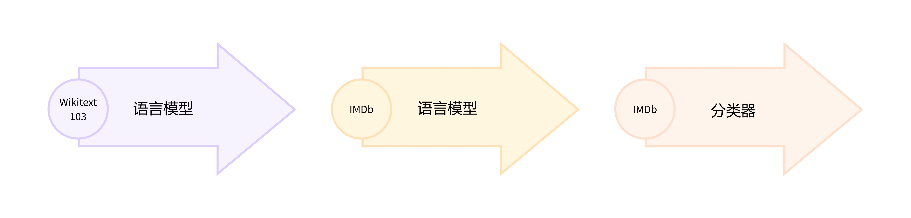

在本节结束时，你将在 Hub 上拥有一个 [掩码语言模型(masked language model)](https://huggingface.co/huggingface-course/distilbert-base-uncased-finetuned-imdb?text=This+is+a+great+%5BMASK%5D)(https://huggingface.co/huggingface-course/distilbert-base-uncased-finetuned-imdb?text=This+is+a+great+%5BMASK%5D) ，该模型可以自动完成句子，如下所示：

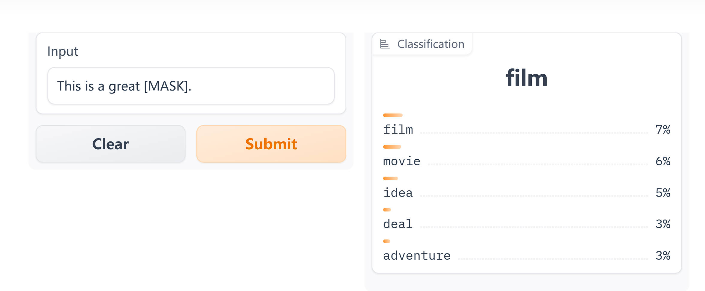

让我们开始吧！

<div custom-style="Tip-green">

🙋 如果你对“掩码语言建模”和“预训练模型”这两个术语感到陌生，请查看第二章，我们在其中解释了所有这些核心概念！

</div>

### 选择用于掩码语言建模的预训练模型 

首先，让我们为掩码语言建模选择一个合适的预训练模型。如以下屏幕截图所示，你可以通过在 [Hugging Face Hub](https://huggingface.co/models?pipeline_tag=fill-mask&sort=downloads)(https://huggingface.co/models?pipeline_tag=fill-mask&sort=downloads) 上选择“Fill-Mask”过滤器：

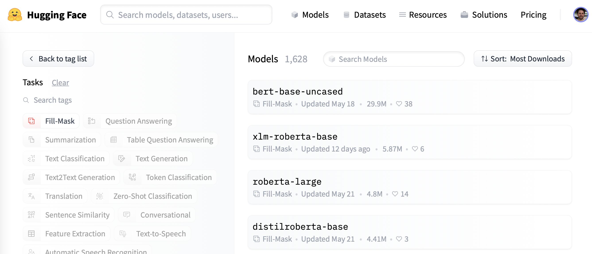
尽管 BERT 和 RoBERTa 系列模型的下载量最大，但我们将使用名为 [DistilBERT](https://huggingface.co/distilbert-base-uncased)(https://huggingface.co/distilbert-base-uncased) 的模型。它可以更快地训练，而且对下游性能几乎没有损失。这个模型使用一种称为 [`知识蒸馏（knowledge distillation）`](https://en.wikipedia.org/wiki/Knowledge_distillation)(https://en.wikipedia.org/wiki/Knowledge_distillation) 的特殊技术进行训练，其中使用像 BERT 这样的大型“教师模型”来指导参数少得多的“学生模型”的训练。在本节中对知识蒸馏细节的解释会使我们离题太远，但如果你有兴趣，可以阅读 [`使用 Transformers 进行自然语言处理（Natural Language Processing with Transformers）`](https://www.oreilly.com/library/view/natural-language-processing/9781098136789/)(https://www.oreilly.com/library/view/natural-language-processing/9781098136789/) （俗称 Transformers 教科书）相关内容。

{#if fw === 'pt'}

让我们继续，我们可以使用 `AutoModelForMaskedLM` 类下载 DistilBERT：

```python
#####Pytorch}
from transformers import AutoModelForMaskedLM

model_checkpoint = "distilbert-base-uncased"
model = AutoModelForMaskedLM.from_pretrained(model_checkpoint)####end
```

我们可以通过调用 `num_parameters()` 方法查看模型有多少参数：

```python
#####Pytorch}
distilbert_num_parameters = model.num_parameters() / 1_000_000
print(f"'>>> DistilBERT number of parameters: {round(distilbert_num_parameters)}M'")
print(f"'>>> BERT number of parameters: 110M'")####end
```

```python
#####Pytorch}
'>>> DistilBERT number of parameters: 67M'
'>>> BERT number of parameters: 110M'####end
```

{:else}

让我们继续，我们可以使用 `TFAutoModelForMaskedLM` 类下载 DistilBERT：

```python
#####TensorFlow}
from transformers import TFAutoModelForMaskedLM

model_checkpoint = "distilbert-base-uncased"
model = TFAutoModelForMaskedLM.from_pretrained(model_checkpoint)####end
```

我们可以通过调用 `summary()` 方法查看模型有多少参数：

```python
#####TensorFlow}
model(model.dummy_inputs)  # 构建模型
model.summary()####end
```

```python
#####TensorFlow}
Model: "tf_distil_bert_for_masked_lm"
_________________________________________________________________
 Layer (type)                Output Shape              Param #   
=================================================================
 distilbert (TFDistilBertMai  multiple                 66362880  
 nLayer)                                                         
                                                                 
 vocab_transform (Dense)     multiple                  590592    
                                                                 
 vocab_layer_norm (LayerNorm  multiple                 1536      
 alization)                                                      
                                                                 
 vocab_projector (TFDistilBe  multiple                 23866170  
 rtLMHead)                                                       
                                                                 
=================================================================
Total params: 66,985,530
Trainable params: 66,985,530
Non-trainable params: 0
_________________________________________________________________####end
```

{/if}

DistilBERT 大约有 6700 万个参数，大约是 BERT base 模型的二分之一，这大致意味着训练的速度提高了两倍 —— 非常棒！现在让我们看看对于下面的一小部分文本，这个模型最有可能预测什么：

```python
text = "This is a great [MASK]."
```

作为人类，我们可以想象 `[MASK]` token 有很多可能性，例如 “day”、“ride” 或者 “painting”。对于预训练模型，预测取决于模型所训练的语料库，因为它会学习获取数据中存在的统计模式。与 BERT 一样，DistilBERT 在 [English Wikipedia](https://huggingface.co/datasets/wikipedia)(https://huggingface.co/datasets/wikipedia) 和 [BookCorpus](https://huggingface.co/datasets/bookcorpus)(https://huggingface.co/datasets/bookcorpus) 数据集上进行预训练，所以我们期望对 `[MASK]` 的预测能够反映这些领域。为了预测 `[MASK]` ，我们需要 DistilBERT 的 tokenizer 来处理模型的输入，所以让我们也从 Hub 下载它：

```python
from transformers import AutoTokenizer

tokenizer = AutoTokenizer.from_pretrained(model_checkpoint)
```

有了 tokenizer 和模型，我们现在可以将我们的示例文本传递给模型，提取 logits，并打印出前 5 个候选词：

{#if fw === 'pt'}

```python
#####Pytorch}
import torch

inputs = tokenizer(text, return_tensors="pt")
token_logits = model(**inputs).logits
## 找到 [MASK] 的位置并提取其 logits
mask_token_index = torch.where(inputs["input_ids"] == tokenizer.mask_token_id)[1]
mask_token_logits = token_logits[0, mask_token_index, :]
## 选择具有最高 logits 的 [MASK] 候选词
top_5_tokens = torch.topk(mask_token_logits, 5, dim=1).indices[0].tolist()

for token in top_5_tokens:
    print(f"'>>> {text.replace(tokenizer.mask_token, tokenizer.decode([token]))}'")####end
```

{:else}

```python
#####TensorFlow}
import numpy as np
import tensorflow as tf

inputs = tokenizer(text, return_tensors="np")
token_logits = model(**inputs).logits
## 找到 [MASK] 的位置并提取其 logits
mask_token_index = np.argwhere(inputs["input_ids"] == tokenizer.mask_token_id)[0, 1]
mask_token_logits = token_logits[0, mask_token_index, :]
## 选择具有最高 logits 的 [MASK] 候选词
## 通过在 argsort 前对数组取负,来得到最大的 logits
top_5_tokens = np.argsort(-mask_token_logits)[:5].tolist()

for token in top_5_tokens:
    print(f">>> {text.replace(tokenizer.mask_token, tokenizer.decode([token]))}")####end
```

{/if}

```python
'>>> This is a great deal.'
'>>> This is a great success.'
'>>> This is a great adventure.'
'>>> This is a great idea.'
'>>> This is a great feat.'
```

我们可以从输出中看到，模型的预测的是日常术语，这可能并不奇怪，考虑到英语维基百科的数据集基础。现在让我们看看如何将这个领域改变成稍微更加独特——高度两极分化的电影评论！

### 数据集 

为了展示领域适应性，我们将使用著名的 [大型电影评论数据集(Large Movie Review Dataset)](https://huggingface.co/datasets/imdb)(https://huggingface.co/datasets/imdb) （或者简称为 IMDb），这是一个电影评论语料库，通常用于对情感分析模型进行基准测试。通过在这个语料库上对 DistilBERT 进行微调，我们期望语言模型会从其预训练的维基百科的事实性数据，适应到更主观的电影评论的领域。我们可以使用Datasets 中的 `load_dataset()` 函数从 Hugging Face 中获取数据：

```python
from datasets import load_dataset

imdb_dataset = load_dataset("imdb")
imdb_dataset
```

```python
DatasetDict({
    train: Dataset({
        features: ['text', 'label'],
        num_rows: 25000
    })
    test: Dataset({
        features: ['text', 'label'],
        num_rows: 25000
    })
    unsupervised: Dataset({
        features: ['text', 'label'],
        num_rows: 50000
    })
})
```

我们可以看到 `train` 和 `test` 分别包含了 25,000 条评论，还有一个没有的标签的 `unsupervised（无监督）` 部分包含 50,000 条评论。接下来让我们看一些示例，来了解一下我们正在处理的文本类型。正如我们在本课程的前几章中所做的那样，我们将把 `Dataset.shuffle()` 函数链接到 `Dataset.select()` 函数创建随机样本：

```python
sample = imdb_dataset["train"].shuffle(seed=42).select(range(3))

for row in sample:
    print(f"\n'>>> Review: {row['text']}'")
    print(f"'>>> Label: {row['label']}'")
```

```python

'>>> Review: This is your typical Priyadarshan movie--a bunch of loony characters out on some silly mission. His signature climax has the entire cast of the film coming together and fighting each other in some crazy moshpit over hidden money. Whether it is a winning lottery ticket in Malamaal Weekly, black money in Hera Pheri, "kodokoo" in Phir Hera Pheri, etc., etc., the director is becoming ridiculously predictable. Don\'t get me wrong; as clichéd and preposterous his movies may be, I usually end up enjoying the comedy. However, in most his previous movies there has actually been some good humor, (Hungama and Hera Pheri being noteworthy ones). Now, the hilarity of his films is fading as he is using the same formula over and over again.<br /><br />Songs are good. Tanushree Datta looks awesome. Rajpal Yadav is irritating, and Tusshar is not a whole lot better. Kunal Khemu is OK, and Sharman Joshi is the best.'
'>>> Label: 0'

'>>> Review: Okay, the story makes no sense, the characters lack any dimensionally, the best dialogue is ad-libs about the low quality of movie, the cinematography is dismal, and only editing saves a bit of the muddle, but Sam" Peckinpah directed the film. Somehow, his direction is not enough. For those who appreciate Peckinpah and his great work, this movie is a disappointment. Even a great cast cannot redeem the time the viewer wastes with this minimal effort.<br /><br />The proper response to the movie is the contempt that the director San Peckinpah, James Caan, Robert Duvall, Burt Young, Bo Hopkins, Arthur Hill, and even Gig Young bring to their work. Watch the great Peckinpah films. Skip this mess.'
'>>> Label: 0'

'>>> Review: I saw this movie at the theaters when I was about 6 or 7 years old. I loved it then, and have recently come to own a VHS version. <br /><br />My 4 and 6 year old children love this movie and have been asking again and again to watch it. <br /><br />I have enjoyed watching it again too. Though I have to admit it is not as good on a little TV.<br /><br />I do not have older children so I do not know what they would think of it. <br /><br />The songs are very cute. My daughter keeps singing them over and over.<br /><br />Hope this helps.'
'>>> Label: 1'
```

是的，这些肯定是电影评论，如果你年龄足够大，你甚至可能会理解上次评论中关于拥有 VHS 版本的评论😜！虽然语言模型不需要预先标注好的标签，但我们已经可以看到数据集其实包含了标签， `0` 代表负面评论， `1` 代表正面评论。

<div custom-style="Tip-green">

✏️ **试一试！** 创建一个 `unsupervised` 部分的随机样本，并验证其标签既不是 `0` 也不是 `1` 。当你这样做时，你也可以检查 `train` 和 `test` 部分的标签确实是 `0` 或 `1` —— 这是每个 NLP 实践者在开始新项目时应该进行的有用的合理的检查！

</div>

现在我们已经快速浏览了一下数据，接下来我们要深入准备这些数据以供进行掩码语言建模。如我们所见，与我们在第四章看到的序列分类任务相比，这里需要采取一些额外的步骤。让我们开始吧！

### 预处理数据 

对于自回归和掩码语言建模，常见的预处理步骤是将所有的示例连接起来，然后将整个语料库切割为等大小的块。这与我们通常的做法有很大的不同，我们通常只是对单个的示例进行 tokenize。为什么要将所有的示例连接在一起呢？原因是如果单个示例太长，可能会被截断，这会导致我们失去可能对语言建模任务有用的信息！

因此，我们首先像往常一样对语料库进行 tokenize 处理，但是不在 tokenizer 中设置 `truncation=True` 选项。如果我们有可以使用快速 tokenizer（如第七章中所述），我们还将获取单词的 ID，因为后面我们需要用到它们来进行整词掩码。我们将把这个过程封装在一个简单的函数中，并删除 text 和 label 列，因为我们不再需要它们。

```python
def tokenize_function(examples):
    result = tokenizer(examples["text"])
    if tokenizer.is_fast:
        result["word_ids"] = [result.word_ids(i) for i in range(len(result["input_ids"]))]
    return result

## 使用 batched=True 来激活快速多线程!
tokenized_datasets = imdb_dataset.map(
    tokenize_function, batched=True, remove_columns=["text", "label"]
)
tokenized_datasets
```

```python
DatasetDict({
    train: Dataset({
        features: ['attention_mask', 'input_ids', 'word_ids'],
        num_rows: 25000
    })
    test: Dataset({
        features: ['attention_mask', 'input_ids', 'word_ids'],
        num_rows: 25000
    })
    unsupervised: Dataset({
        features: ['attention_mask', 'input_ids', 'word_ids'],
        num_rows: 50000
    })
})
```

由于 DistilBERT 是一个类似 BERT 的模型，我们可以看到编码后的文本包含了我们在之前章节中看到的 `input_ids` 和 `attention_mask` ，以及我们添加的 `word_ids` 。

现在我们已经对电影评论进行了 tokenize，下一步是将它们全部组合在一起并将结果分割成块。但是，这些块应该有多大呢？这最终将取决于你可以使用的 GPU 内存大小，但一个好的起点是查看模型的最大上下文大小。这可以通过查看 tokenizer 的 `model_max_length` 属性来推断：

```python
tokenizer.model_max_length
```

```python
512
```

该值来自于与 checkpoint 相关联的 `tokenizer_config.json` 文件；在我们的例子中，我们可以看到上下文大小是 512 个 tokens 就像 BERT 一样。

<div custom-style="Tip-green">

✏️ **试试看！** 一些 Transformer 模型，例如 [BigBird](https://huggingface.co/google/bigbird-roberta-base)(https://huggingface.co/google/bigbird-roberta-base) 和 [Longformer](hf.co/allenai/longformer-base-4096)(hf.co/allenai/longformer-base-4096) ，它们具有比 BERT 和其他早期 Transformer 模型更长的上下文长度。选择一个 checkpoint 实例化 tokenizer 并验证 `model_max_length` 是否与模型卡上引用的内容一致。

</div>

因此，以便在像 Google Colab 那样的 GPU 上运行我们的实验，我们会选择一个稍小一点、可以放入内存中的分块尺寸：

```python
chunk_size = 128
```

<div custom-style="Tip-green">

注意，在实际应用场景中，使用小的块尺寸可能会有不利的影响，所以你应该选择一个与你将要使用模型的用例相匹配的大小。

</div>

现在来到了有趣的部分。为了展示如何把这些示例连接在一，我们从分词后的训练集中取出几个评论，并打印出每个评论的 token 数量：

```python
## 切片会为每个特征生成一个列表的列表
tokenized_samples = tokenized_datasets["train"][:3]

for idx, sample in enumerate(tokenized_samples["input_ids"]):
    print(f"'>>> Review {idx} length: {len(sample)}'")
```

```python
'>>> Review 0 length: 200'
'>>> Review 1 length: 559'
'>>> Review 2 length: 192'
```

然后，我们可以用一个简单的字典推导式将所有这些示例连接在一起，如下所示：

```python
concatenated_examples = {
    k: sum(tokenized_samples[k], []) for k in tokenized_samples.keys()
}
total_length = len(concatenated_examples["input_ids"])
print(f"'>>> Concatenated reviews length: {total_length}'")
```

```python
'>>> Concatenated reviews length: 951'
```

很棒，总长度计算出来了 —— 现在，让我们将连接的评论拆分为大小为 `block_size` 的块。为此，我们迭代了 `concatenated_examples` 中的特征，并使用列表推导式创建每个特征的切片。结果是一个字典，包含每个特征对应的块：

```python
chunks = {
    k: [t[i : i + chunk_size] for i in range(0, total_length, chunk_size)]
    for k, t in concatenated_examples.items()
}

for chunk in chunks["input_ids"]:
    print(f"'>>> Chunk length: {len(chunk)}'")
```

```python
'>>> Chunk length: 128'
'>>> Chunk length: 128'
'>>> Chunk length: 128'
'>>> Chunk length: 128'
'>>> Chunk length: 128'
'>>> Chunk length: 128'
'>>> Chunk length: 128'
'>>> Chunk length: 55'
```

正如你在这个例子中看到的，最后一个块通常会小于最大块大小。有两种主要的策略来处理这个问题：

* 如果最后一个块小于 `chunk_size` ，就丢弃。
* 填充最后一个块，直到其长度等于 `chunk_size` 。

我们将在这里采用第一种方法，因此让我们将上述所有逻辑包装在一个函数中，以便我们可以将其应用于我们的已分词数据集上：

```python
def group_texts(examples):
    # 拼接所有的文本
    concatenated_examples = {k: sum(examples[k], []) for k in examples.keys()}
    # 计算拼接文本的长度
    total_length = len(concatenated_examples[list(examples.keys())[0]])
    # 如果最后一个块小于 chunk_size,我们将其丢弃
    total_length = (total_length // chunk_size) * chunk_size
    # 按最大长度分块
    result = {
        k: [t[i : i + chunk_size] for i in range(0, total_length, chunk_size)]
        for k, t in concatenated_examples.items()
    }
    # 创建一个新的 labels 列
    result["labels"] = result["input_ids"].copy()
    return result
```

注意，在 `group_texts()` 的最后一步，我们创建了一个新的 `labels` 列，它是通过复制 `input_ids` 列形成的。这是因为在掩码语言模型中，目标是预测输入批中随机掩码的 token 通过创建 `labels` 列，我们保存了让我们的语言模型从中学习 `[Mask]` 的答案。

现在，让我们使用我们强大的 `Dataset.map()` 函数将 `group_texts()` 应用到我们的已分词数据集上：

```python
lm_datasets = tokenized_datasets.map(group_texts, batched=True)
lm_datasets
```

```python
DatasetDict({
    train: Dataset({
        features: ['attention_mask', 'input_ids', 'labels', 'word_ids'],
        num_rows: 61289
    })
    test: Dataset({
        features: ['attention_mask', 'input_ids', 'labels', 'word_ids'],
        num_rows: 59905
    })
    unsupervised: Dataset({
        features: ['attention_mask', 'input_ids', 'labels', 'word_ids'],
        num_rows: 122963
    })
})
```

通过对文本进行分组和块分析，我们得到的例子比原来的训练集和测试集的 25000 个例子要多得多。这是因为我们现在有了涉及跨越原始语料库中多个例子的连续标记的例子。你可以通过在其中一个块中查找特殊的 `[SEP]` 和 `[CLS]` tokens 来清晰地看到这一点：

```python
tokenizer.decode(lm_datasets["train"][1]["input_ids"])
```

```python
".... at.......... high. a classic line : inspector : i'm here to sack one of your teachers. student : welcome to bromwell high. i expect that many adults of my age think that bromwell high is far fetched. what a pity that it isn't! [SEP] [CLS] homelessness ( or houselessness as george carlin stated ) has been an issue for years but never a plan to help those on the street that were once considered human who did everything from going to school, work, or vote for the matter. most people think of the homeless"
```

在这个例子中，你可以看到两个重叠的电影评论，一个关于高中电影，另一个关于无家可归的问题。让我们也检查一下掩码语言模型的标签是什么样的：

```python
tokenizer.decode(lm_datasets["train"][1]["labels"])
```

```python
".... at.......... high. a classic line : inspector : i'm here to sack one of your teachers. student : welcome to bromwell high. i expect that many adults of my age think that bromwell high is far fetched. what a pity that it isn't! [SEP] [CLS] homelessness ( or houselessness as george carlin stated ) has been an issue for years but never a plan to help those on the street that were once considered human who did everything from going to school, work, or vote for the matter. most people think of the homeless"
```

正如我们上面的 `group_texts()` 函数所预期的那样，这看起来与解码的 `input_ids` 完全相同 —— 但是要怎么样才能让我们的的模型可以学习到一些东西呢？我们缺少一个关键的步骤：在输入中随机插入 `[MASK]` token！让我们看看如何在微调期间使用特殊的数据收集器来实时完成这个步骤。

### 使用 `Trainer` API 微调 DistilBERT 

微调掩码语言模型几乎与微调序列分类模型相同，就像我们在第四章所做的那样。唯一的区别是我们需要一个特殊的数据整理器，它可以随机屏蔽每批文本中的一些 tokens 幸运的是，Transformers 为这项任务准备了专用的 `DataCollatorForLanguageModeling` 。我们只需要将 tokenizer 和一个 `mlm_probability` 参数（指定掩盖 tokens 的比例）传递给它。我们将选择 15％，这是 BERT 所使用的数量，也是文献中常见的选择：

```python
from transformers import DataCollatorForLanguageModeling

data_collator = DataCollatorForLanguageModeling(tokenizer=tokenizer, mlm_probability=0.15)
```

为了了解随机掩码的工作原理，让我们把一些例子输入到数据整理器。由于数据整理器期望接收一个字典列表，其中每个字典表示一段连续文本的块，所以我们首先遍历数据集，然后将批量的数据输入到整理器。在这个数据整理器中，我们删除了 `word_ids` 这个键，因为它不需要这个键。

```python
samples = [lm_datasets["train"][i] for i in range(2)]
for sample in samples:
    _ = sample.pop("word_ids")

for chunk in data_collator(samples)["input_ids"]:
    print(f"\n'>>> {tokenizer.decode(chunk)}'")
```

```python
'>>> [CLS] bromwell [MASK] is a cartoon comedy. it ran at the same [MASK] as some other [MASK] about school life, [MASK] as " teachers ". [MASK] [MASK] [MASK] in the teaching [MASK] lead [MASK] to believe that bromwell high\'[MASK] satire is much closer to reality than is " teachers ". the scramble [MASK] [MASK] financially, the [MASK]ful students whogn [MASK] right through [MASK] pathetic teachers\'pomp, the pettiness of the whole situation, distinction remind me of the schools i knew and their students. when i saw [MASK] episode in [MASK] a student repeatedly tried to burn down the school, [MASK] immediately recalled. [MASK]...'

'>>> .... at.. [MASK]... [MASK]... high. a classic line plucked inspector : i\'[MASK] here to [MASK] one of your [MASK]. student : welcome to bromwell [MASK]. i expect that many adults of my age think that [MASK]mwell [MASK] is [MASK] fetched. what a pity that it isn\'t! [SEP] [CLS] [MASK]ness ( or [MASK]lessness as george 宇in stated )公 been an issue for years but never [MASK] plan to help those on the street that were once considered human [MASK] did everything from going to school, [MASK], [MASK] vote for the matter. most people think [MASK] the homeless'
```

很棒，成功了！我们可以看到， `[MASK]` tokens 已随机插入我们文本中的不同位置。这些将是我们的模型在训练期间必须预测的 tokens  —— 数据整理器的美妙之处在于，它会在每个 batch 中随机插入 `[MASK]` ！

<div custom-style="Tip-green">

✏️ **试一试！** 运行上面的代码片段几次，亲眼看看随机遮蔽的过程！也可以用 `tokenizer.convert_ids_to_tokens()` 替换 `tokenizer.decode()` 方法，看看只把一个给定单词的单个 token 遮蔽，而保持这个单词其他 tokens 不变的效果。

</div>

{#if fw === 'pt'}

随机掩码的一个副作用是，当使用 `Trainer` 时，我们的评估指标将不是确定性的，因为我们会对训练集和测试集使用相同的数据整理器。稍后我们将看到，当我们使用 Accelerate 进行微调时，我们将如何利用自定义评估循环的灵活性来冻结随机性。

{/if}

在为掩码语言建模训练模型时，可以使用的一种技术是一次遮蔽整个单词，而不仅仅是单个的 tokens 这种方法称为 `全词屏蔽（whole word masking）` 。如果我们想使用全词屏蔽（whole word masking），我们需要自己构建一个数据整理器。数据整理器只是一个函数，它接受一个样本列表并将它们转换为一个 batch，所以现在让我们这样做吧！我们将使用先前计算的单词 ID，构建一个单词索引和相应 token 之间的映射，然后随机决定遮蔽哪些单词，并使用这种方法对输入进行遮蔽。请注意，除了与掩码对应的标签外，所有其他的标签均为 `-100` 。

{#if fw === 'pt'}

```python
#####Pytorch}
import collections
import numpy as np

from transformers import default_data_collator

wwm_probability = 0.2

def whole_word_masking_data_collator(features):
    for feature in features:
        word_ids = feature.pop("word_ids")

        # 创建一个单词与对应 token 索引之间的映射
        mapping = collections.defaultdict(list)
        current_word_index = -1
        current_word = None
        for idx, word_id in enumerate(word_ids):
            if word_id is not None:
                if word_id != current_word:
                    current_word = word_id
                    current_word_index += 1
                mapping[current_word_index].append(idx)

        # 随机遮蔽单词
        mask = np.random.binomial(1, wwm_probability, (len(mapping),))
        input_ids = feature["input_ids"]
        labels = feature["labels"]
        new_labels = [-100] * len(labels)
        for word_id in np.where(mask)[0]:
            word_id = word_id.item()
            for idx in mapping[word_id]:
                new_labels[idx] = labels[idx]
                input_ids[idx] = tokenizer.mask_token_id
        feature["labels"] = new_labels

    return default_data_collator(features)####end
```

{:else}

```python
#####TensorFlow}
import collections
import numpy as np

from transformers.data.data_collator import tf_default_data_collator

wwm_probability = 0.2

def whole_word_masking_data_collator(features):
    for feature in features:
        word_ids = feature.pop("word_ids")

        # 创建一个单词与对应 token 索引之间的映射
        mapping = collections.defaultdict(list)
        current_word_index = -1
        current_word = None
        for idx, word_id in enumerate(word_ids):
            if word_id is not None:
                if word_id != current_word:
                    current_word = word_id
                    current_word_index += 1
                mapping[current_word_index].append(idx)

        # 随机遮蔽单词
        mask = np.random.binomial(1, wwm_probability, (len(mapping),))
        input_ids = feature["input_ids"]
        labels = feature["labels"]
        new_labels = [-100] * len(labels)
        for word_id in np.where(mask)[0]:
            word_id = word_id.item()
            for idx in mapping[word_id]:
                new_labels[idx] = labels[idx]
                input_ids[idx] = tokenizer.mask_token_id
        feature["labels"] = new_labels

    return tf_default_data_collator(features)####end
```

{/if}

接下来，我们可以在和之前相同的样本上试试它：

```python
samples = [lm_datasets["train"][i] for i in range(2)]
batch = whole_word_masking_data_collator(samples)

for chunk in batch["input_ids"]:
    print(f"\n'>>> {tokenizer.decode(chunk)}'")
```

```python
'>>> [CLS] bromwell high is a cartoon comedy [MASK] it ran at the same time as some other programs about school life, such as " teachers ". my 35 years in the teaching profession lead me to believe that bromwell high\'s satire is much closer to reality than is " teachers ". the scramble to survive financially, the insightful students who can see right through their pathetic teachers\'pomp, the pettiness of the whole situation, all remind me of the schools i knew and their students. when i saw the episode in which a student repeatedly tried to burn down the school, i immediately recalled.....'

'>>> .... [MASK] [MASK] [MASK] [MASK]....... high. a classic line : inspector : i\'m here to sack one of your teachers. student : welcome to bromwell high. i expect that many adults of my age think that bromwell high is far fetched. what a pity that it isn\'t! [SEP] [CLS] homelessness ( or houselessness as george carlin stated ) has been an issue for years but never a plan to help those on the street that were once considered human who did everything from going to school, work, or vote for the matter. most people think of the homeless'
```

<div custom-style="Tip-green">

✏️ **试试看！** 多次运行上面的代码片段，亲眼看看随机遮蔽的效果！也可以将 `tokenizer.decode()` 方法替换为 `tokenizer.convert_ids_to_tokens()` ，可以观察到给定单词的 tokens 总是被一起遮蔽。

</div>

现在我们有了两个数据整理器，剩下的微调步骤都是标准的。如果你在 Google Colab 上运行并且没有幸运地得到神秘的 P100 GPU😭，那么训练可能会需要一些时间，所以我们首先将训练集的大小降低到几千个例子。不用担心，我们仍然可以得到一个相当不错的语言模型！在 Datasets 中快速下采样数据集的方法是使用我们在第六章中看到的 `Dataset.train_test_split()` 函数：

```python
train_size = 10_000
test_size = int(0.1 * train_size)

downsampled_dataset = lm_datasets["train"].train_test_split(
    train_size=train_size, test_size=test_size, seed=42
)
downsampled_dataset
```

```python
DatasetDict({
    train: Dataset({
        features: ['attention_mask', 'input_ids', 'labels', 'word_ids'],
        num_rows: 10000
    })
    test: Dataset({
        features: ['attention_mask', 'input_ids', 'labels', 'word_ids'],
        num_rows: 1000
    })
})
```

这会自动创建新的 `train` 和 `test` 数据集，训练集大小设置为 10,000 个示例，验证设置为其中的 10％ —— 如果你有一个强大的 GPU，可以自由增加这个比例！我们接下来要做的事情是登录 Hugging Face Hub。如果你在 Notebook 中运行这段代码，你可以通过以下的工具函数进行登录：

```python
from huggingface_hub import notebook_login

notebook_login()
```

它将显示一个小部件，在其中你可以输入你的凭据。或者，你也可以在你最喜欢的终端中输入指令：

```python
huggingface-cli login
```

然后在那里登录。

{#if fw === 'tf'}

登录后，我们可以创建我们的 `tf.data` 数据集。为此，我们将使用 `prepare_tf_dataset()` 方法，该方法会使用我们的模型自动推断哪些列应进入数据集。如果你想准确控制要使用的列，可以改用 `Dataset.to_tf_dataset()` 方法。为了简单起见，我们在这里只使用标准数据整理器，但你也可以尝试全词屏蔽（whole word masking）整理器，并作为一个练习比较结果：

```python
#####TensorFlow}
tf_train_dataset = model.prepare_tf_dataset(
    downsampled_dataset["train"],
    collate_fn=data_collator,
    shuffle=True,
    batch_size=32,
)

tf_eval_dataset = model.prepare_tf_dataset(
    downsampled_dataset["test"],
    collate_fn=data_collator,
    shuffle=False,
    batch_size=32,
)####end
```

接下来，我们设置我们的训练超参数并编译我们的模型。我们使用Transformers 库的 `create_optimizer()` 函数，它提供了一个带有线性学习率衰减的 `AdamW` 优化器。我们还使用模型内置的损失，这是在 `compile()` 的参数中没有指定损失时的默认设置，并将训练精度设为 `"mixed_float16"` 。注意，如果你使用的是 Colab GPU 或者其他不支持加速的 float16 的 GPU，你可能应该注释掉这一行。

另外，我们设置了一个 `PushToHubCallback` ，它将在每个 epoch 后将模型保存到 Hub。你可以使用 `hub_model_id` 参数指定你想推送到的仓库的名称（如果你想把它推送到一个组织，你必须使用这个参数）。例如，要将模型推送到 [`huggingface-course` 组织](https://huggingface.co/huggingface-course)(https://huggingface.co/huggingface-course)(https://huggingface.co/huggingface-course) ，我们添加了 `hub_model_id="huggingface-course/distilbert-finetuned-imdb"` 。在默认的情况下，模型的仓库将保存在你的账户中，并以你设置的输出目录命名，所以在我们的示例中，它将是 `"lewtun/distilbert-finetuned-imdb"` 。

```python
#####TensorFlow}
from transformers import create_optimizer
from transformers.keras_callbacks import PushToHubCallback
import tensorflow as tf

num_train_steps = len(tf_train_dataset)
optimizer, schedule = create_optimizer(
    init_lr=2e-5,
    num_warmup_steps=1_000,
    num_train_steps=num_train_steps,
    weight_decay_rate=0.01,
)
model.compile(optimizer=optimizer)

## 使用 float16 精度进行混合精度训练
tf.keras.mixed_precision.set_global_policy("mixed_float16")

model_name = model_checkpoint.split("/")[-1]
callback = PushToHubCallback(
    output_dir=f"{model_name}-finetuned-imdb", tokenizer=tokenizer
)####end
```

我们现在已经准备好运行 `model.fit()` 了 —— 但在此之前，让我们先简单地看看 `困惑度（perplexity）` ，它是一种常用的评估语言模型性能的指标。

{:else}

登陆后，我们可以指定 `Trainer` 的参数：

```python
#####Pytorch}
from transformers import TrainingArguments

batch_size = 64
##在每个 epoch 输出训练的 loss
logging_steps = len(downsampled_dataset["train"]) // batch_size
model_name = model_checkpoint.split("/")[-1]

training_args = TrainingArguments(
    output_dir=f"{model_name}-finetuned-imdb",
    overwrite_output_dir=True,
    evaluation_strategy="epoch",
    learning_rate=2e-5,
    weight_decay=0.01,
    per_device_train_batch_size=batch_size,
    per_device_eval_batch_size=batch_size,
    push_to_hub=True,
    fp16=True,
    logging_steps=logging_steps,
)####end
```

在这里，我们调整了一些默认选项，包括 `logging_steps` ，以确保我们可以跟踪每个 epoch 的训练损失。我们还使用了 `fp16=True` 来实现混合精度训练，从而进一步提高训练速度。默认情况下， `Trainer` 将删除模型的 `forward()` 方法中未使用的列。这意味着，如果你使用全词屏蔽（whole word masking）数据整理器，你还需要设置 `remove_unused_columns=False` ，以确保我们不会在训练期间丢失 `word_ids` 列。

请注意，你可以使用 `hub_model_id` 参数指定你想推送到的仓库的名称（如果你想把它推送到一个组织，就必须使用这个参数）。例如，当我们将模型推送到 [`huggingface-course` 组织](https://huggingface.co/huggingface-course)(https://huggingface.co/huggingface-course)(https://huggingface.co/huggingface-course) 时，我们在 `TrainingArguments` 中添加了 `hub_model_id="huggingface-course/distilbert-finetuned-imdb"` 。默认情况下，使用的仓库将保存在你的账户中并以你设置的输出目录命名，因此在我们的示例中，它将是 `"lewtun/distilbert-finetuned-imdb"` 。

现在，我们拥有了初始化 `Trainer` 所需的所有要素。这里我们只使用了标准的 `data_collator` ，但你可以尝试使用全词屏蔽作为数据整理器的一个练习，并将结果进行比较：

```python
#####Pytorch}
from transformers import Trainer

trainer = Trainer(
    model=model,
    args=training_args,
    train_dataset=downsampled_dataset["train"],
    eval_dataset=downsampled_dataset["test"],
    data_collator=data_collator,
    tokenizer=tokenizer,
)####end
```

我们现在准备运行 `trainer.train()` —— 但在此之前让我们简要地看一下 `困惑度（perplexity）` ，这是评估语言模型性能的常用指标。

{/if}

#### 语言模型的困惑度（perplexity） 

与文本分类或问答等其他任务不同，在这些任务中，我们会得到一个带标签的语料库进行训练，而语言建模则没有任何明确的标签。那么我们如何确定什么是好的语言模型呢？就像手机中的自动更正功能一样，一个好的语言模型是为语法正确的句子分配高概率，为无意义的句子分配低概率。为了给你一个更直观感受，你可以在网上找到一整套“自动更正失败”的例子。其中，人们的手机中的模型产生了一些相当有趣（并且常常不妥当）的自动生成的结果！

{#if fw === 'pt'}

如果我们的测试集主要由语法正确的句子组成，那么衡量我们语言模型质量的一种方式就是计算它给测试集中所有句子的下一个词分配的概率。高概率表示模型对未见过的例子不感到“惊讶”或“困惑”，这表明它已经学习了语言的基本语法模式。困惑度有很多种数学定义，我们将使用的定义是交叉熵损失的指数。因此，我们可以使用 `Trainer.evaluate()` 函数计算测试集上的交叉熵损失，然后取结果的指数，来计算我们预训练模型的困惑度：

```python
#####Pytorch}
import math

eval_results = trainer.evaluate()
print(f">>> Perplexity: {math.exp(eval_results['eval_loss']):.2f}")####end
```

{:else}

如果我们的测试集主要由语法正确的句子组成，那么衡量我们语言模型质量的一种方式就是计算它给测试集中所有句子的下一个词分配的概率。高概率表示模型对未见过的例子不感到“惊讶”或“困惑”，这表明它已经学习了语言的基本语法模式。困惑度有很多种数学定义，我们将使用的定义是交叉熵损失的指数。因此，我们可以使用 `model.evaluate()` 函数计算测试集上的交叉熵损失，然后取结果的指数，来计算我们预训练模型的困惑度：

```python
#####TensorFlow}
import math

eval_loss = model.evaluate(tf_eval_dataset)
print(f"Perplexity: {math.exp(eval_loss):.2f}")####end
```

{/if}

```python
>>> Perplexity: 21.75
```

较低的困惑度分数意味着更好的语言模型，我们可以看到，我们的初始模型的值相当大。让我们看看我们是否可以通过微调来降低它！为此，我们首先运行训练循环：

{#if fw === 'pt'}

```python
#####Pytorch}
trainer.train()####end
```

{:else}

```python
#####TensorFlow}
model.fit(tf_train_dataset, validation_data=tf_eval_dataset, callbacks=[callback])####end
```

{/if}

然后像之前那样计算测试集上的结果困惑度：

{#if fw === 'pt'}

```python
#####Pytorch}
eval_results = trainer.evaluate()
print(f">>> Perplexity: {math.exp(eval_results['eval_loss']):.2f}")####end
```

{:else}

```python
#####TensorFlow}
eval_loss = model.evaluate(tf_eval_dataset)
print(f"Perplexity: {math.exp(eval_loss):.2f}")####end
```

{/if}

```python
>>> Perplexity: 11.32
```

太棒了——困惑度显著降低，这告诉我们模型已经学习到了电影评论领域的一些知识！

{#if fw === 'pt'}

一旦训练完成，我们可以将带有训练信息的模型卡片推送到 Hub（checkpoint 在训练过程中就已经保存了）：

```python
#####Pytorch}
trainer.push_to_hub()####end
```

{/if}

<div custom-style="Tip-green">

✏️ **轮到你了！** 将数据整理器改为全词屏蔽的数据整理器后运行上面的训练。你能得到更好的结果吗？

</div>

{#if fw === 'pt'} 

在我们的使用案例中，我们不需要对训练循环做任何特殊的处理，但在某些情况下，你可能需要实现一些自定义逻辑。对于这些应用，你可以使用 Accelerate —— 让我们看一看！

### 使用 Accelerate 微调 DistilBERT 

正如我们在 `Trainer` 中所看到的，微调一个被掩蔽的语言模型与第四章中的文本分类示例非常相似。事实上，唯一的不同之处是使用了一个特殊的数据整理器，我们已经在本节的前面讨论过这个问题了！
然而，我们注意到 `DataCollatorForLanguageModeling` 在每次评估时也会进行随机遮罩，因此我们在每次训练运行中都会看到困惑度得分有些波动。消除这种随机性的一种方法是在整个测试集上 `仅进行一次` 遮罩，然后在评估过程中使用Transformers 中的默认数据整理器来收集 batch。为了了解其工作原理，让我们实现一个简单的函数，类似于我们第一次使用 `DataCollatorForLanguageModeling` 时进行遮罩的方式：

```python
#####Pytorch}
def insert_random_mask(batch):
    features = [dict(zip(batch, t)) for t in zip(*batch.values())]
    masked_inputs = data_collator(features)
    # 为数据集中的每一列创建一个新的"masked"列
    return {"masked_" + k: v.numpy() for k, v in masked_inputs.items()}####end
```

接下来，我们将上述函数应用到测试集，并去除未进行遮罩的列，这样就可以用遮罩过的列来替换它们。你可以通过将上述 `data_collator` 替换为适当的数据整理器来实现全词遮罩。如果你这样做了，那么你应该去除以下代码中的第一行：

```python
#####Pytorch}
downsampled_dataset = downsampled_dataset.remove_columns(["word_ids"])
eval_dataset = downsampled_dataset["test"].map(
    insert_random_mask,
    batched=True,
    remove_columns=downsampled_dataset["test"].column_names,
)
eval_dataset = eval_dataset.rename_columns(
    {
        "masked_input_ids": "input_ids",
        "masked_attention_mask": "attention_mask",
        "masked_labels": "labels",
    }
)####end
```

然后我们可以像往常一样设置 DataLoader，但我们将使用Transformers 中的 `default_data_collator` ：

```python
#####Pytorch}
from torch.utils.data import DataLoader
from transformers import default_data_collator

batch_size = 64
train_dataloader = DataLoader(
    downsampled_dataset["train"],
    shuffle=True,
    batch_size=batch_size,
    collate_fn=data_collator,
)
eval_dataloader = DataLoader(
    eval_dataset, batch_size=batch_size, collate_fn=default_data_collator
)####end
```

从这里开始，我们将遵循Accelerate 的标准步骤。第一个任务是重新加载预训练模型：

```python
#####Pytorch}
model = AutoModelForMaskedLM.from_pretrained(model_checkpoint)####end
```

然后我们需要指定优化器；我们将使用标准的 `AdamW` ：

```python
#####Pytorch}
from torch.optim import AdamW

optimizer = AdamW(model.parameters(), lr=5e-5)####end
```

有了这些对象，我们现在可以用 `Accelerator` 对象准备好一切，以进行训练：

```python
#####Pytorch}
from accelerate import Accelerator

accelerator = Accelerator()
model, optimizer, train_dataloader, eval_dataloader = accelerator.prepare(
    model, optimizer, train_dataloader, eval_dataloader
)####end
```

现在我们的模型、优化器和 DataLoader 都配置好了，我们可以按照以下方式设置学习率调度器：

```python
#####Pytorch}
from transformers import get_scheduler

num_train_epochs = 3
num_update_steps_per_epoch = len(train_dataloader)
num_training_steps = num_train_epochs * num_update_steps_per_epoch

lr_scheduler = get_scheduler(
    "linear",
    optimizer=optimizer,
    num_warmup_steps=0,
    num_training_steps=num_training_steps,
)####end
```

在开始训练之前，我们还需要做的最后一件事就是在 Hugging Face Hub 上创建一个模型仓库！我们可以使用Hub 库，生成我们仓库的全名：

```python
#####Pytorch}
from huggingface_hub import get_full_repo_name

model_name = "distilbert-base-uncased-finetuned-imdb-accelerate"
repo_name = get_full_repo_name(model_name)
repo_name####end
```

```python
#####Pytorch}
'lewtun/distilbert-base-uncased-finetuned-imdb-accelerate'####end
```

然后，我们可以使用Hub 的 `Repository` 类创建并克隆仓库：

```python
#####Pytorch}
from huggingface_hub import Repository

output_dir = model_name
repo = Repository(output_dir, clone_from=repo_name)####end
```

完成后，只需写出完整的训练和评估循环即可：

```python
#####Pytorch}
from tqdm.auto import tqdm
import torch
import math

progress_bar = tqdm(range(num_training_steps))

for epoch in range(num_train_epochs):
    # 训练
    model.train()
    for batch in train_dataloader:
        outputs = model(**batch)
        loss = outputs.loss
        accelerator.backward(loss)

        optimizer.step()
        lr_scheduler.step()
        optimizer.zero_grad()
        progress_bar.update(1)

    # 评估
    model.eval()
    losses = []
    for step, batch in enumerate(eval_dataloader):
        with torch.no_grad():
            outputs = model(**batch)

        loss = outputs.loss
        losses.append(accelerator.gather(loss.repeat(batch_size)))

    losses = torch.cat(losses)
    losses = losses[: len(eval_dataset)]
    try:
        perplexity = math.exp(torch.mean(losses))
    except OverflowError:
        perplexity = float("inf")

    print(f">>> Epoch {epoch}: Perplexity: {perplexity}")

    # 保存并上传
    accelerator.wait_for_everyone()
    unwrapped_model = accelerator.unwrap_model(model)
    unwrapped_model.save_pretrained(output_dir, save_function=accelerator.save)
    if accelerator.is_main_process:
        tokenizer.save_pretrained(output_dir)
        repo.push_to_hub(
            commit_message=f"Training in progress epoch {epoch}", blocking=False
        )####end
```

```python
#####Pytorch}
>>> Epoch 0: Perplexity: 11.397545307900472
>>> Epoch 1: Perplexity: 10.904909330983092
>>> Epoch 2: Perplexity: 10.729503505340409####end
```

很棒，我们已经能够评估每个 epoch 的困惑度，并确保多次运行可以复现！

{/if}

### 使用我们微调的模型 

你可以使用 Hub 上的模型部件或者在本地使用Transformers 的 `pipeline` 与微调模型进行交互。让我们使用后者通过 `fill-mask` pipeline 下载我们的模型：

```python
from transformers import pipeline

mask_filler = pipeline(
    "fill-mask", model="huggingface-course/distilbert-base-uncased-finetuned-imdb"
)
```

然后我们可以将文本“This is a great [MASK]”提供给 pipeline，看看前 5 个预测是什么：

```python
preds = mask_filler(text)

for pred in preds:
    print(f">>> {pred['sequence']}")
```

```python
'>>> this is a great movie.'
'>>> this is a great film.'
'>>> this is a great story.'
'>>> this is a great movies.'
'>>> this is a great character.'
```

Nice！—— 我们的模型显然已经调整了它的权重来预测与电影更密切相关的词！

这标志着我们第一次训练语言模型的实验的结束。在第 6 节中，你将学习如何从头开始训练一个自动回归模型，比如 GPT-2；如果你想看看如何预训练你自己的 Transformer 模型，就赶快去那里看看吧！

<div custom-style="Tip-green">

✏️ **试试看！** 为了量化领域适应的好处，分别使用预训练和微调的 DistilBERT checkpoint 和 IMDb 标签来微调一个分类器，并对比一下这个两个 checkpoint 的差异。如果你需要复习文本分类的知识，请查看第四章。
</div>


## 8.3 翻译 

现在让我们深入研究翻译。这是另一个 [sequence-to-sequence 任务](/course/chapter1/7)(/course/chapter1/7) ，这意味着这是一个可以表述为从一个序列到另一个序列的问题。从这个意义上说，这个问题非常类似 [文本摘要](/course/chapter7/6)(/course/chapter7/6) ，并且你可以将我们将在此处学习到的一些内容迁移到其他的序列到序列问题，例如：

- **风格迁移** 创建一个模型将某种风格迁移到一段文本（例如，正式的风格迁移到休闲的风格，或莎士比亚英语到现代英语）。
- **生成问题的回答** 创建一个模型，在给定上下文的情况下生成问题的答案。

如果你有足够大的两种（或更多）语言的文本语料库，你可以从头开始训练一个新的翻译模型，就像我们在 [因果语言建模](/course/chapter7/6)(/course/chapter7/6) 部分中所做的那样。然而，微调现有的翻译模型会更快，无论是从像 mT5 或 mBART 这样的多语言模型微调到特定的语言对，还是你想微调到特定语料库的一种语言到另一种语言的专用翻译模型。

在这一节中，我们将微调一个预训练的 Marian 模型，该模型是用来从英语翻译成法语的（因为很多 Hugging Face 的员工都会说这两种语言），并在 [KDE4 数据集](https://huggingface.co/datasets/kde4)(https://huggingface.co/datasets/kde4)(https://huggingface.co/datasets/kde4) 上进行训练，这是一个用于 [KDE 应用](https://apps.kde.org/)(https://apps.kde.org/) 的本地化文件数据集。我们将使用的模型已经在从 [Opus 数据集](https://opus.nlpl.eu/)(https://opus.nlpl.eu/) （实际上包含 KDE4 数据集）中提取的法语和英语文本的大型语料库上进行了预先训练。但是，即使我们使用的预训练模型在其预训练期间使用了这部分数据集，我们也会看到，经过微调后，我们可以得到一个更好的版本。

完成后，我们将拥有一个模型，可以进行这样的翻译：

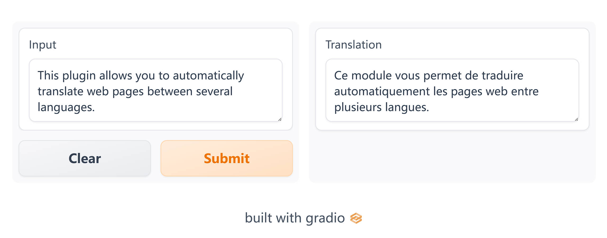

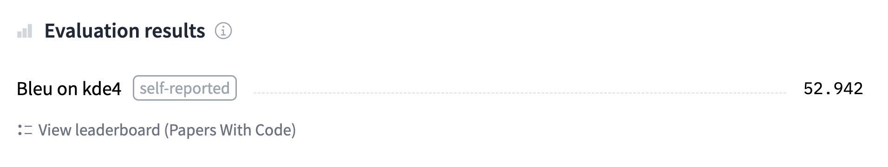

与前面的部分一样，你可以使用以下代码找到我们将训练并上传到 Hub 的实际模型，并 [在这里](https://huggingface.co/huggingface-course/marian-finetuned-kde4-en-to-fr?text=This+plugin+allows+you+to+automatically+translate+web+pages+between+several+languages.)(https://huggingface.co/huggingface-course/marian-finetuned-kde4-en-to-fr?text=This+plugin+allows+you+to+automatically+translate+web+pages+between+several+languages.) 查看模型输出的结果。

### 准备数据 

为了从头开始微调或训练翻译模型，我们需要一个适合该任务的数据集。如前所述，我们将使用 [KDE4 数据集](https://huggingface.co/datasets/kde4)(https://huggingface.co/datasets/kde4)(https://huggingface.co/datasets/kde4) 。在本节中，但你可以很容易地调整代码以使用你自己的数据，只要你有要互译的两种语言的句子对。如果你需要复习如何将自定义数据加载到 `Dataset` ，可以复习一下第六章。

#### KDE4 数据集 

像往常一样，我们使用 `load_dataset()` 函数下载我们的数据集：

```python
from datasets import load_dataset

raw_datasets = load_dataset("kde4", lang1="en", lang2="fr")
```

如果你想使用不同的语言对，你可以使用语言代码来指定它们。该数据集共有 92 种语言可用；你可以通过展开 [数据集卡片](https://huggingface.co/datasets/kde4)(https://huggingface.co/datasets/kde4) 上的语言标签来查看它们。

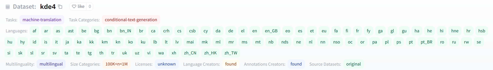

我们来看看数据集：

```python
raw_datasets
```

```python
DatasetDict({
    train: Dataset({
        features: ['id', 'translation'],
        num_rows: 210173
    })
})
```

我们有 210,173 对句子，但在一次训练过程中，我们也需要创建自己的验证集。正如我们在第六章学的的那样， `Dataset` 有一个 `train_test_split()` 方法可以帮助我们。我们将设置一个随机数种子以保证结果的可复现性：

```python
split_datasets = raw_datasets["train"].train_test_split(train_size=0.9, seed=20)
split_datasets
```

```python
DatasetDict({
    train: Dataset({
        features: ['id', 'translation'],
        num_rows: 189155
    })
    test: Dataset({
        features: ['id', 'translation'],
        num_rows: 21018
    })
})
```

我们可以像下面这样将 “test” 键重命名为 “validation”：

```python
split_datasets["validation"] = split_datasets.pop("test")
```

现在让我们看一下数据集的一个元素：

```python
split_datasets["train"][1]["translation"]
```

```python
{'en': 'Default to expanded threads',
 'fr': 'Par défaut, développer les fils de discussion'}
```

我们得到一个包含我们选择的两种语言的两个句子的字典。这个充满技术计算机科学术语的数据集的一个特殊之处在于它们都完全用法语翻译。然而，法国工程师通常很懒惰，在交谈时，大多数计算机科学专用词汇都用英语表述。例如，“threads”这个词很可能出现在法语句子中，尤其是在技术对话中；但在这个数据集中，它被翻译成更准确的“fils de Discussion”。我们使用的预训练模型已经在一个更大的法语和英语句子语料库上进行了预训练，选择了更为简单的保留原词的方式：

```python
from transformers import pipeline

model_checkpoint = "Helsinki-NLP/opus-mt-en-fr"
translator = pipeline("translation", model=model_checkpoint)
translator("Default to expanded threads")
```

```python
[{'translation_text': 'Par défaut pour les threads élargis'}]
```

这种情况的另一个例子可以在“plugin”这个词上看到，它并非正式的法语词汇，但大多数母语是法语的人都会理解并且不会去翻译它。在 KDE4 数据集中，这个词被翻译成了更正式的法语词汇“module d'extension”：

```python
split_datasets["train"][172]["translation"]
```

```python
{'en': 'Unable to import %1 using the OFX importer plugin. This file is not the correct format.',
 'fr': "Impossible d'importer %1 en utilisant le module d'extension d'importation OFX. Ce fichier n'a pas un format correct."}
```

然而，我们的预训练模型坚持使用简练而熟悉的英文单词：

```python
translator(
    "Unable to import %1 using the OFX importer plugin. This file is not the correct format."
)
```

```python
[{'translation_text': "Impossible d'importer %1 en utilisant le plugin d'importateur OFX. Ce fichier n'est pas le bon format."}]
```

看看我们的微调模型是否能识别数据集的这些特殊性。（剧透警告：它会的）。

<div custom-style="Tip-green">

✏️ **轮到你了！** 另一个在法语中经常使用的英语单词是“email”。在训练数据集中找到使用这个词的第一个样本。它是如何翻译的？预训练模型如何翻译同一个英文句子？

</div>

#### 处理数据 

你现在应该知道我们的下一步该做些什么了：所有文本都需要转换为 token IDs 的集合，以便模型能够理解它们。对于这个任务，我们需要同时对输入和目标 tokenize。我们的首要任务是创建我们的 `tokenizer` 对象。如前所述，我们将使用 Marian 英语到法语的预训练模型。如果你使用另一对语言尝试此代码，请确保调整模型的 checkpoint。 [Helsinki-NLP](https://huggingface.co/Helsinki-NLP)(https://huggingface.co/Helsinki-NLP) 组织提供了超过一千个多语言模型。

```python
from transformers import AutoTokenizer

model_checkpoint = "Helsinki-NLP/opus-mt-en-fr"
tokenizer = AutoTokenizer.from_pretrained(model_checkpoint, return_tensors="pt")
```

你也可以将 `model_checkpoint` 替换为你从 [Hub](https://huggingface.co/models)(https://huggingface.co/models) 中选择的其他模型，或者一个你保存了预训练模型和 tokenizer 的本地文件夹。

<div custom-style="Tip-green">

💡 如果你在使用一个多语言的 tokenizer，比如 mBART，mBART-50，或者 M2M100，你需要通过设置 `tokenizer.src_lang` 和 `tokenizer.tgt_lang` 来在 tokenizer 中指定你的输入和目标的语言代码。

</div>

我们的数据准备相当简单。只有一点要记住；你需要确保 tokenizer 处理的目标是输出语言（在这里是法语）。你可以通过将目标语言传递给 tokenizer 的 `__call__` 方法的 `text_targets` 参数来完成此操作。

为了看看这是如何工作的，让我们处理训练集中每种语言的一个样本：

```python
en_sentence = split_datasets["train"][1]["translation"]["en"]
fr_sentence = split_datasets["train"][1]["translation"]["fr"]

inputs = tokenizer(en_sentence, text_target=fr_sentence)
inputs
```

```python
{'input_ids': [47591, 12, 9842, 19634, 9, 0], 'attention_mask': [1, 1, 1, 1, 1, 1], 'labels': [577, 5891, 2, 3184, 16, 2542, 5, 1710, 0]}
```

我们可以看到，输出包含了与英语句子相关联的 inputs IDs，而与法语句子相关联的 IDs 存储在 `labels` 字段中。如果你忘记指示你正在对 labels 进行 tokenize，它们将由输入 tokenizer（语言类型不一样） 进行 tokenize，而对于 Marian 模型来说，效果不会很好。

```python
wrong_targets = tokenizer(fr_sentence)
print(tokenizer.convert_ids_to_tokens(wrong_targets["input_ids"]))
print(tokenizer.convert_ids_to_tokens(inputs["labels"]))
```

```python
['▁Par', '▁dé', 'f', 'aut', ',', '▁dé', 've', 'lop', 'per', '▁les', '▁fil', 's', '▁de', '▁discussion', '</s>']
['▁Par', '▁défaut', ',', '▁développer', '▁les', '▁fils', '▁de', '▁discussion', '</s>']
```

如你所见，如果用英语的 tokenizer 来预处理法语句子，会产生更多的 tokens，因为这个 tokenizer 不认识任何法语单词（除了那些在英语里也出现的，比如“discussion”）。

由于“inputs”是一个包含我们常用键（inputs ID、注意掩码等）的字典，最后一步是定义我们数据集的预处理函数：

```python
max_length = 128

def preprocess_function(examples):
    inputs = [ex["en"] for ex in examples["translation"]]
    targets = [ex["fr"] for ex in examples["translation"]]
    model_inputs = tokenizer(
        inputs, text_target=targets, max_length=max_length, truncation=True
    )
```

请注意，我们为输入和输出设置了相同的最大长度。由于我们处理的文本看起来很短，我们使用 128。

<div custom-style="Tip-green">

💡 如果你正在使用 T5 模型（更具体地说，一个 `t5-xxx` checkpoint ），模型会期望文本输入有一个前缀指示着手头的任务，比如 `translate: English to French:` 。

</div>

<div custom-style="Tip-yellow">

⚠️ 我们不关注目标的注意力掩码，因为模型不会需要它。相反，我们应该将填充（padding） token 对应的标签设置为 `-100` ，以便在 loss 计算中忽略它们。由于我们正在使用动态填充，这将在稍后由我们的数据整理器完成，但是如果你在此处使用填充，你应该调整预处理函数，将所有与填充（padding） token 对应的标签设置为 `-100` 。

</div>

我们现在可以对数据集的所有数据一次性进行该预处理：

```python
tokenized_datasets = split_datasets.map(
    preprocess_function,
    batched=True,
    remove_columns=split_datasets["train"].column_names,
)
```

现在数据已经过预处理，我们准备好微调我们的预训练模型了！

{#if fw === 'pt'}

### 使用 `Trainer` API 微调模型 

使用 `Trainer` 的代码将与以前相同，只是稍作改动：我们在这里将使用 [`Seq2SeqTrainer`](https://huggingface.co/transformers/main_classes/trainer.html#seq2seqtrainer)(https://huggingface.co/transformers/main_classes/trainer.html#seq2seqtrainer) ，它是 `Trainer` 的子类，它使用 `generate()` 方法来预测输入的输出，并且可以正确处理这种序列到序列的评估。当我们讨论评估指标时，我们将更详细地探讨这一点。

首先，我们需要一个模型来进行微调。我们将使用常用的 `AutoModel` API：

```python
#####Pytorch}
from transformers import AutoModelForSeq2SeqLM

model = AutoModelForSeq2SeqLM.from_pretrained(model_checkpoint)####end
```

{:else}

### 使用 Keras 微调模型 

首先，我们需要一个模型来进行微调。我们将使用常用的 `AutoModel` API：

```python
#####TensorFlow}
from transformers import TFAutoModelForSeq2SeqLM

model = TFAutoModelForSeq2SeqLM.from_pretrained(model_checkpoint, from_pt=True)####end
```

<div custom-style="Tip-green">

💡 `Helsinki-NLP/opus-mt-en-fr` checkpoint 只有 PyTorch 的权重，所以如果你尝试加载模型而没有使用 `from_pt=True` 参数在 `from_pretrained()` 方法中，你会得到一个错误。当你指定 `from_pt=True` ，库会自动下载并为你转换 PyTorch 权重。如你所见，使用transormer 在两种框架之间切换非常简单。

</div>

{/if}

注意，这次我们使用的是一个已经在翻译任务上进行过训练的模型，实际上已经可以使用了，所以没有关于缺少权重或新初始化的权重的警告。

#### 数据整理 

我们需要一个数据整理器来处理动态批处理的填充。在本例中，我们不能像第四章那样只使用 `DataCollatorWithPadding` ，因为它只填充输入（inputs ID、注意掩码和 token 类型 ID）。我们的标签也应该被填充到所有标签中的最大长度。而且，如前所述，用于填充标签的填充值应为 `-100` ，而不是 tokenizer 的填充 token，以确保在损失计算中忽略这些填充值。

这一切都可以由 [`DataCollatorForSeq2Seq`](https://huggingface.co/transformers/main_classes/data_collator.html#datacollatorforseq2seq)(https://huggingface.co/transformers/main_classes/data_collator.html#datacollatorforseq2seq) 完成。与 `DataCollatorWithPadding` 一样，它接收用于预处理输入的 `tokenizer` ，但它也接收 `model` 。这是因为数据整理器还将负责准备解码器 inputs ID，它们是标签偏移之后形成的，开头带有特殊 token 由于对于不同的架构有稍微不同的偏移方式， `DataCollatorForSeq2Seq` 需要接收 `model` 对象：

{#if fw === 'pt'}

```python
#####Pytorch}
from transformers import DataCollatorForSeq2Seq

data_collator = DataCollatorForSeq2Seq(tokenizer, model=model)####end
```

{:else}

```python
#####TensorFlow}
from transformers import DataCollatorForSeq2Seq

data_collator = DataCollatorForSeq2Seq(tokenizer, model=model, return_tensors="tf")####end
```

{/if}

为了在几个样本上进行测试，我们在已经完成 tokenize 的训练集中的部分数据上调用它：

```python
batch = data_collator([tokenized_datasets["train"][i] for i in range(1, 3)])
batch.keys()
```

```python
dict_keys(['attention_mask', 'input_ids', 'labels', 'decoder_input_ids'])
```

我们可以检查我们的标签是否已经用 `-100` 填充到 batch 的最大长度：

```python
batch["labels"]
```

```python
tensor([[  577,  5891,     2,  3184,    16,  2542,     5,  1710,     0,  -100,
          -100,  -100,  -100,  -100,  -100,  -100],
        [ 1211,     3,    49,  9409,  1211,     3, 29140,   817,  3124,   817,
           550,  7032,  5821,  7907, 12649,     0]])
```

我们还可以查看解码器的 inputs ID，可以看到它们是标签经过偏移形成的版本：

```python
batch["decoder_input_ids"]
```

```python
tensor([[59513,   577,  5891,     2,  3184,    16,  2542,     5,  1710,     0,
         59513, 59513, 59513, 59513, 59513, 59513],
        [59513,  1211,     3,    49,  9409,  1211,     3, 29140,   817,  3124,
           817,   550,  7032,  5821,  7907, 12649]])
```

以下是我们数据集中第一个和第二个元素的标签：

```python
for i in range(1, 3):
    print(tokenized_datasets["train"][i]["labels"])
```

```python
[577, 5891, 2, 3184, 16, 2542, 5, 1710, 0]
[1211, 3, 49, 9409, 1211, 3, 29140, 817, 3124, 817, 550, 7032, 5821, 7907, 12649, 0]
```

{#if fw === 'pt'}

我们将把这个 `data_collator` 传递给 `Seq2SeqTrainer` 。接下来，让我们看一下评估指标。

{:else}

我们现在可以使用 `data_collator` 将我们的每个数据集转换为 `tf.data.Dataset` ，准备好进行训练：

```python
#####TensorFlow}
tf_train_dataset = model.prepare_tf_dataset(
    tokenized_datasets["train"],
    collate_fn=data_collator,
    shuffle=True,
    batch_size=32,
)
tf_eval_dataset = model.prepare_tf_dataset(
    tokenized_datasets["validation"],
    collate_fn=data_collator,
    shuffle=False,
    batch_size=16,
)####end
```

{/if}

#### 评估指标 

{#if fw === 'pt'}
`Seq2SeqTrainer` 对其超类 `Trainer` 的增强功能是在评估或预测时使用 `generate()` 方法。在训练过程中，模型会使用 `decoder_input_ids` ，并通过一个注意力掩码确保它不使用在预测的 token 之后的 token，以加速训练。在推理过程中，我们无法使用这些标签。因此，使用同样的设置评估我们的模型是一个好主意。

正如我们在第二章看到的，解码器通过一个一个地预测 token 来执行推理——这是Transformers 在幕后通过 `generate()` 方法实现的。 `Seq2SeqTrainer` 将允许我们在设置 `predict_with_generate=True` 时，使用该方法进行评估。

{/if}

用于翻译的传统指标是 [BLEU 分数](https://en.wikipedia.org/wiki/BLEU)(https://en.wikipedia.org/wiki/BLEU) ，它最初在 2002 年由 Kishore Papineni 等人的一篇文章中被引入。BLEU 分数评估翻译与其标签的接近程度。它不衡量模型生成输出的可理解性或语法正确性，而是使用统计规则来确保生成输出中的所有单词也出现在输出的目标中。此外，还有一些规则对重复的词进行惩罚，如果这些词在输出的目标中没有重复（避免模型输出像“the the the the the”这样的句子）；以及对输出的句子长度比目标中的短（避免模型输出像“the”这样的句子）进行惩罚。

BLEU 的一个缺点是它需要文本已经被分词，这使得比较使用不同分词器的模型之间的分数变得困难。因此，当今用于基准翻译模型的最常用指标是 [SacreBLEU](https://github.com/mjpost/sacrebleu)(https://github.com/mjpost/sacrebleu) ，它通过对分词步骤标准化解决了这个缺点（和其他的一些缺点）。要使用此指标，我们首先需要安装 SacreBLEU 库：

```python
!pip install sacrebleu
```

然后我们可以就像我们在第四章那样通过 `evaluate.load()` 加载它 

```python
import evaluate

metric = evaluate.load("sacrebleu")
```

这个指标将文本作为输入和目标。它的设计是为了接受多个可接受的目标，因为同一句话通常有多种可接受的翻译——我们使用的数据集只提供一个，但在 NLP 中找到将多个句子作为标签的数据集是很常见的。因此，预测结果应该是一个句子列表，而参考应该是一个句子列表的列表。

让我们尝试一个例子：

```python
predictions = [
    "This plugin lets you translate web pages between several languages automatically."
]
references = [
    [
        "This plugin allows you to automatically translate web pages between several languages."
    ]
]
metric.compute(predictions=predictions, references=references)
```

```python
{'score': 46.750469682990165,
 'counts': [11, 6, 4, 3],
 'totals': [12, 11, 10, 9],
 'precisions': [91.67, 54.54, 40.0, 33.33],
 'bp': 0.9200444146293233,
 'sys_len': 12,
 'ref_len': 13}
```

这得到了 46.75 的 BLEU 分数，这是相当不错的——作为参考，原始 Transformer 模型在 [“Attention Is All You Need” 论文](https://arxiv.org/pdf/1706.03762.pdf)(https://arxiv.org/pdf/1706.03762.pdf) 类似的英语和法语翻译任务中获得了 41.8 的 BLEU 分数！（关于其他指标，如 `counts` 和 `bp` ，可以参见 [SacreBLEU仓库](https://github.com/mjpost/sacrebleu/blob/078c440168c6adc89ba75fe6d63f0d922d42bcfe/sacrebleu/metrics/bleu.py#L74)(https://github.com/mjpost/sacrebleu/blob/078c440168c6adc89ba75fe6d63f0d922d42bcfe/sacrebleu/metrics/bleu.py#L74) ）另一方面，如果我们尝试使用翻译模型中经常出现的两种糟糕的预测类型（大量重复或太短），我们将得到相当糟糕的 BLEU 分数：

```python
predictions = ["This This This This"]
references = [
    [
        "This plugin allows you to automatically translate web pages between several languages."
    ]
]
metric.compute(predictions=predictions, references=references)
```

```python
{'score': 1.683602693167689,
 'counts': [1, 0, 0, 0],
 'totals': [4, 3, 2, 1],
 'precisions': [25.0, 16.67, 12.5, 12.5],
 'bp': 0.10539922456186433,
 'sys_len': 4,
 'ref_len': 13}
```

```python
predictions = ["This plugin"]
references = [
    [
        "This plugin allows you to automatically translate web pages between several languages."
    ]
]
metric.compute(predictions=predictions, references=references)
```

```python
{'score': 0.0,
 'counts': [2, 1, 0, 0],
 'totals': [2, 1, 0, 0],
 'precisions': [100.0, 100.0, 0.0, 0.0],
 'bp': 0.004086771438464067,
 'sys_len': 2,
 'ref_len': 13}
```

分数可以从 0 到 100，越高越好。

{#if fw === 'tf'}

为了将模型的输出转化为评估指标可以使用的文本，我们将利用 `tokenizer.batch_decode()` 方法。因为 tokenizer 会自动处理填充 tokens，所以我们只需要清理所有标签中的 `-100` 。让我们定义一个函数，这个函数会接收我们的模型和一个数据集，并在其上计算指标。

我们还将使用一个显著提升性能的技巧 - 使用 [XLA](https://www.tensorflow.org/xla)(https://www.tensorflow.org/xla) ，TensorFlow 的加速线性代数编译器，编译我们的生成代码。XLA 对模型的计算图进行了各种优化，从而显著提升了速度和内存使用率。如 Hugging Face 的 [博客](https://huggingface.co/blog/tf-xla-generate)(https://huggingface.co/blog/tf-xla-generate) 所述，当我们的输入形状不会变化太大时，XLA 工作得最好。因此，我们将把输入补齐到 128 的倍数，然后用填充整理器制作一个新的数据集，然后我们使用 `@tf.function(jit_compile=True)` 装饰器装饰我们的生成函数，这将标记整个函数用 XLA 编译。

```python
#####TensorFlow}
import numpy as np
import tensorflow as tf
from tqdm import tqdm

generation_data_collator = DataCollatorForSeq2Seq(
    tokenizer, model=model, return_tensors="tf", pad_to_multiple_of=128
)

tf_generate_dataset = model.prepare_tf_dataset(
    tokenized_datasets["validation"],
    collate_fn=generation_data_collator,
    shuffle=False,
    batch_size=8,
)

@tf.function(jit_compile=True)
def generate_with_xla(batch):
    return model.generate(
        input_ids=batch["input_ids"],
        attention_mask=batch["attention_mask"],
        max_new_tokens=128,
    )

def compute_metrics():
    all_preds = []
    all_labels = []
    sampled_dataset = tokenized_datasets["validation"].shuffle().select(range(200))
    tf_generate_dataset = sampled_dataset.to_tf_dataset(
        columns=["input_ids", "attention_mask", "labels"],
        collate_fn=data_collator,
        shuffle=False,
        batch_size=4,
    )
    for batch, labels in tqdm(tf_generate_dataset):
        predictions = generate_with_xla(batch)
        decoded_preds = tokenizer.batch_decode(predictions, skip_special_tokens=True)
        labels = labels.numpy()
        labels = np.where(labels != -100, labels, tokenizer.pad_token_id)
        decoded_labels = tokenizer.batch_decode(labels, skip_special_tokens=True)
        decoded_preds = [pred.strip() for pred in decoded_preds]
        decoded_labels = [[label.strip()] for label in decoded_labels]
        all_preds.extend(decoded_preds)
        all_labels.extend(decoded_labels)

    result = metric.compute(predictions=all_preds, references=all_labels)
    return {"bleu": result["score"]}####end
```

{:else}

为了将模型的输出转化为评估指标可以使用的文本，我们将使用 `tokenizer.batch_decode()` 方法。因为 tokenizer 会自动处理填充 tokens，所以我们只需要清理标签中的所有 `-100` ：

```python
#####Pytorch}
import numpy as np

def compute_metrics(eval_preds):
    preds, labels = eval_preds
    # 如果模型返回的内容超过了预测的logits
    if isinstance(preds, tuple):
        preds = preds[0]

    decoded_preds = tokenizer.batch_decode(preds, skip_special_tokens=True)

    # 由于我们无法解码 -100,因此将标签中的 -100 替换掉
    labels = np.where(labels != -100, labels, tokenizer.pad_token_id)
    decoded_labels = tokenizer.batch_decode(labels, skip_special_tokens=True)

    # 一些简单的后处理
    decoded_preds = [pred.strip() for pred in decoded_preds]
    decoded_labels = [[label.strip()] for label in decoded_labels]

    result = metric.compute(predictions=decoded_preds, references=decoded_labels)
    return {"bleu": result["score"]}####end
```

{/if}

现在这已经完成了，我们已经准备好微调我们的模型了！

#### 微调模型 

第一步是登录 Hugging Face，这样你就可以将结果上传到模型中心。有一个方便的功能可以帮助你在 notebook 中完成此操作：

```python
from huggingface_hub import notebook_login

notebook_login()
```

这将显示一个小部件，你可以在其中输入你的 Hugging Face 登录凭据。

如果你不是在 notebook 上运行代码，只需在终端中输入以下行：

```python
huggingface-cli login
```

{#if fw === 'tf'}

在我们开始之前，让我们看看我们在没有任何训练的情况下从我们的模型中得到了什么样的结果：

```python
#####TensorFlow}
print(compute_metrics())####end
```

```python
#####TensorFlow}
{'bleu': 33.26983701454733}####end
```

一旦完成，我们就可以准备编译和训练模型所需的一切。请注意当使用 `tf.keras.mixed_precision.set_global_policy("mixed_float16")` 时——这将告诉 Keras 使用 float16 进行训练，这可以显着提高支持它的 GPU（Nvidia 20xx/V100 或更高版本）的速度。

```python
#####TensorFlow}
from transformers import create_optimizer
from transformers.keras_callbacks import PushToHubCallback
import tensorflow as tf

# 训练步数是数据集中的样本数量,除以 batch 大小,然后乘以总的 epoch 数。
# 注意这里的 tf_train_dataset 是 batch 形式的 tf.data.Dataset,
# 而不是原始的 Hugging Face Dataset ,所以使用 len() 计算它的长度已经是 num_samples // batch_size。

num_epochs = 3
num_train_steps = len(tf_train_dataset) * num_epochs

optimizer, schedule = create_optimizer(
    init_lr=5e-5,
    num_warmup_steps=0,
    num_train_steps=num_train_steps,
    weight_decay_rate=0.01,
)
model.compile(optimizer=optimizer)

## 使用 float16 混合精度进行训练
tf.keras.mixed_precision.set_global_policy("mixed_float16")####end
```

接下来，我们定义一个 `PushToHubCallback` 以便在训练期间将我们的模型上传到 Hub，正如我们在第 2 节中看到的，然后我们只需使用该回调来拟合模型：

```python
#####TensorFlow}
from transformers.keras_callbacks import PushToHubCallback

callback = PushToHubCallback(
    output_dir="marian-finetuned-kde4-en-to-fr", tokenizer=tokenizer
)

model.fit(
    tf_train_dataset,
    validation_data=tf_eval_dataset,
    callbacks=[callback],
    epochs=num_epochs,
)####end
```

请注意，你可以使用 `hub_model_id` 参数指定要推送到的存储库的名称（当你想把模型推送到指定的组织的时候，就必须使用此参数）。例如，当我们将模型推送到 [`huggingface-course` 组织](https://huggingface.co/huggingface-course)(https://huggingface.co/huggingface-course)(https://huggingface.co/huggingface-course) 时，我们添加了 `hub_model_id="huggingface-course/marian-finetuned-kde4-en- to-fr"` 到 `Seq2SeqTrainingArguments` 。默认情况下，该仓库将保存在你的账户里，并以你设置的输出目录命名，因此这里将是 `"sgugger/marian-finetuned-kde4-en-to-fr"` 。

<div custom-style="Tip-green">

💡 如果你正在使用的输出目录已经存在，它需要是你想要推送到的仓库的本地克隆。如果不是，当调用 `model.fit()` 时会收到错误，并需要设置一个新名称。

</div>

最后，让我们看看训练结束后我们的指标是什么样的：

```python
#####TensorFlow}
print(compute_metrics())####end
```

```python
#####TensorFlow}
{'bleu': 57.334066271545865}####end
```

在这个阶段，你可以使用模型中心上的推理小部件来测试你的模型并与你的朋友分享。你已经成功地在翻译任务上微调了一个模型——恭喜！

{:else}

一旦完成这些步骤，我们就可以定义我们的 `Seq2SeqTrainingArguments` 。与 `Trainer` 一样，我们使用 `TrainingArguments` 的子类，其中包含更多可以设置的字段：

```python
#####Pytorch}
from transformers import Seq2SeqTrainingArguments

args = Seq2SeqTrainingArguments(
    f"marian-finetuned-kde4-en-to-fr",
    evaluation_strategy="no",
    save_strategy="epoch",
    learning_rate=2e-5,
    per_device_train_batch_size=32,
    per_device_eval_batch_size=64,
    weight_decay=0.01,
    save_total_limit=3,
    num_train_epochs=3,
    predict_with_generate=True,
    fp16=True,
    push_to_hub=True,
)####end
```

除了通常的超参数（如学习率、训练轮数、批次大小和一些权重衰减）之外，这里与我们在前面章节看到的有一些不同：

- 我们没有设置定期进行评估，因为评估需要耗费一定的时间；我们只会在训练开始之前和结束之后评估我们的模型一次。
- 我们设置 `fp16=True` ，这可以加快支持 fp16 的 GPU 上的训练速度。
- 和上面我们讨论的那样，我们设置 `predict_with_generate=True` 。
- 我们用 `push_to_hub=True` 在每个 epoch 结束时将模型上传到 Hub。

请注意，你可以使用 `hub_model_id` 参数指定要推送到的存储库的名称（当你想把模型推送到指定的组织的时候，就必须使用此参数）。例如，当我们将模型推送到 [`huggingface-course` 组织](https://huggingface.co/huggingface-course)(https://huggingface.co/huggingface-course)(https://huggingface.co/huggingface-course) 时，我们添加了 `hub_model_id="huggingface-course/marian-finetuned-kde4-en- to-fr"` 到 `Seq2SeqTrainingArguments` 。默认情况下，该仓库将保存在你的账户中，并以你设置的输出目录命名，因此这里将是 `"sgugger/marian-finetuned-kde4-en-to-fr"` 。

<div custom-style="Tip-green">

💡如果你使用的输出目录已经存在，则它需要是你要推送到的存储库的本地克隆。如果不是，你将在定义你的 `Seq2SeqTrainer` 名称时会遇到错误，并且需要设置一个新名称。

</div>

最后，我们将所有内容传递给 `Seq2SeqTrainer` ：

```python
#####Pytorch}
from transformers import Seq2SeqTrainer

trainer = Seq2SeqTrainer(
    model,
    args,
    train_dataset=tokenized_datasets["train"],
    eval_dataset=tokenized_datasets["validation"],
    data_collator=data_collator,
    tokenizer=tokenizer,
    compute_metrics=compute_metrics,
)####end
```

在开始训练之前，我们先看一下我们的模型得到的分数，以确保我们的微调并未使情况变得更糟。这个命令需要一些时间，所以你可以在执行期间去喝杯咖啡：

```python
#####Pytorch}
trainer.evaluate(max_length=max_length)####end
```

```python
#####Pytorch}
{'eval_loss': 1.6964408159255981,
 'eval_bleu': 39.26865061007616,
 'eval_runtime': 965.8884,
 'eval_samples_per_second': 21.76,
 'eval_steps_per_second': 0.341}####end
```

BLEU 得分为 39 并不算太差，这反映了我们的模型已经擅长将英语句子翻译成法语句子。

接下来是训练，这也需要一些时间：

```python
#####Pytorch}
trainer.train()####end
```

请注意，当训练发生时，每次保存模型时（这里是每个 epoch），它都会在后台上传到 Hub。这样，如有必要，你将能够在另一台机器上继续你的训练。

训练完成后，我们再次评估我们的模型——希望我们会看到 BLEU 分数有所提高！

```python
#####Pytorch}
trainer.evaluate(max_length=max_length)####end
```

```python
#####Pytorch}
{'eval_loss': 0.8558505773544312,
 'eval_bleu': 52.94161337775576,
 'eval_runtime': 714.2576,
 'eval_samples_per_second': 29.426,
 'eval_steps_per_second': 0.461,
 'epoch': 3.0}####end
```

这是近 14 点的改进，这很棒。

最后，我们使用 `push_to_hub()` 方法来确保我们上传模型的最新版本。 `Trainer` 还创建了一张包含所有评估结果的模型卡并上传。此模型卡包含可帮助模型中心为推理演示选择小部件的元数据。通常不需要做额外的更改，因为它可以从模型类中推断出正确的小部件，但在这个例子中，它仅能通过模型类推断这个是一个序列到序列问题，所以我们指定它是一个翻译模型：

```python
#####Pytorch}
trainer.push_to_hub(tags="translation", commit_message="Training complete")####end
```

如果你想检查命令执行的结果，此命令将返回它刚刚执行的提交的 URL，你可以打开 url 进行检查：

```python
#####Pytorch}
'https://huggingface.co/sgugger/marian-finetuned-kde4-en-to-fr/commit/3601d621e3baae2bc63d3311452535f8f58f6ef3'####end
```

在此阶段，你可以在 Model Hub 上使用推理小部件来测试你的模型，并与你的朋友分享。你已经成功地在翻译任务上进行了模型的微调，恭喜你！

如果你想更深入地了解训练循环，我们现在将向你展示如何使用 Accelerate 做同样的事情。

{/if}

{#if fw === 'pt'}

### 自定义训练循环 

我们现在来看一下完整的训练循环，这样你就可以轻松定制你需要的部分。它将与我们在第 2 节和第 3 节中做的非常相似。

#### 准备训练所需的一切 

你已经多次看到所有这些，因此这一块会简略进行。首先，我们将数据集设置为“torch”格式，这样我们就可以得到 PyTorch 张量，然后我们用数据集构建 `DataLoader` ：

```python
#####Pytorch}
from torch.utils.data import DataLoader

tokenized_datasets.set_format("torch")
train_dataloader = DataLoader(
    tokenized_datasets["train"],
    shuffle=True,
    collate_fn=data_collator,
    batch_size=8,
)
eval_dataloader = DataLoader(
    tokenized_datasets["validation"], collate_fn=data_collator, batch_size=8
)####end
```

接下来我们重新实例化我们的模型，以确保我们不会继续上一节的微调，而是再次从预训练模型开始重新训练：

```python
#####Pytorch}
model = AutoModelForSeq2SeqLM.from_pretrained(model_checkpoint)####end
```

然后我们需要一个优化器：

```python
#####Pytorch}
from transformers import AdamW

optimizer = AdamW(model.parameters(), lr=2e-5)####end
```

一旦我们拥有所有这些对象，我们就可以将它们发送到 `accelerator.prepare()` 方法中。请记住，如果你想在 Colab Notebook 上使用 TPU 进行训练，你需要将所有这些代码移动到一个训练函数中，并且该函数不应任何实例化 `Accelerator` 的单元格。

```python
#####Pytorch}
from accelerate import Accelerator

accelerator = Accelerator()
model, optimizer, train_dataloader, eval_dataloader = accelerator.prepare(
    model, optimizer, train_dataloader, eval_dataloader
)####end
```

现在我们已经将我们的 `train_dataloader` 发送到 `accelerator.prepare()` ，我们可以使用它的长度来计算训练步骤的数量。请记住，我们应该始终在准备好数据加载器后执行此操作，因为该方法会改变 `DataLoader` 的长度。然后，我们使用学习率衰减到 0 的经典线性学习率调度：

```python
#####Pytorch}
from transformers import get_scheduler

num_train_epochs = 3
num_update_steps_per_epoch = len(train_dataloader)
num_training_steps = num_train_epochs * num_update_steps_per_epoch

lr_scheduler = get_scheduler(
    "linear",
    optimizer=optimizer,
    num_warmup_steps=0,
    num_training_steps=num_training_steps,
)####end
```

最后，要将我们的模型推送到 Hub，我们需要在一个工作文件夹中创建一个 `Repository` 对象。如果你尚未登录，请先登录 Hugging Face。我们将从我们想要为模型提供的模型 ID 中确定仓库名称（你可以用你自己的选择替换 `repo_name` ，只需要包含你的用户名，用函数 `get_full_repo_name()` 函数可以查看当前的用户名）：

```python
#####Pytorch}
from huggingface_hub import Repository, get_full_repo_name

model_name = "marian-finetuned-kde4-en-to-fr-accelerate"
repo_name = get_full_repo_name(model_name)
repo_name####end
```

```python
#####Pytorch}
'sgugger/marian-finetuned-kde4-en-to-fr-accelerate'####end
```

然后我们可以在本地文件夹中克隆该存储库。如果它已经存在，这个本地文件夹应该是我们正在使用的存储库的克隆：

```python
#####Pytorch}
output_dir = "marian-finetuned-kde4-en-to-fr-accelerate"
repo = Repository(output_dir, clone_from=repo_name)####end
```

现在，我们可以通过调用 `repo.push_to_hub()` 方法上传我们在 `output_dir` 中保存的所有文件。这将帮助我们在每个 epoch 结束时上传中间模型。

#### 训练循环 

我们现在准备编写完整的训练循环。为了简化其评估部分，我们定义了这个 `postprocess()` 函数，它接受预测和标签，并将它们转换为我们的 `metric` 对象所期望的字符串列表：

```python
#####Pytorch}
def postprocess(predictions, labels):
    predictions = predictions.cpu().numpy()
    labels = labels.cpu().numpy()

    decoded_preds = tokenizer.batch_decode(predictions, skip_special_tokens=True)

    # 替换标签中的 -100,因为我们无法解码它们。
    labels = np.where(labels != -100, labels, tokenizer.pad_token_id)
    decoded_labels = tokenizer.batch_decode(labels, skip_special_tokens=True)

    # 一些简单的后处理
    decoded_preds = [pred.strip() for pred in decoded_preds]
    decoded_labels = [[label.strip()] for label in decoded_labels]
    return decoded_preds, decoded_labels####end
```

训练循环看起来和本章第 2 节与第四章很像，只是在评估部分有一些不同 —— 所以让我们重点关注一下这一点！

首先要注意的是，我们使用 `generate()` 方法来计算预测，但这是我们基础模型上的一个方法，而不是Accelerate 在 `prepare()` 方法中创建的封装模型。这就是为什么我们首先 `unwrap_model` ，然后调用此方法。

第二个要注意的是，就像 [token 分类](https://chat.openai.com/course/chapter7/2)(https://chat.openai.com/course/chapter7/2) 一样，两个过程可能以不同的形状对输入和标签进行了填充，所以我们使用 `accelerator.pad_across_processes()` 来在调用 `gather()` 方法之前使预测和标签具有相同的形状。如果我们不这么做，评估将出错或永远挂起。

```python
#####Pytorch}
from tqdm.auto import tqdm
import torch

progress_bar = tqdm(range(num_training_steps))

for epoch in range(num_train_epochs):
    # 训练
    model.train()
    for batch in train_dataloader:
        outputs = model(**batch)
        loss = outputs.loss
        accelerator.backward(loss)

        optimizer.step()
        lr_scheduler.step()
        optimizer.zero_grad()
        progress_bar.update(1)

    # 评估
    model.eval()
    for batch in tqdm(eval_dataloader):
        with torch.no_grad():
            generated_tokens = accelerator.unwrap_model(model).generate(
                batch["input_ids"],
                attention_mask=batch["attention_mask"],
                max_length=128,
            )
        labels = batch["labels"]

        # 需要填充预测和标签才能调用gather()
        generated_tokens = accelerator.pad_across_processes(
            generated_tokens, dim=1, pad_index=tokenizer.pad_token_id
        )
        labels = accelerator.pad_across_processes(labels, dim=1, pad_index=-100)

        predictions_gathered = accelerator.gather(generated_tokens)
        labels_gathered = accelerator.gather(labels)

        decoded_preds, decoded_labels = postprocess(predictions_gathered, labels_gathered)
        metric.add_batch(predictions=decoded_preds, references=decoded_labels)

    results = metric.compute()
    print(f"epoch {epoch}, BLEU score: {results['score']:.2f}")

    # 保存和上传
    accelerator.wait_for_everyone()
    unwrapped_model = accelerator.unwrap_model(model)
    unwrapped_model.save_pretrained(output_dir, save_function=accelerator.save)
    if accelerator.is_main_process:
        tokenizer.save_pretrained(output_dir)
        repo.push_to_hub(
            commit_message=f"Training in progress epoch {epoch}", blocking=False
        )####end
```

```python
#####Pytorch}
epoch 0, BLEU score: 53.47
epoch 1, BLEU score: 54.24
epoch 2, BLEU score: 54.44####end
```

一旦完成，你应该有一个模型，其结果与 `Seq2SeqTrainer` 训练的模型非常相似。你可以在 [huggingface-course/marian-finetuned-kde4-en-to-fr-accelerate](https://huggingface.co/huggingface-course/marian-finetuned-kde4-en-to-fr-accelerate)(https://huggingface.co/huggingface-course/marian-finetuned-kde4-en-to-fr-accelerate) 上查看我们使用此代码训练的模型。如果你想测试对训练循环的任何调整，你可以直接通过编辑上面显示的代码来实现！

{/if}

### 使用微调后的模型 

我们已经向你展示了如何在模型 Hub 上使用我们微调的模型。要在本地的 `pipeline` 中使用它，我们只需要指定正确的模型标识符：

```python
from transformers import pipeline

## 将其替换成你自己的 checkpoint
model_checkpoint = "huggingface-course/marian-finetuned-kde4-en-to-fr"
translator = pipeline("translation", model=model_checkpoint)
translator("Default to expanded threads")
```

```python
[{'translation_text': 'Par défaut, développer les fils de discussion'}]
```

如预期，我们的预训练模型适应了我们微调它的语料库，而不是保留英语单词“threads”，而是将它翻译成法语的官方版本。对于“plugin”也是如此：

```python
translator(
    "Unable to import %1 using the OFX importer plugin. This file is not the correct format."
)
```

```python
[{'translation_text': "Impossible d'importer %1 en utilisant le module externe d'importation OFX. Ce fichier n'est pas le bon format."}]
```

另一个领域适应的好例子！

<div custom-style="Tip-green">

✏️ **轮到你了！** 模型对你之前找到的包含单词“email”的样本返回什么结果？

</div>


## 8.4 提取文本摘要 

在本节中，我们将看看如何使用 Transformer 模型将长篇文档压缩为摘要，这项任务称为文本摘要。这是最具挑战性的自然语言处理（NLP）任务之一，因为它需要一系列能力，例如理解长篇文章和生成能够捕捉文档中主要主题的连贯文本。但是，如果做得好，文本摘要是一种强大的工具，可以减轻领域专家详细阅读长文档的负担，从而加快各种业务流程。

尽管在 [Hugging Face Hub](https://huggingface.co/models?pipeline_tag=summarization=downloads)(https://huggingface.co/models?pipeline_tag=summarization=downloads) 上已经存在各种微调模型用于文本摘要，几乎所有这些都只适用于英文文档。因此，为了在本节中添加一些变化，我们将为英语和西班牙语训练一个双语模型。在本节结束时，你将有一个可以总结客户评论的 [模型](https://huggingface.co/huggingface-course/mt5-small-finetuned-amazon-en-es)(https://huggingface.co/huggingface-course/mt5-small-finetuned-amazon-en-es) 。

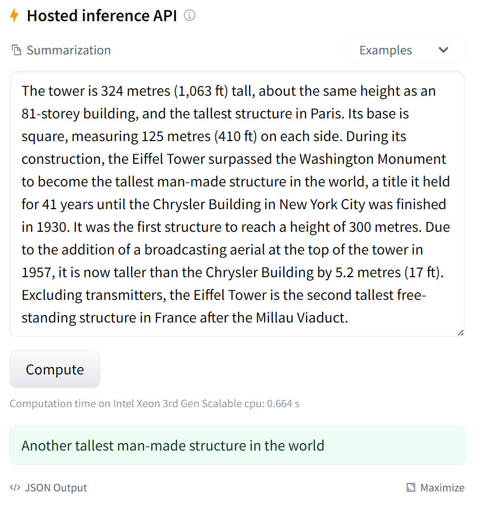

正如我们将看到的，这些摘要很简洁，因为它们是从客户在产品评论中提供的标题中学到的。让我们首先为这项任务准备一个合适的双语语料库。

### 准备多语言语料库 

我们将使用 [多语言亚马逊评论语料库](https://huggingface.co/datasets/amazon_reviews_multi)(https://huggingface.co/datasets/amazon_reviews_multi) 创建我们的双语摘要器。该语料库由六种语言的亚马逊产品评论组成，通常用于多语言分类器的基准测试。然而，由于每条评论都附有一个简短的标题，我们可以使用标题作为我们模型学习的参考摘要！首先，让我们从 Hugging Face Hub 下载英语和西班牙语子集：

```python
from datasets import load_dataset

spanish_dataset = load_dataset("amazon_reviews_multi", "es")
english_dataset = load_dataset("amazon_reviews_multi", "en")
english_dataset
```

```python
DatasetDict({
    train: Dataset({
        features: ['review_id', 'product_id', 'reviewer_id', 'stars', 'review_body', 'review_title', 'language', 'product_category'],
        num_rows: 200000
    })
    validation: Dataset({
        features: ['review_id', 'product_id', 'reviewer_id', 'stars', 'review_body', 'review_title', 'language', 'product_category'],
        num_rows: 5000
    })
    test: Dataset({
        features: ['review_id', 'product_id', 'reviewer_id', 'stars', 'review_body', 'review_title', 'language', 'product_category'],
        num_rows: 5000
    })
})
```

如你所见，对于每种语言，都有 200,000 条评论 `train` 的数据集，以及 5,000 条评论用于 `validation` 和 `test` 的数据集。我们感兴趣的评论信息包含在 `review_body` 和 `review_title` 列中。让我们通过创建一个简单的函数来从训练集中随机抽取一些样本，该函数使用我们在第六章学到过：

```python
def show_samples(dataset, num_samples=3, seed=42):
    sample = dataset["train"].shuffle(seed=seed).select(range(num_samples))
    for example in sample:
        print(f"\n'>> Title: {example['review_title']}'")
        print(f"'>> Review: {example['review_body']}'")

show_samples(english_dataset)
```

```python
'>> Title: Worked in front position, not rear'
'>> Review: 3 stars because these are not rear brakes as stated in the item description. At least the mount adapter only worked on the front fork of the bike that I got it for.'

'>> Title: meh'
'>> Review: Does it’s job and it’s gorgeous but mine is falling apart, I had to basically put it together again with hot glue'

'>> Title: Can\'t beat these for the money'
'>> Review: Bought this for handling miscellaneous aircraft parts and hanger "stuff" that I needed to organize; it really fit the bill. The unit arrived quickly, was well packaged and arrived intact (always a good sign). There are five wall mounts-- three on the top and two on the bottom. I wanted to mount it on the wall, so all I had to do was to remove the top two layers of plastic drawers, as well as the bottom corner drawers, place it when I wanted and mark it; I then used some of the new plastic screw in wall anchors (the 50 pound variety) and it easily mounted to the wall. Some have remarked that they wanted dividers for the drawers, and that they made those. Good idea. My application was that I needed something that I can see the contents at about eye level, so I wanted the fuller-sized drawers. I also like that these are the new plastic that doesn\'t get brittle and split like my older plastic drawers did. I like the all-plastic construction. It\'s heavy duty enough to hold metal parts, but being made of plastic it\'s not as heavy as a metal frame, so you can easily mount it to the wall and still load it up with heavy stuff, or light stuff. No problem there. For the money, you can\'t beat it. Best one of these I\'ve bought to date-- and I\'ve been using some version of these for over forty years.'
```

<div custom-style="Tip-green">

✏️ **试试看！** 更改 `Dataset.shuffle()` 命令中的随机种子以探索语料库中的其他评论。如果你是说西班牙语的人，请查看 `spanish_dataset` 中的一些评论，看看标题是否也像合理的摘要。

</div>

此示例显示了人们通常在网上找到的评论的多样性，从积极的到消极的（以及介于两者之间的所有内容！）。尽管带有“meh”标题的示例的信息量不大，但其他标题看起来像是对评论本身的不错的总结。在单个 GPU 上训练所有 400,000 条评论的摘要模型将花费太长时间，因此我们将专注于为单个产品领域生成摘要。为了了解我们可以选择哪些领域，让我们将 `english_dataset` 转换为 `pandas.DataFrame` ，并计算每个产品类别的评论数量：

```python
english_dataset.set_format("pandas")
english_df = english_dataset["train"][:]
## 显示前 20 个产品的数量
english_df["product_category"].value_counts()[:20]
```

```python
home                      17679
apparel                   15951
wireless                  15717
other                     13418
beauty                    12091
drugstore                 11730
kitchen                   10382
toy                        8745
sports                     8277
automotive                 7506
lawn_and_garden            7327
home_improvement           7136
pet_products               7082
digital_ebook_purchase     6749
pc                         6401
electronics                6186
office_product             5521
shoes                      5197
grocery                    4730
book                       3756
Name: product_category, dtype: int64
```

在英语数据集中，最受欢迎的产品是家居用品、服装和无线电子产品。不过，为了带有亚马逊的特色，让我们专注于总结书籍的评论——毕竟，这是亚马逊这家公司成立的基础！我们可以看到两个符合要求的产品类别（ `book` 和 `digital_ebook_purchase` ），所以让我们用这两个产品类别过滤两种语言的数据集。正如我们在第六章学到的， `Dataset.filter()` 函数可以让我们非常有效地对数据集进行切片，所以我们可以定义一个简单的函数来进行此操作：

```python
def filter_books(example):
    return (
        example["product_category"] == "book"
        or example["product_category"] == "digital_ebook_purchase"
    )
```

当我们使用这个函数对 `english_dataset` 和 `spanish_dataset` 过滤后，结果将只包含涉及书籍类别的那些行。在使用过滤器之前，让我们将 `english_dataset` 的格式从 `"pandas"` 切换回 `"arrow"` ：

```python
english_dataset.reset_format()
```

然后我们可以使用过滤器功能，作为一个基本的检查，让我们检查一些评论的样本，看看它们是否确实与书籍有关：

```python
spanish_books = spanish_dataset.filter(filter_books)
english_books = english_dataset.filter(filter_books)
show_samples(english_books)
```

```python
'>> Title: I\'m dissapointed.'
'>> Review: I guess I had higher expectations for this book from the reviews. I really thought I\'d at least like it. The plot idea was great. I loved Ash but, it just didnt go anywhere. Most of the book was about their radio show and talking to callers. I wanted the author to dig deeper so we could really get to know the characters. All we know about Grace is that she is attractive looking, Latino and is kind of a brat. I\'m dissapointed.'

'>> Title: Good art, good price, poor design'
'>> Review: I had gotten the DC Vintage calendar the past two years, but it was on backorder forever this year and I saw they had shrunk the dimensions for no good reason. This one has good art choices but the design has the fold going through the picture, so it\'s less aesthetically pleasing, especially if you want to keep a picture to hang. For the price, a good calendar'

'>> Title: Helpful'
'>> Review: Nearly all the tips useful and. I consider myself an intermediate to advanced user of OneNote. I would highly recommend.'
```

好的，我们可以看到评论并不是严格意义上的书籍，可能是指日历和 OneNote 等电子应用程序等内容。尽管如此，该领域似乎适合训练摘要模型。在我们查看适合此任务的各种模型之前，我们还有最后一点数据准备要做：将英文和西班牙文评论作为单个 `DatasetDict` 对象组合起来。Datasets 提供了一个方便的 `concatenate_datasets()` 函数，它（名如其实）将把两个 `Dataset` 对象堆叠在一起。因此，为了创建我们的双语数据集，我们将遍历数据集的每个部分，并打乱结果以确保我们的模型不会过度拟合单一语言：

```python
from datasets import concatenate_datasets, DatasetDict

books_dataset = DatasetDict()

for split in english_books.keys():
    books_dataset[split] = concatenate_datasets(
        [english_books[split], spanish_books[split]]
    )
    books_dataset[split] = books_dataset[split].shuffle(seed=42)

## 挑选一些样例
show_samples(books_dataset)
```

```python
'>> Title: Easy to follow!!!!'
'>> Review: I loved The dash diet weight loss Solution. Never hungry. I would recommend this diet. Also the menus are well rounded. Try it. Has lots of the information need thanks.'

'>> Title: PARCIALMENTE DAÑADO'
'>> Review: Me llegó el día que tocaba, junto a otros libros que pedí, pero la caja llegó en mal estado lo cual dañó las esquinas de los libros porque venían sin protección (forro).'

'>> Title: no lo he podido descargar'
'>> Review: igual que el anterior'
```

这的确看起来像是混合了英语和西班牙语的评论！现在我们有了一个训练语料库，最后要检查的一件事是评论及其标题中单词的分布。这对于摘要任务尤其重要，其中数据中的简短参考摘要会使模型偏向于生成的摘要中仅输出一两个单词。下面的图显示了单词分布，我们可以看到有些标题严重偏向于 1-2 个单词：

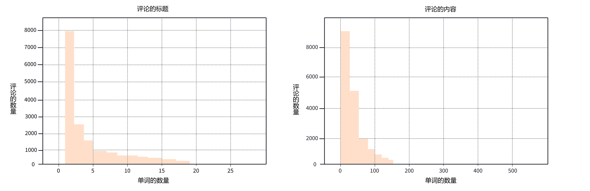

为了解决这个问题，我们将过滤掉标题非常短的示例，以便我们的模型可以生成更有效的摘要。由于我们正在处理英文和西班牙文文本，因此我们可以使用粗略的启发式方法在空白处拆分标题，然后用我们强大的 `Dataset.filter()` 方法如下：

```python
books_dataset = books_dataset.filter(lambda x: len(x["review_title"].split()) > 2)
```

现在我们已经准备好了我们的语料库，让我们来看看一些可以对其进行微调的可选的 Transformer 模型！

### 文本摘要模型 

如果你仔细想想，文本摘要是一种类似于机器翻译的任务：我们有一个像评论这样的文本正文，我们希望将其“翻译”成一个较短的版本，同时捕捉到输入的主要特征。因此，大多数用于文本摘要的 Transformer 模型采用了我们在第二章遇到的编码器-解码器架构。尽管有一些例外，例如 GPT 系列模型，它们在 few-shot（少量微调）之后也可以提取摘要。下表列出了一些可以进行摘要微调的流行预训练模型。

| Transformer 模型 | 描述                                                                                                                                                                                                    | 多种言？|
| :---------: | -------------------------------------------------------------------------------------------------------------------------------------------------------------------------------------------------------------- | :-----------: |
| [GPT-2](https://huggingface.co/gpt2-xl)(https://huggingface.co/gpt2-xl) | 虽然训练为自回归语言模型，但你可以通过在输入文本末尾附加“TL;DR”来使 GPT-2 生成摘要。|      ❌       |
| [PEGASUS](https://huggingface.co/google/pegasus-large)(https://huggingface.co/google/pegasus-large) | 在预训练时的目标是来预测多句子文本中的屏蔽句子。这个预训练目标比普通语言建模更接近文本摘要，并且在流行的基准测试中得分很高。|      ❌       |
| [T5](https://huggingface.co/t5-base)(https://huggingface.co/t5-base) | 通用的 Transformer 架构，所有任务都以文本到文本的框架进行描述；例如，模型文本摘要的输入格式是 `summarize: ARTICLE` 。|      ❌       |
| [mT5](https://huggingface.co/google/mt5-base)(https://huggingface.co/google/mt5-base) | T5 的多语言版本，在多语言 Common Crawl 语料库 （mC4） 上进行预训练，涵盖了 101 种语言。|      ✅       |
| [BART](https://huggingface.co/facebook/bart-base)(https://huggingface.co/facebook/bart-base) | 一种新颖的 Transformer 架构，其中包含经过训练的编码器和解码器堆栈，以重建被破坏的输入，结合了 BERT 和 GPT-2 的预训练方案。|      ❌       |
| [mBART-50](https://huggingface.co/facebook/mbart-large-50)(https://huggingface.co/facebook/mbart-large-50) | BART 的多语言版本，预训练了 50 种语言。|      ✅       |

从此表中可以看出，大多数用于摘要的 Transformer 模型（以及大多数 NLP 任务）都是单语的。如果你的任务所使用的语言是“有大量语料库”（如英语或德语）的语言，这很好。但对于世界各地正在使用的数千种其他语言，则不然。幸运的是，有一类多语言 Transformer 模型，如 mT5 和 mBART，可以解决问题。这些模型是使用语言建模进行预训练的，但有一点不同：它们不是在一种语言的语料库上训练，而是同时在 50 多种语言的文本上进行联合训练！

我们将使用 mT5，这是一种基于 T5 的有趣架构，在文本到文本框架中进行了预训练。在 T5 中，每个 NLP 任务都是以提示前缀（如 `summarize:` ）的形式定义的，这使模型使生成的文本适应提示。如下图所示，这让 T5 变得非常通用，因为你可以用一个模型解决很多任务！

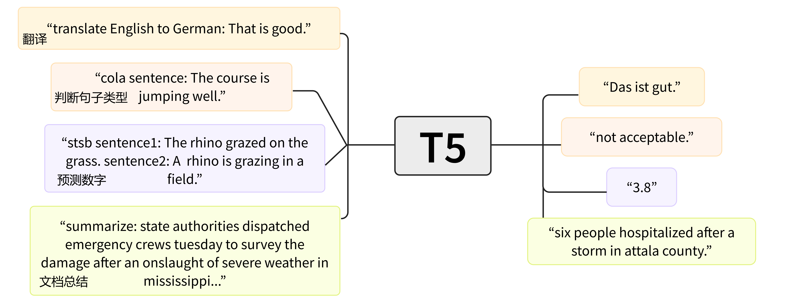

mT5 不使用前缀，但具有 T5 的大部分功能，并且具有多语言的优势。现在我们已经选择了一个模型，接下来让我们来看看如何准备我们的训练数据。

<div custom-style="Tip-green">

✏️ **试试看！** 完成本节后，可以尝试比较一下 mT5 和用相同技术微调过的 mBART 的性能。附加的挑战：只在英文评论上微调 T5。因为 T5 有一个特殊的前缀提示，你需要在下面的预处理步骤中将 `summarize:` 添加到输入例子前。

</div>

### 预处理数据 

我们接下来的任务是对我们的评论及其标题进行 tokenize 和 encode 通常，我们首先加载与预训练模型 checkpoint 相关的 tokenizer 我们将使用 `mt5-small` 作为我们的 checkpoint 这样我们就可以在合理的时间消耗内对模型进行微调：

```python
from transformers import AutoTokenizer

model_checkpoint = "google/mt5-small"
tokenizer = AutoTokenizer.from_pretrained(model_checkpoint)
```

<div custom-style="Tip-green">

💡在 NLP 项目的早期阶段，一个好的做法是在小样本数据上训练一类“小”模型。这使你可以更快地调试和迭代端到端工作流。一旦你对结果充满信心，你始终可以通过简单地更改模型 checkpoint 来在大规模数据上训练模型！

</div>

让我们在一个小例子上测试 mT5  tokenizer 

```python
inputs = tokenizer("I loved reading the Hunger Games!")
inputs
```

```python
{'input_ids': [336, 259, 28387, 11807, 287, 62893, 295, 12507, 1], 'attention_mask': [1, 1, 1, 1, 1, 1, 1, 1, 1]}
```

在这里我们可以看到熟悉的 `input_ids` 和 `attention_mask` ，我们在第四章的第一次微调实验中遇到过。让我们使用 tokenizer 的 `convert_ids_to_tokens()` 函数解码这些输入 ID，看看我们正在处理的是什么类型的 tokenizer 

```python
tokenizer.convert_ids_to_tokens(inputs.input_ids)
```

```python
['▁I', '▁', 'loved', '▁reading', '▁the', '▁Hung', 'er', '▁Games', '</s>']
```

特殊的 Unicode 字符 `▁` 和序列结束 token `</s>` 表明我们正在使用基于第七章中讨论的 Unigram 子词分词算法的 SentencePiece tokenizer Unigram 对于多语言语料库特别有用，因为它让 SentencePiece 不必关注口音、标点符号以及很多语言（如日语）没有空白字符的事实，只专注于找出最优的分词方式。

为了对我们的语料库 tokenize 我们需要处理与摘要相关的一个细微问题：因为我们的目标文本也是文本，所以它们可能超过模型的最大上下文大小。这意味着我们需要对评论及其标题进行截断，以确保我们不会将过长的输入传递给我们的模型。Transformers 中的 tokenizer 提供了一个绝妙的 `text_target` 参数，允许你将目标文本与输入并行 tokenize 以下是如何为 mT5 处理输入和目标文本的示例：

```python
max_input_length = 512
max_target_length = 30

def preprocess_function(examples):
    model_inputs = tokenizer(
        examples["review_body"],
        max_length=max_input_length,
        truncation=True,
    )
    labels = tokenizer(
        examples["review_title"], max_length=max_target_length, truncation=True
    )
    model_inputs["labels"] = labels["input_ids"]
    return model_inputs
```

让我们逐步解析这段代码，理解发生了什么。我们首先定义了 `max_input_length` 和 `max_target_length` 的值，这些值设定了我们的评论和标题的最大长度。由于评论主体通常比标题大得多，我们相应地调整了这些值。

使用 `preprocess_function()` ，我们可以使用我们在这门课程中广泛使用的方便的 `Dataset.map()` 函数，轻松地对整个语料库 tokenize 

```python
tokenized_datasets = books_dataset.map(preprocess_function, batched=True)
```

既然语料库已经预处理完毕，我们来看看一些常用的摘要指标。正如我们在下面即将看到的，在衡量机器生成的文本的质量方面没有灵丹妙药。

<div custom-style="Tip-green">

💡 你可能已经注意到我们在上面的 `Dataset.map()` 函数中使用了 `batched=True` 。这将以 1000（默认值）的批次编码例子，并让你可以利用 Transformers 中快速 tokenizer 的多线程功能。在可能的情况下，尝试使用 `batched=True` 来加速你的预处理！

</div>

### 文本摘要的评估指标 

与我们在本课程中涵盖的大多数其他任务相比，衡量文本生成任务（如摘要或翻译）的性能并不那么简单。例如，对于“我喜欢阅读饥饿游戏”这样的评论，有多个有效摘要，例如“我喜欢饥饿游戏”或“饥饿游戏是一本好书”。显然，在生成的摘要和标签之间进行某种精确匹配并不是一个好的解决方案——即使是人类在这样的评估指标下也会表现不佳，因为我们都有自己的写作风格。

总而言之，最常用的指标之一是[ROUGE 分数](https://en.wikipedia.org/wiki/ROUGE_(metric)(https://en.wikipedia.org/wiki/ROUGE_(metric))（Recall-Oriented Understudy for Gisting Evaluation 的缩写）。该指标背后的基本思想是将生成的摘要与一组通常由人类创建的参考摘要进行比较。更具体地说，假设我们要比较以下两个摘要：

```python
generated_summary = "I absolutely loved reading the Hunger Games"
reference_summary = "I loved reading the Hunger Games"
```
比较它们的一种方法是计算重叠单词的数量，在这种情况下为 6。然而，这种方法有些粗糙，因此 ROUGE 是基于计算计算重叠部分的 `精确度(Precision)` 和 `召回率(Recall)` 分数。

<div custom-style="Tip-green">

🙋 如果这是你第一次听说精确度（Precision）和召回率（Recall），请不要担心——我们将一起通过一些清晰的示例来理解它们。这些指标通常在分类任务中遇到，所以如果你想了解在分类任务中精确度（Precision）和召回率（Recall）是如何定义的，我们建议你查看 `scikit-learn` 的 [指南](https://scikit-learn.org/stable/auto_examples/model_selection/plot_precision_recall.html)(https://scikit-learn.org/stable/auto_examples/model_selection/plot_precision_recall.html) 。

</div>

对于 ROUGE，召回率衡量的是参考摘要中被生成摘要捕获的内容量。如果我们只是比较单词，召回率可以按照以下公式计算：

$$ \mathrm{召回率} = \frac{\mathrm{重叠词的数量}}{\mathrm{参考摘要中的总词数}} $$

对于我们上面的简单例子，这个公式给出了 6/6 = 1 的完美召回率；即，参考摘要中的所有单词都已由模型生成。这听起来可能很棒，但想象一下，如果我们生成的摘要是“我真的很喜欢整晚阅读饥饿游戏”。这也将有完美的 recall，但可以说是一个更糟糕的总结，因为它很冗长。为了适应于这些场景，我们还计算了精确度，它在 ROUGE 上下文中衡量生成的摘要中有多少是相关的：

$$ \mathrm{精确度} = \frac{\mathrm{重叠词的数量}}{\mathrm{生成摘要中的总词数}} $$

我们的详细摘要使用这种计算方法会得到 6/10 = 0.6 的精确度，这比我们较短的摘要获得的 6/7 = 0.86 的精确度要差得多。在实践中，通常计算精度和召回率，然后得到 F1 得分（精确度和召回率的调和平均数）。我们可以很容易地在Datasets 中通过安装 `rouge_score` 包来实现这一点：

```python
!pip install rouge_score
```

然后按如下方式加载 ROUGE 指标：

```python
import evaluate

rouge_score = evaluate.load("rouge")
```

接着我们可以使用 `rouge_score.compute()` 函数来一次性计算所有的指标：

```python
scores = rouge_score.compute(
    predictions=[generated_summary], references=[reference_summary]
)
scores
```

```python
{'rouge1': AggregateScore(low=Score(precision=0.86, recall=1.0, fmeasure=0.92), mid=Score(precision=0.86, recall=1.0, fmeasure=0.92), high=Score(precision=0.86, recall=1.0, fmeasure=0.92)),
 'rouge2': AggregateScore(low=Score(precision=0.67, recall=0.8, fmeasure=0.73), mid=Score(precision=0.67, recall=0.8, fmeasure=0.73), high=Score(precision=0.67, recall=0.8, fmeasure=0.73)),
 'rougeL': AggregateScore(low=Score(precision=0.86, recall=1.0, fmeasure=0.92), mid=Score(precision=0.86, recall=1.0, fmeasure=0.92), high=Score(precision=0.86, recall=1.0, fmeasure=0.92)),
 'rougeLsum': AggregateScore(low=Score(precision=0.86, recall=1.0, fmeasure=0.92), mid=Score(precision=0.86, recall=1.0, fmeasure=0.92), high=Score(precision=0.86, recall=1.0, fmeasure=0.92))}
```

哇，这个输出中包含了很多信息——它们都代表什么意思呢？首先，Datasets 实际上计算了精度、召回率和 F1 分数的置信区间；也些就是你在这里看到的 `low` 、 `mid` 和 `high` 属性。此外，Datasets 还计算了基于在比较生成摘要和参考摘要时的采用不同文本粒度的各种 ROUGE 得分。 `rouge1` 测量的是生成摘要和参考摘要中单个单词的重叠程度。
为了验证这一点，让我们提取出我们得分的 `mid` 值：

```python
scores["rouge1"].mid
```

```python
Score(precision=0.86, recall=1.0, fmeasure=0.92)
```
太好了，精确度和召回率的数字都对上了！那么其他的 ROUGE 得分是怎么回事呢？ `rouge2` 度量了二元词组（考虑单词对的重叠）之间的重叠，而 `rougeL` 和 `rougeLsum` 通过寻找生成的摘要和参考摘要中最长的公共子串来度量单词的最长匹配序列。 `rougeLsum` 中的“sum”指的是该指标是在整个摘要上计算的，而 `rougeL` 是指在各个句子上计算的平均值。

<div custom-style="Tip-green">

✏️ **试试看！** 创建你自己的生成摘要和参考摘要的例子，看看得出的 ROUGE 分数是否与基于精确度和召回率公式的手动计算一致。附加的挑战：将文本切分为二元词组，并与 `rouge2` 指标的精确度和召回率进行对比。

</div>

我们将使用这些 ROUGE 分数来跟踪我们模型的性能，但在此之前，让我们做每个优秀的 NLP 从业者都应该做的事情：创建一个强大而简单的 baseline！

#### 创建强大的 baseline 

对于文本摘要，一个常见的基线是简单地取文章的前三句话，通常称为 `lead-3` 基线。我们可以使用句号（英文使用．）来跟踪句子边界，但这在“U.S.” or “U.N.”之类的首字母缩略词上会失败。所以我们将使用 `nltk` 库，它包含一个更好的算法来处理这些情况。你可以使用以下方式安装该包：

```python
!pip install nltk
```

然后下载标点规则：

```python
import nltk

nltk.download("punkt")
```

接下来，我们从 `nltk` 导入句子的 tokenizer 并创建一个提取评论中的前三个句子简单的函数。文本摘要的约定是用换行符分隔每个摘要，因此我们也这样处理，并在训练集的示例上对其进行测试：

```python
from nltk.tokenize import sent_tokenize

def three_sentence_summary(text):
    return "\n".join(sent_tokenize(text)[:3])

print(three_sentence_summary(books_dataset["train"][1]["review_body"]))
```

```python
'I grew up reading Koontz, and years ago, I stopped,convinced i had "outgrown" him.'
'Still,when a friend was looking for something suspenseful too read, I suggested Koontz.'
'She found Strangers.'
```

这似乎有效，所以让我们现在实现一个函数，从数据集中提取这些“摘要”并计算 baseline 的 ROUGE 分数：

```python
def evaluate_baseline(dataset, metric):
    summaries = [three_sentence_summary(text) for text in dataset["review_body"]]
    return metric.compute(predictions=summaries, references=dataset["review_title"])
```

然后我们可以使用这个函数来计算验证集上的 ROUGE 分数，并使用 Pandas 对它们进行一些美化：

```python
import pandas as pd

score = evaluate_baseline(books_dataset["validation"], rouge_score)
rouge_names = ["rouge1", "rouge2", "rougeL", "rougeLsum"]
rouge_dict = dict((rn, round(score[rn].mid.fmeasure * 100, 2)) for rn in rouge_names)
rouge_dict
```

```python
{'rouge1': 16.74, 'rouge2': 8.83, 'rougeL': 15.6, 'rougeLsum': 15.96}
```

我们可以看到 `rouge2` 的分数明显低于其他；这可能反映了这样一个事实，即评论标题通常很简洁，因此 `lead-3` baseline 过于冗长。现在我们有了一个很好的基准，让我们将注意力转向微调 mT5！

{#if fw === 'pt'}

### 使用 `Trainer` API 微调 mT5  

微调模型以进行提取摘要与我们在本章中介绍的其他任务非常相似。我们需要做的第一件事是从 `mt5-small` checkpoint 加载预训练模型。由于摘要提取是一个序列到序列的任务，我们可以使用 AutoModelForSeq2SeqLM 类加载模型，该类会自动下载并缓存模型权重：

```python
#####Pytorch}
from transformers import AutoModelForSeq2SeqLM

model = AutoModelForSeq2SeqLM.from_pretrained(model_checkpoint)####end
```

{:else}

### 使用 `Keras` API 微调 mT5  

微调模型以进行提取摘要与我们在本章中介绍的其他任务非常相似。我们需要做的第一件事是从 `mt5-small` checkpoint 加载预训练模型。由于摘要提取是一个序列到序列的任务，我们可以使用 `TFAutoModelForSeq2SeqLM` 类加载模型，该类会自动下载并缓存模型权重：

```python
#####TensorFlow}
from transformers import TFAutoModelForSeq2SeqLM

model = TFAutoModelForSeq2SeqLM.from_pretrained(model_checkpoint)####end
```

{/if}

<div custom-style="Tip-green">

💡 如果你想知道为什么在下游任务中没有看到任何关于微调模型的警告，那是因为对于序列到序列的任务，我们保留了网络的所有权重。与此相比，在第四章中的文本分类模型中，我们用一个随机初始化的网络替换了预训练模型的头部。

</div>

我们需要做的下一件事是登录 Hugging Face Hub。如果你在 notebook 中运行此代码，则可以使用以下实用程序函数进行此操作：

```python
from huggingface_hub import notebook_login

notebook_login()
```

这将显示一个小工具，你可以在其中输入你的凭据。或者，你可以在你的终端运行这条命令来登陆：

```python
huggingface-cli login
```

{#if fw === 'pt'}

我们需要生成摘要以便在训练期间计算 ROUGE 分数。幸运的是，Transformers 提供了专用的 `Seq2SeqTrainingArguments` 和 `Seq2SeqTrainer` 类，可以自动为我们完成这项工作！为了了解它是如何工作的，让我们首先为我们的实验定义超参数和其他参数：

```python
#####Pytorch}
from transformers import Seq2SeqTrainingArguments

batch_size = 8
num_train_epochs = 8
## 每个训练周期都输出训练损失
logging_steps = len(tokenized_datasets["train"]) // batch_size
model_name = model_checkpoint.split("/")[-1]

args = Seq2SeqTrainingArguments(
    output_dir=f"{model_name}-finetuned-amazon-en-es",
    evaluation_strategy="epoch",
    learning_rate=5.6e-5,
    per_device_train_batch_size=batch_size,
    per_device_eval_batch_size=batch_size,
    weight_decay=0.01,
    save_total_limit=3,
    num_train_epochs=num_train_epochs,
    predict_with_generate=True,
    logging_steps=logging_steps,
    push_to_hub=True,
)####end
```

在这里， `predict_with_generate` 参数已经被设置为 True 表示我们应该在评估期间生成摘要，以便我们可以计算每个时期的 ROUGE 分数。正如在第二章种所讨论的那样，解码器通过逐个预测单词来执行推理，这是由模型的 `generate()` 方法实现的。设置 `predict_with_generate=True` 告诉 `Seq2SeqTrainer` 在评估时需要使用该方法。我们还调整了一些默认的超参数，例如学习率、epochs 数和权重衰减，并且我们设置了 `save_total_limit` 选项，训练期间最多只保存 3 个 checkpoint 的选项——这是因为即使是 mT5 的“small”版本也使用大约 1 GB 的硬盘空间，我们可以通过限制我们保存的副本数量来节省一点空间。
`push_to_hub=True` 参数将允许我们在训练后将模型推送到 Hub；你可以在由 `output_dir` 定义的位置下的用户配置文件中找到对应的仓库。请注意，你可以使用 `hub_model_id` 参数指定要推送到的仓库的名称（特别是当你想要推送到组织时，就必须使用此参数）。例如，当我们将模型推送到 [`huggingface-course` 组织](https://huggingface.co/huggingface-course)(https://huggingface.co/huggingface-course) 时，我们在 `Seq2SeqTrainingArguments` 中添加了 `hub_model_id="huggingface-course/mt5-finetuned-amazon-en-es"` 。

我们需要做的下一件事是为 Trainer 提供一个 `compute_metrics()` 函数，以便我们可以在训练期间评估我们的模型。对于摘要模型来说，这比简单地在模型的预测上调用 `rouge_score.compute()` 更复杂一些，因为我们需要将输出和标签解码为文本，然后才能计算 ROUGE 分数。下面的函数正是这样做的，除此之外还使用了 `nltk` 中的 `sent_tokenize()` 函数将摘要句子用换行符分隔开：

```python
#####Pytorch}
import numpy as np

def compute_metrics(eval_pred):
    predictions, labels = eval_pred
    # 将生成的摘要解码为文本
    decoded_preds = tokenizer.batch_decode(predictions, skip_special_tokens=True)
    # 替换标签中的-100,因为我们无法解码它们
    labels = np.where(labels != -100, labels, tokenizer.pad_token_id)
    # 将参考摘要解码为文本
    decoded_labels = tokenizer.batch_decode(labels, skip_special_tokens=True)
    # ROUGE期望每个句子后都有一个换行符
    decoded_preds = ["\n".join(sent_tokenize(pred.strip())) for pred in decoded_preds]
    decoded_labels = ["\n".join(sent_tokenize(label.strip())) for label in decoded_labels]
    # 计算ROUGE分数
    result = rouge_score.compute(
        predictions=decoded_preds, references=decoded_labels, use_stemmer=True
    )
    # 计算ROUGE分数
    result = {key: value.mid.fmeasure * 100 for key, value in result.items()}
    return {k: round(v, 4) for k, v in result.items()}####end
```

{/if}

接下来，我们需要为我们的序列到序列任务定义一个数据整理器（data collator）。由于 mT5 是一个编码器-解码器的 Transformer 模型，准备我们成批次的数据时有一点需要注意，那就是在解码期间，我们需要将标签向右移动一个单位。这是为了确保解码器只看到之前的真实的标签，而不是当前或未来的标签，这样模型就能避免容易记住标签。这与在像 [因果语言模型](https://chat.openai.com/course/chapter7/6)(https://chat.openai.com/course/chapter7/6) 这样的任务中如何使用掩码自注意力机制类似。

幸运的是，Transformers 提供了一个 `DataCollatorForSeq2Seq` 整理器，它会动态地填充我们的输入和标签。要实例化这个整理器，我们只需要提供 `tokenizer` 和 `model` 即可：

{#if fw === 'pt'}

```python
#####Pytorch}
from transformers import DataCollatorForSeq2Seq

data_collator = DataCollatorForSeq2Seq(tokenizer, model=model)####end
```

{:else}

```python
#####TensorFlow}
from transformers import DataCollatorForSeq2Seq

data_collator = DataCollatorForSeq2Seq(tokenizer, model=model, return_tensors="tf")####end
```

{/if}

让我们看看当给这个整理器提供一个小批次的样本时，它会产生什么。首先，我们需要删除带有字符串的列，因为整理器不知道如何对这些元素进行填充（padding）：

```python
tokenized_datasets = tokenized_datasets.remove_columns(
    books_dataset["train"].column_names
)
```

由于 collator 需要一个 `dict` 的列表，其中每个 `dict` 代表数据集中的一个样本，所以我们也需要在将数据传给数据整理器之前，将数据整理成预期的格式：

```python
features = [tokenized_datasets["train"][i] for i in range(2)]
data_collator(features)
```

```python
{'attention_mask': tensor([[1, 1, 1, 1, 1, 1, 1, 1, 1, 1, 1, 1, 1, 1, 1, 1, 1, 1, 1, 1, 1, 1, 1, 1,
         1, 1, 1, 1, 1, 0, 0, 0, 0, 0, 0],
        [1, 1, 1, 1, 1, 1, 1, 1, 1, 1, 1, 1, 1, 1, 1, 1, 1, 1, 1, 1, 1, 1, 1, 1,
         1, 1, 1, 1, 1, 1, 1, 1, 1, 1, 1]]), 'input_ids': tensor([[  1494,    259,   8622,    390,    259,    262,   2316,   3435,    955,
            772,    281,    772,   1617,    263,    305,  14701,    260,   1385,
           3031,    259,  24146,    332,   1037,    259,  43906,    305,    336,
            260,      1,      0,      0,      0,      0,      0,      0],
        [   259,  27531,  13483,    259,   7505,    260, 112240,  15192,    305,
          53198,    276,    259,  74060,    263,    260,    459,  25640,    776,
           2119,    336,    259,   2220,    259,  18896,    288,   4906,    288,
           1037,   3931,    260,   7083, 101476,   1143,    260,      1]]), 'labels': tensor([[ 7483,   259,  2364, 15695,     1,  -100],
        [  259, 27531, 13483,   259,  7505,     1]]), 'decoder_input_ids': tensor([[    0,  7483,   259,  2364, 15695,     1],
        [    0,   259, 27531, 13483,   259,  7505]])}
```

首先要注意的是，第二个例子比第一个例子要长，所以第个一例子的 `input_ids` 和 `attention_mask` 在右边用 `[PAD]` token （ID 为 `0` ）进行了填充。同样，我们可以看到标签被填充了 `-100` ，以确保填充 tokens 被损失函数忽略。最后，我们可以看到一个新的 `decoder_input_ids` ，它通过在第一个条目中插入 `[PAD]` tokens 来将标签向右移动。

{#if fw === 'pt'}

我们终于拥有了训练所需的所有的前期准备！我们现在只需要使用标准参数实例化 Trainer 

```python
#####Pytorch}
from transformers import Seq2SeqTrainer

trainer = Seq2SeqTrainer(
    model,
    args,
    train_dataset=tokenized_datasets["train"],
    eval_dataset=tokenized_datasets["validation"],
    data_collator=data_collator,
    tokenizer=tokenizer,
    compute_metrics=compute_metrics,
)####end
```

然后启动我们的训练：

```python
#####Pytorch}
trainer.train()####end
```

在训练期间，你应该看到训练损失逐渐减小，而 ROUGE 分数随着每个阶段的增加而增加。一旦训练完成，你可以通过运行 `Trainer.evaluate()` 来查看最后的 ROUGE 分数：

```python
#####Pytorch}
trainer.evaluate()####end
```

```python
#####Pytorch}
{'eval_loss': 3.028524398803711,
 'eval_rouge1': 16.9728,
 'eval_rouge2': 8.2969,
 'eval_rougeL': 16.8366,
 'eval_rougeLsum': 16.851,
 'eval_gen_len': 10.1597,
 'eval_runtime': 6.1054,
 'eval_samples_per_second': 38.982,
 'eval_steps_per_second': 4.914}####end
```

从分数中我们可以看到，我们的模型轻松超过了我们的 `lead-3` baseline——很好！最后要做的是将模型权重推送到 Hub，如下所示：

```python
#####Pytorch}
trainer.push_to_hub(commit_message="Training complete", tags="summarization")####end
```

```python
#####Pytorch}
'https://huggingface.co/huggingface-course/mt5-finetuned-amazon-en-es/commit/aa0536b829b28e73e1e4b94b8a5aacec420d40e0'####end
```

这将把 checkpoint 和配置文件保存到 `output_dir` ，然后将所有文件上传到 Hub。通过指定 `tags` 参数，我们还确保在 Hub 上的小工具会是一个摘要生成的小工具，而不是与 mT5 架构相关联的默认文本生成小工具（关于模型标签的更多信息，请参见 [Hub文档](https://huggingface.co/docs/hub/main#how-is-a-models-type-of-inference-api-and-widget-determined)(https://huggingface.co/docs/hub/main#how-is-a-models-type-of-inference-api-and-widget-determined) ）。 `trainer.push_to_hub()` 的输出是 Git 提交哈希的 URL，所以你可以轻松查看对模型库进行的修改！

在结束本节之前，让我们看一下如何使用 Accelerate 提供的底层 API 对 mT5 进行微调。

{:else}

我们几乎准备好训练了！我们只需要使用我们上面定义的数据整理器将我们的数据集转换为 `tf.data.Dataset` ，然后 `compile()` 和 `fit()` 模型。首先，转换数据集：
```python
#####TensorFlow}
tf_train_dataset = model.prepare_tf_dataset(
    tokenized_datasets["train"],
    collate_fn=data_collator,
    shuffle=True,
    batch_size=8,
)
tf_eval_dataset = model.prepare_tf_dataset(
    tokenized_datasets["validation"],
    collate_fn=data_collator,
    shuffle=False,
    batch_size=8,
)####end
```

现在，我们定义训练超参数并编译：

```python
#####TensorFlow}
from transformers import create_optimizer
import tensorflow as tf

# 训练步数是数据集中的样本数量,除以 batch 大小,然后乘以总的 epoch 数。
# 注意这里的 tf_train_dataset 是 batch 形式的 tf.data.Dataset,
# 而不是原始的 Hugging Face Dataset ,所以使用 len() 计算它的长度已经是 num_samples // batch_size。

num_train_epochs = 8
num_train_steps = len(tf_train_dataset) * num_train_epochs
model_name = model_checkpoint.split("/")[-1]

optimizer, schedule = create_optimizer(
    init_lr=5.6e-5,
    num_warmup_steps=0,
    num_train_steps=num_train_steps,
    weight_decay_rate=0.01,
)

model.compile(optimizer=optimizer)

## 使用 float16 混合精度进行训练
tf.keras.mixed_precision.set_global_policy("mixed_float16")####end
```

最后，我们训练模型。我们使用 `PushToHubCallback` 在每个 epoch 后将模型保存到 Hub，这样我们就可以在后面用它来进行推理：

```python
#####TensorFlow}
from transformers.keras_callbacks import PushToHubCallback

callback = PushToHubCallback(
    output_dir=f"{model_name}-finetuned-amazon-en-es", tokenizer=tokenizer
)

model.fit(
    tf_train_dataset, validation_data=tf_eval_dataset, callbacks=[callback], epochs=8
)####end
```

我们在训练期间得到了一些 loss，但实际上我们想看到我们之前计算的 ROUGE 指标。要获得这些指标，我们需要获取模型生成输出并将它们转换为字符串。让我们构建一些参考摘要和预测的列表，以便 ROUGE 指标进行比较（请注意，如果你在这一部分遇到导入错误，你可能需要执行 `!pip install tqdm` ）。

我们还将使用一种可以显着提高性能的技巧 —— 使用 TensorFlow 的加速线性代数编译器 [XLA](https://www.tensorflow.org/xla)(https://www.tensorflow.org/xla) 编译我们的生成代码。XLA 对模型的计算图应用了各种优化，并显着提高了速度和内存使用率。正如 Hugging Face [博客](https://huggingface.co/blog/tf-xla-generate)(https://huggingface.co/blog/tf-xla-generate) 中所述，当我们的输入形状变化不大时，XLA 效果最佳。为了处理这个问题，我们将输入填充到 128 的倍数，并使用填充整理器创建一个新数据集，然后我们使用 `@tf.function(jit_compile=True)` 装饰器装饰我们的生成函数，这将把整个函数标记为用 XLA 编译。

```python
#####TensorFlow}
from tqdm import tqdm
import numpy as np

generation_data_collator = DataCollatorForSeq2Seq(
    tokenizer, model=model, return_tensors="tf", pad_to_multiple_of=320
)

tf_generate_dataset = model.prepare_tf_dataset(
    tokenized_datasets["validation"],
    collate_fn=generation_data_collator,
    shuffle=False,
    batch_size=8,
    drop_remainder=True,
)

@tf.function(jit_compile=True)
def generate_with_xla(batch):
    return model.generate(
        input_ids=batch["input_ids"],
        attention_mask=batch["attention_mask"],
        max_new_tokens=32,
    )

all_preds = []
all_labels = []
for batch, labels in tqdm(tf_generate_dataset):
    predictions = generate_with_xla(batch)
    decoded_preds = tokenizer.batch_decode(predictions, skip_special_tokens=True)
    labels = labels.numpy()
    labels = np.where(labels != -100, labels, tokenizer.pad_token_id)
    decoded_labels = tokenizer.batch_decode(labels, skip_special_tokens=True)
    decoded_preds = ["\n".join(sent_tokenize(pred.strip())) for pred in decoded_preds]
    decoded_labels = ["\n".join(sent_tokenize(label.strip())) for label in decoded_labels]
    all_preds.extend(decoded_preds)
    all_labels.extend(decoded_labels)####end
```

一旦我们有了参考摘要和模型输出预测的字符串的列表，计算 ROUGE 分数就很容易了：

```python
#####TensorFlow}
result = rouge_score.compute(
    predictions=decoded_preds, references=decoded_labels, use_stemmer=True
)
result = {key: value.mid.fmeasure * 100 for key, value in result.items()}
{k: round(v, 4) for k, v in result.items()}####end
```

```python
#####TensorFlow}
{'rouge1': 31.4815, 'rouge2': 25.4386, 'rougeL': 31.4815, 'rougeLsum': 31.4815}####end
```

{/if}

{#if fw === 'pt'}

### 使用 Accelerate 微调 mT5 

使用 Accelerate 微调我们的模型与我们在第四章中遇到的文本分类示例非常相似。主要区别在于需要在训练期间显式生成摘要并定义我们如何计算 ROUGE 分数（请记住， `Seq2SeqTrainer` 已经为我们处理了生成摘要的部分）。让我们看看我们如何在 Accelerate 中实现这两个要求！

#### 为训练做好一切准备 

首先，我们需要为每个数据分组创建一个 `DataLoader` 。由于 PyTorch 的 dataloaders 期望得到的是张量组成的 batch，所以我们需要将数据集的格式设定为 `"torch"` ：

```python
#####Pytorch}
tokenized_datasets.set_format("torch")####end
```

现在我们已经有了仅由张量组成的数据集，接下来要做的是再次实例化 `DataCollatorForSeq2Seq` 。为此，我们需要提供模型微调前的版本，所以让我们从缓存中再次加载它：

```python
#####Pytorch}
model = AutoModelForSeq2SeqLM.from_pretrained(model_checkpoint)####end
```

然后我们可以实例化数据整理器，并使用它来定义我们的 DataLoader：

```python
#####Pytorch}
from torch.utils.data import DataLoader

batch_size = 8
train_dataloader = DataLoader(
    tokenized_datasets["train"],
    shuffle=True,
    collate_fn=data_collator,
    batch_size=batch_size,
)
eval_dataloader = DataLoader(
    tokenized_datasets["validation"], collate_fn=data_collator, batch_size=batch_size
)####end
```

接下来，我们需要定义我们要使用的优化器。与我们的其他例子一样，我们将使用 `AdamW` ，这个优化器对大多数问题都很有效：

```python
#####Pytorch}
from torch.optim import AdamW

optimizer = AdamW(model.parameters(), lr=2e-5)####end
```

最后，我们将模型、优化器和 dataloaders 输入到 `accelerator.prepare()` 方法中：

```python
#####Pytorch}
from accelerate import Accelerator

accelerator = Accelerator()
model, optimizer, train_dataloader, eval_dataloader = accelerator.prepare(
    model, optimizer, train_dataloader, eval_dataloader
)####end
```

<div custom-style="Tip-red">

🚨如果你在 TPU 上进行训练，则需要将上述所有代码移动到专门的训练函数中。有关详细信息，请参阅第四章。

</div>

现在我们已经准备好了我们的对象，还有三个事情需要做

* 定义学习率调度计划。
* 实现一个功能来对模型输出的摘要进行后续处理以进行评估。
* 在 Hub 上创建一个模型仓库，我们可以将模型推送到该仓库。

对于学习率调度，我们将使用前几节中的标准线性衰减：

```python
#####Pytorch}
from transformers import get_scheduler

num_train_epochs = 10
num_update_steps_per_epoch = len(train_dataloader)
num_training_steps = num_train_epochs * num_update_steps_per_epoch

lr_scheduler = get_scheduler(
    "linear",
    optimizer=optimizer,
    num_warmup_steps=0,
    num_training_steps=num_training_steps,
)####end
```

对于后续处理，我们需要一个函数，将生成的摘要拆分为由换行符分隔的句子。这是 ROUGE 指标所期望的格式，我们可以使用以下代码片段来实现：

```python
#####Pytorch}
def postprocess_text(preds, labels):
    preds = [pred.strip() for pred in preds]
    labels = [label.strip() for label in labels]

    # ROUGE 需要每个句子后有一个换行符
    preds = ["\n".join(nltk.sent_tokenize(pred)) for pred in preds]
    labels = ["\n".join(nltk.sent_tokenize(label)) for label in labels]

    return preds, labels####end
```

如果你还记得我们是如何定义 `Seq2SeqTrainer` 的 `compute_metrics()` 函数，这对你来说应该很熟悉。

最后，我们需要在 Hugging Face Hub 上创建一个模型仓库。为此，我们可以使用名为Hub 的库。我们只需要为我们的仓库取一个 ID，库中有一个实用的函数可以将仓库 ID 与用户 ID 组合起来：

```python
#####Pytorch}
from huggingface_hub import get_full_repo_name

model_name = "test-bert-finetuned-squad-accelerate"
repo_name = get_full_repo_name(model_name)
repo_name####end
```

```python
#####Pytorch}
'lewtun/mt5-finetuned-amazon-en-es-accelerate'####end
```

现在我们可以使用这个仓库名称将本地版本克隆到我们的结果目录中，该目录将存储训练生成的文件：

```python
#####Pytorch}
from huggingface_hub import Repository

output_dir = "results-mt5-finetuned-squad-accelerate"
repo = Repository(output_dir, clone_from=repo_name)####end
```

这将允许我们在训练期间通过调用 `repo.push_to_hub()` 方法将模型推送到 Hub！现在让我们通过写出完整的训练循环来结束我们的分析。

#### 训练循环 

文本摘要的训练循环与我们遇到的其他 Accelerate 示例非常相似，大致分为四个主要步骤：

1. 通过在每个 epoch 迭代 `train_dataloader` 中的所有示例来训练模型。
2. 在每个 epoch 结束时生成摘要，首先生成 tokens 然后将它们（和参考摘要）解码为文本。
3. 使用我们之前看到的技术计算 ROUGE 分数。
4. 保存 checkpoint 并将所有内容推送到 Hub。在这里，我们依赖 `Repository` 对象的巧妙的 `blocking=False` 参数，以便我们可以在每个 epoch 异步地上传 checkpoint 这使我们能够继续训练，而不必等待与 GB 大小的模型慢呼呼的上传！

这些步骤可以在以下代码块中看到：

```python
#####Pytorch}
from tqdm.auto import tqdm
import torch
import numpy as np

progress_bar = tqdm(range(num_training_steps))

for epoch in range(num_train_epochs):
    # 训练
    model.train()
    for step, batch in enumerate(train_dataloader):
        outputs = model(**batch)
        loss = outputs.loss
        accelerator.backward(loss)

        optimizer.step()
        lr_scheduler.step()
        optimizer.zero_grad()
        progress_bar.update(1)

    # 评估
    model.eval()
    for step, batch in enumerate(eval_dataloader):
        with torch.no_grad():
            generated_tokens = accelerator.unwrap_model(model).generate(
                batch["input_ids"],
                attention_mask=batch["attention_mask"],
            )

            generated_tokens = accelerator.pad_across_processes(
                generated_tokens, dim=1, pad_index=tokenizer.pad_token_id
            )
            labels = batch["labels"]

            # 如果我们没有填充到最大长度,我们需要填充标签
            labels = accelerator.pad_across_processes(
                batch["labels"], dim=1, pad_index=tokenizer.pad_token_id
            )

            generated_tokens = accelerator.gather(generated_tokens).cpu().numpy()
            labels = accelerator.gather(labels).cpu().numpy()

            # 替换标签中的 -100,因为我们无法解码它们
            labels = np.where(labels != -100, labels, tokenizer.pad_token_id)
            if isinstance(generated_tokens, tuple):
                generated_tokens = generated_tokens[0]
            decoded_preds = tokenizer.batch_decode(
                generated_tokens, skip_special_tokens=True
            )
            decoded_labels = tokenizer.batch_decode(labels, skip_special_tokens=True)

            decoded_preds, decoded_labels = postprocess_text(
                decoded_preds, decoded_labels
            )

            rouge_score.add_batch(predictions=decoded_preds, references=decoded_labels)

    # 计算评估的 loss
    result = rouge_score.compute()
    # 提取中位 ROUGE 分数
    result = {key: value.mid.fmeasure * 100 for key, value in result.items()}
    result = {k: round(v, 4) for k, v in result.items()}
    print(f"Epoch {epoch}:", result)

    # 保存和上传
    accelerator.wait_for_everyone()
    unwrapped_model = accelerator.unwrap_model(model)
    unwrapped_model.save_pretrained(output_dir, save_function=accelerator.save)
    if accelerator.is_main_process:
        tokenizer.save_pretrained(output_dir)
        repo.push_to_hub(
            commit_message=f"Training in progress epoch {epoch}", blocking=False
        )####end
```

```python
#####Pytorch}
Epoch 0: {'rouge1': 5.6351, 'rouge2': 1.1625, 'rougeL': 5.4866, 'rougeLsum': 5.5005}
Epoch 1: {'rouge1': 9.8646, 'rouge2': 3.4106, 'rougeL': 9.9439, 'rougeLsum': 9.9306}
Epoch 2: {'rouge1': 11.0872, 'rouge2': 3.3273, 'rougeL': 11.0508, 'rougeLsum': 10.9468}
Epoch 3: {'rouge1': 11.8587, 'rouge2': 4.8167, 'rougeL': 11.7986, 'rougeLsum': 11.7518}
Epoch 4: {'rouge1': 12.9842, 'rouge2': 5.5887, 'rougeL': 12.7546, 'rougeLsum': 12.7029}
Epoch 5: {'rouge1': 13.4628, 'rouge2': 6.4598, 'rougeL': 13.312, 'rougeLsum': 13.2913}
Epoch 6: {'rouge1': 12.9131, 'rouge2': 5.8914, 'rougeL': 12.6896, 'rougeLsum': 12.5701}
Epoch 7: {'rouge1': 13.3079, 'rouge2': 6.2994, 'rougeL': 13.1536, 'rougeLsum': 13.1194}
Epoch 8: {'rouge1': 13.96, 'rouge2': 6.5998, 'rougeL': 13.9123, 'rougeLsum': 13.7744}
Epoch 9: {'rouge1': 14.1192, 'rouge2': 7.0059, 'rougeL': 14.1172, 'rougeLsum': 13.9509}####end
```

就是这样！运行此程序后，你将获得与我们使用“Trainer”获得的模型和结果非常相似的模型和结果。

{/if}

### 使用你微调的模型 

将模型推送到 Hub 后，你可以通过推理小部件或 `pipeline` 对象来使用它，如下所示：

```python
from transformers import pipeline

hub_model_id = "huggingface-course/mt5-small-finetuned-amazon-en-es"
summarizer = pipeline("summarization", model=hub_model_id)
```

我们可以将测试集（模型还没有看到）中取一些样本提供给我们的管道，来感受一下生成的摘要的质量。首先让我们实现一个简单的函数来一起显示评论、标题和生成的摘要：

```python
def print_summary(idx):
    review = books_dataset["test"][idx]["review_body"]
    title = books_dataset["test"][idx]["review_title"]
    summary = summarizer(books_dataset["test"][idx]["review_body"])[0]["summary_text"]
    print(f"'>>> Review: {review}'")
    print(f"\n'>>> Title: {title}'")
    print(f"\n'>>> Summary: {summary}'")
```

让我们看一下我们得到的其中一个英文例子：

```python
print_summary(100)
```

```python
'>>> Review: Nothing special at all about this product... the book is too small and stiff and hard to write in. The huge sticker on the back doesn’t come off and looks super tacky. I would not purchase this again. I could have just bought a journal from the dollar store and it would be basically the same thing. It’s also really expensive for what it is.'

'>>> Title: Not impressed at all... buy something else'

'>>> Summary: Nothing special at all about this product'
```

这还不错！我们可以看到，我们的模型实际上已经能够通过增加部分新词来抽象摘要总结。我们模型最酷的方面是它是双语的，所以我们还可以生成西班牙语评论的摘要：

```python
print_summary(0)
```

```python
'>>> Review: Es una trilogia que se hace muy facil de leer. Me ha gustado, no me esperaba el final para nada'

'>>> Title: Buena literatura para adolescentes'

'>>> Summary: Muy facil de leer'
```

我们可以看到在这个例子中，生成的摘要翻译成英文是“非常容易阅读”，我们可以看到它是直接从评论中提取的。尽管如此，这显示了 mT5 模型的多功能性，并让你体验了处理多语言语料库的感觉！

接下来，我们将转向一个稍微复杂一点的任务：从头开始训练一个语言模型。


## 8.5 从头开始训练因果语言模型 

到目前为止，我们主要使用预训练模型，并通过重用预训练的权重来针对新用例对它们进行微调，以适应新的应用场景。正如我们在第二章中看到的，这通常称为 `迁移学习（transfer learning）` ，对于大多数标注数据稀缺的真实世界，它是一种将 Transformer 模型应用到大部分真实的应用场景中的一个非常成功的策略。在本章中，我们将采用不同的方法并从头开始训练一个全新的模型。如果你有大量数据而且这些数据与可用模型的预训练数据差异很大，那么这是一个很好的方法。然而，相比仅微调现有模型，预训练语言模型需要更多的计算资源。训练一个新模型可能是有意义的示例包括由音乐符号、DNA 等分子序列或编程语言组成的数据集。编程语言组成的数据集最近广泛地受到关注，这要归功于 TabNine 和 GitHub 的 Copilot 等工具，它们由 OpenAI 的 Codex 模型提供支持，可以生成长代码序列。这种文本生成任务最适合使用自回归或因果语言模型（例如 GPT-2）。

在这一节，我们将构建一个精简版的代码生成模型：我们将只关注一行代码的补全，而不是完整的函数或类，使用的是 Python 代码的一个子集。当你使用 Python 处理数据时，你经常会接触到 Python 数据科学栈，包括 `matplotlib` ， `seaborn` ， `pandas` ，和 `scikit-learn` 这些库。当使用这些框架时，经常需要查找特定的命令，如果我们能用模型来帮助我们完成这些调用就太好了。

在第七章中，我们创建了一个高效的 tokenizer 来处理 Python 源代码，但我们还需要一个大规模的数据集来预训练模型。在这里，我们使用 tokenizer 处理一个来自 GitHub 仓库的 Python 代码语料库。然后，我们将使用 Trainer API 和 Accelerate 来训练模型。让我们开始吧！

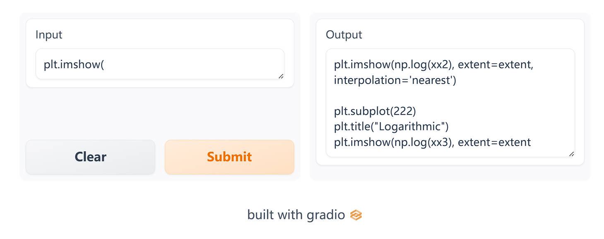

上图展示的是一个已经训练并上传到 Hub 的模型，它使用的是本节中显示的代码。你可以在 [这里](https://huggingface.co/huggingface-course/codeparrot-ds?text=plt.imshow%28)(https://huggingface.co/huggingface-course/codeparrot-ds?text=plt.imshow%28) 找到它。注意，由于文本生成过程中有一些随机性，你可能会得到稍微不同的结果。

### 收集数据 

我们可以从诸如 GitHub 这样的代码仓库中获取丰富的 Python 代码，通过对每个 Python 仓库进行抓取，我们就可以创建一个数据集。这是在 [Transformers textbook](https://learning.oreilly.com/library/view/natural-language-processing/9781098136789/)(https://learning.oreilly.com/library/view/natural-language-processing/9781098136789/) 中预训练一个大型 GPT-2 模型的方法。作者们使用了一个大约 180GB 的 GitHub 数据集，其中包含大约 2000 万个名为 `codeparrot` 的 Python 文件，他们构建了一个数据集，并在 [Hugging Face Hub](https://huggingface.co/datasets/transformersbook/codeparrot)(https://huggingface.co/datasets/transformersbook/codeparrot) 上分享了这个数据集。

然而，使用完整语料库的训练既耗时又费力，我们只需要找到 Python 数据科学堆栈相关的数据集子集。所以，让我们从 `codeparrot` 数据集中筛选出包含这个栈中所有相关库的所有文件。由于数据集的太大，我们希望避免下载它；因此，我们将使用流功能来动态过滤它。为了使用之前提到的库来筛选代码样本，我们将使用以下函数：

```python
def any_keyword_in_string(string, keywords):
    for keyword in keywords:
        if keyword in string:
            return True
    return False
```

让我们用两个例子来测试一下：

```python
filters = ["pandas", "sklearn", "matplotlib", "seaborn"]
example_1 = "import numpy as np"
example_2 = "import pandas as pd"

print(
    any_keyword_in_string(example_1, filters), any_keyword_in_string(example_2, filters)
)
```

```python
False True
```

我们可以使用它来创建一个函数，该函数将流式传输数据集并过滤我们想要的元素：

```python
from collections import defaultdict
from tqdm import tqdm
from datasets import Dataset

def filter_streaming_dataset(dataset, filters):
    filtered_dict = defaultdict(list)
    total = 0
    for sample in tqdm(iter(dataset)):
        total += 1
        if any_keyword_in_string(sample["content"], filters):
            for k, v in sample.items():
                filtered_dict[k].append(v)
    print(f"{len(filtered_dict['content'])/total:.2%} of data after filtering.")
    return Dataset.from_dict(filtered_dict)
```

然后我们可以直接使用此函数处理流数据集：

```python
## 执行这个代码块需要非常长的时间,因此你可以跳过它,继续执行下一个!
from datasets import load_dataset

split = "train"  # "valid"
filters = ["pandas", "sklearn", "matplotlib", "seaborn"]

data = load_dataset(f"transformersbook/codeparrot-{split}", split=split, streaming=True)
filtered_data = filter_streaming_dataset(data, filters)
```

```python
3.26% of data after filtering.
```

这将我们的数据集压缩到了原始数据集的大约 3％，但这仍然是相当可观的大小——最终的数据集是 6GB，由 600,000 个 Python 脚本组成！

过滤完整的数据集可能需要 2-3 小时，这取决于你的机器性能和带宽。如果你不想亲自经历这个漫长的过程，我们在 Hub 上提供了过滤后的数据集供你下载：

```python
from datasets import load_dataset, DatasetDict

ds_train = load_dataset("huggingface-course/codeparrot-ds-train", split="train")
ds_valid = load_dataset("huggingface-course/codeparrot-ds-valid", split="validation")

raw_datasets = DatasetDict(
    {
        "train": ds_train,  # .shuffle().select(range(50000)),
        "valid": ds_valid,  # .shuffle().select(range(500))
    }
)

raw_datasets
```

```python
DatasetDict({
    train: Dataset({
        features: ['repo_name', 'path', 'copies', 'size', 'content', 'license'],
        num_rows: 606720
    })
    valid: Dataset({
        features: ['repo_name', 'path', 'copies', 'size', 'content', 'license'],
        num_rows: 3322
    })
})
```

让我们看一个来自数据集的例子。我们将只显示每个字段的前 200 个字符：

```python
for key in raw_datasets["train"][0]:
    print(f"{key.upper()}: {raw_datasets['train'][0][key][:200]}")
```

```python
'REPO_NAME: kmike/scikit-learn'
'PATH: sklearn/utils/__init__.py'
'COPIES: 3'
'SIZE: 10094'
'''CONTENT: """
The :mod:`sklearn.utils` module includes various utilites.
"""

from collections import Sequence

import numpy as np
from scipy.sparse import issparse
import warnings

from .murmurhash import murm
LICENSE: bsd-3-clause'''
```

我们可以看到， `content` 字段包含了我们希望模型训练的代码。现在我们有了数据集，我们需要对文本进行一些处理，以便它们适合于预训练。

### 准备数据集 

首先，我们需要将数据进行分词处理，这样才能进行训练。由于我们的主要目标是自动补全短的函数调用，因此我们可以将上下文大小设置得相对较小。这样做的好处是我们可以更快地训练模型，而且需要的内存也大大减少。如果你的应用需要更多的上下文（比如，你希望模型根据包含函数定义的文件编写单元测试），那么应该增大该数字，但是也要记住这会增加 GPU 内存的占用。现在，我们将上下文大小固定为 128 个 tokens 而不是在 GPT-2 或 GPT-3 中使用的 1,024 或 2,048 个 tokens 

大多数文档都包含超过 128 个 tokens 因此简单地将输入截断到最大长度会删除我们数据集的很一大部分。因此，我们将使用 `return_overflowing_tokens` 选项将整个输入进行分词处理，并将其分割为几个块，正如我们在第七章中所做的那样。我们还将使用 `return_length` 选项自动返回每个创建的块的长度。通常，最后一个块的大小会小于上下文大小，我们将去掉最后一块以避免填充问题；因为我们已经有足够的数据，所以不需要它们。

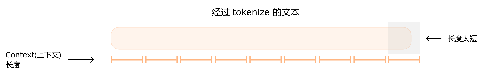

让我们通过查看前两个示例来具体了解这是如何实现的：

```python
from transformers import AutoTokenizer

context_length = 128
tokenizer = AutoTokenizer.from_pretrained("huggingface-course/code-search-net-tokenizer")

outputs = tokenizer(
    raw_datasets["train"][:2]["content"],
    truncation=True,
    max_length=context_length,
    return_overflowing_tokens=True,
    return_length=True,
)

print(f"Input IDs length: {len(outputs['input_ids'])}")
print(f"Input chunk lengths: {(outputs['length'])}")
print(f"Chunk mapping: {outputs['overflow_to_sample_mapping']}")
```

```python
Input IDs length: 34
Input chunk lengths: [128, 128, 128, 128, 128, 128, 128, 128, 128, 128, 128, 128, 128, 128, 128, 128, 128, 128, 128, 117, 128, 128, 128, 128, 128, 128, 128, 128, 128, 128, 128, 128, 128, 41]
Chunk mapping: [0, 0, 0, 0, 0, 0, 0, 0, 0, 0, 0, 0, 0, 0, 0, 0, 0, 0, 0, 0, 1, 1, 1, 1, 1, 1, 1, 1, 1, 1, 1, 1, 1, 1]
```

我们可以看到，这两个例子总共得到了 34 个块。查看块长度，我们可以看到两个文档末端的块少于 128 个 tokens （分别为 117 和 41）。这些只占我们所拥有的总块数的一小部分，因此我们可以放心地丢掉它们。通过 `overflow_to_sample_mapping` 字段，我们还可以重新构建哪些块属于哪个输入样本。

在这个操作中，我们使用了Datasets 中的 `Dataset.map()` 函数的一个便捷的特性，即它并不需要一对一的映射；正如我们在第三节中看到的，我们可以创建比输入 `batch_size` 更多或更少元素的 batch。当进行像数据增强或数据过滤这样改变元素数量的操作时非常有用。在我们的情况下，当将每个元素分词成指定上下文大小的块时，我们从每个文档中创建了许多样本。我们需保删除原有的列，因为它们的大小有冲突。如果我们想保留它们，我们可以复制并填充它们，并在 `Dataset.map()` 调用中返回它们。

```python
def tokenize(element):
    outputs = tokenizer(
        element["content"],
        truncation=True,
        max_length=context_length,
        return_overflowing_tokens=True,
        return_length=True,
    )
    input_batch = []
    for length, input_ids in zip(outputs["length"], outputs["input_ids"]):
        if length == context_length:
            input_batch.append(input_ids)
    return {"input_ids": input_batch}

tokenized_datasets = raw_datasets.map(
    tokenize, batched=True, remove_columns=raw_datasets["train"].column_names
)
tokenized_datasets
```

```python
DatasetDict({
    train: Dataset({
        features: ['input_ids'],
        num_rows: 16702061
    })
    valid: Dataset({
        features: ['input_ids'],
        num_rows: 93164
    })
})
```

我们现在有 1670 万个示例，每个示例有 128 个 tokens 总共相当于大约 21 亿个 tokens。作为参考，OpenAI 的 GPT-3 和 Codex 模型分别在 300 和 1000 亿个 tokens 上训练，其中 Codex 模型从 GPT-3 checkpoint 初始化。本节的目标不是与这些能生成长且连贯文本的模型竞争，而是创建一个能为数据科学家提供快速自动代码完成功能的精简版本。

既然我们已经准备好了数据集，那就来设置模型吧！

<div custom-style="Tip-green">

✏️ **试一试！**这里我们删除了所有小于上下文大小的块，并不会造成大问题，因为我们使用的是小的上下文窗口。随着增大上下文大小（或者语料库中的文档长度都很短），被抛弃的块的比例也会增加。准备数据的更有效方法是将所有 tokenize 后的样本加入一个 batch 中，每个语料之间有一个 `eos_token_id` token 然后对连接后的序列进行切块处理。作为练习，修改 `tokenize()` 函数以利用这种方法。请注意，为了获取完整的 token  ID 序列你需要设置 `truncation=False` ，并从 tokenizer 中删除其他参数。

</div>

### 初始化一个新模型 

我们的第一步是初始化一个全新地 GPT-2 模型。我们将通过加载预训练配置来使用 GPT-2 small 模型相同的配置，并确保 tokenizer 大小与模型词汇表大小匹配，以及设置 `bos` 和 `eos` （序列的开始和结束） token IDs：

{#if fw === 'pt'}

```python
#####Pytorch}
from transformers import AutoTokenizer, GPT2LMHeadModel, AutoConfig

config = AutoConfig.from_pretrained(
    "gpt2",
    vocab_size=len(tokenizer),
    n_ctx=context_length,
    bos_token_id=tokenizer.bos_token_id,
    eos_token_id=tokenizer.eos_token_id,
)####end
```

有了这个配置，我们可以加载一个新模型。注意，这是我们第一次不使用 `from_pretrained()` 函数，因为我们实际上是自己初始化一个全新的模型：

```python
#####Pytorch}
model = GPT2LMHeadModel(config)
model_size = sum(t.numel() for t in model.parameters())
print(f"GPT-2 size: {model_size/1000**2:.1f}M parameters")####end
```

```python
#####Pytorch}
GPT-2 size: 124.2M parameters####end
```

{:else}

```python
#####TensorFlow}
from transformers import AutoTokenizer, TFGPT2LMHeadModel, AutoConfig

config = AutoConfig.from_pretrained(
    "gpt2",
    vocab_size=len(tokenizer),
    n_ctx=context_length,
    bos_token_id=tokenizer.bos_token_id,
    eos_token_id=tokenizer.eos_token_id,
)####end
```

有了这个配置，我们可以加载一个新模型。注意，这是我们第一次不使用 `from_pretrained()` 函数，因为我们实际上是自己初始化一个全新的模型：

```python
#####TensorFlow}
model = TFGPT2LMHeadModel(config)
model(model.dummy_inputs)  # 构建模型
model.summary()####end
```

```python
#####TensorFlow}
_________________________________________________________________
Layer (type)                 Output Shape              Param #   
=================================================================
transformer (TFGPT2MainLayer multiple)                  124242432 
=================================================================
Total params: 124,242,432
Trainable params: 124,242,432
Non-trainable params: 0
_________________________________________________________________####end
```

{/if}

我们的模型有 124M 个参数需要训练。在开始训练之前，我们需要设置一个数据整理器（DataCollator），它将负责创建 Batch。我们可以使用 `DataCollatorForLanguageModeling` ，它专门用于语言建模（正如其名字所暗示）。除了堆叠和填充创建 Batch 之外，它还负责创建语言模型的标签 —— 在因果语言建模中，输入就是标签（只是偏移一个元素），而这个数据整理器（DataCollator）在训练过程中实时创建它们，因此我们不需要复制 `input_ids` 。

注意， `DataCollatorForLanguageModeling` 同时支持掩码语言建模 （MLM） 和因果语言建模 （CLM）。默认情况下它会为 MLM 准备数据，但我们可以通过设置 `mlm=False` 参数切换到 CLM。

{#if fw === 'pt'}

```python
#####Pytorch}
from transformers import DataCollatorForLanguageModeling

tokenizer.pad_token = tokenizer.eos_token
data_collator = DataCollatorForLanguageModeling(tokenizer, mlm=False)####end
```

{:else}

```python
#####TensorFlow}
from transformers import DataCollatorForLanguageModeling

tokenizer.pad_token = tokenizer.eos_token
data_collator = DataCollatorForLanguageModeling(tokenizer, mlm=False, return_tensors="tf")####end
```

{/if}

让我们看一个例子：

```python
out = data_collator([tokenized_dataset["train"][i] for i in range(5)])
for key in out:
    print(f"{key} shape: {out[key].shape}")
```

{#if fw === 'pt'}

```python
#####Pytorch}
input_ids shape: torch.Size([5, 128])
attention_mask shape: torch.Size([5, 128])
labels shape: torch.Size([5, 128])####end
```

{:else}

```python
#####TensorFlow}
input_ids shape: (5, 128)
attention_mask shape: (5, 128)
labels shape: (5, 128)####end
```

{/if}

我们可以看到示例已经堆叠在一起，并且所有 tensor 都具有相同的形状。

{#if fw === 'tf'}

现在，我们可以使用 `prepare_tf_dataset()` 方法，将上面创建的数据整理器（DataCollator）将数据集转换为 TensorFlow 数据集：

```python
#####TensorFlow}
tf_train_dataset = model.prepare_tf_dataset(
    tokenized_dataset["train"],
    collate_fn=data_collator,
    shuffle=True,
    batch_size=32,
)
tf_eval_dataset = model.prepare_tf_dataset(
    tokenized_dataset["valid"],
    collate_fn=data_collator,
    shuffle=False,
    batch_size=32,
)####end
```

{/if}

<div custom-style="Tip-yellow">

⚠️ 调整输入和标签以对齐它们的操作将在模型内部进行，所以数据整理器（DataCollator）只需复制输入来创建标签。

</div>

现在我们已经准备好了所有东西，可以开始训练我们的模型了——好像也不是那么困难！在我们开始训练之前，我们应该登录到 Hugging Face。如果你正在使用 Notebook 进行工作，你可以使用下面的实用函数进行登录：

```python
from huggingface_hub import notebook_login

notebook_login()
```

这将显示一个小部件，你可以在其中输入你的 Hugging Face 登录凭据。

如果你不是在 Notebook 上工作，只需在终端中输入以下行：

```python
huggingface-cli login
```

{#if fw === 'pt'}

剩下要做的就是配置训练参数并启动 `Trainer` ．我们将使用余弦学习率调度，并进行一些 Warmup 有效 batch size 是 256 （ `per_device_train_batch_size` * `gradient_accumulation_steps` ）。当当单个 batch 无法放入内存时，会使用梯度累积，并通过多次向前/向后传递逐步建立梯度。当我们使用 Accelerate 创建训练循环时，我们将看到这一点。

```python
#####Pytorch}
from transformers import Trainer, TrainingArguments

args = TrainingArguments(
    output_dir="codeparrot-ds",
    per_device_train_batch_size=32,
    per_device_eval_batch_size=32,
    evaluation_strategy="steps",
    eval_steps=5_000,
    logging_steps=5_000,
    gradient_accumulation_steps=8,
    num_train_epochs=1,
    weight_decay=0.1,
    warmup_steps=1_000,
    lr_scheduler_type="cosine",
    learning_rate=5e-4,
    save_steps=5_000,
    fp16=True,
    push_to_hub=True,
)

trainer = Trainer(
    model=model,
    tokenizer=tokenizer,
    args=args,
    data_collator=data_collator,
    train_dataset=tokenized_datasets["train"],
    eval_dataset=tokenized_datasets["valid"],
)####end
```

现在我们只需启动 `Trainer` 并等待训练完成。根据你是在整个训练集还是在训练集的一个子集上运行它，这将分别需要 20 或 2 个小时，因此请喝杯咖啡或者找一本好书来阅读！

```python
#####Pytorch}
trainer.train()####end
```

训练完成后，我们可以将模型和 tokenizer 推送到 Hub：

```python
#####Pytorch}
trainer.push_to_hub()####end
```

{:else}

我们需要做的就是配置训练超参数并调用 `compile()` 和 `fit()` 。我们将使用带有一些预热的学习率调整策略来提高训练的稳定性：

```python
#####TensorFlow}
from transformers import create_optimizer
import tensorflow as tf

num_train_steps = len(tf_train_dataset)
optimizer, schedule = create_optimizer(
    init_lr=5e-5,
    num_warmup_steps=1_000,
    num_train_steps=num_train_steps,
    weight_decay_rate=0.01,
)
model.compile(optimizer=optimizer)

## 使用 float16 混合精度进行训练
tf.keras.mixed_precision.set_global_policy("mixed_float16")####end
```

现在我们只需调用 `model.fit()` ，并等待训练完成。根据你是否在完整的训练集或者训练集的子集上运行，这将分别需要 20 小时或者 2 小时，所以拿一些咖啡和一本好书来阅读！训练完成后，我们可以将模型和 tokenizer 推送到 Hub：

```python
#####TensorFlow}
from transformers.keras_callbacks import PushToHubCallback

callback = PushToHubCallback(output_dir="codeparrot-ds", tokenizer=tokenizer)

model.fit(tf_train_dataset, validation_data=tf_eval_dataset, callbacks=[callback])####end
```

{/if}

<div custom-style="Tip-green">

✏️ **试试看！** 除了 `TrainingArguments` 之外，我们只需要大约 30 行代码就可以从原始文本到训练 GPT-2。用你自己的数据集试试看，看看你能不能得到好的结果！

</div>

<div custom-style="Tip-green">

{#if fw === 'pt'}

💡 如果你能使用多 GPU 的机器，尝试在那里运行代码。 `Trainer` 自动管理多台机器，这能极大地加快训练速度。

{:else}

💡 如果你正在使用具有多个 GPU 的计算机，则可以尝试使用 `MirroredStrategy` 上下文来大幅加快训练速度。你需要创建一个 `tf.distribute.MirroredStrategy` 对象，并确保所有的 `to_tf_dataset` 或 `prepare_tf_dataset()` 方法以及模型创建和对 `fit()` 的调用都在其 `scope()` 上下文中运行。你可以在 [这里](https://www.tensorflow.org/guide/distributed_training#use_tfdistributestrategy_with_keras_modelfit)(https://www.tensorflow.org/guide/distributed_training#use_tfdistributestrategy_with_keras_modelfit) 查看有关此内容的文档。

{/if}

</div>

### 使用 pipeline 进行代码生成 

现在是见证奇迹的时刻：我们来看看训练好的模型到底表现如何！我们可以在日志中看到损失持续下降，但要测试模型的效果，我们就看看它对一些提示的反应如何。为此，我们将模型包装在一个文本生成的 `pipeline` 中，并如果有 GPU 可用，我们将把它放在 GPU 上进行快速生成：

{#if fw === 'pt'}

```python
#####Pytorch}
import torch
from transformers import pipeline

device = torch.device("cuda") if torch.cuda.is_available() else torch.device("cpu")
pipe = pipeline(
    "text-generation", model="huggingface-course/codeparrot-ds", device=device
)####end
```

{:else}

```python
#####TensorFlow}
from transformers import pipeline

course_model = TFGPT2LMHeadModel.from_pretrained("huggingface-course/codeparrot-ds")
course_tokenizer = AutoTokenizer.from_pretrained("huggingface-course/codeparrot-ds")
pipe = pipeline(
    "text-generation", model=course_model, tokenizer=course_tokenizer, device=0
)####end
```

{/if}

让我们从创建散点图的简单任务开始：

```python
txt = """\
## 创建一些数据
x = np.random.randn(100)
y = np.random.randn(100)

## 使用 x,y 创建散点图
"""
print(pipe(txt, num_return_sequences=1)[0]["generated_text"])
```

```python
## 创建一些数据
x = np.random.randn(100)
y = np.random.randn(100)

## 使用 x,y 创建散点图
plt.scatter(x, y)

## 创建散点
```

结果看起来是正确的。那么对于 `pandas` 操作也可以吗？让我们看看是否能从两个数组创建一个 `DataFrame` ：

```python
txt = """\
## 创建一些数据
x = np.random.randn(100)
y = np.random.randn(100)

## 从 x 和 y 创建 dataframe
"""
print(pipe(txt, num_return_sequences=1)[0]["generated_text"])
```

```python
## 创建一些数据
x = np.random.randn(100)
y = np.random.randn(100)

## 从 x 和 y 创建 dataframe
df = pd.DataFrame({'x': x, 'y': y})
df.insert(0,'x', x)
for
```

很好，这是正确的答案——尽管它又把 `x` 插入了一次。由于生成的 token 数量有限，所以下面的 `for` 循环被切断了。让我们看看我们是否能做些更复杂的事情，让模型帮助我们使用 `groupby` 操作：

```python
txt = """\
## 有职业,收入和名字的 dataframe
df = pd.DataFrame({'profession': x, 'income':y, 'name': z})

## 计算每个职业的平均收入
"""
print(pipe(txt, num_return_sequences=1)[0]["generated_text"])
```

```python
## 有职业,收入和名字的 dataframe
df = pd.DataFrame({'profession': x, 'income':y, 'name': z})

## 计算每个职业的平均收入
profession = df.groupby(['profession']).mean()

## 计算
```

不错；这是正确的做法。最后，让我们看看我们是否也可以将其用于 `scikit-learn` 并建立一个随机森林模型：

```python
txt = """
## 从 scikit-learn 导入随机森林回归器
from sklearn.ensemble import RandomForestRegressor

## 用 X, y 拟合带有 300 个估算器的随机森林模型:
"""
print(pipe(txt, num_return_sequences=1)[0]["generated_text"])
```

```python
## 从 scikit-learn 导入随机森林回归器
from sklearn.ensemble import RandomForestRegressor

## 用 X, y 拟合带有 300 个估算器的随机森林模型:
rf = RandomForestRegressor(n_estimators=300, random_state=random_state, max_depth=3)
rf.fit(X, y)
rf
```

{#if fw === 'tf'}

看看这几个例子，似乎模型已经学习了 Python 数据科学堆栈的一些语法。当然，在将模型部署到现实世界之前，我们需要更彻底地评估模型，但这仍然是一个令人印象深刻的原型。

{:else}

从这几个例子来看，模型似乎已经学习了 Python 数据科学堆栈的一些语法（当然，在将模型部署到现实世界之前，我们需要对其进行更全面的评估）。然而，有时候它需要更多的模型训练定制来达到特定情境所需的性能。例如，如果我们想动态更新 `batch_size` 或添加一个条件训练循环来跳过坏示例怎么办？一种选择是修改 `Trainer` 添加新的功能，但有时从头开始编写训练循环会更简单。这就是Accelerate 的用武之地。

{/if}

{#if fw === 'pt'}

### 使用Accelerate 进行训练 

我们已经看到了如何使用 `Trainer` 训练模型，这可以对训练过程进行一些定制。然而，有时我们想要完全控制训练循环，或者我们想要进行一些奇特的更改。在这种情况下 Accelerate 是一个不错的选择，本节我们将介绍如何使用它来训练我们的模型。为了让事情变得更有趣，我们还将在训练循环中添加一些修改。

由于我们主要关注的是为数据科学库提供合理的代码自动补充功能，因此对于更多使用这些库的训练样本赋予更高的权重是有意义的。我们可以通过使用 `plt` 、 `pd` 、 `sk` 、 `fit` 和 `predict` 等关键词来轻松地识别出这些例子，这些关键词是 `matplotlib.pyplot` 、 `pandas` 和 `sklearn` 的最常用重命名后的导入名称，以及 sklearn 的 fit/predict 方法。如果这些都表示为一个单一的 token，我们可以轻松地检查它们是否出现在输入序列中。Tokens 有可能有空格前缀，所以我们也会在 tokenizer 词汇表中检查这些版本。为了验证其有效性，我们会添加一个应该被分割为多个 tokens 的测试 token：

```python
#####Pytorch}
keytoken_ids = []
for keyword in [
    "plt",
    "pd",
    "sk",
    "fit",
    "predict",
    " plt",
    " pd",
    " sk",
    " fit",
    " predict",
    "testtest",
]:
    ids = tokenizer([keyword]).input_ids[0]
    if len(ids) == 1:
        keytoken_ids.append(ids[0])
    else:
        print(f"Keyword has not single token: {keyword}")####end
```

```python
#####Pytorch}
'Keyword has not single token: testtest'####end
```

太好了，这个方法似乎很有效！我们现在可以编写一个自定义的损失函数，它将输入序列、logits 和我们刚刚选择的关键作为输入。首先我们需要对齐 logits 和 inputs：右移一个单位的输入序列形成了标签，因为下一个 token 就是当前 token 的标签。我们可以通过从输入序列的第二个 token 开始设置标签，因为模型不会预测第一个 token。然后我们截断最后一个 logit，因为我们没有完整输入序列后面的标签。有了这些，我们就可以计算每个样本的损失，并计算每个样本中所有关键词的出现次数。最后，我们使用出现次数作为权重，计算所有样本的加权平均值。由于我们不想抛弃所有没有关键词的样本，我们将所有的权重都加 1：

```python
#####Pytorch}
from torch.nn import CrossEntropyLoss
import torch

def keytoken_weighted_loss(inputs, logits, keytoken_ids, alpha=1.0):
    # 左移 tokens < n 预测 n
    shift_labels = inputs[..., 1:].contiguous()
    shift_logits = logits[..., :-1, :].contiguous()
    # 计算每一个token的loss
    loss_fct = CrossEntropyLoss(reduce=False)
    loss = loss_fct(shift_logits.view(-1, shift_logits.size(-1)), shift_labels.view(-1))
    # 对于每个样本重新调整大小并平均
    loss_per_sample = loss.view(shift_logits.size(0), shift_logits.size(1)).mean(axis=1)
    # 计算并缩放权重
    weights = torch.stack([(inputs == kt).float() for kt in keytoken_ids]).sum(
        axis=[0, 2]
    )
    weights = alpha * (1.0 + weights)
    # 计算评价权重
    weighted_loss = (loss_per_sample * weights).mean()
    return weighted_loss####end
```

在我们开始使用这个精妙的新损失函数进行训练之前，我们需要准备一些事情：

- 我们需要数据加载器来批量加载数据。
- 我们需要设置权重衰减参数。
- 有时我们希望进行评估，所以将评估代码包装在一个函数中是有意义的。

让我们从数据加载器开始。我们只需要将数据集的格式设置为 `"torch"` ，然后我们就可以将它传递给一个具有适当 batch size 的 PyTorch 的 `DataLoader` ：

```python
#####Pytorch}
from torch.utils.data.dataloader import DataLoader

tokenized_dataset.set_format("torch")
train_dataloader = DataLoader(tokenized_dataset["train"], batch_size=32, shuffle=True)
eval_dataloader = DataLoader(tokenized_dataset["valid"], batch_size=32)####end
```

接下来，我们将参数分组，以便优化器知道哪些参数需要进行额外的权重衰减。通常，所有的偏置和 LayerNorm 权重项都不需要；因此我们可以这样做：

```python
#####Pytorch}
weight_decay = 0.1

def get_grouped_params(model, no_decay=["bias", "LayerNorm.weight"]):
    params_with_wd, params_without_wd = [], []
    for n, p in model.named_parameters():
        if any(nd in n for nd in no_decay):
            params_without_wd.append(p)
        else:
            params_with_wd.append(p)
    return [
        {"params": params_with_wd, "weight_decay": weight_decay},
        {"params": params_without_wd, "weight_decay": 0.0},
    ]####end
```

我们希望在训练过程中定期在验证集上评估模型，让我们为此编写一个函数。它只需遍历评估数据加载器，并收集所有进程中的损失值：

```python
#####Pytorch}
def evaluate():
    model.eval()
    losses = []
    for step, batch in enumerate(eval_dataloader):
        with torch.no_grad():
            outputs = model(batch["input_ids"], labels=batch["input_ids"])

        losses.append(accelerator.gather(outputs.loss))
    loss = torch.mean(torch.cat(losses))
    try:
        perplexity = torch.exp(loss)
    except OverflowError:
        perplexity = float("inf")
    return loss.item(), perplexity.item()####end
```

通过 `evaluate()` 函数我们定期可以获取损失值和 [困惑度（perplexity）](/course/chapter7/3)(/course/chapter7/3) 。接下来，我们重新加载我们的模型以确保我们再次从头开始训练：

```python
#####Pytorch}
model = GPT2LMHeadModel(config)####end
```

然后我们可以定义我们的优化器，使用之前的函数来分割权重衰减的参数：

```python
#####Pytorch}
from torch.optim import AdamW

optimizer = AdamW(get_grouped_params(model), lr=5e-4)####end
```

现在让我们准备模型、优化器和数据加载器，然后我们可以开始训练：

```python
#####Pytorch}
from accelerate import Accelerator

accelerator = Accelerator(fp16=True)

model, optimizer, train_dataloader, eval_dataloader = accelerator.prepare(
    model, optimizer, train_dataloader, eval_dataloader
)####end
```

<div custom-style="Tip-red">

🚨 如果你在 TPU 上训练，你需要将上述单元格开始的所有代码移到一个专门的训练函数中。更多详情请参阅第四章。

</div>

现在我们已经将我们的 `train_dataloader` 传递给了 `accelerator.prepare()` ，我们可以使用 `len()` 来计算训练步骤的数量。请记住，我们应该在准备好 `dataloader` 后再使用 `len()` ，因为改动 `dataloader` 会改变其长度。我们使用一个从学习率到 0 的经典线性学习率调度：

```python
#####Pytorch}
num_train_epochs = 1
num_update_steps_per_epoch = len(train_dataloader)
num_training_steps = num_train_epochs * num_update_steps_per_epoch

lr_scheduler = get_scheduler(
    name="linear",
    optimizer=optimizer,
    num_warmup_steps=1_000,
    num_training_steps=num_training_steps,
)####end
```

最后，为了将我们的模型推送到 Hub，我们需要在一个工作文件夹中创建一个 `Repository` 对象。如果你还没有登录的话，首先需要登录到 Hugging Face，我们将根据模型 ID 来确定仓库名称（你可以使用你喜欢的名字替换 `repo_name` ；它只需要包含你的用户名，可以使用 `get_full_repo_name()` 函数的查看目前的 `repo_name`）：

```python
#####Pytorch}
from huggingface_hub import Repository, get_full_repo_name

model_name = "codeparrot-ds-accelerate"
repo_name = get_full_repo_name(model_name)
repo_name####end
```

```python
#####Pytorch}
'sgugger/codeparrot-ds-accelerate'####end
```

然后我们可以将该仓库克隆到本地文件夹中。如果它已经存在，这个本地文件夹应该是我们正在使用的仓库的现有克隆：
```python
#####Pytorch}
output_dir = "codeparrot-ds-accelerate"
repo = Repository(output_dir, clone_from=repo_name)####end
```

我们现在可以通过调用 `repo.push_to_hub()` 方法上传保存在 `output_dir` 中的所有内容。这将帮助我们在每个训练周期结束时上传中间模型。

```python
#####Pytorch}
evaluate()####end
```

```python
#####Pytorch}
(10.934126853942871, 56057.14453125)####end
```

目前的损失和困惑度都是非常高的值，但这并不奇怪，因为我们还没有训练模型。有了这些，我们已经为编写训练脚本的核心部分：训练循环做好了准备。在训练循环中，我们迭代遍历数据加载器并将成批量的数据传递给模型。有了 logits，我们就可以评估我们的自定义损失函数。我们通过梯度累积步骤的数量来缩放损失，以避免在聚合更多步骤时产生更大的损失。在我们优化之前，我们也会剪裁梯度来更好的收敛。最后，每隔一段步数，我们用我们新的 `evaluate()` 函数在评估集上评估模型：

```python
#####Pytorch}
from tqdm.notebook import tqdm

gradient_accumulation_steps = 8
eval_steps = 5_000

model.train()
completed_steps = 0
for epoch in range(num_train_epochs):
    for step, batch in tqdm(
        enumerate(train_dataloader, start=1), total=num_training_steps
    ):
        logits = model(batch["input_ids"]).logits
        loss = keytoken_weighted_loss(batch["input_ids"], logits, keytoken_ids)
        if step % 100 == 0:
            accelerator.print(
                {
                    "lr": get_lr(),
                    "samples": step * samples_per_step,
                    "steps": completed_steps,
                    "loss/train": loss.item() * gradient_accumulation_steps,
                }
            )
        loss = loss / gradient_accumulation_steps
        accelerator.backward(loss)
        if step % gradient_accumulation_steps == 0:
            accelerator.clip_grad_norm_(model.parameters(), 1.0)
            optimizer.step()
            lr_scheduler.step()
            optimizer.zero_grad()
            completed_steps += 1
        if (step % (eval_steps * gradient_accumulation_steps)) == 0:
            eval_loss, perplexity = evaluate()
            accelerator.print({"loss/eval": eval_loss, "perplexity": perplexity})
            model.train()
            accelerator.wait_for_everyone()
            unwrapped_model = accelerator.unwrap_model(model)
            unwrapped_model.save_pretrained(output_dir, save_function=accelerator.save)
            if accelerator.is_main_process:
                tokenizer.save_pretrained(output_dir)
                repo.push_to_hub(
                    commit_message=f"Training in progress step {step}", blocking=False
                )####end
```

就是这样 - 你现在拥有自己的因果语言模型（例如 GPT-2）的自定义训练循环，你可以根据自己的需要进一步定制。

<div custom-style="Tip-green">

✏️ **试试看！** 创建适合你的用例的自定义损失函数，或在训练循环中添加另一个自定义步骤。

</div>

<div custom-style="Tip-green">

✏️ **试试看！**  当运行长时间的训练实验时，使用 TensorBoard 或 Weights & Biases 等工具记录重要指标是个好主意。向训练循环中添加适当的日志记录，这样你可以随时检查训练进度。

</div>

{/if}


## 8.6 抽取式问答 

现在我们来看看问答这个任务！这个任务有很多种类型，但我们在本节将要关注的是称为 `抽取式（extractive）` 问题回答的形式。针对一些文档会有一些问题，其中答案就在文档段落之内。

我们将使用 [SQuAD 数据集](https://rajpurkar.github.io/SQuAD-explorer/)(https://rajpurkar.github.io/SQuAD-explorer/) 微调一个 BERT 模型，其中包括群众工作者对一组维基百科文章提出的问题。以下是一个小的测试样例：

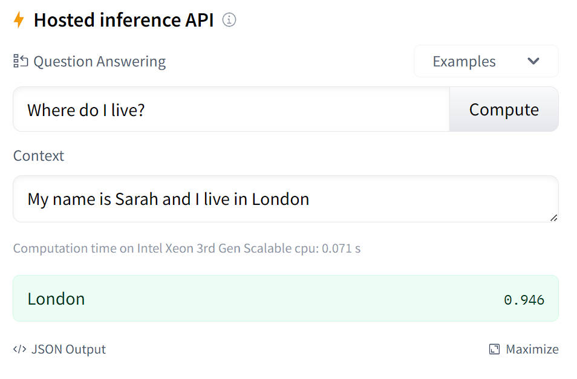

本节使用的代码已经上传到了 Hub。你可以在 [这里](https://huggingface.co/huggingface-course/bert-finetuned-squad?context=%F0%9F%A4%97+Transformers+is+backed+by+the+three+most+popular+deep+learning+libraries+%E2%80%94+Jax%2C+PyTorch+and+TensorFlow+%E2%80%94+with+a+seamless+integration+between+them.+It%27s+straightforward+to+train+your+models+with+one+before+loading+them+for+inference+with+the+other.&question=Which+deep+learning+libraries+back+%F0%9F%A4%97+Transformers%3F)(https://huggingface.co/huggingface-course/bert-finetuned-squad?context=%F0%9F%A4%97+Transformers+is+backed+by+the+three+most+popular+deep+learning+libraries+%E2%80%94+Jax%2C+PyTorch+and+TensorFlow+%E2%80%94+with+a+seamless+integration+between+them.+It%27s+straightforward+to+train+your+models+with+one+before+loading+them+for+inference+with+the+other.&question=Which+deep+learning+libraries+back+%F0%9F%A4%97+Transformers%3F) 找到它并尝试用它进行预测。

<div custom-style="Tip-green">

💡 像 BERT 这样的纯编码器模型往往很擅长提取诸如 “谁发明了 Transformer 架构？”之类的事实性问题的答案。但在给出诸如 “为什么天空是蓝色的？” 之类的开放式问题时表现不佳。在这些更具挑战性的情况下，通常使用编码器-解码器模型如 T5 和 BART 来以类似于 [文本摘要](https://chat.openai.com/course/chapter7/5)(https://chat.openai.com/course/chapter7/5) 的方式整合信息。如果你对这种 `生成式（generative）` 问题回答感兴趣，我们推荐你查看我们基于 [ELI5 数据集](https://huggingface.co/datasets/eli5)(https://huggingface.co/datasets/eli5) 的 [演示demo](https://yjernite.github.io/lfqa.html)(https://yjernite.github.io/lfqa.html) 。

### 准备数据 

作为抽取式问题回答的学术基准最常用的数据集是 [SQuAD](https://rajpurkar.github.io/SQuAD-explorer/)(https://rajpurkar.github.io/SQuAD-explorer/) ，所以我们在这里将使用它。还有一个更难的 [SQuAD v2](https://huggingface.co/datasets/squad_v2)(https://huggingface.co/datasets/squad_v2) 基准，其中包含一些没有答案的问题。只要你自己的数据集包含了 Context 列、问题列和答案列，你应该能够适用下面的步骤。

#### SQuAD 数据集 

像往常一样，我们可以使用 `load_dataset()` 在一步中下载和缓存数据集：

```python
from datasets import load_dataset

raw_datasets = load_dataset("squad")
```

我们可以查看这个 `raw_datasets` 对象来了解更多关于 SQuAD 数据集的信息：

```python
raw_datasets
```

```python
DatasetDict({
    train: Dataset({
        features: ['id', 'title', 'context', 'question', 'answers'],
        num_rows: 87599
    })
    validation: Dataset({
        features: ['id', 'title', 'context', 'question', 'answers'],
        num_rows: 10570
    })
})
```

看起来我们拥有所需的 `context` 、 `question` 和 `answers` 字段，所以让我们打印训练集的第一个元素：

```python
print("Context: ", raw_datasets["train"][0]["context"])
print("Question: ", raw_datasets["train"][0]["question"])
print("Answer: ", raw_datasets["train"][0]["answers"])
```

```python
Context: 'Architecturally, the school has a Catholic character. Atop the Main Building\'s gold dome is a golden statue of the Virgin Mary. Immediately in front of the Main Building and facing it, is a copper statue of Christ with arms upraised with the legend "Venite Ad Me Omnes". Next to the Main Building is the Basilica of the Sacred Heart. Immediately behind the basilica is the Grotto, a Marian place of prayer and reflection. It is a replica of the grotto at Lourdes, France where the Virgin Mary reputedly appeared to Saint Bernadette Soubirous in 1858. At the end of the main drive (and in a direct line that connects through 3 statues and the Gold Dome), is a simple, modern stone statue of Mary.'
Question: 'To whom did the Virgin Mary allegedly appear in 1858 in Lourdes France?'
Answer: {'text': ['Saint Bernadette Soubirous'], 'answer_start': [515]}
```
`context` 和 `question` 字段的使用非常直观。 `answers` 字段相对复杂一些，因为它包含一个字典，其中有两个都是列表的字段。这是在评估时 `squad` 指标所期望的格式；如果你使用的是你自己的数据，你不必一定将答案放在同样的格式中。 `text` 字段是非常明显的答案文本，而 `answer_start` 字段包含了 Context 中每个答案的起始索引。

在训练过程中，只有一个可能的答案。我们可以使用 `Dataset.filter()` 方法来进行检查：

```python
raw_datasets["train"].filter(lambda x: len(x["answers"]["text"]) != 1)
```

```python
Dataset({
    features: ['id', 'title', 'context', 'question', 'answers'],
    num_rows: 0
})
```

然而，在评估过程中，每个样本可能有多个答案，这些答案可能相同或不同：

```python
print(raw_datasets["validation"][0]["answers"])
print(raw_datasets["validation"][2]["answers"])
```

```python
{'text': ['Denver Broncos', 'Denver Broncos', 'Denver Broncos'], 'answer_start': [177, 177, 177]}
{'text': ['Santa Clara, California', "Levi's Stadium", "Levi's Stadium in the San Francisco Bay Area at Santa Clara, California."], 'answer_start': [403, 355, 355]}
```

我们不会深入探究评估的代码，因为所有的东西都将由Datasets metric 帮我们完成，但简单来说，一些问题可能有多个可能的答案，而该评估代码将把预测的答案与所有可接受的答案进行比较，并选择最佳分数。例如，如果我们看一下索引为 2 的样本：

```python
print(raw_datasets["validation"][2]["context"])
print(raw_datasets["validation"][2]["question"])
```

```python
'Super Bowl 50 was an American football game to determine the champion of the National Football League (NFL) for the 2015 season. The American Football Conference (AFC) champion Denver Broncos defeated the National Football Conference (NFC) champion Carolina Panthers 24–10 to earn their third Super Bowl title. The game was played on February 7, 2016, at Levi\'s Stadium in the San Francisco Bay Area at Santa Clara, California. As this was the 50th Super Bowl, the league emphasized the "golden anniversary" with various gold-themed initiatives, as well as temporarily suspending the tradition of naming each Super Bowl game with Roman numerals (under which the game would have been known as "Super Bowl L"), so that the logo could prominently feature the Arabic numerals 50.'
'Where did Super Bowl 50 take place?'
```

我们可以看到，答案的确可能是我们之前看到的三个可能选择 `['Denver Broncos', 'Denver Broncos', 'Denver Broncos']` 的之一。

#### 处理训练数据 

我们从预处理训练数据开始。最困难的部分将是生成问题答案的标签，即找到 Context 中对应答案 token 的起始和结束位置。

但我们不要急于求成。首先，我们需要使用 tokenizer 将输入中的文本转换为模型可以理解的 ID：

```python
from transformers import AutoTokenizer

model_checkpoint = "bert-base-cased"
tokenizer = AutoTokenizer.from_pretrained(model_checkpoint)
```

如前所述，我们将对 BERT 模型进行微调，但你可以使用任何其他模型类型，只要它实现了快速 tokenizer 即可。你可以在 [支持快速 tokenizer 的框架](https://huggingface.co/transformers/#supported-frameworks)(https://huggingface.co/transformers/#supported-frameworks) 表中看到所有带有快速版本的架构，要检查你正在使用的 `tokenizer` 对象是否真的是由Tokenizers 支持的，你可以查看它的 `is_fast` 属性：

```python
tokenizer.is_fast
```

```python
True
```

我们可以将 question 和 context 一起传递给我们的 tokenizer 它会正确插入特殊 tokens 形成如下句子：

```python
[CLS] question [SEP] context [SEP]
```

让我们仔细检查一下：

```python
context = raw_datasets["train"][0]["context"]
question = raw_datasets["train"][0]["question"]

inputs = tokenizer(question, context)
tokenizer.decode(inputs["input_ids"])
```

```python
'[CLS] To whom did the Virgin Mary allegedly appear in 1858 in Lourdes France? [SEP] Architecturally, '
'the school has a Catholic character. Atop the Main Building\'s gold dome is a golden statue of the Virgin '
'Mary. Immediately in front of the Main Building and facing it, is a copper statue of Christ with arms '
'upraised with the legend " Venite Ad Me Omnes ". Next to the Main Building is the Basilica of the Sacred '
'Heart. Immediately behind the basilica is the Grotto, a Marian place of prayer and reflection. It is a '
'replica of the grotto at Lourdes, France where the Virgin Mary reputedly appeared to Saint Bernadette '
'Soubirous in 1858. At the end of the main drive ( and in a direct line that connects through 3 statues '
'and the Gold Dome ), is a simple, modern stone statue of Mary. [SEP]'
```

标签将是指示答案起始和结束 token 的索引，模型的任务是为输入中的每个标记预测一个起始和结束的 logit 值，理论上的标签如下所示：

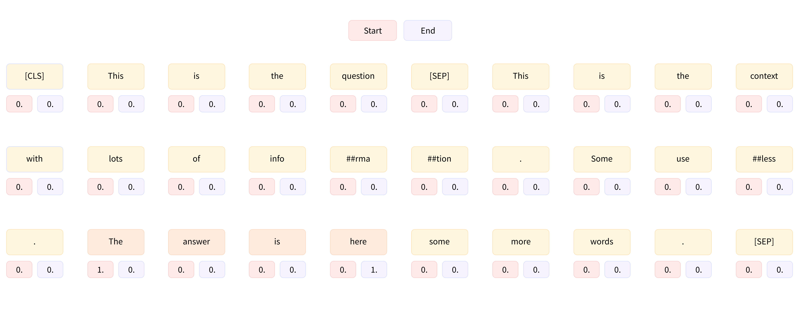

在做个例子中，Context 没有很长，但是数据集中的一些示例的 Context 会很长，会超过我们设置的最大长度（本例中为 384）。正如我们在第七章中所看到的，当我们探索 `question-answering` 管道的内部结构时，我们会通过将一个样本的较长的 Context 划分成多个训练特征，并在这些特征之间使用滑动窗口，来处理较长的 Context。

要了解在这个过程中对当前示例进行了哪些处理，我们可以将长度限制为 100，并使用长度为 50 的 token 窗口。我们设置：

- `max_length` 来设置最大长度 （这里为 100）
- `truncation="only_second"` 在问题和 Context 过长时截断 Context（Context 位于第二个位置）
- `stride` 设置两个连续块之间的重叠 tokens 数 （这里为 50）
- `return_overflowing_tokens=True` 告诉 tokenizer 我们想要保留超过长度的 tokens 

```python
inputs = tokenizer(
    question,
    context,
    max_length=100,
    truncation="only_second",
    stride=50,
    return_overflowing_tokens=True,
)

for ids in inputs["input_ids"]:
    print(tokenizer.decode(ids))
```

```python
'[CLS] To whom did the Virgin Mary allegedly appear in 1858 in Lourdes France? [SEP] Architecturally, the school has a Catholic character. Atop the Main Building\'s gold dome is a golden statue of the Virgin Mary. Immediately in front of the Main Building and facing it, is a copper statue of Christ with arms upraised with the legend " Venite Ad Me Omnes ". Next to the Main Building is the Basilica of the Sacred Heart. Immediately behind the basi [SEP]'
'[CLS] To whom did the Virgin Mary allegedly appear in 1858 in Lourdes France? [SEP] the Main Building and facing it, is a copper statue of Christ with arms upraised with the legend " Venite Ad Me Omnes ". Next to the Main Building is the Basilica of the Sacred Heart. Immediately behind the basilica is the Grotto, a Marian place of prayer and reflection. It is a replica of the grotto at Lourdes, France where the Virgin [SEP]'
'[CLS] To whom did the Virgin Mary allegedly appear in 1858 in Lourdes France? [SEP] Next to the Main Building is the Basilica of the Sacred Heart. Immediately behind the basilica is the Grotto, a Marian place of prayer and reflection. It is a replica of the grotto at Lourdes, France where the Virgin Mary reputedly appeared to Saint Bernadette Soubirous in 1858. At the end of the main drive ( and in a direct line that connects through 3 [SEP]'
'[CLS] To whom did the Virgin Mary allegedly appear in 1858 in Lourdes France? [SEP]. It is a replica of the grotto at Lourdes, France where the Virgin Mary reputedly appeared to Saint Bernadette Soubirous in 1858. At the end of the main drive ( and in a direct line that connects through 3 statues and the Gold Dome ), is a simple, modern stone statue of Mary. [SEP]'
```

如我们所见，我们的示例被分成四个输入，每个输入都包含问题和 Context 的一部分。请注意，问题的答案 （“Bernadette Soubirous”） 仅出现在第三个也是最后一个输入中，因此通过以这种方式处理较长的 Context 时，我们可能创建一些 Context 中不包含答案的训练示例。我们把这些示例的标签设置为 `start_position = end_position = 0` （事实上我们在预测 `[CLS]` tokens）。如果不幸答案被截断，我们只有答案的开头（或结束），我们也这样设置这些标签。对于答案完全在 Context 中的示例，标签将是答案起始的 token 的索引和答案结束的 token 的索引。

数据集为我们提供了 Context 中答案的起始字符，加上答案的长度，我们可以找到 Context 中的结束字符。要将它们映射到 tokens 索引，我们将需要使用我们在第七章中研究的偏移映射。我们可以通过使用 `return_offsets_mapping=True` 让我们的 tokenizer 返回这些内容：

```python
inputs = tokenizer(
    question,
    context,
    max_length=100,
    truncation="only_second",
    stride=50,
    return_overflowing_tokens=True,
    return_offsets_mapping=True,
)
inputs.keys()
```

```python
dict_keys(['input_ids', 'token_type_ids', 'attention_mask', 'offset_mapping', 'overflow_to_sample_mapping'])
```

如我们所见，我们得到了 inputs ID、tokens 类型 ID 和注意力掩码，以及我们所需的偏移映射和一个额外的键 `overflow_to_sample_mapping` 。当我们同时对多个文本进行 tokenize 时，为了从支持 Rust 中受益，这个键的值对我们很有用。由于一个样本可以产生多个特征，它将每个特征映射到它来源的示例。因为这里我们只对一个示例进行了 tokenize，所以我们得到一个由 `0` 组成的列表：

```python
inputs["overflow_to_sample_mapping"]
```

```python
[0, 0, 0, 0]
```

但是，如果我们对更多的示例进行 tokenize 这将变得更加有用：

```python
inputs = tokenizer(
    raw_datasets["train"][2:6]["question"],
    raw_datasets["train"][2:6]["context"],
    max_length=100,
    truncation="only_second",
    stride=50,
    return_overflowing_tokens=True,
    return_offsets_mapping=True,
)

print(f"The 4 examples gave {len(inputs['input_ids'])} features.")
print(f"Here is where each comes from: {inputs['overflow_to_sample_mapping']}.")
```

```python
'The 4 examples gave 19 features.'
'Here is where each comes from: [0, 0, 0, 0, 1, 1, 1, 1, 2, 2, 2, 2, 3, 3, 3, 3, 3, 3, 3].'
```

在我们的这个例子中，前三个示例 （在训练集中的索引 2、3 和 4 处） 每个示例都给出了四个特征，最后一个示例（在训练集中的索引 5 处） 给出了 7 个特征。

这些信息将有助于将我们获得的每个特征映射到其相应的标签。如前所述，这些标签的规则是：

- 如果答案不在相应上下文的范围内，则为 `(0, 0)` 
- 如果答案在相应上下文的范围内，则为 `(start_position, end_position)` ，其中 `start_position` 是答案起始处的 token 索引（在 inputs ID 中）， `end_position` 是答案结束处的 token 索引（在 inputs ID 中）

为了确定这两种情况中的哪一种，并且如果是第二种，则需要确定 token 的位置，我们首先找到在输入 ID 中起始和结束上下文的索引。我们可以使用 token 类型 ID 来完成此操作，但由于并非所有模型都需要它们（例如 DistilBERT 不需要它们），我们将使用 tokenizer 的 `sequence_ids()` 方法返回的 `BatchEncoding` 。

一旦我们有了这些 tokens 的索引，我们就会查看相应的偏移量，它们是两个整数的元组，表示原始 Context 中的字符范围。因此，我们可以检测此特征中的 Context 块是在答案之后起始还是在答案起始之前结束（在这种情况下，标签是 `(0, 0)` ）。如果不是这样，我们循环查找答案的第一个和最后一个 token：

```python
answers = raw_datasets["train"][2:6]["answers"]
start_positions = []
end_positions = []

for i, offset in enumerate(inputs["offset_mapping"]):
    sample_idx = inputs["overflow_to_sample_mapping"][i]
    answer = answers[sample_idx]
    start_char = answer["answer_start"][0]
    end_char = answer["answer_start"][0] + len(answer["text"][0])
    sequence_ids = inputs.sequence_ids(i)

    # 找到上下文的起始和结束
    idx = 0
    while sequence_ids[idx] != 1:
        idx += 1
    context_start = idx
    while sequence_ids[idx] == 1:
        idx += 1
    context_end = idx - 1

    # 如果答案不完全在上下文内,标签为(0, 0)
    if offset[context_start][0] > start_char or offset[context_end][1] < end_char:
        start_positions.append(0)
        end_positions.append(0)
    else:
        # 否则,它就是起始和结束 token 的位置
        idx = context_start
        while idx <= context_end and offset[idx][0] <= start_char:
            idx += 1
        start_positions.append(idx - 1)

        idx = context_end
        while idx >= context_start and offset[idx][1] >= end_char:
            idx -= 1
        end_positions.append(idx + 1)

start_positions, end_positions
```

```python
([83, 51, 19, 0, 0, 64, 27, 0, 34, 0, 0, 0, 67, 34, 0, 0, 0, 0, 0],
 [85, 53, 21, 0, 0, 70, 33, 0, 40, 0, 0, 0, 68, 35, 0, 0, 0, 0, 0])
```

让我们查看一些结果以验证我们的方法是否正确。对于第一个特征，我们找到了 `(83, 85)` 作为标签，因此让我们将理论答案与从 83 到 85（包括 85）的 tokens 解码的结果进行比较：

```python
idx = 0
sample_idx = inputs["overflow_to_sample_mapping"][idx]
answer = answers[sample_idx]["text"][0]

start = start_positions[idx]
end = end_positions[idx]
labeled_answer = tokenizer.decode(inputs["input_ids"][idx][start : end + 1])

print(f"Theoretical answer: {answer}, labels give: {labeled_answer}")
```

```python
'Theoretical answer: the Main Building, labels give: the Main Building'
```

很好！寻找的答案是正确的！现在让我们来看一下索引为 4 的位置，我们我们得到的标签是 `(0, 0)` ，这意味着答案不在该特征的上下文块中：

```python
idx = 4
sample_idx = inputs["overflow_to_sample_mapping"][idx]
answer = answers[sample_idx]["text"][0]

decoded_example = tokenizer.decode(inputs["input_ids"][idx])
print(f"Theoretical answer: {answer}, decoded example: {decoded_example}")
```

```python
'Theoretical answer: a Marian place of prayer and reflection, decoded example: [CLS] What is the Grotto at Notre Dame? [SEP] Architecturally, the school has a Catholic character. Atop the Main Building\'s gold dome is a golden statue of the Virgin Mary. Immediately in front of the Main Building and facing it, is a copper statue of Christ with arms upraised with the legend " Venite Ad Me Omnes ". Next to the Main Building is the Basilica of the Sacred Heart. Immediately behind the basilica is the Grot [SEP]'
```

确实，我们在 Context 中没有看到答案。

<div custom-style="Tip-green">

✏️ **轮你来了！** 在使用 XLNet 架构时，需要在左侧进行填充，并且问题和 Context 应该互换。将我们刚刚看到的所有代码调整为 XLNet 架构（并添加 `padding=True` ）。请注意，填充后的 `[CLS]` tokens 可能不在索引为 0 的位置。

</div>

现在，我们已经逐步了解了如何预处理我们的训练数据，我们可以将其组合到一个函数中，并使用该函数处理整个训练数据集。我们将每个特征都填充到我们设置的最大长度，因为大多数上下文都很长（相应的样本将被分成几个特征），所以在这里进行动态填充没有带来真正有效的成效：

```python
max_length = 384
stride = 128

def preprocess_training_examples(examples):
    questions = [q.strip() for q in examples["question"]]
    inputs = tokenizer(
        questions,
        examples["context"],
        max_length=max_length,
        truncation="only_second",
        stride=stride,
        return_overflowing_tokens=True,
        return_offsets_mapping=True,
        padding="max_length",
    )

    offset_mapping = inputs.pop("offset_mapping")
    sample_map = inputs.pop("overflow_to_sample_mapping")
    answers = examples["answers"]
    start_positions = []
    end_positions = []

    for i, offset in enumerate(offset_mapping):
        sample_idx = sample_map[i]
        answer = answers[sample_idx]
        start_char = answer["answer_start"][0]
        end_char = answer["answer_start"][0] + len(answer["text"][0])
        sequence_ids = inputs.sequence_ids(i)

        # 找到上下文的起始和结束
        idx = 0
        while sequence_ids[idx] != 1:
            idx += 1
        context_start = idx
        while sequence_ids[idx] == 1:
            idx += 1
        context_end = idx - 1

        # 如果答案不完全在上下文内,标签为(0, 0)
        if offset[context_start][0] > start_char or offset[context_end][1] < end_char:
            start_positions.append(0)
            end_positions.append(0)
        else:
            # 否则,它就是起始和结束 tokens 的位置
            idx = context_start
            while idx <= context_end and offset[idx][0] <= start_char:
                idx += 1
            start_positions.append(idx - 1)

            idx = context_end
            while idx >= context_start and offset[idx][1] >= end_char:
                idx -= 1
            end_positions.append(idx + 1)

    inputs["start_positions"] = start_positions
    inputs["end_positions"] = end_positions
    return inputs
```

请注意，我们定义了两个常量来确定所使用的最大长度以及滑动窗口的长度，并且在之前 tokenize 之前对数据进行了一些清洗：SQuAD 数据集中的一些问题在开头和结尾有额外的空格，这些空格没有任何意义（如果你使用像 RoBERTa 这样的模型，它们会占用 tokenize 时的空间），因此我们去掉了这些额外的空格。

要使用该函数处理整个训练集，我们可以使用 `Dataset.map()` 方法并传递 `batched=True` 参数。这是必要的，因为我们正在更改数据集的长度（因为一个示例可能会产生多个训练特征）：

```python
train_dataset = raw_datasets["train"].map(
    preprocess_training_examples,
    batched=True,
    remove_columns=raw_datasets["train"].column_names,
)
len(raw_datasets["train"]), len(train_dataset)
```

```python
(87599, 88729)
```

如我们所见，预处理添加了大约 1000 个特征。我们的训练集现在已经准备好使用了——让我们深入研究一下验证集的预处理！

#### 处理验证数据 

处理验证数据的预处理会更加容易，因为我们不需要生成标签（除非我们想计算验证损失，但那个数字并不能真正帮助我们了解模型的好坏）。真正的挑战在于将模型的预测转化为为原始 Context 的片段。为此，我们只需要存储偏移映射并且找到一种方法来将每个创建的特征与其来自的原始示例匹配起来。由于原始数据集中有一个 ID 列，我们将使用该列。

我们唯一要添加的是对偏移映射的微小修改。偏移映射包含问题和 Context 的偏移量，但一旦我们进入后处理阶段，我们将无法知道 inputs ID 的哪个部分对应于 Context，哪个部分是问题（我们使用的 `sequence_ids()` 方法仅可用于 tokenizer 的输出）。因此，我们将将与问题对应的偏移设置为 `None` Context 对应的偏移量保持不变：

```python
def preprocess_validation_examples(examples):
    questions = [q.strip() for q in examples["question"]]
    inputs = tokenizer(
        questions,
        examples["context"],
        max_length=max_length,
        truncation="only_second",
        stride=stride,
        return_overflowing_tokens=True,
        return_offsets_mapping=True,
        padding="max_length",
    )

    sample_map = inputs.pop("overflow_to_sample_mapping")
    example_ids = []

    for i in range(len(inputs["input_ids"])):
        sample_idx = sample_map[i]
        example_ids.append(examples["id"][sample_idx])

        sequence_ids = inputs.sequence_ids(i)
        offset = inputs["offset_mapping"][i]
        inputs["offset_mapping"][i] = [
            o if sequence_ids[k] == 1 else None for k, o in enumerate(offset)
        ]

    inputs["example_id"] = example_ids
    return inputs
```

我们可以像以前一样使用此函数处理整个验证数据集：

```python
validation_dataset = raw_datasets["validation"].map(
    preprocess_validation_examples,
    batched=True,
    remove_columns=raw_datasets["validation"].column_names,
)
len(raw_datasets["validation"]), len(validation_dataset)
```

```python
(10570, 10822)
```

在这种情况下，我们只添加了几百个样本，因此验证数据集中的 Context 似乎要短一些。

现在我们已经对所有数据进行了预处理，我们可以开始训练了。

{#if fw === 'pt'}

### 使用 `Trainer` API 微调模型 

这个例子的训练代码与前面的部分非常相似，最困难的部分是编写 `compute_metrics()` 函数。由于我们将所有样本填充到了我们设置的最大长度，所以没有需要定义的数据整理器，因此我们唯一需要担心的事情是计算评估指标。比较困难的部分将是将模型预测的结果还原到原始示例中的文本片段；一旦我们完成了这一步骤，Datasets 库中的 metric 就可以为我们做大部分工作。

{:else}

### 使用 Keras 微调模型 

这个例子的训练代码与前面的部分非常相似，最困难的部分是计算评估指标。由于我们将所有样本填充到了我们设置的最大长度，所以没有需要定义的数据整理器，因此我们唯一需要担心的事情是计算评估指标。比较困难的部分将是将模型预测的结果还原到原始示例中的文本片段；一旦我们完成了这一步骤，Datasets 库中的 metric 就可以为我们做大部分工作。

{/if}

#### 后处理 

模型将输出答案在 inputs ID 中起始和结束位置的 logit，正如我们在探索 [`question-answering` pipeline](/course/chapter6/3b)(/course/chapter6/3b) 时看到的那样。后处理步骤将类似于我们在那里所做的，所以这里简单回顾一下我们所采取的操作：

- 我们屏蔽了除了 Context 之外的 tokens 对应的起始和结束 logit。
- 然后，我们使用 softmax 将起始和结束 logits 转换为概率。
- 我们通过将两个概率对应的乘积来为每个 `(start_token, end_token)` 对分配一个分数。
- 我们寻找具有最大分数且产生有效答案（例如， `start_token` 小于 `end_token` ）的对。

这次我们将稍微改变这个流程，因为我们不需要计算实际分数（只需要预测的答案）。这意味着我们可以跳过 softmax 步骤（因为 softmax 并不会改变分数的顺序）。为了加快计算速度，我们也不会为所有可能的 `(start_token, end_token)` 对计算分数，而只会计算与最高的 `n_best` 对应的 logit 分数（其中 `n_best=20` ）。由于我们将跳过 softmax，这些分数将是 logit 分数，而且是起始和结束对数几率的和（而不是乘积，因为规则 \($\log(ab) = \log(a) + \log(b))$。

为了证明这一切，我们需要一些预测。由于我们还没有训练我们的模型，我们将使用 QA 管道的默认模型对一小部分验证集生成一些预测。我们可以使用和之前一样的处理函数；因为它依赖于全局常量 `tokenizer` ，我们只需将该对象更改为我们要临时使用的模型的 tokenizer 

为了测试这些代码，我们需要一些预测结果。由于我们还没有训练模型，我们将使用 QA pipeline 的默认模型在验证集的一小部分上生成一些预测结果。我们可以使用与之前相同的处理函数；因为它依赖于全局常量 `tokenizer` ，所以我们只需要暂时将该对象更改为我们想要使用的模型的 tokenizer：

```python
small_eval_set = raw_datasets["validation"].select(range(100))
trained_checkpoint = "distilbert-base-cased-distilled-squad"

tokenizer = AutoTokenizer.from_pretrained(trained_checkpoint)
eval_set = small_eval_set.map(
    preprocess_validation_examples,
    batched=True,
    remove_columns=raw_datasets["validation"].column_names,
)
```

现在预处理已经完成，我们将 tokenizer 改回我们最初选择的那个：

```python
tokenizer = AutoTokenizer.from_pretrained(model_checkpoint)
```

然后我们移除 `eval_set` 中模型不需要的列，构建一个包含所有小型验证集数据的 batch，并将其传递给模型。如果有可用的 GPU，我们将使用它以加快速度：

{#if fw === 'pt'}

```python
#####Pytorch}
import torch
from transformers import AutoModelForQuestionAnswering

eval_set_for_model = eval_set.remove_columns(["example_id", "offset_mapping"])
eval_set_for_model.set_format("torch")

device = torch.device("cuda") if torch.cuda.is_available() else torch.device("cpu")
batch = {k: eval_set_for_model[k].to(device) for k in eval_set_for_model.column_names}
trained_model = AutoModelForQuestionAnswering.from_pretrained(trained_checkpoint).to(
    device
)

with torch.no_grad():
    outputs = trained_model(**batch)####end
```

为了便于实验，让我们将这些输出转换为 NumPy 数组：

```python
#####Pytorch}
start_logits = outputs.start_logits.cpu().numpy()
end_logits = outputs.end_logits.cpu().numpy()####end
```

{:else}

```python
#####TensorFlow}
import tensorflow as tf
from transformers import TFAutoModelForQuestionAnswering

eval_set_for_model = eval_set.remove_columns(["example_id", "offset_mapping"])
eval_set_for_model.set_format("numpy")

batch = {k: eval_set_for_model[k] for k in eval_set_for_model.column_names}
trained_model = TFAutoModelForQuestionAnswering.from_pretrained(trained_checkpoint)

outputs = trained_model(**batch)####end
```

为了便于实验，让我们将这些输出转换为 NumPy 数组：

```python
#####TensorFlow}
start_logits = outputs.start_logits.numpy()
end_logits = outputs.end_logits.numpy()####end
```

{/if}

现在，我们需要找到 `small_eval_set` 中每个示例的预测答案。一个示例可能会被拆分成 `eval_set` 中的多个特征，所以第一步是将 `small_eval_set` 中的每个示例映射到 `eval_set` 中对应的特征：

```python
import collections

example_to_features = collections.defaultdict(list)
for idx, feature in enumerate(eval_set):
    example_to_features[feature["example_id"]].append(idx)
```

有了这个映射，我们可以通过循环遍历所有示例，并针对每个示例遍历所有相关的特征。正如之前所说，我们将查看 `n_best` 个起始 logit 和结束 logit 的得分，排除以下情况：

- 答案不在上下文中
- 答案长度为负数
- 答案过长（我们将可能性限制在 `max_answer_length=30` ）

当我们得到一个示例的所有得分可能答案，我们只需选择具有最佳 logit 得分的答案：

```python
import numpy as np

n_best = 20
max_answer_length = 30
predicted_answers = []

for example in small_eval_set:
    example_id = example["id"]
    context = example["context"]
    answers = []

    for feature_index in example_to_features[example_id]:
        start_logit = start_logits[feature_index]
        end_logit = end_logits[feature_index]
        offsets = eval_set["offset_mapping"][feature_index]

        start_indexes = np.argsort(start_logit)[-1 : -n_best - 1 : -1].tolist()
        end_indexes = np.argsort(end_logit)[-1 : -n_best - 1 : -1].tolist()
        for start_index in start_indexes:
            for end_index in end_indexes:
                # 跳过不完全在上下文中的答案
                if offsets[start_index] is None or offsets[end_index] is None:
                    continue
                # 跳过长度为负数或大于 max_answer_length 的答案。
                if (
                    end_index < start_index
                    or end_index - start_index + 1 > max_answer_length
                ):
                    continue

                answers.append(
                    {
                        "text": context[offsets[start_index][0] : offsets[end_index][1]],
                        "logit_score": start_logit[start_index] + end_logit[end_index],
                    }
                )

    best_answer = max(answers, key=lambda x: x["logit_score"])
    predicted_answers.append({"id": example_id, "prediction_text": best_answer["text"]})
```

预测答案的最终格式已经是我们将使用的评估指标所期望的格式。在这种情况下，我们可以借助Evaluate 库来加载它：

```python
import evaluate

metric = evaluate.load("squad")
```

这个评估指标一个如上所示格式（一个包含示例 ID 和预测文本的字典列表）的预测答案，同时也需要一个如下格式（一个包含示例 ID 和可能答案的字典列表）的参考答案：

```python
theoretical_answers = [
    {"id": ex["id"], "answers": ex["answers"]} for ex in small_eval_set
]
```

现在，我们可以通过查看两个列表中的第一个元素来检查是否获得了合理的结果：

```python
print(predicted_answers[0])
print(theoretical_answers[0])
```

```python
{'id': '56be4db0acb8001400a502ec', 'prediction_text': 'Denver Broncos'}
{'id': '56be4db0acb8001400a502ec', 'answers': {'text': ['Denver Broncos', 'Denver Broncos', 'Denver Broncos'], 'answer_start': [177, 177, 177]}}
```

还不错！现在让我们看一下评估指标给出的分数：

```python
metric.compute(predictions=predicted_answers, references=theoretical_answers)
```

```python
{'exact_match': 83.0, 'f1': 88.25}
```

根据 [DistilBERT 的论文](https://arxiv.org/abs/1910.01108v2)(https://arxiv.org/abs/1910.01108v2) 所述，DistilBERT 在 SQuAD 上微调后整体数据集的得分为 79.1 和 86.9，这个结果相当不错。

{#if fw === 'pt'}

现在，让我们将刚才所做的放入 `compute_metrics()` 函数中，我们将在 `Trainer` 中使用它。通常， `compute_metrics()` 函数只接收一个包含 logits 和标签的 `eval_preds` 元组。但是在这里，我们需要更多的信息，因为我们需要在特征数据集中查找偏移量，并在示例数据集中查找原始 Context，因此我们无法在训练过程中使用此函数来获取常规的评估结果。我们只会在训练结束时使用它来检查结果。
`compute_metrics()` 函数与之前的步骤相同；我们只是添加了一个小的检查，以防我们找不到任何有效的答案（在这种情况下，我们的预测会输出一个空字符串）。

{:else}

现在，让我们将刚才所做的放入 `compute_metrics()` 函数中，我们将在训练模型时使用该函数。我们需要传递的不仅仅是输出的 logits，因为我们必须在特征数据集中查找偏移量，并在示例数据集中查找原始上下文：

{/if}

```python
from tqdm.auto import tqdm

def compute_metrics(start_logits, end_logits, features, examples):
    example_to_features = collections.defaultdict(list)
    for idx, feature in enumerate(features):
        example_to_features[feature["example_id"]].append(idx)

    predicted_answers = []
    for example in tqdm(examples):
        example_id = example["id"]
        context = example["context"]
        answers = []

        # 循环遍历与该示例相关联的所有特征
        for feature_index in example_to_features[example_id]:
            start_logit = start_logits[feature_index]
            end_logit = end_logits[feature_index]
            offsets = features[feature_index]["offset_mapping"]

            start_indexes = np.argsort(start_logit)[-1 : -n_best - 1 : -1].tolist()
            end_indexes = np.argsort(end_logit)[-1 : -n_best - 1 : -1].tolist()
            for start_index in start_indexes:
                for end_index in end_indexes:
                    # 跳过不完全位于上下文中的答案
                    if offsets[start_index] is None or offsets[end_index] is None:
                        continue
                    # 跳过长度小于 0 或大于 max_answer_length 的答案
                    if (
                        end_index < start_index
                        or end_index - start_index + 1 > max_answer_length
                    ):
                        continue

                    answer = {
                        "text": context[offsets[start_index][0] : offsets[end_index][1]],
                        "logit_score": start_logit[start_index] + end_logit[end_index],
                    }
                    answers.append(answer)

        # 选择得分最高的答案
        if len(answers) > 0:
            best_answer = max(answers, key=lambda x: x["logit_score"])
            predicted_answers.append(
                {"id": example_id, "prediction_text": best_answer["text"]}
            )
        else:
            predicted_answers.append({"id": example_id, "prediction_text": ""})

    theoretical_answers = [{"id": ex["id"], "answers": ex["answers"]} for ex in examples]
    return metric.compute(predictions=predicted_answers, references=theoretical_answers)
```

我们可以检查它在我们的预测结果上的计算的结果：

```python
compute_metrics(start_logits, end_logits, eval_set, small_eval_set)
```

```python
{'exact_match': 83.0, 'f1': 88.25}
```

看起来不错！现在让我们使用它来微调我们的模型。

#### 微调模型 

{#if fw === 'pt'}

现在我们准备好训练我们的模型了。首先，让我们像之前一样使用 `AutoModelForQuestionAnswering` 类创建模型：

```python
#####Pytorch}
model = AutoModelForQuestionAnswering.from_pretrained(model_checkpoint)####end
```

{:else}

现在我们准备好训练我们的模型了。首先，让我们像之前一样使用 `TFAutoModelForQuestionAnswering` 类创建模型：

```python
#####TensorFlow}
model = TFAutoModelForQuestionAnswering.from_pretrained(model_checkpoint)####end
```

{/if}

和往常一样，我们会收到一个警告，提示有些权重没有被使用（来自预训练头部的权重），而其他一些权重是随机初始化的（用于问答头部的权重）。你现在应该已经习惯了这种情况，但这意味着这个模型还没有准备好使用，需要进行微调——好在我们正在做这一点！

为了能够将我们的模型推送到 Hub，我们需要登录 Hugging Face。如果你在 Notebook 中运行此代码，则可以使用以下的函数执行此操作，该函数会显示一个小部件，你可以在其中输入登录凭据：

```python
from huggingface_hub import notebook_login

notebook_login()
```

如果你不在 Notebook 中工作，只需在终端中输入以下行：

```python
huggingface-cli login
```

{#if fw === 'pt'}

完成后，我们就可以定义我们的 `TrainingArguments` 。正如我们在定义计算评估函数时所说的，由于 `compute_metrics()` 函数的输入参数限制，我们无法使用常规的方法来编写评估循环。不过，我们可以编写自己的 `Trainer` 子类来实现这一点（你可以在 [问答示例脚本](https://github.com/huggingface/transformers/blob/master/examples/pytorch/question-answering/trainer_qa.py)(https://github.com/huggingface/transformers/blob/master/examples/pytorch/question-answering/trainer_qa.py) 中找到该方法），但放在本节中会有些冗长。因此，我们在这里将仅在训练结束时评估模型，并在下面的“自定义训练循环”中向你展示如何使用常规的方法进行评估。

这确实是 `Trainer` API 局限性的地方，而Accelerate 库则表现出色：定制化特定用例的类可能会很繁琐，但定制化调整训练循环却很简单。

让我们来看看我们的 `TrainingArguments` ：

```python
#####Pytorch}
from transformers import TrainingArguments

args = TrainingArguments(
    "bert-finetuned-squad",
    evaluation_strategy="no",
    save_strategy="epoch",
    learning_rate=2e-5,
    num_train_epochs=3,
    weight_decay=0.01,
    fp16=True,
    push_to_hub=True,
)####end
```

我们之前已经见过其中大部分内容：我们设置了一些超参数（如学习率、训练的周期数和一些权重衰减），并设定我们想在每个周期结束时保存模型、跳过评估，并将结果上传到模型中心。我们还启用了 `fp16=True` 的混合精度训练，因为它可以在最新的 GPU 上加快训练速度。

{:else}

现在完成了这一步骤，我们可以创建我们的 TF 数据集。这次我们可以使用简单的默认数据整理器：

```python
#####TensorFlow}
from transformers import DefaultDataCollator

data_collator = DefaultDataCollator(return_tensors="tf")####end
```

然后像往常一样创建数据集。

```python
#####TensorFlow}
tf_train_dataset = model.prepare_tf_dataset(
    train_dataset,
    collate_fn=data_collator,
    shuffle=True,
    batch_size=16,
)
tf_eval_dataset = model.prepare_tf_dataset(
    validation_dataset,
    collate_fn=data_collator,
    shuffle=False,
    batch_size=16,
)####end
```

接下来，我们设置训练超参数并编译我们的模型

```python
#####TensorFlow}
from transformers import create_optimizer
from transformers.keras_callbacks import PushToHubCallback
import tensorflow as tf

## 训练步骤的数量是数据集中的样本数量除以 batch 大小,然后乘以总的训练周期数。
## 注意,这里的 tf_train_dataset 是一个batch的 tf.data.Dataset,
## 而不是原始的 Hugging Face 数据集,所以使用 len() 计算其长度已经是 num_samples // batch_size。
num_train_epochs = 3
num_train_steps = len(tf_train_dataset) * num_train_epochs
optimizer, schedule = create_optimizer(
    init_lr=2e-5,
    num_warmup_steps=0,
    num_train_steps=num_train_steps,
    weight_decay_rate=0.01,
)
model.compile(optimizer=optimizer)

## 使用 float16 混合精度进行训练
tf.keras.mixed_precision.set_global_policy("mixed_float16")####end
```

最后，我们准备使用 `model.fit()` 进行训练，使用 `PushToHubCallback` 在每个周期结束后将模型上传到模型中心。

{/if}

默认情况下，使用的仓库将保存在你的账户中，并以你设置的输出目录命名，所以在我们的例子中它将位于 `"sgugger/bert-finetuned-squad"` 中。我们可以通过传递一个 `hub_model_id` 来覆盖这个设置；例如，要将模型推送到我们使用的 `huggingface_course` 组织中，我们使用了 `hub_model_id="huggingface_course/bert-finetuned-squad"` （这是我们在本节开始时演示的模型）。

{#if fw === 'pt'}

<div custom-style="Tip-green">

💡 如果你正在使用的输出目录已经存在，则它需要是你要推送到的存储库的本地克隆（因此，如果在定义你的 `Trainer` 时出现错误，请设置一个新的名称）。

</div>

最后，我们只需将所有内容传递给 `Trainer` 类并启动训练：

```python
#####Pytorch}
from transformers import Trainer

trainer = Trainer(
    model=model,
    args=args,
    train_dataset=train_dataset,
    eval_dataset=validation_dataset,
    tokenizer=tokenizer,
)
trainer.train()####end
```

{:else}

```python
#####TensorFlow}
from transformers.keras_callbacks import PushToHubCallback

callback = PushToHubCallback(output_dir="bert-finetuned-squad", tokenizer=tokenizer)

## 我们将在之后进行验证,因此训练过程中不会进行验证
model.fit(tf_train_dataset, callbacks=[callback], epochs=num_train_epochs)####end
```

{/if}

请注意，在训练过程中，每次模型保存（例如，每个 epoch 结束时），模型都会在后台上传到 Hub。这样，如果需要的话，你就可以在另一台机器上恢复训练。整个训练过程需要一些时间（在 Titan RTX 上略超过一个小时），所以你可以喝杯咖啡或者重新阅读一些你觉得更具挑战性的课程部分来消磨时间。还要注意，一旦第一个 epoch 完成，你将看到一些权重上传到 Hub，并且你可以在其页面上开始使用你的模型进行测试。

{#if fw === 'pt'}

训练完成后，我们可以最终评估我们的模型（并祈祷我们可以一次成功）。 `Trainer` 的 `predict()` 方法将返回一个元组，其中第一个元素将是模型的预测结果（在这里是一个包含起始和结束 logits 的对）。我们将这个结果传递给我们的 `compute_metrics()` 函数：

```python
#####Pytorch}
predictions, _, _ = trainer.predict(validation_dataset)
start_logits, end_logits = predictions
compute_metrics(start_logits, end_logits, validation_dataset, raw_datasets["validation"])####end
```

{:else}

训练完成后，我们可以最终评估我们的模型（并祈祷我们可以一次成功）。我们的 `model` 的 `predict()` 方法将负责获取预测结果，并且由于我们之前已经定义了一个 `compute_metrics()` 函数，所以我们可以用一行代码得到我们的结果：

```python
#####TensorFlow}
predictions = model.predict(tf_eval_dataset)
compute_metrics(
    predictions["start_logits"],
    predictions["end_logits"],
    validation_dataset,
    raw_datasets["validation"],
)####end
```

{/if}

```python
{'exact_match': 81.18259224219489, 'f1': 88.67381321905516}
```

很棒！作为对比，BERT 文章中报告的该模型的基准分数分别为 80.8 和 88.5，所以我们的结果正好达到了预期分数。

{#if fw === 'pt'}

最后，我们使用 `push_to_hub()` 方法确保上传模型的最新版本：

```python
#####Pytorch}
trainer.push_to_hub(commit_message="Training complete")####end
```

如果你想检查它，上面的代码返回它刚刚执行的提交的 URL：

```python
#####Pytorch}
'https://huggingface.co/sgugger/bert-finetuned-squad/commit/9dcee1fbc25946a6ed4bb32efb1bd71d5fa90b68'####end
```
`Trainer` 还会创建一个包含所有评估结果的模型卡片，并将其上传。

{/if}

在这个阶段，你可以使用模型库中的推理小部件来测试模型，并与你的朋友、家人和同伴分享。恭喜你成功地在问答任务上对模型进行了微调！

<div custom-style="Tip-green">

✏️ **轮到你了！** 尝试使用另一个模型架构，看看它在这个任务上表现得是否更好！

</div>

{#if fw === 'pt'}

如果你想更深入地了解训练循环，我们现在将向你展示如何使用 Accelerate 来做同样的事情。

### 自定义训练循环 

现在，让我们来看一下完整的训练循环，这样你就可以轻松地自定义所需的部分。它看起来很像第四章中的训练循环，只是评估循环有所不同。由于我们不再受 `Trainer` 类的限制，因此我们可以在模型训练的过程中定期评估模型。

#### 为训练做准备 

首先，我们需要使用数据集构建 `DataLoader` 。我们将这些数据集的格式设置为 `"torch"` ，并删除模型不使用的验证集列。然后，我们可以使用 Transformers 提供的 `default_data_collator` 作为 `collate_fn` ，并打乱训练集，但不打乱验证集：

```python
#####Pytorch}
from torch.utils.data import DataLoader
from transformers import default_data_collator

train_dataset.set_format("torch")
validation_set = validation_dataset.remove_columns(["example_id", "offset_mapping"])
validation_set.set_format("torch")

train_dataloader = DataLoader(
    train_dataset,
    shuffle=True,
    collate_fn=default_data_collator,
    batch_size=8,
)
eval_dataloader = DataLoader(
    validation_set, collate_fn=default_data_collator, batch_size=8
)####end
```

接下来，我们重新实例化我们的模型，以确保我们不是从之前的微调继续训练，而是从 BERT 预训练模型重新开始：

```python
#####Pytorch}
model = AutoModelForQuestionAnswering.from_pretrained(model_checkpoint)####end
```

然后，我们需要一个优化器。通常我们使用经典的 `AdamW` 优化器，它与 Adam 类似，不过在权重衰减的方式上有些不同：

```python
#####Pytorch}
from torch.optim import AdamW

optimizer = AdamW(model.parameters(), lr=2e-5)####end
```

当我们拥有了所有这些对象，我们可以将它们发送到 `accelerator.prepare()` 方法。请记住，如果你想在 Colab Notebook 上使用 TPU 进行训练，你需要将所有这些代码移到一个训练函数中，并且不应该对 `Accelerator` 的单元格执行任何实例化。我们可以通过向 `Accelerator` 传递 `fp16=True` 来强制使用混合精度训练（或者，如果你想要将代码作为脚本执行，只需确保填写适当的Accelerate `config` ）。

```python
#####Pytorch}
from accelerate import Accelerator

accelerator = Accelerator(fp16=True)
model, optimizer, train_dataloader, eval_dataloader = accelerator.prepare(
    model, optimizer, train_dataloader, eval_dataloader
)####end
```

从前面几节中你应该知道，我们只有在 `train_dataloader` 通过 `accelerator.prepare()` 方法后才能使用其长度来计算训练步骤的数量。我们使用与之前章节相同的线性学习率调度：

```python
#####Pytorch}
from transformers import get_scheduler

num_train_epochs = 3
num_update_steps_per_epoch = len(train_dataloader)
num_training_steps = num_train_epochs * num_update_steps_per_epoch

lr_scheduler = get_scheduler(
    "linear",
    optimizer=optimizer,
    num_warmup_steps=0,
    num_training_steps=num_training_steps,
)####end
```

要将模型推送到 Hub，我们需要在工作文件夹中创建一个 `Repository` 对象。如果你尚未登录 Hugging Face Hub，请先登录。我们将根据我们给模型指定的模型 ID 确定仓库名称（可以根据自己的选择替换 `repo_name` ；它只需要包含你的用户名，使用 `get_full_repo_name()` 函数可以获取）：

```python
#####Pytorch}
from huggingface_hub import Repository, get_full_repo_name

model_name = "bert-finetuned-squad-accelerate"
repo_name = get_full_repo_name(model_name)
repo_name####end
```

```python
#####Pytorch}
'sgugger/bert-finetuned-squad-accelerate'####end
```

然后，我们可以将该存储库克隆到本地文件夹中。如果它已经存在，那么这个本地文件夹应该是我们正在使用的存储库的克隆版本：

```python
#####Pytorch}
output_dir = "bert-finetuned-squad-accelerate"
repo = Repository(output_dir, clone_from=repo_name)####end
```

现在，我们可以通过调用 `repo.push_to_hub()` 方法上传保存在 `output_dir` 中的所有内容。这将帮助我们在每个时期结束时上传中间模型。

### 训练循环 

现在，我们准备编写完整的训练循环。在定义一个进度条以跟踪训练进度之后，循环分为三个部分：

- 训练本身，即对 `train_dataloader` 进行迭代，模型前向传播、反向传播和优化器更新。
- 评估，其中我们在将 `start_logits` 和 `end_logits` 的所有值收集起来之前，遍历整个评估数据集。完成评估循环后，我们将所有结果收集起来。请注意，由于 `Accelerator` 可能在最后添加了一些样本以确保每个进程中的示例数相同，因此我们需要进行截断。
- 保存和上传，首先保存模型和分词器，然后调用 `repo.push_to_hub()` 。与之前一样，我们使用 `blocking=False` 参数告诉Hub 库在异步过程中推送。这样，训练将继续进行，而这个（需要很长时间的）指令将在后台异步执行。

这是训练循环的完整代码：

```python
#####Pytorch}
from tqdm.auto import tqdm
import torch

progress_bar = tqdm(range(num_training_steps))

for epoch in range(num_train_epochs):
    # 训练
    model.train()
    for step, batch in enumerate(train_dataloader):
        outputs = model(**batch)
        loss = outputs.loss
        accelerator.backward(loss)

        optimizer.step()
        lr_scheduler.step()
        optimizer.zero_grad()
        progress_bar.update(1)

    # 评估
    model.eval()
    start_logits = []
    end_logits = []
    accelerator.print("Evaluation!")
    for batch in tqdm(eval_dataloader):
        with torch.no_grad():
            outputs = model(**batch)

        start_logits.append(accelerator.gather(outputs.start_logits).cpu().numpy())
        end_logits.append(accelerator.gather(outputs.end_logits).cpu().numpy())

    start_logits = np.concatenate(start_logits)
    end_logits = np.concatenate(end_logits)
    start_logits = start_logits[: len(validation_dataset)]
    end_logits = end_logits[: len(validation_dataset)]

    metrics = compute_metrics(
        start_logits, end_logits, validation_dataset, raw_datasets["validation"]
    )
    print(f"epoch {epoch}:", metrics)

    # 保存和上传
    accelerator.wait_for_everyone()
    unwrapped_model = accelerator.unwrap_model(model)
    unwrapped_model.save_pretrained(output_dir, save_function=accelerator.save)
    if accelerator.is_main_process:
        tokenizer.save_pretrained(output_dir)
        repo.push_to_hub(
            commit_message=f"Training in progress epoch {epoch}", blocking=False
        )####end
```

如果这是你第一次看到使用Accelerate 保存的模型，请花点时间了解一下与之相关的三行代码

```python
#####Pytorch}
accelerator.wait_for_everyone()
unwrapped_model = accelerator.unwrap_model(model)
unwrapped_model.save_pretrained(output_dir, save_function=accelerator.save)####end
```

第一行很好理解：它告诉所有进程在继续之前等待所有进程都到达该阶段。这是为了确保我们在保存之前，在每个进程中都有相同的模型。然后，我们获取 `unwrapped_model` ，它是我们定义的基本模型。 `accelerator.prepare()` 方法会更改模型来适应分布式训练，因此它不再具有 `save_pretrained()` 方法；使用 `accelerator.unwrap_model()` 方法可以撤消这个更改。最后，我们调用 `save_pretrained()` ，但告诉该方法使用 `accelerator.save()` 而不是 `torch.save()` 。

完成后，你应该拥有一个产生与使用 `Trainer` 训练的模型非常相似的结果的模型。你可以在 [`huggingface-course/bert-finetuned-squad-accelerate`](https://huggingface.co/huggingface-course/bert-finetuned-squad-accelerate)(https://huggingface.co/huggingface-course/bert-finetuned-squad-accelerate) 查看我们使用此代码训练的模型。如果你想测试对训练循环进行的任何调整，可以直接通过编辑上面显示的代码来实现！

{/if}

### 使用微调模型 

我们已经向你展示了如何使用在模型中心上进行微调的模型，并使用推理小部件进行测试。要在本地使用 `pipeline` 来使用微调的模型，你只需指定模型标识符：

```python
from transformers import pipeline

## 将其替换为你自己的 checkpoint 
model_checkpoint = "huggingface-course/bert-finetuned-squad"
question_answerer = pipeline("question-answering", model=model_checkpoint)

context = """
Transformers is backed by the three most popular deep learning libraries — Jax, PyTorch and TensorFlow — with a seamless integration
between them. It's straightforward to train your models with one before loading them for inference with the other.
"""
question = "Which deep learning libraries back Transformers?"
question_answerer(question=question, context=context)
```

```python
{'score': 0.9979003071784973,
 'start': 78,
 'end': 105,
 'answer': 'Jax, PyTorch and TensorFlow'}
```

很棒！我们的模型与 pipeline 的默认模型一样有效！

## 8.7 精通自然语言处理 

如果你在课程中做到了这一步，恭喜你——你现在拥有了用 Transformers 和 Hugging Face 生态系统解决（几乎）任何 NLP 任务所需的所有知识和工具！

在完成核心 NLP 任务的快速入门后，你应该：

* 了解哪种架构（编码器、解码器或编码器-解码器）最适合哪种任务
* 了解预训练和微调语言模型之间的区别
* 了解如何使用 `Trainer` API 和 Accelerate 或 TensorFlow 和 Keras 的分布式训练功能来训练 Transformer 模型，具体选择那一种方法取决于你所需要完成的任务。
* 了解 ROUGE 和 BLEU 等指标在文本生成任务中的意义和局限性
* 知道如何在 Hub 上和使用 Transformers 中的“管道”与你的微调模型进行交互

尽管掌握了所有这些知识，但总有一天你会遇到代码中的困难错误，或者对如何解决特定的 NLP 问题有疑问。幸运的是，Hugging Face 社区将随时为你提供帮助！在这部分课程的最后一章中，我们将探讨如何调试 Transformer 模型并有效地寻求帮助。

### 章末测试 

让我们测试一下你在这章学到了什么！

####  1．以下哪些任务可以看作为 token 分类问题？

1. 找出句子中的语法成分。
2. 判断一个句子的语法是否正确。
3. 找出句子中提到的人或物。
4. 找出句子中回答问题的段落。

####  2． token 分类的预处理部分与其他预处理流程有什么不同？

1. 不需要进行预处理；文本已经被分词了。
2. 输入的文本就是单词序列，所以我们只需要进行子词分词。
3. 我们使用 <code>-100</code> 来标记特殊 token 。
4. 在进行截断/填充时，我们需要确保将标签截断或填充到与输入相同的大小

####  3．在 token 分类问题中，当我们分词并想要子词分词时，会出现什么问题？

1. 分词器添加了特殊的 token ，我们没有这些 token 的标签。
2. 每个词可能产生多个 token ，因此我们最终会得到比我们拥有的标签更多的 token 。
3. 添加的 token 没有标签，所以没有问题。

####  4. “领域适应”是什么意思？

1. 我们在一个数据集上运行模型，并获取该数据集中每个样本的预测结果。
2. 当我们在数据集上训练模型时。
3. 我们在一个新的数据集上微调一个预训练的模型，并在测试集上有一定的适应性。
4. 当我们将被模型分类错误的样本添加到数据集中，使得我们的模型更加健壮。

####  5．掩码语言建模问题中的标签是什么？

1. 输入句子中的一些标记是随机屏蔽的，标签就是原始输入 token 。
2. 输入句子中的一些 token 是随机屏蔽的，标签是原始的输入 token 向左移动形成的。
3. 输入句子中的一些 token 是随机屏蔽的，标签是这个句子是肯定的还是否定的。
4. 两个句子中的一些 token 是随机屏蔽的，标签是两个句子是否相似。

####  6．哪些任务可以被看作是序列到序列的问题？

1. 撰写长文档的简短评论
2. 回答关于一个文档的问题。
3. 将一段中文文本翻译成英文。
4. 修正我侄子/朋友发来的信息，纠正他们的语法错误

####  7．对于序列到序列的问题，预处理数据的正确方法是什么？

1. 输入和目标必须一起发送到 tokenizer ，使用 `input = ...` 和 `target = ...` 。
2. 输入和目标都必须在 tokenizer 的两次独立调用中进行预处理。
3. 像往常一样，我们只需要对输入进行 tokenize
4. 输入序列和目标序列都需要通过特殊的上下文管理器分别发送给 tokenizer 进行预处理。

####  8．为什么需要有一个特定的 `Trainer `子类来解决序列到序列问题？

1. 因为序列到序列问题使用自定义的损失计算方法，忽略 <code>-100</code> 的标签
2. 因为序列到序列问题需要特殊的评估循环
3. 因为该问题中的预测目标是序列到序列中问题部分的文本
4. 因为我们在序列到序列问题中使用了两个模型

####  9．为什么在 Transformer 模型上调用 `compile()` 时通常不需要指定损失的计算方法？

1. 因为 Transformer 模型是以非监督式学习进行训练
2. 因为默认使用模型的内部损失计算方法
3. 因为我们在训练后计算评估指标
4. 因为损失是在`model.fit()`中指定的

####  10．你应该在什么时候预先训练一个新的模型？

1. 当你的特定语言没有预训练模型可用时
2. 当你有大量可用的数据时，即使有一个经过训练的模型可以处理这些数据
3. 当你担心你所使用的预先训练过的模型的偏差时
4. 当可用的预先训练好的模型还不够好的时候

####  11．为什么在大量的文本上预先训练一个语言模型是很容易的呢？

1. 当你担心你所使用的预先训练的模型的偏差时
2. 因为预训练不需要人工标记数据
3. 因为Transformers 库只需要几行代码就可以开始训练

####  12．问答任务预处理数据时，主要的挑战是什么？

1. 你需要对输入进行 tokenize。
2. 你需要处理非常长的上下文，这些上下文提供了一些训练特性，这些特性可能有也可能没有答案。
3. 你需要将问题的答案以及输入进行 tokenize。
4. 你需要从文本中找到答案部分在 tokenize 后的输入中对应的起始和结束位置。。

####  13．问答任务中的后处理通常是怎样进行的？

1. 模型给出了答案的开始位置和结束位置，你只需要解码相对应答案跨度的 tokens。
2. 该模型为每个示例创建的每个特征提供了答案的起始和结束位置，你只需在得分最高的那个特征中解码相应的 tokens。
3. 模型会为每个样本创建的每个特征给出了答案的起始和结束位置，你只需要将它们与上下文中的片段匹配，找到得分最高的那个。
4. 模型生成一个答案，你只需要解码它。

### 解析

####  1．以下哪些任务可以看作为 token 分类问题？

正确选项: 1. 找出句子中的语法成分。

正确选项: 3. 找出句子中提到的人或物。

1. 找出句子中的语法成分。    
解析: 正确！我们可以为每个词打上名词、动词等标签。
2. 判断一个句子的语法是否正确。    
解析: 不，这是一个序列分类问题。
3. 找出句子中提到的人或物。    
解析: 正确！我们可以将每个词标注为人名或非人名。
4. 找出句子中回答问题的段落。    
解析: 不对，那应该是一个问题回答（QA）问题。

####  2． token 分类的预处理部分与其他预处理流程有什么不同？

正确选项: 2. 输入的文本就是单词序列，所以我们只需要进行子词分词。

正确选项: 4. 在进行截断/填充时，我们需要确保将标签截断或填充到与输入相同的大小

1. 不需要进行预处理；文本已经被分词了。    
解析: 虽然文本确实已经被分词，但我们仍然需要进行子词分词。
2. 输入的文本就是单词序列，所以我们只需要进行子词分词。    
解析: 正确！这与通常需要完整的分词流程预处理不同。你能想到另一个差异吗？
3. 我们使用 <code>-100</code> 来标记特殊 token 。    
解析: 这不是 token 分类特有的 —— 我们总是用 <code>-100</code> 作为我们想在损失中忽略的 token 的标签。
4. 在进行截断/填充时，我们需要确保将标签截断或填充到与输入相同的大小    
解析: 的确如此！但这并不是唯一的区别。

####  3．在 token 分类问题中，当我们分词并想要子词分词时，会出现什么问题？

正确选项: 2. 每个词可能产生多个 token ，因此我们最终会得到比我们拥有的标签更多的 token 。

1. 分词器添加了特殊的 token ，我们没有这些 token 的标签。    
解析: 我们把这些 token ID设置为 <code>-100</code>，所以在计算损失时它们会被忽略。
2. 每个词可能产生多个 token ，因此我们最终会得到比我们拥有的标签更多的 token 。    
解析: 这是主要的问题，我们需要将原始标签与 token 对齐。
3. 添加的 token 没有标签，所以没有问题。    
解析: 这是不正确的；我们需要和 token 数量相同的标签，否则我们的模型会报错。

####  4. “领域适应”是什么意思？

正确选项: 3. 我们在一个新的数据集上微调一个预训练的模型，并在测试集上有一定的适应性。

1. 我们在一个数据集上运行模型，并获取该数据集中每个样本的预测结果。    
解析: 不，这只是模型推理的过程。
2. 当我们在数据集上训练模型时。    
解析: 不对，这只是训练模型的过程；这里没有适应。
3. 我们在一个新的数据集上微调一个预训练的模型，并在测试集上有一定的适应性。    
解析: 正确！模型将其知识适应到了新的数据集上。
4. 当我们将被模型分类错误的样本添加到数据集中，使得我们的模型更加健壮。    
解析: 如果你定期重新训练模型，的确应该这样做，但这不是领域适应。

####  5．掩码语言建模问题中的标签是什么？

正确选项: 1. 输入句子中的一些标记是随机屏蔽的，标签就是原始输入 token 。

1. 输入句子中的一些标记是随机屏蔽的，标签就是原始输入 token 。    
解析: 就是这样！
2. 输入句子中的一些 token 是随机屏蔽的，标签是原始的输入 token 向左移动形成的。    
解析: 不，将标签向左移动相当于预测下一个单词，这就是因果语言模型。
3. 输入句子中的一些 token 是随机屏蔽的，标签是这个句子是肯定的还是否定的。    
解析: 这是一个数据增强的序列分类问题，而不是掩码语言建模。
4. 两个句子中的一些 token 是随机屏蔽的，标签是两个句子是否相似。    
解析: 这是一个数据增强的序列分类问题，而不是掩码语言建模。

####  6．哪些任务可以被看作是序列到序列的问题？

正确选项: 1. 撰写长文档的简短评论

正确选项: 2. 回答关于一个文档的问题。

正确选项: 3. 将一段中文文本翻译成英文。

正确选项: 4. 修正我侄子/朋友发来的信息，纠正他们的语法错误

1. 撰写长文档的简短评论    
解析: 是的，这是一个文档摘要任务。试试另一个答案！
2. 回答关于一个文档的问题。    
解析: 这可以被构建为一个序列到序列的问题。这不是唯一的正确答案。
3. 将一段中文文本翻译成英文。    
解析: 这绝对是一个从序列到序列的问题。你能发现另一个吗？
4. 修正我侄子/朋友发来的信息，纠正他们的语法错误    
解析: 这是一种翻译问题，所以绝对是一个序列到序列的任务。这不是唯一的正确答案。

####  7．对于序列到序列的问题，预处理数据的正确方法是什么？

正确选项: 4. 输入序列和目标序列都需要通过特殊的上下文管理器分别发送给 tokenizer 进行预处理。

1. 输入和目标必须一起发送到 tokenizer ，使用 `input = ...` 和 `target = ...` 。    
解析: 这可能是我们未来要添加的一个 API，但现在还不行。
2. 输入和目标都必须在 tokenizer 的两次独立调用中进行预处理。    
解析: 这是正确的，但是不完整。你还需要做一些事情来确保 tokenizer 正确处理两者。
3. 像往常一样，我们只需要对输入进行 tokenize    
解析: 在一个序列到序列问题中，并不仅仅是输入文本需要进行 tokenize，目标文本也需要进行同样的转换！
4. 输入序列和目标序列都需要通过特殊的上下文管理器分别发送给 tokenizer 进行预处理。    
解析: 这是正确的， tokenizer 需要通过该上下文管理器找到目标序列的范围并进行处理。

####  8．为什么需要有一个特定的 `Trainer `子类来解决序列到序列问题？

正确选项: 2. 因为序列到序列问题需要特殊的评估循环

1. 因为序列到序列问题使用自定义的损失计算方法，忽略 <code>-100</code> 的标签    
解析: 这根本不是自定义的损失计算方法，而是自然语言处理中一种常规的忽略特定 token 计算方式。
2. 因为序列到序列问题需要特殊的评估循环    
解析: 没错。序列到序列模型的预测通常需要使用 <code>generate()</code> 方法
3. 因为该问题中的预测目标是序列到序列中问题部分的文本    
解析: <code>Trainer</code> 并不关心这些，因为这些文本在进入`Tranier`之前已经被预处理过。
4. 因为我们在序列到序列问题中使用了两个模型    
解析: 我们确实以某种方式使用两种模型，编码器和解码器，但它们被组合在一个模型中

####  9．为什么在 Transformer 模型上调用 `compile()` 时通常不需要指定损失的计算方法？

正确选项: 2. 因为默认使用模型的内部损失计算方法

1. 因为 Transformer 模型是以非监督式学习进行训练    
解析: 并非如此——即使是无监督学习也需要损失函数！
2. 因为默认使用模型的内部损失计算方法    
解析: 没错！
3. 因为我们在训练后计算评估指标    
解析: 我们确实经常这样做，但这并不能解释我们在训练中优化的损失值是从哪里得到的。
4. 因为损失是在`model.fit()`中指定的    
解析: 不，一旦运行`model.compile()`，损失函数就总是固定的，并且不能在`model.fit()`中更改。

####  10．你应该在什么时候预先训练一个新的模型？

正确选项: 1. 当你的特定语言没有预训练模型可用时

正确选项: 3. 当你担心你所使用的预先训练过的模型的偏差时

1. 当你的特定语言没有预训练模型可用时    
解析: 没错。
2. 当你有大量可用的数据时，即使有一个经过训练的模型可以处理这些数据    
解析: 在这种情况下，你可能应该使用预训练的模型并对数据进行微调，以避免巨大的计算成本。
3. 当你担心你所使用的预先训练过的模型的偏差时    
解析: 这是正确的，但是你需要确保你用于训练的数据真的更好。
4. 当可用的预先训练好的模型还不够好的时候    
解析: 那么，你确定你已经正确地调试了你的训练吗？

####  11．为什么在大量的文本上预先训练一个语言模型是很容易的呢？

正确选项: 2. 因为预训练不需要人工标记数据

1. 当你担心你所使用的预先训练的模型的偏差时    
解析: 虽然这是真的，和这个问题没什么关系。再试一次！
2. 因为预训练不需要人工标记数据    
解析: 没错，语言建模是一个自监督的问题。
3. 因为Transformers 库只需要几行代码就可以开始训练    
解析: 虽然这是真的，但是并足以回答这个问题。再试一次！

####  12．问答任务预处理数据时，主要的挑战是什么？

正确选项: 2. 你需要处理非常长的上下文，这些上下文提供了一些训练特性，这些特性可能有也可能没有答案。

正确选项: 4. 你需要从文本中找到答案部分在 tokenize 后的输入中对应的起始和结束位置。。

1. 你需要对输入进行 tokenize。    
解析: 的确是需要的，但这真的是一个专属于问答任务的主要的挑战吗？
2. 你需要处理非常长的上下文，这些上下文提供了一些训练特性，这些特性可能有也可能没有答案。    
解析: 这绝对是挑战之一。
3. 你需要将问题的答案以及输入进行 tokenize。    
解析: 虽然的确需要这样做，但这并不能构成主要的挑战，试试另一个答案吧！
4. 你需要从文本中找到答案部分在 tokenize 后的输入中对应的起始和结束位置。。    
解析: 这是最难的部分之一，是的！

####  13．问答任务中的后处理通常是怎样进行的？

正确选项: 3. 模型会为每个样本创建的每个特征给出了答案的起始和结束位置，你只需要将它们与上下文中的片段匹配，找到得分最高的那个。

1. 模型给出了答案的开始位置和结束位置，你只需要解码相对应答案跨度的 tokens。    
解析: 这可能是一种方法，但是有点太粗略了，还有些细节没考虑到。
2. 该模型为每个示例创建的每个特征提供了答案的起始和结束位置，你只需在得分最高的那个特征中解码相应的 tokens。    
解析: 这与我们研究的后处理过程很接近，但并不完全正确。
3. 模型会为每个样本创建的每个特征给出了答案的起始和结束位置，你只需要将它们与上下文中的片段匹配，找到得分最高的那个。    
解析: 简而言之就是这样！
4. 模型生成一个答案，你只需要解码它。    
解析: 虽然的确需要这个过程，但是有点太粗略了。试试另一个答案吧！

