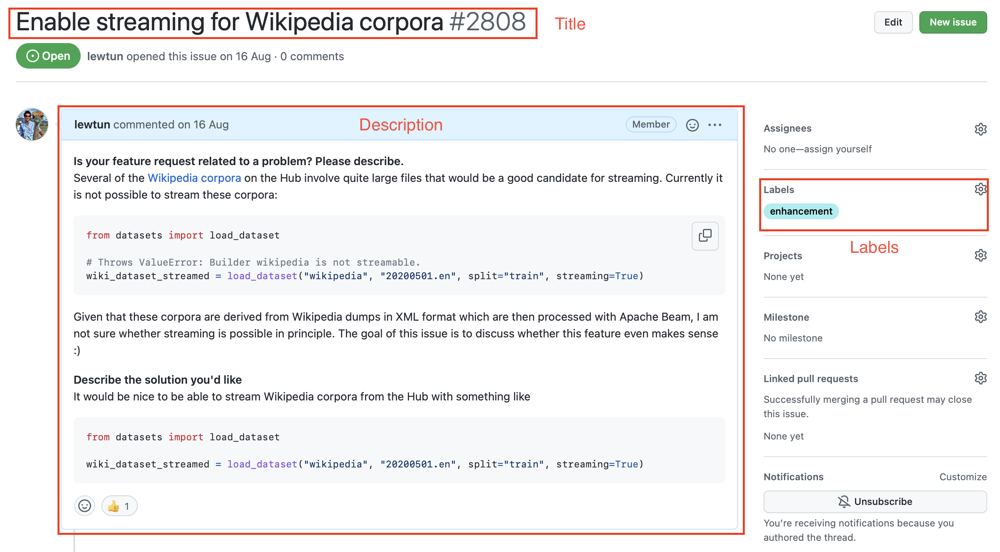
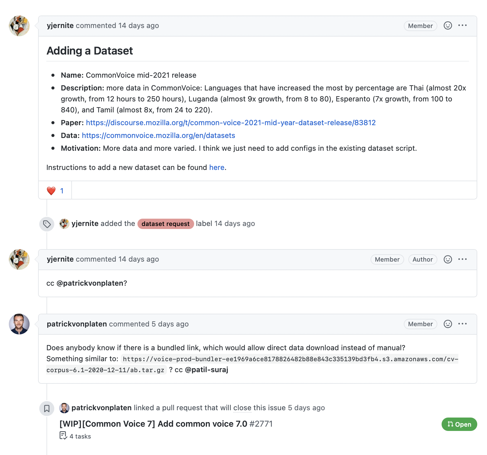
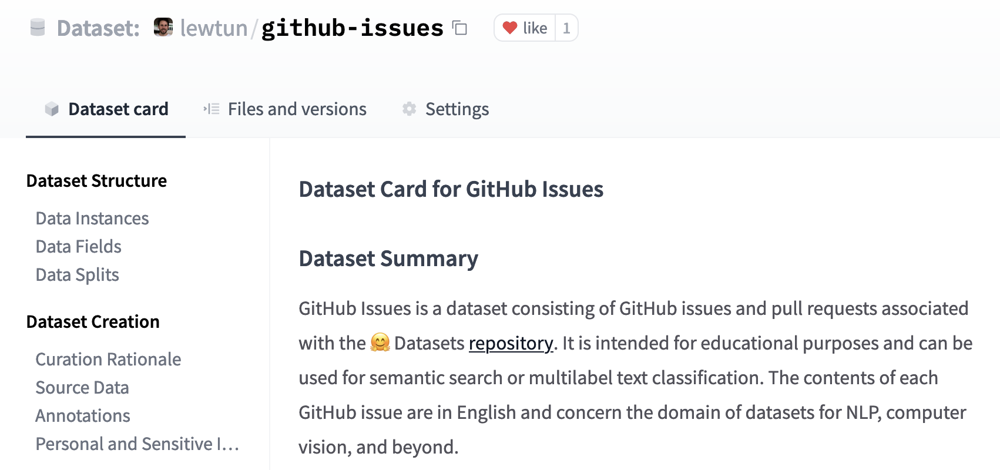

# 第六章 Datasets库

我们在第四章第一次体验了Datasets 库，了解到微调模型主要有三个步骤：

1. 从 Hugging Face Hub 加载数据集。
2. 使用 `Dataset.map()` 预处理数据。
3. 加载和计算指标（特征）。

但这仅仅触及了Datasets 库能做的事情的冰山一角！在本章，我们将深入探索这个库。一路上，我们会找到以下问题的答案：

* 当你的数据集不在 Hub 上时，你应该怎么做？
* 你如何切分和操作数据集？（如果你非常需要使用 Pandas，该如何处理？）
* 当你的数据集非常大，会撑爆你笔记本电脑的 RAM 时，你应该怎么办？
* 什么是“内存映射”和 “Apache Arrow”？
* 如何创建自己的数据集并将其推送到中心？

你在这里学到的技术将为你在第七章和第八章中的高级 tokenization 和微调任务做好准备——所以，来杯咖啡，让我们开始吧！

## 6.1 如果我的数据集不在 Hub 上怎么办？

你以及知道如何使用 [Hugging Face Hub](https://huggingface.co/datasets)(https://huggingface.co/datasets) 中的数据集，但你往往会发现自己需要处理在自己的笔记本电脑或者网络上的数据集。在本节中，我们将展示如何使用Datasets 加载不在 Hugging Face Hub 中的数据集。

### 使用本地和远程数据集 

Datasets 提供了加载本地和远程数据集的方法。它支持几种常见的数据格式，例如：

|       数据格式      |    类型参数    |                         加载的指令                            |
| :----------------: | :------------: | :-----------------------------------------------------: |
|     CSV & TSV      | `csv` | `load_dataset("csv", data_files="my_file.csv")` |
|     Text files     | `text` | `load_dataset("text", data_files="my_file.txt")` |
| JSON & JSON Lines  | `json` | `load_dataset("json", data_files="my_file.jsonl")` |
| Pickled DataFrames | `pandas` | `load_dataset("pandas", data_files="my_dataframe.pkl")` |

如表所示，对于每种数据格式，我们只需要在 `load_dataset()` 函数中指定数据的类型，并使用 `data_files` 指定一个或多个文件的路径的参数。首先，我们从加载本地文件的数据集开始；稍后，我们将看到如何使用远程文件做同样的事情。

### 加载本地数据集 

在这个例子中，我们将使用 [SQuAD-it 数据集](https://github.com/crux82/squad-it/)(https://github.com/crux82/squad-it/) ，这是一个用于意大利语问答的大规模数据集。

训练集和测试集都托管在 GitHub 上，因此我们可以通过 `wget` 命令非常简单地下载它们：

```python
!wget https://github.com/crux82/squad-it/raw/master/SQuAD_it-train.json.gz
!wget https://github.com/crux82/squad-it/raw/master/SQuAD_it-test.json.gz
```

这将下载两个名为 `SQuAD_it-train.json.gz` 和 `SQuAD_it-test.json.gz` 的压缩文件，我们可以用 Linux 的 `gzip` 命令解压他们：

```python
!gzip -dkv SQuAD_it-*.json.gz
```

```python
SQuAD_it-test.json.gz:	   87.4% -- replaced with SQuAD_it-test.json
SQuAD_it-train.json.gz:	   82.2% -- replaced with SQuAD_it-train.json
```

我们可以看到压缩文件已经被替换为 `SQuAD_it-train.json` 和 `SQuAD_it-test.json` ，并且数据以 JSON 格式存储。

<div custom-style="Tip-green">

✏️ 如果你想知道为什么上面的 shell 命令中有一个 `!` ，那是因为我们是在 Jupyter notebook 中运行它们。如果你想在命令行中下载和解压缩数据集，只需删除前缀 `!` 即可。

</div>

当我们使用 `load_dataset()` 函数来加载 JSON 文件时，我们需要知道我们是在处理普通的 JSON（类似于嵌套字典）还是 JSON Lines（每一行都是一个 JSON）。像许多问答数据集一样，SQuAD-it 使用的是嵌套格式，所有文本都存储在 `data` 字段中。这意味着我们可以通过使用参数 `field` 来加载数据集，如下所示：

```python
from datasets import load_dataset

squad_it_dataset = load_dataset("json", data_files="SQuAD_it-train.json", field="data")
```

默认情况下，加载本地文件会创建一个带有 `train` 标签的 `DatasetDict` 对象。我们可以在这里查看一下 `squad_it_dataset` 对象：

```python
squad_it_dataset
```

```python
DatasetDict({
    train: Dataset({
        features: ['title', 'paragraphs'],
        num_rows: 442
    })
})
```

输出了与训练集的行数和列名。我们可以使用 `train` 标签来查看一个示例，如下所示：

```python
squad_it_dataset["train"][0]
```

```python
{
    "title": "Terremoto del Sichuan del 2008",
    "paragraphs": [
        {
            "context": "Il terremoto del Sichuan del 2008 o il terremoto...",
            "qas": [
                {
                    "answers": [{"answer_start": 29, "text": "2008"}],
                    "id": "56cdca7862d2951400fa6826",
                    "question": "In quale anno si è verificato il terremoto nel Sichuan?",
                },
                ...
            ],
        },
        ...
    ],
}
```

很好，我们已经加载了我们的第一个本地数据集！但是，也仅仅加载了训练集，我们真正想要的是包含 `train` 和 `test` 的 `DatasetDict` 对象。这样的话就可以使用 `Dataset.map()` 函数同时处理训练集和测试集。为此，我们向 `data_files` 参数输入一个字典，将数据集的标签名映射到相关联的文件：

```python
data_files = {"train": "SQuAD_it-train.json", "test": "SQuAD_it-test.json"}
squad_it_dataset = load_dataset("json", data_files=data_files, field="data")
squad_it_dataset
```

```python
DatasetDict({
    train: Dataset({
        features: ['title', 'paragraphs'],
        num_rows: 442
    })
    test: Dataset({
        features: ['title', 'paragraphs'],
        num_rows: 48
    })
})
```

这正是我们想要的。现在，我们可以应用各种预处理技术来清洗数据、tokenize 评论等等。

<div custom-style="Tip-green">`load_dataset()` 函数的 `data_files` 参数非常灵活：可以是单个文件路径、文件路径列表或者是标签映射到文件路径的字典。你还可以根据 Unix shell 的规则，对符合指定模式的文件进行通配（例如，你可以通过设置 `data_files="*.JSON"` 匹配目录中所有的 JSON 文件）。有关更多详细信息，请参阅 [Datasets 文档](https://huggingface.co/docs/datasets/v2.12.0/en/loading#local-and-remote-files)(https://huggingface.co/docs/datasets/v2.12.0/en/loading#local-and-remote-files) 。

</div>

Datasets 实际上支持自动解压输入文件，所以我们可以跳过使用 `gzip` ，直接将 `data_files` 参数设置为压缩文件：

```python
data_files = {"train": "SQuAD_it-train.json.gz", "test": "SQuAD_it-test.json.gz"}
squad_it_dataset = load_dataset("json", data_files=data_files, field="data")
```

如果你不想手动解压缩许多 GZIP 文件，这会很有用。自动解压也支持于其他常见格式，如 ZIP 和 TAR，因此你只需将 `data_files` 设置为压缩文件所在的路径，接下来就交给Datasets 吧！

现在你知道如何在笔记本电脑或台式机上加载本地文件，让我们来看看加载远程文件。

### 加载远程数据集 

如果你在公司担任数据研究员或编码员，那么你要分析的数据集很有可能存储在某个远程服务器上。幸运的是，加载远程文件就像加载本地文件一样简单！我们只需要将 `load_dataset()` 的 `data_files` 参数指向存储远程文件的一个或多个 URL。例如，对于托管在 GitHub 上的 SQuAD-it 数据集，我们可以将 `data_files` 设置为指向 `SQuAD_it-*.json.gz` 的网址，如下所示：

```python
url = "https://github.com/crux82/squad-it/raw/master/"
data_files = {
    "train": url + "SQuAD_it-train.json.gz",
    "test": url + "SQuAD_it-test.json.gz",
}
squad_it_dataset = load_dataset("json", data_files=data_files, field="data")
```

这将返回和上面的本地例子相同的 `DatasetDict` 对象，但省去了我们手动下载和解压 `SQuAD_it-*.json.gz` 文件的步骤。这是我们对加载未托管在 Hugging Face Hub 的数据集的各种方法的总结。既然我们已经有了一个可以使用的数据集，让我们开始大展身手吧！

<div custom-style="Tip-green">

✏️ **试试看！** 选择托管在 GitHub 或 [UCI 机器学习仓库](https://archive.ics.uci.edu/ml/index.php)(https://archive.ics.uci.edu/ml/index.php) 上的另一个数据集并尝试使用上述技术在本地和远程加载它。另外，可以尝试加载 CSV 或者文本格式存储的数据集（有关这些格式的更多信息，请参阅 [文档](https://huggingface.co/docs/datasets/loading.html#local-and-remote-files)(https://huggingface.co/docs/datasets/loading.html#local-and-remote-files) ）。

</div>


## 6.2 分割和整理数据 

大多数情况下，你处理的数据并不能直接用于训练模型。在本节中，我们将探索Datasets 提供的各种功能，用于清洗你的数据集。

### 分割和整理我们的数据 

与 Pandas 类似，Datasets 提供了多个函数来操作 `Dataset` 和 `DatasetDict` 对象。我们在第四章已经遇到了 `Dataset.map()` 方法，在本节中，我们将探索一些其他可用的函数。

在本例中，我们将使用托管在 [加州大学欧文分校机器学习存储库](https://archive.ics.uci.edu/ml/index.php)(https://archive.ics.uci.edu/ml/index.php) 的 [药物审查数据集](https://archive.ics.uci.edu/ml/datasets/Drug+Review+Dataset+%28Drugs.com%29)(https://archive.ics.uci.edu/ml/datasets/Drug+Review+Dataset+%28Drugs.com%29) ，其中包含患者对各种药物的评论，以及正在治疗的病情和患者满意度的 10 星评价。

首先我们需要下载并解压数据，可以通过 `wget` 和 `unzip` 命令：

```python
!wget "https://archive.ics.uci.edu/ml/machine-learning-databases/00462/drugsCom_raw.zip"
!unzip drugsCom_raw.zip
```

由于 TSV 仅仅是 CSV 的一个变体，它使用制表符而不是逗号作为分隔符，我们可以使用加载 `csv` 文件的 `load_dataset()` 函数并指定分隔符，来加载这些文件：

```python
from datasets import load_dataset

data_files = {"train": "drugsComTrain_raw.tsv", "test": "drugsComTest_raw.tsv"}
## \t 在python中是制表符的意思
drug_dataset = load_dataset("csv", data_files=data_files, delimiter="\t")
```

在进行数据分析时，获取一个小的随机样本以快速了解你正在处理的数据特点是一种好的实践。在数据集中，我们可以通过链接 `Dataset.shuffle()` 和 `Dataset.select()` 函数创建一个随机的样本：

```python
drug_sample = drug_dataset["train"].shuffle(seed=42).select(range(1000))
## 细看前几个例子
drug_sample[:3]
```

```python
{'Unnamed: 0': [87571, 178045, 80482],
 'drugName': ['Naproxen', 'Duloxetine', 'Mobic'],
 'condition': ['Gout, Acute', 'ibromyalgia', 'Inflammatory Conditions'],
 'review': ['"like the previous person mention, I&#039;m a strong believer of aleve, it works faster for my gout than the prescription meds I take. No more going to the doctor for refills.....Aleve works!"',
  '"I have taken Cymbalta for about a year and a half for fibromyalgia pain. It is great\r\nas a pain reducer and an anti-depressant, however, the side effects outweighed \r\nany benefit I got from it. I had trouble with restlessness, being tired constantly,\r\ndizziness, dry mouth, numbness and tingling in my feet, and horrible sweating. I am\r\nbeing weaned off of it now. Went from 60 mg to 30mg and now to 15 mg. I will be\r\noff completely in about a week. The fibro pain is coming back, but I would rather deal with it than the side effects."',
  '"I have been taking Mobic for over a year with no side effects other than an elevated blood pressure.  I had severe knee and ankle pain which completely went away after taking Mobic.  I attempted to stop the medication however pain returned after a few days."'],
 'rating': [9.0, 3.0, 10.0],
 'date': ['September 2, 2015', 'November 7, 2011', 'June 5, 2013'],
 'usefulCount': [36, 13, 128]}
```

请注意，出于可以复现的目的，我们已将在 `Dataset.shuffle()` 设定了固定的随机数种子。 `Dataset.select()` 需要一个可迭代的索引，所以我们传递了 `range(1000)` 从随机打乱的数据集中抽取前 1,000 个示例。从抽取的数据中，我们已经可以看到我们数据集中有一些特殊的地方：

* `Unnamed: 0` 这列看起来很像每个患者的匿名 ID。
* `condition` 列包含了大小写混合的标签。
* 评论长短不一，混合有 Python 行分隔符 （ `\r\n` ） 以及 HTML 字符代码，如 `&\#039;` 。
  

让我们看看我们如何使用 Datasets 来处理这些问题。为了验证 `Unnamed: 0` 列存储的是患者 ID 的猜想，我们可以使用 `Dataset.unique()` 函数来验证匿名 ID 的数量是否与分割后每个分组中的行数匹配：

```python
for split in drug_dataset.keys():
    assert len(drug_dataset[split]) == len(drug_dataset[split].unique("Unnamed: 0"))
```

这似乎证实了我们的假设，所以让我们把 `Unnamed: 0` 列重命名为患者的 id。我们可以使用 `DatasetDict.rename_column()` 函数来一次性重命名两个分组：

```python
drug_dataset = drug_dataset.rename_column(
    original_column_name="Unnamed: 0", new_column_name="patient_id"
)
drug_dataset
```

```python
DatasetDict({
    train: Dataset({
        features: ['patient_id', 'drugName', 'condition', 'review', 'rating', 'date', 'usefulCount'],
        num_rows: 161297
    })
    test: Dataset({
        features: ['patient_id', 'drugName', 'condition', 'review', 'rating', 'date', 'usefulCount'],
        num_rows: 53766
    })
})
```

<div custom-style="Tip-green">

✏️  **试试看！** 使用 `Dataset.unique()` 函数查找训练和测试集中的特定药物和病症的数量。

</div>

接下来，让我们使用 `Dataset.map()` 来规范所有的 `condition` 标签。正如我们在第四章中处理 tokenizer 一样，我们可以定义一个简单的函数，可以将该函数应用于 `drug_dataset` 每个分组的所有行：

```python
def lowercase_condition(example):
    return {"condition": example["condition"].lower()}

drug_dataset.map(lowercase_condition)
```

```python
AttributeError: 'NoneType' object has no attribute 'lower'
```

哦不，我们的 map 功能遇到了问题！从错误中我们可以推断出 `condition` 列存在 `None` ，不能转换为小写，因为它们不是字符串。让我们使用 `Dataset.filter()` 删除这些行 其工作方式类似于 `Dataset.map()` 。例如：

```python
def filter_nones(x):
    return x["condition"] is not None
```

然后运行 `drug_dataset.filter(filter_nones)` ，我们可以用 lambda 函数在一行代码完成这个任务。在 Pyhton 中，lambda 函数是你无需明确命名即可使用的微函数（匿名函数）。它们一般采用如下形式：

```python
lambda <arguments> : <expression>
```

其中 `lambda` 是 Python 的特殊 [关键字](https://docs.python.org/3/reference/lexical_analysis.html#keywords)(https://docs.python.org/3/reference/lexical_analysis.html#keywords) 之一， `arguments` 是以逗号进行分隔的函数参数的列表/集合， `expression` 代表你希望执行的操作。例如，我们可以定义一个简单的 lambda 函数来对一个数字进行平方，如下所示：

```python
lambda x : x * x
```

我们需要将要输入放在括号中：

```python
(lambda x: x * x)(3)
```

```python
9
```

同样，我们可以通过使用逗号分隔来定义带有多个参数的 lambda 函数。例如，我们可以按如下方式计算三角形的面积：

```python
(lambda base, height: 0.5 * base * height)(4, 8)
```

```python
16.0
```

当你想定义小型、一次性使用的函数时，lambda 函数非常方便（有关它们的更多信息，我们建议阅读 Andre Burgaud 写的 [真正的Python教程](https://realpython.com/python-lambda/)(https://realpython.com/python-lambda/) ）。在Datasets 中，我们可以使用 lambda 函数来定义简单的映射和过滤操作，所以让我们使用这个技巧来删除我们数据集中的 `None` 条目：

```python
drug_dataset = drug_dataset.filter(lambda x: x["condition"] is not None)
``` 

`None` 条目删除之后,我们可以规范我们的 `condition` 列:

```python
drug_dataset = drug_dataset.map(lowercase_condition)
## 检查一下转换后的结果
drug_dataset["train"]["condition"][:3]
```

```python
['left ventricular dysfunction', 'adhd', 'birth control']
```

有用！现在我们已经清理了标签，让我们来看看清洗后的评论文本。

### 创建新的列 

每当我们处理客户评论时，一个好的习惯是检查每一条评论的字数。评论可能只是一个词，比如“太棒了！”或包含数千字的完整文章。在不同的使用场景，你需要以不同的方式处理这些极端情况。为了计算每条评论中的单词数，我们将使用空格分割每个文本进行粗略统计。

让我们定义一个简单的函数来计算，计算每条评论的字数：

```python
def compute_review_length(example):
    return {"review_length": len(example["review"].split())}
```

不同于我们的 `lowercase_condition()` 函数， `compute_review_length()` 返回一个字典，其键并不对应数据集中的某一列名称。在这种情况下，当 `compute_review_length()` 传递给 `Dataset.map()` 时，它将应用于数据集中的所有行，最后会创建新的 `review_length` 列：

```python
drug_dataset = drug_dataset.map(compute_review_length)
## 检查第一个训练样例
drug_dataset["train"][0]
```

```python
{'patient_id': 206461,
 'drugName': 'Valsartan',
 'condition': 'left ventricular dysfunction',
 'review': '"It has no side effect, I take it in combination of Bystolic 5 Mg and Fish Oil"',
 'rating': 9.0,
 'date': 'May 20, 2012',
 'usefulCount': 27,
 'review_length': 17}
```

正如预期的那样，我们可以看到一个 `review_length` 列已添加到我们的训练集中。我们可以使用 `Dataset.sort()` 对这个新列进行排序，然后查看一下极端长度的评论是什么样的：

```python
drug_dataset["train"].sort("review_length")[:3]
```

```python
{'patient_id': [103488, 23627, 20558],
 'drugName': ['Loestrin 21 1 / 20', 'Chlorzoxazone', 'Nucynta'],
 'condition': ['birth control', 'muscle spasm', 'pain'],
 'review': ['"Excellent."', '"useless"', '"ok"'],
 'rating': [10.0, 1.0, 6.0],
 'date': ['November 4, 2008', 'March 24, 2017', 'August 20, 2016'],
 'usefulCount': [5, 2, 10],
 'review_length': [1, 1, 1]}
```

正如我们所猜想的那样，有些评论只包含一个词，虽然这对于情感分析来说还可以接受，但如果我们想要预测病情，那么它所提供的信息就不够丰富了。

<div custom-style="Tip-green">

🙋向数据集添加新列的另一种方法是使用函数 `Dataset.add_column()` ，在使用它时你可以通过 Python 列表或 NumPy 数组的方式提供数据，在不适合使用 `Dataset.map()` 情况下可以很方便。

</div>

让我们使用 `Dataset.filter()` 功能来删除包含少于 30 个单词的评论。这与我们过滤 `condition` 列的处理方式相似，我们可以通过设定评论长度的最小阈值，筛选出过短的评论：

```python
drug_dataset = drug_dataset.filter(lambda x: x["review_length"] > 30)
print(drug_dataset.num_rows)
```

```python
{'train': 138514, 'test': 46108}
```

如你所见，这已经从我们的原始训练和测试集中删除了大约 15％ 的评论。

<div custom-style="Tip-green">

✏️ **试试看！**使用 `Dataset.sort()` 函数查看单词数最多的评论。你可以参阅 [文档](https://huggingface.co/docs/datasets/package_reference/main_classes.html#datasets.Dataset.sort)(https://huggingface.co/docs/datasets/package_reference/main_classes.html#datasets.Dataset.sort) 了解如何按照评论的长度降序排序。

</div>

我们需要处理的最后一件事是处理评论中的 HTML 字符。我们可以使用 Python 的 `html` 模块来解码这些字符，如下所示：

```python
import html

text = "I&#039;m a transformer called BERT"
html.unescape(text)
```

```python
"I'm a transformer called BERT"
```

我们将使用 `Dataset.map()` 对我们语料库中的所有 HTML 字符进行解码：

```python
drug_dataset = drug_dataset.map(lambda x: {"review": html.unescape(x["review"])})
```

如你所见， `Dataset.map()` 方法对于处理数据非常有用，即使我们还没有完全了解它的所有功能！

### `map()` 方法的超级加速 

`Dataset.map()` 方法有一个 `batched` 参数，如果设置为 `True` ，map 函数将会分批执行所需要进行的操作（批量大小是可配置的，但默认为 1,000）。例如，之前对所有 HTML 进行解码的 map 函数运行需要一些时间（你可以从进度条中看到所需的时间）。我们可以通过使用列表推导同时处理多个元素来加速。

当你在使用 `Dataset.map()` 函数时设定 `batched=True` 。该函数需要接收一个包含数据集字段的字典，字典的值是一个列表。例如，这是使用 `batched=True` 对所有 HTML 字符进行解码的方法 

```python
new_drug_dataset = drug_dataset.map(
    lambda x: {"review": [html.unescape(o) for o in x["review"]]}, batched=True
)
```

如果你在笔记本中运行此代码，你会看到此命令的执行速度比前一个命令快得多。这不是因为我们的评论已经是处理过的——如果你重新执行上一节的指令（没有 `batched=True` ），它将花费与之前相同的时间。这是因为列表推导式通常比在同一代码中用 `for` 循环执行相同的代码更快，并且我们还通过同时访问多个元素而不是一个一个来处理来提高处理的速度。

在第七章我们将遇到的“快速” tokenizer 它可以快速对长文本列表进行 tokenization。使用 `Dataset.map()` 搭配 `batched=True` 参数是加速的关键。例如，要使用快速 tokenizer 对所有药物评论 tokenization，我们可以使用如下的函数：

```python
from transformers import AutoTokenizer
tokenizer = AutoTokenizer.from_pretrained("bert-base-cased")

def tokenize_function(examples):
    return tokenizer(examples["review"], truncation=True)
```

正如我们在第四章所看到的，我们原本就可以将一个或多个示例传递给 tokenizer 因此在 `batched=True` 是一个非必须的选项。让我们借此机会比较不同选项的性能。在 notebook 中，你可以在你要测量的代码行之前添加 `%time` 来记录该行运行所消耗的时间：

```python
%time tokenized_dataset = drug_dataset.map(tokenize_function, batched=True)
```

你也可以将 `%%time` 放置在单元格开头来统计整个单元格的执行时间。在我们的硬件上，该指令显示 10.8 秒（这就是真正（Wall time）的执行时间）。

<div custom-style="Tip-green">

✏️ **试试看！** 在有和无 `batched=True` 的情况下执行相同的指令，然后试试慢速 tokenizer （在 `AutoTokenizer.from_pretrained()` 方法中添加 `use_fast=False` ），这样你就可以看看在你的电脑上它需要多长的时间。

</div>

以下是我们在使用和不使用批处理时使用快速和慢速 tokenizer 获得的结果：

选项         | 快速 tokenizer | 慢速 tokenizer
:--------------:|:--------------:|:-------------:
`batched=True` | 10.8s          | 4min41s 
`batched=False` | 59.2s          | 5min3s

这意味着使用快速 tokenizer 配合 `batched=True` 选项比没有批处理的慢速版本快 30 倍——这真的太 Amazing 了！这就是为什么在使用 `AutoTokenizer` 时，将会默认使用 `use_fast=True` 的主要原因 （以及为什么它们被称为“快速”的原因）。他们能够实现这样的加速，因为在底层的 tokenization 代码是在 Rust 中执行的，Rust 是一种可以易于并行化执行的语言。

并行化也是快速 tokenizer 通过批处理实现近 6 倍加速的原因：单个 tokenization 操作是不能并行的，但是当你想同时对大量文本进行 tokenization 时，你可以将执行过程拆分为多个进程，每个进程负责处理自己的文本。 `Dataset.map()` 也有一些自己的并行化能力。尽管它们没有 Rust 提供支持，但它们仍然可以帮助慢速 tokenizer 加速（尤其是当你使用的 tokenizer 没有快速版本时）。要启用多进程处理，请在调用 `Dataset.map()` 时使用 `num_proc` 参数并指定要在调用中使用的进程数 

```python
slow_tokenizer = AutoTokenizer.from_pretrained("bert-base-cased", use_fast=False)

def slow_tokenize_function(examples):
    return slow_tokenizer(examples["review"], truncation=True)

tokenized_dataset = drug_dataset.map(slow_tokenize_function, batched=True, num_proc=8)
```

你可以对处理进行一些计时的试验，以确定最佳进程数；在我们的例子中，8 似乎产生了最好的速度增益。以下是我们在有无多进程处理的情况下，得到的结果：

选项         | 快速 tokenizer  | 慢速 tokenizer 
:--------------:|:--------------:|:-------------: 
`batched=True` | 10.8s          | 4min41s
`batched=False` | 59.2s          | 5min3s 
`batched=True` , `num_proc=8` | 6.52s          | 41.3s
`batched=False` , `num_proc=8` | 9.49s          | 45.2s

这个结果对于慢速分词器来说是更加友好了，但快速分词器的性能也得到了显著提升。但是请注意，情况并非总是如此—对于 `num_proc` 的其他值，在我们的测试中，使用 `batched=True` 而不带有 `num_proc` 参数的选项处理起来更快。总的来说，我们并不推荐在快速 tokenizer 和 `batched=True` 的情况下使用 Python 的多进程处理。

<div custom-style="Tip-green">

通常来说，使用 `num_proc` 以加快处理速度通常是一个好主意，只要你使用的函数本身没有进行某种类型的多进程处理。

</div>

将所有这些功能浓缩到一个方法中已经非常了不起，但是还有更多！使用 `Dataset.map()` 和 `batched=True` 你可以更改数据集中的元素数量。当你想从一个样本中创建几个训练特征时，这是非常有用的。我们将在第八章中几个 NLP 任务的预处理中使用到这个功能，它非常便捷。

<div custom-style="Tip-green">

💡在机器学习中，一个样本通常可以为我们的模型提供一组特征。在某些情况下，这组特征会储存在数据集的几个列，但在某些情况下（例如此处的例子和用于问答的数据），可以从单个样本的那一列中提取多个特征

</div>

让我们来看看它是如何实现的！在这里，我们将对我们的样本进行 tokenization 并将最大截断长度设置为 128，但我们将要求 tokenizer 返回全部文本块，而不仅仅是第一个。这可以通过设置 `return_overflowing_tokens=True` 来实现：

```python
def tokenize_and_split(examples):
    return tokenizer(
        examples["review"],
        truncation=True,
        max_length=128,
        return_overflowing_tokens=True,
    )
```

在使用 `Dataset.map()` 正式开始处理整个数据集之前，让我们先在一个样本上测试一下：

```python
result = tokenize_and_split(drug_dataset["train"][0])
[len(inp) for inp in result["input_ids"]]
```

```python
[128, 49]
```

瞧！我们在训练集中的第一个样本变成了两个特征，因为它超过了我们指定的最大截断长度，因此结果被截成了两段：第一段长度为 128 第二段长度为 49 现在让我们对数据集的所有样本执行此操作！

```python
tokenized_dataset = drug_dataset.map(tokenize_and_split, batched=True)
```

```python
ArrowInvalid: Column 1 named condition expected length 1463 but got length 1000
```

不好了！这并没有成功！为什么呢？查看错误消息会给我们一个线索：列的长度不匹配，一列长度为 1,463，另一列长度为 1,000。1,000 行的“review”生成了 1,463 行的新特征，导致和原本的 1000 行的长度不匹配。

问题出在我们试图混合两个长度不同的数据集： `drug_dataset` 列将有 1000 个样本，但是我们正在构建 `tokenized_dataset` 列将有 1,463 个样本（因为我们使用 `return_overflowing_tokens=True` 将长评论分词成了多个样本）。这对 `Dataset` 来说不可行，所以我们需要要么删除旧数据集的列，要么使它们与新数据集中的尺寸相同。我们可以使用 `remove_columns` 参数来实现前者：

```python
tokenized_dataset = drug_dataset.map(
    tokenize_and_split, batched=True, remove_columns=drug_dataset["train"].column_names
)
```

现在这个过程没有错误。我们可以通过比较长度来检查我们的新数据集是否比原始数据集有更多的元素：

```python
len(tokenized_dataset["train"]), len(drug_dataset["train"])
```

```python
(206772, 138514)
```

我们也可以通过使旧列与新列保持相同大小来处理不匹配长度的问题。为此，当我们设置 `return_overflowing_tokens=True` 时，可以使用 `overflow_to_sample_mapping` 字段。它给出了新特征索引到它源自的样本索引的映射。使用这个，我们可以将原始数据集中的每个键关联到一个合适大小的值列表中，通过遍历所有的数据来生成新特性：

```python
def tokenize_and_split(examples):
    result = tokenizer(
        examples["review"],
        truncation=True,
        max_length=128,
        return_overflowing_tokens=True,
    )
    # 提取新旧索引之间的映射
    sample_map = result.pop("overflow_to_sample_mapping")
    for key, values in examples.items():
        result[key] = [values[i] for i in sample_map]
    return result
```

可以看到它可以与 `Dataset.map()` 一起工作，无需我们删除旧列：

```python
tokenized_dataset = drug_dataset.map(tokenize_and_split, batched=True)
tokenized_dataset
```

```python
DatasetDict({
    train: Dataset({
        features: ['attention_mask', 'condition', 'date', 'drugName', 'input_ids', 'patient_id', 'rating', 'review', 'review_length', 'token_type_ids', 'usefulCount'],
        num_rows: 206772
    })
    test: Dataset({
        features: ['attention_mask', 'condition', 'date', 'drugName', 'input_ids', 'patient_id', 'rating', 'review', 'review_length', 'token_type_ids', 'usefulCount'],
        num_rows: 68876
    })
})
```

我们获得了与之前数量相同的训练特征，但在这里我们保留了所有旧字段。如果你在使用模型计算之后需要它们进行一些后续处理，你可能需要使用这种方法。

你现在已经了解了如何使用 Datasets 以各种方式用于预处理数据集。虽然Datasets 的处理功能会覆盖你大部分的模型训练需求，有时你可能需要切换到 Pandas 以使用更强大的功能，例如 `DataFrame.groupby()` 或用于可视化的高级 API。幸运的是，Datasets 设计宗旨就是与 Pandas、NumPy、PyTorch、TensorFlow 和 JAX 等库可以相互转换。让我们来看看这是如何实现的。

### Datasets 和 DataFrames 的相互转换 

为了实现各种第三方库之间的转换，Datasets 提供了一个 `Dataset.set_format()` 函数。此函数可以通过仅更改输出格式的，轻松切换到另一种格式，而不会影响底层数据格式（以 Apache Arrow 方式进行存储）。为了演示，让我们把数据集转换为 Pandas：

```python
drug_dataset.set_format("pandas")
```

现在，当我们访问数据集的元素时，我们会得到一个 `pandas.DataFrame` 而不是字典：

```python
drug_dataset["train"][:3]
```

<table border="1" class="dataframe">
  <thead>
    <tr style="text-align: right;">
      <th></th>
      <th>patient_id</th>
      <th>drugName</th>
      <th>condition</th>
      <th>review</th>
      <th>rating</th>
      <th>date</th>
      <th>usefulCount</th>
      <th>review_length</th>
    </tr>
  </thead>
  <tbody>
    <tr>
      <th>0</th>
      <td>95260</td>
      <td>Guanfacine</td>
      <td>adhd</td>
      <td>"My son is halfway through his fourth week of Intuniv."</td>
      <td>8.0</td>
      <td>April 27, 2010</td>
      <td>192</td>
      <td>141</td>
    </tr>
    <tr>
      <th>1</th>
      <td>92703</td>
      <td>Lybrel</td>
      <td>birth control</td>
      <td>"I used to take another oral contraceptive, which had 21 pill cycle, and was very happy- very light periods, max 5 days, no other side effects."</td>
      <td>5.0</td>
      <td>December 14, 2009</td>
      <td>17</td>
      <td>134</td>
    </tr>
    <tr>
      <th>2</th>
      <td>138000</td>
      <td>Ortho Evra</td>
      <td>birth control</td>
      <td>"This is my first time using any form of birth control."</td>
      <td>8.0</td>
      <td>November 3, 2015</td>
      <td>10</td>
      <td>89</td>
    </tr>
  </tbody>
</table>

接下来我们从数据集中选择 `drug_dataset[train]` 的所有数据来得到训练集数据：

```python
train_df = drug_dataset["train"][:]
```

<div custom-style="Tip-red">

🚨 实际上， `Dataset.set_format()` 改变了数据集的 `__getitem__()` 方法的返回格式。这意味着当我们想从 `"pandas"` 格式的 `Dataset` 中创建像 `train_df` 这样的新对象时，我们需要对整个数据集进行切片（[:]）以获得 `pandas.DataFrame` 。无论输出格式如何，你都可以自己验证 `drug_dataset["train"]` 的类型依然还是 `Dataset` 。

</div>

有了这个基础，我们可以使用我们想要的所有 Pandas 功能。例如，我们可以巧妙地链式操作，来计算 `condition` 列中不同类别的分布 

```python
frequencies = (
    train_df["condition"]
    .value_counts()
    .to_frame()
    .reset_index()
    .rename(columns={"index": "condition", "condition": "frequency"})
)
frequencies.head()
```

<table border="1" class="dataframe">
  <thead>
    <tr style="text-align: right;">
      <th></th>
      <th>condition</th>
      <th>frequency</th>
    </tr>
  </thead>
  <tbody>
    <tr>
      <th>0</th>
      <td>birth control</td>
      <td>27655</td>
    </tr>
    <tr>
      <th>1</th>
      <td>depression</td>
      <td>8023</td>
    </tr>
    <tr>
      <th>2</th>
      <td>acne</td>
      <td>5209</td>
    </tr>
    <tr>
      <th>3</th>
      <td>anxiety</td>
      <td>4991</td>
    </tr>
    <tr>
      <th>4</th>
      <td>pain</td>
      <td>4744</td>
    </tr>
  </tbody>
</table>

当我们完成了 Pandas 分析之后，我们可以使用对象 `Dataset.from_pandas()` 方法可以创建一个新的 `Dataset` 对象，如下所示：

```python
from datasets import Dataset

freq_dataset = Dataset.from_pandas(frequencies)
freq_dataset
```

```python
Dataset({
    features: ['condition', 'frequency'],
    num_rows: 819
})
```

<div custom-style="Tip-green">

✏️**试试看！**计算每种药物的平均评分并将结果存储在一个新的 Dataset 中。

</div>

到此为止，我们对Datasets 中可用的各种预处理技术的介绍就结束了。在本节的最后一部分，让我们为训练分类器创建一个验证集。在此之前，让我们将输出格式 `drug_dataset` 从 `pandas` 重置到 `arrow` ：

```python
drug_dataset.reset_format()
```

### 创建验证集 

尽管我们有一个可以用于评估的测试集，但在开发过程中保持测试集不变并创建一个单独的验证集是一个很好的做法。一旦你对模型在测试集上的表现感到满意，你就可以使用验证集进行最终的检查。此过程有助于降低你过拟合测试集和部署在现实世界数据上失败的模型的风险。

Datasets 提供了一个基于 `scikit-learn` 的经典方法： `Dataset.train_test_split()` 。让我们用它把我们的训练集分成 `train` 和 `validation` （为了可以复现，我们将设置 `seed` 的值为一个常量）：

```python
drug_dataset_clean = drug_dataset["train"].train_test_split(train_size=0.8, seed=42)
## 将默认的 "test" 部分重命名为"validation"
drug_dataset_clean["validation"] = drug_dataset_clean.pop("test")
## 将 "test" 集添加到我们的`DatasetDict`中
drug_dataset_clean["test"] = drug_dataset["test"]
drug_dataset_clean
```

```python
DatasetDict({
    train: Dataset({
        features: ['patient_id', 'drugName', 'condition', 'review', 'rating', 'date', 'usefulCount', 'review_length', 'review_clean'],
        num_rows: 110811
    })
    validation: Dataset({
        features: ['patient_id', 'drugName', 'condition', 'review', 'rating', 'date', 'usefulCount', 'review_length', 'review_clean'],
        num_rows: 27703
    })
    test: Dataset({
        features: ['patient_id', 'drugName', 'condition', 'review', 'rating', 'date', 'usefulCount', 'review_length', 'review_clean'],
        num_rows: 46108
    })
})
```

太好了，我们现在已经准备好了一个适合训练模型的数据集了！在第五节我们将向你展示如何将数据集上传到 Hugging Face Hub，现在让我们先结束我们的分析，看一看在本地计算机上保存数据集的几种方法。

### 保存数据集 

虽然 Datasets 会缓存每个下载的数据集和对它执行的操作，但有时你会想要将数据集保存到磁盘（比如，以防缓存被删除）。如下表所示，Datasets 提供了三个主要函数来以不同的格式保存你的数据集：

| 数据格式    |        对应的方法        |
| :---------: | :--------------------: |
|    Arrow    | `Dataset.save_to_disk()` |
|     CSV     | `Dataset.to_csv()` |
|    JSON     | `Dataset.to_json()` |

例如，让我们以 Arrow 格式保存我们清洗过的数据集：

```python
drug_dataset_clean.save_to_disk("drug-reviews")
```

这将创建一个具有以下结构的目录：

```python
drug-reviews/
├── dataset_dict.json
├── test
│   ├── dataset.arrow
│   ├── dataset_info.json
│   └── state.json
├── train
│   ├── dataset.arrow
│   ├── dataset_info.json
│   ├── indices.arrow
│   └── state.json
└── validation
    ├── dataset.arrow
    ├── dataset_info.json
    ├── indices.arrow
    └── state.json
```

其中，我们可以看到，每个部分都有 `dataset.arrow` 表，以及保存元数据的 `dataset_info.json` 和 `state.json` 。你可以将 Arrow 格式视为一个优化的列和行的精美表格，它针对构建处理和传输大型数据集的高性能应用程序进行了优化。

保存数据集后，我们可以使用 `load_from_disk()` 功能从磁盘读取数据：

```python
from datasets import load_from_disk

drug_dataset_reloaded = load_from_disk("drug-reviews")
drug_dataset_reloaded
```

```python
DatasetDict({
    train: Dataset({
        features: ['patient_id', 'drugName', 'condition', 'review', 'rating', 'date', 'usefulCount', 'review_length'],
        num_rows: 110811
    })
    validation: Dataset({
        features: ['patient_id', 'drugName', 'condition', 'review', 'rating', 'date', 'usefulCount', 'review_length'],
        num_rows: 27703
    })
    test: Dataset({
        features: ['patient_id', 'drugName', 'condition', 'review', 'rating', 'date', 'usefulCount', 'review_length'],
        num_rows: 46108
    })
})
```

对于 CSV 和 JSON 格式，我们必须将每个部分存储为单独的文件。一种方法是遍历 `DatasetDict` 中的键和值 

```python
for split, dataset in drug_dataset_clean.items():
    dataset.to_json(f"drug-reviews-{split}.jsonl")
```

这将把每个部分保存为 [JSON Lines格式](https://jsonlines.org)(https://jsonlines.org) ，其中数据集中的每一行都存储为一行 JSON。下面是第一个例子的样子：

```python
!head -n 1 drug-reviews-train.jsonl
```

```python
{"patient_id":141780,"drugName":"Escitalopram","condition":"depression","review":"\"I seemed to experience the regular side effects of LEXAPRO, insomnia, low sex drive, sleepiness during the day. I am taking it at night because my doctor said if it made me tired to take it at night. I assumed it would and started out taking it at night. Strange dreams, some pleasant. I was diagnosed with fibromyalgia. Seems to be helping with the pain. Have had anxiety and depression in my family, and have tried quite a few other medications that haven't worked. Only have been on it for two weeks but feel more positive in my mind, want to accomplish more in my life. Hopefully the side effects will dwindle away, worth it to stick with it from hearing others responses. Great medication.\"","rating":9.0,"date":"May 29, 2011","usefulCount":10,"review_length":125}
```

然后我们可以使用第二节中的技巧，按如下所示加载 JSON 文件

```python
data_files = {
    "train": "drug-reviews-train.jsonl",
    "validation": "drug-reviews-validation.jsonl",
    "test": "drug-reviews-test.jsonl",
}
drug_dataset_reloaded = load_dataset("json", data_files=data_files)
```

至此，我们对使用Datasets 进行数据整理的探索就此结束！现在我们有了一个清洗过的数据集，以下是你可以尝试的一些想法：

1. 使用第四章的技术来训练一个分类器，它能够基于药品评价预测患者的病情。
2. 使用第二章中的 `summarization` 管道生成评论的摘要。

接下来，我们将看看 Datasets 如何使你能够在不撑爆笔记本电脑内存的情况下处理庞大的数据集！

## 6.3 大数据？Datasets 应对有方！


如今，处理 GB 级别的数据集已不再罕见，特别是如果你打算从头开始预训练像 BERT 或者 GPT-2 这样的 Transormer 模型。在这种情况下，甚至 `加载(load)` 数据集都可能成为挑战。例如，用于预训练 GPT-2 的 WebText 语料库包含超过 800 万个文档和 40 GB 的文本 —— 将其加载到笔记本电脑的 RAM 中都可能会让人抓狂！

幸运的是，Datasets 的设计旨在克服这些限制。它通过将数据集作为 `内存映射(memory-mapped)` 文件来处理，解放内存管理问题；并通过 `流式处理(streaming)` 来摆脱硬盘限制。

在本节中，我们将使用一个庞大的 825 GB 语料库——被称为 [the Pile](https://pile.eleuther.ai)(https://pile.eleuther.ai) 的数据集，来探索Datasets 的这些功能。让我们开始吧！

### 什么是 the Pile？

The Pile 是由 [EleutherAI](https://www.eleuther.ai)(https://www.eleuther.ai) 创建的一个用于训练大规模语言模型的英语文本语料库。它包含各种各样的数据集，涵盖科学文章，GitHub 代码库以及过滤后的 Web 文本。训练语料库以 [14 GB 的文件块](https://the-eye.eu/public/AI/pile/)(https://the-eye.eu/public/AI/pile/) 提供，并且你也可以下载几个 [单独的组件](https://the-eye.eu/public/AI/pile_preliminary_components/)(https://the-eye.eu/public/AI/pile_preliminary_components/) 。让我们先来看看 PubMed Abstracts 部分，它是 [PubMed](https://pubmed.ncbi.nlm.nih.gov/)(https://pubmed.ncbi.nlm.nih.gov/) 上的 1500 万篇生物医学出版物的摘要的语料库。数据集采用 [JSON Lines格式](https://jsonlines.org)(https://jsonlines.org) 并使用 `zstandard` 库进行压缩，所以我们首先需要先安装 `zstandard` 库：

```python
!pip install zstandard
```

接下来，我们可以使用第二节中所学的加载远程数据集的方法加载数据集：

```python
from datasets import load_dataset

## 这需要几分钟才能运行,所以在你等待的时候去喝杯茶或咖啡 :)
data_files = "https://the-eye.eu/public/AI/pile_preliminary_components/PUBMED_title_abstracts_2019_baseline.jsonl.zst"
pubmed_dataset = load_dataset("json", data_files=data_files, split="train")
pubmed_dataset
```

```python
Dataset({
    features: ['meta', 'text'],
    num_rows: 15518009
})
```

我们可以看到我们的数据集中有 15,518,009 行和 2 列 —— 如此庞大！

<div custom-style="Tip-green">

✏️ 默认情况下，Datasets 会自动解压加载数据集所需的文件。如果你想保留硬盘空间，你可以把 `DownloadConfig(delete_extracted=True)` 传递给 `load_dataset()` 的 `download_config` 参数。更多详细信息，请参阅 [文档](https://huggingface.co/docs/datasets/package_reference/builder_classes.html?#datasets.utils.DownloadConfig)(https://huggingface.co/docs/datasets/package_reference/builder_classes.html?#datasets.utils.DownloadConfig) 。

</div>

让我们看看数据集的第一个元素的内容：

```python
pubmed_dataset[0]
```

```python
{'meta': {'pmid': 11409574, 'language': 'eng'},
 'text': 'Epidemiology of hypoxaemia in children with acute lower respiratory infection.\nTo determine the prevalence of hypoxaemia in children aged under 5 years suffering acute lower respiratory infections (ALRI), the risk factors for hypoxaemia in children under 5 years of age with ALRI, and the association of hypoxaemia with an increased risk of dying in children of the same age ...'}
```

可以看到，这看起来像是医学文章的摘要。现在，让我们看看加载数据集所使用的 RAM！

### 内存映射的魔力 

测量 Python 内存使用的简单方式是使用 [`psutil`](https://psutil.readthedocs.io/en/latest/)(https://psutil.readthedocs.io/en/latest/) 库，可以通过如下方式安装：

```python
!pip install psutil
```

它提供了一个 `Process` 类，让我们可以检查当前进程的内存使用情况，如下所示：

```python
import psutil

## Process.memory_info是以字节为单位的,所以转换为兆字节
print(f"使用的RAM:{psutil.Process().memory_info().rss / (1024 * 1024):.2f} MB")
```

```python
RAM used: 5678.33 MB
```

这里的 `rss` 属性是指 `常驻集（resident set size）` 的大小，它是进程在 RAM 中占用的内存的部分。这个测量结果也包括了 Python 解释器和我们加载的库所使用的内存，所以实际上用于加载数据集的内存会更小一些。作为比较，让我们使用 `dataset_size` 属性看看数据集在磁盘上上的大小。由于结果像之前一样以字节为单位，我们需要手动将其转换为 GB：

```python
print(f"数据集中文件的数量 : {pubmed_dataset.dataset_size}")
size_gb = pubmed_dataset.dataset_size / (1024**3)
print(f"数据集大小 (缓存文件) : {size_gb:.2f} GB")
```

```python
数据集中文件的数量 : 20979437051
数据集大小 (缓存文件) : 19.54 GB
```

令人欣喜的是——尽管它将近 20GB 之大，我们却能用远小于此的 RAM 加载和访问数据集！

<div custom-style="Tip-green">

✏️ **试试看！** 从 Pile 选择一个比你的笔记本电脑或台式机的 RAM 更大的 [子集](https://the-eye.eu/public/AI/pile_preliminary_components/)(https://the-eye.eu/public/AI/pile_preliminary_components/) ，用 Datasets 加载这个数据集，并且测量 RAM 的使用量。请注意，为了获得准确的测量结果，你需要新开一个进程执行这个操作。你可以在 [the Pile paper](https://arxiv.org/abs/2101.00027)(https://arxiv.org/abs/2101.00027) 的表 1 中找到每个子集解压后的大小。

</div>

如果你熟悉 Pandas，这个结果可能会让人感到很惊奇。因为根据 Wes Kinney 的著名的 [经验法则](https://wesmckinney.com/blog/apache-arrow-pandas-internals/)(https://wesmckinney.com/blog/apache-arrow-pandas-internals/) ，你通常需要 5 到 10 倍于你数据集大小的 RAM。那么 Datasets 是如何解决这个内存管理问题的呢？Datasets 将每一个数据集看作一个 [内存映射文件](https://en.wikipedia.org/wiki/Memory-mapped_file)(https://en.wikipedia.org/wiki/Memory-mapped_file) ，它提供了 RAM 和文件系统存储之间的映射，该映射允许 Datasets 库无需将其完全加载到内存中即可访问和操作数据集的元素。

内存映射文件也一个在多个进程之间共享，这使得像 `Dataset.map()` 之类的方法可以在无需移动或者复制数据集的情况下实现并行化。在底层，这些功能都是由 [Apache Arrow](https://arrow.apache.org)(https://arrow.apache.org) 内存格式和 [`pyarrow`](https://arrow.apache.org/docs/python/index.html)(https://arrow.apache.org/docs/python/index.html) 库实现的，这使得数据加载和处理速度快如闪电。（更多有关 Apache Arrow 的详细信息以及与 Pandas 的比较，请查看Dejan Simic的博客文章。） 为了更清晰地看到这个过程，让我们通过遍历 PubMed 摘要数据集中的所有元素，运行一个小速度测试：

```python
import timeit

code_snippet = """batch_size = 1000

for idx in range(0, len(pubmed_dataset), batch_size):
    _ = pubmed_dataset[idx:idx + batch_size]
"""

time = timeit.timeit(stmt=code_snippet, number=1, globals=globals())
print(
    f"在 {time:.1f}s 内遍历了 {len(pubmed_dataset)}个示例(约 {size_gb:.1f} GB),即 {size_gb/time:.3f} GB/s"
)
```

```python
'在64.2s内遍历了15518009个示例(约19.5 GB),即0.304 GB/s'
```

这里我们使用了 Python 的 `timeit` 模块来测量执行 `code_snippet` 所耗的时间。你通常能以十分之几 GB/s 到几 GB/s 的速度遍历一个数据集。通过上述的方法就已经能够解决大多数大数据集加载的限制，但是有时候你不得不使用一个很大的数据集，它甚至都不能存储在笔记本电脑的硬盘上。例如，如果我们尝试下载整个 Pile，我们需要 825GB 的可用磁盘空间！为了处理这种情况，Datasets 提供了一个流式功能，这个功能允许我们动态下载和访问元素，并且不需要下载整个数据集。让我们来看看这个功能是如何工作的。

<div custom-style="Tip-green">

💡在 Jupyter 笔记中你还可以使用 [`%%timeit` 魔术函数](https://ipython.readthedocs.io/en/stable/interactive/magics.html#magic-timeit)(https://ipython.readthedocs.io/en/stable/interactive/magics.html#magic-timeit) 为整个单元格计时。

</div>

### 流式数据集 

要使用数据集流，你只需要将 `streaming=True` 参数传递给 `load_dataset()` 函数。接下来，让我们以流模式加载 PubMed 摘要数据集：

```python
pubmed_dataset_streamed = load_dataset(
    "json", data_files=data_files, split="train", streaming=True
)
```

不同于我们在这一章其它地方遇到的熟悉的 `Dataset` ， `streaming=True` 返回的对象是一个 `IterableDataset` 。顾名思义，要访问 `IterableDataset` ，我们需要迭代它。我们可以按照如下方式访问流式数据集的第一个元素：

```python
next(iter(pubmed_dataset_streamed))
```

```python
{'meta': {'pmid': 11409574, 'language': 'eng'},
 'text': 'Epidemiology of hypoxaemia in children with acute lower respiratory infection.\nTo determine the prevalence of hypoxaemia in children aged under 5 years suffering acute lower respiratory infections (ALRI), the risk factors for hypoxaemia in children under 5 years of age with ALRI, and the association of hypoxaemia with an increased risk of dying in children of the same age ...'}
```

如果你需要在训练期间对流式数据集中的元素 tokenize，可以使用 `IterableDataset.map()` 进行在线处理，而不需要等待数据集全部加载完毕。该过程与我们在第四章中对数据集 tokenize 的过程完全相同，唯一的区别是输出是逐个返回的：

```python
from transformers import AutoTokenizer

tokenizer = AutoTokenizer.from_pretrained("distilbert-base-uncased")
tokenized_dataset = pubmed_dataset_streamed.map(lambda x: tokenizer(x["text"]))
next(iter(tokenized_dataset))
```

```python
{'input_ids': [101, 4958, 5178, 4328, 6779, ...], 'attention_mask': [1, 1, 1, 1, 1, ...]}
```

<div custom-style="Tip-green">

💡 为了加速流式的 tokenize，你可以传递 `batched=True` ，就像我们在上一节看到的那样。它会批量处理示例；默认的批大小是 1000，可以通过 `batch_size` 参数指定批量大小。

</div>

你还可以使用 `IterableDataset.shuffle()` 打乱流式数据集，但与 `Dataset.shuffle()` 不同的是这只会打乱预定义 `buffer_size` 中的元素：

```python
shuffled_dataset = pubmed_dataset_streamed.shuffle(buffer_size=10_000, seed=42)
next(iter(shuffled_dataset))
```

```python
{'meta': {'pmid': 11410799, 'language': 'eng'},
 'text': 'Randomized study of dose or schedule modification of granulocyte colony-stimulating factor in platinum-based chemotherapy for elderly patients with lung cancer ...'}
```

在这个例子中，我们从缓冲区的前 10,000 个示例中随机选择了一个示例。一旦访问了一个示例，它在缓冲区中的位置就会被语料库中的下一个示例填充 （即，上述案例中的第 10,001 个示例）。你还可以使用 `IterableDataset.take()` 和 `IterableDataset.skip()` 函数从流式数据集中选择元素，它的作用类似于 `Dataset.select()` 。例如，要选择 PubMed Abstracts 数据集的前 5 个示例，我们可以执行以下代码：

```python
dataset_head = pubmed_dataset_streamed.take(5)
list(dataset_head)
```

```python
[{'meta': {'pmid': 11409574, 'language': 'eng'},
  'text': 'Epidemiology of hypoxaemia in children with acute lower respiratory infection ...'},
 {'meta': {'pmid': 11409575, 'language': 'eng'},
  'text': 'Clinical signs of hypoxaemia in children with acute lower respiratory infection: indicators of oxygen therapy ...'},
 {'meta': {'pmid': 11409576, 'language': 'eng'},
  'text': "Hypoxaemia in children with severe pneumonia in Papua New Guinea ..."},
 {'meta': {'pmid': 11409577, 'language': 'eng'},
  'text': 'Oxygen concentrators and cylinders ...'},
 {'meta': {'pmid': 11409578, 'language': 'eng'},
  'text': 'Oxygen supply in rural africa: a personal experience ...'}]
```

同样，你可以使用 `IterableDataset.skip()` 函数从打乱的数据集中创建训练集和验证集，如下所示：

```python
## 跳过前1,000个示例,将其余部分创建为训练集
train_dataset = shuffled_dataset.skip(1000)
## 将前1,000个示例用于验证集
validation_dataset = shuffled_dataset.take(1000)
```

让我们用一个常见的任务来进行我们对数据集流的最后探索：将多个数据集组合在一起创建一个新的语料库。Datasets 提供了一个 `interleave_datasets()` 函数，它将一个 `IterableDataset` 对象列表组合为单个的 `IterableDataset` ，其中新数据集的元素是交替抽取列表中的数据集获得的。当你试图组合大型数据集时，这个函数特别有用，让我们通过下面这个例子来试着组合 Pile 的 FreeLaw 数据集，这是一个包含美国法院法律意见的 51 GB 数据集：

```python
law_dataset_streamed = load_dataset(
    "json",
    data_files="https://the-eye.eu/public/AI/pile_preliminary_components/FreeLaw_Opinions.jsonl.zst",
    split="train",
    streaming=True,
)
next(iter(law_dataset_streamed))
```

```python
{'meta': {'case_ID': '110921.json',
  'case_jurisdiction': 'scotus.tar.gz',
  'date_created': '2010-04-28T17:12:49Z'},
 'text': '\n461 U.S. 238 (1983)\nOLIM ET AL.\nv.\nWAKINEKONA\nNo. 81-1581.\nSupreme Court of United States.\nArgued January 19, 1983.\nDecided April 26, 1983.\nCERTIORARI TO THE UNITED STATES COURT OF APPEALS FOR THE NINTH CIRCUIT\n*239 Michael A. Lilly, First Deputy Attorney General of Hawaii, argued the cause for petitioners. With him on the brief was James H. Dannenberg, Deputy Attorney General...'}
```

这个数据集足够大，可以对大多数笔记本电脑的 RAM 有足够的压力，但是我们已经能够毫不费力地加载和访问它！现在我们使用 `interleave_datasets()` 函数将 FreeLaw 和 PubMed Abstracts 数据集的样本整合在一起：

```python
from itertools import islice
from datasets import interleave_datasets

combined_dataset = interleave_datasets([pubmed_dataset_streamed, law_dataset_streamed])
list(islice(combined_dataset, 2))
```

```python
[{'meta': {'pmid': 11409574, 'language': 'eng'},
  'text': 'Epidemiology of hypoxaemia in children with acute lower respiratory infection ...'},
 {'meta': {'case_ID': '110921.json',
   'case_jurisdiction': 'scotus.tar.gz',
   'date_created': '2010-04-28T17:12:49Z'},
  'text': '\n461 U.S. 238 (1983)\nOLIM ET AL.\nv.\nWAKINEKONA\nNo. 81-1581.\nSupreme Court of United States.\nArgued January 19, 1983.\nDecided April 26, 1983.\nCERTIORARI TO THE UNITED STATES COURT OF APPEALS FOR THE NINTH CIRCUIT\n*239 Michael A. Lilly, First Deputy Attorney General of Hawaii, argued the cause for petitioners. With him on the brief was James H. Dannenberg, Deputy Attorney General...'}]
```

这里我们使用了来自 Python 的 `itertools` 模块的 `islice()` 函数从合并的数据集中选择前两个示例，并且我们可以看到它们实际上就是两个源数据集中的前两个示例拼在一起形成的：

最后，如果你想流式传输整个 825GB 的 Pile，你可以按照如下方式获取所有的预处理文件：

```python
base_url = "https://the-eye.eu/public/AI/pile/"
data_files = {
    "train": [base_url + "train/" + f"{idx:02d}.jsonl.zst" for idx in range(30)],
    "validation": base_url + "val.jsonl.zst",
    "test": base_url + "test.jsonl.zst",
}
pile_dataset = load_dataset("json", data_files=data_files, streaming=True)
next(iter(pile_dataset["train"]))
```

```python
{'meta': {'pile_set_name': 'Pile-CC'},
 'text': 'It is done, and submitted. You can play “Survival of the Tastiest” on Android, and on the web...'}
```

<div custom-style="Tip-green">

✏️ **试试看！** 使用像 [`mc4`](https://huggingface.co/datasets/mc4)(https://huggingface.co/datasets/mc4) 或者 [`oscar`](https://huggingface.co/datasets/oscar)(https://huggingface.co/datasets/oscar) 这样的大型 Common Crawl 语料库来创建一个流式多语言数据集，该数据集代表你选择的国家/地区语言的口语比例。例如，瑞士的四种民族语言分别是德语、法语、意大利语和罗曼什语，因此你可以尝试根据根据口语比例对 Oscar 子集进行抽样来创建一个瑞士语料库。

</div>

你现在拥有加载和处理各种类型和大小的数据集的所需的所有工具 —— 但是除非你非常幸运，否则在你的 NLP 之旅中会有一个难题，你将不得不亲自创建一个数据集来解决手头的问题。这就是我们接下来要讨论的主题！

## 6.4 创建自己的数据集 

有时，不存在现有的合适的数据集适用于你构建 NLP 应用，因此你需要自己创建。在本节中，我们将向你展示如何创建一个由 [GitHub issues](https://github.com/features/issues/)(https://github.com/features/issues/) 组成的的语料库，这些 issues 通常用于跟踪 GitHub 仓库中的错误或功能。该语料库可用于各种目的，包括：
* 探索关闭未解决的 issue 或 pull 请求需要多长时间
* 训练一个 `多标签分类器（multilabel classifier）` 可以根据 issue 的描述为 issue 标上元数据标签（例如，“bug”、“enhancement（增强功能）”或“question”）
* 创建语义搜索引擎以查找与用户查询匹配的 issue

在这里，我们将关注如何创建语料库，在下一节中，我们将探索语义搜索。原汤化原食，我们将使用与一个流行的开源项目关联的 GitHub issue：Datasets！接下来让我们看看如何获取数据并探索这些 issue 中包含的信息。

### 获取数据 

你可以点击 [Issues 选项卡](https://github.com/huggingface/datasets/issues)(https://github.com/huggingface/datasets/issues)(https://github.com/huggingface/datasets/issues) 浏览 Datasets 中的所有 issus。如以下屏幕截图所示，在撰写本文时，有 331 个未解决的 issue 和 668 个已关闭的 issue。


如果你单击其中一个 issue，你会发现它包含一个标题、一个描述和一组标签，这些标签是对 issue 的描述。下面的屏幕截图显示了一个示例：



我们可以使用 [GitHub REST API](https://docs.github.com/en/rest)(https://docs.github.com/en/rest) 遍历Issues 节点(endpoint)下载所有仓库的 issue。节点（endpoint）将返回一个 JSON 对象列表，每个对象包含大量字段，其中包括标题和描述以及有关 issue 状态的元数据等。

我们将使用 `requests` 库来下载，这是用 Python 中发出 HTTP 请求的标准方式。你可以通过运行以下的代码来安装库：

```python
!pip install requests
```

安装库后，你通过调用 `requests.get()` 功能来获取 `Issues` 节点（endpoint）。例如，你可以运行以下命令来获取第一页上的第一个 Issues：

```python
import requests

url = "https://api.github.com/repos/huggingface/datasets/issues?page=1&per_page=1"
response = requests.get(url)
```

`response` 对象包含很多关于请求的有用信息,包括 HTTP 状态码:

```python
response.status_code
```

```python
200
```

其中， `200` 状态表示请求成功（你可以在 [这里](https://en.wikipedia.org/wiki/List_of_HTTP_status_codes)(https://en.wikipedia.org/wiki/List_of_HTTP_status_codes) 找到所有可能的 HTTP 状态代码列表）。不过，我们真正感兴趣的是消息体中的有效信息，由于我们知道我们的 issues 是 JSON 格式，让我们按如下方式查看消息体的信息：

```python
response.json()
```

```python
[{'url': 'https://api.github.com/repos/huggingface/datasets/issues/2792',
  'repository_url': 'https://api.github.com/repos/huggingface/datasets',
  'labels_url': 'https://api.github.com/repos/huggingface/datasets/issues/2792/labels{/name}',
  'comments_url': 'https://api.github.com/repos/huggingface/datasets/issues/2792/comments',
  'events_url': 'https://api.github.com/repos/huggingface/datasets/issues/2792/events',
  'html_url': 'https://github.com/huggingface/datasets/pull/2792',
  'id': 968650274,
  'node_id': 'MDExOlB1bGxSZXF1ZXN0NzEwNzUyMjc0',
  'number': 2792,
  'title': 'Update GooAQ',
  'user': {'login': 'bhavitvyamalik',
   'id': 19718818,
   'node_id': 'MDQ6VXNlcjE5NzE4ODE4',
   'avatar_url': 'https://avatars.githubusercontent.com/u/19718818?v=4',
   'gravatar_id': '',
   'url': 'https://api.github.com/users/bhavitvyamalik',
   'html_url': 'https://github.com/bhavitvyamalik',
   'followers_url': 'https://api.github.com/users/bhavitvyamalik/followers',
   'following_url': 'https://api.github.com/users/bhavitvyamalik/following{/other_user}',
   'gists_url': 'https://api.github.com/users/bhavitvyamalik/gists{/gist_id}',
   'starred_url': 'https://api.github.com/users/bhavitvyamalik/starred{/owner}{/repo}',
   'subscriptions_url': 'https://api.github.com/users/bhavitvyamalik/subscriptions',
   'organizations_url': 'https://api.github.com/users/bhavitvyamalik/orgs',
   'repos_url': 'https://api.github.com/users/bhavitvyamalik/repos',
   'events_url': 'https://api.github.com/users/bhavitvyamalik/events{/privacy}',
   'received_events_url': 'https://api.github.com/users/bhavitvyamalik/received_events',
   'type': 'User',
   'site_admin': False},
  'labels': [],
  'state': 'open',
  'locked': False,
  'assignee': None,
  'assignees': [],
  'milestone': None,
  'comments': 1,
  'created_at': '2021-08-12T11:40:18Z',
  'updated_at': '2021-08-12T12:31:17Z',
  'closed_at': None,
  'author_association': 'CONTRIBUTOR',
  'active_lock_reason': None,
  'pull_request': {'url': 'https://api.github.com/repos/huggingface/datasets/pulls/2792',
   'html_url': 'https://github.com/huggingface/datasets/pull/2792',
   'diff_url': 'https://github.com/huggingface/datasets/pull/2792.diff',
   'patch_url': 'https://github.com/huggingface/datasets/pull/2792.patch'},
  'body': '[GooAQ](https://github.com/allenai/gooaq)(https://github.com/allenai/gooaq) dataset was recently updated after splits were added for the same. This PR contains new updated GooAQ with train/val/test splits and updated README as well.',
  'performed_via_github_app': None}]
```

哇，好大量的信息！我们可以看到有用的字段，我们可以看到诸如 `title` 、 `body` 和 `number` 等描述 issue 的有用字段，以及关于创建 issue 的 GitHub 用户的信息。

<div custom-style="Tip-green">

✏️ **试试看！**打开上面 JSON 中的一些 URL，以了解每个 GitHub issue 中 url 所链接的信息类型。
</div>

如 GitHub [文档](https://docs.github.com/en/rest/overview/resources-in-the-rest-api#rate-limiting)(https://docs.github.com/en/rest/overview/resources-in-the-rest-api#rate-limiting) 中所述，未经身份验证的请求限制为每小时 60 个请求。虽然你可以增加 `per_page` 查询参数以减少你发出的请求次数，但你仍会在任何有几千个以上 issue 的仓库上触发速率限制。因此，你应该按照 GitHub 的 [说明](https://docs.github.com/en/github/authenticating-to-github/creating-a-personal-access-token)(https://docs.github.com/en/github/authenticating-to-github/creating-a-personal-access-token) ，创建一个 `个人访问令牌（personal access token）` 这样你就可以将速率限制提高到每小时 5,000 个请求。获得令牌后，你可以将其放在请求标头中：

```python
GITHUB_TOKEN = xxx  #  将你的GitHub令牌复制到此处
headers = {"Authorization": f"token {GITHUB_TOKEN}"}
```

<div custom-style="Tip-yellow">

⚠️ 不要与陌生人共享存在 `GITHUB令牌` 的笔记本。我们建议你在使用完后将 `GITHUB令牌` 删除，以避免意外泄漏。一个更好的做法是，将令牌存储在．env 文件中，并使用 [`python-dotenv`库](https://github.com/theskumar/python-dotenv)(https://github.com/theskumar/python-dotenv) 自动加载环境变量。

</div>

现在我们有了访问令牌，让我们创建一个可以从 GitHub 仓库下载所有 issue 的函数：

```python
import time
import math
from pathlib import Path
import pandas as pd
from tqdm.notebook import tqdm

def fetch_issues(
    owner="huggingface",
    repo="datasets",
    num_issues=10_000,
    rate_limit=5_000,
    issues_path=Path("."),
):
    if not issues_path.is_dir():
        issues_path.mkdir(exist_ok=True)

    batch = []
    all_issues = []
    per_page = 100  ## 每页返回的 issue 的数量
    num_pages = math.ceil(num_issues / per_page)
    base_url = "https://api.github.com/repos"

    for page in tqdm(range(num_pages)):
        # 使用 state=all 进行查询来获取 open 和 closed 的issue
        query = f"issues?page={page}&per_page={per_page}&state=all"
        issues = requests.get(f"{base_url}/{owner}/{repo}/{query}", headers=headers)
        batch.extend(issues.json())

        if len(batch) > rate_limit and len(all_issues) < num_issues:
            all_issues.extend(batch)
            batch = []  # 重置batch
            print(f"Reached GitHub rate limit. Sleeping for one hour ...")
            time.sleep(60 * 60 + 1)

    all_issues.extend(batch)
    df = pd.DataFrame.from_records(all_issues)
    df.to_json(f"{issues_path}/{repo}-issues.jsonl", orient="records", lines=True)
    print(
        f"Downloaded all the issues for {repo}! Dataset stored at {issues_path}/{repo}-issues.jsonl"
    )
```

现在我们可以调用 `fetch_issues()` 它将按批次下载所有 issue，以避免超过 GitHub 每小时请求次数的限制；结果将存储在 `repository_name-issues.jsonl` 文件，其中每一行都是一个 JSON 对象，代表一个 issue。让我们使用这个函数从 Datasets 中抓取所有 issue：

```python
## 取决于你的网络连接,这可能需要几分钟的时间来运行...
fetch_issues()
```

下载 issue 后，我们可以使用我们在第二节新学会的方法在本地加载它们：

```python
issues_dataset = load_dataset("json", data_files="datasets-issues.jsonl", split="train")
issues_dataset
```

```python
Dataset({
    features: ['url', 'repository_url', 'labels_url', 'comments_url', 'events_url', 'html_url', 'id', 'node_id', 'number', 'title', 'user', 'labels', 'state', 'locked', 'assignee', 'assignees', 'milestone', 'comments', 'created_at', 'updated_at', 'closed_at', 'author_association', 'active_lock_reason', 'pull_request', 'body', 'timeline_url', 'performed_via_github_app'],
    num_rows: 3019
})
```

太好了，我们已经从头开始创建了我们的第一个数据集！但是为什么会有几千个 issue，而Datasets 仓库中的 [Issues 选项卡](https://github.com/huggingface/datasets/issues)(https://github.com/huggingface/datasets/issues)(https://github.com/huggingface/datasets/issues) 总共却只显示了大约 1,000 个 issue🤔？如 GitHub [文档](https://docs.github.com/en/rest/reference/issues#list-issues-assigned-to-the-authenticated-user)(https://docs.github.com/en/rest/reference/issues#list-issues-assigned-to-the-authenticated-user) 中所述，那是因为我们下载了所有的 pull 请求：

>Git Hub 的 REST API v3 认为每个 pull 请求都是一个 issue，但并不是每个 issue 都是一个 pull 请求。因此，“Issues”节点可能同时返回了 issue 和 pull 请求。你可以通过 `pull_request` 的 key 来辨别 pull 请求。请注意，从“Issues”节点返回的 pull 请求的 id 将是一个 issue id。

由于 issue 和 pull request 的内容有很大的不同，我们先做一些小的预处理，让我们能够区分它们。

### 清洗数据 

上面的 GitHub 文档告诉我们， `pull_request` 列可用于区分 issue 和 pull 请求。让我们随机挑选一些样本，看看有什么不同。我们将使用在第三节，学习的方法，使用 `Dataset.shuffle()` 和 `Dataset.select()` 抽取一个随机样本，然后将 `html_url` 和 `pull_request` 列使用 zip 函数组合起来，以便我们可以比较各种 URL：

```python
sample = issues_dataset.shuffle(seed=666).select(range(3))

## 打印出 URL 和 pull 请求
for url, pr in zip(sample["html_url"], sample["pull_request"]):
    print(f">> URL: {url}")
    print(f">> Pull request: {pr}\n")
```

```python
>> URL: https://github.com/huggingface/datasets/pull/850
>> Pull request: {'url': 'https://api.github.com/repos/huggingface/datasets/pulls/850', 'html_url': 'https://github.com/huggingface/datasets/pull/850', 'diff_url': 'https://github.com/huggingface/datasets/pull/850.diff', 'patch_url': 'https://github.com/huggingface/datasets/pull/850.patch'}

>> URL: https://github.com/huggingface/datasets/issues/2773
>> Pull request: None

>> URL: https://github.com/huggingface/datasets/pull/783
>> Pull request: {'url': 'https://api.github.com/repos/huggingface/datasets/pulls/783', 'html_url': 'https://github.com/huggingface/datasets/pull/783', 'diff_url': 'https://github.com/huggingface/datasets/pull/783.diff', 'patch_url': 'https://github.com/huggingface/datasets/pull/783.patch'}
```

这里我们可以看到，每个 pull 请求都与各种 url 相关联，而普通 issue 只有一个 `None` 条目。我们可以使用这一点不同来创建一个新的 `is_pull_request` 列，通过检查 `pull_request` 字段是否为 `None` 来区分它们：

```python
issues_dataset = issues_dataset.map(
    lambda x: {"is_pull_request": False if x["pull_request"] is None else True}
)
```

<div custom-style="Tip-green">

✏️ **试试看！**计算在 Datasets 中解决 issue 所需的平均时间。你可能会发现 `Dataset.filter()` 函数对于过滤 pull 请求和未解决的 issue 很有用，并且你可以使用 `Dataset.set_format()` 函数将数据集转换为 `DataFrame` ，以便你可以轻松地按照需求修改 `创建(created_at)` 和 `关闭(closed_at)` 的时间的格式（以时间戳格式）。

</div>

尽管我们可以通过删除或重命名某些列来进一步清理数据集，但在此阶段尽可能保持数据集“原始”状态通常是一个很好的做法，以便它可以在多个不同的项目中轻松使用。在我们将数据集推送到 Hugging Face Hub 之前，让我们再添加一些缺少的数据：与每个 issue 和 pull 请求相关的评论。我们接下来将添加它们——你猜对了——我们将依然使用 GitHub REST API！

### 扩充数据集 

如以下截图所示，issue 或 pull 请求相关的评论提供了丰富的信息，特别是如果我们有兴趣构建搜索引擎来回答用户对这个仓库的疑问时。



GitHub REST API 提供了一个`Comments(评论)`节点返回与 issue 编号相关的所有评论。让我们测试一下该节点返回的内容：

```python
issue_number = 2792
url = f"https://api.github.com/repos/huggingface/datasets/issues/{issue_number}/comments"
response = requests.get(url, headers=headers)
response.json()
```

```python
[{'url': 'https://api.github.com/repos/huggingface/datasets/issues/comments/897594128',
  'html_url': 'https://github.com/huggingface/datasets/pull/2792#issuecomment-897594128',
  'issue_url': 'https://api.github.com/repos/huggingface/datasets/issues/2792',
  'id': 897594128,
  'node_id': 'IC_kwDODunzps41gDMQ',
  'user': {'login': 'bhavitvyamalik',
   'id': 19718818,
   'node_id': 'MDQ6VXNlcjE5NzE4ODE4',
   'avatar_url': 'https://avatars.githubusercontent.com/u/19718818?v=4',
   'gravatar_id': '',
   'url': 'https://api.github.com/users/bhavitvyamalik',
   'html_url': 'https://github.com/bhavitvyamalik',
   'followers_url': 'https://api.github.com/users/bhavitvyamalik/followers',
   'following_url': 'https://api.github.com/users/bhavitvyamalik/following{/other_user}',
   'gists_url': 'https://api.github.com/users/bhavitvyamalik/gists{/gist_id}',
   'starred_url': 'https://api.github.com/users/bhavitvyamalik/starred{/owner}{/repo}',
   'subscriptions_url': 'https://api.github.com/users/bhavitvyamalik/subscriptions',
   'organizations_url': 'https://api.github.com/users/bhavitvyamalik/orgs',
   'repos_url': 'https://api.github.com/users/bhavitvyamalik/repos',
   'events_url': 'https://api.github.com/users/bhavitvyamalik/events{/privacy}',
   'received_events_url': 'https://api.github.com/users/bhavitvyamalik/received_events',
   'type': 'User',
   'site_admin': False},
  'created_at': '2021-08-12T12:21:52Z',
  'updated_at': '2021-08-12T12:31:17Z',
  'author_association': 'CONTRIBUTOR',
  'body': "@albertvillanova my tests are failing here:\r\n```\r\ndataset_name = 'gooaq'\r\n\r\n    def test_load_dataset(self, dataset_name):r\n        configs = self.dataset_tester.load_all_configs(dataset_name, is_local=True)[:1]\r\n>       self.dataset_tester.check_load_dataset(dataset_name, configs, is_local=True, use_local_dummy_data=True)\r\n\r\ntests/test_dataset_common.py:234: \r\n_ _ _ _ _ _ _ _ _ _ _ _ _ _ _ _ _ _ _ _ _ _ _ _ _ _ _ _ _ _ _ _ _ _ _ _ _ _ _ _ \r\ntests/test_dataset_common.py:187: in check_load_dataset\r\n    self.parent.assertTrue(len(dataset[split]) > 0)\r\nE   AssertionError: False is not true\r\n```python
  'performed_via_github_app': None}]
```

我们可以看到评论存储在 `body` 字段中，因此让我们编写一个简单的函数，通过挑选出 `response.json()` 中每个元素的 `body` 内容，返回与某个 issue 相关的所有评论：

```python
def get_comments(issue_number):
    url = f"https://api.github.com/repos/huggingface/datasets/issues/{issue_number}/comments"
    response = requests.get(url, headers=headers)
    return [r["body"] for r in response.json()]

## 测试我们的函数是否按预期工作
get_comments(2792)
```

```python
["@albertvillanova my tests are failing here:\r\n```\r\ndataset_name = 'gooaq'\r\n\r\n    def test_load_dataset(self, dataset_name):r\n        configs = self.dataset_tester.load_all_configs(dataset_name, is_local=True)[:1]\r\n>       self.dataset_tester.check_load_dataset(dataset_name, configs, is_local=True, use_local_dummy_data=True)\r\n\r\ntests/test_dataset_common.py:234: \r\n_ _ _ _ _ _ _ _ _ _ _ _ _ _ _ _ _ _ _ _ _ _ _ _ _ _ _ _ _ _ _ _ _ _ _ _ _ _ _ _ \r\ntests/test_dataset_common.py:187: in check_load_dataset\r\n    self.parent.assertTrue(len(dataset[split]) > 0)\r\nE   AssertionError: False is not true\r\n```python
```

这看起来不错，所以让我们使用 `Dataset.map()` 方法，为我们数据集中每个 issue 的添加一个 `comments` 列：

```python
## 取决于你的网络连接,这可能需要几分钟时间...
issues_with_comments_dataset = issues_dataset.map(
    lambda x: {"comments": get_comments(x["number"])}
)
```

最后一步是将我们的数据集推送到 Hub，让我们一起看看该怎么推送：

### 将数据集上传到 Hugging Face Hub 

现在我们有了扩充后的数据集，是时候将它推送到 Hub 并与社区共享了！上传数据集非常简单：就像 Transformers 中的模型和 tokenizer 一样，我们可以使用 `push_to_hub()` 方法来推送数据集。为此，我们需要一个身份验证令牌，它可以通过首先使用 `notebook_login()` 函数登录到 Hugging Face Hub 来获得：

```python
from huggingface_hub import notebook_login

notebook_login()
```
这将创建一个小部件，你可以在其中输入你的用户名和密码，API 令牌将保存在 `~/.huggingface/token` 中。如果你在终端中运行代码，则可以改为使用命令行登录：

```python
huggingface-cli login
```

完成此操作后，我们可以通过运行下面的代码上传我们的数据集：

```python
issues_with_comments_dataset.push_to_hub("github-issues")
```

之后，任何人都可以通过便捷地使用附带仓库 ID 作为 `path` 参数的 `load_dataset()` 函数 来下载数据集：

```python
remote_dataset = load_dataset("lewtun/github-issues", split="train")
remote_dataset
```

```python
Dataset({
    features: ['url', 'repository_url', 'labels_url', 'comments_url', 'events_url', 'html_url', 'id', 'node_id', 'number', 'title', 'user', 'labels', 'state', 'locked', 'assignee', 'assignees', 'milestone', 'comments', 'created_at', 'updated_at', 'closed_at', 'author_association', 'active_lock_reason', 'pull_request', 'body', 'performed_via_github_app', 'is_pull_request'],
    num_rows: 2855
})
```

很酷，我们已经将我们的数据集推送到 Hub，其他人可以使用它！只剩下一件重要的事情要做：添加一个数据卡片，解释语料库是如何创建的，并为使用数据集的其他提供一些其他有用的信息。

<div custom-style="Tip-green">

💡 你还可以使用一些 Git 技巧和 `huggingface-cli` 直接从终端将数据集上传到 Hugging Face Hub。有关如何执行此操作的详细信息，请参阅 [Datasets 指南](https://huggingface.co/docs/datasets/share.html#add-a-community-dataset)(https://huggingface.co/docs/datasets/share.html#add-a-community-dataset) 指南。

</div>

### 创建数据集卡片 

有据可查的数据集更有可能对其他人（包括你未来的自己！）有用，因为它们提供了数据集相关的信息，使用户能够决定数据集是否与他们的任务相关，并评估任何潜在的偏见或与使用相关的风险。

在 Hugging Face Hub 上，此信息存储在每个数据集仓库的自述文件文件。在创建此文件之前，你应该采取两个主要步骤：

1. 使用 [`datasets-tagging`应用程序](https://huggingface.co/datasets/tagging/)(https://huggingface.co/datasets/tagging/) 创建 YAML 格式的元数据标签。这些标签用于 Hugging Face Hub 上的各种搜索功能，并确保你的数据集可以很容易地被社区成员找到。由于我们已经在这里创建了一个自定义数据集，所以你需要克隆数据集标签 `datasets-tagging` 仓库并在本地运行应用程序。它的界面是这样的：


2．阅读 [Datasets 指南](https://github.com/huggingface/datasets/blob/master/templates/README_guide.md)(https://github.com/huggingface/datasets/blob/master/templates/README_guide.md)(https://github.com/huggingface/datasets/blob/master/templates/README_guide.md) 中关于创建完善的数据集卡片的指南，并将其作为模板使用。

你可以直接在 Hub 上创建 README.md 文件，你可以在 `lewtun/github-issues` 数据集仓库中找到一个模板数据集卡片。下面显示了填写好的数据集卡片的截图。



<div custom-style="Tip-green">

✏️**试试看！**使用 `dataset-tagging` 应用程序和 [Datasets 指南](https://github.com/huggingface/datasets/blob/master/templates/README_guide.md)(https://github.com/huggingface/datasets/blob/master/templates/README_guide.md)(https://github.com/huggingface/datasets/blob/master/templates/README_guide.md) 指南来完成 GitHub issue 数据集的 README.md 文件。

</div>

很好！我们在本节中可以看到，创建一个好的数据集可能涉及相当多的工作，但幸运的是，将其上传并与社区共享会很容易实现。在下一节中，我们将使用我们的新数据集创建一个 Datasets 的语义搜索引擎，该引擎可以将输入匹配到最相关的 issue 和评论。

<div custom-style="Tip-green">

✏️ **试试看！**按照我们在本节中采取的步骤为你最喜欢的开源库创建一个 GitHub issue 数据集（当然是除了 Datasets）。进阶的挑战：微调多标签分类器以预测在 `labels` 字段中出现的标签。
</div>


## 6.5 使用 FAISS 进行语义搜索 

在第5小节，们创建了一个来自 Datasets 仓库的 GitHub issues 和评论的数据集。在本节，我们将使用这些信息构建一个搜索引擎，帮助我们找到关于该库的最紧迫的 issue 的答案！

### 使用文本嵌入进行语义搜索 

正如我们在第二章，学习的，基于 Transformer 的语言模型会将文本中的每个 token 转换为嵌入向量。事实证明，我们可以 “池化（pool）” 嵌入向量以创建整个句子、段落或（在某些情况下）文档的向量表示。然后，通过计算每个嵌入之间的点积相似度（或其他一些相似度度量）并返回相似度最大的文档，这些嵌入可用于在语料库中找到相似的文档。

在本节中，我们将使用文本嵌入向量来开发语义搜索引擎。与基于将查询中的关键字的传统方法相比，这些搜索引擎具有多种优势。


### 加载和准备数据集 

首先，我们需要下载我们的 GitHub issues 数据集，所以让我们像往常那样使用 `load_dataset()` 函数：

```python
from datasets import load_dataset

issues_dataset = load_dataset("lewtun/github-issues", split="train")

issues_dataset
```

```python
Dataset({
    features: ['url', 'repository_url', 'labels_url', 'comments_url', 'events_url', 'html_url', 'id', 'node_id', 'number', 'title', 'user', 'labels', 'state', 'locked', 'assignee', 'assignees', 'milestone', 'comments', 'created_at', 'updated_at', 'closed_at', 'author_association', 'active_lock_reason', 'pull_request', 'body', 'performed_via_github_app', 'is_pull_request'],
    num_rows: 2855
})
```

在此，我们在 `load_dataset()` 中指定了默认的 `train（训练集）` 部分，因此它返回一个 `Dataset` 而不是 `DatasetDict` 。首要任务是排除掉拉取请求，因为这些请求往往很少用于回答提出的 issue，会为我们的搜索引擎引入噪音。正如我们现在熟悉的那样，我们可以使用 `Dataset.filter()` 函数来排除数据集中的这些行。当我们这样做的时候，让我们也筛选掉没有评论的行，因为这些行没有为用户提问提供回答：

```python
issues_dataset = issues_dataset.filter(
    lambda x: (x["is_pull_request"] == False and len(x["comments"]) > 0)
)
issues_dataset
```

```python
Dataset({
    features: ['url', 'repository_url', 'labels_url', 'comments_url', 'events_url', 'html_url', 'id', 'node_id', 'number', 'title', 'user', 'labels', 'state', 'locked', 'assignee', 'assignees', 'milestone', 'comments', 'created_at', 'updated_at', 'closed_at', 'author_association', 'active_lock_reason', 'pull_request', 'body', 'performed_via_github_app', 'is_pull_request'],
    num_rows: 771
})
```

我们可以看到，我们的数据集中有很多列，其中大部分在构建我们的搜索引擎都不会使用。从搜索的角度来看，信息量最大的列是 `title` ， `body` ，和 `comments` ，而 `html_url` 为我们提供了一个回到原 issue 的链接。让我们使用 `Dataset.remove_columns()` 删除其余的列：

```python
columns = issues_dataset.column_names
columns_to_keep = ["title", "body", "html_url", "comments"]
columns_to_remove = set(columns_to_keep).symmetric_difference(columns)
issues_dataset = issues_dataset.remove_columns(columns_to_remove)
issues_dataset
```

```python
Dataset({
    features: ['html_url', 'title', 'comments', 'body'],
    num_rows: 771
})
```

为了创建我们的文本嵌入数据集，我们将用 issue 的标题和正文来扩充每条评论，因为这些字段通常包含有用的上下文信息。因为我们的 `comments` 列当前是每个 issue 的评论列表，我们需要“重新组合”列，使得每一行都是由一个 `(html_url, title, body, comment)` 元组组成。在 Pandas 中，我们可以使用 [DataFrame.explode() 函数](https://pandas.pydata.org/pandas-docs/stable/reference/api/pandas.DataFrame.explode.html)(https://pandas.pydata.org/pandas-docs/stable/reference/api/pandas.DataFrame.explode.html) 完成这个操作 它为类似列表的列中的每个元素创建一个新行，同时复制所有其他列值。让我们首先切换到 Pandas 的 `DataFrame` 格式：

```python
issues_dataset.set_format("pandas")
df = issues_dataset[:]
```

如果我们检查这个 `DataFrame` 的第一行，我们可以看到这个 issue 有四个相关评论：

```python
df["comments"][0].tolist()
```

```python
['the bug code locate in :\r\n    if data_args.task_name is not None:\r\n        # Downloading and loading a dataset from the hub.\r\n        datasets = load_dataset("glue", data_args.task_name, cache_dir=model_args.cache_dir)',
 'Hi @jinec,\r\n\r\nFrom time to time we get this kind of `ConnectionError` coming from the github.com website: https://raw.githubusercontent.com\r\n\r\nNormally, it should work if you wait a little and then retry.\r\n\r\nCould you please confirm if the problem persists?',
 'cannot connect,even by Web browser,please check that  there is some  problems。',
 'I can access https://raw.githubusercontent.com/huggingface/datasets/1.7.0/datasets/glue/glue.py without problem...']
```

我们希望使用 `explode()` 将这些评论中的每一条都展开成为一行。让我们看看是否可以做到：

```python
comments_df = df.explode("comments", ignore_index=True)
comments_df.head(4)
```

<table border="1" class="dataframe" style="table-layout: fixed; word-wrap:break-word; width: 100%;">
  <thead>
    <tr style="text-align: right;">
      <th></th>
      <th>html_url</th>
      <th>title</th>
      <th>comments</th>
      <th>body</th>
    </tr>
  </thead>
  <tbody>
    <tr>
      <th>0</th>
      <td>https://github.com/huggingface/datasets/issues/2787</td>
      <td>ConnectionError: Couldn't reach https://raw.githubusercontent.com</td>
      <td>the bug code locate in ：\r\n    if data_args.task_name is not None...</td>
      <td>Hello,\r\nI am trying to run run_glue.py and it gives me this error...</td>
    </tr>
    <tr>
      <th>1</th>
      <td>https://github.com/huggingface/datasets/issues/2787</td>
      <td>ConnectionError: Couldn't reach https://raw.githubusercontent.com</td>
      <td>Hi @jinec,\r\n\r\nFrom time to time we get this kind of `ConnectionError` coming from the github.com website: https://raw.githubusercontent.com...</td>
      <td>Hello,\r\nI am trying to run run_glue.py and it gives me this error...</td>
    </tr>
    <tr>
      <th>2</th>
      <td>https://github.com/huggingface/datasets/issues/2787</td>
      <td>ConnectionError: Couldn't reach https://raw.githubusercontent.com</td>
      <td>cannot connect，even by Web browser，please check that  there is some  problems。</td>
      <td>Hello,\r\nI am trying to run run_glue.py and it gives me this error...</td>
    </tr>
    <tr>
      <th>3</th>
      <td>https://github.com/huggingface/datasets/issues/2787</td>
      <td>ConnectionError: Couldn't reach https://raw.githubusercontent.com</td>
      <td>I can access https://raw.githubusercontent.com/huggingface/datasets/1.7.0/datasets/glue/glue.py without problem...</td>
      <td>Hello,\r\nI am trying to run run_glue.py and it gives me this error...</td>
    </tr>
  </tbody>
</table>

非常好，我们可以看到其他三列已经被复制了， `comments` 列里存放着单独的评论！现在我们已经完成了 Pandas 要完成的部分功能，我们可以通过加载内存中的 `DataFrame` 快速切换回 `Dataset` ：

```python
from datasets import Dataset

comments_dataset = Dataset.from_pandas(comments_df)
comments_dataset
```

```python
Dataset({
    features: ['html_url', 'title', 'comments', 'body'],
    num_rows: 2842
})
```

太好了，我们获取到了几千条的评论！

<div custom-style="Tip-green">

✏️ **试一试！** 看看你是否可以使用 `Dataset.map()` 展开 `issues_dataset` 的 `comments` 列，这有点棘手；你可能会发现 Datasets 文档的 ["批处理映射(Batch mapping)"](https://huggingface.co/docs/datasets/v1.12.1/about_map_batch.html?batch-mapping#batch-mapping)(https://huggingface.co/docs/datasets/v1.12.1/about_map_batch.html?batch-mapping#batch-mapping) 对这个任务很有用。

</div>

既然我们每行有一个评论，让我们创建一个新的 `comments_length` 列来存放每条评论的字数：

```python
comments_dataset = comments_dataset.map(
    lambda x: {"comment_length": len(x["comments"].split())}
)
```

我们可以使用这个新列来过滤掉简短的评论，其中通常包括“cc @lewtun”或“谢谢！”之类与我们的搜索引擎无关的内容。筛选的精确数字没有硬性规定，但大约大于 15 个单词似乎是一个不错的选择：

```python
comments_dataset = comments_dataset.filter(lambda x: x["comment_length"] > 15)
comments_dataset
```

```python
Dataset({
    features: ['html_url', 'title', 'comments', 'body', 'comment_length'],
    num_rows: 2098
})
```

稍微清理了我们的数据集后，让我们将 issue 标题、描述和评论连接到一个新的 `text` 列。像往常一样，我们可以编写一个简单的函数，并将其传递给 `Dataset.map()` 来完成这些操作 

```python
def concatenate_text(examples):
    return {
        "text": examples["title"]
        + " \n "
        + examples["body"]
        + " \n "
        + examples["comments"]
    }

comments_dataset = comments_dataset.map(concatenate_text)
```

我们终于准备好创建一些文本嵌入了！让我们继续。

### 创建文本嵌入 

我们在第三章学过，我们可以通过使用 `AutoModel` 类来完成文本嵌入。我们需要做的就是选择一个合适的 Checkpoint 来加载模型。幸运的是，有一个名为 `sentence-transformers` 的库专门用于创建文本嵌入。如库中的 [文档](https://www.sbert.net/examples/applications/semantic-search/README.html#symmetric-vs-asymmetric-semantic-search)(https://www.sbert.net/examples/applications/semantic-search/README.html#symmetric-vs-asymmetric-semantic-search) 所述的，我们这次要实现的是非对称语义搜索（asymmetric semantic search），因为我们有一个简短的查询，我们希望在比如 issue 评论等更长的文档中找到其答案。通过查看 [模型概览表](https://www.sbert.net/docs/pretrained_models.html#model-overview)(https://www.sbert.net/docs/pretrained_models.html#model-overview) 我们可以发现 `multi-qa-mpnet-base-dot-v1` Checkpoint 在语义搜索方面具有最佳性能，因此我们将在我们的应用程序中使用它。我们还将使用相同的 Checkpoint 加载了对应的 tokenizer ：

{#if fw === 'pt'}

```python
from transformers import AutoTokenizer, AutoModel

model_ckpt = "sentence-transformers/multi-qa-mpnet-base-dot-v1"
tokenizer = AutoTokenizer.from_pretrained(model_ckpt)
model = AutoModel.from_pretrained(model_ckpt)
```

将模型和输入放在一个 GPU 设备上会加速嵌入过程，所以让我们现在就这么做：

```python
import torch

device = torch.device("cuda")
model.to(device)
```

{:else}

```python
from transformers import AutoTokenizer, TFAutoModel

model_ckpt = "sentence-transformers/multi-qa-mpnet-base-dot-v1"
tokenizer = AutoTokenizer.from_pretrained(model_ckpt)
model = TFAutoModel.from_pretrained(model_ckpt, from_pt=True)
```

请注意，我们在调用 `from_pretrained()` 方法的时候添加了 `from_pt=True` 参数。这是因为 `multi-qa-mpnet-base-dot-v1` Checkpoint 只有 PyTorch 权重，因此设置 `from_pt=True` 会自动将它们转换为 TensorFlow 格式。如你所见，在Transformers 中切换框架非常简单！

{/if}

根据我们之前的想法，我们希望将我们的 GitHub 问题库中的每一条记录转化为一个单一的向量，所以我们需要以某种方式“池化（pool）”或平均我们的词嵌入向量。一种流行的方法是在我们模型的输出上执行 `CLS 池化` ，我们只需要收集 `[CLS]` token 的的最后一个隐藏状态。以下函数实现了这个功能：

```python
def cls_pooling(model_output):
    return model_output.last_hidden_state[:, 0]
```

接下来，我们将创建一个辅助函数，它将对一组文档进行 tokenize，将张量放在 GPU 上，将它们喂给模型，最后对输出进行 CLS 池化：
{#if fw === 'pt'}

```python
def get_embeddings(text_list):
    encoded_input = tokenizer(
        text_list, padding=True, truncation=True, return_tensors="pt"
    )
    encoded_input = {k: v.to(device) for k, v in encoded_input.items()}
    model_output = model(**encoded_input)
    return cls_pooling(model_output)
```

我们可以将第一个文本条目喂给它并检查输出的形状来测试这个函数是否正常工作：

```python
embedding = get_embeddings(comments_dataset["text"][0])
embedding.shape
```

```python
torch.Size([1, 768])
```

太好了，我们已经将语料库中的第一个条目转换为了一个 768 维向量！我们可以用 `Dataset.map()` 将我们的 `get_embeddings()` 函数应用到我们语料库中的每一行，然后创建一个新的 `embeddings` 列：

```python
embeddings_dataset = comments_dataset.map(
    lambda x: {"embeddings": get_embeddings(x["text"]).detach().cpu().numpy()[0]}
)
```

{:else}

```python
def get_embeddings(text_list):
    encoded_input = tokenizer(
        text_list, padding=True, truncation=True, return_tensors="tf"
    )
    encoded_input = {k: v for k, v in encoded_input.items()}
    model_output = model(**encoded_input)
    return cls_pooling(model_output)
```

我们可以将第一个文本条目喂给它并检查输出的形状来测试这个函数是否正常工作：

```python
embedding = get_embeddings(comments_dataset["text"][0])
embedding.shape
```

```python
TensorShape([1, 768])
```

太好了，我们已经将语料库中的第一个条目转换为了一个 768 维向量！我们可以用 `Dataset.map()` 将我们的 `get_embeddings()` 函数应用到我们语料库中的每一行，然后创建一个新的 `embeddings` 列：

```python
embeddings_dataset = comments_dataset.map(
    lambda x: {"embeddings": get_embeddings(x["text"]).numpy()[0]}
)
```

{/if}

请注意，我们已经将文本嵌入转换为 NumPy 数组——这是因为当我们尝试使用 FAISS 搜索它们时，Datasets 需要这种格式，让我们继续吧。

### 使用 FAISS 进行高效的相似性搜索 

现在我们有了一个文本嵌入数据集，我们需要一些方法来搜索它们。为此，我们将使用Datasets 中一种特殊的数据结构，称为 FAISS 指数。 [FAISS](https://faiss.ai/)(https://faiss.ai/) （Facebook AI Similarity Search 的缩写）是一个库，提供了用于快速搜索和聚类嵌入向量的高效算法。

FAISS 背后的基本思想是创建一个特殊的数据结构，称为 `index（索引）` 它可以找到哪些嵌入与输入嵌入相似。在 Datasets 中创建一个 FAISS index（索引）很简单——我们使用 `Dataset.add_faiss_index()` 函数并指定我们要索引的数据集的哪一列：

```python
embeddings_dataset.add_faiss_index(column="embeddings")
```

现在，我们可以使用 `Dataset.get_nearest_examples()` 函数进行最近邻居查找。让我们通过首先嵌入一个 issue 来测试这一点，如下所示：

{#if fw === 'pt'}

```python
question = "How can I load a dataset offline?"
question_embedding = get_embeddings([question]).cpu().detach().numpy()
question_embedding.shape
```

```python
torch.Size([1, 768])
```

{:else}

```python
question = "How can I load a dataset offline?"
question_embedding = get_embeddings([question]).numpy()
question_embedding.shape
```

```python
(1, 768)
```

{/if}

就像文档一样，我们现在有一个表示查询的 768 维向量，我们可以将其与整个语料库进行比较以找到最相似的嵌入：

```python
scores, samples = embeddings_dataset.get_nearest_examples(
    "embeddings", question_embedding, k=5
)
```

`Dataset.get_nearest_examples()` 函数返回一个元组，包括评分（评价查询和文档之间的相似程度）和对应的样本（这里是 5 个最佳匹配）。让我们把这些收集到一个 `pandas.DataFrame` ，这样我们就可以轻松地对它们进行排序：

```python
import pandas as pd

samples_df = pd.DataFrame.from_dict(samples)
samples_df["scores"] = scores
samples_df.sort_values("scores", ascending=False, inplace=True)
```

现在我们可以遍历前几行来查看我们的查询与评论的匹配程度如何：

```python
for _, row in samples_df.iterrows():
    print(f"COMMENT: {row.comments}")
    print(f"SCORE: {row.scores}")
    print(f"TITLE: {row.title}")
    print(f"URL: {row.html_url}")
    print("=" * 50)
    print()
```

```python
"""
COMMENT: Requiring online connection is a deal breaker in some cases unfortunately so it'd be great if offline mode is added similar to how `transformers` loads models offline fine.

@mandubian's second bullet point suggests that there's a workaround allowing you to use your offline (custom?) dataset with `datasets`. Could you please elaborate on how that should look like?
SCORE: 25.505046844482422
TITLE: Discussion using datasets in offline mode
URL: https://github.com/huggingface/datasets/issues/824
==================================================

COMMENT: The local dataset builders (csv, text , json and pandas) are now part of the `datasets` package since #1726 :)
You can now use them offline
\`\`\`python
datasets = load_dataset("text", data_files=data_files)
\`\`\`

We'll do a new release soon
SCORE: 24.555509567260742
TITLE: Discussion using datasets in offline mode
URL: https://github.com/huggingface/datasets/issues/824
==================================================

COMMENT: I opened a PR that allows to reload modules that have already been loaded once even if there's no internet.

Let me know if you know other ways that can make the offline mode experience better. I'd be happy to add them :)

I already note the "freeze" modules option, to prevent local modules updates. It would be a cool feature.

----------

> @mandubian's second bullet point suggests that there's a workaround allowing you to use your offline (custom?) dataset with `datasets`. Could you please elaborate on how that should look like?

Indeed `load_dataset` allows to load remote dataset script (squad, glue, etc.) but also you own local ones.
For example if you have a dataset script at `./my_dataset/my_dataset.py` then you can do
\`\`\`python
load_dataset("./my_dataset")
\`\`\`
and the dataset script will generate your dataset once and for all.

----------

About I'm looking into having `csv`, `json`, `text`, `pandas` dataset builders already included in the `datasets` package, so that they are available offline by default, as opposed to the other datasets that require the script to be downloaded.
cf #1724
SCORE: 24.14896583557129
TITLE: Discussion using datasets in offline mode
URL: https://github.com/huggingface/datasets/issues/824
==================================================

COMMENT: > here is my way to load a dataset offline, but it **requires** an online machine
>
> 1. (online machine)
>
> ```
>
> import datasets
>
> data = datasets.load_dataset(.)
>
> data.save_to_disk(/YOUR/DATASET/DIR)
>
> ```python
>
> 2. copy the dir from online to the offline machine
>
> 3. (offline machine)
>
> ```
>
> import datasets
>
> data = datasets.load_from_disk(/SAVED/DATA/DIR)
>
> ```python
>
>
>
> HTH.

SCORE: 22.893993377685547
TITLE: Discussion using datasets in offline mode
URL: https://github.com/huggingface/datasets/issues/824
==================================================

COMMENT: here is my way to load a dataset offline, but it **requires** an online machine
1. (online machine)
\`\`\`
import datasets
data = datasets.load_dataset(...)
data.save_to_disk(/YOUR/DATASET/DIR)
\`\`\`
2. copy the dir from online to the offline machine
3. (offline machine)
\`\`\`
import datasets
data = datasets.load_from_disk(/SAVED/DATA/DIR)
\`\`\`

HTH.
SCORE: 22.406635284423828
TITLE: Discussion using datasets in offline mode
URL: https://github.com/huggingface/datasets/issues/824
==================================================
"""
```

不错！我们的输出的第 2 个结果似乎与查询匹配。

<div custom-style="Tip-green">

✏️  试试看！创建你自己的查询并查看你是否可以在检索到的文档中找到答案。你可能需要在 `Dataset.get_nearest_examples()` 增加参数 `k` 以扩大搜索范围。

</div>

## 6.6 章末总结及测试

这是对 Datasets 库的一次完整的探索——祝贺你走到这一步！凭借从本章中获得的知识，你应该能够：

- 从任何地方加载数据集，无论是 Hugging Face Hub、你的笔记本电脑还是你公司的远程服务器。
- 混合使用 `Dataset.map()` 和 `Dataset.filter()` 函数来整理数据。
- 使用 `Dataset.set_format()` 在 Pandas 和 NumPy 等数据格式之间快速切换。
- 创建你自己的数据集并将其推送到 Hugging Face Hub。
- 使用 Transformer 模型为你的文档创建文本嵌入，并使用 FAISS 构建语义搜索引擎。

在第八章，我们将把所有这些用于深入研究 Transformer 模型擅长的核心 NLP 任务。不过，在跳到下一步之前，先用一次快速的小测验来检验你对 Datasets 的了解！

### 章末测试 

####  1.Datasets 中的 `load_dataset ()` 函数允许你从下列哪个位置加载数据集？

1. 在本地，例如在你的笔记本电脑上
2. Hugging Face Hub
3. 远程服务器

####  2．假设你按照以下方式加载了一个 GLUE 任务：

```python
from datasets import load_dataset

dataset = load_dataset("glue", "mrpc", split="train")
```

以下哪个命令可以从 `dataset` 中生成 50 个元素的随机样本？
1.  `dataset.sample (50)` 
2.  `dataset.shuffle().select(range(50))` 
3.  `dataset.select(range(50)).shuffle()` 

####  3．假设你有一个关于家庭宠物的数据集 `pets_dataset` ，它有一个 `name` 列表示每个宠物的名字。以下哪种方法可以筛选出所有名字以 "L" 开头的宠物数据？

1.  `pets_dataset.filter(lambda x: x ['name'].startswith ('L'))` 
2.  `pets_dataset.filter(lambda x ['name'].startswith ('L'))` 
3. 创建一个类似于 `def filter_names (x) : return x['name'].startswith ('L')` 的函数，然后运行 `pets_dataset.filter(filter_names)` 。

####  4．什么是内存映射？

1. CPU 与 GPU RAM 之间的映射
2. RAM 和文件系统存储之间的映射
3. Datasets 缓存中两个文件之间的映射

####  5．下列哪一项是内存映射的主要好处？

1. 访问内存映射文件比从磁盘读取或写入磁盘更快。
2. 应用程序可以访问一个非常大的文件中的数据段，而不必首先将整个文件读入 RAM。
3. 它消耗更少的能量，所以你的电池持续时间更长。

####  6．为什么下面的代码是错误的？

```python
from datasets import load_dataset

dataset = load_dataset("allocine", streaming=True, split="train")
dataset[0]
```
1. 它试图对一个太大而无法放入 RAM 的数据集进行流式处理。
2. 它尝试访问 `IterableDataset` 。
3. 数据集 `allocine` 没有 `train` 部分。

####  7．创建数据集卡片的主要好处是什么？

1. 它提供了关于数据集的预期用途和支持的任务的信息，以便社区中的其他人可以对使用它做出明智的决定。
2. 它有助于引起人们对语料库中存在的偏见的关注。
3. 它提高了社区中其他人使用我的数据集的可能性。

####  8．什么是语义搜索？

1. 一种在查询中的单词和语料库中的文档之间精确匹配的方法
2. 一种通过理解查询的上下文含义来搜索匹配文档的方法
3. 一种提高搜索准确性的方法

####  9．对于非对称语义搜索，通常有：

1. 一个简短的查询和一个较长的段落回答查询
2. 相同长度的查询和段落
3. 一个较长的查询和一个较短的段落来回答查询

####  10．我可以使用Datasets 来加载用于其他领域（如语音处理）的数据吗？

1. 不能
2. 能

### 解析

####  1.Datasets 中的 `load_dataset ()` 函数允许你从下列哪个位置加载数据集？

正确选项: 1. 在本地，例如在你的笔记本电脑上

正确选项: 2. Hugging Face Hub

正确选项: 3. 远程服务器

1. 在本地，例如在你的笔记本电脑上    
解析: 正确！你可以将本地文件的路径传递给 `load_dataset()` 函数的 `data_files` 参数来加载本地数据集。
2. Hugging Face Hub    
解析: 正确！你可以通过提供数据集 ID 来加载 Hub 上的数据集，例如 `load_dataset('emotion')` 。
3. 远程服务器    
解析: 正确！你可以将 URL 传递给 `load_dataset()` 函数的 `data_files` 参数来加载远程文件。

####  2．假设你按照以下方式加载了一个 GLUE 任务：

```python
from datasets import load_dataset

dataset = load_dataset("glue", "mrpc", split="train")
```

以下哪个命令可以从 `dataset` 中生成 50 个元素的随机样本？
正确选项: 2.  `dataset.shuffle().select(range(50))` 

1.  `dataset.sample (50)`     
解析: 不正确 —— 没有 `Dataset.sample()` 方法。
2.  `dataset.shuffle().select(range(50))`     
解析: 正确！正如你在这一章中所学到的，你首先打乱了数据集，然后从中选择样本。
3.  `dataset.select(range(50)).shuffle()`     
解析: 这是不正确的——尽管代码会运行，但它只会选取数据集的前 50 个元素然后打乱它们。

####  3．假设你有一个关于家庭宠物的数据集 `pets_dataset` ，它有一个 `name` 列表示每个宠物的名字。以下哪种方法可以筛选出所有名字以 "L" 开头的宠物数据？

正确选项: 1.  `pets_dataset.filter(lambda x: x ['name'].startswith ('L'))` 

正确选项: 3. 创建一个类似于 `def filter_names (x) : return x['name'].startswith ('L')` 的函数，然后运行 `pets_dataset.filter(filter_names)` 。

1.  `pets_dataset.filter(lambda x: x ['name'].startswith ('L'))`     
解析: 正确！使用 Python 的 lambda 函数来快速过滤是一个好主意。你能想出另一种解决方案吗？
2.  `pets_dataset.filter(lambda x ['name'].startswith ('L'))`     
解析: 这是不正确的——lambda 函数通常的格式为： `lambda *arguments*:*expression*`
3. 创建一个类似于 `def filter_names (x) : return x['name'].startswith ('L')` 的函数，然后运行 `pets_dataset.filter(filter_names)` 。    
解析: 正确！就像使用 `Dataset.map ()` 一样，你可以将函数传递给 `Dataset.filter ()` 。当你有一些不适合 lambda 函数的复杂逻辑时，这很有用。其他解决方案中还有哪一个可行？

####  4．什么是内存映射？

正确选项: 2. RAM 和文件系统存储之间的映射

1. CPU 与 GPU RAM 之间的映射    
解析: 不是这样的——请再试一次！
2. RAM 和文件系统存储之间的映射    
解析: 正确！Datasets 将每个数据集视为一个内存映射文件。这使得Datasets 库访问和操作数据集的元素时，无需将其完全加载到内存中。
3. Datasets 缓存中两个文件之间的映射    
解析: 这是不正确的——请再试一次！

####  5．下列哪一项是内存映射的主要好处？

正确选项: 1. 访问内存映射文件比从磁盘读取或写入磁盘更快。

正确选项: 2. 应用程序可以访问一个非常大的文件中的数据段，而不必首先将整个文件读入 RAM。

1. 访问内存映射文件比从磁盘读取或写入磁盘更快。    
解析: 正确！这使得 Datasets 非常快。但这并不是唯一的好处。
2. 应用程序可以访问一个非常大的文件中的数据段，而不必首先将整个文件读入 RAM。    
解析: 正确！——这允许Datasets 在你的笔记本电脑上加载数 GB 的数据集，而不会让你的 CPU 崩溃。内存映射还提供了什么其他优势？
3. 它消耗更少的能量，所以你的电池持续时间更长。    
解析: 这是不正确的——请再试一次！

####  6．为什么下面的代码是错误的？

```python
from datasets import load_dataset

dataset = load_dataset("allocine", streaming=True, split="train")
dataset[0]
```
正确选项: 2. 它尝试访问 `IterableDataset` 。

1. 它试图对一个太大而无法放入 RAM 的数据集进行流式处理。    
解析: 这是不正确的—— 流式数据集是动态解压的，你可以用非常小的 RAM 处理 TB 量级的数据集！
2. 它尝试访问 `IterableDataset` 。    
解析: 正确！ `IterableDataset` 是一个生成器，而不是一个容器，因此你应该使用 `next(iter(dataset))` 来访问它的元素。
3. 数据集 `allocine` 没有 `train` 部分。    
解析: 这是不正确的—— 查看 Hub 上的 [`allocine`数据卡片](https://huggingface.co/datasets/allocine)(https://huggingface.co/datasets/allocine)

####  7．创建数据集卡片的主要好处是什么？

正确选项: 1. 它提供了关于数据集的预期用途和支持的任务的信息，以便社区中的其他人可以对使用它做出明智的决定。

正确选项: 2. 它有助于引起人们对语料库中存在的偏见的关注。

正确选项: 3. 它提高了社区中其他人使用我的数据集的可能性。

1. 它提供了关于数据集的预期用途和支持的任务的信息，以便社区中的其他人可以对使用它做出明智的决定。    
解析: 正确！未记录的数据集可用于训练可能无法反映数据集创建者意图的模型，或者如果对违反隐私或许可限制的数据进行训练，则可能会产生法律状态模糊的模型。不过，这并不是唯一的好处！
2. 它有助于引起人们对语料库中存在的偏见的关注。    
解析: 正确！几乎所有数据集都存在某种形式的偏见，这可能会产生负面的后果。了解它们有助于模型构建者了解如何解决固有的偏见。数据集卡还有什么帮助？
3. 它提高了社区中其他人使用我的数据集的可能性。    
解析: 正确！一个写得好的数据集卡通常会促使你的数据集的使用率更高。它还有什么好处呢？

####  8．什么是语义搜索？

正确选项: 2. 一种通过理解查询的上下文含义来搜索匹配文档的方法

正确选项: 3. 一种提高搜索准确性的方法

1. 一种在查询中的单词和语料库中的文档之间精确匹配的方法    
解析: 这是不正确的——这种类型的搜索被称为“词汇搜索（lexical search）”，这是你在传统搜索引擎中通常看到的。
2. 一种通过理解查询的上下文含义来搜索匹配文档的方法    
解析: 正确！语义搜索使用嵌入向量来表示查询和文档，并使用相似度度量来衡量它们之间的相似程度。你还会怎么描述它呢？
3. 一种提高搜索准确性的方法    
解析: 正确！语义搜索引擎能够比关键字匹配更好地捕获查询意图，并且通常能够以更高的精度检索文档。但这不是唯一正确的答案——语义搜索还提供了哪些功能？

####  9．对于非对称语义搜索，通常有：

正确选项: 1. 一个简短的查询和一个较长的段落回答查询

1. 一个简短的查询和一个较长的段落回答查询    
解析: 正确！
2. 相同长度的查询和段落    
解析: 这实际上是一个对称语义搜索的例子——请再试一次！
3. 一个较长的查询和一个较短的段落来回答查询    
解析: 这是错误的—— 再试一次！

####  10．我可以使用Datasets 来加载用于其他领域（如语音处理）的数据吗？

正确选项: 2. 能

1. 不能    
解析: 这是不正确的 -- Datasets 目前支持表格数据、音频和计算机视觉。你可以在 Hub 上查看计算机视觉的 [MNIST]( https://huggingface.co/datasets/allocine )( https://huggingface.co/datasets/allocine ) 例子。
2. 能    
解析: 正确！你可以查看Transformers 库中关于语音和视觉的发展，看看Datasets 是如何应用于这些领域中的。

