# 第十章 构建与分享演示

在本章中，我们将学习如何为你的机器学习构建**交互式演示**模型。

为什么首先要为你的机器学习模型构建演示？

- **机器学习开发人员**可以轻松地向包括非技术团队或客户在内的广大受众展示他们的工作
- **研究人员**更轻松地重现机器学习模型和行为
- **质量测试人员**或**最终用户**更容易识别和调试模型的故障点
- **不同的用户**发现模型中的算法偏差

我们将使用 Gradio 库为我们的模型构建演示。通过 Gradio 你完全使用 Python 为任何机器学习模型构建、自定义和共享基于 Web 的演示。

以下是一些使用 Gradio 构建的机器学习演示示例：

* 一个**草图识别**模型，它接收草图并输出它认为正在绘制的类别：

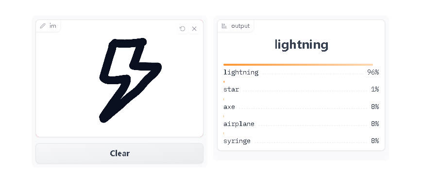

* 一个**抽取式回答**模型，它接受上下文段落和一个任务并输出一个结果和一个概率分数（我们在第八章中讨论了这种模型）：

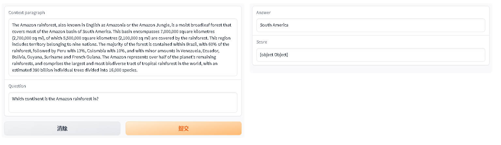

* 一个**背景去除**模型，它接收图像并输出去除背景的图像：


本章分为两个部分，包括 `概念` 和 `应用程序` 。在你了解每个部分的概念后，你可以使用它来构建特定类型的演示，范围从图像分类到语音识别。当你读完本章时，你将能够用几行 Python 代码构建这些演示（以及更多自定义的内容！）。

👀 浏览 [Hugging Face Spaces](https://huggingface.co/spaces)(https://huggingface.co/spaces) 以查看机器学习社区构建的许多机器学习演示的最新示例！

## 10.1 使用Graadio构建演示 

让我们从安装 Gradio 开始吧！由于它是一个 Python 包，只需运行：

```python
pip install gradio

```

你可以在任何地方运行 Gradio，无论是从你最喜欢的 Python IDE、Jupyter notebook 还是 Google Colab 🤯！

所以无论你在哪里运行 Python，都可以安装 Gradio！

让我们从一个简单的“Hello World”示例开始，熟悉 Gradio 语法：

```python
import gradio as gr

def greet(name):
    return "Hello " + name

demo = gr.Interface(fn=greet, inputs="text", outputs="text")

demo.launch()
```

让我们逐步解释上面的代码：

- 首先，我们定义一个名为 `greet()` 的函数。在这个例子中，它是一个在你的名字前添加“Hello”的简单函数，但它可以是任何的 Python 函数。例如，在机器学习的应用程序中，该函数会调用模型对输入进行预测并返回输出。
- 然后，我们创建一个带有三个参数 `fn` 、 `inputs` 和 `outputs` 的 Gradio `Interface` 。这些参数定义了预测函数，以及我们想要的输入和输出组件的类型。在我们的例子中，两个组件都是简单的文本框。
- 然后我们在我们创建的 `Interface` 上的 `launch()` 方法。

如果你运行这段代码，下面的界面会自动出现在 Jupyter/Colab notebook 中，或者在浏览器中弹出 ** [http://localhost:7860](http://localhost:7860)(http://localhost:7860) ** 如果运行 从一个脚本。

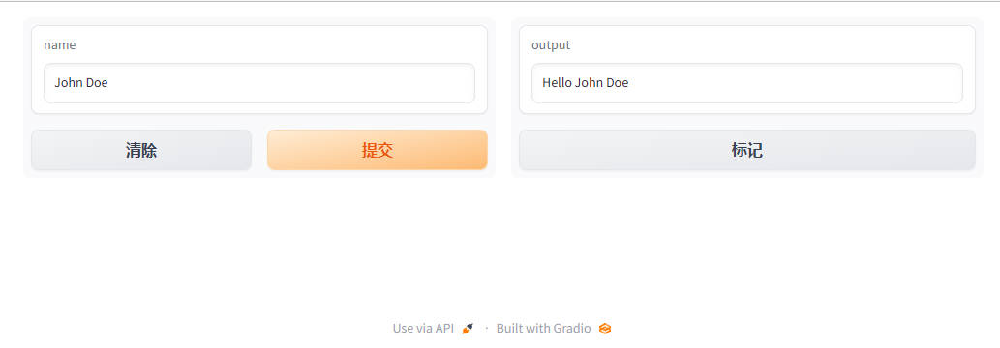

现在，试着使用你自己的名字或其他输入来使用这个 GUI！

你会注意到，在这个 GUI 中，Gradio 自动推断输入参数的名称 （ `name` ）并将其设置为文本框顶部的标签。如果你想改变它怎么办？或者，如果你想以其他方式自定义文本框？在这种情况下，你可以实例化一个表示输入组件的类对象。

看看下面的例子：

```python
import gradio as gr

def greet(name):
    return "Hello " + name

# 我们将文本框类实例化
textbox = gr.Textbox(label="Type your name here:", placeholder="John Doe", lines=2)

gr.Interface(fn=greet, inputs=textbox, outputs="text").launch()
```

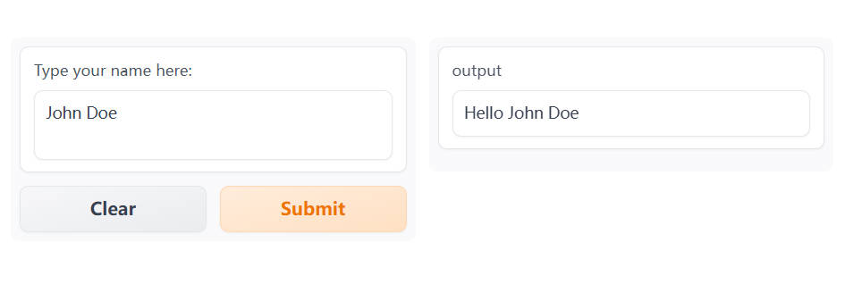

在这里，我们创建了一个带有标签、占位符和固定行数的输入文本框。你可以对输出文本框做同样的操作，但我们现在先不管它。

我们已经看到，只需几行代码，Gradio 就能让你围绕任何函数创建一个简单的界面，无论它有什么样的输入或输出。在本节中，我们从一个简单的文本框开始，但在接下来的节中，我们将介绍其他类型的输入和输出。现在让我们看一下如何在 Gradio 应用中包含一些自然语言处理（NLP）。

### 🤖 包括模型预测 

现在让我们构建一个简单的界面，让你可以演示像 GPT-2 这样的**文本生成**模型。

我们将使用 Transformers 中的 `pipeline()` 函数加载我们的模型。
如果你需要快速复习，你可以返回到第二章。

首先，我们定义一个预测函数，它接收一个文本提示并返回文本完成的结果：

```python
from transformers import pipeline

model = pipeline("text-generation")

def predict(prompt):
    completion = model(prompt)[0]["generated_text"]
    return completion
```

此函数完成你提供的提示，你可以使用自己的输入提示运行它以查看它是如何运行的。这是一个示例（你可能会得到不同的输出）：

```python
predict("My favorite programming language is")
```

```python
>> My favorite programming language is Haskell. I really enjoyed the Haskell language, but it doesn't have all the features that can be applied to any other language. For example, all it does is compile to a byte array.
```

现在我们有了一个生成预测的函数，我们可以像之前一样创建和启动一个 `Interface` ：

```python
import gradio as gr

gr.Interface(fn=predict, inputs="text", outputs="text").launch()
```

就是这样！你现在可以使用此接口使用 GPT-2 模型生成文本，如下所示 🤯：

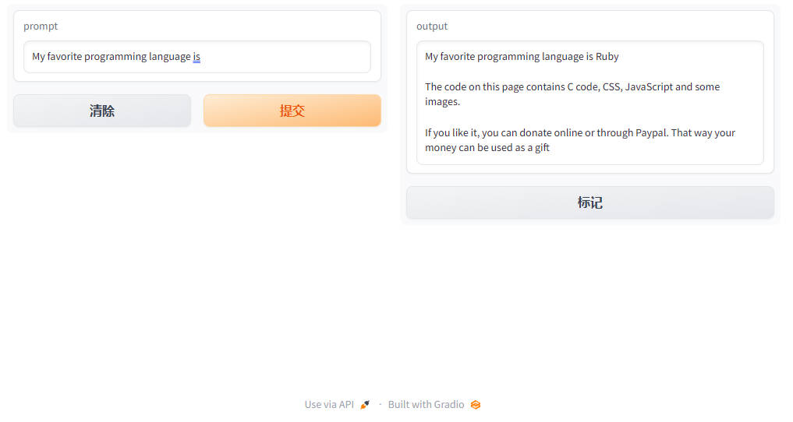

继续阅读以了解如何使用 Gradio 构建其他类型的演示！

## 10.2 了解 `Interface` 类

在这一节中，我们将更详细地了解 `Interface` 类，并理解创建 `Interface` 时使用的主要参数。

### 如何创建 `Interface`

你会注意到 `Interface` 类有 3 个必需参数： `Interface(fn, inputs, outputs, ...)` 

这些参数是：

- `fn` ：由 Gradio 包装的预测函数。该函数可以接受一个或多个参数并返回一个或多个值
- `inputs` ：输入组件类型。Gradio 提供了许多预构建的组件，例如 `image` 或 `mic` 。
- `outputs` ：输出组件类型。同样，Gradio 提供了许多预构建的组件，例如 `image` 或 `label` 。

有关组件的完整列表请参阅 [Gradio 文档](https://gradio.app/docs)(https://gradio.app/docs) 。每个预构建的组件都可以通过实例化该组件对应的类来定制。

例如，正如我们在前一小节中看到的，你可以将一个 `Textbox(lines=7, label="Prompt")` 组件传递给 `inputs` 参数，而不是将 `"textbox"` 传递进去，这样就可以创建一个包含 7 行和一个标签的文本框。

让我们看另一个例子，这次是一个 `Audio` 组件。

### 一个带音频的简单示例

如前所述，Gradio 提供了许多不同的输入和输出组件。因此，让我们构建一个适用于音频的 `Interface` 。

在这个例子中，我们将构建一个音频到音频的函数，它需要一个音频文件并简单地反转它。

我们将使用 `Audio` 组件作为输入。使用 `Audio` 组件时，你可以指定希望音频的 `source` 是用户上传的文件还是用户录制声音的麦克风。在个例子中，让我们将其设置为“麦克风”。只是为了好玩，我们会在我们的 `Audio` 上添加一个标签，上面写着“Speak here.”。

此外，我们希望将音频作为 numpy 数组接收，以便我们可以轻松地“反转”它。所以我们将 `"type"` 设置为 `"numpy"` ，它会传递输入 data 作为 `(sample_rate,data)` 的元组进入我们的函数。

我们还将使用 `Audio` 输出组件，它可以自动将具有采样率和音频数据的 numpy 数组渲染为可播放的音频文件。在这种情况下，我们不需要进行任何自定义，所以我们将传递一个字符串 `"audio"` 。

```python
import numpy as np
import gradio as gr

def reverse_audio(audio):
    sr, data = audio
    reversed_audio = (sr, np.flipud(data))
    return reversed_audio

mic = gr.Audio(source="microphone", type="numpy", label="Speak here...")
gr.Interface(reverse_audio, mic, "audio").launch()
```

上面的代码将生成一个如下所示的界面：

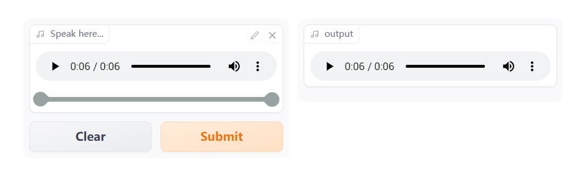

现在你可以录制你的声音并听到自己说话的倒放了 - 神奇 👻！

### 处理多个输入和输出

假设我们有一个更复杂的函数，有多个输入和输出。在下面的示例中，我我们有一个函数，它接收一个下拉框索引、一个滑块值和一个数字，并返回一个音乐音调的音频样本。

看看我们如何传递输入和输出组件列表，看看你能不能理解正在发生的事情。

关键在于当你传递：

* 输入组件列表，每个组件依次对应一个参数。
* 输出组件列表，每个组件对应一个返回值。

下面的代码片段显示了三个输入组件如何与 `generate_tone()` 函数的三个参数对齐：

```python
import numpy as np
import gradio as gr

notes = ["C", "C#", "D", "D#", "E", "F", "F#", "G", "G#", "A", "A#", "B"]

def generate_tone(note, octave, duration):
    sr = 48000
    a4_freq, tones_from_a4 = 440, 12 * (octave - 4) + (note - 9)
    frequency = a4_freq * 2 ** (tones_from_a4 / 12)
    duration = int(duration)
    audio = np.linspace(0, duration, duration * sr)
    audio = (20000 * np.sin(audio * (2 * np.pi * frequency))).astype(np.int16)
    return (sr, audio)

gr.Interface(
    generate_tone,
    [
        gr.Dropdown(notes, type="index"),
        gr.Slider(minimum=4, maximum=6, step=1),
        gr.Textbox(type="number", value=1, label="Duration in seconds"),
    ],
    "audio",
).launch()
```

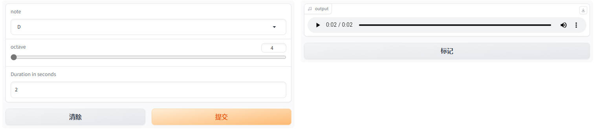

#### `launch()` 方法

到目前为止，我们已经使用了 `launch()` 方法来启动界面，但是我们
还没有真正讨论过它的作用。

默认情况下， `launch()` 方法将在本地运行一个 Web 服务器来启动演示。如果你在 Jupyter 或 Colab Notebook 中运行代码，那么 Gradio 会将演示 GUI 嵌入到 Notebook 中，以便你轻松使用它。

你可以通过不同的参数自定义 `launch()` 的行为：

  - `inline` ——  是否在 Python Notebook 中内联显示接口。
  - `inbrowser` —— 是否在默认浏览器的新标签页中自动启动接口．
  - `share` ——  是否为接口从你的计算机创建一个公开可共享的链接。有点像 Google Drive 的链接！

我们将在下一节中更详细地介绍 `share` 参数！

### ✏️ 让我们实践一下！

让我们构建一个演示语音识别模型的界面。为了让它变得有趣，我们将接受麦克风输入或上传的文件。

像往常一样，我们将使用 Transformers 中的 `pipeline()` 函数加载我们的语音识别模型。如果你需要快速复习回顾，你可以返回第二章。接下来，我们将实现一个 `transcribe_audio()` 函数来处理音频并返回转录。最后，我们将把这个函数包装在一个 `Interface` 中，其中 `Audio` 组件用于输入，只有文本用于输出。总而言之，此应用程序的代码如下：

```python
from transformers import pipeline
import gradio as gr

model = pipeline("automatic-speech-recognition")

def transcribe_audio(mic=None, file=None):
    if mic is not None:
        audio = mic
    elif file is not None:
        audio = file
    else:
        return "You must either provide a mic recording or a file"
    transcription = model(audio)["text"]
    return transcription

gr.Interface(
    fn=transcribe_audio,
    inputs=[
        gr.Audio(source="microphone", type="filepath", optional=True),
        gr.Audio(source="upload", type="filepath", optional=True),
    ],
    outputs="text",
).launch()
```

上面的代码将生成一个如下所示的界面：

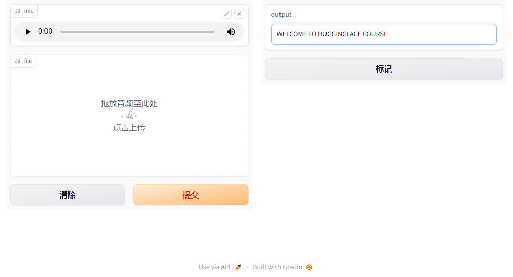

就是这样！现在你可以使用这个界面来转录音频了。请注意，通过将 `optional` 参数设置为 `True` ，用户就可以提供麦克风的实时录音或音频文件（或两者都不提供，但这将返回错误消息）。

继续阅读，了解如何与他人分享你的接口！

## 10.3 与他人分享演示 

现在你已经构建了一个演示，你可能希望与其他人分享它。Gradio 演示可以通过两种方式进行分享：使用 **临时共享链接** 或 **在 Spaces 上永久托管**。

我们将很快介绍这两种方法。但在分享演示之前，你可能需要完善它 💅。

#### 打磨你的 Gradio 演示：

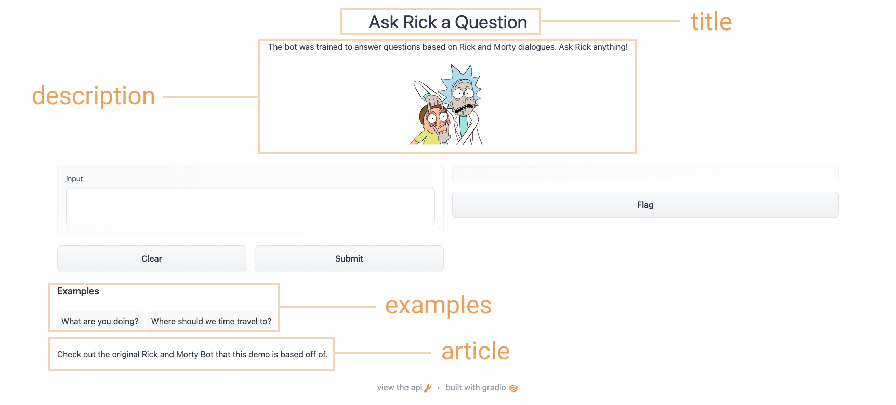

为了给你的演示添加额外的内容， `Interface` 类支持一些可选参数：
    - `title` ：你可以给你的演示一个标题，它出现在输入和输出组件的上方。
    - `description` ：你可以为界面提供描述（以文本、Markdown 或 HTML 形式），显示在输入和输出组件的上方和标题下方。
    - `article` ：你还可以编写扩展文章（以文本、Markdown 或 HTML 形式）来解释界面。如果提供，它会出现在输入和输出组件的下方。
    - `theme` ：不喜欢默认颜色？主题可以设置为 `default` 、 `huggingface` 、 `grass` 、 `peach` 之一。你还可以添加 `dark-` 前缀，例如 `dark-peach` 用于深色主题（或者仅使用 `dark` 表示默认的深色主题）。
    - `examples` ：为了让你的演示更易于使用，你可以为函数提供一些示例输入。它们出现在 UI 组件下方，可用于填充界面。示例应该作为多层的列表提供，外层列表包含每个示例，每个内层的列表包含与每个输入组件对应的输入。
    - `live` ：如果你想使你的演示“实时”反馈，即每次输入更改时模型重新运行，你可以设置 `live=True` 。这对运行比较快的模型很有意义（我们将在本节末尾看到一个示例）

使用上述选项，我们得到了一个更完整的界面。运行以下代码，你可以与 Rick 和 Morty 进行对话：

```python
title = "Ask Rick a Question"
description = """
The bot was trained to answer questions based on Rick and Morty dialogues. Ask Rick anything!

"""

article = "Check out [the original Rick and Morty Bot](https://huggingface.co/spaces/kingabzpro/Rick_and_Morty_Bot)(https://huggingface.co/spaces/kingabzpro/Rick_and_Morty_Bot) that this demo is based off of."

gr.Interface(
    fn=predict,
    inputs="textbox",
    outputs="text",
    title=title,
    description=description,
    article=article,
    examples=[["What are you doing?"], ["Where should we time travel to?"]],
).launch()
```

使用上面的选项，我们最终得到了一个更完整的界面。试试下面的界面：


#### 使用临时链接分享你的演示 

现在我们已经有了机器学习模型的工作演示，让我们学习如何轻松共享指向我们界面的链接。
通过在 `launch()` 方法中设置 `share=True` 可以轻松地公开共享接口：

```python
gr.Interface(classify_image, "image", "label").launch(share=True)
```

这会生成一个公开的、可共享的链接，你可以将其发送给任何人！当你发送此链接时，另一方的用户可以在浏览器中试用该模型，时间长达 72 小时。因为处理发生在你的设备上（只要你的设备保持开启！），你不必担心打包任何依赖项。如果你使用 Google Colab 笔记本工作，则始终会自动创建共享链接。它通常看起来像这样：**XXXXX.gradio.app**。虽然链接是通过 Gradio 链接提供的，但我们只是你本地服务器的代理，不会存储通过接口发送的任何数据。

但是请记住，这些链接是可公开访问的，这意味着任何人都可以使用你的模型进行预测！因此，请确保不要使用你编写的函数公开任何敏感信息，也不要允许其中的代码对你的设备进行任何重要更改。如果设置 `share=False` （默认值），则仅创建本地链接。

#### 在 Hugging Face Spaces 上托管你的演示 

可以传递给同事的共享链接很酷，但是如何永久托管你的演示并使其在互联网上具有自己的“space”呢？

Hugging Face Spaces 提供了在互联网上永久托管你的 Gradio 模型的基础设施，**完全免费**！你可以将你创建 Space 推送到（公共或私有）仓库，在其中，你的 Gradio 界面代码将存在于一个 `app.py` 文件中。 [阅读分步教程](https://huggingface.co/blog/gradio-spaces)(https://huggingface.co/blog/gradio-spaces) 以开始使用。

### ✏️ 让我们实现它！

使用到目前为止我们在各节中学到的知识，让我们创建我们在本章第一节中看到的草图识别演示。让我们为我们的界面添加一些自定义并设置 `share=True` 以创建一个我们可以传递的公共链接。

根据我们在前面章节中学到的内容，让我们创建一个在本章第一节中看到的手写草图识别演示。我们可以对界面进行一些自定义，并设置 `share=True` 以创建一个可以共享给他人的公共链接。

我们可以从 [class_names.txt](https://huggingface.co/spaces/dawood/Sketch-Recognition/blob/main/class_names.txt)(https://huggingface.co/spaces/dawood/Sketch-Recognition/blob/main/class_names.txt) 加载标签，并从 [pytorch_model.bin](https://huggingface.co/spaces/dawood/Sketch-Recognition/blob/main/pytorch_model.bin)(https://huggingface.co/spaces/dawood/Sketch-Recognition/blob/main/pytorch_model.bin) 加载预训练的 pytorch 模型。通过点击链接并单击文件预览左上角的下载来下载这些文件。让我们看看下面的代码，看看我们如何使用这些文件来加载模型并创建一个 `predict()` 函数：
```python
from pathlib import Path
import torch
import gradio as gr
from torch import nn

LABELS = Path("class_names.txt").read_text().splitlines()

model = nn.Sequential(
    nn.Conv2d(1, 32, 3, padding="same"),
    nn.ReLU(),
    nn.MaxPool2d(2),
    nn.Conv2d(32, 64, 3, padding="same"),
    nn.ReLU(),
    nn.MaxPool2d(2),
    nn.Conv2d(64, 128, 3, padding="same"),
    nn.ReLU(),
    nn.MaxPool2d(2),
    nn.Flatten(),
    nn.Linear(1152, 256),
    nn.ReLU(),
    nn.Linear(256, len(LABELS)),
)
state_dict = torch.load("pytorch_model.bin", map_location="cpu")
model.load_state_dict(state_dict, strict=False)
model.eval()

def predict(im):
    x = torch.tensor(im, dtype=torch.float32).unsqueeze(0).unsqueeze(0) / 255.0
    with torch.no_grad():
        out = model(x)
    probabilities = torch.nn.functional.softmax(out[0], dim=0)
    values, indices = torch.topk(probabilities, 5)
    return {LABELS[i]: v.item() for i, v in zip(indices, values)}
```

现在我们有了一个 `predict()` 函数。下一步是定义并启动我们的 gradio 界面：

```python
interface = gr.Interface(
    predict,
    inputs="sketchpad",
    outputs="label",
    theme="huggingface",
    title="Sketch Recognition",
    description="Who wants to play Pictionary? Draw a common object like a shovel or a laptop, and the algorithm will guess in real time!",
    article="<p style='text-align: center'>Sketch Recognition | Demo Model</p>",
    live=True,
)
interface.launch(share=True)
```

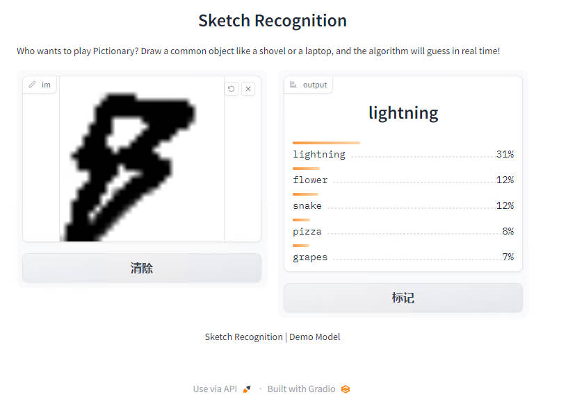

注意 `Interface` 中设置了 `live=True` 参数，这意味着每当有人在画板上绘制时，草图演示都会进行预测（无需提交按钮！）。

此外，我们还在 `launch()` 方法中设置了 `share=True` 参数。这将创建一个公共链接，你可以发送给任何人！当你发送此链接时，对方可以尝试草图识别模型。重申一下，你还可以在 Hugging Face Spaces 上托管模型，这就是我们在网页上面演示的方式。

接下来，我们将介绍 Gradio 可用于 Hugging Face 生态系统的其他方式！

## 10.4 与 Hugging Face Hub 集成 

为了让使用模型更轻松，Gradio 直接与 Hugging Face Hub 和 Hugging Face Spaces 集成。你可以仅使用一行代码从 Hub 和 Spaces 加载演示。

#### 从 Hugging Face Hub 加载模型 

首先，在第五章中所述的 Hugging Face 提供的数千个模型中选择一个。

使用特殊的 `Interface.load()` 方法，你可以传递 `"model/"` （或等效的 `"huggingface/"` ） 后跟模型名称。例如，下面的代码是使用 [GPT-J](https://huggingface.co/EleutherAI/gpt-j-6B)(https://huggingface.co/EleutherAI/gpt-j-6B) 构建的一个演示，它是一个大型语言模型，添加了一些示例输入：

```python
import gradio as gr

title = "GPT-J-6B"
description = "Gradio Demo for GPT-J 6B, a transformer model trained using Ben Wang's Mesh Transformer JAX. 'GPT-J' refers to the class of model, while '6B' represents the number of trainable parameters. To use it, simply add your text, or click one of the examples to load them. Read more at the links below."
article = "<p style='text-align: center'><a href='https://github.com/kingoflolz/mesh-transformer-jax' target='_blank'>GPT-J-6B: A 6 Billion Parameter Autoregressive Language Model</a></p>"
examples = [
    ["The tower is 324 metres (1,063 ft) tall,"],
    ["The Moon's orbit around Earth has"],
    ["The smooth Borealis basin in the Northern Hemisphere covers 40%"],
]
gr.Interface.load(
    "huggingface/EleutherAI/gpt-j-6B",
    inputs=gr.Textbox(lines=5, label="Input Text"),
    title=title,
    description=description,
    article=article,
    examples=examples,
    enable_queue=True,
).launch()
```
    
上述代码将生成以下界面：

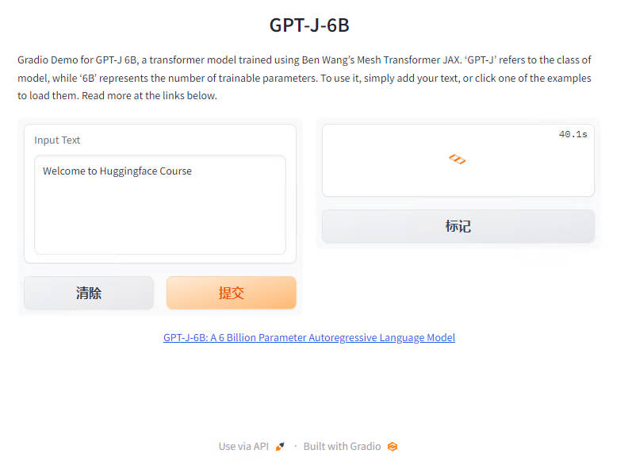

以这种方式加载模型使用的是 Hugging Face 的 [Inference API](https://huggingface.co/inference-api)(https://huggingface.co/inference-api) ，而不是将模型加载到内存中。这对于像 GPT-J 或 T0pp 这样需要大量 RAM 的大型模型是最理想的方式。

#### 从 Hugging Face Spaces 空间加载 

要从 Hugging Face Hub 加载并在本地重新创建任何 Space，你可以将 `spaces/` 传递给 `Interface` ，然后跟上 Space 的名称。

还记得第 1 节中删除图像背景的演示吗？让我们从 Hugging Face Spaces 加载它：

```python
gr.Interface.load("spaces/abidlabs/remove-bg").launch()
```


从Hub 或 Spaces 加载演示的一个很酷的地方是，你可以通过覆盖任何参数来进行一些自定义的调整。在这里，我们添加一个标题并将输入改为了网络摄像头：

```python
gr.Interface.load(
    "spaces/abidlabs/remove-bg", inputs="webcam", title="Remove your webcam background!"
).launch()
```

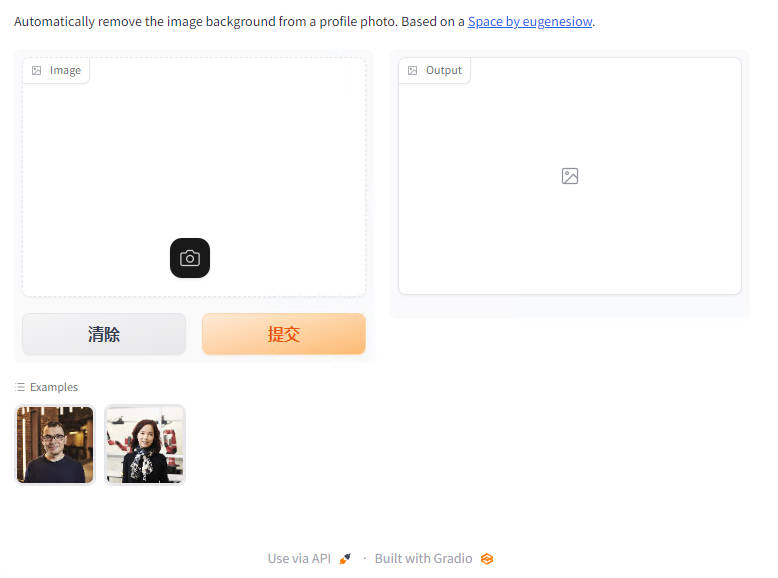

现在我们已经探索了一些将 Gradio 与 hugs Face Hub 集成的方法，让我们来看看 `Interface` 类的一些高级功能。这就是下一节的主题！

## 10.5 Interface 的高级功能 

现在我们已经能够构建和共享基本界面，让我们来探索一些更高级的功能，比如状态和解释。

#### 使用状态保存数据 

Gradio 支持会话状态，在页面加载期间跨多次提交保留数据。会话状态对于构建聊天机器人等需要在用户与模型交互时保持数据的演示非常有用。请注意，会话状态不会在不同用户之间共享数据。

要将数据存储在会话状态中，你需要做三件事：

1. 向函数中传递一个额外的参数，该参数表示接口的状态。
2. 在函数结束时，将状态的更新值作为额外的返回值返回。
3. 在创建 `Interface` 时添加 `state` 输入和 `state` 输出组件。

请参考下面的聊天机器人示例：

```python
import random

import gradio as gr

def chat(message, history):
    history = history or []
    if message.startswith("How many"):
        response = random.randint(1, 10)
    elif message.startswith("How"):
        response = random.choice(["Great", "Good", "Okay", "Bad"])
    elif message.startswith("Where"):
        response = random.choice(["Here", "There", "Somewhere"])
    else:
        response = "I don't know"
    history.append((message, response))
    return history, history

iface = gr.Interface(
    chat,
    ["text", "state"],
    ["chatbot", "state"],
    allow_screenshot=False,
    allow_flagging="never",
)
iface.launch()
```

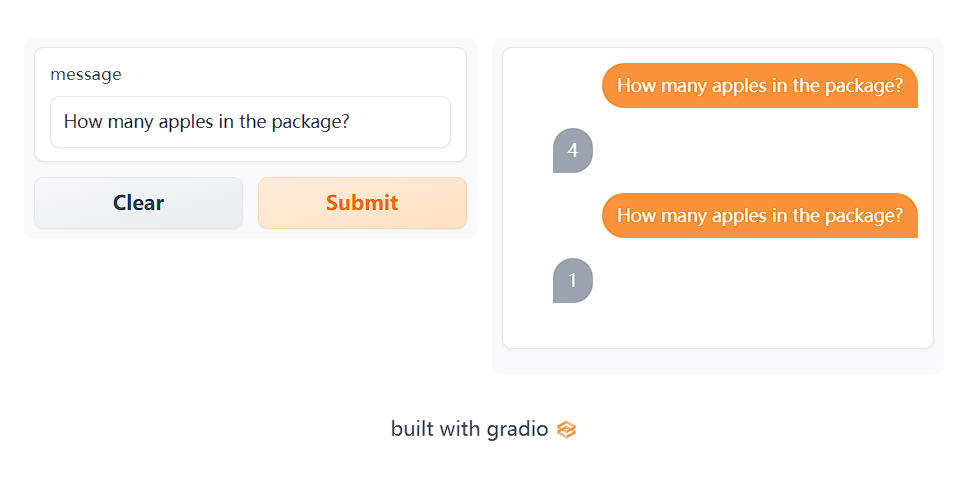

请注意，输出组件的状态在多次提交之间保持不变。
注：你可以向状态参数传递一个默认值，该值将用作状态的初始值。

#### 通过解释来理解预测 

大多数机器学习模型都是黑盒子，函数的内部逻辑对终端用户是隐藏的。为了提高透明度，我们设计了一个功能使得为模型添加解释非常简单，只需将 Interface 类中的 interpretation 关键字设置为 `default` 即可。这样，你的用户就可以理解输入的哪些部分对输出有影响。请看下面的简单界面示例，它显示了一个带有解释功能的图像分类器：

```python
import requests
import tensorflow as tf

import gradio as gr

inception_net = tf.keras.applications.MobileNetV2()  # 加载模型

# 下载 ImageNet 的可读标签
response = requests.get("https://git.io/JJkYN")
labels = response.text.split("\n")

def classify_image(inp):
    inp = inp.reshape((-1, 224, 224, 3))
    inp = tf.keras.applications.mobilenet_v2.preprocess_input(inp)
    prediction = inception_net.predict(inp).flatten()
    return {labels[i]: float(prediction[i]) for i in range(1000)}

image = gr.Image(shape=(224, 224))
label = gr.Label(num_top_classes=3)

title = "Gradio Image Classifiction + Interpretation Example"
gr.Interface(
    fn=classify_image, inputs=image, outputs=label, interpretation="default", title=title
).launch()
```

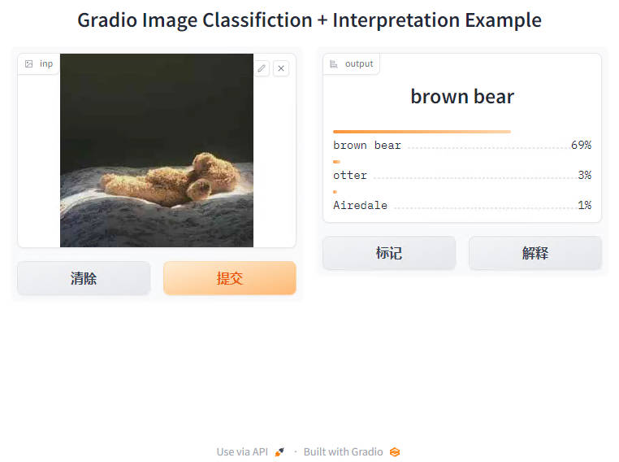

提交一个输入，然后单击输出组件下的 Interpret 来测试解释功能。

除了 Gradio 提供的默认解释方法之外，你还可以在 `interpretation` 参数中指定 `shap` ，并设置 `num_shap` 参数。这将使用基于 Shapley 的解释方法，你可以在 [这里](https://christophm.github.io/interpretable-ml-book/shap.html)(https://christophm.github.io/interpretable-ml-book/shap.html) 阅读更多信息。最后，还可以将自己的解释函数传入 `interpretation` 参数。在 Gradio 的 [入门页面](https://gradio.app/getting_started/)(https://gradio.app/getting_started/) 中可以看到一个例子。

这就是我们对 Gradio 的 `Interface` 类的深入研究。正如我们所看到的，这个类使得用几行 Python 代码创建机器学习演示变得简单。然而，有时你会想通过改变布局或将多个预测函数链接在一起来定制你的 demo。如果我们能以某种方式将 `Interface` 拆分可定制的 “块”，那不是很好吗？幸运的是，我们可以做到！这是最后一节的主题。

## 10.6 Gradio Blocks 简介 

在之前的章节中，我们已经探索并使用 `Interface` 类创建了一些演示。在本章中，我们将介绍我们新开发的低级 API，名为 `gradio.Blocks` 。

现在， `Interface` 和 `Blocks` 之间有什么区别？

- ⚡ `Interface` ：一个高级 API，你只需提供输入和输出列表即可创建完整的机器学习演示。

- 🧱 `Blocks` ：一个低级的 API，你可以使用它来完全控制你的应用程序的数据流和布局。你可以使用 `Blocks` （类似于“构建的砖块”）构建非常复杂的多步骤应用程序。

#### 为什么要使用 Blocks 🧱？

正如我们在前几节中看到的，通过 `Interface` 类你使用几行代码轻松创建成熟的机器学习 demo。 `Interface` API 非常易于使用，但缺乏 `Blocks` API 提供的灵活性。例如，你可能想要：

- 将相关演示组合为一个 web 应用程序中的多个选项卡
- 更改 demo 的布局，例如指定输入和输出的位置
- 创建多步骤界面，其中一个模型的输出成为下一个模型的输入，或者通常具有更灵活的数据流
- 根据用户输入更改组件的属性 （例如，下拉列表中的选项） 或其可见性

我们将在下面探讨所有这些概念。

#### 使用块创建简单 demo 

安装 Gradio 后，将在 Python 脚本、Jupyter 笔记本或 Colab 笔记本运行下面的代码。

```python
import gradio as gr

def flip_text(x):
    return x[::-1]

demo = gr.Blocks()

with demo:
    gr.Markdown(
        """
    # Flip Text!
    Start typing below to see the output.
    """
    )
    input = gr.Textbox(placeholder="Flip this text")
    output = gr.Textbox()

    input.change(fn=flip_text, inputs=input, outputs=output)

demo.launch()
```
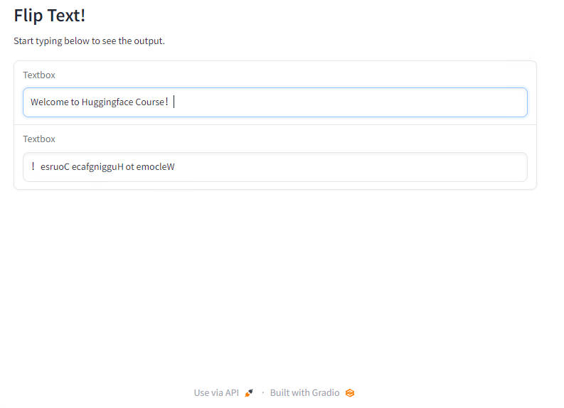

上述简单示例介绍了块的 4 个基本概念：

1. 通过在 `with gradio.Blocks` 上下文中实例化 Python 对象，Blocks 支持构建组合了 markdown、HTML、按钮和交互式组件的 Web 应用程序。
<div custom-style="Tip-green">

🙋如果你不熟悉 Python 中的 `with` 语句，我们建议你查看来自 Real Python 优秀的 [教程](https://realpython.com/python-with-statement)(https://realpython.com/python-with-statement) 后再回来查看。
</div>
实例化组件的顺序很重要，因为每个元素都按照创建的顺序渲染到 Web 应用程序中。（更复杂的布局将在下面讨论）

2. 你可以在代码中的任何位置定义常规 Python 函数，并指定 `Blocks` 在用户输入的情况下运行它们。在我们的示例中，我们使用了一个可以“翻转”输入的文本简单的函数，但你可以编写任何 Python 函数，从简单的计算到处理来自机器学习模型的预测等。

3. 你可以将事件指定给任何 `Blocks` 组件。这将在组件被单击、更改等情况下运行函数。当你分配一个事件时，你需要传入三个参数： `fn` ：应该被调用的函数， `inputs` ：输入组件（列表），以及 `outputs` ：应该被调用的输出组件（列表）。

   在上面的示例中，当名为 `input` 的 `Textbox` 中的值发生变化时，我们运行 `flip_text()` 函数。该事件读取 `input` 中的值，将其作为名称参数传递给 `flip_text()` ，然后它返回一个值，该值被分配给我们的第二个名为 `output` 的 `Textbox` 。

   要查看每个组件支持的事件列表，请参阅 Gradio [文档](https://www.gradio.app/docs)(https://www.gradio.app/docs) 。

4. Blocks 会根据你定义的事件触发器自动确定组件是否应该是交互式的 （接受用户输入）。在我们的示例中，第一个文本框是交互式的，因为它的值被 `flip_text()` 函数使用。第二个文本框不是交互式的，因为它的值从未用作输入。在某些情况下，你可能想要覆盖自动的判断，你可以通过传递一个布尔值给组件的 `interactive` 参数（例如 `gr.Textbox(placeholder="Flip this text", interactive=True)` ）。

#### 自定义演示的布局 

我们如何使用 `Blocks` 来定制我们的演示的布局？默认情况下， `Blocks` 在一列中垂直呈现创建的组件。你可以通过使用 `with gradio.Column():` 创建其他列或使用 `with gradio.Row():` 创建其他行，并且还可以在这些上下文中创建组件来更改布局。

你应该记住：在 `Column` 下创建的任何组件（这也是默认设置） 都将垂直布局。在 `Row` 下创建的任何组件都将水平布局，类似于 [Web 开发中的 flexbox 模型](https://developer.mozilla.org/en-US/docs/Web/CSS/CSS_Flexible_Box_Layout/Basic_Concepts_of_Flexbox)(https://developer.mozilla.org/en-US/docs/Web/CSS/CSS_Flexible_Box_Layout/Basic_Concepts_of_Flexbox) 。

最后，你还可以使用 `with gradio.Tabs()` 上下文管理器为你的 demo 创建选项卡。在此上下文中，你可以通过使用 `gradio.TabItem(name_of_tab):` 指定来创建多个选项卡。在 `gradio.TabItem(name_of_tab):` 中创建的任何组件都会出现在该选项卡中。

现在让我们在 demo 中添加一个 `flip_image()` 函数并添加一个翻转图像的新选项卡。下是具有 2 个选项卡并使用了一个 Row 的示例：

```python
import numpy as np
import gradio as gr

demo = gr.Blocks()

def flip_text(x):
    return x[::-1]

def flip_image(x):
    return np.fliplr(x)

with demo:
    gr.Markdown("Flip text or image files using this demo.")
    with gr.Tabs():
        with gr.TabItem("Flip Text"):
            with gr.Row():
                text_input = gr.Textbox()
                text_output = gr.Textbox()
            text_button = gr.Button("Flip")
        with gr.TabItem("Flip Image"):
            with gr.Row():
                image_input = gr.Image()
                image_output = gr.Image()
            image_button = gr.Button("Flip")

    text_button.click(flip_text, inputs=text_input, outputs=text_output)
    image_button.click(flip_image, inputs=image_input, outputs=image_output)

demo.launch()
```

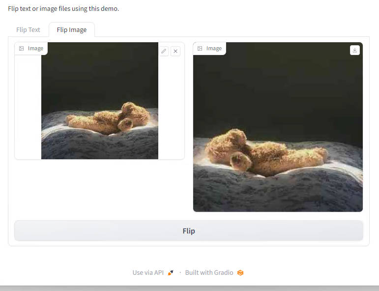

你会注意到，在这个示例中，我们还在每个选项卡中创建了一个 `Button` 组件，并且我们为每个按钮分配了一个点击事件，这是实际是运行了该事件对应的函数。

#### 探索事件和状态 

正如你可以控制布局一样， `Blocks` 可以让你对触发函数调用的事件进行细粒度控制。每个组件和许多布局都有它们支持的特定事件。

例如， `Textbox` 组件有两个事件： `change()` （当文本框内的值发生变化时），和 `submit()` （当用户在文本框上输入并按下回车键时）。更复杂的组件可以有更多的事件：例如， `Audio` 组件还具有播放音频文件、清除音频文件、暂停等各种独立事件。请参阅每个组件支持的事件的文档。

你可以将事件触发器附加到这些事件中的一个、多个或全部。你可以通过在组件实例中调用事件名称作为函数来创建一个事件触发器 —— 例如 `textbox.change(...)` 或 `btn.click(...)` 。如前所述，该函数接受三个参数：

- `fn` ：要运行的函数
- `inputs` ：应作为函数的输入参数提供的组件（列表）。每个组件的值按顺序映射到相应的函数参数。如果函数不带任何参数，则此参数可以为 None。
- `outputs` ：应根据函数返回的值更新的组件（列表）。每个返回值按顺序设置相应组件的值。如果函数不返回任何内容，则此参数可以为 None。

你甚至可以使输入和输出组件成为同一个组件，就像我们在这个使用 GPT 模型进行文本补全的示例中所做的那样：

```python
import gradio as gr

api = gr.Interface.load("huggingface/EleutherAI/gpt-j-6B")

def complete_with_gpt(text):
    # 使用文本的最后 50 个字符作为上下文
    return text[:-50] + api(text[-50:])

with gr.Blocks() as demo:
    textbox = gr.Textbox(placeholder="Type here and press enter...", lines=4)
    btn = gr.Button("Generate")

    btn.click(complete_with_gpt, textbox, textbox)

demo.launch()
```

#### 创建多步骤 demo 

在某些情况下，你可能需要一个多步骤演示，其中重用一个函数的输出作为下一个函数的输入。使用 `Blocks` 很容易做到这一点，因为你可以使用一个组件作为一个事件触发器的输入，但又作为另一个事件触发器的输出。看一下下面的示例，文本组件的值是语音转文本模型的结果，但也被传递到情感分析模型中：

```python
from transformers import pipeline

import gradio as gr

asr = pipeline("automatic-speech-recognition", "facebook/wav2vec2-base-960h")
classifier = pipeline("text-classification")

def speech_to_text(speech):
    text = asr(speech)["text"]
    return text

def text_to_sentiment(text):
    return classifier(text)[0]["label"]

demo = gr.Blocks()

with demo:
    audio_file = gr.Audio(type="filepath")
    text = gr.Textbox()
    label = gr.Label()

    b1 = gr.Button("Recognize Speech")
    b2 = gr.Button("Classify Sentiment")

    b1.click(speech_to_text, inputs=audio_file, outputs=text)
    b2.click(text_to_sentiment, inputs=text, outputs=label)

demo.launch()
```

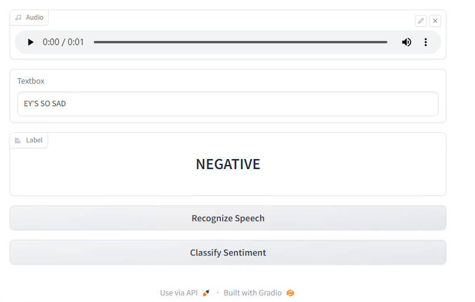

#### 更新组件属性 

到目前为止，我们已经了解了如何创建事件来更新另一个组件的值。但是，如果你想更改组件的其他属性，例如文本框的可见性或单选按钮组中的选项，又该怎么办呢？你可以通过返回组件类的 `update()` 方法而不是函数的常规返回值来做到这一点。

这很容易用一个例子来说明：

```python
import gradio as gr

def change_textbox(choice):
    if choice == "short":
        return gr.Textbox.update(lines=2, visible=True)
    elif choice == "long":
        return gr.Textbox.update(lines=8, visible=True)
    else:
        return gr.Textbox.update(visible=False)

with gr.Blocks() as block:
    radio = gr.Radio(
        ["short", "long", "none"], label="What kind of essay would you like to write?"
    )
    text = gr.Textbox(lines=2, interactive=True)

    radio.change(fn=change_textbox, inputs=radio, outputs=text)
    block.launch()
```

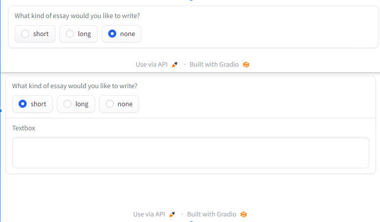

我们刚刚探索了 `Blocks` 的所有核心概念！就像 `Interfaces` 一样 你可以创建很酷的 demo，可以通过在 `launch()` 方法中使用 `share=True` 选项来共享，或者部署在 [Hugging Face Spaces](https://huggingface.co/spaces)(https://huggingface.co/spaces) 上。

## 10.7 Gradio，回顾！

关于使用 Gradio 构建酷炫的 ML 演示的章节到此结束 —— 希望你会喜欢！回顾一下，在本章中，我们学习了：

- 如何使用高级 `Interface` API 创建 Gradio 演示，以及如何配置不同的输入和输出模式。
- 使用临时链接或者托管在 [Hugging Face Spaces](https://huggingface.co/spaces)(https://huggingface.co/spaces) 上共享 Gradio 演示。
- 如何将 Gradio 演示与 Hugging Face Hub 上的 Model 和 Space 集成在一起。
- 高级功能，例如在演示中存储状态或提供身份验证等高级功能。
- 如何使用 Gradio Blocks 完全控制演示的数据流和布局。

如果你想测试你对本章所涵盖概念的理解，请查看下一节中的测验！

### 下一步去哪里？

如果你想了解有关 Gradio 的更多信息，你可以

- 看看仓库中的 [Demos](https://github.com/gradio-app/gradio/tree/main/demo)(https://github.com/gradio-app/gradio/tree/main/demo) ，那里有很多例子。
- 请参阅 [指南](https://gradio.app/guides)(https://gradio.app/guides) 页面，你可以在其中找到有关酷炫和高级功能的指南。
- 查看 [文档](https://gradio.app/docs)(https://gradio.app/docs) 页面了解详细信息。

### 章末测试 

####  1. 你能使用Gradio做什么？

1. 为自己的机器学习模型创建一个demo
2. 与他人分享你的机器学习模型
3. 调试模型
4. 训练你的模型

####  2. Gradio只能在 PyTorch 模型上工作

1. 正确
2. 不正确

####  3. 可以在哪里发布一个 Gradio 演示？

1. 标准的 python IDEs
2. Google Colab notebooks
3. Jupyter notebooks

####  4. Gradio 主要是为 NLP 模型设计的

1. 正确
2. 错误

####  5. 下列哪些特性是由 Gradio 支持的？

1. 多输入多输出
2. 数据持久性状态
3. 用户名和密码身份验证
4. 自动分析谁在使用你的 Gradio 演示
5. 从 HuggingFace 的模型中心或 HuggingFace Space 加载模型

####  6. 下列哪一种是从 Hub 或 Spaces 加载 Huggging Face 模型的有效方法？

1. `gr.Interface.load('huggingface/{user}/{model_name}')`
2. `gr.Interface.load('model/{user}/{model_name}')`
3. `gr.Interface.load('demos/{user}/{model_name}')`
4. `gr.Interface.load('spaces/{user}/{model_name}')`

####  7. 创建你的 Gradio 接口时，必须添加以下步骤：

1. 向预测函数中传入一个额外的参数，该参数表示接口的状态。
2. 在预测函数的末尾，将状态的更新值作为额外的返回值返回。
3. 在创建接口时添加状态输入和状态输出组件

####  8. Gradio 库包括以下哪些组件？

1. 文本框。
2. 图表。
3. 图像。
4. 音频。

####  9. 你可以使用 Gradio 做些什么？

1. 将多个演示合并到一个 Web 应用程序中
2. 将单击/更改/等事件触发器分配给`Blocks`组件
3. 自动确定哪些`Blocks`组件应该是交互的还是静态的
4. 创建多步演示; 这意味着你可以重用一个组件的输出作为下一个组件的输入

####  10. 你可以共享一个`Blocks`演示的公共链接，并在HuggingFace space创建一个`Blocks`的演示。

1. 正确
2. 不正确

### 解析

####  1. 你能使用Gradio做什么？

正确选项: 1. 为自己的机器学习模型创建一个demo

正确选项: 2. 与他人分享你的机器学习模型

正确选项: 3. 调试模型

1. 为自己的机器学习模型创建一个demo    
解析: 通过几行 Python 代码，你可以使用我们的预构建组件库为 ML 模型生成一个演示。
2. 与他人分享你的机器学习模型    
解析: 在启动方法中使用 <code> share = True </code> 参数，可以生成一个共享链接发送给任何人。
3. 调试模型    
解析: Gradio的一个优点是能够用真实数据测试模型，可以实时更改并观察模型的预测变化，从而帮助你调试模型。
4. 训练你的模型    
解析: 在你的模型被训练之后，Gradio 用来进行模型推理。

####  2. Gradio只能在 PyTorch 模型上工作

正确选项: 2. 不正确

1. 正确    
解析: Gradio 可以处理 PyTorch 模型，除此之外也可以处理任何类型的机器学习模型！
2. 不正确    
解析: Gradio 是不依赖模型的，这意味着你可以为任何类型的机器学习模型创建演示。

####  3. 可以在哪里发布一个 Gradio 演示？

正确选项: 1. 标准的 python IDEs

正确选项: 2. Google Colab notebooks

正确选项: 3. Jupyter notebooks

1. 标准的 python IDEs    
解析: Gradio可以在你最喜欢的 IDE 上运行得很好。
2. Google Colab notebooks    
解析: 你可以在你的 Google colab notebook 上创建并启动一个 demo。
3. Jupyter notebooks    
解析: 很好的选择 —— 你可以在你的 Jupyter notebook 创建并启动一个 demo。

####  4. Gradio 主要是为 NLP 模型设计的

正确选项: 2. 错误

1. 正确    
解析: Gradio 几乎可以处理包括 NLP 在内的所有的数据类型。
2. 错误    
解析: Gradio 为开发人员提供了一个库，其中包含几乎所有数据类型的预构建组件。

####  5. 下列哪些特性是由 Gradio 支持的？

正确选项: 1. 多输入多输出

正确选项: 2. 数据持久性状态

正确选项: 3. 用户名和密码身份验证

正确选项: 5. 从 HuggingFace 的模型中心或 HuggingFace Space 加载模型

1. 多输入多输出    
解析: 多输入多输出是可能的。你所需要做的就是将输入和输出的列表传递给它们相应的参数
2. 数据持久性状态    
解析: 可以在界面中添加状态。
3. 用户名和密码身份验证    
解析: 将用户名/密码元组的列表传递给 `launch()` 方法，可以添加身份验证。
4. 自动分析谁在使用你的 Gradio 演示    
解析: 再试一次 —— Gradio 不提供给开发人员关于谁使用他们的演示的分析。
5. 从 HuggingFace 的模型中心或 HuggingFace Space 加载模型    
解析: 正确 —— 使用 <code>gr.Interface.load ()</code> 方法可以加载任何 Hugging Face 模型

####  6. 下列哪一种是从 Hub 或 Spaces 加载 Huggging Face 模型的有效方法？

正确选项: 1. `gr.Interface.load('huggingface/{user}/{model_name}')`

正确选项: 2.` gr.Interface.load('model/{user}/{model_name}')`

正确选项: 4. `gr.Interface.load('spaces/{user}/{model_name}')`

1. `gr.Interface.load('huggingface/{user}/{model_name}')`
解析: 这是从 Hub 加载 Hugging Face 模型的有效方法
2. `gr.Interface.load('model/{user}/{model_name}')`
解析: 这是从 Hub 加载 Hugging Face 模型的有效方法
3. `gr.Interface.load('demos/{user}/{model_name}')`    
解析: 再试一次——你不能使用'demos'前缀来加载模型。
4. `gr.Interface.load('spaces/{user}/{model_name}')`    
解析: 这是从 Space 加载 Hugging Face 模型的有效方法

####  7. 创建你的 Gradio 接口时，必须添加以下步骤：

正确选项: 1. 向预测函数中传入一个额外的参数，该参数表示接口的状态。

正确选项: 2. 在预测函数的末尾，将状态的更新值作为额外的返回值返回。

正确选项: 3. 在创建接口时添加状态输入和状态输出组件

1. 向预测函数中传入一个额外的参数，该参数表示接口的状态。    
解析: 需要一个额外的参数来存储接口的历史记录或状态。
2. 在预测函数的末尾，将状态的更新值作为额外的返回值返回。    
解析: 此历史记录或状态值需要由函数返回。
3. 在创建接口时添加状态输入和状态输出组件    
解析: Gradio 提供了一个状态输入和输出组件来持久存储数据。

####  8. Gradio 库包括以下哪些组件？

正确选项: 1. 文本框。

正确选项: 3. 图像。

正确选项: 4. 音频。

1. 文本框。    
解析: 是的，可以使用 Textbox 组件创建文本框。
2. 图表。    
解析: 目前没有图表组件。
3. 图像。    
解析: 是的，你可以使用 Image 组件创建一个图像上传小部件。
4. 音频。    
解析: 是的，你可以使用 Audio 组件创建一个音频上传小部件。

####  9. 你可以使用 Gradio 做些什么？

正确选项: 1. 将多个演示合并到一个 Web 应用程序中

正确选项: 2. 将单击/更改/等事件触发器分配给`Blocks`组件

正确选项: 3. 自动确定哪些`Blocks`组件应该是交互的还是静态的

正确选项: 4. 创建多步演示; 这意味着你可以重用一个组件的输出作为下一个组件的输入

1. 将多个演示合并到一个 Web 应用程序中    
解析: 你可以使用`with gradio.Tabs ():`来为多个演示添加选项卡
2. 将单击/更改/等事件触发器分配给`Blocks`组件    
解析: 在分配事件时，传入三个参数: fn: 应该调用的函数、inputs: 组件的输入(list)和outputs: 应该调用组件的输出(list)。
3. 自动确定哪些`Blocks`组件应该是交互的还是静态的    
解析: 根据你定义的事件触发器，`Blocks`自动计算出组件是否应该接受用户输入。
4. 创建多步演示; 这意味着你可以重用一个组件的输出作为下一个组件的输入    
解析: 你可以使用组件作为一个事件触发器的输入，但作为另一个事件触发器的输出。

####  10. 你可以共享一个`Blocks`演示的公共链接，并在HuggingFace space创建一个`Blocks`的演示。

正确选项: 1. 正确

正确选项: 2. 不正确

1. 正确    
解析: 就像`Interface`一样，所有的共享和托管功能对于`Blocks`演示都是一样的！
2. 不正确    
解析: 就像`Interface`一样，所有的共享和托管功能对于`Blocks`演示都是一样的！
